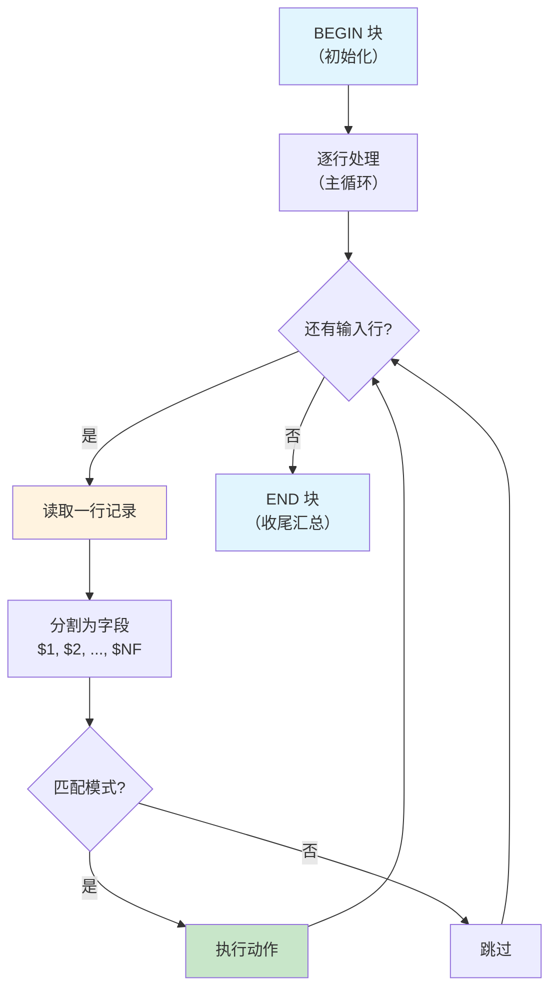
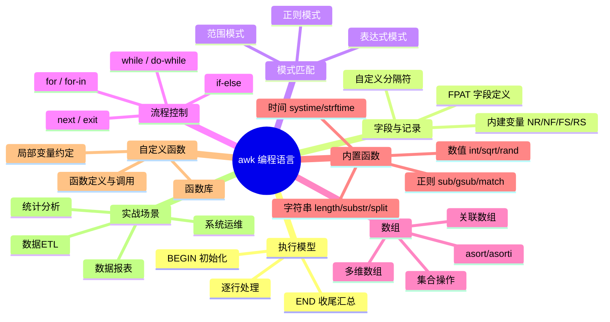

# awk 编程语言

awk 不仅是文本处理工具，更是一门完整的编程语言——它由 Aho、Weinberger、Kernighan 三位 Unix 先驱于 1977 年设计，名字即取自三人首字母。awk 拥有变量、数组、函数、流程控制，能完成从简单字段提取到复杂数据报表的一切任务。本文从 awk 执行模型出发，逐步深入到高级编程特性。

## 1. awk 工作原理

### 1.1 执行模型

awk 程序的执行分为三个阶段：



```bash
# awk 程序结构
awk 'BEGIN{ 初始化 } /模式/{ 动作 } END{ 收尾 }' 文件

# 三段式示例
awk '
BEGIN {
    print "=== 报表开始 ==="
    total = 0
}
{
    total += $3        # 累加第3列
}
END {
    print "总计:", total
    print "=== 报表结束 ==="
}' data.txt
```

### 1.2 awk 版本

| 版本 | 说明 | 常见系统 |
|------|------|----------|
| awk | 原始版（1977） | 几乎所有 Unix |
| nawk | 新版 awk（1985） | Solaris 等 |
| gawk | GNU awk | Linux 默认 |
| mawk | 轻量快速 awk | Ubuntu 默认 |

```bash
# 查看当前 awk 版本
awk --version          # gawk: GNU Awk 5.2.2
awk -W version         # mawk: mawk 1.3.4

# 注意：Ubuntu 默认的 mawk 不支持某些 gawk 扩展
# 可切换为 gawk
sudo update-alternatives --config awk
```

::: tip gawk vs mawk
- **mawk**：速度快，适合大数据量简单处理
- **gawk**：功能全，支持 `strftime`、`FPAT`、`BEGINFILE/ENDFILE` 等扩展
- 生产脚本建议指定 `gawk` 或 `awk` 并测试兼容性
:::

### 1.3 命令行语法

```bash
# 基本语法
awk '模式{动作}' 文件

# 从脚本文件执行
awk -f script.awk 文件

# 指定字段分隔符
awk -F',' '{print $1}' data.csv
awk -F'\t' '{print $1}' data.tsv

# 设置变量
awk -v var=value '{print var, $1}' file

# 多文件处理
awk '{print FILENAME, NR, $0}' file1 file2

# 从管道读取
cat file | awk '{print $1}'
ps aux | awk '$3 > 5.0 {print $11}'
```

## 2. 字段与记录

### 2.1 内建变量一览

| 变量 | 含义 | 默认值 |
|------|------|--------|
| `$0` | 当前整行记录 | - |
| `$1`~`$n` | 第 n 个字段 | - |
| `NR` | 已读取的总行号（Number of Records） | - |
| `NF` | 当前行的字段数（Number of Fields） | - |
| `FNR` | 当前文件的行号 | - |
| `FS` | 输入字段分隔符 | 空格/Tab |
| `RS` | 输入记录分隔符 | 换行符 |
| `OFS` | 输出字段分隔符 | 空格 |
| `ORS` | 输出记录分隔符 | 换行符 |
| `FILENAME` | 当前文件名 | - |
| `ARGC` | 命令行参数个数 | - |
| `ARGV` | 命令行参数数组 | - |
| `SUBSEP` | 数组下标分隔符 | `\034` |
| `RSTART` | match() 匹配的起始位置 | - |
| `RLENGTH` | match() 匹配的长度 | - |
| `ENVIRON` | 环境变量关联数组 | - |
| `CONVFMT` | 数字转换格式 | `%.6g` |
| `OFMT` | 数字输出格式 | `%.6g` |

### 2.2 字段操作

```bash
# 打印指定字段
echo 'Alice 85 90 78' | awk '{print $1, $2}'      # Alice 85
echo 'Alice 85 90 78' | awk '{print $1, $NF}'      # Alice 78（第一个和最后一个）
echo 'Alice 85 90 78' | awk '{print $(NF-1)}'      # 90（倒数第二个）

# 修改字段会重建 $0
echo 'a b c' | awk '{$2 = "X"; print $0}'          # a X c
echo 'a b c' | awk '{$2 = "X"; print}'             # a X c（print 等同 print $0）

# 添加字段
echo 'a b c' | awk '{$4 = "d"; print}'             # a b c d

# 字段求和
echo -e 'Alice 85\nBob 92\nCarol 78' | awk '{sum += $2} END {print sum}'
# 255

# 打印字段数量
echo 'a b c d e' | awk '{print NF}'                # 5

# 遍历所有字段
echo 'a b c d e' | awk '{for(i=1;i<=NF;i++) print i, $i}'
```

### 2.3 自定义分隔符

```bash
# -F 指定字段分隔符
echo 'a,b,c' | awk -F',' '{print $2}'              # b
echo 'a:b:c' | awk -F':' '{print $2}'              # b
echo 'a	b	c' | awk -F'\t' '{print $2}'        # b

# 在 BEGIN 中设置 FS（更灵活）
awk 'BEGIN{FS=","} {print $2}' data.csv

# 多字符分隔符
echo 'a::b::c' | awk -F'::' '{print $2}'           # b

# 正则分隔符
echo 'a1b2c3d' | awk -F'[0-9]+' '{print $2}'       # b

# 输出分隔符 OFS
echo 'a,b,c' | awk -F',' -v OFS='|' '{$1=$1; print}'
# a|b|c
# 注意：$1=$1 触发 $0 重建，OFS 才会生效

# 同时设置输入和输出分隔符
awk -F',' -v OFS=',' '{print $3, $1, $2}' data.csv
```

::: important OFS 不生效的陷阱
直接 `print $1, $2` 用逗号分隔时，输出使用 OFS；但 `print $1 " " $2` 用字符串连接时，OFS 不起作用。另外，仅修改字段不触发 `$0` 重建时，OFS 也不会反映。解决方法：`$1=$1` 或 `{$1=$1; print}`。
:::

### 2.4 记录分隔符

```bash
# RS ——记录分隔符（默认换行符）
# 处理多行记录（如段落）

# 段落模式：空行分隔的记录
awk 'BEGIN{RS=""; FS="\n"} {print "段落:", NR, "第一行:", $1}' paragraphs.txt

# 多字符 RS（gawk 扩展）
awk 'BEGIN{RS="</record>\n"} {print}' data.xml

# RT 变量（gawk 扩展）：记录匹配 RS 的实际文本
awk 'BEGIN{RS="[0-9]+"} {print RT}' file
```

### 2.5 FPAT 字段定义（gawk）

```bash
# 传统 FS 是"字段间的分隔符"
# FPAT 是"字段本身的正则"——处理 CSV 中含逗号的引号字段

# 标准 CSV 解析（字段用引号包裹时内部逗号不分割）
echo '"Smith, John",25,"New York, NY"' | \
  awk -v FPAT='[^,]*|"[^"]*"' '{print $1, $2, $3}'
# Smith, John 25 New York, NY

# 更完善的 CSV FPAT
awk -v FPAT='([^,]*)|("[^"]*")' '{...}' data.csv
```

## 3. 模式匹配

### 3.1 模式类型

| 模式类型 | 语法 | 说明 |
|----------|------|------|
| 无模式 | `{动作}` | 每行都执行 |
| 正则 | `/正则/` | 匹配正则的行 |
| 表达式 | `表达式` | 表达式为真的行 |
| 范围 | `/pat1/,/pat2/` | 从匹配 pat1 到匹配 pat2 |
| BEGIN | `BEGIN` | 处理前执行一次 |
| END | `END` | 处理后执行一次 |

### 3.2 正则模式

```bash
# 匹配包含 error 的行
awk '/error/' file                       # 等同于 grep 'error'

# 匹配后执行动作
awk '/error/{print NR, $0}' file         # 打印行号和内容

# 字段级正则匹配
awk '$1 ~ /^root/' /etc/passwd           # 第1个字段匹配 root 开头
awk '$7 !~ /bash$/' /etc/passwd          # 第7个字段不匹配 bash 结尾

# 忽略大小写
awk 'BEGIN{IGNORECASE=1} /error/' file
awk -v IGNORECASE=1 '/error/' file

# 动态正则（从变量构建）
awk -v pat="$USER" '$0 ~ pat' /etc/passwd
```

### 3.3 表达式模式

```bash
# 行号为 5 的行
awk 'NR == 5' file                       # 等同于 sed -n '5p'

# 奇数行
awk 'NR % 2 == 1' file

# 第3列大于 100 的行
awk '$3 > 100' data.txt

# 第3列在 50 到 100 之间
awk '$3 >= 50 && $3 <= 100' data.txt

# 组合条件
awk '$3 > 100 && $5 == "active"' data.txt
awk '$3 > 100 || $5 == "active"' data.txt

# 空行
awk 'NF == 0' file                       # 字段数为0即空行
awk '!NF' file                           # 同上（更简洁）

# 非空行
awk 'NF > 0' file
awk 'NF' file                            # 同上
```

### 3.4 范围模式

```bash
# 打印从 START 到 END 之间的行
awk '/START/,/END/' file

# 打印第 5 到 10 行
awk 'NR>=5 && NR<=10' file               # 比 sed '5,10p' 更灵活

# 打印第一个匹配及其后 3 行
awk '/pattern/{found=1; count=0} found && count<=3{print; count++}' file

# 范围模式 + 动作
awk '/BEGIN_TABLE/,/END_TABLE/{print $2, $3}' data.txt
```

## 4. 流程控制

### 4.1 if-else

```bash
# 基本 if
awk '{if ($3 > 90) print $1, "优秀"}' grades.txt

# if-else
awk '{
    if ($3 >= 90) grade = "A"
    else if ($3 >= 80) grade = "B"
    else if ($3 >= 70) grade = "C"
    else if ($3 >= 60) grade = "D"
    else grade = "F"
    print $1, grade
}' grades.txt

# 单行条件表达式（三元运算符）
awk '{print $1, ($3 >= 60 ? "PASS" : "FAIL")}' grades.txt

# if 在动作块中的位置
awk '{
    if ($3 > 90) {
        count++
        print $1, "优秀"
    }
} END {
    print "优秀人数:", count
}' grades.txt
```

### 4.2 for 循环

```bash
# C 风格 for 循环
awk '{
    for (i = 1; i <= NF; i++) {
        sum[i] += $i
    }
} END {
    for (i = 1; i <= length(sum); i++) {
        print "字段" i "总和:", sum[i]
    }
}' data.txt

# 遍历数组（for-in）
awk '{
    count[$1]++
} END {
    for (key in count) {
        print key, count[key]
    }
}' data.txt

# 嵌套循环
awk '{
    for (i = 1; i <= NF; i++) {
        for (j = i + 1; j <= NF; j++) {
            if ($i == $j) print "重复:", $i
        }
    }
}' data.txt

# 循环控制：break 和 continue
awk '{
    for (i = 1; i <= NF; i++) {
        if ($i == "") continue       # 跳过空字段
        if ($i == "STOP") break      # 遇到 STOP 停止
        print $i
    }
}' data.txt
```

### 4.3 while 与 do-while

```bash
# while 循环
awk '{
    i = 1
    while (i <= NF) {
        if ($i ~ /^[0-9]+$/) sum += $i
        i++
    }
} END {
    print "数字总和:", sum
}' data.txt

# do-while 循环（至少执行一次）
awk '{
    i = 1
    do {
        printf "%s ", $i
        i++
    } while (i <= NF)
    print ""
}' data.txt

# 实用案例：逐字符处理
awk '{
    i = 1
    while (i <= length($0)) {
        c = substr($0, i, 1)
        if (c ~ /[a-zA-Z]/) letters++
        else if (c ~ /[0-9]/) digits++
        i++
    }
} END {
    print "字母:", letters, "数字:", digits
}' file
```

### 4.4 next 与 exit

```bash
# next ——跳过当前行，处理下一行
awk '{
    if ($0 ~ /^#/) next         # 跳过注释行
    if (NF == 0) next           # 跳过空行
    # 处理有效数据...
    print $0
}' config.conf

# exit ——终止 awk 程序
awk '{
    if ($3 > 1000) {
        print "发现异常值:", $0
        exit 1                   # 退出码 1
    }
} END {
    print "检查完成，无异常"
}' data.txt

# exit 在 END 块中的行为
# exit N 在主循环中：立即进入 END 块，END 块执行完后以 N 退出
# exit N 在 END 块中：立即以 N 退出
```

## 5. 数组

### 5.1 关联数组

awk 的数组是关联数组（类似 Python 的 dict、JavaScript 的 object），下标可以是任意字符串。

```bash
# 基本用法
awk '{
    count[$1]++        # 以第1列为 key 计数
} END {
    for (key in count) {
        print key, count[key]
    }
}' data.txt

# 统计单词频次
awk '{
    for (i = 1; i <= NF; i++) {
        words[$i]++
    }
} END {
    for (w in words) {
        print words[w], w
    }
}' text.txt | sort -rn | head -20

# 统计 HTTP 状态码分布
awk '{
    status[$9]++
} END {
    for (s in status) {
        printf "%5d %s\n", status[s], s
    }
}' access.log | sort -rn

# 去重
awk '!seen[$1]++' data.txt      # 只输出第1列首次出现的行

# 分组求和
awk '{
    sum[$1] += $3                # 按 $1 分组，累加 $3
} END {
    for (key in sum) {
        print key, sum[key]
    }
}' data.txt
```

### 5.2 多维数组

awk 没有真正的多维数组，但可以用 `SUBSEP`（默认 `\034`）拼接下标来模拟。

```bash
# 模拟二维数组
awk '{
    matrix[$1, $2] = $3          # 等价于 matrix[$1 SUBSEP $2] = $3
} END {
    for (key in matrix) {
        split(key, parts, SUBSEP)
        print parts[1], parts[2], matrix[key]
    }
}' data.txt

# 实战：统计每种状态码各 IP 的出现次数
awk '{
    count[$1, $9]++              # IP + 状态码 二维计数
} END {
    for (key in count) {
        split(key, parts, SUBSEP)
        printf "IP: %-15s Status: %s Count: %d\n", parts[1], parts[2], count[key]
    }
}' access.log

# 实战：交叉表（行列汇总）
awk -F',' '
{
    row[$1] = 1
    col[$2] = 1
    data[$1, $2] = $3
}
END {
    # 打印表头
    printf "%-10s", ""
    for (c in col) printf "%10s", c
    print ""
    # 打印每行
    for (r in row) {
        printf "%-10s", r
        for (c in col) {
            printf "%10d", data[r, c] + 0
        }
        print ""
    }
}' sales.csv
```

### 5.3 数组函数

```bash
# delete ——删除数组元素
awk '{
    arr[$1] = $2
} END {
    delete arr["tmp"]          # 删除指定元素
    for (k in arr) print k, arr[k]
}' data.txt

# length ——数组长度（gawk）
awk '{arr[$1]++} END {print length(arr)}' data.txt

# asort ——按值排序（gawk）
awk '{arr[$1] = $2} END {
    n = asort(arr, sorted)     # 按值排序，存入 sorted
    for (i = 1; i <= n; i++) print i, sorted[i]
}' data.txt

# asorti ——按下标排序（gawk）
awk '{arr[$1] = $2} END {
    n = asorti(arr, sorted)    # 按下标排序
    for (i = 1; i <= n; i++) print sorted[i], arr[sorted[i]]
}' data.txt
```

### 5.4 数组高级技巧

```bash
# 集合操作（利用数组 key 的唯一性）

# 并集
awk '{set[$1] = 1} END {for (k in set) print k}' file1 file2

# 交集
awk 'NR == FNR {set[$1] = 1; next} $1 in set {print $1}' file1 file2

# 差集（file1 有但 file2 没有）
awk 'NR == FNR {set[$1] = 1; next} !($1 in set) {print $1}' file2 file1

# 对称差集
awk '{set[$1]++} END {for (k in set) if (set[k] == 1) print k}' file1 file2

# 数组切片与分组
awk '{
    group = int($2 / 10) * 10    # 按区间分组（0-9, 10-19, ...）
    bucket[group]++
} END {
    for (g in bucket) {
        printf "%3d-%3d: %d\n", g, g+9, bucket[g]
    }
}' scores.txt
```

## 6. 内置函数

### 6.1 字符串函数

| 函数 | 语法 | 说明 |
|------|------|------|
| `length` | `length(s)` | 返回字符串长度 |
| `substr` | `substr(s, start[, len])` | 截取子串（start 从 1 开始） |
| `split` | `split(s, arr[, sep])` | 分割字符串到数组 |
| `index` | `index(s, t)` | 返回 t 在 s 中的位置（0=未找到） |
| `match` | `match(s, /正则/)` | 正则匹配，设置 RSTART 和 RLENGTH |
| `sub` | `sub(/正则/, repl[, target])` | 替换第一个匹配 |
| `gsub` | `gsub(/正则/, repl[, target])` | 替换所有匹配 |
| `gensub` | `gensub(/正则/, repl, how[, target])` | 灵活替换（gawk） |
| `sprintf` | `sprintf("fmt", args...)` | 格式化字符串 |
| `tolower` | `tolower(s)` | 转小写 |
| `toupper` | `toupper(s)` | 转大写 |

```bash
# length ——字符串长度
echo "hello" | awk '{print length($0)}'          # 5
awk '{print NR, length($0)}' file                 # 每行的行号和长度

# substr ——截取子串
echo "Hello World" | awk '{print substr($0, 7)}'     # World（从第7字符到末尾）
echo "Hello World" | awk '{print substr($0, 1, 5)}'  # Hello（前5个字符）
echo "20240115" | awk '{print substr($0,1,4)"-"substr($0,5,2)"-"substr($0,7,2)}'
# 2024-01-15

# split ——分割字符串
awk '{
    n = split($0, parts, ",")
    for (i = 1; i <= n; i++) print i, parts[i]
}' <<< "a,b,c,d"

# index ——查找子串位置
echo "Hello World" | awk '{print index($0, "World")}'   # 7
echo "Hello World" | awk '{if (index($0, "World") > 0) print "found"}'

# tolower / toupper ——大小写转换
echo "Hello World" | awk '{print tolower($0)}'   # hello world
echo "Hello World" | awk '{print toupper($0)}'   # HELLO WORLD
```

### 6.2 正则替换函数

```bash
# sub ——替换第一个匹配
echo "hello world hello" | awk '{sub(/hello/, "HI"); print}'
# HI world hello

# sub 修改指定字段
echo "hello world" | awk '{sub(/hello/, "HI", $1); print}'
# HI world

# gsub ——替换所有匹配
echo "hello world hello" | awk '{gsub(/hello/, "HI"); print}'
# HI world HI

# gsub 删除匹配
echo "price: $100, tax: $20" | awk '{gsub(/\$/, ""); print}'
# price: 100, tax: 20

# gensub ——灵活替换（gawk）
# 第三个参数：g=全局, 数字=第几个, 字符串=从第几个开始
echo "a1b2c3" | awk '{print gensub(/[0-9]/, "X", "g")}'       # aXbXcX
echo "a1b2c3" | awk '{print gensub(/[0-9]/, "X", 2)}'         # a1bXc3
echo "a1b2c3" | awk '{print gensub(/[0-9]/, "X", 1)}'         # aXb2c3

# gensub 支持反向引用 \n
echo "hello world" | awk '{print gensub(/(\w+)/, "[\\1]", "g")}'
# [hello] [world]

# match ——正则匹配并获取位置
echo "2024-01-15" | awk '{
    if (match($0, /[0-9]{4}/)) {
        print "年份:", substr($0, RSTART, RLENGTH)
    }
}'
# 年份: 2024

# match 与动态正则
awk '{
    pat = "[0-9]+\\.[0-9]+"
    if (match($0, pat)) {
        print substr($0, RSTART, RLENGTH)
    }
}' data.txt
```

### 6.3 数值函数

| 函数 | 说明 | 示例 |
|------|------|------|
| `int(x)` | 取整（截断，向零取整） | `int(3.9)` → 3，`int(-3.7)` → -3 |
| `sqrt(x)` | 平方根 | `sqrt(16)` → 4 |
| `rand()` | 随机数 [0,1) | `int(rand()*100)` |
| `srand([seed])` | 设置随机种子 | `srand()` |
| `sin(x)` / `cos(x)` | 三角函数（弧度） | `sin(0)` → 0 |
| `atan2(y, x)` | 反正切 | `atan2(1,1)*180/3.14159` → 45 |
| `exp(x)` | e^x | `exp(1)` → 2.71828 |
| `log(x)` | 自然对数 | `log(2.71828)` → 1 |

```bash
# 生成随机数
awk 'BEGIN{srand(); for(i=0;i<5;i++) print int(rand()*100)}'

# 求绝对值（awk 没有内置 abs）
awk '{print ($1 < 0 ? -$1 : $1)}' <<< "-5"

# gawk 内置 abs
gawk '{print abs($1)}' <<< "-5"

# 计算标准差
awk '{
    vals[NR] = $1
    sum += $1
    n = NR
} END {
    mean = sum / n
    for (i = 1; i <= n; i++) {
        diff = vals[i] - mean
        var += diff * diff
    }
    std = sqrt(var / n)
    printf "均值: %.2f, 标准差: %.2f\n", mean, std
}' numbers.txt
```

### 6.4 时间函数（gawk）

```bash
# systime ——当前时间戳
awk 'BEGIN{print systime()}'

# strftime ——格式化时间
awk 'BEGIN{print strftime("%Y-%m-%d %H:%M:%S")}'

# mktime ——从时间组件生成时间戳
awk 'BEGIN{ts = mktime("2024 01 15 09 30 00"); print strftime("%Y-%m-%d %H:%M:%S", ts)}'

# 日志时间转换
awk '{
    # 将 Apache 日志时间 [15/Jan/2024:09:30:00 +0800] 转为时间戳
    match($0, /\[([0-9]{2})\/([A-Za-z]{3})\/([0-9]{4}):([0-9]{2}):([0-9]{2}):([0-9]{2})/, arr)
    # gawk 的 match 数组捕获
}1' access.log

# 计算时间差
awk 'BEGIN{
    start = mktime("2024 01 15 09 00 00")
    end = mktime("2024 01 15 18 00 00")
    hours = (end - start) / 3600
    printf "工时: %.1f 小时\n", hours
}'
```

## 7. 自定义函数

### 7.1 函数定义与调用

```bash
# 基本函数定义
awk '
function max(a, b) {
    return (a > b ? a : b)
}
function min(a, b) {
    return (a < b ? a : b)
}
{
    print max($1, $2), min($1, $2)
}' data.txt

# 函数中的局部变量
# awk 函数的额外参数自动成为局部变量
awk '
function trim(s,    result) {       # result 是局部变量
    gsub(/^[[:space:]]+/, "", s)
    gsub(/[[:space:]]+$/, "", s)
    return s
}
{
    print "[" trim($0) "]"
}' data.txt

# 递归函数
awk '
function factorial(n) {
    if (n <= 1) return 1
    return n * factorial(n - 1)
}
BEGIN {
    for (i = 1; i <= 10; i++) {
        printf "%2d! = %d\n", i, factorial(i)
    }
}'
```

::: important awk 函数的局部变量
awk 函数没有专门的局部变量声明语法。约定：在参数列表末尾添加额外参数作为局部变量，调用时不传入。这些参数名前加空格以区分。

```bash
# 惯例：局部变量前多加空格
function myfunc(param1, param2,    local1, local2) {
    # param1, param2 是参数
    # local1, local2 是局部变量
}
```
:::

### 7.2 实用函数库

```bash
# 通用工具函数
awk '
# 绝对值
function abs(x) {
    return (x < 0 ? -x : x)
}

# 判断是否为数字
function isnum(s) {
    return s ~ /^-?[0-9]+\.?[0-9]*$/
}

# 字符串重复
function repeat(s, n,    result) {
    result = ""
    for (i = 0; i < n; i++) result = result s
    return result
}

# 左填充
function lpad(s, width,    pad) {
    pad = width - length(s)
    if (pad > 0) return repeat(" ", pad) s
    return s
}

# 右填充
function rpad(s, width,    pad) {
    pad = width - length(s)
    if (pad > 0) return s repeat(" ", pad)
    return s
}

# JSON 转义
function json_escape(s) {
    gsub(/\\/, "\\\\", s)
    gsub(/"/, "\\\"", s)
    gsub(/\t/, "\\t", s)
    gsub(/\n/, "\\n", s)
    return s
}

# 测试
BEGIN {
    print abs(-42)
    print isnum("3.14"), isnum("abc")
    print "[" lpad("hello", 10) "]"
    print "[" rpad("hello", 10) "]"
}
'
```

### 7.3 函数库文件

```bash
# 创建函数库文件 utils.awk
cat > /tmp/utils.awk << 'AWKLIB'
function abs(x) { return (x < 0 ? -x : x) }
function trim(s) { gsub(/^[[:space:]]+/, "", s); gsub(/[[:space:]]+$/, "", s); return s }
function lpad(s, w,    p) { p = w - length(s); return (p > 0 ? sprintf("%"p"s", "") s : s) }
function rpad(s, w,    p) { p = w - length(s); return (p > 0 ? s sprintf("%"p"s", "") : s) }
function isnum(s) { return s ~ /^-?[0-9]+\.?[0-9]*$/ }
AWKLIB

# 使用函数库
awk -f /tmp/utils.awk -e '{print lpad($1, 15), rpad($2, 10), $3}' data.txt
```

## 8. awk 与管道

### 8.1 输出到外部命令

```bash
# 将 awk 输出传递给外部命令
awk '{print $1 | "sort -u"}' data.txt

# 多个管道分别处理
awk '{
    if ($3 > 90) print $0 | "mail -s '优秀学生' teacher@example.com"
    else print $0 | "cat > average.txt"
}' grades.txt

# 写入多个文件
awk '{
    if ($3 > 90) print > "excellent.txt"
    else if ($3 > 60) print > "pass.txt"
    else print > "fail.txt"
}' grades.txt
```

### 8.2 从外部命令读取

```bash
# 读取命令输出
awk 'BEGIN {
    while (("ls -la" | getline line) > 0) {
        print line
    }
    close("ls -la")
}'

# 读取系统信息
awk 'BEGIN {
    while (("df -h" | getline) > 0) {
        if (NR > 1 && int($5) > 80) {
            print "磁盘告警:", $1, $5, "已使用"
        }
    }
    close("df -h")
}'

# 两遍读取文件（先统计再处理）
awk '{
    vals[NR] = $0
    sum += $1
    n = NR
} END {
    mean = sum / n
    for (i = 1; i <= n; i++) {
        if (vals[i] + 0 > mean * 2) {
            print "异常值:", vals[i], "(均值:", mean, ")"
        }
    }
}' data.txt
```

### 8.3 getline 详解

```bash
# getline 从文件读取
awk '{
    print $0
    while ((getline line < "extra.txt") > 0) {
        print "EXTRA:", line
    }
    close("extra.txt")
}' main.txt

# getline 从管道读取
awk '{
    cmd = "date +%s"
    cmd | getline timestamp
    close(cmd)
    print timestamp, $0
}' data.txt

# getline 赋值给变量
awk '/pattern/{
    getline nextline
    print $0, nextline
}' file

# getline 的返回值
#  > 0 : 成功读取
#  = 0 : 到达文件末尾
#  < 0 : 错误
awk '{
    while ((getline line < "data.txt") > 0) {
        print line
    }
    close("data.txt")
}'
```

::: warning getline 的陷阱
1. `getline` 修改 `NR` 和 `FNR`
2. `getline var` 不会修改 `$0`、`$1` 等
3. 无参 `getline` 会覆盖 `$0` 并重新分割字段
4. 必须用 `close()` 关闭管道/文件，否则会泄露文件描述符
5. 循环中使用 getline 时，务必检查返回值
:::

## 9. 格式化输出

### 9.1 printf 详解

```bash
# printf 格式符
# %d  - 整数
# %f  - 浮点数
# %s  - 字符串
# %x  - 十六进制
# %o  - 八进制
# %c  - 字符
# %e  - 科学计数法
# %g  - 自动选择 %f 或 %e

# 宽度与对齐
awk '{
    printf "%-20s %5d %8.2f\n", $1, $2, $3
}' data.txt
# 左对齐20字符  右对齐5位  右对齐8位2位小数

# 美化表格输出
awk 'BEGIN {
    printf "%-20s %-10s %10s %10s\n", "名称", "类型", "大小", "占比"
    printf "%-20s %-10s %10s %10s\n", "----", "----", "----", "----"
}
{
    printf "%-20s %-10s %10d %9.1f%%\n", $1, $2, $3, $4
}' filelist.txt

# 数字格式化
awk 'BEGIN {
    printf "整数: %d\n", 3.14159       # 3
    printf "浮点: %.2f\n", 3.14159     # 3.14
    printf "科学: %e\n", 3.14159       # 3.141590e+00
    printf "自动: %g\n", 3.14159       # 3.14159
    printf "十六进制: 0x%x\n", 255     # 0xff
    printf "八进制: 0%o\n", 255        # 0377
    printf "千分位: %'\n", 1234567     # 1,234,567（locale相关）
}'
```

### 9.2 报表生成实战

```bash
# 生成学生成绩报表
awk '
BEGIN {
    printf "\n%-10s %-8s %6s %6s %6s %6s %6s\n", \
        "学号", "姓名", "语文", "数学", "英语", "总分", "平均"
    printf "%-10s %-8s %6s %6s %6s %6s %6s\n", \
        "--------", "------", "----", "----", "----", "----", "----"
    total_all = 0
    count = 0
}
{
    total = $3 + $4 + $5
    avg = total / 3
    total_all += total
    count++
    printf "%-10s %-8s %6d %6d %6d %6d %6.1f\n", \
        $1, $2, $3, $4, $5, total, avg
}
END {
    printf "%-10s %-8s %6s %6s %6s %6s %6s\n", \
        "--------", "------", "----", "----", "----", "----", "----"
    printf "%-10s %-8s %6s %6s %6s %6d %6.1f\n", \
        "", "合计", "", "", "", total_all, total_all/(count*3)
}' grades.txt
```

## 10. 实战案例

### 10.1 统计分析

```bash
# 案例1：计算平均值、最大值、最小值
awk '{
    if (NR == 1) {min = max = $1}
    if ($1 < min) min = $1
    if ($1 > max) max = $1
    sum += $1
    count++
} END {
    printf "数量: %d\n均值: %.2f\n最小: %.2f\n最大: %.2f\n", \
        count, sum/count, min, max
}' numbers.txt

# 案例2：计算中位数
awk '{
    vals[NR] = $1
    n = NR
} END {
    # 简单排序（冒泡排序，小数据量可用）
    for (i = 1; i <= n; i++)
        for (j = i + 1; j <= n; j++)
            if (vals[i] > vals[j]) {
                tmp = vals[i]; vals[i] = vals[j]; vals[j] = tmp
            }
    if (n % 2 == 1)
        printf "中位数: %.2f\n", vals[int(n/2)+1]
    else
        printf "中位数: %.2f\n", (vals[n/2] + vals[n/2+1]) / 2
}' numbers.txt

# 案例3：计算百分位数
awk '{
    vals[NR] = $1
    n = NR
} END {
    # 排序
    for (i = 1; i <= n; i++)
        for (j = i + 1; j <= n; j++)
            if (vals[i] > vals[j]) {
                tmp = vals[i]; vals[i] = vals[j]; vals[j] = tmp
            }
    printf "P50: %.2f\n", vals[int(n*0.5)]
    printf "P90: %.2f\n", vals[int(n*0.9)]
    printf "P95: %.2f\n", vals[int(n*0.95)]
    printf "P99: %.2f\n", vals[int(n*0.99)]
}' response_times.txt
```

### 10.2 数据报表

```bash
# 案例1：销售月报
awk -F',' '
BEGIN {
    printf "%-10s %10s %10s %10s\n", "月份", "订单数", "总金额", "均价"
    printf "%-10s %10s %10s %10s\n", "------", "------", "------", "------"
}
{
    month = substr($1, 1, 7)       # YYYY-MM
    orders[month]++
    revenue[month] += $3
}
END {
    for (m in orders) {
        printf "%-10s %10d %10.2f %10.2f\n", m, orders[m], revenue[m], revenue[m]/orders[m]
    }
}' sales.csv | sort

# 案例2：Nginx 访问日志 TOP URL
awk '{
    url[$7]++
} END {
    for (u in url) {
        printf "%6d %s\n", url[u], u
    }
}' access.log | sort -rn | head -20

# 案例3：Nginx 访问日志流量统计
awk '{
    ip[$1]++
    traffic[$1] += $10
} END {
    printf "%-18s %10s %15s\n", "IP", "请求数", "流量(B)"
    printf "%-18s %10s %15s\n", "----", "------", "--------"
    for (i in ip) {
        printf "%-18s %10d %15d\n", i, ip[i], traffic[i]
    }
}' access.log | sort -k2 -rn | head
```

### 10.3 数据 ETL

```bash
# 案例1：CSV → JSON 转换
awk -F',' '
BEGIN {
    print "["
    first = 1
}
NR == 1 {
    for (i = 1; i <= NF; i++) headers[i] = $i
    next
}
{
    if (!first) print ","
    first = 0
    printf "  {"
    for (i = 1; i <= NF; i++) {
        if (i > 1) printf ","
        gsub(/"/, "\\\"", $i)
        printf "\"%s\": \"%s\"", headers[i], $i
    }
    printf "}"
}
END {
    print "\n]"
}' data.csv

# 案例2：日志 → 结构化数据
awk '
{
    # Apache 日志格式：IP - - [时间] "方法 URL 协议" 状态码 大小
    match($0, /^([0-9.]+) .* \[([^\]]+)\] "([A-Z]+) ([^ ]+) [^"]*" ([0-9]+) ([0-9-]+)/, arr)
    if (RSTART > 0) {
        printf "%s|%s|%s|%s|%s|%s\n", arr[1], arr[2], arr[3], arr[4], arr[5], arr[6]
    }
}' access.log

# 案例3：宽表 → 长表转换
awk -F',' '
NR == 1 {
    for (i = 2; i <= NF; i++) headers[i] = $i
    next
}
{
    for (i = 2; i <= NF; i++) {
        printf "%s,%s,%s\n", $1, headers[i], $i
    }
}' wide_table.csv

# 案例4：数据清洗管道
awk -F'|' '
BEGIN { OFS = "|" }
$3 == "" { next }                   # 跳过第3列为空的行
$5 < 0 { $5 = 0 }                   # 负值修正为 0
/[^[:print:]]/ { next }             # 跳过含不可打印字符的行
{
    gsub(/[[:space:]]+/, " ", $2)   # 标准化空格
    $4 = toupper($4)                # 统一大写
    print
}' raw_data.txt > clean_data.txt
```

### 10.4 系统运维

```bash
# 案例1：分析进程内存使用
ps aux | awk '
NR == 1 {print; next}
{mem[$11] += $6; count[$11]++}
END {
    printf "%-30s %10s %10s\n", "进程", "实例数", "内存(KB)"
    for (p in mem) {
        printf "%-30s %10d %10d\n", p, count[p], mem[p]
    }
}' | sort -k3 -rn | head -20

# 案例2：分析 /var/log/auth.log 暴力破解
awk '/Failed password/{
    ip = $0
    sub(/.*from /, "", ip)
    sub(/ port.*/, "", ip)
    fail[ip]++
} END {
    printf "%-18s %10s\n", "IP", "失败次数"
    for (i in fail) {
        if (fail[i] > 10)
            printf "%-18s %10d ⚠️\n", i, fail[i]
    }
}' /var/log/auth.log | sort -k2 -rn

# 案例3：磁盘使用率报表
df -h | awk '
NR == 1 {print; next}
{
    usage = int($5)
    status = (usage > 90 ? "CRITICAL" : usage > 80 ? "WARNING" : "OK")
    printf "%-20s %6s %6s %6s %6s %-10s %s\n", $1, $2, $3, $4, $5, status, $6
}'

# 案例4：连接数统计
ss -tn | awk '
NR > 1 {
    split($4, addr, ":")
    count[addr[1]]++
}
END {
    printf "%-18s %10s\n", "IP", "连接数"
    for (ip in count) {
        printf "%-18s %10d\n", ip, count[ip]
    }
}' | sort -k2 -rn | head -20
```

## 11. awk 高级技巧

### 11.1 多文件处理

```bash
# NR vs FNR
# NR ——全局行号（跨文件累计）
# FNR ——当前文件行号（每个文件从1开始）

# 取两个文件的交集
awk 'NR == FNR {set[$1] = 1; next} $1 in set' file1 file2

# 合并两个文件（按 key 关联）
awk 'NR == FNR {data[$1] = $2; next} {
    print $0, data[$1]    # 从 file1 取数据关联到 file2
}' file1 file2

# 多文件分别统计
awk '{
    count[FILENAME]++
    size[FILENAME] += length($0)
} END {
    for (f in count) {
        printf "%-30s %8d 行 %10d 字节\n", f, count[f], size[f]
    }
}' *.txt
```

### 11.2 二维数据透视

```bash
# 透视表：行=产品，列=月份，值=销售额
awk -F',' '
NR == 1 {next}                       # 跳过表头
{
    product = $1
    month = substr($2, 6, 2)         # 取月份
    sales[product, month] += $3
    products[product] = 1
    months[month] = 1
}
END {
    # 表头
    printf "%-15s", "产品"
    for (m in months) printf "%8s", m
    printf "%8s\n", "合计"

    # 每行
    for (p in products) {
        total = 0
        printf "%-15s", p
        for (m in months) {
            val = sales[p, m] + 0
            total += val
            printf "%8d", val
        }
        printf "%8d\n", total
    }
}' sales.csv
```

### 11.3 处理 JSON 数据

```bash
# 简单 JSON 字段提取（无 jq 时）
# 提取 "key": "value" 格式
awk -F'"' '
/"name"/ {name = $4}
/"age"/ {age = $4}
/"city"/ {city = $4}
/^\}/ && name {
    printf "%s|%s|%s\n", name, age, city
    name = age = city = ""
}' data.json

# 使用 gawk 的 JSON 解析（需要扩展库）
# 推荐：复杂 JSON 用 jq
```

### 11.4 awk 性能优化

```bash
# 1. 减少 I/O：用 -v 传参而非 getline
# 慢
awk '{while (("echo " $1 | getline r) > 0) print r; close("echo " $1)}' file

# 快
awk -v ts="$(date +%s)" '{print ts, $0}' file

# 2. 避免不必要的字符串操作
# 慢：每行都转大写再比较
awk '{if (toupper($1) == "ERROR") print}' log

# 快：设置 IGNORECASE
awk -v IGNORECASE=1 '$1 == "ERROR"' log

# 3. 尽早 next 跳过无关行
awk '
/^#/ {next}
/^$/ {next}
$3 < 100 {next}
{print $0}
' data.txt

# 4. 用 mawk 处理大数据（速度是 gawk 的 2-5 倍）
mawk '{sum += $3} END {print sum}' huge_data.txt
```

## 12. awk 程序示例

### 12.1 词频统计

```bash
# 统计文本中每个单词的出现频率
awk '
{
    gsub(/[^a-zA-Z0-9]/, " ")        # 非字母数字替换为空格
    for (i = 1; i <= NF; i++) {
        word = tolower($i)
        if (word != "") freq[word]++
    }
}
END {
    for (w in freq) {
        printf "%6d %s\n", freq[w], w
    }
}' text.txt | sort -rn | head -50
```

### 12.2 日志时间线分析

```bash
# 分析请求量随时间变化（按小时）
awk '
{
    # 提取小时部分
    match($0, /[0-9]{2}\/[A-Za-z]{3}\/[0-9]{4}:([0-9]{2}):/, arr)
    if (RSTART > 0) {
        hour[arr[1]]++
    }
}
END {
    for (h = 0; h < 24; h++) {
        hh = sprintf("%02d", h)
        bar = ""
        count = hour[hh] + 0
        scale = count / 100
        for (i = 0; i < scale; i++) bar = bar "#"
        printf "%s: %5d %s\n", hh, count, bar
    }
}' access.log
```

### 12.3 CSV 列提取与转换

```bash
# 提取指定列并重新排序
awk -F',' -v OFS=',' '{print $3, $1, $5}' data.csv

# 条件过滤并提取
awk -F',' '$3 > 100 {print $1, $2, $3}' data.csv

# 添加计算列
awk -F',' '{
    total = $3 + $4 + $5
    avg = total / 3
    printf "%s,%s,%d,%d,%d,%d,%.1f\n", $1, $2, $3, $4, $5, total, avg
}' grades.csv
```

## 小结



> **参考书目**
> - 《AWK程序设计语言》—— Alfred V. Aho, Brian W. Kernighan, Peter J. Weinberger
> - 《sed & awk 101 Hacks》—— Ramesh Natarajan
> - 《Linux命令行与Shell脚本编程大全》（第4版）—— Richard Blum, Christine Bresnahan
> - GNU Awk 用户指南：https://www.gnu.org/software/gawk/manual/
