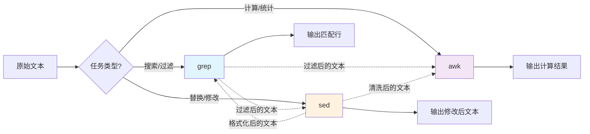
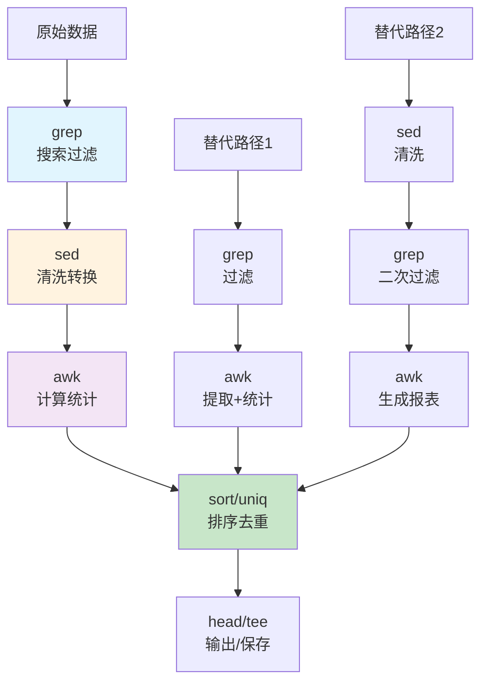
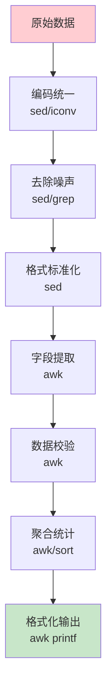
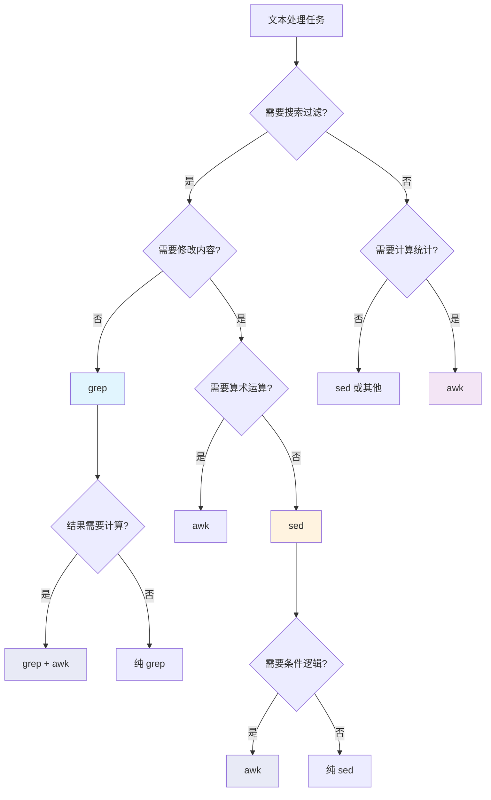
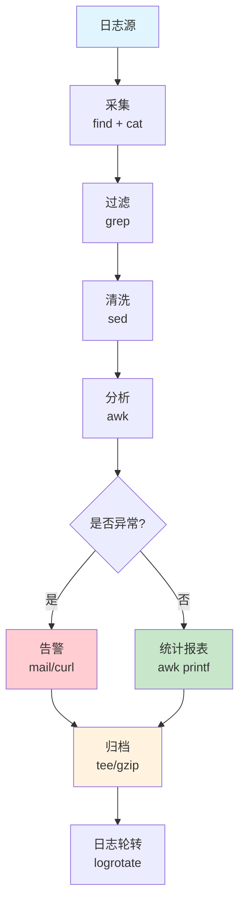

# 三剑客综合实战

grep 擅长搜索过滤，sed 擅长流式替换，awk 擅长字段计算——三者组合，构成 Linux 文本处理的"万能瑞士军刀"。本文从管道串联的基础模式出发，通过 Nginx 日志分析、系统安全审计、CSV 数据 ETL、文本报表等实战场景，展示三剑客的协作艺术。

## 1. 三剑客协作原理

### 1.1 各自的定位



| 工具 | 核心能力 | 不擅长的 | 类比 |
|------|----------|----------|------|
| **grep** | 搜索、过滤、定位 | 修改内容、计算 | 放大镜 |
| **sed** | 替换、删除、插入、格式变换 | 字段计算、条件逻辑 | 橡皮擦+涂改液 |
| **awk** | 字段提取、计算统计、报表生成 | 简单替换（不如sed简洁） | 计算器+打印机 |

### 1.2 管道协作流水线



### 1.3 选择原则

```bash
# 原则1：搜索过滤 → grep
grep 'ERROR' app.log                           # 最简单最直接

# 原则2：内容替换 → sed
sed 's/old_host/new_host/g' config.conf         # 替换是最自然的表达

# 原则3：字段计算 → awk
awk '{sum += $3} END {print sum}' data.txt      # 算术运算只有 awk 能做

# 原则4：组合使用 → 管道
grep '2024-01-15' app.log | \
  sed 's/\[ERROR\]//g' | \
  awk '{count[$2]++} END {for(k in count) print k, count[k]}'
```

::: tip 何时该用单一工具 vs 组合
- **单一工具优先**：如果一个工具能完成，不要加管道
- `grep 'pattern' file` 优于 `cat file | grep 'pattern'`
- `awk '/pattern/{print $1}' file` 优于 `grep 'pattern' file | awk '{print $1}'`
- **组合使用场景**：各步骤有明确的职责分工时
- 过滤 → 清洗 → 统计，每一步变换较大
:::

## 2. 管道串联技巧

### 2.1 经典管道模式

```bash
# 模式1：grep 过滤 + awk 统计
grep 'pattern' file | awk '{sum += $3} END {print sum}'

# 模式2：grep 过滤 + sed 清洗 + awk 统计
grep 'ERROR' app.log | \
  sed 's/\x1b\[[0-9;]*m//g' | \
  awk '{count[$2]++} END {for(k in count) print count[k], k}' | \
  sort -rn

# 模式3：sed 提取 + grep 过滤 + sort 排序
sed -n '/START/,/END/p' file | \
  grep -v '^#' | \
  sort -u

# 模式4：awk 分组 + sort 排序 + head 取 Top N
awk '{count[$1]++} END {for(k in count) print count[k], k}' file | \
  sort -rn | \
  head -20
```

### 2.2 管道性能优化

```bash
# 优化1：尽早过滤，减少下游数据量
# 慢：先处理所有行再过滤
awk '{...}' huge.log | grep 'ERROR'

# 快：先过滤再处理
grep 'ERROR' huge.log | awk '{...}'

# 优化2：合并可以合并的步骤
# 冗余：grep + grep
grep 'ERROR' log | grep '2024-01'

# 合并：
grep '2024-01.*ERROR' log

# 优化3：用 awk 替代 grep + awk 组合
# 两步
grep 'ERROR' log | awk '{sum += $5} END {print sum}'

# 一步
awk '/ERROR/{sum += $5} END {print sum}' log

# 优化4：利用 LC_ALL=C 加速
LC_ALL=C grep 'pattern' huge.log | LC_ALL=C awk '{...}'
```

### 2.3 管道中的临时文件 vs 管道

```bash
# 临时文件方式（可调试中间结果）
grep 'ERROR' app.log > /tmp/errors.txt
sed 's/\[ERROR\] //' /tmp/errors.txt > /tmp/clean_errors.txt
awk '{count[$2]++} END {for(k in count) print k, count[k]}' /tmp/clean_errors.txt
rm /tmp/errors.txt /tmp/clean_errors.txt

# 管道方式（更高效，但中间结果不可见）
grep 'ERROR' app.log | \
  sed 's/\[ERROR\] //' | \
  awk '{count[$2]++} END {for(k in count) print k, count[k]}'

# tee 方式（既输出又保存中间结果）
grep 'ERROR' app.log | \
  tee /tmp/errors.txt | \
  sed 's/\[ERROR\] //' | \
  tee /tmp/clean_errors.txt | \
  awk '{count[$2]++} END {for(k in count) print k, count[k]}'
```

## 3. Nginx 访问日志分析

### 3.1 日志格式说明

```bash
# Nginx 默认 combined 格式
# $remote_addr - $remote_user [$time_local] "$request" $status $body_bytes_sent "$http_referer" "$http_user_agent"

# 示例日志行
# 192.168.1.100 - - [15/Jan/2024:09:30:00 +0800] "GET /api/users HTTP/1.1" 200 1234 "https://example.com/" "Mozilla/5.0"
```

### 3.2 PV/UV 统计

```bash
# PV（Page View）——总请求数
awk 'END {print "PV:", NR}' access.log

# PV 按天统计
awk '{
    date = substr($4, 2, 11)    # 提取 [15/Jan/2024 中的日期
    gsub(/\//, "-", date)       # 替换 / 为 -
    pv[date]++
} END {
    for (d in pv) print d, pv[d]
}' access.log | sort

# UV（Unique Visitor）——独立 IP 数
awk '{ip[$1]++} END {print "UV:", length(ip)}' access.log

# UV 按天统计
awk '{
    date = substr($4, 2, 11)
    gsub(/\//, "-", date)
    uv[date, $1] = 1
} END {
    for (key in uv) {
        split(key, parts, SUBSEP)
        daily_uv[parts[1]]++
    }
    for (d in daily_uv) print d, daily_uv[d]
}' access.log | sort

# PV/UV 合并报表
awk '{
    date = substr($4, 2, 11)
    gsub(/\//, "-", date)
    pv[date]++
    uv[date, $1] = 1
} END {
    for (key in uv) {
        split(key, parts, SUBSEP)
        daily_uv[parts[1]]++
    }
    printf "%-15s %10s %10s %10s\n", "日期", "PV", "UV", "PV/UV"
    printf "%-15s %10s %10s %10s\n", "----", "--", "--", "-----"
    for (d in pv) {
        printf "%-15s %10d %10d %10.1f\n", d, pv[d], daily_uv[d], pv[d]/daily_uv[d]
    }
}' access.log | sort
```

### 3.3 状态码分析

```bash
# 各状态码分布
awk '{status[$9]++} END {
    for (s in status) printf "%6d %s\n", status[s], s
}' access.log | sort -rn

# 状态码占比
awk '{
    status[$9]++
    total++
} END {
    printf "%-8s %10s %10s\n", "状态码", "数量", "占比"
    for (s in status) {
        printf "%-8s %10d %9.2f%%\n", s, status[s], status[s]/total*100
    }
}' access.log | sort -k2 -rn

# 4xx/5xx 错误请求详情
awk '$9 >= 400 {
    status[$9]++
    urls[$9, $7]++
} END {
    for (s in status) {
        printf "\n=== 状态码 %s (%d次) ===\n", s, status[s]
        # 打印该状态码的 Top URL
        for (key in urls) {
            split(key, parts, SUBSEP)
            if (parts[1] == s) {
                printf "  %6d %s\n", urls[key], parts[2]
            }
        }
    }
}' access.log

# 5xx 错误趋势（按小时）
awk '$9 >= 500 {
    match($4, /\[([0-9]{2})\/[A-Za-z]+\/[0-9]{4}:([0-9]{2}):/, arr)
    hour[arr[2]]++
} END {
    for (h = 0; h < 24; h++) {
        hh = sprintf("%02d", h)
        printf "%s:00  %4d  %s\n", hh, hour[hh]+0, strftime("", hour[hh]+0)
        # 简易柱状图
        count = hour[hh] + 0
        bar = ""
        for (i = 0; i < count; i++) bar = bar "#"
        printf "%s:00  %s\n", hh, bar
    }
}' access.log
```

### 3.4 TOP URL 分析

```bash
# 请求量 Top 20 URL
awk '{urls[$7]++} END {
    for (u in urls) printf "%6d %s\n", urls[u], u
}' access.log | sort -rn | head -20

# 流量 Top 20 URL
awk '{traffic[$7] += $10} END {
    for (u in traffic) printf "%15d %s\n", traffic[u], u
}' access.log | sort -rn | head -20

# 各 URL 平均响应大小
awk '{
    traffic[$7] += $10
    count[$7]++
} END {
    printf "%-50s %10s %15s %15s\n", "URL", "请求数", "总流量(B)", "平均(B)"
    for (u in count) {
        printf "%-50s %10d %15d %15.0f\n", u, count[u], traffic[u], traffic[u]/count[u]
    }
}' access.log | sort -k3 -rn | head -20

# 静态资源 vs API 请求分布
awk '{
    if ($7 ~ /\.(js|css|jpg|png|gif|ico|svg|woff)/) static++
    else if ($7 ~ /\/api\//) api++
    else other++
} END {
    total = static + api + other
    printf "静态资源: %d (%.1f%%)\n", static, static/total*100
    printf "API请求:  %d (%.1f%%)\n", api, api/total*100
    printf "其他:     %d (%.1f%%)\n", other, other/total*100
}' access.log
```

### 3.5 慢请求分析

```bash
# 需要在 Nginx 配置中添加 $request_time
# log_format main '$remote_addr - $remote_user [$time_local] "$request" '
#                 '$status $body_bytes_sent "$http_referer" '
#                 '"$http_user_agent" $request_time';

# 提取慢请求（>1秒）
awk '$NF > 1 {
    slow++
    slow_urls[$7]++
    total_time[$7] += $NF
} END {
    printf "慢请求总数: %d\n\n", slow
    printf "%-50s %10s %10s %10s\n", "URL", "次数", "总耗时(s)", "平均(s)"
    for (u in slow_urls) {
        printf "%-50s %10d %10.2f %10.2f\n", u, slow_urls[u], total_time[u], total_time[u]/slow_urls[u]
    }
}' access.log | head -30

# 响应时间分布
awk '{
    t = $NF + 0
    if (t < 0.1) bucket["<0.1s"]++
    else if (t < 0.5) bucket["0.1-0.5s"]++
    else if (t < 1.0) bucket["0.5-1.0s"]++
    else if (t < 3.0) bucket["1.0-3.0s"]++
    else bucket[">3.0s"]++
    total++
} END {
    printf "%-12s %8s %8s  %s\n", "区间", "数量", "占比", "柱状图"
    split("<0.1s,0.1-0.5s,0.5-1.0s,1.0-3.0s,>3.0s", labels, ",")
    for (i = 1; i <= 5; i++) {
        l = labels[i]
        c = bucket[l] + 0
        pct = c / total * 100
        bar = ""
        for (j = 0; j < pct; j++) bar = bar "#"
        printf "%-12s %8d %7.1f%%  %s\n", l, c, pct, bar
    }
}' access.log
```

### 3.6 综合日志分析脚本

```bash
#!/bin/bash
# nginx_report.sh —— Nginx 日志综合分析报告

LOG=${1:-access.log}
echo "========================================="
echo "  Nginx 日志分析报告"
echo "  日志文件: $LOG"
echo "  分析时间: $(date '+%Y-%m-%d %H:%M:%S')"
echo "========================================="

# 1. 基本统计
echo -e "\n--- 基本统计 ---"
awk 'END {printf "总请求数: %d\n", NR}' "$LOG"
awk '{ip[$1]++} END {printf "独立IP数: %d\n", length(ip)}' "$LOG"
awk '{sum += $10} END {printf "总流量: %.2f MB\n", sum/1024/1024}' "$LOG"

# 2. 状态码分布
echo -e "\n--- 状态码分布 ---"
awk '{
    status[$9]++
    total++
} END {
    for (s in status) {
        printf "  %s  %6d  (%5.1f%%)\n", s, status[s], status[s]/total*100
    }
}' "$LOG" | sort -t'(' -k2 -rn

# 3. Top 10 IP
echo -e "\n--- Top 10 访问IP ---"
awk '{ip[$1]++} END {for(i in ip) printf "%6d %s\n", ip[i], i}' "$LOG" | sort -rn | head -10

# 4. Top 10 URL
echo -e "\n--- Top 10 请求URL ---"
awk '{url[$7]++} END {for(u in url) printf "%6d %s\n", url[u], u}' "$LOG" | sort -rn | head -10

# 5. 每小时请求分布
echo -e "\n--- 每小时请求分布 ---"
awk '{
    match($4, /:([0-9]{2}):/, arr)
    hour[arr[1]]++
} END {
    for (h = 0; h < 24; h++) {
        hh = sprintf("%02d", h)
        c = hour[hh] + 0
        bar = ""
        for (i = 0; i < c/100; i++) bar = bar "#"
        printf "  %s:00  %5d  %s\n", hh, c, bar
    }
}' "$LOG"

echo -e "\n========================================="
echo "  报告生成完毕"
echo "========================================="
```

## 4. 系统日志分析

### 4.1 认证日志分析

```bash
# /var/log/auth.log（Debian/Ubuntu）或 /var/log/secure（CentOS/RHEL）

# 暴力破解检测——统计失败登录 IP
grep 'Failed password' /var/log/auth.log | \
  awk '{
      for (i = 1; i <= NF; i++) {
          if ($i == "from") {ip = $(i+1); break}
      }
      fail[ip]++
  } END {
      printf "%-18s %10s %s\n", "IP地址", "失败次数", "风险等级"
      for (i in fail) {
          level = (fail[i] > 100 ? "CRITICAL" : fail[i] > 20 ? "HIGH" : fail[i] > 5 ? "MEDIUM" : "LOW")
          printf "%-18s %10d %s\n", i, fail[i], level
      }
  }' | sort -k2 -rn

# 成功登录统计
grep 'Accepted' /var/log/auth.log | \
  awk '{
      for (i = 1; i <= NF; i++) {
          if ($i == "from") {ip = $(i+1); break}
      }
      user = ""
      for (i = 1; i <= NF; i++) {
          if ($i == "for") {user = $(i+1); break}
      }
      success[user, ip]++
  } END {
      for (key in success) {
          split(key, parts, SUBSEP)
          printf "%-15s %-18s %5d\n", parts[1], parts[2], success[key]
      }
  }' | sort -k3 -rn | head -20

# sudo 使用记录
grep 'sudo:' /var/log/auth.log | \
  sed 's/.*sudo://' | \
  awk '{
      user = $3
      cmd = ""
      for (i = 11; i <= NF; i++) cmd = cmd $i " "
      cmds[user, cmd]++
  } END {
      for (key in cmds) {
          split(key, parts, SUBSEP)
          printf "%-15s %-50s %3d\n", parts[1], parts[2], cmds[key]
      }
  }' | sort -k3 -rn | head -20
```

### 4.2 系统日志分析

```bash
# /var/log/syslog 或 /var/log/messages

# 按优先级统计
grep -E 'emerg|alert|crit|err|warning' /var/log/syslog | \
  awk '{
      level = $5
      gsub(/:/, "", level)
      count[level]++
  } END {
      for (l in count) printf "%10d %s\n", count[l], l
  }' | sort -rn

# OOM Killer 记录
grep -i 'out of memory\|oom-killer\|killed process' /var/log/syslog | \
  awk '{
      printf "[%s %s] %s\n", $1, $2, $0
  }'

# 磁盘错误
grep -i 'I/O error\|read error\|write error\|ext4.*error' /var/log/syslog | \
  sed 's/.*kernel: //' | \
  awk '!seen[$0]++'    # 去重

# 内核模块加载记录
grep 'module.*loaded\|loading module' /var/log/syslog | \
  awk '{for(i=1;i<=NF;i++) if($i ~ /module/) print $i}' | \
  sort -u

# cron 执行记录
grep 'CRON' /var/log/syslog | \
  awk '{
      cmd = ""
      for (i = 7; i <= NF; i++) cmd = cmd $i " "
      print $1, $2, cmd
  }' | sort -k3 | uniq -c | sort -rn
```

### 4.3 应用日志分析

```bash
# Java 应用日志分析

# 提取异常类型及频次
grep -E 'Exception|Error' app.log | \
  sed -E 's/.*([A-Z][a-zA-Z]*Exception|Error).*/\1/' | \
  awk '{count[$1]++} END {for(e in count) printf "%6d %s\n", count[e], e}' | \
  sort -rn | head -20

# 提取完整异常堆栈（异常行 + 后续 at 行）
awk '/Exception|Error/{
    print
    while ((getline line) > 0) {
        if (line ~ /^[[:space:]]+at /) print line
        else break
    }
}' app.log

# 按 5 分钟窗口统计错误率
awk '/ERROR/{
    # 提取时间戳（假设格式 2024-01-15 09:30:15）
    ts = $1 " " $2
    gsub(/:[0-9][0-9]$/, "", ts)    # 截断到分钟
    # 按5分钟取整
    split(ts, parts, ":")
    min = int(substr(parts[2], length(parts[2])-1, 2) / 5) * 5
    window = parts[1] ":" sprintf("%02d", min)
    errors[window]++
} END {
    for (w in errors) print w, errors[w]
}' app.log | sort

# Spring Boot 日志级别统计
awk '{
    # Spring Boot 默认格式：2024-01-15 09:30:00.123 INFO 12345 ---
    for (i = 1; i <= NF; i++) {
        if ($i ~ /^(TRACE|DEBUG|INFO|WARN|ERROR|FATAL)$/) {
            count[$i]++
            break
        }
    }
} END {
    total = 0
    for (l in count) total += count[l]
    printf "%-10s %10s %10s\n", "级别", "数量", "占比"
    split("FATAL,ERROR,WARN,INFO,DEBUG,TRACE", levels, ",")
    for (i = 1; i <= 6; i++) {
        l = levels[i]
        if (count[l] + 0 > 0) {
            printf "%-10s %10d %9.1f%%\n", l, count[l], count[l]/total*100
        }
    }
}' app.log
```

## 5. CSV/TSV 数据处理

### 5.1 基础操作

```bash
# 查看CSV结构（前5行）
head -5 data.csv | awk -F',' '{for(i=1;i<=NF;i++) printf "%2d: %s\n", i, $i}'

# 提取指定列
awk -F',' '{print $1, $3, $5}' data.csv

# 按条件过滤
awk -F',' '$3 > 100' data.csv                      # 第3列大于100
awk -F',' '$5 == "active"' data.csv                 # 第5列等于active
awk -F',' '$3 > 100 && $5 == "active"' data.csv     # 组合条件

# 添加行号
awk -F',' '{print NR, $0}' data.csv

# 去重（按第1列）
awk -F',' '!seen[$1]++' data.csv

# 排序（按第3列数值降序）
awk -F',' '{print $3, $0}' data.csv | sort -t' ' -k1 -rn | awk '{$1=""; print substr($0,2)}'
# 或者更简洁
sort -t',' -k3 -rn data.csv
```

### 5.2 数据清洗

```bash
# 去除字段前后空格
awk -F',' '{
    for (i = 1; i <= NF; i++) {
        gsub(/^[[:space:]]+/, "", $i)
        gsub(/[[:space:]]+$/, "", $i)
    }
    print
}' OFS=',' data.csv

# 处理引号包裹的字段
awk -F',' '{
    for (i = 1; i <= NF; i++) {
        gsub(/^"/, "", $i)
        gsub(/"$/, "", $i)
    }
    print
}' OFS=',' data.csv

# 统一日期格式
awk -F',' '{
    # MM/DD/YYYY → YYYY-MM-DD
    if ($2 ~ /[0-9]{2}\/[0-9]{2}\/[0-9]{4}/) {
        split($2, d, "/")
        $2 = d[3] "-" d[1] "-" d[2]
    }
    print
}' OFS=',' data.csv

# 数据类型转换与校验
awk -F',' '{
    valid = 1
    # 检查第3列是否为数字
    if ($3 !~ /^-?[0-9]+\.?[0-9]*$/) {
        print "非数字行:", NR, $0 > "/dev/stderr"
        valid = 0
    }
    # 检查第5列是否为有效日期
    if ($5 !~ /[0-9]{4}-[0-9]{2}-[0-9]{2}/) {
        print "日期格式错误:", NR, $0 > "/dev/stderr"
        valid = 0
    }
    if (valid) print
}' OFS=',' data.csv > clean_data.csv
```

### 5.3 数据聚合与透视

```bash
# 分组求和
awk -F',' '{sum[$1] += $3; count[$1]++} END {
    for (k in sum) printf "%s,%d,%.2f\n", k, count[k], sum[k]
}' data.csv

# 多维分组统计
awk -F',' '{
    key = $1 "," $2
    sum[key] += $3
    count[key]++
} END {
    printf "%-15s %-10s %10s %10s %10s\n", "类别1", "类别2", "数量", "总和", "均值"
    for (k in sum) {
        split(k, parts, SUBSEP)
        # k 中用 , 分隔
        n = split(k, parts, ",")
        printf "%-15s %-10s %10d %10.2f %10.2f\n", parts[1], parts[2], count[k], sum[k], sum[k]/count[k]
    }
}' data.csv

# 行列转置
awk -F',' '{
    for (i = 1; i <= NF; i++) {
        rows[i] = rows[i] (rows[i] ? "," : "") $i
    }
} END {
    for (i = 1; i <= length(rows); i++) print rows[i]
}' data.csv

# 宽表转长表
awk -F',' '
NR == 1 {
    for (i = 2; i <= NF; i++) headers[i] = $i
    next
}
{
    for (i = 2; i <= NF; i++) {
        print $1, headers[i], $i
    }
}' OFS=',' wide.csv
```

### 5.4 CSV 转 JSON

```bash
# CSV → JSON 数组
awk -F',' '
BEGIN {
    print "["
    first = 1
}
NR == 1 {
    for (i = 1; i <= NF; i++) headers[i] = $i
    next
}
{
    if (!first) print ","
    first = 0
    printf "  {"
    for (i = 1; i <= NF; i++) {
        if (i > 1) printf ","
        val = $i
        gsub(/"/, "\\\"", val)
        # 判断是否为数字
        if (val ~ /^-?[0-9]+\.?[0-9]*$/) {
            printf " \"%s\": %s", headers[i], val
        } else {
            printf " \"%s\": \"%s\"", headers[i], val
        }
    }
    printf " }"
}
END {
    print "\n]"
}' data.csv

# CSV → JSON Lines（每行一个JSON对象，更适合流式处理）
awk -F',' '
NR == 1 {
    for (i = 1; i <= NF; i++) headers[i] = $i
    next
}
{
    printf "{"
    for (i = 1; i <= NF; i++) {
        if (i > 1) printf ","
        val = $i
        gsub(/"/, "\\\"", val)
        if (val ~ /^-?[0-9]+\.?[0-9]*$/) {
            printf "\"%s\":%s", headers[i], val
        } else {
            printf "\"%s\":\"%s\"", headers[i], val
        }
    }
    printf "}\n"
}' data.csv
```

## 6. 数据清洗与转换

### 6.1 文本数据清洗流水线



```bash
# 完整清洗流水线示例
cat raw_data.txt | \
  sed 's/\r$//' | \                         # 1. 去除 Windows 换行符
  grep -v '^#' | \                            # 2. 去除注释行
  grep -v '^$' | \                            # 3. 去除空行
  sed 's/[[:space:]]\+/ /g' | \              # 4. 压缩多余空格
  sed 's/^[[:space:]]*//' | \                # 5. 去除行首空格
  awk -F' ' '{
      if (NF >= 5) {                          # 6. 字段数校验
          gsub(/"/, "", $3)                   # 7. 去引号
          if ($3 ~ /^[0-9]+$/) {              # 8. 类型校验
              print $1, $2, $3, $4, $5
          }
      }
  }' | \
  sort -k1,1 -k2,2 | \                       # 9. 排序
  uniq                                        # 10. 去重
```

### 6.2 日志格式转换

```bash
# Syslog → 结构化 CSV
awk '{
    month = $1
    day = $2
    time = $3
    host = $4
    # 提取进程名
    split($5, proc, "[")
    process = proc[1]
    gsub(/:$/, "", process)
    # 合并消息
    msg = ""
    for (i = 6; i <= NF; i++) msg = msg (i > 6 ? " " : "") $i
    printf "%s,%s,%s,%s,%s,%s\n", month, day, time, host, process, msg
}' /var/log/syslog > syslog_structured.csv

# Apache Combined → TSV
awk '{
    ip = $1
    # 提取时间
    match($0, /\[([^\]]+)\]/, arr)
    time = arr[1]
    # 提取请求
    match($0, /"([^"]+)"/, arr)
    request = arr[1]
    # 提取状态码和大小
    match($0, /" ([0-9]+) ([0-9-]+)/, arr)
    status = arr[1]
    size = arr[2]
    printf "%s\t%s\t%s\t%s\t%s\n", ip, time, request, status, size
}' access.log > access_structured.tsv
```

### 6.3 数据脱敏

```bash
# 手机号脱敏
awk '{
    gsub(/1[3-9][0-9][0-9][0-9][0-9][0-9][0-9][0-9][0-9][0-9]/, \
         "1***" substr(&, length(&)-3, 4))    # 不太好实现

# 更好的方式
sed -E 's/(1[3-9][0-9])[0-9]{4}([0-9]{4})/\1****\2/g' user_data.txt

# 邮箱脱敏
sed -E 's/([a-zA-Z0-9])[a-zA-Z0-9._%+-]*@/\1***@/g' user_data.txt

# IP 脱敏（保留前两段）
sed -E 's/([0-9]{1,3}\.[0-9]{1,3})\.[0-9]{1,3}\.[0-9]{1,3}/\1.*.*/g' log.txt

# 身份证号脱敏
sed -E 's/([0-9]{6})[0-9]{8}([0-9]{4})/\1********\2/g' data.txt

# 综合脱敏脚本
awk '{
    # 手机号
    gsub(/1[3-9][0-9]{9}/, "***PHONE***")
    # 邮箱
    gsub(/[a-zA-Z0-9._%+-]+@[a-zA-Z0-9.-]+\.[a-zA-Z]{2,}/, "***EMAIL***")
    # 身份证
    gsub(/[0-9]{17}[0-9Xx]/, "***IDCARD***")
    # 银行卡
    gsub(/[0-9]{16,19}/, "***BANKCARD***")
    print
}' sensitive_data.txt > masked_data.txt
```

## 7. 文本报表生成

### 7.1 格式化表格

```bash
# 自动对齐的表格生成器
awk -F'|' '
BEGIN {
    printf "%-5s %-20s %-10s %12s %8s\n", "序号", "名称", "类型", "大小", "占比"
    printf "%-5s %-20s %-10s %12s %8s\n", "----", "----", "----", "----", "----"
    total_size = 0
}
NR > 1 {
    name = $1; type = $2; size = $3
    total_size += size
    names[NR] = name; types[NR] = type; sizes[NR] = size
}
END {
    for (i = 2; i <= NR; i++) {
        pct = sizes[i] / total_size * 100
        printf "%-5d %-20s %-10s %12d %7.1f%%\n", i-1, names[i], types[i], sizes[i], pct
    }
    printf "%-5s %-20s %-10s %12s %8s\n", "----", "----", "----", "----", "----"
    printf "%-5s %-20s %-10s %12d %7.1f%%\n", "", "合计", "", total_size, 100.0
}' data.txt
```

### 7.2 柱状图报表

```bash
# 字符柱状图
awk '{
    count[$1]++
} END {
    max_count = 0
    for (k in count) {
        if (count[k] > max_count) max_count = count[k]
        keys[++n] = k
    }
    # 按数量排序（简单冒泡）
    for (i = 1; i <= n; i++)
        for (j = i + 1; j <= n; j++)
            if (count[keys[i]] < count[keys[j]]) {
                tmp = keys[i]; keys[i] = keys[j]; keys[j] = tmp
            }
    max_bar = 50
    for (i = 1; i <= n && i <= 20; i++) {
        k = keys[i]
        bar_len = int(count[k] / max_count * max_bar)
        bar = ""
        for (j = 0; j < bar_len; j++) bar = bar "█"
        printf "%-15s %6d %s\n", k, count[k], bar
    }
}' data.txt
```

### 7.3 Markdown 表格生成

```bash
# 从 CSV 生成 Markdown 表格
awk -F',' '
NR == 1 {
    printf "| "
    for (i = 1; i <= NF; i++) printf "%s | ", $i
    print ""
    printf "| "
    for (i = 1; i <= NF; i++) printf "--- | "
    print ""
    next
}
{
    printf "| "
    for (i = 1; i <= NF; i++) printf "%s | ", $i
    print ""
}' data.csv
```

### 7.4 综合报表脚本

```bash
#!/bin/bash
# generate_report.sh —— 从 CSV 数据生成综合报表

INPUT=${1:-data.csv}

echo "# 数据分析报告"
echo ""
echo "> 生成时间: $(date '+%Y-%m-%d %H:%M:%S')"
echo "> 数据源: $INPUT"
echo ""

# 基本统计
echo "## 1. 基本统计"
awk -F',' 'END {printf "- 总行数: %d\n", NR}' "$INPUT"
awk -F',' 'NR > 1 {sum += $3; if (NR == 2 || $3 < min) min = $3; if ($3 > max) max = $3}
    END {printf "- 第3列: 最小=%.2f, 最大=%.2f, 均值=%.2f\n", min, max, sum/(NR-1)}' "$INPUT"

# 分组统计
echo ""
echo "## 2. 分组统计"
awk -F',' 'NR > 1 {
    group[$1]++
    sum[$1] += $3
} END {
    printf "| %-15s | %8s | %12s | %10s |\n", "分组", "数量", "总和", "均值"
    printf "| %-15s | %8s | %12s | %10s |\n", "---", "---", "---", "---"
    for (g in group) {
        printf "| %-15s | %8d | %12.2f | %10.2f |\n", g, group[g], sum[g], sum[g]/group[g]
    }
}' "$INPUT" | sort -t'|' -k4 -rn

# 分布统计
echo ""
echo "## 3. 数值分布"
awk -F',' 'NR > 1 {
    val = $3
    if (val < 10) bucket["0-9"]++
    else if (val < 50) bucket["10-49"]++
    else if (val < 100) bucket["50-99"]++
    else if (val < 500) bucket["100-499"]++
    else bucket["500+"]++
    total++
} END {
    split("0-9,10-49,50-99,100-499,500+", labels, ",")
    for (i = 1; i <= 5; i++) {
        c = bucket[labels[i]] + 0
        pct = c / total * 100
        bar = ""
        for (j = 0; j < pct / 2; j++) bar = bar "█"
        printf "- %8s: %5d (%5.1f%%) %s\n", labels[i], c, pct, bar
    }
}' "$INPUT"
```

## 8. 性能对比与选型

### 8.1 三剑客适用场景对比



### 8.2 性能基准参考

```bash
# 测试数据：100 万行日志
# 生成测试数据
seq 1000000 | awk '{printf "192.168.%d.%d - - [15/Jan/2024:%02d:%02d:%02d +0800] \"GET /api/%d HTTP/1.1\" %d %d\n", int(rand()*255), int(rand()*255), int(rand()*24), int(rand()*60), int(rand()*60), int(rand()*1000), (rand()>0.9?500:200), int(rand()*10000)}' > test_1m.log

# 测试1：简单过滤
time grep 'ERROR' test_1m.log                    # ~0.3s
time sed -n '/ERROR/p' test_1m.log               # ~0.5s
time awk '/ERROR/' test_1m.log                   # ~0.6s
# grep 胜出——搜索是它的核心优化方向

# 测试2：替换
time sed 's/ERROR/CRITICAL/g' test_1m.log        # ~0.8s
time awk '{gsub(/ERROR/, "CRITICAL"); print}' test_1m.log  # ~1.2s
# sed 胜出——替换是它的核心优化方向

# 测试3：字段计算
time awk '{sum += $10} END {print sum}' test_1m.log  # ~0.8s
# awk 是唯一选择——grep/sed 不能做算术

# 测试4：固定字符串匹配
time grep -F 'specific_error_code' test_1m.log   # ~0.1s
time grep 'specific_error_code' test_1m.log       # ~0.3s
time grep -E 'specific_error_code' test_1m.log    # ~0.3s
# grep -F 最快——跳过正则引擎
```

### 8.3 选型决策表

| 场景 | 首选 | 理由 |
|------|------|------|
| 搜索包含某关键字的行 | `grep` | 速度快，语法简 |
| 搜索不含某关键字的行 | `grep -v` | 语义清晰 |
| 替换文本 | `sed` | 替换是核心功能 |
| 删除行 | `sed` 或 `grep -v` | 两者皆可 |
| 提取字段 | `awk` | 原生字段分割 |
| 数值计算 | `awk` | 唯一选择 |
| 格式化输出 | `awk` | printf 功能强大 |
| 就地修改文件 | `sed -i` | 原生支持 |
| 多条件过滤+统计 | `grep` + `awk` | 各取所长 |
| 配置文件修改 | `sed -i.bak` | 安全+便捷 |
| 日志分析 | `awk` | 计算能力不可替代 |
| 批量替换（多文件） | `sed` + `find` | 组合使用 |

## 9. xargs 与 parallel 配合

### 9.1 xargs 批量处理

```bash
# 批量搜索多个文件
find . -name '*.log' -print0 | xargs -0 grep 'ERROR'

# 批量替换
find . -name '*.conf' -print0 | xargs -0 sed -i 's/old_host/new_host/g'

# 限制并发数
find . -name '*.log' -print0 | xargs -0 -P 4 -I {} grep -c 'ERROR' {}

# 批量统计
find . -name '*.log' -print0 | xargs -0 awk '{sum += $5} END {print FILENAME, sum}'

# 合并多文件统计
find . -name 'access*.log' -print0 | \
  xargs -0 cat | \
  awk '{ip[$1]++} END {for(i in ip) print ip[i], i}' | \
  sort -rn | head -20
```

### 9.2 GNU parallel 并行加速

```bash
# 安装 GNU parallel
# apt install parallel / yum install parallel

# 并行搜索
find . -name '*.log' | parallel -j 4 grep -c 'ERROR'

# 并行统计各文件
find . -name '*.log' | parallel -j 4 \
  "awk '{ip[\$1]++} END {for(i in ip) print ip[i], i}' {} | sort -rn | head -5"

# 并行处理 + 合并结果
find . -name '*.log' | parallel -j 4 \
  "grep 'ERROR' {} | wc -l" | \
  awk '{sum += $1} END {print "总错误数:", sum}'

# 并行替换
find . -name '*.conf' | parallel -j 4 sed -i 's/old/new/g'

# 并行压缩旧日志
find /var/log -name '*.log' -mtime +30 | parallel -j 2 gzip
```

::: tip parallel vs xargs
- `xargs -P N`：简单并行，N 为并发数，适合简单命令
- `parallel`：功能更强——支持进度条、重试、负载均衡、远程执行
- 日常运维用 `xargs` 足够，复杂批处理用 `parallel`
:::

### 9.3 大文件并行处理

```bash
# 将大文件分割后并行处理
split -l 1000000 huge.log chunk_

# 并行搜索
ls chunk_* | parallel -j 4 "grep -c 'ERROR' {}"

# 并行统计
ls chunk_* | parallel -j 4 \
  "awk '{status[\$9]++} END {for(s in status) print s, status[s]}' {}" | \
  awk '{status[$1] += $2} END {for(s in status) print s, status[s]}'

# 清理
rm chunk_*
```

## 10. 综合案例：日志审计系统脚本

### 10.1 需求分析

构建一个轻量级日志审计脚本，实现以下功能：
1. 多日志源采集
2. 异常检测与告警
3. 统计报表生成
4. 结果归档



### 10.2 完整脚本

```bash
#!/bin/bash
#
# log_audit.sh —— 日志审计系统
# 用法: ./log_audit.sh [--report] [--alert-threshold N] [日志目录]
#

set -euo pipefail

# ========== 配置 ==========
LOG_DIR="${1:-/var/log}"
ALERT_THRESHOLD="${2:-100}"
REPORT_DATE=$(date '+%Y-%m-%d')
REPORT_FILE="/tmp/log_audit_${REPORT_DATE}.txt"
ALERT_EMAIL="admin@example.com"

# ========== 函数定义 ==========

# 统计函数：SSH 暴力破解检测
check_ssh_brute_force() {
    local log_file="$1"
    echo "=== SSH 暴力破解检测 ==="

    grep 'Failed password' "$log_file" 2>/dev/null | \
      awk '{
          for (i = 1; i <= NF; i++) {
              if ($i == "from") {ip = $(i+1); break}
          }
          fail[ip]++
      } END {
          found = 0
          for (ip in fail) {
              if (fail[ip] >= '${ALERT_THRESHOLD}') {
                  level = (fail[ip] >= 1000 ? "CRITICAL" : fail[ip] >= 500 ? "HIGH" : "MEDIUM")
                  printf "  %-18s %8d 次失败  [%s]\n", ip, fail[ip], level
                  found = 1
              }
          }
          if (!found) print "  未检测到暴力破解行为"
      }'
}

# 统计函数：HTTP 状态码异常
check_http_errors() {
    local log_file="$1"
    echo "=== HTTP 状态码分析 ==="

    if [ ! -f "$log_file" ]; then
        echo "  Nginx 日志不存在: $log_file"
        return
    fi

    awk '{
        status[$9]++
        total++
    } END {
        error_count = 0
        for (s in status) {
            if (s+0 >= 400) error_count += status[s]
        }
        printf "  总请求: %d\n", total
        printf "  错误请求: %d (%.1f%%)\n\n", error_count, error_count/total*100
        printf "  %-8s %10s %10s\n", "状态码", "数量", "占比"
        printf "  %-8s %10s %10s\n", "------", "------", "------"
        for (s in status) {
            printf "  %-8s %10d %9.1f%%\n", s, status[s], status[s]/total*100
        }
    }' "$log_file" | sort -k2 -rn | head -15
}

# 统计函数：系统资源异常
check_system_errors() {
    local log_file="$1"
    echo "=== 系统错误检测 ==="

    # OOM
    echo "  [OOM Killer]"
    grep -i 'oom-killer\|out of memory\|killed process' "$log_file" 2>/dev/null | \
      awk '!seen[$0]++ {printf "    %s\n", $0}' | head -5
    local oom_count=$(grep -ci 'oom-killer\|out of memory' "$log_file" 2>/dev/null || echo 0)
    echo "    共 ${oom_count} 次 OOM 事件"

    # 磁盘
    echo "  [磁盘错误]"
    grep -i 'I/O error\|read error\|write error' "$log_file" 2>/dev/null | \
      awk '!seen[$0]++ {printf "    %s\n", $0}' | head -5
    local disk_count=$(grep -ci 'I/O error\|read error\|write error' "$log_file" 2>/dev/null || echo 0)
    echo "    共 ${disk_count} 次磁盘错误"

    # 内核 Panic
    echo "  [内核异常]"
    grep -i 'panic\|call trace\|bug:' "$log_file" 2>/dev/null | \
      awk '!seen[$0]++ {printf "    %s\n", $0}' | head -5
    local panic_count=$(grep -ci 'panic\|call trace' "$log_file" 2>/dev/null || echo 0)
    echo "    共 ${panic_count} 次内核异常"
}

# 统计函数：应用错误趋势
check_app_errors() {
    local log_file="$1"
    echo "=== 应用错误趋势（按小时）==="

    awk '/ERROR/{
        # 提取小时
        for (i = 1; i <= NF; i++) {
            if ($i ~ /^[0-9]{2}:[0-9]{2}:[0-9]{2}$/) {
                hour = substr($i, 1, 2)
                break
            }
            if ($i ~ /^[0-9]{4}-[0-9]{2}-[0-9]{2}T[0-9]{2}/) {
                hour = substr($i, 12, 2)
                break
            }
        }
        if (hour != "") errors[hour]++
    } END {
        max_err = 0
        for (h in errors) if (errors[h] > max_err) max_err = errors[h]
        for (h = 0; h < 24; h++) {
            hh = sprintf("%02d", h)
            c = errors[hh] + 0
            bar_len = (max_err > 0 ? int(c / max_err * 40) : 0)
            bar = ""
            for (i = 0; i < bar_len; i++) bar = bar "█"
            printf "  %s:00  %5d  %s\n", hh, c, bar
        }
    }' "$log_file" 2>/dev/null
}

# 告警函数
send_alert() {
    local subject="[日志审计] ${REPORT_DATE} 检测到异常"
    local body="$1"

    echo "$body" | mail -s "$subject" "$ALERT_EMAIL" 2>/dev/null || \
      echo "[告警] $body" >&2
}

# ========== 主逻辑 ==========

echo "日志审计报告 - ${REPORT_DATE}" | tee "$REPORT_FILE"
echo "==========================" | tee -a "$REPORT_FILE"
echo "" | tee -a "$REPORT_FILE"

# 1. SSH 安全审计
check_ssh_brute_force "${LOG_DIR}/auth.log" 2>/dev/null | tee -a "$REPORT_FILE"
echo "" | tee -a "$REPORT_FILE"

# 2. HTTP 状态码分析
check_http_errors "${LOG_DIR}/nginx/access.log" | tee -a "$REPORT_FILE"
echo "" | tee -a "$REPORT_FILE"

# 3. 系统错误检测
check_system_errors "${LOG_DIR}/syslog" | tee -a "$REPORT_FILE"
echo "" | tee -a "$REPORT_FILE"

# 4. 应用错误趋势
check_app_errors "${LOG_DIR}/app/app.log" | tee -a "$REPORT_FILE"
echo "" | tee -a "$REPORT_FILE"

# 5. 异常告警判断
alert_flag=0

# 检查 SSH 暴力破解
ssh_danger=$(grep 'Failed password' "${LOG_DIR}/auth.log" 2>/dev/null | \
  awk '{for(i=1;i<=NF;i++) if($i=="from"){ip=$(i+1);break}} count[ip]++' | \
  awk -v threshold="$ALERT_THRESHOLD" '$1 >= threshold {print; found=1} END {exit !found}' || true)
if [ -n "$ssh_danger" ]; then
    alert_flag=1
    send_alert "检测到SSH暴力破解，超过阈值 ${ALERT_THRESHOLD}"
fi

# 检查 OOM
oom_count=$(grep -ci 'oom-killer\|out of memory' "${LOG_DIR}/syslog" 2>/dev/null || echo 0)
if [ "$oom_count" -gt 0 ]; then
    alert_flag=1
    send_alert "检测到 ${oom_count} 次 OOM 事件"
fi

if [ "$alert_flag" -eq 0 ]; then
    echo "[信息] 未检测到异常，一切正常" | tee -a "$REPORT_FILE"
fi

echo "" | tee -a "$REPORT_FILE"
echo "==========================" | tee -a "$REPORT_FILE"
echo "报告已保存至: $REPORT_FILE"
```

### 10.3 定时执行

```bash
# 添加到 crontab
# 每天早上 8 点执行
0 8 * * * /usr/local/bin/log_audit.sh /var/log 100

# 每小时执行（仅检测关键异常）
0 * * * * /usr/local/bin/log_audit.sh --alert-only /var/log 50

# 使用 logrotate 管理审计报告
cat > /etc/logrotate.d/log_audit << 'EOF'
/tmp/log_audit_*.txt {
    daily
    rotate 30
    compress
    missingok
    notifempty
}
EOF
```

## 11. 三剑客速查与技巧

### 11.1 一行命令合集

```bash
# ===== grep 一行命令 =====
grep -rnw '/path/' -e 'pattern'                    # 递归全词搜索
grep -rl 'pattern' /path/                           # 只列文件名
grep -c '^$' file                                   # 统计空行数
grep -v '^#\|^$' config                             # 去注释和空行
grep -Eo '[0-9]{1,3}(\.[0-9]{1,3}){3}' log         # 提取IP
grep -Po '(?<=user=)\w+' log                        # 提取user=后面的值
grep -m 5 'pattern' huge.log                        # 只找前5个

# ===== sed 一行命令 =====
sed -i.bak 's/old/new/g' file                      # 替换+备份
sed '/^$/d' file                                    # 删除空行
sed 's/^[[:space:]]*//' file                        # 去行首空格
sed 's/[[:space:]]*$//' file                        # 去行尾空格
sed -n '5,10p' file                                 # 打印5-10行
sed '1d;$d' file                                    # 删除首尾行
sed -e :a -e '/\\$/N; s/\\\n//; ta' file           # 合并续行
sed '1!G;h;$!d' file                               # 反转行序
sed '=' file | sed 'N;s/\n/\t/'                     # 加行号

# ===== awk 一行命令 =====
awk '{print $1}' file                               # 提取第一列
awk 'END{print NR}' file                            # 统计行数
awk '{sum+=$3}END{print sum}' file                  # 求和
awk '!seen[$1]++' file                              # 去重
awk '{a[NR]=$0}END{for(i=NR;i>=1;i--)print a[i]}'  # 反转行
awk 'NR==FNR{a[$1];next}$1 in a' f1 f2             # 交集
awk '{gsub(/old/,"new")}1' file                     # 替换
awk 'length>max{max=length;line=$0}END{print line}' # 最长行
```

### 11.2 常见组合模式

```bash
# 搜索 + 统计
grep 'pattern' log | awk '{count[$2]++} END{for(k in count) print count[k], k}' | sort -rn

# 过滤 + 替换 + 提取
grep 'ERROR' log | sed 's/\[ERROR\] //' | awk '{print $1, $3}'

# 清洗 + 去重 + 排序
sed 's/[[:space:]]\+/ /g' data | awk '!seen[$0]++' | sort

# 提取 + 分组 + 排序 + Top N
awk -F',' '{count[$1]++} END{for(k in count) print count[k], k}' data.csv | sort -rn | head -10

# 多文件关联
awk 'NR==FNR{data[$1]=$2;next}{print $0, data[$1]}' file1 file2
```

### 11.3 调试技巧

```bash
# 1. 逐步调试管道
# 第一步输出
grep 'ERROR' log > /tmp/step1.txt
wc -l /tmp/step1.txt

# 第二步输出
sed 's/pattern//' /tmp/step1.txt > /tmp/step2.txt
wc -l /tmp/step2.txt

# 第三步输出
awk '{sum += $3} END{print sum}' /tmp/step2.txt

# 2. 使用 tee 查看中间结果
grep 'ERROR' log | tee /tmp/debug1.txt | \
  sed 's/pattern//' | tee /tmp/debug2.txt | \
  awk '{sum += $3} END{print sum}'

# 3. 使用 set -x 调试脚本
set -x
grep 'ERROR' log | awk '{sum += $3} END{print sum}'
set +x

# 4. awk 调试输出
awk '{
    # 调试：打印每行解析结果
    # print "DEBUG: NF=" NF " $1=" $1 > "/dev/stderr"
    sum += $3
} END {
    print sum
}' data.txt
```

## 小结


> **参考书目**
> - 《sed & awk 101 Hacks》—— Ramesh Natarajan
> - 《AWK程序设计语言》—— Alfred V. Aho, Brian W. Kernighan, Peter J. Weinberger
> - 《Linux命令行与Shell脚本编程大全》（第4版）—— Richard Blum, Christine Bresnahan
> - Nginx 日志格式官方文档：https://nginx.org/en/docs/http/ngx_http_log_module.html
