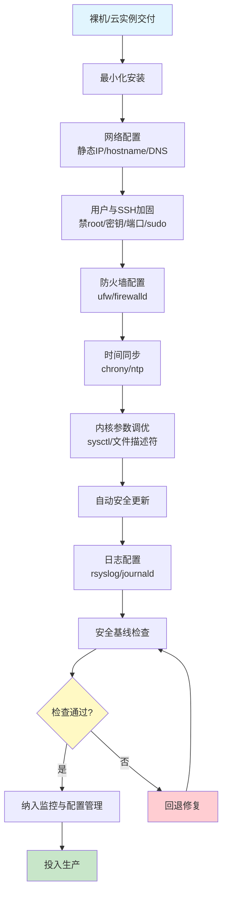
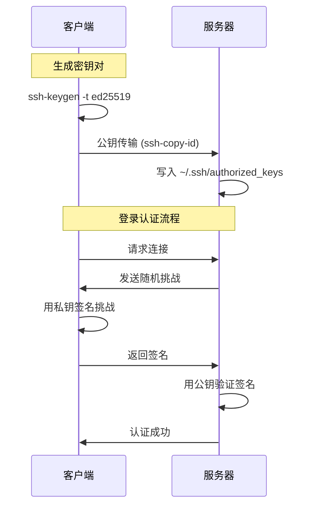
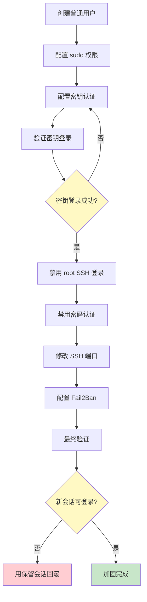
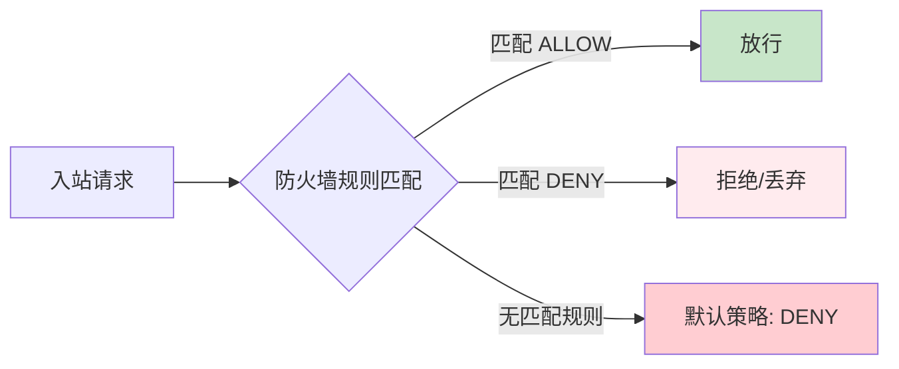
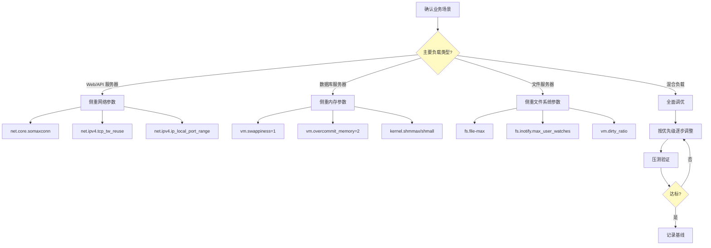
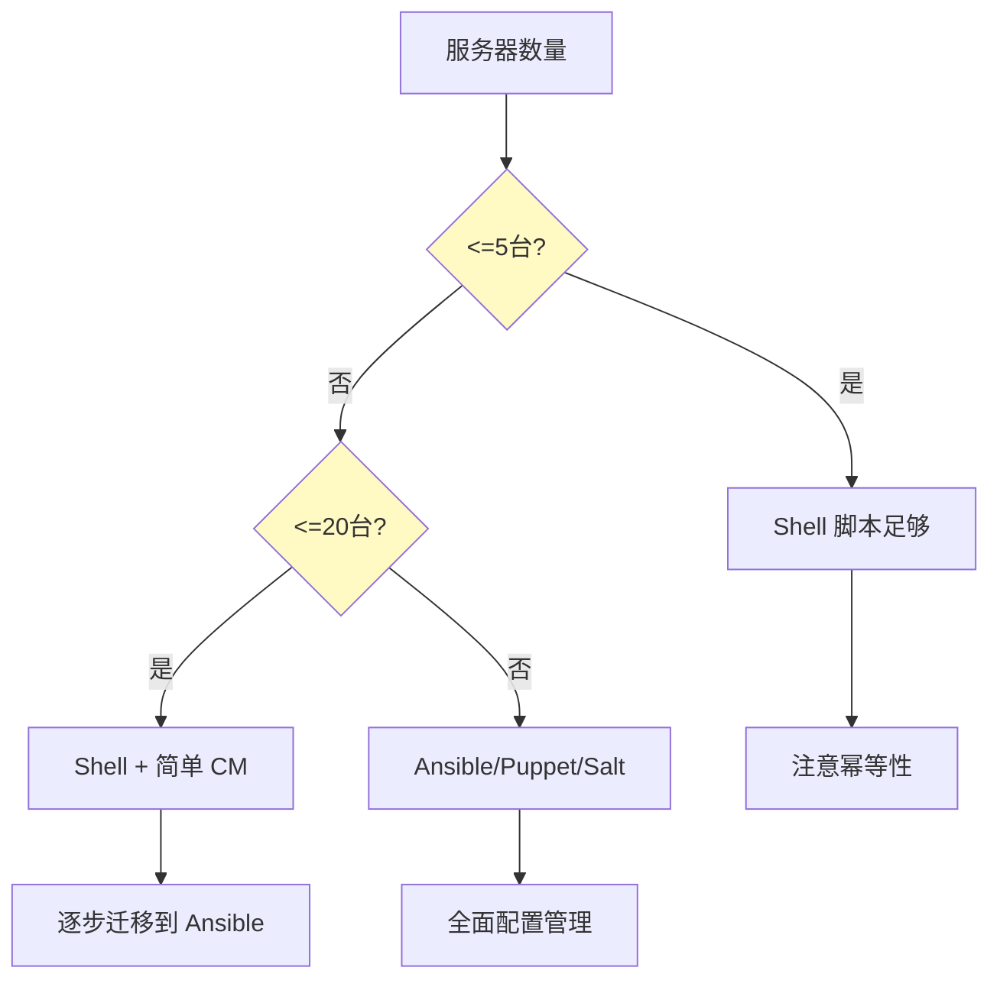

# 服务器初始化与加固

> 一台裸机从上架到可以承载生产流量，中间隔着一套严密的初始化与加固流程。省略任何一步，都可能成为日后安全事件的突破口。

## 服务器初始化 SOP 总览

在深入每个环节之前，先看完整的服务器初始化标准操作流程：



::: important 核心原则
**最小权限原则**贯穿整个初始化流程——只安装必要的软件包，只开放必要的端口，只授予必要的权限。每一项配置都应该是"默认拒绝，按需放行"。
:::

## 一、最小化安装原则

### 1.1 为什么选择最小化安装

生产服务器不是桌面系统，每一个多余的软件包都是潜在的攻击面。最小化安装的核心逻辑：

- **减少攻击面**：安装的软件越少，可被利用的漏洞越少
- **降低维护成本**：更少的包意味着更少的更新、更少的兼容性问题
- **节约资源**：磁盘空间、内存、CPU 周期不被无用服务占用
- **缩短启动时间**：更少的服务自启动，系统更快进入可用状态

### 1.2 主流发行版的最小化安装

**Ubuntu Server（cloud-image / minimal）**

```bash
# 使用 cloud-image 启动，这是 AWS/GCP/Azure 上 Ubuntu 的默认方式
# 本地安装时选择 "Minimal installation" 选项

# 安装后检查已安装包的数量
dpkg --get-selections | wc -l

# 对比：完整安装约 1800+ 包，最小化安装约 400-600 包
```

**CentOS / Rocky / AlmaLinux（Minimal ISO）**

```bash
# 下载 Minimal ISO 而非 DVD ISO
# Rocky Linux: Rocky-x.x-x-minimal-x86_64.iso

# 安装后检查
rpm -qa | wc -l

# 最小化安装通常在 300-500 个包
```

### 1.3 安装后的包清理

```bash
#!/bin/bash
# cleanup_packages.sh - 最小化安装后的包清理脚本

set -euo pipefail

echo "=== 清理不必要的软件包 ==="

# Ubuntu/Debian
if command -v apt &>/dev/null; then
    # 移除游戏、办公等非服务器软件
    apt remove -y --purge \
        nano \
        popularity-contest \
        ubuntu-advantage-tools \
        2>/dev/null || true

    # 自动移除不再需要的依赖
    apt autoremove -y --purge

    # 清理 apt 缓存
    apt clean

    echo "Ubuntu/Debian 清理完成"
fi

# CentOS/Rocky/AlmaLinux
if command -v dnf &>/dev/null; then
    # 移除非必要组件
    dnf remove -y \
        nano \
        postfix \
        2>/dev/null || true

    # 自动移除孤立包
    dnf autoremove -y

    # 清理 dnf 缓存
    dnf clean all

    echo "RHEL系 清理完成"
fi

echo "=== 清理完毕 ==="
```

::: warning 注意
清理包时务必确认不会影响业务依赖。建议在移除前先用 `apt remove --dry-run` 或 `dnn remove --dry-run` 模拟操作，确认无误后再执行。
:::

### 1.4 必装基础工具

最小化安装后，以下工具是运维的"吃饭家伙"，需要手动补装：

```bash
# Ubuntu/Debian
apt install -y \
    curl wget \
    vim \
    htop \
    net-tools dnsutils \
    tmux \
    tree \
    jq \
    rsync \
    unzip \
    logrotate \
    ca-certificates

# CentOS/Rocky/AlmaLinux
dnf install -y \
    curl wget \
    vim-minimal \
    htop \
    net-tools bind-utils \
    tmux \
    tree \
    jq \
    rsync \
    unzip \
    logrotate \
    ca-certificates
```

## 二、网络配置

### 2.1 配置静态 IP

生产服务器的 IP 地址不能靠 DHCP 随机分配——每次重启 IP 变了，上游的 DNS、负载均衡、防火墙规则全部失效。

**Ubuntu（Netplan）**

```yaml
# /etc/netplan/01-static.yaml
network:
  version: 2
  renderer: networkd
  ethernets:
    eth0:
      dhcp4: no
      addresses:
        - 192.168.1.100/24
      routes:
        - to: default
          via: 192.168.1.1
      nameservers:
        addresses:
          - 8.8.8.8
          - 8.8.4.4
        search:
          - internal.example.com
```

```bash
# 应用配置
netplan apply

# 验证
ip addr show eth0
ip route show
```

**CentOS/Rocky（nmcli / 配置文件）**

```bash
# 使用 nmcli 配置静态 IP
nmcli connection modify eth0 \
    ipv4.method manual \
    ipv4.addresses 192.168.1.100/24 \
    ipv4.gateway 192.168.1.1 \
    ipv4.dns "8.8.8.8 8.8.4.4"

nmcli connection up eth0

# 或者直接编辑配置文件
# /etc/sysconfig/network-scripts/ifcfg-eth0
```

```ini
# /etc/sysconfig/network-scripts/ifcfg-eth0
TYPE=Ethernet
BOOTPROTO=static
NAME=eth0
DEVICE=eth0
ONBOOT=yes
IPADDR=192.168.1.100
PREFIX=24
GATEWAY=192.168.1.1
DNS1=8.8.8.8
DNS2=8.8.4.4
```

### 2.2 配置主机名

主机名是服务器在集群中的身份标识，在日志排查、证书验证、分布式协调中至关重要。

```bash
# 设置主机名（立即生效 + 重启持久化）
hostnamectl set-hostname web-prod-01

# 验证
hostnamectl status

# 配置 /etc/hosts（确保本机解析正确）
cat >> /etc/hosts << 'EOF'
127.0.0.1   localhost
192.168.1.100  web-prod-01.internal.example.com  web-prod-01
192.168.1.101  web-prod-02.internal.example.com  web-prod-02
192.168.1.200  db-master-01.internal.example.com db-master-01
EOF
```

::: tip 主机名命名规范
推荐格式：`{角色}-{环境}-{编号}`，如 `web-prod-01`、`db-staging-02`、`cache-prod-03`。避免使用模糊名称如 `server1` 或 `test`。
:::

### 2.3 DNS 配置与验证

```bash
# 查看 DNS 解析顺序
# /etc/nsswitch.conf 中的 hosts 行决定了解析顺序
grep ^hosts /etc/nsswitch.conf
# 典型输出: hosts: files dns

# /etc/resolv.conf 配置
cat > /etc/resolv.conf << 'EOF'
nameserver 8.8.8.8
nameserver 8.8.4.4
search internal.example.com example.com
options timeout:2 attempts:3 rotate
EOF

# 防止 resolv.conf 被 DHCP 覆盖（Ubuntu + systemd-resolved）
# 方法1: 使用 netplan 的 nameservers 字段
# 方法2: 禁用 systemd-resolved 的 DNS stub
systemctl disable --now systemd-resolved
rm -f /etc/resolv.conf  # 删除符号链接
# 然后手动写入 /etc/resolv.conf

# DNS 验证
dig @8.8.8.8 example.com
nslookup web-prod-01.internal.example.com
```

### 2.4 网络连通性验证脚本

```bash
#!/bin/bash
# network_check.sh - 网络配置验证脚本

set -euo pipefail

PASS=0
FAIL=0

check() {
    local desc="$1"
    local cmd="$2"
    if eval "$cmd" &>/dev/null; then
        echo "  [PASS] $desc"
        ((PASS++))
    else
        echo "  [FAIL] $desc"
        ((FAIL++))
    fi
}

echo "=== 网络配置验证 ==="

check "默认网关可达"    "ping -c 1 -W 2 192.168.1.1"
check "外网连通"        "ping -c 1 -W 2 8.8.8.8"
check "DNS 解析"        "dig +short example.com | grep -q ."
check "主机名正确"      "hostnamectl | grep web-prod-01"
check "静态 IP 配置"    "ip addr show eth0 | grep 192.168.1.100"

echo ""
echo "结果: $PASS 通过, $FAIL 失败"
```

## 三、用户与 SSH 加固

SSH 是 Linux 服务器最重要的远程管理通道，也是最常被暴力破解的入口。加固 SSH 是服务器安全的第一道防线。

### 3.1 创建管理用户

```bash
# 创建管理员用户（禁止登录 shell 以外的所有方式）
useradd -m -s /bin/bash -G sudo deployadmin

# 设置强密码（作为密钥登录失败时的备用方式）
passwd deployadmin

# 配置 sudo 免密（仅限受控环境，生产建议需要密码）
cat > /etc/sudoers.d/deployadmin << 'EOF'
deployadmin ALL=(ALL) NOPASSWD: ALL
EOF
chmod 440 /etc/sudoers.d/deployadmin

# 验证 sudo 权限
su - deployadmin -c "sudo whoami"
# 预期输出: root
```

::: important sudo 最佳实践
1. **生产环境不建议 NOPASSWD**——sudo 密码是一次确认机制，防止误操作
2. 使用 `/etc/sudoers.d/` 目录管理规则，不要直接修改 `/etc/sudoers`
3. 遵循最小权限：只授予必要的命令，而非 ALL
4. 定期审计 sudo 使用记录：`/var/log/auth.log`（Ubuntu）或 `/var/log/secure`（CentOS）
:::

### 3.2 SSH 密钥认证配置



**客户端：生成密钥对**

```bash
# 推荐使用 ed25519（更安全、更短、更快）
ssh-keygen -t ed25519 -C "deployadmin@web-prod-01" -f ~/.ssh/web-prod-01

# 如果需要兼容老旧系统，使用 RSA（至少 4096 位）
ssh-keygen -t rsa -b 4096 -C "deployadmin@web-prod-01" -f ~/.ssh/web-prod-01-rsa

# 生成后检查
ls -la ~/.ssh/
# -rw-------  web-prod-01      (私钥，必须 600)
# -rw-r--r--  web-prod-01.pub  (公钥)

# 配置 SSH 客户端
cat >> ~/.ssh/config << 'EOF'
Host web-prod-01
    HostName 192.168.1.100
    Port 2222
    User deployadmin
    IdentityFile ~/.ssh/web-prod-01
    ServerAliveInterval 60
    ServerAliveCountMax 3
EOF
```

**服务器端：配置密钥**

```bash
# 方法1：使用 ssh-copy-id（推荐）
ssh-copy-id -i ~/.ssh/web-prod-01.pub -p 22 deployadmin@192.168.1.100

# 方法2：手动复制
mkdir -p /home/deployadmin/.ssh
cat >> /home/deployadmin/.ssh/authorized_keys << 'EOF'
ssh-ed25519 AAAAC3NzaC1lZDI1NTE5... deployadmin@web-prod-01
EOF
chown -R deployadmin:deployadmin /home/deployadmin/.ssh
chmod 700 /home/deployadmin/.ssh
chmod 600 /home/deployadmin/.ssh/authorized_keys
```

### 3.3 SSH 服务端加固

```bash
# 备份原始配置
cp /etc/ssh/sshd_config /etc/ssh/sshd_config.bak.$(date +%Y%m%d)
```

```bash
# /etc/ssh/sshd_config - 生产级加固配置

# ===== 监听配置 =====
Port 2222                          # 修改默认端口（减少99%的扫描噪音）
AddressFamily inet                  # 仅 IPv4（如不需要 IPv6）
ListenAddress 0.0.0.0              # 限制监听地址（可指定具体IP）

# ===== 认证配置 =====
PermitRootLogin no                  # 禁止 root 直接登录
PubkeyAuthentication yes            # 启用密钥认证
AuthorizedKeysFile .ssh/authorized_keys
PasswordAuthentication no           # 禁用密码认证（密钥登录后启用）
PermitEmptyPasswords no             # 禁止空密码
ChallengeResponseAuthentication no  # 禁用挑战响应认证
KbdInteractiveAuthentication no     # 禁用键盘交互认证
UsePAM no                           # 禁用 PAM（纯密钥认证时）

# ===== 加密算法 =====
# 只允许安全算法，移除弱算法
KexAlgorithms curve25519-sha256,curve25519-sha256@libssh.org,diffie-hellman-group16-sha512,diffie-hellman-group18-sha512
Ciphers chacha20-poly1305@openssh.com,aes256-gcm@openssh.com,aes128-gcm@openssh.com
MACs hmac-sha2-512-etm@openssh.com,hmac-sha2-256-etm@openssh.com
HostKeyAlgorithms ssh-ed25519,rsa-sha2-512,rsa-sha2-256

# ===== 会话配置 =====
MaxAuthTries 3                      # 最大认证尝试次数
LoginGraceTime 30                   # 登录超时30秒
MaxSessions 3                       # 最大并发会话数
MaxStartups 10:30:100              # 未认证连接限制

# ===== 保持连接 =====
ClientAliveInterval 300             # 5分钟无操作发送心跳
ClientAliveCountMax 2               # 2次无响应断开

# ===== 日志 =====
SyslogFacility AUTH
LogLevel VERBOSE                    # 详细日志（记录密钥指纹）

# ===== 其他安全选项 =====
X11Forwarding no                    # 禁用 X11 转发
AllowTcpForwarding no               # 禁用 TCP 转发（按需开启）
AllowAgentForwarding no             # 禁用 Agent 转发
PermitTunnel no                     # 禁用隧道
PrintMotd no                        # 不打印 MOTD（减少信息泄露）
Banner /etc/ssh/banner              # 登录前警告横幅

# ===== 访问控制 =====
AllowUsers deployadmin              # 仅允许指定用户登录
# DenyUsers root                    # 或用 DenyUsers 排除
```

**创建登录横幅**

```bash
cat > /etc/ssh/banner << 'EOF'
*******************************************************************
*  WARNING: Unauthorized access to this system is prohibited.    *
*  All connections are monitored and recorded.                    *
*  Disconnect IMMEDIATELY if you are not an authorized user.      *
*******************************************************************
EOF
```

**验证并重启 SSH**

```bash
# 验证配置语法（必须！防止配置错误导致无法登录）
sshd -t

# 如果返回无输出，说明配置正确
# 如果报错，检查行号和参数

# 重启 SSH 服务
systemctl restart sshd

# ⚠️ 关键：不要关闭当前 SSH 会话！
# 另开一个终端，用新配置测试登录
ssh -p 2222 deployadmin@192.168.1.100

# 确认新会话能登录后，再关闭旧会话
```

::: warning SSH 加固黄金法则
**在禁用密码认证和修改端口之前，务必先确认密钥登录可用。** 无数运维人员因为"先关了密码，发现密钥没配上"而被迫去机房。永远保持一个已连接的会话作为"安全绳"。
:::

### 3.4 Fail2Ban 防暴力破解

```bash
# 安装
apt install -y fail2ban    # Ubuntu
dnf install -y fail2ban    # CentOS/Rocky

# 配置
cat > /etc/fail2ban/jail.local << 'EOF'
[DEFAULT]
bantime = 3600
findtime = 600
maxretry = 3
banaction = iptables-multiport

[sshd]
enabled = true
port = 2222
filter = sshd
logpath = /var/log/auth.log
maxretry = 3
bantime = 7200
findtime = 300
EOF

# 启动
systemctl enable --now fail2ban

# 查看封禁状态
fail2ban-client status sshd

# 手动解封
fail2ban-client set sshd unbanip 1.2.3.4
```

### 3.5 禁用 root 登录的完整方案



## 四、防火墙配置

防火墙是网络层面的访问控制，配合 SSH 加固形成纵深防御。

### 4.1 UFW（Ubuntu/Debian）

```bash
# 安装（通常已预装）
apt install -y ufw

# 重置规则（全新配置前）
ufw --force reset

# 默认策略：拒绝所有入站，允许所有出站
ufw default deny incoming
ufw default allow outgoing

# 允许必要端口
ufw allow 2222/tcp comment 'SSH custom port'
ufw allow 80/tcp comment 'HTTP'
ufw allow 443/tcp comment 'HTTPS'

# 限制来源 IP 的规则（管理端口仅允许办公网段）
ufw allow from 10.0.0.0/8 to any port 2222 proto tcp comment 'SSH from office'

# 查看规则（带编号）
ufw status numbered

# 启用防火墙
ufw --force enable

# 验证
ufw status verbose
```

```
Status: active
Logging: on (low)
Default: deny (incoming), allow (outgoing), disabled (routed)

To                         Action      From
--                         ------      ----
2222/tcp                   ALLOW IN    10.0.0.0/8             (SSH from office)
80/tcp                     ALLOW IN    Anywhere               (HTTP)
443/tcp                    ALLOW IN    Anywhere               (HTTPS)
```

::: tip UFW 规则顺序
UFW 按规则从上到下匹配，**第一条匹配的规则生效**。更具体的规则（如限制来源 IP）应该放在更前面。使用 `ufw status numbered` 查看编号，用 `ufw insert 1 ...` 在指定位置插入规则。
:::

### 4.2 Firewalld（CentOS/Rocky/AlmaLinux）

```bash
# 安装并启动
dnf install -y firewalld
systemctl enable --now firewalld

# 查看默认区域
firewall-cmd --get-default-zone
# public

# 查看当前区域规则
firewall-cmd --list-all

# 添加服务/端口
firewall-cmd --permanent --add-service=http
firewall-cmd --permanent --add-service=https
firewall-cmd --permanent --add-port=2222/tcp

# 限制来源 IP（富规则）
firewall-cmd --permanent --add-rich-rule='
    rule family="ipv4"
    source address="10.0.0.0/8"
    port port="2222" protocol="tcp"
    accept'

# 重载配置
firewall-cmd --reload

# 验证
firewall-cmd --list-all
```

```
public (active)
  target: default
  icmp-block-inversion: no
  interfaces: eth0
  services: http https
  ports: 2222/tcp
  rich rules:
    rule family="ipv4" source address="10.0.0.0/8" port port="2222" protocol="tcp" accept
```

### 4.3 防火墙规则设计原则



| 原则 | 说明 | 示例 |
|------|------|------|
| 默认拒绝 | 所有未明确允许的流量一律拒绝 | `ufw default deny incoming` |
| 最小开放 | 只开放业务必需的端口 | 只开 80/443，不开 3306 |
| 限制来源 | 管理端口限制来源 IP | SSH 仅允许办公网段 |
| 规则注释 | 每条规则加注释说明用途 | `comment 'API gateway'` |
| 定期审计 | 每季度审查规则，移除不再需要的 | `ufw status numbered` |

## 五、时间同步

时间看起来不起眼，但在分布式系统中，时间不一致会导致：
- TLS 证书验证失败
- 日志无法对齐排查
- 分布式锁失效
- 数据库复制中断

### 5.1 Chrony 配置（推荐）

Chrony 是 NTP 的现代替代，启动更快、同步更准、对网络中断更健壮。

```bash
# 安装
apt install -y chrony       # Ubuntu
dnf install -y chrony       # CentOS/Rocky

# 配置
cat > /etc/chrony/chrony.conf << 'EOF'
# 使用国内 NTP 源（阿里云）
server ntp1.aliyun.com iburst
server ntp2.aliyun.com iburst
server ntp3.aliyun.com iburst

# 允许本地作为 NTP 服务器（局域网内其他机器同步）
# allow 192.168.1.0/24

# 漂移文件
driftfile /var/lib/chrony/drift

# 日志
logdir /var/log/chrony

# 同步频率
makestep 1.0 3
rtcsync
EOF

# 启动
systemctl enable --now chronyd

# 验证同步状态
chronyc tracking
```

```
Reference ID    : A817A817 (ntp1.aliyun.com)
Stratum         : 3
Ref time (UTC)  : Thu Jun 04 08:30:00 2026
System time     : 0.000001234 seconds fast of NTP time
Last offset     : +0.000012345 seconds
RMS offset      : 0.000023456 seconds
Frequency       : 1.234 ppm fast
Residual freq   : +0.001 ppm
Skew            : 0.123 ppm
Root delay      : 0.012345 seconds
Root dispersion : 0.001234 seconds
Update interval : 1032.0 seconds
Leap status     : Normal
```

```bash
# 查看 NTP 源状态
chronyc sources -v

# 立即同步
chronyc -a makestep

# 检查硬件时钟
timedatectl status
```

### 5.2 时区配置

```bash
# 设置时区为东八区
timedatectl set-timezone Asia/Shanghai

# 验证
timedatectl
```

```
               Local time: Thu 2026-06-04 16:30:00 CST
           Universal time: Thu 2026-06-04 08:30:00 UTC
                 RTC time: Thu 2026-06-04 08:30:00
                Time zone: Asia/Shanghai (CST, +0800)
System clock synchronized: yes
              NTP service: active
          RTC in local TZ: no
```

::: important 时区一致性
**集群内所有服务器的时区必须一致。** 推荐统一使用 `UTC`（日志用 UTC 时间戳，显示层做时区转换），或统一使用 `Asia/Shanghai`。混用时区是排查时间相关问题的噩梦。
:::

## 六、内核参数调优

内核参数直接决定系统的网络性能、文件处理能力、内存管理策略。生产环境必须根据业务场景调优。

### 6.1 sysctl 调优配置

```bash
# 备份原始配置
cp /etc/sysctl.conf /etc/sysctl.conf.bak.$(date +%Y%m%d)
```

```bash
# /etc/sysctl.d/99-production.conf
# 生产级内核参数调优

# ===== 网络优化 =====

# TCP 连接队列
net.core.somaxconn = 65535

# TCP 接收/发送缓冲区
net.core.rmem_max = 16777216
net.core.wmem_max = 16777216
net.core.rmem_default = 262144
net.core.wmem_default = 262144
net.ipv4.tcp_rmem = 4096 87380 16777216
net.ipv4.tcp_wmem = 4096 65536 16777216

# TCP 连接保持
net.ipv4.tcp_keepalive_time = 600
net.ipv4.tcp_keepalive_intvl = 30
net.ipv4.tcp_keepalive_probes = 3

# TCP 快速回收与复用
net.ipv4.tcp_tw_reuse = 1
net.ipv4.tcp_fin_timeout = 15

# SYN 队列（防范 SYN Flood）
net.ipv4.tcp_max_syn_backlog = 65535
net.ipv4.tcp_syncookies = 1

# 本地端口范围（出站连接）
net.ipv4.ip_local_port_range = 1024 65535

# ===== 安全加固 =====

# 禁用 ICMP 重定向
net.ipv4.conf.all.accept_redirects = 0
net.ipv4.conf.default.accept_redirects = 0
net.ipv4.conf.all.send_redirects = 0
net.ipv4.conf.default.send_redirects = 0

# 禁用源路由
net.ipv4.conf.all.accept_source_route = 0
net.ipv4.conf.default.accept_source_route = 0

# 记录可疑包
net.ipv4.conf.all.log_martians = 1
net.ipv4.conf.default.log_martians = 1

# 禁用 IPv6（如不需要）
net.ipv6.conf.all.disable_ipv6 = 1
net.ipv6.conf.default.disable_ipv6 = 1

# ===== 内存管理 =====

# 共享内存
kernel.shmmax = 68719476736
kernel.shmall = 4294967296

# overcommit 策略（数据库服务器建议 2）
# 0 = 启发式（默认）
# 1 = 总是允许
# 2 = 不允许超过 swap + vm.overcommit_ratio * RAM
vm.overcommit_memory = 0
vm.overcommit_ratio = 50

# swappiness（越低越少用 swap，生产建议 1-10）
vm.swappiness = 1

# ===== 文件系统 =====

# 最大文件句柄数
fs.file-max = 1048576

# inotify 上限（日志采集/文件监控场景）
fs.inotify.max_user_watches = 524288
fs.inotify.max_user_instances = 512

# ===== 内核安全 =====

# 禁用 SysRq
kernel.sysrq = 0

# 核心转储
kernel.core_uses_pid = 1

# ASLR（地址空间随机化，2 = 完全随机化）
kernel.randomize_va_space = 2
```

```bash
# 应用配置
sysctl -p /etc/sysctl.d/99-production.conf

# 验证关键参数
sysctl net.core.somaxconn
sysctl vm.swappiness
sysctl fs.file-max
```

### 6.2 文件描述符限制

Linux 默认的文件描述符上限（1024）对生产环境远远不够——每个网络连接、每个打开的文件、每个日志写入都消耗一个文件描述符。

```bash
# 查看当前限制
ulimit -n
# 默认: 1024

# 查看系统级上限
cat /proc/sys/fs/file-max
# 1048576
```

```bash
# /etc/security/limits.d/99-nofile.conf
# 软限制和硬限制

# 全局默认
* soft nofile 65535
* hard nofile 65535

# root 用户
root soft nofile 1048576
root hard nofile 1048576

# 特定服务用户
nginx soft nofile 1048576
nginx hard nofile 1048576
mysql soft nofile 1048576
mysql hard nofile 1048576
```

```bash
# 对于 systemd 管理的服务，还需要在 service 文件中配置
# /etc/systemd/system/nginx.service
[Service]
LimitNOFILE=1048576

# 或者全局配置
mkdir -p /etc/systemd/system.service.d
cat > /etc/systemd/system.service.d/limits.conf << 'EOF'
[Service]
LimitNOFILE=1048576
EOF

# 重载 systemd
systemctl daemon-reload
```

::: warning 文件描述符的三层限制
文件描述符受三层限制约束，必须全部配置才能生效：
1. **系统级**：`fs.file-max`（sysctl）—— 全局上限
2. **用户级**：`/etc/security/limits.conf` —— 用户/进程上限
3. **进程级**：`LimitNOFILE`（systemd）—— 服务进程上限

任何一层未配置，其他层的配置都可能不生效。
:::

### 6.3 内核参数调优决策树



## 七、自动安全更新

### 7.1 Ubuntu：unattended-upgrades

```bash
# 安装
apt install -y unattended-upgrades apt-listchanges

# 自动配置
dpkg-reconfigure -plow unattended-upgrades

# 手动配置
cat > /etc/apt/apt.conf.d/50unattended-upgrades << 'EOF'
// 自动更新配置
Unattended-Upgrade::Allowed-Origins {
    "${distro_id}:${distro_codename}-security";
    "${distro_id}ESMApps:${distro_codename}-apps-security";
    "${distro_id}ESM:${distro_codename}-infra-security";
};

// 不自动更新的包（内核、数据库等需要验证后手动更新）
Unattended-Upgrade::Package-Blacklist {
    "linux-image-*";
    "mysql-server-*";
    "postgresql-*";
};

// 自动清理旧内核
Unattended-Upgrade::Remove-Unused-Kernel-Packages "true";
Unattended-Upgrade::Remove-New-Unused-Dependencies "true";
Unattended-Upgrade::Remove-Unused-Dependencies "true";

// 自动重启（如果需要）
Unattended-Upgrade::Automatic-Reboot "false";
// 如果启用重启，设定时间
// Unattended-Upgrade::Automatic-Reboot-Time "03:00";

// 邮件通知（可选）
// Unattended-Upgrade::Mail "admin@example.com";
// Unattended-Upgrade::MailOnlyOnError "true";

// 日志
Unattended-Upgrade::SyslogEnable "true";
Unattended-Upgrade::SyslogFacility "daemon";
EOF

# 启用自动更新
cat > /etc/apt/apt.conf.d/20auto-upgrades << 'EOF'
APT::Periodic::Update-Package-Lists "1";
APT::Periodic::Unattended-Upgrade "1";
APT::Periodic::Download-Upgradeable-Packages "1";
APT::Periodic::AutocleanInterval "7";
EOF

# 验证配置
unattended-upgrade --dry-run --debug
```

### 7.2 CentOS/Rocky：dnf-automatic

```bash
# 安装
dnf install -y dnf-automatic

# 配置
cat > /etc/dnf/automatic.conf << 'EOF'
[commands]
upgrade_type = security
download_updates = yes
apply_updates = yes
reboot = never

[emitters]
emit_via = stdio

[email]
email_from = root@example.com
email_to = admin@example.com
email_host = localhost

[base]
debuglevel = 1
EOF

# 启用定时器
systemctl enable --now dnf-automatic.timer

# 验证定时器状态
systemctl list-timers dnf-automatic.timer
```

::: info 安全更新策略
- **安全补丁**：自动安装（通常无破坏性变更）
- **功能更新**：测试环境验证后再手动安装
- **大版本升级**：必须有完整的回滚方案
- **内核更新**：需要重启，在维护窗口操作
:::

## 八、日志配置

日志是排查问题的"黑匣子"，配置得当可以在故障发生时提供关键线索。

### 8.1 rsyslog 配置

```bash
# 安装（通常已预装）
apt install -y rsyslog

# 配置远程日志转发（将日志集中到日志服务器）
cat > /etc/rsyslog.d/50-forward.conf << 'EOF'
# 转发所有日志到远程日志服务器
*.* @@log-server.internal.example.com:514;RSYSLOG_TraditionalFileFormat

# 本地也保留一份
$ActionQueueType LinkedList
$ActionQueueFileName fwdqueue
$ActionResumeRetryCount -1    # 无限重试
$ActionQueueSaveOnShutdown on  # 关机时保存队列
EOF

# 自定义日志分类
cat > /etc/rsyslog.d/40-app.conf << 'EOF'
# 应用日志单独存储
if $programname startswith 'nginx' then /var/log/nginx/nginx.log
& stop

if $programname startswith 'myapp' then /var/log/myapp/myapp.log
& stop
EOF

# 重启
systemctl restart rsyslog
```

### 8.2 journald 配置

```bash
# 配置
mkdir -p /etc/systemd/journald.conf.d
cat > /etc/systemd/journald.conf.d/99-production.conf << 'EOF'
[Journal]
# 日志存储方式：persistent（持久化）、volatile（内存）、auto
Storage=persistent

# 日志文件最大占用空间
SystemMaxUse=2G
SystemMaxFileSize=100M

# 日志保留天数
MaxRetentionSec=30day

# 转发到 syslog
ForwardToSyslog=yes

# 转发到终端
ForwardToConsole=no

# 日志级别
MaxLevelStore=info
MaxLevelSyslog=info
EOF

# 重启
systemctl restart systemd-journald

# 常用查询命令
journalctl --since "1 hour ago"              # 最近1小时
journalctl -u nginx.service --since today    # nginx服务今日日志
journalctl -p err                             # 仅错误级别
journalctl -f                                 # 实时跟踪
journalctl --disk-usage                       # 日志占用空间
```

### 8.3 日志轮转配置

```bash
# /etc/logrotate.d/nginx
/var/log/nginx/*.log {
    daily
    missingok
    rotate 30
    compress
    delaycompress
    notifempty
    create 0640 nginx adm
    sharedscripts
    postrotate
        [ -f /var/run/nginx.pid ] && kill -USR1 $(cat /var/run/nginx.pid)
    endscript
}

# /etc/logrotate.d/myapp
/var/log/myapp/*.log {
    daily
    missingok
    rotate 14
    compress
    delaycompress
    notifempty
    copytruncate       # 不需要重启服务
    size 100M           # 超过100M也轮转
    dateext             # 用日期做后缀
    dateformat -%Y%m%d
}
```

```bash
# 手动测试轮转配置
logrotate -d /etc/logrotate.d/nginx    # 调试模式（不实际执行）
logrotate -f /etc/logrotate.d/nginx    # 强制执行
```

## 九、安全基线检查

初始化完成后，执行一次完整的安全基线检查：

```bash
#!/bin/bash
# security_baseline_check.sh - 安全基线检查脚本

set -euo pipefail

RED='\033[0;31m'
GREEN='\033[0;32m'
YELLOW='\033[1;33m'
NC='\033[0m'

PASS=0
FAIL=0
WARN=0

check() {
    local level="$1"
    local desc="$2"
    local cmd="$3"

    if eval "$cmd" &>/dev/null; then
        echo -e "  ${GREEN}[PASS]${NC} $desc"
        ((PASS++))
    else
        case $level in
            critical)
                echo -e "  ${RED}[FAIL]${NC} $desc"
                ((FAIL++))
                ;;
            warning)
                echo -e "  ${YELLOW}[WARN]${NC} $desc"
                ((WARN++))
                ;;
        esac
    fi
}

echo "========================================"
echo "  服务器安全基线检查"
echo "  主机: $(hostname)"
echo "  时间: $(date '+%Y-%m-%d %H:%M:%S')"
echo "========================================"

echo ""
echo "--- SSH 配置 ---"
check critical "Root SSH 登录已禁用" "grep -q '^PermitRootLogin no' /etc/ssh/sshd_config"
check critical "密码认证已禁用" "grep -q '^PasswordAuthentication no' /etc/ssh/sshd_config"
check critical "密钥认证已启用" "grep -q '^PubkeyAuthentication yes' /etc/ssh/sshd_config"
check warning  "SSH 端口已修改" "! grep -q '^Port 22' /etc/ssh/sshd_config"

echo ""
echo "--- 防火墙 ---"
check critical "UFW/Firewalld 已启用" "ufw status | grep -q 'Status: active' || firewall-cmd --state | grep -q running"

echo ""
echo "--- 用户与权限 ---"
check critical "root 密码已锁定" "passwd -S root | grep -q 'L'"
check warning  "sudo 用户存在" "getent group sudo | grep -q . || getent group wheel | grep -q ."

echo ""
echo "--- 时间同步 ---"
check critical "NTP 同步已启用" "timedatectl | grep -q 'NTP synchronized: yes' || chronyc tracking | grep -q 'Leap status.*Normal'"

echo ""
echo "--- 内核参数 ---"
check warning  "somaxconn >= 65535" "[ $(sysctl -n net.core.somaxconn) -ge 65535 ]"
check warning  "swappiness <= 10" "[ $(sysctl -n vm.swappiness) -le 10 ]"
check warning  "file-max >= 1048576" "[ $(sysctl -n fs.file-max) -ge 1048576 ]"

echo ""
echo "--- 文件描述符 ---"
check warning  "nofile >= 65535" "[ $(ulimit -n) -ge 65535 ]"

echo ""
echo "--- 自动更新 ---"
check warning  "自动安全更新已启用" "test -f /etc/apt/apt.conf.d/20auto-upgrades || systemctl is-active dnf-automatic.timer"

echo ""
echo "--- 日志 ---"
check critical "rsyslog 已运行" "systemctl is-active rsyslog"
check critical "journald 已运行" "systemctl is-active systemd-journald"

echo ""
echo "========================================"
echo -e "  ${GREEN}PASS: $PASS${NC}  ${RED}FAIL: $FAIL${NC}  ${YELLOW}WARN: $WARN${NC}"
echo "========================================"

if [ "$FAIL" -gt 0 ]; then
    echo -e "  ${RED}存在严重安全问题，请立即修复！${NC}"
    exit 1
fi
```

## 十、自动化初始化脚本

### 10.1 Shell 一键初始化脚本

```bash
#!/bin/bash
# server_init.sh - 服务器一键初始化脚本
# 用法: sudo bash server_init.sh --hostname web-prod-01 --ip 192.168.1.100 --user deployadmin
# 适用: Ubuntu 22.04/24.04, CentOS/Rocky 8/9

set -euo pipefail

# ===== 参数解析 =====
HOSTNAME=""
IP_ADDR=""
ADMIN_USER="deployadmin"
SSH_PORT=2222

while [[ $# -gt 0 ]]; do
    case $1 in
        --hostname) HOSTNAME="$2"; shift 2 ;;
        --ip) IP_ADDR="$2"; shift 2 ;;
        --user) ADMIN_USER="$2"; shift 2 ;;
        --ssh-port) SSH_PORT="$2"; shift 2 ;;
        *) echo "未知参数: $1"; exit 1 ;;
    esac
done

if [ -z "$HOSTNAME" ] || [ -z "$IP_ADDR" ]; then
    echo "用法: $0 --hostname <主机名> --ip <IP地址> [--user <用户名>] [--ssh-port <端口>]"
    exit 1
fi

echo "=========================================="
echo "  服务器初始化"
echo "  主机名: $HOSTNAME"
echo "  IP: $IP_ADDR"
echo "  管理用户: $ADMIN_USER"
echo "  SSH端口: $SSH_PORT"
echo "=========================================="

# ===== 1. 系统更新 =====
echo ">>> [1/9] 系统更新..."
if command -v apt &>/dev/null; then
    apt update && apt upgrade -y
    apt install -y curl wget vim htop net-tools tmux tree jq rsync unzip ca-certificates
elif command -v dnf &>/dev/null; then
    dnf update -y
    dnf install -y curl wget vim htop net-tools tmux tree jq rsync unzip ca-certificates
fi

# ===== 2. 主机名 =====
echo ">>> [2/9] 设置主机名..."
hostnamectl set-hostname "$HOSTNAME"

# ===== 3. 用户创建 =====
echo ">>> [3/9] 创建管理用户..."
if ! id "$ADMIN_USER" &>/dev/null; then
    useradd -m -s /bin/bash "$ADMIN_USER"
    # 设置随机密码
    RANDOM_PASS=$(openssl rand -base64 16)
    echo "$ADMIN_USER:$RANDOM_PASS" | chpasswd
    echo "管理用户密码: $RANDOM_PASS（请妥善保管后删除此记录）"
fi

# sudo 权限
if command -v apt &>/dev/null; then
    usermod -aG sudo "$ADMIN_USER"
elif command -v dnf &>/dev/null; then
    usermod -aG wheel "$ADMIN_USER"
fi

# ===== 4. SSH 加固 =====
echo ">>> [4/9] SSH 加固..."
cp /etc/ssh/sshd_config /etc/ssh/sshd_config.bak.$(date +%Y%m%d)

# 修改 SSH 配置
sed -i "s/^#*Port .*/Port $SSH_PORT/" /etc/ssh/sshd_config
sed -i 's/^#*PermitRootLogin .*/PermitRootLogin no/' /etc/ssh/sshd_config
sed -i 's/^#*PasswordAuthentication .*/PasswordAuthentication no/' /etc/ssh/sshd_config
sed -i 's/^#*PubkeyAuthentication .*/PubkeyAuthentication yes/' /etc/ssh/sshd_config
sed -i 's/^#*MaxAuthTries .*/MaxAuthTries 3/' /etc/ssh/sshd_config

# ===== 5. 防火墙 =====
echo ">>> [5/9] 防火墙配置..."
if command -v ufw &>/dev/null; then
    ufw default deny incoming
    ufw default allow outgoing
    ufw allow "$SSH_PORT"/tcp comment 'SSH'
    ufw allow 80/tcp comment 'HTTP'
    ufw allow 443/tcp comment 'HTTPS'
    ufw --force enable
elif command -v firewall-cmd &>/dev/null; then
    systemctl enable --now firewalld
    firewall-cmd --permanent --add-port="$SSH_PORT"/tcp
    firewall-cmd --permanent --add-service=http
    firewall-cmd --permanent --add-service=https
    firewall-cmd --reload
fi

# ===== 6. 时间同步 =====
echo ">>> [6/9] 时间同步..."
timedatectl set-timezone Asia/Shanghai
if command -v apt &>/dev/null; then
    apt install -y chrony
elif command -v dnf &>/dev/null; then
    dnf install -y chrony
fi
systemctl enable --now chronyd

# ===== 7. 内核调优 =====
echo ">>> [7/9] 内核参数调优..."
cat > /etc/sysctl.d/99-production.conf << 'SYSCTL'
net.core.somaxconn = 65535
net.ipv4.tcp_tw_reuse = 1
net.ipv4.tcp_fin_timeout = 15
net.ipv4.tcp_keepalive_time = 600
net.ipv4.tcp_max_syn_backlog = 65535
net.ipv4.tcp_syncookies = 1
net.ipv4.ip_local_port_range = 1024 65535
vm.swappiness = 1
fs.file-max = 1048576
kernel.sysrq = 0
kernel.randomize_va_space = 2
SYSCTL
sysctl -p /etc/sysctl.d/99-production.conf

# 文件描述符
cat > /etc/security/limits.d/99-nofile.conf << 'EOF'
* soft nofile 65535
* hard nofile 65535
root soft nofile 1048576
root hard nofile 1048576
EOF

# ===== 8. 自动安全更新 =====
echo ">>> [8/9] 自动安全更新..."
if command -v apt &>/dev/null; then
    apt install -y unattended-upgrades
    cat > /etc/apt/apt.conf.d/20auto-upgrades << 'EOF'
APT::Periodic::Update-Package-Lists "1";
APT::Periodic::Unattended-Upgrade "1";
APT::Periodic::Download-Upgradeable-Packages "1";
APT::Periodic::AutocleanInterval "7";
EOF
elif command -v dnf &>/dev/null; then
    dnf install -y dnf-automatic
    sed -i 's/^upgrade_type.*/upgrade_type = security/' /etc/dnf/automatic.conf
    sed -i 's/^apply_updates.*/apply_updates = yes/' /etc/dnf/automatic.conf
    systemctl enable --now dnf-automatic.timer
fi

# ===== 9. 日志配置 =====
echo ">>> [9/9] 日志配置..."
mkdir -p /etc/systemd/journald.conf.d
cat > /etc/systemd/journald.conf.d/99-production.conf << 'EOF'
[Journal]
Storage=persistent
SystemMaxUse=2G
MaxRetentionSec=30day
ForwardToSyslog=yes
EOF
systemctl restart systemd-journald

echo ""
echo "=========================================="
echo "  初始化完成！"
echo "=========================================="
echo ""
echo "  ⚠️  下一步操作："
echo "  1. 将你的 SSH 公钥添加到 /home/$ADMIN_USER/.ssh/authorized_keys"
echo "  2. 测试密钥登录: ssh -p $SSH_PORT $ADMIN_USER@$IP_ADDR"
echo "  3. 确认密钥登录成功后，重启 SSH 服务: systemctl restart sshd"
echo "  4. 运行安全基线检查脚本验证"
echo ""
echo "  ⚠️  请勿关闭当前会话，直到确认新 SSH 登录可用！"
```

### 10.2 Ansible 自动化初始化

Shell 脚本适合单机，管理多台服务器需要 Ansible 这样的配置管理工具。

**项目结构**

```
ansible-server-init/
├── inventory/
│   ├── production.yml
│   └── staging.yml
├── group_vars/
│   ├── all.yml
│   └── web_servers.yml
├── playbooks/
│   └── init.yml
├── roles/
│   ├── base/
│   ├── ssh/
│   ├── firewall/
│   ├── chrony/
│   ├── sysctl/
│   └── logging/
└── ansible.cfg
```

**主 Playbook**

```yaml
# playbooks/init.yml
---
- name: 服务器初始化与加固
  hosts: all
  become: true
  serial: 2  # 滚动执行，每次2台

  pre_tasks:
    - name: 检查是否为受支持的系统
      assert:
        that:
          - ansible_os_family in ['Debian', 'RedHat']
        fail_msg: "不支持的操作系统: {{ ansible_os_family }}"

    - name: 收集系统信息
      setup:

  roles:
    - role: base
      tags: [base]

    - role: ssh
      tags: [ssh]

    - role: firewall
      tags: [firewall]

    - role: chrony
      tags: [chrony]

    - role: sysctl
      tags: [sysctl]

    - role: logging
      tags: [logging]

  post_tasks:
    - name: 初始化完成通知
      debug:
        msg: "服务器 {{ inventory_hostname }} 初始化完成"
```

**SSH 加固 Role**

```yaml
# roles/ssh/defaults/main.yml
---
ssh_port: 2222
ssh_permit_root_login: "no"
ssh_password_authentication: "no"
ssh_pubkey_authentication: "yes"
ssh_max_auth_tries: 3
ssh_client_alive_interval: 300
ssh_client_alive_count_max: 2
ssh_admin_user: "deployadmin"
```

```yaml
# roles/ssh/tasks/main.yml
---
- name: 创建管理用户
  ansible.builtin.user:
    name: "{{ ssh_admin_user }}"
    shell: /bin/bash
    groups: "{{ 'sudo' if ansible_os_family == 'Debian' else 'wheel' }}"
    append: true

- name: 部署 SSH 公钥
  ansible.posix.authorized_key:
    user: "{{ ssh_admin_user }}"
    key: "{{ lookup('file', item) }}"
  loop: "{{ ssh_authorized_keys }}"

- name: 部署 sshd 配置
  ansible.builtin.template:
    src: sshd_config.j2
    dest: /etc/ssh/sshd_config
    owner: root
    group: root
    mode: '0600'
    validate: '/usr/sbin/sshd -t -f %s'
    backup: true
  notify: Restart sshd

- name: 确保 sshd 服务已启用
  ansible.builtin.service:
    name: sshd
    state: started
    enabled: true
```

```jinja2
{# roles/ssh/templates/sshd_config.j2 #}
# 由 Ansible 管理，请勿手动修改

Port {{ ssh_port }}
AddressFamily inet
PermitRootLogin {{ ssh_permit_root_login }}
PubkeyAuthentication {{ ssh_pubkey_authentication }}
PasswordAuthentication {{ ssh_password_authentication }}
PermitEmptyPasswords no
MaxAuthTries {{ ssh_max_auth_tries }}
ClientAliveInterval {{ ssh_client_alive_interval }}
ClientAliveCountMax {{ ssh_client_alive_count_max }}
X11Forwarding no
AllowUsers {{ ssh_admin_user }}
```

```yaml
# roles/ssh/handlers/main.yml
---
- name: Restart sshd
  ansible.builtin.service:
    name: sshd
    state: restarted
```

**sysctl Role**

```yaml
# roles/sysctl/defaults/main.yml
---
sysctl_config:
  net.core.somaxconn: 65535
  net.ipv4.tcp_tw_reuse: 1
  net.ipv4.tcp_fin_timeout: 15
  net.ipv4.tcp_keepalive_time: 600
  net.ipv4.tcp_max_syn_backlog: 65535
  net.ipv4.tcp_syncookies: 1
  net.ipv4.ip_local_port_range: "1024 65535"
  net.ipv4.conf.all.accept_redirects: 0
  net.ipv4.conf.default.accept_redirects: 0
  vm.swappiness: 1
  fs.file-max: 1048576
  kernel.sysrq: 0
  kernel.randomize_va_space: 2
```

```yaml
# roles/sysctl/tasks/main.yml
---
- name: 部署 sysctl 配置
  ansible.posix.sysctl:
    name: "{{ item.key }}"
    value: "{{ item.value }}"
    sysctl_set: true
    state: present
    reload: true
  loop: "{{ sysctl_config | dict2items }}"
```

**执行 Ansible**

```bash
# 检查模式（dry-run）
ansible-playbook -i inventory/production.yml playbooks/init.yml --check --diff

# 执行（限速，防止同时修改所有服务器）
ansible-playbook -i inventory/production.yml playbooks/init.yml --forks 5

# 仅执行 SSH 角色
ansible-playbook -i inventory/production.yml playbooks/init.yml --tags ssh

# 限制目标主机
ansible-playbook -i inventory/production.yml playbooks/init.yml --limit web-prod-01
```

::: tip Ansible 最佳实践
1. **始终使用 `--check --diff` 先预检**——看到变更内容再执行
2. **`serial` 控制滚动批次**——避免同时修改所有服务器
3. **`validate` 指令**——在修改配置前验证语法（如 sshd -t）
4. **`backup: true`**——自动备份被修改的文件
5. **使用角色（Role）组织**——每个功能模块独立，可单独执行
:::

### 10.3 Ansible vs Shell 初始化对比

| 特性 | Shell 脚本 | Ansible |
|------|-----------|---------|
| 适用场景 | 单机初始化 | 批量管理 |
| 幂等性 | 需要自己实现 | 内置保证 |
| 可维护性 | 大脚本难维护 | 角色化、模块化 |
| 报告 | echo 输出 | 结构化输出 |
| 回滚 | 需要手动处理 | 可用 `--diff` 预检 |
| 学习成本 | 低 | 中 |
| 依赖 | 仅需 bash | 需要 Python + Ansible |



## 十一、初始化后的验证清单

所有配置完成后，使用以下清单逐项验证：

```bash
#!/bin/bash
# post_init_verify.sh - 初始化后验证清单

echo "========== 服务器初始化验证 =========="
echo "主机: $(hostname)"
echo "时间: $(date)"
echo ""

# 1. 系统信息
echo "--- 系统信息 ---"
echo "OS: $(cat /etc/os-release | grep PRETTY_NAME | cut -d= -f2 | tr -d '\"')"
echo "内核: $(uname -r)"
echo "运行时间: $(uptime -p)"
echo ""

# 2. 网络
echo "--- 网络 ---"
echo "IP: $(hostname -I)"
echo "网关: $(ip route | grep default | awk '{print $3}')"
echo "DNS: $(grep nameserver /etc/resolv.conf | head -2)"
echo ""

# 3. SSH
echo "--- SSH ---"
echo "监听端口: $(grep ^Port /etc/ssh/sshd_config)"
echo "Root登录: $(grep ^PermitRootLogin /etc/ssh/sshd_config)"
echo "密码认证: $(grep ^PasswordAuthentication /etc/ssh/sshd_config)"
echo "管理用户: $(grep ^AllowUsers /etc/ssh/sshd_config)"
echo ""

# 4. 防火墙
echo "--- 防火墙 ---"
if command -v ufw &>/dev/null; then
    ufw status
elif command -v firewall-cmd &>/dev/null; then
    firewall-cmd --state
    firewall-cmd --list-all
fi
echo ""

# 5. 时间
echo "--- 时间同步 ---"
timedatectl | grep -E "Time zone|NTP synchronized|Local time"
chronyc tracking | grep -E "Reference ID|Stratum|Last offset"
echo ""

# 6. 资源限制
echo "--- 资源限制 ---"
echo "文件描述符(软): $(ulimit -Sn)"
echo "文件描述符(硬): $(ulimit -Hn)"
echo "系统文件句柄上限: $(cat /proc/sys/fs/file-max)"
echo "当前使用文件句柄: $(cat /proc/sys/fs/file-nr | awk '{print $1}')"
echo ""

# 7. 内核参数
echo "--- 关键内核参数 ---"
echo "somaxconn: $(sysctl -n net.core.somaxconn)"
echo "swappiness: $(sysctl -n vm.swappiness)"
echo "tcp_tw_reuse: $(sysctl -n net.ipv4.tcp_tw_reuse)"
echo ""

# 8. 服务状态
echo "--- 关键服务状态 ---"
for svc in sshd chronyd rsyslog; do
    if systemctl is-active "$svc" &>/dev/null; then
        echo "  $svc: running"
    else
        echo "  $svc: STOPPED"
    fi
done
echo ""

echo "========== 验证完毕 =========="
```

## 十二、持续安全维护

初始化只是起点，服务器安全需要持续维护：

| 频率 | 任务 | 说明 |
|------|------|------|
| 每日 | 检查安全更新 | unattended-upgrades 日志 |
| 每周 | 审查登录日志 | `last`, `lastb`, `journalctl -u sshd` |
| 每周 | 检查监听端口 | `ss -tlnp` 确认无异常端口 |
| 每月 | 审计 sudo 使用 | 检查 `/var/log/auth.log` |
| 每月 | 防火墙规则审查 | 确认无冗余规则 |
| 每季度 | 安全基线复查 | 运行基线检查脚本 |
| 每季度 | SSH 密钥审计 | 移除离职人员的公钥 |
| 每半年 | 灾备演练 | 验证备份可恢复 |

::: important 安全是过程，不是状态
服务器安全没有"完成"的一天。新的漏洞每天都在被发现，新的攻击手法层出不穷。初始化建立了安全基线，持续的维护和审计才能保持安全水位。
:::

## 参考资源

- [CIS Benchmarks](https://www.cisecurity.org/cis-benchmarks/) - 系统安全基线标准
- [Mozilla InfoSec SSH Guidelines](https://infosec.mozilla.org/guidelines/openssh) - SSH 加固参考
- [Ubuntu Security Guide](https://ubuntu.com/security) - Ubuntu 安全指南
- [Red Hat Security Guide](https://access.redhat.com/documentation/en-us/red_hat_enterprise_linux/9/html/security_hardening) - RHEL 安全加固
- [Ansible Best Practices](https://docs.ansible.com/ansible/latest/user_guide/playbooks_best_practices.html) - Ansible 最佳实践
- [Chrony FAQ](https://chrony-project.org/faq.html) - 时间同步常见问题
