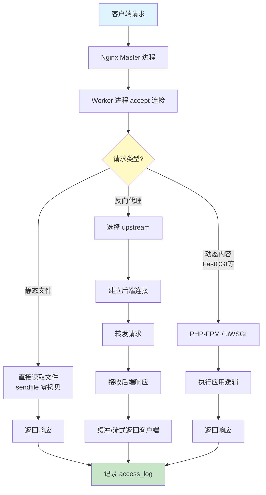
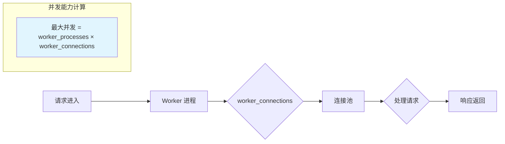
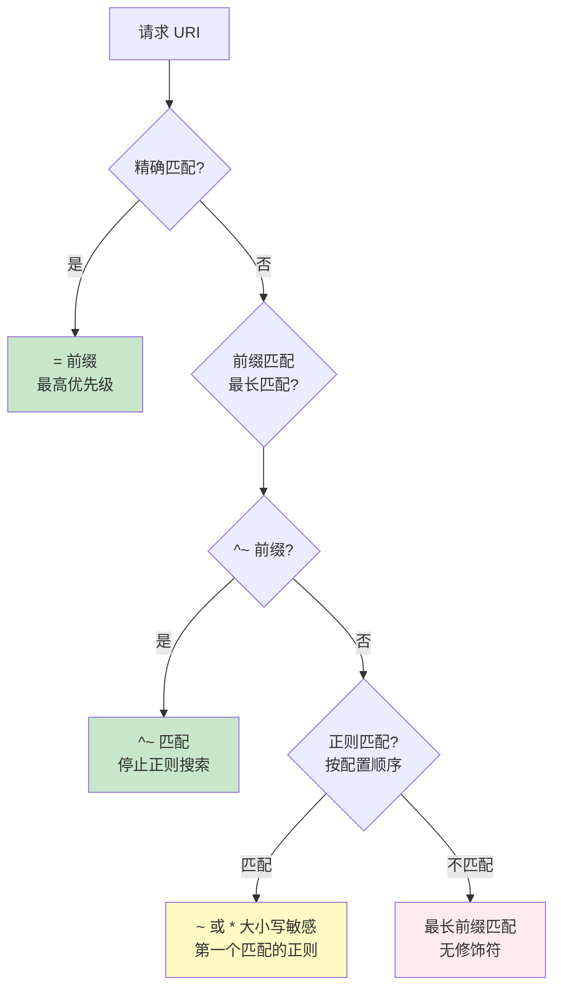
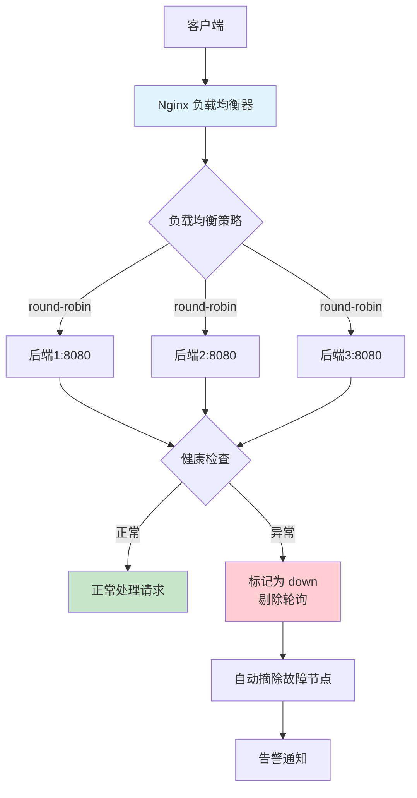
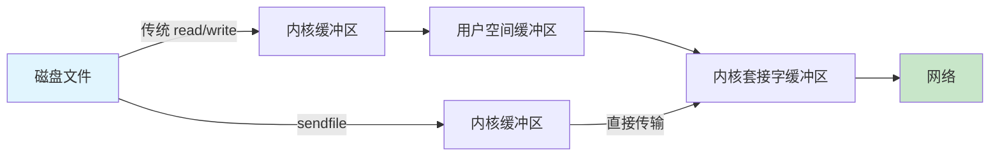

# Nginx 部署与调优

> Nginx 是互联网的"交通警察"——全球超过 34% 的网站由它负责路由、加速和保护。掌握 Nginx 的部署与调优，是运维工程师的必修课。

## Nginx 请求处理总览

理解 Nginx 的请求处理流程，是所有配置和调优的基础：



## 一、Nginx 安装

### 1.1 包管理器安装（推荐大多数场景）

**Ubuntu/Debian**

```bash
# 安装最新稳定版
apt update
apt install -y nginx

# 验证
nginx -v
# nginx version: nginx/1.24.0 (Ubuntu)

# 启动
systemctl enable --now nginx

# 验证运行状态
systemctl status nginx
curl -I http://localhost
```

**CentOS/Rocky/AlmaLinux**

```bash
# 添加官方仓库（获取最新版本）
cat > /etc/yum.repos.d/nginx.repo << 'EOF'
[nginx-stable]
name=nginx stable repo
baseurl=http://nginx.org/packages/centos/$releasever/$basearch/
gpgcheck=1
enabled=1
gpgkey=https://nginx.org/keys/nginx_signing.key
EOF

# 安装
dnf install -y nginx

# 启动
systemctl enable --now nginx
```

### 1.2 源码编译安装（需要自定义模块时）

```bash
# 安装编译依赖
apt install -y build-essential libpcre3-dev zlib1g-dev \
    libssl-dev libgd-dev libgeoip-dev

# 下载源码
NGINX_VERSION=1.26.2
curl -O https://nginx.org/download/nginx-${NGINX_VERSION}.tar.gz
tar xzf nginx-${NGINX_VERSION}.tar.gz
cd nginx-${NGINX_VERSION}

# 配置编译选项
./configure \
    --prefix=/etc/nginx \
    --sbin-path=/usr/sbin/nginx \
    --modules-path=/usr/lib64/nginx/modules \
    --conf-path=/etc/nginx/nginx.conf \
    --error-log-path=/var/log/nginx/error.log \
    --http-log-path=/var/log/nginx/access.log \
    --pid-path=/var/run/nginx.pid \
    --lock-path=/var/run/nginx.lock \
    --user=nginx \
    --group=nginx \
    --with-http_ssl_module \
    --with-http_v2_module \
    --with-http_v3_module \
    --with-http_realip_module \
    --with-http_gzip_static_module \
    --with-http_stub_status_module \
    --with-stream \
    --with-stream_ssl_module \
    --with-compat

# 编译安装
make -j$(nproc)
make install

# 创建 systemd 服务文件
cat > /etc/systemd/system/nginx.service << 'EOF'
[Unit]
Description=nginx - high performance web server
After=network-online.target remote-fs.target nss-lookup.target
Wants=network-online.target

[Service]
Type=forking
PIDFile=/var/run/nginx.pid
ExecStartPre=/usr/sbin/nginx -t -c /etc/nginx/nginx.conf
ExecStart=/usr/sbin/nginx -c /etc/nginx/nginx.conf
ExecReload=/bin/kill -s HUP $MAINPID
ExecStop=/bin/kill -s TERM $MAINPID
LimitNOFILE=1048576

[Install]
WantedBy=multi-user.target
EOF

systemctl daemon-reload
systemctl enable --now nginx
```

::: tip 何时需要源码编译？
- 需要 HTTP/3（QUIC）支持时
- 需要第三方模块（如 Brotli、GeoIP2）
- 需要特定的 OpenSSL 版本
- 其他情况，包管理器安装更易维护
:::

### 1.3 验证安装

```bash
# 版本与编译参数
nginx -V

# 配置语法检查
nginx -t

# 查看监听端口
ss -tlnp | grep nginx

# 默认欢迎页
curl http://localhost
```

## 二、核心配置详解

### 2.1 配置文件结构

```bash
/etc/nginx/
├── nginx.conf              # 主配置文件
├── conf.d/                 # 自定义配置（推荐在此添加）
│   ├── app1.conf
│   └── app2.conf
├── sites-available/        # 可用站点（Ubuntu 风格）
│   └── default
├── sites-enabled/          # 已启用站点（符号链接）
│   └── default -> /etc/nginx/sites-available/default
├── snippets/               # 配置片段
│   ├── ssl-params.conf
│   └── proxy-params.conf
└── modules-enabled/        # 动态模块
```

### 2.2 主配置文件

```nginx
# /etc/nginx/nginx.conf

# ===== 运行用户 =====
user nginx;

# ===== Worker 进程 =====
# auto = CPU 核心数
worker_processes auto;

# 错误日志
error_log /var/log/nginx/error.log warn;

# PID 文件
pid /var/run/nginx.pid;

# Worker 进程的文件描述符上限
worker_rlimit_nofile 1048576;

# ===== 事件模块 =====
events {
    # 每个 worker 的最大并发连接数
    worker_connections 4096;

    # 多个 worker 间均衡接受新连接
    multi_accept on;

    # Linux 专用高效事件模型
    use epoll;
}

# ===== HTTP 模块 =====
http {
    # 基础配置
    include       mime.types;
    default_type  application/octet-stream;

    # 日志格式
    log_format main '$remote_addr - $remote_user [$time_local] '
                    '"$request" $status $body_bytes_sent '
                    '"$http_referer" "$http_user_agent" '
                    '"$upstream_addr" rt=$request_time';

    access_log /var/log/nginx/access.log main;

    # 性能优化
    sendfile        on;
    tcp_nopush      on;
    tcp_nodelay     on;
    keepalive_timeout  65;
    types_hash_max_size 2048;
    server_tokens off;    # 隐藏版本号

    # Gzip 压缩
    gzip on;
    gzip_vary on;
    gzip_proxied any;
    gzip_comp_level 4;
    gzip_min_length 256;
    gzip_types
        application/json
        application/javascript
        text/css
        text/plain
        text/xml;

    # 包含其他配置
    include /etc/nginx/conf.d/*.conf;
    include /etc/nginx/sites-enabled/*;
}
```

### 2.3 关键参数解读



| 参数 | 默认值 | 生产建议 | 说明 |
|------|--------|----------|------|
| `worker_processes` | 1 | `auto` | 匹配 CPU 核心数 |
| `worker_connections` | 512 | 4096-65535 | 单个 worker 并发连接数 |
| `worker_rlimit_nofile` | 系统默认 | 1048576 | worker 进程文件描述符上限 |
| `multi_accept` | off | on | 一次接受所有新连接 |
| `sendfile` | off | on | 零拷贝传输文件 |
| `tcp_nopush` | off | on | 优化数据包发送 |
| `keepalive_timeout` | 75 | 65 | 长连接超时时间 |
| `server_tokens` | on | off | 隐藏版本号 |

::: important 并发连接数计算
Nginx 的最大并发连接数 = `worker_processes` × `worker_connections`。

如果作为反向代理，每个请求占用两个连接（客户端→Nginx，Nginx→后端），所以实际并发数要除以 2。例如 `4 × 4096 = 16384`，作为反向代理最大并发约 8192。
:::

## 三、Server 块与 Location 匹配

### 3.1 Server 块配置

```nginx
# HTTP → HTTPS 重定向
server {
    listen 80;
    server_name example.com www.example.com;

    # Let's Encrypt 验证
    location /.well-known/acme-challenge/ {
        root /var/www/certbot;
    }

    # 其余请求重定向到 HTTPS
    location / {
        return 301 https://$host$request_uri;
    }
}

# HTTPS 主站
server {
    listen 443 ssl http2;
    server_name example.com www.example.com;

    # SSL 证书
    ssl_certificate     /etc/letsencrypt/live/example.com/fullchain.pem;
    ssl_certificate_key /etc/letsencrypt/live/example.com/privkey.pem;

    # SSL 参数
    include snippets/ssl-params.conf;

    # 文档根目录
    root /var/www/example.com;
    index index.html index.htm;

    # 日志
    access_log /var/log/nginx/example.com.access.log main;
    error_log  /var/log/nginx/example.com.error.log warn;

    # 默认 location
    location / {
        try_files $uri $uri/ =404;
    }

    # 静态资源缓存
    location ~* \.(js|css|png|jpg|jpeg|gif|ico|svg|woff2)$ {
        expires 30d;
        add_header Cache-Control "public, immutable";
    }

    # 安全头
    add_header X-Frame-Options "SAMEORIGIN" always;
    add_header X-Content-Type-Options "nosniff" always;
    add_header X-XSS-Protection "1; mode=block" always;
    add_header Referrer-Policy "strict-origin-when-cross-origin" always;
}
```

### 3.2 Location 匹配规则

Location 的匹配优先级是 Nginx 配置中最容易搞错的部分：



**优先级从高到低：**

| 修饰符 | 说明 | 示例 |
|--------|------|------|
| `=` | 精确匹配，最高优先级 | `location = /exact/path` |
| `^~` | 前缀匹配，匹配后不再检查正则 | `location ^~ /static/` |
| `~` | 区分大小写的正则 | `location ~ \.php$` |
| `~*` | 不区分大小写的正则 | `location ~* \.(jpg|png)$` |
| 无 | 普通前缀匹配 | `location /api/` |

```nginx
# Location 匹配示例

# 1. 精确匹配 - 处理 /health 端点
location = /health {
    return 200 'OK';
    add_header Content-Type text/plain;
}

# 2. 优先前缀匹配 - 静态文件不走正则
location ^~ /static/ {
    alias /var/www/static/;
    expires 30d;
}

# 3. 正则匹配 - PHP 文件交给 FastCGI
location ~ \.php$ {
    fastcgi_pass unix:/run/php/php-fpm.sock;
    fastcgi_param SCRIPT_FILENAME $document_root$fastcgi_script_name;
    include fastcgi_params;
}

# 4. 不区分大小写正则 - 图片文件
location ~* \.(jpg|jpeg|png|gif|ico|svg|webp)$ {
    expires 7d;
    add_header Cache-Control "public";
}

# 5. 前缀匹配 - API 反向代理
location /api/ {
    proxy_pass http://backend/;
    proxy_set_header Host $host;
    proxy_set_header X-Real-IP $remote_addr;
}
```

::: warning Location 匹配陷阱
1. **多个正则 location 时，第一个匹配的生效**——不是最长的，而是配置文件中从上到下最先匹配的
2. **`proxy_pass` 末尾的 `/`**：`location /api/` + `proxy_pass http://backend/` 会去掉 `/api/` 前缀；`proxy_pass http://backend` 则保留
3. **`alias` vs `root`**：`alias` 替换 location 路径，`root` 追加 location 路径
:::

## 四、HTTPS 配置

### 4.1 Let's Encrypt + Certbot

```bash
# 安装 Certbot
apt install -y certbot python3-certbot-nginx

# 获取证书（自动修改 nginx 配置）
certbot --nginx -d example.com -d www.example.com

# 或者仅获取证书（手动配置 nginx）
certbot certonly --webroot \
    -w /var/www/certbot \
    -d example.com \
    -d www.example.com \
    --email admin@example.com \
    --agree-tos \
    --non-interactive

# 证书文件位置
ls /etc/letsencrypt/live/example.com/
# cert.pem       - 服务器证书
# chain.pem      - 中间证书
# fullchain.pem  - 完整证书链（nginx 使用这个）
# privkey.pem    - 私钥

# 自动续期（Certbot 已自动配置定时任务）
certbot renew --dry-run    # 测试续期

# 查看定时任务
systemctl list-timers | grep certbot
```

### 4.2 SSL/TLS 安全配置

```nginx
# /etc/nginx/snippets/ssl-params.conf
# SSL 安全参数 - 遵循 Mozilla Intermediate 指南

# 协议版本
ssl_protocols TLSv1.2 TLSv1.3;

# 加密套件
ssl_ciphers ECDHE-ECDSA-AES128-GCM-SHA256:ECDHE-RSA-AES128-GCM-SHA256:ECDHE-ECDSA-AES256-GCM-SHA384:ECDHE-RSA-AES256-GCM-SHA384:ECDHE-ECDSA-CHACHA20-POLY1305:ECDHE-RSA-CHACHA20-POLY1305:DHE-RSA-AES128-GCM-SHA256:DHE-RSA-AES256-GCM-SHA384;

# 优先使用服务器端加密套件
ssl_prefer_server_ciphers on;

# SSL 会话缓存（减少重复握手）
ssl_session_cache shared:SSL:10m;
ssl_session_timeout 1d;

# 会话票据（减少全握手开销）
ssl_session_tickets off;

# OCSP Stapling（客户端不需要单独查询 OCSP）
ssl_stapling on;
ssl_stapling_verify on;
resolver 8.8.8.8 8.8.4.4 valid=300s;
resolver_timeout 5s;

# DH 参数（增强密钥交换安全性）
ssl_dhparam /etc/nginx/dhparam.pem;

# HSTS（强制浏览器使用 HTTPS）
add_header Strict-Transport-Security "max-age=63072000; includeSubDomains; preload" always;
```

```bash
# 生成 DH 参数（2048位，约需几分钟）
openssl dhparam -out /etc/nginx/dhparam.pem 2048

# 验证 SSL 配置
# 在线工具: https://www.ssllabs.com/ssltest/
curl -I https://example.com
```

::: important TLS 1.3 的优势
TLS 1.3 将握手从 2-RTT 减少到 1-RTT，支持 0-RTT 恢复。加密套件大幅简化，移除了所有不安全的算法。开启 TLS 1.3 后，SSL Labs 评分会有明显提升。
:::

## 五、反向代理与负载均衡

### 5.1 反向代理基础配置

```nginx
# 反向代理 - 将请求转发到后端应用
server {
    listen 80;
    server_name api.example.com;

    location / {
        proxy_pass http://127.0.0.1:8080;

        # 传递客户端真实信息
        proxy_set_header Host $host;
        proxy_set_header X-Real-IP $remote_addr;
        proxy_set_header X-Forwarded-For $proxy_add_x_forwarded_for;
        proxy_set_header X-Forwarded-Proto $scheme;

        # WebSocket 支持
        proxy_http_version 1.1;
        proxy_set_header Upgrade $http_upgrade;
        proxy_set_header Connection "upgrade";

        # 超时配置
        proxy_connect_timeout 10s;
        proxy_send_timeout 30s;
        proxy_read_timeout 60s;

        # 缓冲配置
        proxy_buffering on;
        proxy_buffer_size 4k;
        proxy_buffers 8 4k;
        proxy_busy_buffers_size 8k;
    }
}
```

### 5.2 负载均衡架构



### 5.3 Upstream 配置

```nginx
# 定义后端服务器组
upstream backend {
    # 负载均衡策略（默认 round-robin）

    # 加权轮询（weight 越大，分配的请求越多）
    server 192.168.1.101:8080 weight=3;
    server 192.168.1.102:8080 weight=2;
    server 192.168.1.103:8080 weight=1;

    # 备用服务器（仅在所有主服务器不可用时启用）
    server 192.168.1.104:8080 backup;

    # 保持与后端的长连接（减少 TCP 握手）
    keepalive 32;

    # 慢启动（逐渐增加新服务器流量）
    # server 192.168.1.105:8080 slow_start=30s;
}

# IP Hash（会话保持，同一 IP 始终路由到同一后端）
upstream backend_iphash {
    ip_hash;
    server 192.168.1.101:8080;
    server 192.168.1.102:8080;
}

# Least Connections（最少连接数优先）
upstream backend_least_conn {
    least_conn;
    server 192.168.1.101:8080;
    server 192.168.1.102:8080;
}

# 一致性 Hash（适合缓存场景）
upstream backend_hash {
    hash $request_uri consistent;
    server 192.168.1.101:8080;
    server 192.168.1.102:8080;
}
```

### 5.4 健康检查

**被动健康检查（Nginx 开源版）**

```nginx
upstream backend {
    server 192.168.1.101:8080 max_fails=3 fail_timeout=30s;
    server 192.168.1.102:8080 max_fails=3 fail_timeout=30s;
    server 192.168.1.103:8080 max_fails=3 fail_timeout=30s;
}

# max_fails: 在 fail_timeout 时间内失败次数达到此值，标记为不可用
# fail_timeout: 服务器被标记为不可用的持续时间
```

**主动健康检查（Nginx Plus 或开源替代）**

```nginx
# 使用 nginx_upstream_check_module（需源码编译补丁）
upstream backend {
    server 192.168.1.101:8080;
    server 192.168.1.102:8080;

    check interval=3000 rise=2 fall=3 timeout=1000 type=http;
    check_http_send "HEAD /health HTTP/1.0\r\n\r\n";
    check_http_expect_alive http_2xx http_3xx;
}
```

**应用层健康检查端点**

```nginx
# 在后端应用上暴露 /health 端点
# Nginx 通过代理路径访问
server {
    listen 80;
    server_name lb.example.com;

    location / {
        proxy_pass http://backend;
    }

    # 负载均衡器状态页
    location /nginx_status {
        stub_status;
        allow 10.0.0.0/8;
        deny all;
    }
}
```

### 5.5 负载均衡策略对比

| 策略 | 模块 | 适用场景 | 特点 |
|------|------|----------|------|
| Round Robin | 默认 | 后端性能一致 | 均匀分配 |
| Weighted | 默认 | 后端性能不均 | 按权重分配 |
| IP Hash | `ip_hash` | 需要会话保持 | 同 IP 同后端 |
| Least Conn | `least_conn` | 长连接/请求耗时不均 | 优先分配给最空闲的 |
| Hash | `hash` | 缓存命中优化 | 同 key 同后端 |
| Random | `random` | 简单场景 | 随机分配 |

::: tip 会话保持的替代方案
`ip_hash` 简单但不精确（NAT 后多用户共享 IP）。更好的方案是：应用层使用 Redis 存储 Session，Nginx 侧不需要会话保持，任何后端都能处理任何用户的请求。
:::

## 六、静态文件与缓存策略

### 6.1 静态文件服务

```nginx
server {
    listen 443 ssl http2;
    server_name static.example.com;

    root /var/www/static;

    # 静态文件缓存
    location ~* \.(jpg|jpeg|png|gif|ico|svg|webp)$ {
        expires 30d;
        add_header Cache-Control "public, immutable";
        add_header Vary "Accept-Encoding";
        access_log off;    # 静态文件不打访问日志
    }

    location ~* \.(css|js)$ {
        expires 7d;
        add_header Cache-Control "public";
        access_log off;
    }

    location ~* \.(woff|woff2|ttf|otf|eot)$ {
        expires 180d;
        add_header Cache-Control "public, immutable";
        add_header Access-Control-Allow-Origin "*";
        access_log off;
    }

    # 禁止访问隐藏文件
    location ~ /\. {
        deny all;
        access_log off;
        log_not_found off;
    }

    # 禁止访问源文件
    location ~ \.(bak|swp|old|orig|log|sql)$ {
        deny all;
    }
}
```

### 6.2 代理缓存

```nginx
# http 块中的缓存配置
proxy_cache_path /var/cache/nginx/proxy
    levels=1:2
    keys_zone=api_cache:10m
    max_size=10g
    inactive=60m
    use_temp_path=off;

server {
    listen 80;
    server_name api.example.com;

    location /api/data/ {
        proxy_pass http://backend;
        proxy_cache api_cache;

        # 缓存键
        proxy_cache_key "$scheme$request_method$host$request_uri";

        # 缓存有效时间
        proxy_cache_valid 200 10m;
        proxy_cache_valid 404 1m;
        proxy_cache_valid any 1m;

        # 缓存状态头（调试用）
        add_header X-Cache-Status $upstream_cache_status;

        # 缓存锁（防止缓存击穿）
        proxy_cache_lock on;
        proxy_cache_lock_timeout 5s;

        # 陈旧缓存（后端故障时使用过期缓存）
        proxy_cache_use_stale error timeout updating http_500 http_502 http_503;
    }

    # 手动清除缓存
    location /purge/ {
        allow 10.0.0.0/8;
        deny all;
        proxy_cache_purge api_cache "$scheme$request_method$host$request_uri";
    }
}
```

::: important 缓存策略选择
- **浏览器缓存**（`expires`/`Cache-Control`）：客户端缓存，减少请求
- **代理缓存**（`proxy_cache`）：Nginx 端缓存，减少后端压力
- **不缓存**：个性化内容、实时数据、POST 请求
- **短缓存**：频繁变化的数据（1-5 分钟）
- **长缓存**：静态资源、API 版本化响应（7-30 天 + immutable）
:::

## 七、Gzip 压缩

```nginx
# http 块中配置
gzip on;
gzip_vary on;                    # 添加 Vary: Accept-Encoding 头
gzip_proxied any;                # 对代理请求也压缩
gzip_comp_level 4;               # 压缩级别（1-9，4 是性价比最高）
gzip_min_length 256;             # 小于 256 字节不压缩
gzip_buffers 16 8k;              # 压缩缓冲区
gzip_http_version 1.1;           # 最低 HTTP 版本
gzip_types
    application/atom+xml
    application/geo+json
    application/javascript
    application/x-javascript
    application/json
    application/ld+json
    application/manifest+json
    application/rdf+xml
    application/rss+xml
    application/xhtml+xml
    application/xml
    font/eot
    font/otf
    font/ttf
    font/woff
    image/svg+xml
    text/css
    text/javascript
    text/plain
    text/xml;
```

::: warning Gzip 注意事项
1. **不要压缩图片**——JPEG/PNG 等已经是压缩格式，二次压缩反而增大体积
2. **不要压缩视频**——同上
3. **`gzip_comp_level` 不是越高越好**——级别 4-5 是 CPU 和压缩率的最佳平衡点，9 级 CPU 开销大但收益微乎其微
4. **对小文件压缩无意义**——小于 256 字节的文件压缩后可能更大
:::

### 7.1 Brotli 压缩（更先进的替代方案）

```nginx
# 需要安装 ngx_brotli 模块
# 编译时添加: --add-module=/path/to/ngx_brotli

brotli on;
brotli_comp_level 6;
brotli_types
    application/javascript
    application/json
    application/xml
    text/css
    text/javascript
    text/plain
    text/xml;

# 同时支持 gzip 和 brotli
# Nginx 会根据客户端 Accept-Encoding 自动选择
```

## 八、安全头配置

HTTP 安全头是防御 XSS、点击劫持、MIME 嗅探等攻击的重要防线：

```nginx
# /etc/nginx/snippets/security-headers.conf

# 防止点击劫持
add_header X-Frame-Options "SAMEORIGIN" always;

# 防止 MIME 嗅探
add_header X-Content-Type-Options "nosniff" always;

# XSS 过滤（旧浏览器兼容）
add_header X-XSS-Protection "1; mode=block" always;

# 引用策略
add_header Referrer-Policy "strict-origin-when-cross-origin" always;

# HSTS（必须先确认 HTTPS 完全可用再开启）
add_header Strict-Transport-Security "max-age=63072000; includeSubDomains; preload" always;

# 权限策略（限制浏览器 API 使用）
add_header Permissions-Policy "camera=(), microphone=(), geolocation=()" always;

# Content Security Policy（根据业务定制）
# add_header Content-Security-Policy "default-src 'self'; script-src 'self' 'unsafe-inline'; style-src 'self' 'unsafe-inline';" always;
```

::: important `always` 关键字
`add_header` 指令默认只在响应码为 200、201、204、206、301、302、303、304、307、308 时添加。加上 `always` 参数后，所有响应码（包括 4xx、5xx）都会添加安全头，防止错误页面泄露信息。
:::

## 九、性能优化

### 9.1 网络层优化

```nginx
# http 块

# 零拷贝传输（跳过用户空间缓冲）
sendfile on;

# 配合 sendfile 使用，在包中积累足够数据再发送
tcp_nopush on;

# 禁用 Nagle 算法，立即发送数据（降低延迟）
tcp_nodelay on;

# 长连接超时
keepalive_timeout 65;

# 长连接请求数上限
keepalive_requests 100;

# 减少 TIME_WAIT
reset_timedout_connection on;
```



### 9.2 缓冲区优化

```nginx
# http 块

# 请求体缓冲区
client_body_buffer_size 16k;
client_max_body_size 50m;         # 最大上传大小

# 请求头缓冲区
client_header_buffer_size 1k;      # 默认请求头缓冲
large_client_header_buffers 4 8k;  # 大请求头缓冲

# 响应缓冲区（反向代理）
proxy_buffer_size 4k;              # 响应头缓冲
proxy_buffers 8 4k;                # 响应体缓冲
proxy_busy_buffers_size 8k;        # 忙时缓冲
```

### 9.3 连接优化

```nginx
# 与后端保持长连接
upstream backend {
    server 127.0.0.1:8080;
    keepalive 32;    # 每个 worker 的空闲长连接数
}

server {
    location / {
        proxy_pass http://backend;

        # 必须配置 HTTP/1.1 + Connection 才能启用长连接
        proxy_http_version 1.1;
        proxy_set_header Connection "";

        # 其他 proxy 配置...
    }
}
```

### 9.4 静态文件预加载

```nginx
# 开启文件 AIO（异步 I/O）
aio on;

# 大文件直接传输，不经过 Nginx 缓冲
directio 5m;

# 输出过滤（最小化 HTML）
# 需要模块: ngx_http_sub_module
sub_filter '</head>' '<link rel="preconnect" href="https://cdn.example.com"></head>';
sub_filter_once on;
sub_filter_types text/html;
```

### 9.5 Open File Cache

```nginx
# http 块

# 打开文件缓存（减少磁盘 stat 和 open 调用）
open_file_cache max=10000 inactive=30s;
open_file_cache_valid 60s;
open_file_cache_min_uses 2;
open_file_cache_errors on;
```

### 9.6 性能优化速查表

| 优化项 | 配置 | 效果 |
|--------|------|------|
| 零拷贝 | `sendfile on` | 减少内核-用户空间数据拷贝 |
| 批量发送 | `tcp_nopush on` | 减少小包数量 |
| 低延迟 | `tcp_nodelay on` | 立即发送，不等待 |
| 长连接 | `keepalive_timeout 65` | 减少连接建立开销 |
| Gzip | `gzip on` | 传输体积减少 60-80% |
| 缓存 | `proxy_cache` | 减少后端请求 |
| 文件缓存 | `open_file_cache` | 减少磁盘 I/O |
| 缓冲区 | `proxy_buffers` | 平滑后端慢响应 |
| 版本隐藏 | `server_tokens off` | 减少信息泄露 |
| 连接复用 | `upstream keepalive` | 减少与后端的 TCP 握手 |

## 十、日志配置与切割

### 10.1 日志格式

```nginx
# http 块中定义日志格式

# 标准格式
log_format main '$remote_addr - $remote_user [$time_local] '
                '"$request" $status $body_bytes_sent '
                '"$http_referer" "$http_user_agent"';

# 带上游响应时间的格式（反向代理必备）
log_format detailed '$remote_addr - $remote_user [$time_local] '
                    '"$request" $status $body_bytes_sent '
                    '"$http_referer" "$http_user_agent" '
                    'upstream=$upstream_addr '
                    'upstream_status=$upstream_status '
                    'upstream_time=$upstream_response_time '
                    'request_time=$request_time';

# JSON 格式（方便日志采集系统解析）
log_format json_combined escape=json
    '{'
        '"time":"$time_iso8601",'
        '"remote_addr":"$remote_addr",'
        '"remote_user":"$remote_user",'
        '"request":"$request",'
        '"status":$status,'
        '"body_bytes_sent":$body_bytes_sent,'
        '"request_time":$request_time,'
        '"http_referer":"$http_referer",'
        '"http_user_agent":"$http_user_agent",'
        '"upstream_addr":"$upstream_addr",'
        '"upstream_status":"$upstream_status",'
        '"upstream_response_time":"$upstream_response_time"'
    '}';

# 使用格式
access_log /var/log/nginx/access.log detailed;
# 或 JSON 格式
# access_log /var/log/nginx/access.json.log json_combined;
```

### 10.2 条件日志

```nginx
# 不记录健康检查日志
map $request $loggable {
    ~^/health 0;
    default 1;
}

access_log /var/log/nginx/access.log detailed if=$loggable;

# 不记录静态文件日志
location ~* \.(css|js|png|jpg|jpeg|gif|ico|svg|woff2)$ {
    access_log off;
}
```

### 10.3 日志切割

```bash
# /etc/logrotate.d/nginx
/var/log/nginx/*.log {
    daily
    missingok
    rotate 30
    compress
    delaycompress
    notifempty
    create 0640 nginx adm
    sharedscripts
    prerotate
        # 切割前可以执行的操作
        if [ -d /etc/logrotate.d/httpd-prerotate ]; then
            run-parts /etc/logrotate.d/httpd-prerotate
        fi
    endscript
    postrotate
        # 通知 Nginx 重新打开日志文件
        [ -f /var/run/nginx.pid ] && kill -USR1 $(cat /var/run/nginx.pid)
    endscript
}
```

```bash
# 手动触发日志切割
logrotate -f /etc/logrotate.d/nginx

# 检查切割状态
ls -la /var/log/nginx/
```

### 10.4 日志分析

```bash
# Top 20 访问量最大的 IP
awk '{print $1}' /var/log/nginx/access.log | sort | uniq -c | sort -rn | head -20

# Top 20 访问量最大的 URL
awk '{print $7}' /var/log/nginx/access.log | sort | uniq -c | sort -rn | head -20

# 统计各状态码数量
awk '{print $9}' /var/log/nginx/access.log | sort | uniq -c | sort -rn

# 找出响应时间最慢的 20 个请求
awk '{print $NF, $7}' /var/log/nginx/access.log | sort -rn | head -20

# 统计每秒请求数（QPS）
awk '{print $4}' /var/log/nginx/access.log | cut -d: -f1-2 | uniq -c

# 找出 5xx 错误
awk '$9 >= 500' /var/log/nginx/access.log

# 统计上游响应时间
awk '{print $NF}' /var/log/nginx/access.log | \
    awk '{sum+=$1; count++} END {print "avg:", sum/count, "total:", count}'
```

## 十一、Nginx 完整生产配置模板

```nginx
# /etc/nginx/nginx.conf - 生产级完整配置

user nginx;
worker_processes auto;
worker_rlimit_nofile 1048576;
error_log /var/log/nginx/error.log warn;
pid /var/run/nginx.pid;

events {
    worker_connections 4096;
    multi_accept on;
    use epoll;
}

http {
    include       mime.types;
    default_type  application/octet-stream;

    # 日志格式
    log_format detailed '$remote_addr - $remote_user [$time_local] '
                        '"$request" $status $body_bytes_sent '
                        '"$http_referer" "$http_user_agent" '
                        '"$upstream_addr" rt=$request_time '
                        'upstream_rt=$upstream_response_time';

    access_log /var/log/nginx/access.log detailed;

    # 基础优化
    sendfile        on;
    tcp_nopush      on;
    tcp_nodelay     on;
    keepalive_timeout  65;
    types_hash_max_size 2048;
    server_tokens off;

    # 文件缓存
    open_file_cache max=10000 inactive=30s;
    open_file_cache_valid 60s;
    open_file_cache_min_uses 2;
    open_file_cache_errors on;

    # Gzip
    gzip on;
    gzip_vary on;
    gzip_proxied any;
    gzip_comp_level 4;
    gzip_min_length 256;
    gzip_types application/json application/javascript
               text/css text/plain text/xml;

    # 代理缓冲
    proxy_buffer_size 4k;
    proxy_buffers 8 4k;
    proxy_busy_buffers_size 8k;

    # 安全头
    add_header X-Frame-Options "SAMEORIGIN" always;
    add_header X-Content-Type-Options "nosniff" always;
    add_header X-XSS-Protection "1; mode=block" always;

    # 包含站点配置
    include /etc/nginx/conf.d/*.conf;
}
```

```nginx
# /etc/nginx/conf.d/example.com.conf

# 后端服务器组
upstream app_backend {
    server 192.168.1.101:8080 weight=3 max_fails=3 fail_timeout=30s;
    server 192.168.1.102:8080 weight=2 max_fails=3 fail_timeout=30s;
    server 192.168.1.103:8080 weight=1 max_fails=3 fail_timeout=30s;
    keepalive 32;
}

# HTTP → HTTPS 重定向
server {
    listen 80;
    server_name example.com www.example.com;

    location /.well-known/acme-challenge/ {
        root /var/www/certbot;
    }

    location / {
        return 301 https://$host$request_uri;
    }
}

# HTTPS 主站
server {
    listen 443 ssl http2;
    server_name example.com www.example.com;

    # SSL
    ssl_certificate     /etc/letsencrypt/live/example.com/fullchain.pem;
    ssl_certificate_key /etc/letsencrypt/live/example.com/privkey.pem;
    include snippets/ssl-params.conf;

    # 安全头
    add_header Strict-Transport-Security "max-age=63072000; includeSubDomains; preload" always;

    # API 反向代理
    location /api/ {
        proxy_pass http://app_backend/;
        proxy_http_version 1.1;
        proxy_set_header Connection "";
        proxy_set_header Host $host;
        proxy_set_header X-Real-IP $remote_addr;
        proxy_set_header X-Forwarded-For $proxy_add_x_forwarded_for;
        proxy_set_header X-Forwarded-Proto $scheme;

        proxy_connect_timeout 10s;
        proxy_send_timeout 30s;
        proxy_read_timeout 60s;
    }

    # 静态文件
    location /static/ {
        alias /var/www/example.com/static/;
        expires 30d;
        add_header Cache-Control "public, immutable";
        access_log off;
    }

    # 前端 SPA
    location / {
        root /var/www/example.com/dist;
        try_files $uri $uri/ /index.html;
    }

    # 健康检查
    location = /health {
        access_log off;
        return 200 'OK';
        add_header Content-Type text/plain;
    }

    # Nginx 状态
    location /nginx_status {
        stub_status;
        allow 10.0.0.0/8;
        deny all;
    }
}
```

## 十二、Nginx 运维命令速查

```bash
# 配置测试
nginx -t                       # 测试配置语法
nginx -T                       # 测试并输出完整配置

# 重载配置（不中断服务）
nginx -s reload
# 或
systemctl reload nginx

# 启停
systemctl start nginx
systemctl stop nginx
systemctl restart nginx       # 重启（短暂中断）
systemctl status nginx

# 版本信息
nginx -v                       # 版本
nginx -V                       # 版本 + 编译参数

# 日志
tail -f /var/log/nginx/access.log
tail -f /var/log/nginx/error.log

# 连接状态
ss -tlnp | grep nginx          # 监听端口
ss -tnp | grep nginx | wc -l   # 当前连接数

# 实时监控
watch -n 1 'ss -tnp | grep nginx | wc -l'
```

::: tip reload vs restart
- **`nginx -s reload`**：启动新 Worker 处理新请求，旧 Worker 处理完当前请求后退出——**零中断**
- **`systemctl restart nginx`**：先停止再启动——**有短暂中断**

修改配置后始终优先使用 `reload`。只有修改了 `worker_processes` 等需要重启的参数时才用 `restart`。
:::

## 参考资源

- [Nginx 官方文档](https://nginx.org/en/docs/) - 最权威的参考
- [Mozilla SSL Configuration Generator](https://ssl-config.mozilla.org/) - SSL 配置生成
- [DigitalOcean Nginx Config Tool](https://www.digitalocean.com/community/tools/nginx) - 可视化配置生成
- [Nginx Load Balancing](https://docs.nginx.com/nginx/admin-guide/load-balancer/http-load-balancer/) - 负载均衡指南
- [SSL Labs Test](https://www.ssllabs.com/ssltest/) - HTTPS 安全性检测
