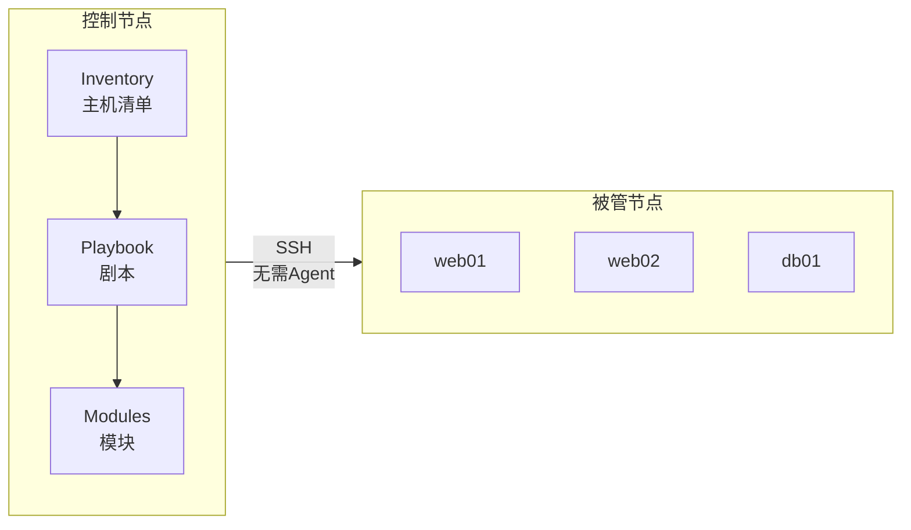
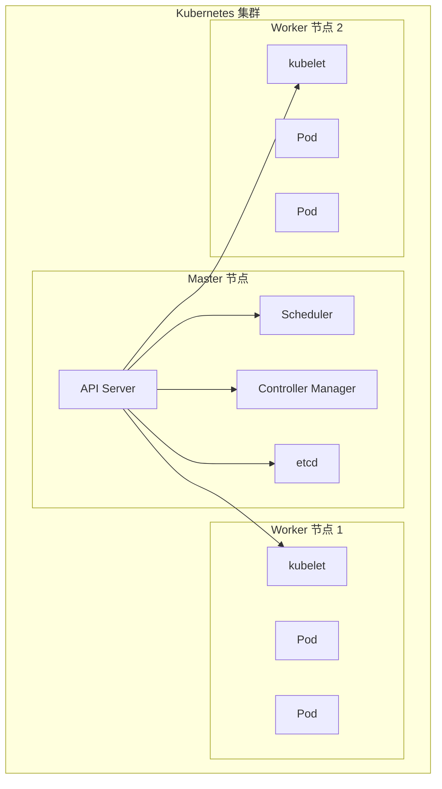
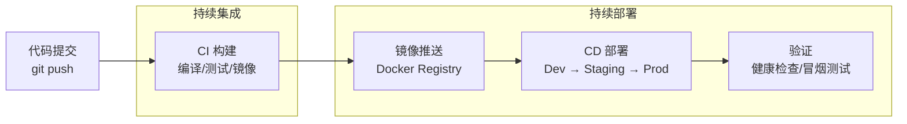
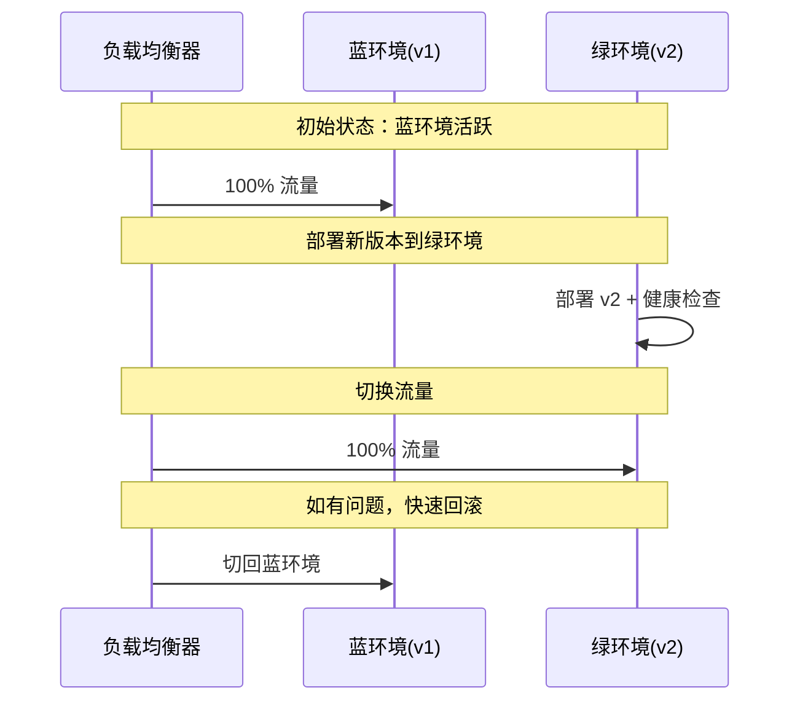
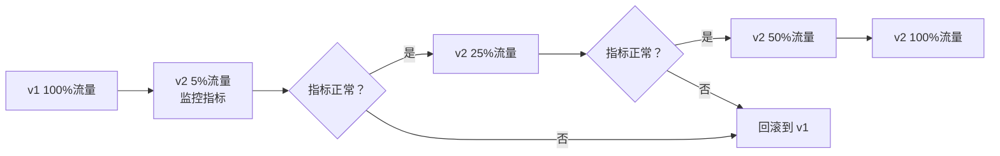

# 自动化部署与 CI/CD

从手动 SSH 上传文件到全自动化流水线，从单机部署到容器编排，从蓝绿发布到金丝雀灰度——自动化部署与 CI/CD 是现代运维的核心竞争力。本文从 Ansible 配置管理讲起，覆盖 Docker 容器化、Kubernetes 编排、三大 CI 平台实战，最终落地蓝绿/金丝雀发布策略，帮你打通从代码提交到生产上线的全链路。

## 1. Ansible 基础

### 1.1 Ansible 架构



**Ansible 特点：**
- **Agentless**：无需在目标安装客户端，通过 SSH 连接
- **幂等性**：同一 Playbook 执行多次，结果一致
- **声明式**：描述期望状态，而非操作步骤
- **模块化**：丰富的内置模块 + 自定义模块

### 1.2 Inventory 主机清单

```ini
# /etc/ansible/hosts 或项目目录下 inventory/hosts

# 按组分类
[webservers]
web01 ansible_host=192.168.1.10 ansible_user=admin
web02 ansible_host=192.168.1.11 ansible_user=admin

[dbservers]
db01 ansible_host=192.168.1.20 ansible_user=dbadmin
db02 ansible_host=192.168.1.21 ansible_user=dbadmin

# 组变量
[webservers:vars]
nginx_version=1.24.0

[dbservers:vars]
mysql_version=8.0

# 嵌套组
[production:children]
webservers
dbservers

[production:vars]
env=production
```

**YAML 格式 Inventory：**

```yaml
# inventory/hosts.yaml
all:
  children:
    webservers:
      hosts:
        web01:
          ansible_host: 192.168.1.10
        web02:
          ansible_host: 192.168.1.11
      vars:
        nginx_version: 1.24.0
    dbservers:
      hosts:
        db01:
          ansible_host: 192.168.1.20
      vars:
        mysql_version: 8.0
    production:
      children:
        webservers:
        dbservers:
```

### 1.3 Ad-Hoc 命令

```bash
# 基本语法：ansible <pattern> -m <module> -a <args>

# ping 测试连通性
ansible all -m ping

# 执行命令
ansible webservers -m command -a "uptime"
ansible webservers -m shell -a "free -h | head -2"

# 安装包
ansible webservers -m yum -a "name=nginx state=present"
ansible webservers -m apt -a "name=nginx state=present"

# 管理服务
ansible webservers -m systemd -a "name=nginx state=started enabled=yes"

# 文件操作
ansible webservers -m copy -a "src=nginx.conf dest=/etc/nginx/nginx.conf"
ansible webservers -m file -a "path=/tmp/testdir state=directory mode=0755"

# 用户管理
ansible webservers -m user -a "name=deploy shell=/bin/bash groups=docker"

# 收集信息
ansible webservers -m setup                    # 所有 facts
ansible webservers -m setup -a "filter=ansible_memory_mb"  # 过滤
```

### 1.4 Playbook 剧本

```yaml
# deploy-nginx.yml
---
- name: Deploy Nginx Web Server
  hosts: webservers
  become: yes                    # 使用 sudo

  vars:
    nginx_version: "1.24.0"
    nginx_worker_processes: "auto"
    server_name: "example.com"

  tasks:
    - name: Install Nginx
      yum:
        name: "nginx-{{ nginx_version }}"
        state: present
      notify: Restart Nginx      # 状态变化时触发 handler

    - name: Configure Nginx
      template:
        src: templates/nginx.conf.j2
        dest: /etc/nginx/nginx.conf
        owner: root
        group: root
        mode: '0644'
      notify: Reload Nginx

    - name: Create document root
      file:
        path: /var/www/{{ server_name }}
        state: directory
        owner: nginx
        group: nginx
        mode: '0755'

    - name: Deploy application
      synchronize:
        src: ./dist/
        dest: /var/www/{{ server_name }}/
        delete: yes
      notify: Reload Nginx

    - name: Ensure Nginx is running
      systemd:
        name: nginx
        state: started
        enabled: yes

  handlers:
    - name: Restart Nginx
      systemd:
        name: nginx
        state: restarted

    - name: Reload Nginx
      systemd:
        name: nginx
        state: reloaded
```

```bash
# 执行 Playbook
ansible-playbook deploy-nginx.yml

# 检查语法
ansible-playbook --syntax-check deploy-nginx.yml

# 干跑（不实际执行）
ansible-playbook --check deploy-nginx.yml

# 指定 Inventory
ansible-playbook -i inventory/hosts deploy-nginx.yml

# 指定标签
ansible-playbook deploy-nginx.yml --tags "install"

# 详细输出
ansible-playbook deploy-nginx.yml -v    # -vv -vvv 更详细
```

### 1.5 常用模块速查

| 模块 | 用途 | 示例 |
|------|------|------|
| `yum`/`apt` | 包管理 | `name=nginx state=present` |
| `systemd` | 服务管理 | `name=nginx state=started` |
| `copy` | 复制文件 | `src=local dest=remote` |
| `template` | Jinja2 模板 | `src=conf.j2 dest=/etc/app.conf` |
| `file` | 文件/目录 | `path=/dir state=directory` |
| `user` | 用户管理 | `name=admin groups=docker` |
| `git` | 拉取代码 | `repo=URL dest=/opt/app` |
| `synchronize` | rsync 同步 | `src=./dist/ dest=/var/www/` |
| `command` | 执行命令 | `cmd=uptime` |
| `shell` | Shell 命令 | `cmd="pipe | allowed"` |
| `wait_for` | 等待端口 | `port=80 host=0.0.0.0 delay=5` |
| `uri` | HTTP 请求 | `url=http://localhost/health` |
| `cron` | 定时任务 | `name=backup job="/opt/backup.sh"` |
| `lineinfile` | 修改单行 | `path=/etc/hosts line="1.2.3.4 host"` |
| `blockinfile` | 修改多行 | `path=/etc/conf block="..."` |

### 1.6 Role 角色

Role 是 Playbook 的组织方式，将变量、任务、模板、文件按标准目录结构组织：

```
roles/
└── nginx/
    ├── defaults/
    │   └── main.yml          # 默认变量（优先级最低）
    ├── vars/
    │   └── main.yml          # 变量（优先级高）
    ├── tasks/
    │   └── main.yml          # 任务
    ├── handlers/
    │   └── main.yml          # 处理器
    ├── templates/
    │   └── nginx.conf.j2     # Jinja2 模板
    ├── files/
    │   └── index.html        # 静态文件
    ├── meta/
    │   └── main.yml          # 角色元数据（依赖）
    └── tests/
        ├── inventory
        └── test.yml
```

```yaml
# roles/nginx/tasks/main.yml
---
- name: Install Nginx
  yum:
    name: nginx
    state: present

- name: Configure Nginx
  template:
    src: nginx.conf.j2
    dest: /etc/nginx/nginx.conf
  notify: Reload Nginx

- name: Ensure Nginx is running
  systemd:
    name: nginx
    state: started
    enabled: yes
```

```yaml
# site.yml（使用 Role）
---
- name: Deploy Web Stack
  hosts: webservers
  become: yes
  roles:
    - role: nginx
      tags: nginx
    - role: php-fpm
      tags: php
```

### 1.7 Ansible 实战：批量部署

```yaml
# rolling-deploy.yml - 滚动更新部署
---
- name: Rolling Deploy
  hosts: webservers
  become: yes
  serial: 1                    # 每次只部署一台
  any_errors_fatal: true       # 任一台失败则停止

  pre_tasks:
    - name: Remove from load balancer
      community.general.haproxy:
        backend: web_backend
        host: "{{ inventory_hostname }}"
        state: disabled
      delegate_to: lb01

  tasks:
    - name: Deploy new version
      synchronize:
        src: ./dist/
        dest: /var/www/app/
        delete: yes

    - name: Restart application
      systemd:
        name: myapp
        state: restarted

    - name: Wait for application to be ready
      uri:
        url: "http://localhost:8080/health"
        status_code: 200
      retries: 10
      delay: 5

  post_tasks:
    - name: Add back to load balancer
      community.general.haproxy:
        backend: web_backend
        host: "{{ inventory_hostname }}"
        state: enabled
      delegate_to: lb01
```

## 2. Docker 容器化部署

### 2.1 Dockerfile 最佳实践

```dockerfile
# ============================================================
# 多阶段构建 Dockerfile
# ============================================================

# --- 阶段1: 构建 ---
FROM node:20-alpine AS builder

WORKDIR /app

# 先复制依赖文件（利用 Docker 缓存层）
COPY package*.json ./
RUN npm ci --only=production

# 复制源码并构建
COPY . .
RUN npm run build

# --- 阶段2: 运行 ---
FROM node:20-alpine AS runner

# 安全：使用非 root 用户
RUN addgroup --system --gid 1001 appgroup && \
    adduser --system --uid 1001 appuser

WORKDIR /app

# 仅复制构建产物
COPY --from=builder --chown=appuser:appgroup /app/dist ./dist
COPY --from=builder --chown=appuser:appgroup /app/node_modules ./node_modules
COPY --from=builder --chown=appuser:appgroup /app/package.json ./

USER appuser

EXPOSE 3000

HEALTHCHECK --interval=30s --timeout=3s --retries=3 \
    CMD wget --no-verbose --tries=1 --spider http://localhost:3000/health || exit 1

CMD ["node", "dist/server.js"]
```

::: important Dockerfile 最佳实践
1. **使用多阶段构建**：构建环境和运行环境分离，镜像更小
2. **利用缓存层**：先 COPY 依赖文件，再 COPY 源码
3. **使用 .dockerignore**：排除 node_modules、.git 等
4. **使用非 root 用户**：`USER appuser`
5. **一个容器一个进程**：不要在容器里跑多个服务
6. **添加 HEALTHCHECK**：让 Docker 知道容器是否健康
7. **固定基础镜像版本**：`node:20.10-alpine` 而非 `node:latest`
8. **最小化层数**：合并 RUN 指令
:::

**.dockerignore 文件：**

```
.git
.github
node_modules
npm-debug.log
Dockerfile
docker-compose*.yml
.dockerignore
.env
.env.*
README.md
.vscode
coverage
```

### 2.2 镜像优化技巧

```bash
# 查看镜像层
docker history myapp:latest

# 使用 dive 分析镜像层
dive myapp:latest

# 镜像瘦身对比
# 未优化：node:20 (1.1GB) → 构建后 ~1.2GB
# 优化后：node:20-alpine (180MB) → 多阶段构建后 ~80MB

# 清理无用镜像
docker image prune -a -f --filter "until=168h"

# 使用 BuildKit 加速构建
DOCKER_BUILDKIT=1 docker build -t myapp .

# 使用缓存挂载
# RUN --mount=type=cache,target=/root/.npm npm ci
```

### 2.3 Docker Compose 编排

```yaml
# docker-compose.yml
version: '3.8'

services:
  app:
    build:
      context: .
      dockerfile: Dockerfile
    ports:
      - "3000:3000"
    environment:
      - NODE_ENV=production
      - DB_HOST=postgres
      - REDIS_HOST=redis
    depends_on:
      postgres:
        condition: service_healthy
      redis:
        condition: service_started
    restart: unless-stopped
    deploy:
      resources:
        limits:
          cpus: '2.0'
          memory: 512M
        reservations:
          cpus: '0.5'
          memory: 256M
    healthcheck:
      test: ["CMD", "wget", "--spider", "http://localhost:3000/health"]
      interval: 30s
      timeout: 3s
      retries: 3
    networks:
      - app-network

  postgres:
    image: postgres:16-alpine
    environment:
      POSTGRES_DB: myapp
      POSTGRES_USER: ${DB_USER:-myapp}
      POSTGRES_PASSWORD: ${DB_PASSWORD:?DB_PASSWORD required}
    volumes:
      - postgres-data:/var/lib/postgresql/data
    healthcheck:
      test: ["CMD-SHELL", "pg_isready -U myapp"]
      interval: 10s
      timeout: 5s
      retries: 5
    networks:
      - app-network

  redis:
    image: redis:7-alpine
    command: redis-server --appendonly yes --maxmemory 256mb --maxmemory-policy allkeys-lru
    volumes:
      - redis-data:/data
    networks:
      - app-network

  nginx:
    image: nginx:1.24-alpine
    ports:
      - "80:80"
      - "443:443"
    volumes:
      - ./nginx/nginx.conf:/etc/nginx/nginx.conf:ro
      - ./nginx/ssl:/etc/nginx/ssl:ro
    depends_on:
      - app
    networks:
      - app-network

volumes:
  postgres-data:
  redis-data:

networks:
  app-network:
    driver: bridge
```

```bash
# Compose 常用命令
docker compose up -d                    # 启动所有服务
docker compose down                      # 停止并删除
docker compose down -v                   # 同时删除卷
docker compose ps                        # 服务状态
docker compose logs -f app               # 跟踪日志
docker compose exec app sh               # 进入容器
docker compose build --no-cache          # 重新构建
docker compose pull                      # 拉取最新镜像
docker compose up -d --build app         # 仅重建并启动 app
docker compose config                    # 验证配置
docker compose scale app=3               # 扩展实例
```

## 3. Kubernetes 入门

### 3.1 Kubernetes 核心概念



### 3.2 Pod

```yaml
# pod.yaml
apiVersion: v1
kind: Pod
metadata:
  name: myapp
  labels:
    app: myapp
    version: v1
spec:
  containers:
    - name: myapp
      image: myapp:1.0.0
      ports:
        - containerPort: 3000
      resources:
        requests:
          cpu: 100m
          memory: 128Mi
        limits:
          cpu: 500m
          memory: 512Mi
      env:
        - name: NODE_ENV
          value: "production"
        - name: DB_PASSWORD
          valueFrom:
            secretKeyRef:
              name: db-secret
              key: password
      livenessProbe:
        httpGet:
          path: /health
          port: 3000
        initialDelaySeconds: 10
        periodSeconds: 10
      readinessProbe:
        httpGet:
          path: /ready
          port: 3000
        initialDelaySeconds: 5
        periodSeconds: 5
  restartPolicy: Always
```

### 3.3 Deployment

```yaml
# deployment.yaml
apiVersion: apps/v1
kind: Deployment
metadata:
  name: myapp
  labels:
    app: myapp
spec:
  replicas: 3
  selector:
    matchLabels:
      app: myapp
  strategy:
    type: RollingUpdate
    rollingUpdate:
      maxSurge: 1          # 滚动更新时最多多出1个Pod
      maxUnavailable: 0    # 滚动更新时不允许不可用
  template:
    metadata:
      labels:
        app: myapp
        version: v1
    spec:
      containers:
        - name: myapp
          image: myapp:1.0.0
          ports:
            - containerPort: 3000
          resources:
            requests:
              cpu: 100m
              memory: 128Mi
            limits:
              cpu: 500m
              memory: 512Mi
          readinessProbe:
            httpGet:
              path: /ready
              port: 3000
            initialDelaySeconds: 5
            periodSeconds: 5
```

```bash
# kubectl 常用命令
kubectl apply -f deployment.yaml        # 应用配置
kubectl get deployments                 # 查看 Deployment
kubectl get pods                        # 查看 Pod
kubectl describe pod myapp-xxx          # Pod 详情
kubectl logs myapp-xxx -f               # 查看日志
kubectl exec -it myapp-xxx -- sh        # 进入容器

# 滚动更新
kubectl set image deployment/myapp myapp=myapp:2.0.0
kubectl rollout status deployment/myapp

# 回滚
kubectl rollout history deployment/myapp
kubectl rollout undo deployment/myapp
kubectl rollout undo deployment/myapp --to-revision=2

# 扩缩容
kubectl scale deployment/myapp --replicas=5
```

### 3.4 Service

```yaml
# service.yaml
apiVersion: v1
kind: Service
metadata:
  name: myapp
spec:
  selector:
    app: myapp
  ports:
    - port: 80
      targetPort: 3000
  type: ClusterIP    # ClusterIP / NodePort / LoadBalancer
```

```yaml
# ingress.yaml
apiVersion: networking.k8s.io/v1
kind: Ingress
metadata:
  name: myapp
  annotations:
    nginx.ingress.kubernetes.io/ssl-redirect: "true"
spec:
  tls:
    - hosts:
        - app.example.com
      secretName: app-tls
  rules:
    - host: app.example.com
      http:
        paths:
          - path: /
            pathType: Prefix
            backend:
              service:
                name: myapp
                port:
                  number: 80
```

## 4. CI/CD 流水线

### 4.1 CI/CD 流水线架构



### 4.2 GitHub Actions

```yaml
# .github/workflows/ci.yml
name: CI/CD Pipeline

on:
  push:
    branches: [main, develop]
  pull_request:
    branches: [main]

env:
  REGISTRY: ghcr.io
  IMAGE_NAME: ${{ github.repository }}

jobs:
  test:
    runs-on: ubuntu-latest
    steps:
      - uses: actions/checkout@v4

      - name: Setup Node.js
        uses: actions/setup-node@v4
        with:
          node-version: '20'
          cache: 'npm'

      - name: Install dependencies
        run: npm ci

      - name: Lint
        run: npm run lint

      - name: Unit tests
        run: npm test

      - name: Integration tests
        run: npm run test:integration

  build-and-push:
    needs: test
    runs-on: ubuntu-latest
    if: github.ref == 'refs/heads/main'
    permissions:
      contents: read
      packages: write

    steps:
      - uses: actions/checkout@v4

      - name: Login to Container Registry
        uses: docker/login-action@v3
        with:
          registry: ${{ env.REGISTRY }}
          username: ${{ github.actor }}
          password: ${{ secrets.GITHUB_TOKEN }}

      - name: Extract metadata
        id: meta
        uses: docker/metadata-action@v5
        with:
          images: ${{ env.REGISTRY }}/${{ env.IMAGE_NAME }}
          tags: |
            type=sha,prefix=
            type=ref,event=branch

      - name: Build and push
        uses: docker/build-push-action@v5
        with:
          context: .
          push: true
          tags: ${{ steps.meta.outputs.tags }}
          labels: ${{ steps.meta.outputs.labels }}
          cache-from: type=gha
          cache-to: type=gha,mode=max

  deploy:
    needs: build-and-push
    runs-on: ubuntu-latest
    if: github.ref == 'refs/heads/main'
    environment: production

    steps:
      - uses: actions/checkout@v4

      - name: Deploy to production
        run: |
          ssh deploy@prod-server "docker pull ${{ env.REGISTRY }}/${{ env.IMAGE_NAME }}:sha-${{ github.sha }} && \
            docker compose up -d && \
            sleep 10 && \
            curl -sf http://localhost:3000/health || exit 1"
```

### 4.3 GitLab CI

```yaml
# .gitlab-ci.yml
stages:
  - test
  - build
  - deploy

variables:
  DOCKER_REGISTRY: registry.example.com
  APP_NAME: myapp

# ========== 测试 ==========
test:
  stage: test
  image: node:20-alpine
  cache:
    key: ${CI_COMMIT_REF_SLUG}
    paths:
      - node_modules/
  script:
    - npm ci
    - npm run lint
    - npm test
  coverage: '/Statements\s*:\s*(\d+\.\d+)%/'
  artifacts:
    reports:
      coverage_report:
        coverage_format: cobertura
        path: coverage/cobertura-coverage.xml

# ========== 构建 ==========
build:
  stage: build
  image: docker:24
  services:
    - docker:24-dind
  variables:
    DOCKER_TLS_CERTDIR: "/certs"
  before_script:
    - echo "$CI_REGISTRY_PASSWORD" | docker login -u "$CI_REGISTRY_USER" --password-stdin $CI_REGISTRY
  script:
    - docker build -t $CI_REGISTRY_IMAGE:$CI_COMMIT_SHORT_SHA .
    - docker push $CI_REGISTRY_IMAGE:$CI_COMMIT_SHORT_SHA
    - docker tag $CI_REGISTRY_IMAGE:$CI_COMMIT_SHORT_SHA $CI_REGISTRY_IMAGE:latest
    - docker push $CI_REGISTRY_IMAGE:latest
  only:
    - main

# ========== 部署到 Staging ==========
deploy_staging:
  stage: deploy
  image: alpine
  before_script:
    - apk add --no-cache openssh-client
    - eval $(ssh-agent -s)
    - echo "$SSH_PRIVATE_KEY" | tr -d '\r' | ssh-add -
  script:
    - ssh deploy@staging-server "docker pull $CI_REGISTRY_IMAGE:$CI_COMMIT_SHORT_SHA && docker compose up -d"
  environment:
    name: staging
    url: https://staging.example.com
  only:
    - main

# ========== 部署到生产 ==========
deploy_production:
  stage: deploy
  image: alpine
  before_script:
    - apk add --no-cache openssh-client
    - eval $(ssh-agent -s)
    - echo "$SSH_PRIVATE_KEY" | tr -d '\r' | ssh-add -
  script:
    - ssh deploy@prod-server "docker pull $CI_REGISTRY_IMAGE:$CI_COMMIT_SHORT_SHA && docker compose up -d"
  environment:
    name: production
    url: https://app.example.com
  when: manual        # 手动触发
  only:
    - main
```

### 4.4 Jenkins Pipeline

```groovy
// Jenkinsfile
pipeline {
    agent any

    environment {
        REGISTRY = 'registry.example.com'
        IMAGE_NAME = "${REGISTRY}/myapp"
        IMAGE_TAG = "${env.BUILD_NUMBER}"
    }

    stages {
        stage('Test') {
            steps {
                sh 'npm ci && npm test'
            }
            post {
                always {
                    junit 'test-results/*.xml'
                }
            }
        }

        stage('Build') {
            steps {
                sh "docker build -t ${IMAGE_NAME}:${IMAGE_TAG} ."
            }
        }

        stage('Push') {
            steps {
                withDockerRegistry([credentialsId: 'registry-creds', url: "https://${REGISTRY}"]) {
                    sh "docker push ${IMAGE_NAME}:${IMAGE_TAG}"
                }
            }
        }

        stage('Deploy to Staging') {
            steps {
                sh "ansible-playbook -i inventory/staging deploy.yml -e image_tag=${IMAGE_TAG}"
            }
        }

        stage('Integration Test') {
            steps {
                sh './scripts/integration-test.sh staging'
            }
        }

        stage('Deploy to Production') {
            input {
                message "Deploy to production?"
                ok "Deploy"
            }
            steps {
                sh "ansible-playbook -i inventory/production deploy.yml -e image_tag=${IMAGE_TAG}"
            }
        }
    }

    post {
        failure {
            mail to: 'team@example.com',
                 subject: "Pipeline Failed: ${env.JOB_NAME} #${env.BUILD_NUMBER}",
                 body: "Check console output: ${env.BUILD_URL}"
        }
    }
}
```

## 5. 蓝绿部署与金丝雀发布

### 5.1 蓝绿部署



**Kubernetes 蓝绿部署：**

```yaml
# blue-deployment.yaml
apiVersion: apps/v1
kind: Deployment
metadata:
  name: myapp-blue
  labels:
    app: myapp
    slot: blue
spec:
  replicas: 3
  selector:
    matchLabels:
      app: myapp
      slot: blue
  template:
    metadata:
      labels:
        app: myapp
        slot: blue
        version: v1
    spec:
      containers:
        - name: myapp
          image: myapp:v1
---
# green-deployment.yaml
apiVersion: apps/v1
kind: Deployment
metadata:
  name: myapp-green
  labels:
    app: myapp
    slot: green
spec:
  replicas: 3
  selector:
    matchLabels:
      app: myapp
      slot: green
  template:
    metadata:
      labels:
        app: myapp
        slot: green
        version: v2
    spec:
      containers:
        - name: myapp
          image: myapp:v2
---
# service.yaml - 通过修改 selector 切换
apiVersion: v1
kind: Service
metadata:
  name: myapp
spec:
  selector:
    app: myapp
    slot: blue    # 切换时改为 green
  ports:
    - port: 80
      targetPort: 3000
```

### 5.2 金丝雀发布



**Kubernetes 金丝雀发布（使用 Argo Rollouts）：**

```yaml
# rollouts.yaml
apiVersion: argoproj.io/v1alpha1
kind: Rollout
metadata:
  name: myapp
spec:
  replicas: 10
  strategy:
    canary:
      steps:
        - setWeight: 5           # 5% 流量到新版本
        - pause: { duration: 5m }  # 暂停5分钟观察
        - setWeight: 25
        - pause: { duration: 5m }
        - setWeight: 50
        - pause: { duration: 10m }
        - setWeight: 100         # 全量切换
      canaryService: myapp-canary
      stableService: myapp-stable
  selector:
    matchLabels:
      app: myapp
  template:
    metadata:
      labels:
        app: myapp
    spec:
      containers:
        - name: myapp
          image: myapp:v2
          ports:
            - containerPort: 3000
```

## 6. 配置管理

### 6.1 Ansible Vault

```bash
# 创建加密文件
ansible-vault create secrets.yml
# 输入密码后编辑

# 编辑加密文件
ansible-vault edit secrets.yml

# 加密已有文件
ansible-vault encrypt plain.yml

# 解密文件
ansible-vault decrypt secrets.yml

# 查看加密文件
ansible-vault view secrets.yml

# 修改密码
ansible-vault rekey secrets.yml

# 在 Playbook 中使用
ansible-playbook site.yml --ask-vault-pass
ansible-playbook site.yml --vault-password-file ~/.vault_pass

# 加密特定字符串（2.3+）
ansible-vault encrypt_string 'my_secret_password' --name 'db_password'
```

### 6.2 环境变量管理

```bash
# .env 文件（不提交到 Git！）
DB_HOST=prod-db.example.com
DB_PASSWORD=s3cr3t
API_KEY=abc123

# .env.example（提交到 Git）
DB_HOST=localhost
DB_PASSWORD=changeme
API_KEY=changeme

# .gitignore
.env
.env.production
```

**Kubernetes Secret：**

```yaml
# secret.yaml
apiVersion: v1
kind: Secret
metadata:
  name: app-secrets
type: Opaque
data:
  db-password: c2VjcmV0   # base64 编码
stringData:                  # 明文（创建时自动编码）
  api-key: my-api-key
```

```bash
# 从文件创建 Secret
kubectl create secret generic app-secrets \
    --from-literal=db-password=secret123 \
    --from-file=ssh-key=~/.ssh/id_rsa

# 使用 Sealed Secrets 加密
kubeseal --format yaml < secret.yaml > sealed-secret.yaml
```

## 7. 日志集中管理

### 7.1 ELK/EFK 架构


### 7.2 Docker 日志配置

```yaml
# docker-compose.yml 日志驱动配置
services:
  app:
    logging:
      driver: "json-file"
      options:
        max-size: "50m"
        max-file: "5"
        tag: "{{.Name}}/{{.ID}}"
```

### 7.3 Filebeat 配置

```yaml
# filebeat.yml
filebeat.inputs:
  - type: container
    paths:
      - /var/lib/docker/containers/*/*.log
    processors:
      - add_kubernetes_metadata:
          host: ${NODE_NAME}
          matchers:
            - logs_path:
                logs_path: "/var/lib/docker/containers/"

output.elasticsearch:
  hosts: ["elasticsearch:9200"]
  indices:
    - index: "filebeat-%{[agent.version]}-%{+yyyy.MM.dd}"

logging.level: info
```

## 8. 监控集成

### 8.1 Prometheus + Grafana

```yaml
# docker-compose.monitoring.yml
version: '3.8'

services:
  prometheus:
    image: prom/prometheus:v2.48.0
    volumes:
      - ./monitoring/prometheus.yml:/etc/prometheus/prometheus.yml:ro
      - prometheus-data:/prometheus
    ports:
      - "9090:9090"
    networks:
      - monitoring

  grafana:
    image: grafana/grafana:10.2.0
    volumes:
      - grafana-data:/var/lib/grafana
    ports:
      - "3000:3000"
    environment:
      - GF_SECURITY_ADMIN_PASSWORD=admin
    networks:
      - monitoring

  node-exporter:
    image: prom/node-exporter:v1.7.0
    ports:
      - "9100:9100"
    volumes:
      - /proc:/host/proc:ro
      - /sys:/host/sys:ro
      - /:/rootfs:ro
    command:
      - '--path.procfs=/host/proc'
      - '--path.sysfs=/host/sys'
      - '--path.rootfs=/rootfs'
    networks:
      - monitoring

volumes:
  prometheus-data:
  grafana-data:

networks:
  monitoring:
```

```yaml
# monitoring/prometheus.yml
global:
  scrape_interval: 15s

scrape_configs:
  - job_name: 'node-exporter'
    static_configs:
      - targets: ['node-exporter:9100']

  - job_name: 'myapp'
    static_configs:
      - targets: ['app:3000']
    metrics_path: /metrics
```

### 8.2 告警规则

```yaml
# monitoring/alerts.yml
groups:
  - name: app-alerts
    rules:
      - alert: HighErrorRate
        expr: rate(http_requests_total{status=~"5.."}[5m]) / rate(http_requests_total[5m]) > 0.05
        for: 5m
        labels:
          severity: critical
        annotations:
          summary: "High error rate on {{ $labels.instance }}"
          description: "Error rate is {{ $value | humanizePercentage }}"

      - alert: HighMemoryUsage
        expr: (node_memory_MemTotal_bytes - node_memory_MemAvailable_bytes) / node_memory_MemTotal_bytes > 0.9
        for: 5m
        labels:
          severity: warning
        annotations:
          summary: "High memory usage on {{ $labels.instance }}"

      - alert: PodCrashLooping
        expr: rate(kube_pod_container_status_restarts_total[15m]) > 0
        for: 5m
        labels:
          severity: critical
```

## 9. 实战：完整 CI/CD 流水线配置

```bash
#!/bin/bash
# ============================================================
# 一键部署脚本（配合 CI/CD 使用）
# ============================================================

set -euo pipefail

VERSION="${1:?Usage: $0 <version>}"
ENV="${2:-production}"
REGISTRY="registry.example.com"
APP_NAME="myapp"
IMAGE="${REGISTRY}/${APP_NAME}:${VERSION}"

echo "Deploying ${APP_NAME} v${VERSION} to ${ENV}..."

# 1. 拉取镜像
echo "Pulling image: ${IMAGE}"
docker pull "${IMAGE}"

# 2. 健康检查镜像
echo "Running health check..."
docker run --rm -d --name health-check "${IMAGE}"
sleep 5
if docker exec health-check curl -sf http://localhost:3000/health; then
    echo "Health check passed"
    docker stop health-check
else
    echo "Health check failed!"
    docker stop health-check
    exit 1
fi

# 3. 备份当前版本
CURRENT=$(docker compose images -q app 2>/dev/null | head -1)
if [[ -n "$CURRENT" ]]; then
    echo "Backing up current image..."
    docker tag "$CURRENT" "${REGISTRY}/${APP_NAME}:rollback"
fi

# 4. 更新镜像版本
export IMAGE_TAG="${VERSION}"
docker compose up -d --no-build

# 5. 等待启动
echo "Waiting for application to start..."
retries=30
while (( retries > 0 )); do
    if curl -sf http://localhost:3000/health > /dev/null; then
        echo "Application is healthy!"
        break
    fi
    ((retries--))
    sleep 2
done

if (( retries == 0 )); then
    echo "Application failed to start! Rolling back..."
    export IMAGE_TAG="rollback"
    docker compose up -d --no-build
    exit 1
fi

# 6. 清理旧镜像
docker image prune -f --filter "until=168h"

echo "Deployment complete: ${APP_NAME} v${VERSION} on ${ENV}"
```

## 参考资源

- 《Linux 命令行与 Shell 脚本编程大全》
- [Ansible 官方文档](https://docs.ansible.com/)
- [Docker 官方文档](https://docs.docker.com/)
- [Kubernetes 官方文档](https://kubernetes.io/docs/)
- [GitHub Actions 文档](https://docs.github.com/en/actions)
- [GitLab CI 文档](https://docs.gitlab.com/ee/ci/)
- [Argo Rollouts](https://argoproj.github.io/argo-rollouts/)
- [Prometheus 文档](https://prometheus.io/docs/)
