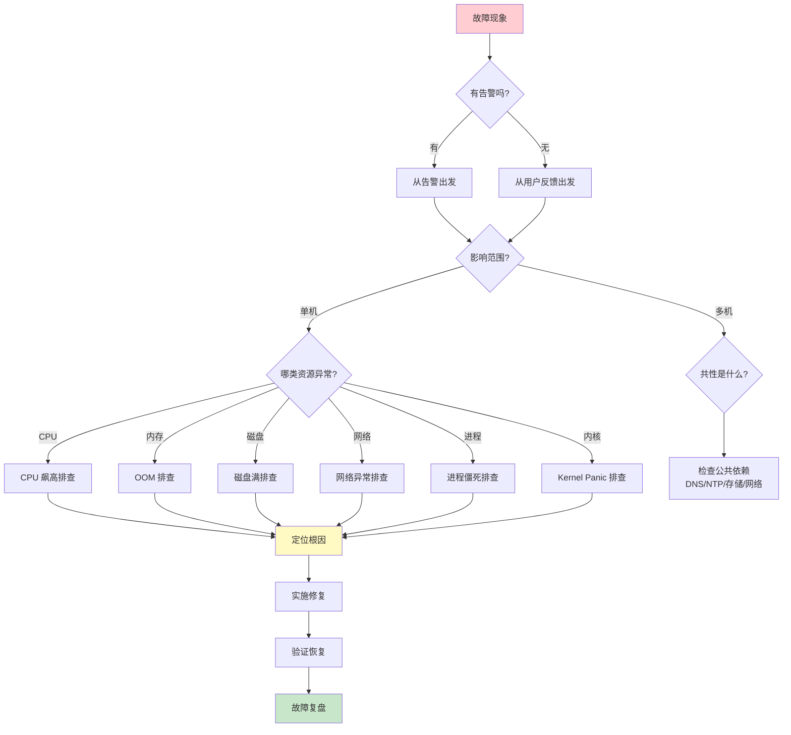
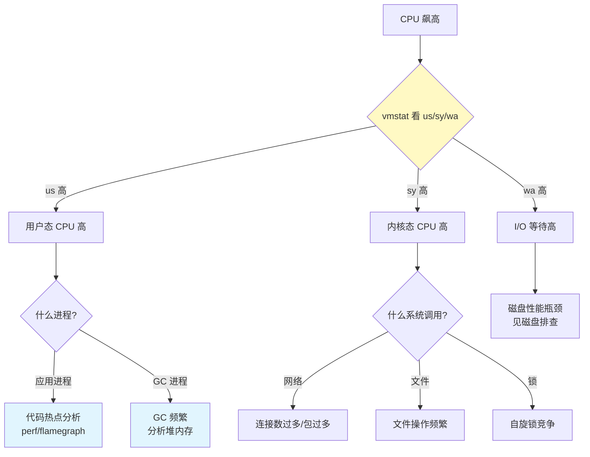
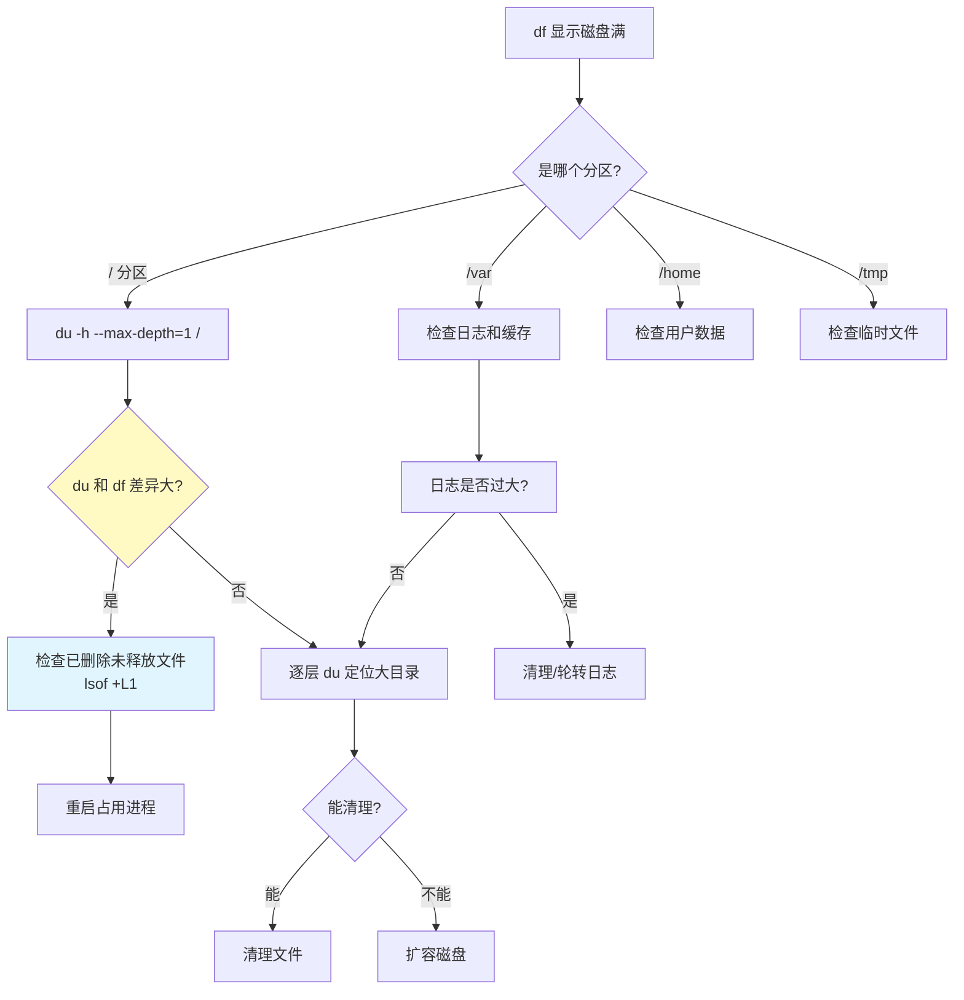
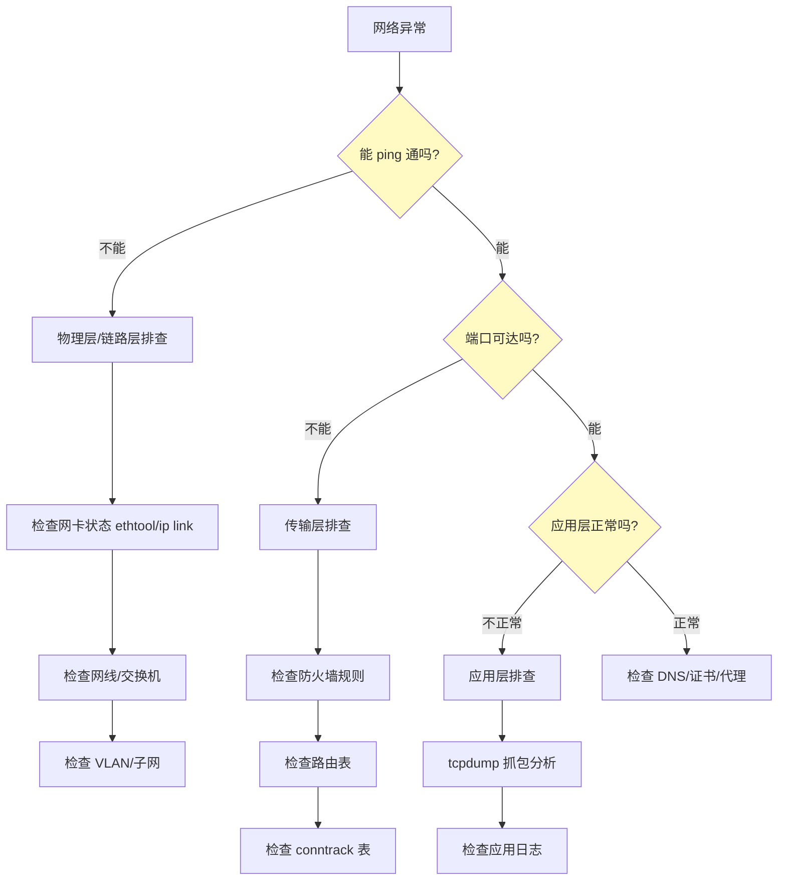
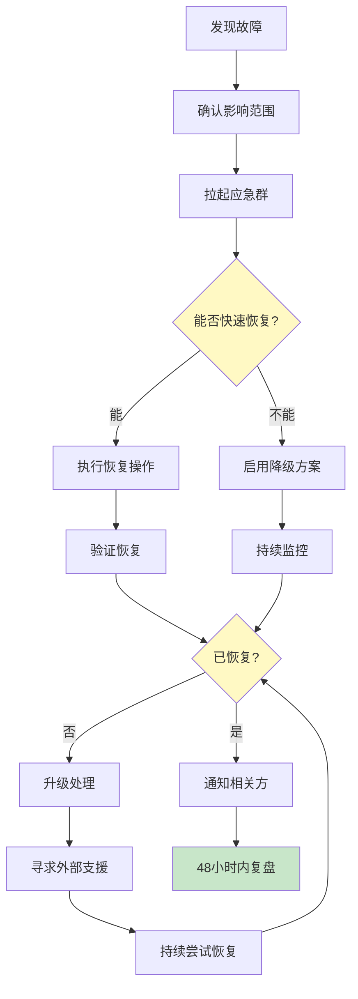

# 故障排查与应急

> 生产故障不会等你准备好才来。掌握系统化的排查方法论，比记住一千条命令更重要——因为故障的形态永远在变，但排查的逻辑不变。

## 故障排查决策树总览

面对一个未知的故障，按照以下决策树逐层下钻：



## 一、故障排查方法论

### 1.1 OODA 循环

军事领域的 OODA 循环同样适用于故障排查：


1. **观察（Observe）**：收集信息，不要急于下结论
2. **判断（Orient）**：分析信息，形成假设
3. **决策（Decide）**：选择最可能的假设，制定验证方案
4. **行动（Act）**：执行验证，根据结果更新判断

::: important 排查时的心态
- **不要猜测**——用数据说话，每个假设都要验证
- **一次只改一个变量**——同时改多个东西，你永远不知道哪个起了作用
- **记录每一步**——排查过程中记录命令和结果，复盘时至关重要
- **保留现场**——在修复之前，先保存日志、核心转储等证据
:::

### 1.2 排查五步法

| 步骤 | 动作 | 关键问题 |
|------|------|----------|
| **观察** | 收集症状 | 发生了什么？什么时候开始的？影响谁？ |
| **假设** | 列出可能原因 | 最可能的原因是什么？按概率排序 |
| **验证** | 针对性检查 | 做什么实验可以证实/证伪假设？ |
| **修复** | 实施解决方案 | 修复方案是什么？有没有回滚方案？ |
| **复盘** | 总结经验 | 根因是什么？如何防止再次发生？ |

### 1.3 排查信息收集清单

```bash
#!/bin/bash
# collect_info.sh - 故障现场信息收集脚本
# 用法: bash collect_info.sh > /tmp/incident_$(date +%Y%m%d_%H%M%S).log

echo "========================================="
echo "  故障现场信息收集"
echo "  时间: $(date '+%Y-%m-%d %H:%M:%S')"
echo "  主机: $(hostname)"
echo "========================================="
echo ""

echo "--- 系统负载 ---"
uptime
echo ""

echo "--- CPU 使用率 ---"
top -bn1 | head -20
echo ""

echo "--- 内存使用 ---"
free -h
echo ""

echo "--- 磁盘使用 ---"
df -h
echo ""

echo "--- 磁盘 I/O ---"
iostat -x 1 3 2>/dev/null || echo "iostat 未安装"
echo ""

echo "--- 网络连接状态 ---"
ss -s
echo ""

echo "--- TOP 10 CPU 进程 ---"
ps aux --sort=-%cpu | head -11
echo ""

echo "--- TOP 10 内存进程 ---"
ps aux --sort=-%mem | head -11
echo ""

echo "--- 最近 OOM 记录 ---"
dmesg | grep -i "oom\|killed process" | tail -5
echo ""

echo "--- 最近内核错误 ---"
dmesg --level=err,crit,alert,emerg | tail -10
echo ""

echo "--- 最近系统日志 ---"
journalctl -p err --since "1 hour ago" --no-pager | tail -20
echo ""

echo "--- 网络监听端口 ---"
ss -tlnp
echo ""

echo "--- 最近登录 ---"
last -10
echo ""

echo "--- 定时任务 ---"
crontab -l 2>/dev/null
ls /etc/cron.d/ 2>/dev/null
echo ""

echo "========================================="
echo "  信息收集完毕"
echo "========================================="
```

## 二、CPU 飙高排查

CPU 飙高是最常见的生产故障之一，但原因千差万别——可能是正常的业务高峰，也可能是死循环、加密破解、或者垃圾回收风暴。

### 2.1 快速定位

```bash
# 第一步：看整体负载
uptime
# 16:30:01 up 30 days, 4 users, load average: 15.2, 12.1, 8.5
#             1分钟  5分钟  15分钟
# 负载 >> CPU 核心数 → 系统过载

# CPU 核心数
nproc
# 或
grep -c ^processor /proc/cpuinfo

# 第二步：看 CPU 使用率分布
# us: 用户态  sy: 内核态  id: 空闲  wa: I/O等待
vmstat 1 5
# procs -----------memory---------- ---swap-- -----io---- -system-- ------cpu-----
#  r  b   swpd   free   buff  cache     si   so    bi    bo   in   cs us sy id wa st
#  5  0      0 123456  12345 234567      0    0    10    20  100  200 85 10  5  0  0
#                                                         ↑  ↑  ↑
#                                              用户态高  内核态高  空闲低

# 第三步：看哪个进程吃 CPU
ps aux --sort=-%cpu | head -11
# 或
top -c -o %CPU

# 第四步：看进程的线程
top -H -p <PID>   # 查看指定进程的线程
```

### 2.2 CPU 使用率分类排查



### 2.3 使用 perf 分析

```bash
# 安装 perf
apt install -y linux-perf-$(uname -r)   # Ubuntu
dnf install -y perf                      # CentOS/Rocky

# 采样 30 秒的 CPU 性能数据
perf record -g -p <PID> -- sleep 30

# 查看报告
perf report

# 或者实时查看热点函数
perf top -p <PID>
```

### 2.4 火焰图（Flame Graph）

火焰图是 CPU 分析的利器——直观展示函数调用栈的耗时分布。

```bash
# 下载 FlameGraph 工具
git clone https://github.com/brendangregg/FlameGraph.git /opt/FlameGraph

# 1. 采集 perf 数据
perf record -F 99 -g -p <PID> -- sleep 30
# -F 99: 每秒采样 99 次
# -g: 记录调用栈
# sleep 30: 采样 30 秒

# 2. 转换 perf 数据
perf script > perf.out

# 3. 折叠调用栈
/opt/FlameGraph/stackcollapse-perf.pl perf.out > perf.folded

# 4. 生成火焰图 SVG
/opt/FlameGraph/flamegraph.pl perf.folded > flamegraph.svg

# 将 flamegraph.svg 下载到本地浏览器打开
```


**火焰图阅读方法：**

- **X 轴**：函数调用栈的人口比例（不是时间线）
- **Y 轴**：调用栈深度（从下往上，caller→callee）
- **宽度**：函数在采样中出现的次数（越宽越耗时）
- **颜色**：随机着色，用于区分不同函数
- **平顶**：直接消耗 CPU 的函数（最值得优化的地方）

::: tip 在线火焰图生成
如果无法在服务器上安装 FlameGraph 工具，可以使用在线生成器。将 `perf script` 的输出复制粘贴到 [speedscope](https://www.speedscope.app/) 即可交互式查看。
:::

### 2.5 Java 应用 CPU 飙高

```bash
# 找到 Java 进程 PID
jps -l

# 线程堆栈
jstack <PID> > jstack_$(date +%Y%m%d_%H%M%S).txt

# 查看 Java 进程的线程 CPU 占用
top -H -p <PID>

# 将十进制线程 ID 转为十六进制
printf "%x\n" <TID>

# 在 jstack 输出中搜索
grep -A 30 "nid=0x<hex_tid>" jstack_*.txt
```

### 2.6 CPU 飙高排查 Checklist

| 检查项 | 命令 | 关注点 |
|--------|------|--------|
| 系统负载 | `uptime` | 负载是否远超 CPU 核数 |
| CPU 使用率 | `vmstat 1 5` | us/sy/wa 哪个高 |
| 热点进程 | `ps aux --sort=-%cpu` | 哪个进程吃 CPU |
| 热点线程 | `top -H -p <PID>` | 进程内哪个线程 |
| 进程状态 | `cat /proc/<PID>/status` | 进程是否被调度 |
| 系统调用 | `strace -c -p <PID>` | 哪些系统调用耗时 |
| 代码热点 | `perf record -g` | 哪个函数耗时 |
| 火焰图 | FlameGraph | 调用栈耗时分布 |

## 三、OOM 排查

OOM（Out of Memory）是 Linux 内核在物理内存和 Swap 都不足时，强制杀死进程的机制。被杀的进程通常不是"罪魁祸首"，而是"最占内存"的。

### 3.1 OOM Killer 工作原理

```mermaid
flowchart TD
    A[内存分配请求] --> B{内存是否足够?}
    B -->|是| C[正常分配]
    B -->|否| D[尝试回收内存]
    D --> E{回收后够不够?}
    E -->|够| C
    E -->|不够| F[触发 OOM Killer]

    F --> G[计算 oom_score<br/>每个进程的"该杀指数"]
    G --> H["选择 oom_score 最高<br/>且非 oom_score_adj=-1000 的进程"]
    H --> I[发送 SIGKILL]
    I --> J[进程被杀死]
    J --> K[释放内存]
    K --> L{内存是否恢复?}
    L -->|是| M[系统恢复]
    L -->|否| F

    style F fill:#ffcdd2
    style J fill:#ffebee
    style M fill:#c8e6c9
```

### 3.2 确认 OOM 事件

```bash
# 方法1：dmesg 查看（最直接）
dmesg | grep -i "oom\|killed process" | tail -20
# 典型输出:
# [12345.678] java invoked oom-killer: gfp_mask=0x14000c0(GFP_KERNEL), nodemask=(null), order=0, oom_score_adj=0
# [12345.679] oom-kill:constraint=CONSTRAINT_NONE,nodemask=(null),cpuset=/,mems_allowed=0,global_oom,task_memcg=/,task=java,pid=12345,uid=1001
# [12345.680] Out of memory: Killed process 12345 (java) total-vm:8192MB, anon-rss:7680MB, file-rss:0MB, shmem-rss:0MB

# 方法2：journalctl 查看
journalctl -k --since "1 hour ago" | grep -i "oom\|killed"
journalctl --since "1 hour ago" | grep -i "oom\|killed"

# 方法3：syslog
grep -i "oom\|killed" /var/log/syslog | tail -20
grep -i "oom\|killed" /var/log/kern.log | tail -20
```

### 3.3 分析 OOM 原因

```bash
# 查看当前内存使用
free -h

# 查看各进程内存占用
ps aux --sort=-%mem | head -20

# 查看进程的详细内存映射
cat /proc/<PID>/smaps | head -50

# 查看 oom_score（0-1000，越高越容易被杀）
cat /proc/<PID>/oom_score

# 查看 oom_score_adj（-1000 到 1000，管理员调整）
cat /proc/<PID>/oom_score_adj

# 保护关键进程不被 OOM Killer 杀死
echo -1000 > /proc/<PID>/oom_score_adj

# 或者让某个进程更容易被杀
echo 500 > /proc/<PID>/oom_score_adj
```

### 3.4 内存使用分析

```bash
# 系统级内存分析
cat /proc/meminfo | head -20

# 按进程统计内存
ps -eo pid,rss,vsz,comm --sort=-rss | head -20
# RSS: 实际物理内存
# VSZ: 虚拟内存（含共享库等，不准确）

# 更准确的进程内存
smem -t -k 2>/dev/null || echo "smem 未安装，使用 apt install smem"

# slab 缓存
slabtop -o -s c | head -20

# 内存碎片
cat /proc/buddyinfo
```

### 3.5 OOM 预防与调优

```bash
# 调整 vm.overcommit_memory
# 0 = 启发式（默认）
# 1 = 总是允许（不推荐，容易 OOM）
# 2 = 不允许超过 swap + vm.overcommit_ratio * RAM（数据库推荐）
sysctl vm.overcommit_memory=2
sysctl vm.overcommit_ratio=50

# 调整 Swap 使用倾向
sysctl vm.swappiness=1

# 限制 cgroup 内存（防止单个容器吃光内存）
# Docker 示例
docker run -m 2g --memory-swap 2g myapp

# 预留内存给关键进程
sysctl vm.min_free_kbytes=262144   # 预留 256MB

# 启用早期 OOM 预警
# 在告警规则中配置内存使用率 > 80% 的 warning
```

::: warning OOM Score 陷阱
- `oom_score_adj=-1000` 的进程**永远不会被 OOM Killer 杀死**——即使它是内存泄漏的元凶
- 保护关键进程时要谨慎：如果一个被保护的进程疯狂泄漏内存，系统会在杀死所有其他进程后卡死
- 最佳实践：保护 SSH 服务和监控系统，其他业务进程不要保护
:::

### 3.6 OOM 排查 Checklist

| 步骤 | 命令 | 目的 |
|------|------|------|
| 确认 OOM | `dmesg \| grep oom` | 确认 OOM Killer 是否触发 |
| 找到被杀进程 | `dmesg \| grep "killed process"` | 哪个进程被杀了 |
| 查看内存现状 | `free -h` | 内存是否恢复正常 |
| 查看各进程占用 | `ps aux --sort=-%mem` | 谁在吃内存 |
| 查看 oom_score | `cat /proc/<PID>/oom_score` | 各进程被杀概率 |
| 检查 Swap | `swapon --show` | Swap 是否生效 |
| 检查 overcommit | `sysctl vm.overcommit_memory` | 内存分配策略 |
| 查看历史趋势 | Grafana 内存面板 | 是渐进增长还是突增 |

## 四、磁盘满排查

磁盘满会导致各种诡异问题：数据库写不进去、日志无法记录、甚至 SSH 都无法登录。

### 4.1 快速定位

```bash
# 查看文件系统使用率
df -h
# Filesystem      Size  Used Avail Use% Mounted on
# /dev/sda1        50G   48G  2.0G  97% /

# 查看 inode 使用率（小文件场景）
df -i

# 进入挂载点，查看各目录占用
cd /
du -h --max-depth=1 | sort -hr | head -20
```

### 4.2 找出大文件

```bash
# 查找超过 100MB 的文件
find / -type f -size +100M -exec ls -lh {} \; 2>/dev/null | \
    awk '{print $5, $9}' | sort -hr

# 查找最近 24 小时修改的大文件
find / -type f -size +50M -mtime -1 -exec ls -lh {} \; 2>/dev/null

# 查找被删除但未释放的文件（常见原因！）
lsof +L1 | grep deleted
# 或
lsof | grep deleted | awk '{print $2, $7/1024/1024, $9}' | sort -k2 -hr
```

::: important 被删除但未释放的文件
这是磁盘满最常见的"隐藏"原因：进程打开了一个文件，然后文件被 `rm` 删除了。磁盘空间没有释放，因为进程仍然持有文件句柄。`df` 显示满了，但 `du` 加起来对不上。

解决方法：
```bash
# 方法1：重启占用文件的进程
systemctl restart <service>

# 方法2：清空文件内容（不删除文件句柄）
> /proc/<PID>/fd/<FD>
```
:::

### 4.3 磁盘满排查流程



### 4.4 磁盘满紧急处理

```bash
# 1. 先释放一些空间让系统可用
# 清理旧日志
find /var/log -name "*.gz" -mtime +30 -delete
find /var/log -name "*.old" -delete
find /var/log -name "*.[0-9]" -delete

# 清理 apt/dnf 缓存
apt clean                    # Ubuntu
dnf clean all                # CentOS/Rocky

# 清理 systemd 日志
journalctl --vacuum-time=7d
journalctl --vacuum-size=500M

# 清理 Docker
docker system prune -af --volumes  # 谨慎！会删除未使用的镜像和卷

# 清理临时文件
find /tmp -type f -mtime +7 -delete
find /var/tmp -type f -mtime +30 -delete

# 2. 如果无法登录 SSH（磁盘满导致无法写 .bashrc）
# 使用 PSSH 或从控制台/VNC 登录
ssh -o StrictHostKeyChecking=no user@host "df -h"

# 3. 如果连 root 分区都满了无法写文件
# 用挂载方式临时扩容
mount -o remount,size=1G /tmp  # 如果 /tmp 是 tmpfs
```

### 4.5 磁盘监控预防

```bash
# 设置磁盘使用率告警
# Prometheus 告警规则已在前一章配置

# 设置磁盘配额（防止单用户吃光磁盘）
# 启用配额
quotacheck -cum /
quotaon /

# 设置用户配额
edquota -u username
# 设置 soft limit 和 hard limit

# 查看配额
repquota -a
```

## 五、网络异常排查

网络问题的排查难度最高——因为涉及本地配置、交换机、路由器、防火墙、对端服务等多个环节。

### 5.1 网络排查分层



### 5.2 连接状态分析

```bash
# 查看连接状态汇总
ss -s

# 详细查看各状态连接数
ss -ant | awk '{print $1}' | sort | uniq -c | sort -rn
#   526 ESTAB
#    12 TIME-WAIT
#     5 CLOSE-WAIT   ← 注意这个！
#     2 LISTEN

# TIME-WAIT 过多
ss -ant state time-wait | wc -l

# CLOSE-WAIT 过多（应用没有正确关闭连接）
ss -ant state close-wait | wc -l

# 查看某个端口的连接
ss -tnp sport = :8080

# 查看与某个 IP 的连接
ss -tnp dst 192.168.1.200
```

::: warning CLOSE-WAIT 的含义
`CLOSE-WAIT` 表示对方已经关闭了连接（发送了 FIN），但本方应用还没有调用 `close()`。大量 CLOSE-WAIT 通常意味着应用代码有 bug——没有正确处理连接关闭。这与系统参数无关，需要修改应用代码。
:::

### 5.3 tcpdump 抓包

```bash
# 抓取所有流量
tcpdump -i eth0 -nn -w /tmp/capture.pcap

# 抓取特定端口的流量
tcpdump -i eth0 -nn port 8080 -w /tmp/capture.pcap

# 抓取特定 IP 的流量
tcpdump -i eth0 -nn host 192.168.1.200 -w /tmp/capture.pcap

# 实时查看（不写文件）
tcpdump -i eth0 -nn port 8080 -A -s 0

# 只看 TCP SYN 包（新建连接）
tcpdump -i eth0 -nn 'tcp[tcpflags] & tcp-syn != 0'

# 只看 TCP RST 包（连接被重置）
tcpdump -i eth0 -nn 'tcp[tcpflags] & tcp-rst != 0'

# 限制抓包大小
tcpdump -i eth0 -nn -w /tmp/capture.pcap -C 100 -W 5
# -C 100: 每个文件 100MB
# -W 5: 最多保留 5 个文件（轮转）

# 将 .pcap 文件下载到本地用 Wireshark 分析
```

### 5.4 conntrack 表满

```bash
# 查看 conntrack 表使用量
cat /proc/sys/net/netfilter/nf_conntrack_count
# 65536

# 查看 conntrack 表上限
cat /proc/sys/net/netfilter/nf_conntrack_max
# 65536

# 如果 count 接近 max，说明表快满了
# 症状：新连接无法建立，dmesg 出现 "nf_conntrack: table full, dropping packet"

# 临时解决：增大 conntrack 表
sysctl -w net.netfilter.nf_conntrack_max=262144

# 永久解决
echo "net.netfilter.nf_conntrack_max = 262144" >> /etc/sysctl.d/99-production.conf
sysctl -p /etc/sysctl.d/99-production.conf

# 优化 conntrack 超时
sysctl -w net.netfilter.nf_conntrack_tcp_timeout_established=600
sysctl -w net.netfilter.nf_conntrack_tcp_timeout_time_wait=30
sysctl -w net.netfilter.nf_conntrack_udp_timeout=30

# 查看各超时配置
sysctl -a | grep nf_conntrack.*timeout
```

### 5.5 网络异常排查速查

| 现象 | 可能原因 | 排查命令 |
|------|----------|----------|
| 无法 ping 通 | 网卡 down / 防火墙 / 路由 | `ip link`, `iptables -L`, `ip route` |
| 能 ping 不能连接 | 端口未监听 / 防火墙 | `ss -tlnp`, `iptables -L` |
| 连接超时 | 路由问题 / 对端无响应 | `traceroute`, `tcpdump` |
| 连接被拒绝 | 端口未监听 | `ss -tlnp` |
| 连接被重置 | 防火墙 / 应用异常 | `tcpdump`, 应用日志 |
| TIME-WAIT 过多 | 短连接过多 | `sysctl tcp_tw_reuse` |
| CLOSE-WAIT 过多 | 应用 bug | 修改代码 |
| conntrack 满 | 连接数过多 | 增大 nf_conntrack_max |
| DNS 解析慢 | DNS 服务器慢 | `dig`, `nslookup` |

## 六、进程僵死排查

进程"僵死"（zombie 或 hang）是另一个常见问题——进程还在，但不干活了。

### 6.1 僵尸进程 vs 挂起进程

| 类型 | 定义 | 特征 | 处理方式 |
|------|------|------|----------|
| **Zombie** | 子进程退出但父进程未 `wait()` | `Z` 状态，不占资源 | 修复父进程代码 |
| **Hang** | 进程卡在系统调用上 | `D` 或 `S` 状态，不响应信号 | `strace` 定位卡在哪里 |

```bash
# 查找僵尸进程
ps aux | grep 'Z'

# 或
ps -eo pid,ppid,stat,cmd | grep 'Z'

# 查找 D 状态进程（不可中断睡眠）
ps -eo pid,ppid,stat,cmd | grep 'D'

# 统计各状态进程数
ps -eo stat | tail -n +2 | sort | uniq -c | sort -rn
```

### 6.2 strace 追踪

```bash
# 追踪进程的系统调用
strace -p <PID>

# 带时间戳
strace -tt -p <PID>

# 统计系统调用
strace -c -p <PID>

# 只追踪特定系统调用
strace -e trace=network -p <PID>    # 网络相关
strace -e trace=file -p <PID>       # 文件相关
strace -e trace=process -p <PID>    # 进程相关

# 追踪并保存到文件
strace -tt -o /tmp/strace_<PID>.log -p <PID>

# 多线程进程追踪所有线程
strace -f -p <PID>
```

**典型 strace 输出解读：**

```bash
# 进程卡在 futex（锁等待）
strace -p 12345
# futex(0x7f1234560000, FUTEX_WAIT_PRIVATE, 0, NULL) = ? ERESTARTSYS (To be restarted)

# 进程卡在 read（等待数据）
# read(3, ^C            # 一直等待，没有数据

# 进程卡在 connect（连接超时）
# connect(3, {sa_family=AF_INET, sin_port=htons(3306), sin_addr=inet_addr("192.168.1.200")}, 16
# = -1 ETIMEDOUT (Connection timed out)
```

### 6.3 ltrace 追踪库函数

```bash
# 追踪进程的库函数调用
ltrace -p <PID>

# 统计
ltrace -c -p <PID>

# 只追踪特定库函数
ltrace -e malloc+free -p <PID>
```

### 6.4 GDB 调试

```bash
# 安装 gdb
apt install -y gdb

# 附加到正在运行的进程
gdb -p <PID>

# GDB 内常用命令
(gdb) info threads          # 查看所有线程
(gdb) thread apply all bt   # 所有线程的调用栈
(gdb) bt                    # 当前线程调用栈
(gdb) frame 3               # 切换到第3帧
(gdb) print variable        # 打印变量值
(gdb) detach                # 脱离进程
(gdb) quit                  # 退出
```

::: warning GDB 附加会暂停进程
`gdb -p <PID>` 附加到进程时，进程会被暂停。在生产环境中使用 GDB 需要格外小心，尤其是对延迟敏感的服务。建议先 `strace` 看概览，必要时再用 GDB 深入。
:::

## 七、内核 Panic 排查

Kernel Panic 是 Linux 内核遇到无法恢复的错误时的自我保护机制。服务器会立刻重启，所有内存中的状态丢失。

### 7.1 配置 Kdump

Kdump 在内核 panic 时捕获内存转储，供事后分析。

```bash
# 安装 kdump-tools
apt install -y kdump-tools    # Ubuntu
dnf install -y kexec-tools    # CentOS/Rocky

# 配置 kdump
# /etc/default/kdump-tools
USE_KDUMP=1
KDUMP_SYSCTL="kernel.panic_on_oops=1 kernel.panic=10"

# 为 kdump 预留内存
# 在 GRUB 配置中添加 crashkernel 参数
# /etc/default/grub
GRUB_CMDLINE_LINUX="crashkernel=256M"

# 更新 GRUB
update-grub      # Ubuntu
grub2-mkconfig -o /boot/grub2/grub.cfg   # CentOS

# 重启系统
reboot

# 验证 kdump 状态
systemctl status kdump-tools    # Ubuntu
systemctl status kdump          # CentOS/Rocky

# 查看预留内存
cat /proc/iomem | grep "Crash kernel"
```

### 7.2 分析 vmcore

```bash
# 安装 crash 工具
apt install -y crash            # Ubuntu
dnf install -y crash           # CentOS/Rocky

# 下载与当前内核匹配的 debuginfo 包
# Ubuntu: linux-image-$(uname -r)-dbgsym
# CentOS: kernel-debuginfo-$(uname -r)

# 分析 vmcore
crash /usr/lib/debug/boot/vmlinux-$(uname -r) /var/crash/<timestamp>/vmcore

# crash 内常用命令
crash> sys                     # 系统信息
crash> bt                      # 当前任务调用栈
crash> ps                      # 进程列表
crash> log                     # 内核日志
crash> foreach bt              # 所有进程的调用栈
crash> dev -d                  # 设备信息
crash> mount                   # 挂载信息
crash> quit                    # 退出
```

### 7.3 内核 Panic 常见原因

| 原因 | 特征 | 排查方向 |
|------|------|----------|
| 硬件故障 | 随机 panic，MCE 错误 | `mcelog`, 硬件诊断 |
| 驱动 bug | 更新驱动后出现 | 回退驱动版本 |
| 内存损坏 | ECC 错误，随机崩溃 | `memtest86+` |
| 文件系统损坏 | 特定操作触发 panic | `fsck`, 检查磁盘 |
| 内核 bug | 特定内核版本 | 升级内核补丁 |
| 资源耗尽 | OOM 后 panic | 调整内存参数 |

```bash
# 查看 MCE（Machine Check Exception）错误
mcelog --ascii < /var/log/mcelog

# 查看硬件错误
grep -i "hardware error\|mce\|edac" /var/log/kern.log

# 内存测试（需要停机）
# 从 USB 启动 memtest86+
```

## 八、应急 SOP 模板

### 8.1 应急响应流程



### 8.2 应急 SOP 模板

```markdown
# 应急响应 SOP

## 1. 故障发现
- 发现时间：____
- 发现方式：告警 / 用户反馈 / 巡检
- 故障现象：____

## 2. 影响评估
- 影响范围：____（全部用户 / 部分用户 / 内部）
- 影响程度：____（不可用 / 降级 / 慢）
- 业务影响：____（订单损失 / 数据风险 / 品牌影响）

## 3. 应急响应
- 响应人员：____
- 通知方式：____（电话 / 钉钉 / 邮件）
- 通知范围：____（团队 / 领导 / 客户）

## 4. 故障排查
- 排查过程：____（命令、输出、结论）
- 根因假设：____
- 验证结果：____

## 5. 故障修复
- 修复方案：____
- 执行时间：____
- 回滚方案：____（如果修复失败怎么办）

## 6. 恢复验证
- 验证方法：____
- 验证结果：____
- 恢复时间：____

## 7. 后续跟进
- 复盘时间：____
- 改进项：____
- 责任人：____
- 截止日期：____
```

### 8.3 常见故障应急手册

**CPU 飙高应急**

```bash
# 1. 确认是否为正常业务高峰
# 查看 QPS 是否突增

# 2. 如果是异常进程
top -c -o %CPU
# 找到异常进程 PID

# 3. 如果需要紧急恢复（谨慎！）
# 先生成 core dump 保留现场
gcore <PID>

# 然后决定是否 kill
kill <PID>          # 发送 SIGTERM（优雅退出）
kill -9 <PID>       # 发送 SIGKILL（强制杀死，最后手段）

# 4. 扩容
# 水平扩容：增加实例
# 垂直扩容：升级实例规格
```

**OOM 应急**

```bash
# 1. 确认 OOM
dmesg | grep -i "oom\|killed" | tail -5

# 2. 临时缓解
# 增大 Swap
fallocate -l 4G /swapfile
chmod 600 /swapfile
mkswap /swapfile
swapon /swapfile

# 3. 重启被杀的服务
systemctl restart <service>

# 4. 检查内存泄漏
# 如果内存持续增长，需要分析堆内存
```

**磁盘满应急**

```bash
# 1. 确认哪个分区满了
df -h

# 2. 快速释放空间
# 清理日志
find /var/log -name "*.gz" -mtime +7 -delete
journalctl --vacuum-size=500M

# 3. 如果是已删除未释放的文件
lsof +L1 | grep deleted
# 重启占用进程

# 4. 如果以上都不行
# 扩容磁盘（云服务器可在线扩容）
```

## 九、故障复盘模板

故障复盘（Post-Mortem）是从事故中学习的唯一方式。好的复盘文化关注"系统哪里出了问题"，而非"谁犯了错"。

### 9.1 复盘模板

```markdown
# 故障复盘报告

## 基本信息
- **故障标题**：
- **故障时间**：____年__月__日 __:__ ~ __:__（持续 __ 小时 __ 分钟）
- **影响范围**：
- **影响程度**：P__（P1/P2/P3/P4）
- **复盘时间**：____年__月__日
- **参与人员**：

## 时间线

| 时间 | 事件 | 操作人 |
|------|------|--------|
| HH:MM | 告警触发 | 系统 |
| HH:MM | 值班响应 | 张三 |
| HH:MM | 确认故障 | 张三 |
| HH:MM | 执行修复 | 李四 |
| HH:MM | 验证恢复 | 张三 |
| HH:MM | 全量恢复 | 系统 |

## 根因分析

### 直接原因
（什么直接导致了故障）

### 间接原因
（什么条件使得直接原因得以发生）

### 根本原因
（系统性问题，为什么这些条件存在）

## 5 Whys 分析

1. 为什么故障发生？→ ____
2. 为什么 ___ ？→ ____
3. 为什么 ___ ？→ ____
4. 为什么 ___ ？→ ____
5. 为什么 ___ ？→ ____

## 改进项

| # | 改进项 | 类型 | 优先级 | 责任人 | 截止日期 |
|---|--------|------|--------|--------|----------|
| 1 | | 监控 | P1 | | |
| 2 | | 告警 | P2 | | |
| 3 | | 代码 | P1 | | |
| 4 | | 文档 | P3 | | |
| 5 | | 流程 | P2 | | |

类型：监控 / 告警 / 代码 / 文档 / 流程 / 架构

## 经验教训

### 做得好的
- ____

### 需要改进的
- ____

### 意外发现
- ____

## 附录
- 相关日志
- 监控截图
- 代码变更
```

### 9.2 5 Whys 示例

**场景**：数据库响应超时导致全站 500

1. **为什么全站 500？** → 数据库响应超时，应用线程池耗尽
2. **为什么数据库响应超时？** → 一条慢查询锁住了整张表
3. **为什么这条慢查询会锁表？** → 查询条件缺少索引，走了全表扫描
4. **为什么缺少索引？** → 上周发布的新功能新增了查询条件，但代码评审没有检查索引
5. **为什么代码评审没有检查索引？** → 没有数据库变更的评审检查清单

**根因**：缺乏数据库变更的评审流程和检查清单。

**改进**：建立数据库变更评审检查清单，新查询必须附带执行计划（EXPLAIN）。

### 9.3 复盘文化要点

::: important 无责复盘原则
1. **对事不对人**——关注系统和流程的缺陷，而非个人的失误
2. **人人平等**——无论职级高低，都有权表达观点
3. **行动导向**——每条改进项必须有责任人和截止日期
4. **持续跟踪**——复盘不是终点，改进项的落地才是
5. **定期回顾**——每月检查改进项的进展，防止"复盘完就忘"
:::

## 十、排查工具速查表

| 工具 | 用途 | 常用命令 |
|------|------|----------|
| `top/htop` | 实时进程监控 | `htop -p <PID>` |
| `vmstat` | 虚拟内存统计 | `vmstat 1 5` |
| `iostat` | 磁盘 I/O 统计 | `iostat -x 1 5` |
| `mpstat` | CPU 统计 | `mpstat -P ALL 1` |
| `sar` | 历史性能数据 | `sar -u 1 5` |
| `free` | 内存使用 | `free -h` |
| `df/du` | 磁盘使用 | `df -h`, `du -h --max-depth=1` |
| `ss` | 网络连接 | `ss -tlnp`, `ss -s` |
| `tcpdump` | 网络抓包 | `tcpdump -i eth0 -nn port 80` |
| `strace` | 系统调用追踪 | `strace -p <PID>` |
| `ltrace` | 库函数追踪 | `ltrace -p <PID>` |
| `gdb` | 进程调试 | `gdb -p <PID>` |
| `perf` | 性能分析 | `perf record -g -p <PID>` |
| `lsof` | 打开文件 | `lsof -p <PID>`, `lsof +L1` |
| `dmesg` | 内核日志 | `dmesg -T -l err,crit,alert,emerg` |
| `journalctl` | 系统日志 | `journalctl -u <service> --since "1 hour ago"` |
| `nc` | 端口连通性 | `nc -zv host port` |
| `dig/nslookup` | DNS 解析 | `dig @8.8.8.8 example.com` |
| `traceroute` | 路由追踪 | `traceroute -T -p 443 host` |
| `crash` | 内核转储分析 | `crash vmlinux vmcore` |

## 参考资源

- [Brendan Gregg's Linux Performance](http://www.brendangregg.com/linuxperf.html) - Linux 性能分析权威
- [Linux Performance Observability Tools](http://www.brendangregg.com/Perf/linux_observability_tools.png) - 性能工具全景图
- [Google SRE 故障排查](https://sre.google/sre-book/troubleshooting/) - 故障排查方法论
- [The Linux Crash Utility](https://crash-utility.github.io/) - 内核转储分析
- [Flame Graph](https://github.com/brendangregg/FlameGraph) - 火焰图工具
- [Linux Insides](https://0xax.gitbooks.io/linux-insides/content/) - Linux 内核原理
