# 进程调度原理

::: important 核心问题
当系统中同时存在数百个进程竞争有限的CPU时间时，内核如何决定谁先运行、运行多久？这就是进程调度要解决的根本问题——在公平性与吞吐量之间找到最优平衡点。
:::

## 从一个问题开始

想象一下：你的系统上同时运行着视频播放器、编译任务、Web服务器和数十个后台守护进程。视频播放器需要流畅的帧率，编译任务想要尽可能多的CPU时间，Web服务器需要快速响应请求。内核调度器就像一位精密的交通警察，决定哪个进程何时上路、行驶多久。

Linux调度器经历了从简单到精妙的演进历程：O(n)调度器 → O(1)调度器 → CFS完全公平调度器。每一次演进都解决了一个关键瓶颈。

---

## 进程描述符：task_struct

每个进程在内核中都有一个 `task_struct` 结构体，它是内核对进程的完整描述——进程的"身份证"和"档案袋"。

### task_struct 的关键字段

```c
// include/linux/sched.h - 简化版
struct task_struct {
    // 进程标识
    volatile long state;          // 进程状态
    void *stack;                  // 内核栈
    pid_t pid;                    // 进程ID
    pid_t tgid;                   // 线程组ID

    // 调度相关
    int prio;                     // 动态优先级
    int static_prio;              // 静态优先级
    int normal_prio;              // 普通优先级
    const struct sched_class *sched_class;  // 调度类
    struct sched_entity se;       // CFS调度实体
    struct sched_rt_entity rt;    // 实时调度实体
    struct sched_dl_entity dl;    // Deadline调度实体
    unsigned int policy;          // 调度策略
    int nr_cpus_allowed;          // 允许运行的CPU数
    cpumask_t cpus_allowed;       // 允许运行的CPU掩码

    // 时间统计
    u64 utime;                    // 用户态运行时间
    u64 stime;                    // 内核态运行时间
    unsigned long nvcsw;          // 自愿上下文切换次数
    unsigned long nivcsw;         // 非自愿上下文切换次数

    // 内存管理
    struct mm_struct *mm;         // 用户空间内存描述符
    struct mm_struct *active_mm;  // 活跃内存描述符

    // 文件与信号
    struct fs_struct *fs;         // 文件系统信息
    struct files_struct *files;   // 打开文件表
    struct signal_struct *signal; // 信号处理

    // 进程关系
    struct task_struct *parent;   // 父进程
    struct list_head children;    // 子进程链表
    struct list_head sibling;     // 兄弟进程链表
};
```

### 进程状态转换

Linux进程有几种核心状态，它们之间的转换构成了进程的生命周期：

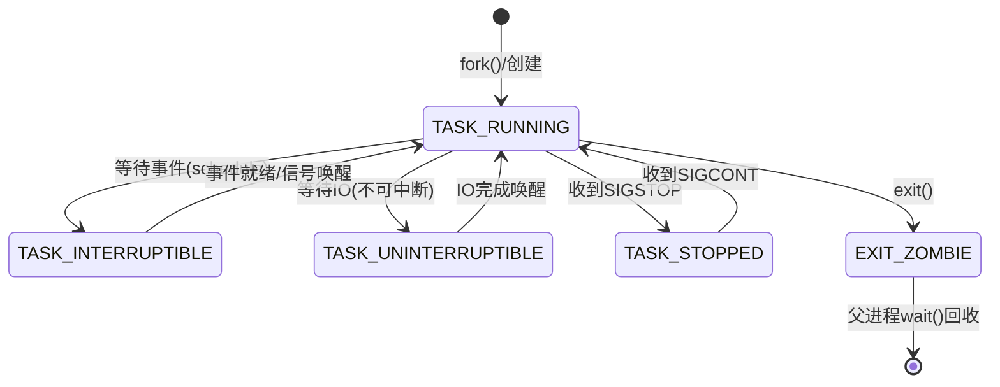

::: tip TASK_RUNNING 的双重含义
在Linux中，`TASK_RUNNING` 状态包含两种情况：
1. **正在运行**：当前占有CPU
2. **就绪等待**：在运行队列中等待被调度

内核通过 `current` 宏和运行队列来区分这两种情况。这一点与许多教科书不同——Linux没有单独的"就绪"状态。
:::

### 查看进程信息

```bash
# 查看进程状态
cat /proc/<pid>/status

# 查看进程调度信息
cat /proc/<pid>/sched

# 查看进程优先级和调度策略
chrt -p <pid>

# 使用 ps 查看进程状态码
ps -eo pid,stat,comm | head -20
```

```
# /proc/self/sched 输出示例
nr_switches                  :        152
nr_voluntary_switches        :         89
nr_involuntary_switches      :         63
se.exec_start                :   123456789.012345
se.vruntime                  :       5678.901234
se.sum_exec_runtime          :        234.567890
```

---

## 调度器演进：从O(n)到CFS

### O(n) 调度器（Linux 2.4）


O(n)调度器的问题非常明显：

| 问题 | 说明 |
|------|------|
| 时间复杂度O(n) | 每次调度都要遍历所有进程，进程越多越慢 |
| 全局锁 | 所有CPU共享一个运行队列，SMP扩展性差 |
| 交互进程识别不准 | 基于启发式猜测，容易误判 |
| 不适合NUMA | 对NUMA架构完全无感知 |

::: warning O(n)的致命缺陷
想象一个拥有4096个进程的服务器——每次调度决策需要遍历4096个task_struct，而且这个操作在锁保护下进行，所有CPU都在争用同一把锁。在SMP系统上，这简直是灾难。
:::

### O(1) 调度器（Linux 2.6 - 2.6.22）

O(1)调度器由Ingo Molnar设计，核心改进：

```c
// O(1) 调度器的核心数据结构
struct prio_array {
    unsigned int nr_active;              // 活跃进程数
    unsigned long bitmap[BITMAP_SIZE];   // 优先级位图
    struct list_head queue[MAX_PRIO];    // 每个优先级一个链表
};

struct runqueue {
    spinlock_t lock;                     // 运行队列锁
    unsigned long nr_running;            // 运行中进程数
    struct prio_array *active;           // 活跃数组
    struct prio_array *expired;          // 过期数组
    struct prio_array arrays[2];         // 两个数组
    // ... 其他字段
};
```

O(1)调度器的工作方式：

1. 每个CPU有独立的运行队列
2. 维护两个优先级数组：active和expired
3. 进程时间片用完后从active移到expired
4. active为空时交换active和expired
5. 通过位图O(1)找到最高优先级进程

```
            O(1) 调度器运行队列

    ┌─────────────────────────────┐
    │      per-CPU runqueue       │
    ├─────────────────────────────┤
    │  active array   │ expired array │
    │  ┌───────────┐  │ ┌───────────┐ │
    │  │ bitmap[0] │  │ │ bitmap[0] │ │
    │  │ bit=1 ──────→ │ │           │ │
    │  │ queue[0]  │  │ │ queue[0]  │ │
    │  │ queue[1]  │  │ │ queue[1]  │ │
    │  │ ...       │  │ │ ...       │ │
    │  │ queue[99] │  │ │ queue[99] │ │
    │  │  ┌──────┐│  │ │           │ │
    │  │  │Proc A││  │ │           │ │
    │  │  │Proc B││  │ │           │ │
    │  │  └──────┘│  │ │           │ │
    │  │ queue[140]│ │ │ queue[140]│ │
    │  └───────────┘  │ └───────────┘ │
    └─────────────────────────────┘

    时间片用完 → active移到expired
    active空 → 交换两个数组
```

::: info O(1)的遗留问题
虽然O(1)调度器解决了O(n)的主要问题，但它仍然依赖复杂的启发式规则来区分交互式进程和批处理进程。这些启发式规则充满了魔法数字，难以理解和维护。更重要的是，在某些场景下（如大量交互式进程），调度延迟会变得不可预测。
:::

### CFS 完全公平调度器（Linux 2.6.23 至今）

CFS由Ingo Molnar在2007年设计，核心理念完全不同：

> "设想你有一台完美的理想CPU，它能以绝对公平的方式同时运行所有进程。在这样一个CPU上，每个进程都能获得1/n的CPU时间。CFS的目标就是模拟这种理想状态。"

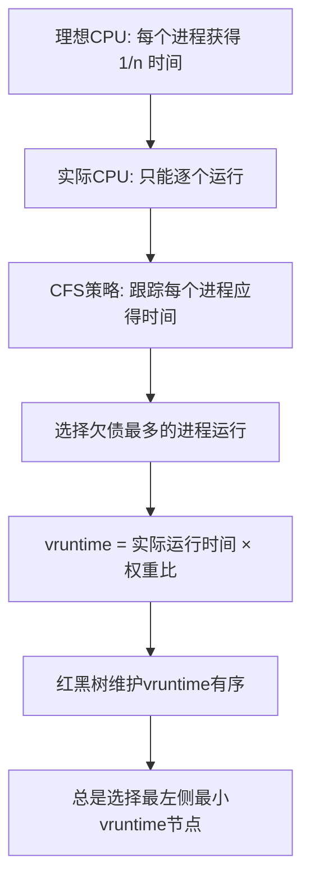

---

## CFS 完全公平调度器原理

### 核心概念：vruntime

vruntime（虚拟运行时间）是CFS的灵魂。它不是墙上时钟时间，而是经过权重调整后的"公平时间"。

```
vruntime 计算公式：

vruntime += delta_exec × (NICE_0_LOAD / weight)

其中：
- delta_exec: 实际运行时间
- NICE_0_LOAD: nice值为0的进程权重（1024）
- weight: 当前进程的权重

权重表（基于nice值）：
  nice -20 → weight 88761  （获得最多CPU时间）
  nice -10 → weight 9548
  nice   0 → weight 1024   （基准）
  nice  10 → weight 110
  nice  19 → weight 15     （获得最少CPU时间）

nice值每增加1，CPU份额减少约10%
nice值范围：-20 ~ +19
```

::: tip 为什么需要vruntime？
如果直接用实际运行时间来衡量公平性，高优先级进程会"吃亏"——它虽然获得了更多CPU时间，但从公平角度看它只是得到了应得的份额。vruntime通过权重归一化，让不同优先级进程在同一尺度上比较。
:::

```bash
# 观察进程的vruntime
cat /proc/<pid>/sched | grep vruntime

# 调整进程nice值
renice -n 5 -p <pid>

# 以指定nice值启动
nice -n 10 ./my_program
```

### 红黑树：CFS的数据结构

CFS使用红黑树来维护所有可运行进程，按vruntime排序：

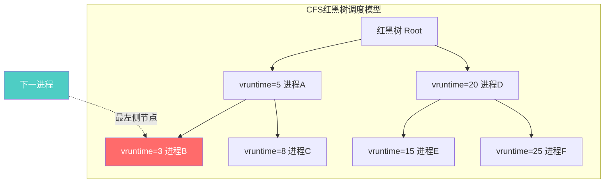

红黑树的关键性质保证了CFS的效率：

| 操作 | 时间复杂度 | 说明 |
|------|-----------|------|
| 查找最左节点 | O(1) | 缓存了rb_leftmost |
| 插入进程 | O(log n) | 进程被唤醒时 |
| 删除进程 | O(log n) | 进程被阻塞时 |
| 平衡调整 | O(log n) | 插入/删除后自动 |

### sched_entity：调度实体

CFS不直接操作 `task_struct`，而是通过 `sched_entity` 来管理：

```c
// include/linux/sched.h - 简化版
struct sched_entity {
    struct load_weight load;         // 权重
    struct rb_node run_node;         // 红黑树节点
    unsigned int on_rq;              // 是否在运行队列

    u64 exec_start;                  // 开始执行时间
    u64 sum_exec_runtime;            // 总执行时间
    u64 vruntime;                    // 虚拟运行时间
    u64 prev_sum_exec_runtime;       // 上次总执行时间

    // 用于组调度
    struct cfs_rq *my_q;             // 所属的CFS运行队列
};
```

::: important 调度实体的层次性
`sched_entity` 既可以代表单个进程，也可以代表一个进程组（cgroup）。这种设计使得组调度成为可能——先在组间分配CPU时间，再在组内分配。
:::

### CFS调度流程

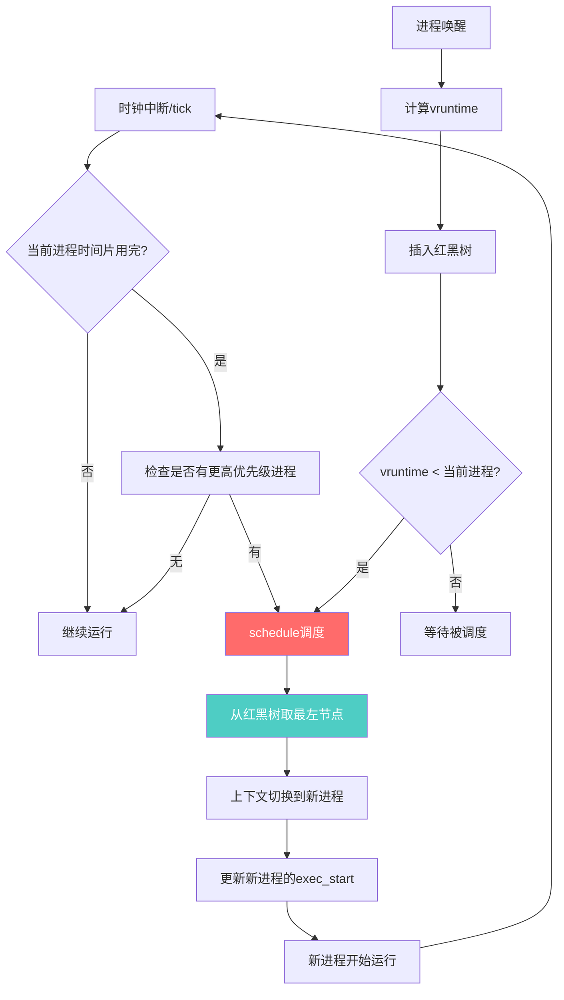

### CFS的关键参数

```bash
# 查看CFS调度参数
cat /proc/sys/kernel/sched_min_granularity_ns    # 最小调度粒度
cat /proc/sys/kernel/sched_latency_ns             # 目标调度延迟
cat /proc/sys/kernel/sched_wakeup_granularity_ns  # 唤醒抢占粒度
cat /proc/sys/kernel/sched_child_runs_first       # 子进程是否先运行
```

```
调度延迟与最小粒度的关系：

目标调度延迟 = sched_latency_ns（默认6ms）
最小调度粒度 = sched_min_granularity_ns（默认0.75ms）

当进程数 n ≤ sched_latency/sched_min_granularity:
    每个进程的时间片 = sched_latency / n

当进程数 n > sched_latency/sched_min_granularity:
    每个进程的时间片 = sched_min_granularity

示例：
  6个进程 → 每个获得 6ms/6 = 1ms
  20个进程 → 每个获得 0.75ms（不是6ms/20=0.3ms）
```

::: warning sched_latency_ns 不是延迟上限
`sched_latency_ns` 的名字容易误导——它不是"调度延迟"的上限，而是CFS用来计算时间片的基准值。在负载较重时，所有进程轮流运行一遍的时间可以远超这个值。
:::

---

## 调度类（Scheduling Classes）

Linux调度器采用模块化设计，通过调度类（sched_class）实现不同调度策略的插件式管理：

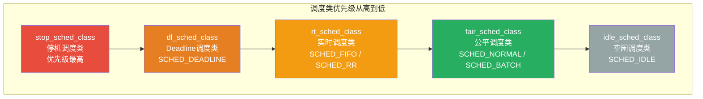

### 调度类选择逻辑

```c
// kernel/sched/core.c - 简化版
static inline struct task_struct *
pick_next_task(struct rq *rq, struct task_struct *prev)
{
    const struct sched_class *class;
    struct task_struct *p;

    // 按优先级遍历调度类
    for_each_class(class) {
        p = class->pick_next_task(rq, prev);
        if (p)
            return p;
    }

    // 所有调度类都没有可运行进程 → idle
    return NULL;  // 不会到达，idle类总会返回
}
```

每个调度类的核心操作：

```c
struct sched_class {
    // 将进程加入运行队列
    void (*enqueue_task)(struct rq *rq, struct task_struct *p, int flags);
    // 将进程从运行队列移除
    void (*dequeue_task)(struct rq *rq, struct task_struct *p, int flags);
    // 选择下一个运行的进程
    struct task_struct *(*pick_next_task)(struct rq *rq, struct task_struct *prev);
    // 时钟tick处理
    void (*task_tick)(struct rq *rq, struct task_struct *p, int queued);
    // 进程唤醒时检查是否抢占
    void (*check_preempt_wakeup)(struct rq *rq, struct task_struct *p, int wake_flags);
    // ...
};
```

### 各调度类详解

#### stop 调度类

- 优先级最高的调度类
- 每个CPU只有一个stop任务
- 用于内核内部的关键操作（如CPU热插拔、迁移其他进程）
- 不受任何限制，可以抢占一切
- 普通用户无法使用

#### idle 调度类

- 优先级最低
- 每个CPU一个idle进程（pid=0）
- 系统没有任何可运行进程时执行
- 负责节能（进入mwait/hlt指令）

---

## 实时调度

实时调度用于有严格时间要求的任务，保证在规定期限内得到响应。

### SCHED_FIFO（先进先出实时调度）

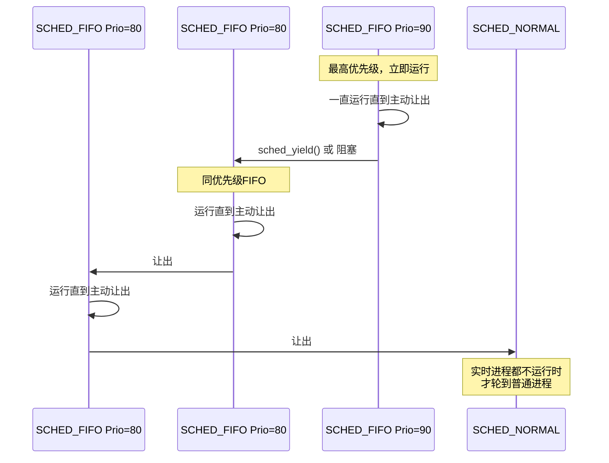

SCHED_FIFO 规则：
1. 同优先级按到达顺序运行
2. 运行中的FIFO进程不会被同优先级进程抢占
3. 只能被更高优先级进程抢占
4. 除非主动让出（sched_yield/阻塞/退出），否则一直运行

### SCHED_RR（时间片轮转实时调度）

```bash
# 查看RR时间片长度
cat /proc/sys/kernel/sched_rr_timeslice_ms
# 默认值：100ms

# 设置RR进程
chrt -r -p 80 <pid>    # 设置为SCHED_RR，优先级80
chrt -r --max 80 ./my_rt_program  # 以RR方式启动

# 查看进程调度策略
chrt -p <pid>
```

SCHED_RR 与 SCHED_FIFO 的唯一区别：RR进程有时间片，用完后轮到同优先级的下一个RR进程。

```
SCHED_FIFO vs SCHED_RR 对比：

SCHED_FIFO:                    SCHED_RR:
  ┌──────┐                       ┌──────┐
  │ RT-A │ 一直运行               │ RT-A │ 时间片
  │ P=80 │ 直到让出               │ P=80 │ 100ms
  └──┬───┘                       └──┬───┘
     │ 让出                          │ 时间片用完
     v                               v
  ┌──────┐                       ┌──────┐
  │ RT-B │ 一直运行               │ RT-B │ 时间片
  │ P=80 │ 直到让出               │ P=80 │ 100ms
  └──────┘                       └──┬───┘
                                     │ 时间片用完
                                     v
                                 ┌──────┐
                                 │ RT-A │ 轮转回来
                                 │ P=80 │
                                 └──────┘
```

### SCHED_DEADLINE（截止时间调度）

SCHED_DEADLINE 是Linux 3.14引入的最早截止时间优先（EDF）调度策略：

```c
// SCHED_DEADLINE 的三个关键参数
struct sched_attr {
    u64 sched_runtime;    // 一个周期内需要的最大CPU时间
    u64 sched_deadline;   // 相对截止时间
    u64 sched_period;     // 周期
};
```

```bash
# 设置DEADLINE调度
# 要求：每100ms周期内，最多运行20ms，截止时间50ms
chrt -d --sched-runtime 20000000 \
       --sched-deadline 50000000 \
       --sched-period  100000000 \
       0 ./my_dl_program
```

```mermaid
gantt
    title SCHED_DEADLINE 时间模型
    dateFormat X
    axisFormat %L

    section 周期1
    运行 (最多20ms) :done, r1, 0, 20
    空闲           :idle, 20, 100

    section 周期2
    运行 (最多20ms) :done, r2, 100, 115
    空闲           :idle, 115, 200

    section 关键时间点
    到达时间 a1 : milestone, 0, 0
    截止时间 d1 : milestone, 50, 50
    周期结束 p1 : milestone, 100, 100
```

::: warning SCHED_DEADLINE 的准入控制
内核会进行准入测试（admission test），只有当新进程加入后，所有DEADLINE进程的CPU利用率之和不超过100%时才允许：

```
Σ(runtime_i / period_i) ≤ 1

示例：
  进程A: runtime=20ms, period=100ms → 利用率 0.2
  进程B: runtime=30ms, period=100ms → 利用率 0.3
  进程C: runtime=40ms, period=100ms → 利用率 0.4
  总利用率 = 0.9 ≤ 1 ✅ 允许

  进程D: runtime=20ms, period=100ms → 利用率 0.2
  总利用率 = 1.1 > 1 ❌ 拒绝
```
:::

### 实时调度与普通进程的对比

| 特性 | SCHED_FIFO | SCHED_RR | SCHED_DEADLINE | SCHED_NORMAL |
|------|-----------|----------|----------------|-------------|
| 优先级范围 | 1-99 | 1-99 | 无（EDF） | nice -20~19 |
| 时间片 | 无限 | 有（默认100ms） | 由参数决定 | CFS动态计算 |
| 抢占规则 | 仅高优先级 | 高优先级+时间片 | 最早截止时间 | vruntime最小 |
| 保证性 | 硬实时 | 软实时 | 硬实时 | 无保证 |
| CPU占用 | 可100% | 可100% | 受限 | 公平分配 |

```bash
# 实时进程权限
# 普通用户默认不能创建实时进程，需要调整RLIMIT_RTPRIO
ulimit -r          # 查看实时优先级限制

# /etc/security/limits.conf
# @realtime  -  rtprio  99
# @realtime  -  nice    -20

# 防止实时进程饿死普通进程
cat /proc/sys/kernel/sched_rt_runtime_us    # 默认950000（0.95s）
cat /proc/sys/kernel/sched_rt_period_us     # 默认1000000（1s）
# 含义：在1秒周期内，实时进程最多运行0.95秒
# 留出0.05秒给普通进程，防止饿死
```

---

## 时间片与 Tick

### 时钟中断

Linux通过时钟中断（timer interrupt）驱动调度决策：

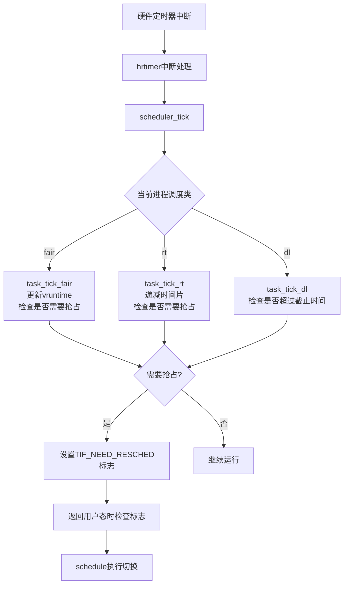

### Tickless 机制

传统内核每1ms或4ms产生一次时钟中断，即使CPU空闲也要处理。NO_HZ（Tickless）机制优化了这一点：

```bash
# 查看内核NO_HZ配置
cat /boot/config-$(uname -r) | grep NO_HZ
# CONFIG_NO_HZ_IDLE=y      空闲时关闭tick
# CONFIG_NO_HZ_FULL=y       运行单个任务时关闭tick

# 查看当前tickless状态
cat /sys/devices/system/cpu/nohz_full
cat /sys/devices/system/cpu/isolated
```

```
传统 Tick 模式：

  |tick|tick|tick|tick|tick|tick|tick|
  ↓    ↓    ↓    ↓    ↓    ↓    ↓
  空闲  空闲  空闲  空闲  空闲  空闲  空闲
  （CPU被频繁唤醒，浪费电量）

NO_HZ_IDLE 模式：

  |tick|          ...省略...        |tick|
  ↓                                ↓
  空闲             深度睡眠          被唤醒
  （空闲时不产生tick，节能）

NO_HZ_FULL 模式：

  |tick|  进程独占CPU运行   |tick|
  ↓                        ↓
  调度    无中断干扰运行     调度
  （减少中断，提高吞吐量和实时性）
```

::: info NO_HZ_FULL 的适用场景
NO_HZ_FULL 特别适合高性能计算和实时场景。当一个CPU上只有一个可运行进程时，不需要时钟中断来触发调度——因为根本没有其他进程需要调度。这样消除了不必要的中断开销。但至少需要一个CPU（通常是CPU 0）保留为"管家"CPU，处理定时器和RCU等内核基础设施。
:::

---

## 上下文切换

上下文切换是调度器最核心的操作——保存旧进程状态，加载新进程状态。

### 切换过程

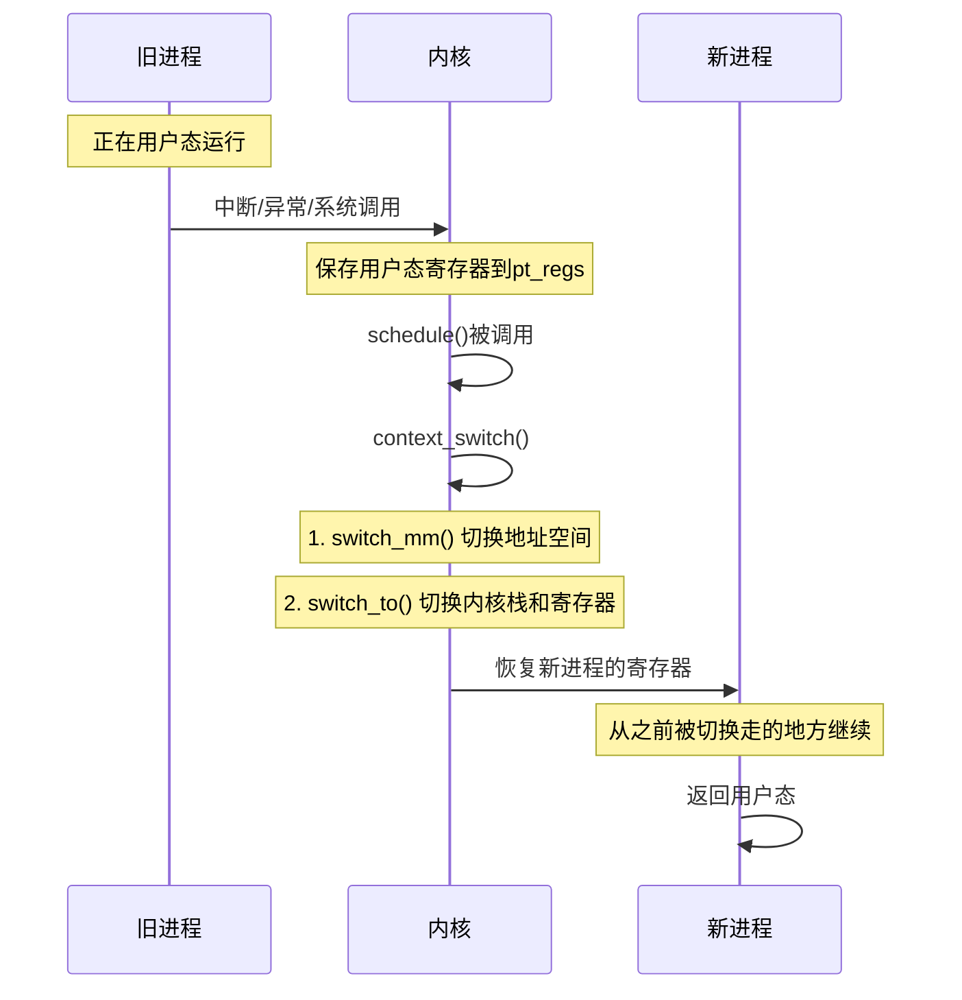

### 具体切换内容

```c
// 上下文切换的核心步骤
static __always_inline struct rq *
context_switch(struct rq *rq, struct task_struct *prev,
               struct task_struct *next)
{
    // 1. 切换内存管理上下文（地址空间）
    if (!next->mm) {  // 内核线程
        // 内核线程借用前一个进程的mm
        next->active_mm = prev->active_mm;
    } else {
        // 普通进程切换页表
        switch_mm_irqs_off(prev->active_mm, next->mm, next);
        // 刷新TLB
    }

    // 2. 切换寄存器和栈
    switch_to(prev, next, prev);
    // 这里实际上是汇编代码：
    // - 保存callee-saved寄存器到旧进程的thread_info
    // - 切换内核栈指针（ESP/RSP）
    // - 从新进程的thread_info恢复寄存器
    // - 跳转到新进程被切换走的位置

    return finish_task_switch(prev);
}
```

### 切换开销

```bash
# 使用 perf 测量上下文切换开销
perf stat -e sched:sched_switch -I 1000 ./my_program

# 查看系统上下文切换次数
cat /proc/stat | grep ctxt
vmstat 1 5    # 每秒输出，关注cs列

# 使用 eBPF 跟踪上下文切换
# bpftrace -e 'tracepoint:sched:sched_switch { @count[ctx->next_comm] = count(); }'

# 查看进程的上下文切换
cat /proc/<pid>/status | grep ctxt
# voluntary_ctxt_switches:    89
# nonvoluntary_ctxt_switches: 63
```

::: warning 上下文切换的隐藏成本
一次上下文切换的直接成本约3-5微秒，但间接成本更高：
1. **TLB刷新**：地址空间切换后TLB失效，后续内存访问需要多次页表查询
2. **Cache污染**：新进程的代码和数据不在Cache中，产生大量Cache Miss
3. **分支预测失效**：CPU的分支预测器需要重新学习
4. **预取失效**：硬件预取器需要重新预热

在Cache密集型工作负载中，一次上下文切换的实际成本可能高达数十微秒。
:::

---

## CPU 亲和性

CPU亲和性（CPU Affinity）决定了一个进程可以在哪些CPU上运行。

### 亲和性原理

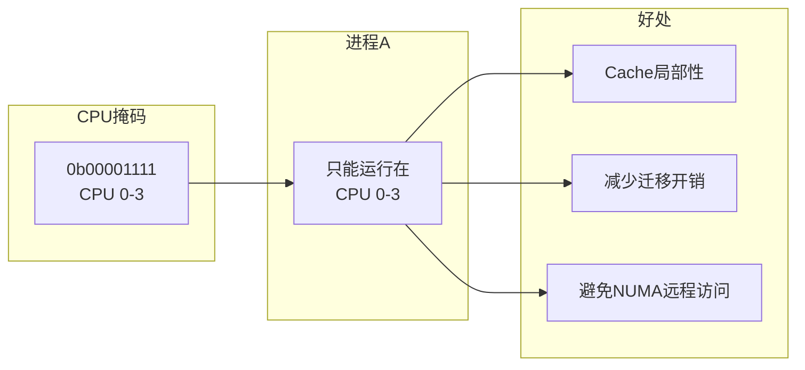

### 设置CPU亲和性

```bash
# 查看进程当前亲和性
taskset -p <pid>

# 设置进程亲和性（CPU 0和2）
taskset -p 0x5 <pid>       # 0b0101 = CPU 0,2

# 启动时指定亲和性
taskset -c 0,2 ./my_program

# 使用 sched_setaffinity 系统调用
# C语言示例：
```

```c
#define _GNU_SOURCE
#include <sched.h>
#include <unistd.h>
#include <stdio.h>

int main() {
    cpu_set_t mask;
    CPU_ZERO(&mask);
    CPU_SET(0, &mask);  // 绑定CPU 0
    CPU_SET(2, &mask);  // 绑定CPU 2

    if (sched_setaffinity(0, sizeof(mask), &mask) == -1) {
        perror("sched_setaffinity");
        return 1;
    }

    printf("Process bound to CPU 0 and 2\n");
    while (1) {
        // 热循环，只会被调度到CPU 0或2
    }
    return 0;
}
```

### irqsmp 与中断亲和性

```bash
# 查看中断亲和性
cat /proc/irq/<irq_num>/smp_affinity

# 设置网卡中断亲和性
echo 0x02 > /proc/irq/<irq_num>/smp_affinity  # 绑定到CPU 1

# 使用 irqbalance 自动分配中断
systemctl status irqbalance

# 查看每个CPU的中断统计
cat /proc/interrupts
```

```
高性能网络场景的中断分配策略：

  CPU 0    CPU 1    CPU 2    CPU 3
  ┌────┐   ┌────┐   ┌────┐   ┌────┐
  │eth0│   │eth0│   │eth0│   │eth0│
  │Rx-0│   │Rx-1│   │Rx-2│   │Rx-3│
  └────┘   └────┘   └────┘   └────┘
  用户态   用户态   用户态   用户态
  进程A   进程B   进程C   进程D

  每个网卡队列中断绑定到不同CPU
  处理进程也绑定到对应CPU
  → 最小化Cache Miss和锁争用
```

---

## cgroup v2 CPU 限制

cgroup（控制组）是Linux提供的资源隔离机制，可以限制、记录和隔离进程组使用的物理资源。

### cgroup v2 CPU控制器

```mermaid
flowchart TD
    subgraph cgroup v2 层次结构
        ROOT[/sys/fs/cgroup<br/>根cgroup]
        ROOT --> CG1[container1/<br/>cpu.max=50000 100000<br/>cpu.weight=100]
        ROOT --> CG2[container2/<br/>cpu.max=20000 100000<br/>cpu.weight=50]
        ROOT --> CG3[batch/<br/>cpu.max=max<br/>cpu.weight=10]
    end

    subgraph CPU时间分配
        CG1 --> |50%上限<br/>权重100| T1[容器1进程]
        CG2 --> |20%上限<br/>权重50| T2[容器2进程]
        CG3 --> |无上限<br/>权重10| T3[批处理进程]
    end
```

### cpu.max：硬限制

```bash
# 查看CPU限制
cat /sys/fs/cgroup/container1/cpu.max
# 输出格式: max_quota max_period
# 50000 100000 → 每个周期100ms内最多使用50ms

# 设置CPU限制（最多使用1.5个CPU核心）
echo "150000 100000" > /sys/fs/cgroup/container1/cpu.max

# 不限制
echo "max 100000" > /sys/fs/cgroup/container1/cpu.max

# 完全禁止（挂起）
echo "0 100000" > /sys/fs/cgroup/container1/cpu.max
```

### cpu.weight：软限制

```bash
# 查看权重
cat /sys/fs/cgroup/container1/cpu.weight
# 默认值：100
# 范围：1-10000

# 设置权重
echo "200" > /sys/fs/cgroup/container1/cpu.weight

# 权重只在CPU争用时起作用
# 两个cgroup权重比 200:100 → CPU时间比 2:1
# 但如果没有争用，每个cgroup可以使用100%CPU
```

```
cpu.max vs cpu.weight 对比：

  场景：4核CPU，两个cgroup A和B

  只设置 weight (A=200, B=100):
    争用时：A获得2/3，B获得1/3
    空闲时：A可用400%，B可用400%

  设置 max (A: max, B: 50%):
    争用时：B最多50%（2核），A获得剩余
    空闲时：B仍然最多50%，A可用100%

  max 是硬墙，weight 是比例尺
```

### 实战：使用cgroup限制容器CPU

```bash
# 创建cgroup
mkdir /sys/fs/cgroup/myapp

# 将进程加入cgroup
echo $$ > /sys/fs/cgroup/myapp/cgroup.procs

# 设置CPU限制：最多1个核心
echo "100000 100000" > /sys/fs/cgroup/myapp/cpu.max

# 设置权重
echo "50" > /sys/fs/cgroup/myapp/cpu.weight

# 验证设置
cat /sys/fs/cgroup/myapp/cpu.max
cat /sys/fs/cgroup/myapp/cpu.weight
cat /sys/fs/cgroup/myapp/cgroup.procs

# 查看CPU使用统计
cat /sys/fs/cgroup/myapp/cpu.stat
# usage_usec 12345678
# user_usec  10000000
% system_usec  2345678
# nr_periods   1000
# nr_throttled 50       ← 被限流的次数
# throttled_usec 500000  ← 被限流的总时间
```

::: warning cgroup v1 与 v2 的区别
cgroup v2 统一了层级结构，CPU相关的主要变化：
- `cpu.cfs_quota_us` + `cpu.cfs_period_us` → `cpu.max`（格式：quota period）
- `cpu.shares` → `cpu.weight`（范围从2-262144变为1-10000）
- `cpu.stat` 格式简化，增加了throttled统计
- 所有控制器在统一层级下工作
:::

---

## 运行队列：per-CPU rq

每个CPU维护自己的运行队列，这是Linux调度器可扩展性的关键：

```c
// kernel/sched/sched.h - 简化版
struct rq {
    raw_spinlock_t lock;               // 运行队列锁
    unsigned int nr_running;           // 运行中进程数
    unsigned long cpu_load[CPU_LOAD_IDX_MAX]; // CPU负载历史

    // 各调度类的运行队列
    struct cfs_rq cfs;                 // CFS运行队列
    struct rt_rq  rt;                  // 实时运行队列
    struct dl_rq  dl;                  // Deadline运行队列

    struct task_struct *curr;          // 当前运行的进程
    struct task_struct *idle;          // idle进程
    struct task_struct *stop;          // stop进程

    u64 clock;                         // 运行队列时钟
    int cpu;                           // CPU编号
    // ... 更多字段
};
```

### 负载均衡

当某些CPU负载不均衡时，内核会进行负载均衡：

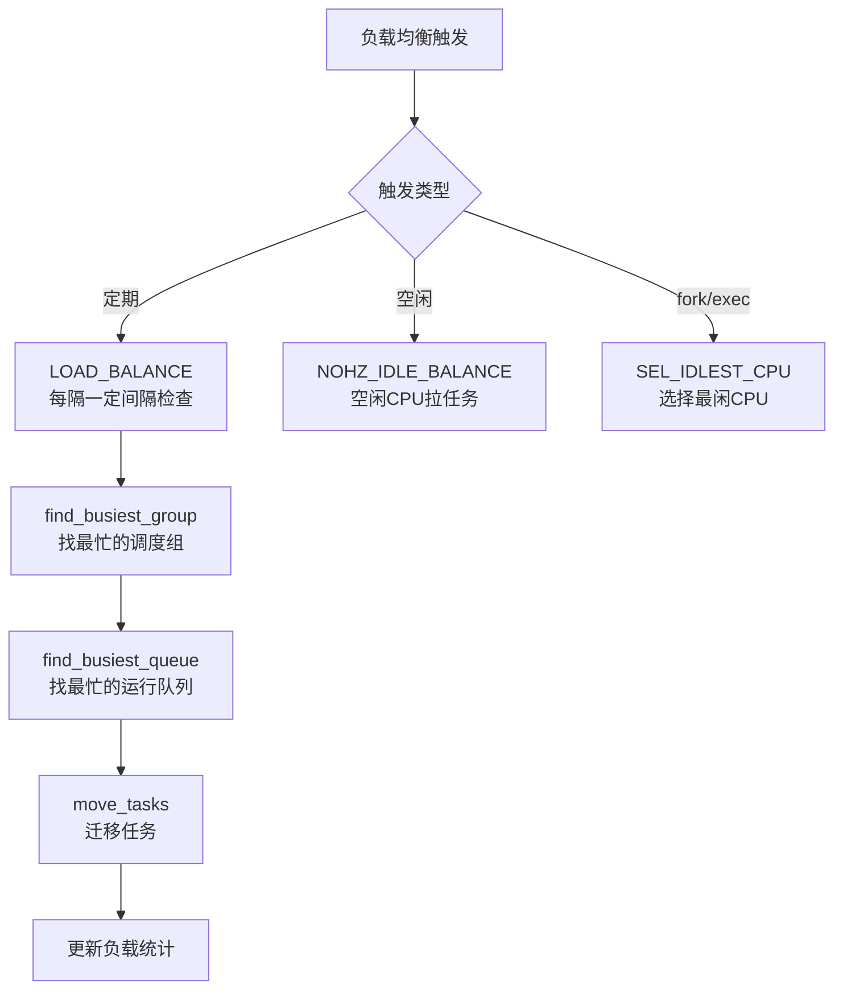

```bash
# 查看每个CPU的运行队列长度
cat /proc/stat
# cpu  user nice system idle iowait irq softirq steal guest guest_nice

# 使用 mpstat 监控CPU负载
mpstat -P ALL 1

# 查看调度域
cat /proc/sys/kernel/sched_domain/cpu0/domain*/name

# 调整负载均衡参数
cat /proc/sys/kernel/sched_migration_cost_ns    # 迁移成本，默认500000
cat /proc/sys/kernel/sched_nr_migrate           # 一次最多迁移32个任务
```

---

## 调度延迟分析

### 实时调度延迟

```bash
# 使用 cyclictest 测量调度延迟
cyclictest -m -Sp90 -n -h400 -D 10 -i 200

# 参数说明：
# -m: 锁定内存（避免page fault）
# -Sp90: 优先级90
# -n: 使用clock_nanosleep
# -h400: 直方图，最大400us
# -D 10: 运行10秒
# -i 200: 间隔200us

# 输出示例：
# Max:    47 us
# Min:     1 us
# Avg:     3 us
```

### 使用 ftrace 跟踪调度

```bash
# 启用调度跟踪
echo 1 > /sys/kernel/debug/tracing/tracing_on
echo sched_switch > /sys/kernel/debug/tracing/current_tracer

# 跟踪一段时间
sleep 1

# 读取结果
cat /sys/kernel/debug/tracing/trace | head -20
# myapp-1234  [002] d... 1234.567890: sched_switch: prev_comm=myapp prev_pid=1234 prev_prio=120 prev_state=R+ ==> next_comm=swapper/2 next_pid=0 next_prio=120

# 使用 function_graph 跟踪调度函数
echo function_graph > /sys/kernel/debug/tracing/current_tracer
echo schedule > /sys/kernel/debug/tracing/set_graph_function
```

### 使用 perf 分析调度

```bash
# 记录调度事件
perf record -e sched:* -a -- sleep 10

# 分析调度延迟
perf sched latency

# 分析调度映射（时间线视图）
perf sched map

# 分析上下文切换
perf stat -e 'sched:sched_switch,sched:sched_process_exec,sched:sched_process_fork' -a sleep 5
```

---

## 进程调度实战调优

### 场景1：低延迟交易系统

```bash
# 1. 使用SCHED_FIFO实时调度
chrt -f -p 80 <pid>

# 2. 绑定专用CPU
taskset -c 2 <pid>
echo 2 > /sys/devices/system/cpu/cpu2/online

# 3. 隔离CPU（内核启动参数）
# isolcpus=2,3 nohz_full=2,3 rcu_nocbs=2,3

# 4. 关闭CPU频率调节
cpupower frequency-set -g performance

# 5. 调整实时调度参数
echo -1 > /proc/sys/kernel/sched_rt_runtime_us  # 取消RT限流（慎用！）
```

### 场景2：Web服务器优化

```bash
# 1. 增大somaxconn
echo 65535 > /proc/sys/net/core/somaxconn

# 2. 调整CFS参数
echo 10000000 > /proc/sys/kernel/sched_min_granularity_ns   # 10ms
echo 20000000 > /proc/sys/kernel/sched_wakeup_granularity_ns # 20ms

# 3. 减少上下文切换
# Nginx worker_processes = CPU核心数
# worker_cpu_affinity 自动绑定

# 4. 使用SO_REUSEPORT
# 多个进程监听同一端口，减少锁争用
```

### 场景3：批处理任务优化

```bash
# 1. 使用SCHED_BATCH降低调度优先级
chrt -b -p 0 <pid>

# 2. 设置低CPU权重
echo "10" > /sys/fs/cgroup/batch/cpu.weight

# 3. 使用nice值
renice -n 19 -p <pid>

# 4. 限制CPU使用
echo "50000 100000" > /sys/fs/cgroup/batch/cpu.max  # 最多50%
```

---

## 内核源码导读

### 关键源码路径

```
kernel/sched/
├── core.c              # 调度器核心：schedule(), context_switch()
├── fair.c              # CFS调度器：enqueue, dequeue, pick_next
├── rt.c                # 实时调度器：SCHED_FIFO, SCHED_RR
├── deadline.c          # Deadline调度器
├── idle.c              # Idle调度类
├── stop_task.c         # Stop调度类
├── sched.h             # 内部数据结构定义
├── topology.c          # 调度域拓扑
├── loadavg.c           # 负载平均计算
├── stats.c             # 调度统计
├── debug.c             # 调试信息
└── autogroup.c         # 自动组调度

include/linux/sched.h   # task_struct 定义
include/linux/sched/
├── fair.h              # CFS相关声明
├── rt.h                # RT相关声明
└── deadline.h          # Deadline相关声明
```

### 核心函数调用链

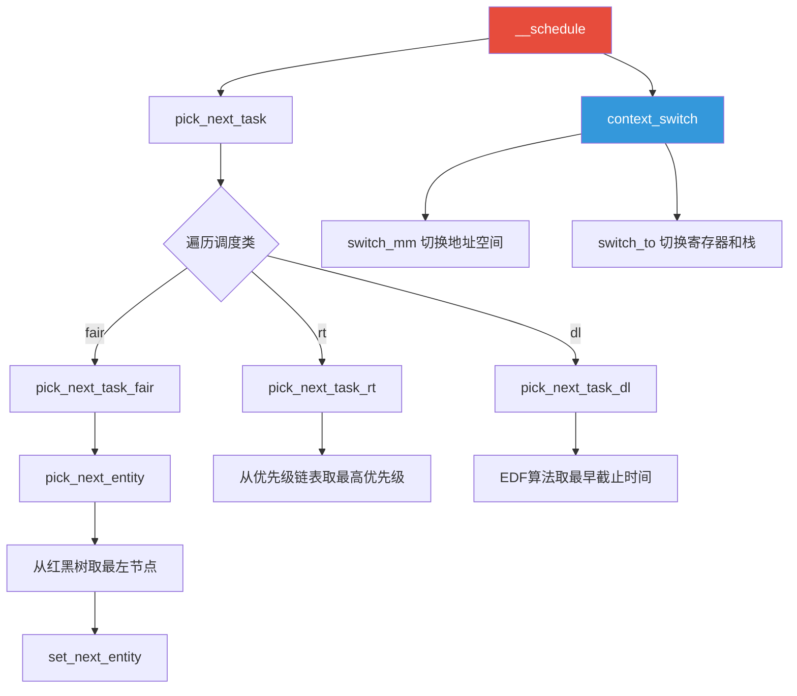

---

## 总结

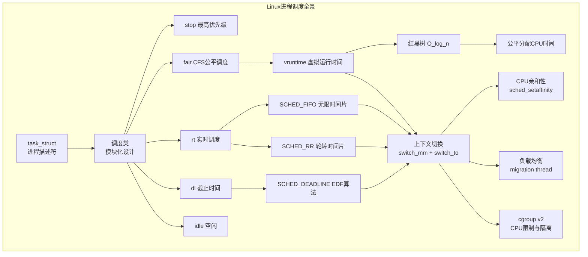

::: important 调度器设计哲学
Linux调度器的设计体现了几个核心哲学：
1. **公平性优先**：CFS追求绝对公平，而非简单的优先级
2. **模块化**：调度类设计允许灵活扩展新的调度策略
3. **可扩展性**：per-CPU运行队列避免了全局锁
4. **实用性**：在理论与工程之间取得平衡（如vruntime的归一化）
5. **渐进演进**：从O(n)到CFS，每一步都解决了上一个的关键瓶颈
:::

---

## 参考资料

- **《深入理解Linux内核》**（Understanding the Linux Kernel）- Daniel P. Bovet, Marco Cesati
- **《Linux内核设计与实现》**（Linux Kernel Development）- Robert Love
- **Linux内核源码**：`kernel/sched/` 目录
- [CFS设计文档](https://www.kernel.org/doc/html/latest/scheduler/sched-design-CFS.html)
- [SCHED_DEADLINE文档](https://www.kernel.org/doc/html/latest/scheduler/sched-deadline.html)
- [cgroup v2文档](https://www.kernel.org/doc/html/latest/admin-guide/cgroup-v2.html)
