# 内存管理机制

::: important 核心问题
内存是计算机最珍贵的资源之一。Linux内核必须高效地管理内存：为每个进程提供独立的地址空间、快速分配和释放物理页、在内存不足时做出正确的回收决策。内存管理子系统是内核中最复杂、最关键的部分。
:::

## 从一个比喻开始

想象一座巨大的酒店（物理内存），住着数百位客人（进程）。每位客人只能看到自己房间的布局（虚拟地址空间），完全不知道酒店的全貌。酒店经理（内核）必须做到：

1. **隔离**：客人A不能闯入客人B的房间
2. **按需分配**：客人要多少给多少，但不能超额
3. **高效查找**：根据虚拟房号快速找到真实房间
4. **紧急预案**：酒店满房时有合理的腾退策略

这就是Linux内存管理要解决的全部问题。

---

## 虚拟地址空间

### 为什么需要虚拟地址？

没有虚拟地址的世界：

```
物理内存直接暴露给进程：

  进程A (0x1000处写数据) ──→ 物理内存 0x1000
  进程B (0x1000处写数据) ──→ 物理内存 0x1000  ← 冲突！
  进程C (恶意访问内核区) ──→ 物理内存 0xC0000000 ← 危险！

问题：
  ✗ 进程间无法隔离
  ✗ 无法使用超过物理内存的地址空间
  ✗ 进程必须感知物理内存布局
  ✗ 无法实现内存共享
```

有虚拟地址的世界：

```
每个进程拥有独立的虚拟地址空间：

  进程A的视角          进程B的视角          内核的视角
  ┌──────────┐        ┌──────────┐        ┌──────────┐
  │0xFFFFFFFF│        │0xFFFFFFFF│        │0xFFFFFFFF│
  │ 内核空间  │        │ 内核空间  │        │ 内核空间  │
  │(共享映射) │        │(共享映射) │        │          │
  ├──────────┤        ├──────────┤        │          │
  │ 栈 ↓     │        │ 栈 ↓     │        │          │
  │          │        │          │        │          │
  │ mmap区   │        │ mmap区   │        │          │
  │          │        │          │        │          │
  │ 堆 ↑     │        │ 堆 ↑     │        │          │
  │ BSS段    │        │ BSS段    │        │          │
  │ 数据段   │        │ 数据段   │        │          │
  │ 代码段   │        │ 代码段   │        │          │
  │0x00000000│        │0x00000000│        │0x00000000│
  └──────────┘        └──────────┘        └──────────┘

  虚拟地址0x1000     虚拟地址0x1000
     ↓                  ↓
  页表转换            页表转换
     ↓                  ↓
  物理页A            物理页B    ← 不同物理页，隔离！
```

### 虚拟地址空间布局

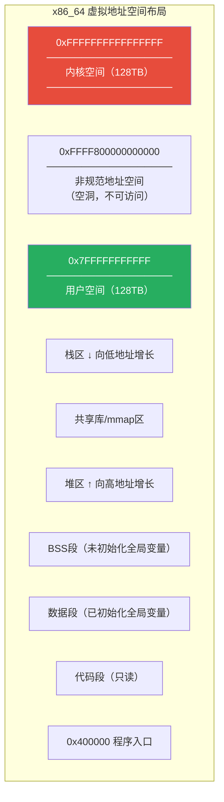

::: tip 查看进程地址空间
```bash
# 查看进程完整的内存映射
cat /proc/<pid>/maps

# 更详细的内存信息
cat /proc/<pid>/smaps

# 查看进程内存使用摘要
cat /proc/<pid>/status | grep Vm

# 使用 pmap 工具
pmap -x <pid>
pmap -X <pid>  # 扩展格式
```
:::

```
# /proc/self/maps 输出示例
address           perms offset  dev   inode   pathname
00400000-0040d000  r-xp  000000 08:01 123456  /usr/bin/ls
0060c000-0060d000  r--p  0000c000 08:01 123456  /usr/bin/ls
0060d000-0060e000  rw-p  0000d000 08:01 123456  /usr/bin/ls
00c5e000-00c7f000  rw-p  00000000 00:00 0       [heap]
7f4e84000000-7f4e84021000 rw-p 00000000 00:00 0
7f4e88000000-7f4e88021000 rw-p 00000000 00:00 0
7ffe3c5a1000-7ffe3c5c3000 rw-p 00000000 00:00 0       [stack]

# 权限说明: r=读 w=写 x=执行 p=私有 s=共享
```

### 用户空间与内核空间

| 区域 | 大小（x86_64） | 说明 |
|------|---------------|------|
| 用户空间 | 0x0000000000000000 ~ 0x7FFFFFFFFFFF | 每个进程独立 |
| 非规范区 | 0x8000000000000000 ~ 0xFFFF7FFFFFFFFFFF | 不可访问 |
| 内核空间 | 0xFFFF800000000000 ~ 0xFFFFFFFFFFFFFFFF | 所有进程共享 |

::: warning 内核空间的共享
所有进程的内核空间映射相同，但这并不意味着内核空间没有隔离——用户态代码无法直接访问内核空间（通过页表权限位限制），必须通过系统调用进入内核态。
:::

---

## 页表与多级页表

### 页式内存管理

Linux将物理内存划分为固定大小的**页帧**（Page Frame），默认大小4KB。虚拟地址也按页对齐，通过页表将虚拟页映射到物理页帧。

```
虚拟地址结构（x86_64，4KB页，4级页表）：

  63  48|47    39|38    30|29    21|20    12|11       0
  ┌─────┬───────┬───────┬───────┬───────┬──────────┐
  │符号位│ PGD   │ PUD   │ PMD   │ PTE   │ Offset   │
  │     │9 bits │9 bits │9 bits │9 bits │12 bits   │
  └─────┴───────┴───────┴───────┴───────┴──────────┘

  PGD: 页全局目录索引
  PUD: 页上级目录索引
  PMD: 页中间目录索引
  PTE: 页表项索引
  Offset: 页内偏移

  每级页表项数 = 2^9 = 512
  页大小 = 2^12 = 4096 字节
  寻址空间 = 2^(9×4+12) = 2^48 = 256TB
```

### 四级页表转换流程

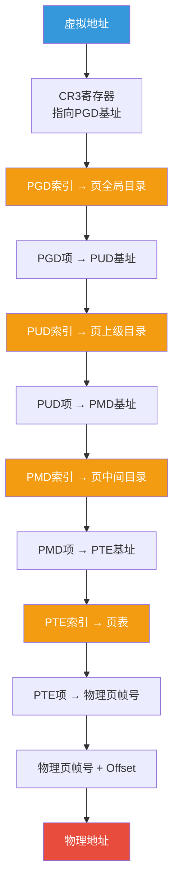

### 五级页表（Linux 4.11+）

在Linux 4.11中引入了五级页表支持，增加了一级P4D（Page 4-level Directory）：

```
5级页表地址结构：

  63  56|55    46|45    36|35    27|26    18|17     9|8      0
  ┌─────┬───────┬───────┬───────┬───────┬───────┬─────────┐
  │符号位│ PGD   │ P4D   │ PUD   │ PMD   │ PTE   │ Offset  │
  └─────┴───────┴───────┴───────┴───────┴───────┴─────────┘

  支持 2^57 = 128PB 寻址空间
```

::: info 为什么需要多级页表？
如果使用单级页表，4GB地址空间需要 100万个页表项（4GB/4KB），每项8字节，光一个进程的页表就需要8MB内存。而实际上大部分虚拟地址空间是空的，多级页表只在需要时才分配下级页表，极大地节省了内存。
:::

### PTE的标志位

每个页表项（PTE）包含物理页帧号和一组标志位：

```c
// PTE标志位（x86_64）
#define _PAGE_PRESENT    0x001   // 页在内存中
#define _PAGE_RW         0x002   // 可读可写
#define _PAGE_USER       0x004   // 用户态可访问
#define _PAGE_PWT        0x008   // 写穿透（Write-Through）
#define _PAGE_PCD        0x010   // 禁用缓存
#define _PAGE_ACCESSED   0x020   // 已访问（硬件自动设置）
#define _PAGE_DIRTY      0x040   // 已修改（写操作时设置）
#define _PAGE_PSE        0x080   // 大页（2MB/1GB）
#define _PAGE_GLOBAL     0x100   // 全局页（不随CR3切换刷新TLB）
#define _PAGE_NX         0x800   // 不可执行（No-Execute）
```

```bash
# 查看页表信息
cat /proc/<pid>/pagemap  # 需要root权限

# 使用 pagemap 工具解析
# 第0位: 页是否存在（present）
# 第1位: 是否在swap（swap）
# 第2位: 是否在文件映射（file mapped）
# 第0-54位: 物理页帧号（PFN）
# 第55位: 页是否为脏页（soft dirty）
# 第56位: 页是否独占（exclusively mapped）
# 第57-60位: 保留位
# 第61位: 页是否在swap缓存中
# 第62位: 页是否已换出
```

---

## TLB 与缺页异常

### TLB：地址翻译的加速器

每次内存访问都需要查页表，4级页表意味着4次内存读取。TLB（Translation Lookaside Buffer）是页表的硬件缓存：

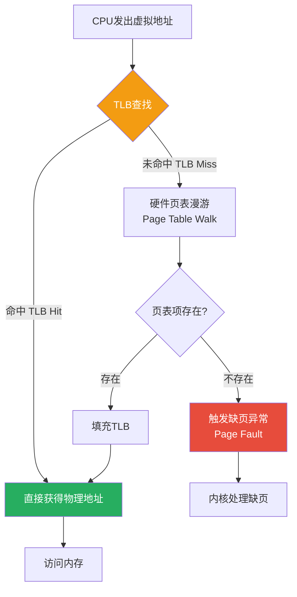

```
TLB的层次结构（以Intel为例）：

  L1 ITLB（指令TLB）: 64项，4路组相联
  L1 DTLB（数据TLB）: 64项，4路组相联
  L2 STLB（共享TLB） : 1536项，12路组相联

  TLB命中率通常 > 99%
  每次Miss大约损失 10-100 个CPU周期

  TLB覆盖范围：
    4KB页 × 1536项 = 6MB   ← 很少
    2MB大页 × 1536项 = 3GB ← 大幅增加
```

```bash
# 查看TLB信息
cpuid | grep -i tlb

# 使用 perf 统计TLB Miss
perf stat -e dTLB-load-misses,dTLB-loads,iTLB-load-misses,iTLB-loads ./my_program

# 查看大页使用
cat /proc/meminfo | grep Huge
# HugePages_Total:    1024
# HugePages_Free:      512
# HugePages_Rsvd:      256
# Hugepagesize:       2048 kB
```

### 缺页异常（Page Fault）

缺页异常不是错误，而是内核进行懒加载的机制：

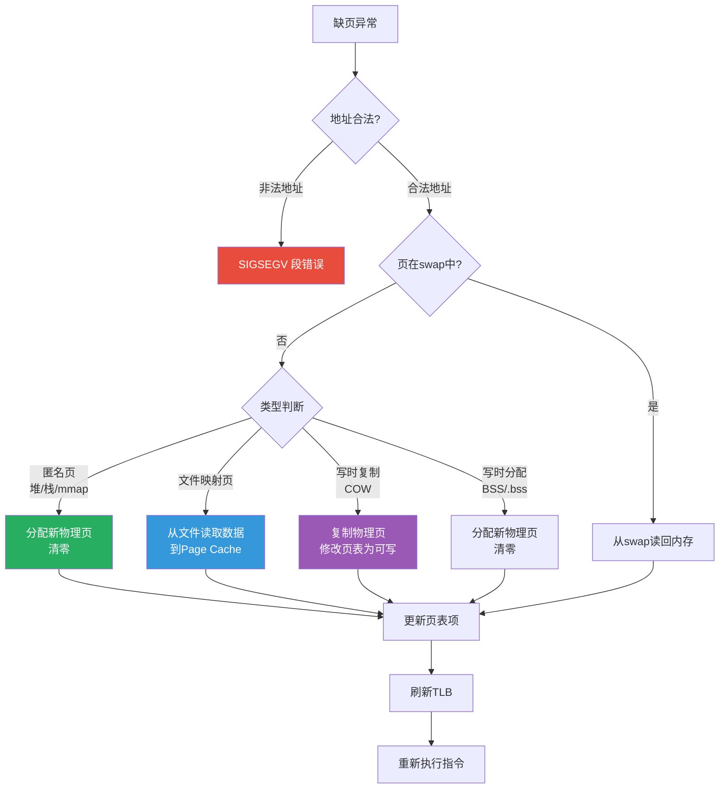

```bash
# 查看进程的缺页统计
cat /proc/<pid>/stat | awk '{print "minor faults: "$10, "major faults: "$12}'

# 使用 perf 跟踪缺页
perf record -e faults ./my_program
perf report

# 使用 systemtap 跟踪缺页详情
# probe vm.pagefault { printf("pid=%d addr=0x%x type=%s\n", pid(), address, write?"write":"read") }
```

### 写时复制（Copy-On-Write）

写时复制是fork()的核心优化——父子进程共享所有物理页，只在写入时才复制：

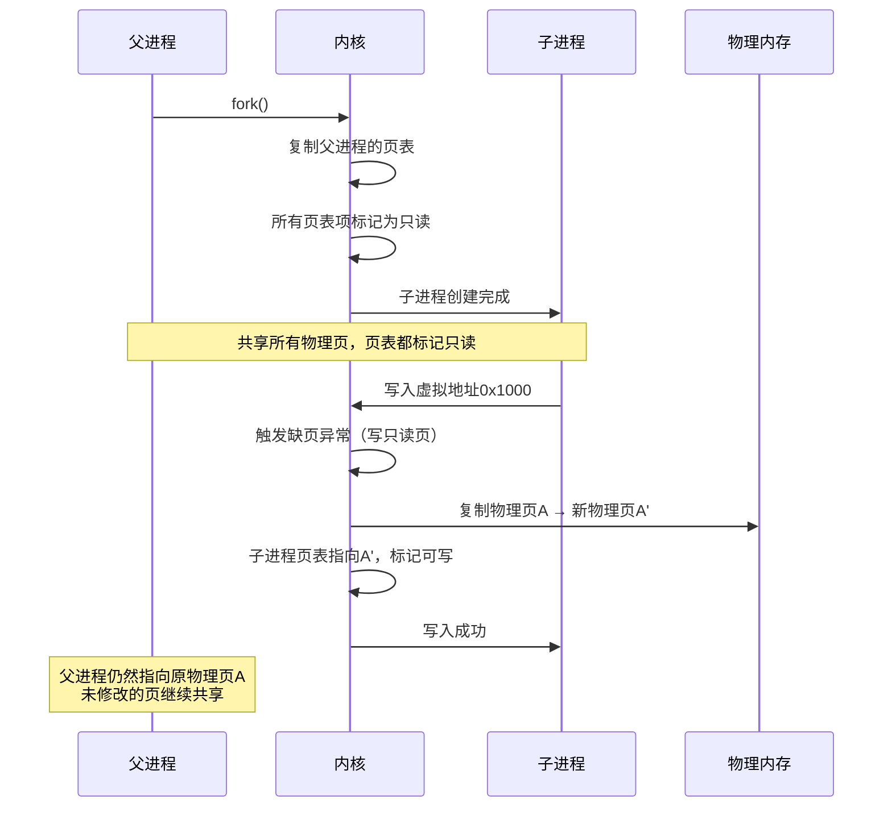

---

## 物理内存管理

### 伙伴系统（Buddy System）

伙伴系统是Linux物理页帧分配的核心算法，能快速分配和释放连续的物理页。

#### 伙伴系统原理

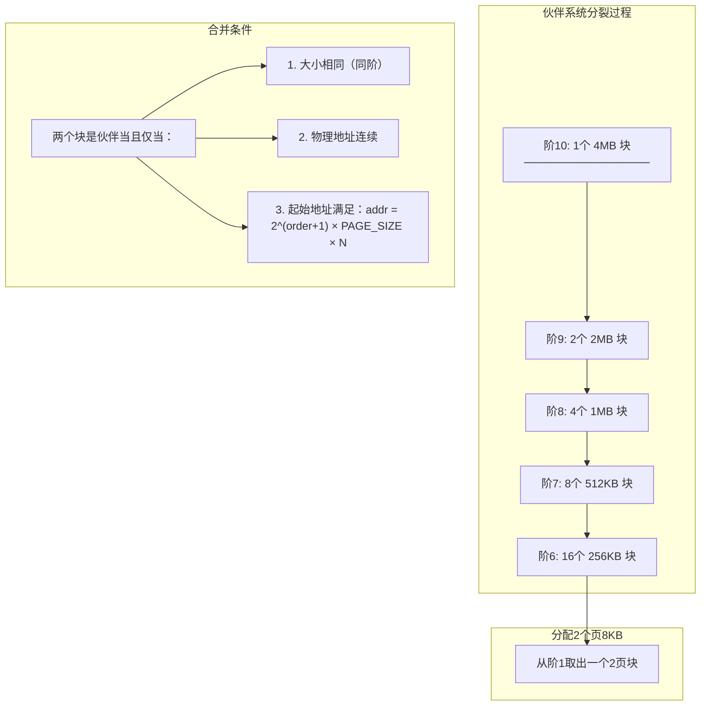

```
伙伴系统分配示例（请求3个页 = 12KB）：

  初始状态：
    阶0(4KB):  █ █ █ █ █ █ █ █ █ █ █ █ █ █ █ █
    阶1(8KB):  ██ ██ ██ ██ ██ ██ ██ ██
    阶2(16KB): ████ ████ ████ ████
    阶3(32KB): ████████ ████████

  请求3个页，向上取整到4个页 = 阶2：

  步骤1: 阶2有空闲块? 无 → 从阶3分裂
    阶3: ████████(前半) ████████(后半)→移到阶2

  步骤2: 阶2有空闲块? 有 → 取出一个4页块
    阶2: ████(取出) ████ ████
    阶1: ██ ██ ██ ██
    阶0: █ █ █ █ █ █ █ █

  步骤3: 返回4页连续块给请求者
    （浪费1个页，内部碎片）

  释放时检查伙伴是否空闲：
    如果伙伴也空闲 → 合并为更高阶块
    递归检查直到无法合并
```

::: tip 伙伴系统的优势
- **快速分配**：O(log N)时间复杂度
- **快速合并**：释放时O(log N)检查伙伴并合并
- **避免外部碎片**：通过合并保持大块连续内存
- **简单高效**：每种阶维护一个空闲链表

**劣势**：只能分配2的幂次个页，存在内部碎片
:::

```bash
# 查看伙伴系统状态
cat /proc/buddyinfo

# 输出格式：每列表示该阶的空闲块数
# Node 0, zone      DMA      1    2    3    2    1    1    1    0    1    1    3
# Node 0, zone   Normal    127  186  152   83   42   19    8    4    2    1    1
# Node 0, zone  HighMem      0    0    0    0    0    0    0    0    0    0    0

# 阶0=4KB  阶1=8KB  阶2=16KB  ...  阶10=4MB
# 例如Normal区有127个4KB块，186个8KB块...

# 查看内存碎片化程度
cat /proc/pagetypeinfo
cat /proc/zoneinfo
```

### 页帧分配API

```c
// 内核中分配页帧的函数

// 分配 2^order 个连续页
struct page *alloc_pages(gfp_t gfp_mask, unsigned int order);

// 分配页并返回虚拟地址
void *__get_free_pages(gfp_t gfp_mask, unsigned int order);

// 只分配一页
struct page *alloc_page(gfp_t gfp_mask);
void *__get_free_page(gfp_t gfp_mask);

// 释放页
void __free_pages(struct page *page, unsigned int order);
void free_pages(unsigned long addr, unsigned int order);

// GFP掩码（Get Free Page）常用标志
#define GFP_KERNEL      0xCC2800  // 内核普通分配，可能睡眠
#define GFP_ATOMIC      0x42800   // 原子分配，不睡眠（中断上下文）
#define GFP_DMA         0x1000    // DMA可访问的低地址内存
#define GFP_HIGHUSER    0x80280D  // 高端用户空间内存
#define GFP_NOWAIT      0x20800   // 不睡眠，不触发回收
```

### per-CPU 页帧缓存

为了减少伙伴系统的锁争用，每个CPU维护自己的页帧缓存：

```c
// per-CPU页帧缓存
struct per_cpu_pages {
    int count;          // 缓存中的页数
    int high;           // 高水位线（超过则归还伙伴系统）
    int batch;          // 一次批量获取/释放的页数
    struct list_head lists[MIGRATE_PCPTYPES]; // 按迁移类型分链表
};
```

```
per-CPU 缓存工作流程：

  分配一页：
    CPU缓存有页? → 直接取出（无锁！）
    CPU缓存为空? → 从伙伴系统批量获取batch个页

  释放一页：
    CPU缓存未满? → 放入CPU缓存（无锁！）
    CPU缓存已满? → 批量归还batch个页给伙伴系统

  极大减少了伙伴系统全局锁的争用
```

---

## SLAB/SLUB/SLOB 分配器

伙伴系统只能分配完整的页帧，但内核大量需要小对象（几十字节到几KB）。SLAB分配器在伙伴系统之上提供了小对象的高效分配。

### SLAB分配器原理

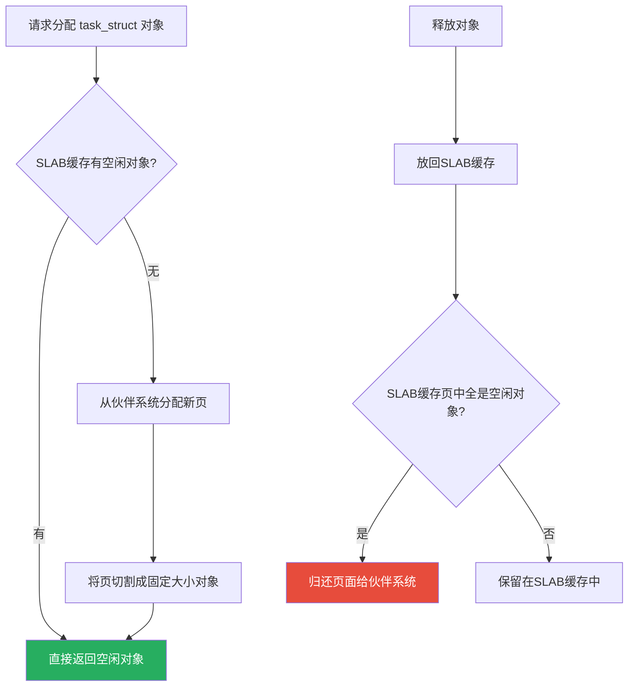

```
SLAB分配器的层次结构：

  ┌──────────────────────────────────────────────────┐
  │                  SLAB 分配器                      │
  ├──────────────────────────────────────────────────┤
  │  专用缓存（每个内核对象一种）                       │
  │  ┌─────────┐ ┌──────────┐ ┌────────────┐        │
  │  │task_struct│ │ dentry   │ │ inode      │  ...   │
  │  │ 1.7KB    │ │ 192B     │ │ 608B       │        │
  │  └─────────┘ └──────────┘ └────────────┘        │
  ├──────────────────────────────────────────────────┤
  │  通用缓存（按大小分级）                            │
  │  ┌────┐ ┌─────┐ ┌──────┐ ┌───────┐              │
  │  │32B │ │64B  │ │128B  │ │256B   │  ...         │
  │  └────┘ └─────┘ └──────┘ └───────┘              │
  ├──────────────────────────────────────────────────┤
  │              伙伴系统（页面分配）                    │
  │  ┌───┐ ┌────┐ ┌─────┐ ┌──────┐ ┌───────┐       │
  │  │4KB│ │8KB │ │16KB │ │32KB  │ │64KB   │       │
  │  └───┘ └────┘ └─────┘ └──────┘ └───────┘       │
  └──────────────────────────────────────────────────┘
```

### SLAB vs SLUB vs SLOB

| 特性 | SLAB | SLUB | SLOB |
|------|------|------|------|
| 设计目标 | 通用 | 高性能（默认） | 嵌入式/小内存 |
| 复杂度 | 高 | 中 | 低 |
| 对象元数据 | 每SLAB有管理结构 | 内嵌在页面结构 | 简单链表 |
| 调试支持 | 一般 | 强大（poison/redzone） | 有限 |
| 碎片处理 | 较好 | 好 | 一般 |
| NUMA感知 | 是 | 是 | 否 |
| 适用场景 | 早期默认 | 服务器/桌面 | 嵌入式 |

::: info 为什么SLUB成为默认？
SLUB在设计上简化了SLAB的复杂管理结构，将对象元数据嵌入到 `struct page` 中，减少了元数据开销。同时提供了更好的调试功能（通过poison填充和redzone检测越界访问），且在多核系统上锁争用更少。从Linux 2.6.22开始成为默认分配器。
:::

### SLUB的内部结构

```
SLUB 每个 slab 页的布局：

  ┌────────────────────────────────────────────────┐
  │  Page Header (struct page 中的slab相关字段)      │
  │  - slab_cache: 指向所属kmem_cache               │
  │  - freelist:   指向第一个空闲对象                 │
  │  - inuse:      已使用对象数                       │
  │  - objects:    总对象数                           │
  ├────────────────────────────────────────────────┤
  │  Object 0  [in-use] ────────────────┐           │
  ├──────────────────────────────────────┤           │
  │  Object 1  [free] → Object 3 ───────┤── 空闲链表│
  ├──────────────────────────────────────┤           │
  │  Object 2  [in-use] ────────────────┤           │
  ├──────────────────────────────────────┤           │
  │  Object 3  [free] → Object 5 ───────┤           │
  ├──────────────────────────────────────┤           │
  │  Object 4  [in-use] ────────────────┤           │
  ├──────────────────────────────────────┤           │
  │  Object 5  [free] → NULL            ┤           │
  ├──────────────────────────────────────┤           │
  │  [Debug: Red Zone / Padding]         │           │
  └────────────────────────────────────────────────┘

  空闲对象的前8字节存放下一个空闲对象的指针
  分配时从freelist取出，释放时插入freelist头部
```

```bash
# 查看SLUB缓存信息
cat /proc/slabinfo

# 更友好的格式
slabtop

# 查看特定缓存
cat /proc/slabinfo | grep task_struct
# task_struct       1024    1088   1728    4    2 : tunables  0    0    0 : slabdata  272    272      0

# 查看SLUB调试参数
cat /sys/kernel/slab/task_struct/objects
cat /sys/kernel/slab/task_struct/order     # 每个slab占2^order页
cat /sys/kernel/slab/task_struct/objsize   # 对象大小
cat /sys/kernel/slab/task_struct/objs_per_slab
```

---

## kmalloc 与 vmalloc

### kmalloc：物理连续分配

```c
// kmalloc 分配物理连续的内存
void *kmalloc(size_t size, gfp_t flags);
void kfree(const void *ptr);

// 示例
struct my_device *dev = kmalloc(sizeof(*dev), GFP_KERNEL);
if (!dev)
    return -ENOMEM;
// 使用 dev ...
kfree(dev);
```

```
kmalloc 的特点：

  ✅ 物理地址连续 → 适合DMA
  ✅ 虚拟地址连续 → 适合内核访问
  ✅ 分配速度快 → 基于SLUB
  ❌ 大块分配困难 → 受外部碎片影响
  ❌ 大小有限 → 通常不超过几MB

  kmalloc 大小选择（基于SLUB通用缓存）：
    32, 64, 96, 128, 192, 256, 512, 1K, 2K, 4K, 8K...
    实际分配可能向上取整到最近的缓存大小
```

### vmalloc：虚拟连续分配

```c
// vmalloc 分配虚拟连续、物理不连续的内存
void *vmalloc(unsigned long size);
void vfree(const void *ptr);

// 示例
void *buf = vmalloc(1024 * 1024);  // 分配1MB
if (!buf)
    return -ENOMEM;
// 使用 buf ...
vfree(buf);
```

```
vmalloc 的特点：

  ✅ 可分配大块内存 → 不受物理连续限制
  ✅ 按需映射页表 → 不浪费物理内存
  ❌ 物理地址不连续 → 不能用于DMA
  ❌ 需要建立页表映射 → 分配速度慢
  ❌ 访问需要TLB → 性能略差
  ❌ 地址空间有限 → vmalloc区有限

  vmalloc 地址空间：
    x86_64: VMALLOC_START ~ VMALLOC_END (约128TB)
    x86_32: 有限，通常只有几百MB
```

### kmalloc vs vmalloc 对比


::: warning 何时用kmalloc？何时用vmalloc？
- **kmalloc**：小对象（< 页大小）、需要DMA、性能敏感路径
- **vmalloc**：大块内存（> 几十KB）、不需要物理连续、如模块加载、大缓冲区
- **经验法则**：能kmalloc就kmalloc，只有kmalloc搞不定时才vmalloc
:::

---

## 页缓存（Page Cache）

### Page Cache 的作用

Page Cache是内核在内存中缓存磁盘数据的机制，是I/O性能的关键：

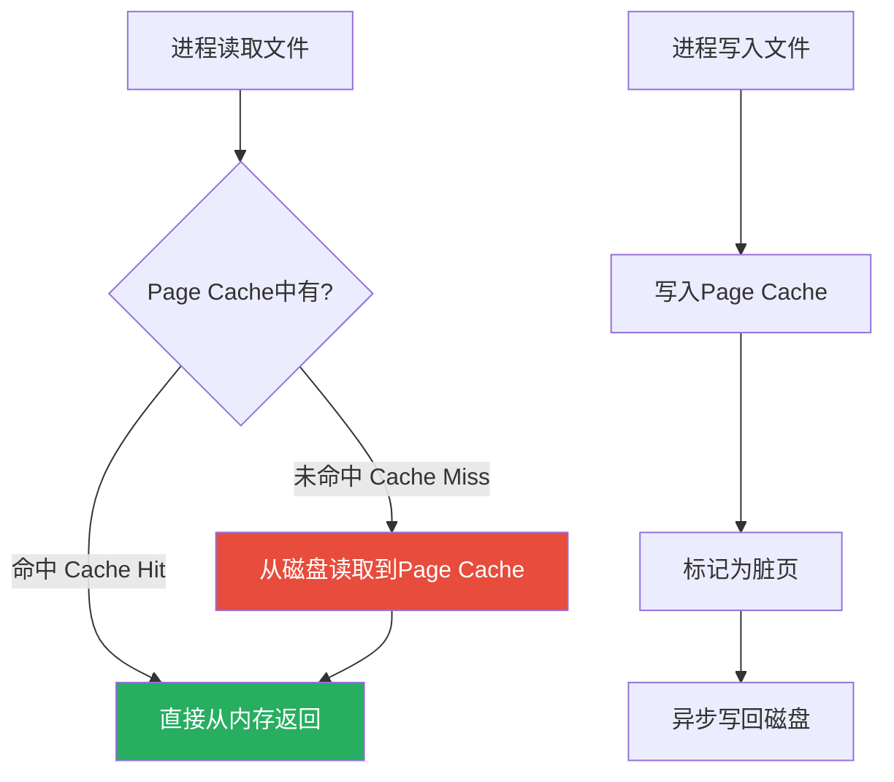

### Page Cache 数据结构

```c
// Page Cache 的核心结构
struct address_space {
    struct inode *host;              // 关联的inode
    struct radix_tree_root i_pages;  // 基数树（索引页缓存）
    unsigned long nrpages;           // 缓存页总数
    unsigned long nrexceptional;     // DAX/阴影节点
    const struct address_space_operations *a_ops; // 操作函数集
    spinlock_t private_lock;         // 私有锁
    struct list_head private_list;   // 私有链表
    // ...
};

// 基数树用于快速查找：文件偏移 → 物理页
// 修改：Linux 5.x 后改用 xarray
```

```
Page Cache 查找过程：

  文件偏移 offset → 页索引 index = offset / PAGE_SIZE

  xarray 查找：
    index=5 → 直接在xarray中查找第5项
    时间复杂度：O(1) ~ O(log n)

  每个 inode 对应一个 address_space
  每个 address_space 维护一棵 xarray
  xarray 的每个叶节点指向一个 struct page
```

```bash
# 查看Page Cache使用情况
free -h
#               total        used        free      shared  buff/cache   available
# Mem:           31Gi       8.0Gi        12Gi       256Mi        11Gi        22Gi
#                                            ↑ buff/cache 包含Page Cache

# 更详细的缓存信息
cat /proc/meminfo | grep -E "Cached|Buffers|Dirty|Writeback"
# Cached:          8192000 kB   ← Page Cache
# Buffers:          512000 kB   ← 块设备缓冲
# Dirty:             32768 kB   ← 脏页（待写回）
# Writeback:          4096 kB   ← 正在写回

# 查看某个文件的缓存情况
# 需要安装 vmtouch
vmtouch /path/to/file

# 手动清理Page Cache（慎用！）
echo 1 > /proc/sys/vm/drop_caches    # 清理页缓存
echo 2 > /proc/sys/vm/drop_caches    # 清理dentry/inode缓存
echo 3 > /proc/sys/vm/drop_caches    # 清理所有缓存
```

---

## Swap 与 kswapd

### Swap机制

当物理内存不足时，内核将不活跃的匿名页（堆、栈等）写入swap分区，腾出物理内存：

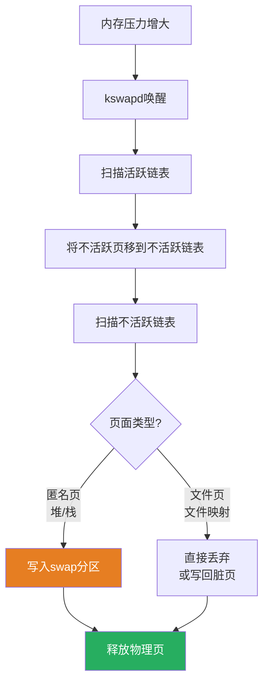

### kswapd 守护进程

kswapd是每个NUMA节点的后台内存回收线程：

```c
// kswapd 的水位线
struct zone {
    unsigned long watermark[3];
    // WMARK_MIN:  最低水位线 → 紧急回收
    // WMARK_LOW:  低水位线  → kswapd唤醒
    // WMARK_HIGH: 高水位线 → kswapd停止回收
};
```

```
内存回收水位线机制：

                    WMARK_HIGH
                       │
    ┌──────────────────┤
    │    安全区         │ kswapd 睡眠
    │                  │
    │                  │
    ├──────────────────┤ WMARK_LOW
    │                  │
    │  唤醒kswapd      │ kswapd 被唤醒开始回收
    │                  │
    ├──────────────────┤ WMARK_MIN
    │                  │
    │  紧急回收区       │ 直接同步回收（分配路径上）
    │                  │
    └──────────────────┘

  min_free_kbytes 决定了 WMARK_MIN 的值
  low = min * 1.25
  high = min * 1.5
```

```bash
# 查看swap使用情况
swapon --show
cat /proc/swaps
cat /proc/meminfo | grep Swap

# 查看每个zone的水位线
cat /proc/zoneinfo | grep -E "Node|zone|watermark"

# 调整min_free_kbytes
cat /proc/sys/vm/min_free_kbytes
echo 65536 > /proc/sys/vm/min_free_kbytes  # 建议总内存的0.1%-1%

# swap相关参数
cat /proc/sys/vm/swappiness    # swap倾向 0-100，默认60
# 0: 尽量不用swap
# 100: 积极使用swap

# 查看进程的swap使用
cat /proc/<pid>/status | grep VmSwap
```

### Swap的利与弊

::: warning Swap的双刃剑
**优点**：
- 允许运行超过物理内存的工作负载
- 为缓存腾出更多内存
- 防止OOM Kill

**缺点**：
- 磁盘I/O延迟是内存的1000-100000倍
- 可能导致严重的性能下降（swap thrashing）
- SSD上频繁swap会加速磨损

**最佳实践**：
- 数据库服务器：swappiness=1或0
- 桌面系统：swappiness=60（默认）
- 容器环境：通常禁用swap
- 始终配置swap作为安全网，哪怕不常用
:::

---

## OOM Killer

当所有回收手段都无法释放足够内存时，OOM Killer作为最后防线，选择一个进程杀死以释放内存。

### OOM Killer选择逻辑

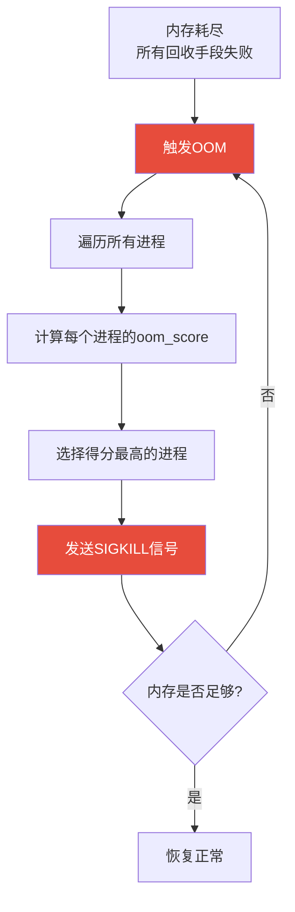

### oom_score 计算因素

```
oom_score 计算考虑的因素：

  1. 内存使用量（最主要因素）
     - RSS（驻留集大小）
     - 页表占用
     - swap使用量

  2. 进程特性
     - 子进程数量（fork炸弹惩罚）
     - 运行时间（短进程优先杀）
     - nice值（低优先级进程优先杀）

  3. 保护机制
     - oom_score_adj: -1000 到 +1000
     - -1000 表示完全禁止OOM Kill
     - +1000 表示优先被杀

  4. 特殊保护
     - init进程(pid=1)永不杀
     - 内核线程不杀
```

```bash
# 查看进程的oom_score
cat /proc/<pid>/oom_score

# 调整oom_score_adj保护重要进程
echo -1000 > /proc/<pid>/oom_score_adj  # 永不杀死
echo    0 > /proc/<pid>/oom_score_adj   # 默认
echo  500 > /proc/<pid>/oom_score_adj   # 容易被杀
echo 1000 > /proc/<pid>/oom_score_adj   # 优先杀死

# 查看当前oom_score_adj
cat /proc/<pid>/oom_score_adj

# 禁用OOM Killer（不推荐）
echo 0 > /proc/sys/vm/oom_kill_allocating_task

# OOM后是否触发panic
cat /proc/sys/vm/oom_dump_tasks    # OOM时dump所有进程信息
cat /proc/sys/vm/panic_on_oom      # OOM时是否panic

# 手动触发OOM（测试用）
echo 1 > /proc/sys/vm/compact_memory  # 先尝试内存规整
```

### OOM日志分析

```
# dmesg 中的OOM信息示例

myapp invoked oom-killer: gfp_mask=0x14000c0(GFP_KERNEL), order=0, oom_score_adj=0
Out of memory: Kill process 12345 (myapp) score 900 or sacrifice child
Killed process 12345 (myapp) total-vm:2048000kB, anon-rss:1536000kB, file-rss:0kB, shmem-rss:0kB

# 关键信息：
# - 触发OOM的进程
# - 被杀的进程和PID
# - oom_score
# - 内存使用详情
```

---

## 内存 cgroup

内存cgroup限制和监控进程组的内存使用：

```bash
# 创建内存cgroup
mkdir /sys/fs/cgroup/myapp

# 设置内存限制（最大1GB）
echo 1073741824 > /sys/fs/cgroup/myapp/memory.max

# 设置swap限制
echo 1073741824 > /sys/fs/cgroup/myapp/memory.swap.max

# 将进程加入cgroup
echo $$ > /sys/fs/cgroup/myapp/cgroup.procs

# 查看内存使用
cat /sys/fs/cgroup/myapp/memory.current
cat /sys/fs/cgroup/myapp/memory.stat

# 查看OOM事件
cat /sys/fs/cgroup/myapp/memory.events
# low 0
# high 0
# max 5       ← 触发5次OOM
# oom_kill 3  ← 杀死了3个进程
```

### 内存cgroup的回收机制


```
memory.current    → 当前内存使用量
memory.high       → 软限制（超过则限流回收）
memory.max        → 硬限制（超过则OOM或拒绝分配）
memory.swap.current → swap使用量
memory.swap.max   → swap限制
memory.min        → 最低保障（不被回收）
memory.low        → 低水位线（尽量不回收）

优先级：min > low > current > high > max
```

---

## 透明大页（THP）

### 大页的优势

标准4KB页导致大量TLB Miss，大页减少TLB条目数，提高性能：

```
4KB 页 vs 2MB 大页 vs 1GB 巨页：

  映射 1GB 内存需要的TLB条目：
    4KB页: 1GB / 4KB = 262144 个TLB条目 → 远超TLB容量
    2MB页: 1GB / 2MB = 512 个TLB条目    → 可以全部缓存
    1GB页: 1GB / 1GB = 1 个TLB条目      → 极致

  TLB Miss率对比（数据库工作负载）：
    4KB页: ~5% TLB Miss → 大量页表查询
    2MB页: ~0.1% TLB Miss → 极少页表查询
```

### 透明大页（THP）机制

THP让普通程序无需修改即可使用大页，内核自动将连续的4KB页合并为2MB大页：

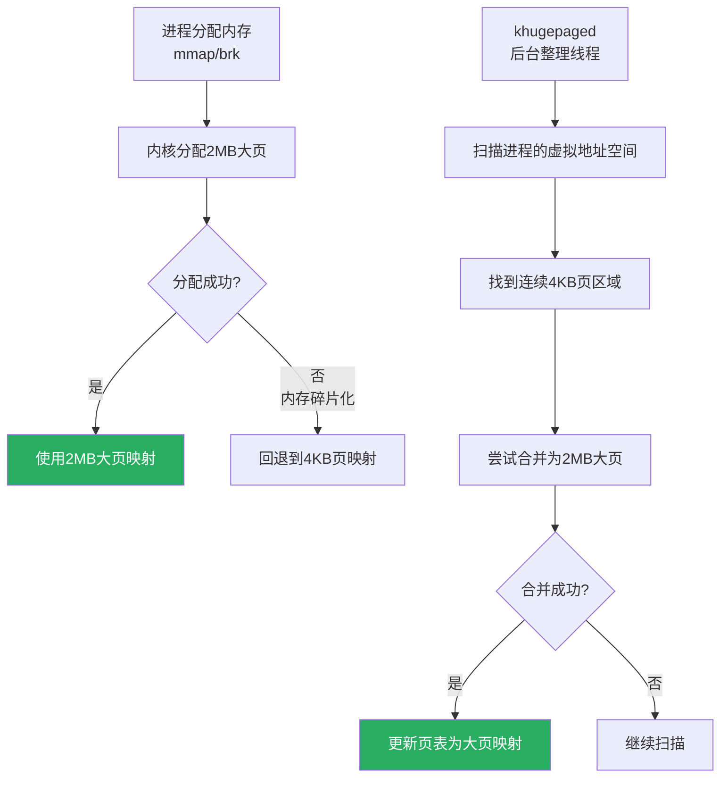

```bash
# 查看THP状态
cat /sys/kernel/mm/transparent_hugepage/enabled
# always [madvise] never

# 启用THP
echo always > /sys/kernel/mm/transparent_hugepage/enabled

# 仅对madvise区域启用
echo madvise > /sys/kernel/mm/transparent_hugepage/enabled

# 禁用THP
echo never > /sys/kernel/mm/transparent_hugepage/enabled

# 查看THP统计
cat /sys/kernel/mm/transparent_hugepage/stats
# anon_hugepages  102400 kB  ← 使用大页的匿名内存
# ...

# 在代码中使用madvise请求大页
```

```c
#define _GNU_SOURCE
#include <sys/mman.h>

void *buf = mmap(NULL, 2 * 1024 * 1024,  // 2MB对齐
                 PROT_READ | PROT_WRITE,
                 MAP_PRIVATE | MAP_ANONYMOUS, -1, 0);

// 请求使用大页
madvise(buf, 2 * 1024 * 1024, MADV_HUGEPAGE);
```

### 预分配大页（HugeTLB）

对于需要确定性性能的场景，可以预分配大页：

```bash
# 分配100个2MB大页
echo 100 > /proc/sys/vm/nr_hugepages

# 分配10个1GB巨页
echo 10 > /proc/sys/vm/nr_hugepages-1048576

# 查看大页状态
cat /proc/meminfo | grep Huge
# HugePages_Total:    100
# HugePages_Free:      50
# HugePages_Rsvd:      20
# Hugepagesize:       2048 kB

# 挂载hugetlbfs
mount -t hugetlbfs nodev /mnt/hugepages

# 使用libhugetlbfs链接程序
# LD_PRELOAD=libhugetlbfs.so HUGETLB_MORECORE=yes ./my_program
```

::: warning THP的坑
THP虽然提供性能优势，但也有潜在问题：
1. **内存浪费**：内部碎片（只需1字节也要占2MB）
2. **延迟尖刺**：khugepaged整理时可能导致短暂停顿
3. **COW放大**：fork后写时复制需要复制整个2MB页
4. **与某些应用不兼容**：如Redis、数据库建议关闭THP
5. **NUMA问题**：跨节点的大页性能更差

**建议**：
- 数据库（MySQL/PostgreSQL）：关闭THP或使用madvise
- Redis：关闭THP
- 虚拟化/KVM：开启THP或使用HugeTLB
- Java应用：通常开启THP有帮助
:::

---

## 内存管理实战调优

### 场景1：数据库服务器优化

```bash
# 1. 减少swap倾向
echo 1 > /proc/sys/vm/swappiness

# 2. 调整脏页比例
echo 10 > /proc/sys/vm/dirty_ratio           # 脏页占总内存10%时同步写
echo 5 > /proc/sys/vm/dirty_background_ratio  # 脏页占5%时开始异步写

# 3. 关闭THP
echo never > /sys/kernel/mm/transparent_hugepage/enabled

# 4. 增大min_free_kbytes
echo 1048576 > /proc/sys/vm/min_free_kbytes  # 1GB

# 5. 使用HugeTLB
echo 1024 > /proc/sys/vm/nr_hugepages

# 6. 调整vfs_cache_pressure
echo 50 > /proc/sys/vm/vfs_cache_pressure  # 减少dentry/inode缓存回收压力
```

### 场景2：内存泄漏排查

```bash
# 1. 监控内存增长
while true; do
    echo "$(date): $(cat /proc/<pid>/status | grep VmRSS)"
    sleep 60
done

# 2. 使用smem分析
smem -t -k -p | head -20

# 3. 使用valgrind检测泄漏
valgrind --leak-check=full --show-leak-kinds=all ./my_program

# 4. 使用eBPF跟踪内存分配
# bpftrace -e 'uprobe:/path/to/binary:malloc { @size[arg0] = count(); }'

# 5. 使用memleak（bcc工具）
# memleak -p <pid>

# 6. 分析/proc/smaps
cat /proc/<pid>/smaps | grep -E "^[0-9a-f]|^Size|^Rss|^Pss"
```

### 场景3：容器内存限制

```bash
# 设置容器内存限制
docker run -m 512m --memory-swap 1g my-image

# Kubernetes资源限制
# resources:
#   limits:
#     memory: "512Mi"
#   requests:
#     memory: "256Mi"

# 查看容器内存使用
cat /sys/fs/cgroup/docker/<container_id>/memory.current
cat /sys/fs/cgroup/docker/<container_id>/memory.max
cat /sys/fs/cgroup/docker/<container_id>/memory.events

# 压力测试
stress-ng --vm 4 --vm-bytes 80% -t 60s
```

---

## 内存碎片化

### 碎片类型

```
外部碎片：物理内存有大量空闲页，但无法组成连续的大块

  物理内存视图：
  ┌──┬──────┬──┬──────┬──┬─────┬──┬──────┐
  │4K│ 空闲 │4K│ 空闲 │4K│空闲 │4K│ 空闲 │
  │  │ 8页  │  │ 8页  │  │4页  │  │ 8页  │
  └──┴──────┴──┴──────┴──┴─────┴──┴──────┘
  总空闲: 28页，但最大连续块只有8页
  请求16页 → 失败！

内部碎片：分配的内存大于实际需要

  请求3页，分配4页（伙伴系统2的幂）→ 浪费1页
  请求100字节，分配128字节（SLUB）→ 浪费28字节
```

### 内存规整（Compaction）

```mermaid
flowchart LR
    subgraph 规整前
        A1["█ █ ░ ░ █ ░ █ ░ ░ █ ░ █ ░ ░ █ █"]
    end

    subgraph 规整后
        B1["█ █ █ █ █ █ █ ░ ░ ░ ░ ░ ░ ░ ░ ░"]
    end

    A1 --> |迁移可移动页| B1

    style A1 fill:#e74c3c,color:#fff
    style B1 fill:#27ae60,color:#fff

    legend: █=已用 ░=空闲
```

```bash
# 查看碎片化程度
cat /proc/buddyinfo
cat /proc/pagetypeinfo

# 手动触发规整
echo 1 > /proc/sys/vm/compact_memory

# 查看规整统计
cat /proc/vmstat | grep compact
# compact_migrate_scanned 123456
# compact_free_scanned    234567
# compact_isolated         34567
# compact_migrated         23456
# compact_stall              100  ← 规整请求次数
# compact_fail                10  ← 规整失败次数
# compact_success             90  ← 规整成功次数
```

---

## 内核源码导读

### 关键源码路径

```
mm/
├── main.c              # 内存管理初始化
├── page_alloc.c        # 伙伴系统：页帧分配与释放
├── slab.h              # SLUB分配器头文件
├── slub.c              # SLUB分配器实现
├── slob.c              # SLOB分配器实现
├── kmalloc.c           # kmalloc实现
├── vmalloc.c           # vmalloc实现
├── mmap.c              # mmap系统调用
├── page_io.c           # swap页I/O
├── swap.c              # swap管理
├── vmscan.c            # kswapd和页面回收
├── oom_kill.c          # OOM Killer
├── memory.c            # 缺页异常处理
├── page-writeback.c    # 脏页回写
├── filemap.c           # Page Cache管理
├── compaction.c        # 内存规整
├── huge_memory.c       # 透明大页
├── hugetlb.c           # HugeTLB大页
├── memcontrol.c        # 内存cgroup
├── percpu.c            # per-CPU内存
├── mmap.c              # 内存映射
├── mprotect.c          # 内存保护
└── mremap.c            # 内存重映射

include/linux/
├── mm.h                # 内存管理核心声明
├── gfp.h               # GFP标志定义
├── slab.h              # SLAB分配器接口
├── vmalloc.h           # vmalloc接口
├── page-flags.h        # 页面标志位
├── mm_types.h          # mm_struct等类型定义
└── swap.h              # swap相关声明

arch/x86/mm/
├── pageattr.c          # 页表属性操作
├── init.c              # 内存管理初始化
├── fault.c             # 缺页异常处理
└── tlb.c               # TLB操作
```

### 缺页异常处理流程

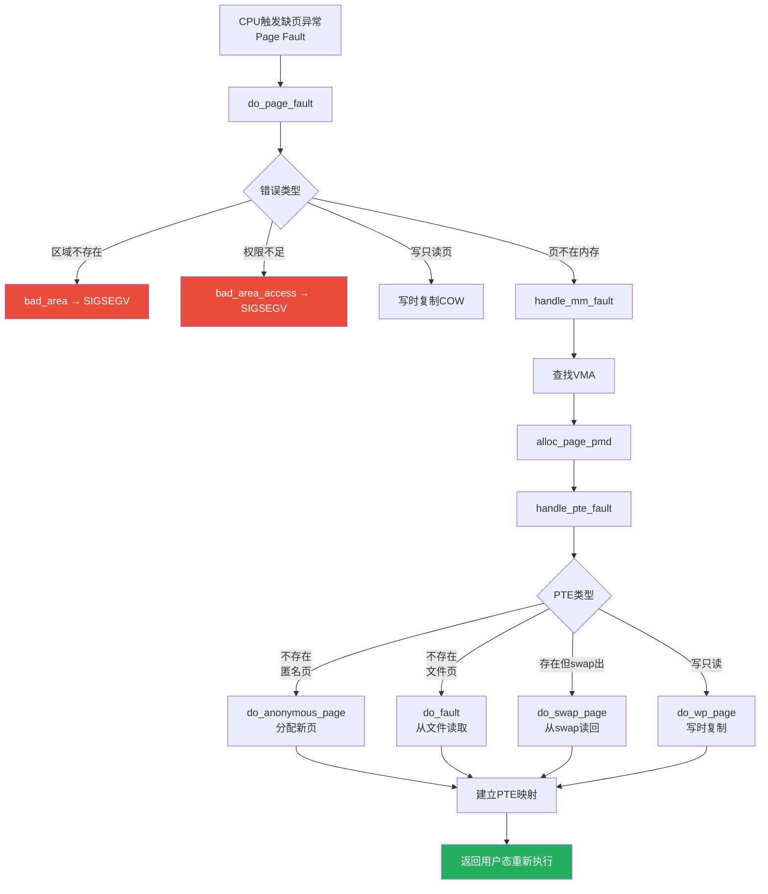

---

## 总结

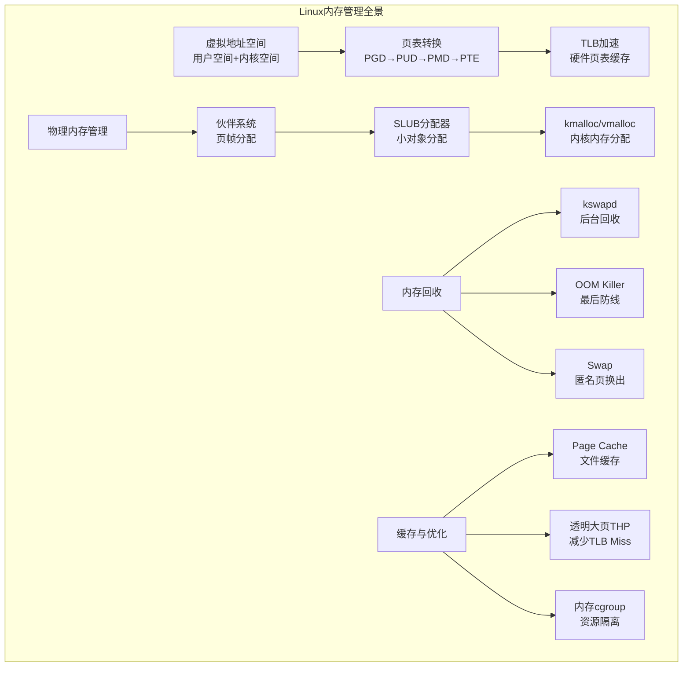

::: important 内存管理设计哲学
1. **懒分配**：只有真正访问时才分配物理页（缺页异常）
2. **多级缓存**：TLB → Page Cache → 伙伴系统 → SLUB → swap
3. **写时复制**：fork不复制物理页，写时才复制
4. **层次化管理**：页表多级、分配器多层、回收策略多样
5. **预测与预取**：预读文件、预分配页表、per-CPU缓存
6. **安全网设计**：OOM Killer、swap、min_free_kbytes
:::

---

## 参考资料

- **《深入理解Linux内核》**（Understanding the Linux Kernel）- Daniel P. Bovet, Marco Cesati
- **《Linux内核设计与实现》**（Linux Kernel Development）- Robert Love
- **《深入理解Linux虚拟内存管理》**（Understanding the Linux Virtual Memory Manager）- Mel Gorman
- **Linux内核源码**：`mm/` 目录
- [Linux内存管理文档](https://www.kernel.org/doc/html/latest/admin-guide/mm/index.html)
- [SLUB分配器文档](https://www.kernel.org/doc/html/latest/core-api/mm-api.html)
- [cgroup v2内存控制器](https://www.kernel.org/doc/html/latest/admin-guide/cgroup-v2.html#memory)
