# 文件系统原理

文件系统是操作系统中最核心的抽象之一——它让杂乱无章的磁盘扇区变成我们熟悉的文件和目录树。但文件系统的设计远不止"存储数据"那么简单：VFS 如何统一数十种文件系统的接口？ext4 的 extent 树如何加速大文件访问？Page Cache 怎样让磁盘 IO 变得"透明"？io_uring 又如何打破传统 IO 模型的性能天花板？本文从 VFS 架构出发，逐层深入 ext4/XFS 实现、页缓存机制和 IO 路径，帮你建立对 Linux 文件系统的深层理解。

## 1. VFS 虚拟文件系统

### 1.1 VFS 的设计目标

Linux 支持数十种文件系统——ext4、XFS、Btrfs、tmpfs、procfs、sysfs、NFS、CIFS……如果每个文件系统都实现一套独立的系统调用接口，内核将无法维护。VFS（Virtual File System）正是为了解决这个问题而生的抽象层：

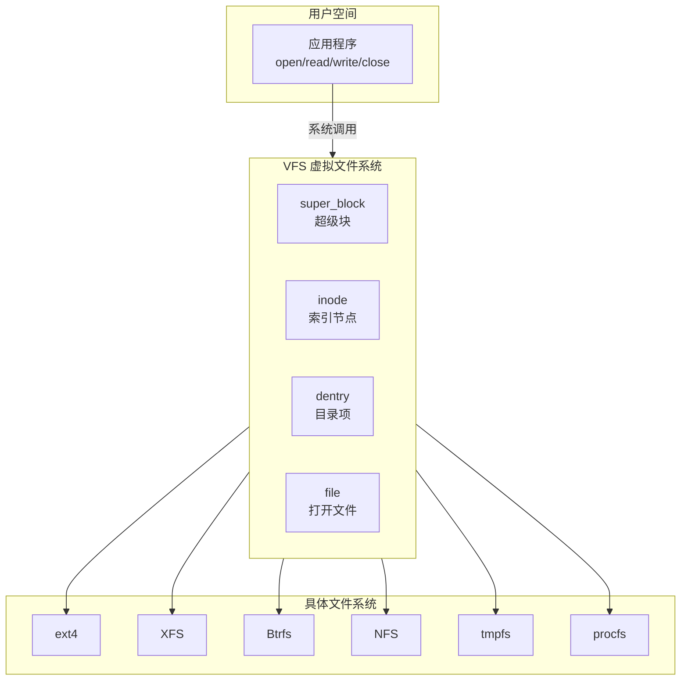

::: important VFS 的核心价值
- **统一接口**：应用程序无需关心底层文件系统类型
- **文件系统无关性**：`cp` 命令可以从 ext4 复制到 NFS，无需修改
- **可扩展**：新增文件系统只需实现 VFS 规定的接口
- **缓存共享**：Page Cache 和 dentry cache 被所有文件系统共享
:::

### 1.2 VFS 四大对象

VFS 通过四个核心对象描述打开的文件：

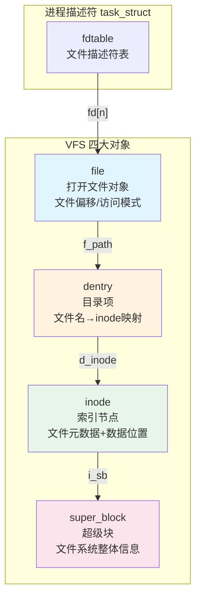

**四大对象详解：**

#### super_block（超级块）

超级块描述整个文件系统的元信息：

```c
// 内核结构体简化
struct super_block {
    dev_t s_dev;                    // 设备号
    unsigned long s_blocksize;      // 块大小（通常 4KB）
    unsigned long long s_maxbytes;  // 最大文件大小
    struct file_system_type *s_type; // 文件系统类型
    const struct super_operations *s_op; // 操作函数表
    struct dentry *s_root;          // 根目录 dentry
    // ... 缓存、锁、统计等
};
```

| 字段 | 说明 |
|------|------|
| `s_blocksize` | 文件系统块大小，通常 4096 |
| `s_maxbytes` | 最大文件大小（ext4 可达 16TB） |
| `s_op` | 操作函数表（alloc_inode, destroy_inode, write_inode...） |

#### inode（索引节点）

inode 描述一个文件的所有元数据和数据块位置——**文件的数据和元数据在 inode 中统一管理**：

```c
struct inode {
    umode_t i_mode;          // 文件类型和权限
    uid_t i_uid;             // 所有者 UID
    gid_t i_gid;             // 所属组 GID
    loff_t i_size;           // 文件大小（字节）
    struct timespec i_atime; // 最后访问时间
    struct timespec i_mtime; // 最后修改时间
    struct timespec i_ctime; // 最后状态变更时间
    unsigned long i_blocks;  // 占用块数
    const struct inode_operations *i_op;  // inode 操作
    const struct file_operations *i_fop;  // 文件操作
    struct address_space *i_mapping;      // 页缓存映射
    // ... 更多字段
};
```

::: tip inode 号是文件的唯一标识
每个文件在同一个文件系统内有唯一的 inode 号。`ls -i` 可以查看：

```bash
ls -i /etc/passwd
# 131074 /etc/passwd

stat /etc/passwd
#   File: /etc/passwd
#   Size: 2765            Blocks: 8          IO Block: 4096   regular file
# Inode: 131074           Links: 1
```

硬链接是同一个 inode 号的多个 dentry，软链接是独立的 inode 指向目标路径。
:::

#### dentry（目录项）

dentry 是文件名到 inode 的映射缓存，加速路径查找：

```c
struct dentry {
    struct qstr d_name;        // 文件名
    struct inode *d_inode;     // 对应的 inode
    struct dentry *d_parent;   // 父目录 dentry
    struct list_head d_child;  // 父目录的子项链表
    struct list_head d_subdirs; // 子目录链表
    unsigned int d_flags;      // 标志
    // ... 锁、计数等
};
```

**dentry 缓存（dcache）：**

```bash
# 查看 dentry 缓存统计
cat /proc/sys/fs/dentry-state
# 246789  123456  45  0  0  0
# nr_dentry  nr_unused  age_limit  want_pages  dummy  dummy

# 手动清理 dentry 缓存
echo 2 > /proc/sys/vm/drop_caches    # 清理 dentry + inode 缓存
echo 3 > /proc/sys/vm/drop_caches    # 清理 Page Cache + dentry + inode
```

#### file（打开文件）

file 对象表示进程打开的一个文件实例，包含文件偏移和访问模式：

```c
struct file {
    struct path f_path;              // 路径（dentry + vfsmount）
    const struct file_operations *f_op; // 操作函数表
    loff_t f_pos;                    // 文件偏移（读写位置）
    unsigned int f_flags;            // 打开标志（O_RDONLY, O_NONBLOCK...）
    fmode_t f_mode;                  // 读/写模式
    void *private_data;              // 文件系统私有数据
    // ... 锁、引用计数等
};
```

### 1.3 VFS 操作函数表

VFS 通过函数表实现多态——不同文件系统注册不同的操作函数：

```c
// super_operations - 超级块操作
struct super_operations {
    struct inode *(*alloc_inode)(struct super_block *sb);
    void (*destroy_inode)(struct inode *);
    void (*dirty_inode)(struct inode *, int flags);
    int (*write_inode)(struct inode *, struct writeback_control *);
    void (*evict_inode)(struct inode *);
    // ...
};

// inode_operations - inode 操作
struct inode_operations {
    struct dentry *(*lookup)(struct inode *, struct dentry *, unsigned int);
    int (*create)(struct inode *, struct dentry *, umode_t, bool);
    int (*link)(struct dentry *, struct inode *, struct dentry *);
    int (*unlink)(struct inode *, struct dentry *);
    int (*mkdir)(struct inode *, struct dentry *, umode_t);
    int (*rmdir)(struct inode *, struct dentry *);
    int (*rename)(struct inode *, struct dentry *, struct inode *, struct dentry *);
    int (*setattr)(struct dentry *, struct iattr *);
    int (*getattr)(const struct path *, struct kstat *, u32, unsigned int);
    // ...
};

// file_operations - 文件操作
struct file_operations {
    loff_t (*llseek)(struct file *, loff_t, int);
    ssize_t (*read)(struct file *, char __user *, size_t, loff_t *);
    ssize_t (*write)(struct file *, const char __user *, size_t, loff_t *);
    int (*mmap)(struct file *, struct vm_area_struct *);
    int (*open)(struct inode *, struct file *);
    int (*release)(struct inode *, struct file *);
    int (*fsync)(struct file *, loff_t, loff_t, int);
    long (*ioctl)(struct file *, unsigned int, unsigned long);
    // ...
};
```

### 1.4 路径查找过程

当应用执行 `open("/home/user/file.txt", O_RDONLY)` 时，VFS 的路径查找过程：

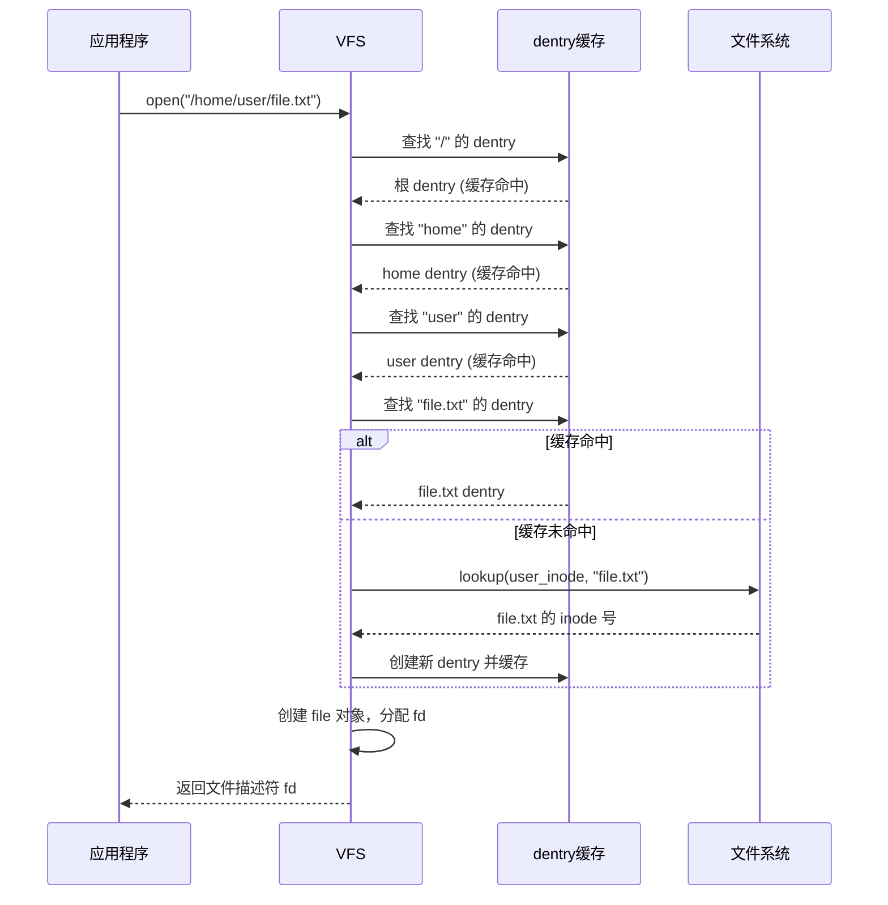

## 2. ext4 文件系统

### 2.1 ext4 磁盘布局

ext4 将磁盘划分为固定大小的块组（Block Group），每个块组独立管理自己的 inode 和数据块：

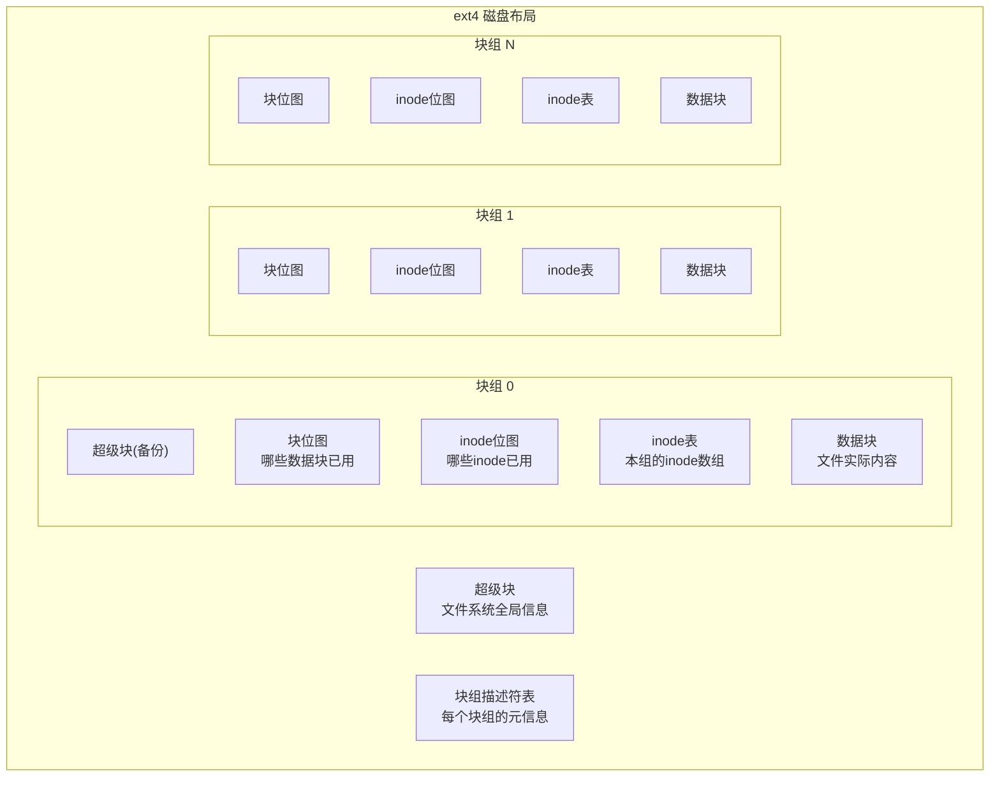

**块组的关键组件：**

| 组件 | 作用 |
|------|------|
| 超级块 | 文件系统全局信息（块大小、总块数、总 inode 数等） |
| 块组描述符 | 每个块组的空闲块数、空闲 inode 数、各组件位置 |
| 块位图 | 位图标记本组中哪些数据块已使用 |
| inode 位图 | 位图标记本组中哪些 inode 已使用 |
| inode 表 | 本组所有 inode 的数组 |
| 数据块 | 文件和目录的实际数据 |

::: info 块组的优势
1. **局部性**：文件的 inode 和数据尽量在同一块组，减少磁盘寻道
2. **并发**：不同块组可以并行分配
3. **可靠性**：超级块在多个块组中有备份
:::

### 2.2 ext4 Extent 树

ext4 用 Extent 替代了 ext2/3 的间接块映射，大幅提升大文件的效率：

```
ext2/3 间接块映射（大文件需要多层间接指针）：
inode → 直接块(12) → 一级间接 → 二级间接 → 三级间接
（访问大文件需要多次读磁盘获取间接块）

ext4 Extent 树（连续区域直接描述）：
inode → extent_header → extent[0]: 逻辑块0~1023 → 物理块10000~11023
                                extent[1]: 逻辑块1024~2047 → 物理块20000~21023
```

**Extent 结构：**

```
struct ext4_extent {
    __le32 ee_block;      // 起始逻辑块号
    __le16 ee_len;        // 连续块数（最大 32768 = 128MB）
    __le16 ee_start_hi;   // 物理块号高16位
    __le32 ee_start_lo;   // 物理块号低32位
};
// 一个 extent 描述一段连续的物理块
```

```bash
# 查看 inode 的 extent 信息
debugfs -R "stat <12>" /dev/sda1
# 或者
filefrag -v /path/to/file
```

::: important Extent vs 间接块映射
| 特性 | 间接块映射 (ext2/3) | Extent (ext4) |
|------|---------------------|--------------|
| 大文件元数据 | 多层间接块（可能数KB） | 几个 extent（几百字节） |
| 连续分配 | 每个块单独映射 | 一次映射连续区域 |
| 碎片化容忍 | 差 | 好（多个 extent） |
| 最大文件 | ~2TB（4K块） | ~16TB（4K块） |
:::

### 2.3 ext4 日志模式

ext4 支持三种日志模式，在性能和数据安全之间权衡：

| 模式 | mount 选项 | 描述 | 性能 | 安全性 |
|------|-----------|------|------|--------|
| **journal** | `data=journal` | 数据和元数据都写入日志 | 最慢 | 最安全 |
| **ordered** | `data=ordered`（默认） | 仅元数据写日志，但保证数据先于元数据写入 | 中等 | 推荐 |
| **writeback** | `data=writeback` | 仅元数据写日志，数据写入顺序不保证 | 最快 | 可能丢失最近数据 |

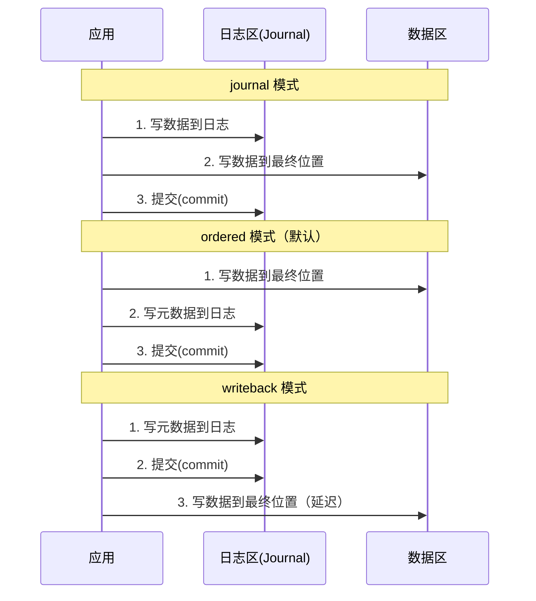

```bash
# 查看当前日志模式
tune2fs -l /dev/sda1 | grep "Filesystem features"
mount | grep data=

# 修改日志模式
tune2fs -o journal_data_writeback /dev/sda1   # writeback
tune2fs -o journal_data_ordered /dev/sda1      # ordered
# 或 mount 时指定
mount -o data=writeback /dev/sda1 /mnt

# 查看日志信息
dumpe2fs /dev/sda1 | grep -i journal
journalctl -k | grep jbd2    # ext4 日志内核模块是 jbd2
```

### 2.4 ext4 其他特性

```bash
# 延迟分配（delayed allocation）
# ext4 不在 write() 时立即分配块，而是等到 flush 时
# 好处：可以合并小写为大写，减少碎片
# 风险：突然断电可能丢失更多数据
mount -o delalloc /dev/sda1 /mnt      # 默认开启

# 多块分配（multiblock allocator）
# 一次分配多个连续块，而不是逐块分配
# 与延迟分配配合，大幅减少碎片

# 在线碎片整理
e4defrag /dev/sda1
e4defrag /path/to/directory

# 在线扩容
resize2fs /dev/sda1       # 扩展到可用空间
resize2fs /dev/sda1 100G  # 扩展到指定大小

# 查看文件系统特性
tune2fs -l /dev/sda1 | grep features
```

## 3. XFS 文件系统

### 3.1 XFS 架构

XFS 是 Silicon Graphics 为 IRIX 设计的高性能文件系统，后被移植到 Linux。它在大型文件和并行 IO 方面表现优异，是 RHEL/CentOS 8+ 的默认文件系统。

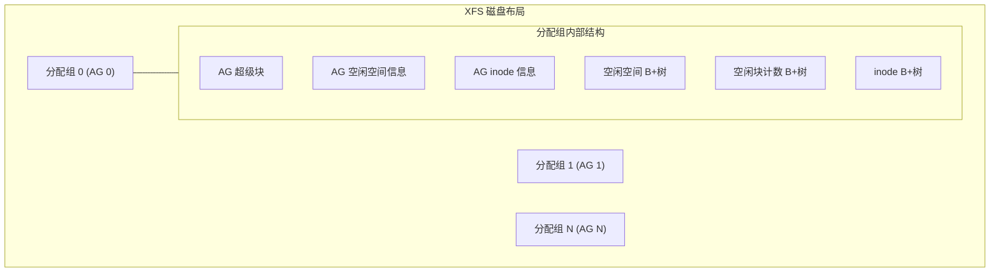

**分配组（Allocation Group, AG）：**

XFS 将文件系统划分为多个等大的分配组，每个 AG 独立管理自己的空间和 inode：

| 组件 | 作用 |
|------|------|
| AG 超级块 | 本 AG 的全局信息 |
| AG 空间信息 | 空闲块/inode 的管理结构 |
| B+树（空闲空间） | 按起始块号和大小组织的空闲空间索引 |
| B+树（inode） | inode 索引 |

::: important XFS vs ext4 核心差异
| 特性 | ext4 | XFS |
|------|------|-----|
| 分配单位 | 块组 | 分配组（AG） |
| 索引结构 | Extent 树 | B+树 |
| 并行分配 | 有限 | AG 级别完全并行 |
| 大文件 | ~16TB | ~8EB |
| 在线缩容 | 支持 | **不支持** |
| 元数据日志 | 有 | 有（写时复制） |
| 碎片整理 | e4defrag | xfs_fsr |
| 默认 | Debian/Ubuntu | RHEL/CentOS 8+ |
:::

### 3.2 XFS B+树

XFS 使用 B+树管理空闲空间和 inode 索引，相比 ext4 的 Extent 树更适合大规模数据：

```
B+树结构（以空闲空间索引为例）：

                    [根节点]
                   /         \
            [中间节点]       [中间节点]
           /    |    \      /    |    \
        [叶子] [叶子] [叶子] [叶子] [叶子] [叶子]
          ↓      ↓      ↓      ↓      ↓      ↓
       空闲区间列表

特点：
- 所有数据在叶子节点，中间节点仅存索引
- 叶子节点通过链表相连（顺序遍历高效）
- 树的高度低（通常 2-3 层即可管理数 TB）
- 查找/插入/删除均为 O(log n)
```

### 3.3 XFS 常用操作

```bash
# 创建 XFS 文件系统
mkfs.xfs /dev/sdb1
mkfs.xfs -f -b size=4096 -d agcount=16 /dev/sdb1

# 查看文件系统信息
xfs_info /dev/sdb1
xfs_db -r -c "sb 0" -c "p" /dev/sdb1

# 在线扩容（XFS 只能扩不能缩！）
xfs_growfs /mountpoint
xfs_growfs -D 100G /mountpoint    # 扩展到指定大小

# 碎片整理
xfs_fsr /mountpoint          # 整理整个文件系统
xfs_fsr /path/to/file        # 整理单个文件

# 查看碎片化程度
xfs_db -r -c "frag" /dev/sdb1

# 修复
xfs_repair /dev/sdb1         # 需要先卸载

# 冻结/解冻（用于一致性快照）
xfs_freeze -f /mountpoint    # 冻结
xfs_freeze -u /mountpoint    # 解冻

# 配额管理
xfs_quota -x -c "limit bsoft=10g bhard=12g username" /mountpoint
xfs_quota -x -c "report" /mountpoint
```

## 4. /proc 与 /sys 虚拟文件系统

### 4.1 /proc（进程与内核信息）

/proc 是内核向用户空间暴露运行时信息的窗口：

```bash
# ===== 进程信息 =====
/proc/<PID>/
├── cmdline          # 完整命令行
├── cwd              # 当前工作目录（符号链接）
├── environ          # 环境变量
├── exe              # 可执行文件路径（符号链接）
├── fd/              # 打开的文件描述符（符号链接）
├── maps             # 内存映射
├── mem              # 进程内存（二进制）
├── mounts           # 挂载信息
├── status           # 进程状态（人可读）
├── stat             # 进程状态（机器可读）
├── io               # IO 统计
├── net/             # 网络统计
├── oom_score        # OOM 分数
├── oom_score_adj    # OOM 分数调整
├── smaps            # 详细内存映射
├── stack            # 内核栈
└── wchan            # 等待通道

# 常用查看命令
cat /proc/1234/status | head -20
ls -la /proc/1234/fd/    # 查看进程打开的文件
cat /proc/1234/io        # IO 统计

# ===== 系统信息 =====
/proc/cpuinfo          # CPU 信息
/proc/meminfo          # 内存信息
/proc/version          # 内核版本
/proc/cmdline          # 内核启动参数
/proc/mounts           # 挂载信息
/proc/filesystems      # 支持的文件系统
/proc/partitions       # 分区信息
/proc/diskstats        # 磁盘统计
/proc/interrupts       # 中断信息
/proc/softirqs         # 软中断
/proc/loadavg          # 负载均值
/proc/uptime           # 运行时间
/proc/vmstat           # 虚拟内存统计
/proc/slabinfo         # Slab 分配器信息
/proc/net/dev          # 网络接口统计
/proc/net/tcp          # TCP 连接
```

### 4.2 /sys（设备与驱动模型）

/sys（sysfs）是 Linux 设备驱动模型的核心接口：

```bash
/sys/
├── block/            # 块设备
│   └── sda/
│       ├── size      # 设备大小
│       ├── queue/    # IO 调度器参数
│       └── sda1/     # 分区
├── bus/              # 总线
│   ├── pci/
│   ├── usb/
│   └── scsi/
├── class/            # 设备类
│   ├── net/          # 网络接口
│   ├── block/        # 块设备
│   └── input/        # 输入设备
├── dev/              # 设备节点
│   ├── block/
│   └── char/
├── devices/          # 所有设备（按拓扑）
├── firmware/         # 固件
├── fs/               # 文件系统参数
├── kernel/           # 内核参数
└── module/           # 内核模块

# 常用操作
# 查看块设备调度器
cat /sys/block/sda/queue/scheduler
# [mq-deadline] kyber bfq none

# 修改 IO 调度器
echo bfq > /sys/block/sda/queue/scheduler

# 查看 CPU 频率
cat /sys/devices/system/cpu/cpu0/cpufreq/scaling_cur_freq

# 查看 NUMA 拓扑
ls /sys/devices/system/node/
```

## 5. Page Cache 与脏页回写

### 5.1 Page Cache 架构

Page Cache 是 Linux 内核的磁盘缓存机制——将最近读取的文件内容缓存在内存中，后续读取直接从内存返回，避免磁盘 IO：

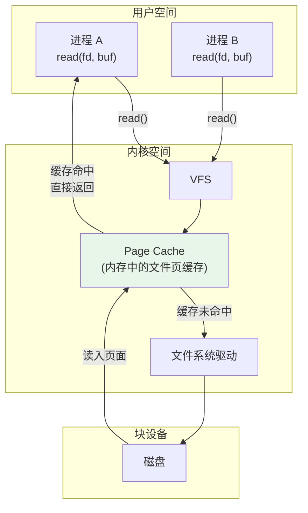

**Page Cache 关键特性：**

| 特性 | 说明 |
|------|------|
| **读缓存** | 读文件时先查 Page Cache，命中则直接返回 |
| **写缓冲** | 写文件时先写入 Page Cache（标记为脏页），稍后写回磁盘 |
| **共享** | 同一文件的不同进程共享同一份 Page Cache |
| **自动回收** | 内存不足时自动回收最久未用的缓存页 |

```bash
# 查看 Page Cache 使用情况
free -h
# buff/cache 列就是 Page Cache + buffer cache

cat /proc/meminfo | grep -E "Cached|Buffers|Dirty|Writeback"
# Cached:          8192000 kB    ← Page Cache
# Buffers:          102400 kB    ← 块设备缓冲区
# Dirty:              4096 kB    ← 脏页（待写回）
# Writeback:             0 kB    ← 正在写回

# 查看文件的缓存状态
vmtouch /path/to/file
# 或者
fincore /path/to/file

# 清理 Page Cache（危险！生产环境慎用）
echo 1 > /proc/sys/vm/drop_caches    # 仅清理 Page Cache
echo 2 > /proc/sys/vm/drop_caches    # 清理 dentry + inode 缓存
echo 3 > /proc/sys/vm/drop_caches    # 清理所有缓存
```

### 5.2 脏页回写机制

脏页（Dirty Page）是被修改但尚未写回磁盘的缓存页。Linux 使用多种机制确保脏页最终被写回：

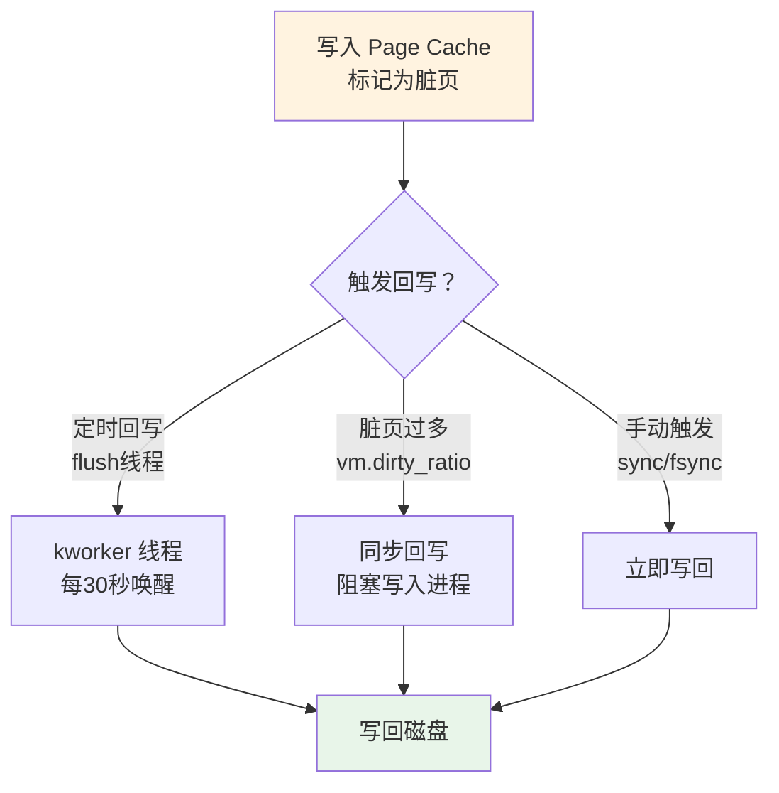

**关键参数：**

```bash
# 查看脏页回写参数
sysctl -a | grep dirty

# vm.dirty_background_ratio = 10
# 脏页占总内存 10% 时，后台线程开始回写

# vm.dirty_ratio = 20
# 脏页占总内存 20% 时，阻塞所有写入，强制同步回写

# vm.dirty_writeback_centisecs = 500
# 回写线程每 5 秒唤醒一次（500/100=5秒）

# vm.dirty_expire_centisecs = 3000
# 脏页超过 30 秒未写回则标记为过期，下次唤醒时优先写回
```

**不同场景的调优策略：**

```ini
# 场景1：数据安全优先（数据库服务器）
vm.dirty_background_ratio = 5
vm.dirty_ratio = 10
vm.dirty_writeback_centisecs = 100    # 1秒唤醒

# 场景2：吞吐量优先（大数据写入）
vm.dirty_background_ratio = 20
vm.dirty_ratio = 40
vm.dirty_writeback_centisecs = 500    # 5秒唤醒

# 场景3：极端性能（可接受数据丢失）
vm.dirty_background_ratio = 30
vm.dirty_ratio = 60
vm.dirty_writeback_centisecs = 3000   # 30秒唤醒
```

```bash
# 手动触发回写
sync                           # 所有脏页
sync /path/to/file             # 单个文件（需文件系统支持）

# 查看当前脏页数
cat /proc/meminfo | grep -E "^Dirty:"
cat /proc/vmstat | grep nr_dirty
```

## 6. 文件 IO 路径

### 6.1 完整的文件 IO 路径

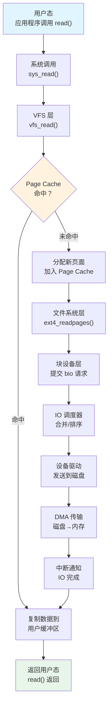

### 6.2 写入路径

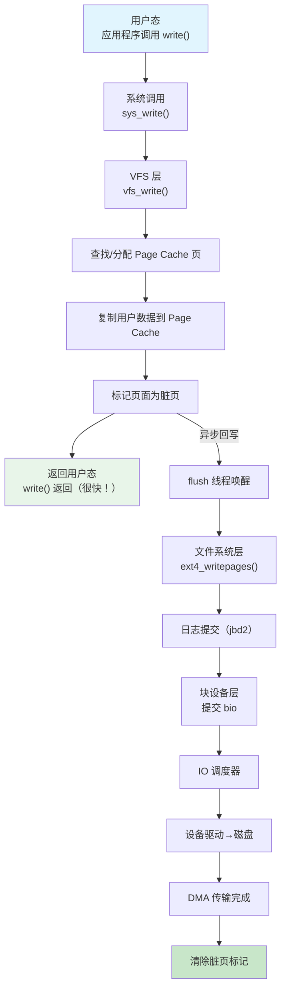

::: important write() 返回 ≠ 数据已落盘
`write()` 系统调用只将数据复制到 Page Cache 就返回了，数据还在内存中！保证数据落盘的方式：
- `fsync(fd)` — 等待文件数据和元数据都写回磁盘
- `fdatasync(fd)` — 只等数据写回（不关心元数据，更快）
- `O_SYNC` 打开标志 — 每次 write 自动等待落盘（最慢）
- `sync()` — 刷出所有脏页
:::

### 6.3 IO 调度器

IO 调度器位于块设备层，负责合并、排序和调度 IO 请求：

| 调度器 | 策略 | 适用场景 |
|--------|------|---------|
| **none** (noop) | FIFO，不排序 | SSD/NVMe（寻道时间为0） |
| **mq-deadline** | 保证请求延迟上限 | 通用（RHEL 8 默认） |
| **bfq** | 公平带宽分配 | 桌面/交互式 |
| **kyber** | 基于令牌的限流 | NVMe 高速设备 |

```bash
# 查看当前 IO 调度器
cat /sys/block/sda/queue/scheduler
# [mq-deadline] kyber bfq none

# 修改 IO 调度器
echo bfq > /sys/block/sda/queue/scheduler

# 永久修改（GRUB 参数）
# 在 /etc/default/grub 添加：
GRUB_CMDLINE_LINUX="elevator=bfq"
grub2-mkconfig -o /boot/grub2/grub.cfg
```

## 7. io_uring

### 7.1 传统 IO 模型的瓶颈

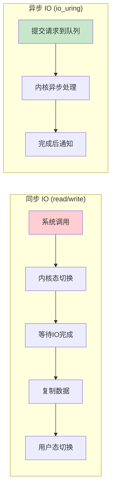

| IO 模型 | 系统调用次数 | 上下文切换 | 阻塞 |
|---------|------------|-----------|------|
| read/write | 每次 IO 一次 | 2次/IO | 是 |
| mmap | 1次（映射） | 页错误时 | 部分 |
| aio_read | 1次/IO | 2次/IO | 否（但有限制） |
| **io_uring** | **0次（共享环形缓冲区）** | **0-1次** | **否** |

### 7.2 io_uring 架构

io_uring 使用两个环形缓冲区（ring buffer）在用户态和内核态之间零拷贝通信：

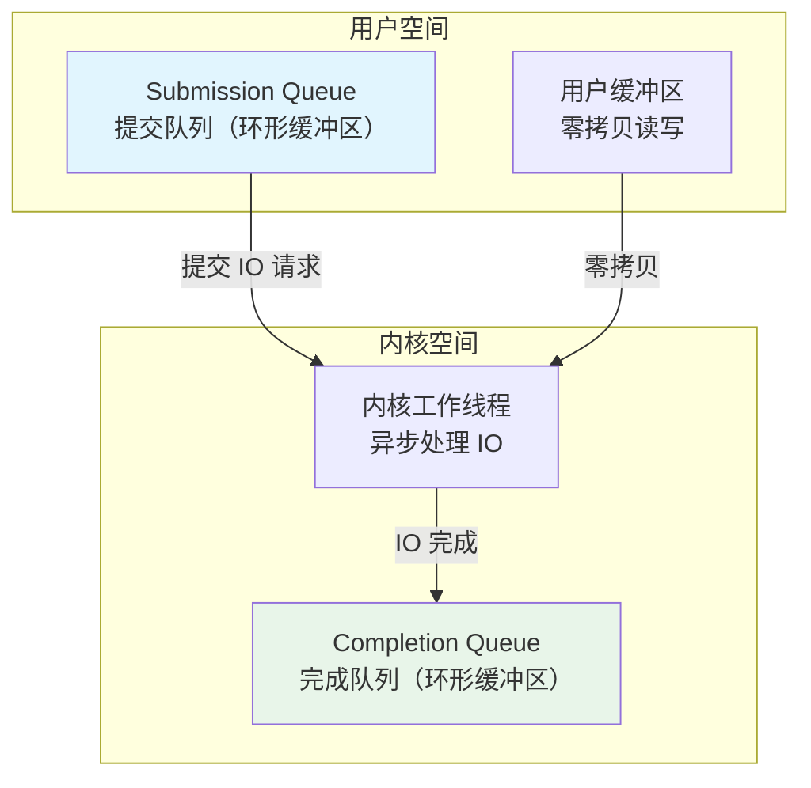

**io_uring 工作流程：**

1. 用户程序将 IO 请求写入 Submission Queue（SQ）
2. 内核从 SQ 读取请求，异步执行
3. 完成后写入 Completion Queue（CQ）
4. 用户程序从 CQ 读取结果

### 7.3 io_uring 使用

```c
// liburing 示例（C 语言）
#include <liburing.h>

int main() {
    struct io_uring ring;
    struct io_uring_sqe *sqe;
    struct io_uring_cqe *cqe;
    char buf[4096];

    // 1. 初始化 io_uring
    io_uring_queue_init(32, &ring, 0);

    // 2. 准备读请求
    int fd = open("test.txt", O_RDONLY);
    sqe = io_uring_get_sqe(&ring);
    io_uring_prep_read(sqe, fd, buf, sizeof(buf), 0);

    // 3. 提交请求
    io_uring_submit(&ring);

    // 4. 等待完成
    io_uring_wait_cqe(&ring, &cqe);

    // 5. 处理结果
    if (cqe->res >= 0) {
        printf("Read %d bytes\n", cqe->res);
    }

    // 6. 清理
    io_uring_cqe_seen(&ring, cqe);
    io_uring_queue_exit(&ring);
    close(fd);
    return 0;
}
```

```bash
# 使用 fio 测试 io_uring 性能
fio --name=iouring-test \
    --ioengine=io_uring \
    --rw=randread \
    --bs=4k \
    --size=1G \
    --numjobs=4 \
    --iodepth=32 \
    --runtime=60

# 对比 libaio
fio --name=libaio-test \
    --ioengine=libaio \
    --rw=randread \
    --bs=4k \
    --size=1G \
    --numjobs=4 \
    --iodepth=32 \
    --runtime=60
```

::: tip io_uring 的优势
1. **零系统调用**：通过共享内存提交/完成 IO，避免系统调用开销
2. **批量提交**：一次提交多个 IO 请求
3. **真正的异步**：不像 POSIX AIO 那样有限制
4. **支持多种操作**：文件 IO、网络 IO、超时、信号等
5. **高性能**：在 NVMe SSD 上，io_uring 可比传统 IO 快 2-5 倍

io_uring 从 Linux 5.1 开始引入，目前已成为高性能 IO 的首选方案。
:::

## 8. 文件描述符与打开文件表

### 8.1 文件描述符机制

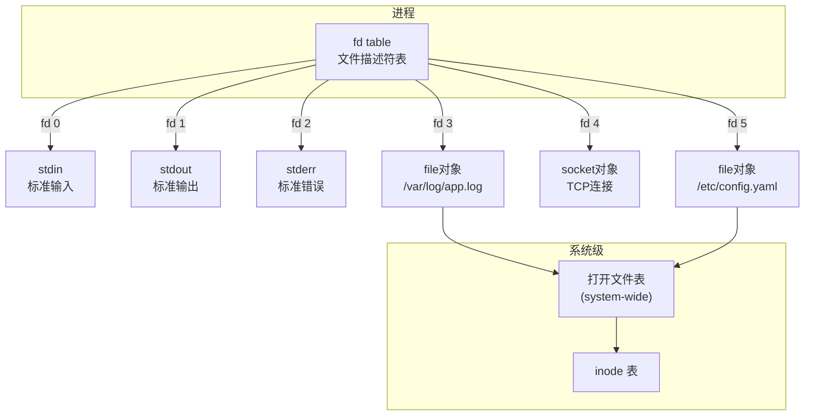

```bash
# 查看进程的文件描述符
ls -la /proc/$$/fd/
# 0 -> /dev/pts/0
# 1 -> /dev/pts/0
# 2 -> /dev/pts/0
# 3 -> /var/log/app.log
# 4 -> socket:[12345]

# 查看文件描述符限制
ulimit -n                      # 当前进程限制
cat /proc/sys/fs/file-max      # 系统级最大值
cat /proc/sys/fs/file-nr       # 已分配/未使用/最大值

# 修改限制
ulimit -n 65535                         # 当前 session
echo "* soft nofile 65535" >> /etc/security/limits.conf
echo "* hard nofile 65535" >> /etc/security/limits.conf
echo "fs.file-max = 1048576" >> /etc/sysctl.conf
```

### 8.2 文件描述符与重定向

```bash
# 重定向
command > file        # stdout → file (fd 1)
command 2> file       # stderr → file (fd 2)
command &> file       # stdout+stderr → file
command >> file       # stdout 追加到 file

# 文件描述符操作
exec 3>/tmp/output.log     # 打开 fd 3 写入
echo "log" >&3             # 写到 fd 3
exec 3>&-                  # 关闭 fd 3

exec 4</tmp/input.txt      # 打开 fd 4 读取
read line <&4              # 从 fd 4 读取
exec 4<&-                  # 关闭 fd 4

# 交换 stdout 和 stderr
command 3>&1 1>&2 2>&3 3>&-

# 重定向到多个目标
command > >(tee output.log) 2>&1
```

### 8.3 CLOSE_WAIT 与文件描述符泄漏

```bash
# 查看进程的打开文件数
ls /proc/<PID>/fd | wc -l
lsof -p <PID> | wc -l

# 查看系统级文件描述符使用
cat /proc/sys/fs/file-nr
# 2048    0    1048576
# 已分配   未使用   最大值

# CLOSE_WAIT 堆积（文件描述符泄漏的典型症状）
ss -tn state close-wait | wc -l

# 查看哪个进程持有 CLOSE_WAIT
ss -tnp state close-wait
```

::: warning 文件描述符泄漏
文件描述符泄漏是最常见的资源泄漏之一：
1. **忘记 close()**：打开的文件/连接没有关闭
2. **CLOSE_WAIT 堆积**：对端关闭连接，本端没有检测到
3. **临时文件未删除**：`mktemp` 后忘记清理

检测方法：
- 监控进程打开的 fd 数量趋势
- 监控 CLOSE_WAIT 连接数
- 使用 `lsof` 定位泄漏来源
:::

## 9. 实战：文件系统性能调优

```bash
#!/bin/bash
# ============================================================
# 文件系统性能调优脚本
# ============================================================

set -euo pipefail

DEVICE="${1:-sda}"
MOUNT="${2:-/}"

echo "=============================="
echo " 文件系统性能调优"
echo " 设备: $DEVICE"
echo " 挂载点: $MOUNT"
echo "=============================="

# 1. IO 调度器
echo -e "\n--- IO 调度器 ---"
current=$(cat /sys/block/$DEVICE/queue/scheduler)
echo "当前: $current"

# SSD/NVMe 推荐 none 或 mq-deadline
# HDD 推荐 bfq 或 mq-deadline
rotational=$(cat /sys/block/$DEVICE/queue/rotational)
if [[ "$rotational" == "0" ]]; then
    echo "检测到 SSD/NVMe，推荐: none 或 mq-deadline"
    echo none > /sys/block/$DEVICE/queue/scheduler 2>/dev/null || true
else
    echo "检测到 HDD，推荐: bfq 或 mq-deadline"
    echo bfq > /sys/block/$DEVICE/queue/scheduler 2>/dev/null || true
fi
echo "已设置: $(cat /sys/block/$DEVICE/queue/scheduler)"

# 2. 预读大小
echo -e "\n--- 预读大小 ---"
readahead=$(cat /sys/block/$DEVICE/queue/read_ahead_kb)
echo "当前预读: ${readahead}KB"
echo 4096 > /sys/block/$DEVICE/queue/read_ahead_kb
echo "已设置为: 4096KB"

# 3. 脏页回写参数
echo -e "\n--- 脏页回写 ---"
echo "当前参数:"
sysctl vm.dirty_background_ratio vm.dirty_ratio vm.dirty_writeback_centisecs

# 4. 文件描述符限制
echo -e "\n--- 文件描述符 ---"
echo "系统限制: $(cat /proc/sys/fs/file-max)"
echo "当前使用: $(cat /proc/sys/fs/file-nr | awk '{print $1}')"
echo "进程限制: $(ulimit -n)"

# 5. 挂载选项优化
echo -e "\n--- 挂载选项 ---"
mount | grep " $MOUNT "

# 推荐的挂载选项
echo "推荐选项:"
echo "  noatime - 不更新访问时间（提升性能）"
echo "  nodiratime - 不更新目录访问时间"
echo "  data=writeback - 仅元数据日志（提升性能，降低安全性）"

# 6. 文件系统统计
echo -e "\n--- 文件系统统计 ---"
df -h "$MOUNT"
echo ""
df -i "$MOUNT"

echo -e "\n=============================="
echo " 调优完成"
echo "=============================="
```

## 参考资源

- 《深入理解 Linux 内核》—— Daniel P. Bovet
- 《Linux 内核设计与实现》—— Robert Love
- [Linux VFS 文档](https://www.kernel.org/doc/html/latest/filesystems/vfs.html)
- [ext4 文档](https://www.kernel.org/doc/html/latest/filesystems/ext4/index.html)
- [XFS 文档](https://xfs.wiki.kernel.org/)
- [io_uring 文档](https://kernel.dk/io_uring.pdf)
- Brendan Gregg 的 [Linux File Systems](https://www.brendangregg.com/)
