# 文件系统原理

::: important 核心问题
磁盘上的数据只是磁道上的磁化信号，文件系统赋予这些信号以"意义"——将原始的块设备组织成层次化的目录和文件。Linux通过VFS（虚拟文件系统）抽象了所有文件系统的差异，让用户进程无需关心底层是ext4、XFS还是tmpfs。
:::

## 从一个比喻开始

文件系统就像一座图书馆：

- **磁盘** = 图书馆的物理建筑（书架、房间）
- **块（Block）** = 书架上的格子
- **超级块（Superblock）** = 图书馆总目录（藏书总量、分区布局）
- **Inode** = 每本书的索引卡片（作者、位置、权限，但不是书本身）
- **Dentry** = 分类目录结构（"计算机→操作系统→Linux→..."）
- **File** = 借书证（记录当前读到哪一页）
- **数据块** = 书的实际内容

VFS就是图书馆的统一服务规范——不管哪个分馆（ext4/XFS/proc），读者（进程）都使用相同的方式借书（系统调用）。

---

## VFS 虚拟文件系统

### VFS四大核心对象

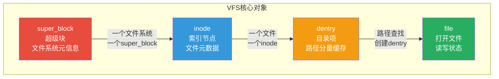

### super_block：文件系统的身份证

每个已挂载的文件系统都有一个super_block，记录文件系统的全局信息：

```c
// include/linux/fs.h - 简化版
struct super_block {
    dev_t s_dev;                    // 设备号
    unsigned long s_blocksize;      // 块大小
    unsigned char s_blocksize_bits; // 块大小的位数
    unsigned long s_maxbytes;       // 最大文件大小

    struct file_system_type *s_type;  // 文件系统类型
    const struct super_operations *s_op; // 超级块操作函数
    struct dentry *s_root;          // 根dentry

    // 缓存
    struct list_head s_dirty;       // 脏inode链表
    struct list_head s_io;          // 等待写回的inode
    struct hlist_node s_instances;  // 同类型文件系统链表

    // 文件系统特有数据
    void *s_fs_info;                // ext4_sb_info / xfs_mount 等

    // 统计信息
    u64 s_max_links;                // 最大链接数
    kuid_t s_owner;                 // 文件系统所有者
};
```

```c
// super_operations - 超级块操作
struct super_operations {
    struct inode *(*alloc_inode)(struct super_block *sb);   // 分配inode
    void (*destroy_inode)(struct inode *);                  // 销毁inode
    void (*dirty_inode)(struct inode *, int flags);         // 标记inode脏
    int (*write_inode)(struct inode *, struct writeback_control *); // 写回inode
    void (*drop_inode)(struct inode *);                     // 删除inode
    void (*evict_inode)(struct inode *);                    // 驱逐inode
    int (*statfs)(struct dentry *, struct kstatfs *);       // 文件系统统计
    int (*remount_fs)(struct super_block *, int *, char *); // 重新挂载
    void (*umount_begin)(struct super_block *);             // 开始卸载
};
```

### inode：文件的元数据

每个文件（目录、设备文件等）对应一个inode，存储文件的元数据（不包含文件名）：

```c
// include/linux/fs.h - 简化版
struct inode {
    umode_t i_mode;              // 文件类型和权限
    kuid_t i_uid;                // 所有者UID
    kgid_t i_gid;                // 所有组GID
    unsigned long i_ino;         // inode号
    dev_t i_rdev;                // 设备号（设备文件）
    loff_t i_size;               // 文件大小（字节）
    struct timespec i_atime;     // 最后访问时间
    struct timespec i_mtime;     // 最后修改时间
    struct timespec i_ctime;     // 最后状态改变时间

    const struct inode_operations *i_op;  // inode操作
    const struct file_operations *i_fop;  // 文件操作
    struct super_block *i_sb;    // 所属超级块
    struct address_space *i_mapping; // 页缓存映射
    struct address_space i_data; // 页缓存数据

    unsigned int i_nlink;        // 硬链接数
    blkcnt_t i_blocks;           // 占用的块数
    void *i_private;             // 文件系统私有数据
};
```

::: tip inode不包含文件名
文件名存储在目录项（dentry）中，而不是inode中。一个inode可以有多个文件名（硬链接），它们通过不同的dentry指向同一个inode。
:::

```bash
# 查看文件的inode信息
stat /etc/passwd
# File: /etc/passwd
# Size: 1234        Blocks: 8          IO Block: 4096   regular file
# Inode: 1234567    Links: 1
# Access: (0644/-rw-r--r--)  Uid: (    0/    root)   Gid: (    0/    root)

# 查看inode号
ls -i /etc/passwd

# 查看文件系统的inode使用情况
df -i
# Filesystem      Inodes  IUsed    IFree IUse% Mounted on
# /dev/sda1      6553600 128000 6425600    2% /

# 查看特定文件系统的inode大小
dumpe2fs -h /dev/sda1 | grep "Inode size"
# Inode size:           256
```

### dentry：目录项缓存

dentry将文件名与inode关联起来，是路径查找的关键：

```c
// include/linux/dcache.h - 简化版
struct dentry {
    atomic_t d_count;               // 引用计数
    unsigned int d_flags;           // 标志位
    spinlock_t d_lock;              // 自旋锁
    struct inode *d_inode;          // 关联的inode
    struct dentry *d_parent;        // 父目录dentry
    struct qstr d_name;             // 文件名
    struct list_head d_child;       // 父目录的子节点链表
    struct list_head d_subdirs;     // 子目录/文件链表
    struct hlist_node d_hash;       // 哈希表节点
    const struct dentry_operations *d_op; // dentry操作
    struct super_block *d_sb;       // 所属超级块
};
```

```
dentry缓存（dcache）结构：

  路径: /home/user/file.txt

  根dentry "/"
       │
       └── dentry "home"
              │
              └── dentry "user"
                     │
                     └── dentry "file.txt" → inode 1234567

  dcache 哈希表加速查找：
    hash("/home/user/file.txt") → 哈希桶 → dentry → inode

  热路径优化：
    同一路径重复查找直接命中dcache，无需读磁盘
```

### file：打开的文件实例

每次open()创建一个file对象，表示进程对文件的一次打开：

```c
// include/linux/fs.h - 简化版
struct file {
    struct path f_path;            // 路径（dentry + vfsmount）
    struct inode *f_inode;         // 关联的inode
    const struct file_operations *f_op; // 文件操作函数表
    atomic_long_t f_count;         // 引用计数
    unsigned int f_flags;          // 打开标志（O_RDONLY等）
    fmode_t f_mode;                // 读写模式
    loff_t f_pos;                  // 文件偏移量（读写位置）
    void *private_data;            // 私有数据
};
```

### VFS架构总览

```mermaid
flowchart TD
    subgraph 用户空间
        APP[应用程序<br/>open/read/write/close]
    end

    subgraph VFS层
        VFS1[系统调用<br/>sys_open/sys_read/sys_write]
        VFS2[super_block<br/>文件系统元信息]
        VFS3[inode<br/>文件元数据]
        VFS4[dentry<br/>目录项缓存]
        VFS5[file<br/>打开文件实例]
        VFS6[Page Cache<br/>页缓存]
    end

    subgraph 文件系统实现
        EXT4[ext4<br/>文件系统]
        XFS[XFS<br/>文件系统]
        PROC[/proc<br/>虚拟文件系统]
        SYSFS[/sys<br/>虚拟文件系统]
        TMPFS[tmpfs<br/>内存文件系统]
    end

    subgraph 块设备层
        BLK[块设备驱动<br/>I/O调度器]
        DISK[物理磁盘<br/>SSD/HDD]
    end

    APP --> VFS1
    VFS1 --> VFS2
    VFS1 --> VFS3
    VFS1 --> VFS4
    VFS1 --> VFS5
    VFS5 --> VFS6

    VFS2 --> EXT4
    VFS2 --> XFS
    VFS3 --> EXT4
    VFS3 --> XFS
    VFS3 --> PROC
    VFS3 --> SYSFS
    VFS3 --> TMPFS

    EXT4 --> BLK
    XFS --> BLK
    BLK --> DISK

    style VFS1 fill:#e74c3c,color:#fff
    style VFS6 fill:#3498db,color:#fff
    style BLK fill:#95a5a6,color:#fff
```

---

## ext4 文件系统

### ext4 磁盘布局

ext4将磁盘划分为块组（Block Group），每个块组独立管理：

```
ext4 磁盘布局：

  ┌──────────────────────────────────────────────────────────┐
  │ Block Group 0      │ Block Group 1 │ ... │ Block Group N │
  ├────────────────────┼───────────────┼─────┼───────────────┤
  │ Superblock         │ Superblock    │     │ Superblock    │
  │ (主超级块)         │ (备份)        │     │ (备份)        │
  ├────────────────────┤               │     │               │
  │ Group Descriptor   │ Group Desc.   │     │ Group Desc.   │
  ├────────────────────┤               │     │               │
  │ Reserved GDT       │ Reserved GDT │     │ Reserved GDT │
  ├────────────────────┤               │     │               │
  │ Data Block Bitmap  │ Bitmap        │     │ Bitmap        │
  ├────────────────────┤               │     │               │
  │ Inode Bitmap       │ Bitmap        │     │ Bitmap        │
  ├────────────────────┤               │     │               │
  │ Inode Table        │ Inode Table   │     │ Inode Table   │
  ├────────────────────┤               │     │               │
  │ Data Blocks        │ Data Blocks   │     │ Data Blocks   │
  └────────────────────┴───────────────┴─────┴───────────────┘

  块组大小 = 8 × block_size × block_size
  4KB块 → 块组最大 128MB
```

### 单个块组的详细结构

```
Block Group 0 详细布局：

  ┌──────────────────────────────────────┐
  │ Superblock (1024字节，从偏移1024开始)  │ ← 文件系统全局信息
  │  - s_inodes_count: 总inode数          │
  │  - s_blocks_count: 总块数             │
  │  - s_block_size: 块大小               │
  │  - s_magic: 0xEF53 (ext4魔数)        │
  │  - s_feature_incompat: 特性标志       │
  ├──────────────────────────────────────┤
  │ Group Descriptor Table               │ ← 所有块组的描述符
  │  - bg_block_bitmap: 数据块位图位置    │
  │  - bg_inode_bitmap: inode位图位置     │
  │  - bg_inode_table: inode表位置        │
  │  - bg_free_blocks_count: 空闲块数     │
  ├──────────────────────────────────────┤
  │ Reserved GDT Blocks                  │ ← 预留空间（用于扩展）
  ├──────────────────────────────────────┤
  │ Data Block Bitmap (1 block)          │ ← 哪些数据块已使用
  ├──────────────────────────────────────┤
  │ Inode Bitmap (1 block)               │ ← 哪些inode已使用
  ├──────────────────────────────────────┤
  │ Inode Table (N blocks)               │ ← inode数组
  │  ┌──────────────────────┐            │
  │  │ Inode 1 (BAD_INO)    │            │
  │  │ Inode 2 (ROOT_INO)   │            │
  │  │ Inode 3 (ACL)        │            │
  │  │ ...                  │            │
  │  │ Inode N              │            │
  │  └──────────────────────┘            │
  ├──────────────────────────────────────┤
  │ Data Blocks                          │ ← 实际文件数据
  │  Block 0, Block 1, Block 2, ...     │
  └──────────────────────────────────────┘
```

### ext4 Extent 树

ext4使用Extent替代了ext3的间接块映射，大幅提高大文件性能：

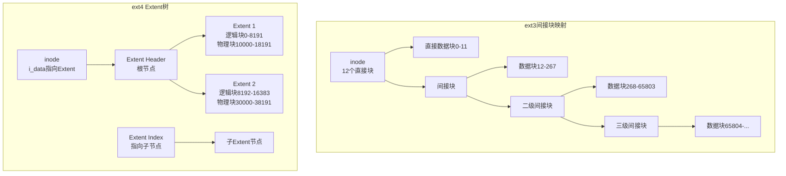

```
Extent 结构（16字节）：

  struct ext4_extent {
      __le32 ee_block;      // 逻辑块号（起始）
      __le16 ee_len;        // 长度（块数，最大32768 = 128MB）
      __le16 ee_start_hi;   // 物理块号高16位
      __le32 ee_start_lo;   // 物理块号低32位
  };

  一个Extent可表示最多128MB连续数据
  而ext3间接块每个指针只表示一个4KB块

  示例：1GB文件
    ext3: 需要256K个指针 → 多次间接块查找
    ext4: 只需要8个Extent → 1次查找
```

### ext4 日志模式

ext4支持三种日志模式，在安全性和性能之间取舍：

| 模式 | 说明 | 性能 | 安全性 |
|------|------|------|--------|
| journal | 数据和元数据都写入日志 | 最低 | 最高 |
| ordered | 只日志元数据，数据在元数据之前写入 | 中等 | 高（默认） |
| writeback | 只日志元数据，数据写入顺序不保证 | 最高 | 最低 |

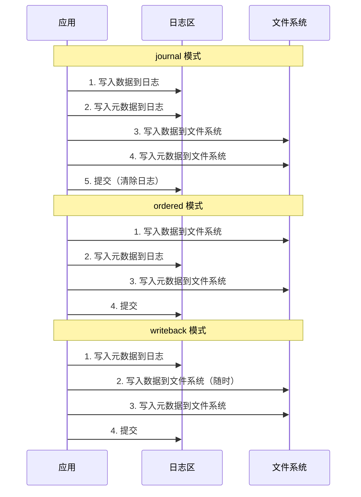

```bash
# 查看当前日志模式
cat /proc/mounts | grep ext4
# /dev/sda1 / ext4 rw,relatime,data=ordered 0 0

# 修改日志模式（重新挂载）
mount -o remount,data=journal /
mount -o remount,data=writeback /

# /etc/fstab 永久配置
# /dev/sda1  /  ext4  defaults,data=ordered  0  1

# 查看日志信息
dumpe2fs /dev/sda1 | grep -i journal

# 创建ext4文件系统时指定日志大小
mkfs.ext4 -J size=256 /dev/sda1    # 256MB日志
mkfs.ext4 -O ^has_journal /dev/sda1 # 禁用日志
```

::: warning 日志模式选择
- **数据库/关键业务**：使用 `data=journal`，牺牲性能换最大安全
- **普通服务器**：使用 `data=ordered`（默认），平衡安全和性能
- **临时数据/缓存**：使用 `data=writeback`，追求最大性能
- **SSD优化**：考虑 `data=writeback` 减少写入放大
:::

---

## XFS 文件系统

XFS是Silicon Graphics开发的高性能64位文件系统，特别适合大文件和高并发场景。

### XFS 分配组（Allocation Group）

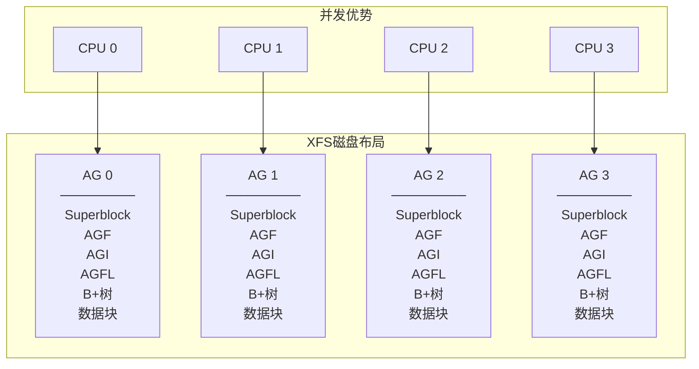

XFS将文件系统划分为多个分配组（AG），每个AG独立管理自己的inode和空间：

```
分配组（AG）的核心结构：

  ┌──────────────────────────────────────┐
  │ AG Superblock    (文件系统全局信息副本) │
  ├──────────────────────────────────────┤
  │ AGF              (空闲空间信息)        │
  │  - 空闲块数、B+树根节点               │
  ├──────────────────────────────────────┤
  │ AGI              (inode信息)          │
  │  - 空闲inode数、B+树根节点            │
  ├──────────────────────────────────────┤
  │ AGFL             (空闲块列表)         │
  │  - 用于B+树分裂的预留块              │
  ├──────────────────────────────────────┤
  │ 空闲空间B+树    (按大小和位置索引)     │
  │ 空闲inode B+树  (按inode号索引)      │
  ├──────────────────────────────────────┤
  │ 数据块                               │
  └──────────────────────────────────────┘

  关键优势：
    不同CPU可以同时在不同AG中分配空间，无需全局锁
    AG数量 = CPU核心数时效果最佳
```

### XFS B+树

XFS广泛使用B+树来索引元数据：

```
XFS B+树结构：

          [Root Node]
         /           \
   [Internal]      [Internal]
   /    \          /      \
 [Leaf] [Leaf]  [Leaf]  [Leaf]

 B+树特点：
   - 所有数据都存储在叶子节点
   - 内部节点只存储索引键
   - 叶子节点通过指针串联
   - 树的高度平衡，查找O(log n)
   - 适合磁盘存储（减少IO次数）

 XFS中B+树的用途：
   1. 空闲空间索引（按块号和大小两棵树）
   2. inode索引
   3. Extent索引（大文件的Extent B+树）
   4. 目录项索引（目录超过一个块时）
```

```bash
# 查看XFS文件系统信息
xfs_info /
# meta-data=/dev/sda1              isize=512    agcount=4, agsize=65536 blks
// data     =                       bsize=4096   blocks=262144, imaxpct=25
//          =                       sunit=0      swidth=0 blks
// naming   =version 2              bsize=4096   ascii-ci=0, ftype=1
// log      =internal               bsize=4096   blocks=2560, version=2
// realtime =none                   extsz=4096   blocks=0, rtextents=0

# XFS修复
xfs_repair /dev/sda1

# XFS冻结/解冻（用于一致性备份）
xfs_freeze -f /mountpoint   # 冻结
xfs_freeze -u /mountpoint   # 解冻

# XFS碎片整理
xfs_fsr /path/to/file

# 查看XFS延迟统计
xfs_stats
```

### ext4 vs XFS 对比

| 特性 | ext4 | XFS |
|------|------|-----|
| 最大文件大小 | 16TB | 8EB |
| 最大文件系统大小 | 64TB | 8EB |
| 分配策略 | 块组 + Extent | 分配组 + B+树 |
| 并发分配 | 块组锁 | AG并行（无全局锁） |
| 在线缩容 | 支持 | 不支持 |
| 元数据日志 | 支持 | 支持 |
| 数据日志 | 支持（journal模式） | 不支持 |
| 大文件性能 | 良好 | 优秀 |
| 小文件性能 | 优秀 | 良好 |
| 适用场景 | 通用 | 大文件/高并发 |

::: tip 如何选择？
- **通用场景**：ext4，成熟稳定，小文件性能好
- **大文件/高并发**：XFS，并行分配，大文件优化
- **数据库**：XFS（MySQL/PostgreSQL推荐），分配延迟更稳定
- **容器存储**：overlay2 + ext4/XFS均可，XFS的projid配额更好
:::

---

## /proc 与 /sys 虚拟文件系统

### /proc：进程与内核信息

/proc是一个完全在内存中的虚拟文件系统，提供进程和内核的运行时信息：

```bash
# 进程相关
cat /proc/<pid>/status     # 进程状态
cat /proc/<pid>/maps       # 内存映射
cat /proc/<pid>/fd/        # 打开的文件描述符
cat /proc/<pid>/statm      # 内存使用
cat /proc/<pid>/cmdline    # 命令行参数
cat /proc/<pid>/environ    # 环境变量
cat /proc/<pid>/stack      # 内核栈

# 内核相关
cat /proc/cpuinfo          # CPU信息
cat /proc/meminfo          # 内存信息
cat /proc/version          # 内核版本
cat /proc/cmdline          # 启动参数
cat /proc/modules          # 已加载模块
cat /proc/interrupts       # 中断统计
cat /proc/filesystems      # 支持的文件系统
cat /proc/mounts           # 已挂载文件系统
cat /proc/partitions       # 分区信息

# 可调参数
cat /proc/sys/vm/swappiness
cat /proc/sys/net/ipv4/ip_forward
echo 1 > /proc/sys/net/ipv4/ip_forward
```

::: important /proc的设计哲学
/proc体现了Unix"一切皆文件"的哲学——内核数据通过文件接口暴露，用户可以通过cat读取、echo写入。无需特殊工具，任何能操作文件的程序都能与内核交互。
:::

### /sys：设备与驱动模型

/sys（sysfs）是Linux 2.6引入的设备模型文件系统：

```bash
# 设备层次结构
ls /sys/devices/           # 所有设备的拓扑
ls /sys/class/             # 按类别组织的设备
ls /sys/bus/               # 按总线组织的设备

# 块设备信息
ls /sys/block/sda/         # sda的属性
cat /sys/block/sda/size    # 设备大小（扇区数）
cat /sys/block/sda/queue/scheduler  # I/O调度器

# CPU信息
ls /sys/devices/system/cpu/
cat /sys/devices/system/cpu/cpu0/cpufreq/scaling_governor

# 内存热插拔
ls /sys/devices/system/memory/

# 网络设备
ls /sys/class/net/
cat /sys/class/net/eth0/mtu
echo 9000 > /sys/class/net/eth0/mtu   # 设置MTU
```

---

## Page Cache 与脏页回写

### Page Cache 在IO路径中的位置

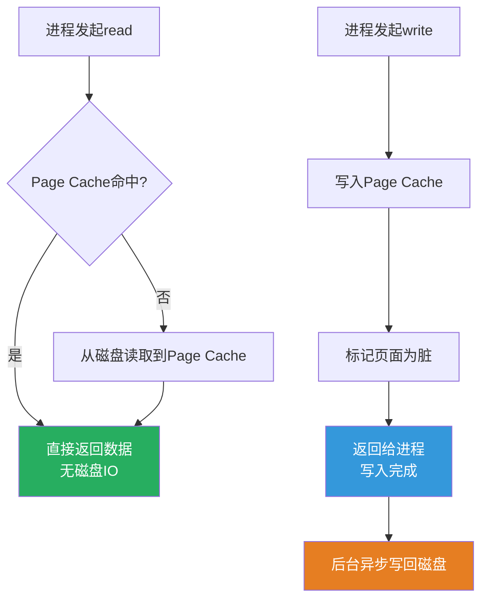

### 脏页回写机制

Linux使用flush/kworker线程异步回写脏页：

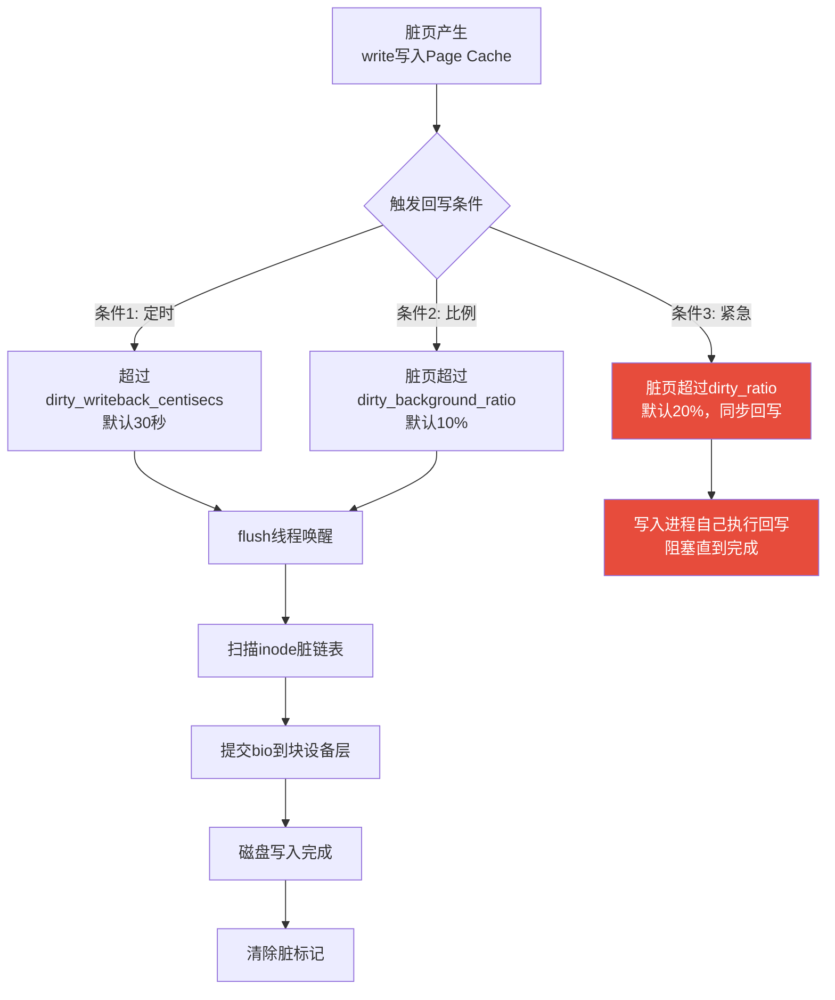

```bash
# 脏页回写参数
cat /proc/sys/vm/dirty_writeback_centisecs   # 回写间隔（厘秒），默认300=30秒
cat /proc/sys/vm/dirty_expire_centisecs       # 脏页过期时间，默认3000=30秒
cat /proc/sys/vm/dirty_background_ratio       # 后台回写触发比例，默认10%
cat /proc/sys/vm/dirty_background_bytes       # 后台回写触发字节数
cat /proc/sys/vm/dirty_ratio                  # 同步回写触发比例，默认20%
cat /proc/sys/vm/dirty_bytes                  # 同步回写触发字节数

# 查看当前脏页状态
cat /proc/meminfo | grep -E "Dirty|Writeback"
cat /sys/devices/virtual/bdi/$(mountpoint -d /)/stats

# 手动同步
sync                    # 同步所有脏页
sync -f /path/to/file   # 同步指定文件

# 查看回写线程状态
ps -ef | grep flush
```

### 回写参数调优

```
不同场景的回写参数推荐：

1. 数据库服务器（低延迟优先）：
   dirty_ratio = 10
   dirty_background_ratio = 5
   dirty_writeback_centisecs = 100  (10秒)
   → 减少突发写入，降低延迟波动

2. 文件服务器（吞吐量优先）：
   dirty_ratio = 40
   dirty_background_ratio = 20
   dirty_writeback_centisecs = 500  (50秒)
   → 积攒更多脏页，批量写入提高吞吐

3. SSD存储：
   dirty_ratio = 20
   dirty_background_ratio = 10
   dirty_writeback_centisecs = 300  (30秒，默认)
   → SSD写入速度快，默认值即可
```

---

## 文件IO路径

### 完整的IO路径

```mermaid
flowchart TD
    subgraph 用户空间
        A[应用程序<br/>read()/write()]
    end

    subgraph 系统调用层
        B[VFS<br/>sys_read/sys_write]
    end

    subgraph 页缓存层
        C[Page Cache<br/>命中检查]
    end

    subgraph 文件系统层
        D[ext4/XFS<br/>逻辑块→物理块映射]
    end

    subgraph 块设备层
        E[I/O调度器<br/>合并/排序]
        F[块设备驱动]
    end

    subgraph 硬件
        G[磁盘控制器<br/>DMA传输]
        H[物理磁盘/SSD]
    end

    A -->|系统调用| B
    B --> C
    C -->|Miss| D
    D --> E
    E --> F
    F --> G
    G --> H

    C -->|Hit| A

    style C fill:#27ae60,color:#fff
    style E fill:#3498db,color:#fff
```

### 读IO详细流程

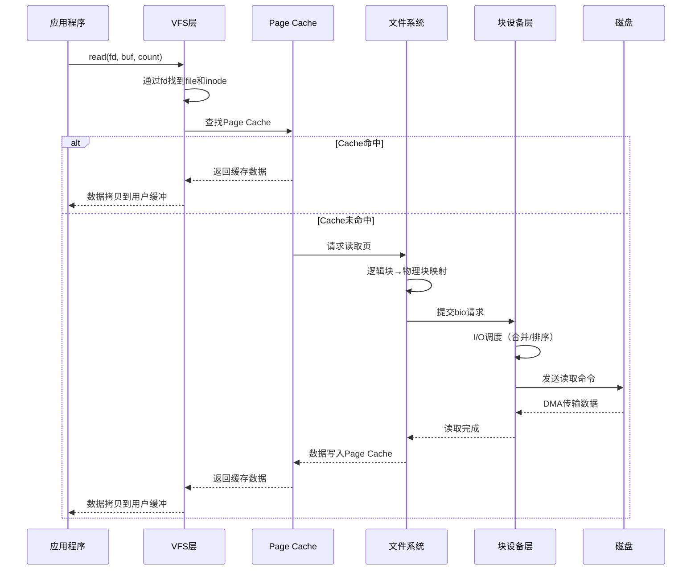

### 写IO详细流程

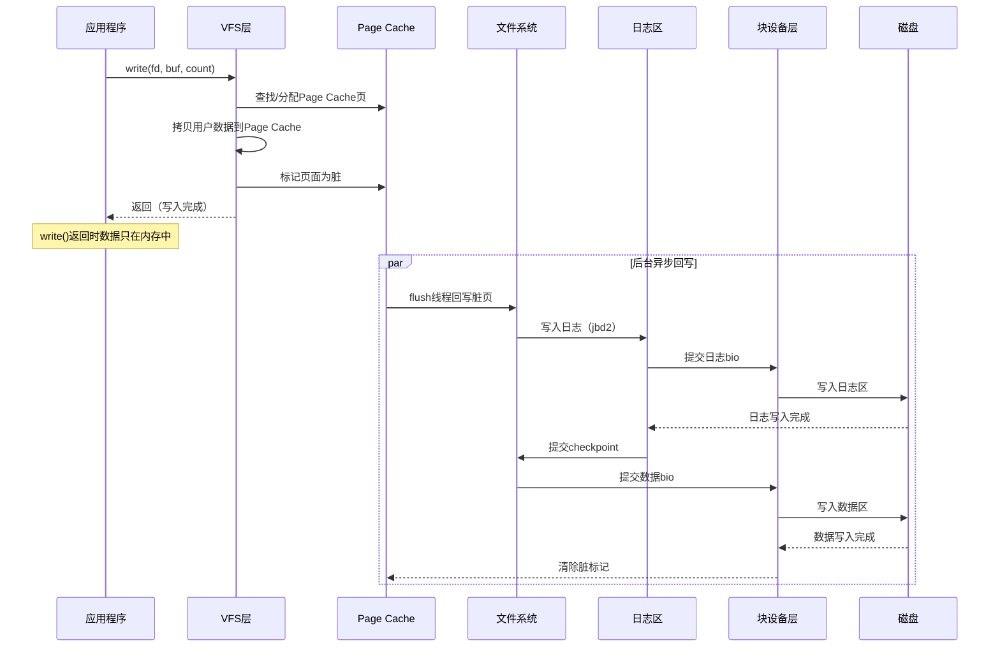

---

## io_uring

### 传统IO模型的局限

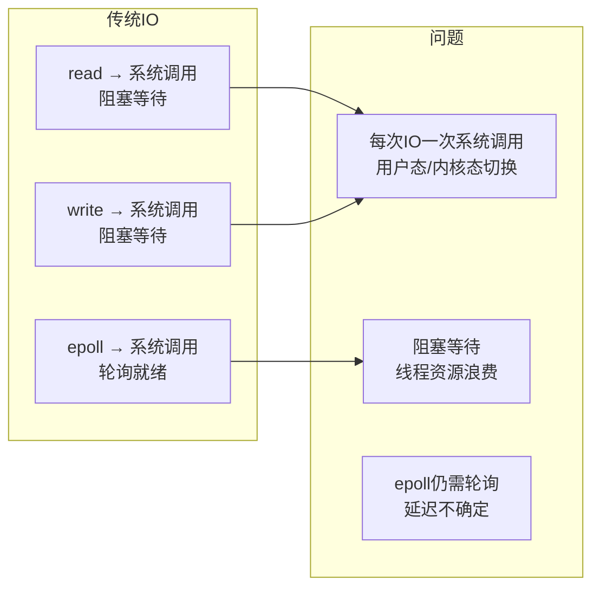

### io_uring 架构

io_uring是Linux 5.1引入的高性能异步IO框架，通过共享环形缓冲区减少系统调用：

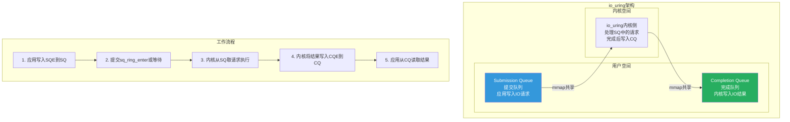

```
io_uring 的关键优化：

  1. 零拷贝共享内存：SQ/CQ通过mmap共享，无数据拷贝
  2. 批量提交：一次提交多个IO请求，减少系统调用
  3. 无锁设计：使用内存屏障代替锁
  4. 内核轮询：SQ_SQ_THREAD选项，内核线程轮询SQ
  5. 不需要epoll：IO完成直接通过CQ通知

  性能对比（随机读，4KB，NVMe SSD）：
   同步IO:     ~200K IOPS
    libaio:     ~500K IOPS
    io_uring:   ~800K IOPS（with SQPOLL）
```

### io_uring 编程接口

```c
// io_uring 基本使用（liburing）
#include <liburing.h>

int main() {
    struct io_uring ring;

    // 初始化io_uring实例
    io_uring_queue_init(256, &ring, 0);

    // 准备读操作
    struct io_uring_sqe *sqe = io_uring_get_sqe(&ring);
    io_uring_prep_read(sqe, fd, buf, count, offset);

    // 提交请求
    io_uring_submit(&ring);

    // 等待完成
    struct io_uring_cqe *cqe;
    io_uring_wait_cqe(&ring, &cqe);

    // 处理结果
    int ret = cqe->res;  // 读取字节数或错误码
    io_uring_cqe_seen(&ring, cqe);

    // 清理
    io_uring_queue_exit(&ring);
    return 0;
}
```

```bash
# 查看io_uring支持
cat /proc/sys/kernel/io_uring_disabled
# 0 = 启用, 1 = 禁用

# 调整io_uring限制
cat /proc/sys/fs/io_uring_max_pages    # 最大页面数
cat /proc/sys/fs/io_uring_max_entries  # 最大SQE数

# 使用fio测试io_uring性能
fio --name=test --ioengine=io_uring \
    --rw=randread --bs=4k --numjobs=1 \
    --size=1G --iodepth=64 \
    --sqthread_poll=1
```

::: important io_uring的适用场景
- **高性能存储**：NVMe SSD上的高并发IO
- **网络IO**：io_uring已支持socket操作
- **数据库**：替代libaio（MySQL/PostgreSQL已支持）
- **不适用**：普通文件的小量IO（系统调用开销可忽略）
:::

---

## 文件描述符与打开文件表

### 三级表结构

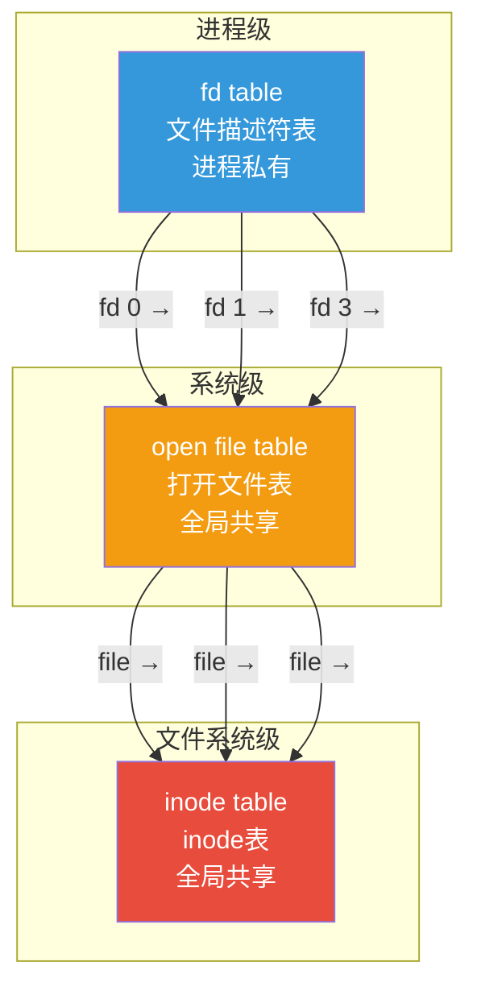

```
文件描述符表（per-process）：
  fd 0 → stdin  (file对象A)
  fd 1 → stdout (file对象B)
  fd 2 → stderr (file对象C)
  fd 3 → /etc/passwd (file对象D, offset=1024)
  fd 4 → /etc/passwd (file对象E, offset=0)   ← 同一文件不同打开实例
  fd 5 → /tmp/log (file对象F)

  关键：fd是进程私有的索引，指向全局的file对象

打开文件表（system-wide）：
  file对象D: inode=12345, offset=1024, flags=O_RDONLY
  file对象E: inode=12345, offset=0,    flags=O_WRONLY  ← 同一inode，不同offset
  file对象F: inode=67890, offset=4096, flags=O_RDWR

  关键：每个file对象独立维护offset和flags

inode表（system-wide）：
  inode 12345 → /etc/passwd (引用计数=2)
  inode 67890 → /tmp/log    (引用计数=1)
```

### dup 和 close-on-exec

```bash
# dup: 复制文件描述符，共享offset
# 两个fd指向同一个file对象
int new_fd = dup(old_fd);
int new_fd = dup2(old_fd, 5);  // 指定新fd号

# close-on-exec: exec时自动关闭fd
fcntl(fd, F_SETFD, FD_CLOEXEC);

# 查看进程的文件描述符
ls -la /proc/<pid>/fd/
# 0 -> /dev/pts/0
# 1 -> /dev/pts/0
# 2 -> /dev/pts/0
# 3 -> /etc/passwd
# 4 -> socket:[12345]

# 查看文件描述符限制
ulimit -n                    # 软限制
cat /proc/<pid>/limits | grep "open files"

# 调整限制
ulimit -n 65535
# /etc/security/limits.conf
# * soft nofile 65535
# * hard nofile 65535

# 系统级限制
cat /proc/sys/fs/file-max    # 系统最大文件描述符数
cat /proc/sys/fs/file-nr     # 已分配/未使用/最大值
```

---

## 文件系统实战调优

### 场景1：高并发Web服务器

```bash
# 1. 增大文件描述符限制
echo 65535 > /proc/sys/fs/file-max

# 2. 调整脏页回写
echo 5 > /proc/sys/vm/dirty_background_ratio
echo 10 > /proc/sys/vm/dirty_ratio

# 3. 选择合适的I/O调度器
cat /sys/block/sda/queue/scheduler
# [mq-deadline] none bfq
echo none > /sys/block/sda/queue/scheduler  # SSD推荐none

# 4. 调整readahead
blockdev --getra /dev/sda      # 查看预读值
blockdev --setra 4096 /dev/sda # 设置预读为2MB

# 5. 挂载选项优化
mount -o noatime,nodiratime /dev/sda1 /data
# noatime: 不更新访问时间，减少元数据写入
```

### 场景2：数据库存储优化

```bash
# 1. ext4挂载参数
mount -o data=writeback,noatime,barrier=1 /dev/sda1 /data

# 2. XFS挂载参数
mount -o noatime,logbufs=8,logbsize=256k /dev/sda1 /data

# 3. I/O调度器
# SSD: none (noop)
# HDD: deadline
echo deadline > /sys/block/sda/queue/scheduler

# 4. 禁用访问时间更新
# /etc/fstab: noatime,nodiratime

# 5. 调整文件系统保留空间
tune2fs -m 1 /dev/sda1  # ext4保留1%（默认5%）
```

### 场景3：文件系统性能测试

```bash
# 顺序读测试
dd if=/dev/zero of=/data/test bs=1M count=1024 oflag=dsync

# 随机读测试（fio）
fio --name=randread --ioengine=libaio --iodepth=32 \
    --rw=randread --bs=4k --direct=1 --size=1G \
    --numjobs=4 --runtime=60 --group_reporting

# 顺序写测试
fio --name=seqwrite --ioengine=libaio --iodepth=32 \
    --rw=write --bs=128k --direct=1 --size=1G

# 元数据性能测试
fstest       # 文件系统测试套件
fs_mark      # 小文件创建/删除性能
```

---

## 内核源码导读

### 关键源码路径

```
fs/
├── read_write.c        # read/write系统调用
├── open.c              # open/close系统调用
├── stat.c              # stat系统调用
├── dcache.c            # dentry缓存
├── inode.c             # inode管理
├── file_table.c        # 打开文件表
├── namei.c             # 路径查找（lookup_path）
├── buffer.c            # 块设备缓冲
├── direct-io.c         # 直接IO
├── drop_caches.c       # 缓存清理
├── ext4/               # ext4文件系统
│   ├── super.c         # 超级块操作
│   ├── inode.c         # inode操作
│   ├── extents.c       # Extent树
│   ├── jbd2/           # 日志系统
│   └── dir.c           # 目录操作
├── xfs/                # XFS文件系统
│   ├── xfs_mount.c     # 挂载操作
│   ├── xfs_alloc.c     # 空间分配
│   ├── xfs_btree.c     # B+树操作
│   └── xfs_log.c       # 日志系统
├── proc/               # /proc文件系统
├── sysfs/              # /sys文件系统
└── io_uring.c          # io_uring实现

mm/
├── filemap.c           # Page Cache管理
├── page-writeback.c    # 脏页回写
└── mmap.c              # mmap系统调用

block/
├── blk-core.c          # 块设备核心
├── blk-mq.c            # 多队列块设备
├── elevator.c          # I/O调度器框架
├── blk-integrity.c     # 数据完整性
└── deadline.c          # deadline调度器
```

### 路径查找流程

```mermaid
flowchart TD
    A[open "/home/user/file.txt"] --> B[从根dentry开始]
    B --> C[查找"home" dentry]
    C --> D{dcache命中?}
    D -->|是| E[获得"home" dentry]
    D -->|否| F[读取根inode的目录项]
    F --> G[创建"home" dentry]
    G --> E

    E --> H[查找"user" dentry]
    H --> I{dcache命中?}
    I -->|是| J[获得"user" dentry]
    I -->|否| K[读取home inode的目录项]
    K --> L[创建"user" dentry]
    L --> J

    J --> M[查找"file.txt" dentry]
    M --> N{dcache命中?}
    N -->|是| O[获得"file.txt" dentry]
    N -->|否| P[读取user inode的目录项]
    P --> Q[创建"file.txt" dentry]
    Q --> O

    O --> R[创建file对象]
    R --> S[分配文件描述符]
    S --> T[返回fd]

    style T fill:#27ae60,color:#fff
```

---

## 总结

```mermaid
flowchart TD
    subgraph Linux文件系统全景
        A[VFS<br/>统一抽象层] --> B[super_block<br/>文件系统元信息]
        A --> C[inode<br/>文件元数据]
        A --> D[dentry<br/>目录项缓存]
        A --> E[file<br/>打开文件实例]

        F[文件系统实现] --> G[ext4<br/>通用/小文件优化]
        F --> H[XFS<br/>大文件/高并发]
        F --> I[/proc /sys<br/>虚拟文件系统]

        J[IO路径] --> K[Page Cache<br/>读写缓存]
        J --> L[脏页回写<br/>flush/kworker]
        J --> M[io_uring<br/>高性能异步IO]

        N[存储层] --> O[块设备层<br/>I/O调度器]
        N --> P[磁盘驱动<br/>DMA传输]
    end
```

::: important 文件系统设计哲学
1. **分层抽象**：VFS统一接口，底层文件系统可插拔
2. **缓存为王**：Page Cache是性能的关键，几乎消除了重复读取的开销
3. **延迟写入**：write先写缓存，后台异步回写，减少IO次数
4. **日志保护**：通过日志保证崩溃一致性，而非完全同步写入
5. **懒分配**：文件数据按需分配物理块，不预分配
6. **批量操作**：io_uring批量提交、I/O调度器批量合并
:::

---

## 参考资料

- **《深入理解Linux内核》**（Understanding the Linux Kernel）- Daniel P. Bovet, Marco Cesati
- **《Linux内核设计与实现》**（Linux Kernel Development）- Robert Love
- **Linux内核源码**：`fs/` 目录
- [ext4数据结构文档](https://www.kernel.org/doc/html/latest/filesystems/ext4/index.html)
- [XFS文档](https://xfs.wiki.kernel.org/)
- [io_uring文档](https://www.kernel.org/doc/html/latest/io_uring.html)
- [VFS文档](https://www.kernel.org/doc/html/latest/filesystems/vfs.html)
