# 网络协议栈

::: important 核心问题
当你在浏览器输入一个URL并按下回车，数据包是如何从应用程序穿越内核协议栈、经过网卡到达远端服务器的？Linux网络协议栈是内核中最庞大、最复杂的子系统之一，它承载着互联网的每一比特流量。理解它的分层架构、核心数据结构和关键路径，是解决网络性能瓶颈和排查疑难问题的基石。
:::

## 从一次网页请求说起

想象你在浏览器访问 `https://example.com`，看似简单的操作背后，数据包经历了如下旅程：

```
应用层：浏览器构造HTTP请求
    ↓
Socket层：通过write()系统调用写入数据
    ↓
TCP层：封装TCP首部、管理连接状态、拥塞控制
    ↓
IP层：封装IP首部、路由查找、分片
    ↓
网卡驱动：封装以太网帧头、DMA传输
    ↓
物理链路：电信号/光信号传输
    ↓
...经过无数路由器转发...
    ↓
服务器网卡接收 → 驱动 → IP → TCP → Socket → 应用读取
```

这条路径上的每一层都有其精妙的设计。本文将从上到下，深入每一层的内核实现。

---

## 协议栈分层架构

Linux网络协议栈遵循经典的分层模型，但内核实现并非严格的ISO七层模型，而是采用更实用的四层架构：

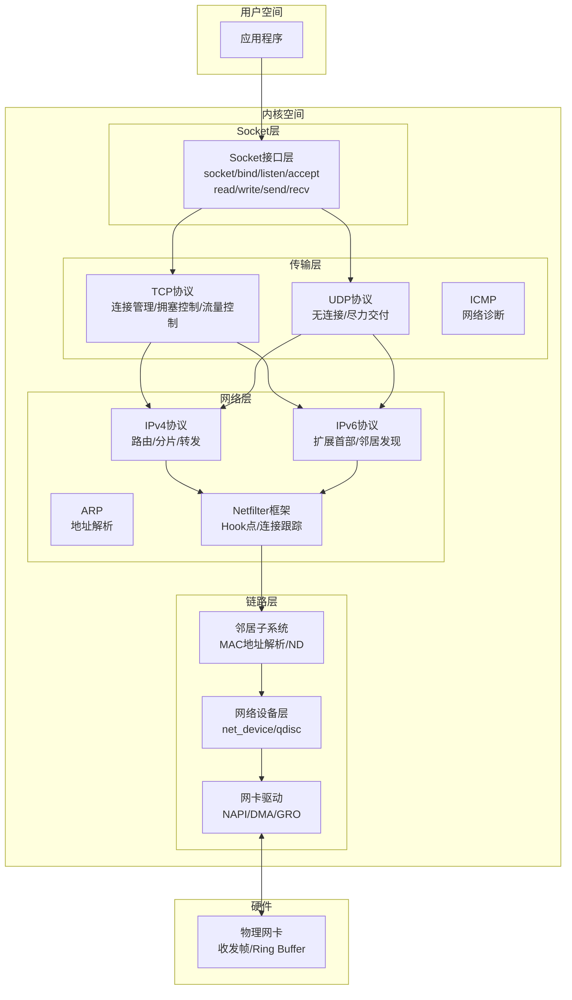

::: tip 分层的设计哲学
协议栈的分层不是简单的代码隔离，而是通过函数指针和回调机制实现的灵活协作。每一层只关心本层的协议逻辑，通过 `sk_buff` 的协议字段串联上下层。这种设计使得新增协议（如SCTP）或替换实现（如从iptables到nftables）变得可能。
:::

---

## sk_buff：网络子系统的灵魂

`sk_buff`（简称skb）是Linux网络子系统中最重要的数据结构。每一个网络数据包在内核中的存在形式就是一个skb。理解skb，就理解了网络子系统的半壁江山。

### 为什么需要sk_buff？

在最朴素的设计中，数据包只是一个内存缓冲区。但协议栈需要为数据包附加大量元信息：

```
朴素方案：每个包携带一个独立的元数据结构 + 一个数据缓冲区
    问题：
    ✗ 协议头逐层添加/移除时需要频繁拷贝数据
    ✗ 元数据与数据分离，缓存不友好
    ✗ 分片/合并操作复杂

sk_buff方案：元数据与数据指针封装在同一个结构中
    优势：
    ✓ 通过指针操作实现零拷贝的头部/尾部添加
    ✓ 元数据与数据紧密关联
    ✓ 统一的分片管理机制
```

### sk_buff 核心结构

```c
// include/linux/skbuff.h - 简化版
struct sk_buff {
    // ===== 四个关键指针 =====
    unsigned char *head;     // 缓冲区起始地址（已分配内存的起点）
    unsigned char *data;     // 数据起始地址（有效数据的起点）
    unsigned char *tail;     // 数据结束地址（有效数据的终点）
    unsigned char *end;      // 缓冲区结束地址（已分配内存的终点）

    // ===== 缓冲区长度信息 =====
    unsigned int len;        // 数据总长度（含所有分片）
    unsigned int data_len;   // 分片数据长度（非线性部分）
    unsigned int mac_len;    // MAC首部长度
    unsigned int hdr_len;    // 可克隆部分的首部长度

    // ===== 协议信息 =====
    __be16 protocol;         // 链路层协议类型
    __u8 pkt_type;           // 包类型（单播/广播/组播）
    __u8 ip_summed;          // 校验和策略

    // ===== 各层首部指针 =====
    __be16 inner_protocol;   // 隧道内层协议
    unsigned int headers_start;  // 首部区域起点
    unsigned int headers_end;    // 首部区域终点

    // 快速访问各层首部
    union {
        struct tcphdr *th;   // TCP首部
        struct udphdr *uh;   // UDP首部
        struct icmphdr *icmph; // ICMP首部
        struct iphdr *ipiph; // IP首部
        unsigned char *raw;  // 原始首部
    } h;  // 传输层首部

    union {
        struct iphdr *iph;   // IPv4首部
        struct ipv6hdr *ipv6h; // IPv6首部
        struct arphdr *arph;  // ARP首部
        unsigned char *raw;  // 原始首部
    } nh;  // 网络层首部

    union {
        unsigned char *raw;  // 链路层首部
    } mac;  // 链路层首部

    // ===== 路由与设备 =====
    struct net_device *dev;         // 接收/发送设备
    struct net_device *input_dev;   // 输入设备
    struct dst_entry *dst;          // 路由目的地
    char cb[48];                    // 控制块（各层私有数据）

    // ===== 分片管理 =====
    struct skb_shared_info *shinfo; // 共享信息（分片/引用计数）

    // ===== 链表管理 =====
    struct sk_buff *next;
    struct sk_buff *prev;

    // ===== 其他 =====
    __u32 priority;         // 包优先级/QoS类别
    __u32 mark;             // 包标记（用于策略路由等）
    __u16 queue_mapping;    // 队列映射（多队列网卡）
    __u8 cloned;            // 是否为克隆skb
    refcount_t users;       // 用户引用计数
};
```

### 四指针模型：零拷贝的秘密

`sk_buff` 的四个指针（head/data/tail/end）是其最精妙的设计，它使得协议头的添加和移除只需移动指针，而无需拷贝数据：

```
skb内存布局：

    head                              end
    ↓                                 ↓
    ┌──────┬──────────────┬───────────┐
    │ head │   payload    │   tail    │
    │ room │   (数据)     │   room   │
    └──────┴──────────────┴───────────┘
           ↑              ↑
          data           tail

    headroom: head到data之间的空间，用于添加协议头
    tailroom: tail到end之间的空间，用于添加协议尾
    payload:  data到tail之间的空间，有效数据

关键操作：
1. 添加TCP首部：skb_push(skb, tcp_hdr_len)
   → data指针前移，在headroom中"腾出"空间

2. 移除以太网帧头：skb_pull(skb, eth_hdr_len)
   → data指针后移，"跳过"以太网头

3. 添加以太网帧头：skb_push(skb, eth_hdr_len)
   → data指针前移

4. 追加数据：skb_put(skb, data_len)
   → tail指针后移，在tailroom中扩展数据
```

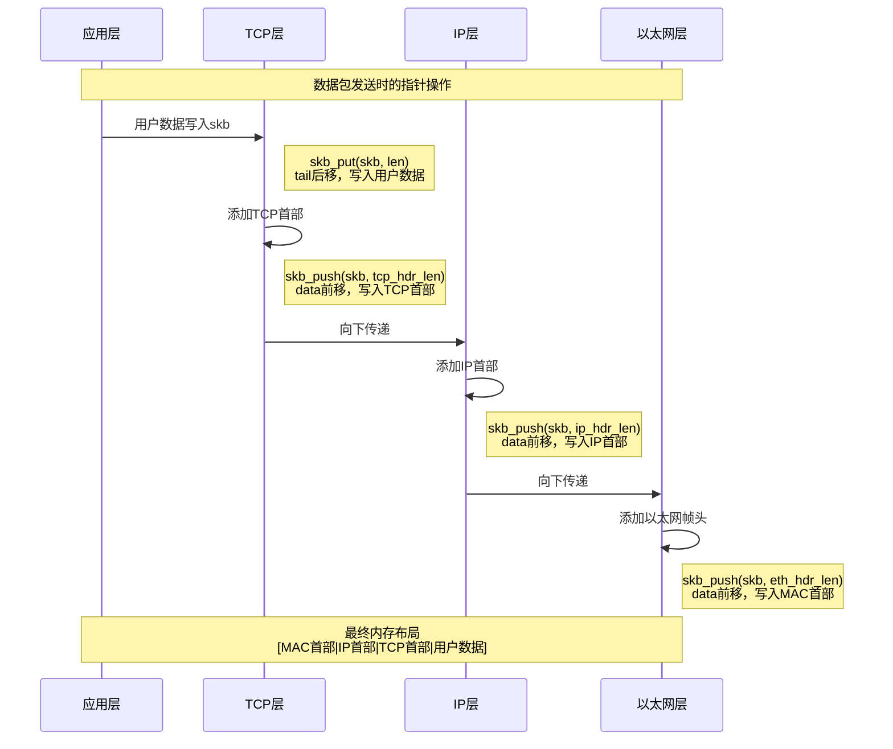

::: warning headroom的预留
skb在分配时，内核会预留足够的headroom（通常是 `MAX_HEADER` 大小，约256字节），以避免在添加协议头时重新分配内存。如果headroom不足，`skb_realloc_headroom()` 会被调用，这会触发一次数据拷贝，是性能损耗点。在高性能场景中，应确保skb分配时有足够的headroom。
:::

### skb_shared_info：分片与共享

当数据量较大需要分片，或skb需要被多个接收者共享时，`skb_shared_info` 结构登场：

```c
// include/linux/skbuff.h - 简化版
struct skb_shared_info {
    __u8 flags;                   // 标志位
    __u8 meta_len;                // 元数据长度
    __u8 nr_frags;                // 分片数量（非线性部分）
    __u8 tx_flags;                // 发送标志
    unsigned short gso_size;      // GSO分片大小
    unsigned short gso_segs;      // GSO段数
    unsigned short gso_type;      // GSO类型
    struct sk_buff *frag_list;    // 分片链表（skb链）
    struct bio_vec frags[MAX_SKB_FRAGS]; // 分片数组（页面引用）
    refcount_t dataref;           // 数据引用计数
    void *destructor_arg;         // 析构函数参数
};
```

分片的两种形式：

```
形式1：页面分片（frags数组）
┌──────────────────────────────────┐
│ sk_buff                          │
│  head ──→ [线性数据区]           │
│  end ──→ [线性数据区结束]        │
│  shinfo.nr_frags = 3             │
│  shinfo.frags[0] → page1+offset+len │
│  shinfo.frags[1] → page2+offset+len │
│  shinfo.frags[2] → page3+offset+len │
└──────────────────────────────────┘

形式2：skb链表分片（frag_list）
┌────────────┐     ┌────────────┐     ┌────────────┐
│ sk_buff 1  │────→│ sk_buff 2  │────→│ sk_buff 3  │
│ (主skb)    │     │ (分片1)    │     │ (分片2)    │
└────────────┘     └────────────┘     └────────────┘

len = 线性数据 + frags数据 + frag_list数据
data_len = frags数据 + frag_list数据（非线性部分）
```

::: tip skb_clone与skb_copy的区别
- `skb_clone()`：只克隆skb结构体本身，数据区共享。适用于需要独立修改元数据但共享数据的场景（如组播复制）。
- `skb_copy()`：完全拷贝，包括数据区。适用于需要修改数据内容的场景。

克隆时 `users` 计数加1，数据区共享时 `dataref` 计数加1。只有当两个计数都归零时，内存才会被释放。
:::

---

## TCP连接管理

TCP是互联网最核心的传输协议，Linux内核中的TCP实现超过10万行代码。本节聚焦连接管理和拥塞控制的内核实现。

### 三次握手的内核实现

TCP三次握手看似简单——SYN、SYN-ACK、ACK，但内核实现中涉及两个关键队列和复杂的状态管理。

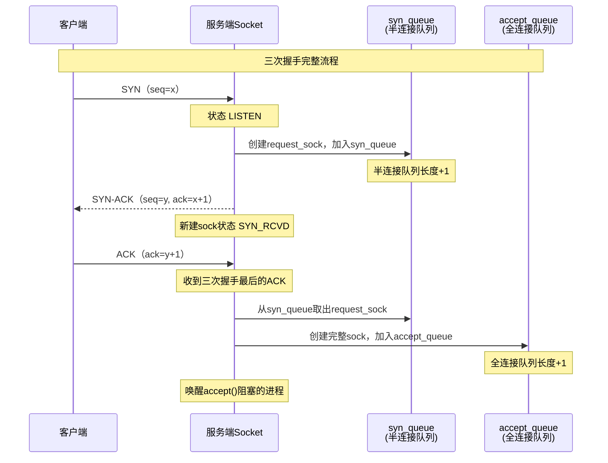

#### 两个关键队列

```c
// include/net/inet_connection_sock.h
struct inet_connection_sock {
    // ...
    struct request_sock_queue icsk_accept_queue; // 全连接队列
    // ...

    // 半连接队列相关
    struct listen_sock *icsk_listen_opt;
};

struct listen_sock {
    u8 max_qlen_log;           // 队列长度对数
    int qlen;                  // 当前半连接队列长度
    int qlen_young;            // 未重传SYN-ACK的连接数
    struct request_sock *syn_table[0]; // 哈希表（半连接队列）
};

struct request_sock_queue {
    struct request_sock *rskq_accept_head;  // 全连接队列头
    struct request_sock *rskq_accept_tail;  // 全连接队列尾
    // ...
};
```

::: important 两个队列的区别与调优
- **syn_queue（半连接队列）**：存储收到SYN但尚未完成三次握手的连接。大小由 `tcp_max_syn_backlog` 控制（默认1024）。当队列满时，新的SYN会被丢弃（不发送RST），客户端会超时重传。
- **accept_queue（全连接队列）**：存储已完成三次握手但尚未被应用accept()的连接。大小为 `min(backlog, somaxconn)`，其中backlog是listen()调用参数，somaxconn是系统限制（默认4096）。

当全连接队列满时，内核行为由 `tcp_abort_on_overflow` 控制：
- 0（默认）：丢弃ACK，等待客户端重传
- 1：发送RST，立即断开
:::

#### 三次握手的内核代码路径

```
客户端主动连接：
  connect()
    → __inet_stream_connect()
      → tcp_v4_connect()           // 构造SYN，发送
        → tcp_connect()            // 初始化seq，设置TCP_SYN_SENT
          → tcp_transmit_skb()     // 发送SYN包

服务端被动打开：
  listen()
    → inet_listen()
      → inet_csk_listen_start()
        → 初始化icsk_accept_queue和icsk_listen_opt

  收到SYN（中断上下文）：
    → tcp_v4_rcv()
      → tcp_v4_do_rcv()
        → tcp_rcv_state_process()
          → tcp_v4_conn_request()  // 创建request_sock
            → inet_csk_reqsk_queue_hash_add()  // 加入syn_queue
            → tcp_v4_send_synack() // 发送SYN-ACK

  收到ACK（完成握手）：
    → tcp_v4_rcv()
      → tcp_check_req()           // 查找syn_queue中的request_sock
        → tcp_v4_syn_recv_sock()  // 创建完整sock
          → inet_csk_reqsk_queue_add()  // 移入accept_queue

  应用accept()：
    → inet_accept()
      → inet_csk_accept()
        → 从accept_queue取出sock返回
```

### SYN Flood防御：SYN Cookie

SYN Flood攻击的原理是发送大量伪造源IP的SYN包，填满syn_queue，使正常连接无法建立。SYN Cookie是一种不占用队列的防御机制：

```
正常模式：
  收到SYN → 分配request_sock → 加入syn_queue → 发送SYN-ACK
  问题：攻击时syn_queue被填满，内存耗尽

SYN Cookie模式（tcp_syncookies=1）：
  收到SYN → 不分配request_sock → 计算cookie值
         → cookie编码在SYN-ACK的seq中
         → 收到ACK时，从ack-1反算出cookie
         → 验证通过才创建sock

  cookie = M + H(src_ip, dst_ip, src_port, dst_port, M, secret)
  其中M是时间戳（每64秒递增），H是哈希函数
```

::: warning SYN Cookie的代价
SYN Cookie模式下无法使用TCP扩展选项（如Window Scale、SACK、Timestamp），因为这些信息在半连接队列中保存，而Cookie模式不保存任何状态。这可能导致已建立连接的性能下降。因此SYN Cookie应作为最后的防线，而非默认方案。更好的做法是增大 `tcp_max_syn_backlog`、开启 `tcp_syncookies=2`（仅在队列满时启用）。
:::

### 四次挥手与TIME_WAIT

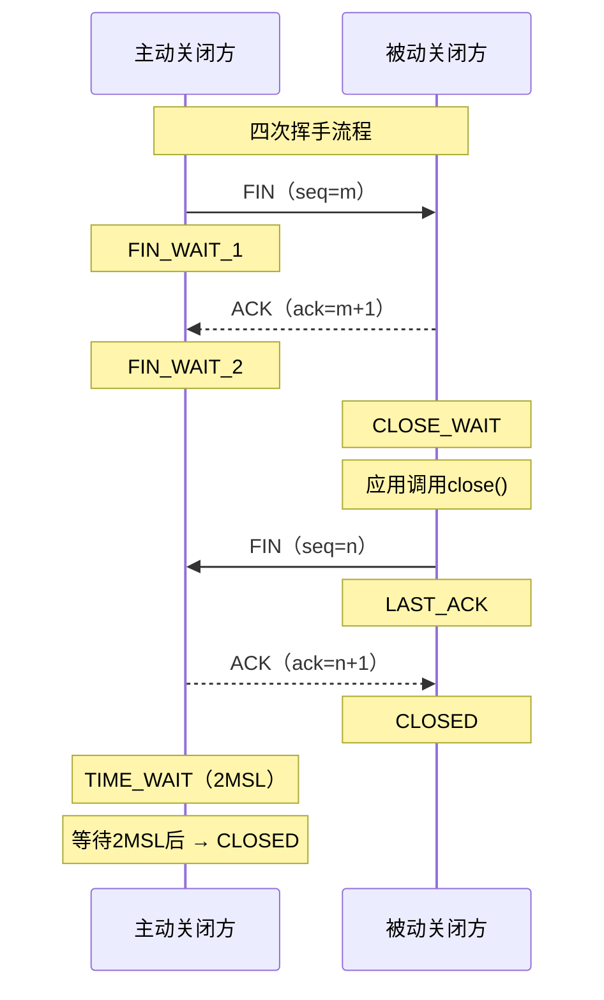

#### TIME_WAIT的作用

```
TIME_WAIT持续2MSL（Maximum Segment Lifetime）的原因：

1. 确保最后的ACK能到达被动方
   如果ACK丢失，被动方会重传FIN，主动方可以重传ACK
   如果直接CLOSED，收到重传FIN时会发RST，导致被动方出错

2. 等待网络中残留的延迟报文消亡
   避免新连接收到旧连接的延迟数据

   场景举例：
   连接1: A:5000 → B:80  (seq=1000)
   连接1关闭后立即复用相同四元组：
   连接2: A:5000 → B:80  (seq=100)
   如果连接1的延迟包到达，seq=1000可能被连接2误接受
```

#### TIME_WAIT的内核实现

```c
// TIME_WAIT状态的sock不使用完整的struct sock
// 而是使用更轻量的struct inet_timewait_sock
struct inet_timewait_sock {
    struct sock_common __tw_common;  // 公共部分
    int tw_timeout;                  // 超时时间（以jiffies为单位）
    struct inet_bind_bucket *tw_tb;  // 绑定桶（端口占用信息）
};
```

::: important TIME_WAIT优化参数
- `tcp_tw_reuse=1`：允许将TIME_WAIT状态的连接用于新的出站连接（仅对客户端有效）。通过Timestamp选项验证延迟报文。
- `tcp_tw_recycle=1`（已废弃，Linux 4.12移除）：快速回收TIME_WAIT连接。因在NAT环境下会导致连接失败而被移除。
- `tcp_max_tw_buckets`：TIME_WAIT桶的最大数量（默认32768），超出后直接关闭连接。
- `tcp_fin_timeout`：FIN_WAIT_2状态超时时间（默认60秒）。

::: warning 生产环境建议
**绝不推荐**通过调低 `tcp_fin_timeout` 或设置 `tcp_tw_recycle` 来"解决"TIME_WAIT过多的问题。正确做法：
1. 使用长连接（连接池），减少短连接
2. 客户端开启 `tcp_tw_reuse=1`
3. 服务端通过 `SO_REUSEADDR` 允许地址复用
4. 增大客户端可用端口范围 `ip_local_port_range`
:::

### TCP拥塞控制

拥塞控制是TCP最核心的算法之一，它决定了数据发送的速率，直接影响网络吞吐量和公平性。

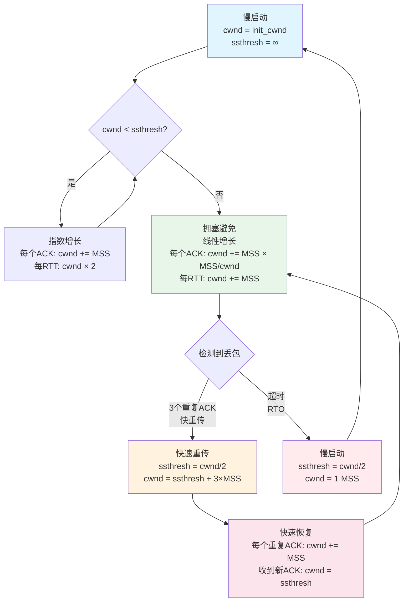

#### 慢启动（Slow Start）

```
慢启动不是"慢"，而是"从慢开始，指数增长"：

RTT 0: cwnd = 10 (init_cwnd)
RTT 1: cwnd = 20  (收到10个ACK，每个+MSS)
RTT 2: cwnd = 40
RTT 3: cwnd = 80
RTT 4: cwnd = 160
...

增长速度极快！在带宽1Gbps、RTT=10ms的链路上：
  4个RTT（40ms）即可填满管道（假设无丢包）

Linux初始拥塞窗口（init_cwnd）的演进：
  2.6.39之前：3 MSS（RFC 3390）
  2.6.39之后：10 MSS（Google建议，RFC 6928）
```

#### 拥塞避免（Congestion Avoidance）

```
当cwnd >= ssthresh时，从指数增长切换到线性增长：

每个ACK: cwnd += MSS × MSS / cwnd
每RTT:   cwnd += MSS

这是一种AIMD（Additive Increase Multiplicative Decrease）策略：
- 加性增：线性探测可用带宽
- 乘性减：丢包时窗口减半

AIMD保证了：
1. 收敛性：多个TCP流最终会公平共享带宽
2. 稳定性：不会持续震荡
```

#### 快速重传与快速恢复（Fast Retransmit & Fast Recovery）

```c
// net/ipv4/tcp_input.c - 简化逻辑
// 收到3个重复ACK时触发快速重传
static void tcp_fastretrans_alert(struct sock *sk)
{
    struct tcp_sock *tp = tcp_sk(sk);

    // 快速重传
    tp->ssthresh = tcp_current_ssthresh(sk);  // 保存当前阈值
    tp->ssthresh = max(tp->snd_cwnd >> 1, 2); // ssthresh = cwnd/2
    tp->snd_cwnd = tp->ssthresh + 3;          // cwnd = ssthresh + 3

    // 重传丢失的段
    tcp_retransmit_skb(sk, tcp_write_queue_head(sk));

    // 进入快速恢复
    tp->snd_cwnd_cnt = 0;
    tcp_enter_recovery(sk);
}

// 快速恢复中收到重复ACK
// 每个重复ACK说明有一个包离开了网络
// cwnd += MSS（允许发送新数据）
static void tcp_process_tse_ack(struct sock *sk, u32 prior_snd_una)
{
    struct tcp_sock *tp = tcp_sk(sk);
    tp->snd_cwnd++;  // 每个重复ACK加1
}

// 收到新ACK，退出快速恢复
// cwnd = ssthresh（恢复到拥塞避免状态）
static void tcp_complete_cwr(struct sock *sk)
{
    struct tcp_sock *tp = tcp_sk(sk);
    tp->snd_cwnd = tp->ssthresh;
}
```

#### 内核支持的拥塞控制算法

```bash
# 查看可用算法
sysctl net.ipv4.tcp_available_congestion_control
# 输出: cubic reno bbr

# 查看当前算法
sysctl net.ipv4.tcp_congestion_control
# 输出: cubic

# 切换算法
sysctl -w net.ipv4.tcp_congestion_control=bbr
```

| 算法 | 特点 | 适用场景 |
|------|------|---------|
| Reno | 经典AIMD，丢包即减窗 | 短距离、低延迟 |
| Cubic | 默认算法，W(t)=0.4×(t-0.4)³+wmax | 长肥网络（高BDP） |
| BBR | 基于带宽和RTT模型，不以丢包为信号 | 高丢包率、深队列 |
| DCTCP | 基于ECN的拥塞控制 | 数据中心内部 |

::: tip BBR vs Cubic
Cubic以丢包为拥塞信号，在无线网络（随机丢包）或深队列网络中性能不佳。BBR通过测量实际带宽和RTT来控制发送速率，不再依赖丢包判断拥塞。在YouTube的部署中，BBR将吞吐量提升了4-100倍。但BBR在Bufferbloat环境下可能过于激进，需要根据场景选择。
:::

---

## Netfilter框架

Netfilter是Linux内核的网络包过滤框架，是防火墙、NAT、负载均衡等功能的基石。iptables和nftables都是基于Netfilter构建的用户态工具。

### 五个Hook点

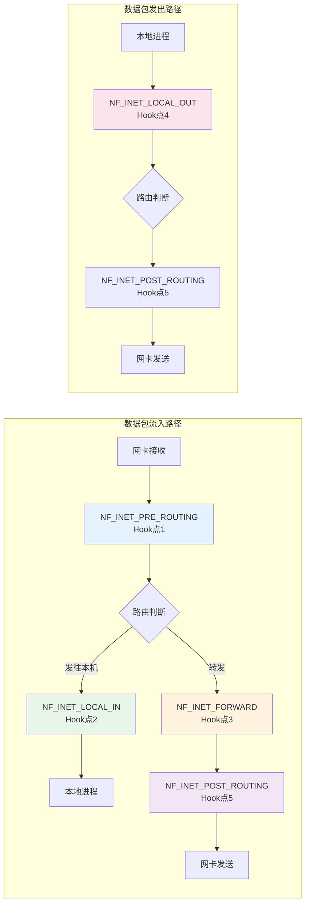

五个Hook点详解：

| Hook点 | 位置 | 触发时机 | 典型用途 |
|--------|------|---------|---------|
| `NF_INET_PRE_ROUTING` | 路由之前 | 所有进入的数据包（包括转发包） | DNAT、早期过滤、连接跟踪 |
| `NF_INET_LOCAL_IN` | 路由之后 | 发往本机的包 | 入站过滤、安全策略 |
| `NF_INET_FORWARD` | 转发路径 | 经本机转发的包 | 转发过滤、NAT |
| `NF_INET_LOCAL_OUT` | 路由之前 | 本机发出的包 | 出站过滤、SNAT |
| `NF_INET_POST_ROUTING` | 路由之后 | 所有发出的数据包（包括转发包） | SNAT（源地址转换）、MASQUERADE |

### Hook注册与回调

```c
// net/netfilter/core.c
// 注册Hook回调函数
int nf_register_net_hook(struct net *net, const struct nf_hook_ops *reg);

struct nf_hook_ops {
    nf_hookfn *hook;          // 回调函数
    struct net_device *dev;   // 关联的网卡（NULL表示所有）
    void *priv;               // 私有数据
    u_int8_t pf;              // 协议族（NFPROTO_IPV4等）
    unsigned int hooknum;     // Hook点编号
    int priority;             // 优先级（越小越先执行）
};

// 回调函数的返回值决定包的命运
#define NF_DROP   0  // 丢弃数据包
#define NF_ACCEPT 1  // 继续正常处理
#define NF_STOLEN 2  // 包被接管（不再继续处理）
#define NF_QUEUE  3  // 将包送入用户空间处理
#define NF_REPEAT 4  // 重新调用当前Hook
```

### iptables规则匹配流程

```
iptables规则组织结构：

  Table（表）
    ├── Chain（链）—— 对应Netfilter Hook点
    │     ├── Rule 1（规则）
    │     │     ├── Match条件（-s/-d/-p/--dport等）
    │     │     └── Target动作（ACCEPT/DROP/REJECT/DNAT/SNAT等）
    │     ├── Rule 2
    │     └── Rule 3
    └── Chain
          └── ...

五个内置表：
  filter  — 过滤（INPUT/FORWARD/OUTPUT）
  nat     — 地址转换（PREROUTING/OUTPUT/POSTROUTING/INPUT）
  mangle  — 修改包头（所有5个链）
  raw     — 连接跟踪豁免（PREROUTING/OUTPUT）
  security — SELinux安全标记
```

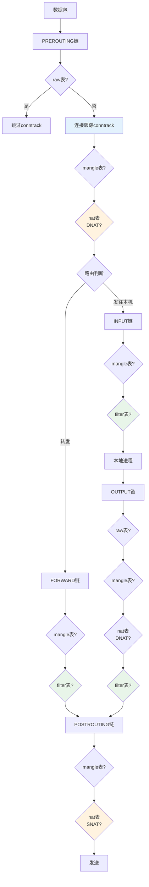

### nftables：iptables的继任者

```
iptables的问题：
  ✗ 规则线性匹配，O(n)复杂度
  ✗ 每条规则独立，无法批量操作
  ✗ 多表多链，配置复杂
  ✗ 扩展需要内核模块

nftables的改进：
  ✓ 支持集合和字典，O(1)查找
  ✓ 统一的语法，不再区分表/链
  ✓ 字节码虚拟机，灵活的表达式
  ✓ 原子操作，无中间状态

nftables示例：
  # 定义集合
  nft add set inet filter blackhole { type ipv4_addr\; flags interval\; }
  nft add element inet filter blackhole { 192.168.1.0/24 }

  # 使用集合匹配（O(1)查找）
  nft add rule inet filter input ip saddr @blackhole drop

  # 等效的iptables命令（O(n)匹配）
  iptables -A INPUT -s 192.168.1.0/24 -j DROP
```

---

## 连接跟踪conntrack

conntrack是Netfilter框架的核心子系统，它跟踪所有网络连接的状态，为NAT和状态防火墙提供基础。

### conntrack核心概念

```c
// include/uapi/linux/netfilter/nf_conntrack_common.h
// 连接状态枚举
enum ip_conntrack_status {
    IPS_EXPECTED     = (1 << 0),  // 预期连接
    IPS_SEEN_REPLY   = (1 << 1),  // 已看到双向流量
    IPS_ASSURED      = (1 << 2),  // 连接已确认（不会被提前回收）
    IPS_SRC_NAT      = (1 << 3),  // 源NAT
    IPS_DST_NAT      = (1 << 4),  // 目的NAT
    IPS_SEQ_ADJUST   = (1 << 5),  // 序列号调整
    IPS_SRC_NAT_DONE = (1 << 6),  // 源NAT完成
    IPS_DST_NAT_DONE = (1 << 7),  // 目的NAT完成
    IPS_DYING        = (1 << 8),  // 正在销毁
    IPS_FIXED_TIMEOUT= (1 << 9),  // 固定超时
};

// 连接跟踪条目
struct nf_conn {
    struct nf_conntrack ct_general;  // 引用计数
    struct nf_conntrack_zone zone;   // 命名空间/区域
    struct hlist_node tuplehash[IP_CT_DIR_MAX]; // 哈希表节点
    unsigned long status;            // 连接状态位图
    unsigned long timeout;           // 超时时间
    struct nf_conntrack_tuple_hash tuplehash[IP_CT_DIR_MAX]; // 正反向元组
    // 协议私有数据
    union nf_conntrack_proto proto;
};
```

### Tuple：连接的唯一标识

```c
// 连接元组——唯一标识一个连接方向
struct nf_conntrack_tuple {
    struct nf_conntrack_man src;   // 源地址信息
    struct {
        union nf_inet_addr u3;     // 目的IP地址
        __be16 all;                // 目的端口/ICMP ID等
    } dst;
    u_int16_t protonum;            // 协议号（IPPROTO_TCP等）
};

struct nf_conntrack_man {
    union nf_inet_addr u3;         // 源IP地址
    union nf_conntrack_man_proto u; // 源端口
    u_int16_t l3num;               // 网络层协议号
};
```

```
一个TCP连接的Tuple示例：
  源: 192.168.1.100:54321
  目: 10.0.0.1:80
  协议: TCP

每个连接有正向和反向两个Tuple：
  正向: {src=192.168.1.100:54321, dst=10.0.0.1:80, proto=TCP}
  反向: {src=10.0.0.1:80, dst=192.168.1.100:54321, proto=TCP}

哈希查找：
  hash = hashfn(tuple)
  → 在htable[hash]链表中查找匹配的tuple
```

### conntrack状态机

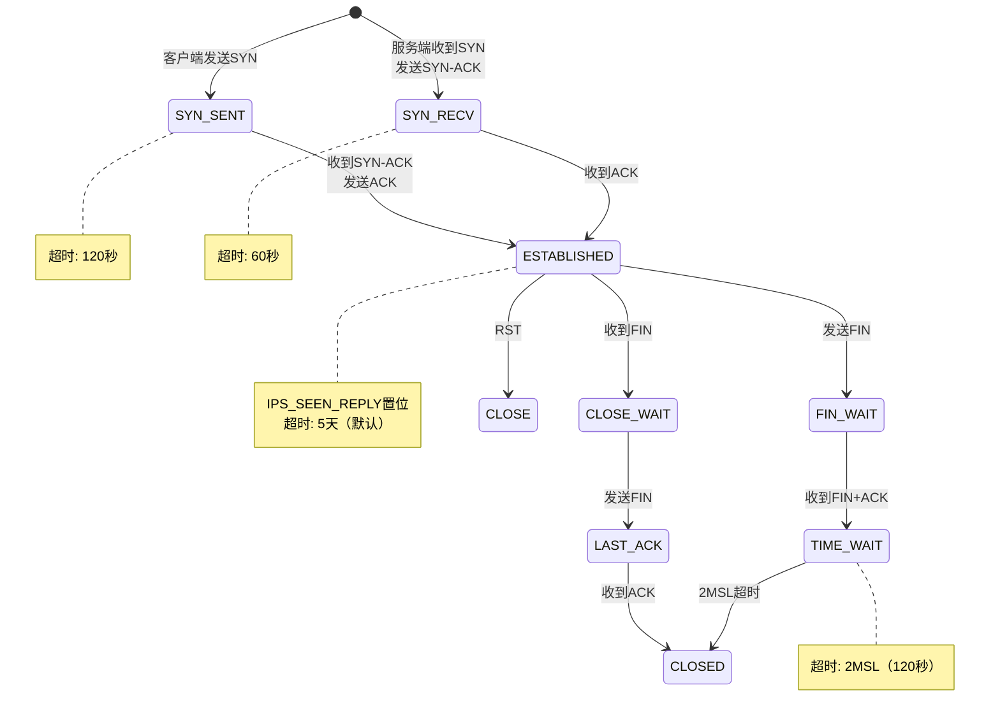

### conntrack性能调优

```bash
# 查看当前连接跟踪数
cat /proc/sys/net/netfilter/nf_conntrack_count

# 最大跟踪条目数（默认65536，高流量服务器需要调大）
sysctl net.netfilter.nf_conntrack_max
# 建议: 内存充裕时设置为 262144 或更大

# 各状态超时时间
sysctl net.netfilter.nf_conntrack_tcp_timeout_established
# 默认432000秒（5天），建议缩短到3600秒（1小时）

sysctl net.netfilter.nf_conntrack_tcp_timeout_time_wait
# 默认120秒

sysctl net.netfilter.nf_conntrack_tcp_timeout_close_wait
# 默认60秒

# 哈希表大小（应为conntrack_max的1/4到1/8）
sysctl net.netfilter.nf_conntrack_buckets
# 注意：此参数需要模块加载时设置，运行时不可修改
```

::: warning conntrack表满的后果
当 `nf_conntrack_count` 达到 `nf_conntrack_max` 时，新连接会被拒绝，内核日志中出现：
```
nf_conntrack: table full, dropping packet
```
此时所有新连接都无法建立，表现为网络中断。解决方案：
1. 增大 `nf_conntrack_max`
2. 缩短 `tcp_timeout_established`
3. 使用raw表的NOTRACK跳过不需要跟踪的流量
4. 考虑完全禁用conntrack（如果不需要NAT/状态防火墙）
:::

---

## 路由查找

路由查找是网络层最频繁的操作，每个数据包的转发都需要查路由表。Linux内核实现了高效的路由查找机制。

### FIB（Forwarding Information Base）

```c
// include/net/ip_fib.h
struct fib_table {
    struct hlist_node hlist;      // 哈希链表节点
    unsigned int tb_id;           // 路由表ID
    u32 tb_num_default;           // 默认路由数
    struct rcu_head rcu;
    unsigned long *tb_data;       // 路由数据（trie结构）
    unsigned int tb_seq;          // 序列号
};
```

#### 路由查找算法：LC-Trie

```
Linux使用LC-Trie（Level Compressed Trie）进行路由查找：

传统Trie（每个bit一级）：
  查找192.168.1.0/24需要24次比较

LC-Trie（路径压缩）：
  合并单分支路径，减少比较次数
  查找192.168.1.0/24可能只需3-4次比较

  示例（简化）：
                ┌──────────┐
                │ prefix=0 │
                │ bits=0   │
                └─────┬────┘
           ┌──────────┴──────────┐
      ┌────┴────┐          ┌─────┴────┐
      │10.0.0.0 │          │192.168   │
      │/8       │          │/16       │
      └────┬────┘          └─────┬────┘
           │               ┌─────┼──────┐
      ┌────┴────┐    ┌─────┴──┐  ┌──────┴──┐
      │10.0.1.0 │    │.1.0/24 │  │.2.0/24  │
      │/24      │    └────────┘  └─────────┘
      └─────────┘

  查找192.168.1.100：
    第1跳: 匹配192.168/16 → 跳到子trie
    第2跳: 匹配192.168.1/24 → 找到路由
```

### 路由缓存

```c
// 内核使用dst_entry作为路由缓存
struct dst_entry {
    struct net_device *dev;       // 出口设备
    struct dst_ops *ops;          // 操作函数表
    u32 metrics[RTAX_MAX];       // 路径MTU等度量值
    int error;                    // 错误码
    unsigned int flags;           // 标志
    unsigned long expires;        // 过期时间
    struct dst_entry *path;       // 路径
    __u32 tclassid;              // 流量类别
    int (*input)(struct sk_buff *);   // 输入函数
    int (*output)(struct sk_buff *);  // 输出函数
};
```

```
路由缓存查找流程：
1. 计算hash = hash(src_ip, dst_ip, iif, mark)
2. 在路由缓存哈希表中查找
3. 命中 → 直接使用dst_entry
4. 未命中 → 进行FIB查找，结果缓存

注意：Linux 3.6移除了IPv4路由缓存（因为hash碰撞导致DDoS）
     现在每次都查FIB，但LC-Trie查找本身很快（O(W)，W=地址长度）
```

### 策略路由

```
普通路由：仅根据目的地址查找
策略路由：根据源地址、入接口、TOS、fwmark等多维度查找

路由策略数据库（RPDB）：
  规则优先级: 0 ~ 32767（越小越优先）

  默认规则：
  32766: from all lookup main        → 查主路由表
  32767: from all lookup default     → 查默认路由表

  自定义规则示例：
  # 来自192.168.1.0/24的流量查路由表100
  ip rule add from 192.168.1.0/24 table 100

  # fwmark为0x1的流量查路由表200
  ip rule add fwmark 0x1 table 200

  # 来自eth0的流量查路由表300
  ip rule add iif eth0 table 300

  # 路由表100中的路由
  ip route add default via 10.0.1.1 table 100
  ip route add 10.0.0.0/8 via 10.0.1.2 table 100

RPDB查找流程：
  for each rule in rules (按优先级排序):
      if rule.match(packet):
          lookup route in rule.table
          if found: return route
  return: network unreachable
```

::: tip 策略路由的典型应用
- **多ISP负载均衡**：根据源地址选择不同出口
- **VPN分流**：特定流量走VPN隧道，其余走默认路由
- **容器网络**：不同容器的流量走不同路由表
- **QoS**：根据TOS字段选择不同质量的路由
:::

---

## 网卡收发包流程

网卡收发包是数据进出内核的物理通道，其效率直接影响整体网络性能。

### 完整收发流程

```mermaid
flowchart TB
    subgraph 发送路径
        APP_S[应用: send/write] --> SYSCALL_S[系统调用]
        SYSCALL_S --> SOCK_S[Socket层: 构造skb]
        SOCK_S --> TCP_S[TCP层: 拥塞控制/分段]
        TCP_S --> IP_S[IP层: 路由查找/封装]
        IP_S --> NF_OUT[Netfilter LOCAL_OUT Hook]
        NF_OUT --> NEIGH_S[邻居子系统: ARP解析]
        NEIGH_S --> DEV_S[net_device: 选择队列]
        DEV_S --> QDISC_S[qdisc: 排队调度]
        QDISC_S --> DRV_S[驱动: DMA映射]
        DRV_S --> NIC_S[网卡: 发送帧]
    end

    subgraph 接收路径
        NIC_R[网卡: 接收帧] --> DMA_R[DMA写入Ring Buffer]
        DMA_R --> IRQ[硬中断: IRQ]
        IRQ --> NAPI[NAPI轮询: 软中断]
        NAPI --> GRO[GRO: 聚合包]
        GRO --> DRV_R[驱动: 构造skb]
        DRV_R --> NET_RX[netif_receive_skb]
        NET_RX --> NF_PRE[Netfilter PRE_ROUTING Hook]
        NF_PRE --> ROUTE_R[路由判断]
        ROUTE_R -->|本机| NF_IN[Netfilter LOCAL_IN Hook]
        NF_IN --> IP_R[IP层: 重组/校验]
        IP_R --> TCP_R[TCP层: 确认/排序]
        TCP_R --> SOCK_R[Socket层: 写入接收缓冲区]
        SOCK_R --> APP_R[应用: recv/read]
        ROUTE_R -->|转发| NF_FWD[Netfilter FORWARD Hook]
        NF_FWD --> NF_POST[Netfilter POST_ROUTING Hook]
        NF_POST --> DEV_S2[发送路径]
    end

    style IRQ fill:#ffebee
    style NAPI fill:#e8f5e9
    style NF_PRE fill:#e3f2fd
    style NF_IN fill:#e8f5e9
    style NF_OUT fill:#fce4ec
    style NF_FWD fill:#fff3e0
    style NF_POST fill:#f3e5f5
```

### 中断与NAPI

```
传统中断模式的问题：
  每个包一次中断 → 高速流量下中断风暴 → CPU被中断占满 → 系统卡死

  1Gbps, 平均包长500字节:
  每秒包数 = 1,000,000,000 / (500 × 8) = 250,000 pps
  每秒中断 250,000 次 → CPU根本处理不过来

NAPI（New API）的解决方案：
  混合模式：中断 + 轮询

  1. 初始状态：网卡中断开启
  2. 收到第一个包 → 触发硬中断
  3. 在硬中断处理函数中：
     → 禁用网卡中断
     → 将设备加入NAPI轮询列表
     → 触发软中断（NET_RX_SOFTIRQ）
  4. 软中断处理函数中：
     → 轮询网卡，批量收取数据包
     → 每次轮询有budget限制（默认300包）
     → 收完或达到budget → 重新开启网卡中断
```

```c
// NAPI轮询的核心结构
struct napi_struct {
    struct list_head poll_list;   // 轮询链表节点
    unsigned int state;           // 状态标志
    int weight;                   // 每次轮询的预算
    int (*poll)(struct napi_struct *, int); // 轮询函数
    // ...
};

// 驱动注册NAPI
netif_napi_add(dev, &priv->napi, my_poll, 64);
// weight=64表示每次poll最多处理64个包

// 硬中断处理（简化）
static irqreturn_t my_interrupt(int irq, void *dev_id)
{
    struct my_priv *priv = dev_id;
    // 禁用中断，调度NAPI
    napi_schedule(&priv->napi);
    return IRQ_HANDLED;
}

// NAPI轮询函数（简化）
static int my_poll(struct napi_struct *napi, int budget)
{
    int work_done = 0;
    while (work_done < budget) {
        struct sk_buff *skb = receive_packet();
        if (!skb) break;
        netif_receive_skb(skb);
        work_done++;
    }
    if (work_done < budget)
        napi_complete_done(napi, work_done); // 重新启用中断
    return work_done;
}
```

### Ring Buffer

```
网卡和驱动之间通过Ring Buffer交换数据：

接收Ring Buffer：
  ┌───────────────────────────────────────┐
  │ rx_ring[0]: skb → DMA映射的缓冲区     │
  │ rx_ring[1]: skb → DMA映射的缓冲区     │
  │ rx_ring[2]: skb → DMA映射的缓冲区     │
  │ ...                                    │
  │ rx_ring[N]: skb → DMA映射的缓冲区     │
  └───────────────────────────────────────┘
  驱动维护: next_to_use (驱动填充位置)
  网卡维护: next_to_clean (网卡处理位置)

  流程：
  1. 驱动分配skb，DMA映射，填入rx_ring[next_to_use]
  2. 网卡收到帧，DMA写入skb缓冲区
  3. 网卡更新next_to_clean，触发中断
  4. 驱动取出skb，处理数据，重新分配skb填入

  查看Ring Buffer大小：
  ethtool -g eth0

  调整Ring Buffer大小：
  ethtool -G eth0 rx 4096 tx 4096
```

### GRO（Generic Receive Offload）

```
GRO原理：在软件层面将多个小包聚合成大包，减少协议栈处理次数

  没有GRO：
  网卡收到1000个小包（每个1460字节）
  → 1000次协议栈处理
  → 1000次skb分配

  有GRO：
  网卡收到1000个小包
  → GRO聚合为几个大skb（每个约64KB）
  → 几次协议栈处理
  → 大幅减少CPU开销

  GRO匹配条件（必须完全相同才合并）：
  - 相同的源/目的IP
  - 相同的源/目的端口
  - 相同的TCP序列号连续
  - 相同的TCP时间戳选项

  控制GRO：
  ethtool -K eth0 gro on     # 开启GRO
  ethtool -k eth0             # 查看GRO状态
```

### RPS/RFS/XPS

```
RPS (Receive Packet Steering)：
  软件层面将收包分发到多个CPU

  问题：NAPI在单个CPU上轮询，单核成为瓶颈
  解决：根据包的hash值选择目标CPU，放入其backlog队列

  配置：
  echo f > /sys/class/net/eth0/queues/rx-0/rps_cpus
  # f = 0xf = CPU 0-3

RFS (Receive Flow Steering)：
  RPS的改进版，将包送到应用所在CPU

  问题：RPS随机分配，可能导致缓存失效
  解决：跟踪每个流的应用CPU，将包送到同一CPU

  配置：
  echo 32768 > /proc/sys/net/core/rps_sock_flow_entries
  echo 4096 > /sys/class/net/eth0/queues/rx-0/rps_flow_cnt

XPS (Transmit Packet Steering)：
  发送端的多队列CPU亲和性

  问题：发送时选队列可能不均匀
  解决：指定CPU使用特定发送队列

  配置：
  echo 1 > /sys/class/net/eth0/queues/tx-0/xps_cpus   # CPU0用队列0
  echo 2 > /sys/class/net/eth0/queues/tx-1/xps_cpus   # CPU1用队列1
```

---

## 零拷贝技术

传统的数据发送需要多次拷贝：磁盘→内核缓冲区→用户缓冲区→Socket缓冲区→网卡。零拷贝技术通过减少或消除这些拷贝来提升性能。

### 传统数据发送的4次拷贝

```
传统send()流程（读取文件并发送）：

  用户空间                  内核空间                    硬件
  ┌───────┐              ┌───────────┐             ┌──────┐
  │       │  ①read()     │ Page Cache│             │      │
  │ user  │◄─────────────│           │◄────────────│ 磁盘  │
  │ buffer│  CPU拷贝     │           │  DMA拷贝    │      │
  │       │──────────────►│           │             │      │
  └───────┘  ②send()     │ Socket    │             │      │
             CPU拷贝      │ Buffer    │             │      │
                          │           │────────────►│ 网卡  │
                          │           │  ③DMA拷贝   │      │
                          └───────────┘             └──────┘

  拷贝次数：4次（2次DMA + 2次CPU）
  上下文切换：4次（read() 2次 + send() 2次）
```

### sendfile：零拷贝的起点

```
sendfile()流程：

  用户空间                  内核空间                    硬件
  ┌───────┐              ┌───────────┐             ┌──────┐
  │       │  sendfile()  │ Page Cache│             │      │
  │ (无)  │──────────────►│           │◄────────────│ 磁盘  │
  │       │  无CPU拷贝   │           │  DMA拷贝    │      │
  └───────┘              │ Socket    │             │      │
                         │ Buffer    │             │      │
                         │           │────────────►│ 网卡  │
                         │           │  DMA拷贝    │      │
                         └───────────┘             └──────┘

  sendfile() + DMA Scatter-Gather：

  ┌───────┐              ┌───────────┐             ┌──────┐
  │       │              │ Page Cache│             │      │
  │ (无)  │  sendfile()  │           │◄────────────│ 磁盘  │
  │       │──────────────►│           │  DMA拷贝    │      │
  └───────┘              │ Socket    │             │      │
                         │ Buffer    │             │      │
                         │ (仅描述符) │             │      │
                         └─────┬─────┘             └──────┘
                               │ DMA Scatter-Gather   ↑
                               └─────── 直接DMA ──────┘

  拷贝次数：2次（DMA拷贝到Page Cache + DMA Scatter-Gather到网卡）
  CPU拷贝：0次！
  上下文切换：2次
```

```c
// sendfile系统调用
ssize_t sendfile(int out_fd, int in_fd, off_t *offset, size_t count);

// 内核实现（简化）
static ssize_t do_sendfile(int out_fd, int in_fd, loff_t *ppos,
                           size_t count, loff_t max)
{
    // 1. 从输入文件获取page cache页面
    // 2. 将页面引用（非拷贝）添加到socket的skb
    // 3. 通过DMA Scatter-Gather直接发送
    // 整个过程数据不经过用户空间，CPU不参与数据搬运
}
```

### splice：管道零拷贝

```
splice()：在两个文件描述符之间移动数据，无需经过用户空间

  特点：
  - 必须至少一方是管道（pipe）
  - 数据通过内核管道缓冲区传递，不经过用户空间
  - 可用于文件到Socket、管道到管道等场景

  典型应用：代理服务器
  客户端 → [Socket A] → splice → [Pipe] → splice → [Socket B] → 服务器
  数据全程不经过用户空间

  // 代理转发示例
  while (1) {
      // Socket A → Pipe
      splice(sock_a, NULL, pipefd[1], NULL, 65536, 0);
      // Pipe → Socket B
      splice(pipefd[0], NULL, sock_b, NULL, 65536, 0);
  }
```

### MSG_ZEROCOPY：真正的零拷贝发送

```
send() with MSG_ZEROCOPY：

  传统send()：用户数据拷贝到内核skb → 用户缓冲区可立即复用
  MSG_ZEROCOPY：用户数据页直接映射到skb → 等待内核通知才能复用

  使用方式：
  send(sock, buf, len, MSG_ZEROCOPY);

  完成通知：
  // 内核通过socket错误队列通知用户缓冲区可以释放
  struct msghdr msg = { .msg_iov = NULL };
  recvmsg(sock, &msg, MSG_ERRQUEUE);
  // 检查消息类型为SO_EE_ORIGIN_ZEROCOPY

  注意事项：
  - 需要内核4.14+
  - 数据量小于约2KB时不划算（页面对齐开销）
  - 需要处理完成通知，编程模型更复杂
  - 适用于大块数据传输（如存储系统、消息队列）
```

::: important 零拷贝技术对比

| 技术 | CPU拷贝次数 | 上下文切换 | 适用场景 | 限制 |
|------|-----------|-----------|---------|------|
| 传统read+send | 2 | 4 | 通用 | 性能瓶颈 |
| sendfile | 0 | 2 | 文件→Socket | 仅限文件到Socket |
| splice | 0 | 2 | 任意FD间 | 需要管道 |
| MSG_ZEROCOPY | 0 | 2 | 用户数据→Socket | 需处理通知 |

:::

---

## 内核参数调优

网络性能调优是系统管理员和后端开发者的必备技能。以下是关键参数的详细说明。

### TCP连接相关参数

```bash
# ===== TIME_WAIT相关 =====

# 允许将TIME_WAIT连接用于新的出站连接
# 仅对客户端角色有效，依赖Timestamp选项
net.ipv4.tcp_tw_reuse = 1

# TIME_WAIT桶的最大数量
# 超出后直接关闭连接，不再进入TIME_WAIT
net.ipv4.tcp_max_tw_buckets = 65536

# FIN_WAIT_2状态超时时间（秒）
net.ipv4.tcp_fin_timeout = 60

# ===== SYN相关 =====

# SYN队列（半连接队列）最大长度
# 高并发服务器建议调大到8192或更大
net.ipv4.tcp_max_syn_backlog = 8192

# SYN Cookie开关
# 0: 始终关闭
# 1: 始终开启
# 2: 仅在syn_queue满时启用（推荐）
net.ipv4.tcp_syncookies = 2

# SYN-ACK重传次数，降低可减轻SYN Flood影响
# 默认5次，每次超时翻倍：1s→2s→4s→8s→16s
# 设为2则最多3s
net.ipv4.tcp_synack_retries = 2

# 外发SYN重试次数
# 默认6次，总共约127秒
# 客户端建议设为3（约7秒）
net.ipv4.tcp_syn_retries = 3

# ===== accept队列相关 =====

# 全连接队列最大长度上限
# listen()的backlog参数不能超过此值
# 高并发服务器建议65535
net.core.somaxconn = 65535
```

### 缓冲区相关参数

```bash
# ===== Socket缓冲区 =====

# 接收缓冲区最大值（字节）
# 影响TCP窗口大小的上限
net.core.rmem_max = 16777216    # 16MB

# 发送缓冲区最大值（字节）
net.core.wmem_max = 16777216    # 16MB

# TCP接收缓冲区（min/default/max）
# default: 初始缓冲区大小
# max: 不超过rmem_max
net.ipv4.tcp_rmem = 4096 87380 16777216

# TCP发送缓冲区（min/default/max）
net.ipv4.tcp_wmem = 4096 65536 16777216

# ===== 网卡队列 =====

# 每个CPU的backlog队列最大长度
# RPS使用此队列
net.core.netdev_max_backlog = 5000

# ===== Ring Buffer =====
# 通过ethtool调整，不通过sysctl
ethtool -G eth0 rx 4096 tx 4096
```

### TCP Fast Open

```
TCP Fast Open (TFO) 允许在SYN包中携带数据，减少一次RTT：

  正常TCP：
  客户端 → SYN → 服务器
  客户端 ← SYN-ACK ← 服务器
  客户端 → ACK + 数据 → 服务器
  → 需要1个RTT才能发送数据

  TFO：
  客户端 → SYN + Cookie请求 → 服务器
  客户端 ← SYN-ACK + Cookie ← 服务器
  （后续连接）
  客户端 → SYN + Cookie + 数据 → 服务器
  客户端 ← SYN-ACK + 响应 ← 服务器
  → 首个SYN即携带数据，节省1个RTT
```

```bash
# TCP Fast Open开关
# 1: 客户端启用
# 2: 服务端启用
# 3: 客户端和服务端都启用
net.ipv4.tcp_fastopen = 3

# 服务端TFO队列长度
net.ipv4.tcp_fastopen_q = 4096
```

### 其他关键参数

```bash
# ===== 连接保活 =====

# TCP keepalive开关
net.ipv4.tcp_keepalive_time = 7200    # 空闲多久开始探测（秒）
net.ipv4.tcp_keepalive_intvl = 75     # 探测间隔（秒）
net.ipv4.tcp_keepalive_probes = 9     # 探测次数

# ===== 本地端口范围 =====
# 客户端可用临时端口范围
# 高并发客户端需要调大
net.ipv4.ip_local_port_range = 1024 65535

# ===== MTU探测 =====
# 1: 禁用
# 2: 启用（默认）
net.ipv4.tcp_mtu_probing = 2

# ===== 窗口缩放 =====
# 必须开启，否则TCP窗口最大64KB
net.ipv4.tcp_window_scaling = 1

# ===== SACK =====
# 选择性确认，建议开启
net.ipv4.tcp_sack = 1

# ===== Timestamps =====
# 时间戳选项，用于RTT测量和PAWS
# tcp_tw_reuse依赖此选项
net.ipv4.tcp_timestamps = 1

# ===== 转发 =====
# IP转发开关（路由器/网关需要开启）
net.ipv4.ip_forward = 0
```

### 调优配置模板

```bash
# /etc/sysctl.d/99-network-tuning.conf
# 高并发服务器网络参数调优模板

# === 连接队列 ===
net.core.somaxconn = 65535
net.ipv4.tcp_max_syn_backlog = 8192
net.ipv4.tcp_syncookies = 2

# === 缓冲区 ===
net.core.rmem_max = 16777216
net.core.wmem_max = 16777216
net.ipv4.tcp_rmem = 4096 87380 16777216
net.ipv4.tcp_wmem = 4096 65536 16777216
net.core.netdev_max_backlog = 10000

# === TIME_WAIT ===
net.ipv4.tcp_tw_reuse = 1
net.ipv4.tcp_max_tw_buckets = 65536
net.ipv4.tcp_fin_timeout = 30

# === 端口与Fast Open ===
net.ipv4.ip_local_port_range = 1024 65535
net.ipv4.tcp_fastopen = 3

# === 保活 ===
net.ipv4.tcp_keepalive_time = 600
net.ipv4.tcp_keepalive_intvl = 30
net.ipv4.tcp_keepalive_probes = 3

# === 其他 ===
net.ipv4.tcp_window_scaling = 1
net.ipv4.tcp_sack = 1
net.ipv4.tcp_timestamps = 1
net.ipv4.tcp_synack_retries = 2
net.ipv4.tcp_syn_retries = 3
net.ipv4.tcp_max_orphans = 65535
```

::: warning 调优的黄金法则
1. **先监控后调优**：使用 `ss -s`、`netstat -s`、`cat /proc/net/snmp` 了解当前状态
2. **一次调一个参数**：同时调多个参数无法判断哪个有效
3. **在测试环境验证**：内核参数可能影响系统稳定性
4. **记录基线**：调优前记录性能基线，以便对比
5. **并非越大越好**：过大的缓冲区浪费内存，可能导致延迟增加
:::

---

## 网络数据包收发完整流程

将前面所有知识点串联，以下是数据包从网卡到应用程序的完整收发流程：

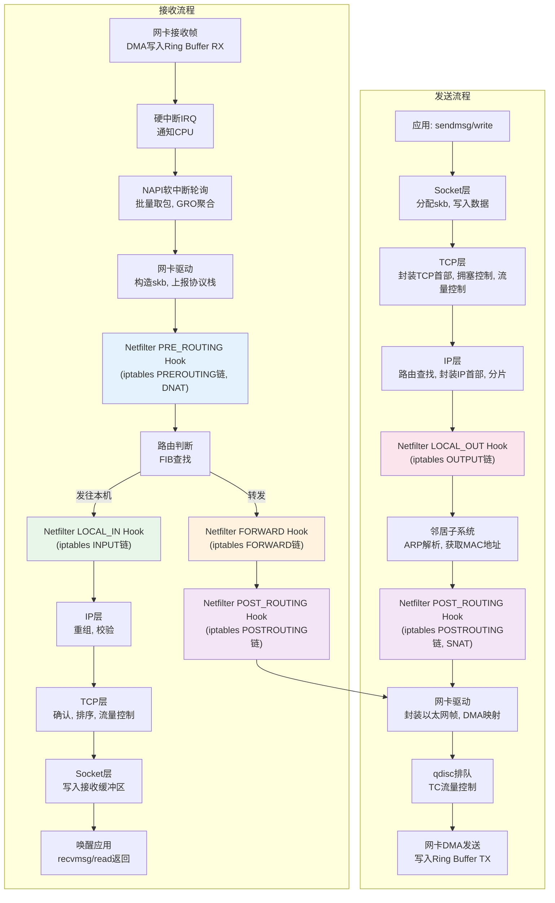

---

## 实战：网络性能诊断

### 常用诊断工具

```bash
# ===== 连接状态统计 =====
ss -s                    # 连接数汇总
ss -tlnp                 # TCP监听端口
ss -tn state established # 已建立连接
ss -tn state time-wait   # TIME_WAIT连接

# ===== 网卡统计 =====
ethtool -S eth0          # 网卡详细统计（丢包/错误等）
cat /proc/net/dev        # 各网卡收发统计

# ===== 协议栈统计 =====
cat /proc/net/snmp       # SNMP统计（TCP/UDP/IP层）
cat /proc/net/netstat    # 扩展统计
nstat -az               # 所有内核统计

# ===== 中断统计 =====
cat /proc/interrupts     # 中断分布
watch -n1 cat /proc/softirqs  # 软中断统计

# ===== conntrack =====
cat /proc/sys/net/netfilter/nf_conntrack_count  # 当前连接数
cat /proc/sys/net/netfilter/nf_conntrack_max    # 最大连接数
conntrack -L             # 列出所有连接

# ===== 路由 =====
ip route show            # 路由表
ip route get 8.8.8.8    # 查看到某地址的路由
ip rule show             # 策略路由规则

# ===== 高级诊断 =====
perf top -g              # 性能热点（看内核函数）
dropwatch                # 内核丢包监控
tcpdump -i eth0 -nn      # 抓包分析
```

### 典型问题排查

```
问题1: 连接建立慢
  检查: syn_queue和accept_queue是否溢出
  → netstat -s | grep "SYNs to LISTEN"
  → netstat -s | grep "overflow"
  解决: 增大tcp_max_syn_backlog和somaxconn

问题2: TIME_WAIT过多
  检查: ss -s
  解决: 客户端开启tcp_tw_reuse，使用长连接

问题3: 网卡丢包
  检查: ethtool -S eth0 | grep drop
  → rx_dropped: Ring Buffer满，增大Ring Buffer
  → rx_missed_errors: 网卡硬件丢包，检查中断亲和性

问题4: 软中断CPU不均
  检查: cat /proc/softirqs | grep NET_RX
  解决: 配置RPS将收包分散到多核
  → 设置/proc/irq/<irq>/smp_affinity绑定硬中断
  → 配置RPS/RFS

问题5: conntrack表满
  检查: dmesg | grep "table full"
  解决: 增大nf_conntrack_max或缩小超时时间
```

---

## 总结

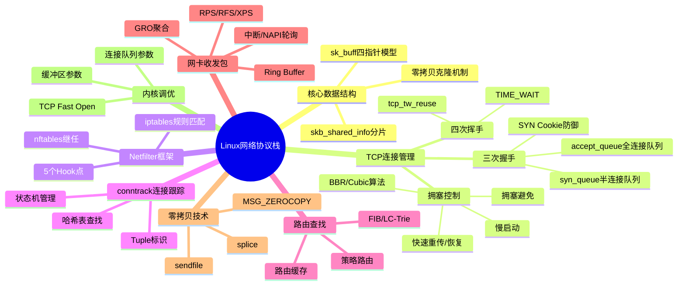

Linux网络协议栈是一个庞大而精密的系统，从最底层的网卡驱动到最顶层的Socket接口，每一层都经过了数十年的演进和优化。理解其核心原理——sk_buff的指针模型、TCP的连接管理、Netfilter的Hook机制、NAPI的轮询策略——是诊断网络问题和进行性能调优的基础。

::: info 延伸阅读
- 《深入理解Linux内核》（Understanding the Linux Kernel）—— Daniel P. Bovet, Marco Cesati
- 《Linux内核设计与实现》（Linux Kernel Development）—— Robert Love
- Linux内核源码：`net/ipv4/`、`net/core/`、`net/netfilter/`
- RFC 793（TCP）、RFC 6298（RTO）、RFC 5681（拥塞控制）
- Google BBR论文：BBR: Congestion-Based Congestion Control
:::
