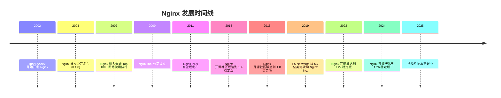
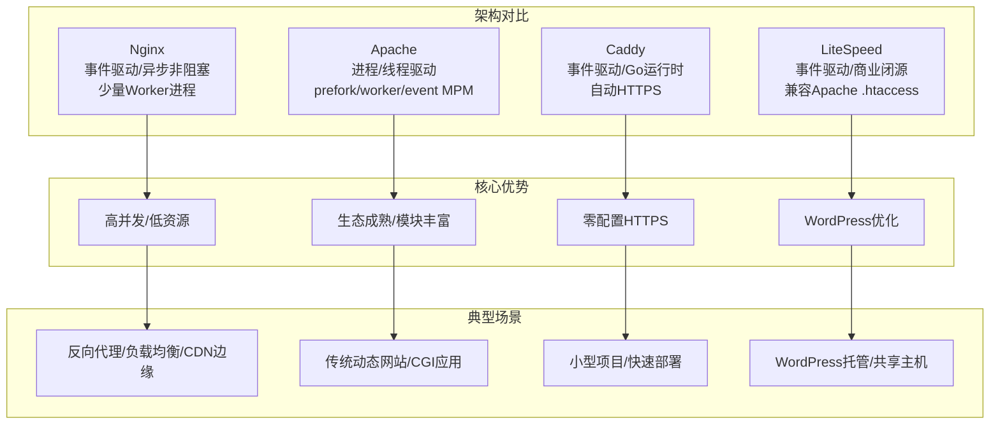
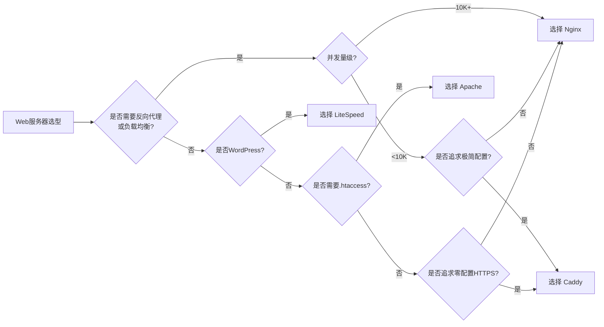
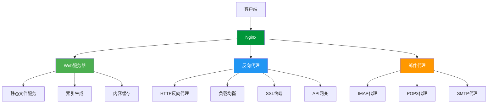
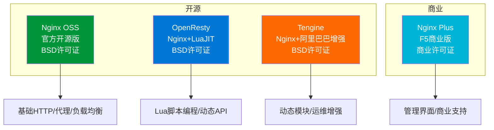
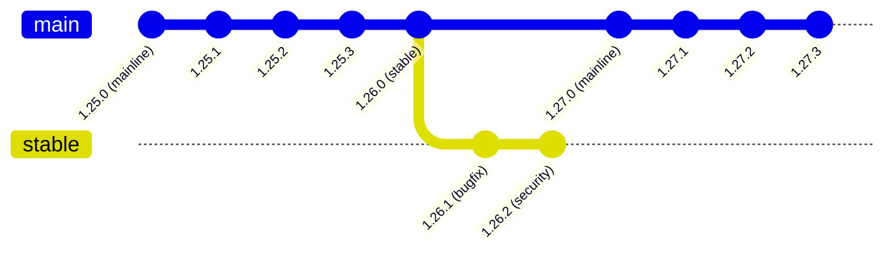
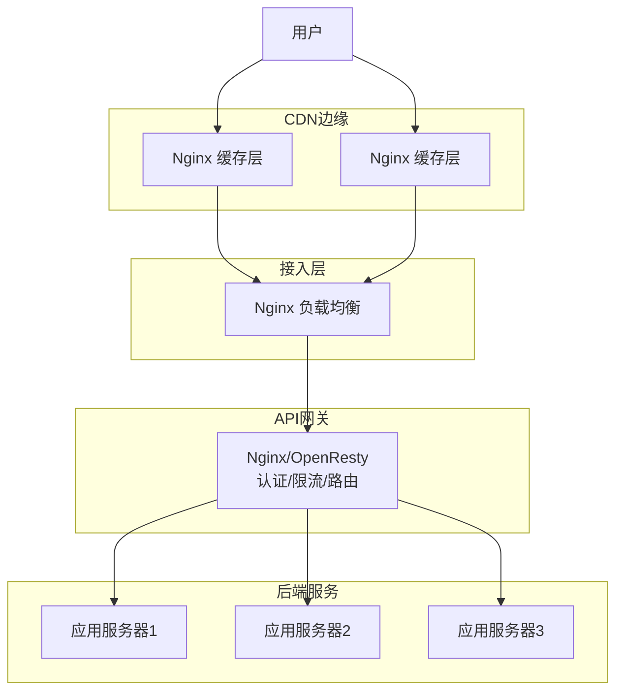
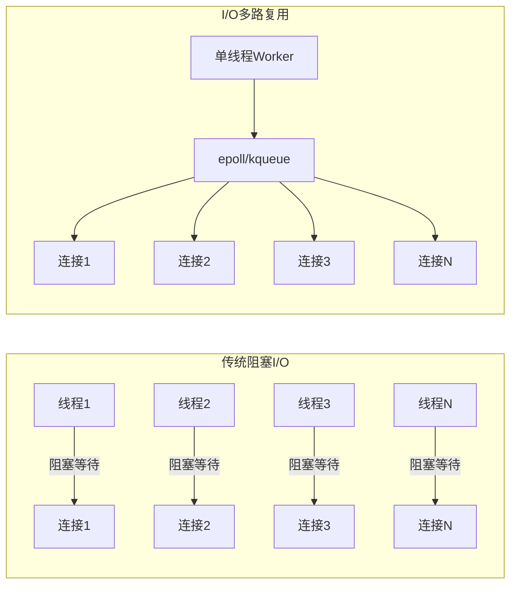
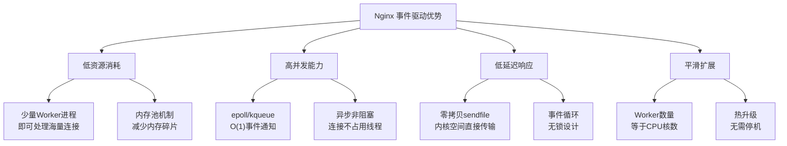

# Nginx 概述与生态

## 1. Nginx 的诞生与发展历史

### 1.1 起源：从俄罗斯互联网的痛点出发

Nginx（发音为 "Engine-X"）的故事始于 21 世纪初的俄罗斯互联网时代。2002 年，俄罗斯程序员 **Igor Sysoev**（伊戈尔·西索耶夫）在 Rambler（俄罗斯最大的互联网公司之一）工作时，面临着当时 Web 服务器无法有效处理的巨大并发连接问题。

当时的主流 Web 服务器 Apache HTTP Server 采用的是 **prefork 模型**——每个连接分配一个进程或线程，当并发连接数达到数千时，服务器内存和 CPU 资源迅速耗尽，这正是著名的 **C10K 问题**（即如何让一台服务器同时处理 10000 个客户端连接）。

Igor Sysoev 深入分析了 Apache 的架构缺陷，决心设计一种全新的 Web 服务器，采用**事件驱动（Event-Driven）** 的异步非阻塞架构来彻底解决高并发问题。

### 1.2 发展时间线



### 1.3 关键版本里程碑

| 版本 | 发布时间 | 关键特性 |
|------|----------|----------|
| 0.1.0 | 2004-10-04 | 首个公开发布版本，基础 HTTP 服务与代理功能 |
| 0.7.x | 2008 | 引入缓存、限流等高级特性 |
| 1.0.0 | 2011-04-12 | 首个稳定版发布，标志生产就绪 |
| 1.2.x | 2012 | HTTP/1.1 支持 |
| 1.4.x | 2013 | SPDY/3 支持、WebSocket 代理、gzip 模块增强 |
| 1.6.x | 2014 | 增强的缓存控制、线程池支持 |
| 1.8.x | 2015 | upstream zone 与 hash 负载均衡 |
| 1.10.x | 2016 | HTTP/2 支持（ngx_http_v2_module）、流媒体增强 |
| 1.12.x | 2017 | 动态模块加载 |
| 1.14.x | 2018 | gRPC 代理支持 |
| 1.16.x | 2019 | HTTP/2 推送、随机负载均衡 |
| 1.18.x | 2020 | TLS 1.3 增强、gRPC 改进 |
| 1.20.x | 2021 | PCRE2 支持、多种小改进 |
| 1.22.x | 2022 | OpenSSL 3.0 支持 |
| 1.24.x | 2023 | 安全修复与稳定性改进 |
| 1.26.x | 2024 | 持续稳定性与安全更新 |

::: tip 版本号含义
Nginx 版本号格式为 `主版本号.次版本号.修订号`，例如 `1.26.2`：
- **主版本号（1）**：重大架构变更时才会升级
- **次版本号（26）**：奇数为 mainline（主线版），偶数为 stable（稳定版）
- **修订号（2）**：Bug 修复与安全补丁

参考：[https://nginx.org/en/docs/version_numbers.html](https://nginx.org/en/docs/version_numbers.html)
:::

### 1.4 Igor Sysoev 的设计哲学

Igor Sysoev 在设计 Nginx 时遵循了几个核心原则：

1. **事件驱动而非进程驱动**：用少量的 Worker 进程配合事件通知机制（如 epoll）处理海量连接
2. **内存效率优先**：采用内存池机制，减少内存碎片和分配开销
3. **模块化设计**：功能通过模块组合，核心保持精简
4. **配置灵活**：声明式配置，支持热加载
5. **渐进式增强**：保持向后兼容，新功能通过模块引入

```nginx
# Nginx 极简配置示例 - 展示了其简洁设计哲学
worker_processes  auto;

events {
    worker_connections  1024;
}

http {
    server {
        listen 80;
        server_name  example.com;

        location / {
            root  /usr/share/nginx/html;
            index  index.html;
        }
    }
}
```

## 2. Nginx vs Apache vs Caddy vs LiteSpeed

### 2.1 四大 Web 服务器对比总览



### 2.2 详细对比表

| 对比维度 | Nginx | Apache HTTPD | Caddy | OpenLiteSpeed |
|----------|-------|-------------|-------|--------------|
| **首次发布** | 2004 | 1995 | 2015 | 2013 |
| **开发语言** | C | C | Go | C++ |
| **许可证** | BSD-2-Clause | Apache 2.0 | Apache 2.0 | GPL v3 |
| **架构模型** | 事件驱动/异步非阻塞 | 多种MPM可选 | 事件驱动/协程 | 事件驱动 |
| **并发模型** | epoll/kqueue | prefork/worker/event | goroutine | 事件调度 |
| **内存占用** | 极低 | 较高（prefork） | 中等 | 低 |
| **C10K表现** | 优秀 | 一般（prefork差） | 优秀 | 优秀 |
| **C100K表现** | 良好 | 差 | 良好 | 良好 |
| **静态文件** | 极快 | 较快 | 快 | 极快 |
| **动态内容** | 需反向代理 | 原生支持(mod_php等) | 需反向代理 | 原生LSAPI |
| **反向代理** | 极强 | 一般(mod_proxy) | 支持 | 支持 |
| **负载均衡** | 极强(多种算法) | 一般 | 支持 | 支持 |
| **HTTP/2** | 支持 | 支持(2.4.17+) | 支持 | 支持 |
| **HTTP/3** | 主线版支持 | 实验性支持 | 支持 | 支持 |
| **HTTPS自动** | 否(Let's Encrypt手动) | 否 | 是(自动ACME) | 是 |
| **.htaccess** | 不支持 | 支持 | 不支持 | 兼容 |
| **配置语法** | 声明式/简洁 | 声明式/复杂 | Caddyfile/极简 | 声明式/类Apache |
| **模块系统** | 静态/动态加载 | 运行时加载 | Go插件 | 内置 |
| **社区规模** | 巨大 | 巨大 | 快速增长 | 较小 |
| **商业支持** | F5/Nginx Plus | 无官方 | 商业版 | LiteSpeed Inc. |
| **容器友好** | 极好 | 一般 | 极好 | 一般 |

### 2.3 架构差异深度解析

#### Nginx 的事件驱动架构

Nginx 采用**单线程事件循环**模型，每个 Worker 进程在单个线程中通过事件通知机制（如 Linux 的 `epoll`、BSD 的 `kqueue`）处理数千个并发连接：

```
Worker Process (单线程)
┌─────────────────────────────────────────────────────┐
│  Event Loop                                         │
│  ┌─────────────────────────────────────────────┐    │
│  │  epoll_wait()                                │    │
│  │  ├── 新连接到达 → accept → 注册读事件       │    │
│  │  ├── 数据可读 → read → 处理请求             │    │
│  │  ├── 响应就绪 → write → 注册写事件          │    │
│  │  └── 连接关闭 → cleanup → 释放资源          │    │
│  └─────────────────────────────────────────────┘    │
└─────────────────────────────────────────────────────┘
```

#### Apache 的 MPM 模型

Apache 提供三种多进程模块（MPM）：

1. **prefork**：每个连接一个进程，内存开销大，但线程安全
2. **worker**：多进程+多线程混合，内存效率提升
3. **event**：类似 worker，但持久连接由监听线程管理

```apache
# Apache prefork MPM 配置
<IfModule mpm_prefork_module>
    StartServers             5
    MinSpareServers          5
    MaxSpareServers         10
    MaxRequestWorkers      150
    MaxConnectionsPerChild   0
</IfModule>
```

#### Caddy 的 Go 协程模型

Caddy 基于 Go 语言开发，利用 goroutine 的轻量级特性处理并发：

```go
// Caddy 内部简化模型
func handleConnection(conn net.Conn) {
    go func() {  // 每个连接一个 goroutine（约2KB栈空间）
        defer conn.Close()
        for {
            request := readRequest(conn)
            response := processRequest(request)
            writeResponse(conn, response)
        }
    }()
}
```

### 2.4 性能基准对比

以下是在相同硬件条件（4核8GB内存）下的基准测试参考数据：

::: important 性能数据说明
以下数据为参考性基准，实际性能取决于硬件配置、内核参数调优、Nginx 编译选项以及负载特征等因素。建议在自身环境中进行实际测试。
:::

| 测试场景 | Nginx (req/s) | Apache event (req/s) | Caddy (req/s) | OpenLiteSpeed (req/s) |
|----------|---------------|---------------------|---------------|----------------------|
| 静态文件 1KB | 120,000+ | 45,000+ | 95,000+ | 130,000+ |
| 静态文件 10KB | 85,000+ | 30,000+ | 65,000+ | 90,000+ |
| 反向代理 | 95,000+ | 25,000+ | 70,000+ | 80,000+ |
| SSL/TLS 握手 | 15,000+ | 8,000+ | 18,000+ | 16,000+ |
| 10K并发连接 | 稳定 | 资源紧张 | 稳定 | 稳定 |
| 100K并发连接 | 需调优 | 不可用 | 需调优 | 需调优 |

### 2.5 选型建议



::: warning 选型注意事项
- 没有绝对最优的 Web 服务器，只有最适合场景的选择
- Nginx 在反向代理和高并发静态服务场景下几乎是默认选择
- Apache 在需要 `.htaccess` 分布式配置的共享主机场景仍有优势
- Caddy 在开发环境和小型项目中极大降低了 HTTPS 配置门槛
- LiteSpeed 在 WordPress 性能优化场景有独特优势
- 生产环境常见的架构是 Nginx 前置 + Apache/Caddy 后端
:::

## 3. Nginx 三大核心角色

### 3.1 Web 服务器（HTTP Server）

作为 Web 服务器，Nginx 最核心的功能是处理 HTTP 请求并返回静态内容或代理到后端服务。

#### 静态文件服务

Nginx 处理静态文件的性能极其出色，这得益于：

- **零拷贝（sendfile）**：直接在内核空间完成文件传输，避免用户空间拷贝
- **内存映射（mmap）**：将文件映射到内存地址空间
- **异步 I/O（aio）**：文件读取不阻塞 Worker 进程
- **高效缓存**：操作系统级别的文件缓存

```nginx
# 高性能静态文件服务配置
server {
    listen 80;
    server_name static.example.com;
    root /var/www/static;

    # 启用零拷贝
    sendfile on;
    # 优化TCP传输
    tcp_nopush on;
    tcp_nodelay on;

    # 静态文件缓存
    location ~* \.(jpg|jpeg|png|gif|ico|css|js|svg|woff|woff2|ttf|eot)$ {
        expires 30d;
        add_header Cache-Control "public, immutable";
        access_log off;
    }

    # 禁止访问隐藏文件
    location ~ /\. {
        deny all;
        access_log off;
        log_not_found off;
    }
}
```

#### 静态文件服务性能优化路径

```
客户端请求 → Nginx Worker → 内核空间
                              │
                    ┌─────────┴─────────┐
                    │   sendfile()      │
                    │   零拷贝传输      │
                    │                   │
                    │   文件描述符 → 内核缓冲区 → Socket缓冲区 → 网卡
                    │                   │
                    │   无需用户空间参与 │
                    └───────────────────┘
                              │
                        响应返回客户端
```

::: tip sendfile 的性能优势
传统的 `read() + write()` 需要四次数据拷贝和四次上下文切换（每次系统调用涉及两次切换），而 `sendfile()` 只需要两次拷贝和两次上下文切换（仅一次系统调用），性能提升显著。参考：[https://nginx.org/en/docs/http/ngx_http_core_module.html#sendfile](https://nginx.org/en/docs/http/ngx_http_core_module.html#sendfile)
:::

### 3.2 反向代理服务器（Reverse Proxy）

反向代理是 Nginx 最广泛使用的角色之一。客户端并不直接与后端服务器通信，而是通过 Nginx 作为中间层进行请求转发。

#### 正向代理 vs 反向代理

```
正向代理（Forward Proxy）：
客户端 → [代理服务器] → 互联网 → 目标服务器
（客户端知道代理存在，代理代表客户端）

反向代理（Reverse Proxy）：
客户端 → [Nginx反向代理] → 后端服务器集群
（客户端不知道后端存在，Nginx代表服务器）
```

#### 反向代理核心功能

```nginx
# 反向代理基础配置
upstream backend_app {
    # 负载均衡 - 多种算法可选
    server 192.168.1.10:8080 weight=3;
    server 192.168.1.11:8080 weight=2;
    server 192.168.1.12:8080 backup;

    # 健康检查（注意：health_check 指令需要 NGINX Plus 商业订阅，开源版不支持）
    health_check interval=5s fails=3 passes=2;
}

server {
    listen 80;
    server_name app.example.com;

    location / {
        proxy_pass http://backend_app;

        # 传递客户端真实信息
        proxy_set_header Host $host;
        proxy_set_header X-Real-IP $remote_addr;
        proxy_set_header X-Forwarded-For $proxy_add_x_forwarded_for;
        proxy_set_header X-Forwarded-Proto $scheme;

        # 代理超时设置
        proxy_connect_timeout 5s;
        proxy_send_timeout 30s;
        proxy_read_timeout 60s;

        # 缓冲设置
        proxy_buffering on;
        proxy_buffer_size 4k;
        proxy_buffers 8 4k;
    }
}
```

#### 反向代理的典型应用场景

| 场景 | 说明 | 配置要点 |
|------|------|----------|
| 负载均衡 | 将请求分发到多台后端 | upstream + proxy_pass |
| SSL 终端 | 在 Nginx 层处理 HTTPS | listen 443 ssl |
| 缓存加速 | 缓存后端响应 | proxy_cache |
| 安全防护 | 隐藏后端服务器信息 | proxy_hide_header |
| 请求限流 | 保护后端不被过载 | limit_req |
| 灰度发布 | 按规则分流到不同版本 | split_clients / map |
| API 网关 | 统一入口路由转发 | location 匹配 |

### 3.3 邮件代理服务器（Mail Proxy）

Nginx 还具备邮件代理功能，这是其第三个核心角色，虽然在日常使用中不如前两者常见，但在企业邮件基础设施中仍有重要价值。

#### 支持的邮件协议

- **IMAP**：Internet Message Access Protocol（邮件读取）
- **POP3**：Post Office Protocol version 3（邮件下载）
- **SMTP**：Simple Mail Transfer Protocol（邮件发送）

```nginx
# 邮件代理配置示例
mail {
    server_name mail.example.com;

    # IMAP 代理
    server {
        listen 143;
        protocol imap;
        proxy on;
        proxy_pass_error_message on;

        # 认证脚本
        auth_http http://auth.example.com/validate;
    }

    # POP3 代理
    server {
        listen 110;
        protocol pop3;
        proxy on;

        auth_http http://auth.example.com/validate;
    }

    # SMTP 代理
    server {
        listen 25;
        protocol smtp;
        proxy on;
        smtp_auth login plain;

        auth_http http://auth.example.com/validate;
    }
}
```

::: info 邮件代理模块
Nginx 的邮件代理模块（`ngx_mail_proxy_module`）在编译时需要显式启用，标准 `--with-mail` 参数即可。邮件代理的核心是通过 `auth_http` 指令与外部认证服务交互，决定将连接代理到哪个后端邮件服务器。参考：[https://nginx.org/en/docs/mail/ngx_mail_core_module.html](https://nginx.org/en/docs/mail/ngx_mail_core_module.html)
:::

#### 邮件代理的认证流程

```
客户端 → Nginx邮件代理 → auth_http认证服务
                           │
                    ┌──────┴──────┐
                    │  认证结果    │
                    ├─────────────┤
                    │ 成功：返回  │
                    │ 后端服务器   │
                    │ 地址和端口   │
                    ├─────────────┤
                    │ 失败：返回   │
                    │ 认证错误     │
                    └─────────────┘
                           │
                    Nginx代理连接
                    到后端邮件服务器
```

### 3.4 三大角色的关系



## 4. Nginx 模块生态

### 4.1 模块分类体系

Nginx 采用模块化架构设计，所有功能都通过模块实现。模块分为以下几大类：

```
Nginx 模块体系
├── 核心模块（Core Modules）
│   ├── ngx_core_module        — 全局配置
│   ├── ngx_events_module      — 事件机制
│   └── ngx_http_module         — HTTP框架
│
├── 标准HTTP模块（Standard HTTP Modules）
│   ├── ngx_http_core_module    — HTTP核心
│   ├── ngx_http_ssl_module     — SSL/TLS
│   ├── ngx_http_proxy_module   — 反向代理
│   ├── ngx_http_upstream_module — 负载均衡
│   ├── ngx_http_gzip_module    — Gzip压缩
│   ├── ngx_http_rewrite_module — URL重写
│   ├── ngx_http_log_module     — 访问日志
│   ├── ngx_http_limit_req_module — 请求限流
│   └── ... (50+ 标准模块)
│
├── 标准Stream模块（Stream Modules）
│   ├── ngx_stream_core_module  — TCP/UDP代理
│   ├── ngx_stream_ssl_module   — Stream SSL
│   └── ngx_stream_proxy_module — Stream代理
│
├── 标准Mail模块（Mail Modules）
│   ├── ngx_mail_core_module    — 邮件代理核心
│   ├── ngx_mail_ssl_module     — 邮件SSL
│   └── ngx_mail_proxy_module   — 邮件代理
│
└── 第三方模块（Third-party Modules）
    ├── headers-more-nginx-module
    ├── echo-nginx-module
    ├── ngx_brotli
    ├── geoip2-nginx-module
    └── ... (数千个社区模块)
```

### 4.2 核心 HTTP 模块一览

以下列出 Nginx 编译后默认包含的核心 HTTP 模块及其功能：

| 模块名称 | 功能描述 | 官方文档 |
|----------|----------|----------|
| `ngx_http_core_module` | HTTP 核心指令：server、location、root、alias 等 | [链接](https://nginx.org/en/docs/http/ngx_http_core_module.html) |
| `ngx_http_proxy_module` | HTTP 反向代理 | [链接](https://nginx.org/en/docs/http/ngx_http_proxy_module.html) |
| `ngx_http_upstream_module` | 服务器组与负载均衡 | [链接](https://nginx.org/en/docs/http/ngx_http_upstream_module.html) |
| `ngx_http_rewrite_module` | URL 重写与重定向 | [链接](https://nginx.org/en/docs/http/ngx_http_rewrite_module.html) |
| `ngx_http_gzip_module` | Gzip 压缩响应 | [链接](https://nginx.org/en/docs/http/ngx_http_gzip_module.html) |
| `ngx_http_log_module` | 访问日志记录 | [链接](https://nginx.org/en/docs/http/ngx_http_log_module.html) |
| `ngx_http_fastcgi_module` | FastCGI 代理 | [链接](https://nginx.org/en/docs/http/ngx_http_fastcgi_module.html) |
| `ngx_http_uwsgi_module` | uWSGI 代理 | [链接](https://nginx.org/en/docs/http/ngx_http_uwsgi_module.html) |
| `ngx_http_scgi_module` | SCGI 代理 | [链接](https://nginx.org/en/docs/http/ngx_http_scgi_module.html) |
| `ngx_http_memcached_module` | Memcached 代理 | [链接](https://nginx.org/en/docs/http/ngx_http_memcached_module.html) |
| `ngx_http_limit_req_module` | 请求速率限制 | [链接](https://nginx.org/en/docs/http/ngx_http_limit_req_module.html) |
| `ngx_http_limit_conn_module` | 并发连接限制 | [链接](https://nginx.org/en/docs/http/ngx_http_limit_conn_module.html) |
| `ngx_http_map_module` | 变量映射 | [链接](https://nginx.org/en/docs/http/ngx_http_map_module.html) |
| `ngx_http_split_clients_module` | A/B 测试分流 | [链接](https://nginx.org/en/docs/http/ngx_http_split_clients_module.html) |
| `ngx_http_referer_module` | Referer 访问控制 | [链接](https://nginx.org/en/docs/http/ngx_http_referer_module.html) |
| `ngx_http_autoindex_module` | 目录自动索引 | [链接](https://nginx.org/en/docs/http/ngx_http_autoindex_module.html) |
| `ngx_http_auth_basic_module` | HTTP 基本认证 | [链接](https://nginx.org/en/docs/http/ngx_http_auth_basic_module.html) |
| `ngx_http_access_module` | IP 访问控制 | [链接](https://nginx.org/en/docs/http/ngx_http_access_module.html) |
| `ngx_http_browser_module` | 浏览器识别 | [链接](https://nginx.org/en/docs/http/ngx_http_browser_module.html) |
| `ngx_http_userid_module` | Cookie 用户标识 | [链接](https://nginx.org/en/docs/http/ngx_http_userid_module.html) |
| `ngx_http_charset_module` | 字符集转换 | [链接](https://nginx.org/en/docs/http/ngx_http_charset_module.html) |
| `ngx_http_ssi_module` | SSI 服务端包含 | [链接](https://nginx.org/en/docs/http/ngx_http_ssi_module.html) |

### 4.3 编译时可禁用的标准模块

以下标准 HTTP 模块可通过 `--without-http_*_module` 参数在编译时禁用，以减小二进制体积：

```bash
# 编译时禁用不需要的标准模块
./configure \
    --without-http_gzip_module \      # 禁用Gzip压缩（若前端已压缩）
    --without-http_ssi_module \       # 禁用SSI
    --without-http_userid_module \     # 禁用Cookie用户标识
    --without-http_access_module \     # 禁用IP访问控制
    --without-http_auth_basic_module \ # 禁用HTTP基本认证
    --without-http_autoindex_module \  # 禁用目录自动索引
    --without-http_map_module \        # 禁用变量映射
    --without-http_split_clients_module \ # 禁用A/B测试
    --without-http_referer_module \    # 禁用Referer控制
    --without-http_browser_module \    # 禁用浏览器识别
    --without-http_upstream_hash_module \  # 禁用Hash负载均衡
    --without-http_upstream_ip_hash_module \ # 禁用IP Hash
    --without-http_upstream_least_conn_module \ # 禁用最少连接
    --without-http_upstream_random_module \    # 禁用随机负载
    --without-http_upstream_keepalive_module    # 禁用Keepalive
```

### 4.4 需要显式启用的模块

以下模块需要通过 `--with-http_*_module` 参数在编译时启用：

| 编译参数 | 模块 | 功能 |
|----------|------|------|
| `--with-http_ssl_module` | ngx_http_ssl_module | HTTPS/SSL/TLS 支持 |
| `--with-http_v2_module` | ngx_http_v2_module | HTTP/2 支持 |
| `--with-http_v3_module` | ngx_http_v3_module | HTTP/3 (QUIC) 支持 |
| `--with-http_realip_module` | ngx_http_realip_module | 真实 IP 获取 |
| `--with-http_addition_module` | ngx_http_addition_module | 响应内容追加 |
| `--with-http_sub_module` | ngx_http_sub_module | 响应内容替换 |
| `--with-http_dav_module` | ngx_http_dav_module | WebDAV 支持 |
| `--with-http_flv_module` | ngx_http_flv_module | FLV 流媒体 |
| `--with-http_mp4_module` | ngx_http_mp4_module | MP4 流媒体 |
| `--with-http_gunzip_module` | ngx_http_gunzip_module | 解压响应 |
| `--with-http_gzip_static_module` | ngx_http_gzip_static_module | 预压缩文件 |
| `--with-http_auth_request_module` | ngx_http_auth_request_module | 子请求认证 |
| `--with-http_random_index_module` | ngx_http_random_index_module | 随机首页 |
| `--with-http_secure_link_module` | ngx_http_secure_link_module | 安全链接 |
| `--with-http_slice_module` | ngx_http_slice_module | 大文件分片 |
| `--with-http_stub_status_module` | ngx_http_stub_status_module | 状态监控 |

### 4.5 第三方模块生态

Nginx 的第三方模块生态非常丰富，以下是一些高质量且广泛使用的第三方模块：

#### 必装推荐

| 模块名称 | 功能 | GitHub Stars | 适用场景 |
|----------|------|-------------|----------|
| `headers-more-nginx-module` | 灵活设置/清除HTTP头 | 2000+ | 安全头配置 |
| `echo-nginx-module` | Shell风格输出调试 | 1500+ | 配置调试 |
| `ngx_brotli` | Brotli压缩算法 | 3000+ | 替代Gzip |
| `geoip2-nginx-module` | GeoIP2数据库查询 | 1000+ | 地理位置判断 |
| `nginx-module-vts` | 虚拟主机流量状态 | 3000+ | 流量监控 |
| `ngx_cache_purge` | 缓存手动清除 | 1500+ | CDN缓存管理 |
| `nginx-upstream-fair` | 公平负载均衡 | 1000+ | 智能负载均衡 |
| `ngx_http_substitutions_filter_module` | 正则替换响应内容 | 800+ | 内容替换 |

#### 编译安装第三方模块

```bash
# 方式一：静态编译（推荐用于生产）
./configure \
    --add-module=/path/to/headers-more-nginx-module \
    --add-module=/path/to/echo-nginx-module \
    --add-module=/path/to/ngx_brotli

# 方式二：动态模块编译（1.9.11+支持）
./configure \
    --add-dynamic-module=/path/to/headers-more-nginx-module \
    --add-dynamic-module=/path/to/echo-nginx-module

# 动态模块加载（在nginx.conf中）
# load_module modules/ngx_http_headers_more_filter_module.so;
```

::: warning 第三方模块风险
- 第三方模块可能引入安全漏洞，务必审查代码
- 版本兼容性需要关注，Nginx 升级后可能需要重新编译
- 过多的第三方模块会增加攻击面和维护成本
- 建议仅安装经过充分测试和社区验证的模块
- 生产环境使用前务必在测试环境中验证
:::

## 5. OpenResty vs Tengine vs NGINX Plus vs OSS Nginx

### 5.1 四大 Nginx 发行版对比



### 5.2 详细对比表

| 对比维度 | Nginx OSS | OpenResty | Tengine | Nginx Plus |
|----------|-----------|-----------|---------|------------|
| **维护方** | F5/Nginx Inc. | OpenResty Inc. | 阿里巴巴 | F5/Nginx Inc. |
| **许可证** | BSD-2-Clause | BSD-2-Clause | BSD-2-Clause | 商业许可 |
| **Nginx基础** | 原版 | 基于Nginx | 基于Nginx | 基于Nginx |
| **版本同步** | 最新 | 略滞后 | 略滞后 | 与OSS同步 |
| **Lua支持** | 需第三方模块 | 内置LuaJIT | 不内置 | 需第三方 |
| **动态模块** | 1.9.11+支持 | 支持 | 原生支持 | 原生支持+管理 |
| **动态upstream** | 需第三方 | Lua实现 | 原生支持 | 原生API |
| **管理API** | 无 | Lua实现 | 部分支持 | 完整REST API |
| **Web管理界面** | 无 | 无 | 无 | 有 |
| **健康检查** | 开源有限 | Lua实现 | 增强版 | 完整主动检查 |
| **会话保持** | ip_hash | Lua实现 | 增强版 | 多种策略 |
| **缓存清除API** | 无 | Lua实现 | 支持 | 有 |
| **JWT认证** | 需第三方 | Lua实现 | 需第三方 | 原生支持 |
| **OAuth/OIDC** | 需第三方 | Lua实现 | 需第三方 | 原生支持 |
| **流量镜像** | 1.13.4+ | 支持 | 支持 | 支持 |
| **gRPC网关** | 1.13.10+ | 支持 | 支持 | 支持 |
| **商业支持** | 社区/第三方 | OpenResty Inc. | 阿里/社区 | F5官方 |
| **适用场景** | 通用 | API网关/动态路由 | 大规模部署 | 企业级/合规 |

### 5.3 OpenResty 深度解析

OpenResty 由章亦春（agentzh）创建，将 Nginx 与 LuaJIT 深度集成，使得可以用 Lua 脚本直接在 Nginx 内部编写复杂的业务逻辑。

```nginx
# OpenResty Lua 脚本示例
server {
    listen 80;
    server_name api.example.com;

    location /api/hello {
        content_by_lua_block {
            local name = ngx.var.arg_name or "World"
            ngx.header["Content-Type"] = "application/json"
            ngx.say('{"message": "Hello, ' .. name .. '!"}')
        }
    }

    # 基于Redis的动态路由
    location /api/dynamic {
        access_by_lua_block {
            local redis = require "resty.redis"
            local red = redis:new()
            local ok, err = red:connect("127.0.0.1", 6379)
            if not ok then
                ngx.log(ngx.ERR, "failed to connect to redis: ", err)
                return ngx.exit(500)
            end
            local res, err = red:hget("routes", ngx.var.uri)
            if res then
                ngx.var.upstream = res
            end
        }
    }
}
```

OpenResty 核心组件：

- **ngx_lua**：Nginx Lua 模块，提供 Lua 协程与 Nginx 事件循环的深度集成
- **LuaJIT**：高性能 Lua 即时编译器
- **lua-resty-core**：基于 FFI 的高层 Lua API
- **lua-resty-***：一系列生产级 Lua 库（Redis、MySQL、DNS、HTTP 等）

### 5.4 Tengine 深度解析

Tengine 是阿里巴巴基于 Nginx 开发的 Web 服务器项目，在国内尤其是淘宝/天猫等大规模场景下经过充分验证。

Tengine 的关键增强特性：

```nginx
# Tengine 增强配置示例
upstream backend {
    server 192.168.1.10:8080;
    server 192.168.1.11:8080;

    # Tengine 增强：动态权重调整
    check interval=3000 rise=2 fall=5 timeout=1000 type=http;
    check_http_send "HEAD /health HTTP/1.0\r\n\r\n";
    check_http_expect_alive http_2xx http_3xx;

    # Tengine 增强：会话保持
    session_sticky cookie=stickymode;
}

server {
    listen 80;

    # Tengine 增强：动态模块加载
    # dso {
    #     load ngx_http_concat_module.so;
    #     load ngx_http_footer_filter_module.so;
    # }

    # Tengine 增强：CSS/JS 合并请求
    location /static/ {
        concat on;
        concat_types text/css application/javascript;
        concat_max_files 20;
    }
}
```

Tengine 独有特性：

- **动态模块加载（DSO）**：运行时加载 `.so` 模块，无需重新编译
- **主动健康检查**：定时探测后端服务器状态
- **CSS/JS 合并**：减少 HTTP 请求数
- **动态 upstream**：通过 API 动态修改后端服务器列表
- **请求体处理增强**：支持请求体过滤和修改
- **运维友好**：内置监控指标和诊断工具

### 5.5 NGINX Plus 深度解析

NGINX Plus 是 F5 公司提供的商业版本，在开源版基础上增加了企业级功能：

```nginx
# NGINX Plus 独有功能示例
upstream backend {
    zone backend 64k;
    server 192.168.1.10:8080;
    server 192.168.1.11:8080;

    # NGINX Plus：主动健康检查
    health_check interval=5s fails=3 passes=2 uri=/health;
    # NGINX Plus：会话保持
    sticky learn create=$upstream_cookie_exampleid
           lookup=$cookie_exampleid
           zone=client_sessions:1m;
}

server {
    listen 80;

    # NGINX Plus：缓存清除API
    location /purge/ {
        proxy_cache_purge my_cache $scheme$host$request_uri;
    }

    # NGINX Plus：状态API
    location /api/ {
        api write=on;
        allow 127.0.0.1;
        deny all;
    }

    # NGINX Plus：内置监控面板
    location /dashboard.html {
        root /usr/share/nginx/modules;
    }
}
```

NGINX Plus 核心增值功能：

1. **完整 REST API**：动态配置 upstream、SSL 证书等
2. **主动健康检查**：定时探测后端可用性
3. **高级会话保持**：基于 Cookie、学习型粘性
4. **JWT/OAuth 认证**：原生 JWT 验证和 OIDC 集成
5. **API 网关功能**：速率限制、请求路由、API 版本管理
6. **Web 管理界面**：实时监控仪表板
7. **商业支持**：7×24 技术支持、SLA 保障
8. **安全更新**：优先获取安全补丁

### 5.6 选型决策树

```
选型决策：
├── 是否需要 Lua 脚本编程?
│   ├── 是 → OpenResty
│   └── 否 → 继续
│
├── 是否需要企业级支持和SLA保障?
│   ├── 是 → NGINX Plus
│   └── 否 → 继续
│
├── 是否需要主动健康检查和动态upstream?
│   ├── 是 → Tengine 或 NGINX Plus
│   └── 否 → 继续
│
├── 是否在国内大规模部署?
│   ├── 是 → Tengine（本地化支持好）
│   └── 否 → 继续
│
└── 通用场景 → Nginx OSS（官方开源版）
```

## 6. Nginx 版本分支

### 6.1 Mainline vs Stable

Nginx 维护两个版本分支：

- **Mainline（主线版）**：包含最新功能和 Bug 修复，版本号的次版本号为奇数（如 1.27.x）
- **Stable（稳定版）**：只包含关键 Bug 修复和安全补丁，版本号的次版本号为偶数（如 1.26.x）



### 6.2 版本选择建议

| 使用场景 | 推荐版本 | 原因 |
|----------|----------|------|
| 生产环境 | Stable | 稳定性优先，只修复关键 Bug |
| 开发环境 | Mainline | 获取最新功能，提前验证兼容性 |
| 性能敏感 | Mainline | 新功能可能带来性能提升 |
| 安全敏感 | Stable 或 Mainline | 安全补丁两边都会发 |
| 需要新特性 | Mainline | 某些模块仅 Mainline 支持 |

::: important 版本更新策略
- Nginx 的 Stable 分支大约每 6-8 个月发布一个新版本
- 当新的 Mainline 版本成为 Stable 时，旧的 Stable 分支仍然会收到安全修复
- 通常会同时维护两个 Stable 版本的安全更新
- 具体的版本生命周期信息参考：[https://nginx.org/en/docs/releases.html](https://nginx.org/en/docs/releases.html)
:::

### 6.3 版本号解读

```
1.26.2
│ │  │
│ │  └── 修订号（Patch）：Bug修复和安全补丁
│ └───── 次版本号（Minor）：奇数=Mainline，偶数=Stable
└──────── 主版本号（Major）：重大架构变更
```

特别说明：

- 从 `1.25.x`（mainline）到 `1.26.0`（stable）不是简单的改名，而是经过稳定性验证后的分支
- 修订号更新（如 1.26.1 → 1.26.2）只包含 Bug 修复，不引入新功能
- 主版本号目前仍为 1，表明基础架构稳定

## 7. Nginx 市场占有率与使用场景

### 7.1 全球市场占有率

根据 W3Techs 和 Netcraft 的统计数据，Nginx 在 Web 服务器市场的占有率持续增长：

| 统计维度 | Nginx | Apache | Cloudflare Server | LiteSpeed | 其他 |
|----------|-------|--------|-------------------|-----------|------|
| 所有网站 | ~34% | ~29% | ~21% | ~13% | ~3% |
| 高流量网站(Top 1000) | ~62% | ~14% | ~12% | ~3% | ~9% |
| 高流量网站(Top 10K) | ~55% | ~18% | ~15% | ~4% | ~8% |

::: info 数据来源
以上数据参考 W3Techs 2024-2025 年的统计。Web 服务器市场格局变化较快，建议查看最新数据：[https://w3techs.com/technologies/overview/web_server](https://w3techs.com/technologies/overview/web_server)
:::

### 7.2 使用 Nginx 的知名站点

以下是在架构中大量使用 Nginx 的知名互联网公司：

- **Netflix**：全球流媒体巨头，Nginx 作为入口网关
- **Airbnb**：使用 Nginx + OpenResty 作为 API 网关
- **GitHub**：使用 Nginx 处理静态资源和负载均衡
- **Pinterest**：Nginx 作为反向代理和缓存层
- **WordPress.com**：Automattic 使用 Nginx 服务数百万站点
- **Hulu**：流媒体服务的负载均衡与内容分发
- **MaxCDN/StackPath**：CDN 边缘节点使用 Nginx
- **国内**：百度、淘宝（Tengine）、腾讯、京东、字节跳动等

### 7.3 Nginx 典型使用场景



#### 场景一：静态资源 CDN

```nginx
# CDN 边缘节点配置
proxy_cache_path /var/cache/nginx levels=1:2 keys_zone=cdn_cache:100m
                 max_size=50g inactive=60m use_temp_path=off;

server {
    listen 80;
    server_name cdn.example.com;

    location /static/ {
        proxy_cache cdn_cache;
        proxy_cache_valid 200 302 30m;
        proxy_cache_valid 404 1m;
        proxy_cache_use_stale error timeout updating http_500 http_502 http_503 http_504;
        proxy_cache_lock on;

        proxy_pass http://origin_server;
    }
}
```

#### 场景二：微服务 API 网关

```nginx
# API 网关配置
upstream user_service {
    server 10.0.1.10:8080;
    server 10.0.1.11:8080;
}

upstream order_service {
    server 10.0.2.10:8080;
    server 10.0.2.11:8080;
}

server {
    listen 443 ssl;
    server_name api.example.com;

    # 统一限流
    limit_req_zone $binary_remote_addr zone=api_limit:10m rate=100r/s;

    # 用户服务路由
    location /api/users/ {
        limit_req zone=api_limit burst=50 nodelay;
        proxy_pass http://user_service;
    }

    # 订单服务路由
    location /api/orders/ {
        limit_req zone=api_limit burst=50 nodelay;
        proxy_pass http://order_service;
    }
}
```

#### 场景三：SSL 终端与安全加固

```nginx
# SSL 终端配置
server {
    listen 443 ssl http2;
    server_name secure.example.com;

    # SSL 证书
    ssl_certificate     /etc/nginx/ssl/secure.example.com.crt;
    ssl_certificate_key /etc/nginx/ssl/secure.example.com.key;

    # SSL 安全配置
    ssl_protocols TLSv1.2 TLSv1.3;
    ssl_ciphers ECDHE-ECDSA-AES128-GCM-SHA256:ECDHE-RSA-AES128-GCM-SHA256:ECDHE-ECDSA-AES256-GCM-SHA384:ECDHE-RSA-AES256-GCM-SHA384;
    ssl_prefer_server_ciphers off;
    ssl_session_cache shared:SSL:10m;
    ssl_session_timeout 1d;
    ssl_session_tickets off;

    # 安全头
    add_header Strict-Transport-Security "max-age=63072000; includeSubDomains; preload" always;
    add_header X-Content-Type-Options "nosniff" always;
    add_header X-Frame-Options "SAMEORIGIN" always;
    add_header X-XSS-Protection "1; mode=block" always;
    add_header Referrer-Policy "strict-origin-when-cross-origin" always;

    location / {
        proxy_pass http://backend;
    }
}

# HTTP → HTTPS 重定向
server {
    listen 80;
    server_name secure.example.com;
    return 301 https://$host$request_uri;
}
```

#### 场景四：流媒体服务

```nginx
# FLV/MP4 流媒体配置
server {
    listen 80;
    server_name media.example.com;

    location /video/ {
        root /var/www/media;
        # FLV 流
        flv;
        # MP4 流
        mp4;
        mp4_buffer_size 1m;
        mp4_max_buffer_size 5m;

        # 限速保护
        limit_rate_after 5m;
        limit_rate 2m;
    }
}
```

#### 场景五：灰度发布

```nginx
# 基于Cookie的灰度发布
split_clients "${cookie_grayrelease}" $variant {
    10%    new_backend;
    *      old_backend;
}

upstream old_backend {
    server 192.168.1.10:8080;
}

upstream new_backend {
    server 192.168.2.10:8080;
}

server {
    listen 80;
    server_name app.example.com;

    location / {
        proxy_pass http://$variant;
    }
}
```

## 8. C10K 问题与 Nginx 事件驱动优势

### 8.1 C10K 问题详解

C10K 问题由 Dan Kegel 在 1999 年提出，核心问题是：**如何让一台服务器同时处理 10000 个客户端连接？**

在传统模型下，这几乎是不可能完成的任务：

```
传统模型（Apache prefork）：
假设每个进程占用 8MB 内存
10,000 个连接 = 10,000 个进程 = 80GB 内存
→ 内存耗尽，系统崩溃
```

C10K 问题的根本原因：

1. **进程/线程开销**：每个连接一个进程/线程，内存和调度开销巨大
2. **上下文切换**：大量线程频繁切换，CPU 时间浪费在调度上
3. **锁竞争**：多线程共享资源需要加锁，性能急剧下降
4. **I/O 阻塞**：阻塞式 I/O 导致线程闲置等待

### 8.2 I/O 多路复用技术对比

Nginx 解决 C10K 问题的核心是 **I/O 多路复用** 技术：



#### select 系统调用

```c
// select 的限制
int select(int nfds, fd_set *readfds, fd_set *writefds,
           fd_set *exceptfds, struct timeval *timeout);

// 限制：
// 1. FD_SETSIZE 通常为 1024，无法突破
// 2. 每次调用需要传递所有文件描述符（O(n) 复杂度）
// 3. 内核需要遍历所有描述符（O(n) 复杂度）
// 4. 每次返回后需要重新设置描述符集合
```

**select 的核心问题**：
- 文件描述符数量硬限制（1024）
- 线性扫描效率低下
- 数据需要从内核空间拷贝到用户空间

#### poll 系统调用

```c
// poll 改进了 select
int poll(struct pollfd *fds, nfds_t nfds, int timeout);

// 改进：
// 1. 突破了 1024 的数量限制
// 2. 使用结构体数组，更灵活

// 但仍然存在的问题：
// 1. 仍然是 O(n) 复杂度
// 2. 每次调用仍需传递所有描述符
// 3. 大量连接时性能依然不佳
```

#### epoll 系统调用（Linux）

```c
// epoll 三步走
int epoll_create(int size);           // 创建epoll实例
int epoll_ctl(int epfd, int op, ...); // 注册/修改/删除事件
int epoll_wait(int epfd, ...);        // 等待就绪事件

// 优势：
// 1. O(1) 事件通知，只返回就绪的描述符
// 2. O(1) 注册/删除操作
// 3. 无需每次传递所有描述符
// 4. 支持边缘触发（Edge Triggered）和水平触发（Level Triggered）
// 5. 轻松支持百万级连接
```

#### kqueue（BSD/macOS）

```c
// kqueue 类似于 epoll
int kqueue(void);
int kevent(int kq, ...);

// 优势：
// 1. 与 epoll 类似的高效事件通知
// 2. 除了文件描述符，还支持信号、定时器、进程等事件
// 3. macOS 和 FreeBSD 系统的首选
```

### 8.3 各 I/O 模型性能对比

| 模型 | 最大连接数 | 事件通知复杂度 | 适用平台 | Nginx 支持 |
|------|-----------|---------------|---------|-----------|
| select | 1024 (FD_SETSIZE) | O(n) | 全平台 | 是 |
| poll | 无硬限制 | O(n) | 全平台 | 是 |
| epoll | 百万级 | O(1) | Linux | 是（推荐） |
| kqueue | 百万级 | O(1) | BSD/macOS | 是（推荐） |
| /dev/poll | 百万级 | O(1) | Solaris | 是 |
| eventport | 百万级 | O(1) | Solaris 10+ | 是 |

Nginx 中的事件模型选择：

```nginx
events {
    # Linux 推荐使用 epoll
    use epoll;
    # BSD/macOS 推荐使用 kqueue（自动检测，通常无需手动指定）
    # use kqueue;

    # 每个 Worker 的最大连接数
    worker_connections 65535;

    # 尽可能多地接受连接
    multi_accept on;
}
```

::: tip 自动选择最佳事件模型
Nginx 在编译时会自动检测平台支持的最高效 I/O 模型。在 Linux 上默认使用 `epoll`，在 BSD/macOS 上默认使用 `kqueue`。通常不需要手动指定 `use` 指令，Nginx 会自动选择最优方案。参考：[https://nginx.org/en/docs/http/ngx_http_core_module.html](https://nginx.org/en/docs/http/ngx_http_core_module.html)
:::

### 8.4 Nginx 事件驱动优势总结



#### 核心优势详解

**1. 极低的资源消耗**

Nginx 的 Worker 进程数通常设置为 CPU 核心数，每个 Worker 可以处理数万到数十万并发连接。与传统模型相比：

```
Apache prefork 模型（10,000 连接）：
- 进程数：10,000
- 内存消耗：~80GB（8MB/进程）
- 上下文切换：频繁

Nginx 事件驱动模型（10,000 连接）：
- Worker 进程数：4（4核CPU）
- 内存消耗：~200MB（50MB/Worker）
- 上下文切换：极少
```

**2. 优秀的并发扩展性**

Nginx 的并发处理能力随连接数增长呈线性扩展，而传统模型则呈指数级恶化：

```
连接数    |  Nginx CPU%  |  Apache CPU%
---------|-------------|-------------
1,000    |     5%      |     15%
5,000    |    15%      |     65%
10,000   |    25%      |     95%+
50,000   |    55%      |    不可用
100,000  |    75%      |    不可用
```

**3. 零拷贝与高效传输**

```nginx
# 零拷贝配置
sendfile on;
tcp_nopush on;  # 配合sendfile，优化TCP头部
tcp_nodelay on;  # 禁用Nagle算法，减少小包延迟
```

**4. 无锁设计减少竞争**

- Worker 进程之间相互独立，不需要共享锁
- 通过共享内存（shm）实现少量必要的数据共享
- 避免了多线程环境下的锁竞争问题

**5. 内存池机制**

Nginx 实现了自定义的内存池（`ngx_pool_t`），特点包括：

- 一次性分配大块内存，减少系统调用
- 小对象从池中快速分配，无需 `malloc`
- 请求结束时整块释放，避免内存泄漏
- 减少内存碎片，提高内存利用率

### 8.5 从 C10K 到 C100K 再到 C10M

Nginx 的发展已经远远超越了最初的 C10K 目标：

| 里程碑 | 连接数 | 关键技术 | 难点 |
|--------|--------|----------|------|
| C10K | 10,000 | epoll/kqueue | I/O 模型革新 |
| C100K | 100,000 | 内核参数调优 | 文件描述符限制 |
| C1M | 1,000,000 | 多核扩展+共享内存 | 内存带宽瓶颈 |
| C10M | 10,000,000 | 内核旁路(DPDK/XDP) | 内核协议栈瓶颈 |

#### C100K 调优要点

```bash
# 增加文件描述符限制
ulimit -n 655350

# /etc/sysctl.conf 内核参数调优
net.core.somaxconn = 65535
net.core.netdev_max_backlog = 65535
net.ipv4.tcp_max_syn_backlog = 65535
net.ipv4.tcp_tw_reuse = 1
net.ipv4.tcp_fin_timeout = 15
net.ipv4.ip_local_port_range = 1024 65535

# Nginx 配置
worker_rlimit_nofile 655350;
```

#### C10M 的技术方向

C10M 的核心瓶颈已经不在 Nginx 本身，而在 Linux 内核协议栈。解决方向包括：

- **DPDK**：用户态网络协议栈，绕过内核
- **XDP/eBPF**：内核态极早拦截数据包
- **SO_REUSEPORT**：多进程监听同一端口，内核级负载均衡
- **SEDA架构**：分阶段事件驱动架构

```nginx
# SO_REUSEPORT 配置（Nginx 1.9.1+）
server {
    listen 80 reuseport;
    # 内核将连接均匀分配到各Worker
    # 减少锁竞争，提升多核利用率
}
```

::: warning C10M 的现实考量
C10M 在实际生产中极为罕见，绝大多数场景下 C100K 已经远超需求。在追求极致性能之前，应该先确保基础设施、监控和运维体系能够支撑。参考：[https://nginx.org/en/docs/http/ngx_http_core_module.html#listen](https://nginx.org/en/docs/http/ngx_http_core_module.html#listen)
:::

## 9. Nginx 官方资源与社区

### 9.1 官方资源

| 资源 | 地址 | 说明 |
|------|------|------|
| 官网 | [https://nginx.org/](https://nginx.org/) | Nginx 开源版官网 |
| 文档 | [https://nginx.org/en/docs/](https://nginx.org/en/docs/) | 官方文档（最权威） |
| 下载 | [https://nginx.org/en/download.html](https://nginx.org/en/download.html) | 源码与预编译包 |
| 邮件列表 | [nginx@nginx.org](mailto:nginx@nginx.org) | 社区讨论与问题反馈 |
| Wiki | [https://wiki.nginx.org/](https://wiki.nginx.org/) | 社区维护的 Wiki |
| Nginx.com | [https://www.nginx.com/](https://www.nginx.com/) | F5/NGINX 商业版 |
| Blog | [https://www.nginx.com/blog/](https://www.nginx.com/blog/) | 官方技术博客 |

### 9.2 社区资源

| 资源 | 说明 |
|------|------|
| [OpenResty](https://openresty.org/) | Nginx + LuaJIT 发行版 |
| [Tengine](https://tengine.taobao.org/) | 阿里巴巴 Nginx 发行版 |
| [nginx-extras](https://launchpad.net/~nginx/+archive/development) | Ubuntu PPA 扩展包 |
| Stack Overflow `nginx` 标签 | 问答社区 |
| GitHub Nginx 组织 | 源码与问题追踪 |

### 9.3 学习路径建议

```
入门阶段：
├── 理解 HTTP 协议基础
├── 安装 Nginx 并运行默认站点
├── 学习 nginx.conf 基本语法
└── 配置简单的静态站点

进阶阶段：
├── 反向代理与负载均衡配置
├── SSL/HTTPS 配置与优化
├── 缓存策略与配置
├── 日志分析与监控
└── 性能调优

高级阶段：
├── Nginx 架构与源码分析
├── 自定义模块开发
├── OpenResty/Lua 编程
├── 微服务网关架构
└── 大规模集群运维
```

## 10. 本章小结

本章作为 Nginx 系列文章的开篇，全面介绍了 Nginx 的背景、生态和核心概念：

1. **发展历史**：从 Igor Sysoev 解决 C10K 问题出发，到成为全球最流行的 Web 服务器之一
2. **竞品对比**：Nginx、Apache、Caddy、LiteSpeed 各有优势，选型应基于场景
3. **三大角色**：Web 服务器、反向代理、邮件代理，反向代理是应用最广泛的角色
4. **模块生态**：核心模块+标准模块+第三方模块的分层体系，灵活且可扩展
5. **发行版对比**：OSS Nginx、OpenResty、Tengine、NGINX Plus 各有定位
6. **版本分支**：Mainline vs Stable 的选择策略
7. **市场地位**：全球高流量网站的首选 Web 服务器
8. **C10K 问题**：Nginx 事件驱动架构的根本优势所在

在后续章节中，我们将深入 Nginx 的安装部署、架构原理、配置语法和实战应用，逐步构建完整的 Nginx 知识体系。
