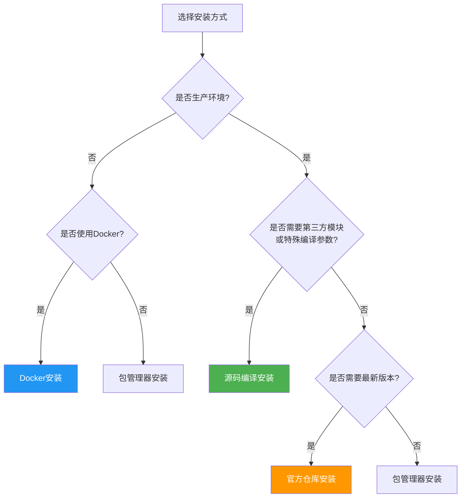
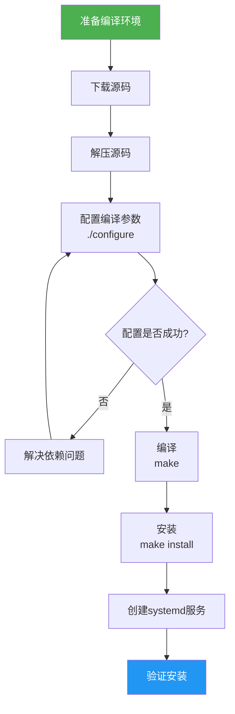
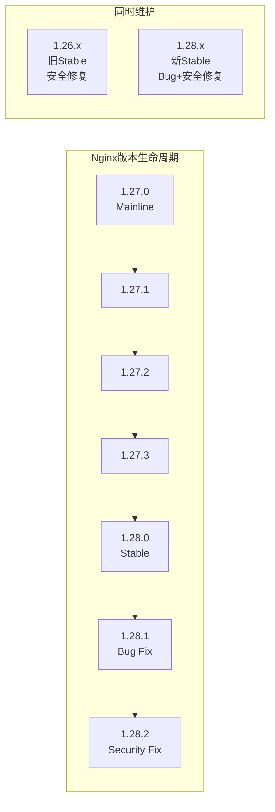
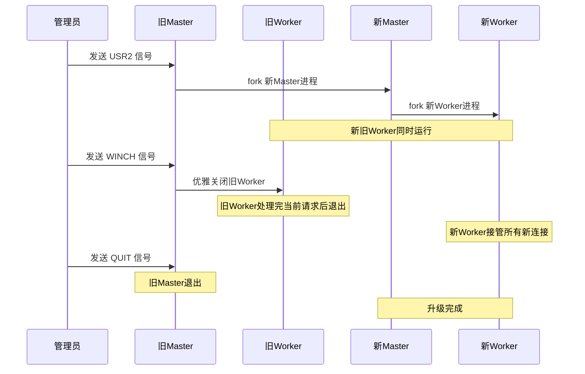
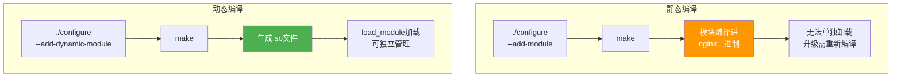

# Nginx 安装与版本选型

## 1. 安装方式概览

Nginx 提供多种安装方式，各有优劣，选择合适的方式是部署的第一步：

| 安装方式 | 优点 | 缺点 | 适用场景 |
|----------|------|------|----------|
| 包管理器（apt/yum） | 简单快捷、自动更新 | 版本滞后、模块有限 | 开发/测试 |
| 官方仓库（nginx.org） | 版本较新、官方维护 | 模块仍有限 | 生产通用 |
| 源码编译 | 最大灵活性、可定制模块 | 维护成本高、升级复杂 | 生产高性能 |
| Docker | 环境一致、快速部署 | 性能略损、调试不便 | 容器化部署 |
| 第三方仓库（Ondřej等） | 模块丰富、版本最新 | 非官方、稳定性待验证 | 开发尝鲜 |



## 2. 包管理器安装

### 2.1 Ubuntu/Debian 系（apt）

#### 默认仓库安装

Ubuntu 默认仓库中的 Nginx 版本通常较旧：

```bash
# 更新包索引
sudo apt update

# 安装 Nginx
sudo apt install nginx -y

# 查看版本
nginx -v
# 输出示例：nginx version: nginx/1.18.0 (Ubuntu)

# 查看编译参数
nginx -V
```

::: warning 默认仓库版本过旧
Ubuntu 22.04 LTS 默认仓库中的 Nginx 版本为 1.18.0，该版本发布于 2020 年，缺少 HTTP/3、安全补丁等重要更新。生产环境强烈建议使用 Nginx 官方仓库。
:::

#### Nginx 官方仓库安装

```bash
# 安装必要依赖
sudo apt install curl gnupg2 ca-certificates lsb-release ubuntu-keyring -y

# 导入 Nginx 官方签名密钥
curl https://nginx.org/keys/nginx_signing.key | gpg --dearmor \
    | sudo tee /usr/share/keyrings/nginx-archive-keyring.gpg >/dev/null

# 验证密钥指纹
gpg --dry-run --no-keyring --no-default-keyring \
    --keyring /usr/share/keyrings/nginx-archive-keyring.gpg \
    --verify /usr/share/keyrings/nginx-archive-keyring.gpg

# 添加 Nginx 稳定版仓库
echo "deb [signed-by=/usr/share/keyrings/nginx-archive-keyring.gpg] \
http://nginx.org/packages/ubuntu `lsb_release -cs` nginx" \
    | sudo tee /etc/apt/sources.list.d/nginx.list

# 如果需要主线版，使用以下仓库
# echo "deb [signed-by=/usr/share/keyrings/nginx-archive-keyring.gpg] \
# http://nginx.org/packages/mainline/ubuntu `lsb_release -cs` nginx" \
#     | sudo tee /etc/apt/sources.list.d/nginx.list

# 设置仓库优先级（高于系统默认仓库）
echo -e "Package: *\nPin: origin nginx.org\nPin-Priority: 900" \
    | sudo tee /etc/apt/preferences.d/99nginx

# 更新包索引并安装
sudo apt update
sudo apt install nginx -y

# 验证版本
nginx -v
# 输出示例：nginx version: nginx/1.26.2
```

### 2.2 RHEL/CentOS/Rocky/Alma 系（yum/dnf）

#### 默认仓库安装

```bash
# CentOS 7 / RHEL 7
sudo yum install epel-release -y
sudo yum install nginx -y

# CentOS 8+ / Rocky / Alma / RHEL 8+
sudo dnf install nginx -y

# 查看版本
nginx -v
```

#### Nginx 官方仓库安装

```bash
# 安装 EPEL 仓库（CentOS 7 需要）
sudo yum install epel-release -y

# 创建 Nginx 官方仓库配置
sudo tee /etc/yum.repos.d/nginx.repo << 'EOF'
[nginx-stable]
name=nginx stable repo
baseurl=http://nginx.org/packages/centos/$releasever/$basearch/
gpgcheck=1
enabled=1
gpgkey=https://nginx.org/keys/nginx_signing.key
module_hotfixes=true

[nginx-mainline]
name=nginx mainline repo
baseurl=http://nginx.org/packages/mainline/centos/$releasever/$basearch/
gpgcheck=1
enabled=0
gpgkey=https://nginx.org/keys/nginx_signing.key
module_hotfixes=true
EOF

# 如果需要使用主线版
# sudo yum-config-manager --enable nginx-mainline

# 安装 Nginx
sudo yum install nginx -y

# 验证版本
nginx -v
```

### 2.3 包管理器安装的 Nginx 文件布局

安装完成后，了解文件分布非常重要：

```
Ubuntu/Debian 文件布局：
/etc/nginx/
├── nginx.conf              # 主配置文件
├── sites-available/         # 可用站点配置
│   └── default
├── sites-enabled/           # 已启用站点（符号链接）
│   └── default -> ../sites-available/default
├── conf.d/                  # 额外配置
├── snippets/                # 配置片段
│   ├── self-signed.conf
│   └── ssl-params.conf
├── modules-available/       # 可用动态模块
└── modules-enabled/         # 已启用动态模块

RHEL/CentOS 文件布局：
/etc/nginx/
├── nginx.conf              # 主配置文件
├── conf.d/                 # 额外配置
│   └── default.conf
├── default.d/              # 默认配置片段
└── modules/                # 动态模块

通用路径：
/usr/share/nginx/html/      # 默认站点根目录
/var/log/nginx/              # 日志目录
/var/cache/nginx/            # 缓存目录
/usr/sbin/nginx              # 可执行文件
```

::: tip Ubuntu vs RHEL 配置风格差异
- Ubuntu/Debian 采用 `sites-available/sites-enabled` 模式，通过符号链接管理站点启用/禁用
- RHEL/CentOS 采用 `conf.d/` 模式，所有 `.conf` 文件自动加载
- Nginx 官方仓库的包统一使用 `conf.d/` 模式
- 两种风格可以混用，但建议统一选择一种
:::

### 2.4 包管理器安装的服务管理

```bash
# 启动 Nginx
sudo systemctl start nginx

# 设置开机自启
sudo systemctl enable nginx

# 停止 Nginx
sudo systemctl stop nginx

# 重启 Nginx
sudo systemctl restart nginx

# 重新加载配置（不中断服务）
sudo systemctl reload nginx

# 查看状态
sudo systemctl status nginx

# 查看是否开机自启
sudo systemctl is-enabled nginx
```

## 3. 源码编译安装

### 3.1 编译安装完整流程



### 3.2 准备编译环境

#### Ubuntu/Debian

```bash
# 更新系统
sudo apt update && sudo apt upgrade -y

# 安装编译工具链
sudo apt install build-essential -y

# 安装 Nginx 编译依赖
sudo apt install -y \
    libpcre3 libpcre3-dev \        # PCRE 正则库（必须）
    zlib1g zlib1g-dev \            # zlib 压缩库（必须）
    libssl-dev \                   # OpenSSL 库（SSL模块需要）
    libgeoip-dev \                 # GeoIP 库
    libgd-dev \                    # GD 图形库
    libxml2 libxml2-dev \          # XML 库
    libxslt1-dev \                 # XSLT 库
    libpam0g-dev \                 # PAM 认证库
    uuid-dev \                     # UUID 库
    libgoogle-perftools-dev \      # Google PerfTools (tcmalloc)
    pkg-config                     # 编译配置工具
```

#### RHEL/CentOS/Rocky

```bash
# 安装编译工具链
sudo dnf groupinstall "Development Tools" -y

# 安装 Nginx 编译依赖
sudo dnf install -y \
    pcre pcre-devel \              # PCRE 正则库
    zlib zlib-devel \              # zlib 压缩库
    openssl openssl-devel \        # OpenSSL 库
    gd gd-devel \                  # GD 图形库
    geoip-devel \                  # GeoIP 库
    libxml2 libxml2-devel \        # XML 库
    libxslt libxslt-devel \        # XSLT 库
    perl-ExtUtils-Embed            # Perl 嵌入
```

### 3.3 下载与解压源码

```bash
# 创建编译目录
mkdir -p /usr/local/src/nginx
cd /usr/local/src/nginx

# 下载稳定版源码
# 访问 https://nginx.org/en/download.html 获取最新版本号
curl -O https://nginx.org/download/nginx-1.26.2.tar.gz

# 下载签名文件（可选，用于验证）
curl -O https://nginx.org/download/nginx-1.26.2.tar.gz.asc

# 验证签名（需要导入 Nginx 签名密钥）
gpg --verify nginx-1.26.2.tar.gz.asc nginx-1.26.2.tar.gz

# 解压
tar -xzf nginx-1.26.2.tar.gz
cd nginx-1.26.2

# 查看目录结构
ls -la
```

源码目录结构：

```
nginx-1.26.2/
├── auto/           # 自动检测脚本
├── conf/           # 默认配置文件模板
├── contrib/        # 贡献工具（vim语法高亮等）
├── html/           # 默认HTML页面
├── man/            # 手册页
├── src/            # 源代码
│   ├── core/       # 核心代码
│   ├── event/      # 事件模块
│   ├── http/       # HTTP模块
│   ├── mail/       # 邮件模块
│   ├── stream/     # Stream模块
│   ├── os/         # 操作系统适配
│   └── misc/       # 其他
├── configure       # 配置脚本
└── CHANGES         # 变更日志
```

### 3.4 配置编译参数（./configure）

这是编译安装最关键的一步，决定了 Nginx 将包含哪些功能和模块：

```bash
./configure \
    # ===== 基础路径 =====
    --prefix=/etc/nginx \                         # 安装前缀路径
    --sbin-path=/usr/sbin/nginx \                 # 可执行文件路径
    --modules-path=/usr/lib64/nginx/modules \     # 动态模块路径
    --conf-path=/etc/nginx/nginx.conf \           # 配置文件路径
    --error-log-path=/var/log/nginx/error.log \   # 错误日志路径
    --http-log-path=/var/log/nginx/access.log \   # 访问日志路径
    --pid-path=/var/run/nginx.pid \               # PID文件路径
    --lock-path=/var/run/nginx.lock \             # 锁文件路径

    # ===== 用户与进程 =====
    --user=nginx \                                # Worker进程运行用户
    --group=nginx \                               # Worker进程运行组

    # ===== 编译优化 =====
    --with-cc-opt="-O2 -g -pipe -Wall -Wp,-D_FORTIFY_SOURCE=2 -fexceptions -fstack-protector-strong --param=ssp-buffer-size=4 -grecord-gcc-switches -m64 -mtune=generic" \
    --with-ld-opt="-Wl,-z,relro -Wl,-z,now -pie" \

    # ===== 必要模块 =====
    --with-pcre \                                 # 使用PCRE库
    --with-pcre-jit \                             # PCRE JIT编译优化
    --with-zlib=/usr/local/src/zlib \            # 指定zlib路径（如自定义编译）

    # ===== HTTP 核心模块 =====
    --with-http_ssl_module \                      # SSL/TLS支持（生产必须）
    --with-http_v2_module \                       # HTTP/2支持
    --with-http_v3_module \                       # HTTP/3(QUIC)支持（1.25.0+）
    --with-http_realip_module \                    # 真实IP获取
    --with-http_addition_module \                 # 响应内容追加
    --with-http_sub_module \                      # 响应内容替换
    --with-http_dav_module \                      # WebDAV支持
    --with-http_flv_module \                      # FLV流媒体
    --with-http_mp4_module \                      # MP4流媒体
    --with-http_gunzip_module \                   # 解压响应
    --with-http_gzip_static_module \              # 预压缩文件
    --with-http_auth_request_module \              # 子请求认证
    --with-http_random_index_module \              # 随机首页
    --with-http_secure_link_module \              # 安全链接
    --with-http_slice_module \                    # 大文件分片
    --with-http_stub_status_module \              # 状态监控

    # ===== Mail 模块 =====
    --with-mail \                                 # 邮件代理
    --with-mail_ssl_module \                      # 邮件SSL

    # ===== Stream 模块 =====
    --with-stream \                               # TCP/UDP代理
    --with-stream_ssl_module \                    # Stream SSL
    --with-stream_realip_module \                  # Stream 真实IP
    --with-stream_geoip_module \                  # Stream GeoIP

    # ===== 第三方模块 =====
    --add-module=/usr/local/src/headers-more-nginx-module \    # 静态编译
    --add-module=/usr/local/src/echo-nginx-module \
    --add-dynamic-module=/usr/local/src/ngx_brotli             # 动态编译
```

### 3.5 编译参数详解

#### 路径类参数

| 参数 | 默认值 | 说明 |
|------|--------|------|
| `--prefix` | `/usr/local/nginx` | 安装根路径，其他路径的默认基础 |
| `--sbin-path` | `prefix/sbin/nginx` | 可执行文件路径 |
| `--modules-path` | `prefix/modules` | 动态模块目录 |
| `--conf-path` | `prefix/conf/nginx.conf` | 主配置文件路径 |
| `--error-log-path` | `prefix/logs/error.log` | 错误日志路径 |
| `--http-log-path` | `prefix/logs/access.log` | 访问日志路径 |
| `--pid-path` | `prefix/logs/nginx.pid` | PID文件路径 |
| `--lock-path` | `prefix/logs/nginx.lock` | 锁文件路径 |
| `--user` | nobody | Worker进程运行用户 |
| `--group` | nobody | Worker进程运行组 |

#### 编译优化参数

```bash
# --with-cc-opt: 传递给 C 编译器的额外选项
--with-cc-opt="-O2 -g -pipe -Wall -Wp,-D_FORTIFY_SOURCE=2 -fexceptions -fstack-protector-strong"

# 常用编译优化选项：
# -O2          : GCC优化等级2（平衡编译时间和运行性能）
# -g           : 生成调试信息
# -pipe        : 使用管道代替临时文件加速编译
# -Wall        : 启用所有常见警告
# -D_FORTIFY_SOURCE=2 : 缓冲区溢出检测
# -fstack-protector-strong : 栈保护
# -m64         : 生成64位代码
# -mtune=generic : 优化为通用CPU

# --with-ld-opt: 传递给链接器的额外选项
--with-ld-opt="-Wl,-z,relro -Wl,-z,now -pie"

# 常用链接选项：
# -Wl,-z,relro : 只读重定位（部分RELRO）
# -Wl,-z,now   : 完整RELRO
# -pie         : 位置无关可执行文件（ASLR增强）
```

::: important 安全编译选项
`-D_FORTIFY_SOURCE=2`、`-fstack-protector-strong`、`-Wl,-z,relro,-z,now` 和 `-pie` 都是重要的安全加固选项，能够有效防止缓冲区溢出、栈攻击和内存布局预测等攻击。生产环境的编译务必包含这些选项。参考：[https://nginx.org/en/docs/configure.html](https://nginx.org/en/docs/configure.html)
:::

### 3.6 编译与安装

```bash
# 编译（利用多核加速）
make -j$(nproc)

# 安装
sudo make install

# 验证安装
nginx -v
# nginx version: nginx/1.26.2

# 查看编译参数
nginx -V
# built by gcc 11.4.0 (Ubuntu 11.4.0-1ubuntu1~22.04)
# configure arguments: --prefix=/etc/nginx ...

# 检查配置
sudo nginx -t
# nginx: the configuration file /etc/nginx/nginx.conf syntax is ok
# nginx: configuration file /etc/nginx/nginx.conf test is successful
```

### 3.7 创建 systemd 服务文件

源码编译安装不会自动创建 systemd 服务，需要手动配置：

```bash
# 创建 nginx 用户（如果不存在）
sudo useradd -r -s /sbin/nologin nginx

# 创建 systemd 服务文件
sudo tee /etc/systemd/system/nginx.service << 'EOF'
[Unit]
Description=The nginx HTTP and reverse proxy server
After=network.target remote-fs.target nss-lookup.target
Wants=network-online.target

[Service]
Type=forking
PIDFile=/var/run/nginx.pid
ExecStartPre=/usr/sbin/nginx -t -c /etc/nginx/nginx.conf
ExecStart=/usr/sbin/nginx -c /etc/nginx/nginx.conf
ExecReload=/bin/kill -s HUP $MAINPID
ExecStop=/bin/kill -s QUIT $MAINPID
PrivateTmp=true
Restart=on-failure
RestartSec=5s

[Install]
WantedBy=multi-user.target
EOF

# 重载 systemd 配置
sudo systemctl daemon-reload

# 启动并设置开机自启
sudo systemctl start nginx
sudo systemctl enable nginx

# 检查状态
sudo systemctl status nginx
```

### 3.8 编译后验证

```bash
# 验证版本与编译参数
nginx -V 2>&1

# 验证模块加载
nginx -V 2>&1 | grep -o 'with-http_[a-z_]*_module' | sort

# 验证配置语法
sudo nginx -t

# 启动并测试
sudo systemctl start nginx
curl -I http://localhost/

# 预期输出：
# HTTP/1.1 200 OK
# Server: nginx/1.26.2
# Date: ...
# Content-Type: text/html
# ...
```

## 4. Docker 安装

### 4.1 官方 Docker 镜像

Nginx 在 Docker Hub 上提供了多个官方镜像标签：

| 镜像标签 | 基础镜像 | 说明 |
|----------|----------|------|
| `nginx:latest` | Debian Bookworm | 最新稳定版 |
| `nginx:1.26` | Debian Bookworm | 指定大版本 |
| `nginx:1.26.2` | Debian Bookworm | 指定精确版本 |
| `nginx:1.26-alpine` | Alpine 3.19 | Alpine 小体积版 |
| `nginx:1.26-alpine-slim` | Alpine 3.19 | Alpine 极简版 |
| `nginx:mainline` | Debian Bookworm | 最新主线版 |
| `nginx:mainline-alpine` | Alpine 3.19 | 主线版 Alpine |

::: tip 镜像选择建议
- **生产环境**：使用精确版本标签（如 `nginx:1.26.2-alpine`），避免 `latest`
- **镜像体积**：Alpine 版约 25MB，Debian 版约 140MB
- **兼容性**：Alpine 使用 musl libc，某些模块可能存在兼容问题
- **稳定性**：Debian 版更稳定，Alpine 版更轻量
:::

### 4.2 Docker 基础运行

```bash
# 最简单的运行方式
docker run --name my-nginx -d -p 80:80 nginx:1.26

# 带配置文件和站点目录的运行
docker run --name my-nginx -d \
    -p 80:80 \
    -p 443:443 \
    -v /etc/nginx/nginx.conf:/etc/nginx/nginx.conf:ro \
    -v /etc/nginx/conf.d:/etc/nginx/conf.d:ro \
    -v /var/www/html:/usr/share/nginx/html:ro \
    -v /var/log/nginx:/var/log/nginx \
    -v /etc/nginx/ssl:/etc/nginx/ssl:ro \
    nginx:1.26

# 验证运行状态
docker ps
curl -I http://localhost/
```

### 4.3 Docker Compose 部署

```yaml
# docker-compose.yml
version: '3.8'

services:
  nginx:
    image: nginx:1.26-alpine
    container_name: nginx-proxy
    restart: unless-stopped
    ports:
      - "80:80"
      - "443:443"
    volumes:
      - ./nginx/nginx.conf:/etc/nginx/nginx.conf:ro
      - ./nginx/conf.d:/etc/nginx/conf.d:ro
      - ./nginx/ssl:/etc/nginx/ssl:ro
      - ./www:/usr/share/nginx/html:ro
      - nginx-logs:/var/log/nginx
      - nginx-cache:/var/cache/nginx
    environment:
      - TZ=Asia/Shanghai
    networks:
      - frontend
    depends_on:
      - app1
      - app2
    healthcheck:
      test: ["CMD", "wget", "--quiet", "--tries=1", "--spider", "http://localhost/"]
      interval: 30s
      timeout: 5s
      retries: 3

  app1:
    image: myapp:latest
    container_name: app1
    restart: unless-stopped
    networks:
      - frontend
      - backend
    environment:
      - APP_PORT=8080

  app2:
    image: myapp:latest
    container_name: app2
    restart: unless-stopped
    networks:
      - frontend
      - backend
    environment:
      - APP_PORT=8080

volumes:
  nginx-logs:
  nginx-cache:

networks:
  frontend:
  backend:
```

### 4.4 自定义 Docker 镜像

```dockerfile
# Dockerfile - 基于官方镜像添加自定义模块
FROM nginx:1.26 AS builder

# 安装编译依赖
RUN apt-get update && apt-get install -y \
    build-essential \
    libpcre3-dev \
    zlib1g-dev \
    libssl-dev \
    wget \
    && rm -rf /var/lib/apt/lists/*

# 下载并编译第三方模块
RUN cd /tmp \
    && wget https://github.com/openresty/headers-more-nginx-module/archive/refs/tags/v0.37.tar.gz \
    && tar -xzf v0.37.tar.gz \
    && wget https://github.com/google/ngx_brotli/archive/refs/heads/master.tar.gz \
    && tar -xzf master.tar.gz \
    && cd ngx_brotli-master && git init || true && git submodule update --init || true \
    && cd /tmp

# 获取 Nginx 源码并重新编译
RUN nginx_ver=$(nginx -v 2>&1 | cut -d'/' -f2) \
    && wget https://nginx.org/download/nginx-${nginx_ver}.tar.gz \
    && tar -xzf nginx-${nginx_ver}.tar.gz \
    && cd nginx-${nginx_ver} \
    && nginx -V 2>&1 | grep -o 'configure arguments:.*' | cut -d: -f2- > conf_args \
    && cat conf_args \
    && ./configure $(cat conf_args) \
        --add-dynamic-module=/tmp/headers-more-nginx-module-0.37 \
        --add-dynamic-module=/tmp/ngx_brotli-master \
    && make -j$(nproc) \
    && make install

# 生产镜像
FROM nginx:1.26

# 从构建阶段复制编译产物
COPY --from=builder /etc/nginx/modules/ /etc/nginx/modules/

# 复制自定义配置
COPY nginx.conf /etc/nginx/nginx.conf
COPY conf.d/ /etc/nginx/conf.d/

# 暴露端口
EXPOSE 80 443

CMD ["nginx", "-g", "daemon off;"]
```

### 4.5 Docker 环境中的 Nginx 注意事项

```nginx
# Docker 环境下的特殊配置
worker_processes auto;  # 自动检测CPU核心数

# Docker 容器中可能需要调整
events {
    worker_connections 1024;
}

http {
    # 关闭 server_tokens，避免暴露版本
    server_tokens off;

    # Docker 网络优化
    keepalive_timeout 65;
    client_max_body_size 100m;

    # 代理到 Docker 内部服务
    upstream docker_app {
        server app1:8080;
        server app2:8080;
    }

    server {
        listen 80;
        server_name localhost;

        location / {
            proxy_pass http://docker_app;
            proxy_set_header Host $host;
            proxy_set_header X-Real-IP $remote_addr;
            proxy_set_header X-Forwarded-For $proxy_add_x_forwarded_for;
            proxy_set_header X-Forwarded-Proto $scheme;
        }
    }
}
```

## 5. 版本选型策略

### 5.1 版本选型决策矩阵

| 因素 | 选择 Stable | 选择 Mainline |
|------|-----------|--------------|
| 生产稳定性 | 优先 | 需评估 |
| 安全补丁 | 两边都有 | 两边都有 |
| 新功能需求 | 等待下一稳定版 | 立即可用 |
| HTTP/3 支持 | 需 1.25.0+ 稳定版 | 更早可用 |
| Bug 修复速度 | 关键修复 | 所有修复 |
| 社区验证 | 更充分 | 相对较少 |
| 长期维护 | 版本间更安全 | 需要跟进 |

### 5.2 Nginx 官方版本策略



### 5.3 版本选型建议

```bash
# 查看当前可用版本
# 访问 https://nginx.org/en/download.html

# 生产环境推荐：使用最新稳定版
# 当前推荐版本：1.26.x

# 需要最新功能时：使用主线版
# 当前主线版本：1.27.x

# 版本锁定策略：
# - 使用精确版本号，不要用 latest
# - 升级前在测试环境验证
# - 制定版本升级窗口
```

::: warning 版本升级风险
- Nginx 升级前务必检查变更日志（[CHANGES](https://nginx.org/en/docs/changes.html)）
- 关注不兼容变更（Behavior Changes）
- SSL/TLS 相关模块的升级需要特别关注安全影响
- 升级后必须执行 `nginx -t` 验证配置兼容性
:::

## 6. 多版本共存方案

### 6.1 不同端口运行多版本

```bash
# 已有系统 Nginx（1.18）运行在 80 端口
# 编译新版本运行在 8080 端口用于测试

# 编译时指定不同前缀
./configure \
    --prefix=/etc/nginx-new \
    --sbin-path=/usr/sbin/nginx-new \
    --conf-path=/etc/nginx-new/nginx.conf \
    --pid-path=/var/run/nginx-new.pid \
    --with-http_ssl_module

make -j$(nproc)
sudo make install

# 配置新版本监听不同端口
sudo sed -i 's/listen 80/listen 8080/' /etc/nginx-new/nginx.conf

# 启动新版本
sudo /usr/sbin/nginx-new -c /etc/nginx-new/nginx.conf
```

### 6.2 容器化多版本

```bash
# 运行多个 Nginx 版本容器
docker run -d --name nginx-stable -p 80:80 nginx:1.26-alpine
docker run -d --name nginx-mainline -p 8080:80 nginx:1.27-alpine
docker run -d --name nginx-old -p 8081:80 nginx:1.24-alpine

# 测试各版本
curl -I http://localhost/
curl -I http://localhost:8080/
curl -I http://localhost:8081/
```

## 7. Nginx 热升级流程

热升级（平滑升级）是 Nginx 的重要特性，允许在不中断服务的情况下升级 Nginx 二进制文件。

### 7.1 热升级原理



### 7.2 热升级详细步骤

```bash
# ===== 步骤 1：编译新版本 =====
cd /usr/local/src/nginx
curl -O https://nginx.org/download/nginx-1.26.2.tar.gz
tar -xzf nginx-1.26.2.tar.gz
cd nginx-1.26.2

# 使用与旧版本相同的编译参数
# 获取旧版本编译参数
OLD_ARGS=$(nginx -V 2>&1 | grep 'configure arguments:' | sed 's/configure arguments: //')

./configure $OLD_ARGS
make -j$(nproc)
# 注意：不要执行 make install，我们先手动替换二进制

# ===== 步骤 2：备份旧二进制 =====
sudo cp /usr/sbin/nginx /usr/sbin/nginx.old

# ===== 步骤 3：替换二进制文件 =====
sudo cp objs/nginx /usr/sbin/nginx

# ===== 步骤 4：发送 USR2 信号（启动新 Master） =====
sudo kill -USR2 $(cat /var/run/nginx.pid)

# 此时会生成新 PID 文件
ls -la /var/run/nginx.pid*
# /var/run/nginx.pid      ← 新 Master 的 PID
# /var/run/nginx.pid.oldbin ← 旧 Master 的 PID

# ===== 步骤 5：发送 WINCH 信号（优雅关闭旧 Worker） =====
sudo kill -WINCH $(cat /var/run/nginx.pid.oldbin)

# 观察旧 Worker 逐渐退出
ps aux | grep nginx
# 此时只有新 Worker 在处理请求

# ===== 步骤 6：确认升级成功 =====
# 确认新版本正常运行
curl -I http://localhost/
nginx -v

# ===== 步骤 7：关闭旧 Master =====
sudo kill -QUIT $(cat /var/run/nginx.pid.oldbin)

# ===== 回滚操作（如果升级失败） =====
# 步骤 5 之后、步骤 7 之前，如果发现新版本有问题：
# 恢复旧二进制
sudo cp /usr/sbin/nginx.old /usr/sbin/nginx
# 发送 HUP 信号给旧 Master（重新拉起旧 Worker）
sudo kill -HUP $(cat /var/run/nginx.pid.oldbin)
# 发送 QUIT 信号给新 Master（关闭新进程）
sudo kill -QUIT $(cat /var/run/nginx.pid)
# 发送 KILL 信号给新 Worker（强制关闭）
sudo kill -9 $(pgrep -P $(cat /var/run/nginx.pid) nginx)
```

### 7.3 热升级注意事项

::: important 热升级关键注意点
1. **编译参数必须一致**：新版本的编译参数应与旧版本相同，否则可能导致模块丢失
2. **共享内存兼容**：如果使用了共享内存（如 `proxy_cache_path`），确保新版本兼容
3. **配置兼容性**：升级前先检查新版本的变更日志，确认配置兼容
4. **监控验证**：升级后密切监控错误日志和性能指标
5. **回滚准备**：始终保留旧二进制文件，直到确认新版本稳定运行
6. **时间窗口**：选择低流量时段执行升级
7. **不要使用 `make install`**：手动替换二进制更安全可控
:::

## 8. 第三方模块编译

### 8.1 静态编译 vs 动态编译



### 8.2 静态编译第三方模块

```bash
# 下载第三方模块源码
cd /usr/local/src
git clone https://github.com/openresty/headers-more-nginx-module.git
git clone https://github.com/openresty/echo-nginx-module.git

# 编译时添加模块
./configure \
    --prefix=/etc/nginx \
    --with-http_ssl_module \
    --add-module=/usr/local/src/headers-more-nginx-module \
    --add-module=/usr/local/src/echo-nginx-module

make -j$(nproc)
sudo make install
```

### 8.3 动态编译第三方模块

Nginx 1.9.11+ 支持动态模块，可以将模块编译为独立的 `.so` 文件：

```bash
# 动态编译模块（需要先有 Nginx 源码且已 configure）
cd /usr/local/src/nginx-1.26.2

# 下载 Brotli 模块
git clone https://github.com/google/ngx_brotli.git
cd ngx_brotli && git submodule update --init && cd ..

# 只编译动态模块（不重新编译整个 Nginx）
./configure \
    --prefix=/etc/nginx \
    --with-http_ssl_module \
    --add-dynamic-module=/usr/local/src/nginx-1.26.2/ngx_brotli

# 只编译模块
make modules

# 复制 .so 文件到模块目录
sudo cp objs/ngx_http_brotli_filter_module.so /usr/lib64/nginx/modules/
sudo cp objs/ngx_http_brotli_static_module.so /usr/lib64/nginx/modules/
```

在 `nginx.conf` 中加载动态模块：

```nginx
# 在 main 上下文最顶部加载
load_module modules/ngx_http_brotli_filter_module.so;
load_module modules/ngx_http_brotli_static_module.so;

http {
    # Brotli 压缩配置
    brotli on;
    brotli_comp_level 6;
    brotli_types text/plain text/css application/javascript application/json;
    # ...
}
```

### 8.4 常用第三方模块编译指南

#### headers-more-nginx-module

```bash
git clone https://github.com/openresty/headers-more-nginx-module.git

# 编译
./configure --add-dynamic-module=/path/to/headers-more-nginx-module
make modules

# 配置使用
# load_module modules/ngx_http_headers_more_filter_module.so;
```

#### ngx_brotli

```bash
git clone https://github.com/google/ngx_brotli.git
cd ngx_brotli && git submodule update --init && cd ..

# 编译
./configure --add-dynamic-module=/path/to/ngx_brotli
make modules

# 配置使用
# load_module modules/ngx_http_brotli_filter_module.so;
# load_module modules/ngx_http_brotli_static_module.so;
```

#### geoip2-nginx-module

```bash
# 需要先安装 libmaxminddb
sudo apt install libmaxminddb-dev  # Ubuntu
# sudo dnf install libmaxminddb-devel  # RHEL

git clone https://github.com/leev/ngx_http_geoip2_module.git

# 编译
./configure --add-dynamic-module=/path/to/ngx_http_geoip2_module
make modules

# 配置使用
# load_module modules/ngx_http_geoip2_module.so;
```

### 8.5 模块版本兼容性

::: warning 模块版本兼容
- 第三方模块必须与 Nginx 版本兼容，不兼容的模块可能导致崩溃
- Nginx 升级后需要重新编译第三方模块
- 动态模块的 ABI 可能在不同小版本间变化
- 编译前检查模块的兼容性说明
- 使用 `nginx -V` 确认模块是否成功编译
:::

## 9. 编译优化

### 9.1 性能优化编译选项

```bash
./configure \
    # 使用 PCRE JIT 加速正则匹配
    --with-pcre-jit \

    # 线程池支持（用于非阻塞文件操作）
    --with-threads \

    # Google PerfTools (tcmalloc) 内存分配器
    # 需要安装 libgoogle-perftools-dev
    --with-google_perftools_module \

    # 编译优化
    --with-cc-opt="-O3 -march=native -mtune=native"
```

### 9.2 OpenSSL 版本选择

```bash
# 方式一：使用系统 OpenSSL
sudo apt install libssl-dev
./configure --with-http_ssl_module

# 方式二：编译自定义 OpenSSL（获取最新安全修复）
cd /usr/local/src
curl -O https://www.openssl.org/source/openssl-3.3.2.tar.gz
tar -xzf openssl-3.3.2.tar.gz
cd openssl-3.3.2
./config --prefix=/usr/local/openssl-3.3.2 \
    --openssldir=/usr/local/openssl-3.3.2 \
    shared zlib
make -j$(nproc)
sudo make install

# 编译 Nginx 时指定 OpenSSL 路径
./configure \
    --with-http_ssl_module \
    --with-openssl=/usr/local/src/openssl-3.3.2

# 方式三：使用 BoringSSL（Google 维护的 OpenSSL 分支）
# 需要先编译 BoringSSL
git clone https://boringssl.googlesource.com/boringssl
cd boringssl
cmake -B build && cmake --build build
# 然后配置 Nginx 时使用
```

### 9.3 链接时优化（LTO）

```bash
# 启用 LTO（Link Time Optimization）
./configure \
    --with-cc-opt="-O3 -flto -march=native" \
    --with-ld-opt="-flto"

# LTO 可以进行跨模块优化，通常能提升 2-5% 性能
# 但会增加编译时间和内存消耗
```

### 9.4 针对特定 CPU 优化

```bash
# 查看当前 CPU 支持的指令集
cat /proc/cpuinfo | grep flags | head -1

# 针对特定 CPU 架构优化
# Intel Xeon（服务器常见）
--with-cc-opt="-O3 -march=skylake-avx512"

# AMD EPYC
--with-cc-opt="-O3 -march=znver3"

# 通用优化（适合虚拟化环境）
--with-cc-opt="-O3 -march=x86-64-v2"
```

::: important 编译优化注意事项
- `-march=native` 只在编译和运行在同一台机器时有效
- Docker 构建时注意基础镜像的 CPU 架构兼容性
- 生产环境建议使用 `-march=x86-64-v2` 或 `-march=haswell` 等通用选项
- 过度优化可能带来稳定性风险，务必充分测试
:::

## 10. 安装验证与初始配置

### 10.1 安装验证清单

```bash
# 1. 版本验证
nginx -v

# 2. 编译参数验证
nginx -V 2>&1 | tee /tmp/nginx_compile_info.txt

# 3. 检查关键模块
nginx -V 2>&1 | grep -E 'ssl|v2|v3|stream|realip|gzip|stub_status'

# 4. 配置语法验证
sudo nginx -t

# 5. 检查端口监听
sudo ss -tlnp | grep nginx

# 6. 检查进程
ps aux | grep nginx

# 7. 测试访问
curl -I http://localhost/

# 8. 检查日志
sudo tail /var/log/nginx/error.log

# 9. 检查 systemd 状态
sudo systemctl status nginx

# 10. 检查开机自启
sudo systemctl is-enabled nginx
```

### 10.2 初始安全配置

```nginx
# /etc/nginx/nginx.conf - 安全基线配置
user nginx;
worker_processes auto;
worker_rlimit_nofile 65535;

# 隐藏版本号
http {
    server_tokens off;

    # 安全相关头部
    add_header X-Content-Type-Options "nosniff" always;
    add_header X-Frame-Options "SAMEORIGIN" always;

    # 禁用不需要的 HTTP 方法
    # 在 server 块中配置
    # if ($request_method !~ ^(GET|HEAD|POST)$ ) {
    #     return 405;
    # }

    server {
        listen 80;
        server_name _;

        # 默认拒绝未匹配的域名
        return 444;
    }
}
```

### 10.3 初始性能配置

```nginx
# /etc/nginx/nginx.conf - 性能基线配置
user nginx;
worker_processes auto;
worker_rlimit_nofile 65535;

events {
    worker_connections 4096;
    multi_accept on;
    use epoll;
}

http {
    # 基础优化
    sendfile on;
    tcp_nopush on;
    tcp_nodelay on;

    # 连接保持
    keepalive_timeout 65;
    keepalive_requests 1000;

    # 客户端限制
    client_max_body_size 20m;
    client_body_buffer_size 128k;

    # Gzip 压缩
    gzip on;
    gzip_vary on;
    gzip_proxied any;
    gzip_comp_level 4;
    gzip_min_length 256;
    gzip_types
        text/plain
        text/css
        application/json
        application/javascript
        text/xml
        application/xml
        application/xml+rss
        text/javascript;

    # 日志格式
    log_format main '$remote_addr - $remote_user [$time_local] "$request" '
                    '$status $body_bytes_sent "$http_referer" '
                    '"$http_user_agent" "$http_x_forwarded_for"';

    access_log /var/log/nginx/access.log main;
    error_log /var/log/nginx/error.log warn;

    include /etc/nginx/conf.d/*.conf;
}
```

### 10.4 防火墙配置

```bash
# Ubuntu/Debian (ufw)
sudo ufw allow 'Nginx Full'
sudo ufw allow 'Nginx HTTPS'
sudo ufw status

# RHEL/CentOS (firewalld)
sudo firewall-cmd --permanent --add-service=http
sudo firewall-cmd --permanent --add-service=https
sudo firewall-cmd --reload
sudo firewall-cmd --list-all

# iptables
sudo iptables -A INPUT -p tcp --dport 80 -j ACCEPT
sudo iptables -A INPUT -p tcp --dport 443 -j ACCEPT
sudo iptables-save > /etc/iptables/rules.v4
```

### 10.5 SELinux 配置（RHEL/CentOS）

```bash
# 查看 SELinux 状态
getenforce

# 如果 SELinux 为 Enforcing，需要配置策略
# 允许 Nginx 网络连接
sudo setsebool -P httpd_can_network_connect 1

# 允许 Nginx 连接数据库
sudo setsebool -P httpd_can_network_connect_db 1

# 允许 Nginx 读取用户目录
sudo setsebool -P httpd_enable_homedirs 1

# 查看所有 Nginx 相关布尔值
getsebool -a | grep httpd

# 如果 Nginx 无法启动，查看 SELinux 拒绝日志
sudo ausearch -m avc --start recent
sudo sealert -a /var/log/audit/audit.log
```

## 11. 常见安装问题排查

### 11.1 编译阶段常见错误

| 错误信息 | 原因 | 解决方案 |
|----------|------|----------|
| `./configure: error: C compiler cc is not found` | 未安装编译器 | `sudo apt install build-essential` |
| `./configure: error: the HTTP rewrite module requires the PCRE library` | 缺少 PCRE 开发库 | `sudo apt install libpcre3-dev` |
| `./configure: error: SSL modules require the OpenSSL library` | 缺少 OpenSSL 开发库 | `sudo apt install libssl-dev` |
| `./configure: error: the HTTP gzip module requires the zlib library` | 缺少 zlib 开发库 | `sudo apt install zlib1g-dev` |
| `./configure: error: the GeoIP module requires the GeoIP library` | 缺少 GeoIP 开发库 | `sudo apt install libgeoip-dev` |
| `make: *** [objs/Makefile:...] Error 1` | 编译错误 | 检查编译参数和源码版本兼容性 |

### 11.2 运行阶段常见错误

```bash
# 错误：nginx: [emerg] bind() to 0.0.0.0:80 failed (98: Address already in use)
# 原因：80 端口被占用
sudo lsof -i :80
sudo kill -9 <PID>
# 或者修改监听端口

# 错误：nginx: [emerg] open() "/etc/nginx/nginx.conf" failed (13: Permission denied)
# 原因：权限不足
sudo nginx -t  # 需要使用 sudo

# 错误：nginx: [emerg] getpwnam("nginx") failed
# 原因：nginx 用户不存在
sudo useradd -r -s /sbin/nologin nginx

# 错误：nginx: [emerg] mkdir() "/var/cache/nginx" failed (13: Permission denied)
# 原因：缓存目录权限问题
sudo mkdir -p /var/cache/nginx
sudo chown nginx:nginx /var/cache/nginx
```

### 11.3 安装验证脚本

```bash
#!/bin/bash
# nginx_install_verify.sh - Nginx 安装验证脚本

echo "===== Nginx 安装验证 ====="

# 1. 检查可执行文件
echo -n "1. 可执行文件: "
if command -v nginx &> /dev/null; then
    echo "✓ $(which nginx)"
else
    echo "✗ 未找到 nginx"
    exit 1
fi

# 2. 检查版本
echo -n "2. 版本: "
nginx -v 2>&1

# 3. 检查关键模块
echo "3. 关键模块:"
nginx -V 2>&1 | grep -oE 'with-http_[a-z0-9_]+' | sed 's/^/   /'

# 4. 检查配置
echo -n "4. 配置验证: "
sudo nginx -t 2>&1

# 5. 检查进程
echo -n "5. 进程状态: "
if pgrep nginx &> /dev/null; then
    echo "✓ 运行中"
    ps aux | grep nginx | grep -v grep
else
    echo "✗ 未运行"
fi

# 6. 检查端口
echo "6. 端口监听:"
sudo ss -tlnp | grep nginx

# 7. 测试访问
echo -n "7. HTTP 访问: "
HTTP_CODE=$(curl -s -o /dev/null -w "%{http_code}" http://localhost/)
if [ "$HTTP_CODE" = "200" ] || [ "$HTTP_CODE" = "301" ]; then
    echo "✓ HTTP $HTTP_CODE"
else
    echo "✗ HTTP $HTTP_CODE"
fi

# 8. 检查 systemd
echo -n "8. 开机自启: "
sudo systemctl is-enabled nginx 2>/dev/null || echo "未知"

echo "===== 验证完成 ====="
```

## 12. 本章小结

本章详细介绍了 Nginx 的各种安装方式和版本选型策略：

1. **包管理器安装**：简单快捷但版本有限，适合快速部署和测试
2. **官方仓库安装**：版本较新且官方维护，适合多数生产场景
3. **源码编译安装**：最大灵活性和可定制性，适合高性能生产环境
4. **Docker 安装**：环境一致且快速部署，适合容器化架构
5. **版本选型**：Stable vs Mainline 的选择应基于稳定性需求
6. **热升级**：利用 USR2 + WINCH + QUIT 信号实现零停机升级
7. **第三方模块**：理解 `--add-module` 与 `--add-dynamic-module` 的区别
8. **编译优化**：通过编译选项和链接优化提升性能
9. **安装验证**：完整的验证清单确保安装正确

下一章将深入 Nginx 的内部架构，理解 Master-Worker 进程模型和请求处理流程。
