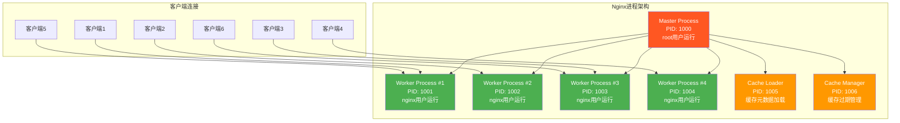
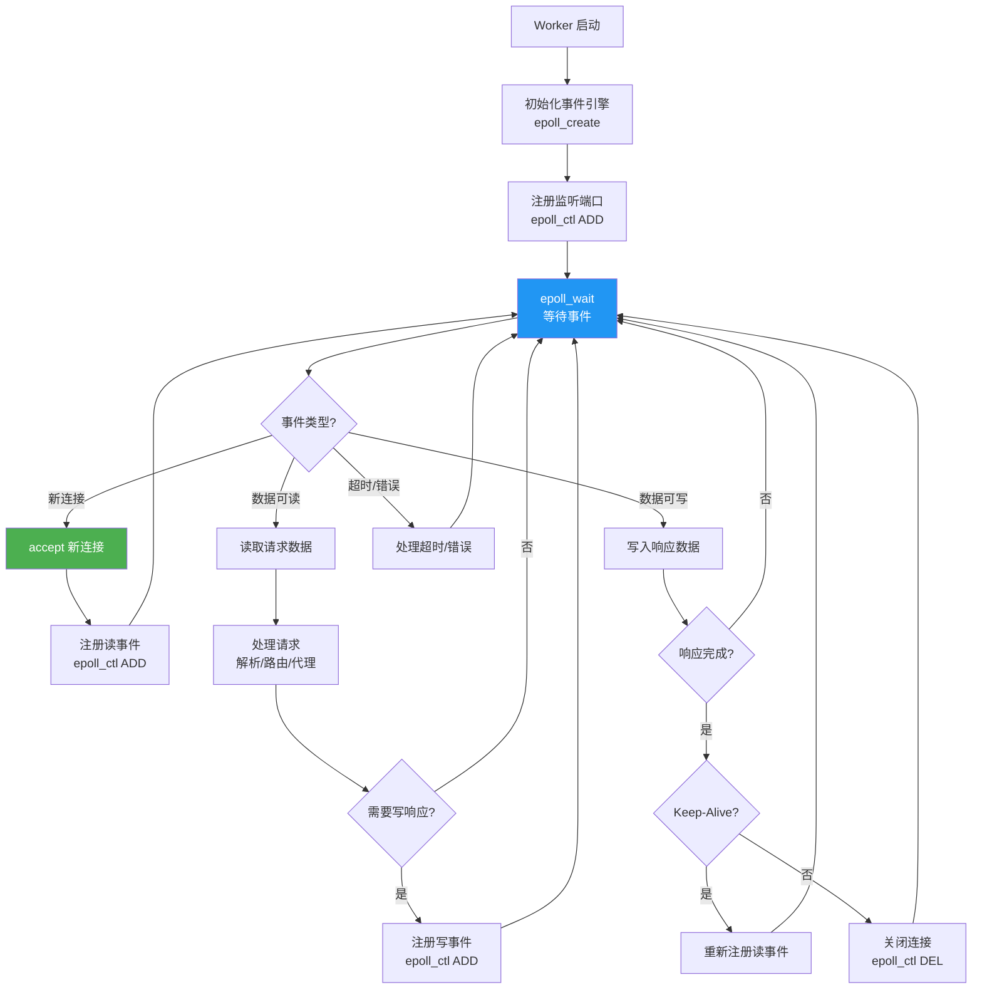
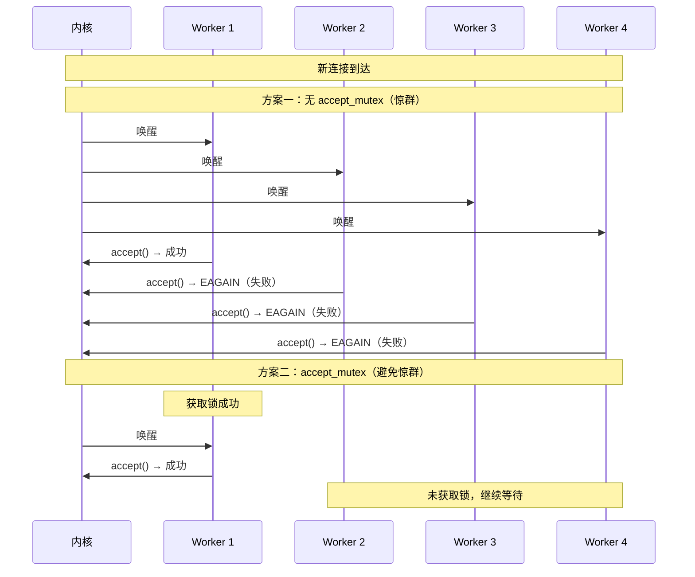
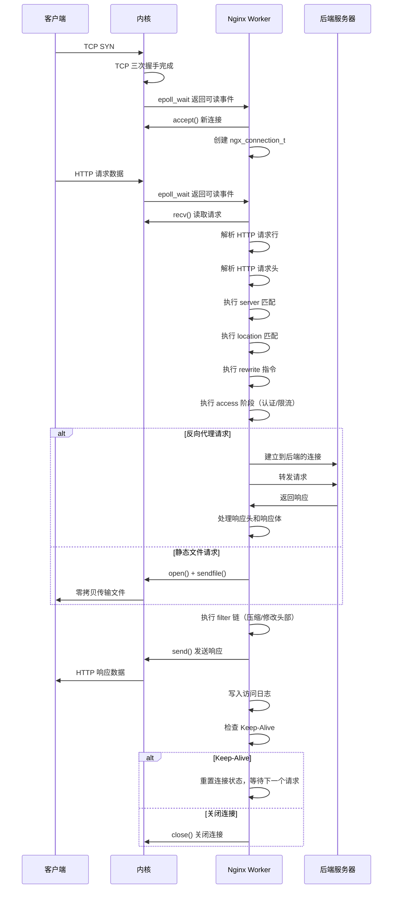
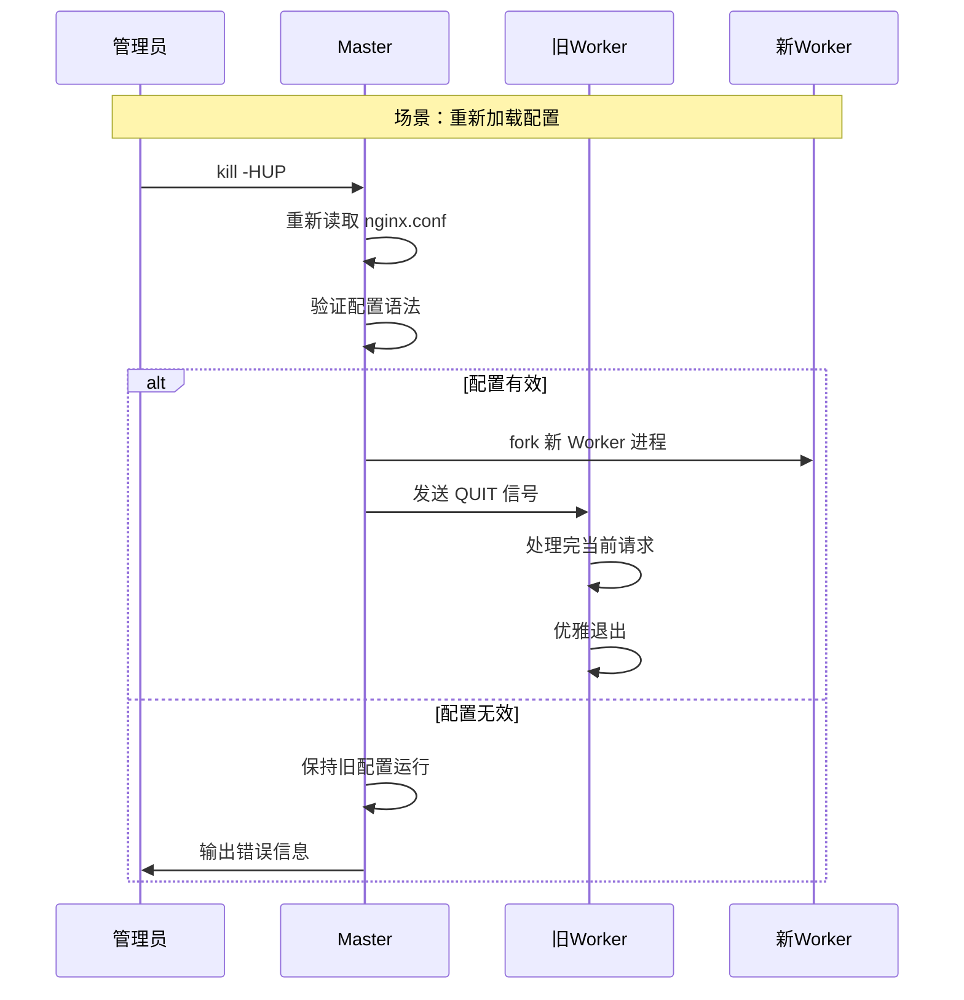
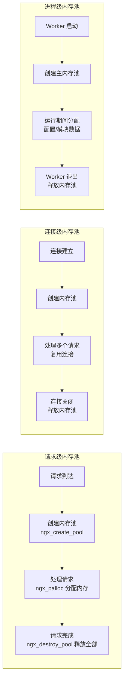
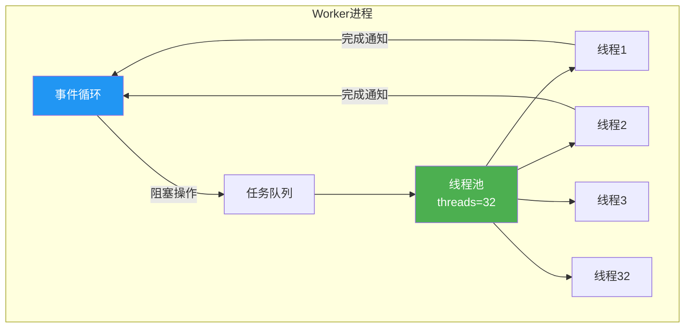
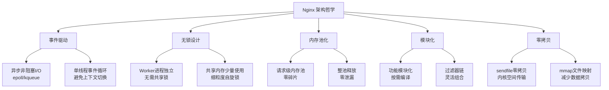

# Nginx 架构与请求处理流程

## 1. Master-Worker 进程模型

### 1.1 架构总览

Nginx 采用经典的 **Master-Worker** 多进程架构，这是其高并发高性能的基石。Master 进程负责管理，Worker 进程负责实际请求处理，两者各司其职。



### 1.2 Master 进程

Master 进程是 Nginx 的管理者，以 root 用户启动，主要职责包括：

| 职责 | 说明 |
|------|------|
| 读取配置 | 启动时读取并验证 `nginx.conf` |
| 管理 Worker | 创建、监控、重启 Worker 进程 |
| 绑定端口 | 监听端口的绑定（需要 root 权限） |
| 信号处理 | 接收并处理外部信号（HUP、USR1、USR2 等） |
| 平滑重启 | 接收到 HUP 信号时重新加载配置 |
| 日志轮转 | 接收到 USR1 信号时重新打开日志文件 |
| 热升级 | 配合 USR2 信号完成二进制文件升级 |

```c
// Nginx Master 进程简化的事件循环
while (1) {
    // 等待子进程状态变化或信号
    sigsuspend(&set);

    if (sigchld) {
        // 有子进程退出，检查是否需要重启
        pid = waitpid(-1, &status, WNOHANG);
        if (pid > 0) {
            // 如果是 Worker 异常退出，重新 fork
            if (WIFSIGNALED(status)) {
                ngx_spawn_process(cycle, ngx_worker_process_cycle);
            }
        }
    }

    if (ngx_terminate) {
        // 向所有 Worker 发送 TERM 信号
        ngx_signal_worker_processes(SIGTERM);
    }

    if (ngx_quit) {
        // 向所有 Worker 发送 QUIT 信号（优雅关闭）
        ngx_signal_worker_processes(SIGQUIT);
    }

    if (ngx_reconfigure) {
        // 重新加载配置
        ngx_init_cycle(cycle);
        ngx_start_worker_processes(cycle);
        ngx_signal_worker_processes(SIGQUIT); // 关闭旧 Worker
    }
}
```

### 1.3 Worker 进程

Worker 进程是 Nginx 的工作主力，以非特权用户（通常是 `nginx`）运行：

```bash
# 查看 Nginx 进程结构
ps aux | grep nginx

# 输出示例：
# root      1000  0.0  0.1  46364  1236 ?        Ss   10:00   0:00 nginx: master process /usr/sbin/nginx
# nginx     1001  0.0  0.2  47000  2100 ?        S    10:00   0:00 nginx: worker process
# nginx     1002  0.0  0.2  47000  2100 ?        S    10:00   0:00 nginx: worker process
# nginx     1003  0.0  0.2  47000  2100 ?        S    10:00   0:00 nginx: worker process
# nginx     1004  0.0  0.2  47000  2100 ?        S    10:00   0:00 nginx: worker process
# nginx     1005  0.0  0.1  46364  1100 ?        S    10:00   0:00 nginx: cache loader
# nginx     1006  0.0  0.1  46364  1100 ?        S    10:00   0:00 nginx: cache manager
```

Worker 进程的关键特征：

1. **单线程事件循环**：每个 Worker 在单个线程中运行事件循环
2. **相互独立**：Worker 之间不共享锁，各自管理自己的连接
3. **对等关系**：所有 Worker 功能相同，可处理任意请求
4. **内存隔离**：每个 Worker 有独立的内存空间
5. **CPU 亲和**：每个 Worker 可绑定到特定 CPU 核心

```nginx
# Worker 进程配置
worker_processes auto;           # 自动检测CPU核心数
worker_cpu_affinity auto;       # 自动CPU亲和绑定
worker_rlimit_nofile 65535;     # 文件描述符限制
worker_priority -5;              # 进程优先级（-20最高，19最低）
```

### 1.4 Cache Loader 与 Cache Manager

当启用了代理缓存（`proxy_cache_path`）时，Nginx 会额外启动两个辅助进程：

| 进程 | 职责 | 运行时机 |
|------|------|----------|
| Cache Loader | 加载缓存目录中的元数据到共享内存 | 启动时运行一次后退出 |
| Cache Manager | 检查缓存条目有效性，删除过期缓存 | 周期性运行 |

```nginx
# 缓存相关进程配置
proxy_cache_path /var/cache/nginx levels=1:2
                 keys_zone=my_cache:10m
                 max_size=1g
                 inactive=60m
                 use_temp_path=off;

# Cache Loader 在启动时遍历缓存目录
# 加载元数据到 keys_zone 共享内存
# 加载完成后自动退出

# Cache Manager 周期性检查
# 删除过期缓存条目
# 当缓存总大小超过 max_size 时删除最旧条目
```

::: info 缓存进程的资源消耗
Cache Loader 在启动阶段可能消耗较多 CPU 和 I/O 资源（遍历整个缓存目录），但对于已经预热的大型缓存来说这是必要的一步。Cache Manager 的资源消耗通常很低。参考：[https://nginx.org/en/docs/http/ngx_http_proxy_module.html#proxy_cache_path](https://nginx.org/en/docs/http/ngx_http_proxy_module.html#proxy_cache_path)
:::

### 1.5 进程间关系图

```
[root] nginx 启动
   │
   ├── Master Process (PID: 1000, User: root)
   │     │
   │     ├── fork() → Worker #1 (PID: 1001, User: nginx)
   │     ├── fork() → Worker #2 (PID: 1002, User: nginx)
   │     ├── fork() → Worker #3 (PID: 1003, User: nginx)
   │     ├── fork() → Worker #4 (PID: 1004, User: nginx)
   │     ├── fork() → Cache Loader (PID: 1005, User: nginx)
   │     └── fork() → Cache Manager (PID: 1006, User: nginx)
   │
   └── 各进程间通过 共享内存(shm) 通信
       └── 通过 信号(Signal) 进行控制
```

## 2. 事件驱动模型

### 2.1 事件驱动核心思想

Nginx 的核心设计理念是**事件驱动**（Event-Driven），这与传统的**进程/线程驱动**模型有着根本区别：

```
传统模型（一个连接一个线程）：
┌────────────────────────────────────────┐
│ 线程1: accept → read → [阻塞等待] → process → write │
│ 线程2: accept → read → [阻塞等待] → process → write │
│ 线程3: accept → read → [阻塞等待] → process → write │
│ ...                                                     │
│ 线程N: accept → read → [阻塞等待] → process → write  │
└────────────────────────────────────────┘
问题：大量线程在等待I/O时占用资源

Nginx 事件驱动模型（单线程事件循环）：
┌────────────────────────────────────────┐
│ Worker Thread:                          │
│   epoll_wait() → [连接1可读] → read → process → write │
│   epoll_wait() → [连接3可写] → write                   │
│   epoll_wait() → [新连接] → accept → 注册事件         │
│   epoll_wait() → [连接5可读] → read → process          │
│   ...                                                   │
└────────────────────────────────────────┘
优势：只在有事件时处理，无阻塞等待
```

### 2.2 事件循环机制



### 2.3 I/O 多路复用技术详解

#### select

```c
// select 系统调用
int select(int nfds, fd_set *readfds, fd_set *writefds,
           fd_set *exceptfds, struct timeval *timeout);

// 工作流程：
// 1. 将所有文件描述符从用户空间拷贝到内核空间
// 2. 内核遍历所有描述符，检查是否有就绪事件
// 3. 将结果从内核空间拷贝回用户空间
// 4. 用户空间遍历结果，处理就绪的描述符

// 限制：
// - FD_SETSIZE 通常为 1024（硬编码）
// - 每次调用需要传递全部描述符
// - 返回后需要线性扫描查找就绪描述符
// - O(n) 复杂度
```

#### poll

```c
// poll 系统调用
int poll(struct pollfd *fds, nfds_t nfds, int timeout);

struct pollfd {
    int   fd;         /* 文件描述符 */
    short events;     /* 关注的事件 */
    short revents;    /* 返回的事件 */
};

// 改进：
// - 突破了 1024 的数量限制
// - 使用结构体数组，接口更清晰
// - 输入输出分离（events/revents）

// 限制：
// - 仍然是 O(n) 复杂度
// - 仍然需要传递所有描述符
// - 大量连接时性能不佳
```

#### epoll（Linux）

```c
// epoll 三步走
// 步骤1：创建 epoll 实例
int epfd = epoll_create1(0);

// 步骤2：注册/修改/删除事件
struct epoll_event ev;
ev.events = EPOLLIN;           // 关注可读事件
ev.data.fd = client_fd;        // 关联文件描述符
epoll_ctl(epfd, EPOLL_CTL_ADD, client_fd, &ev);  // 注册

// 步骤3：等待事件就绪
struct epoll_event events[MAX_EVENTS];
int n = epoll_wait(epfd, events, MAX_EVENTS, timeout);

// 只返回就绪的描述符，无需遍历所有

// 边缘触发（ET）vs 水平触发（LT）：
// LT（默认）：只要缓冲区有数据，epoll_wait 就返回
// ET（高性能）：只在数据到达时通知一次，必须一次性读完
```

::: tip Nginx 与 epoll
Nginx 默认使用水平触发（LT）模式，这是因为在 ET 模式下必须一次性读完所有数据，否则可能丢失事件。LT 模式编程更简单，虽然理论上 ET 模式性能更高，但 LT 模式的实际性能差距很小。参考：[https://nginx.org/en/docs/http/ngx_http_core_module.html](https://nginx.org/en/docs/http/ngx_http_core_module.html)
:::

#### kqueue（BSD/macOS）

```c
// kqueue 是 BSD/macOS 上的高效事件通知机制
int kq = kqueue();

// 注册事件
struct kevent change;
EV_SET(&change, fd, EVFILT_READ, EV_ADD | EV_ENABLE, 0, 0, NULL);
kevent(kq, &change, 1, NULL, 0, NULL);

// 等待事件
struct kevent events[MAX_EVENTS];
int n = kevent(kq, NULL, 0, events, MAX_EVENTS, &timeout);

// kqueue 的优势：
// - 除了文件描述符事件，还支持：
//   - 信号（EVFILT_SIGNAL）
//   - 定时器（EVFILT_TIMER）
//   - 进程事件（EVFILT_PROC）
//   - 文件系统事件（EVFILT_VNODE）
```

### 2.4 各平台默认事件模型

| 操作系统 | 默认事件模型 | 配置指令 |
|----------|------------|----------|
| Linux 2.6+ | epoll | `use epoll;` |
| FreeBSD / macOS | kqueue | `use kqueue;` |
| Solaris 10+ | /dev/poll 或 eventport | `use /dev/poll;` 或 `use eventport;` |
| 其他 | select | `use select;` |

```nginx
events {
    # 通常不需要手动指定，Nginx 会自动选择最优模型
    # Linux:
    # use epoll;
    # macOS:
    # use kqueue;

    worker_connections 4096;
    multi_accept on;
    accept_mutex off;
}
```

## 3. 连接管理

### 3.1 连接接受流程

当新连接到达时，Nginx 的处理流程如下：

```
1. 内核完成 TCP 三次握手
2. 连接放入 listen 队列（backlog）
3. Worker 进程通过 epoll_wait 被唤醒
4. 调用 accept() 接受连接
5. 创建 ngx_connection_t 结构
6. 注册读事件到 epoll
7. 等待客户端数据
```

### 3.2 accept_mutex 与惊群问题

在多 Worker 进程同时监听同一端口时，会出现**惊群问题（Thundering Herd）**：当新连接到达时，所有 Worker 都会被唤醒，但只有一个能成功 accept，其余白白消耗 CPU。



#### accept_mutex 配置

```nginx
events {
    # accept_mutex：是否启用连接互斥锁
    # 1.11.3 之前默认为 on：Worker 轮流获取锁，避免惊群
    # 1.11.3 起默认为 off：所有 Worker 同时竞争，高并发时性能更好

    # Nginx 1.11.3+ 默认为 off
    # 原因：现代内核已通过 SO_REUSEPORT 等方式解决惊群问题
    accept_mutex off;

    # accept_mutex_delay：获取锁失败后的等待时间
    # 仅在 accept_mutex on 时有效
    # accept_mutex_delay 500ms;
}
```

::: warning accept_mutex 的取舍
- **开启 accept_mutex**：避免惊群，但在极高并发下锁竞争可能成为瓶颈
- **关闭 accept_mutex**：允许惊群，但在现代 Linux 内核中影响极小
- **最佳实践**：
  - Linux 3.9+ 使用 `SO_REUSEPORT` 替代
  - Nginx 1.11.3+ 默认关闭 `accept_mutex`
  - 高并发场景建议关闭
:::

### 3.3 SO_REUSEPORT（内核级负载均衡）

```nginx
# SO_REUSEPORT：多个 Worker 各自独立监听同一端口
# 内核将新连接均匀分配给各 Worker
# 完全避免惊群问题

server {
    listen 80 reuseport;
    # 内核为每个 Worker 创建独立的 listen 队列
    # 新连接由内核分配到某个 Worker 的队列
}

# 对比传统模式：
# server {
#     listen 80;
#     # 所有 Worker 共享一个 listen 队列
#     # 需要通过 accept_mutex 避免惊群
# }
```

SO_REUSEPORT 的优势：

| 特性 | 传统模式 | SO_REUSEPORT |
|------|---------|--------------|
| listen 队列 | 共享一个 | 每个 Worker 独立 |
| 惊群问题 | 需要处理 | 内核自动解决 |
| 连接分配 | Worker 竞争 | 内核均匀分配 |
| 锁竞争 | accept_mutex | 无锁 |
| Worker 隔离 | 共享 | 完全独立 |
| 连接均匀度 | 不够均匀 | 更均匀 |
| 需要内核版本 | 无特殊要求 | Linux 3.9+ |

### 3.4 连接池

Nginx 预先分配连接池，避免运行时动态分配：

```nginx
events {
    # 每个 Worker 的最大并发连接数
    worker_connections 4096;

    # 总最大连接数 = worker_processes × worker_connections
    # 例如：4 Worker × 4096 = 16384 个并发连接
}
```

连接池的内存消耗估算：

```
每个 ngx_connection_t 结构约 560 字节
4 个 Worker × 4096 连接 × 560 字节 ≈ 9.2 MB

加上读写缓冲区：
每个连接约 4KB（读）+ 4KB（写）= 8KB
4 × 4096 × 8KB ≈ 131 MB

总计约 140 MB 用于连接管理
远低于同等并发下 Apache 的内存消耗
```

## 4. 请求处理完整生命周期

### 4.1 请求处理序列图



### 4.2 HTTP 请求处理阶段

Nginx 将 HTTP 请求处理分为 11 个阶段，每个阶段由对应的模块处理：

| 阶段编号 | 阶段名称 | 说明 | 涉及模块 |
|----------|----------|------|----------|
| 0 | `NGX_HTTP_POST_READ_PHASE` | 读取请求后 | realip |
| 1 | `NGX_HTTP_SERVER_REWRITE_PHASE` | Server 级重写 | rewrite |
| 2 | `NGX_HTTP_FIND_CONFIG_PHASE` | 查找 location | core |
| 3 | `NGX_HTTP_REWRITE_PHASE` | Location 级重写 | rewrite |
| 4 | `NGX_HTTP_POST_REWRITE_PHASE` | 重写后检查 | core |
| 5 | `NGX_HTTP_PREACCESS_PHASE` | 访问前检查 | limit_req, limit_conn |
| 6 | `NGX_HTTP_ACCESS_PHASE` | 访问控制 | access, auth_basic |
| 7 | `NGX_HTTP_POST_ACCESS_PHASE` | 访问后检查 | core |
| 8 | `NGX_HTTP_PRECONTENT_PHASE` | 内容生成前 | try_files |
| 9 | `NGX_HTTP_CONTENT_PHASE` | 生成内容 | proxy, fastcgi, static |
| 10 | `NGX_HTTP_LOG_PHASE` | 记录日志 | log |

```nginx
# 各阶段对应的配置指令示例

# 阶段0：POST_READ - 读取请求后
# realip 模块在此阶段工作
set_real_ip_from 10.0.0.0/8;
real_ip_header X-Forwarded-For;

# 阶段1：SERVER_REWRITE - Server级重写
server {
    rewrite ^/old(.*)$ /new$1 permanent;
}

# 阶段2：FIND_CONFIG - 查找location（自动）

# 阶段3：REWRITE - Location级重写
location /api/ {
    rewrite ^/api/v1/(.*)$ /api/v2/$1 break;
}

# 阶段5：PREACCESS - 访问前（限流）
limit_req_zone $binary_remote_addr zone=api:10m rate=100r/s;
limit_conn_zone $binary_remote_addr zone=conn_limit:10m;

# 阶段6：ACCESS - 访问控制
allow 10.0.0.0/8;
deny all;
auth_basic "Restricted";
auth_basic_user_file /etc/nginx/.htpasswd;

# 阶段8：PRECONTENT - try_files
location / {
    try_files $uri $uri/ @fallback;
}

# 阶段9：CONTENT - 内容生成
location / {
    proxy_pass http://backend;  # 或 root /var/www/html;
}

# 阶段10：LOG - 日志
access_log /var/log/nginx/access.log main;
```

### 4.3 请求处理的详细步骤

#### 步骤1：接受连接

```c
// Nginx 源码简化：接受新连接
ngx_connection_t *c = ngx_get_connection(s, log);  // 从连接池获取
ngx_event_t *rev = c->read;
ngx_event_t *wev = c->write;

// 设置回调函数
rev->handler = ngx_http_init_request;  // 读事件处理函数

// 注册到 epoll
ngx_add_event(rev, NGX_READ_EVENT, 0);
```

#### 步骤2：读取请求

```c
// 读取 HTTP 请求
n = ngx_recv(c, c->buffer->last, c->buffer->end - c->buffer->last);

// 解析请求行
rc = ngx_http_parse_request_line(r, c->buffer);

// 解析请求头
rc = ngx_http_parse_header_line(r, c->buffer, 1);
```

#### 步骤3：服务器与位置匹配

```
1. 根据 Host 头匹配 server 块
2. 在匹配的 server 块中，根据 URI 匹配 location
3. location 匹配优先级：
   a. 精确匹配（=）：最高优先级
   b. 前缀匹配（^~）：次高优先级
   c. 正则匹配（~/~*）：按配置顺序
   d. 普通前缀匹配：最长匹配
```

#### 步骤4：执行重写

```nginx
# Server 级重写（阶段1）
server {
    rewrite ^/old-site/(.*)$ /new-site/$1 permanent;
}

# Location 级重写（阶段3）
location /legacy/ {
    rewrite ^/legacy/(.*)$ /modern/$1 break;
}
```

#### 步骤5：访问控制

```nginx
# 阶段5：限流
limit_req zone=api burst=50 nodelay;
limit_conn conn_limit 100;

# 阶段6：访问控制
allow 192.168.0.0/16;
deny all;

# 基本认证
auth_basic "Login Required";
auth_basic_user_file /etc/nginx/.htpasswd;
```

#### 步骤6：生成内容

```nginx
# 静态文件
location /static/ {
    root /var/www;
    sendfile on;
}

# 反向代理
location /api/ {
    proxy_pass http://backend;
}

# FastCGI
location ~ \.php$ {
    fastcgi_pass unix:/var/run/php-fpm.sock;
    fastcgi_param SCRIPT_FILENAME $document_root$fastcgi_script_name;
    include fastcgi_params;
}
```

#### 步骤7：过滤链

内容生成后，响应会经过一系列过滤器（filter）处理：

```
响应内容 → filter 链
├── ngx_http_header_filter_module   → 构建响应头
├── ngx_http_chunked_filter_module  → 分块传输编码
├── ngx_http_range_filter_module    → 范围请求处理
├── ngx_http_gzip_filter_module     → Gzip 压缩
├── ngx_http_sub_filter_module      → 内容替换
├── ngx_http_addition_filter_module → 内容追加
├── ngx_http_charset_filter_module  → 字符集转换
└── ngx_http_ssi_filter_module      → SSI 处理
```

#### 步骤8：发送响应

```c
// 发送响应
ngx_http_output_filter(r, out);

// 如果启用了 sendfile
if (r->sendfile) {
    sendfile(c->fd, fd, &offset, size);
}
```

#### 步骤9：记录日志

```nginx
# 自定义日志格式
log_format detailed '$remote_addr - $remote_user [$time_local] '
                    '"$request" $status $body_bytes_sent '
                    '"$http_referer" "$http_user_agent" '
                    'rt=$request_time '
                    'upstream_addr="$upstream_addr" '
                    'upstream_status=$upstream_status '
                    'upstream_response_time=$upstream_response_time';

access_log /var/log/nginx/access.log detailed;
```

### 4.4 Keep-Alive 连接复用

```nginx
http {
    # Keep-Alive 配置
    keepalive_timeout 65s;        # Keep-Alive 超时时间
    keepalive_requests 1000;      # 单个连接最大请求数
    keepalive_disable msie6;      # 禁用特定浏览器的 Keep-Alive

    # 与上游服务器的 Keep-Alive
    upstream backend {
        server 10.0.0.1:8080;
        keepalive 32;             # 到上游的空闲 Keep-Alive 连接数
    }

    server {
        location / {
            proxy_pass http://backend;
            proxy_http_version 1.1;                    # 使用 HTTP/1.1
            proxy_set_header Connection "";             # 清除 Connection 头
        }
    }
}
```

Keep-Alive 的生命周期：

```
请求1 → [读请求 → 处理 → 写响应] → 保持连接
                                        │
请求2 → [读请求 → 处理 → 写响应] ←───┘
                                        │
请求3 → [读请求 → 处理 → 写响应] ←───┘
                                        │
超时(65s) → 关闭连接
```

## 5. Worker 进程间通信与共享内存

### 5.1 进程间通信方式

由于 Worker 进程之间不共享地址空间，Nginx 提供了几种进程间通信机制：

| 通信方式 | 用途 | 性能 |
|----------|------|------|
| 共享内存（shm） | 共享数据结构 | 最快 |
| 信号（Signal） | 控制命令 | 即时 |
| 管道（Pipe） | 通道通信 | 一般 |
| Socket | 辅助通信 | 一般 |

### 5.2 共享内存

共享内存是 Worker 进程间最重要的通信方式：

```nginx
# 共享内存使用场景

# 1. SSL 会话缓存
ssl_session_cache shared:SSL:10m;

# 2. 限流区域
limit_req_zone $binary_remote_addr zone=req_limit:10m rate=100r/s;
limit_conn_zone $binary_remote_addr zone=conn_limit:10m;

# 3. 缓存键区域
proxy_cache_path /var/cache/nginx keys_zone=my_cache:100m;

# 4. 变量映射
map_hash_bucket_size 64;

# 5. 上游服务器状态
upstream backend {
    zone backend 64k;
    server 10.0.0.1:8080;
}

# 6. Lua 共享字典（OpenResty）
# lua_shared_dict my_dict 10m;
```

共享内存大小计算：

```
以 limit_req_zone 为例：
- 一个 32 位 IP 地址占用约 64 字节
- 10MB = 10 × 1024 × 1024 / 64 ≈ 163,840 个 IP
- 如果使用 $binary_remote_addr（4字节），比 $remote_addr（7-15字节）更节省

proxy_cache_path 的 keys_zone：
- 一个缓存键约 128 字节
- 100m ≈ 100 × 1024 × 1024 / 128 ≈ 819,200 个缓存键
```

::: tip 共享内存规划
共享内存的大小应该根据实际需求合理配置。过小会导致数据丢失或性能下降，过大会浪费内存。建议通过监控（如 `nginx_stub_status`）观察实际使用情况来调整。参考：[https://nginx.org/en/docs/http/ngx_http_limit_req_module.html#limit_req_zone](https://nginx.org/en/docs/http/ngx_http_limit_req_module.html#limit_req_zone)
:::

### 5.3 信号通信

Master 进程通过信号控制 Worker 进程的行为：

```c
// Nginx 内部信号处理
// Master → Worker 的信号：
// SIGTERM : 快速关闭
// SIGQUIT : 优雅关闭
// SIGHUP  : 重新加载配置
// SIGUSR1 : 重新打开日志文件
// SIGUSR2 : 热升级
// SIGWINCH: 优雅关闭 Worker（保留 Master）

// Worker 接收到信号后的行为：
void ngx_signal_handler(int signo) {
    switch (signo) {
        case SIGTERM:
            ngx_terminate = 1;
            break;
        case SIGQUIT:
            ngx_quit = 1;
            break;
        case SIGHUP:
            ngx_reconfigure = 1;
            break;
        case SIGUSR1:
            ngx_reopen = 1;
            break;
    }
}
```

## 6. 进程管理信号

### 6.1 信号与行为对照表

| 信号 | 发送方式 | Master 行为 | Worker 行为 |
|------|----------|------------|------------|
| TERM | `kill -TERM $(cat /run/nginx.pid)` | 快速关闭，向 Worker 发送 TERM | 立即退出（快速关闭） |
| QUIT | `kill -QUIT $(cat /run/nginx.pid)` | 优雅关闭，向 Worker 发送 QUIT | 处理完当前请求后退出 |
| HUP | `kill -HUP $(cat /run/nginx.pid)` | 重新加载配置 | 旧 Worker 优雅退出，新 Worker 启动 |
| USR1 | `kill -USR1 $(cat /run/nginx.pid)` | 重新打开日志文件 | 关闭旧日志，打开新日志 |
| USR2 | `kill -USR2 $(cat /run/nginx.pid)` | 热升级：启动新 Master | 新 Worker 启动 |
| WINCH | `kill -WINCH $(cat /run/nginx.pid)` | 优雅关闭 Worker | Worker 优雅退出，Master 保留 |

### 6.2 信号操作详解

```bash
# ===== 快速关闭（TERM） =====
# 立即终止所有进程
sudo kill -TERM $(cat /var/run/nginx.pid)
# 等同于
sudo systemctl stop nginx
# 或
sudo nginx -s stop

# ===== 优雅关闭（QUIT） =====
# 等待请求处理完毕后关闭
sudo kill -QUIT $(cat /var/run/nginx.pid)
# 等同于
sudo nginx -s quit

# ===== 重新加载配置（HUP） =====
# 重新读取配置文件，启动新 Worker，优雅关闭旧 Worker
sudo kill -HUP $(cat /var/run/nginx.pid)
# 等同于
sudo nginx -s reload
# 或
sudo systemctl reload nginx

# ===== 重新打开日志（USR1） =====
# 用于日志轮转，关闭旧日志文件，打开新日志文件
sudo kill -USR1 $(cat /var/run/nginx.pid)
# 等同于
sudo nginx -s reopen

# ===== 热升级（USR2） =====
# 启动新的 Master 进程（使用新二进制）
sudo kill -USR2 $(cat /var/run/nginx.pid)

# ===== 优雅关闭旧 Worker（WINCH） =====
# 配合热升级使用
sudo kill -WINCH $(cat /var/run/nginx.pid.oldbin)
```

### 6.3 nginx -s 命令

Nginx 提供了更友好的信号发送方式：

```bash
# nginx -s 命令实际上是通过 PID 文件发送信号
sudo nginx -s stop     # 发送 TERM 信号
sudo nginx -s quit     # 发送 QUIT 信号
sudo nginx -s reload   # 发送 HUP 信号
sudo nginx -s reopen   # 发送 USR1 信号
```

### 6.4 信号处理流程



## 7. 连接池与内存池机制

### 7.1 内存池设计

Nginx 实现了高效的内存池机制（`ngx_pool_t`），是其低内存消耗的关键：

```c
// Nginx 内存池结构（简化）
typedef struct ngx_pool_s ngx_pool_t;

struct ngx_pool_s {
    ngx_pool_data_t       d;        // 数据区
    size_t                max;       // 小块内存阈值
    ngx_pool_t          *current;   // 当前内存池
    ngx_chain_t         *chain;     // 缓冲区链
    ngx_pool_large_t    *large;     // 大块内存链表
    ngx_pool_cleanup_t  *cleanup;   // 清理回调链表
    ngx_log_t           *log;       // 日志
};

typedef struct {
    u_char              *last;      // 已使用位置
    u_char              *end;       // 内存块末尾
    ngx_pool_t          *next;      // 下一个内存块
    ngx_uint_t           failed;    // 分配失败次数
} ngx_pool_data_t;
```

### 7.2 内存分配策略

```
内存分配策略：
┌───────────────────────────────────────────────────────┐
│ ngx_palloc(size)                                       │
│                                                        │
│  size <= max (通常 4096)?                              │
│  ├── 是：小块内存分配                                   │
│  │   ├── 当前块剩余空间够? → 直接分配（移动 last 指针） │
│  │   └── 不够 → 分配新内存块 → 从新块分配              │
│  │   └── 连续失败5次 → 更新 current 指针              │
│  │                                                      │
│  └── 否：大块内存分配                                   │
│      ├── malloc(size)                                  │
│      └── 加入 large 链表                               │
└───────────────────────────────────────────────────────┘
```

#### 小块内存分配

```c
// 小块内存分配（极快，无系统调用）
void *ngx_palloc_small(ngx_pool_t *pool, size_t size, ngx_uint_t align) {
    u_char *m;
    ngx_pool_t *p = pool->current;

    // 遍历内存块链表，找到有足够空间的块
    while (p) {
        m = p->d.last;
        // 对齐
        m = ngx_align_ptr(m, NGX_ALIGNMENT);
        if ((size_t)(p->d.end - m) >= size) {
            p->d.last = m + size;  // 移动 last 指针
            return m;
        }
        p = p->d.next;
    }

    // 所有块都不够，分配新块
    return ngx_palloc_block(pool, size);
}
```

#### 大块内存分配

```c
// 大块内存分配（需要系统调用）
void *ngx_palloc_large(ngx_pool_t *pool, size_t size) {
    void *p;
    ngx_uint_t n;
    ngx_pool_large_t *large;

    // 直接调用 malloc
    p = ngx_memalign(NGX_POOL_ALIGNMENT, size, pool->log);
    if (p == NULL) return NULL;

    // 尝试复用 large 链表中的空位
    n = 0;
    for (large = pool->large; large; large = large->next) {
        if (large->alloc == NULL) {
            large->alloc = p;
            return p;
        }
        if (n++ > 3) break;  // 最多检查4个
    }

    // 新建 large 节点
    large = ngx_palloc_small(pool, sizeof(ngx_pool_large_t), 1);
    large->alloc = p;
    large->next = pool->large;
    pool->large = large;

    return p;
}
```

### 7.3 内存池的生命周期



### 7.4 内存池的优势

| 特性 | Nginx 内存池 | 传统 malloc/free |
|------|-------------|-----------------|
| 分配速度 | O(1) 指针移动 | O(n) 遍历空闲链表 |
| 内存碎片 | 极少（整块分配/释放） | 常见（频繁小块分配） |
| 内存泄漏 | 几乎不可能（整池释放） | 容易忘记 free |
| 线程安全 | 无需锁（单线程） | 需要锁（多线程） |
| 缓存友好 | 连续内存 | 分散内存 |

## 8. Worker 进程内部架构

### 8.1 Worker 内部模块调用链

```
Worker 进程内部结构：

┌─────────────────────────────────────────────────┐
│ Worker Process                                    │
│                                                   │
│  ┌──────────────────────────────────────────┐    │
│  │ 事件循环 (ngx_process_events_and_timers)  │    │
│  │  ├── epoll_wait() 等待事件                │    │
│  │  ├── 处理就绪事件                         │    │
│  │  ├── 处理定时器                           │    │
│  │  └── 处理延迟事件                         │    │
│  └──────────────────────────────────────────┘    │
│                                                   │
│  ┌──────────────────────────────────────────┐    │
│  │ 连接管理                                   │    │
│  │  ├── ngx_connection_t 连接池              │    │
│  │  ├── ngx_event_t 事件结构                 │    │
│  │  └── 读/写缓冲区                          │    │
│  └──────────────────────────────────────────┘    │
│                                                   │
│  ┌──────────────────────────────────────────┐    │
│  │ HTTP 处理管线                               │    │
│  │  ├── 11 个处理阶段                         │    │
│  │  ├── 过滤器链                              │    │
│  │  └── 负载均衡                              │    │
│  └──────────────────────────────────────────┘    │
│                                                   │
│  ┌──────────────────────────────────────────┐    │
│  │ 内存管理                                    │    │
│  │  ├── ngx_pool_t 内存池                     │    │
│  │  ├── 缓冲区链                              │    │
│  │  └── 共享内存                              │    │
│  └──────────────────────────────────────────┘    │
└─────────────────────────────────────────────────┘
```

### 8.2 事件定时器

Nginx 使用红黑树实现高效的事件定时器：

```c
// 定时器基于红黑树，O(log n) 的插入/删除/查找
ngx_rbtree_t ngx_event_timer_rbtree;

// 添加定时器
ngx_event_add_timer(ev, timer);

// 删除定时器
ngx_event_del_timer(ev);

// 查找最近超时时间
ngx_msec_t ngx_event_find_timer(void);

// 处理已超时的事件
void ngx_event_expire_timers(void);
```

定时器的典型使用场景：

```nginx
# 客户端超时
client_header_timeout 60s;     # 读取请求头超时
client_body_timeout 60s;       # 读取请求体超时
send_timeout 60s;              # 响应发送超时
keepalive_timeout 65s;         # Keep-Alive 超时

# 代理超时
proxy_connect_timeout 5s;      # 连接后端超时
proxy_send_timeout 30s;         # 发送请求到后端超时
proxy_read_timeout 60s;         # 读取后端响应超时

# FastCGI 超时
fastcgi_connect_timeout 5s;
fastcgi_send_timeout 30s;
fastcgi_read_timeout 60s;
```

### 8.3 异步 I/O 与线程池

Nginx 1.7.11+ 引入了线程池支持，用于将阻塞操作卸载到独立线程：

```nginx
# 配置线程池
thread_pool default threads=32 max_queue=65536;

# 在 aio 中使用线程池
location /video/ {
    root /var/www;
    aio threads=default;
    sendfile on;
}
```



线程池适用的场景：

1. **大文件读取**：`aio threads` 替代阻塞的 `read()` 系统调用
2. **缓存加载**：从磁盘加载缓存数据
3. **文件系统操作**：需要阻塞的文件 I/O

::: warning 线程池使用注意
- 线程池仅用于特定场景，不是所有操作都需要
- 大多数情况下 Nginx 的异步非阻塞模型已经足够
- 线程池引入了锁竞争，不当使用可能降低性能
- 建议仅在文件 I/O 成为瓶颈时使用
- 参考：[https://nginx.org/en/docs/http/ngx_http_core_module.html#aio](https://nginx.org/en/docs/http/ngx_http_core_module.html#aio)
:::

## 9. Nginx 性能调优基础

### 9.1 Worker 进程调优

```nginx
# 自动检测 CPU 核心数
worker_processes auto;

# 手动设置（通常等于 CPU 核心数）
# worker_processes 4;

# CPU 亲和绑定
worker_cpu_affinity auto;
# 手动指定（4核示例）
# worker_cpu_affinity 0001 0010 0100 1000;

# 文件描述符限制
worker_rlimit_nofile 65535;
```

### 9.2 事件模型调优

```nginx
events {
    # 使用最优事件模型
    # use epoll;  # Linux（通常自动选择）

    # 每个 Worker 的并发连接数
    worker_connections 4096;

    # 尽可能多地接受新连接
    multi_accept on;

    # 关闭 accept_mutex（1.11.3+ 默认）
    accept_mutex off;
}
```

### 9.3 内核参数调优

```bash
# /etc/sysctl.conf

# ===== 网络优化 =====
# TCP 连接队列
net.core.somaxconn = 65535
net.core.netdev_max_backlog = 65535
net.ipv4.tcp_max_syn_backlog = 65535

# TCP 快速回收
net.ipv4.tcp_tw_reuse = 1
net.ipv4.tcp_fin_timeout = 15

# 本地端口范围
net.ipv4.ip_local_port_range = 1024 65535

# TCP Keep-Alive
net.ipv4.tcp_keepalive_time = 600
net.ipv4.tcp_keepalive_intvl = 30
net.ipv4.tcp_keepalive_probes = 10

# ===== 缓冲区优化 =====
# TCP 读写缓冲区
net.core.rmem_max = 16777216
net.core.wmem_max = 16777216
net.ipv4.tcp_rmem = 4096 87380 16777216
net.ipv4.tcp_wmem = 4096 65536 16777216

# ===== 文件描述符 =====
fs.file-max = 1048576

# 应用配置
sudo sysctl -p
```

### 9.4 文件描述符限制

```bash
# 临时修改
ulimit -n 65535

# 永久修改 /etc/security/limits.conf
# * soft nofile 65535
# * hard nofile 65535
# nginx soft nofile 65535
# nginx hard nofile 65535

# Nginx 配置
# worker_rlimit_nofile 65535;
```

### 9.5 性能监控

```nginx
# 启用 stub_status 模块
server {
    listen 80;
    server_name localhost;

    location /nginx_status {
        stub_status on;
        access_log off;
        allow 127.0.0.1;
        deny all;
    }
}
```

```bash
# 访问状态页面
curl http://localhost/nginx_status

# 输出示例：
# Active connections: 291
# server accepts handled requests
#  16630948 16630948 31070465
# Reading: 6 Writing: 179 Waiting: 106

# 指标解读：
# Active connections: 当前活跃连接数
# accepts: 累计接受的连接数
# handled: 累计处理的连接数（应等于accepts）
# requests: 累计处理的请求数（大于handled，因Keep-Alive）
# Reading: 正在读取请求头的连接数
# Writing: 正在写入响应的连接数
# Waiting: 等待新请求的Keep-Alive连接数
```

## 10. 架构设计哲学总结

### 10.1 Nginx 架构的核心原则



### 10.2 与其他架构对比

| 架构特征 | Nginx | Apache Event MPM | Node.js | Go net/http |
|----------|-------|-----------------|---------|------------|
| 进程模型 | Master-Worker | 多进程+事件线程 | 单进程 | 多goroutine |
| 并发模型 | 事件循环 | 事件+线程 | 事件循环 | goroutine调度 |
| 内存管理 | 内存池 | 系统malloc | V8 GC | Go GC |
| 锁设计 | 无锁（进程隔离） | 锁（共享状态） | 单线程无锁 | 锁（共享状态） |
| I/O模型 | 非阻塞+epoll | 非阻塞+epoll | 非阻塞+epoll | 非阻塞+epoll |
| 热升级 | 原生支持 | 不支持 | 不支持 | 不支持 |
| 配置热加载 | 原生支持 | 支持（graceful） | 需要实现 | 需要实现 |

## 11. 本章小结

本章深入剖析了 Nginx 的内部架构和请求处理流程：

1. **Master-Worker 模型**：Master 管理进程 + Worker 工作进程 + Cache 辅助进程，各司其职
2. **事件驱动模型**：基于 epoll/kqueue 的异步非阻塞 I/O，是 Nginx 高性能的根基
3. **连接管理**：从 accept 到 Keep-Alive，理解连接的完整生命周期
4. **惊群问题**：accept_mutex 和 SO_REUSEPORT 两种解决方案的取舍
5. **请求处理**：11 个处理阶段的管线式架构，模块化的请求处理流程
6. **进程间通信**：共享内存和信号是 Worker 间协作的核心机制
7. **信号管理**：TERM/QUIT/HUP/USR1/USR2/WINCH 各信号的精确行为
8. **内存池**：请求级内存池实现零碎片、零泄漏的高效内存管理
9. **线程池**：将阻塞 I/O 卸载到线程池，保持事件循环的非阻塞特性

理解这些底层机制，是后续学习配置优化和故障排查的基础。下一章将详细讲解 Nginx 配置文件体系。
