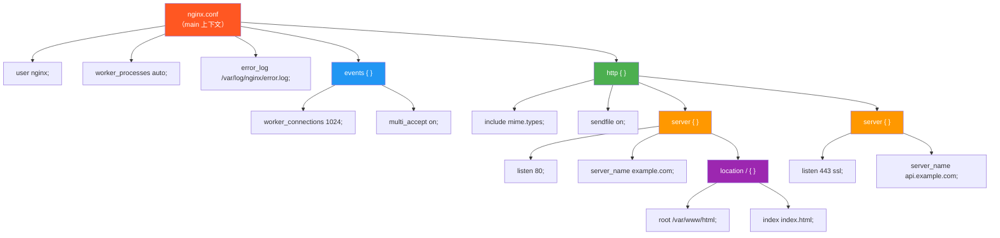
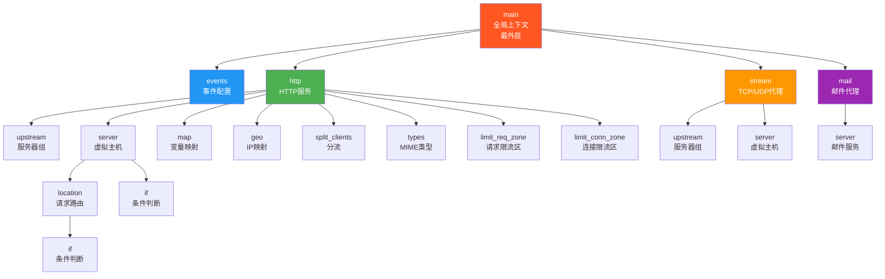
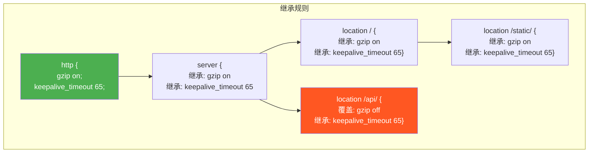
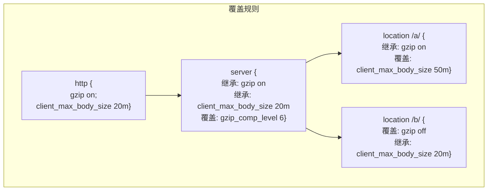
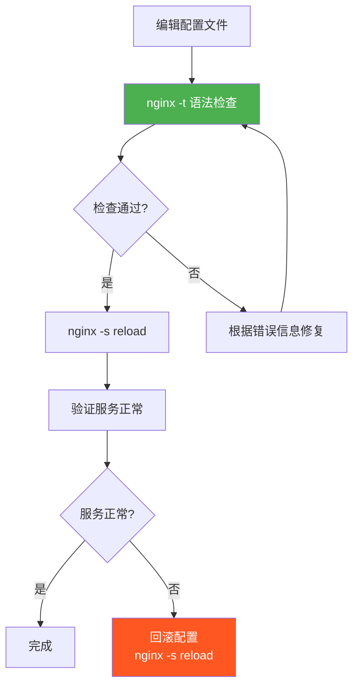

# 配置文件结构与指令语法

## 1. 简单指令与块指令

### 1.1 指令分类

Nginx 配置文件中的指令分为两大类：

| 类型 | 语法 | 示例 | 终止符 |
|------|------|------|--------|
| 简单指令 | `指令名 参数;` | `worker_processes auto;` | 分号 `;` |
| 块指令 | `指令名 参数 { ... }` | `http { ... }` | 右花括号 `}` |

### 1.2 简单指令

简单指令由指令名、参数和分号组成：

```nginx
# 基本格式：指令名 参数1 参数2 ... ;

# 无参数指令
sendfile on;

# 单参数指令
worker_processes auto;
error_log /var/log/nginx/error.log warn;
pid /var/run/nginx.pid;

# 多参数指令
gzip_types text/plain text/css application/json;
server_name example.com www.example.com;

# 带引号的参数（包含空格时）
server_name "hello world.example.com";

# 带单位的参数
client_max_body_size 20m;        # 20 兆字节
keepalive_timeout 65s;            # 65 秒
proxy_cache_path /var/cache/nginx levels=1:2 keys_zone=my_cache:10m;
```

### 1.3 块指令

块指令用花括号 `{}` 包含一组子指令：

```nginx
# 基本格式：指令名 参数 { 子指令... }

# 无参数块指令
events {
    worker_connections 1024;
}

# 带参数块指令
http {
    sendfile on;
    server {
        listen 80;
    }
}

# 带多个参数的块指令
upstream backend {
    server 10.0.0.1:8080 weight=3;
    server 10.0.0.2:8080 weight=2;
}
```

### 1.4 语法树结构



### 1.5 语法规则详解

```nginx
# ===== 规则1：每条简单指令必须以分号结尾 =====
worker_processes auto;   # 正确
# worker_processes auto   # 错误：缺少分号

# ===== 规则2：块指令用花括号包裹，不需要分号 =====
events {
    worker_connections 1024;   # 子指令需要分号
}   # 块指令以花括号结束，不需要分号

# ===== 规则3：指令参数用空格分隔 =====
server_name example.com www.example.com;   # 两个参数

# ===== 规则4：参数可以用引号包裹 =====
# 单引号：不转义
server_name 'example.com';
# 双引号：支持转义
log_format main "$remote_addr - $remote_user";

# ===== 规则5：注释以 # 开头 =====
# 这是一行注释
sendfile on;  # 行尾注释

# ===== 规则6：指令名不区分大小写（但惯例全小写） =====
# 以下两种写法等价（但不推荐大写）
worker_processes auto;
# Worker_Processes auto;

# ===== 规则7：参数可以包含正则表达式 =====
location ~ ^/api/v[0-9]+/ {
    proxy_pass http://backend;
}
# ~ 区分大小写正则
# ~* 不区分大小写正则

# ===== 规则8：特殊参数语法 =====
# key=value 参数
server 10.0.0.1:8080 weight=3 max_fails=2 fail_timeout=10s;
# 路径参数
proxy_cache_path /var/cache/nginx levels=1:2 keys_zone=my_cache:10m;
```

::: tip 配置文件编码
Nginx 配置文件必须使用 UTF-8 或 ASCII 编码，不支持其他编码。如果配置文件中包含中文字符（如中文域名或注释），务必确保文件保存为 UTF-8 编码。参考：[https://nginx.org/en/docs/beginners_guide.html](https://nginx.org/en/docs/beginners_guide.html)
:::

## 2. 指令上下文层级

### 2.1 上下文类型与层级

Nginx 配置的指令必须在正确的上下文中使用，上下文决定了指令的作用域：



### 2.2 各上下文详解

#### main 上下文（全局）

main 上下文是配置文件的最外层，不包含在任何花括号内：

```nginx
# main 上下文中的指令
user nginx;                    # Worker 进程用户
worker_processes auto;         # Worker 进程数
worker_rlimit_nofile 65535;   # 文件描述符限制
error_log /var/log/nginx/error.log warn;  # 错误日志
pid /var/run/nginx.pid;        # PID 文件

# main 上下文可包含的块指令
events { ... }
http { ... }
stream { ... }
mail { ... }
```

main 上下文常用指令：

| 指令 | 语法 | 说明 |
|------|------|------|
| `user` | `user user [group];` | Worker 进程运行用户 |
| `worker_processes` | `worker_processes number \| auto;` | Worker 进程数 |
| `worker_rlimit_nofile` | `worker_rlimit_nofile number;` | 文件描述符限制 |
| `worker_priority` | `worker_priority number;` | Worker 进程优先级 |
| `worker_cpu_affinity` | `worker_cpu_affinity auto;` | CPU 亲和绑定 |
| `error_log` | `error_log file [level];` | 错误日志 |
| `pid` | `pid file;` | PID 文件路径 |
| `daemon` | `daemon on \| off;` | 是否以守护进程运行 |
| `env` | `env variable[=value];` | 环境变量 |
| `load_module` | `load_module file;` | 加载动态模块 |
| `include` | `include file;` | 引入文件 |

#### events 上下文

events 上下文配置 Nginx 的事件处理模型：

```nginx
events {
    worker_connections 4096;     # 每个 Worker 最大连接数
    multi_accept on;              # 批量接受连接
    accept_mutex off;             # 连接互斥锁
    use epoll;                    # 事件模型
    accept_mutex_delay 500ms;     # 获取锁的等待时间
}
```

events 上下文可用指令：

| 指令 | 说明 | 默认值 |
|------|------|--------|
| `worker_connections` | 每个 Worker 的最大并发连接数 | 512 |
| `multi_accept` | 是否一次接受所有新连接 | off |
| `accept_mutex` | 是否启用连接互斥锁 | off (1.11.3+) |
| `use` | 事件模型 | 自动检测 |
| `accept_mutex_delay` | 获取互斥锁的等待时间 | 500ms |

#### http 上下文

http 上下文是 HTTP 服务的核心配置区域，包含绝大多数常用指令：

```nginx
http {
    # MIME 类型
    include       mime.types;
    default_type  application/octet-stream;

    # 日志
    log_format main '$remote_addr - $remote_user [$time_local] "$request" '
                    '$status $body_bytes_sent "$http_referer" '
                    '"$http_user_agent"';
    access_log /var/log/nginx/access.log main;

    # 性能
    sendfile on;
    tcp_nopush on;
    tcp_nodelay on;
    keepalive_timeout 65;

    # 压缩
    gzip on;
    gzip_types text/plain text/css application/json;

    # 安全
    server_tokens off;

    # 限流区域
    limit_req_zone $binary_remote_addr zone=global:10m rate=100r/s;

    # 变量映射
    map $http_upgrade $connection_upgrade {
        default upgrade;
        ''      close;
    }

    # 上游服务器
    upstream backend {
        server 10.0.0.1:8080;
        server 10.0.0.2:8080;
    }

    # 虚拟主机
    server {
        listen 80;
        server_name example.com;

        location / {
            proxy_pass http://backend;
        }
    }
}
```

#### server 上下文

server 上下文定义虚拟主机（Virtual Host）：

```nginx
server {
    # 监听配置
    listen 80;
    server_name example.com www.example.com;

    # SSL 配置
    # ssl_certificate /etc/nginx/ssl/example.com.crt;
    # ssl_certificate_key /etc/nginx/ssl/example.com.key;

    # 日志
    access_log /var/log/nginx/example.com.access.log main;
    error_log /var/log/nginx/example.com.error.log warn;

    # 根目录
    root /var/www/example.com;
    index index.html index.htm;

    # 路由
    location / {
        try_files $uri $uri/ =404;
    }

    location /api/ {
        proxy_pass http://backend;
    }

    # 错误页面
    error_page 404 /404.html;
    error_page 500 502 503 504 /50x.html;
}
```

#### location 上下文

location 上下文定义请求路由规则：

```nginx
# 精确匹配
location = / {
    # 只匹配 /
}

# 前缀匹配（阻止正则）
location ^~ /static/ {
    # /static/ 下的所有请求
}

# 正则匹配（区分大小写）
location ~ \.php$ {
    # 匹配 .php 结尾的请求
}

# 正则匹配（不区分大小写）
location ~* \.(jpg|jpeg|png|gif|ico)$ {
    # 匹配图片请求
}

# 普通前缀匹配
location /images/ {
    # /images/ 前缀
}

# 嵌套条件
location /api/ {
    if ($http_x_api_key = "") {
        return 401;
    }
    proxy_pass http://backend;
}
```

#### upstream 上下文

upstream 上下文定义后端服务器组：

```nginx
upstream backend {
    # 负载均衡算法
    # 默认：轮询（Round Robin）
    # ip_hash;
    # least_conn;
    # hash $request_uri consistent;

    # 服务器列表
    server 10.0.0.1:8080 weight=3 max_fails=3 fail_timeout=30s;
    server 10.0.0.2:8080 weight=2 max_fails=3 fail_timeout=30s;
    server 10.0.0.3:8080 backup;

    # Keep-Alive 连接池
    keepalive 32;

    # 健康检查（NGINX Plus）
    # health_check interval=5s fails=3 passes=2;
}
```

#### map 上下文

map 上下文定义变量映射规则：

```nginx
# 基本语法：map 源变量 目标变量 { 映射规则 }
map $http_upgrade $connection_upgrade {
    default upgrade;
    ''      close;
}

# 复杂映射
map $uri $backend_name {
    default              backend_default;
    ~^/api/v1/          backend_v1;
    ~^/api/v2/          backend_v2;
    /health             backend_health;
}

# hostnames 标志（支持通配符）
map $http_host $backend {
    hostnames;
    default             backend_default;
    *.example.com       backend_example;
    api.example.com     backend_api;
}
```

#### stream 上下文

stream 上下文用于 TCP/UDP 代理配置：

```nginx
stream {
    upstream mysql_backend {
        server 10.0.0.1:3306;
        server 10.0.0.2:3306;
    }

    server {
        listen 3306;
        proxy_pass mysql_backend;
        proxy_connect_timeout 5s;
    }

    server {
        listen 53 udp;
        proxy_pass dns_backend;
    }
}
```

### 2.3 上下文对应的指令模块

| 上下文 | 模块 | 说明 |
|--------|------|------|
| main | `ngx_core_module` | 核心全局指令 |
| events | `ngx_event_module` | 事件处理指令 |
| http | `ngx_http_module` | HTTP 服务框架 |
| server | `ngx_http_core_module` | HTTP 虚拟主机 |
| location | `ngx_http_core_module` | HTTP 请求路由 |
| upstream | `ngx_http_upstream_module` | 负载均衡 |
| stream | `ngx_stream_module` | TCP/UDP 代理 |
| mail | `ngx_mail_module` | 邮件代理 |

## 3. 指令继承规则

### 3.1 继承模型

Nginx 的指令遵循**子上下文继承父上下文**的规则，但子上下文可以覆盖父上下文的值。



### 3.2 继承规则详解

#### 规则一：子上下文自动继承父上下文的指令值

```nginx
http {
    gzip on;                    # 父上下文定义

    server {
        # 自动继承 gzip on

        location / {
            # 自动继承 gzip on
        }
    }
}
```

#### 规则二：子上下文可以覆盖父上下文的指令值

```nginx
http {
    gzip on;                    # 父上下文定义

    server {
        gzip off;               # 覆盖父上下文

        location / {
            # gzip off 生效
        }
    }
}
```

#### 规则三：不同类型的指令继承行为不同

```nginx
# ===== 数值型指令：子上下文覆盖父上下文 =====
http {
    keepalive_timeout 65;       # 父上下文

    server {
        keepalive_timeout 120;  # 覆盖为 120

        location /api/ {
            keepalive_timeout 30;  # 再次覆盖为 30
        }
    }
}

# ===== 数组型指令：行为取决于具体指令 =====
# add_header：子上下文完全覆盖（不追加）
http {
    add_header X-Global "yes";

    server {
        add_header X-Server "yes";

        location / {
            # 只有 X-Server 生效，X-Global 被丢弃！
            add_header X-Location "yes";
        }
    }
}

# proxy_set_header：子上下文覆盖（不追加）
http {
    proxy_set_header Host $host;

    server {
        proxy_set_header X-Real-IP $remote_addr;
        # Host 头不再生效！

        location / {
            # 只有 X-Real-IP 生效
        }
    }
}

# access_log：子上下文覆盖（可追加）
http {
    access_log /var/log/nginx/access.log main;

    server {
        # 覆盖（不是追加）
        access_log /var/log/nginx/example.com.access.log main;

        location /api/ {
            # 可以再次覆盖
            access_log /var/log/nginx/api.access.log main;
            # 也可以关闭
            # access_log off;
        }
    }
}
```

### 3.3 继承陷阱与解决方案

#### 陷阱一：add_header 继承丢失

```nginx
# 问题：server 级安全头在 location 中丢失
server {
    listen 443 ssl;

    # server 级安全头
    add_header Strict-Transport-Security "max-age=63072000" always;
    add_header X-Frame-Options "SAMEORIGIN" always;
    add_header X-Content-Type-Options "nosniff" always;

    location / {
        root /var/www/html;
        # 以上三个安全头全部生效
    }

    location /api/ {
        proxy_pass http://backend;
        # 一旦在 location 中定义了 add_header
        # server 级的 add_header 全部失效！

        add_header X-API-Version "2.0";
        # Strict-Transport-Security、X-Frame-Options、
        # X-Content-Type-Options 全部丢失！
    }
}
```

```nginx
# 解决方案1：在每个 location 中重复所有头部
server {
    listen 443 ssl;

    location /api/ {
        proxy_pass http://backend;

        # 重复 server 级头部
        add_header Strict-Transport-Security "max-age=63072000" always;
        add_header X-Frame-Options "SAMEORIGIN" always;
        add_header X-Content-Type-Options "nosniff" always;
        # 额外的头部
        add_header X-API-Version "2.0";
    }
}

# 解决方案2：使用 include 片段
# /etc/nginx/snippets/security-headers.conf
# add_header Strict-Transport-Security "max-age=63072000" always;
# add_header X-Frame-Options "SAMEORIGIN" always;
# add_header X-Content-Type-Options "nosniff" always;

server {
    location /api/ {
        proxy_pass http://backend;
        include /etc/nginx/snippets/security-headers.conf;
        add_header X-API-Version "2.0";
    }
}

# 解决方案3：使用 headers-more 模块
# more_set_headers 支持真正的继承
# more_set_headers "X-Frame-Options: SAMEORIGIN";
```

#### 陷阱二：proxy_set_header 继承丢失

```nginx
# 问题：server 级 proxy_set_header 在 location 中丢失
server {
    listen 80;

    # server 级代理头
    proxy_set_header Host $host;
    proxy_set_header X-Real-IP $remote_addr;
    proxy_set_header X-Forwarded-For $proxy_add_x_forwarded_for;

    location /api/ {
        proxy_pass http://backend;
        # 以上三个代理头全部生效
    }

    location /ws/ {
        proxy_pass http://backend;
        proxy_http_version 1.1;

        # 一旦在此处定义了 proxy_set_header
        # server 级的 proxy_set_header 全部失效！
        proxy_set_header Upgrade $http_upgrade;
        proxy_set_header Connection "upgrade";

        # Host、X-Real-IP、X-Forwarded-For 全部丢失！
    }
}
```

```nginx
# 解决方案：使用 include 片段
# /etc/nginx/snippets/proxy-params.conf
proxy_set_header Host $host;
proxy_set_header X-Real-IP $remote_addr;
proxy_set_header X-Forwarded-For $proxy_add_x_forwarded_for;
proxy_set_header X-Forwarded-Proto $scheme;

server {
    location /api/ {
        proxy_pass http://backend;
        include /etc/nginx/snippets/proxy-params.conf;
    }

    location /ws/ {
        proxy_pass http://backend;
        proxy_http_version 1.1;
        include /etc/nginx/snippets/proxy-params.conf;
        proxy_set_header Upgrade $http_upgrade;
        proxy_set_header Connection "upgrade";
    }
}
```

### 3.4 指令类型与继承行为总结

| 指令 | 类型 | 子上下文行为 | 说明 |
|------|------|------------|------|
| `gzip` | 开关型 | 覆盖 | 子上下文可重新开关 |
| `keepalive_timeout` | 数值型 | 覆盖 | 子上下文可重新设值 |
| `client_max_body_size` | 数值型 | 覆盖 | 子上下文可重新设值 |
| `add_header` | 数组型 | **完全覆盖** | 子上下文定义则父级全部丢失 |
| `proxy_set_header` | 数组型 | **完全覆盖** | 子上下文定义则父级全部丢失 |
| `proxy_hide_header` | 数组型 | **完全覆盖** | 同上 |
| `access_log` | 数组型 | 覆盖 | 可设 off 关闭 |
| `error_log` | 数组型 | 覆盖 | 可设 off 关闭 |
| `root` | 路径型 | 覆盖 | 子上下文可重新设值 |
| `index` | 数组型 | 覆盖 | 子上下文可重新设值 |
| `try_files` | 数组型 | 覆盖 | 仅在 location 中有效 |
| `limit_req` | 数组型 | 追加 | 可叠加多个限流规则 |
| `limit_conn` | 数组型 | 追加 | 可叠加多个连接限制 |

## 4. 指令冲突与覆盖规则

### 4.1 同一上下文中的指令冲突

```nginx
# 同一上下文中，相同指令多次出现
# 对于可重复指令：后者覆盖前者
server {
    keepalive_timeout 65;
    keepalive_timeout 120;    # 生效：120

    # 对于不可重复指令：后者覆盖前者，且产生警告
    server_name a.com;
    server_name b.com;        # 生效：b.com
}

# 对于数组型指令：累积生效
server {
    add_header X-Header-A "1";   # 生效
    add_header X-Header-B "2";   # 生效
    # 两个头部都会添加到响应中
}
```

### 4.2 不同上下文中的指令覆盖

```nginx
http {
    # 全局设置
    client_max_body_size 20m;
    gzip on;
    gzip_comp_level 4;

    server {
        # server 级覆盖
        client_max_body_size 50m;    # 覆盖全局
        # gzip 和 gzip_comp_level 继承全局设置

        location /upload/ {
            # location 级覆盖
            client_max_body_size 200m;   # 覆盖 server 级
        }

        location /api/ {
            # location 级覆盖
            gzip off;                    # 覆盖全局设置
            # client_max_body_size 继承 server 级：50m
        }
    }
}
```

### 4.3 指令覆盖规则总结



## 5. 常用全局指令详解

### 5.1 worker_processes

```nginx
# Worker 进程数量
# auto：自动检测 CPU 核心数（推荐）
worker_processes auto;

# 手动指定
# worker_processes 4;

# 建议：
# - CPU 密集型：等于 CPU 核心数
# - I/O 密集型：可以适当增加（1.5~2倍核心数）
# - 大多数场景：auto 即可
```

### 5.2 worker_connections

```nginx
events {
    # 每个 Worker 的最大并发连接数
    worker_connections 4096;

    # 计算公式：
    # 最大并发连接数 = worker_processes × worker_connections
    # 例如：4 × 4096 = 16384

    # 如果作为反向代理：
    # 最大并发数 = worker_processes × worker_connections / 2
    # （因为每个请求占用2个连接：客户端+后端）
    # 例如：4 × 4096 / 2 = 8192
}
```

### 5.3 worker_rlimit_nofile

```nginx
# Worker 进程可以打开的最大文件描述符数
# 必须大于等于 worker_connections
worker_rlimit_nofile 65535;

# 设置建议：
# worker_rlimit_nofile >= worker_connections × 2
# 反向代理场景：worker_rlimit_nofile >= worker_connections × 4
```

### 5.4 error_log

```nginx
# 错误日志配置
# 格式：error_log 文件路径 [日志级别];
error_log /var/log/nginx/error.log warn;

# 日志级别（从低到高）：
# debug   - 调试信息（需要编译时 --with-debug）
# info    - 信息
# notice  - 通知
# warn    - 警告（默认）
# error   - 错误
# crit    - 严重
# alert   - 警报
# emerg   - 紧急

# 不同级别的日志量差异巨大：
# debug > info > notice > warn > error > crit > alert > emerg

# 生产环境建议：warn 或 error
# 排查问题时临时开启：debug

# 可以在不同上下文设置不同级别
error_log /var/log/nginx/error.log error;     # 全局

http {
    error_log /var/log/nginx/http_error.log warn;  # HTTP 级

    server {
        error_log /var/log/nginx/server_error.log info;  # Server 级
    }
}

# 关闭错误日志（不推荐）
# error_log off;
# error_log /dev/null;
```

::: warning debug 级别的性能影响
`debug` 级别会产生大量日志输出，严重影响性能。使用前需要确认：
1. 编译时启用了 `--with-debug` 参数
2. 仅在排查问题时临时开启
3. 问题解决后立即恢复为 `warn` 或更高级别

参考：[https://nginx.org/en/docs/ngx_core_module.html#error_log](https://nginx.org/en/docs/ngx_core_module.html#error_log)
:::

### 5.5 pid

```nginx
# PID 文件路径
pid /var/run/nginx.pid;

# PID 文件的作用：
# 1. nginx -s reload 通过 PID 发送 HUP 信号
# 2. nginx -s stop 通过 PID 发送 TERM 信号
# 3. 热升级时引用旧 Master 的 PID
# 4. 监控脚本通过 PID 检查进程状态
```

### 5.6 daemon

```nginx
# 是否以守护进程运行
daemon on;     # 默认：后台运行
# daemon off;  # 前台运行（Docker 环境需要）

# Docker 中的配置
# CMD ["nginx", "-g", "daemon off;"]
```

### 5.7 env

```nginx
# 环境变量配置
# 默认：Nginx 只保留 TZ 变量
# 使用 env 指令保留或设置环境变量

env HOSTNAME;                   # 保留系统环境变量
env DATABASE_HOST=10.0.0.1;     # 设置自定义环境变量

# 注意：env 指令只能在 main 上下文中使用
# Worker 进程通过环境变量获取配置信息
# 常用于 OpenResty/Lua 中读取环境变量
```

## 6. events 块指令详解

### 6.1 use

```nginx
events {
    # 指定事件模型
    # 通常不需要手动指定，Nginx 自动选择最优
    use epoll;       # Linux
    # use kqueue;    # BSD/macOS
    # use /dev/poll; # Solaris
    # use eventport; # Solaris 10+
    # use select;    # 所有平台（性能差）
    # use poll;      # 所有平台（性能差）
}
```

### 6.2 worker_connections

```nginx
events {
    # 每个 Worker 进程的最大并发连接数
    worker_connections 4096;

    # 设置建议：
    # 小型站点：1024
    # 中型站点：4096
    # 大型站点：65535

    # 必须确保：
    # worker_rlimit_nofile >= worker_connections
    # 系统级：ulimit -n >= worker_connections
}
```

### 6.3 multi_accept

```nginx
events {
    # 是否一次接受所有新连接
    multi_accept on;    # 推荐：一次接受所有等待的连接
    # multi_accept off; # 默认：一次只接受一个连接

    # 建议开启，特别是在高并发场景
}
```

### 6.4 accept_mutex

```nginx
events {
    # 连接互斥锁
    # 用于解决惊群问题
    accept_mutex off;   # 1.11.3+ 默认 off

    # 开启：Worker 轮流获取锁，避免惊群
    # 关闭：所有 Worker 竞争，但现代内核影响小

    # 建议：
    # Linux 3.9+ 配合 reuseport 使用时关闭
    # 低版本内核或低并发场景可以开启
}
```

### 6.5 完整 events 配置示例

```nginx
# 生产环境推荐配置
events {
    worker_connections 65535;
    multi_accept on;
    accept_mutex off;
    # use epoll;  # 自动检测，通常不需要指定
}

# 低配环境配置
events {
    worker_connections 1024;
    multi_accept on;
    accept_mutex on;
    accept_mutex_delay 500ms;
}
```

## 7. 配置注释规范与可读性

### 7.1 注释风格

```nginx
# ===== 单行注释 =====
# 这是单行注释
sendfile on;  # 行尾注释

# ===== 分隔注释 =====
# ============================================================
# HTTP 服务配置
# ============================================================

# ----- 小节分隔 -----
# ---- SSL 配置 ----

# ===== 配置块说明注释 =====
# 格式：
# 配置项名称
# 功能：简要说明
# 参数说明：解释关键参数含义
# 注意：使用注意事项

# client_max_body_size
# 功能：限制客户端请求体的最大大小
# 参数：20m = 20 兆字节
# 注意：超过此大小的请求将返回 413 错误
client_max_body_size 20m;
```

### 7.2 配置文件模板

```nginx
# ============================================================
# Nginx 站点配置
# 域名：example.com
# 环境：production
# 创建：2024-01-15
# 修改：2024-06-01
# 负责人：运维团队
# ============================================================

# ---- 上游服务器 ----
upstream example_backend {
    server 10.0.0.1:8080 weight=3;
    server 10.0.0.2:8080 weight=2;
    keepalive 32;
}

# ---- HTTP → HTTPS 重定向 ----
server {
    listen 80;
    server_name example.com www.example.com;
    return 301 https://$host$request_uri;
}

# ---- HTTPS 主站点 ----
server {
    # 监听与域名
    listen 443 ssl http2;
    server_name example.com www.example.com;

    # SSL 证书
    ssl_certificate     /etc/nginx/ssl/example.com.crt;
    ssl_certificate_key /etc/nginx/ssl/example.com.key;
    include /etc/nginx/snippets/ssl-params.conf;

    # 日志
    access_log /var/log/nginx/example.com.access.log main;
    error_log /var/log/nginx/example.com.error.log warn;

    # 安全头
    include /etc/nginx/snippets/security-headers.conf;

    # 根目录
    root /var/www/example.com;
    index index.html;

    # 路由
    location / {
        try_files $uri $uri/ =404;
    }

    location /api/ {
        include /etc/nginx/snippets/proxy-params.conf;
        proxy_pass http://example_backend;
    }

    # 禁止访问隐藏文件
    location ~ /\. {
        deny all;
        access_log off;
        log_not_found off;
    }
}
```

### 7.3 配置文件可读性技巧

```nginx
# 技巧1：使用空行分隔逻辑组
server {
    listen 80;
    server_name example.com;

    root /var/www/html;
    index index.html;

    location / {
        try_files $uri $uri/ =404;
    }
}

# 技巧2：对齐参数
server {
    listen 80;
    server_name    example.com;
    root           /var/www/html;
    index          index.html;
}

# 技巧3：使用有意义的变量名
map $http_x_device_type $backend_name {
    default    mobile_backend;
    "desktop"  desktop_backend;
    "tablet"   tablet_backend;
}

# 技巧4：注释掉不使用的配置而不是删除
# location /old-api/ {
#     proxy_pass http://old_backend;
# }

# 技巧5：使用 include 简化配置
server {
    listen 443 ssl;
    include /etc/nginx/snippets/ssl-params.conf;
    include /etc/nginx/snippets/security-headers.conf;

    location / {
        proxy_pass http://backend;
        include /etc/nginx/snippets/proxy-params.conf;
    }
}
```

## 8. 指令参数类型详解

### 8.1 数值参数

```nginx
# 整数
worker_processes 4;
worker_connections 4096;

# 自动检测
worker_processes auto;

# 带单位的数值
client_max_body_size 20m;       # 20 MB
keepalive_timeout 65s;          # 65 秒
keepalive_timeout 65;           # 65 秒（单位可省略）
proxy_connect_timeout 5s;       # 5 秒
client_body_buffer_size 128k;   # 128 KB

# 时间单位
# ms - 毫秒
# s  - 秒（默认）
# m  - 分钟
# h  - 小时
# d  - 天

# 大小单位
# k/K - 千字节
# m/M - 兆字节
# g/G - 吉字节
```

### 8.2 路径参数

```nginx
# 绝对路径
root /var/www/html;
error_log /var/log/nginx/error.log;

# 相对路径（相对于 --prefix 配置路径）
# root html;    # 相对于 /etc/nginx/

# 路径中的变量
root /var/www/$host;
access_log /var/log/nginx/$host.access.log;
```

### 8.3 正则表达式参数

```nginx
# 区分大小写正则
location ~ ^/api/v[0-9]+/ {
    proxy_pass http://backend;
}

# 不区分大小写正则
location ~* \.(jpg|jpeg|png|gif|ico)$ {
    expires 30d;
}

# rewrite 中的正则和替换
rewrite ^/old/(.*)$ /new/$1 permanent;

# if 中的正则
if ($http_user_agent ~* "bot|spider|crawler") {
    return 403;
}

# 正则语法：
# ~   区分大小写
# ~*  不区分大小写
# !~  区分大小写取反
# !~* 不区分大小写取反

# 正则捕获组：
# 在 rewrite 中使用 $1, $2, ... 引用
rewrite ^/article/([0-9]+)/([a-z-]+)$ /blog/$1/$2 last;
```

### 8.4 变量参数

```nginx
# 使用变量
proxy_set_header Host $host;
proxy_set_header X-Real-IP $remote_addr;
root /var/www/$host;

# 变量拼接
proxy_pass http://$backend_name;
# 注意：变量中包含域名时需要使用 resolver
# resolver 8.8.8.8;
```

### 8.5 on/off 参数

```nginx
# 布尔值参数
sendfile on;
tcp_nopush on;
tcp_nodelay on;
gzip on;
server_tokens off;
daemon on;
multi_accept on;
```

## 9. 常见语法错误与排查

### 9.1 常见语法错误

```nginx
# 错误1：遗漏分号
worker_processes auto    # ← 缺少分号
# 修正：worker_processes auto;

# 错误2：花括号不匹配
http {
    server {
        listen 80;
    # ← 缺少 server 的右花括号
}
# 修正：确保每个 { 都有对应的 }

# 错误3：指令放在错误的上下文
# server_name 不能放在 http 上下文
http {
    server_name example.com;   # ← 错误
    server {
        server_name example.com;   # ← 正确
    }
}

# 错误4：参数格式错误
# gzip_comp_level 取值 1-9
gzip_comp_level 10;   # ← 错误
# 修正：gzip_comp_level 9;

# 错误5：变量名拼写错误
proxy_set_header X-Real-IP $remte_addr;   # ← 拼写错误
# 修正：proxy_set_header X-Real-IP $remote_addr;

# 错误6：字符串未加引号
log_format main $remote_addr - $remote_user;   # ← 需要引号
# 修正：log_format main '$remote_addr - $remote_user';

# 错误7：include 文件不存在
include /etc/nginx/nonexistent.conf;   # ← 文件不存在
# 修正：确保 include 的文件存在

# 错误8：location 修饰符语法错误
location /api/ ~ { }   # ← 修饰符位置错误
# 修正：location ~ /api/ { }
```

### 9.2 语法检查流程



### 9.3 nginx -t 错误信息解读

```bash
# 示例1：分号遗漏
sudo nginx -t
# nginx: [emerg] unexpected "}" in /etc/nginx/conf.d/example.conf:15
# nginx: configuration file /etc/nginx/nginx.conf test failed
# 原因：第15行附近缺少分号

# 示例2：花括号不匹配
sudo nginx -t
# nginx: [emerg] unexpected end of file, expecting "}" in /etc/nginx/conf.d/example.conf:25
# 原因：缺少右花括号

# 示例3：指令上下文错误
sudo nginx -t
# nginx: [emerg] "server_name" directive is not allowed here in /etc/nginx/conf.d/example.conf:5
# 原因：server_name 放在了 http 上下文而非 server 上下文

# 示例4：未知指令
sudo nginx -t
# nginx: [emerg] unknown directive "proxy_passs" in /etc/nginx/conf.d/example.conf:10
# 原因：指令名拼写错误（proxy_passs → proxy_pass）

# 示例5：参数数量错误
sudo nginx -t
# nginx: [emerg] invalid parameter "xxxx" in /etc/nginx/conf.d/example.conf:8
# 原因：参数格式或数量不正确
```

### 9.4 配置调试技巧

```bash
# 1. 查看完整运行时配置
sudo nginx -T 2>&1 | less

# 2. 查找特定指令的所有实例
sudo nginx -T 2>&1 | grep "server_name"

# 3. 查找特定 server 块
sudo nginx -T 2>&1 | grep -A 20 "server_name example.com"

# 4. 检查所有监听端口
sudo nginx -T 2>&1 | grep "listen "

# 5. 查找配置中的变量
sudo nginx -T 2>&1 | grep '\$'

# 6. 统计 server 块数量
sudo nginx -T 2>&1 | grep -c "server {"

# 7. 查找可能的问题
sudo nginx -T 2>&1 | grep -i "warn\|error\|crit"
```

## 10. 本章小结

本章详细讲解了 Nginx 配置文件的结构和指令语法：

1. **指令分类**：简单指令（分号结尾）与块指令（花括号包裹）
2. **语法树**：main → events/http/stream/mail → server → location 的层次结构
3. **上下文类型**：8 种上下文各有其允许的指令和子上下文
4. **继承规则**：子上下文自动继承父上下文，但可以覆盖
5. **覆盖陷阱**：`add_header` 和 `proxy_set_header` 等数组型指令的覆盖行为
6. **全局指令**：worker_processes、worker_connections、error_log 等常用指令
7. **events 指令**：use、worker_connections、multi_accept、accept_mutex
8. **参数类型**：数值、路径、正则、变量、on/off 等参数格式
9. **语法错误排查**：常见错误类型和 nginx -t 的使用

理解配置语法是正确使用 Nginx 的基础，下一章将深入 Nginx 的变量体系。
