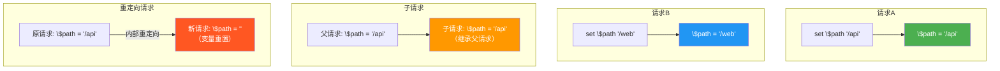
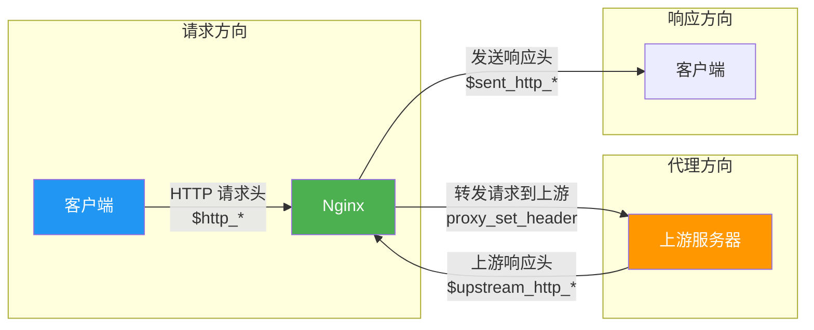

# 变量体系与内置变量

## 1. Nginx 变量机制

### 1.1 变量的本质

Nginx 变量是配置中的动态值容器，可以在运行时根据请求信息动态求值。与编程语言中的变量不同，Nginx 变量有其独特的设计：

- **惰性求值**：变量只有在被引用时才会计算
- **类型统一**：所有变量都是字符串类型
- **作用域局限**：变量只在当前请求中有效
- **创建即存在**：未赋值的变量返回空字符串（而非错误）

```nginx
# 变量定义
set $message "Hello, Nginx!";

# 变量引用
add_header X-Message $message;
```

### 1.2 变量的创建与赋值

```nginx
# 使用 set 指令创建变量
set $variable_name value;

# 示例
set $backend "api_server";
set $version "v2";
set $debug_mode "off";

# 变量名规则：
# - 以 $ 开头
# - 由字母、数字、下划线组成
# - 只能在 set 指令中创建（除内置变量外）
```

### 1.3 变量作用域



::: warning 变量作用域陷阱
- 变量在**同一请求**内有效，跨请求不共享
- **内部重定向**（rewrite/try_files）会创建新请求，变量会重置
- **外部重定向**（return 301/302）是完全新的请求
- 子请求可以继承父请求的变量
- 不同 Worker 进程之间的变量不共享
:::

### 1.4 变量的惰性求值

```nginx
# Nginx 变量是惰性求值的（Lazy Evaluation）
# 只有在变量被引用时才会真正计算

# 示例：$upstream_response_time
# 只有在请求确实代理到后端后，这个变量才有值
# 如果请求没有经过代理，引用这个变量返回空字符串

server {
    listen 80;

    location / {
        proxy_pass http://backend;

        # 以下变量只有在代理请求完成后才有值
        access_log /var/log/nginx/access.log
            '$remote_addr - [$time_local] "$request" '
            '$status $upstream_response_time';
    }
}
```

### 1.5 变量与内部重定向

```nginx
# 变量在内部重定向后会重置

server {
    listen 80;

    location /old {
        set $custom_var "hello";     # 设置变量
        rewrite ^ /new last;        # 内部重定向
        # 重定向后 $custom_var 丢失！
    }

    location /new {
        # $custom_var 在这里为空
        # 因为 rewrite last 创建了新的内部请求
        add_header X-Custom $custom_var;   # 值为空
    }
}
```

```nginx
# 解决方案：使用 persistent 变量或 map

# 方案1：在目标 location 中重新设置
location /new {
    set $custom_var "hello";
    add_header X-Custom $custom_var;
}

# 方案2：通过 URL 参数传递
location /old {
    rewrite ^ /new?custom=hello last;
}
location /new {
    set $custom_var $arg_custom;
}

# 方案3：使用 map（不受内部重定向影响）
map $uri $custom_var {
    /old  "hello";
    /new  "hello";
}
```

## 2. 核心内置变量

### 2.1 请求相关变量

| 变量 | 说明 | 示例值 |
|------|------|--------|
| `$request_uri` | 完整的原始请求 URI（含参数） | `/api/users?page=1` |
| `$uri` | 当前请求 URI（不含参数，可能被重写） | `/api/users` |
| `$args` | 请求参数字符串 | `page=1&size=10` |
| `$query_string` | 等同于 `$args` | `page=1&size=10` |
| `$request_method` | 请求方法 | `GET`、`POST` |
| `$request` | 完整的请求行 | `GET /api/users?page=1 HTTP/1.1` |
| `$scheme` | 请求协议 | `http`、`https` |
| `$request_body` | 请求体内容 | POST 数据 |
| `$request_length` | 请求长度（含请求行和头） | `1024` |
| `$request_time` | 请求处理时间（秒） | `0.123` |
| `$request_id` | 唯一请求标识符 | `a1b2c3d4e5f6...` |

```nginx
# 请求变量使用示例
server {
    listen 80;

    # 日志中记录请求详情
    log_format detailed '$remote_addr - [$time_local] '
                        '"$request_method $request_uri" '
                        '$status $request_time '
                        '"$http_user_agent"';

    # 基于请求方法的路由
    if ($request_method !~ ^(GET|HEAD|POST)$ ) {
        return 405;
    }

    # 基于协议的重定向
    if ($scheme != "https") {
        return 301 https://$host$request_uri;
    }

    # 基于请求参数的条件
    location /api/ {
        if ($arg_version = "2") {
            proxy_pass http://api_v2;
        }
        proxy_pass http://api_v1;
    }
}
```

### 2.2 客户端相关变量

| 变量 | 说明 | 示例值 |
|------|------|--------|
| `$remote_addr` | 客户端 IP 地址 | `192.168.1.100` |
| `$remote_port` | 客户端端口 | `54321` |
| `$remote_user` | 已认证的用户名 | `admin` |
| `$binary_remote_addr` | 二进制格式的客户端 IP（4/16字节） | 二进制 |
| `$realip_remote_addr` | realip 模块替换前的原始 IP | `10.0.0.1` |
| `$http_user_agent` | User-Agent 请求头 | `Mozilla/5.0...` |
| `$http_cookie` | Cookie 请求头 | `session=abc123` |
| `$http_referer` | Referer 请求头 | `https://example.com` |
| `$http_host` | Host 请求头 | `api.example.com` |
| `$http_authorization` | Authorization 请求头 | `Bearer eyJ...` |

```nginx
# 客户端变量使用示例
server {
    listen 80;

    # 基于客户端 IP 的访问控制
    # 使用 $binary_remote_addr 更节省内存
    limit_req_zone $binary_remote_addr zone=ip_limit:10m rate=10r/s;
    limit_req zone=ip_limit burst=20 nodelay;

    # 基于真实 IP 的访问控制（反向代理后）
    set_real_ip_from 10.0.0.0/8;
    set_real_ip_from 172.16.0.0/12;
    real_ip_header X-Forwarded-For;
    real_ip_recursive on;

    # 基于 User-Agent 的分流
    map $http_user_agent $device_type {
        default                 desktop;
        ~*mobile|android|iphone mobile;
        ~*ipad|tablet|kindle    tablet;
    }

    # 基于客户端 IP 的地理路由
    # geoip2 /usr/share/GeoIP/GeoLite2-City.mmdb {
    #     $geoip2_country_code source=$remote_addr country iso_code;
    # }
}
```

### 2.3 服务器相关变量

| 变量 | 说明 | 示例值 |
|------|------|--------|
| `$server_name` | 当前 server 块的 server_name | `api.example.com` |
| `$server_addr` | 服务器 IP 地址 | `10.0.0.1` |
| `$server_port` | 服务器监听端口 | `80`、`443` |
| `$host` | 优先级：请求行中的 host > Host头 > server_name | `example.com` |
| `$hostname` | 机器的主机名 | `web-server-01` |
| `$server_protocol` | 请求协议版本 | `HTTP/1.1`、`HTTP/2.0` |

```nginx
# 服务器变量使用示例
server {
    listen 80;
    server_name example.com;

    # 基于域名的路由
    location / {
        # $server_name = example.com
        # $server_port = 80
        # $host = 请求的 Host 头
    }

    # 动态构建后端地址
    location /api/ {
        set $api_port "8080";
        proxy_pass http://$server_addr:$api_port;
    }
}
```

### 2.4 $host vs $http_host vs $server_name

这三个变量容易混淆，以下是精确的区别：

```nginx
# $host 的取值优先级：
# 1. 请求行中的 host（如 GET http://example.com/ HTTP/1.1）
# 2. Host 请求头的值（不含端口）
# 3. 匹配的 server_name

# $http_host 的取值：
# Host 请求头的值（包含端口）
# 例如：example.com:8080

# $server_name 的取值：
# 当前 server 块中 server_name 指令的值
# 例如：example.com

# 对比表：
# 请求：GET / HTTP/1.1  Host: example.com:8080
# $host = example.com           （不含端口）
# $http_host = example.com:8080 （含端口）
# $server_name = example.com    （配置值）

# 使用建议：
# proxy_set_header Host $host;          # 大多数场景
# proxy_set_header Host $http_host;    # 需要保留端口的场景
# proxy_set_header Host $server_name;  # 强制使用配置值
```

::: tip proxy_set_header Host 的正确选择
- 默认情况下 `proxy_set_header Host $proxy_host`（即 upstream 名称或地址）
- 大多数场景应该使用 `proxy_set_header Host $host`，传递客户端请求的原始 Host
- 如果后端需要带端口的 Host，使用 `$http_host`
- 如果后端只认特定域名，使用 `$server_name`

参考：[https://nginx.org/en/docs/http/ngx_http_proxy_module.html#proxy_set_header](https://nginx.org/en/docs/http/ngx_http_proxy_module.html#proxy_set_header)
:::

### 2.5 文件路径相关变量

| 变量 | 说明 | 示例值 |
|------|------|--------|
| `$document_root` | 当前请求的 root 指令值 | `/var/www/html` |
| `$document_uri` | 等同于 `$uri` | `/api/users` |
| `$realpath_root` | root 的绝对路径（解析符号链接） | `/var/www/html` |
| `$request_filename` | 请求对应的文件路径 | `/var/www/html/api/users` |

```nginx
# 文件路径变量使用示例
server {
    root /var/www/html;

    location / {
        # $document_root = /var/www/html
        # $document_uri = /
        # $realpath_root = /var/www/html（解析符号链接后）
        # $request_filename = /var/www/html/index.html
    }

    location /download/ {
        # 基于文件路径的缓存控制
        if (-f $request_filename) {
            add_header X-File-Path $request_filename;
        }
    }
}
```

## 3. HTTP 头变量

### 3.1 请求头变量

Nginx 将所有 HTTP 请求头转换为变量，格式为 `$http_<header_name>`：

```nginx
# 转换规则：
# HTTP 头名 → 变量名
# - 字母转小写
# - 连字符（-）转下划线（_）
# - 前缀加 $http_

# 示例：
# Content-Type       → $http_content_type
# X-Forwarded-For    → $http_x_forwarded_for
# User-Agent         → $http_user_agent
# Accept-Encoding    → $http_accept_encoding
# X-Request-ID       → $http_x_request_id
# Authorization      → $http_authorization
```

常用请求头变量：

| HTTP 头 | Nginx 变量 | 说明 |
|---------|-----------|------|
| Host | `$http_host` | 目标主机名 |
| User-Agent | `$http_user_agent` | 客户端标识 |
| Cookie | `$http_cookie` | 客户端 Cookie |
| Referer | `$http_referer` | 来源页面 |
| Accept | `$http_accept` | 接受的内容类型 |
| Accept-Encoding | `$http_accept_encoding` | 接受的编码 |
| Content-Type | `$http_content_type` | 请求体类型 |
| Content-Length | `$http_content_length` | 请求体长度 |
| Authorization | `$http_authorization` | 认证信息 |
| X-Forwarded-For | `$http_x_forwarded_for` | 代理链 IP |
| X-Real-IP | `$http_x_real_ip` | 真实客户端 IP |
| X-Request-ID | `$http_x_request_id` | 请求追踪 ID |
| Upgrade | `$http_upgrade` | WebSocket 升级 |

### 3.2 响应头变量

Nginx 也可以访问上游服务器返回的响应头：

```nginx
# 上游响应头变量
# $upstream_http_<header_name>
# 转换规则与请求头相同

# 示例：
# X-Custom-Header    → $upstream_http_x_custom_header
# X-RateLimit-Remaining → $upstream_http_x_ratelimit_remaining
# Content-Type       → $upstream_http_content_type

# 使用场景
location /api/ {
    proxy_pass http://backend;

    # 传递上游的特定响应头
    add_header X-Backend-Version $upstream_http_x_version always;

    # 日志中记录上游响应头
    access_log /var/log/nginx/api.log
        '$remote_addr - $upstream_http_x_request_id';
}
```

### 3.3 发送响应头变量

```nginx
# $sent_http_<header_name>
# 访问 Nginx 发送给客户端的响应头

# 示例：
# Content-Type      → $sent_http_content_type
# Content-Length     → $sent_http_content_length
# X-Frame-Options   → $sent_http_x_frame_options

# 使用场景
log_format headers '$remote_addr - [$time_local] '
                   '"$request" $status '
                   '"$sent_http_content_type" '
                   '"$sent_http_x_request_id"';
```

### 3.4 完整的 HTTP 头变量体系



## 4. map 指令详解

### 4.1 map 基本语法

```nginx
# 语法：map 源变量 目标变量 { 映射规则 }
map $source_variable $target_variable {
    default     default_value;
    key1        value1;
    key2        value2;
    ~pattern    value3;
}
```

### 4.2 map 的基本用法

```nginx
# 示例1：基于 User-Agent 的设备类型判断
map $http_user_agent $device_type {
    default                     desktop;
    ~*mobile|android|iphone     mobile;
    ~*ipad|tablet|kindle        tablet;
    ~*bot|spider|crawler        bot;
}

server {
    location / {
        proxy_pass http://$device_type;
    }
}

# 示例2：基于 URI 的后端选择
map $uri $backend_name {
    default              backend_default;
    ~^/api/v1/          backend_v1;
    ~^/api/v2/          backend_v2;
    /health             backend_health;
    /metrics            backend_metrics;
}

# 示例3：基于域名的路由
map $host $backend_pool {
    default              web_backend;
    api.example.com      api_backend;
    cdn.example.com      cdn_backend;
    admin.example.com    admin_backend;
}
```

### 4.3 map 的映射规则

```nginx
# 1. 精确匹配
map $host $backend {
    default         backend_default;
    example.com     backend_main;
    api.example.com backend_api;
}

# 2. 正则匹配（~ 区分大小写，~* 不区分大小写）
map $http_user_agent $is_bot {
    default         0;
    ~*bot           1;
    ~*spider        1;
    ~*crawler       1;
    ~*slurp         1;
}

# 3. 正则捕获组
map $uri $api_version {
    default         "unknown";
    ~^/api/v([0-9]+)/  "v$1";    # $1 引用捕获组
}

# 4. hostnames 标志（支持通配符主机名）
map $http_host $backend {
    hostnames;
    default              backend_default;
    *.example.com        backend_example;
    api.*.example.com    backend_api;
}
```

### 4.4 map 的高级用法

```nginx
# 复合条件映射
# 需求：根据 HTTP 方法和 URI 选择后端

# 先组合变量
map $request_method:$uri $routing_key {
    default                     "default";
    GET:/api/users              "user_list";
    POST:/api/users             "user_create";
    GET:/api/orders             "order_list";
    ~^POST:/api/.*              "api_write";
    ~^GET:/api/.*               "api_read";
}

# 多级映射
map $routing_key $backend {
    default         backend_default;
    user_list       backend_user;
    user_create     backend_user;
    order_list      backend_order;
    api_write       backend_api;
    api_read        backend_api;
}

# map 嵌套：先映射环境，再映射后端
map $host $environment {
    default              production;
    dev.*                development;
    staging.*            staging;
}

map $environment $db_host {
    default              "db.prod.example.com";
    development          "db.dev.example.com";
    staging              "db.staging.example.com";
}
```

### 4.5 map 的默认值与 hostnames

```nginx
# default 关键字
map $scheme $is_https {
    default    0;       # 默认值
    https      1;       # 精确匹配
}

# 如果没有 default，未匹配的 key 会返回空字符串
map $http_x_custom $custom_value {
    "yes"    1;
    "no"     0;
    # 没有 default，其他值返回空字符串
}

# hostnames 标志
map $http_host $backend {
    hostnames;                           # 启用主机名通配符
    default             backend_default;
    *.example.com       backend_example; # 前缀通配符
    example.*           backend_example; # 后缀通配符
    www.example.com     backend_www;     # 精确匹配（优先）
}

# hostnames 的优先级：
# 1. 精确匹配（最长优先）
# 2. 前缀通配符 *.example.com（最长优先）
# 3. 后缀通配符 example.*（最长优先）
```

### 4.6 map 的性能考量

```nginx
# map 在 http 上下文中定义，在请求处理时求值
# 惰性求值：只有引用目标变量时才执行映射

# 性能建议：
# 1. 将最常匹配的规则放在前面
# 2. 使用 default 避免未匹配时的空字符串
# 3. 正则匹配按顺序评估，将常用的正则放前面
# 4. 大量映射规则时，增大 map_hash_bucket_size
# 5. 尽量使用精确匹配而非正则匹配

# 哈希表优化
map_hash_bucket_size 128;    # 默认 64，域名较长时增大
map_hash_max_size 2048;      # 哈希表最大大小
```

::: tip map 的惰性求值优势
map 指令定义的变量只有在请求中实际引用时才会求值。这意味着即使定义了多个 map，只要不引用目标变量，就不会有性能开销。这是 map 相比 if 指令的一个重要优势。参考：[https://nginx.org/en/docs/http/ngx_http_map_module.html](https://nginx.org/en/docs/http/ngx_http_map_module.html)
:::

## 5. 变量与 if 指令的陷阱

### 5.1 if 指令的本质

Nginx 的 `if` 指令是配置中最容易出错的部分，因为它不像编程语言中的 if 那样工作：

```nginx
# if 指令是 rewrite 模块的一部分
# 它在请求处理的 PREACCESS 阶段执行
# 不是"运行时"条件判断！

# if 的核心问题：
# 1. if 内的指令会被合并到外层 location
# 2. if 创建的是"伪 location"
# 3. 某些指令在 if 中无法正常工作
```

### 5.2 "if is evil" 问题

```nginx
# 问题1：if 内的配置指令会泄漏到外层
location / {
    set $flag "off";

    if ($args ~* "debug=true") {
        set $flag "on";
        # 这里设置的 $flag 会在 if 块外也可用
    }

    add_header X-Debug $flag;
    # 但 add_header 在 if 内定义会导致外层的 add_header 失效！
}

# 问题2：proxy_pass 在 if 中的行为
location /api/ {
    proxy_pass http://backend;

    if ($scheme = "http") {
        return 301 https://$host$request_uri;
        # return 是安全的，因为 return 会在 if 中立即执行
    }

    # if 中的 proxy_pass 可能导致问题
    # if ($arg_version = "2") {
    #     proxy_pass http://backend_v2;  # 危险！
    # }
}

# 问题3：if 中的 try_files 可能导致意外行为
location / {
    try_files $uri $uri/ =404;

    if (-f $request_filename) {
        # try_files 在 if 中的行为不可预测
        # 不要在 if 中使用 try_files
    }
}
```

### 5.3 if 指令安全使用指南

```nginx
# ===== if 中安全的指令 =====

# 1. return - 立即返回响应（最安全）
if ($scheme != "https") {
    return 301 https://$host$request_uri;
}

# 2. rewrite - 重写 URL
if ($host != "www.example.com") {
    rewrite ^ https://www.example.com$request_uri permanent;
}

# 3. set - 设置变量（安全）
if ($args ~* "debug=true") {
    set $debug_mode "on";
}

# ===== if 中危险的指令 =====

# 1. proxy_pass - 不要在 if 中使用
# 错误：
# if ($arg_version = "2") {
#     proxy_pass http://backend_v2;
# }

# 正确：使用 map + proxy_pass
# map $arg_version $backend {
#     "2"     backend_v2;
#     default backend_v1;
# }
# proxy_pass http://$backend;

# 2. try_files - 不要在 if 中使用
# 错误：
# if (-f $request_filename) {
#     try_files $uri =200;
# }

# 3. add_header - if 中定义会覆盖外层
# 错误：
# if ($scheme = "https") {
#     add_header Strict-Transport-Security "max-age=63072000";
# }
```

### 5.4 用 map 替代 if

```nginx
# ===== 替代方案1：map =====

# 问题：基于请求头选择后端
# if 写法（不推荐）：
# if ($http_x_version = "v2") {
#     proxy_pass http://backend_v2;
# }
# proxy_pass http://backend_v1;

# map 写法（推荐）：
map $http_x_version $backend_name {
    default    backend_v1;
    "v2"       backend_v2;
}

upstream backend_v1 { server 10.0.0.1:8080; }
upstream backend_v2 { server 10.0.0.2:8080; }

location /api/ {
    proxy_pass http://$backend_name;
}

# ===== 替代方案2：split_clients =====

# 问题：按比例分流
# if 写法（无法实现）：

# split_clients 写法：
split_clients "${remote_addr}AAA" $variant {
    10%    backend_v2;
    *      backend_v1;
}

location /api/ {
    proxy_pass http://$variant;
}
```

::: important "If Is Evil" 原则
Nginx 社区有一篇著名的文章 "If Is Evil"，核心建议是：
1. `if` 中只使用 `return`、`rewrite`、`set` 三条指令
2. 其他所有场景用 `map`、`split_clients`、`try_files` 替代
3. 理解 `if` 是在 PREACCESS 阶段执行的，不是运行时条件

参考：[https://www.nginx.com/resources/wiki/start/topics/depth/ifisevil/](https://www.nginx.com/resources/wiki/start/topics/depth/ifisevil/)
:::

## 6. 变量性能考量

### 6.1 惰性求值

```nginx
# 变量惰性求值的优势
# 未引用的变量不会产生计算开销

# 示例：定义了 map 但未引用
map $http_user_agent $is_mobile {
    default         0;
    ~*mobile         1;
}

# 只有在配置中引用 $is_mobile 时，map 才会执行
# 如果没有引用，$is_mobile 变量虽然存在但不会计算

# 这意味着可以放心定义大量 map，而不会影响性能
# （前提是不引用不需要的变量）
```

### 6.2 变量缓存

```nginx
# 某些变量会在请求处理过程中被缓存
# 同一请求中多次引用同一变量不会重复计算

# 示例：$uri 在请求处理中只计算一次
location / {
    # $uri 的值在内部重定向前计算一次
    set $original_uri $uri;     # 保存原始 URI
    rewrite ^/old/(.*)$ /new/$1 last;
    # 重定向后 $uri 变化，但 $original_uri 不变
}
```

### 6.3 变量使用的性能建议

```nginx
# 1. 优先使用 $binary_remote_addr 而非 $remote_addr
# 在限流等场景中，$binary_remote_addr 占用更少内存
limit_req_zone $binary_remote_addr zone=ip:10m rate=10r/s;
# $binary_remote_addr: 4字节(IPv4) 或 16字节(IPv6)
# $remote_addr: 7-15字节(字符串形式)

# 2. 避免在日志中使用过多变量
# 每个变量引用都会增加日志写入开销
log_format minimal '$remote_addr $status $request_time';
# 而非
# log_format verbose '$remote_addr $remote_user $time_local "$request" ...';

# 3. map 的正则匹配按顺序评估
# 将最常匹配的规则放在前面
map $uri $cache_key {
    default         "miss";
    /               "home";        # 最常访问
    /api/           "api";        # 次常访问
    ~^/static/      "static";    # 较少访问
}

# 4. 避免在 map 中使用复杂的正则
# 简单的精确匹配比正则快得多
map $host $backend {
    default              backend_default;
    example.com          backend_main;       # 精确匹配：O(1)
    # ~^api\.             backend_api;       # 正则匹配：O(n)
}

# 5. 使用 map_hash_bucket_size 优化大量映射
map_hash_bucket_size 256;    # 默认 64
```

## 7. 实战：基于变量实现动态路由

### 7.1 基于请求头的版本路由

```nginx
# 需求：根据 X-API-Version 请求头路由到不同后端
map $http_x_api_version $api_backend {
    default     api_v1;
    "1"         api_v1;
    "2"         api_v2;
    "3"         api_v3;
}

upstream api_v1 {
    server 10.0.1.10:8080;
    server 10.0.1.11:8080;
}

upstream api_v2 {
    server 10.0.2.10:8080;
    server 10.0.2.11:8080;
}

upstream api_v3 {
    server 10.0.3.10:8080;
    server 10.0.3.11:8080;
}

server {
    listen 80;
    server_name api.example.com;

    location / {
        proxy_pass http://$api_backend;
        proxy_set_header Host $host;
        proxy_set_header X-Real-IP $remote_addr;
    }
}
```

### 7.2 基于地理位置的路由

```nginx
# 需求：根据客户端 IP 地理位置路由到最近的后端
# 使用 geoip2 模块

# load_module modules/ngx_http_geoip2_module.so;

# geoip2 /usr/share/GeoIP/GeoLite2-Country.mmdb {
#     $geoip2_country_code country iso_code;
# }

# 简化示例：使用 geo 模块
geo $remote_addr $region {
    default              us;
    10.0.1.0/24          cn;
    10.0.2.0/24          eu;
    10.0.3.0/24          ap;
}

map $region $backend_region {
    default     backend_us;
    cn          backend_cn;
    eu          backend_eu;
    ap          backend_ap;
}

upstream backend_us {
    server us-backend.example.com:8080;
}

upstream backend_cn {
    server cn-backend.example.com:8080;
}

upstream backend_eu {
    server eu-backend.example.com:8080;
}

upstream backend_ap {
    server ap-backend.example.com:8080;
}

server {
    listen 80;

    location / {
        proxy_pass http://$backend_region;
    }
}
```

### 7.3 基于请求参数的灰度发布

```nginx
# 需求：通过 URL 参数或 Cookie 控制灰度

# 组合多个条件
map $cookie_grayrelease$arg_grayrelease $is_gray {
    default     0;
    "~*1"       1;
    "~*true"    1;
    "~*yes"     1;
}

map $is_gray $gray_backend {
    default     backend_stable;
    1           backend_canary;
}

upstream backend_stable {
    server 10.0.0.10:8080;
    server 10.0.0.11:8080;
}

upstream backend_canary {
    server 10.0.1.10:8080;
}

server {
    listen 80;

    location / {
        proxy_pass http://$gray_backend;
    }
}
```

### 7.4 基于请求特征的智能限流

```nginx
# 需求：不同类型的用户有不同的限流策略

# 识别用户类型
map $http_x_api_key $user_type {
    default         anonymous;
    ~^[a-f0-9]{32}$ authenticated;
    "~*admin"       admin;
}

# 为不同用户类型设置不同的限流键
map $user_type $rate_limit_key {
    default         "anon:$binary_remote_addr";
    authenticated   "auth:$http_x_api_key";
    admin           "";    # 不限流
}

# 定义限流区域
limit_req_zone $rate_limit_key zone=api_limit:10m rate=10r/s;

server {
    listen 80;

    location /api/ {
        # admin 不限流（key 为空时 limit_req 不生效）
        limit_req zone=api_limit burst=20 nodelay;
        proxy_pass http://backend;
    }
}
```

### 7.5 动态代理目标（使用 resolver）

```nginx
# 需求：根据请求动态解析后端域名

# 注意：当 proxy_pass 包含变量时，需要 resolver
resolver 8.8.8.8 8.8.4.4 valid=30s;
resolver_timeout 5s;

# 方案1：基于请求头的动态域名
map $http_x_backend $dynamic_backend {
    default     backend.example.com;
    "v2"        v2.backend.example.com;
    "canary"    canary.backend.example.com;
}

server {
    listen 80;

    location /api/ {
        # proxy_pass 包含变量，需要 resolver
        proxy_pass http://$dynamic_backend;
        proxy_set_header Host $dynamic_backend;
    }
}

# 方案2：基于 URL 路径的动态路由
server {
    listen 80;

    location ~ ^/proxy/(?<domain>[^/]+)(?<path>.*)$ {
        proxy_pass http://$domain$path;
        proxy_set_header Host $domain;
    }
}
```

::: warning 动态代理的安全风险
使用变量作为 proxy_pass 目标时，务必注意安全：
1. 不要直接将客户端可控的参数作为代理目标（SSRF 攻击风险）
2. 使用 map 限制可代理的目标白名单
3. 使用 resolver 时指定可信的 DNS 服务器
4. 设置 resolver_timeout 避免长时间等待

参考：[https://nginx.org/en/docs/http/ngx_http_proxy_module.html#proxy_pass](https://nginx.org/en/docs/http/ngx_http_proxy_module.html#proxy_pass)
:::

### 7.6 基于变量的条件日志

```nginx
# 需求：只记录特定条件的访问日志

# 方案1：使用 map + access_log
map $status $loggable {
    default     1;
    200         0;    # 不记录 200 响应
    301         0;    # 不记录 301 重定向
    302         0;    # 不记录 302 重定向
}

server {
    access_log /var/log/nginx/access.log main if=$loggable;
}

# 方案2：基于更复杂的条件
map $request_uri $loggable {
    default         1;
    ~^/health       0;    # 不记录健康检查
    ~^/metrics      0;    # 不记录指标采集
    ~^/favicon      0;    # 不记录 favicon
}

server {
    access_log /var/log/nginx/access.log main if=$loggable;
}
```

## 8. 变量调试技巧

### 8.1 使用 add_header 输出变量值

```nginx
# 在响应头中输出变量值（调试用）
server {
    location /debug/ {
        add_header X-URI $uri always;
        add_header X-Args $args always;
        add_header X-Host $host always;
        add_header X-Remote-Addr $remote_addr always;
        add_header X-Server-Name $server_name always;
        add_header X-Request-ID $request_id always;
        return 200 "debug info in headers";
    }
}
```

### 8.2 使用 echo 模块（第三方）

```nginx
# 安装 echo-nginx-module 后可用
location /debug/ {
    echo "URI: $uri";
    echo "Args: $args";
    echo "Host: $host";
    echo "Remote Addr: $remote_addr";
    echo "Request Method: $request_method";
    echo "Request URI: $request_uri";
}
```

### 8.3 使用日志调试

```nginx
# 在日志中记录变量值
log_format debug_format '$remote_addr - [$time_local] '
                        '"$request" $status '
                        'uri=$uri args=$args '
                        'host=$host server_name=$server_name '
                        'upstream_addr=$upstream_addr '
                        'upstream_status=$upstream_status';

server {
    access_log /var/log/nginx/debug.log debug_format;
}
```

## 9. 内置变量完整参考

### 9.1 核心 HTTP 变量

| 变量 | 模块 | 说明 |
|------|------|------|
| `$uri` | core | 当前 URI（可能被重写） |
| `$document_uri` | core | 等同于 $uri |
| `$args` | core | 请求参数 |
| `$query_string` | core | 等同于 $args |
| `$request_uri` | core | 原始请求 URI（含参数） |
| `$request` | core | 完整请求行 |
| `$request_method` | core | 请求方法 |
| `$scheme` | core | 请求协议 |
| `$request_body` | core | 请求体 |
| `$request_body_file` | core | 请求体临时文件 |
| `$request_length` | core | 请求长度 |
| `$request_time` | core | 请求处理时间 |
| `$request_id` | core | 唯一请求 ID |
| `$host` | core | 请求主机名 |
| `$hostname` | core | 机器主机名 |
| `$remote_addr` | core | 客户端 IP |
| `$remote_port` | core | 客户端端口 |
| `$remote_user` | core | 认证用户名 |
| `$binary_remote_addr` | core | 二进制客户端 IP |
| `$server_addr` | core | 服务器 IP |
| `$server_name` | core | 服务器名 |
| `$server_port` | core | 服务器端口 |
| `$server_protocol` | core | 协议版本 |
| `$document_root` | core | root 指令值 |
| `$realpath_root` | core | root 绝对路径 |
| `$request_filename` | core | 请求文件路径 |
| `$content_type` | core | Content-Type 头 |
| `$content_length` | core | Content-Length 头 |
| `$limit_rate` | core | 响应速率限制 |

### 9.2 上游相关变量

| 变量 | 说明 |
|------|------|
| `$upstream_addr` | 上游服务器地址 |
| `$upstream_port` | 上游服务器端口 |
| `$upstream_status` | 上游响应状态码 |
| `$upstream_response_time` | 上游响应时间 |
| `$upstream_connect_time` | 上游连接时间 |
| `$upstream_header_time` | 上游响应头时间 |
| `$upstream_bytes_received` | 从上游接收的字节数 |
| `$upstream_bytes_sent` | 发送到上游的字节数 |
| `$upstream_cache_name` | 缓存命中名称 |
| `$upstream_cache_status` | 缓存命中状态 |

### 9.3 SSL/TLS 相关变量

| 变量 | 说明 |
|------|------|
| `$ssl_protocol` | SSL 协议版本 |
| `$ssl_cipher` | SSL 加密套件 |
| `$ssl_client_cert` | 客户端证书 |
| `$ssl_client_fingerprint` | 客户端证书指纹 |
| `$ssl_client_s_dn` | 客户端证书主体 DN |
| `$ssl_client_i_dn` | 客户端证书颁发者 DN |
| `$ssl_client_v_remain` | 客户端证书剩余有效天数 |
| `$ssl_server_name` | SNI 服务器名 |

## 10. 本章小结

本章深入讲解了 Nginx 的变量体系：

1. **变量机制**：惰性求值、字符串类型、请求作用域
2. **内置变量**：请求、客户端、服务器、文件路径等核心变量
3. **HTTP 头变量**：`$http_*`、`$upstream_http_*`、`$sent_http_*` 三大系列
4. **map 指令**：灵活的变量映射机制，替代 if 的最佳方案
5. **if 陷阱**："If Is Evil" 原则，只使用 return/rewrite/set
6. **性能考量**：惰性求值、变量缓存、内存优化
7. **实战应用**：版本路由、地理路由、灰度发布、智能限流、动态代理
8. **调试技巧**：add_header、echo 模块、条件日志

理解变量体系是掌握 Nginx 高级配置的关键，下一章将讲解模块化架构与动态加载。
