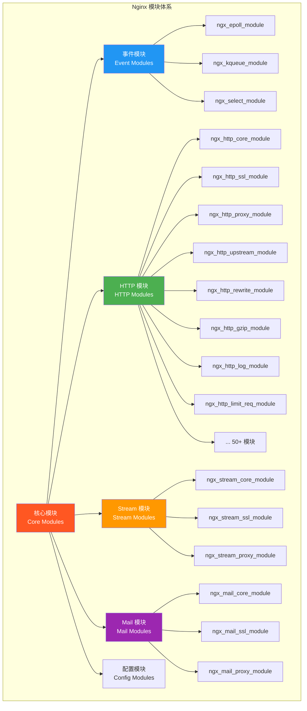
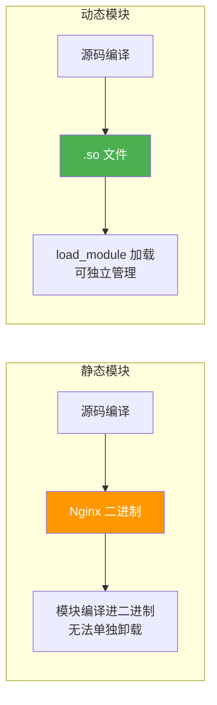

# 模块化架构与动态加载

## 1. 模块分类体系

### 1.1 模块总体架构

Nginx 的模块化架构是其灵活性和可扩展性的根基。所有功能都通过模块实现，核心保持精简，功能通过模块组合。



### 1.2 模块分类详解

| 类别 | 说明 | 编译方式 | 示例 |
|------|------|----------|------|
| 核心（Core） | Nginx 运行基础 | 始终包含 | ngx_core_module |
| 事件（Event） | 事件处理机制 | 始终包含 | ngx_epoll_module |
| HTTP | HTTP 服务功能 | 默认包含 | ngx_http_ssl_module |
| Stream | TCP/UDP 代理 | --with-stream | ngx_stream_core_module |
| Mail | 邮件代理 | --with-mail | ngx_mail_core_module |
| 第三方 | 社区开发模块 | --add-module | headers-more |
| 动态第三方 | 运行时加载 | --add-dynamic-module | ngx_brotli |

### 1.3 模块与指令的映射关系

每个模块定义了其支持的指令，理解这种映射关系对配置调试非常重要：

```
模块 → 指令映射
ngx_http_core_module      → server, location, root, alias, try_files, ...
ngx_http_ssl_module       → ssl_certificate, ssl_protocols, ...
ngx_http_proxy_module     → proxy_pass, proxy_set_header, ...
ngx_http_upstream_module  → upstream, server, keepalive, ...
ngx_http_rewrite_module   → if, rewrite, return, set, ...
ngx_http_gzip_module      → gzip, gzip_types, gzip_comp_level, ...
ngx_http_log_module       → access_log, log_format, ...
ngx_http_limit_req_module → limit_req, limit_req_zone, ...
```

## 2. HTTP 模块体系

### 2.1 HTTP 模块完整列表

#### 默认编译的 HTTP 模块

| 模块 | 功能 | 常用指令 |
|------|------|----------|
| `ngx_http_core_module` | HTTP 核心 | server, location, root, alias, try_files, error_page |
| `ngx_http_proxy_module` | 反向代理 | proxy_pass, proxy_set_header, proxy_cache |
| `ngx_http_upstream_module` | 负载均衡 | upstream, server, keepalive, ip_hash |
| `ngx_http_rewrite_module` | URL 重写 | rewrite, if, return, set |
| `ngx_http_gzip_module` | Gzip 压缩 | gzip, gzip_types, gzip_comp_level |
| `ngx_http_log_module` | 访问日志 | access_log, log_format |
| `ngx_http_fastcgi_module` | FastCGI 代理 | fastcgi_pass, fastcgi_param |
| `ngx_http_uwsgi_module` | uWSGI 代理 | uwsgi_pass, uwsgi_param |
| `ngx_http_scgi_module` | SCGI 代理 | scgi_pass |
| `ngx_http_memcached_module` | Memcached 代理 | memcached_pass |
| `ngx_http_limit_req_module` | 请求限流 | limit_req, limit_req_zone |
| `ngx_http_limit_conn_module` | 连接限制 | limit_conn, limit_conn_zone |
| `ngx_http_map_module` | 变量映射 | map, map_hash_bucket_size |
| `ngx_http_referer_module` | Referer 控制 | valid_referers, referer_hash_max_size |
| `ngx_http_autoindex_module` | 目录索引 | autoindex, autoindex_exact_size |
| `ngx_http_auth_basic_module` | 基本认证 | auth_basic, auth_basic_user_file |
| `ngx_http_access_module` | IP 访问控制 | allow, deny |
| `ngx_http_browser_module` | 浏览器识别 | modern_browser, ancient_browser |
| `ngx_http_userid_module` | Cookie 标识 | userid, userid_name |
| `ngx_http_charset_module` | 字符集转换 | charset, charset_types |
| `ngx_http_ssi_module` | SSI 包含 | ssi, ssi_types |
| `ngx_http_headers_module` | 响应头操作 | add_header, expires |
| `ngx_http_empty_gif_module` | 空 GIF | empty_gif |
| `ngx_http_index_module` | 首页索引 | index |

#### 需要显式启用的 HTTP 模块

| 编译参数 | 模块 | 功能 |
|----------|------|------|
| `--with-http_ssl_module` | ngx_http_ssl_module | HTTPS/SSL/TLS |
| `--with-http_v2_module` | ngx_http_v2_module | HTTP/2 |
| `--with-http_v3_module` | ngx_http_v3_module | HTTP/3 (QUIC) |
| `--with-http_realip_module` | ngx_http_realip_module | 真实 IP |
| `--with-http_addition_module` | ngx_http_addition_module | 响应追加 |
| `--with-http_sub_module` | ngx_http_sub_module | 响应替换 |
| `--with-http_dav_module` | ngx_http_dav_module | WebDAV |
| `--with-http_flv_module` | ngx_http_flv_module | FLV 流媒体 |
| `--with-http_mp4_module` | ngx_http_mp4_module | MP4 流媒体 |
| `--with-http_gunzip_module` | ngx_http_gunzip_module | 解压响应 |
| `--with-http_gzip_static_module` | ngx_http_gzip_static_module | 预压缩 |
| `--with-http_auth_request_module` | ngx_http_auth_request_module | 子请求认证 |
| `--with-http_random_index_module` | ngx_http_random_index_module | 随机首页 |
| `--with-http_secure_link_module` | ngx_http_secure_link_module | 安全链接 |
| `--with-http_slice_module` | ngx_http_slice_module | 大文件分片 |
| `--with-http_stub_status_module` | ngx_http_stub_status_module | 状态监控 |

#### 可禁用的 HTTP 模块

| 编译参数 | 模块 | 功能 |
|----------|------|------|
| `--without-http_gzip_module` | ngx_http_gzip_module | Gzip 压缩 |
| `--without-http_ssi_module` | ngx_http_ssi_module | SSI |
| `--without-http_userid_module` | ngx_http_userid_module | Cookie 标识 |
| `--without-http_access_module` | ngx_http_access_module | IP 访问控制 |
| `--without-http_auth_basic_module` | ngx_http_auth_basic_module | 基本认证 |
| `--without-http_autoindex_module` | ngx_http_autoindex_module | 目录索引 |
| `--without-http_geo_module` | ngx_http_geo_module | IP 地理映射 |
| `--without-http_map_module` | ngx_http_map_module | 变量映射 |
| `--without-http_split_clients_module` | ngx_http_split_clients_module | A/B 测试 |
| `--without-http_referer_module` | ngx_http_referer_module | Referer 控制 |
| `--without-http_rewrite_module` | ngx_http_rewrite_module | URL 重写 |
| `--without-http_proxy_module` | ngx_http_proxy_module | 反向代理 |
| `--without-http_fastcgi_module` | ngx_http_fastcgi_module | FastCGI |
| `--without-http_uwsgi_module` | ngx_http_uwsgi_module | uWSGI |
| `--without-http_scgi_module` | ngx_http_scgi_module | SCGI |
| `--without-http_memcached_module` | ngx_http_memcached_module | Memcached |
| `--without-http_limit_req_module` | ngx_http_limit_req_module | 请求限流 |
| `--without-http_limit_conn_module` | ngx_http_limit_conn_module | 连接限制 |
| `--without-http_empty_gif_module` | ngx_http_empty_gif_module | 空 GIF |
| `--without-http_browser_module` | ngx_http_browser_module | 浏览器识别 |
| `--without-http_upstream_hash_module` | upstream hash | Hash 负载均衡 |
| `--without-http_upstream_ip_hash_module` | upstream ip_hash | IP Hash |
| `--without-http_upstream_least_conn_module` | upstream least_conn | 最少连接 |
| `--without-http_upstream_random_module` | upstream random | 随机负载 |
| `--without-http_upstream_keepalive_module` | upstream keepalive | Keep-Alive |

## 3. 编译时模块选择

### 3.1 精简编译策略

在生产环境中，禁用不需要的模块可以减小二进制体积和攻击面：

```bash
# 最小化编译（只保留核心功能）
./configure \
    --prefix=/etc/nginx \
    --with-http_ssl_module \
    --without-http_ssi_module \
    --without-http_userid_module \
    --without-http_access_module \
    --without-http_auth_basic_module \
    --without-http_autoindex_module \
    --without-http_geo_module \
    --without-http_split_clients_module \
    --without-http_referer_module \
    --without-http_empty_gif_module \
    --without-http_browser_module \
    --without-http_memcached_module \
    --without-http_upstream_hash_module \
    --without-http_upstream_ip_hash_module \
    --without-http_upstream_least_conn_module \
    --without-http_upstream_random_module \
    --without-http_upstream_keepalive_module

# 编译前后对比
# 默认编译：约 2.5MB
# 精简编译：约 1.5MB
```

### 3.2 功能完整的编译

```bash
# 包含所有常用模块
./configure \
    --prefix=/etc/nginx \
    --sbin-path=/usr/sbin/nginx \
    --conf-path=/etc/nginx/nginx.conf \
    --error-log-path=/var/log/nginx/error.log \
    --http-log-path=/var/log/nginx/access.log \
    --pid-path=/var/run/nginx.pid \
    --lock-path=/var/run/nginx.lock \
    --user=nginx \
    --group=nginx \
    --with-pcre-jit \
    --with-threads \
    --with-http_ssl_module \
    --with-http_v2_module \
    --with-http_v3_module \
    --with-http_realip_module \
    --with-http_addition_module \
    --with-http_sub_module \
    --with-http_dav_module \
    --with-http_flv_module \
    --with-http_mp4_module \
    --with-http_gunzip_module \
    --with-http_gzip_static_module \
    --with-http_auth_request_module \
    --with-http_random_index_module \
    --with-http_secure_link_module \
    --with-http_slice_module \
    --with-http_stub_status_module \
    --with-stream \
    --with-stream_ssl_module \
    --with-stream_realip_module \
    --with-mail \
    --with-mail_ssl_module
```

### 3.3 查看当前编译模块

```bash
# 查看编译参数
nginx -V 2>&1

# 提取启用的模块
nginx -V 2>&1 | grep -oE 'with-http_[a-z_]+' | sort

# 提取禁用的模块
nginx -V 2>&1 | grep -oE 'without-http_[a-z_]+' | sort

# 提取第三方模块
nginx -V 2>&1 | grep -oE 'add(-dynamic)?-module=[^ ]+' | sort
```

## 4. 动态模块加载

### 4.1 动态模块概述

Nginx 1.9.11 引入了动态模块支持，允许在运行时通过 `load_module` 指令加载 `.so` 文件，无需重新编译整个 Nginx。



### 4.2 编译动态模块

```bash
# 编译动态模块
./configure \
    --prefix=/etc/nginx \
    --with-http_ssl_module \
    --add-dynamic-module=/path/to/headers-more-nginx-module \
    --add-dynamic-module=/path/to/echo-nginx-module \
    --add-dynamic-module=/path/to/ngx_brotli

# 只编译模块（不编译整个 Nginx）
make modules

# 编译产物位于 objs/ 目录
ls objs/*.so
# ngx_http_headers_more_filter_module.so
# ngx_http_echo_module.so
# ngx_http_brotli_filter_module.so
# ngx_http_brotli_static_module.so

# 复制到模块目录
sudo cp objs/*.so /etc/nginx/modules/
```

### 4.3 load_module 指令

```nginx
# load_module 指令必须在 main 上下文的最顶部
# 通常放在 nginx.conf 文件的第一行

# 加载动态模块
load_module modules/ngx_http_headers_more_filter_module.so;
load_module modules/ngx_http_echo_module.so;
load_module modules/ngx_http_brotli_filter_module.so;
load_module modules/ngx_http_brotli_static_module.so;

# 使用绝对路径
# load_module /etc/nginx/modules/ngx_http_headers_more_filter_module.so;

# 使用相对路径（相对于 --modules-path）
# load_module ngx_http_headers_more_filter_module.so;

# 加载后就可以使用模块提供的指令
http {
    more_set_headers "Server: MyServer";
    brotli on;
    brotli_comp_level 6;
}
```

::: warning load_module 位置要求
`load_module` 指令必须放在 `main` 上下文中，且必须在 `events` 和 `http` 块之前。如果放在错误位置，Nginx 会报错并拒绝启动。

```nginx
# 错误：load_module 在 http 块之后
# http { ... }
# load_module modules/xxx.so;  ← 报错！

# 正确：在文件最顶部
load_module modules/xxx.so;
events { ... }
http { ... }
```

参考：[https://nginx.org/en/docs/ngx_core_module.html#load_module](https://nginx.org/en/docs/ngx_core_module.html#load_module)
:::

### 4.4 动态模块管理

```bash
# 查看已加载的模块
nginx -V 2>&1 | grep 'add-dynamic-module'

# 查看动态模块目录
ls /etc/nginx/modules/

# Ubuntu/Debian 的模块管理
ls /etc/nginx/modules-enabled/
# 每个 .conf 文件包含一个 load_module 指令

# 启用动态模块
sudo ln -s /etc/nginx/modules-available/headers-more.conf \
           /etc/nginx/modules-enabled/

# 禁用动态模块
sudo rm /etc/nginx/modules-enabled/headers-more.conf

# 验证模块加载
sudo nginx -t
```

### 4.5 动态模块的 .so 文件管理

```
/etc/nginx/
├── modules/                    # .so 文件存放目录
│   ├── ngx_http_headers_more_filter_module.so
│   ├── ngx_http_echo_module.so
│   ├── ngx_http_brotli_filter_module.so
│   ├── ngx_http_brotli_static_module.so
│   ├── ngx_http_geoip2_module.so
│   └── ngx_stream_geoip2_module.so
│
├── modules-available/          # 可用模块配置（Ubuntu风格）
│   ├── headers-more.conf
│   ├── echo.conf
│   ├── brotli.conf
│   └── geoip2.conf
│
└── modules-enabled/            # 已启用模块配置（Ubuntu风格）
    ├── headers-more.conf -> ../modules-available/headers-more.conf
    └── brotli.conf -> ../modules-available/brotli.conf
```

## 5. 第三方模块推荐

### 5.1 推荐模块详细说明

#### headers-more-nginx-module

```nginx
# 安装
# --add-dynamic-module=/path/to/headers-more-nginx-module

load_module modules/ngx_http_headers_more_filter_module.so;

http {
    # 设置响应头（覆盖所有已存在的同名头）
    more_set_headers "Server: CustomServer";
    more_set_headers "X-Powered-By: Nginx";

    # 清除响应头
    more_clear_headers "X-Powered-By";
    more_clear_headers "Server";

    # 设置输入请求头
    more_set_input_headers "X-Custom: value";

    # 清除输入请求头
    more_clear_input_headers "X-Unwanted";

    server {
        location /api/ {
            # 与 add_header 不同，more_set_headers 不会覆盖其他 location 的设置
            more_set_headers "X-API-Version: 2.0";
        }
    }
}
```

#### echo-nginx-module

```nginx
# 安装
# --add-dynamic-module=/path/to/echo-nginx-module

load_module modules/ngx_http_echo_module.so;

server {
    # 输出文本
    location /hello {
        echo "Hello, Nginx!";
    }

    # 输出变量
    location /debug {
        echo "URI: $uri";
        echo "Args: $args";
        echo "Host: $host";
        echo "Remote: $remote_addr";
    }

    # 输出 HTTP 头
    location /headers {
        echo_duplicate 1 $echo_client_request_headers;
    }

    # 计时
    location /timer {
        echo_reset_timer;
        echo "Start: $echo_timer_elapsed sec";
        # ... 执行一些操作
        echo "End: $echo_timer_elapsed sec";
    }

    # 睡眠（调试用）
    location /slow {
        echo_sleep 2;
        echo "After 2 seconds";
    }
}
```

#### ngx_brotli

```nginx
# 安装
# --add-dynamic-module=/path/to/ngx_brotli

load_module modules/ngx_http_brotli_filter_module.so;
load_module modules/ngx_http_brotli_static_module.so;

http {
    # 动态压缩
    brotli on;
    brotli_comp_level 6;
    brotli_min_length 256;
    brotli_types text/plain text/css application/javascript
                application/json application/xml
                image/svg+xml;

    # 预压缩文件
    brotli_static on;

    server {
        listen 80;
        server_name example.com;

        # 可以在 server/location 级别覆盖
        location /api/ {
            brotli off;    # API 响应通常不压缩
        }
    }
}
```

#### geoip2-nginx-module

```nginx
# 安装
# sudo apt install libmaxminddb-dev
# --add-dynamic-module=/path/to/geoip2-nginx-module

load_module modules/ngx_http_geoip2_module.so;

http {
    # 加载 GeoIP 数据库
    geoip2 /usr/share/GeoIP/GeoLite2-Country.mmdb {
        auto_reload 5m;
        $geoip2_metadata_country_build metadata build_epoch;
        $geoip2_country_code source=$remote_addr country iso_code;
        $geoip2_country_name source=$remote_addr country names en;
    }

    geoip2 /usr/share/GeoIP/GeoLite2-City.mmdb {
        $geoip2_city_name source=$remote_addr city names en;
        $geoip2_latitude source=$remote_addr location latitude;
        $geoip2_longitude source=$remote_addr location longitude;
    }

    # 基于国家的访问控制
    map $geoip2_country_code $is_allowed {
        default    0;
        CN         1;
        US         1;
        JP         1;
    }

    server {
        if ($is_allowed = 0) {
            return 403;
        }

    # 基于国家的路由（注意：map 指令只能在 http 上下文中使用，不能放在 server 块内）
    # map $geoip2_country_code $nearest_region {
    #     default    us;
    #     CN         cn;
    #     JP         ap;
    #     DE         eu;
    # }
    }
}
```

#### nginx-module-vts

```nginx
# 安装
# --add-dynamic-module=/path/to/nginx-module-vts

load_module modules/ngx_http_vhost_traffic_status_module.so;

http {
    vhost_traffic_status_zone;

    server {
        listen 80;

        # 状态页面
        location /status {
            vhost_traffic_status_display;
            vhost_traffic_status_display_format html;
            allow 127.0.0.1;
            deny all;
        }

        # JSON 格式
        location /status/format/json {
            vhost_traffic_status_display;
            vhost_traffic_status_display_format json;
        }
    }
}
```

### 5.2 第三方模块安装模板

```bash
#!/bin/bash
# install-nginx-module.sh - 安装第三方动态模块

NGINX_VERSION=$(nginx -v 2>&1 | cut -d'/' -f2)
MODULE_NAME=$1
MODULE_URL=$2
NGINX_SRC="/usr/local/src/nginx-${NGINX_VERSION}"
BUILD_DIR="/tmp/nginx-module-build"

set -e

# 检查参数
if [ -z "$MODULE_NAME" ] || [ -z "$MODULE_URL" ]; then
    echo "Usage: $0 <module_name> <module_url>"
    echo "Example: $0 headers-more https://github.com/openresty/headers-more-nginx-module/archive/refs/tags/v0.37.tar.gz"
    exit 1
fi

# 检查 Nginx 源码是否存在
if [ ! -d "$NGINX_SRC" ]; then
    echo "Nginx source not found at $NGINX_SRC"
    echo "Downloading..."
    mkdir -p /usr/local/src
    curl -o /tmp/nginx-${NGINX_VERSION}.tar.gz \
        https://nginx.org/download/nginx-${NGINX_VERSION}.tar.gz
    tar -xzf /tmp/nginx-${NGINX_VERSION}.tar.gz -C /usr/local/src/
fi

# 下载模块源码
mkdir -p $BUILD_DIR
cd $BUILD_DIR
curl -L -o ${MODULE_NAME}.tar.gz "$MODULE_URL"
tar -xzf ${MODULE_NAME}.tar.gz
MODULE_DIR=$(find . -maxdepth 1 -type d -name "*${MODULE_NAME}*" | head -1)

# 获取当前 Nginx 编译参数
CONFIGURE_ARGS=$(nginx -V 2>&1 | grep 'configure arguments:' | sed 's/configure arguments: //')

# 编译动态模块
cd $NGINX_SRC
./configure $CONFIGURE_ARGS \
    --add-dynamic-module=$BUILD_DIR/$MODULE_DIR

make modules

# 安装
sudo cp objs/*.so /etc/nginx/modules/

# 清理
rm -rf $BUILD_DIR

echo "Module ${MODULE_NAME} compiled and installed."
echo "Add to nginx.conf: load_module modules/ngx_http_${MODULE_NAME}_module.so;"
```

## 6. 模块依赖关系与加载顺序

### 6.1 模块依赖

```
模块依赖关系：
ngx_http_ssl_module → OpenSSL
ngx_http_v2_module → ngx_http_ssl_module
ngx_http_v3_module → ngx_http_ssl_module
ngx_http_gzip_module → zlib
ngx_stream_ssl_module → OpenSSL
ngx_mail_ssl_module → OpenSSL
ngx_http_geoip2_module → libmaxminddb

第三方模块依赖：
ngx_brotli → brotli 库
ngx_http_geoip2_module → libmaxminddb
ngx_http_lua_module (OpenResty) → LuaJIT
```

### 6.2 模块加载顺序

```nginx
# load_module 的顺序很重要
# 依赖其他模块的模块应该后加载

# 示例：headers-more 必须在 brotli 之前
# 因为 headers-more 需要在 filter 链中先于 brotli 执行

# 正确的加载顺序
load_module modules/ngx_http_headers_more_filter_module.so;
load_module modules/ngx_http_brotli_filter_module.so;
load_module modules/ngx_http_brotli_static_module.so;
load_module modules/ngx_http_echo_module.so;
load_module modules/ngx_http_geoip2_module.so;

# 错误的加载顺序可能导致：
# 1. 模块初始化失败
# 2. filter 链顺序错误
# 3. 指令冲突
```

### 6.3 HTTP 过滤器模块执行顺序

```
HTTP 响应过滤器链执行顺序（从外到内）：

1. ngx_http_header_filter_module     → 构建响应头
2. ngx_http_chunked_filter_module    → 分块传输编码
3. ngx_http_range_filter_module      → 范围请求
4. ngx_http_gzip_filter_module       → Gzip 压缩
5. ngx_http_brotli_filter_module     → Brotli 压缩（第三方）
6. ngx_http_sub_filter_module        → 内容替换
7. ngx_http_addition_filter_module   → 内容追加
8. ngx_http_headers_more_filter_module → 头部修改（第三方）
9. ngx_http_charset_filter_module    → 字符集转换
10. ngx_http_ssi_filter_module       → SSI 处理
```

## 7. 模块开发简介

### 7.1 Nginx 模块结构

```c
// Nginx 模块的核心数据结构
struct ngx_module_s {
    void                  ****ctx;           // 模块上下文
    ngx_command_t          *commands;        // 指令数组
    ngx_uint_t              type;            // 模块类型

    ngx_int_t             (*init_master)(ngx_log_t *log);    // Master 初始化
    ngx_int_t             (*init_module)(ngx_cycle_t *cycle); // 模块初始化
    ngx_int_t             (*init_process)(ngx_cycle_t *cycle); // Worker 初始化
    ngx_int_t             (*init_thread)(ngx_cycle_t *cycle);  // 线程初始化
    void                 (*exit_thread)(ngx_cycle_t *cycle);   // 线程退出
    void                 (*exit_process)(ngx_cycle_t *cycle);  // Worker 退出
    void                 (*exit_master)(ngx_cycle_t *cycle);   // Master 退出

    uintptr_t               spare_hook0;     // 钩子（动态模块用）
    uintptr_t               spare_hook1;
    uintptr_t               spare_hook2;
    uintptr_t               spare_hook3;
    uintptr_t               spare_hook4;
    uintptr_t               spare_hook5;
    uintptr_t               spare_hook6;
    uintptr_t               spare_hook7;
};
```

### 7.2 指令定义结构

```c
// 指令定义
struct ngx_command_s {
    ngx_str_t    name;          // 指令名称
    ngx_uint_t   type;          // 指令类型和上下文
    char       *(*set)(ngx_conf_t *cf, ngx_command_t *cmd, void *conf);
    ngx_uint_t   conf;          // 配置偏移
    ngx_uint_t   offset;        // 字段偏移
    void        *post;          // 后处理
};

// 示例：定义一个自定义指令
static ngx_command_t ngx_http_my_module_commands[] = {
    {
        ngx_string("my_directive"),           // 指令名
        NGX_HTTP_MAIN_CONF | NGX_HTTP_SRV_CONF | NGX_HTTP_LOC_CONF | NGX_CONF_TAKE1,
        ngx_conf_set_str_slot,                // 处理函数
        NGX_HTTP_LOC_CONF_OFFSET,             // 配置偏移
        offsetof(ngx_http_my_module_loc_conf_t, my_value),  // 字段偏移
        NULL
    },
    ngx_null_command                          // 结束标记
};
```

### 7.3 HTTP 模块开发框架

```c
// 最简 HTTP 模块框架
#include <ngx_config.h>
#include <ngx_core.h>
#include <ngx_http.h>

// 1. 配置结构
typedef struct {
    ngx_str_t message;
} ngx_http_my_module_loc_conf_t;

// 2. 指令定义
static ngx_command_t ngx_http_my_module_commands[] = {
    {
        ngx_string("my_message"),
        NGX_HTTP_LOC_CONF | NGX_CONF_TAKE1,
        ngx_conf_set_str_slot,
        NGX_HTTP_LOC_CONF_OFFSET,
        offsetof(ngx_http_my_module_loc_conf_t, message),
        NULL
    },
    ngx_null_command
};

// 3. 创建配置
static void *ngx_http_my_module_create_loc_conf(ngx_conf_t *cf)
{
    ngx_http_my_module_loc_conf_t *conf;
    conf = ngx_pcalloc(cf->pool, sizeof(*conf));
    if (conf == NULL) return NULL;
    return conf;
}

// 4. 内容处理函数
static ngx_int_t ngx_http_my_module_handler(ngx_http_request_t *r)
{
    ngx_http_my_module_loc_conf_t *conf;
    conf = ngx_http_get_module_loc_conf(r, ngx_http_my_module);

    ngx_str_t response = conf->message;
    if (response.len == 0) {
        response = ngx_string("Default message");
    }

    // 发送响应头
    r->headers_out.status = NGX_HTTP_OK;
    r->headers_out.content_length_n = response.len;
    r->headers_out.content_type = ngx_string("text/plain");
    ngx_http_send_header(r);

    // 发送响应体
    ngx_buf_t *b = ngx_pcalloc(r->pool, sizeof(ngx_buf_t));
    ngx_chain_t out;
    out.buf = b;
    out.next = NULL;
    b->pos = response.data;
    b->last = response.data + response.len;
    b->memory = 1;
    b->last_buf = 1;

    return ngx_http_output_filter(r, &out);
}

// 5. 配置后处理
static char *ngx_http_my_module(ngx_conf_t *cf, ngx_command_t *cmd, void *conf)
{
    ngx_http_core_loc_conf_t *clcf;
    clcf = ngx_http_conf_get_module_loc_conf(cf, ngx_http_core_module);
    clcf->handler = ngx_http_my_module_handler;
    return NGX_CONF_OK;
}

// 6. 模块上下文
static ngx_http_module_t ngx_http_my_module_ctx = {
    NULL,                                      /* preconfiguration */
    NULL,                                      /* postconfiguration */
    NULL,                                      /* create main configuration */
    NULL,                                      /* init main configuration */
    NULL,                                      /* create server configuration */
    NULL,                                      /* merge server configuration */
    ngx_http_my_module_create_loc_conf,        /* create location configuration */
    NULL                                       /* merge location configuration */
};

// 7. 模块定义
ngx_module_t ngx_http_my_module = {
    NGX_MODULE_V1,
    &ngx_http_my_module_ctx,                  /* module context */
    ngx_http_my_module_commands,              /* module directives */
    NGX_HTTP_MODULE,                          /* module type */
    NULL,                                     /* init master */
    NULL,                                     /* init module */
    NULL,                                     /* init process */
    NULL,                                     /* init thread */
    NULL,                                     /* exit thread */
    NULL,                                     /* exit process */
    NULL,                                     /* exit master */
    NGX_MODULE_V1_PADDING
};
```

### 7.4 模块开发流程

```mermaid
flowchart TB
    A[定义配置结构体] --> B[定义指令数组]
    B --> C[实现配置创建/合并函数]
    C --> D[实现内容处理函数]
    D --> E[定义模块上下文]
    E --> F[定义模块结构体]
    F --> G[编写 config 文件]
    G --> H[编译测试]

    subgraph config文件
        CF["ngx_addon_name=ngx_http_my_module<br/>HTTP_MODULES=\"$HTTP_MODULES ngx_http_my_module\"<br/>NGX_ADDON_SRCS=\"$NGX_ADDON_SRCS $ngx_addon_dir/ngx_http_my_module.c\""]
    end
```

## 8. 模块与指令的映射关系

### 8.1 快速查找指令所属模块

```bash
# 在官方文档中搜索指令
# 访问 https://nginx.org/en/docs/dirindex.html

# 使用 nginx -T 查看运行时配置
sudo nginx -T 2>&1 | grep -i "directive_name"

# 在源码中查找
grep -r "ngx_string(\"directive_name\")" nginx-1.26.2/src/
```

### 8.2 常用指令与模块对应表

| 指令 | 所属模块 | 上下文 |
|------|----------|--------|
| `server` | ngx_http_core_module | http |
| `location` | ngx_http_core_module | server |
| `root` | ngx_http_core_module | http, server, location |
| `alias` | ngx_http_core_module | location |
| `try_files` | ngx_http_core_module | location |
| `error_page` | ngx_http_core_module | http, server, location |
| `proxy_pass` | ngx_http_proxy_module | location, if |
| `proxy_set_header` | ngx_http_proxy_module | http, server, location |
| `proxy_cache` | ngx_http_proxy_module | http, server, location |
| `upstream` | ngx_http_upstream_module | http |
| `rewrite` | ngx_http_rewrite_module | server, location, if |
| `if` | ngx_http_rewrite_module | server, location |
| `return` | ngx_http_rewrite_module | server, location, if |
| `set` | ngx_http_rewrite_module | server, location, if |
| `gzip` | ngx_http_gzip_module | http, server, location |
| `access_log` | ngx_http_log_module | http, server, location |
| `limit_req` | ngx_http_limit_req_module | http, server, location |
| `limit_conn` | ngx_http_limit_conn_module | http, server, location |
| `map` | ngx_http_map_module | http |
| `auth_basic` | ngx_http_auth_basic_module | http, server, location |
| `allow/deny` | ngx_http_access_module | http, server, location |
| `ssl_certificate` | ngx_http_ssl_module | http, server |
| `more_set_headers` | headers-more (第三方) | http, server, location |
| `brotli` | ngx_brotli (第三方) | http, server, location |
| `echo` | echo (第三方) | location |

### 8.3 指令冲突与模块优先级

```nginx
# 同一功能的不同模块实现
# 例：响应头修改

# 方式1：ngx_http_headers_module（内置）
add_header X-Custom "value" always;

# 方式2：headers-more-nginx-module（第三方）
more_set_headers "X-Custom: value";

# 方式3：ngx_http_sub_module（内置，修改内容不是头）
sub_filter 'old' 'new';

# 如果同时使用了 add_header 和 more_set_headers
# more_set_headers 优先级更高
# 因为它在 filter 链中的位置更靠前
```

## 9. 模块版本兼容性

### 9.1 ABI 兼容性

```bash
# Nginx 的模块 ABI（Application Binary Interface）可能在不同版本间变化
# 特别是跨小版本升级时

# 检查 ABI 版本
# 编译模块时，模块会记录编译时的 Nginx 版本
# 运行时 Nginx 会检查模块的 ABI 是否匹配

# ABI 不匹配的错误信息
# nginx: [emerg] module "/etc/nginx/modules/xxx.so" version 1026002 instead of 1027000

# 版本号编码：
# 1.26.2 → 1026002
# 1.27.0 → 1027000
```

### 9.2 模块升级策略

```bash
# 升级 Nginx 后需要重新编译第三方模块

# 步骤：
# 1. 下载新版本 Nginx 源码
# 2. 获取旧版本编译参数
OLD_ARGS=$(nginx -V 2>&1 | grep 'configure arguments:' | sed 's/configure arguments: //')

# 3. 用新版本源码重新编译
cd /usr/local/src/nginx-1.27.0
./configure $OLD_ARGS
make modules

# 4. 替换 .so 文件
sudo cp objs/*.so /etc/nginx/modules/

# 5. 验证
sudo nginx -t
sudo systemctl reload nginx
```

### 9.3 模块兼容性检查清单

```bash
#!/bin/bash
# check-module-compat.sh

NGINX_VERSION=$(nginx -v 2>&1 | cut -d'/' -f2)
NGINX_VERSION_NUM=$(echo $NGINX_VERSION | awk -F. '{printf "%d%02d%02d", $1, $2, $3}')

echo "Nginx version: $NGINX_VERSION (numeric: $NGINX_VERSION_NUM)"
echo ""

# 检查每个动态模块
for so_file in /etc/nginx/modules/*.so; do
    if [ -f "$so_file" ]; then
        echo "Module: $(basename $so_file)"
        # 检查模块信息
        strings $so_file | grep -i "nginx_module" | head -3
        echo ""
    fi
done

# 检查当前加载的模块
echo "Currently loaded modules:"
nginx -V 2>&1 | grep -oE '(add|add-dynamic)-module=[^ ]+' | sort
```

## 10. 本章小结

本章系统讲解了 Nginx 的模块化架构：

1. **模块分类**：核心/事件/HTTP/Stream/Mail 五大类
2. **HTTP 模块体系**：50+ 内置模块，覆盖各种 HTTP 功能
3. **编译时选择**：`--with` 启用、`--without` 禁用模块
4. **动态加载**：`load_module` 指令运行时加载 `.so` 文件
5. **第三方模块**：headers-more、echo、brotli、geoip2、vts 等
6. **模块依赖**：理解依赖关系确保正确加载
7. **加载顺序**：filter 链中的模块执行顺序
8. **模块开发**：`ngx_module_t` 结构体和开发框架
9. **指令映射**：指令与模块的对应关系
10. **版本兼容**：ABI 兼容性和升级策略

下一章将讲解配置最佳实践与调试技巧。
