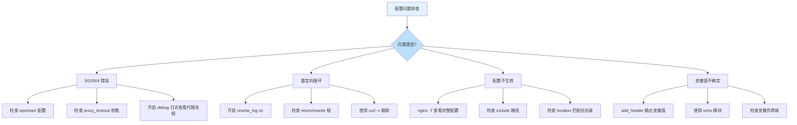
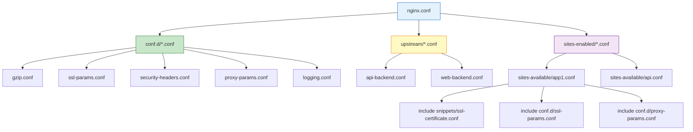
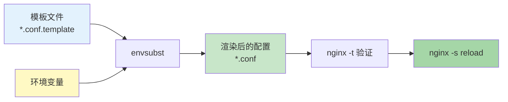
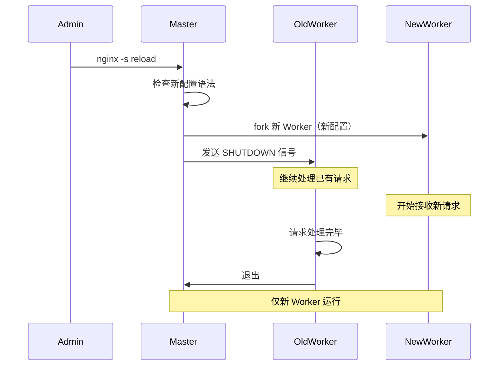

# 配置最佳实践与调试

## 概述

Nginx 配置文件是生产环境的核心资产——配置错误可能导致服务中断、安全漏洞或性能下降。本章系统讲解 Nginx 配置的验证、调试、分离管理与自动化最佳实践，帮助你构建可维护、可审计、可回滚的配置管理体系。

## 1. 配置语法检查

### 1.1 nginx -t 语法检查

`nginx -t` 是 Nginx 配置验证的第一道防线，在不重启服务的情况下检查配置文件的语法正确性：

```bash
# 基本语法检查
nginx -t

# 输出示例（成功）
nginx: the configuration file /etc/nginx/nginx.conf syntax is ok
nginx: configuration file /etc/nginx/nginx.conf test is successful

# 输出示例（失败）
nginx: [emerg] unexpected "}" in /etc/nginx/conf.d/app.conf:15
nginx: configuration file /etc/nginx/nginx.conf test failed
```

```nginx
# 常见语法错误示例

# 错误1：缺少分号
server {
    listen 80        # ← 缺少分号
    server_name example.com;
}

# 错误2：花括号不匹配
http {
    server {
        listen 80;
    # ← 缺少关闭花括号
}

# 错误3：指令上下文错误
events {
    server {         # ← server 不能出现在 events 块中
        listen 80;
    }
}
```

### 1.2 nginx -T 输出完整配置

`nginx -T` 将所有配置文件（包括 include 引入的）合并输出，并执行语法检查：

```bash
# 输出完整展开的配置（所有 include 被替换为实际内容）
nginx -T

# 将完整配置保存到文件（用于审计或比对）
nginx -T > /tmp/nginx-full-config-$(date +%Y%m%d).txt

# 比较两次配置变更
diff /tmp/nginx-full-config-20250101.txt /tmp/nginx-full-config-20250102.txt
```

::: tip nginx -T 的用途
- 排查 include 引入的配置是否正确
- 审计生产环境实际运行的完整配置
- 配置变更前后的 diff 对比
- 新接手项目时快速了解完整配置拓扑
:::

### 1.3 语法检查自动化

```bash
#!/bin/bash
# check-nginx-config.sh - CI/CD 中集成配置检查

set -e

echo "=== Nginx 配置语法检查 ==="

# 检查语法
if ! nginx -t 2>&1; then
    echo "❌ Nginx 配置语法错误"
    exit 1
fi

echo "✅ Nginx 配置语法正确"

# 检查是否有被 include 但不存在的文件
echo ""
echo "=== 检查 include 文件引用 ==="
grep -rh "include" /etc/nginx/ --include="*.conf" | \
    sed 's/.*include\s*//;s/;.*//' | \
    while read -r pattern; do
        # 跳过通配符
        if [[ "$pattern" == *"*"* ]]; then
            if ! compgen -G "$pattern" > /dev/null 2>&1; then
                echo "⚠️  通配符无匹配: $pattern"
            fi
        fi
    done

# 检查 SSL 证书文件是否存在
echo ""
echo "=== 检查 SSL 证书文件 ==="
grep -rh "ssl_certificate " /etc/nginx/ --include="*.conf" | \
    sed 's/.*ssl_certificate\s*//;s/;.*//' | \
    sort -u | \
    while read -r cert; do
        if [[ ! -f "$cert" ]]; then
            echo "❌ 证书文件不存在: $cert"
        else
            # 检查证书过期时间
            expiry=$(openssl x509 -enddate -noout -in "$cert" 2>/dev/null | cut -d= -f2)
            if [[ -n "$expiry" ]]; then
                expiry_epoch=$(date -d "$expiry" +%s 2>/dev/null || date -j -f "%b %d %T %Y %Z" "$expiry" +%s 2>/dev/null)
                now_epoch=$(date +%s)
                days_left=$(( (expiry_epoch - now_epoch) / 86400 ))
                if [[ $days_left -lt 30 ]]; then
                    echo "⚠️  证书即将过期 ($days_left 天): $cert"
                else
                    echo "✅ 证书有效 ($days_left 天): $cert"
                fi
            fi
        fi
    done

echo ""
echo "=== 检查上游服务可达性 ==="
grep -rh "server " /etc/nginx/ --include="*.conf" | \
    grep -v "#" | \
    sed 's/.*server\s*//;s/;.*//' | \
    grep -E ':[0-9]+' | \
    sort -u | \
    while read -r upstream; do
        host=$(echo "$upstream" | cut -d: -f1)
        port=$(echo "$upstream" | cut -d: -f2)
        if ! timeout 2 bash -c "echo > /dev/tcp/$host/$port" 2>/dev/null; then
            echo "⚠️  上游服务不可达: $upstream"
        fi
    done

echo ""
echo "=== 检查完成 ==="
```

## 2. 调试日志与排错

### 2.1 error_log 级别详解

Nginx 错误日志有 8 个级别，从最详细到最少：

```nginx
# error_log 语法
# error_log file [level];

# 调试级别（从详细到简要）
error_log /var/log/nginx/debug.log debug;       # 调试信息（最详细）
error_log /var/log/nginx/error.log info;         # 信息级别
error_log /var/log/nginx/error.log notice;       # 通知级别
error_log /var/log/nginx/error.log warn;         # 警告级别（生产推荐）
error_log /var/log/nginx/error.log error;        # 错误级别
error_log /var/log/nginx/error.log crit;         # 严重错误
error_log /var/log/nginx/error.log alert;        # 必须立即处理
error_log /var/log/nginx/error.log emerg;        # 系统不可用
```


### 2.2 开启 debug 日志

debug 级别输出大量信息，仅在排错时临时开启：

```nginx
# 方法1：全局开启 debug（影响所有请求，性能损耗大）
error_log /var/log/nginx/debug.log debug;

# 方法2：仅对特定连接开启 debug（需要编译时 --with-debug）
# 在 server 或 location 块中
server {
    listen 80;
    server_name debug.example.com;

    error_log /var/log/nginx/debug-specific.log debug;

    location / {
        proxy_pass http://backend;
    }
}
```

::: warning debug 日志的性能影响
- debug 级别会使日志量增加 10-100 倍
- 可能导致磁盘 I/O 成为瓶颈
- 生产环境仅在必要时短时间开启
- 优先使用 `notice` 或 `info` 级别
:::

### 2.3 rewrite 调试

```nginx
# 开启 rewrite 日志（http/server/location 级别）
rewrite_log on;

# rewrite_log 的输出会写入 error_log（需要 error_log 级别 <= notice）
error_log /var/log/nginx/error.log notice;

# 示例：排查 rewrite 规则
server {
    listen 80;
    server_name example.com;
    rewrite_log on;

    # 调试 rewrite 规则
    rewrite ^/old-path/(.*)$ /new-path/$1 permanent;
    rewrite ^/api/v1/(.*)$ /api/v2/$1 break;
}
```

```bash
# 查看 rewrite 日志
tail -f /var/log/nginx/error.log | grep "rewrite"

# 示例输出
# 2025/01/15 10:30:45 [notice] 1234#0: *5678 "^/old-path/(.*)$" matches "/old-path/page", client: 10.0.0.1
# 2025/01/15 10:30:45 [notice] 1234#0: *5678 rewritten data: "/new-path/page", args: ""
```

### 2.4 核心调试场景



### 2.5 使用 add_header 调试变量

```nginx
# 临时调试：将变量值输出到响应头
server {
    listen 80;
    server_name example.com;

    location /debug {
        # 输出变量值到响应头（仅用于调试！）
        add_header X-Debug-Host $host always;
        add_header X-Debug-URI $uri always;
        add_header X-Debug-Args $args always;
        add_header X-Debug-Remote $remote_addr always;
        add_header X-Debug-Upstream $upstream_addr always;

        return 200 "Debug headers sent";
    }

    # 调试 proxy 相关变量
    location /proxy-debug {
        add_header X-Proxy-Status $upstream_status always;
        add_header X-Proxy-Response-Time $upstream_response_time always;
        add_header X-Proxy-Cache-Status $upstream_cache_status always;

        proxy_pass http://backend;
    }
}
```

```bash
# 使用 curl 查看调试头
curl -I https://example.com/debug

# 输出示例
# HTTP/1.1 200 OK
# X-Debug-Host: example.com
# X-Debug-URI: /debug
# X-Debug-Args:
# X-Debug-Remote: 10.0.0.1
```

## 3. 常见配置错误与排查

### 3.1 分号遗漏

```nginx
# ❌ 错误：缺少分号导致后续指令被错误解析
server {
    listen 80
    server_name example.com;  # 被解析为 "listen 80 server_name example.com;"
}

# ✅ 正确
server {
    listen 80;
    server_name example.com;
}
```

### 3.2 花括号不匹配

```nginx
# ❌ 错误：花括号不匹配
http {
    server {
        listen 80;
        location / {
            root /var/www;
        }
    # ← 缺少 server 的关闭括号
}

# ✅ 正确：使用缩进保持配对
http {
    server {
        listen 80;
        location / {
            root /var/www;
        }
    }
}
```

### 3.3 指令上下文错误

```nginx
# ❌ 错误：proxy_pass 不能出现在 server 块的顶层
server {
    listen 80;
    proxy_pass http://backend;  # 必须在 location 块中
}

# ✅ 正确
server {
    listen 80;
    location / {
        proxy_pass http://backend;
    }
}
```

### 3.4 if 指令陷阱

```nginx
# ❌ "if is evil" - 常见 if 陷阱
# if 块中 proxy_pass 和 rewrite 可能不符合预期
location / {
    if ($http_host = "api.example.com") {
        proxy_pass http://api_backend;  # ⚠️ 可能不会按预期工作
    }
    if ($http_host = "www.example.com") {
        proxy_pass http://web_backend;  # ⚠️ 可能不会按预期工作
    }
}

# ✅ 使用 map + 变量代替 if
map $http_host $backend {
    api.example.com  api_backend;
    www.example.com  web_backend;
    default          default_backend;
}

server {
    listen 80;
    location / {
        proxy_pass http://$backend;
    }
}
```

::: important if 指令的安全使用
Nginx 的 `if` 指令在 location 上下文中行为特殊（"if is evil"），仅以下用法是安全的：
- `return` 指令
- `rewrite ... last` 指令
- 与 `try_files` 不冲突的简单条件

避免在 `if` 中使用 `proxy_pass`、`fastcgi_pass`、`root` 等指令。使用 `map` 替代。
:::

### 3.5 root 与 alias 混淆

```nginx
# ❌ 错误：root 和 alias 的路径拼接差异
# root：最终路径 = root + location
location /static {
    root /var/www/app;  # 访问 /static/foo.js → /var/www/app/static/foo.js
}

# alias：最终路径 = alias（替换 location 前缀）
location /static {
    alias /var/www/app;  # 访问 /static/foo.js → /var/www/app/foo.js
}

# ✅ 正确选择
# 当目录名与 location 一致时用 root
location /images {
    root /var/www;  # → /var/www/images/
}

# 当目录名与 location 不同时用 alias
location /assets {
    alias /var/www/static;  # → /var/www/static/
}
```

```mermaid
flowchart LR
    A[请求 /static/app.js] --> B{使用 root 还是 alias?}
    B -->|root /var/www/app| C[/var/www/app/static/app.js]
    B -->|alias /var/www/app| D[/var/www/app/app.js]

    style C fill:#FFCDD2
    style D fill:#C8E6C9
```

## 4. 配置分离策略

### 4.1 目录组织方案

```
/etc/nginx/
├── nginx.conf                    # 主配置文件（全局设置）
├── conf.d/                       # 通用配置片段
│   ├── gzip.conf                 # Gzip 压缩配置
│   ├── ssl-params.conf           # SSL/TLS 参数
│   ├── proxy-params.conf         # 反向代理公共参数
│   ├── security-headers.conf     # 安全响应头
│   └── logging.conf              # 日志格式定义
├── sites-available/              # 可用站点配置（全部）
│   ├── app1.example.com.conf
│   ├── app2.example.com.conf
│   └── api.example.com.conf
├── sites-enabled/                # 已启用站点（符号链接）
│   ├── app1.example.com.conf -> ../sites-available/app1.example.com.conf
│   └── api.example.com.conf -> ../sites-available/api.example.com.conf
├── upstream/                     # 上游服务配置
│   ├── api-backend.conf
│   └── web-backend.conf
├── snippets/                     # 可复用的配置片段
│   ├── ssl-certificate.conf      # SSL 证书路径
│   ├── well-known.conf           # .well-known 验证路径
│   └── proxy-common.conf        # 代理通用配置
└── mime.types                    # MIME 类型定义
```

```nginx
# nginx.conf - 主配置文件
user nginx;
worker_processes auto;
error_log /var/log/nginx/error.log warn;
pid /var/run/nginx.pid;

# 加载动态模块
include /usr/share/nginx/modules/*.conf;

events {
    worker_connections 1024;
    multi_accept on;
}

http {
    include mime.types;
    default_type application/octet-stream;

    # 加载通用配置片段
    include /etc/nginx/conf.d/*.conf;

    # 加载日志格式
    include /etc/nginx/conf.d/logging.conf;

    # 加载上游服务
    include /etc/nginx/upstream/*.conf;

    # 加载已启用的站点
    include /etc/nginx/sites-enabled/*.conf;
}
```

### 4.2 通用配置片段

```nginx
# /etc/nginx/conf.d/gzip.conf
gzip on;
gzip_vary on;
gzip_proxied any;
gzip_comp_level 6;
gzip_min_length 256;
gzip_types
    text/plain
    text/css
    text/xml
    text/javascript
    application/json
    application/javascript
    application/xml
    application/rss+xml
    image/svg+xml;
```

```nginx
# /etc/nginx/conf.d/ssl-params.conf
ssl_protocols TLSv1.2 TLSv1.3;
ssl_ciphers ECDHE-ECDSA-AES128-GCM-SHA256:ECDHE-RSA-AES128-GCM-SHA256:ECDHE-ECDSA-AES256-GCM-SHA384:ECDHE-RSA-AES256-GCM-SHA384;
ssl_prefer_server_ciphers off;
ssl_session_cache shared:SSL:10m;
ssl_session_timeout 1d;
ssl_session_tickets off;
ssl_stapling on;
ssl_stapling_verify on;
```

```nginx
# /etc/nginx/conf.d/security-headers.conf
add_header X-Frame-Options "SAMEORIGIN" always;
add_header X-Content-Type-Options "nosniff" always;
add_header X-XSS-Protection "1; mode=block" always;
add_header Referrer-Policy "strict-origin-when-cross-origin" always;
add_header Content-Security-Policy "default-src 'self'" always;
```

```nginx
# /etc/nginx/conf.d/proxy-params.conf
proxy_http_version 1.1;
proxy_set_header Host $host;
proxy_set_header X-Real-IP $remote_addr;
proxy_set_header X-Forwarded-For $proxy_add_x_forwarded_for;
proxy_set_header X-Forwarded-Proto $scheme;
proxy_set_header Upgrade $http_upgrade;
proxy_set_header Connection $connection_upgrade;
proxy_connect_timeout 60s;
proxy_send_timeout 60s;
proxy_read_timeout 60s;
```

### 4.3 站点配置模板

```nginx
# /etc/nginx/sites-available/app.example.com.conf
server {
    listen 80;
    server_name app.example.com;

    # HTTP → HTTPS 重定向
    return 301 https://$host$request_uri;
}

server {
    listen 443 ssl http2;
    server_name app.example.com;

    # SSL 证书（通过 include 引入，便于统一管理）
    include snippets/ssl-certificate.conf;

    # SSL 参数（复用通用配置）
    include conf.d/ssl-params.conf;

    # 安全头（复用通用配置）
    include conf.d/security-headers.conf;

    # HSTS
    add_header Strict-Transport-Security "max-age=31536000; includeSubDomains; preload" always;

    # 日志
    access_log /var/log/nginx/app.example.com.access.log main;
    error_log /var/log/nginx/app.example.com.error.log warn;

    # 静态文件
    location /static/ {
        alias /var/www/app/static/;
        expires 30d;
        add_header Cache-Control "public, immutable";
    }

    # 反向代理
    location / {
        include conf.d/proxy-params.conf;
        proxy_pass http://app_backend;
    }
}
```



### 4.4 站点启用/禁用管理

```bash
#!/bin/bash
# nginx-site.sh - 站点管理脚本

SITES_AVAILABLE="/etc/nginx/sites-available"
SITES_ENABLED="/etc/nginx/sites-enabled"

case "$1" in
    enable)
        if [[ -z "$2" ]]; then
            echo "Usage: $0 enable <site>"
            exit 1
        fi
        if [[ ! -f "$SITES_AVAILABLE/$2" ]]; then
            echo "❌ 站点配置不存在: $2"
            exit 1
        fi
        ln -sf "$SITES_AVAILABLE/$2" "$SITES_ENABLED/$2"
        nginx -t && echo "✅ 站点已启用: $2" || (rm "$SITES_ENABLED/$2" && echo "❌ 配置语法错误，已回滚")
        ;;
    disable)
        if [[ -z "$2" ]]; then
            echo "Usage: $0 disable <site>"
            exit 1
        fi
        if [[ -L "$SITES_ENABLED/$2" ]]; then
            rm "$SITES_ENABLED/$2"
            nginx -t && echo "✅ 站点已禁用: $2" || echo "⚠️  配置检查失败"
        else
            echo "⚠️  站点未启用: $2"
        fi
        ;;
    list)
        echo "=== 可用站点 ==="
        ls -1 "$SITES_AVAILABLE/" 2>/dev/null
        echo ""
        echo "=== 已启用站点 ==="
        ls -1 "$SITES_ENABLED/" 2>/dev/null
        ;;
    reload)
        nginx -t && nginx -s reload && echo "✅ Nginx 已重新加载" || echo "❌ 重载失败"
        ;;
    *)
        echo "Usage: $0 {enable|disable|list|reload} [site]"
        ;;
esac
```

## 5. 环境变量与配置模板化

### 5.1 envsubst 模板方案

Nginx 原生不支持环境变量替换，使用 `envsubst` 在容器启动时渲染模板：

```nginx
# /etc/nginx/templates/default.conf.template
server {
    listen ${NGINX_PORT};
    server_name ${NGINX_HOST};

    location / {
        proxy_pass http://${BACKEND_HOST}:${BACKEND_PORT};
        proxy_set_header Host $host;
        proxy_set_header X-Real-IP $remote_addr;
        proxy_set_header X-Forwarded-For $proxy_add_x_forwarded_for;
        proxy_set_header X-Forwarded-Proto $scheme;
    }
}
```

```bash
# 使用 envsubst 渲染模板
envsubst '${NGINX_PORT} ${NGINX_HOST} ${BACKEND_HOST} ${BACKEND_PORT}' \
    < /etc/nginx/templates/default.conf.template \
    > /etc/nginx/conf.d/default.conf
```



### 5.2 Docker 集成方案

```dockerfile
# Dockerfile - 官方 Nginx 镜像自动模板化
FROM nginx:1.25

# 官方镜像自带模板化功能
# 将 .template 文件放入 /etc/nginx/templates/
# 容器启动时自动使用 envsubst 渲染
COPY templates/ /etc/nginx/templates/

# 自定义启动脚本
COPY docker-entrypoint.sh /docker-entrypoint.d/99-custom.sh
RUN chmod +x /docker-entrypoint.d/99-custom.sh
```

```yaml
# docker-compose.yml
version: '3.8'
services:
  nginx:
    image: nginx:1.25
    environment:
      - NGINX_HOST=app.example.com
      - NGINX_PORT=80
      - BACKEND_HOST=app
      - BACKEND_PORT=3000
    volumes:
      - ./templates:/etc/nginx/templates
      - ./ssl:/etc/nginx/ssl:ro
    ports:
      - "80:80"
      - "443:443"
```

### 5.3 高级模板化：Lua 动态配置

```nginx
# 使用 OpenResty/Lua 读取环境变量
init_by_lua_block {
    -- 从环境变量读取配置
    local env_vars = {
        backend_host = os.getenv("BACKEND_HOST") or "127.0.0.1",
        backend_port = os.getenv("BACKEND_PORT") or "8080",
    }
    -- 存入共享字典
    local dict = ngx.shared.config
    for k, v in pairs(env_vars) do
        dict:set(k, v)
    end
}

server {
    listen 80;

    location / {
        set_by_lua_block $backend {
            local dict = ngx.shared.config
            return dict:get("backend_host") .. ":" .. dict:get("backend_port")
        }
        proxy_pass http://$backend;
    }
}
```

### 5.4 配置版本管理与回滚

```bash
#!/bin/bash
# nginx-config-version.sh - 配置版本管理

CONFIG_DIR="/etc/nginx"
BACKUP_DIR="/var/backups/nginx-config"
DATE=$(date +%Y%m%d_%H%M%S)

# 创建备份
backup() {
    mkdir -p "$BACKUP_DIR"
    tar czf "$BACKUP_DIR/nginx-config-$DATE.tar.gz" -C "$CONFIG_DIR" .
    echo "✅ 配置已备份: nginx-config-$DATE.tar.gz"

    # 保留最近 30 个备份
    ls -t "$BACKUP_DIR"/nginx-config-*.tar.gz | tail -n +31 | xargs -r rm
}

# 回滚到指定版本
rollback() {
    local version=$1
    if [[ -z "$version" ]]; then
        echo "可用备份："
        ls -1 "$BACKUP_DIR"/nginx-config-*.tar.gz | tail -10
        echo ""
        read -rp "输入要回滚的版本文件名: " version
    fi

    if [[ ! -f "$BACKUP_DIR/$version" ]]; then
        echo "❌ 备份文件不存在: $version"
        exit 1
    fi

    # 先备份当前配置
    backup

    # 恢复指定版本
    tar xzf "$BACKUP_DIR/$version" -C "$CONFIG_DIR"

    # 验证并重载
    if nginx -t; then
        nginx -s reload
        echo "✅ 已回滚到: $version"
    else
        echo "❌ 回滚后配置语法错误，请手动修复"
        exit 1
    fi
}

# 显示当前配置与指定版本的差异
diff_config() {
    local version=$1
    if [[ -z "$version" ]]; then
        echo "可用备份："
        ls -1 "$BACKUP_DIR"/nginx-config-*.tar.gz | tail -5
        exit 1
    fi

    local tmp_dir=$(mktemp -d)
    tar xzf "$BACKUP_DIR/$version" -C "$tmp_dir"
    diff -r "$tmp_dir" "$CONFIG_DIR" || true
    rm -rf "$tmp_dir"
}

case "$1" in
    backup)  backup ;;
    rollback) rollback "$2" ;;
    diff)    diff_config "$2" ;;
    list)    ls -1 "$BACKUP_DIR"/nginx-config-*.tar.gz | tail -20 ;;
    *)       echo "Usage: $0 {backup|rollback|diff|list} [version]" ;;
esac
```

## 6. 配置安全

### 6.1 文件权限控制

```bash
# Nginx 配置文件权限
# 主配置文件：root 只读
chmod 644 /etc/nginx/nginx.conf

# SSL 证书私钥：root 只读，禁止其他用户访问
chmod 600 /etc/nginx/ssl/*.key
chown root:root /etc/nginx/ssl/*.key

# 站点配置：root 可写
chmod 644 /etc/nginx/sites-available/*.conf
chmod 644 /etc/nginx/sites-enabled/*.conf

# 确保 nginx 用户无法修改配置（防止漏洞提权）
chown -R root:root /etc/nginx/
```

### 6.2 敏感信息处理

```nginx
# ❌ 错误：在配置文件中硬编码敏感信息
upstream backend {
    server db.internal:5432;  # 内部数据库地址暴露
}

# 如果必须在配置中引用敏感信息，使用环境变量模板
# template 文件
upstream backend {
    server ${DB_HOST}:${DB_PORT};
}
```

```bash
# 使用 .env 文件管理敏感变量（不要提交到 Git）
# .env（加入 .gitignore）
DB_HOST=db.internal
DB_PORT=5432
SSL_CERT_PATH=/etc/nginx/ssl/cert.pem
SSL_KEY_PATH=/etc/nginx/ssl/key.pem
```

### 6.3 配置审计

```bash
#!/bin/bash
# nginx-audit.sh - 配置安全审计

echo "=== Nginx 配置安全审计 ==="
echo ""

# 检查 SSL 配置
echo "1. SSL/TLS 配置检查"
if grep -rq "ssl_protocols.*SSLv2\|ssl_protocols.*SSLv3\|ssl_protocols.*TLSv1[^.]" /etc/nginx/; then
    echo "  ❌ 发现不安全的 SSL/TLS 协议版本"
else
    echo "  ✅ SSL/TLS 协议版本安全"
fi

# 检查是否启用了 HTTPS
echo ""
echo "2. HTTPS 配置检查"
if grep -rq "listen.*80" /etc/nginx/sites-enabled/ && ! grep -rq "return 301 https" /etc/nginx/sites-enabled/; then
    echo "  ⚠️  发现 HTTP 监听但无 HTTPS 重定向"
else
    echo "  ✅ HTTPS 重定向配置正常"
fi

# 检查 server_tokens
echo ""
echo "3. 版本信息隐藏"
if grep -rq "server_tokens off" /etc/nginx/; then
    echo "  ✅ 版本信息已隐藏"
else
    echo "  ❌ 未隐藏 Nginx 版本信息（添加 server_tokens off）"
fi

# 检查私钥权限
echo ""
echo "4. SSL 私钥权限检查"
find /etc/nginx -name "*.key" -perm /o=r -exec ls -l {} \; 2>/dev/null
if find /etc/nginx -name "*.key" -perm /o=r 2>/dev/null | grep -q .; then
    echo "  ❌ 发现私钥文件权限过于宽松"
else
    echo "  ✅ 私钥文件权限安全"
fi

# 检查目录列表
echo ""
echo "5. 目录列表检查"
if grep -rq "autoindex on" /etc/nginx/sites-enabled/; then
    echo "  ⚠️  发现启用了目录列表（autoindex on）"
else
    echo "  ✅ 目录列表已禁用"
fi

# 检查 Debug 日志
echo ""
echo "6. Debug 日志检查"
if grep -rq "error_log.*debug" /etc/nginx/; then
    echo "  ⚠️  发现开启 debug 日志（生产环境应关闭）"
else
    echo "  ✅ Debug 日志未开启"
fi
```

## 7. 配置性能检测

### 7.1 配置与 CI/CD 集成

```yaml
# .github/workflows/nginx-config-check.yml
name: Nginx Config Check

on:
  pull_request:
    paths:
      - 'nginx/**'

jobs:
  check:
    runs-on: ubuntu-latest
    container:
      image: nginx:1.25

    steps:
      - uses: actions/checkout@v4

      - name: Copy config files
        run: |
          cp -r nginx/conf/* /etc/nginx/

      - name: Syntax check
        run: nginx -t

      - name: Security audit
        run: |
          # 检查不安全的配置
          echo "Checking for insecure SSL protocols..."
          ! grep -r "SSLv2\|SSLv3\|TLSv1 " /etc/nginx/

          echo "Checking server_tokens..."
          grep -r "server_tokens off" /etc/nginx/

      - name: Config diff
        run: |
          nginx -T > /tmp/new-config.txt
          echo "Full configuration output saved for review"
```

### 7.2 配置热重载 vs 重启

```bash
# ✅ 推荐：热重载（不断开现有连接）
nginx -s reload

# ❌ 避免：重启（断开所有连接）
systemctl restart nginx

# 热重载的工作原理
# 1. Master 进程检查新配置语法
# 2. Master 打开新的监听端口
# 3. Master 启动新的 Worker 进程
# 4. Master 向旧 Worker 发送 GRACEFUL SHUTDOWN 信号
# 5. 旧 Worker 处理完当前请求后退出
```



### 7.3 配置变更前检查清单

```markdown
## Nginx 配置变更检查清单

### 变更前
- [ ] 在本地/测试环境验证配置语法 (nginx -t)
- [ ] 确认变更影响的范围（哪些站点/路由）
- [ ] 备份当前配置
- [ ] 准备回滚方案
- [ ] 通知相关团队

### 变更中
- [ ] 使用 nginx -s reload 而非 systemctl restart
- [ ] 观察错误日志 (tail -f /var/log/nginx/error.log)
- [ ] 检查 Worker 进程 (ps aux | grep nginx)
- [ ] 验证服务可访问性 (curl -I https://example.com)

### 变更后
- [ ] 确认所有站点正常
- [ ] 检查 SSL 证书状态
- [ ] 验证缓存状态
- [ ] 监控 5xx 错误率
- [ ] 记录变更日志
```

## 8. 实用排错命令

```bash
# 快速诊断命令集

# 1. 查看 Nginx 进程状态
ps aux | grep nginx
pgrep -a nginx

# 2. 查看监听端口
ss -tlnp | grep nginx
netstat -tlnp | grep nginx

# 3. 查看连接统计
ss -s

# 4. 实时监控访问日志
tail -f /var/log/nginx/access.log

# 5. 统计状态码分布
awk '{print $9}' /var/log/nginx/access.log | sort | uniq -c | sort -rn

# 6. 统计 Top 20 访问 IP
awk '{print $1}' /var/log/nginx/access.log | sort | uniq -c | sort -rn | head -20

# 7. 查找 5xx 错误请求
awk '$9 >= 500' /var/log/nginx/access.log | tail -50

# 8. 测试上游服务连通性
curl -I http://backend:8080/health

# 9. 查看 Nginx 编译参数
nginx -V 2>&1

# 10. 检查配置文件完整性
find /etc/nginx -name "*.conf" -exec nginx -t \; 2>&1

# 11. 查看系统限制
ulimit -n                    # 文件描述符限制
cat /proc/$(pgrep -x nginx | head -1)/limits  # Nginx 进程限制

# 12. 分析请求延迟
awk '{print $NF}' /var/log/nginx/access.log | \
    awk '{sum+=$1; count++} END {print "avg:", sum/count, "total:", count}'
```

## 总结

Nginx 配置管理的关键原则：

| 原则 | 方法 |
|------|------|
| 验证优先 | 变更前 `nginx -t`，变更后 `nginx -T` 审计 |
| 配置分离 | 通用配置片段 include 复用，站点独立管理 |
| 环境隔离 | envsubst 模板化，.env 管理敏感变量 |
| 版本可控 | Git 管理配置，备份回滚机制 |
| 安全加固 | 最小权限，审计扫描，隐藏版本号 |
| 渐进发布 | reload 不 restart，金丝雀验证 |
| 可观测性 | 日志分级，变量调试，监控集成 |

## 进一步阅读

- [Nginx Debugging Guide](https://nginx.org/en/docs/debugging.html)
- [Nginx Configuration Guide](https://docs.nginx.com/nginx/admin-guide/basic-functionality/)
- [Nginx Pitfalls](https://www.nginx.com/resources/wiki/start/topics/tutorials/config_pitfalls/)
- [NGINX Cookbook](https://www.nginx.com/resources/library/complete-nginx-cookbook/) — O'Reilly
- [Mozilla SSL Configuration Generator](https://ssl-config.mozilla.org/)
