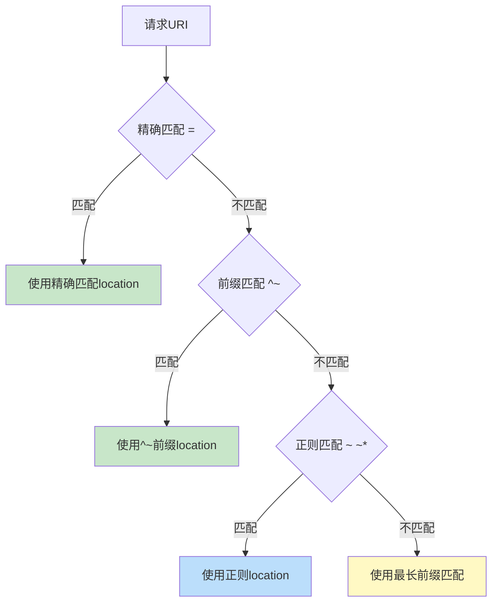
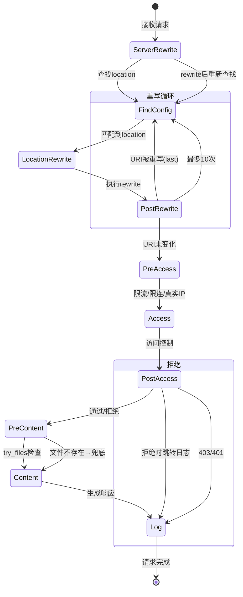
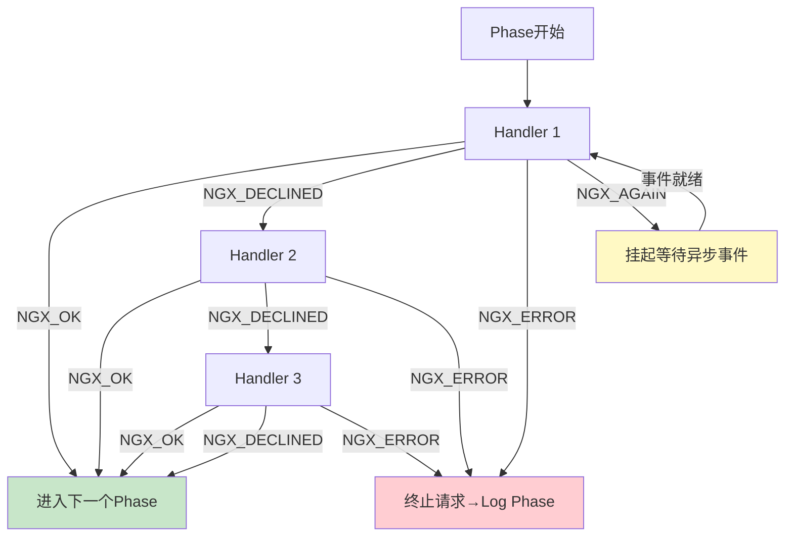
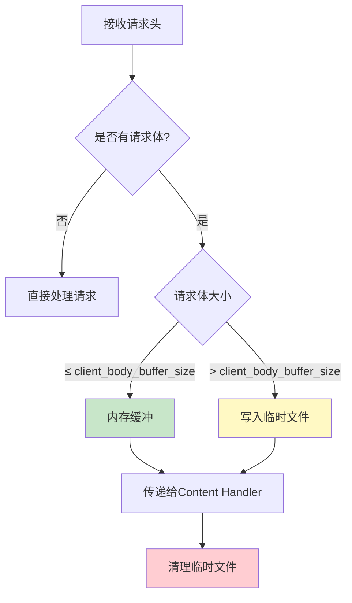
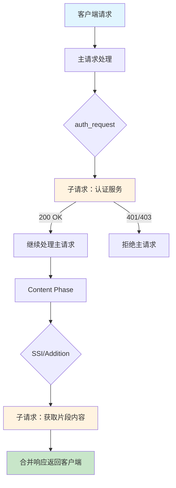
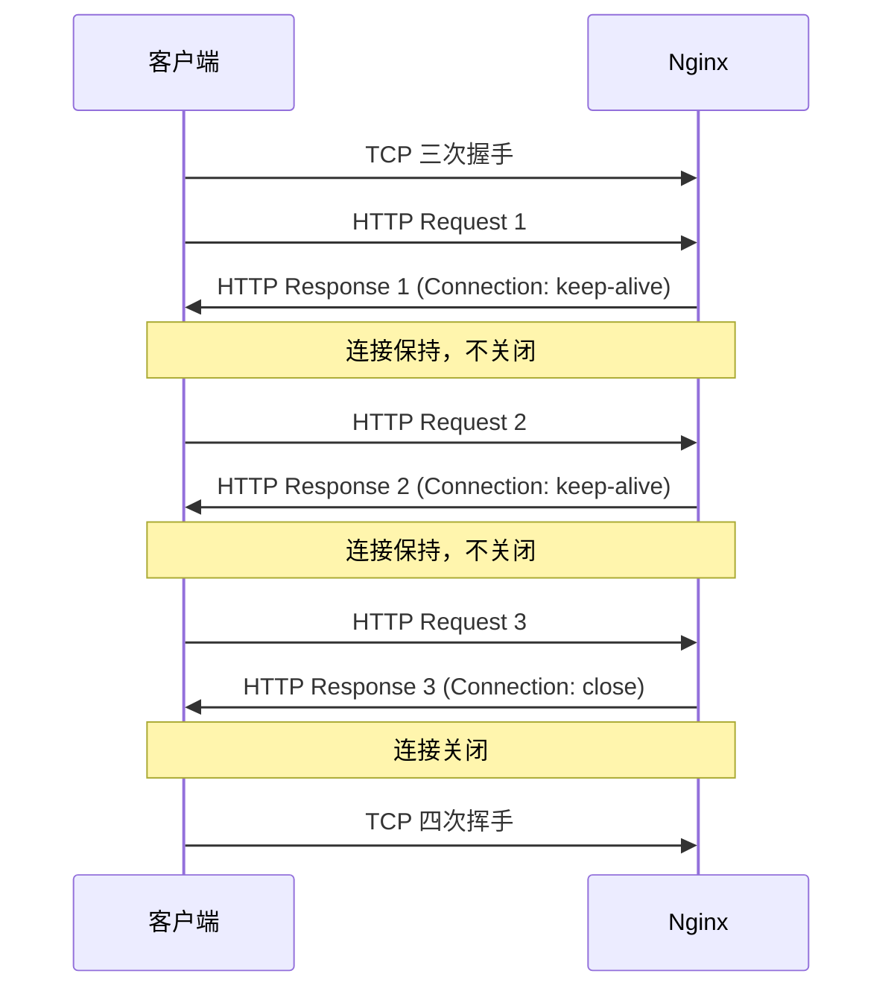

# HTTP 请求处理流程

## 概述

Nginx 作为一个高性能的 HTTP 服务器和反向代理，其请求处理流程是理解 Nginx 工作原理的核心。Nginx 将一个完整的 HTTP 请求处理过程划分为 **10 个阶段（Phase）**，每个阶段由一组特定的模块和指令负责处理。这种分阶段的设计使得 Nginx 具有极高的模块化程度和可扩展性。

理解这 10 个 Phase 的执行顺序、对应的模块以及各阶段之间的交互机制，是编写高效、正确的 Nginx 配置的基础。

::: important 核心概念
Nginx 的 HTTP 请求处理并非简单的线性流程，而是一个精心设计的状态机。每个 Phase 可以包含多个 Handler，Phase 之间有明确的优先级和跳转规则。理解 Phase 机制是排查配置问题和优化性能的关键。
:::

## HTTP 请求处理的 10 个 Phase

Nginx 将 HTTP 请求处理划分为以下 10 个阶段，按照固定顺序依次执行：

```mermaid
flowchart LR
    A["NGX_HTTP_SERVER_REWRITE_PHASE<br/>Server Rewrite"] --> B["NGX_HTTP_FIND_CONFIG_PHASE<br/>Find Config"]
    B --> C["NGX_HTTP_REWRITE_PHASE<br/>Rewrite"]
    C --> D["NGX_HTTP_POST_REWRITE_PHASE<br/>Post Rewrite"]
    D --> E["NGX_HTTP_PREACCESS_PHASE<br/>Preaccess"]
    E --> F["NGX_HTTP_ACCESS_PHASE<br/>Access"]
    F --> G["NGX_HTTP_POST_ACCESS_PHASE<br/>Post Access"]
    G --> H["NGX_HTTP_PRECONTENT_PHASE<br/>Try Files"]
    H --> I["NGX_HTTP_CONTENT_PHASE<br/>Content"]
    I --> J["NGX_HTTP_LOG_PHASE<br/>Log"]

    style A fill:#e1f5fe
    style B fill:#fff3e0
    style C fill:#e1f5fe
    style D fill:#fce4ec
    style E fill:#e8f5e9
    style F fill:#e8f5e9
    style G fill:#fce4ec
    style H fill:#f3e5f5
    style I fill:#f3e5f5
    style J fill:#efebe9
```



### Phase 详解

#### Phase 1：NGX_HTTP_SERVER_REWRITE_PHASE

**执行位置**：server 块内的 rewrite 指令

**对应模块**：`ngx_http_rewrite_module`

**核心指令**：`rewrite`、`if`、`set`、`return`、`break`

此阶段在请求匹配到具体的 server 块之后、查找 location 之前执行。主要用于在 server 级别对请求 URI 进行重写，例如将 HTTP 请求重定向到 HTTPS。

```nginx
server {
    listen 80;
    server_name example.com;

    # 在 server 级别执行重写
    rewrite ^(.*)$ https://$host$1 permanent;
}
```

::: tip 执行时机
Server Rewrite Phase 在 Find Config Phase 之前执行，这意味着此时的重写操作发生在请求还没有匹配到具体 location 的时候。如果重写后的 URI 需要重新匹配 location，将通过 Post Rewrite Phase 跳回 Find Config Phase。
:::

#### Phase 2：NGX_HTTP_FIND_CONFIG_PHASE

**执行位置**：查找匹配的 location 块

**对应模块**：`ngx_http_core_module`

**核心指令**：`location`

此阶段不可注册自定义 Handler，由 Nginx 核心代码负责根据当前请求 URI 查找匹配的 location 配置块。查找到匹配的 location 后，请求的 `loc_conf` 指针将被更新为该 location 的配置。



::: warning 不可注册
Find Config Phase 是 Nginx 内部阶段，不允许第三方模块注册 Handler。此阶段纯粹由 Nginx 核心负责 URI 到 location 的映射。
:::

#### Phase 3：NGX_HTTP_REWRITE_PHASE

**执行位置**：location 块内的 rewrite 指令

**对应模块**：`ngx_http_rewrite_module`

**核心指令**：`rewrite`、`if`、`set`、`return`、`break`

此阶段与 Phase 1 使用相同的模块，但执行位置不同——Phase 1 在 server 块内，Phase 3 在 location 块内。当请求已经匹配到某个 location 后，location 内的 rewrite 指令将在此阶段执行。

```nginx
server {
    listen 80;
    server_name example.com;

    location /old/ {
        # 在 location 级别执行重写
        rewrite ^/old/(.*)$ /new/$1 last;
    }

    location /new/ {
        proxy_pass http://backend;
    }
}
```

#### Phase 4：NGX_HTTP_POST_REWRITE_PHASE

**执行位置**：重写后处理

**对应模块**：`ngx_http_rewrite_module`（内部）

此阶段同样不可注册自定义 Handler。它的唯一功能是检查 Phase 3（Rewrite Phase）是否产生了 URI 重写。如果 URI 被重写（使用了 `last` 标志），则将请求跳回 Phase 2（Find Config Phase）重新查找 location，最多循环 10 次（由源码常量 `NGX_HTTP_MAX_REWRITE_CYCLES` 控制，默认值为 10，不可通过配置修改），超过则返回 500 错误。

::: important 重写循环保护
Nginx 内置了重写循环保护机制，当 `rewrite` 配置不当导致循环跳转时，最多循环 10 次后返回 500 错误。这是防止配置错误导致无限循环的关键保护。
:::

#### Phase 5：NGX_HTTP_PREACCESS_PHASE

**执行位置**：访问控制前处理

**对应模块**：
- `ngx_http_limit_conn_module`（限制并发连接数）
- `ngx_http_limit_req_module`（限制请求速率）
- `ngx_http_realip_module`（获取真实客户端 IP）

**核心指令**：`limit_conn`、`limit_req`、`set_real_ip_from`、`real_ip_header`

此阶段在真正的访问控制之前执行，主要用于预处理工作，如限流、限连接和获取真实 IP。

```nginx
server {
    listen 80;

    # 限流：每秒最多 10 个请求，突发允许 20 个
    limit_req zone=api_limit burst=20 nodelay;

    # 限连接：每个 IP 最多 5 个并发连接
    limit_conn addr 5;

    # 获取真实 IP（当 Nginx 在负载均衡器之后时）
    set_real_ip_from 10.0.0.0/8;
    set_real_ip_from 172.16.0.0/12;
    real_ip_header X-Forwarded-For;

    location / {
        proxy_pass http://backend;
    }
}
```

#### Phase 6：NGX_HTTP_ACCESS_PHASE

**执行位置**：访问控制

**对应模块**：
- `ngx_http_access_module`（IP 访问控制）
- `ngx_http_auth_basic_module`（Basic 认证）
- `ngx_http_auth_request_module`（子请求认证）

**核心指令**：`allow`、`deny`、`auth_basic`、`auth_request`

此阶段用于实现各种访问控制策略。多个 Handler 按模块加载顺序执行，任何一个 Handler 返回拒绝（403/401），请求将被终止。

```nginx
location /admin/ {
    # IP 访问控制
    allow 192.168.1.0/24;
    allow 10.0.0.0/8;
    deny all;

    # Basic 认证
    auth_basic "Admin Area";
    auth_basic_user_file /etc/nginx/.htpasswd;

    proxy_pass http://admin_backend;
}
```

::: warning Access Phase 的 satisfy 指令
当同时配置了多种访问控制方式时，`satisfy` 指令决定它们的逻辑关系：
- `satisfy all`（默认）：所有条件必须同时满足
- `satisfy any`：任一条件满足即可通过
:::

#### Phase 7：NGX_HTTP_POST_ACCESS_PHASE

**执行位置**：访问控制后处理

此阶段不可注册自定义 Handler。它用于处理 Access Phase 的结果——如果访问被拒绝，将返回相应的错误响应（403 或 401），并终止请求处理。

#### Phase 8：NGX_HTTP_PRECONTENT_PHASE

**执行位置**：内容生成前处理

**对应模块**：
- `ngx_http_core_module`

**核心指令**：`try_files`

此阶段在生成响应内容之前执行，主要用于 `try_files` 指令按顺序检查文件是否存在。

```nginx
location / {
    # 按顺序尝试：$uri → $uri/ → /index.html → 代理到后端
    try_files $uri $uri/ /index.html @fallback;
}

location @fallback {
    proxy_pass http://backend;
}
```

::: info try_files 的执行逻辑
`try_files` 按参数顺序依次检查文件是否存在。最后一个参数是兜底处理，可以是命名 location 或 URI，不会检查文件是否存在，而是直接执行内部重定向或跳转到命名 location。
:::

#### Phase 9：NGX_HTTP_CONTENT_PHASE

**执行位置**：生成响应内容

**对应模块**：
- `ngx_http_proxy_module`（反向代理）
- `ngx_http_fastcgi_module`（FastCGI 代理）
- `ngx_http_uwsgi_module`（uWSGI 代理）
- `ngx_http_scgi_module`（SCGI 代理）
- `ngx_http_gzip_module`（Gzip 压缩）
- `ngx_http_static_module`（静态文件服务）
- `ngx_http_autoindex_module`（自动索引）
- `ngx_http_index_module`（索引文件）

**核心指令**：`proxy_pass`、`fastcgi_pass`、`root`、`alias`、`index`

此阶段是请求处理的核心，负责生成响应内容。通常只有一个 Content Handler 会被执行——Nginx 按模块优先级选择第一个匹配的 Handler。

```nginx
location /static/ {
    # ngx_http_static_module 处理
    root /var/www;
}

location /api/ {
    # ngx_http_proxy_module 处理
    proxy_pass http://api_backend;
}

location ~ \.php$ {
    # ngx_http_fastcgi_module 处理
    fastcgi_pass unix:/run/php-fpm.sock;
    fastcgi_param SCRIPT_FILENAME $document_root$fastcgi_script_name;
    include fastcgi_params;
}
```

#### Phase 10：NGX_HTTP_LOG_PHASE

**执行位置**：记录访问日志

**对应模块**：`ngx_http_log_module`

**核心指令**：`access_log`、`log_format`

此阶段在请求处理完成后执行，无论请求是否成功。日志阶段的特点是即使返回了错误，也会记录日志。

```nginx
http {
    log_format main '$remote_addr - $remote_user [$time_local] '
                    '"$request" $status $body_bytes_sent '
                    '"$http_referer" "$http_user_agent" '
                    '$request_time $upstream_response_time';

    access_log /var/log/nginx/access.log main;
}
```

::: tip 日志阶段不受前置阶段影响
Log Phase 始终会执行，即使前面的 Phase 返回了错误响应。这使得即使请求处理失败，也能在日志中找到记录，对于排查问题非常重要。
:::

## 每个 Phase 对应的模块与指令汇总

| Phase | 阶段名称 | 主要模块 | 核心指令 |
|-------|----------|---------|---------|
| 1 | NGX_HTTP_SERVER_REWRITE_PHASE | ngx_http_rewrite_module | rewrite, if, set, return, break |
| 2 | NGX_HTTP_FIND_CONFIG_PHASE | ngx_http_core_module | location |
| 3 | NGX_HTTP_REWRITE_PHASE | ngx_http_rewrite_module | rewrite, if, set, return, break |
| 4 | NGX_HTTP_POST_REWRITE_PHASE | ngx_http_rewrite_module | （内部阶段） |
| 5 | NGX_HTTP_PREACCESS_PHASE | ngx_http_limit_conn_module, ngx_http_limit_req_module, ngx_http_realip_module | limit_conn, limit_req, set_real_ip_from |
| 6 | NGX_HTTP_ACCESS_PHASE | ngx_http_access_module, ngx_http_auth_basic_module, ngx_http_auth_request_module | allow, deny, auth_basic, auth_request |
| 7 | NGX_HTTP_POST_ACCESS_PHASE | — | （内部阶段） |
| 8 | NGX_HTTP_PRECONTENT_PHASE | ngx_http_core_module | try_files |
| 9 | NGX_HTTP_CONTENT_PHASE | ngx_http_proxy_module, ngx_http_fastcgi_module, ngx_http_static_module 等 | proxy_pass, fastcgi_pass, root, index |
| 10 | NGX_HTTP_LOG_PHASE | ngx_http_log_module | access_log, log_format |

::: info 参考文档
Phase 机制的源码定义在 [Nginx 源码 `src/http/ngx_http_core_module.h`](https://nginx.org/en/docs/dev/development_guide.html) 中，`NGX_HTTP_PHASE` 枚举类型定义了所有阶段的编号和顺序。
:::

## 请求处理状态机

Nginx 的 HTTP 请求处理本质上是一个状态机。请求在不同 Phase 之间流转，某些 Phase 可能导致跳转（如 rewrite 导致回到 Find Config Phase），某些 Phase 可能直接终止请求（如 Access Phase 返回 403）。



### 状态机的关键跳转

#### 1. Rewrite 跳转

当 `rewrite` 指令使用 `last` 标志时，Post Rewrite Phase 会将请求跳回 Find Config Phase，重新查找匹配的 location。这种跳转最多发生 10 次。

```nginx
# 重写跳转示例
location /v1/ {
    rewrite ^/v1/(.*)$ /v2/$1 last;  # last → 跳回 Find Config
}

location /v2/ {
    rewrite ^/v2/(.*)$ /v3/$1 last;  # 再次跳回 Find Config
}

location /v3/ {
    proxy_pass http://backend_v3;
}
```

#### 2. Internal Redirect

`rewrite` 使用 `redirect` 或 `permanent` 标志时，会直接返回 302/301 重定向响应给客户端，请求不会继续处理后续 Phase。

```nginx
location /old-path {
    rewrite ^/old-path(.*)$ /new-path$1 permanent;  # 301 → 直接返回
}
```

#### 3. return 终止

`return` 指令在任何 Phase 执行时，都会立即终止请求处理，跳转到 Log Phase。

```nginx
location /maintenance {
    return 503 "Service Unavailable";  # 直接返回，跳转到Log Phase
}
```

#### 4. try_files 跳转

`try_files` 在 Precontent Phase 检查文件时，如果所有文件都不存在，最后一个参数将触发内部重定向（跳回 Find Config Phase）或跳转到命名 location。

```nginx
location / {
    try_files $uri $uri/ /index.html;  # 最后的 /index.html 会内部重定向
}
```

### Phase Handler 的执行模型

每个 Phase 可以注册多个 Handler，它们按照以下规则执行：

1. **同一 Phase 中的多个 Handler 按注册顺序执行**
2. **Handler 的返回值决定后续行为**：
   - `NGX_OK`：该 Phase 处理完成，进入下一个 Phase
   - `NGX_DECLINED`：跳过当前 Handler，继续执行同一 Phase 中的下一个 Handler
   - `NGX_AGAIN` / `NGX_DONE`：挂起当前请求，等待异步事件
   - `NGX_ERROR` / `NGX_HTTP_XXX`：终止请求处理



::: important Access Phase 的特殊规则
Access Phase 的 Handler 返回值有特殊含义：
- `NGX_OK`：访问允许，继续下一个 Handler
- `NGX_DECLINED`：跳过，继续下一个 Handler
- `NGX_HTTP_FORBIDDEN` / `NGX_HTTP_UNAUTHORIZED`：访问拒绝

当 `satisfy all` 时，所有 Handler 必须返回 `NGX_OK`；当 `satisfy any` 时，任一 Handler 返回 `NGX_OK` 即可。
:::

## 请求头解析与变量填充

Nginx 在接收 HTTP 请求后，会解析请求头并将信息填充到内置变量中。这些变量可以在配置中使用，是 Nginx 配置灵活性的基础。

### 请求行解析

Nginx 首先解析请求行，提取 Method、URI 和 HTTP 版本：

```
GET /api/users?page=1 HTTP/1.1
```

解析结果：
- `$request_method` = `GET`
- `$request_uri` = `/api/users?page=1`（含查询参数）
- `$uri` = `/api/users`（不含查询参数）
- `$args` = `page=1`
- `$query_string` = `page=1`（与 `$args` 相同）
- `$server_protocol` = `HTTP/1.1`

### 请求头填充变量

每个 HTTP 请求头都会被填充到 `$http_<header_name>` 变量中：

| 请求头 | 对应变量 |
|--------|---------|
| `Host: example.com` | `$host` = `example.com`, `$http_host` = `example.com` |
| `User-Agent: Mozilla/5.0...` | `$http_user_agent` |
| `Cookie: session=abc123` | `$http_cookie` |
| `Referer: https://example.com/` | `$http_referer` |
| `Accept-Encoding: gzip` | `$http_accept_encoding` |
| `X-Forwarded-For: 1.2.3.4` | `$http_x_forwarded_for` |
| `Authorization: Bearer xxx` | `$http_authorization` |
| `Content-Type: application/json` | `$content_type`（特殊变量名） |
| `Content-Length: 1024` | `$content_length`（特殊变量名） |

### 请求头解析源码流程

Nginx 接收请求头的流程如下：

1. **读取请求行**：`ngx_http_read_client_request_header()`
2. **解析请求行**：`ngx_http_parse_request_line()`
3. **读取请求头**：循环调用 `ngx_http_read_client_request_header()`
4. **解析请求头**：`ngx_http_parse_header_line()`
5. **设置变量**：将解析结果填充到 `r->headers_in` 结构体

::: tip 请求头大小限制
`client_header_buffer_size` 控制初始请求头缓冲区大小（默认 1K），`large_client_header_buffers` 控制大请求头缓冲区数量和大小（默认 4 个 8K）。如果请求头超过限制，Nginx 将返回 400 或 414 错误。
:::

```nginx
http {
    # 初始请求头缓冲区
    client_header_buffer_size 2k;

    # 大请求头缓冲区
    large_client_header_buffers 4 16k;

    # 请求头超时
    client_header_timeout 60s;
}
```

### 内置变量分类

#### 请求相关变量

| 变量 | 说明 |
|------|------|
| `$request` | 完整的原始请求行 |
| `$request_method` | 请求方法 |
| `$request_uri` | 原始请求 URI（含参数） |
| `$uri` | 当前 URI（可能被重写修改） |
| `$document_uri` | 与 `$uri` 相同 |
| `$args` | 查询参数 |
| `$query_string` | 与 `$args` 相同 |
| `$request_body` | 请求体（仅在 proxy/fastcgi 中可用） |
| `$request_body_file` | 请求体临时文件路径 |

#### 客户端相关变量

| 变量 | 说明 |
|------|------|
| `$remote_addr` | 客户端 IP |
| `$remote_port` | 客户端端口 |
| `$remote_user` | 认证用户名 |
| `$binary_remote_addr` | 二进制格式客户端 IP（更节省内存） |

#### 服务端相关变量

| 变量 | 说明 |
|------|------|
| `$server_addr` | 服务器 IP |
| `$server_port` | 服务器端口 |
| `$server_name` | server_name 指令值 |
| `$server_protocol` | HTTP 协议版本 |
| `$host` | 优先级：请求行中的 host → Host 头 → server_name |
| `$hostname` | 机器主机名 |

#### 连接相关变量

| 变量 | 说明 |
|------|------|
| `$connection` | 连接序列号 |
| `$connection_requests` | 当前连接上的请求数 |
| `$ssl_protocol` | SSL/TLS 协议版本 |
| `$ssl_cipher` | SSL/TLS 加密套件 |

## 请求体处理与缓冲

当客户端发送包含请求体的请求（如 POST、PUT）时，Nginx 需要处理请求体的读取和缓冲。

### 请求体处理流程



### 请求体相关指令

```nginx
http {
    # 请求体缓冲区大小（默认 8K/16K）
    client_body_buffer_size 16k;

    # 请求体最大大小（默认 1M）
    client_max_body_size 50m;

    # 请求体临时文件目录
    client_body_temp_path /var/cache/nginx/client_temp 1 2;

    # 请求体接收超时
    client_body_timeout 60s;

    # 请求体是否保存到文件
    # client_body_in_file_only on;  # 仅调试用

    # 请求体是否只缓冲到内存
    # client_body_in_single_buffer on;
}
```

### 请求体在不同代理模式下的处理

#### proxy_pass 模式

```nginx
location /api/ {
    proxy_pass http://backend;

    # 请求体缓冲
    proxy_request_buffering on;  # 默认开启

    # 请求体临时文件
    client_body_buffer_size 128k;
    client_max_body_size 100m;
}
```

当 `proxy_request_buffering on`（默认）时，Nginx 会先完整读取请求体到缓冲区或临时文件，然后再转发给上游。当 `proxy_request_buffering off` 时，Nginx 会流式转发请求体，适用于大文件上传场景。

#### fastcgi_pass 模式

```nginx
location ~ \.php$ {
    fastcgi_pass unix:/run/php-fpm.sock;

    # FastCGI 请求体处理
    fastcgi_param REQUEST_BODY $request_body;
    fastcgi_param CONTENT_LENGTH $content_length;

    include fastcgi_params;
}
```

### 大文件上传优化

```nginx
server {
    listen 80;
    server_name upload.example.com;

    # 关闭请求体缓冲，流式上传
    proxy_request_buffering off;

    # 增大请求体限制
    client_max_body_size 500m;
    client_body_buffer_size 256k;

    # 增大超时
    client_body_timeout 300s;

    # 代理到上传服务
    location /upload/ {
        proxy_pass http://upload_backend;
        proxy_http_version 1.1;

        # 关闭代理缓冲，避免双重缓冲
        proxy_buffering off;

        # 设置较长的代理超时
        proxy_connect_timeout 60s;
        proxy_send_timeout 300s;
        proxy_read_timeout 300s;
    }
}
```

::: warning client_max_body_size 与 413 错误
当请求体大小超过 `client_max_body_size` 时，Nginx 直接返回 413 Request Entity Too Large 错误，不会将请求转发到上游。此限制发生在 Content Phase 之前，确保大文件不会浪费上游资源。
:::

## 子请求机制与 Internal Redirect

### Internal Redirect（内部重定向）

Internal Redirect 是 Nginx 内部的 URI 跳转机制，客户端不会感知到任何变化。它通过 Post Rewrite Phase 将请求跳回 Find Config Phase 实现。

触发 Internal Redirect 的方式：

1. **rewrite ... last**：将 URI 重写后重新匹配 location
2. **error_page**：当响应为指定状态码时，内部重定向到新 URI
3. **try_files 最后参数**：文件不存在时内部重定向
4. **index**：当请求以 `/` 结尾时，内部重定向到索引文件

```nginx
server {
    listen 80;

    # error_page 内部重定向
    error_page 404 /404.html;
    error_page 500 502 503 504 /50x.html;

    location / {
        # try_files 内部重定向
        try_files $uri $uri/ /index.html;
    }

    location = /404.html {
        internal;  # 标记为内部location，外部不可直接访问
        root /usr/share/nginx/html;
    }

    location = /50x.html {
        internal;
        root /usr/share/nginx/html;
    }
}
```

::: important internal 指令
`internal` 指令将 location 标记为仅接受内部重定向请求。外部直接访问该 URI 将返回 404。这是保护错误页面和内部处理逻辑的重要安全机制。
:::

### 子请求（Subrequest）

子请求是 Nginx 的一个强大特性，允许在处理一个请求的过程中发起额外的内部请求。子请求的结果可以被合并到主请求的响应中，也可以仅用于判断（如 `auth_request`）。



#### 子请求的应用场景

1. **auth_request**：在访问资源前先通过子请求进行认证
2. **SSI（Server Side Includes）**：在响应中嵌入其他请求的内容
3. **addition 模块**：在响应前后追加内容
4. **xslt 模块**：使用 XSLT 转换 XML 响应

#### auth_request 子请求示例

```nginx
server {
    listen 80;
    server_name api.example.com;

    # 认证子请求
    location /api/ {
        auth_request /auth;
        auth_request_set $auth_status $upstream_status;

        proxy_pass http://api_backend;
        proxy_set_header X-User $upstream_http_x_user;
    }

    # 认证服务 location
    location = /auth {
        internal;
        proxy_pass http://auth_service/verify;
        proxy_pass_request_body off;
        proxy_set_header Content-Length "";
        proxy_set_header X-Original-URI $request_uri;
    }
}
```

#### SSI 子请求示例

```nginx
server {
    listen 80;
    server_name www.example.com;

    # 启用 SSI
    ssi on;
    ssi_types text/html;

    location / {
        root /var/www/html;
        index index.html;
    }
}
```

HTML 文件中使用 SSI 指令：

```html
<!DOCTYPE html>
<html>
<body>
    <!--#include virtual="/header.html" -->
    <main>
        <h1>Welcome</h1>
        <!--#include virtual="/api/user-info" -->
    </main>
    <!--#include virtual="/footer.html" -->
</body>
</html>
```

### 子请求与 Internal Redirect 的区别

| 特性 | Internal Redirect | 子请求 |
|------|------------------|--------|
| 客户端感知 | 无 | 无 |
| 请求对象 | 复用主请求对象 | 创建新的子请求对象 |
| URI 变化 | 是，主请求 URI 改变 | 子请求有独立 URI |
| 执行方式 | 替换主请求的处理流程 | 独立执行，结果合并到主请求 |
| 典型用途 | rewrite、error_page、try_files | auth_request、SSI、addition |
| 是否重新匹配 location | 是 | 是（子请求独立匹配） |

## keepalive 连接复用

HTTP keepalive（持久连接）是 Nginx 性能优化的重要机制，允许在单个 TCP 连接上处理多个 HTTP 请求，避免频繁的 TCP 三次握手和四次挥手开销。

### keepalive 工作原理



### keepalive 相关指令

```nginx
http {
    # 开启 keepalive（默认开启）
    keepalive_timeout 75s;

    # keepalive 请求上限
    keepalive_requests 1000;

    # 发送响应超时
    send_timeout 60s;
}

server {
    listen 80;

    # 关闭 keepalive
    keepalive_timeout 0;
}
```

### keepalive_timeout 详解

| 参数值 | 行为 |
|--------|------|
| `keepalive_timeout 0` | 关闭 keepalive，每次请求后关闭连接 |
| `keepalive_timeout 75s` | 默认值，空闲连接保持 75 秒 |
| `keepalive_timeout 75s 60s` | 第一个参数为服务器端超时，第二个参数为响应头中 `Keep-Alive: timeout=60` 的值 |

### keepalive_requests 详解

`keepalive_requests` 控制单个 keepalive 连接上最多处理的请求数。达到上限后，连接将被关闭。这是防止连接长期占用资源的保护机制。

```nginx
http {
    # 默认值 1000，适用于大多数场景
    keepalive_requests 1000;

    # 高并发 API 场景可适当增大
    # keepalive_requests 10000;

    # 低流量场景可适当降低
    # keepalive_requests 100;
}
```

### HTTP/1.0 与 HTTP/1.1 的 keepalive 差异

| 特性 | HTTP/1.0 | HTTP/1.1 |
|------|----------|----------|
| 默认行为 | 短连接 | keepalive |
| 启用方式 | 需显式添加 `Connection: keep-alive` 头 | 默认启用 |
| 关闭方式 | 不发送 `Connection: keep-alive` | 发送 `Connection: close` 头 |

```nginx
# 对 HTTP/1.0 客户端支持 keepalive
server {
    listen 80;

    # Nginx 默认对 HTTP/1.1 开启 keepalive
    # 对 HTTP/1.0，需要明确告知客户端
    keepalive_timeout 75s 75s;
}
```

### 客户端与上游的 keepalive

需要注意区分两个方向的 keepalive：

1. **客户端 → Nginx**：由 `keepalive_timeout` / `keepalive_requests` 控制
2. **Nginx → 上游**：由 upstream 块中的 `keepalive` 指令控制

```nginx
upstream backend {
    server 10.0.0.1:8080;
    server 10.0.0.2:8080;

    # Nginx 到上游的连接池
    keepalive 32;
}

server {
    listen 80;

    # 客户端到 Nginx 的 keepalive
    keepalive_timeout 75s;
    keepalive_requests 1000;

    location / {
        proxy_pass http://backend;
        proxy_http_version 1.1;
        proxy_set_header Connection "";
    }
}
```

::: important 上游 keepalive 的必要配置
要在 Nginx 与上游之间使用 keepalive，必须：
1. upstream 块中配置 `keepalive` 指令
2. 使用 `proxy_http_version 1.1`（默认为 1.0，不支持 keepalive）
3. 使用 `proxy_set_header Connection ""` 清除 Connection 头

缺少任何一项，上游 keepalive 将无法生效。
:::

### keepalive 与性能

在高并发场景下，keepalive 对性能的影响是显著的：

#### 短连接模式的性能开销

每个请求都需要：
- TCP 三次握手（1 RTT）
- TLS 握手（如使用 HTTPS，额外 1-2 RTT）
- HTTP 请求/响应
- TCP 四次挥手

#### keepalive 模式的性能收益

复用连接后，每个请求只需要：
- HTTP 请求/响应

以 1000 QPS 为例，假设每次请求平均耗时 50ms：

| 模式 | 每秒新建连接数 | TCP 开销 | 总连接资源 |
|------|--------------|---------|-----------|
| 短连接 | 1000 | 高 | 每次完整握手 |
| keepalive | ~10（取决于超时和请求分布） | 低 | 复用现有连接 |

### keepalive 调优建议

```nginx
http {
    # 高并发 API 服务
    keepalive_timeout 60s;
    keepalive_requests 10000;

    # 静态文件服务
    keepalive_timeout 65s;
    keepalive_requests 5000;

    # 低流量站点
    keepalive_timeout 75s;
    keepalive_requests 1000;

    # 安全敏感场景（缩短超时减少劫持风险）
    keepalive_timeout 30s;
    keepalive_requests 500;
}
```

::: warning keepalive 与 DDoS
keepalive 虽然提高了正常用户的性能，但也可能被 DDoS 攻击利用——攻击者可以建立大量 keepalive 连接并保持空闲，消耗 Nginx 的连接资源。建议：
1. 设置合理的 `keepalive_timeout`（不要过长）
2. 设置 `keepalive_requests` 上限
3. 使用 `limit_conn` 限制单 IP 并发连接数
4. 结合 `worker_connections` 合理规划最大连接数
:::

## 完整请求处理流程示例

### 示例：API 请求的完整处理流程

```nginx
http {
    # 定义日志格式
    log_format detailed '$remote_addr - $remote_user [$time_local] '
                        '"$request" $status $body_bytes_sent '
                        '"$http_referer" "$http_user_agent" '
                        'rt=$request_time uct=$upstream_connect_time '
                        'uht=$upstream_header_time urt=$upstream_response_time';

    # 限流区域定义
    limit_req_zone $binary_remote_addr zone=api_limit:10m rate=100r/s;
    limit_conn_zone $binary_remote_addr zone=addr:10m;

    # 上游服务定义
    upstream api_backend {
        server 10.0.0.1:8080;
        server 10.0.0.2:8080;
        keepalive 32;
    }

    server {
        listen 80;
        server_name api.example.com;

        # Phase 1: Server Rewrite
        rewrite ^/api/v1/(.*)$ /api/v2/$1 last;

        # Phase 5: Preaccess
        limit_req zone=api_limit burst=50 nodelay;
        limit_conn zone=addr 20;

        # 获取真实 IP
        set_real_ip_from 10.0.0.0/8;
        set_real_ip_from 172.16.0.0/12;
        real_ip_header X-Forwarded-For;
        real_ip_recursive on;

        # Phase 9: Content
        location /api/v2/ {
            # Phase 6: Access
            auth_request /auth;

            # Phase 9: Content
            proxy_pass http://api_backend;
            proxy_http_version 1.1;
            proxy_set_header Connection "";
            proxy_set_header Host $host;
            proxy_set_header X-Real-IP $remote_addr;
            proxy_set_header X-Forwarded-For $proxy_add_x_forwarded_for;
            proxy_set_header X-Forwarded-Proto $scheme;
        }

        # 认证子请求
        location = /auth {
            internal;
            proxy_pass http://auth_service:8080/verify;
            proxy_pass_request_body off;
            proxy_set_header Content-Length "";
            proxy_set_header X-Original-URI $request_uri;
            proxy_set_header X-Original-Method $request_method;
        }

        # Phase 10: Log
        access_log /var/log/nginx/api_access.log detailed;
        error_log /var/log/nginx/api_error.log warn;
    }
}
```

### 请求处理流程追踪

当客户端发送 `GET /api/v1/users HTTP/1.1` 时：

1. **Phase 1 (Server Rewrite)**：匹配 `rewrite ^/api/v1/(.*)$ /api/v2/$1 last`，URI 变为 `/api/v2/users`
2. **Phase 2 (Find Config)**：匹配 `location /api/v2/`
3. **Phase 3 (Location Rewrite)**：无 rewrite 指令，跳过
4. **Phase 4 (Post Rewrite)**：URI 未变化，继续
5. **Phase 5 (Preaccess)**：检查限流 `limit_req` 和限连 `limit_conn`，通过
6. **Phase 6 (Access)**：`auth_request /auth`，子请求认证通过
7. **Phase 7 (Post Access)**：访问允许
8. **Phase 8 (Precontent)**：无 `try_files`，跳过
9. **Phase 9 (Content)**：`proxy_pass http://api_backend`，反向代理到上游
10. **Phase 10 (Log)**：记录日志，请求完成

## 调试与排查

### rewrite_log 调试

```nginx
server {
    listen 80;
    server_name example.com;

    # 开启 rewrite 日志（级别需为 notice 或更低）
    rewrite_log on;

    # 错误日志级别设为 notice
    error_log /var/log/nginx/error.log notice;

    location / {
        rewrite ^/old/(.*)$ /new/$1 last;
    }
}
```

开启 `rewrite_log` 后，error.log 中会记录 rewrite 的详细过程：

```
2026/06/05 10:00:00 [notice] 1234#0: *1 "^.*/old/(.*)$" matches "/old/page", client: 1.2.3.4
2026/06/05 10:00:00 [notice] 1234#0: *1 rewritten data: "/new/page", args: ""
2026/06/05 10:00:00 [notice] 1234#0: *1 using configuration "/new/"
```

### 请求追踪

通过自定义请求头和日志变量，可以追踪请求的完整处理过程：

```nginx
http {
    log_format trace '$remote_addr - $remote_user [$time_local] '
                     '"$request" $status '
                     'uri=$uri args=$args '
                     'upstream=$upstream_addr '
                     'rt=$request_time '
                     'phase_rewrite=$rewrite_trace';

    server {
        listen 80;

        # 设置追踪变量
        set $rewrite_trace "none";

        location /test/ {
            set $rewrite_trace "matched:/test/";
            rewrite ^/test/(.*)$ /api/$1 last;
        }

        location /api/ {
            set $rewrite_trace "${rewrite_trace}:matched:/api/";
            proxy_pass http://backend;
        }

        access_log /var/log/nginx/trace.log trace;
    }
}
```

### 常见问题排查

#### 问题 1：rewrite 死循环

**现象**：客户端收到 500 错误，error.log 中有 `rewrite or internal redirection cycle`

**原因**：`rewrite` 配置形成循环，重写后的 URI 仍然匹配同一 location

```nginx
# 错误配置
location / {
    rewrite ^/(.*)$ /$1 last;  # 无效重写，形成循环
}
```

**解决**：确保 rewrite 后的 URI 不会再次匹配同一规则

```nginx
# 正确配置
location / {
    rewrite ^/old/(.*)$ /new/$1 last;
}

location /new/ {
    proxy_pass http://backend;
}
```

#### 问题 2：auth_request 阻止所有请求

**现象**：所有请求返回 401

**原因**：`auth_request` 的子请求服务不可用

```nginx
# 检查认证服务是否可达
location = /auth {
    internal;
    proxy_pass http://auth_service:8080/verify;
    # 如果 auth_service 不可达，所有请求都会被拒绝
}
```

**解决**：确保认证服务可用，或配置 auth_request 的错误处理

```nginx
location /api/ {
    auth_request /auth;

    # 认证服务不可用时的处理
    error_page 500 502 503 504 = @auth_fallback;

    proxy_pass http://api_backend;
}

location @auth_fallback {
    # 认证服务故障时的降级策略
    return 503 "Authentication service unavailable";
}
```

#### 问题 3：请求体丢失

**现象**：上游服务收不到 POST 请求体

**原因**：`proxy_pass_request_body off` 或 `client_max_body_size` 过小

```nginx
location /api/ {
    proxy_pass http://backend;

    # 确保请求体被转发
    proxy_pass_request_body on;  # 默认值

    # 确保请求体大小限制合理
    client_max_body_size 10m;
}
```

## 小结

Nginx 的 HTTP 请求处理流程是一个精心设计的状态机，通过 10 个 Phase 实现了高度模块化的请求处理。理解每个 Phase 的职责、对应的模块和指令，以及 Phase 之间的跳转规则，是编写正确、高效 Nginx 配置的基础。

关键要点：

1. **Phase 顺序是固定的**：请求总是按照 10 个 Phase 的固定顺序处理
2. **Rewrite 可导致跳转**：`rewrite ... last` 会跳回 Find Config Phase
3. **Find Config Phase 不可自定义**：由 Nginx 核心负责 URI 到 location 的映射
4. **Access Phase 有特殊规则**：`satisfy` 指令控制多种访问控制的逻辑关系
5. **Log Phase 始终执行**：无论请求是否成功，日志都会被记录
6. **keepalive 是性能关键**：合理配置 keepalive 可以显著提升吞吐量

::: tip 进一步阅读
- [Nginx HTTP Request Processing Phases](https://nginx.org/en/docs/dev/development_guide.html#http_phases)
- [ngx_http_core_module](https://nginx.org/en/docs/http/ngx_http_core_module.html)
- [ngx_http_rewrite_module](https://nginx.org/en/docs/http/ngx_http_rewrite_module.html)
- [ngx_http_proxy_module](https://nginx.org/en/docs/http/ngx_http_proxy_module.html)
:::
