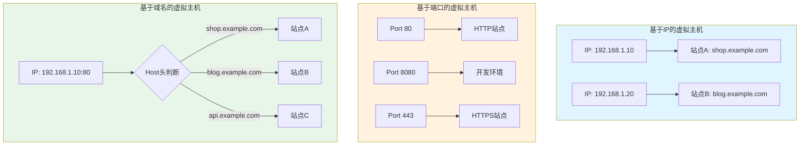
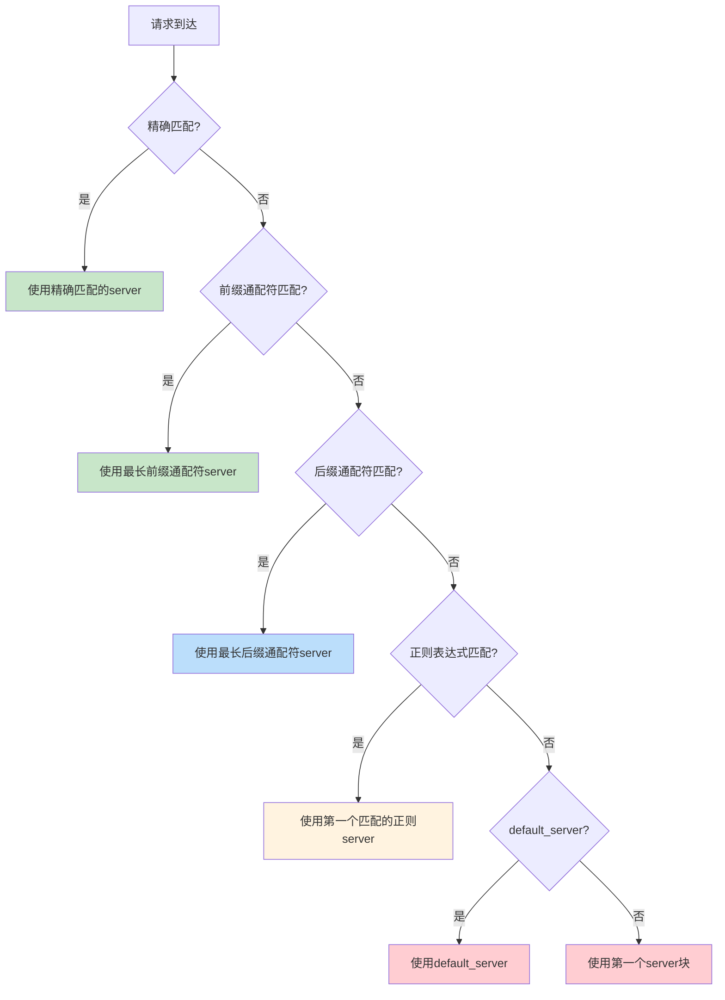
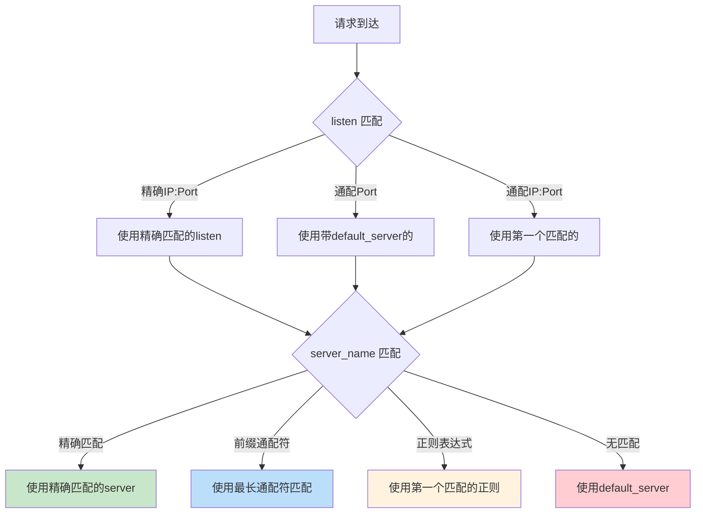

# server 块与虚拟主机

## 概述

在 Nginx 中，`server` 块是虚拟主机（Virtual Host）的核心配置单元。一个 `server` 块定义了一个虚拟服务器，它可以独立处理特定域名、IP 地址或端口的请求。通过在同一个 Nginx 实例中配置多个 `server` 块，可以在一台物理服务器上同时托管多个网站或服务，这就是虚拟主机技术的核心思想。

::: important 虚拟主机的价值
虚拟主机技术使得多个域名或服务可以共享同一台服务器的资源，大幅降低了运维成本。Nginx 的虚拟主机配置简洁高效，单台服务器可以轻松托管数千个站点。
:::

## server 块配置基础

### server 块的基本结构

```nginx
http {
    server {
        listen 80;
        server_name example.com;

        location / {
            root /var/www/example;
            index index.html;
        }
    }

    server {
        listen 80;
        server_name another.com;

        location / {
            root /var/www/another;
            index index.html;
        }
    }
}
```

每个 `server` 块必须包含至少一个 `listen` 指令，用于指定监听的地址和端口。`server_name` 指令则用于匹配请求的 Host 头，决定哪个 `server` 块处理该请求。

### server 块内的指令层次

```nginx
server {
    # 监听配置
    listen 80;

    # 域名配置
    server_name example.com www.example.com;

    # 全局指令（作用于整个 server 块）
    root /var/www/example;
    index index.html index.htm;

    # 错误页面
    error_page 404 /404.html;
    error_page 500 502 503 504 /50x.html;

    # 访问日志
    access_log /var/log/nginx/example_access.log;
    error_log /var/log/nginx/example_error.log;

    # SSL 配置（如需要）
    # ssl_certificate /etc/nginx/ssl/example.crt;
    # ssl_certificate_key /etc/nginx/ssl/example.key;

    # location 块
    location / {
        try_files $uri $uri/ =404;
    }

    location /api/ {
        proxy_pass http://api_backend;
    }

    location /static/ {
        alias /var/www/example/static/;
        expires 30d;
    }
}
```

## 三种虚拟主机类型

虚拟主机根据匹配依据的不同，分为三种类型：基于 IP、基于端口和基于域名。



### 基于IP的虚拟主机

每个虚拟主机绑定不同的 IP 地址。服务器需要配置多个网络接口或 IP 别名。

```nginx
# 站点A - 绑定到 192.168.1.10
server {
    listen 192.168.1.10:80;
    server_name shop.example.com;

    root /var/www/shop;
    index index.html;
}

# 站点B - 绑定到 192.168.1.20
server {
    listen 192.168.1.20:80;
    server_name blog.example.com;

    root /var/www/blog;
    index index.html;
}
```

在 Linux 上添加 IP 别名：

```bash
# 添加 IP 别名
sudo ip addr add 192.168.1.10/24 dev eth0
sudo ip addr add 192.168.1.20/24 dev eth0

# 查看所有 IP
ip addr show eth0
```

::: info 基于 IP 的虚拟主机应用场景
基于 IP 的虚拟主机主要用于以下场景：
1. 需要为不同站点使用独立的 SSL 证书（在 SNI 出现之前）
2. 不同站点需要绑定到不同的网络接口
3. 合规要求某些服务必须使用独立 IP

随着 SNI（Server Name Indication）的普及，基于 IP 的虚拟主机在实际应用中越来越少，基于域名的虚拟主机已成为主流。
:::

### 基于端口的虚拟主机

不同的虚拟主机监听不同的端口。这种方式不需要多个 IP 地址。

```nginx
# 生产环境 - 端口 80
server {
    listen 80;
    server_name example.com;

    root /var/www/production;
    index index.html;
}

# 开发环境 - 端口 8080
server {
    listen 8080;
    server_name example.com;

    root /var/www/development;
    index index.html;
}

# API 服务 - 端口 3000
server {
    listen 3000;
    server_name api.example.com;

    location / {
        proxy_pass http://127.0.0.1:3001;
    }
}
```

::: warning 端口冲突
同一 IP 地址上的同一端口只能被一个 `server` 块监听。如果多个 `server` 块配置了相同的 `listen` 地址和端口，它们将通过 `server_name` 进行区分（基于域名的虚拟主机）。
:::

### 基于域名的虚拟主机

这是最常用的虚拟主机类型。多个域名共享同一个 IP 地址和端口，Nginx 根据请求的 Host 头将请求路由到对应的 `server` 块。

```nginx
# 站点A - shop.example.com
server {
    listen 80;
    server_name shop.example.com;

    root /var/www/shop;
    index index.html;
}

# 站点B - blog.example.com
server {
    listen 80;
    server_name blog.example.com;

    root /var/www/blog;
    index index.html;
}

# 站点C - api.example.com
server {
    listen 80;
    server_name api.example.com;

    location / {
        proxy_pass http://127.0.0.1:8080;
    }
}
```

### 三种虚拟主机对比

| 特性 | 基于IP | 基于端口 | 基于域名 |
|------|--------|---------|---------|
| IP 需求 | 每站点一个独立 IP | 单 IP 即可 | 单 IP 即可 |
| 端口需求 | 可共用端口 | 每站点一个独立端口 | 可共用端口 |
| 客户端访问 | 直接使用 IP | 需指定端口号 | 使用域名（标准端口） |
| 配置复杂度 | 中（需配置多 IP） | 低 | 低 |
| SSL 支持 | 天然支持独立证书 | 天然支持独立证书 | 需 SNI 支持 |
| 适用场景 | SSL/合规需求 | 开发/测试环境 | **生产环境主流** |
| 扩展性 | 受 IP 数量限制 | 受端口数量限制 | 几乎无限制 |

## server_name 指令详解

`server_name` 是虚拟主机配置中最关键的指令之一，它决定了请求如何匹配到具体的 `server` 块。

### server_name 匹配规则

Nginx 按照以下优先级顺序匹配 `server_name`：

1. **精确匹配**：`example.com`
2. **前缀通配符**：`*.example.com`
3. **后缀通配符**：`www.*`
4. **正则表达式**：`~^(www\.)?(.+)$`
5. **default_server**：未匹配时的默认服务器



### 精确匹配

最简单也最高优先级的匹配方式。`server_name` 与请求的 Host 头完全一致。

```nginx
server {
    listen 80;
    server_name example.com;

    # 只匹配 example.com
    # 不匹配 www.example.com、api.example.com 等
}
```

### 通配符前缀匹配

使用 `*` 开头的 `server_name`，匹配以指定后缀结尾的所有域名。

```nginx
server {
    listen 80;
    server_name *.example.com;

    # 匹配 www.example.com、api.example.com、blog.example.com 等
    # 不匹配 example.com（通配符不能匹配空标签）
    # 不匹配 www.sub.example.com（通配符只能在最左或最右侧）
}
```

::: important 通配符规则
1. `*.example.com` 可以匹配 `www.example.com`、`api.example.com`，但**不能**匹配 `example.com`
2. 通配符 `*` 只能出现在域名的最左侧或最右侧
3. `*` 只能匹配一个标签层级（如 `*.example.com` 匹配 `www.example.com` 但不匹配 `a.b.example.com`）
4. `www.*.example.com` 是无效的，通配符不能出现在中间
:::

### 通配符后缀匹配

使用 `*` 结尾的 `server_name`，匹配以指定前缀开头的所有域名。

```nginx
server {
    listen 80;
    server_name www.*;

    # 匹配 www.example.com、www.another.com 等
}
```

::: warning 后缀通配符不常用
后缀通配符在实际中使用较少，因为不同顶级域名的网站很少共享同一个 `server` 块。它主要用于特殊场景，如内网环境中多个域名共享相同前缀的情况。
:::

### 正则表达式匹配

使用 `~` 前缀表示正则表达式匹配。正则匹配区分大小写；使用 `~*` 前缀不区分大小写。

```nginx
# 区分大小写的正则匹配
server {
    listen 80;
    server_name ~^(www\.)?example\.com$;

    # 匹配 example.com 和 www.example.com
}

# 不区分大小写的正则匹配
server {
    listen 80;
    server_name ~*^api\..+\.example\.com$;

    # 匹配 api.v1.example.com、API.V2.EXAMPLE.COM 等
}

# 捕获组 - 可以在配置中引用
server {
    listen 80;
    server_name ~^(www\.)?(?<domain>.+)$;

    # 使用捕获组 $domain
    location / {
        root /var/www/$domain;
    }
}
```

### 正则表达式中的命名捕获

```nginx
server {
    listen 80;

    # 使用命名捕获
    server_name ~^(?<subdomain>.+)\.example\.com$;

    # 在配置中引用 $subdomain
    location / {
        root /var/www/sites/$subdomain;
        try_files $uri $uri/ /index.html;
    }
}

server {
    listen 80;

    # 使用数字捕获
    server_name ~^(.+)\.example\.com$;

    # 引用 $1
    location / {
        set $subdomain $1;
        root /var/www/sites/$subdomain;
    }
}
```

### 匹配优先级完整示例

```nginx
# 优先级 1：精确匹配
server {
    listen 80;
    server_name example.com;
    # 最高优先级，直接匹配
}

# 优先级 2：前缀通配符（最长匹配优先）
server {
    listen 80;
    server_name *.example.com;
    # 匹配 www.example.com, api.example.com 等
}

# 优先级 3：后缀通配符（最长匹配优先）
server {
    listen 80;
    server_name www.*;
    # 匹配 www.example.com, www.another.org 等
}

# 优先级 4：正则表达式（按配置顺序，第一个匹配的生效）
server {
    listen 80;
    server_name ~^(www\.)?example\.com$;
    # 正则匹配，按出现顺序检查
}

# 兜底：default_server
server {
    listen 80 default_server;
    server_name _;
    # 所有未匹配的请求都到这里
    return 444;
}
```

## default_server 指定与默认行为

### default_server 的含义

当一个请求的 Host 头不匹配任何 `server_name` 时，Nginx 将请求交给 `default_server` 处理。

```nginx
# 显式指定 default_server
server {
    listen 80 default_server;
    server_name _;  # _ 不是特殊值，只是习惯用法，任何不匹配的域名都可以

    # 返回 444（Nginx 特殊状态码，直接关闭连接）
    return 444;
}
```

### 默认行为的规则

1. 如果没有任何 `server` 块声明 `default_server`，Nginx 将使用**第一个**定义的 `server` 块作为默认服务器
2. `default_server` 是 `listen` 指令的参数，不是独立指令
3. 每个 `address:port` 组合可以有独立的 `default_server`

```nginx
# 端口 80 的默认服务器
server {
    listen 80 default_server;
    server_name _;
    return 444;
}

# 端口 443 的默认服务器
server {
    listen 443 ssl default_server;
    server_name _;

    ssl_certificate /etc/nginx/ssl/default.crt;
    ssl_certificate_key /etc/nginx/ssl/default.key;

    return 444;
}
```

::: important 安全建议
始终显式配置 `default_server`，拒绝不匹配的请求。否则，未匹配的请求可能被第一个 `server` 块处理，导致意外行为或信息泄露。
:::

### 常见的 default_server 配置

#### 1. 直接关闭连接

```nginx
server {
    listen 80 default_server;
    server_name _;
    return 444;  # Nginx 特有，直接断开连接，不返回任何响应
}
```

#### 2. 返回 404

```nginx
server {
    listen 80 default_server;
    server_name _;
    return 404;
}
```

#### 3. 重定向到主站

```nginx
server {
    listen 80 default_server;
    server_name _;
    return 301 https://example.com$request_uri;
}
```

#### 4. 返回自定义页面

```nginx
server {
    listen 80 default_server;
    server_name _;

    root /var/www/default;
    index index.html;

    location / {
        try_files $uri $uri/ =404;
    }
}
```

## listen 指令详解

`listen` 指令定义了 server 块监听的地址和端口，是虚拟主机配置的基础。

### listen 指令语法

```
listen address[:port] [default_server] [ssl] [http2] [quic] [proxy_protocol] [backlog=number] [rcvbuf=size] [sndbuf=size] [deferred] [bind] [ipv6only=on|off] [reuseport] [so_keepalive=on|off|[keepidle]:[keepintvl]:[keepcnt]];
```

### 常见 listen 配置

```nginx
# 监听所有接口的 80 端口
listen 80;

# 等价于
listen *:80;

# 监听特定 IP 的 80 端口
listen 192.168.1.10:80;

# 监听 IPv6 的 80 端口
listen [::]:80;

# 指定为默认服务器
listen 80 default_server;

# HTTPS 配置
listen 443 ssl;

# HTTPS + HTTP/2
listen 443 ssl http2;

# HTTPS + HTTP/3 (QUIC)
listen 443 quic reuseport;

# 同时支持 HTTP/2 和 HTTP/3
listen 443 ssl http2;
listen 443 quic reuseport;

# 代理协议（当 Nginx 在 L4 负载均衡器之后时）
listen 80 proxy_protocol;

# 完整配置
listen 443 ssl http2 default_server;
```

### listen 的关键参数

| 参数 | 说明 | 默认值 |
|------|------|--------|
| `default_server` | 将此 server 设为默认虚拟主机 | 第一个 server 块 |
| `ssl` | 启用 SSL/TLS | off |
| `http2` | 启用 HTTP/2 | off |
| `quic` | 启用 HTTP/3 (QUIC) | off |
| `proxy_protocol` | 启用 PROXY 协议 | off |
| `backlog` | TCP 连接队列长度 | -1（系统默认） |
| `rcvbuf` | 接收缓冲区大小 | 系统默认 |
| `sndbuf` | 发送缓冲区大小 | 系统默认 |
| `deferred` | 延迟 accept() | off |
| `bind` | 强制绑定到 address:port | 自动决定 |
| `ipv6only` | 仅接受 IPv6 连接 | 系统默认 |
| `reuseport` | 允许多个 socket 绑定同一端口 | off |
| `so_keepalive` | TCP keepalive 设置 | off |

### listen 与 IPv6

```nginx
# 同时监听 IPv4 和 IPv6
server {
    listen 80;
    listen [::]:80;
    server_name example.com;
}

# 仅监听 IPv4
server {
    listen 0.0.0.0:80;              # 明确绑定 IPv4 地址
    server_name example.com;
}

# 注意：在双栈系统上，listen 80; 会同时监听 IPv4 和 IPv6
# 如果需要仅监听 IPv4，必须使用 listen 0.0.0.0:80;
# 如果需要同时监听 IPv4 和 IPv6，可显式写出：
server {
    listen 80;
    listen [::]:80;
    server_name example.com;
}
```

::: tip reuseport 参数
`reuseport` 参数允许 Nginx 的多个 worker 进程各自创建独立的监听 socket，内核将入站连接均匀分配给各 worker。这可以减少 worker 之间的锁竞争，显著提升高并发场景下的性能。

```nginx
# 启用 reuseport
listen 80 reuseport;

# QUIC 必须使用 reuseport
listen 443 quic reuseport;
```

注意：`reuseport` 只需在一个 `listen` 指令中指定，其他绑定相同 `address:port` 的 `listen` 指令会自动复用。
:::

### HTTP/2 和 HTTP/3 配置

```nginx
# HTTP/2 配置（需要 SSL）
server {
    listen 443 ssl http2;
    server_name example.com;

    ssl_certificate /etc/nginx/ssl/example.crt;
    ssl_certificate_key /etc/nginx/ssl/example.key;
}

# HTTP/3 配置（需要 QUIC + reuseport）
server {
    listen 443 quic reuseport;
    listen 443 ssl http2;  # 同时支持 HTTP/2 降级
    server_name example.com;

    ssl_certificate /etc/nginx/ssl/example.crt;
    ssl_certificate_key /etc/nginx/ssl/example.key;

    # 通知浏览器支持 HTTP/3
    add_header Alt-Svc 'h3=":443"; ma=86400';
}
```

## 多 server 块匹配算法

当多个 `server` 块的 `listen` 指令可以匹配同一个请求时，Nginx 使用以下算法确定使用哪个 `server` 块：

### 匹配算法流程



### 详细匹配步骤

#### 步骤 1：listen 匹配

Nginx 首先根据 `listen` 指令筛选候选的 `server` 块：

1. 精确匹配 `address:port`（如 `192.168.1.10:80`）的 server 块优先
2. 如果没有精确匹配，使用匹配 `*:port`（如 `listen 80`）的 server 块
3. 如果都没有匹配，使用 `default_server`

#### 步骤 2：server_name 匹配

在 `listen` 匹配的候选 server 块中，按以下优先级匹配 `server_name`：

1. 精确匹配
2. 最长前缀通配符（如 `*.example.com`）
3. 最长后缀通配符（如 `www.*`）
4. 第一个匹配的正则表达式（按配置文件中的出现顺序）

#### 步骤 3：兜底处理

如果 `server_name` 也没有匹配，使用 `default_server`；如果没有显式定义 `default_server`，使用配置文件中第一个 `server` 块。

### 匹配示例

```nginx
# Server A
server {
    listen 80;
    server_name example.com;
}

# Server B
server {
    listen 80;
    server_name *.example.com;
}

# Server C
server {
    listen 80;
    server_name ~^api\..+\.com$;
}

# Server D
server {
    listen 80 default_server;
    server_name _;
}
```

| 请求 Host | 匹配结果 | 原因 |
|-----------|---------|------|
| `example.com` | Server A | 精确匹配优先级最高 |
| `www.example.com` | Server B | 前缀通配符匹配 |
| `api.example.com` | Server B | 前缀通配符优先于正则 |
| `api.another.com` | Server C | 正则匹配 |
| `unknown.com` | Server D | 无匹配，使用 default_server |
| `sub.api.example.com` | Server B | 前缀通配符匹配（`*.example.com` 匹配多级子域名... 不对，只匹配一级） |

::: warning 通配符的标签匹配
`*.example.com` 只匹配一级子域名（如 `www.example.com`），不匹配多级子域名（如 `sub.api.example.com`）。要匹配多级子域名，需要使用正则表达式。
:::

### 多个 server_name 的情况

一个 `server` 块可以有多个 `server_name`：

```nginx
server {
    listen 80;
    server_name example.com www.example.com;

    # 同时匹配两个域名
}
```

等价于：

```nginx
server {
    listen 80;
    server_name example.com;
    # ...
}

server {
    listen 80;
    server_name www.example.com;
    # ... 相同配置
}
```

但推荐使用第一种方式，避免配置重复。

## 实战：多站点配置示例

### 场景：一个 Nginx 托管多个业务站点

假设需要在一台服务器上托管以下站点：

- `www.example.com`：公司官网
- `shop.example.com`：电商平台
- `api.example.com`：API 服务
- `admin.example.com`：管理后台
- `cdn.example.com`：静态资源 CDN

```nginx
# 通用配置
http {
    include       mime.types;
    default_type  application/octet-stream;

    # 日志格式
    log_format main '$remote_addr - $remote_user [$time_local] '
                    '"$request" $status $body_bytes_sent '
                    '"$http_referer" "$http_user_agent"';

    # 限流区域
    limit_req_zone $binary_remote_addr zone=api_limit:10m rate=100r/s;
    limit_req_zone $binary_remote_addr zone=shop_limit:10m rate=50r/s;

    # 上游服务定义
    upstream api_backend {
        server 127.0.0.1:8080;
        server 127.0.0.1:8081;
        keepalive 32;
    }

    upstream shop_backend {
        server 127.0.0.1:3000;
        keepalive 16;
    }

    upstream admin_backend {
        server 127.0.0.1:9000;
        keepalive 8;
    }

    # 默认服务器 - 拒绝不匹配的请求
    server {
        listen 80 default_server;
        listen 443 ssl default_server;
        server_name _;

        ssl_certificate /etc/nginx/ssl/default.crt;
        ssl_certificate_key /etc/nginx/ssl/default.key;

        return 444;
    }

    # HTTP → HTTPS 重定向
    server {
        listen 80;
        server_name www.example.com shop.example.com api.example.com admin.example.com cdn.example.com;
        return 301 https://$host$request_uri;
    }

    # www.example.com - 公司官网
    server {
        listen 443 ssl http2;
        server_name www.example.com;

        ssl_certificate /etc/nginx/ssl/www.example.com.crt;
        ssl_certificate_key /etc/nginx/ssl/www.example.com.key;

        root /var/www/official;
        index index.html;

        location / {
            try_files $uri $uri/ /index.html;
        }

        location /about/ {
            try_files $uri $uri/ /index.html;
        }

        access_log /var/log/nginx/www_access.log main;
    }

    # shop.example.com - 电商平台
    server {
        listen 443 ssl http2;
        server_name shop.example.com;

        ssl_certificate /etc/nginx/ssl/shop.example.com.crt;
        ssl_certificate_key /etc/nginx/ssl/shop.example.com.key;

        limit_req zone=shop_limit burst=20 nodelay;

        location / {
            proxy_pass http://shop_backend;
            proxy_http_version 1.1;
            proxy_set_header Connection "";
            proxy_set_header Host $host;
            proxy_set_header X-Real-IP $remote_addr;
            proxy_set_header X-Forwarded-For $proxy_add_x_forwarded_for;
            proxy_set_header X-Forwarded-Proto $scheme;
        }

        location /static/ {
            alias /var/www/shop/static/;
            expires 30d;
            add_header Cache-Control "public, immutable";
        }

        access_log /var/log/nginx/shop_access.log main;
    }

    # api.example.com - API 服务
    server {
        listen 443 ssl http2;
        server_name api.example.com;

        ssl_certificate /etc/nginx/ssl/api.example.com.crt;
        ssl_certificate_key /etc/nginx/ssl/api.example.com.key;

        limit_req zone=api_limit burst=50 nodelay;

        location / {
            proxy_pass http://api_backend;
            proxy_http_version 1.1;
            proxy_set_header Connection "";
            proxy_set_header Host $host;
            proxy_set_header X-Real-IP $remote_addr;
            proxy_set_header X-Forwarded-For $proxy_add_x_forwarded_for;
            proxy_set_header X-Forwarded-Proto $scheme;
        }

        # API 文档
        location /docs/ {
            root /var/www/api-docs;
            index index.html;
        }

        access_log /var/log/nginx/api_access.log main;
    }

    # admin.example.com - 管理后台
    server {
        listen 443 ssl http2;
        server_name admin.example.com;

        ssl_certificate /etc/nginx/ssl/admin.example.com.crt;
        ssl_certificate_key /etc/nginx/ssl/admin.example.com.key;

        # IP 白名单
        allow 192.168.1.0/24;
        allow 10.0.0.0/8;
        deny all;

        # Basic 认证
        auth_basic "Admin Area";
        auth_basic_user_file /etc/nginx/.htpasswd;

        location / {
            proxy_pass http://admin_backend;
            proxy_http_version 1.1;
            proxy_set_header Connection "";
            proxy_set_header Host $host;
            proxy_set_header X-Real-IP $remote_addr;
            proxy_set_header X-Forwarded-For $proxy_add_x_forwarded_for;
        }

        access_log /var/log/nginx/admin_access.log main;
    }

    # cdn.example.com - 静态资源 CDN
    server {
        listen 443 ssl http2;
        server_name cdn.example.com;

        ssl_certificate /etc/nginx/ssl/cdn.example.com.crt;
        ssl_certificate_key /etc/nginx/ssl/cdn.example.com.key;

        # 禁用日志以提升性能
        # access_log off;

        root /var/www/cdn;

        location /images/ {
            expires 365d;
            add_header Cache-Control "public, immutable";
            add_header Access-Control-Allow-Origin "*";
        }

        location /css/ {
            expires 30d;
            add_header Cache-Control "public";
            add_header Access-Control-Allow-Origin "*";
        }

        location /js/ {
            expires 30d;
            add_header Cache-Control "public";
            add_header Access-Control-Allow-Origin "*";
        }

        location /fonts/ {
            expires 365d;
            add_header Cache-Control "public, immutable";
            add_header Access-Control-Allow-Origin "*";
        }

        # 开启 gzip
        gzip on;
        gzip_types text/css application/javascript application/json image/svg+xml;
        gzip_min_length 1024;

        access_log /var/log/nginx/cdn_access.log main;
    }
}
```

### 使用 include 简化配置

当站点数量增多时，可以将每个 `server` 块放在单独的文件中：

```
/etc/nginx/
├── nginx.conf
├── conf.d/
│   ├── default.conf
│   ├── www.example.com.conf
│   ├── shop.example.com.conf
│   ├── api.example.com.conf
│   ├── admin.example.com.conf
│   └── cdn.example.com.conf
├── snippets/
│   ├── ssl-params.conf
│   ├── proxy-params.conf
│   └── security-headers.conf
└── ssl/
    ├── www.example.com.crt
    ├── www.example.com.key
    └── ...
```

主配置文件：

```nginx
# /etc/nginx/nginx.conf
http {
    include       mime.types;
    default_type  application/octet-stream;

    log_format main '$remote_addr - $remote_user [$time_local] '
                    '"$request" $status $body_bytes_sent '
                    '"$http_referer" "$http_user_agent"';

    # 包含所有站点配置
    include /etc/nginx/conf.d/*.conf;
}
```

共享配置片段：

```nginx
# /etc/nginx/snippets/proxy-params.conf
proxy_http_version 1.1;
proxy_set_header Connection "";
proxy_set_header Host $host;
proxy_set_header X-Real-IP $remote_addr;
proxy_set_header X-Forwarded-For $proxy_add_x_forwarded_for;
proxy_set_header X-Forwarded-Proto $scheme;
```

站点配置：

```nginx
# /etc/nginx/conf.d/api.example.com.conf
upstream api_backend {
    server 127.0.0.1:8080;
    server 127.0.0.1:8081;
    keepalive 32;
}

server {
    listen 80;
    server_name api.example.com;
    return 301 https://$host$request_uri;
}

server {
    listen 443 ssl http2;
    server_name api.example.com;

    ssl_certificate /etc/nginx/ssl/api.example.com.crt;
    ssl_certificate_key /etc/nginx/ssl/api.example.com.key;
    include snippets/ssl-params.conf;

    location / {
        proxy_pass http://api_backend;
        include snippets/proxy-params.conf;
    }
}
```

## server 块配置优化

### 连接优化

```nginx
server {
    listen 80;

    # TCP 优化
    tcp_nodelay on;      # 禁用 Nagle 算法，减少延迟
    tcp_nopush on;       # 优化数据包发送

    # keepalive 优化
    keepalive_timeout 65s;
    keepalive_requests 5000;

    # 发送超时
    send_timeout 30s;
}
```

### 安全加固

```nginx
server {
    listen 443 ssl http2;
    server_name example.com;

    # 隐藏 Nginx 版本
    server_tokens off;

    # 安全头
    add_header X-Frame-Options "SAMEORIGIN" always;
    add_header X-Content-Type-Options "nosniff" always;
    add_header X-XSS-Protection "1; mode=block" always;
    add_header Referrer-Policy "strict-origin-when-cross-origin" always;

    # HSTS
    add_header Strict-Transport-Security "max-age=31536000; includeSubDomains; preload" always;

    # SSL 配置
    ssl_protocols TLSv1.2 TLSv1.3;
    ssl_ciphers ECDHE-ECDSA-AES128-GCM-SHA256:ECDHE-RSA-AES128-GCM-SHA256;
    ssl_prefer_server_ciphers off;
    ssl_session_cache shared:SSL:10m;
    ssl_session_timeout 1d;
    ssl_session_tickets off;

    # OCSP Stapling
    ssl_stapling on;
    ssl_stapling_verify on;
    ssl_trusted_certificate /etc/nginx/ssl/ca-bundle.crt;
    resolver 8.8.8.8 8.8.4.4 valid=300s;
    resolver_timeout 5s;
}
```

### 性能监控

```nginx
server {
    listen 80;
    server_name localhost;

    # Nginx 状态页面
    location /nginx_status {
        stub_status;
        access_log off;
        allow 127.0.0.1;
        deny all;
    }
}
```

状态页面输出示例：

```
Active connections: 291
server accepts handled requests
  16630948 16630948 31070465
Reading: 6 Writing: 179 Waiting: 106
```

| 指标 | 说明 |
|------|------|
| Active connections | 当前活跃的客户端连接数 |
| accepts | 已接受的连接总数 |
| handled | 已处理的连接总数（通常与 accepts 相同） |
| requests | 客户端请求总数（含 keepalive 复用连接上的请求） |
| Reading | 正在读取请求头的连接数 |
| Writing | 正在发送响应的连接数 |
| Waiting | 空闲 keepalive 连接数 |

## server 块常见问题与排查

### 问题 1：server_name 不匹配

**现象**：请求被错误的 server 块处理

**排查**：

```bash
# 测试 Host 头
curl -H "Host: example.com" http://192.168.1.10/

# 检查 Nginx 配置中 server_name 的匹配
nginx -T 2>/dev/null | grep -A5 "server_name"
```

**常见原因**：
1. `server_name` 拼写错误
2. 通配符使用不当（`*.example.com` 不匹配 `example.com`）
3. 正则表达式语法错误

### 问题 2：default_server 意外行为

**现象**：不认识的域名返回了某个站点的页面

**原因**：未显式配置 `default_server`，第一个 server 块成为默认服务器

**解决**：

```nginx
# 在所有站点之前配置 default_server
server {
    listen 80 default_server;
    listen 443 ssl default_server;
    server_name _;

    ssl_certificate /etc/nginx/ssl/default.crt;
    ssl_certificate_key /etc/nginx/ssl/default.key;

    return 444;  # 直接关闭连接
}
```

### 问题 3：端口冲突

**现象**：Nginx 启动失败，错误信息 `bind() to 0.0.0.0:80 failed (98: Address already in use)`

**排查**：

```bash
# 查看占用端口的进程
sudo lsof -i :80
sudo ss -tlnp | grep :80

# 查看 Nginx 监听的端口
sudo nginx -T 2>/dev/null | grep listen
```

**解决**：
1. 停止占用端口的进程
2. 修改 Nginx 监听端口
3. 使用 `SO_REUSEPORT` 选项

### 问题 4：server_name 正则表达式性能

**现象**：高并发时 CPU 使用率异常

**原因**：复杂的 `server_name` 正则表达式在每次请求时都要执行

**优化**：

```nginx
# 不推荐：复杂正则
server_name ~^(www\.)?(api|shop|admin)\.(v[0-9]+\.)?example\.com$;

# 推荐：使用精确匹配和通配符
server_name www.example.com;
server_name api.example.com;
server_name shop.example.com;
server_name *.example.com;
```

::: tip server_name 性能建议
1. 优先使用精确匹配，性能最好
2. 其次使用通配符匹配，性能较好
3. 尽量避免正则表达式，性能最差
4. 如果必须使用正则，尽量简化模式
5. 将高流量站点的 server 块放在配置文件前面
:::

## 小结

Nginx 的虚拟主机机制通过 `server` 块实现了在单台服务器上托管多个站点的能力。理解以下核心要点是正确配置虚拟主机的基础：

1. **三种虚拟主机类型**：基于 IP、基于端口、基于域名，其中基于域名是生产环境的主流
2. **server_name 匹配优先级**：精确 > 前缀通配符 > 后缀通配符 > 正则 > default_server
3. **listen 指令**：决定了 server 块监听的地址和端口，支持 SSL、HTTP/2、HTTP/3 等参数
4. **default_server**：必须显式配置以防止意外行为
5. **配置组织**：使用 `include` 和独立配置文件管理大量站点

::: tip 进一步阅读
- [ngx_http_core_module - server_name](https://nginx.org/en/docs/http/ngx_http_core_module.html#server_name)
- [ngx_http_core_module - listen](https://nginx.org/en/docs/http/ngx_http_core_module.html#listen)
- [Nginx Server Names](https://nginx.org/en/docs/http/server_names.html)
:::
