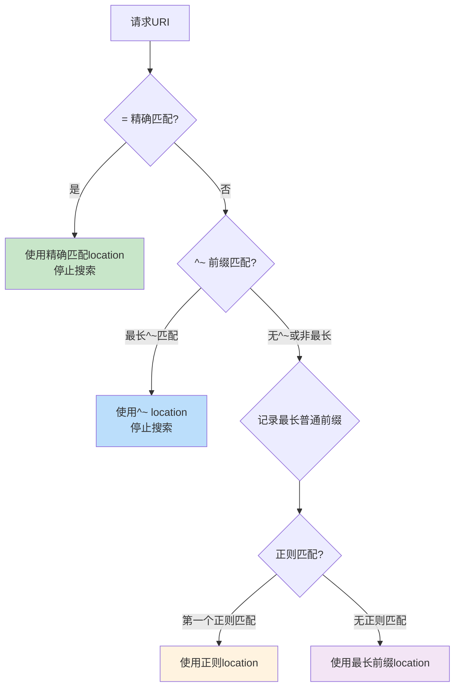
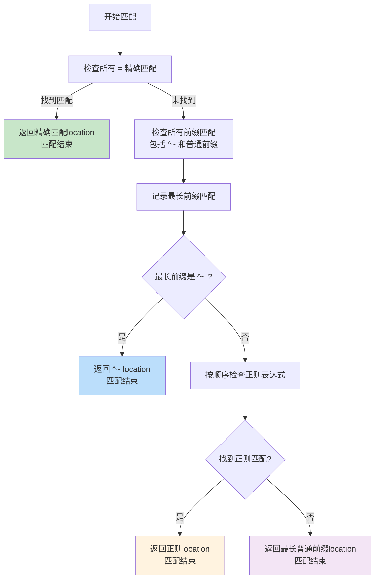
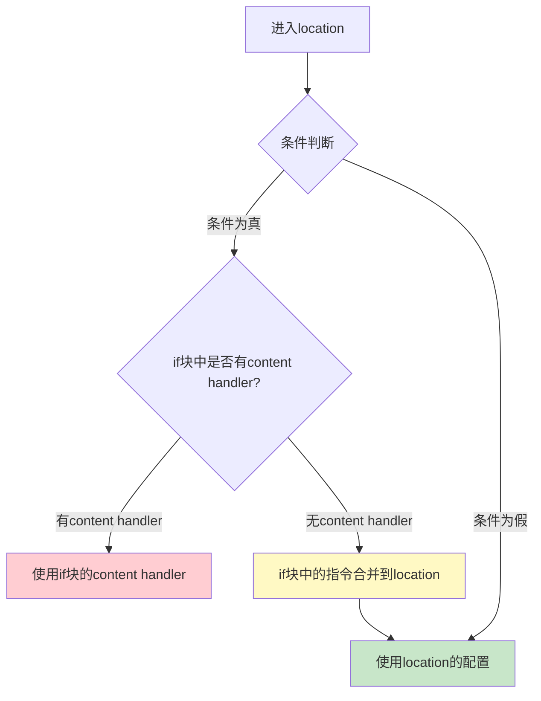

# location 匹配规则详解

## 概述

`location` 是 Nginx HTTP 配置中最核心的指令之一，它定义了如何根据请求 URI 将请求路由到不同的处理逻辑。理解 `location` 的匹配规则、优先级和交互行为，是编写正确、高效 Nginx 配置的关键。

Nginx 的 `location` 匹配并非简单的"先到先得"，而是一套精心设计的优先级算法。错误的 `location` 配置可能导致请求被意外处理、安全策略绕过或性能下降。

::: important 核心要点
location 匹配是 Nginx 请求处理的 Find Config Phase 的核心逻辑。一个请求只能匹配一个 location（除内部重定向外），因此理解匹配优先级至关重要。
:::

## location 语法

### 基本语法

```nginx
location [修饰符] 匹配模式 {
    # 配置指令
}
```

### 四种修饰符

Nginx location 支持四种修饰符，决定了不同的匹配行为：

| 修饰符 | 类型 | 说明 |
|--------|------|------|
| `=` | 精确匹配 | URI 必须与指定字符串完全一致 |
| `~` | 区分大小写的正则匹配 | 使用正则表达式匹配，区分大小写 |
| `~*` | 不区分大小写的正则匹配 | 使用正则表达式匹配，不区分大小写 |
| `^~` | 前缀匹配（优先） | 前缀匹配，如果匹配则不再检查正则 |
| （无） | 普通前缀匹配 | 最长前缀匹配，但会被正则覆盖 |



## 匹配优先级完整规则

Nginx location 匹配的完整优先级规则如下：


### 优先级从高到低

1. **`=` 精确匹配**：如果找到精确匹配，立即使用该 location，停止搜索
2. **`^~` 前缀匹配**：在所有前缀匹配中找到最长匹配，如果是 `^~` 修饰的，停止搜索
3. **正则匹配 `~` / `~*`**：按配置文件中的顺序依次检查正则表达式，使用第一个匹配的
4. **普通前缀匹配**：如果正则没有匹配，使用最长普通前缀匹配的 location

### 详细匹配算法



### 精确匹配（=）

精确匹配要求 URI 与指定字符串完全一致，包括前导斜杠。精确匹配的优先级最高，一旦匹配成功，Nginx 立即停止搜索。

```nginx
# 精确匹配 / 根路径
location = / {
    # 只匹配 /
    # 不匹配 /index.html、/about 等
    root /var/www/homepage;
}

# 精确匹配 favicon.ico
location = /favicon.ico {
    log_not_found off;
    access_log off;
    return 204;
}

# 精确匹配 robots.txt
location = /robots.txt {
    log_not_found off;
    access_log off;
    alias /var/www/seo/robots.txt;
}
```

::: tip 精确匹配的性能优势
精确匹配使用哈希表查找，时间复杂度为 O(1)。对于高频访问的路径（如 `/`、`/favicon.ico`、`/robots.txt`），使用精确匹配可以避免不必要的正则匹配，显著提升性能。
:::

### 前缀匹配优先（^~）

`^~` 修饰符的前缀匹配在所有前缀匹配中具有特殊地位——如果最长前缀匹配是 `^~` 修饰的，Nginx 不会继续检查正则表达式。

```nginx
# ^~ 前缀匹配
location ^~ /images/ {
    # 匹配 /images/ 开头的所有 URI
    # 即使后续有正则匹配，也不会被覆盖
    root /var/www/static;
    expires 30d;
}

# 普通前缀匹配
location /images/ {
    # 匹配 /images/ 开头的所有 URI
    # 但可能被正则匹配覆盖
    root /var/www/static;
}

# 正则匹配
location ~* \.(jpg|jpeg|png|gif|ico)$ {
    # 如果上面是普通前缀，这个正则会优先
    # 如果上面是 ^~，这个正则不会被执行
    root /var/www/static;
    expires 30d;
}
```

::: important ^~ 的使用场景
`^~` 主要用于以下场景：
1. 静态资源目录：避免对 `/images/`、`/css/`、`/js/` 等路径的请求被正则匹配捕获
2. 安全防护：确保特定路径始终使用指定的安全策略
3. 性能优化：避免对已知路径进行正则匹配
:::

### 正则匹配（~ 和 ~*）

正则匹配按配置文件中的顺序执行，使用第一个匹配的结果。

```nginx
# 区分大小写的正则匹配
location ~ \.php$ {
    # 只匹配 .php（小写）
    # 不匹配 .PHP、.Php 等
    fastcgi_pass unix:/run/php-fpm.sock;
}

# 不区分大小写的正则匹配
location ~* \.(jpg|jpeg|png|gif|ico|css|js)$ {
    # 匹配 .jpg、.JPG、.Jpg 等
    expires 30d;
    add_header Cache-Control "public";
}
```

#### 正则匹配的顺序问题

由于正则匹配按配置文件中的顺序执行，**顺序很重要**：

```nginx
# 错误示例：顺序不当
location ~* /api/.*\.json$ {
    # 这个会匹配 /api/users.json
    proxy_pass http://json_api;
}

location ~* /api/ {
    # 这个也会匹配 /api/users.json，但永远不会被执行
    # 因为上面的正则先匹配
    proxy_pass http://api_backend;
}

# 正确示例：调整顺序
location ~* /api/ {
    # 通用 API 匹配
    proxy_pass http://api_backend;
}

location ~* /api/.*\.json$ {
    # 更具体的 JSON API 匹配
    # 但这个永远不会被执行！因为上面的更通用
    proxy_pass http://json_api;
}

# 正确做法：更具体的正则放在前面
location ~* /api/.*\.json$ {
    proxy_pass http://json_api;
}

location ~* /api/ {
    proxy_pass http://api_backend;
}
```

::: warning 正则匹配的顺序陷阱
正则匹配按照**配置文件中的出现顺序**执行，第一个匹配的正则将被使用。这意味着更具体的正则必须放在更通用的正则之前，否则永远不会被执行。
:::

### 普通前缀匹配（无修饰符）

普通前缀匹配使用最长匹配原则，但优先级低于正则匹配。

```nginx
location /docs/ {
    # 匹配 /docs/ 开头的 URI
    # 如果有正则匹配，可能被覆盖
    root /var/www/documentation;
}

location /docs/api/ {
    # 比 /docs/ 更长的前缀匹配
    # 优先使用此 location（在普通前缀范围内）
    root /var/www/api-docs;
}

# 如果以下正则存在，会覆盖上面的普通前缀匹配
location ~* /docs/.*\.html$ {
    root /var/www/html-docs;
}
```

## 前缀 location 与正则 location 的交互

前缀 location 和正则 location 的交互是理解 location 匹配规则的核心。

### 交互规则总结

1. Nginx 先检查所有前缀 location，记录最长匹配
2. 如果最长匹配是 `=` 精确匹配，立即使用，搜索结束
3. 如果最长匹配是 `^~`，立即使用，搜索结束
4. 否则，按顺序检查正则 location
5. 如果找到正则匹配，使用正则 location
6. 如果没有正则匹配，使用最长前缀 location

### 完整示例

```nginx
server {
    listen 80;
    server_name example.com;

    # 1. 精确匹配 - 最高优先级
    location = / {
        # 匹配：/
        # 不匹配：/index.html
        return 200 "exact root";
    }

    # 2. ^~ 前缀匹配 - 优先于正则
    location ^~ /images/ {
        # 匹配：/images/logo.png, /images/icons/arrow.svg
        # 即使有正则匹配 \.png$，也不会被覆盖
        root /var/www/static;
    }

    # 3. 普通前缀匹配 - 可能被正则覆盖
    location /docs/ {
        # 匹配：/docs/index.html
        # 但 \.html$ 正则会优先
        root /var/www/documentation;
    }

    # 4. 正则匹配 - 覆盖普通前缀
    location ~* \.(html|htm)$ {
        # 匹配：/docs/index.html, /about.html
        root /var/www/html;
    }

    # 5. 正则匹配 - 图片处理
    location ~* \.(jpg|jpeg|png|gif|svg)$ {
        # 匹配：/assets/photo.jpg
        # 但 /images/ 下的图片由 ^~ 处理
        root /var/www/assets;
    }

    # 6. 普通前缀匹配 - 兜底
    location / {
        # 匹配所有未被上述 location 捕获的 URI
        proxy_pass http://backend;
    }
}
```

### 匹配结果对照表

| 请求 URI | 匹配结果 | 原因 |
|----------|---------|------|
| `/` | `= /` | 精确匹配，最高优先级 |
| `/images/logo.png` | `^~ /images/` | ^~ 阻止正则匹配 |
| `/docs/index.html` | `~* \.(html\|htm)$` | 正则覆盖普通前缀 |
| `/docs/api/` | `/docs/` | 普通前缀，无正则匹配 |
| `/assets/photo.jpg` | `~* \.(jpg\|...)$` | 正则匹配 |
| `/about.html` | `~* \.(html\|htm)$` | 正则匹配 |
| `/api/users` | `/` | 普通前缀最长匹配 |

## location 嵌套规则

### 嵌套限制

Nginx 的 location 嵌套有严格限制：

1. **普通前缀 location 可以嵌套普通前缀 location**
2. **正则 location 不能嵌套任何 location**
3. **精确匹配 location 不能嵌套任何 location**
4. **^~ location 可以嵌套普通前缀 location**

```nginx
# 允许：普通前缀嵌套普通前缀
location /api/ {
    location /api/v1/ {
        proxy_pass http://v1_backend;
    }

    location /api/v2/ {
        proxy_pass http://v2_backend;
    }
}

# 禁止：正则 location 嵌套
location ~ \.php$ {
    location ~ \.php5$ {
        # 错误！正则 location 不能嵌套
    }
}

# 禁止：精确匹配 location 嵌套
location = / {
    location /index {
        # 错误！精确匹配 location 不能嵌套
    }
}
```

::: warning location 嵌套的性能影响
location 嵌套会增加匹配的复杂度。在深度嵌套的情况下，每个请求可能需要遍历多层 location 树。建议尽量使用扁平化的 location 结构，通过精确的匹配模式避免不必要的嵌套。
:::

### 嵌套的实际应用

```nginx
location /api/ {
    # 公共配置
    limit_req zone=api_limit burst=20 nodelay;

    location /api/public/ {
        # 公开 API - 无需认证
        proxy_pass http://public_api;
    }

    location /api/admin/ {
        # 管理 API - 需要 IP 白名单 + 认证
        allow 192.168.1.0/24;
        deny all;
        auth_basic "Admin API";
        auth_basic_user_file /etc/nginx/.htpasswd;
        proxy_pass http://admin_api;
    }

    location /api/internal/ {
        # 内部 API - 仅允许内网访问
        allow 10.0.0.0/8;
        allow 172.16.0.0/12;
        deny all;
        proxy_pass http://internal_api;
    }
}
```

## 命名 location：@name 用法

命名 location 使用 `@` 前缀定义，不参与正常的 URI 匹配，只能通过内部重定向访问。

### 语法

```nginx
location @name {
    # 配置指令
}
```

### 使用场景

1. **error_page 重定向**：将错误响应重定向到专门的错误处理 location
2. **try_files 兜底**：当文件不存在时的降级处理
3. **rewrite 目标**：将 URI 重写到特定处理逻辑

### 命名 location 示例

```nginx
server {
    listen 80;
    server_name example.com;

    root /var/www/html;

    # 主 location
    location / {
        try_files $uri $uri/ @fallback;
    }

    # 命名 location - 兜底处理
    location @fallback {
        proxy_pass http://backend;
        proxy_set_header Host $host;
        proxy_set_header X-Real-IP $remote_addr;
    }

    # 命名 location - 错误处理
    location @error50x {
        root /var/www/error-pages;
        rewrite ^ /50x.html break;
    }

    # 错误页面指向命名 location
    error_page 500 502 503 504 @error50x;
}
```

### 命名 location 与内部重定向

```nginx
server {
    listen 80;
    server_name example.com;

    # API 路由
    location /api/ {
        # 认证失败时跳转到错误处理
        auth_request /auth;
        error_page 401 = @auth_error;

        proxy_pass http://api_backend;
    }

    # 认证错误处理
    location @auth_error {
        return 401 '{"error": "Authentication required", "code": 401}';
        add_header Content-Type application/json always;
    }

    # 速率限制错误处理
    location @rate_limit_error {
        return 429 '{"error": "Too many requests", "code": 429}';
        add_header Content-Type application/json always;
    }

    # 认证子请求
    location = /auth {
        internal;
        proxy_pass http://auth_service/verify;
        proxy_pass_request_body off;
        proxy_set_header Content-Length "";
    }
}
```

::: important 命名 location 的特点
1. 命名 location 不参与 URI 匹配，外部无法直接访问
2. 命名 location 只能通过 `error_page`、`try_files`、`rewrite` 等内部重定向机制访问
3. 命名 location 不能嵌套其他 location
4. 命名 location 不能使用 `= / ~ ~* ^~` 修饰符
:::

## location 与 if 的陷阱

### "if is evil" 问题的根源

Nginx 的 `if` 指令在 location 中有众所周知的问题，社区甚至有一篇著名的文章叫"If is Evil"。问题的根源在于 `if` 的执行机制与直觉不符。

```nginx
# 陷阱：if 中的配置可能不会按预期工作
location /api/ {
    set $backend "default";

    if ($http_x_api_version = "v2") {
        set $backend "v2";
    }

    # proxy_pass 在 if 之外，$backend 可能在 if 中被修改
    proxy_pass http://$backend;
}
```

### if 的执行机制



### if 的安全用法

`if` 在以下场景中是安全的：

1. **return**：直接返回响应
2. **rewrite ... last/redirect/permanent**：重写或重定向

```nginx
# 安全用法 1：return
location /api/ {
    if ($scheme != "https") {
        return 301 https://$host$request_uri;
    }

    proxy_pass http://api_backend;
}

# 安全用法 2：rewrite
location /old-api/ {
    if ($http_x_api_version ~ "^1\.") {
        rewrite ^/old-api/(.*)$ /api/v1/$1 last;
    }

    proxy_pass http://api_backend;
}
```

### if 的危险用法

```nginx
# 危险用法 1：if 中的 proxy_pass
location /api/ {
    if ($http_x_feature_flag = "new") {
        proxy_pass http://new_backend;  # 可能不会按预期工作
    }

    proxy_pass http://default_backend;
}

# 危险用法 2：if 中的 root/alias
location /images/ {
    if ($arg_size = "thumb") {
        root /var/www/thumbnails;  # 可能不会按预期工作
    }

    root /var/www/images;
}

# 危险用法 3：if 中的 try_files
location / {
    if ($cookie_logged_in = "1") {
        try_files $uri /dashboard.html;  # 可能不会按预期工作
    }

    try_files $uri $uri/ /index.html;
}
```

### 替代 if 的方案

#### 使用 map 替代条件判断

```nginx
# 使用 map 替代 if
map $http_x_api_version $api_backend {
    "v2"     v2_backend;
    "v1"     v1_backend;
    default  default_backend;
}

upstream v2_backend {
    server 10.0.0.2:8080;
}

upstream v1_backend {
    server 10.0.0.1:8080;
}

upstream default_backend {
    server 10.0.0.1:8080;
}

server {
    listen 80;

    location /api/ {
        proxy_pass http://$api_backend;
    }
}
```

#### 使用多个 location 替代 if

```nginx
# 不推荐：使用 if
location /images/ {
    if ($arg_size = "thumb") {
        root /var/www/thumbnails;
    }
    root /var/www/images;
}

# 推荐：使用多个 location
location /images/thumb/ {
    root /var/www/thumbnails;
}

location /images/ {
    root /var/www/images;
}
```

#### 使用 try_files 替代 if 文件存在判断

```nginx
# 不推荐：使用 if 判断文件
location / {
    if (-f $request_filename) {
        break;
    }
    proxy_pass http://backend;
}

# 推荐：使用 try_files
location / {
    try_files $uri @backend;
}

location @backend {
    proxy_pass http://backend;
}
```

## 实战：典型 location 配置模式

### 模式 1：SPA 应用

```nginx
server {
    listen 80;
    server_name www.example.com;

    root /var/www/spa;
    index index.html;

    # 精确匹配静态资源
    location = /favicon.ico {
        log_not_found off;
        access_log off;
        return 204;
    }

    location = /robots.txt {
        log_not_found off;
        access_log off;
        alias /var/www/seo/robots.txt;
    }

    # 静态资源目录 - 避免正则匹配
    location ^~ /static/ {
        expires 365d;
        add_header Cache-Control "public, immutable";
    }

    location ^~ /assets/ {
        expires 30d;
        add_header Cache-Control "public";
    }

    # API 请求代理到后端
    location /api/ {
        proxy_pass http://api_backend;
        proxy_http_version 1.1;
        proxy_set_header Connection "";
        proxy_set_header Host $host;
        proxy_set_header X-Real-IP $remote_addr;
        proxy_set_header X-Forwarded-For $proxy_add_x_forwarded_for;
    }

    # SPA 兜底 - 所有其他请求返回 index.html
    location / {
        try_files $uri $uri/ /index.html;
    }
}
```

### 模式 2：动静分离

```nginx
server {
    listen 80;
    server_name example.com;

    # 静态资源 - 本地处理
    location ^~ /images/ {
        root /var/www/static;
        expires 30d;
        add_header Cache-Control "public";
    }

    location ^~ /css/ {
        root /var/www/static;
        expires 7d;
        add_header Cache-Control "public";
    }

    location ^~ /js/ {
        root /var/www/static;
        expires 7d;
        add_header Cache-Control "public";
    }

    location ^~ /fonts/ {
        root /var/www/static;
        expires 365d;
        add_header Cache-Control "public, immutable";
        add_header Access-Control-Allow-Origin "*";
    }

    # 动态请求 - 代理到后端
    location / {
        proxy_pass http://app_backend;
        proxy_set_header Host $host;
        proxy_set_header X-Real-IP $remote_addr;
        proxy_set_header X-Forwarded-For $proxy_add_x_forwarded_for;
    }
}
```

### 模式 3：多版本 API

```nginx
server {
    listen 80;
    server_name api.example.com;

    # API v1
    location /v1/ {
        limit_req zone=api_limit burst=20 nodelay;

        proxy_pass http://v1_backend/;
        proxy_http_version 1.1;
        proxy_set_header Connection "";
        proxy_set_header Host $host;
        proxy_set_header X-Real-IP $remote_addr;
        proxy_set_header X-Forwarded-For $proxy_add_x_forwarded_for;
        proxy_set_header X-API-Version "v1";
    }

    # API v2
    location /v2/ {
        limit_req zone=api_limit burst=50 nodelay;

        proxy_pass http://v2_backend/;
        proxy_http_version 1.1;
        proxy_set_header Connection "";
        proxy_set_header Host $host;
        proxy_set_header X-Real-IP $remote_addr;
        proxy_set_header X-Forwarded-For $proxy_add_x_forwarded_for;
        proxy_set_header X-API-Version "v2";
    }

    # 最新版 API（默认）
    location / {
        limit_req zone=api_limit burst=50 nodelay;

        proxy_pass http://v2_backend/;
        proxy_http_version 1.1;
        proxy_set_header Connection "";
        proxy_set_header Host $host;
        proxy_set_header X-Real-IP $remote_addr;
        proxy_set_header X-Forwarded-For $proxy_add_x_forwarded_for;
        proxy_set_header X-API-Version "v2";
    }
}
```

### 模式 4：WordPress

```nginx
server {
    listen 80;
    server_name blog.example.com;

    root /var/www/wordpress;
    index index.php;

    # 精确匹配 favicon
    location = /favicon.ico {
        log_not_found off;
        access_log off;
    }

    # 精确匹配 robots
    location = /robots.txt {
        log_not_found off;
        access_log off;
    }

    # 静态资源
    location ^~ /wp-content/ {
        expires 30d;
        add_header Cache-Control "public";
    }

    location ^~ /wp-includes/ {
        expires 30d;
        add_header Cache-Control "public";
    }

    # PHP 文件处理
    location ~ \.php$ {
        fastcgi_pass unix:/run/php-fpm.sock;
        fastcgi_param SCRIPT_FILENAME $document_root$fastcgi_script_name;
        include fastcgi_params;
    }

    # WordPress 固定链接
    location / {
        try_files $uri $uri/ /index.php?$args;
    }

    # 禁止访问隐藏文件
    location ~ /\. {
        deny all;
    }

    # 禁止访问 WordPress 配置文件
    location ~* /wp-config\.php$ {
        deny all;
    }
}
```

### 模式 5：文件下载服务

```nginx
server {
    listen 80;
    server_name download.example.com;

    root /var/www/downloads;

    # 大文件下载优化
    sendfile on;
    tcp_nopush on;
    tcp_nodelay on;

    # 直接下载（不预览）
    location /force-download/ {
        alias /var/www/downloads/;
        add_header Content-Disposition "attachment";
    }

    # 限速下载
    location /limited/ {
        alias /var/www/downloads/;
        limit_rate 500k;  # 限速 500KB/s
    }

    # 自动索引
    location /list/ {
        alias /var/www/downloads/;
        autoindex on;
        autoindex_exact_size off;
        autoindex_localtime on;
    }

    # 默认处理
    location / {
        try_files $uri =404;
    }
}
```

## 性能考量：location 数量与匹配效率

### 匹配效率分析

| 匹配类型 | 时间复杂度 | 说明 |
|----------|-----------|------|
| `=` 精确匹配 | O(1) | 哈希查找 |
| `^~` 前缀匹配 | O(n) | 遍历所有前缀，取最长 |
| 普通前缀匹配 | O(n) | 遍历所有前缀，取最长 |
| `~` / `~*` 正则匹配 | O(n) | 按顺序逐个匹配正则 |

::: important 正则匹配的性能代价
正则匹配是最昂贵的操作，每个请求都需要按顺序尝试所有正则表达式，直到找到匹配。大量正则 location 会显著增加请求处理延迟，尤其是在高并发场景下。
:::

### 优化策略

#### 1. 使用精确匹配替代正则

```nginx
# 不推荐：正则匹配
location ~ ^/favicon\.ico$ {
    log_not_found off;
    access_log off;
}

# 推荐：精确匹配
location = /favicon.ico {
    log_not_found off;
    access_log off;
}
```

#### 2. 使用 ^~ 阻止正则匹配

```nginx
# 不推荐：静态资源路径被正则匹配
location /images/ {
    root /var/www/static;
}

location ~* \.(jpg|png|gif)$ {
    root /var/www/static;
    expires 30d;
}

# 推荐：使用 ^~ 避免正则匹配
location ^~ /images/ {
    root /var/www/static;
    expires 30d;
}
```

#### 3. 减少 location 数量

```nginx
# 不推荐：每个图片类型一个 location
location ~* \.jpg$ { expires 30d; }
location ~* \.jpeg$ { expires 30d; }
location ~* \.png$ { expires 30d; }
location ~* \.gif$ { expires 30d; }

# 推荐：合并正则
location ~* \.(jpg|jpeg|png|gif)$ {
    expires 30d;
}
```

#### 4. 高频路径放在前面

虽然前缀匹配和精确匹配的顺序不影响结果，但正则匹配是按配置顺序执行的。将高频请求的正则放在前面可以减少匹配次数。

```nginx
# 高频 API 路径的正则放在前面
location ~* ^/api/users {
    proxy_pass http://user_service;
}

location ~* ^/api/orders {
    proxy_pass http://order_service;
}

# 低频 API 路径的正则放在后面
location ~* ^/api/reports {
    proxy_pass http://report_service;
}
```

### location 数量的性能影响

| location 数量 | 正则匹配数 | 平均匹配延迟 | 建议措施 |
|--------------|-----------|------------|---------|
| < 20 | < 5 | 可忽略 | 无需优化 |
| 20-100 | 5-20 | 轻微 | 使用 ^~ 减少正则 |
| 100-500 | 20-50 | 明显 | 重构为多个 server 块 |
| > 500 | > 50 | 严重 | 考虑使用 map 或 Lua |

### 使用 map 替代大量 location

当有大量相似路径需要不同处理时，`map` 指令比大量 `location` 更高效：

```nginx
# 不推荐：大量 location
location /service-a/ { proxy_pass http://service-a; }
location /service-b/ { proxy_pass http://service-b; }
location /service-c/ { proxy_pass http://service-c; }
# ... 50+ 个 location

# 推荐：使用 map
map $uri $service_port {
    ~^/service-a/  8001;
    ~^/service-b/  8002;
    ~^/service-c/  8003;
    default        8000;
}

server {
    listen 80;

    location / {
        proxy_pass http://127.0.0.1:$service_port;
    }
}
```

## location 匹配常见问题

### 问题 1：location 顺序不影响匹配结果？

**部分正确**。前缀匹配（包括 `=` 和 `^~`）的顺序不影响结果，因为 Nginx 总是选择最长匹配。但正则匹配的顺序**确实影响**结果，Nginx 使用第一个匹配的正则。

```nginx
# 这两个 location 的顺序不影响前缀匹配结果
location /api/v1/ { ... }
location /api/ { ... }
# /api/v1/users 一定会匹配 /api/v1/，无论谁在前面

# 但这两个正则的顺序会影响结果
location ~ ^/api/users { ... }
location ~ ^/api/ { ... }
# /api/users/123 会匹配先出现的那个
```

### 问题 2：location 能匹配查询参数吗？

**不能**。`location` 只匹配 URI 的路径部分，不包含查询参数。查询参数可以通过 `$args` 和 `$arg_*` 变量访问。

```nginx
# 错误：无法匹配查询参数
location /api?key=secret {
    # 这个 location 永远不会匹配
}

# 正确：使用 if 判断查询参数
location /api {
    if ($arg_key = "secret") {
        proxy_pass http://premium_backend;
    }
    proxy_pass http://default_backend;
}

# 更好的方式：使用 map
map $arg_key $api_backend {
    "secret"  premium_backend;
    default   default_backend;
}

location /api {
    proxy_pass http://$api_backend;
}
```

### 问题 3：location 中的斜杠

```nginx
# 这两个是不同的
location /api {
    # 匹配 /api、/api/、/api/users 等
}

location /api/ {
    # 匹配 /api/、/api/users 等
    # 注意：不匹配 /api（前缀匹配要求 URI 以模式开头，
    # /api 不以 /api/ 开头，所以 location /api/ 不匹配 /api）
}
```

::: important URI 末尾斜杠
在 location 前缀匹配中，`/api` 能匹配 `/api`、`/api/` 和 `/api/users`。但 `/api/` 只匹配以 `/api/` 开头的 URI（如 `/api/`、`/api/users`），不匹配 `/api`。精确匹配 `= /api` 和 `= /api/` 是不同的。
:::

### 问题 4：正则 location 中的捕获组

```nginx
# 命名捕获组
location ~* ^/api/(?<version>v[0-9]+)/(?<resource>[a-z-]+) {
    proxy_pass http://$version_backend;
    proxy_set_header X-Resource $resource;
}

# 数字捕获组
location ~* ^/api/(v[0-9]+)/([a-z-]+) {
    set $api_version $1;
    set $api_resource $2;
    proxy_pass http://backend;
    proxy_set_header X-API-Version $api_version;
    proxy_set_header X-Resource $api_resource;
}
```

## 小结

Nginx location 匹配规则是 HTTP 配置的核心，掌握以下要点至关重要：

1. **四种修饰符**：`=`（精确）、`^~`（前缀优先）、`~`/`~*`（正则）、无修饰符（普通前缀）
2. **优先级**：精确 `=` > 前缀优先 `^~` > 正则 `~`/`~*` > 普通前缀
3. **正则顺序**：正则匹配按配置文件中的出现顺序执行，第一个匹配的生效
4. **命名 location**：使用 `@` 前缀，不参与 URI 匹配，仅通过内部重定向访问
5. **if 的陷阱**：`if` 在 location 中有已知问题，应优先使用 `map` 替代
6. **性能优化**：使用 `=` 和 `^~` 减少正则匹配，合并相似正则，控制 location 数量

::: tip 进一步阅读
- [ngx_http_core_module - location](https://nginx.org/en/docs/http/ngx_http_core_module.html#location)
- [Nginx Location Matching](https://nginx.org/en/docs/http/request_processing.html)
- [If Is Evil](https://www.nginx.com/resources/wiki/start/topics/depth/ifisevil/)
:::
