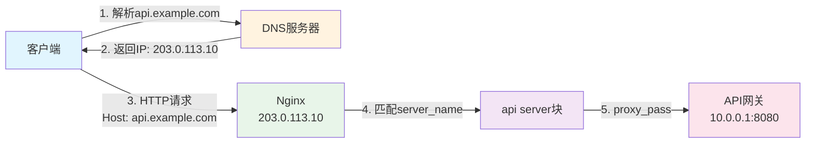
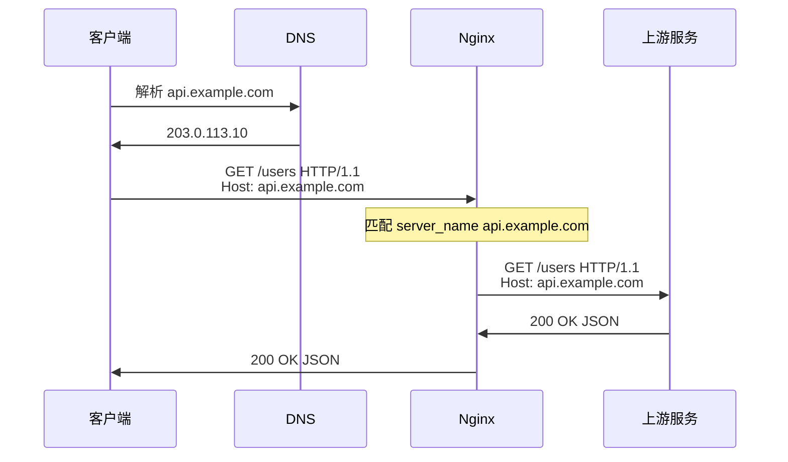
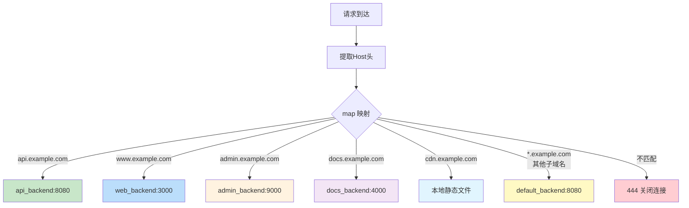

# 子域名解析到对应服务

## 概述

在现代 Web 架构中，子域名路由是一种常见的微服务入口模式。通过将不同的子域名映射到不同的后端服务，可以实现清晰的服务边界和独立的部署策略。例如：

- `api.example.com` → API 网关服务
- `www.example.com` → 前端 Web 应用
- `admin.example.com` → 管理后台
- `cdn.example.com` → 静态资源 CDN
- `docs.example.com` → 文档站点

Nginx 提供了多种机制来实现子域名到服务的映射，从简单的 `server_name` 通配符到基于 `map` 的动态路由，再到 Lua 模块的编程级路由。

::: important 子域名路由的优势
相比路径路由（如 `/api/`、`/admin/`），子域名路由具有以下优势：
1. **独立部署**：每个服务可以独立部署、扩缩容
2. **Cookie 隔离**：子域名的 Cookie 互不干扰
3. **CORS 简化**：跨域策略更清晰
4. **SSL 证书灵活**：可以使用独立证书或泛域名证书
:::

## 需求场景

### 典型的多服务架构

```
api.example.com      → API 网关 (Go/Java/Node.js)
www.example.com      → 前端 SPA (React/Vue)
admin.example.com    → 管理后台 (Angular/Vue)
docs.example.com     → 文档站点 (VuePress/Docusaurus)
cdn.example.com      → 静态资源 CDN
mail.example.com     → 邮件 Web 客户端
grafana.example.com  → 监控面板
jenkins.example.com  → CI/CD 平台
```

### 子域名路由的挑战

1. **DNS 配置**：每个子域名都需要正确的 DNS 解析
2. **证书管理**：HTTPS 需要为每个子域名配置证书
3. **动态扩展**：新增子域名时需要更新 Nginx 配置并重载
4. **统一管理**：多个子域名共享部分配置（如安全头、日志格式）

## DNS 解析与 Nginx 配合

### DNS 解析流程



### DNS 配置方式

#### 方式 1：A 记录（每个子域名单独配置）

```
; Zone file for example.com
www     IN  A       203.0.113.10
api     IN  A       203.0.113.10
admin   IN  A       203.0.113.10
docs    IN  A       203.0.113.10
cdn     IN  A       203.0.113.10
```

#### 方式 2：CNAME 记录（推荐，便于 IP 变更）

```
; Zone file for example.com
@       IN  A       203.0.113.10
www     IN  CNAME   example.com.
api     IN  CNAME   example.com.
admin   IN  CNAME   example.com.
docs    IN  CNAME   example.com.
cdn     IN  CNAME   cdn-provider.example.net.
```

#### 方式 3：泛域名 A 记录（推荐，减少 DNS 配置）

```
; Zone file for example.com
@       IN  A       203.0.113.10
*       IN  A       203.0.113.10    ; 所有子域名解析到同一IP
```

::: tip 泛域名 DNS 记录
泛域名 A 记录 `*` 会将所有未明确配置的子域名解析到指定 IP。这意味着：
1. 无需为每个新子域名单独配置 DNS
2. 新增子域名只需修改 Nginx 配置
3. 但要注意 DNS 缓存可能导致新增子域名解析延迟
:::

### DNS 与 Nginx 的完整流程



## server_name 通配符

### 前缀通配符：*.example.com

```nginx
server {
    listen 80;
    server_name *.example.com;

    # 匹配所有 example.com 的直接子域名
    # www.example.com ✓
    # api.example.com ✓
    # admin.example.com ✓
    # example.com ✗（通配符不匹配空标签）
    # sub.api.example.com ✗（通配符只匹配一级）

    location / {
        proxy_pass http://backend;
    }
}
```

### 后缀通配符：www.*

```nginx
server {
    listen 80;
    server_name www.*;

    # 匹配以 www. 开头的所有域名
    # www.example.com ✓
    # www.another.org ✓
    # www.sub.example.com ✓

    location / {
        proxy_pass http://backend;
    }
}
```

### 通配符的限制

1. `*.example.com` 不匹配 `example.com` 本身
2. `*.example.com` 不匹配 `sub.api.example.com`（多级子域名）
3. 通配符只能在域名的最左侧或最右侧
4. `www.*.example.com` 是无效语法

```nginx
# 无效语法
server_name www.*.example.com;    # 错误：通配符不能在中间
server_name *.*.example.com;      # 错误：不能有多个通配符

# 有效语法
server_name *.example.com;        # 前缀通配符
server_name www.*;                # 后缀通配符
```

::: warning 通配符匹配的局限性
如果需要匹配多级子域名（如 `sub.api.example.com`），或者需要更灵活的匹配规则，应该使用正则表达式 `server_name`。
:::

## 正则 server_name 匹配子域名

### 基本正则匹配

```nginx
# 匹配 example.com 的所有子域名（含多级）
server {
    listen 80;
    server_name ~^(?<subdomain>.+)\.example\.com$;

    # www.example.com ✓ → subdomain=www
    # api.example.com ✓ → subdomain=api
    # sub.api.example.com ✓ → subdomain=sub.api
    # example.com ✗（正则要求有点号）

    location / {
        proxy_pass http://backend;
    }
}
```

### 命名捕获与动态路由

```nginx
# 使用命名捕获组获取子域名
server {
    listen 80;
    server_name ~^(?<sub>.+)\.example\.com$;

    # 根据子域名动态路由
    location / {
        proxy_pass http://$sub_backend;
        proxy_set_header Host $host;
        proxy_set_header X-Subdomain $sub;
    }
}
```

### 特定子域名的正则匹配

```nginx
# 仅匹配 API 版本子域名：v1.api.example.com, v2.api.example.com
server {
    listen 80;
    server_name ~^(?<version>v[0-9]+)\.api\.example\.com$;

    location / {
        proxy_pass http://api_backend;
        proxy_set_header X-API-Version $version;
    }
}

# 匹配租户子域名：tenant1.example.com, tenant2.example.com
server {
    listen 80;
    server_name ~^(?<tenant>[a-z0-9-]+)\.example\.com$;

    location / {
        proxy_pass http://app_backend;
        proxy_set_header X-Tenant-ID $tenant;
    }
}

# 匹配环境子域名：dev.example.com, staging.example.com, prod.example.com
server {
    listen 80;
    server_name ~^(?<env>dev|staging|prod)\.example\.com$;

    location / {
        proxy_pass http://app_backend;
        proxy_set_header X-Environment $env;
    }
}
```

### 正则匹配的注意事项

1. 正则匹配的优先级低于精确匹配和通配符匹配
2. 多个正则 `server_name` 按配置顺序匹配，第一个匹配的生效
3. 正则匹配区分大小写（`~`），使用 `~*` 不区分大小写
4. 命名捕获组名称必须合法（字母开头，只含字母数字下划线）

```nginx
# 区分大小写的正则
server_name ~^api\.example\.com$;        # 只匹配小写 api
server_name ~*^api\.example\.com$;       # 匹配 API, api, Api 等

# 命名捕获组
server_name ~^(?<name>[a-z0-9-]+)\.example\.com$;  # 合法
server_name ~^(?<1name>[a-z]+)\.example\.com$;     # 非法：数字开头
server_name ~^(?<my-name>[a-z]+)\.example\.com$;   # 非法：含连字符
```

## map 指令实现子域名到后端的动态映射

`map` 指令是 Nginx 中实现动态路由的最强大工具之一。它可以根据变量的值（如 `$host`）映射到不同的后端地址，比配置大量 `server` 块更简洁高效。

### map 基本语法

```nginx
map $variable $new_variable {
    pattern1  value1;
    pattern2  value2;
    default   default_value;
}
```

### 子域名路由映射图



### 完整配置示例

```nginx
# 定义上游服务
upstream api_backend {
    server 10.0.0.1:8080;
    server 10.0.0.2:8080;
    keepalive 32;
}

upstream web_backend {
    server 10.0.0.3:3000;
    keepalive 16;
}

upstream admin_backend {
    server 10.0.0.4:9000;
    keepalive 8;
}

upstream docs_backend {
    server 10.0.0.5:4000;
    keepalive 8;
}

# map：子域名到上游服务映射
map $host $upstream_name {
    api.example.com      api_backend;
    www.example.com      web_backend;
    admin.example.com    admin_backend;
    docs.example.com     docs_backend;
    cdn.example.com      cdn_local;
    default              default_backend;
}

# map：子域名到根目录映射（静态站点）
map $host $document_root {
    www.example.com    /var/www/web;
    docs.example.com   /var/www/docs;
    cdn.example.com    /var/www/cdn;
    default            /var/www/default;
}

# map：是否需要认证
map $host $require_auth {
    admin.example.com    1;
    default              0;
}

# 通用上游服务
upstream default_backend {
    server 127.0.0.1:8080;
}

# HTTP → HTTPS 重定向
server {
    listen 80;
    server_name *.example.com example.com;
    return 301 https://$host$request_uri;
}

# HTTPS 主服务
server {
    listen 443 ssl http2;
    server_name *.example.com example.com;

    # SSL 证书（泛域名证书）
    ssl_certificate /etc/nginx/ssl/example.com.crt;
    ssl_certificate_key /etc/nginx/ssl/example.com.key;

    # 通用安全头
    add_header X-Frame-Options "SAMEORIGIN" always;
    add_header X-Content-Type-Options "nosniff" always;
    add_header Strict-Transport-Security "max-age=31536000; includeSubDomains" always;

    # API 服务
    location / {
        if ($upstream_name = "cdn_local") {
            root /var/www/cdn;
            break;
        }

        proxy_pass http://$upstream_name;
        proxy_http_version 1.1;
        proxy_set_header Connection "";
        proxy_set_header Host $host;
        proxy_set_header X-Real-IP $remote_addr;
        proxy_set_header X-Forwarded-For $proxy_add_x_forwarded_for;
        proxy_set_header X-Forwarded-Proto $scheme;
    }

    # 状态页面
    location /nginx_status {
        stub_status;
        access_log off;
        allow 127.0.0.1;
        deny all;
    }

    access_log /var/log/nginx/example_access.log;
}
```

### 更精细的 map 路由配置

```nginx
# 使用正则匹配的 map
map $host $backend_port {
    ~^api\.              8080;   # api.* → 8080
    ~^www\.              3000;   # www.* → 3000
    ~^admin\.            9000;   # admin.* → 9000
    ~^docs\.             4000;   # docs.* → 4000
    ~^(?<sub>[a-z0-9-]+)\.   8080;   # 其他子域名 → 8080
    default              80;     # 无子域名 → 80
}

# 基于子域名的环境区分
map $host $environment {
    ~^dev\.              development;
    ~^staging\.          staging;
    ~^prod\.             production;
    default              production;
}

# 基于子域名的限流策略
map $host $rate_limit_zone {
    api.example.com      api_limit;
    www.example.com      web_limit;
    default              default_limit;
}

# 限流区域定义
limit_req_zone $binary_remote_addr zone=api_limit:10m rate=100r/s;
limit_req_zone $binary_remote_addr zone=web_limit:10m rate=50r/s;
limit_req_zone $binary_remote_addr zone=default_limit:10m rate=20r/s;

server {
    listen 443 ssl http2;
    server_name *.example.com;

    ssl_certificate /etc/nginx/ssl/example.com.crt;
    ssl_certificate_key /etc/nginx/ssl/example.com.key;

    # 应用限流
    # 注意：limit_req 的 zone 参数不支持变量，不能写成 zone=$rate_limit_zone
    # 以下是错误的写法：limit_req zone=$rate_limit_zone burst=20 nodelay;
    # 替代方案：使用多个 limit_req 指令或按子域名分别配置 server 块
    # 方案一：在同一个 location 中叠加所有限流区域
    limit_req zone=api_limit burst=20 nodelay;
    limit_req zone=web_limit burst=20 nodelay;
    limit_req zone=default_limit burst=20 nodelay;
    # 方案二：按子域名配置独立的 server 块，每个 server 使用各自的 limit_req

    location / {
        proxy_pass http://127.0.0.1:$backend_port;
        proxy_set_header Host $host;
        proxy_set_header X-Real-IP $remote_addr;
        proxy_set_header X-Environment $environment;
    }
}
```

### map 的高级用法

#### 多条件 map

```nginx
# 基于主机名和 URI 的复合映射
map "$host:$uri" $special_handler {
    "api.example.com:/health"   health_check;
    "admin.example.com:/login"  sso_redirect;
    default                     normal;
}
```

#### map 与变量组合

```nginx
# 从主机名提取子域名
map $host $subdomain {
    ~^(?<sub>[a-z0-9-]+)\.example\.com$  $sub;
    default                               www;
}

# 子域名到上游服务端口
map $subdomain $service_port {
    api      8080;
    admin    9000;
    docs     4000;
    www      3000;
    default  8080;
}

server {
    listen 443 ssl http2;
    server_name *.example.com;

    ssl_certificate /etc/nginx/ssl/example.com.crt;
    ssl_certificate_key /etc/nginx/ssl/example.com.key;

    location / {
        proxy_pass http://127.0.0.1:$service_port;
        proxy_set_header Host $host;
        proxy_set_header X-Subdomain $subdomain;
    }
}
```

## 泛域名证书与配置

### 泛域名 SSL 证书

泛域名证书（Wildcard Certificate）可以保护一个域名及其所有一级子域名：

```
*.example.com 证书覆盖：
✓ www.example.com
✓ api.example.com
✓ admin.example.com
✓ docs.example.com
✗ sub.api.example.com  （不覆盖二级子域名）
✗ example.com          （不覆盖裸域名，除非证书同时包含）
```

### Let's Encrypt 泛域名证书申请

使用 certbot 通过 DNS 验证申请泛域名证书：

```bash
# 安装 certbot
sudo apt install certbot python3-certbot-nginx

# 使用 DNS 验证申请泛域名证书
sudo certbot certonly --manual --preferred-challenges dns \
    -d "*.example.com" -d "example.com" \
    --agree-tos --email admin@example.com

# certbot 会要求添加 DNS TXT 记录进行验证
# _acme-challenge.example.com TXT "验证码"

# 验证完成后，证书保存在
# /etc/letsencrypt/live/example.com/fullchain.pem
# /etc/letsencrypt/live/example.com/privkey.pem
```

### 自动续期配置

```bash
# 添加 cron 任务自动续期
echo "0 0 1 * * certbot renew --quiet --deploy-hook 'systemctl reload nginx'" | sudo tee -a /etc/cron.d/certbot
```

### Nginx 泛域名证书配置

```nginx
# HTTP → HTTPS 重定向
server {
    listen 80;
    server_name *.example.com example.com;

    # Let's Encrypt 验证
    location ^~ /.well-known/acme-challenge/ {
        root /var/www/certbot;
    }

    location / {
        return 301 https://$host$request_uri;
    }
}

# HTTPS 服务
server {
    listen 443 ssl http2;
    server_name *.example.com example.com;

    # 泛域名证书
    ssl_certificate /etc/letsencrypt/live/example.com/fullchain.pem;
    ssl_certificate_key /etc/letsencrypt/live/example.com/privkey.pem;

    # SSL 优化
    ssl_protocols TLSv1.2 TLSv1.3;
    ssl_ciphers ECDHE-ECDSA-AES128-GCM-SHA256:ECDHE-RSA-AES128-GCM-SHA256;
    ssl_prefer_server_ciphers off;
    ssl_session_cache shared:SSL:10m;
    ssl_session_timeout 1d;
    ssl_session_tickets off;

    # HSTS
    add_header Strict-Transport-Security "max-age=31536000; includeSubDomains; preload" always;

    # ... 其他配置
}
```

::: important 泛域名证书的局限性
1. 泛域名证书 `*.example.com` 不保护裸域名 `example.com`，需要单独添加
2. 泛域名证书不支持二级子域名（如 `sub.api.example.com`）
3. Let's Encrypt 泛域名证书需要 DNS 验证，不支持 HTTP 验证
4. 自动续期需要 DNS API 支持或手动操作
:::

## 子域名路由完整实战

### 场景描述

使用 Docker Compose 部署多个服务，通过 Nginx 实现子域名路由。

### Docker Compose 配置

```yaml
# docker-compose.yml
version: '3.8'

services:
  nginx:
    image: nginx:1.25
    ports:
      - "80:80"
      - "443:443"
    volumes:
      - ./nginx/nginx.conf:/etc/nginx/nginx.conf:ro
      - ./nginx/conf.d:/etc/nginx/conf.d:ro
      - ./nginx/ssl:/etc/nginx/ssl:ro
      - ./nginx/snippets:/etc/nginx/snippets:ro
      - web-static:/var/www/web:ro
      - docs-static:/var/www/docs:ro
      - cdn-static:/var/www/cdn:ro
    depends_on:
      - api-service
      - admin-service
    networks:
      - app-network
    restart: unless-stopped

  api-service:
    build: ./api
    environment:
      - PORT=8080
      - NODE_ENV=production
    expose:
      - "8080"
    networks:
      - app-network
    restart: unless-stopped
    deploy:
      replicas: 2

  admin-service:
    build: ./admin
    environment:
      - PORT=9000
      - NODE_ENV=production
    expose:
      - "9000"
    networks:
      - app-network
    restart: unless-stopped

  web-service:
    build: ./web
    environment:
      - PORT=3000
    volumes:
      - web-static:/app/dist
    networks:
      - app-network

  docs-service:
    build: ./docs
    volumes:
      - docs-static:/app/dist
    networks:
      - app-network

networks:
  app-network:
    driver: bridge

volumes:
  web-static:
  docs-static:
  cdn-static:
```

### Nginx 主配置

```nginx
# /etc/nginx/nginx.conf
user nginx;
worker_processes auto;
error_log /var/log/nginx/error.log warn;
pid /var/run/nginx.pid;

events {
    worker_connections 2048;
    multi_accept on;
    use epoll;
}

http {
    include       mime.types;
    default_type  application/octet-stream;

    log_format main '$remote_addr - $remote_user [$time_local] '
                    '"$request" $status $body_bytes_sent '
                    '"$http_referer" "$http_user_agent" '
                    'host=$host upstream=$upstream_addr '
                    'rt=$request_time';

    sendfile on;
    tcp_nopush on;
    tcp_nodelay on;

    keepalive_timeout 65s;
    keepalive_requests 5000;

    gzip on;
    gzip_vary on;
    gzip_min_length 1024;
    gzip_types text/plain text/css application/json application/javascript text/xml application/xml text/javascript image/svg+xml;

    # 包含站点配置
    include /etc/nginx/conf.d/*.conf;
}
```

### Nginx 站点配置

```nginx
# /etc/nginx/conf.d/app.conf

# ========================================
# 上游服务定义
# ========================================
upstream api_backend {
    server api-service:8080;
    keepalive 32;
}

upstream admin_backend {
    server admin-service:9000;
    keepalive 16;
}

# ========================================
# 限流区域
# ========================================
limit_req_zone $binary_remote_addr zone=api_limit:10m rate=100r/s;
limit_req_zone $binary_remote_addr zone=web_limit:10m rate=50r/s;
limit_req_zone $binary_remote_addr zone=admin_limit:10m rate=20r/s;

# ========================================
# 默认服务器 - 拒绝不匹配的请求
# ========================================
server {
    listen 80 default_server;
    listen 443 ssl default_server;
    server_name _;

    ssl_certificate /etc/nginx/ssl/default.crt;
    ssl_certificate_key /etc/nginx/ssl/default.key;

    return 444;
}

# ========================================
# HTTP → HTTPS 重定向
# ========================================
server {
    listen 80;
    server_name *.example.com example.com;

    # Let's Encrypt 验证
    location ^~ /.well-known/acme-challenge/ {
        root /var/www/certbot;
    }

    return 301 https://$host$request_uri;
}

# ========================================
# api.example.com - API 网关
# ========================================
server {
    listen 443 ssl http2;
    server_name api.example.com;

    ssl_certificate /etc/nginx/ssl/example.com.crt;
    ssl_certificate_key /etc/nginx/ssl/example.com.key;
    include snippets/ssl-params.conf;

    limit_req zone=api_limit burst=50 nodelay;

    # CORS 配置
    add_header Access-Control-Allow-Origin "https://www.example.com" always;
    add_header Access-Control-Allow-Methods "GET, POST, PUT, DELETE, OPTIONS" always;
    add_header Access-Control-Allow-Headers "Authorization, Content-Type, X-API-Key" always;
    add_header Access-Control-Max-Age 3600 always;

    # OPTIONS 预检请求
    if ($request_method = OPTIONS) {
        return 204;
    }

    location / {
        proxy_pass http://api_backend;
        proxy_http_version 1.1;
        proxy_set_header Connection "";
        proxy_set_header Host $host;
        proxy_set_header X-Real-IP $remote_addr;
        proxy_set_header X-Forwarded-For $proxy_add_x_forwarded_for;
        proxy_set_header X-Forwarded-Proto $scheme;
    }

    access_log /var/log/nginx/api_access.log main;
}

# ========================================
# www.example.com - 前端 Web 应用
# ========================================
server {
    listen 443 ssl http2;
    server_name www.example.com example.com;

    ssl_certificate /etc/nginx/ssl/example.com.crt;
    ssl_certificate_key /etc/nginx/ssl/example.com.key;
    include snippets/ssl-params.conf;

    limit_req zone=web_limit burst=20 nodelay;

    root /var/www/web;
    index index.html;

    # 精确匹配
    location = /favicon.ico {
        log_not_found off;
        access_log off;
        return 204;
    }

    location = /robots.txt {
        log_not_found off;
        access_log off;
        alias /var/www/seo/robots.txt;
    }

    # 静态资源
    location ^~ /assets/ {
        expires 30d;
        add_header Cache-Control "public, immutable";
    }

    # SPA 兜底
    location / {
        try_files $uri $uri/ /index.html;
    }

    access_log /var/log/nginx/www_access.log main;
}

# ========================================
# admin.example.com - 管理后台
# ========================================
server {
    listen 443 ssl http2;
    server_name admin.example.com;

    ssl_certificate /etc/nginx/ssl/example.com.crt;
    ssl_certificate_key /etc/nginx/ssl/example.com.key;
    include snippets/ssl-params.conf;

    limit_req zone=admin_limit burst=10 nodelay;

    # IP 白名单
    allow 192.168.1.0/24;
    allow 10.0.0.0/8;
    deny all;

    # Basic 认证
    auth_basic "Admin Area";
    auth_basic_user_file /etc/nginx/.htpasswd;

    location / {
        proxy_pass http://admin_backend;
        proxy_http_version 1.1;
        proxy_set_header Connection "";
        proxy_set_header Host $host;
        proxy_set_header X-Real-IP $remote_addr;
        proxy_set_header X-Forwarded-For $proxy_add_x_forwarded_for;
    }

    access_log /var/log/nginx/admin_access.log main;
}

# ========================================
# docs.example.com - 文档站点
# ========================================
server {
    listen 443 ssl http2;
    server_name docs.example.com;

    ssl_certificate /etc/nginx/ssl/example.com.crt;
    ssl_certificate_key /etc/nginx/ssl/example.com.key;
    include snippets/ssl-params.conf;

    root /var/www/docs;
    index index.html;

    location / {
        try_files $uri $uri/ /index.html;
    }

    # 禁用访问日志（静态站点）
    access_log off;
}

# ========================================
# cdn.example.com - 静态资源 CDN
# ========================================
server {
    listen 443 ssl http2;
    server_name cdn.example.com;

    ssl_certificate /etc/nginx/ssl/example.com.crt;
    ssl_certificate_key /etc/nginx/ssl/example.com.key;
    include snippets/ssl-params.conf;

    root /var/www/cdn;

    # CORS
    add_header Access-Control-Allow-Origin "https://www.example.com" always;

    # 图片
    location /images/ {
        expires 365d;
        add_header Cache-Control "public, immutable";
    }

    # CSS/JS
    location /assets/ {
        expires 30d;
        add_header Cache-Control "public";
    }

    # 字体
    location /fonts/ {
        expires 365d;
        add_header Cache-Control "public, immutable";
    }

    # 开启 gzip
    gzip on;
    gzip_types text/css application/javascript application/json image/svg+xml;

    access_log off;
}
```

### SSL 参数片段

```nginx
# /etc/nginx/snippets/ssl-params.conf
ssl_protocols TLSv1.2 TLSv1.3;
ssl_ciphers ECDHE-ECDSA-AES128-GCM-SHA256:ECDHE-RSA-AES128-GCM-SHA256:ECDHE-ECDSA-AES256-GCM-SHA384:ECDHE-RSA-AES256-GCM-SHA384;
ssl_prefer_server_ciphers off;
ssl_session_cache shared:SSL:10m;
ssl_session_timeout 1d;
ssl_session_tickets off;

ssl_stapling on;
ssl_stapling_verify on;
resolver 8.8.8.8 8.8.4.4 valid=300s;
resolver_timeout 5s;

add_header X-Frame-Options "SAMEORIGIN" always;
add_header X-Content-Type-Options "nosniff" always;
add_header Strict-Transport-Security "max-age=31536000; includeSubDomains; preload" always;
```

## 子域名与路径路由混合方案

在某些场景下，需要同时使用子域名路由和路径路由：

```
api.example.com          → API 网关
api.example.com/v1/      → API v1
api.example.com/v2/      → API v2
www.example.com          → 前端应用
www.example.com/blog/    → 博客服务
www.example.com/docs/    → 文档服务
admin.example.com        → 管理后台
```

### 混合路由配置

```nginx
# API 网关 - 子域名 + 路径路由
server {
    listen 443 ssl http2;
    server_name api.example.com;

    ssl_certificate /etc/nginx/ssl/example.com.crt;
    ssl_certificate_key /etc/nginx/ssl/example.com.key;

    # CORS 配置
    add_header Access-Control-Allow-Origin "https://www.example.com" always;
    add_header Access-Control-Allow-Methods "GET, POST, PUT, DELETE, OPTIONS" always;
    add_header Access-Control-Allow-Headers "Authorization, Content-Type" always;

    # API v1
    location /v1/ {
        proxy_pass http://v1_backend/;
        proxy_http_version 1.1;
        proxy_set_header Connection "";
        proxy_set_header Host $host;
        proxy_set_header X-Real-IP $remote_addr;
    }

    # API v2
    location /v2/ {
        proxy_pass http://v2_backend/;
        proxy_http_version 1.1;
        proxy_set_header Connection "";
        proxy_set_header Host $host;
        proxy_set_header X-Real-IP $remote_addr;
    }

    # 默认 API（最新版）
    location / {
        proxy_pass http://v2_backend/;
        proxy_http_version 1.1;
        proxy_set_header Connection "";
        proxy_set_header Host $host;
        proxy_set_header X-Real-IP $remote_addr;
    }
}

# Web 应用 - 子域名 + 路径路由
server {
    listen 443 ssl http2;
    server_name www.example.com;

    ssl_certificate /etc/nginx/ssl/example.com.crt;
    ssl_certificate_key /etc/nginx/ssl/example.com.key;

    root /var/www/web;

    # 博客服务
    location /blog/ {
        proxy_pass http://blog_backend/;
        proxy_http_version 1.1;
        proxy_set_header Connection "";
        proxy_set_header Host $host;
        proxy_set_header X-Real-IP $remote_addr;
    }

    # 文档服务
    location /docs/ {
        proxy_pass http://docs_backend/;
        proxy_http_version 1.1;
        proxy_set_header Connection "";
        proxy_set_header Host $host;
        proxy_set_header X-Real-IP $remote_addr;
    }

    # SPA 兜底
    location / {
        try_files $uri $uri/ /index.html;
    }
}
```

## 动态子域名方案：Lua/Redis 动态路由

对于需要运行时动态添加子域名路由的场景（如 SaaS 多租户平台），可以使用 Lua 模块或 Redis 实现动态路由。

### 方案 1：基于 Lua 的动态路由

#### 安装 OpenResty

```bash
# Ubuntu/Debian
sudo apt install openresty

# 或使用 Docker
docker run -d --name openresty \
    -p 80:80 -p 443:443 \
    -v ./nginx.conf:/usr/local/openresty/nginx/conf/nginx.conf:ro \
    openresty/openresty
```

#### Lua 动态路由配置

```nginx
# 定义共享字典（缓存路由信息）
lua_shared_dict route_cache 10m;

# 初始化：从数据库加载路由
init_worker_by_lua_block {
    local route_cache = ngx.shared.route_cache

    -- 模拟从数据库加载路由配置
    local routes = {
        ["api"] = { host = "api_backend", port = 8080 },
        ["www"] = { host = "web_backend", port = 3000 },
        ["admin"] = { host = "admin_backend", port = 9000 },
        ["docs"] = { host = "docs_backend", port = 4000 },
    }

    for subdomain, backend in pairs(routes) do
        route_cache:set(subdomain, backend.host .. ":" .. backend.port)
    end
}

server {
    listen 443 ssl http2;
    server_name *.example.com example.com;

    ssl_certificate /etc/nginx/ssl/example.com.crt;
    ssl_certificate_key /etc/nginx/ssl/example.com.key;

    # Lua 动态路由
    location / {
        access_by_lua_block {
            local route_cache = ngx.shared.route_cache
            local host = ngx.var.host
            local subdomain = host:match("^([a-z0-9-]+)%.example%.com$")

            if subdomain then
                local backend = route_cache:get(subdomain)
                if backend then
                    ngx.var.backend = backend
                else
                    ngx.var.backend = "default_backend:8080"
                end
            else
                ngx.var.backend = "default_backend:8080"
            end
        }

        proxy_pass http://$backend;
        proxy_http_version 1.1;
        proxy_set_header Connection "";
        proxy_set_header Host $host;
        proxy_set_header X-Real-IP $remote_addr;
        proxy_set_header X-Forwarded-For $proxy_add_x_forwarded_for;
    }
}
```

#### Lua + Redis 动态路由

```nginx
lua_shared_dict route_cache 10m;

# Redis 连接配置
lua_package_path "/usr/local/openresty/lualib/?.lua;;";

init_worker_by_lua_block {
    local redis = require "resty.redis"
    local route_cache = ngx.shared.route_cache

    -- 从 Redis 加载路由
    local red = redis:new()
    red:set_timeouts(1000, 1000, 1000)

    local ok, err = red:connect("redis-service", 6379)
    if not ok then
        ngx.log(ngx.ERR, "failed to connect to redis: ", err)
        return
    end

    -- 加载所有路由
    local routes, err = red:hgetall("nginx:routes")
    if routes then
        for i = 1, #routes, 2 do
            route_cache:set(routes[i], routes[i+1])
        end
    end

    red:close()
}

server {
    listen 443 ssl http2;
    server_name *.example.com example.com;

    ssl_certificate /etc/nginx/ssl/example.com.crt;
    ssl_certificate_key /etc/nginx/ssl/example.com.key;

    set $backend "default_backend:8080";

    location / {
        access_by_lua_block {
            local route_cache = ngx.shared.route_cache
            local host = ngx.var.host
            local subdomain = host:match("^([a-z0-9-]+)%.example%.com$")

            if subdomain then
                local backend = route_cache:get(subdomain)
                if backend then
                    ngx.var.backend = backend
                else
                    -- 尝试从 Redis 获取
                    local redis = require "resty.redis"
                    local red = redis:new()
                    red:set_timeouts(100, 100, 100)

                    local ok, err = red:connect("redis-service", 6379)
                    if ok then
                        local res, err = red:hget("nginx:routes", subdomain)
                        if res then
                            route_cache:set(subdomain, res, 300)  -- 缓存5分钟
                            ngx.var.backend = res
                        end
                        red:close()
                    end
                end
            end
        }

        proxy_pass http://$backend;
        proxy_http_version 1.1;
        proxy_set_header Connection "";
        proxy_set_header Host $host;
        proxy_set_header X-Real-IP $remote_addr;
        proxy_set_header X-Forwarded-For $proxy_add_x_forwarded_for;
    }
}
```

### 方案 2：基于 map + 变量的轻量级动态路由

如果不需要运行时动态更新，使用 `map` 指令是最简洁的方案：

```nginx
# map：子域名到上游服务
map $host $backend {
    ~^(?<sub>[a-z0-9-]+)\.example\.com$  $sub;
    example.com                           www;
    default                               default;
}

# map：上游服务名到实际地址
map $backend $backend_addr {
    api       10.0.0.1:8080;
    www       10.0.0.2:3000;
    admin     10.0.0.3:9000;
    docs      10.0.0.4:4000;
    grafana   10.0.0.5:3000;
    jenkins   10.0.0.6:8080;
    default   127.0.0.1:8080;
}

# map：是否需要认证
map $backend $auth_required {
    admin     1;
    grafana   1;
    jenkins   1;
    default   0;
}

# map：是否需要 IP 限制
map $backend $ip_restricted {
    admin     1;
    jenkins   1;
    default   0;
}

server {
    listen 443 ssl http2;
    server_name *.example.com example.com;

    ssl_certificate /etc/nginx/ssl/example.com.crt;
    ssl_certificate_key /etc/nginx/ssl/example.com.key;

    # 基于 map 的认证
    location / {
        auth_request /auth_check;

        proxy_pass http://$backend_addr;
        proxy_http_version 1.1;
        proxy_set_header Connection "";
        proxy_set_header Host $host;
        proxy_set_header X-Real-IP $remote_addr;
        proxy_set_header X-Forwarded-For $proxy_add_x_forwarded_for;
        proxy_set_header X-Subdomain $backend;
    }

    # 认证检查
    location = /auth_check {
        internal;
        proxy_pass http://127.0.0.1:8888/auth?required=$auth_required&ip_check=$ip_restricted;
        proxy_pass_request_body off;
        proxy_set_header Content-Length "";
        proxy_set_header X-Original-URI $request_uri;
        proxy_set_header X-Original-Host $host;
    }
}
```

### 方案 3：基于 resolver 的 DNS 动态路由

利用 Nginx 的 `resolver` 指令实现基于 DNS SRV 记录的动态路由：

```nginx
server {
    listen 443 ssl http2;
    server_name *.example.com;

    # DNS 解析器
    resolver 10.0.0.1 valid=30s;
    resolver_timeout 5s;

    set $backend "";

    location / {
        # 从 host 头提取子域名
        if ($host ~* "^([a-z0-9-]+)\.example\.com$") {
            set $subdomain $1;
        }

        # 动态解析后端服务
        # 假设内部 DNS 有 service-name.service.consul 的 SRV 记录
        proxy_pass http://$subdomain.service.consul:8080;
        proxy_http_version 1.1;
        proxy_set_header Connection "";
        proxy_set_header Host $host;
        proxy_set_header X-Real-IP $remote_addr;
    }
}
```

::: warning resolver 与变量 proxy_pass
当 `proxy_pass` 使用变量时，Nginx 不会在启动时解析域名，而是在每次请求时使用 `resolver` 指定的 DNS 服务器动态解析。这意味着：
1. 必须配置 `resolver` 指令
2. DNS 解析有性能开销（可通过 `valid` 参数缓存）
3. DNS 不可用时，请求将失败
:::

## 子域名路由方案对比

| 方案 | 动态性 | 性能 | 复杂度 | 适用场景 |
|------|--------|------|--------|---------|
| 多 server 块 | 静态（需重载） | 最好 | 低 | 固定子域名 |
| server_name 通配符 | 静态 | 好 | 低 | 子域名规则简单 |
| 正则 server_name | 静态 | 中 | 中 | 子域名规则较复杂 |
| map 指令 | 静态 | 好 | 中 | 子域名→后端映射 |
| Lua + Redis | 动态 | 中 | 高 | SaaS 多租户 |
| resolver DNS | 动态 | 中 | 中 | 服务发现场景 |

## 小结

子域名路由是 Nginx 虚拟主机配置的重要应用场景。根据不同的需求，可以选择不同的实现方案：

1. **固定子域名**：使用多个 `server` 块，每个子域名一个 `server` 块
2. **简单通配**：使用 `server_name *.example.com` 匹配所有子域名
3. **复杂匹配**：使用正则 `server_name` 实现灵活的子域名匹配
4. **映射路由**：使用 `map` 指令实现子域名到后端的动态映射
5. **运行时动态**：使用 Lua/Redis 实现运行时动态路由更新

::: tip 进一步阅读
- [ngx_http_core_module - server_name](https://nginx.org/en/docs/http/ngx_http_core_module.html#server_name)
- [ngx_http_map_module](https://nginx.org/en/docs/http/ngx_http_map_module.html)
- [OpenResty Lua API](https://openresty.org/en/lua_module_api.html)
- [ngx_http_core_module - resolver](https://nginx.org/en/docs/http/ngx_http_core_module.html#resolver)
:::
