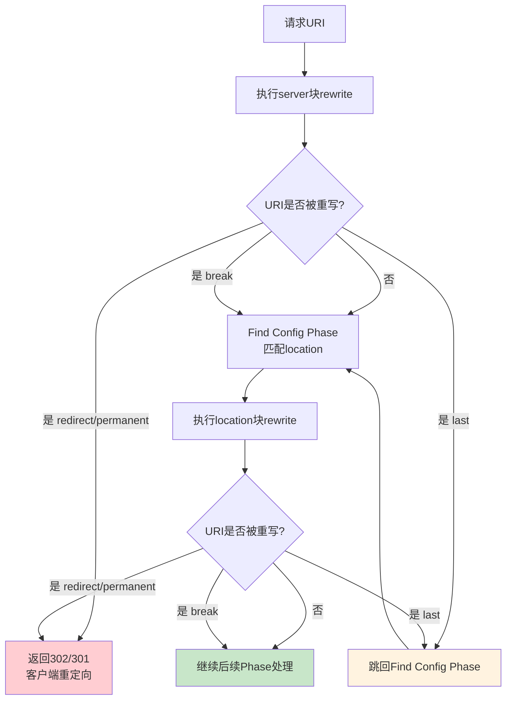
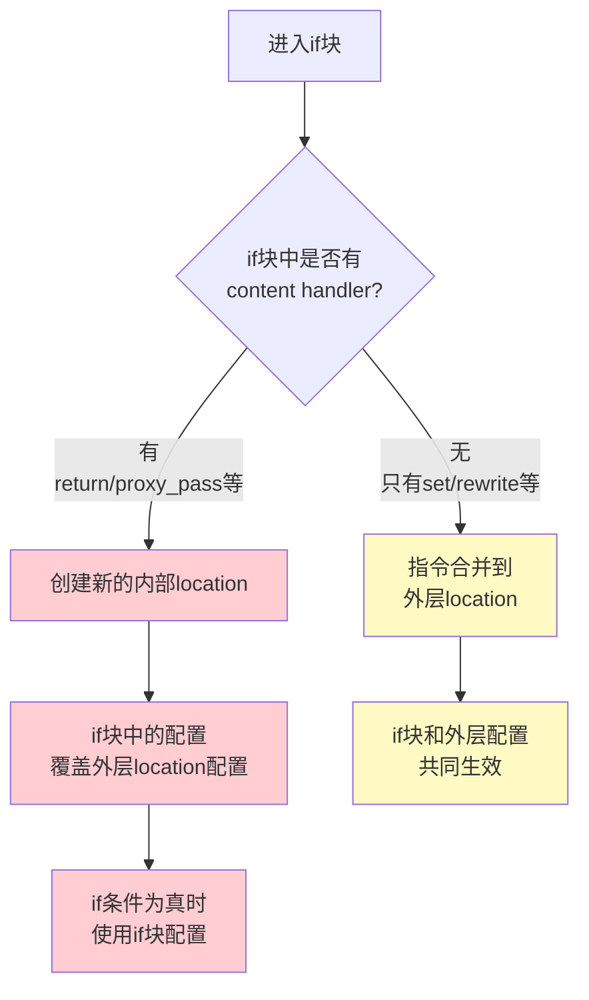
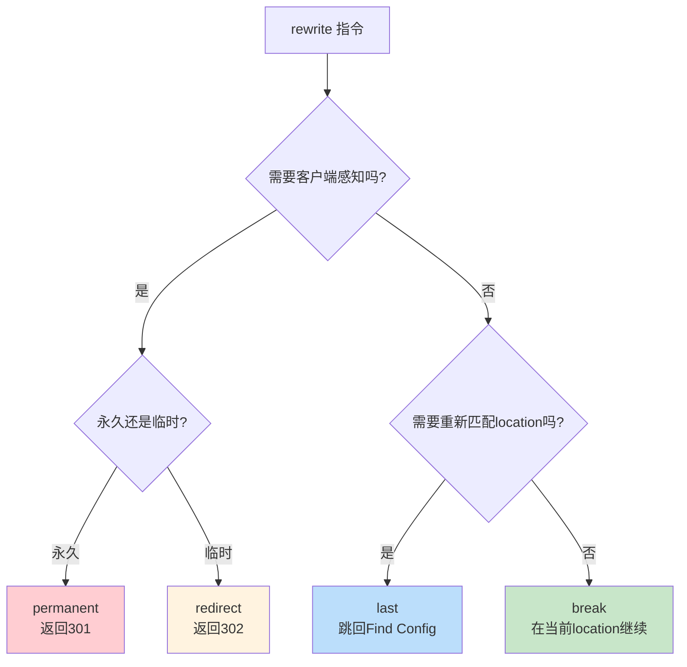
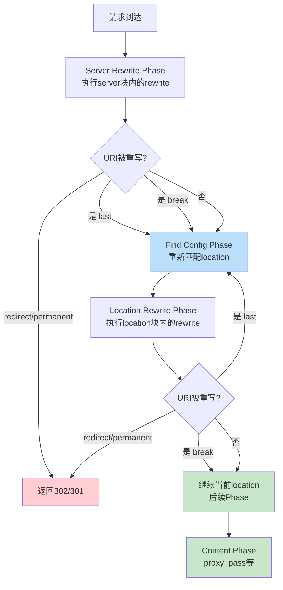

# rewrite 与重定向

## 概述

Nginx 的 `rewrite` 模块（`ngx_http_rewrite_module`）是 URI 重写和请求重定向的核心模块。它提供了 `rewrite`、`if`、`return`、`set`、`break` 等指令，可以在请求处理的不同阶段修改请求 URI 或直接返回响应。

URI 重写和重定向在 Web 服务器配置中有着广泛的应用场景：URL 规范化、HTTP 到 HTTPS 的迁移、旧 URL 到新 URL 的跳转、A/B 测试路由等。然而，`rewrite` 模块也是最容易出错的模块之一，尤其是 `if` 指令的"邪恶"行为广为人知。

::: important rewrite 模块的两个执行位置
rewrite 模块的指令可以在两个 Phase 中执行：
1. **Server Rewrite Phase**：server 块内的 rewrite 指令，在 location 匹配之前执行
2. **Location Rewrite Phase**：location 块内的 rewrite 指令，在 location 匹配之后执行

理解这两个执行位置的区别对于正确配置 rewrite 至关重要。
:::

## rewrite 指令语法与正则捕获

### rewrite 基本语法

```nginx
rewrite regex replacement [flag];
```

| 参数 | 说明 |
|------|------|
| `regex` | 匹配 URI 的正则表达式（PCRE 语法） |
| `replacement` | 替换字符串，可包含正则捕获组引用 |
| `flag` | 控制重写行为的标志（可选） |

### 正则捕获

rewrite 指令支持正则表达式的捕获组引用：

```nginx
# 数字捕获组
rewrite ^/api/v1/(.*)$ /api/v2/$1 last;
# /api/v1/users → /api/v2/users

# 命名捕获组
rewrite ^/download/(?<file>.*)$ /files/$file last;
# /download/app.tar.gz → /files/app.tar.gz

# 多个捕获组
rewrite ^/user/(\d+)/post/(\d+)$ /posts?user=$1&post=$2 last;
# /user/123/post/456 → /posts?user=123&post=456
```

### 重写流程



### replacement 中的特殊替换

当 `replacement` 以 `http://`、`https://` 或 `$scheme` 开头时，rewrite 会直接返回重定向响应，相当于 `redirect` 标志：

```nginx
# 这两条是等价的
rewrite ^(.*)$ https://$host$1 permanent;
rewrite ^(.*)$ https://$host$1 redirect;
```

### rewrite 常见模式

#### 1. URL 规范化

```nginx
# 移除 URI 末尾的斜杠（SEO 优化）
rewrite ^/(.*)/$ /$1 permanent;

# 添加 URI 末尾的斜杠（目录访问）
rewrite ^/([^.]*[^/])$ /$1/ permanent;

# 统一大小写（小写化）
# 需要使用 map + Lua 实现，rewrite 不支持大小写转换
```

#### 2. API 版本迁移

```nginx
# API v1 → v2
rewrite ^/api/v1/(.*)$ /api/v2/$1 permanent;

# 旧 API 路径 → 新路径
rewrite ^/rest/(.*)$ /api/$1 last;
```

#### 3. 文件路径重映射

```nginx
# 旧的下载路径 → 新路径
rewrite ^/downloads/(.*)$ /files/$1 last;

# 旧的图片路径 → CDN 路径
rewrite ^/images/(.*)$ https://cdn.example.com/images/$1 permanent;
```

## if 指令：条件判断与常见陷阱

### if 指令语法

```nginx
if (condition) {
    # 指令
}
```

### 条件类型

```nginx
# 1. 变量判断：非空和非0为真
if ($variable) { ... }        # $variable 非空且非 "0" 时为真
if (!$variable) { ... }       # $variable 为空或 "0" 时为真

# 2. 字符串比较
if ($variable = "value") { ... }       # 相等
if ($variable != "value") { ... }      # 不相等

# 3. 正则匹配
if ($variable ~ "^pattern$") { ... }   # 区分大小写
if ($variable ~* "^pattern$") { ... }  # 不区分大小写

# 4. 文件/目录判断
if (-f $request_filename) { ... }      # 文件存在
if (!-f $request_filename) { ... }     # 文件不存在
if (-d $request_filename) { ... }      # 目录存在
if (!-d $request_filename) { ... }     # 目录不存在
if (-e $request_filename) { ... }      # 文件/目录/符号链接存在
if (!-e $request_filename) { ... }     # 不存在
if (-x $request_filename) { ... }      # 可执行文件
```

### "if is evil" 问题的根源



Nginx 的 `if` 实际上创建了一个隐式的内部 location。当 `if` 块中包含 content handler（如 `proxy_pass`、`fastcgi_pass`、`root` + `index` 等），这个内部 location 会覆盖外层 location 的配置，导致意外行为。

### if 的危险示例

```nginx
# 危险！if 中的 proxy_pass 覆盖了外层的配置
location /api/ {
    proxy_set_header Host $host;          # 外层配置
    proxy_set_header X-Real-IP $remote_addr;  # 外层配置

    if ($http_x_version = "2") {
        proxy_pass http://v2_backend;      # if 块会创建新 location
        # 外层的 proxy_set_header 不会继承！
    }

    proxy_pass http://v1_backend;
}

# 危险！if 中的 root 覆盖了外层的 root
location /images/ {
    root /var/www/images;

    if ($arg_thumb = "1") {
        root /var/www/thumbnails;  # 覆盖了外层的 root
    }
}

# 危险！try_files 在 if 中的行为不可预测
location / {
    try_files $uri $uri/ /index.html;

    if ($http_cookie ~ "session") {
        try_files $uri /app.html;  # try_files 行为不可预测
    }
}
```

### if 的安全用法

`if` 在以下场景中是安全的：

```nginx
# 安全用法 1：return
location /old-api/ {
    if ($scheme != "https") {
        return 301 https://$host$request_uri;
    }
    proxy_pass http://api_backend;
}

# 安全用法 2：rewrite ... last/redirect/permanent
location / {
    if ($http_host ~* "^www\.(.*)") {
        rewrite ^(.*)$ https://%1$1 permanent;
    }
    try_files $uri $uri/ /index.html;
}

# 安全用法 3：set
location /api/ {
    set $backend "default";

    if ($http_x_feature = "new") {
        set $backend "new";
    }

    proxy_pass http://$backend;
}

# 安全用法 4：rewrite ... break
location /download/ {
    if ($forbidden) {
        return 403;
    }

    if ($request_filename ~* ^(.*)/([^/]*)(\?.*)?$) {
        set $path $1;
        set $file $2;
    }

    root /var/www/files;
}
```

### 替代 if 的方案

#### 使用 map 替代 if 条件判断

```nginx
# 不推荐：使用 if
location /api/ {
    if ($http_x_api_version = "v2") {
        proxy_pass http://v2_backend;
    }
    proxy_pass http://v1_backend;
}

# 推荐：使用 map
map $http_x_api_version $api_backend {
    "v2"     v2_backend;
    default  v1_backend;
}

location /api/ {
    proxy_pass http://$api_backend;
}
```

#### 使用多个 location 替代 if

```nginx
# 不推荐：使用 if 判断文件类型
location /download/ {
    if ($request_uri ~* \.pdf$) {
        add_header Content-Disposition "attachment";
    }
    root /var/www/files;
}

# 推荐：使用多个 location
location /download/ {
    root /var/www/files;
}

location ~* ^/download/.*\.pdf$ {
    root /var/www/files;
    add_header Content-Disposition "attachment";
}
```

#### 使用 try_files 替代 if 文件判断

```nginx
# 不推荐：使用 if 判断文件
location / {
    if (!-f $request_filename) {
        proxy_pass http://backend;
        break;
    }
}

# 推荐：使用 try_files
location / {
    try_files $uri @backend;
}

location @backend {
    proxy_pass http://backend;
}
```

## return 指令

`return` 指令直接返回响应，是处理重定向和简单响应的最高效方式。

### return 语法

```nginx
return code [text];
return code URL;
return URL;
```

### 301/302/307/308 重定向

| 状态码 | 含义 | 缓存行为 | 请求方法保持 |
|--------|------|---------|------------|
| 301 | 永久重定向 | 浏览器缓存 | 否（可能变为GET） |
| 302 | 临时重定向 | 不缓存 | 否（可能变为GET） |
| 307 | 临时重定向 | 不缓存 | 是 |
| 308 | 永久重定向 | 浏览器缓存 | 是 |

```nginx
# 301 永久重定向 - HTTP → HTTPS
return 301 https://$host$request_uri;

# 302 临时重定向 - 临时维护页面
return 302 https://maintenance.example.com;

# 307 临时重定向 - 保持请求方法
return 307 https://$host$request_uri;

# 308 永久重定向 - 保持请求方法
return 308 https://new-domain.com$request_uri;
```

::: important 选择正确的重定向状态码
1. **永久迁移**：使用 301 或 308。搜索引擎会更新索引
2. **临时迁移**：使用 302 或 307。搜索引擎保留原 URL
3. **需要保持请求方法**：使用 307 或 308。POST 请求不会被转为 GET
4. **SEO 优化**：推荐使用 301（搜索引擎权重传递更好）
:::

### 自定义响应

```nginx
# 返回纯文本
return 200 "OK";

# 返回 JSON
return 200 '{"status": "ok"}';
add_header Content-Type application/json always;

# 返回错误
return 403 "Forbidden";
return 404;
return 500 "Internal Server Error";

# 返回 Nginx 特殊状态码（直接关闭连接）
return 444;
```

### return 与 rewrite 的对比

| 特性 | return | rewrite |
|------|--------|---------|
| 执行速度 | 快（直接返回） | 慢（正则匹配+替换） |
| 功能 | 返回状态码/URL/文本 | URI 重写+重定向 |
| 灵活性 | 简单场景 | 复杂正则替换 |
| 适用场景 | 固定重定向、简单响应 | URL 模式匹配重写 |

**原则**：能用 `return` 的就不用 `rewrite`。

```nginx
# 推荐：使用 return
server {
    listen 80;
    server_name example.com;
    return 301 https://$host$request_uri;
}

# 不推荐：使用 rewrite（多余的正则匹配）
server {
    listen 80;
    server_name example.com;
    rewrite ^(.*)$ https://$host$1 permanent;
}
```

## break/last/redirect/permanent 标志详解

### 四种标志

| 标志 | 行为 |
|------|------|
| `last` | 停止当前 rewrite 阶段，跳回 Find Config Phase 重新匹配 location |
| `break` | 停止当前 rewrite 阶段，继续在当前 location 中执行后续 Phase |
| `redirect` | 返回 302 临时重定向 |
| `permanent` | 返回 301 永久重定向 |

### last 与 break 的核心区别

```nginx
# last：重写后重新匹配 location
server {
    location /old/ {
        rewrite ^/old/(.*)$ /new/$1 last;
        # 执行到 last 后，跳回 Find Config Phase
        # 不会执行此 location 的后续指令
        proxy_pass http://old_backend;  # 不会执行
    }

    location /new/ {
        proxy_pass http://new_backend;  # 会执行这个
    }
}

# break：重写后在当前 location 中继续处理
server {
    location /files/ {
        rewrite ^/files/(.*)$ /data/$1 break;
        # 执行到 break 后，继续在当前 location 中处理
        # 使用重写后的 URI，但不重新匹配 location
        root /var/www;
        # 实际访问 /var/www/data/...
    }
}
```

### 标志选择指南



### 各标志的执行流程

#### last 标志

```nginx
server {
    # Server Rewrite Phase
    rewrite ^/old/(.*)$ /new/$1 last;
    # → Post Rewrite Phase 检测到 last
    # → 跳回 Find Config Phase
    # → 使用新 URI 重新匹配 location

    location /new/ {
        # Location Rewrite Phase
        rewrite ^/new/(.*)$ /final/$1 last;
        # → Post Rewrite Phase 检测到 last
        # → 跳回 Find Config Phase
        # → 使用新 URI 重新匹配 location
    }

    location /final/ {
        proxy_pass http://final_backend;
    }
}
```

#### break 标志

```nginx
server {
    location /images/ {
        rewrite ^/images/(.*)$ /static/$1 break;
        # → 停止 rewrite 处理
        # → 继续在当前 location 中执行
        # → URI 变为 /static/...，但不重新匹配 location

        root /var/www;
        # 实际访问 /var/www/static/...
    }
}
```

#### redirect / permanent 标志

```nginx
server {
    # 返回 302 临时重定向
    rewrite ^/old-url$ /new-url redirect;
    # 客户端收到：HTTP/1.1 302 Moved Temporarily
    # Location: http://example.com/new-url

    # 返回 301 永久重定向
    rewrite ^/old-url$ /new-url permanent;
    # 客户端收到：HTTP/1.1 301 Moved Permanently
    # Location: http://example.com/new-url
}
```

::: warning last 与 break 在 server 块中的行为
在 server 块中（Server Rewrite Phase），`last` 和 `break` 的行为是相同的——都停止当前 rewrite 处理，进入 Find Config Phase。只有在 location 块中（Location Rewrite Phase），两者的行为才有区别。
:::

## rewrite_log 调试

开启 `rewrite_log` 可以在错误日志中记录 rewrite 的详细过程，是排查 rewrite 问题的重要工具。

### 配置

```nginx
http {
    # 开启 rewrite 日志
    rewrite_log on;

    # 错误日志级别必须为 notice 或更低
    error_log /var/log/nginx/error.log notice;
}
```

### 日志示例

```nginx
server {
    listen 80;
    server_name example.com;

    rewrite_log on;
    error_log /var/log/nginx/error.log notice;

    location / {
        rewrite ^/old/(.*)$ /new/$1 last;
    }

    location /new/ {
        rewrite ^/new/(.*)$ /final/$1 last;
    }
}
```

当访问 `/old/page` 时，error.log 中会记录：

```
2026/06/05 10:00:00 [notice] 1234#0: *1 "^.*/old/(.*)$" matches "/old/page", client: 1.2.3.4
2026/06/05 10:00:00 [notice] 1234#0: *1 rewritten data: "/new/page", args: ""
2026/06/05 10:00:00 [notice] 1234#0: *1 "^.*/new/(.*)$" matches "/new/page"
2026/06/05 10:00:00 [notice] 1234#0: *1 rewritten data: "/final/page", args: ""
```

## 常见 rewrite 场景

### HTTP → HTTPS

```nginx
# 方式 1：使用 return（推荐）
server {
    listen 80;
    server_name example.com www.example.com;
    return 301 https://$host$request_uri;
}

# 方式 2：使用 rewrite
server {
    listen 80;
    server_name example.com www.example.com;
    rewrite ^(.*)$ https://$host$1 permanent;
}

# 方式 3：使用 $scheme 判断
server {
    listen 80;
    listen 443 ssl;
    server_name example.com;

    ssl_certificate /etc/nginx/ssl/example.com.crt;
    ssl_certificate_key /etc/nginx/ssl/example.com.key;

    if ($scheme != "https") {
        return 301 https://$host$request_uri;
    }

    # HTTPS 配置...
}
```

::: tip HTTP → HTTPS 最佳实践
推荐使用方式 1（独立的 server 块 + return），原因：
1. `return` 比 `rewrite` 更高效（无正则匹配开销）
2. 独立 server 块配置清晰，易于维护
3. 避免在同一个 server 块中混合 HTTP 和 HTTPS 配置
:::

### www → non-www（或反之）

```nginx
# www → non-www
server {
    listen 80;
    listen 443 ssl;
    server_name www.example.com;

    ssl_certificate /etc/nginx/ssl/example.com.crt;
    ssl_certificate_key /etc/nginx/ssl/example.com.key;

    return 301 https://example.com$request_uri;
}

# non-www → www
server {
    listen 80;
    listen 443 ssl;
    server_name example.com;

    ssl_certificate /etc/nginx/ssl/example.com.crt;
    ssl_certificate_key /etc/nginx/ssl/example.com.key;

    return 301 https://www.example.com$request_uri;
}
```

### 旧 URL 迁移

```nginx
server {
    listen 443 ssl http2;
    server_name example.com;

    # 单个页面迁移
    rewrite ^/old-page$ /new-page permanent;
    rewrite ^/about-us$ /about permanent;

    # 批量路径迁移
    rewrite ^/blog/(.*)$ /articles/$1 permanent;
    rewrite ^/products/(.*)$ /shop/$1 permanent;

    # 域名迁移
    # 注意：跨域重定向需要完整 URL
    rewrite ^(.*)$ https://new-domain.com$1 permanent;
}
```

### URL 美化

```nginx
server {
    listen 443 ssl http2;
    server_name example.com;

    # 移除 .html 后缀
    rewrite ^/(.*)\.html$ /$1 permanent;

    # 移除末尾斜杠
    rewrite ^/(.*)/$ /$1 permanent;

    # 添加 www
    if ($host != "www.example.com") {
        rewrite ^ https://www.example.com$request_uri permanent;
    }
}
```

### 基于条件的路由

```nginx
server {
    listen 443 ssl http2;
    server_name example.com;

    # 基于设备类型路由
    set $mobile_rewrite 0;

    if ($http_user_agent ~* "(android|bb\d+|meego).+mobile|avantgo|bada\/|blackberry|blazer|compal|elaine|fennec|hiptop|iemobile|ip(hone|od)|iris|kindle|lge |maemo|midp|mmp|mobile.+firefox|netfront|opera m(ob|in)i|palm( os)?|phone|p(ixi|re)\/|plucker|pocket|psp|series(4|6)0|symbian|treo|up\.(browser|link)|vodafone|wap|windows ce|xda|xiino") {
        set $mobile_rewrite 1;
    }

    # 使用 map 替代 if（推荐）
    map $http_user_agent $is_mobile {
        default 0;
        "~*(android|bb\d+|meego).+mobile|avantgo|bada" 1;
        "~*blackberry|blazer|compal|elaine|fennec" 1;
        "~*hiptop|iemobile|ip(hone|od)|iris|kindle" 1;
    }

    location / {
        if ($is_mobile) {
            rewrite ^ /mobile$request_uri last;
        }
        try_files $uri $uri/ /index.html;
    }

    location /mobile/ {
        alias /var/www/mobile/;
        try_files $uri $uri/ /index.html;
    }
}
```

## try_files 指令详解

`try_files` 按顺序检查文件是否存在，是处理静态文件和 SPA 应用的核心指令。

### try_files 语法

```nginx
try_files file ... uri;
try_files file ... =code;
```

### try_files 工作原理

```nginx
location / {
    # 按顺序检查：
    # 1. $uri 对应的文件
    # 2. $uri/ 对应的目录
    # 3. 如果都不存在，内部重定向到 /index.html
    try_files $uri $uri/ /index.html;
}

location /api/ {
    # 按顺序检查：
    # 1. $uri 对应的文件
    # 2. 如果不存在，返回 404
    try_files $uri =404;
}

location /images/ {
    # 按顺序检查：
    # 1. $uri 对应的文件
    # 2. $uri.webp 对应的 WebP 文件
    # 3. 如果都不存在，跳转到命名 location
    try_files $uri $uri.webp @placeholder;
}

location @placeholder {
    return 302 https://cdn.example.com$request_uri;
}
```

::: important try_files 最后一个参数
`try_files` 的最后一个参数是特殊的：
1. 它不会检查文件是否存在
2. 如果前面所有文件都不存在，直接执行最后一个参数
3. 最后一个参数可以是 URI（触发内部重定向）、命名 location 或 `=code`
4. 内部重定向会重新执行 Find Config Phase
:::

### try_files 常见模式

#### SPA 应用

```nginx
location / {
    try_files $uri $uri/ /index.html;
}
```

#### 静态文件 + 代理

```nginx
location / {
    try_files $uri $uri/ @backend;
}

location @backend {
    proxy_pass http://backend;
}
```

#### WebP 自动降级

```nginx
location /images/ {
    # 优先使用 WebP 格式
    add_header Vary Accept;

    set $webp_suffix "";
    if ($http_accept ~* "image/webp") {
        set $webp_suffix ".webp";
    }

    try_files $uri$webp_suffix $uri =404;
}
```

#### 多分辨率图片

```nginx
location /thumbnails/ {
    # 按顺序尝试不同分辨率
    try_files $uri /thumbnails/default${uri} =404;
}
```

## rewrite 与 location 的交互

rewrite 和 location 的交互是 Nginx 配置中最容易出错的地方。

### 交互流程



### 交互示例

#### 示例 1：server 块 rewrite + location

```nginx
server {
    listen 80;
    server_name example.com;

    # Server Rewrite Phase
    rewrite ^/api/v1/(.*)$ /api/v2/$1 last;

    location /api/v2/ {
        # Location Rewrite Phase
        proxy_pass http://api_backend;
    }

    location / {
        root /var/www;
    }
}
```

请求 `/api/v1/users` 的处理流程：
1. Server Rewrite Phase：`/api/v1/users` → `/api/v2/users`（last 标志）
2. Find Config Phase：匹配 `location /api/v2/`
3. Location Rewrite Phase：无 rewrite
4. Content Phase：`proxy_pass http://api_backend`

#### 示例 2：location 块 rewrite + last

```nginx
server {
    listen 80;
    server_name example.com;

    location /old/ {
        rewrite ^/old/(.*)$ /new/$1 last;
        # last → 跳回 Find Config Phase
        proxy_pass http://old_backend;  # 不会执行
    }

    location /new/ {
        proxy_pass http://new_backend;
    }
}
```

请求 `/old/page` 的处理流程：
1. Find Config Phase：匹配 `location /old/`
2. Location Rewrite Phase：`/old/page` → `/new/page`（last 标志）
3. Find Config Phase：匹配 `location /new/`
4. Content Phase：`proxy_pass http://new_backend`

#### 示例 3：location 块 rewrite + break

```nginx
server {
    listen 80;
    server_name example.com;

    location /files/ {
        rewrite ^/files/(.*)$ /data/$1 break;
        # break → 继续在当前 location 处理
        root /var/www;
        # 实际访问 /var/www/data/...
    }
}
```

请求 `/files/image.jpg` 的处理流程：
1. Find Config Phase：匹配 `location /files/`
2. Location Rewrite Phase：`/files/image.jpg` → `/data/image.jpg`（break 标志）
3. Content Phase：`root /var/www` → 访问 `/var/www/data/image.jpg`

#### 示例 4：rewrite 循环

```nginx
# 错误配置：rewrite 循环
server {
    listen 80;
    server_name example.com;

    location /a/ {
        rewrite ^/a/(.*)$ /b/$1 last;
    }

    location /b/ {
        rewrite ^/b/(.*)$ /a/$1 last;
    }
}
```

请求 `/a/page` 的处理流程：
1. `/a/page` → `/b/page`（last）→ 匹配 `/b/`
2. `/b/page` → `/a/page`（last）→ 匹配 `/a/`
3. ... 循环 10 次后返回 500

::: warning rewrite 循环保护
Nginx 内置了 rewrite 循环保护，当 rewrite 导致 URI 循环跳转超过 10 次时，返回 500 错误。error.log 中会记录：
```
rewrite or internal redirection cycle while processing "/a/page"
```
:::

### rewrite 与 proxy_pass 的交互

当 `rewrite ... break` 与 `proxy_pass` 一起使用时，需要注意 URI 的拼接规则：

```nginx
# proxy_pass 不带 URI
location /api/ {
    rewrite ^/api/v1/(.*)$ /$1 break;
    proxy_pass http://backend;
    # /api/v1/users → rewrite → /users → proxy_pass → http://backend/users
}

# proxy_pass 带 URI（尾部斜杠）
location /api/ {
    rewrite ^/api/(.*)$ /$1 break;
    proxy_pass http://backend/;
    # /api/users → rewrite → /users → proxy_pass → http://backend/users
    # 注意：break 后的 URI 会替换 proxy_pass URI 的路径部分
}

# proxy_pass 带路径
location /api/ {
    rewrite ^/api/(.*)$ /v2/$1 break;
    proxy_pass http://backend/v2/;
    # /api/users → rewrite → /v2/users → proxy_pass → http://backend/v2/v2/users
    # 这可能导致路径重复！
}
```

::: important rewrite break 与 proxy_pass URI 的陷阱
当 `rewrite ... break` 修改了 URI，`proxy_pass` 的 URI 拼接规则会变得复杂。建议：
1. 使用 `proxy_pass http://backend;`（不带 URI），让 rewrite 后的完整 URI 直接传递给上游
2. 避免同时使用 `rewrite ... break` 和 `proxy_pass http://backend/path/;`（带路径）
3. 如果必须同时使用，仔细验证最终传递给上游的 URI
:::

## 性能影响与最佳实践

### rewrite 的性能影响

1. **正则表达式编译**：Nginx 在启动时预编译所有正则表达式，运行时只执行匹配
2. **正则匹配开销**：每次请求的 rewrite 指令都会执行正则匹配
3. **循环重写开销**：`last` 标志导致重新匹配 location，增加处理开销
4. **重定向开销**：客户端重定向（301/302）需要额外的 TCP 连接

### 最佳实践

#### 1. 优先使用 return 而非 rewrite

```nginx
# 不推荐
rewrite ^ https://$host$request_uri permanent;

# 推荐
return 301 https://$host$request_uri;
```

#### 2. 避免不必要的正则匹配

```nginx
# 不推荐：正则匹配静态路径
rewrite ^/old-page$ /new-page permanent;

# 推荐：精确 location + return
location = /old-page {
    return 301 /new-page;
}
```

#### 3. 使用 map 替代 if

```nginx
# 不推荐
if ($http_x_version = "v2") {
    proxy_pass http://v2_backend;
}
proxy_pass http://v1_backend;

# 推荐
map $http_x_version $api_backend {
    "v2"     v2_backend;
    default  v1_backend;
}

proxy_pass http://$api_backend;
```

#### 4. 减少 rewrite 循环

```nginx
# 不推荐：多次 rewrite
location /a/ {
    rewrite ^/a/(.*)$ /b/$1 last;
}
location /b/ {
    rewrite ^/b/(.*)$ /c/$1 last;
}
location /c/ {
    proxy_pass http://backend;
}

# 推荐：一次 rewrite
location /a/ {
    rewrite ^/a/(.*)$ /c/$1 last;
}
location /c/ {
    proxy_pass http://backend;
}
```

#### 5. 将高频 rewrite 规则放在前面

```nginx
# server 块中的 rewrite 按顺序执行
# 高频规则放在前面可以减少不必要的正则匹配
server {
    # 高频规则
    rewrite ^/api/v1/(.*)$ /api/v2/$1 last;

    # 低频规则
    rewrite ^/legacy/(.*)$ /new/$1 last;
}
```

#### 6. 使用 rewrite_log 排查问题

```nginx
server {
    rewrite_log on;
    error_log /var/log/nginx/error.log notice;

    # 开发/测试环境开启，生产环境关闭
    # 生产环境只在排查问题时临时开启
}
```

#### 7. 避免在 location 中使用 if + proxy_pass

```nginx
# 危险
location /api/ {
    if ($http_x_feature = "new") {
        proxy_pass http://new_backend;
    }
    proxy_pass http://default_backend;
}

# 安全
map $http_x_feature $api_backend {
    "new"    new_backend;
    default  default_backend;
}

location /api/ {
    proxy_pass http://$api_backend;
}
```

### rewrite 性能优化总结

| 优化措施 | 性能提升 | 复杂度降低 |
|---------|---------|-----------|
| 用 return 替代 rewrite | 高 | 是 |
| 用 map 替代 if | 中 | 是 |
| 用精确 location 替代 rewrite | 高 | 是 |
| 减少 rewrite 循环 | 中 | 是 |
| 高频规则前置 | 低 | 否 |
| 使用 break 代替 last（适用时） | 低 | 否 |

## 完整配置示例

### 多规则 rewrite 配置

```nginx
# ========================================
# HTTP → HTTPS + www 规范化
# ========================================

# HTTP → HTTPS
server {
    listen 80;
    server_name example.com www.example.com;

    # Let's Encrypt 验证
    location ^~ /.well-known/acme-challenge/ {
        root /var/www/certbot;
    }

    return 301 https://$host$request_uri;
}

# www → non-www（HTTPS）
server {
    listen 443 ssl http2;
    server_name www.example.com;

    ssl_certificate /etc/nginx/ssl/example.com.crt;
    ssl_certificate_key /etc/nginx/ssl/example.com.key;

    return 301 https://example.com$request_uri;
}

# 主站
server {
    listen 443 ssl http2;
    server_name example.com;

    ssl_certificate /etc/nginx/ssl/example.com.crt;
    ssl_certificate_key /etc/nginx/ssl/example.com.key;

    root /var/www/html;
    index index.html;

    # 旧 URL 迁移
    rewrite ^/about-us$ /about permanent;
    rewrite ^/contact-us$ /contact permanent;
    rewrite ^/products/(.*)$ /shop/$1 permanent;

    # API 版本迁移
    location /api/v1/ {
        rewrite ^/api/v1/(.*)$ /api/v2/$1 permanent;
    }

    # 精确匹配
    location = /favicon.ico {
        log_not_found off;
        access_log off;
        return 204;
    }

    location = /robots.txt {
        log_not_found off;
        access_log off;
        alias /var/www/seo/robots.txt;
    }

    # 静态资源
    location ^~ /assets/ {
        expires 30d;
        add_header Cache-Control "public, immutable";
    }

    # API 代理
    location /api/ {
        proxy_pass http://api_backend;
        proxy_http_version 1.1;
        proxy_set_header Connection "";
        proxy_set_header Host $host;
        proxy_set_header X-Real-IP $remote_addr;
        proxy_set_header X-Forwarded-For $proxy_add_x_forwarded_for;
        proxy_set_header X-Forwarded-Proto $scheme;
    }

    # SPA 兜底
    location / {
        try_files $uri $uri/ /index.html;
    }

    # 错误页面
    error_page 404 /404.html;
    error_page 500 502 503 504 /50x.html;

    location = /404.html {
        internal;
    }

    location = /50x.html {
        internal;
    }

    access_log /var/log/nginx/example_access.log;
    error_log /var/log/nginx/example_error.log warn;
}
```

## 小结

Nginx 的 rewrite 模块提供了强大的 URI 重写和重定向能力，但也容易导致配置错误。掌握以下要点是正确使用 rewrite 的基础：

1. **rewrite 执行位置**：Server Rewrite Phase（server 块）和 Location Rewrite Phase（location 块）
2. **四种标志**：`last`（重新匹配）、`break`（继续当前 location）、`redirect`（302）、`permanent`（301）
3. **if 的陷阱**：`if` 会创建隐式内部 location，导致配置覆盖；优先使用 `map` 替代
4. **return 优先**：能用 `return` 的就不用 `rewrite`
5. **try_files**：是处理静态文件和 SPA 的最佳选择
6. **rewrite 循环**：内置 10 次循环保护，避免配置错误导致无限循环

::: tip 进一步阅读
- [ngx_http_rewrite_module](https://nginx.org/en/docs/http/ngx_http_rewrite_module.html)
- [If Is Evil](https://www.nginx.com/resources/wiki/start/topics/depth/ifisevil/)
- [Pitfalls and Common Mistakes](https://www.nginx.com/resources/wiki/start/topics/tutorials/config_pitfalls/)
- [ngx_http_core_module - try_files](https://nginx.org/en/docs/http/ngx_http_core_module.html#try_files)
:::
