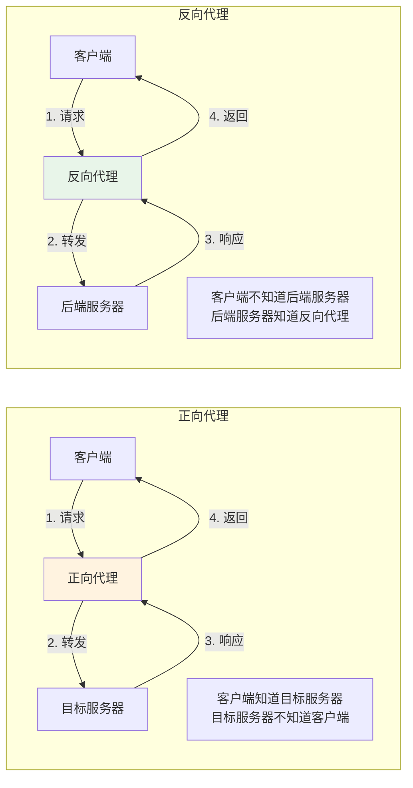
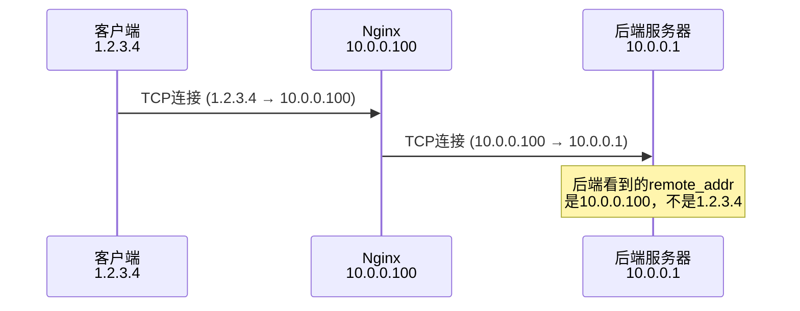
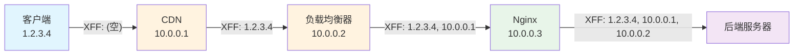
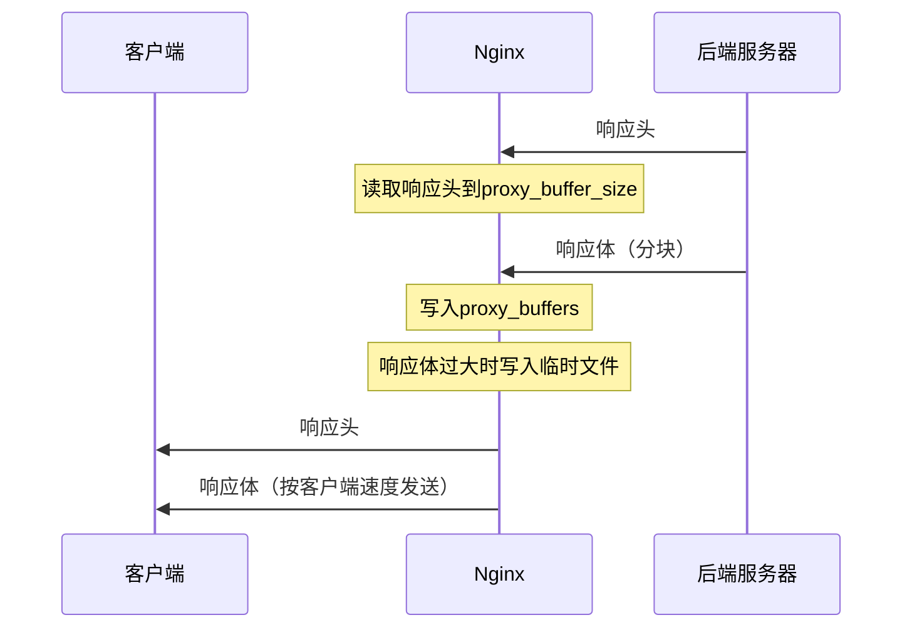
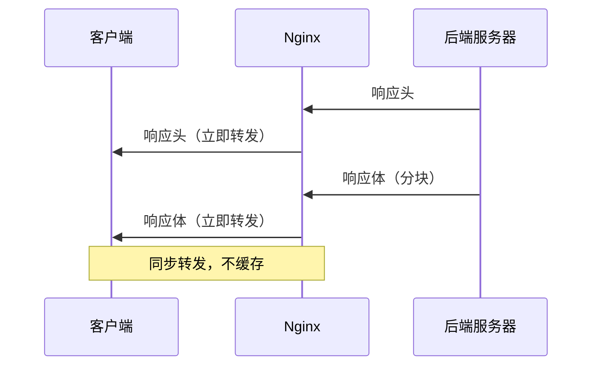
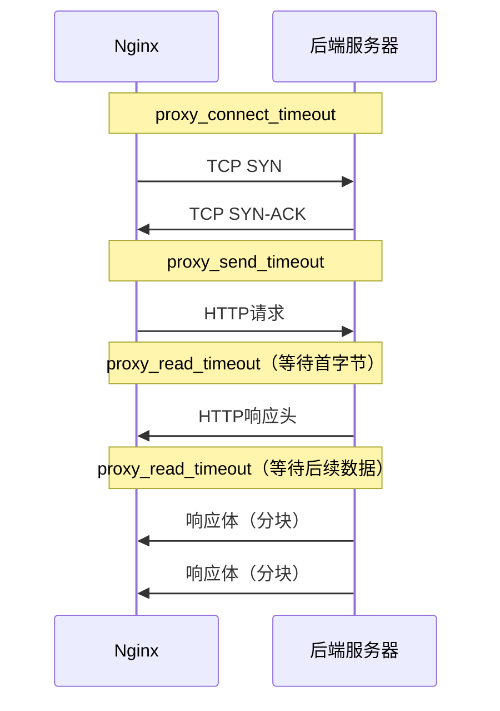

# 反向代理原理与配置

## 概述

反向代理（Reverse Proxy）是 Nginx 最核心的功能之一，也是其在生产环境中使用最广泛的场景。Nginx 作为反向代理服务器，接收客户端的请求，将请求转发给后端服务器，再将后端服务器的响应返回给客户端。客户端只需与代理服务器通信，无需直接访问后端服务器。

反向代理不仅实现了请求转发的功能，还提供了负载均衡、SSL 终端、缓存、压缩、安全防护等附加能力，是现代 Web 架构中不可或缺的组件。

::: important 反向代理的价值
在微服务架构中，Nginx 反向代理承担了 API 网关的职责，统一处理跨域、认证、限流、日志等横切关注点，使后端服务可以专注于业务逻辑。
:::

## 正向代理 vs 反向代理

### 概念对比



### 详细对比

| 特性 | 正向代理 | 反向代理 |
|------|---------|---------|
| 代理对象 | 客户端 | 服务器 |
| 谁配置代理 | 客户端主动配置 | 服务器端配置 |
| 客户端是否知道真实目标 | 是 | 否 |
| 目标是否知道真实客户端 | 否 | 是（通过 X-Forwarded-For） |
| 典型用途 | 翻墙、访问控制、缓存 | 负载均衡、安全防护、SSL 终端 |
| 控制方 | 客户端 | 服务提供方 |
| 例子 | VPN、HTTP 代理 | Nginx、HAProxy、F5 |

### 反向代理的核心作用

1. **负载均衡**：将请求分发到多台后端服务器
2. **SSL 终端**：在代理层处理 HTTPS，后端服务使用 HTTP
3. **安全防护**：隐藏后端服务器 IP，过滤恶意请求
4. **缓存**：缓存后端响应，减轻后端压力
5. **压缩**：在代理层压缩响应，减少带宽
6. **统一入口**：多个服务通过同一入口对外提供服务

## proxy_pass 基本配置

### 最简单的反向代理

```nginx
server {
    listen 80;
    server_name example.com;

    location / {
        proxy_pass http://127.0.0.1:8080;
    }
}
```

这条配置将所有请求转发到 `http://127.0.0.1:8080`。

### 使用 upstream 块

```nginx
upstream backend {
    server 10.0.0.1:8080;
    server 10.0.0.2:8080;
    server 10.0.0.3:8080;
}

server {
    listen 80;
    server_name example.com;

    location / {
        proxy_pass http://backend;
    }
}
```

### proxy_pass 的基本规则

1. `proxy_pass` 指定后端服务器的地址
2. 可以使用 IP:Port、域名、Unix Socket 或 upstream 块名
3. 如果 `proxy_pass` 后面没有 URI，请求的完整 URI 会被传递给后端
4. 如果 `proxy_pass` 后面有 URI，location 匹配的部分会被替换

## proxy_set_header 与头传递

反向代理在转发请求时，需要正确设置 HTTP 头，以便后端服务器获取客户端的真实信息。

### 为什么需要 proxy_set_header

当 Nginx 作为反向代理时，后端服务器看到的请求来源是 Nginx 的 IP，而不是客户端的真实 IP。这是因为 TCP 连接是 Nginx 与后端建立的。



### 核心头配置

```nginx
location / {
    proxy_pass http://backend;

    # 设置 Host 头
    proxy_set_header Host $host;

    # 传递客户端真实 IP
    proxy_set_header X-Real-IP $remote_addr;

    # 传递完整的代理链
    proxy_set_header X-Forwarded-For $proxy_add_x_forwarded_for;

    # 传递原始协议
    proxy_set_header X-Forwarded-Proto $scheme;
}
```

### X-Forwarded-For/X-Real-IP/Host 头详解

#### Host 头

`Host` 头指示请求的目标主机名。默认情况下，`proxy_pass` 会将 `$proxy_host`（即 upstream 名称或 IP:Port）作为 Host 头传递给后端，这可能导致后端的虚拟主机匹配失败。

```nginx
# 默认行为：Host = $proxy_host = backend:8080
proxy_pass http://backend:8080;

# 修改为客户端请求的 Host
proxy_set_header Host $host;

# 或者使用 $http_host（包含端口号）
proxy_set_header Host $http_host;

# 或者使用 server_name
proxy_set_header Host $server_name;
```

| 变量 | 值示例 | 说明 |
|------|--------|------|
| `$proxy_host` | `backend:8080` | upstream 名称或 IP:Port |
| `$host` | `example.com` | 请求行中的 host 或 Host 头（不含端口） |
| `$http_host` | `example.com:443` | 原始 Host 头（含端口） |
| `$server_name` | `example.com` | server_name 指令值 |

::: important Host 头的重要性
如果后端服务器配置了虚拟主机（如 Tomcat、Nginx），它依赖 Host 头来匹配正确的虚拟主机配置。如果 Host 头不正确，请求可能被路由到错误的虚拟主机或返回 404。
:::

#### X-Real-IP 头

`X-Real-IP` 是一个非标准但广泛使用的头，用于传递客户端的真实 IP 地址。

```nginx
proxy_set_header X-Real-IP $remote_addr;
```

后端服务器可以通过读取此头获取客户端的真实 IP。但 `$remote_addr` 只包含最近一层的客户端 IP，如果有多层代理，则需要使用 `X-Forwarded-For`。

#### X-Forwarded-For 头

`X-Forwarded-For`（XFF）是记录代理链的标准头，每经过一个代理，代理会将前一个客户端的 IP 追加到此头。

```nginx
# $proxy_add_x_forwarded_for 会在已有 XFF 头后追加 $remote_addr
proxy_set_header X-Forwarded-For $proxy_add_x_forwarded_for;
```

XFF 头的格式：

```
X-Forwarded-For: client, proxy1, proxy2
```

示例：

```
# 客户端 IP: 1.2.3.4
# 经过 CDN → Nginx → 后端
# 后端收到的头：
X-Forwarded-For: 1.2.3.4, 10.0.0.100
# 第一个 IP 是客户端真实 IP，后续是代理服务器 IP
```

::: warning X-Forwarded-For 的安全风险
XFF 头可以被客户端伪造。如果直接信任 XFF 头的第一个 IP，可能被攻击者欺骗。在生产环境中，应使用 `set_real_ip_from` 和 `real_ip_header` 指令从受信任的代理开始解析真实 IP。
:::

#### X-Forwarded-Proto 头

`X-Forwarded-Proto` 记录客户端使用的原始协议（HTTP 或 HTTPS）。

```nginx
proxy_set_header X-Forwarded-Proto $scheme;
```

后端服务器可以根据此头判断原始请求是否为 HTTPS，用于生成正确的重定向 URL。

#### X-Forwarded-Host 头

```nginx
proxy_set_header X-Forwarded-Host $host;
```

#### 完整的头传递配置

```nginx
location / {
    proxy_pass http://backend;

    # 核心头
    proxy_set_header Host $host;
    proxy_set_header X-Real-IP $remote_addr;
    proxy_set_header X-Forwarded-For $proxy_add_x_forwarded_for;
    proxy_set_header X-Forwarded-Proto $scheme;
    proxy_set_header X-Forwarded-Host $host;
    proxy_set_header X-Forwarded-Port $server_port;
}
```

### 多层代理场景

当存在多层代理时（如 CDN → 负载均衡器 → Nginx → 后端），每一层都需要正确传递客户端信息：



Nginx 在多层代理中的配置：

```nginx
# 信任的代理 IP
set_real_ip_from 10.0.0.0/8;       # 内网
set_real_ip_from 172.16.0.0/12;     # 内网
set_real_ip_from 10.0.0.1;          # CDN
set_real_ip_from 10.0.0.2;          # 负载均衡器

# 从 XFF 头解析真实 IP
real_ip_header X-Forwarded-For;
real_ip_recursive on;  # 递归解析，排除受信任的代理 IP

location / {
    proxy_pass http://backend;

    proxy_set_header Host $host;
    proxy_set_header X-Real-IP $remote_addr;
    proxy_set_header X-Forwarded-For $proxy_add_x_forwarded_for;
    proxy_set_header X-Forwarded-Proto $scheme;
}
```

## proxy_hide_header / proxy_ignore_headers

### proxy_hide_header

`proxy_hide_header` 用于隐藏后端服务器响应中的指定头，不将其传递给客户端。

```nginx
location / {
    proxy_pass http://backend;

    # 隐藏后端服务器的版本信息
    proxy_hide_header X-Powered-By;
    proxy_hide_header Server;  # 注：Nginx 默认已隐藏上游的 Server 头，此行可省略
    proxy_hide_header X-Application-Context;
}
```

Nginx 默认隐藏以下头：

- `Date`
- `Server`
- `X-Pad`
- `X-Accel-...`（所有 X-Accel 开头的头）

::: tip X-Accel 系列头
Nginx 使用 `X-Accel-` 前缀的头与后端通信，这些头默认不会传递给客户端：
- `X-Accel-Redirect`：内部重定向
- `X-Accel-Limit-Rate`：限速
- `X-Accel-Buffering`：控制缓冲
- `X-Accel-Charset`：字符集
- `X-Accel-Expires`：缓存过期时间
:::

### proxy_ignore_headers

`proxy_ignore_headers` 用于忽略后端服务器响应中的指定头，不处理其语义。

```nginx
location / {
    proxy_pass http://backend;

    # 忽略后端设置的 Cache-Control，由 Nginx 自行控制缓存
    proxy_ignore_headers Cache-Control;
    proxy_ignore_headers Set-Cookie;

    # 自行设置缓存策略
    proxy_cache my_cache;
    proxy_cache_valid 200 302 10m;
}
```

可忽略的头及其影响：

| 头 | 忽略后的影响 |
|----|------------|
| `Cache-Control` | Nginx 不再根据此头决定是否缓存 |
| `Set-Cookie` | Nginx 不会因为此头而跳过缓存 |
| `X-Accel-Limit-Rate` | 忽略后端的限速指令 |
| `X-Accel-Buffering` | 忽略后端的缓冲控制 |
| `X-Accel-Redirect` | 忽略后端的内部重定向 |
| `Vary` | 忽略 Vary 头对缓存的影响 |

## 反向代理与 DNS 解析

### 静态解析 vs 动态解析

当 `proxy_pass` 使用域名时，Nginx 在启动时解析域名并缓存结果。如果域名对应的 IP 发生变化，Nginx 不会自动重新解析，除非重载配置。

```nginx
# 静态解析：启动时解析，之后不再更新
proxy_pass http://backend.example.com:8080;
```

### resolver 指令

`resolver` 指令指定 DNS 服务器，用于动态解析域名。当 `proxy_pass` 使用变量时，Nginx 会在每次请求时使用 resolver 动态解析。

```nginx
server {
    listen 80;

    # 配置 DNS 解析器
    resolver 8.8.8.8 8.8.4.4 valid=30s;
    resolver_timeout 5s;

    set $backend_host "backend.example.com";

    location / {
        # 使用变量时，Nginx 会在每次请求时动态解析
        proxy_pass http://$backend_host:8080;
    }
}
```

### resolver 参数

| 参数 | 说明 |
|------|------|
| `address` | DNS 服务器地址 |
| `valid=time` | DNS 缓存有效期 |
| `ipv6=on/off` | 是否查询 IPv6 地址 |

```nginx
# 常见配置
resolver 8.8.8.8 8.8.4.4 valid=30s ipv6=off;
resolver_timeout 5s;

# 使用内部 DNS
resolver 10.0.0.1 valid=10s;

# Consul DNS
resolver 127.0.0.1:8600 valid=5s;
```

### 动态解析的使用场景

1. **服务发现**：后端服务的 IP 可能动态变化（如 Kubernetes Service、Consul）
2. **蓝绿部署**：通过修改 DNS 记录切换后端服务
3. **多环境**：根据请求参数动态选择后端环境

```nginx
# 服务发现示例
server {
    listen 80;

    resolver 10.0.0.1 valid=10s;

    location / {
        set $service_name "api-service";
        proxy_pass http://$service_name.service.consul:8080;
    }
}

# 动态环境路由
server {
    listen 80;

    resolver 8.8.8.8 valid=30s;

    map $arg_env $backend_host {
        dev     dev-api.example.com;
        staging staging-api.example.com;
        default api.example.com;
    }

    location / {
        proxy_pass http://$backend_host;
    }
}
```

## 代理缓冲

代理缓冲控制 Nginx 如何存储后端服务器的响应，直接影响性能和内存使用。

### proxy_buffering

```nginx
# 开启代理缓冲（默认开启）
proxy_buffering on;

# 关闭代理缓冲
proxy_buffering off;
```

#### 开启缓冲的工作流程



#### 关闭缓冲的工作流程



### 缓冲相关指令

```nginx
location / {
    proxy_pass http://backend;

    # 开启/关闭代理缓冲
    proxy_buffering on;

    # 响应头缓冲区大小（默认 4k/8k）
    proxy_buffer_size 8k;

    # 响应体缓冲区数量和大小（默认 8 个 4k/8k）
    proxy_buffers 8 16k;

    # 忙碌缓冲区数量（默认 proxy_buffers 数量的两倍）
    proxy_busy_buffers_size 32k;

    # 临时文件写入阈值
    proxy_temp_file_write_size 64k;

    # 临时文件目录
    proxy_temp_path /var/cache/nginx/proxy_temp 1 2;
}
```

### 缓冲参数详解

| 参数 | 说明 | 默认值 |
|------|------|--------|
| `proxy_buffering` | 是否缓冲后端响应 | on |
| `proxy_buffer_size` | 响应头缓冲区大小 | 4k/8k |
| `proxy_buffers` | 响应体缓冲区数量和大小 | 8 4k/8k |
| `proxy_busy_buffers_size` | 同时处于忙碌状态的缓冲区总大小 | 2 * proxy_buffer_size |
| `proxy_temp_file_write_size` | 一次写入临时文件的数据量 | 2 * proxy_buffer_size |
| `proxy_max_temp_file_size` | 临时文件最大大小 | 1024m |
| `proxy_temp_path` | 临时文件目录 | proxy_temp |

### 缓冲配置建议

#### API 服务（小响应）

```nginx
location /api/ {
    proxy_pass http://api_backend;

    proxy_buffering on;
    proxy_buffer_size 8k;
    proxy_buffers 16 8k;
}
```

#### 大文件下载

```nginx
location /download/ {
    proxy_pass http://download_backend;

    # 关闭缓冲，流式传输
    proxy_buffering off;

    # 或者增大缓冲区
    proxy_buffer_size 16k;
    proxy_buffers 4 256k;
    proxy_busy_buffers_size 512k;
}
```

#### SSE / 流式响应

```nginx
location /events/ {
    proxy_pass http://backend;

    # SSE 必须关闭缓冲
    proxy_buffering off;
    proxy_cache off;

    # 禁用 gzip
    gzip off;

    # 设置不超时
    proxy_read_timeout 86400s;
}
```

::: important 何时关闭代理缓冲
以下场景应关闭代理缓冲（`proxy_buffering off`）：
1. **SSE（Server-Sent Events）**：需要实时推送数据
2. **WebSocket**：长连接双向通信
3. **大文件下载**：避免 Nginx 缓存整个文件
4. **流式响应**：视频流、实时日志等
5. **长轮询**：响应可能延迟很长时间
:::

### X-Accel-Buffering 头

后端服务器可以通过 `X-Accel-Buffering` 头控制 Nginx 的缓冲行为：

```nginx
# 后端响应头
X-Accel-Buffering: no   # 关闭缓冲
X-Accel-Buffering: yes  # 开启缓冲
```

```python
# Python Flask 示例
@app.route('/stream')
def stream():
    response = Response(generate(), mimetype='text/event-stream')
    response.headers['X-Accel-Buffering'] = 'no'
    return response
```

## 代理超时

代理超时控制 Nginx 在与后端服务器通信时等待的最长时间。

### 超时相关指令

```nginx
location / {
    proxy_pass http://backend;

    # 与后端建立连接的超时
    proxy_connect_timeout 60s;

    # 向后端发送请求的超时
    proxy_send_timeout 60s;

    # 从后端读取响应的超时
    proxy_read_timeout 60s;
}
```

### 超时详解



| 超时 | 说明 | 默认值 | 触发场景 |
|------|------|--------|---------|
| `proxy_connect_timeout` | 与后端建立 TCP 连接的超时 | 60s | 后端服务器宕机、网络不通 |
| `proxy_send_timeout` | 两次向后端写操作之间的超时 | 60s | 客户端上传数据过慢 |
| `proxy_read_timeout` | 两次从后端读操作之间的超时 | 60s | 后端处理过慢、长轮询 |

### 不同场景的超时配置

#### 普通 API 服务

```nginx
location /api/ {
    proxy_pass http://api_backend;
    proxy_connect_timeout 10s;
    proxy_send_timeout 30s;
    proxy_read_timeout 30s;
}
```

#### 长时间处理请求

```nginx
location /api/report/ {
    proxy_pass http://report_backend;
    proxy_connect_timeout 10s;
    proxy_send_timeout 60s;
    proxy_read_timeout 300s;  # 报表生成可能需要5分钟
}
```

#### SSE / 长轮询

```nginx
location /events/ {
    proxy_pass http://backend;
    proxy_connect_timeout 10s;
    proxy_send_timeout 60s;
    proxy_read_timeout 86400s;  # SSE 连接可能持续一整天
    proxy_buffering off;
}
```

#### 文件上传

```nginx
location /upload/ {
    proxy_pass http://upload_backend;
    proxy_connect_timeout 10s;
    proxy_send_timeout 300s;   # 大文件上传可能需要较长时间
    proxy_read_timeout 60s;
    client_max_body_size 500m;
}
```

### 超时错误处理

```nginx
location /api/ {
    proxy_pass http://api_backend;
    proxy_connect_timeout 10s;
    proxy_send_timeout 30s;
    proxy_read_timeout 30s;

    # 超时错误页面
    error_page 504 /504.html;

    # 或者使用命名 location
    error_page 504 = @timeout_fallback;
}

location @timeout_fallback {
    return 504 '{"error": "Gateway timeout", "code": 504}';
    add_header Content-Type application/json always;
}
```

## 实战：Nginx 反向代理 Node.js/Java/Go 服务

### 代理 Node.js 服务

```nginx
upstream nodejs_backend {
    server 127.0.0.1:3000;
    keepalive 32;
}

server {
    listen 443 ssl http2;
    server_name app.example.com;

    ssl_certificate /etc/nginx/ssl/example.com.crt;
    ssl_certificate_key /etc/nginx/ssl/example.com.key;

    # Node.js 应用通常使用 Express/Koa
    location / {
        proxy_pass http://nodejs_backend;
        proxy_http_version 1.1;
        proxy_set_header Upgrade $http_upgrade;
        proxy_set_header Connection "upgrade";
        proxy_set_header Host $host;
        proxy_set_header X-Real-IP $remote_addr;
        proxy_set_header X-Forwarded-For $proxy_add_x_forwarded_for;
        proxy_set_header X-Forwarded-Proto $scheme;

        # 超时配置
        proxy_connect_timeout 10s;
        proxy_send_timeout 30s;
        proxy_read_timeout 30s;
    }

    # Socket.IO WebSocket
    location /socket.io/ {
        proxy_pass http://nodejs_backend;
        proxy_http_version 1.1;
        proxy_set_header Upgrade $http_upgrade;
        proxy_set_header Connection "upgrade";
        proxy_set_header Host $host;
        proxy_set_header X-Real-IP $remote_addr;

        # WebSocket 长连接超时
        proxy_read_timeout 86400s;
    }

    access_log /var/log/nginx/nodejs_access.log;
}
```

### 代理 Java/Spring Boot 服务

```nginx
upstream java_backend {
    server 127.0.0.1:8080;
    server 127.0.0.1:8081;
    keepalive 32;
}

server {
    listen 443 ssl http2;
    server_name api.example.com;

    ssl_certificate /etc/nginx/ssl/example.com.crt;
    ssl_certificate_key /etc/nginx/ssl/example.com.key;

    location / {
        proxy_pass http://java_backend;
        proxy_http_version 1.1;
        proxy_set_header Connection "";
        proxy_set_header Host $host;
        proxy_set_header X-Real-IP $remote_addr;
        proxy_set_header X-Forwarded-For $proxy_add_x_forwarded_for;
        proxy_set_header X-Forwarded-Proto $scheme;

        # Spring Boot 常用配置
        proxy_set_header X-Request-ID $request_id;

        # 超时配置
        proxy_connect_timeout 10s;
        proxy_send_timeout 30s;
        proxy_read_timeout 60s;

        # 缓冲配置
        proxy_buffer_size 16k;
        proxy_buffers 8 16k;
    }

    # Actuator 健康检查
    location /actuator/health {
        proxy_pass http://java_backend;
        proxy_http_version 1.1;
        proxy_set_header Connection "";
        access_log off;
    }

    access_log /var/log/nginx/java_access.log;
}
```

### 代理 Go 服务

```nginx
upstream go_backend {
    server 127.0.0.1:9000;
    keepalive 64;
}

server {
    listen 443 ssl http2;
    server_name api.example.com;

    ssl_certificate /etc/nginx/ssl/example.com.crt;
    ssl_certificate_key /etc/nginx/ssl/example.com.key;

    # 限流
    limit_req zone=api_limit burst=100 nodelay;

    location / {
        proxy_pass http://go_backend;
        proxy_http_version 1.1;
        proxy_set_header Connection "";
        proxy_set_header Host $host;
        proxy_set_header X-Real-IP $remote_addr;
        proxy_set_header X-Forwarded-For $proxy_add_x_forwarded_for;
        proxy_set_header X-Forwarded-Proto $scheme;
        proxy_set_header X-Request-ID $request_id;

        # Go 服务通常响应快，但需要较长的连接超时
        proxy_connect_timeout 5s;
        proxy_send_timeout 15s;
        proxy_read_timeout 15s;

        # Go gRPC 网关可能返回较大响应
        proxy_buffer_size 16k;
        proxy_buffers 8 32k;
    }

    # gRPC 代理（如果 Go 服务提供 gRPC）
    location /grpc/ {
        grpc_pass grpc://go_backend:9001;
        grpc_set_header X-Real-IP $remote_addr;
    }

    access_log /var/log/nginx/go_access.log;
}
```

### 多服务统一代理配置

```nginx
# 共享配置片段
# /etc/nginx/snippets/proxy-params.conf

proxy_http_version 1.1;
proxy_set_header Connection "";
proxy_set_header Host $host;
proxy_set_header X-Real-IP $remote_addr;
proxy_set_header X-Forwarded-For $proxy_add_x_forwarded_for;
proxy_set_header X-Forwarded-Proto $scheme;
proxy_set_header X-Request-ID $request_id;

proxy_connect_timeout 10s;
proxy_send_timeout 30s;
proxy_read_timeout 30s;

proxy_buffer_size 16k;
proxy_buffers 8 16k;
```

```nginx
# 各服务配置
server {
    listen 443 ssl http2;
    server_name api.example.com;

    ssl_certificate /etc/nginx/ssl/example.com.crt;
    ssl_certificate_key /etc/nginx/ssl/example.com.key;

    location /users/ {
        proxy_pass http://user_service;
        include snippets/proxy-params.conf;
    }

    location /orders/ {
        proxy_pass http://order_service;
        include snippets/proxy-params.conf;
    }

    location /products/ {
        proxy_pass http://product_service;
        include snippets/proxy-params.conf;
    }
}
```

## 代理安全配置

### 隐藏敏感信息

```nginx
location / {
    proxy_pass http://backend;

    # 隐藏后端服务器的信息
    proxy_hide_header X-Powered-By;
    proxy_hide_header Server;  # 注：Nginx 默认已隐藏上游的 Server 头，此行可省略
    proxy_hide_header X-Application-Context;
    proxy_hide_header X-AspNet-Version;

    # 隐藏 Nginx 版本
    server_tokens off;
}
```

### 限制后端访问

```nginx
# 只允许 Nginx 访问后端（在后端服务器上配置）
# 后端服务绑定到 127.0.0.1
server {
    listen 127.0.0.1:8080;
    # ...
}
```

### 请求体大小限制

```nginx
location /api/ {
    proxy_pass http://backend;

    # 限制请求体大小
    client_max_body_size 10m;
}
```

### 响应头安全加固

```nginx
location / {
    proxy_pass http://backend;

    # 安全头
    add_header X-Frame-Options "SAMEORIGIN" always;
    add_header X-Content-Type-Options "nosniff" always;
    add_header X-XSS-Protection "0" always;
    add_header Referrer-Policy "strict-origin-when-cross-origin" always;
    add_header Content-Security-Policy "default-src 'self'" always;
}
```

## 代理配置排查

### 常见问题

#### 问题 1：502 Bad Gateway

**原因**：Nginx 无法连接到后端服务器

**排查**：

```bash
# 检查后端服务是否运行
curl http://127.0.0.1:8080/health

# 检查端口是否监听
ss -tlnp | grep 8080

# 检查防火墙
sudo iptables -L -n | grep 8080

# 检查 SELinux
getenforce
```

#### 问题 2：504 Gateway Timeout

**原因**：后端服务器处理超时

**排查**：

```bash
# 增大超时时间
proxy_read_timeout 300s;

# 检查后端处理时间
curl -o /dev/null -w "time_total: %{time_total}\n" http://backend/api/slow
```

#### 问题 3：后端获取不到客户端真实 IP

**原因**：未配置 `proxy_set_header`

**排查**：

```nginx
# 确保配置了以下头
proxy_set_header X-Real-IP $remote_addr;
proxy_set_header X-Forwarded-For $proxy_add_x_forwarded_for;
```

#### 问题 4：WebSocket 连接失败

**原因**：缺少 Upgrade/Connection 头配置

```nginx
# WebSocket 必须配置
proxy_http_version 1.1;
proxy_set_header Upgrade $http_upgrade;
proxy_set_header Connection "upgrade";
```

### 调试技巧

```nginx
# 开启详细的错误日志
error_log /var/log/nginx/error.log debug;

# 记录代理相关变量
log_format proxy_debug '$remote_addr - [$time_local] "$request" '
                       '$status $body_bytes_sent '
                       'upstream=$upstream_addr '
                       'upstream_status=$upstream_status '
                       'upstream_time=$upstream_response_time '
                       'connect_time=$upstream_connect_time '
                       'header_time=$upstream_header_time';

access_log /var/log/nginx/proxy_debug.log proxy_debug;
```

## 小结

Nginx 反向代理是现代 Web 架构的核心组件，掌握以下要点是正确配置的基础：

1. **正向 vs 反向代理**：反向代理代理的是服务器端，客户端不知道后端的存在
2. **头传递**：`Host`、`X-Real-IP`、`X-Forwarded-For`、`X-Forwarded-Proto` 是关键头
3. **代理缓冲**：影响性能和实时性，API 服务通常开启缓冲，SSE/WebSocket 必须关闭
4. **代理超时**：`proxy_connect_timeout`、`proxy_send_timeout`、`proxy_read_timeout` 根据场景调整
5. **DNS 解析**：使用变量 + `resolver` 实现动态解析
6. **安全加固**：隐藏后端信息、限制请求大小、添加安全头

::: tip 进一步阅读
- [ngx_http_proxy_module](https://nginx.org/en/docs/http/ngx_http_proxy_module.html)
- [Nginx Reverse Proxy](https://nginx.org/en/docs/http/load_balancing.html)
- [ngx_http_realip_module](https://nginx.org/en/docs/http/ngx_http_realip_module.html)
:::
