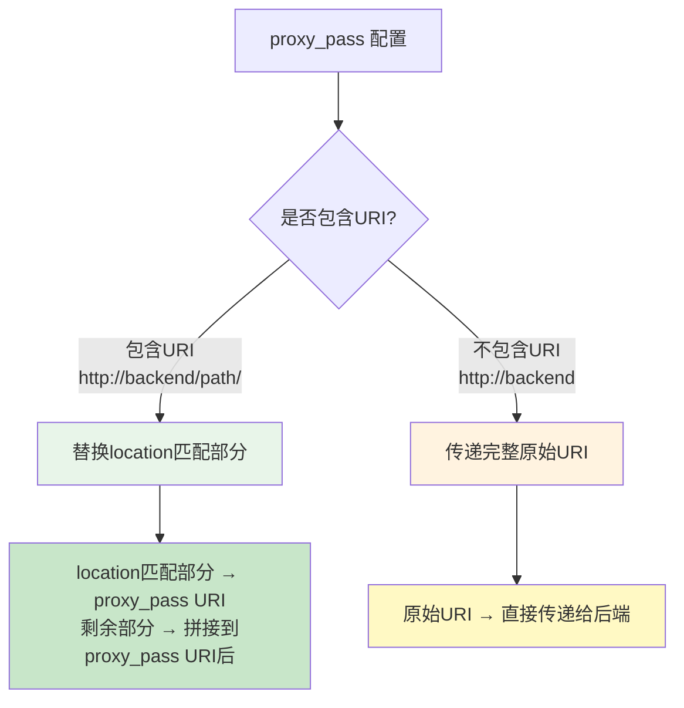
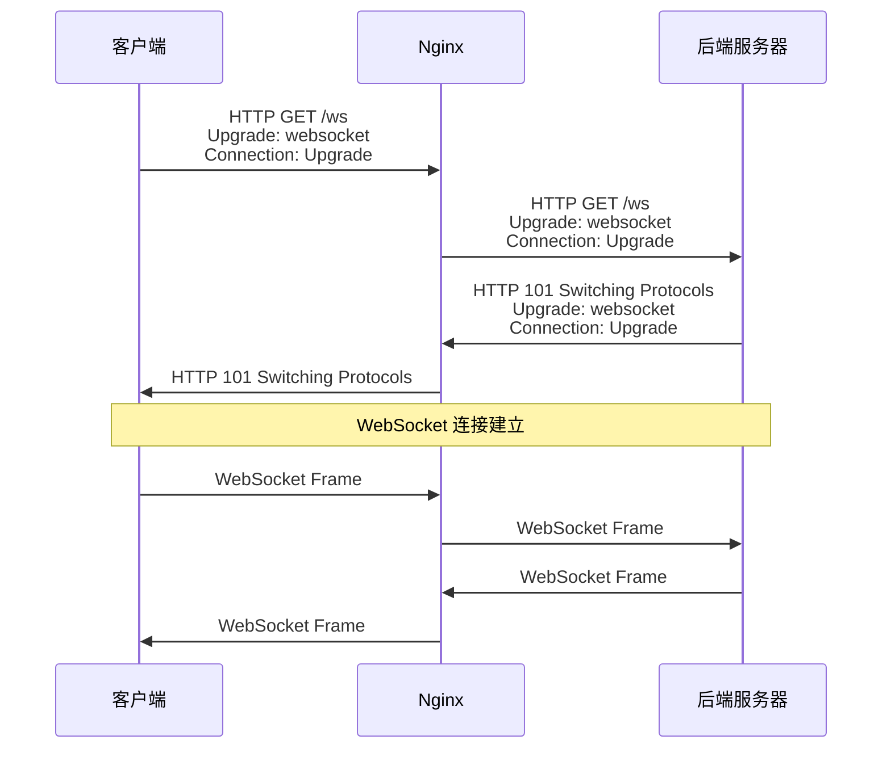
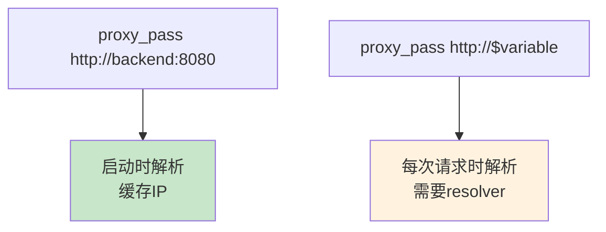

# proxy_pass 详解与路径映射

## 概述

`proxy_pass` 是 Nginx 反向代理最核心的指令，它定义了请求转发的目标地址。然而，`proxy_pass` 的路径映射规则看似简单，实则暗藏玄机——URI 是否带尾部斜杠、是否包含路径、是否使用变量，都会影响最终的请求转发行为。

理解 `proxy_pass` 的路径映射规则，是正确配置反向代理、排查路径问题的关键。

::: important 核心规则
`proxy_pass` 的路径映射核心规则只有一个：**如果 proxy_pass 包含 URI（哪怕只是一个 `/`），location 匹配的部分会被替换；如果 proxy_pass 不包含 URI，完整的原始 URI 会被直接传递给后端。**
:::

## proxy_pass URI 规则

### 带 URI vs 不带 URI



### 不带 URI 的 proxy_pass

当 `proxy_pass` 只指定了地址（IP:Port 或 upstream 名称），没有路径部分时，请求的完整 URI 会直接传递给后端。

```nginx
location /api/ {
    proxy_pass http://backend;
}

# 请求 /api/users → 后端收到 /api/users
# 请求 /api/users?id=1 → 后端收到 /api/users?id=1
# 请求 /api/ → 后端收到 /api/
```

### 带 URI 的 proxy_pass

当 `proxy_pass` 包含路径部分时，Nginx 会将 location 匹配的部分替换为 proxy_pass 中的路径。

```nginx
location /api/ {
    proxy_pass http://backend/v2/;
}

# 请求 /api/users → location匹配 /api/ → 剩余 users → 后端收到 /v2/users
# 请求 /api/ → location匹配 /api/ → 剩余（空） → 后端收到 /v2/
# 请求 /api/users?id=1 → location匹配 /api/ → 剩余 users?id=1 → 后端收到 /v2/users?id=1
```

替换规则详解：

1. Nginx 确定 location 匹配的前缀（如 `/api/`）
2. 将请求 URI 中匹配的部分替换为 proxy_pass 的 URI（如 `/v2/`）
3. 剩余部分保持不变，拼接到结果后面

## 尾部斜杠的影响

尾部斜杠是 `proxy_pass` 配置中最容易出错的细节之一。

### 详细对比表

```nginx
# 配置 1：不带 URI
location /api/ {
    proxy_pass http://backend;
}
# /api/users → http://backend/api/users

# 配置 2：带尾部斜杠
location /api/ {
    proxy_pass http://backend/;
}
# /api/users → http://backend/users

# 配置 3：不带尾部斜杠
location /api/ {
    proxy_pass http://backend/v2;
}
# /api/users → http://backend/v2users  ⚠️ 注意：没有斜杠分隔！

# 配置 4：带路径和尾部斜杠
location /api/ {
    proxy_pass http://backend/v2/;
}
# /api/users → http://backend/v2/users
```

### 尾部斜杠完整示例

| location | proxy_pass | 请求 URI | 后端收到的 URI |
|----------|-----------|---------|--------------|
| `/api/` | `http://backend` | `/api/users` | `/api/users` |
| `/api/` | `http://backend/` | `/api/users` | `/users` |
| `/api/` | `http://backend/v2` | `/api/users` | `/v2users` ⚠️ |
| `/api/` | `http://backend/v2/` | `/api/users` | `/v2/users` |
| `/api` | `http://backend` | `/api/users` | `/api/users` |
| `/api` | `http://backend/` | `/api/users` | `//users` ⚠️ |
| `/` | `http://backend` | `/api/users` | `/api/users` |
| `/` | `http://backend/` | `/api/users` | `/api/users` |

::: warning 配置 3 的陷阱
当 `proxy_pass` 的 URI 不以 `/` 结尾时（如 `http://backend/v2`），location 匹配的部分会被替换为 `/v2`，剩余部分直接拼接，导致路径粘在一起：`/v2users` 而不是 `/v2/users`。

这通常不是期望的行为。要么使用 `http://backend/v2/`（带尾部斜杠），要么使用 `http://backend`（不带 URI）配合 `rewrite`。
:::

::: warning location 无尾部斜杠 + proxy_pass 有尾部斜杠的陷阱
当 `location /api`（无尾部斜杠）与 `proxy_pass http://backend/`（有尾部斜杠）组合时，location 匹配的部分 `/api` 被替换为 `/`，剩余部分 `users` 直接拼接，结果为 `//users`（双斜杠），而不是 `/users`。这是因为 `location /api` 匹配 `/api/users` 时，替换后的前缀 `/` 和剩余路径 `users` 之间缺少分隔。

要正确去掉前缀，应使用 `location /api/`（带尾部斜杠）配合 `proxy_pass http://backend/`。
:::

### 各种路径映射场景

#### 场景 1：去掉前缀

```nginx
# 将 /api/ 前缀去掉后转发给后端
location /api/ {
    proxy_pass http://backend/;
    # /api/users → /users
}
```

#### 场景 2：添加版本前缀

```nginx
# 将 /api/ 前缀替换为 /v2/
location /api/ {
    proxy_pass http://backend/v2/;
    # /api/users → /v2/users
}
```

#### 场景 3：保留完整路径

```nginx
# 保留完整 URI 传递给后端
location /api/ {
    proxy_pass http://backend;
    # /api/users → /api/users
}
```

#### 场景 4：精确匹配

```nginx
# 精确匹配 /api，重定向到后端根路径
location = /api {
    proxy_pass http://backend/;
    # /api → /
}

# 精确匹配 /api，保持路径
location = /api {
    proxy_pass http://backend;
    # /api → /api
}
```

#### 场景 5：正则 location

```nginx
# 正则 location 中 proxy_pass 不能带 URI！
location ~ ^/api/(.*)$ {
    proxy_pass http://backend/$1;
    # /api/users → /users
    # 必须使用 $1 手动构建 URI
}

# 或者使用 rewrite
location ~ ^/api/(.*)$ {
    rewrite ^/api/(.*)$ /$1 break;
    proxy_pass http://backend;
    # /api/users → /users
}
```

::: important 正则 location 中的 proxy_pass
当 `location` 使用正则表达式（`~` 或 `~*`）时，`proxy_pass` 不能包含 URI 部分。如果需要在正则 location 中修改 URI，必须使用 `rewrite` 指令。

```nginx
# 错误：正则 location 中 proxy_pass 不能带 URI
location ~ ^/api/ {
    proxy_pass http://backend/v2/;  # 启动时报错！
}

# 正确方式 1：使用变量
location ~ ^/api/(.*)$ {
    proxy_pass http://backend/$1;
}

# 正确方式 2：使用 rewrite
location ~ ^/api/ {
    rewrite ^/api/(.*)$ /$1 break;
    proxy_pass http://backend;
}
```
:::

## location 匹配与 proxy_pass URI 组合

### 完整组合矩阵

```nginx
# ===== 前缀 location =====

# 1. 前缀 + 不带URI
location /prefix/ {
    proxy_pass http://backend;
    # /prefix/path → /prefix/path
}

# 2. 前缀 + 带URI（尾部斜杠）
location /prefix/ {
    proxy_pass http://backend/new/;
    # /prefix/path → /new/path
}

# 3. 前缀 + 带URI（无尾部斜杠）
location /prefix/ {
    proxy_pass http://backend/new;
    # /prefix/path → /newpath ⚠️
}

# 4. 前缀 + 带URI（路径段）
location /prefix/ {
    proxy_pass http://backend/a/b/c/;
    # /prefix/path → /a/b/c/path
}

# ===== 精确 location =====

# 5. 精确 + 不带URI
location = /exact {
    proxy_pass http://backend;
    # /exact → /exact
}

# 6. 精确 + 带URI
location = /exact {
    proxy_pass http://backend/target;
    # /exact → /target
}

# ===== 正则 location =====

# 7. 正则 + 不带URI（只能这样）
location ~ ^/api/(.+)$ {
    proxy_pass http://backend;
    # /api/path → /api/path（完整URI传递）
}

# 8. 正则 + 使用变量
location ~ ^/api/(.+)$ {
    proxy_pass http://backend/$1;
    # /api/path → /path
}
```

### 复杂路径映射实战

#### 微服务 API 网关

```nginx
# 不同路径路由到不同的微服务
upstream user_service {
    server 10.0.0.1:8080;
}

upstream order_service {
    server 10.0.0.2:8080;
}

upstream product_service {
    server 10.0.0.3:8080;
}

server {
    listen 443 ssl http2;
    server_name api.example.com;

    # 用户服务：去掉 /users 前缀
    location /users/ {
        proxy_pass http://user_service/;
        # /users/123 → user_service:8080/123
        # /users/123/orders → user_service:8080/123/orders
    }

    # 订单服务：去掉 /orders 前缀
    location /orders/ {
        proxy_pass http://order_service/;
        # /orders/456 → order_service:8080/456
    }

    # 商品服务：保留完整路径
    location /products/ {
        proxy_pass http://product_service;
        # /products/789 → product_service:8080/products/789
    }

    # 通用代理
    location / {
        proxy_pass http://user_service;
        proxy_set_header Host $host;
        proxy_set_header X-Real-IP $remote_addr;
        proxy_set_header X-Forwarded-For $proxy_add_x_forwarded_for;
    }
}
```

#### 旧 API 迁移到新路径

```nginx
server {
    listen 80;
    server_name api.example.com;

    # 旧 API 路径映射到新后端
    location /legacy/v1/users/ {
        proxy_pass http://new_backend/api/v2/users/;
        # /legacy/v1/users/123 → /api/v2/users/123
    }

    location /legacy/v1/orders/ {
        proxy_pass http://new_backend/api/v2/orders/;
        # /legacy/v1/orders/456 → /api/v2/orders/456
    }

    # 新 API 直接代理
    location /api/ {
        proxy_pass http://new_backend/api/;
    }
}
```

## WebSocket 代理配置

WebSocket 协议需要 HTTP 升级机制，`proxy_pass` 需要特殊配置。

### WebSocket 工作原理



### 基本 WebSocket 代理

```nginx
location /ws/ {
    proxy_pass http://backend;

    # 必须配置
    proxy_http_version 1.1;
    proxy_set_header Upgrade $http_upgrade;
    proxy_set_header Connection "upgrade";

    # 常规头
    proxy_set_header Host $host;
    proxy_set_header X-Real-IP $remote_addr;
    proxy_set_header X-Forwarded-For $proxy_add_x_forwarded_for;

    # 超时配置（WebSocket 长连接）
    proxy_read_timeout 86400s;
    proxy_send_timeout 86400s;
}
```

### map 实现 HTTP/WebSocket 自动升级

```nginx
# 根据 Upgrade 头自动设置 Connection
map $http_upgrade $connection_upgrade {
    default upgrade;
    ''      close;
}

server {
    listen 80;

    location / {
        proxy_pass http://backend;
        proxy_http_version 1.1;
        proxy_set_header Upgrade $http_upgrade;
        proxy_set_header Connection $connection_upgrade;
        proxy_set_header Host $host;
    }
}
```

::: important WebSocket 代理的必要配置
1. **`proxy_http_version 1.1`**：WebSocket 需要 HTTP/1.1
2. **`proxy_set_header Upgrade $http_upgrade`**：传递 Upgrade 头
3. **`proxy_set_header Connection "upgrade"`**：设置 Connection 头
4. **`proxy_read_timeout 86400s`**：WebSocket 连接可能持续很长时间

缺少任何一项，WebSocket 连接都无法正常建立。
:::

### Socket.IO 代理

```nginx
location /socket.io/ {
    proxy_pass http://nodejs_backend;

    proxy_http_version 1.1;
    proxy_set_header Upgrade $http_upgrade;
    proxy_set_header Connection "upgrade";

    proxy_set_header Host $host;
    proxy_set_header X-Real-IP $remote_addr;
    proxy_set_header X-Forwarded-For $proxy_add_x_forwarded_for;

    # Socket.IO 可能先尝试长轮询，再升级到 WebSocket
    proxy_read_timeout 86400s;
    proxy_send_timeout 86400s;
}
```

### SockJS 代理

```nginx
location /sockjs/ {
    proxy_pass http://backend;

    proxy_http_version 1.1;
    proxy_set_header Upgrade $http_upgrade;
    proxy_set_header Connection $connection_upgrade;

    proxy_set_header Host $host;
    proxy_set_header X-Real-IP $remote_addr;

    # SockJS 可能使用多种传输方式
    proxy_read_timeout 3600s;
    proxy_send_timeout 3600s;

    # 关闭缓冲，确保实时性
    proxy_buffering off;
}
```

## Server-Sent Events (SSE) 代理

SSE 是一种服务器向客户端单向推送数据的机制，代理配置与普通 HTTP 有很大差异。

### SSE 的特殊要求

1. **关闭代理缓冲**：否则 Nginx 会缓存整个响应
2. **禁用 gzip**：压缩会导致数据分块，影响实时性
3. **设置长超时**：SSE 连接可能持续很长时间

### SSE 代理配置

```nginx
location /events/ {
    proxy_pass http://backend;

    # 关闭代理缓冲（必须！）
    proxy_buffering off;

    # 关闭缓存
    proxy_cache off;

    # 禁用 gzip
    gzip off;

    # 设置长超时
    proxy_read_timeout 86400s;

    # 确保不缓冲
    proxy_set_header Connection '';
    proxy_http_version 1.1;

    # 关闭 Nginx 的分块编码
    chunked_transfer_encoding off;
}
```

::: warning SSE 缓冲问题
如果不关闭 `proxy_buffering`，Nginx 会等待后端发送完整响应后才转发给客户端。对于 SSE 这种持续推送数据的场景，客户端将收不到任何数据。

关闭缓冲的三种方式：
1. `proxy_buffering off;` — Nginx 配置
2. 后端设置 `X-Accel-Buffering: no` 头 — 后端代码
3. `proxy_set_header Connection ''; proxy_http_version 1.1;` — 确保 HTTP/1.1
:::

### SSE 完整配置示例

```nginx
# upstream
upstream sse_backend {
    server 127.0.0.1:4000;
    keepalive 8;
}

server {
    listen 443 ssl http2;
    server_name events.example.com;

    ssl_certificate /etc/nginx/ssl/example.com.crt;
    ssl_certificate_key /etc/nginx/ssl/example.com.key;

    # SSE 端点
    location /stream {
        proxy_pass http://sse_backend;

        # 关闭所有缓冲
        proxy_buffering off;
        proxy_cache off;

        # HTTP/1.1 + 禁用分块编码
        proxy_http_version 1.1;
        proxy_set_header Connection '';
        chunked_transfer_encoding off;

        # 禁用 gzip
        gzip off;

        # 长超时
        proxy_connect_timeout 10s;
        proxy_read_timeout 86400s;

        # 通用头
        proxy_set_header Host $host;
        proxy_set_header X-Real-IP $remote_addr;
        proxy_set_header X-Forwarded-For $proxy_add_x_forwarded_for;

        # SSE 特定头
        proxy_set_header Accept "text/event-stream";
    }
}
```

## proxy_pass 与变量

当 `proxy_pass` 使用变量时，Nginx 的行为会发生显著变化。

### 使用变量的 proxy_pass

```nginx
# 使用变量
location /api/ {
    set $backend_host "api.backend.example.com";
    proxy_pass http://$backend_host;
}
```

### 变量 proxy_pass 的特殊行为

1. **需要 resolver**：使用变量时，Nginx 需要配置 `resolver` 指令进行 DNS 解析
2. **动态解析**：每次请求都会动态解析域名（而不是启动时解析一次）
3. **可以带 URI**：自 Nginx 1.7.5 起，变量可以与 URI 组合使用（如 `proxy_pass http://$backend/v2/`）。在更早版本中，变量与 URI 组合会导致配置错误

```nginx
# 需要 resolver
server {
    listen 80;

    resolver 8.8.8.8 8.8.4.4 valid=30s;
    resolver_timeout 5s;

    location /api/ {
        set $backend "api.backend.example.com";
        proxy_pass http://$backend;
        # 传递完整 URI：/api/users
    }
}
```

### 变量 + URI

```nginx
# 变量 + 路径（可以使用变量构建完整 URL）
location /api/ {
    set $backend "api.backend.example.com";
    proxy_pass http://$backend/v2/;
    # /api/users → /v2/users
}
```

### 动态 upstream 选择

```nginx
# 使用 map 动态选择 upstream
map $http_x_api_version $api_backend {
    "v2"     v2_backend;
    "v1"     v1_backend;
    default  v1_backend;
}

upstream v1_backend {
    server 10.0.0.1:8080;
}

upstream v2_backend {
    server 10.0.0.2:8080;
}

server {
    listen 80;

    location /api/ {
        proxy_pass http://$api_backend;
        proxy_set_header Host $host;
    }
}
```

### 基于请求参数的动态路由

```nginx
map $arg_env $env_backend {
    dev     dev.example.com;
    staging staging.example.com;
    prod    prod.example.com;
    default prod.example.com;
}

server {
    listen 80;

    resolver 8.8.8.8 valid=30s;

    location /api/ {
        proxy_pass http://$env_backend;
        proxy_set_header Host $host;
    }
}

# 请求：/api/users?env=dev → dev.example.com
# 请求：/api/users?env=staging → staging.example.com
# 请求：/api/users → prod.example.com
```

## proxy_pass 与 DNS 解析：resolver 指令

### 为什么需要 resolver

当 `proxy_pass` 使用域名时：

- **不使用变量**：Nginx 启动时解析域名，缓存结果直到重载
- **使用变量**：Nginx 每次请求时动态解析域名，需要 `resolver` 指定 DNS 服务器



### resolver 配置

```nginx
# 基本配置
resolver 8.8.8.8 8.8.4.4;

# 带参数
resolver 8.8.8.8 8.8.4.4 valid=30s ipv6=off;
resolver_timeout 5s;
```

| 参数 | 说明 |
|------|------|
| `address` | DNS 服务器地址，可指定多个 |
| `valid=time` | DNS 缓存有效期，默认由 DNS 响应的 TTL 决定 |
| `ipv6=on/off` | 是否查询 IPv6 地址 |

### resolver 的使用场景

#### 场景 1：Kubernetes 服务发现

```nginx
server {
    listen 80;

    # 使用 Kubernetes DNS
    resolver kube-dns.kube-system.svc.cluster.local valid=5s;

    location /api/ {
        set $backend "api-service.default.svc.cluster.local";
        proxy_pass http://$backend:8080;
    }
}
```

#### 场景 2：Consul 服务发现

```nginx
server {
    listen 80;

    # 使用 Consul DNS
    resolver 127.0.0.1:8600 valid=5s;

    location /api/ {
        set $backend "api.service.consul";
        proxy_pass http://$backend:8080;
    }
}
```

#### 场景 3：DNS 轮询负载均衡

```nginx
server {
    listen 80;

    resolver 8.8.8.8 valid=10s;

    location / {
        proxy_pass http://backend.example.com;
        # 如果 backend.example.com 解析到多个 IP，Nginx 会在它们之间轮询
    }
}
```

### resolver 的注意事项

::: warning resolver 使用注意
1. `resolver` 仅在 `proxy_pass` 使用变量时生效
2. DNS 解析失败会导致请求返回 502
3. `valid` 时间过短会增加 DNS 查询频率，影响性能
4. 建议使用内网 DNS 服务器，避免对公共 DNS 的依赖
5. 在 Kubernetes 中，推荐使用 Service 名称而不是 Pod IP
:::

## 路径重写与 proxy_pass 配合

### 使用 rewrite 修改路径

```nginx
# 方式 1：rewrite + break + proxy_pass（不带 URI）
location /api/ {
    rewrite ^/api/(.*)$ /v2/$1 break;
    proxy_pass http://backend;
    # /api/users → /v2/users
}

# 方式 2：proxy_pass 带 URI
location /api/ {
    proxy_pass http://backend/v2/;
    # /api/users → /v2/users
}
```

### rewrite break 与 proxy_pass URI 的交互

```nginx
# rewrite break 后，proxy_pass 的 URI 拼接规则会改变
location /api/ {
    rewrite ^/api/v1/(.*)$ /v2/$1 break;
    proxy_pass http://backend/;
    # /api/v1/users → rewrite → /v2/users → proxy_pass → http://backend/v2/users
    # 注意：break 后的 URI 会替换 proxy_pass URI 的路径部分
}

# 推荐：rewrite break + proxy_pass（不带 URI）
location /api/ {
    rewrite ^/api/v1/(.*)$ /v2/$1 break;
    proxy_pass http://backend;
    # /api/v1/users → rewrite → /v2/users → proxy_pass → http://backend/v2/users
}
```

### 复杂路径重写场景

#### API 版本路由

```nginx
# 不同版本的 API 路由到不同的后端
map $uri $api_version {
    ~^/api/v1/  v1;
    ~^/api/v2/  v2;
    default     v2;
}

location /api/ {
    rewrite ^/api/v[0-9]+/(.*)$ /$1 break;
    proxy_pass http://$api_version_backend;
}
```

#### 多语言站点路径重写

```nginx
# /en/about → /about?lang=en
location ~ ^/(en|zh|ja)/(.*)$ {
    set $lang $1;
    rewrite ^/[a-z]{2}/(.*)$ /$2?lang=$lang break;
    proxy_pass http://backend;
}
```

#### RESTful API 路径规范化

```nginx
# 将 /user/123 转换为 /users?id=123
location ~ ^/user/(\d+)$ {
    rewrite ^/user/(\d+)$ /users?id=$1 break;
    proxy_pass http://backend;
}
```

## proxy_pass 常见问题与排查

### 问题 1：路径粘在一起

```nginx
# 错误配置
location /api/ {
    proxy_pass http://backend/v2;
    # /api/users → /v2users ⚠️
}

# 正确配置
location /api/ {
    proxy_pass http://backend/v2/;
    # /api/users → /v2/users ✓
}
```

### 问题 2：查询参数丢失

```nginx
# proxy_pass 不会丢失查询参数
location /api/ {
    proxy_pass http://backend/v2/;
    # /api/users?id=1 → /v2/users?id=1 ✓
}

# 但 rewrite 可能丢失查询参数
location /api/ {
    rewrite ^/api/(.*)$ /v2/$1 break;
    # /api/users?id=1 → /v2/users?id=1 ✓（rewrite 默认保留参数）
}

# 注意：rewrite 末尾加 ? 会丢弃原始参数
location /api/ {
    rewrite ^/api/(.*)$ /v2/$1? break;
    # /api/users?id=1 → /v2/users ⚠️（参数被丢弃）
}
```

### 问题 3：正则 location 中 proxy_pass 带 URI 报错

```nginx
# 错误：正则 location 中 proxy_pass 不能带 URI
location ~ ^/api/ {
    proxy_pass http://backend/v2/;  # 报错！
}

# 正确方式 1：使用 rewrite
location ~ ^/api/(.*)$ {
    rewrite ^/api/(.*)$ /v2/$1 break;
    proxy_pass http://backend;
}

# 正确方式 2：使用变量
location ~ ^/api/(.*)$ {
    proxy_pass http://backend/v2/$1;
}
```

### 问题 4：DNS 解析失败

```nginx
# 错误：使用变量但未配置 resolver
location /api/ {
    set $backend "api.backend.example.com";
    proxy_pass http://$backend;
    # 报错：no resolver defined to resolve api.backend.example.com
}

# 正确：配置 resolver
resolver 8.8.8.8 valid=30s;

location /api/ {
    set $backend "api.backend.example.com";
    proxy_pass http://$backend;
}
```

### 问题 5：upstream 名称与变量冲突

```nginx
# 当 proxy_pass 使用变量时，Nginx 不会在 upstream 块中查找
upstream backend {
    server 10.0.0.1:8080;
}

location /api/ {
    set $backend_name "backend";
    proxy_pass http://$backend_name;
    # Nginx 不会查找 upstream backend！
    # 而是尝试 DNS 解析 "backend"
    # 需要使用 resolver 或直接指定地址
}

# 正确方式：直接使用 upstream 名称（不带变量）
location /api/ {
    proxy_pass http://backend;  # 直接引用 upstream 名称
}
```

## proxy_pass 完整配置示例

### 微服务 API 网关

```nginx
# upstream 定义
upstream user_service {
    server 10.0.0.1:8080;
    keepalive 32;
}

upstream order_service {
    server 10.0.0.2:8080;
    keepalive 32;
}

upstream notification_service {
    server 10.0.0.3:8080;
    keepalive 16;
}

# 共享配置
map $http_upgrade $connection_upgrade {
    default upgrade;
    ''      close;
}

server {
    listen 443 ssl http2;
    server_name api.example.com;

    ssl_certificate /etc/nginx/ssl/example.com.crt;
    ssl_certificate_key /etc/nginx/ssl/example.com.key;

    # 用户服务
    location /users/ {
        proxy_pass http://user_service/;
        proxy_http_version 1.1;
        proxy_set_header Connection $connection_upgrade;
        proxy_set_header Host $host;
        proxy_set_header X-Real-IP $remote_addr;
        proxy_set_header X-Forwarded-For $proxy_add_x_forwarded_for;
        proxy_set_header X-Forwarded-Proto $scheme;
    }

    # 订单服务
    location /orders/ {
        proxy_pass http://order_service/;
        proxy_http_version 1.1;
        proxy_set_header Connection $connection_upgrade;
        proxy_set_header Host $host;
        proxy_set_header X-Real-IP $remote_addr;
        proxy_set_header X-Forwarded-For $proxy_add_x_forwarded_for;
        proxy_set_header X-Forwarded-Proto $scheme;
    }

    # 通知服务（SSE）
    location /notifications/ {
        proxy_pass http://notification_service/;
        proxy_http_version 1.1;
        proxy_set_header Connection '';
        proxy_set_header Host $host;
        proxy_set_header X-Real-IP $remote_addr;
        proxy_buffering off;
        proxy_cache off;
        gzip off;
        proxy_read_timeout 86400s;
    }

    # WebSocket
    location /ws/ {
        proxy_pass http://notification_service;
        proxy_http_version 1.1;
        proxy_set_header Upgrade $http_upgrade;
        proxy_set_header Connection "upgrade";
        proxy_set_header Host $host;
        proxy_set_header X-Real-IP $remote_addr;
        proxy_read_timeout 86400s;
    }

    # 健康检查
    location /health {
        proxy_pass http://user_service/health;
        access_log off;
    }
}
```

## 小结

`proxy_pass` 的路径映射规则虽然只有一条核心规则，但在不同配置组合下的行为差异很大：

1. **带 URI vs 不带 URI**：带 URI 时替换 location 匹配部分，不带 URI 时传递完整 URI
2. **尾部斜杠**：`proxy_pass http://backend/` 和 `proxy_pass http://backend` 行为完全不同
3. **正则 location**：不能使用带 URI 的 proxy_pass，需要 rewrite 配合
4. **WebSocket**：需要配置 `Upgrade` 和 `Connection` 头
5. **SSE**：必须关闭代理缓冲
6. **变量**：使用变量时需要 resolver，且不在 upstream 块中查找
7. **rewrite 配合**：`rewrite ... break` + `proxy_pass`（不带 URI）是最安全的路径重写方式

::: tip 进一步阅读
- [ngx_http_proxy_module - proxy_pass](https://nginx.org/en/docs/http/ngx_http_proxy_module.html#proxy_pass)
- [Nginx Proxy Pass Guide](https://nginx.org/en/docs/http/proxy_pass.html)
- [ngx_http_core_module - resolver](https://nginx.org/en/docs/http/ngx_http_core_module.html#resolver)
:::
