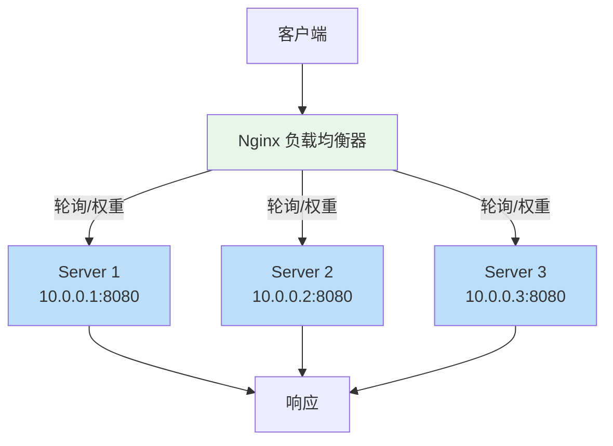
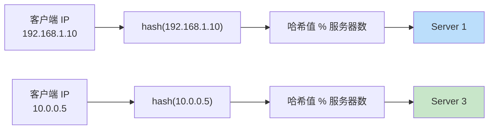
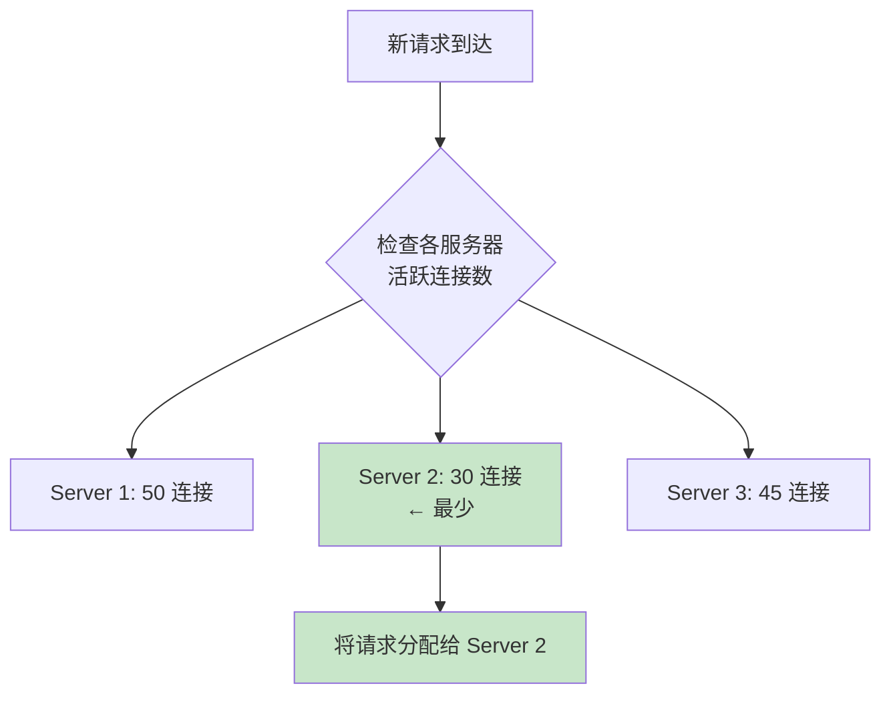

# 负载均衡策略详解

## 概述

负载均衡（Load Balancing）是将客户端请求分发到多台后端服务器的技术，是提高系统可用性、扩展性和性能的关键手段。Nginx 作为反向代理服务器，内置了多种负载均衡策略，可以根据不同的业务场景选择合适的分发算法。

Nginx 的负载均衡通过 `upstream` 块定义后端服务器组，然后在 `proxy_pass` 中引用该组。不同的负载均衡策略决定了请求如何在多台服务器之间分配。

::: important 负载均衡的核心价值
1. **高可用**：单台服务器故障不影响整体服务
2. **可扩展**：通过增加服务器提升处理能力
3. **性能优化**：合理分配请求，避免单台服务器过载
:::

## upstream 块配置

### 基本语法

```nginx
upstream backend {
    server 10.0.0.1:8080;
    server 10.0.0.2:8080;
    server 10.0.0.3:8080;
}

server {
    listen 80;
    location / {
        proxy_pass http://backend;
    }
}
```

### 负载均衡架构



### upstream 块中的指令

```nginx
upstream backend {
    # 服务器定义
    server 10.0.0.1:8080 weight=3;
    server 10.0.0.2:8080 weight=2;
    server 10.0.0.3:8080 backup;

    # 长连接池
    keepalive 32;

    # 负载均衡策略（默认轮询）
    # least_conn;
    # ip_hash;
    # hash $request_uri consistent;
    # random;
}
```

### server 指令参数

| 参数 | 说明 | 默认值 |
|------|------|--------|
| `weight=number` | 权重 | 1 |
| `max_conns=number` | 最大并发连接数 | 0（无限制） |
| `max_fails=number` | 最大失败次数 | 1 |
| `fail_timeout=time` | 失败超时时间 | 10s |
| `backup` | 备份服务器 | — |
| `down` | 标记为不可用 | — |
| `resolve` | 动态解析域名 | — |
| `route=string` | 路由标记（Sticky） | — |
| `service=name` | DNS SRV 记录名 | — |

## 轮询（Round Robin）

### 默认策略

轮询是 Nginx 的默认负载均衡策略，请求按顺序依次分配给每台服务器。

```nginx
upstream backend {
    server 10.0.0.1:8080;
    server 10.0.0.2:8080;
    server 10.0.0.3:8080;
}

# 请求分配：1→2→3→1→2→3→...
```

### weight 权重

通过 `weight` 参数为不同服务器分配不同的权重，权重越高，分配到的请求越多。

```nginx
upstream backend {
    server 10.0.0.1:8080 weight=3;  # 3/6 的请求
    server 10.0.0.2:8080 weight=2;  # 2/6 的请求
    server 10.0.0.3:8080 weight=1;  # 1/6 的请求
}

# 请求分配：1→1→1→2→2→3→1→1→1→2→2→3→...
```

### 权重的应用场景

```nginx
# 异构服务器：不同配置的服务器承担不同的负载
upstream backend {
    server 10.0.0.1:8080 weight=4;  # 8核16G 高配服务器
    server 10.0.0.2:8080 weight=2;  # 4核8G 中配服务器
    server 10.0.0.3:8080 weight=1;  # 2核4G 低配服务器
}

# 灰度发布：新版本服务器接收少量流量
upstream backend {
    server 10.0.0.1:8080 weight=9;  # 旧版本 90%
    server 10.0.0.2:8080 weight=1;  # 新版本 10%
}
```

### 加权轮询算法

Nginx 使用平滑加权轮询算法（Smooth Weighted Round Robin），确保请求分布均匀，不会出现连续多次分配到同一服务器的情况。

```
权重配置：A=5, B=1, C=1

轮次   当前权重        选中   调整后权重
1     {5, 1, 1}       A     {-2, 1, 1}
2     {3, 2, 2}       A     {0, 2, 2}
3     {5, 3, 3}       A     {-2, 3, 3}
4     {3, 4, 4}       B     {3, -3, 4}
5     {8, -2, 5}      A     {1, -2, 5}
6     {6, -1, 6}      C     {6, -1, -1}
7     {11, 0, 0}      A     {4, 0, 0}

结果：A B A C A A A（7个请求中A获得5个，B和C各1个）
```

::: tip 平滑加权轮询
与简单的加权轮询不同，Nginx 的平滑加权轮询算法确保高权重服务器不会连续被选中，使流量分布更加平滑。这避免了某些服务器在短时间内承受过多请求。
:::

## IP Hash

### 基本配置

IP Hash 根据客户端 IP 地址的哈希值将请求分配到固定的服务器，实现会话保持（Session Affinity）。

```nginx
upstream backend {
    ip_hash;
    server 10.0.0.1:8080;
    server 10.0.0.2:8080;
    server 10.0.0.3:8080;
}
```

### 工作原理



Nginx 使用 `$remote_addr`（客户端 IP）的前三个八位组（IPv4）计算哈希值：

```c
// Nginx 源码简化
hash = (hash_base + addr[0] + addr[1] + addr[2]) % total_weight;
```

### IP Hash 的特点

| 优点 | 缺点 |
|------|------|
| 实现简单 | 扩缩容时哈希重新分布 |
| 会话保持 | 不均匀分布（部分 IP 段流量高） |
| 无需额外存储 | 经过代理时 IP 可能相同 |
| — | 仅支持 IPv4 的前三个八位组 |

### IP Hash 的注意事项

```nginx
upstream backend {
    ip_hash;

    # IP Hash 模式下，weight 仍然有效
    server 10.0.0.1:8080 weight=3;
    server 10.0.0.2:8080 weight=2;

    # backup 服务器在 IP Hash 模式下不可用（1.7.2 之前）
    server 10.0.0.3:8080 backup;

    # down 标记的服务器不参与哈希计算
    server 10.0.0.4:8080 down;
}
```

::: warning IP Hash 在代理环境下的局限性
当 Nginx 前面还有一层代理（如 CDN、负载均衡器）时，`$remote_addr` 可能是代理的 IP 而非客户端真实 IP。此时应使用 `$http_x_forwarded_for` 或 `$realip_remote_addr` 结合 `hash` 指令替代 `ip_hash`。

```nginx
# 使用 hash 指令替代 ip_hash
upstream backend {
    hash $http_x_forwarded_for consistent;
    server 10.0.0.1:8080;
    server 10.0.0.2:8080;
}
```
:::

## 最少连接（Least Connections）

### 基本配置

最少连接策略将请求分配给当前活跃连接数最少的服务器。

```nginx
upstream backend {
    least_conn;
    server 10.0.0.1:8080;
    server 10.0.0.2:8080;
    server 10.0.0.3:8080;
}
```

### 工作原理



### 与权重结合

```nginx
upstream backend {
    least_conn;
    server 10.0.0.1:8080 weight=3;  # 高配服务器，权重高
    server 10.0.0.2:8080 weight=1;  # 低配服务器，权重低
}
```

当使用 `least_conn` 配合 `weight` 时，Nginx 计算的是 **活跃连接数 / 权重** 的比值，选择比值最小的服务器。

### least_conn 的适用场景

```nginx
# 长连接应用（WebSocket、SSE）
upstream websocket_backend {
    least_conn;
    server 10.0.0.1:8080;
    server 10.0.0.2:8080;
}

# 请求处理时间差异大的应用
upstream api_backend {
    least_conn;
    server 10.0.0.1:8080;  # 处理简单请求快
    server 10.0.0.2:8080;  # 可能处理耗时请求
}
```

::: important least_conn vs 轮询
- **轮询**：适合请求处理时间大致相同的场景
- **least_conn**：适合请求处理时间差异大的场景（如某些 API 需要长时间处理）

当所有请求处理时间相近时，least_conn 的效果与轮询相似。
:::

## Generic Hash：一致性哈希

### 基本配置

`hash` 指令可以根据任意 Nginx 变量计算哈希值，实现自定义的负载均衡策略。

```nginx
upstream backend {
    hash $request_uri consistent;
    server 10.0.0.1:8080;
    server 10.0.0.2:8080;
    server 10.0.0.3:8080;
}
```

### 一致性哈希环

```mermaid
flowchart TD
    subgraph 哈希环
        direction clockwise
        S1["Server 1<br/>hash: 0°"]
        S2["Server 2<br/>hash: 120°"]
        S3["Server 3<br/>hash: 240°"]
    end

    R1["请求: /api/users<br/>hash: 30°"] --> S1
    R2["请求: /api/orders<br/>hash: 150°"] --> S2
    R3["请求: /api/products<br/>hash: 270°"] --> S3

    style S1 fill:#bbdefb
    style S2 fill:#c8e6c9
    style S3 fill:#fff3e0
```

### consistent 参数

`consistent` 参数启用 Ketama 一致性哈希算法，在服务器增减时最小化键的重新映射。

```nginx
# 不使用 consistent：服务器变更时大部分键会重新映射
hash $request_uri;

# 使用 consistent：服务器变更时只有少量键需要重新映射
hash $request_uri consistent;
```

### 一致性哈希 vs 普通哈希

| 特性 | 普通哈希 | 一致性哈希 |
|------|---------|-----------|
| 服务器增减 | 大量键重新映射 | 最少键重新映射 |
| 分布均匀性 | 均匀 | 可能不均匀（虚拟节点改善） |
| 计算复杂度 | O(1) | O(log n) |
| 缓存命中率（增减服务器后） | 大幅下降 | 小幅下降 |

### hash 指令的使用场景

#### 基于 URI 的缓存命中

```nginx
upstream cache_backend {
    hash $request_uri consistent;
    server 10.0.0.1:8080;
    server 10.0.0.2:8080;
    server 10.0.0.3:8080;
}
```

#### 基于用户 ID 的会话保持

```nginx
upstream session_backend {
    hash $http_authorization consistent;
    server 10.0.0.1:8080;
    server 10.0.0.2:8080;
}
```

#### 基于自定义 Cookie

```nginx
upstream sticky_backend {
    hash $cookie_session_id consistent;
    server 10.0.0.1:8080;
    server 10.0.0.2:8080;
}
```

#### 基于客户端 IP

```nginx
# 替代 ip_hash，更灵活
upstream backend {
    hash $binary_remote_addr consistent;
    server 10.0.0.1:8080;
    server 10.0.0.2:8080;
}
```

## 随机（Random）

### 基本配置

`random` 策略随机选择服务器，可以指定随机选择的候选服务器数量。

```nginx
upstream backend {
    random two least_conn;
    server 10.0.0.1:8080;
    server 10.0.0.2:8080;
    server 10.0.0.3:8080;
}
```

### random 的参数

```nginx
# 纯随机
random;

# 随机选择 2 个候选，然后选连接数最少的
random two least_conn;

# 随机选择 3 个候选，然后选连接数最少的
random three least_conn;
```

### random 的适用场景

1. **分布式环境**：多个 Nginx 实例同时负载均衡时，轮询可能导致不均匀分布
2. **无状态服务**：不需要会话保持的微服务
3. **混合负载均衡**：外层使用 DNS 轮询，内层使用 random

```nginx
# 多 Nginx 实例场景
upstream backend {
    random two least_conn;
    server 10.0.0.1:8080;
    server 10.0.0.2:8080;
    server 10.0.0.3:8080;
    server 10.0.0.4:8080;
}
```

::: tip random two least_conn
`random two least_conn` 是一个优秀的一般性策略：
1. 先随机选择 2 个候选服务器
2. 从中选择活跃连接数较少的那个
3. 兼顾了随机性和负载均衡

这种 Power of Two Choices 策略在数学上被证明比纯随机好得多，同时又避免了 `least_conn` 需要全局同步连接状态的开销。
:::

## Sticky Cookie：会话粘滞（NGINX Plus）

Sticky Cookie 是 NGINX Plus（商业版）的特性，通过 Cookie 实现会话粘滞。

### 基本配置

```nginx
# NGINX Plus 专用
upstream backend {
    server 10.0.0.1:8080;
    server 10.0.0.2:8080;
    server 10.0.0.3:8080;

    sticky cookie srv_id expires=1h domain=example.com path=/;
}
```

### 开源替代方案

对于开源版 Nginx，可以使用 `hash` 指令配合 Cookie 实现类似效果：

```nginx
# 方案 1：基于 Cookie 的 hash
upstream backend {
    hash $cookie_jsessionid consistent;
    server 10.0.0.1:8080;
    server 10.0.0.2:8080;
}

# 方案 2：使用 Lua 模块实现 Sticky
# 需要安装 lua-nginx-module
lua_shared_dict sticky_cookie 10m;

server {
    listen 80;

    location / {
        access_by_lua_block {
            local sticky = ngx.shared.sticky_cookie
            local cookie = ngx.var.cookie_sticky_route

            if not cookie then
                -- 首次访问，随机分配并设置 Cookie
                local backends = {"10.0.0.1", "10.0.0.2", "10.0.0.3"}
                local idx = math.random(#backends)
                cookie = backends[idx]
                ngx.header["Set-Cookie"] = "sticky_route=" .. cookie .. "; Path=/"
            end

            ngx.var.sticky_backend = cookie
        }

        proxy_pass http://$sticky_backend:8080;
    }
}
```

## weight/down/backup 参数详解

### weight 权重

```nginx
upstream backend {
    server 10.0.0.1:8080 weight=5;   # 50% 的请求
    server 10.0.0.2:8080 weight=3;   # 30% 的请求
    server 10.0.0.3:8080 weight=2;   # 20% 的请求
}
```

权重的影响：

| 策略 | weight 的作用 |
|------|-------------|
| 轮询 | 请求分配比例 |
| least_conn | 活跃连接数/权重，选最小 |
| ip_hash | 请求分配比例 |
| hash | 请求分配比例 |
| random | 随机选择的概率 |

### down 标记

```nginx
upstream backend {
    server 10.0.0.1:8080;
    server 10.0.0.2:8080 down;   # 标记为不可用
    server 10.0.0.3:8080;
}

# 10.0.0.2 不参与负载均衡
# 常用于维护期间临时移除服务器
```

### backup 备份服务器

```nginx
upstream backend {
    server 10.0.0.1:8080;
    server 10.0.0.2:8080;
    server 10.0.0.3:8080 backup;  # 仅在其他服务器都不可用时启用
}

# 正常情况：请求在 10.0.0.1 和 10.0.0.2 之间分配
# 1 和 2 都不可用时：请求转发到 10.0.0.3
```

::: important backup 的行为
1. backup 服务器在正常情况下不参与负载均衡
2. 当所有非 backup 服务器都不可用时，请求才会转发到 backup 服务器
3. `ip_hash` 模式下不能使用 backup（1.7.2 之前）
4. 可以有多个 backup 服务器
:::

### max_conns 最大连接数

```nginx
upstream backend {
    server 10.0.0.1:8080 max_conns=100;
    server 10.0.0.2:8080 max_conns=200;
    server 10.0.0.3:8080 max_conns=50 backup;
}
```

当活跃连接数达到 `max_conns` 时，新的请求会被分配给其他服务器（如果在 `keepalive` 队列中等待的连接也会被计入，除非使用 `max_conns=0`）。

### 完整参数示例

```nginx
upstream backend {
    least_conn;

    # 主服务器
    server 10.0.0.1:8080 weight=3 max_conns=200 max_fails=3 fail_timeout=30s;
    server 10.0.0.2:8080 weight=2 max_conns=150 max_fails=3 fail_timeout=30s;

    # 维护中的服务器
    server 10.0.0.3:8080 down;

    # 备份服务器
    server 10.0.0.4:8080 backup weight=1 max_conns=100;

    # 长连接
    keepalive 32;
}
```

## 各策略适用场景对比

| 策略 | 会话保持 | 分布均匀 | 扩缩容友好 | 性能开销 | 适用场景 |
|------|---------|---------|-----------|---------|---------|
| 轮询 | 否 | 是 | 是 | 最低 | 无状态服务、通用场景 |
| 加权轮询 | 否 | 是（按权重） | 是 | 最低 | 异构服务器 |
| IP Hash | 是 | 可能不均 | 否 | 低 | 需要会话保持 |
| least_conn | 否 | 动态均衡 | 是 | 中 | 长连接、请求耗时不均 |
| 一致性哈希 | 是 | 可能不均 | 是 | 中 | 缓存、会话保持 |
| random | 否 | 大致均匀 | 是 | 最低 | 多实例负载均衡 |
| random least_conn | 否 | 动态均衡 | 是 | 中 | 通用高性能场景 |
| Sticky Cookie | 是 | 是 | 是 | 中 | 需要精确会话保持（Plus） |

### 策略选择决策树

```nginx
# 1. 无状态 API 服务 → 轮询
upstream api {
    server 10.0.0.1:8080;
    server 10.0.0.2:8080;
}

# 2. 异构服务器 → 加权轮询
upstream api {
    server 10.0.0.1:8080 weight=3;
    server 10.0.0.2:8080 weight=1;
}

# 3. 需要会话保持 → 一致性哈希
upstream api {
    hash $cookie_session_id consistent;
    server 10.0.0.1:8080;
    server 10.0.0.2:8080;
}

# 4. 长连接/请求耗时不均 → least_conn
upstream api {
    least_conn;
    server 10.0.0.1:8080;
    server 10.0.0.2:8080;
}

# 5. 多 Nginx 实例 → random least_conn
upstream api {
    random two least_conn;
    server 10.0.0.1:8080;
    server 10.0.0.2:8080;
}

# 6. 缓存代理 → 一致性哈希（基于 URI）
upstream cache {
    hash $request_uri consistent;
    server 10.0.0.1:8080;
    server 10.0.0.2:8080;
}
```

## 实战：多种负载均衡策略配置

### 微服务架构

```nginx
# 用户服务 - 需要会话保持
upstream user_service {
    hash $cookie_session_id consistent;
    server 10.0.0.1:8080 weight=3 max_fails=3 fail_timeout=30s;
    server 10.0.0.2:8080 weight=2 max_fails=3 fail_timeout=30s;
    server 10.0.0.3:8080 backup;
}

# 订单服务 - 无状态
upstream order_service {
    random two least_conn;
    server 10.0.1.1:8080 max_fails=3 fail_timeout=30s;
    server 10.0.1.2:8080 max_fails=3 fail_timeout=30s;
    server 10.0.1.3:8080 max_fails=3 fail_timeout=30s;
}

# 商品服务 - 异构服务器
upstream product_service {
    server 10.0.2.1:8080 weight=4;   # 高配
    server 10.0.2.2:8080 weight=2;   # 中配
    server 10.0.2.3:8080 weight=1;   # 低配
}

# 搜索服务 - 缓存敏感
upstream search_service {
    hash $request_uri consistent;
    server 10.0.3.1:8080;
    server 10.0.3.2:8080;
    server 10.0.3.3:8080;
}

# WebSocket 服务 - 长连接
upstream ws_service {
    least_conn;
    server 10.0.4.1:8080 max_conns=500;
    server 10.0.4.2:8080 max_conns=500;
    server 10.0.4.3:8080 max_conns=500;
}

server {
    listen 443 ssl http2;
    server_name api.example.com;

    ssl_certificate /etc/nginx/ssl/example.com.crt;
    ssl_certificate_key /etc/nginx/ssl/example.com.key;

    location /users/ {
        proxy_pass http://user_service/;
        include snippets/proxy-params.conf;
    }

    location /orders/ {
        proxy_pass http://order_service/;
        include snippets/proxy-params.conf;
    }

    location /products/ {
        proxy_pass http://product_service/;
        include snippets/proxy-params.conf;
    }

    location /search/ {
        proxy_pass http://search_service/;
        include snippets/proxy-params.conf;
    }

    location /ws/ {
        proxy_pass http://ws_service;
        proxy_http_version 1.1;
        proxy_set_header Upgrade $http_upgrade;
        proxy_set_header Connection "upgrade";
        proxy_set_header Host $host;
        proxy_read_timeout 86400s;
    }
}
```

### 灰度发布配置

```nginx
# 基于 Cookie 的灰度发布
map $cookie_version $backend_name {
    "v2"     v2_backend;
    default  v1_backend;
}

upstream v1_backend {
    server 10.0.0.1:8080;
    server 10.0.0.2:8080;
}

upstream v2_backend {
    server 10.0.0.3:8080;
    server 10.0.0.4:8080;
}

server {
    listen 80;

    location / {
        proxy_pass http://$backend_name;
        proxy_set_header Host $host;
    }
}
```

### 蓝绿部署配置

```nginx
# 蓝绿部署：通过修改 upstream 配置切换
# 当前活跃：蓝
upstream backend {
    server 10.0.0.1:8080;  # 蓝实例 1
    server 10.0.0.2:8080;  # 蓝实例 2
    # server 10.0.0.3:8080;  # 绿实例 1
    # server 10.0.0.4:8080;  # 绿实例 2
}

# 切换到绿环境：注释蓝实例，取消注释绿实例
# upstream backend {
#     # server 10.0.0.1:8080;  # 蓝实例 1
#     # server 10.0.0.2:8080;  # 蓝实例 2
#     server 10.0.0.3:8080;  # 绿实例 1
#     server 10.0.0.4:8080;  # 绿实例 2
# }
```

## 动态配置负载均衡

### 使用 API 动态修改 upstream（NGINX Plus）

```nginx
# NGINX Plus 专用
upstream backend {
    zone backend 64k;
    server 10.0.0.1:8080;
    server 10.0.0.2:8080;
}

server {
    listen 80;

    location /api/ {
        api write=on;
        allow 127.0.0.1;
        deny all;
    }
}
```

```bash
# 添加服务器
curl -X POST http://localhost/api/5/http/upstreams/backend/servers \
    -d '{"server":"10.0.0.3:8080"}'

# 移除服务器
curl -X DELETE http://localhost/api/5/http/upstreams/backend/servers/2

# 标记为 down
curl -X PATCH http://localhost/api/5/http/upstreams/backend/servers/0 \
    -d '{"down":true}'
```

### 开源方案：使用 confd + etcd

```bash
# 安装 confd
wget https://github.com/kelseyhightower/confd/releases/download/v0.16.0/confd-0.16.0-linux-amd64
chmod +x confd
mv confd /usr/local/bin/

# 配置模板
cat > /etc/confd/templates/nginx-upstream.tmpl << 'EOF'
upstream backend {
    {{range $i, $server := getvs "/upstream/backend/*"}}
    server {{$server}};
    {{end}}
}
EOF

# confd 监听 etcd 变化并自动更新 Nginx 配置
confd -backend etcd -node http://127.0.0.1:2379
```

## 负载均衡监控

### 日志格式

```nginx
log_format upstream_log '$remote_addr - [$time_local] "$request" '
                        '$status $body_bytes_sent '
                        'upstream=$upstream_addr '
                        'upstream_status=$upstream_status '
                        'upstream_time=$upstream_response_time '
                        'connect_time=$upstream_connect_time '
                        'header_time=$upstream_header_time';

access_log /var/log/nginx/upstream.log upstream_log;
```

### 日志分析

```bash
# 查看各服务器请求分布
awk '{print $7}' /var/log/nginx/upstream.log | sort | uniq -c | sort -rn

# 查看各服务器响应时间
awk -F'upstream_time=' '{print $2}' /var/log/nginx/upstream.log | awk -F',' '{print $1}' | sort -n

# 查看失败请求
awk '$9 != 200 && $9 != 304' /var/log/nginx/upstream.log
```

## 小结

Nginx 提供了丰富的负载均衡策略，选择合适的策略取决于业务需求：

1. **轮询**：默认策略，适合无状态服务
2. **加权轮询**：适合异构服务器
3. **IP Hash**：适合需要会话保持的场景
4. **least_conn**：适合长连接和请求耗时不均的场景
5. **一致性哈希**：适合缓存敏感和需要精确会话保持的场景
6. **random least_conn**：适合多 Nginx 实例和通用高性能场景

::: tip 进一步阅读
- [ngx_http_upstream_module](https://nginx.org/en/docs/http/ngx_http_upstream_module.html)
- [Nginx Load Balancing](https://nginx.org/en/docs/http/load_balancing.html)
- [NGINX Plus - Load Balancing](https://docs.nginx.com/nginx/admin-guide/load-balancer/http-load-balancer/)
:::
