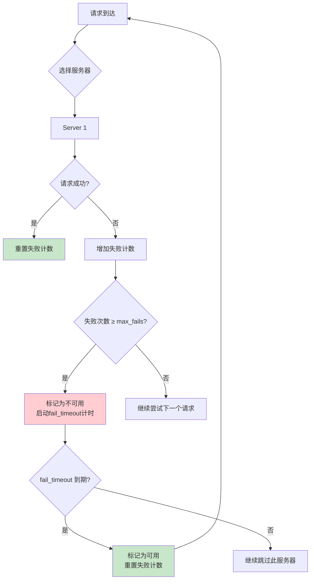
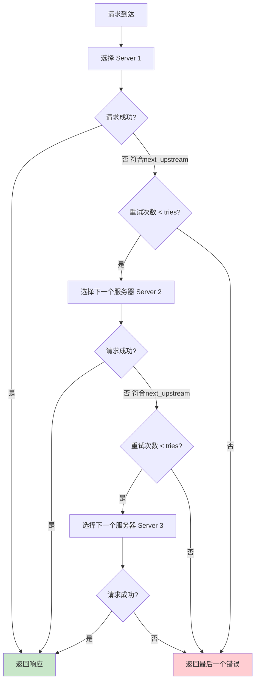
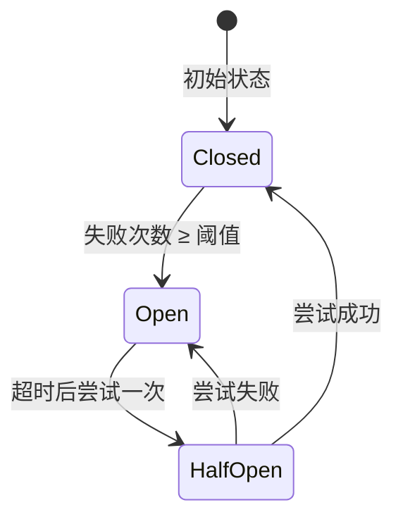

# 健康检查与故障转移

## 概述

在生产环境中，后端服务器不可避免地会出现故障——进程崩溃、网络中断、服务器过载等。如果 Nginx 继续将请求转发到故障的服务器，客户端将收到错误响应。健康检查与故障转移机制确保 Nginx 能够自动检测后端服务器的健康状态，并在服务器故障时将请求转发到其他健康的服务器。

Nginx 提供了两种健康检查机制：
1. **被动健康检查**：开源版内置，通过实际请求的结果判断服务器状态
2. **主动健康检查**：NGINX Plus 或第三方模块提供，定期主动探测服务器状态

::: important 健康检查的意义
1. **自动故障检测**：无需人工干预即可发现故障服务器
2. **自动故障转移**：将请求自动切换到健康服务器
3. **自动恢复**：故障服务器恢复后自动重新加入负载均衡
4. **减少用户影响**：用户不会因为单台服务器故障而收到错误
:::

## 被动健康检查：max_fails/fail_timeout

### 工作原理

被动健康检查通过实际请求的结果来判断服务器是否健康。当某个服务器连续失败的次数达到 `max_fails` 时，Nginx 将其标记为不可用，在 `fail_timeout` 时间内不再向其发送请求。



### max_fails 指令

`max_fails` 设置在 `fail_timeout` 时间内允许的最大失败次数。默认值为 1。

```nginx
upstream backend {
    server 10.0.0.1:8080 max_fails=3;
    server 10.0.0.2:8080 max_fails=3;
    server 10.0.0.3:8080 max_fails=3;
}
```

### fail_timeout 指令

`fail_timeout` 设置两个含义：
1. 服务器被标记为不可用后，多长时间后重新尝试
2. 统计 `max_fails` 失败次数的时间窗口

默认值为 10s。

```nginx
upstream backend {
    server 10.0.0.1:8080 max_fails=3 fail_timeout=30s;
    server 10.0.0.2:8080 max_fails=3 fail_timeout=30s;
    server 10.0.0.3:8080 max_fails=3 fail_timeout=30s;
}
```

### 失败的判定

以下情况被视为请求失败：

1. 服务器无响应（连接超时）
2. 服务器返回 5xx 错误（可由 `proxy_next_upstream` 控制）
3. 与服务器建立连接失败

::: important 什么算作"失败"
默认情况下，只有连接超时和连接拒绝才被视为失败。服务器返回 5xx 错误**不算**失败。要使 5xx 也触发健康检查，需要配合 `proxy_next_upstream error timeout http_500 http_502 http_503 http_504;` 指令。
:::

### 被动健康检查配置示例

```nginx
upstream backend {
    # 主服务器：允许3次失败，30秒后重试
    server 10.0.0.1:8080 max_fails=3 fail_timeout=30s;
    server 10.0.0.2:8080 max_fails=3 fail_timeout=30s;

    # 备份服务器：允许5次失败，60秒后重试
    server 10.0.0.3:8080 backup max_fails=5 fail_timeout=60s;
}

server {
    listen 80;

    location / {
        proxy_pass http://backend;
        proxy_next_upstream error timeout http_500 http_502 http_503 http_504;
    }
}
```

### 被动健康检查的时间线

```
时间轴：

t=0s   请求1 → Server 1 → 成功 → 重置失败计数
t=1s   请求2 → Server 1 → 失败 → 失败计数=1
t=2s   请求3 → Server 2 → 成功 → 重置失败计数
t=3s   请求4 → Server 1 → 失败 → 失败计数=2
t=4s   请求5 → Server 1 → 失败 → 失败计数=3 → 标记不可用！
t=5s   请求6 → Server 2 → 成功（跳过 Server 1）
t=6s   请求7 → Server 2 → 成功（跳过 Server 1）
...
t=34s  fail_timeout 到期，Server 1 重新标记为可用
t=35s  请求8 → Server 1 → 尝试一次
```

### max_fails=0 的特殊行为

```nginx
upstream backend {
    # max_fails=0：永远不标记为不可用
    server 10.0.0.1:8080 max_fails=0;

    # fail_timeout=0：失败后立即恢复可用（仍会计数失败，但不可用时间为 0 秒）
    server 10.0.0.2:8080 fail_timeout=0;
}
```

## 主动健康检查

### NGINX Plus 的 health_check 指令

NGINX Plus（商业版）提供 `health_check` 指令，可以定期主动探测后端服务器的健康状态。

```nginx
upstream backend {
    zone backend 64k;
    server 10.0.0.1:8080;
    server 10.0.0.2:8080;
}

server {
    listen 80;
    location / {
        proxy_pass http://backend;
        health_check interval=5s fails=3 passes=2 uri=/health;
    }
}
```

### health_check 参数

| 参数 | 说明 | 默认值 |
|------|------|--------|
| `interval=time` | 检查间隔 | 5s |
| `fails=number` | 连续失败次数标记不可用 | 1 |
| `passes=number` | 连续成功次数标记可用 | 1 |
| `uri=uri` | 检查请求的 URI | / |
| `match=name` | 匹配规则名称 | — |
| `port=number` | 检查使用的端口 | 服务器端口 |
| `type=grpc` | gRPC 健康检查 | — |

### match 规则

```nginx
# 定义健康检查的匹配规则
match healthy {
    status 200-399;
    header Content-Type = "application/json";
    body ~ '"status":"healthy"';
}

upstream backend {
    zone backend 64k;
    server 10.0.0.1:8080;
    server 10.0.0.2:8080;
}

server {
    listen 80;

    location / {
        proxy_pass http://backend;
        health_check interval=10s fails=3 passes=2 uri=/health match=healthy;
    }
}
```

### nginx_upstream_check_module（第三方模块）

对于开源版 Nginx，可以使用淘宝开源的 `nginx_upstream_check_module` 实现主动健康检查。

#### 安装

```bash
# 下载模块
git clone https://github.com/yaoweibin/nginx_upstream_check_module.git

# 编译 Nginx 时添加模块
./configure --add-module=../nginx_upstream_check_module
make && make install
```

#### 配置

```nginx
upstream backend {
    server 10.0.0.1:8080;
    server 10.0.0.2:8080;

    # 主动健康检查
    check interval=5000 rise=2 fall=3 timeout=3000 type=http;
    check_http_send "GET /health HTTP/1.0\r\nHost: backend\r\n\r\n";
    check_http_expect_alive http_2xx http_3xx;
}

server {
    listen 80;

    # 健康检查状态页面
    location /status {
        check_status;
        access_log off;
        allow 127.0.0.1;
        deny all;
    }
}
```

#### check 指令参数

| 参数 | 说明 |
|------|------|
| `interval` | 检查间隔（毫秒） |
| `rise` | 连续成功次数标记可用 |
| `fall` | 连续失败次数标记不可用 |
| `timeout` | 检查超时（毫秒） |
| `type` | 检查类型：tcp/http/ssl_hello/mysql/ajp |

### 主动 vs 被动健康检查对比

```mermaid
flowchart LR
    subgraph 被动检查
        A1[实际请求] --> B1{成功/失败?}
        B1 -->|失败| C1[更新失败计数]
        C1 --> D1{≥ max_fails?}
        D1 -->|是| E1[标记不可用]
    end

    subgraph 主动检查
        A2[定时探测] --> B2{/health]
        B2 --> C2{成功/失败?}
        C2 -->|连续失败| D2[标记不可用]
        C2 -->|连续成功| E2[标记可用]
    end

    style 被动检查 fill:#fff3e0
    style 主动检查 fill:#e8f5e9
```

| 特性 | 被动检查 | 主动检查 |
|------|---------|---------|
| 检测方式 | 实际请求结果 | 定期主动探测 |
| 开源支持 | 内置 | 需要第三方模块 |
| 检测延迟 | 首个请求可能失败 | 故障前即可检测 |
| 资源消耗 | 无额外消耗 | 探测请求消耗 |
| 恢复检测 | fail_timeout 后尝试 | 持续探测，快速发现 |
| 精确度 | 依赖实际请求 | 可自定义检查逻辑 |

## 故障转移策略

### proxy_next_upstream

`proxy_next_upstream` 指令控制当请求失败时，是否将请求传递给下一个服务器。

```nginx
location / {
    proxy_pass http://backend;
    proxy_next_upstream error timeout http_500 http_502 http_503 http_504;
}
```

### 可用的条件

| 条件 | 说明 |
|------|------|
| `error` | 与服务器建立连接、传递请求或读取响应时发生错误 |
| `timeout` | 与服务器建立连接、传递请求或读取响应时发生超时 |
| `invalid_header` | 服务器返回空或无效响应 |
| `http_500` | 服务器返回 500 |
| `http_502` | 服务器返回 502 |
| `http_503` | 服务器返回 503 |
| `http_504` | 服务器返回 504 |
| `http_403` | 服务器返回 403 |
| `http_404` | 服务器返回 404 |
| `http_429` | 服务器返回 429 |
| `non_idempotent` | 允许非幂等请求（POST、PATCH）重试 |
| `off` | 禁止将请求传递给下一个服务器 |

::: warning 非幂等请求的重试
默认情况下，Nginx 不会对非幂等请求（POST、PATCH、DELETE 等）进行重试，因为重试可能导致重复操作。只有在明确需要时才添加 `non_idempotent` 参数。

```nginx
# 谨慎使用：POST 请求也会被重试
proxy_next_upstream error timeout non_idempotent;
```
:::

### proxy_next_upstream_timeout

```nginx
location / {
    proxy_pass http://backend;
    proxy_next_upstream error timeout http_500;
    proxy_next_upstream_timeout 10s;  # 重试总超时时间
}
```

`proxy_next_upstream_timeout` 限制了重试的总时间，包括初始请求和所有重试请求。默认值为 0（无限制）。

### proxy_next_upstream_tries

```nginx
location / {
    proxy_pass http://backend;
    proxy_next_upstream error timeout http_500;
    proxy_next_upstream_tries 3;  # 最多尝试3次（含初始请求）
}
```

`proxy_next_upstream_tries` 限制了总的尝试次数（包括初始请求），默认值为 0（无限制）。

### 故障转移完整配置

```nginx
upstream backend {
    server 10.0.0.1:8080 max_fails=3 fail_timeout=30s;
    server 10.0.0.2:8080 max_fails=3 fail_timeout=30s;
    server 10.0.0.3:8080 max_fails=3 fail_timeout=30s;
}

server {
    listen 80;

    location / {
        proxy_pass http://backend;

        # 故障转移策略
        proxy_next_upstream error timeout http_500 http_502 http_503 http_504;

        # 重试限制
        proxy_next_upstream_timeout 5s;
        proxy_next_upstream_tries 3;

        # 超时配置
        proxy_connect_timeout 5s;
        proxy_send_timeout 10s;
        proxy_read_timeout 15s;
    }
}
```

### 故障转移流程



## 备用服务器：backup 参数

### backup 的行为

```nginx
upstream backend {
    server 10.0.0.1:8080;          # 主服务器 1
    server 10.0.0.2:8080;          # 主服务器 2
    server 10.0.0.3:8080 backup;   # 备份服务器
}
```

- 正常情况下，请求在主服务器 1 和 2 之间分配
- 当主服务器 1 和 2 都不可用时，请求转发到备份服务器
- 备份服务器不参与负载均衡的权重分配

### 多级备份

```nginx
upstream backend {
    server 10.0.0.1:8080;              # 主服务器
    server 10.0.0.2:8080;              # 主服务器
    server 10.0.0.3:8080 backup;       # 一级备份
    server 10.0.0.4:8080 backup;       # 一级备份
    server 10.0.0.5:8080 backup;       # 一级备份（多个 backup 之间轮询）
}
```

### backup 的典型配置

```nginx
upstream backend {
    # 生产环境服务器
    server prod1.example.com:8080 max_fails=3 fail_timeout=30s;
    server prod2.example.com:8080 max_fails=3 fail_timeout=30s;

    # 降级服务器（当所有生产服务器不可用时启用）
    server fallback.example.com:8080 backup;
}

server {
    listen 80;

    location / {
        proxy_pass http://backend;
        proxy_next_upstream error timeout http_500 http_502 http_503 http_504;

        # 降级服务器返回降级响应
        # 可以在降级服务器上配置维护页面
    }
}
```

### backup 与维护页面结合

```nginx
upstream backend {
    server 10.0.0.1:8080;
    server 10.0.0.2:8080;
}

server {
    listen 80;
    server_name example.com;

    # 正常代理
    location / {
        proxy_pass http://backend;
        proxy_next_upstream error timeout;

        # 所有后端不可用时返回维护页面
        error_page 502 503 504 /maintenance.html;
    }

    # 维护页面
    location = /maintenance.html {
        root /var/www/maintenance;
        internal;
    }
}
```

## 熔断与降级实现

### 熔断模式

熔断（Circuit Breaker）是一种防止故障级联的保护机制。当后端服务连续失败达到阈值时，熔断器"断开"，请求不再发送到故障服务，直接返回降级响应。



### Nginx 中的熔断实现

Nginx 的被动健康检查本质上就是一种简单的熔断机制：

```nginx
upstream backend {
    # max_fails + fail_timeout 实现熔断
    server 10.0.0.1:8080 max_fails=5 fail_timeout=30s;
    server 10.0.0.2:8080 max_fails=5 fail_timeout=30s;
}

server {
    listen 80;

    location / {
        proxy_pass http://backend;

        # 触发重试的条件
        proxy_next_upstream error timeout http_500 http_502 http_503 http_504;
        proxy_next_upstream_timeout 10s;
        proxy_next_upstream_tries 3;

        # 熔断后的降级响应
        error_page 502 503 504 = @fallback;
    }

    location @fallback {
        # 降级策略1：返回缓存数据
        proxy_pass http://cache_server;

        # 降级策略2：返回默认响应
        # return 200 '{"status": "degraded", "message": "Service temporarily unavailable"}';
        # add_header Content-Type application/json always;

        # 降级策略3：返回维护页面
        # root /var/www/maintenance;
        # try_files /index.html =503;
    }
}
```

### 使用 Lua 实现高级熔断

```nginx
lua_shared_dict circuit_breaker 10m;

server {
    listen 80;

    location /api/ {
        access_by_lua_block {
            local cb = ngx.shared.circuit_breaker
            local key = "backend_circuit"

            local state = cb:get(key .. "_state")
            local failures = cb:get(key .. "_failures") or 0
            local threshold = 5
            local timeout = 30

            if state == "open" then
                -- 熔断状态，检查是否应该尝试恢复
                local open_time = cb:get(key .. "_open_time") or 0
                if ngx.now() - open_time > timeout then
                    -- 进入半开状态，允许一次尝试
                    cb:set(key .. "_state", "half-open")
                else
                    -- 熔断中，直接返回降级响应
                    ngx.status = 503
                    ngx.say('{"error": "service unavailable", "circuit": "open"}')
                    ngx.exit(503)
                end
            end
        }

        proxy_pass http://backend;

        # 记录成功/失败
        log_by_lua_block {
            local cb = ngx.shared.circuit_breaker
            local key = "backend_circuit"
            local status = ngx.status

            if status >= 500 then
                local failures = (cb:get(key .. "_failures") or 0) + 1
                cb:set(key .. "_failures", failures, 60)

                if failures >= 5 then
                    cb:set(key .. "_state", "open")
                    cb:set(key .. "_open_time", ngx.now())
                end
            else
                -- 成功时重置计数
                cb:set(key .. "_failures", 0)
                cb:set(key .. "_state", "closed")
            end
        }
    }
}
```

### 降级策略选择

| 降级策略 | 适用场景 | 优点 | 缺点 |
|---------|---------|------|------|
| 返回缓存数据 | 读操作 | 用户体验好 | 数据可能过期 |
| 返回默认值 | 非关键数据 | 简单直接 | 功能受限 |
| 返回维护页面 | 所有场景 | 一致性好 | 用户体验差 |
| 限流排队 | 短暂过载 | 无数据丢失 | 响应延迟 |
| 功能降级 | 部分功能 | 保持核心功能 | 功能不完整 |

## upstream 状态监控

### Nginx 状态页面

```nginx
server {
    listen 80;
    server_name localhost;

    # 基本状态
    location /nginx_status {
        stub_status;
        access_log off;
        allow 127.0.0.1;
        deny all;
    }
}
```

### 日志监控

```nginx
log_format health_log '$remote_addr - [$time_local] "$request" '
                      '$status $body_bytes_sent '
                      'upstream=$upstream_addr '
                      'upstream_status=$upstream_status '
                      'upstream_time=$upstream_response_time '
                      'connect_time=$upstream_connect_time';

access_log /var/log/nginx/health.log health_log;
```

### 监控脚本

```bash
#!/bin/bash
# health_check.sh - 检查 upstream 状态

# 从日志中提取各服务器的失败率
analyze_upstream() {
    local log_file="/var/log/nginx/health.log"
    local threshold=10  # 失败率阈值（百分比）

    echo "=== Upstream Health Report ==="
    echo "Time: $(date)"
    echo ""

    # 统计各上游服务器的成功/失败
    awk '{
        split($11, upstreams, ",")
        split($12, statuses, ",")
        for (i in upstreams) {
            addr = upstreams[i]
            status = statuses[i]
            if (status ~ /^5/) {
                fail[addr]++
            }
            total[addr]++
        }
    }
    END {
        for (addr in total) {
            fail_rate = (fail[addr] / total[addr]) * 100
            printf "%-25s Total: %-5d Failed: %-5d Rate: %.1f%%\n",
                   addr, total[addr], fail[addr]+0, fail_rate
        }
    }' "$log_file"
}

analyze_upstream
```

### Prometheus + Grafana 监控

```nginx
# 使用 nginx-prometheus-exporter
# https://github.com/nginxinc/nginx-prometheus-exporter

server {
    listen 80;
    server_name localhost;

    location /metrics {
        stub_status;
        access_log off;
        allow 10.0.0.0/8;
        deny all;
    }
}
```

Prometheus 配置：

```yaml
scrape_configs:
  - job_name: 'nginx'
    static_configs:
      - targets: ['nginx:80']
    metrics_path: /metrics
```

Grafana 监控面板关键指标：

| 指标 | 说明 | 告警阈值 |
|------|------|---------|
| `nginx_up` | Nginx 是否运行 | 0 |
| `nginx_connections_active` | 活跃连接数 | > worker_connections * 0.8 |
| `nginx_connections_waiting` | 等待连接数 | > 活跃连接数 * 0.5 |
| `nginx_http_requests_total` | 请求总数 | 速率异常 |
| upstream 响应时间 | 平均响应时间 | > 2s |
| upstream 5xx 比率 | 5xx 响应比例 | > 1% |

## 实战：完整的健康检查与故障转移配置

### 场景描述

一个高可用的 API 网关，包含以下要求：
1. 被动健康检查
2. 故障转移
3. 备份服务器
4. 熔断降级
5. 监控

```nginx
# ========================================
# 上游服务定义
# ========================================

# 主后端集群
upstream api_backend {
    least_conn;

    # 主服务器
    server 10.0.0.1:8080 weight=3 max_fails=3 fail_timeout=30s;
    server 10.0.0.2:8080 weight=3 max_fails=3 fail_timeout=30s;
    server 10.0.0.3:8080 weight=2 max_fails=3 fail_timeout=30s;

    # 备份服务器（其他服务器都不可用时启用）
    server 10.0.0.4:8080 backup max_fails=5 fail_timeout=60s;

    # 长连接
    keepalive 32;
}

# 降级服务器
upstream fallback_backend {
    server 127.0.0.1:8888;
}

# ========================================
# 限流配置
# ========================================

limit_req_zone $binary_remote_addr zone=api_limit:10m rate=100r/s;
limit_conn_zone $binary_remote_addr zone=addr:10m;

# ========================================
# 共享配置
# ========================================

map $http_upgrade $connection_upgrade {
    default upgrade;
    ''      close;
}

# ========================================
# 主服务器
# ========================================

server {
    listen 80;
    server_name api.example.com;
    return 301 https://$host$request_uri;
}

server {
    listen 443 ssl http2;
    server_name api.example.com;

    ssl_certificate /etc/nginx/ssl/example.com.crt;
    ssl_certificate_key /etc/nginx/ssl/example.com.key;

    # 限流
    limit_req zone=api_limit burst=50 nodelay;
    limit_conn zone=addr 20;

    # 日志格式
    log_format detailed '$remote_addr - [$time_local] "$request" '
                        '$status $body_bytes_sent '
                        '"$http_referer" "$http_user_agent" '
                        'upstream=$upstream_addr '
                        'upstream_status=$upstream_status '
                        'upstream_time=$upstream_response_time '
                        'connect_time=$upstream_connect_time '
                        'rt=$request_time';

    access_log /var/log/nginx/api_access.log detailed;
    error_log /var/log/nginx/api_error.log warn;

    # API 路由
    location / {
        proxy_pass http://api_backend;
        proxy_http_version 1.1;
        proxy_set_header Connection "";
        proxy_set_header Host $host;
        proxy_set_header X-Real-IP $remote_addr;
        proxy_set_header X-Forwarded-For $proxy_add_x_forwarded_for;
        proxy_set_header X-Forwarded-Proto $scheme;

        # 超时配置
        proxy_connect_timeout 5s;
        proxy_send_timeout 15s;
        proxy_read_timeout 30s;

        # 故障转移
        proxy_next_upstream error timeout http_500 http_502 http_503 http_504;
        proxy_next_upstream_timeout 10s;
        proxy_next_upstream_tries 3;

        # 熔断降级
        error_page 502 503 504 = @fallback;
    }

    # 降级处理
    location @fallback {
        proxy_pass http://fallback_backend;
        proxy_set_header Host $host;
        proxy_set_header X-Real-IP $remote_addr;
        proxy_set_header X-Fallback true;
    }

    # WebSocket
    location /ws/ {
        proxy_pass http://api_backend;
        proxy_http_version 1.1;
        proxy_set_header Upgrade $http_upgrade;
        proxy_set_header Connection $connection_upgrade;
        proxy_set_header Host $host;
        proxy_set_header X-Real-IP $remote_addr;
        proxy_read_timeout 86400s;
    }

    # 健康检查端点
    location /health {
        proxy_pass http://api_backend/health;
        access_log off;
        proxy_connect_timeout 3s;
        proxy_read_timeout 5s;
    }

    # Nginx 状态
    location /nginx_status {
        stub_status;
        access_log off;
        allow 127.0.0.1;
        allow 10.0.0.0/8;
        deny all;
    }
}

# ========================================
# 降级服务器（返回缓存/默认响应）
# ========================================

server {
    listen 8888;

    location / {
        default_type application/json;
        return 503 '{"error": "Service temporarily unavailable", "code": 503, "retry_after": 30}';
    }
}
```

### Kubernetes 环境配置

```nginx
upstream api_backend {
    least_conn;

    server api-v1:8080 max_fails=3 fail_timeout=30s;
    server api-v2:8080 max_fails=3 fail_timeout=30s;

    keepalive 32;
}

server {
    listen 80;

    # Kubernetes 健康检查
    location /healthz {
        proxy_pass http://api_backend/health;
        access_log off;
        proxy_connect_timeout 3s;
        proxy_read_timeout 5s;
    }

    location / {
        proxy_pass http://api_backend;
        proxy_http_version 1.1;
        proxy_set_header Connection "";
        proxy_set_header Host $host;
        proxy_set_header X-Real-IP $remote_addr;
        proxy_set_header X-Forwarded-For $proxy_add_x_forwarded_for;

        proxy_next_upstream error timeout http_500 http_502 http_503 http_504;
        proxy_next_upstream_timeout 5s;
        proxy_next_upstream_tries 3;
    }
}
```

## 健康检查最佳实践

### 1. 后端健康检查端点设计

```python
# Python Flask 示例
@app.route('/health')
def health_check():
    # 检查数据库连接
    try:
        db.session.execute('SELECT 1')
    except Exception:
        return jsonify({"status": "unhealthy", "reason": "database"}), 503

    # 检查缓存连接
    try:
        redis.ping()
    except Exception:
        return jsonify({"status": "unhealthy", "reason": "cache"}), 503

    # 检查外部依赖
    # ...

    return jsonify({"status": "healthy"}), 200
```

### 2. 合理设置 max_fails 和 fail_timeout

```nginx
# 高可用要求
server 10.0.0.1:8080 max_fails=2 fail_timeout=10s;

# 一般场景
server 10.0.0.1:8080 max_fails=3 fail_timeout=30s;

# 容错性要求高
server 10.0.0.1:8080 max_fails=5 fail_timeout=60s;
```

### 3. 区分业务错误和系统错误

```nginx
# 只有真正的系统错误才触发重试
proxy_next_upstream error timeout http_502 http_503 http_504;

# 不包含 http_500：500 可能是业务逻辑错误，不应重试
# 不包含 http_404：404 是资源不存在，不应重试
```

### 4. 监控与告警

```nginx
# 记录详细的上游信息
log_format upstream_log '$remote_addr - [$time_local] "$request" '
                        '$status $body_bytes_sent '
                        'upstream=$upstream_addr '
                        'upstream_status=$upstream_status '
                        'upstream_time=$upstream_response_time';

# 告警规则
# 1. upstream 响应时间 > 2s
# 2. upstream 5xx 比率 > 1%
# 3. upstream 不可用次数 > 5次/分钟
```

## 小结

健康检查与故障转移是保障服务高可用的关键机制：

1. **被动健康检查**：通过 `max_fails` 和 `fail_timeout` 实现，开源版内置
2. **主动健康检查**：定期探测后端状态，需要 NGINX Plus 或第三方模块
3. **故障转移**：`proxy_next_upstream` 控制重试条件和行为
4. **备份服务器**：`backup` 参数提供最后的兜底保障
5. **熔断降级**：`error_page` + 命名 location 实现降级响应
6. **监控**：通过日志和状态页面监控上游健康状态

::: tip 进一步阅读
- [ngx_http_upstream_module](https://nginx.org/en/docs/http/ngx_http_upstream_module.html)
- [ngx_http_proxy_module - proxy_next_upstream](https://nginx.org/en/docs/http/ngx_http_proxy_module.html#proxy_next_upstream)
- [NGINX Plus Health Checks](https://docs.nginx.com/nginx/admin-guide/load-balancer/http-health-check/)
- [nginx_upstream_check_module](https://github.com/yaoweibin/nginx_upstream_check_module)
:::
