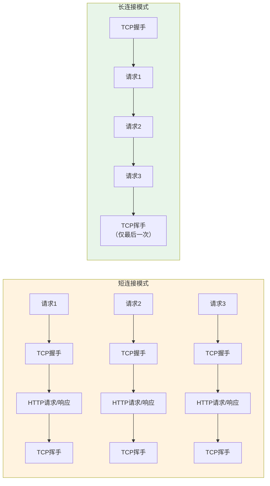
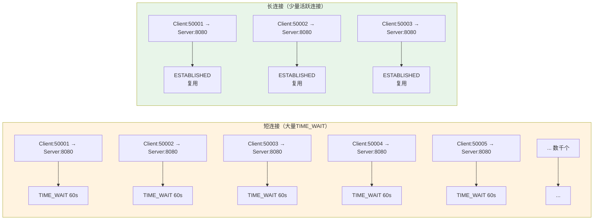
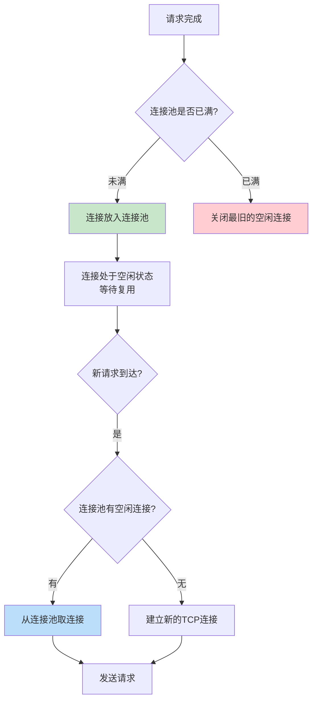
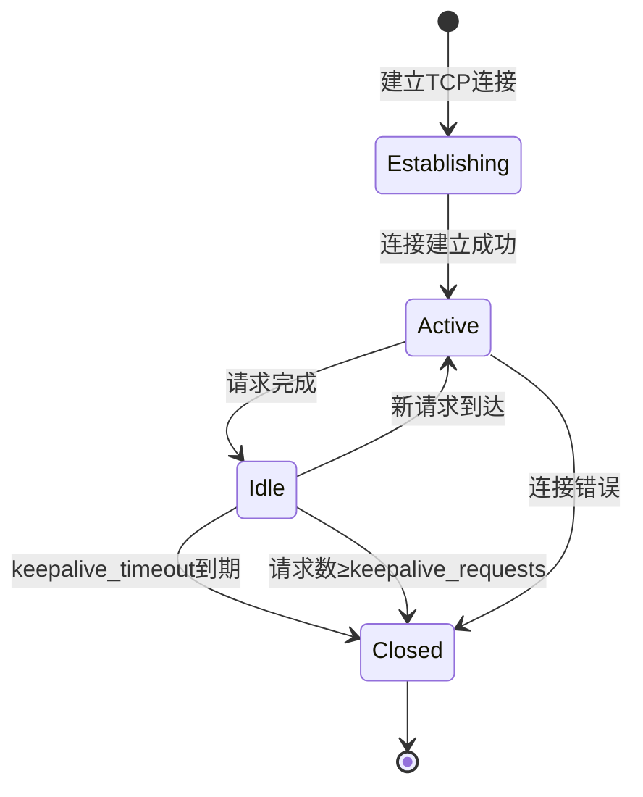
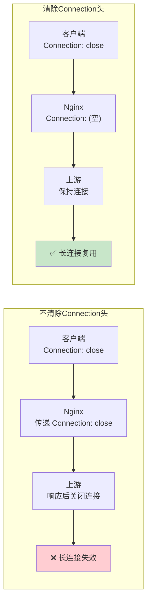
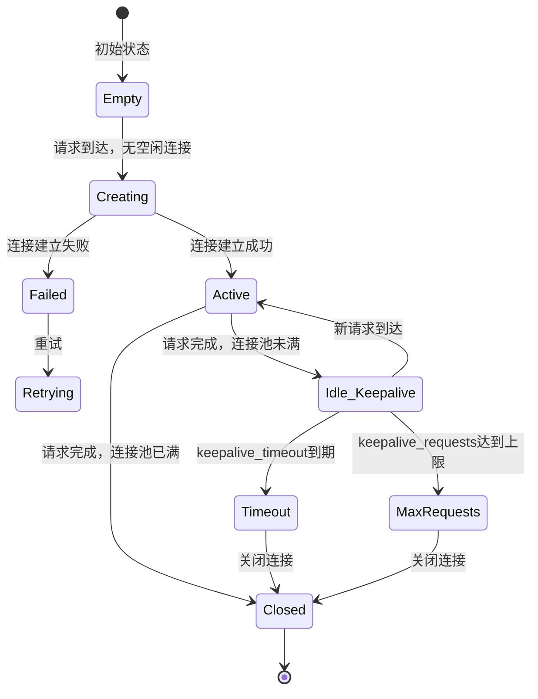
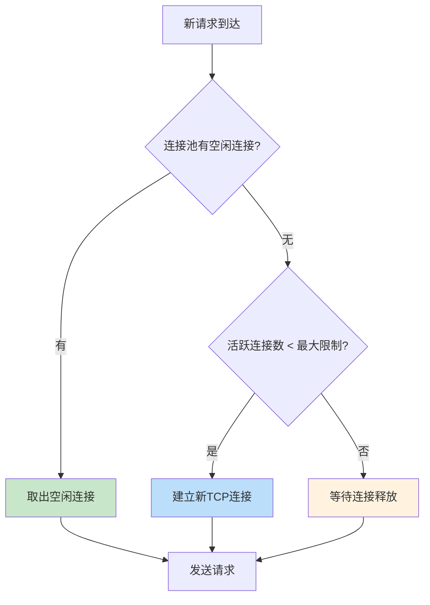
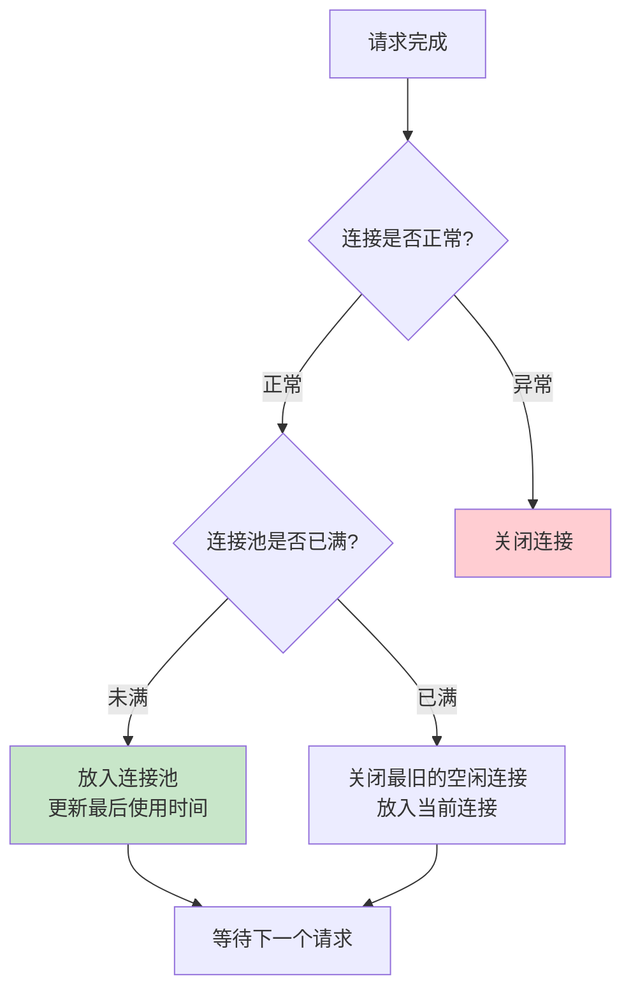

# 上游服务长连接与连接池

## 概述

在 Nginx 反向代理架构中，Nginx 与上游服务之间的连接管理对系统性能有着深远的影响。默认情况下，Nginx 与上游服务使用 HTTP/1.0 短连接——每个请求都建立一个新的 TCP 连接，请求完成后立即关闭。这种模式在高并发场景下会产生大量的 TCP 连接建立和关闭开销。

通过启用 upstream keepalive 长连接和连接池，Nginx 可以复用与上游服务的 TCP 连接，显著减少连接建立开销、降低延迟、提高吞吐量。

::: important 长连接的性能影响
在高并发场景下，短连接的 TCP 握手开销可能占总请求延迟的 30% 以上。启用长连接后，这部分开销几乎可以完全消除，请求延迟可降低 20%-50%。
:::

## 短连接 vs 长连接性能差异

### 连接模式对比



### 性能指标对比

| 指标 | 短连接 | 长连接 |
|------|--------|--------|
| 每请求 TCP 握手 | 1次 | 0次（复用连接） |
| 每请求 TCP 挥手 | 1次 | 0次（复用连接） |
| 每请求延迟增加 | ~1ms（本地）~100ms（跨机房） | ~0ms |
| 服务器端口消耗 | 大量 TIME_WAIT | 极少 |
| 连接建立 CPU 开销 | 高 | 低 |
| 内存占用 | 每连接独立缓冲 | 连接池共享 |
| 适用并发量 | 低~中 | 高~极高 |

### TIME_WAIT 问题

短连接模式下，主动关闭连接的一方会进入 TIME_WAIT 状态，持续 2MSL（通常 60 秒）。高并发时，大量 TIME_WAIT 状态的连接会耗尽端口资源。

```bash
# 查看 TIME_WAIT 连接数
ss -ant state time-wait | wc -l

# 查看各状态连接数
ss -ant | awk '{print $1}' | sort | uniq -c | sort -rn
```



::: warning 端口耗尽
在短连接模式下，Nginx 作为客户端与上游建立连接，端口范围通常为 32768-60999（约 28000 个端口）。每个 TIME_WAIT 连接占用一个端口，持续 60 秒。当 QPS 超过约 460（28000/60）时，端口可能耗尽，导致新的连接无法建立。

启用长连接后，连接被复用，不再产生 TIME_WAIT，端口耗尽问题彻底解决。
:::

## keepalive 指令配置与原理

### 基本配置

```nginx
upstream backend {
    server 10.0.0.1:8080;
    server 10.0.0.2:8080;

    # 连接池大小：每个 worker 进程保持的最大空闲长连接数
    keepalive 32;
}
```

### keepalive 的工作原理

`keepalive` 指令定义了每个 Nginx worker 进程中，连接池里保持的最大空闲长连接数。



### keepalive 参数详解

```nginx
upstream backend {
    server 10.0.0.1:8080;
    server 10.0.0.2:8080;

    # keepalive 数量：每个 worker 进程的最大空闲连接数
    keepalive 32;
}
```

- `keepalive 32` 表示每个 worker 进程最多保持 32 个空闲长连接
- 如果空闲连接数超过 32，最旧的空闲连接会被关闭
- 实际的活跃连接数可以超过 32（keepalive 只限制空闲连接）

### 如何确定 keepalive 的大小

keepalive 的大小取决于以下因素：

1. **QPS**：每秒请求数
2. **请求处理时间**：上游服务的平均响应时间
3. **worker 进程数**：Nginx worker_processes

估算公式：

```
keepalive = (QPS / worker_processes) × 平均请求处理时间（秒）× 1.5（安全系数）
```

示例：

```
QPS = 10000
worker_processes = 4
平均请求处理时间 = 0.05s（50ms）

keepalive = (10000 / 4) × 0.05 × 1.5 = 187.5 ≈ 200
```

### 不同场景的 keepalive 配置

```nginx
# 高并发 API 服务
upstream api_backend {
    server 10.0.0.1:8080;
    server 10.0.0.2:8080;
    keepalive 128;
}

# 普通业务服务
upstream web_backend {
    server 10.0.0.3:3000;
    keepalive 32;
}

# 低流量内部服务
upstream internal_backend {
    server 10.0.0.4:9000;
    keepalive 8;
}

# WebSocket 长连接服务
upstream ws_backend {
    server 10.0.0.5:8080;
    keepalive 256;  # WebSocket 需要更多长连接
}
```

## keepalive_timeout / keepalive_requests

### keepalive_timeout

`keepalive_timeout` 控制 Nginx 与上游服务之间空闲长连接的超时时间。

```nginx
upstream backend {
    server 10.0.0.1:8080;
    server 10.0.0.2:8080;

    keepalive 32;
    keepalive_timeout 60s;  # 空闲连接保持 60 秒
}
```

| 超时设置 | 适用场景 |
|---------|---------|
| `30s` | 高并发，连接使用频繁 |
| `60s` | 一般场景（推荐） |
| `120s` | 低流量，连接使用不频繁 |
| `300s` | 极低流量或跨机房部署 |

::: important keepalive_timeout 的权衡
- **过短**：连接频繁关闭和重建，失去长连接优势
- **过长**：空闲连接占用上游服务器资源，上游重启后可能残留僵死连接
- **建议**：设置为上游服务器的 keepalive 超时时间的 50%-75%
:::

### keepalive_requests

`keepalive_requests` 控制单个长连接上最多处理的请求数。

```nginx
upstream backend {
    server 10.0.0.1:8080;
    server 10.0.0.2:8080;

    keepalive 32;
    keepalive_requests 1000;  # 每个连接最多处理 1000 个请求
    keepalive_timeout 60s;
}
```

| 请求数设置 | 适用场景 |
|-----------|---------|
| `100` | 低流量，需要频繁刷新连接 |
| `1000` | 一般场景（默认） |
| `10000` | 高流量 API，减少连接重建 |

### 连接的生命周期



一个长连接的完整生命周期：

1. **建立连接**：Nginx 与上游服务器建立 TCP 连接
2. **发送请求**：通过该连接发送 HTTP 请求
3. **接收响应**：接收上游服务器的响应
4. **进入空闲**：请求完成后，连接进入空闲状态
5. **复用连接**：新请求到达时，从连接池取出空闲连接
6. **关闭连接**：以下任一条件触发关闭：
   - 空闲时间超过 `keepalive_timeout`
   - 已处理请求数超过 `keepalive_requests`
   - 上游服务器关闭连接
   - 连接错误

## proxy_http_version 1.1 与 Connection 头

### 为什么必须配置这两个指令

Nginx 默认使用 HTTP/1.0 与上游通信，HTTP/1.0 不支持 keepalive。要启用长连接，必须：

1. 使用 `proxy_http_version 1.1` 将协议版本改为 HTTP/1.1
2. 使用 `proxy_set_header Connection ""` 清除 Connection 头

```nginx
location / {
    proxy_pass http://backend;

    # 必须配置
    proxy_http_version 1.1;
    proxy_set_header Connection "";

    # 其他配置
    proxy_set_header Host $host;
    proxy_set_header X-Real-IP $remote_addr;
}
```

### 为什么需要清除 Connection 头

当客户端发送 `Connection: close` 头时，如果 Nginx 将这个头传递给上游，上游会在响应后关闭连接，导致长连接失效。



### HTTP/1.0 vs HTTP/1.1 的区别

| 特性 | HTTP/1.0 | HTTP/1.1 |
|------|----------|----------|
| 默认连接 | 短连接 | 长连接 |
| keepalive | 需显式声明 | 默认启用 |
| 分块传输 | 不支持 | 支持 |
| Host 头 | 非必须 | 必须 |
| 管道化 | 不支持 | 支持 |

::: important proxy_http_version 的默认值
Nginx 的 `proxy_http_version` 默认值为 `1.0`，这意味着如果不显式配置，Nginx 会使用 HTTP/1.0 与上游通信，长连接不会生效。这是一个常见的配置遗漏。
:::

## 连接池工作原理

### 连接池状态机



### 连接池的关键操作

#### 1. 获取连接



#### 2. 归还连接



### 连接池的实现细节

Nginx 的 upstream keepalive 使用了一个缓存队列来管理空闲连接：

```c
// 简化的数据结构
typedef struct {
    ngx_queue_t        cache;       // 空闲连接队列
    ngx_uint_t         cached;      // 当前缓存连接数
    ngx_uint_t         max_cached;  // 最大缓存连接数（keepalive值）
} ngx_http_upstream_keepalive_srv_conf_t;
```

- 空闲连接以队列形式存储
- 新归还的连接插入队列头部
- 需要淘汰时，从队列尾部取出最旧的连接
- 每个连接记录最后使用时间，用于超时检查

## upstream keepalive 配置最佳实践

### 完整配置模板

```nginx
upstream backend {
    # 服务器定义
    server 10.0.0.1:8080 max_fails=3 fail_timeout=30s;
    server 10.0.0.2:8080 max_fails=3 fail_timeout=30s;

    # 长连接配置
    keepalive 32;               # 空闲连接池大小
    keepalive_timeout 60s;      # 空闲连接超时
    keepalive_requests 1000;    # 每连接最大请求数
}

server {
    listen 443 ssl http2;
    server_name api.example.com;

    ssl_certificate /etc/nginx/ssl/example.com.crt;
    ssl_certificate_key /etc/nginx/ssl/example.com.key;

    location / {
        proxy_pass http://backend;

        # 长连接必须配置
        proxy_http_version 1.1;
        proxy_set_header Connection "";

        # 其他头
        proxy_set_header Host $host;
        proxy_set_header X-Real-IP $remote_addr;
        proxy_set_header X-Forwarded-For $proxy_add_x_forwarded_for;
        proxy_set_header X-Forwarded-Proto $scheme;

        # 超时配置
        proxy_connect_timeout 5s;
        proxy_send_timeout 15s;
        proxy_read_timeout 30s;
    }
}
```

### 不同场景的配置建议

#### 高并发 API 服务

```nginx
upstream api_backend {
    server 10.0.0.1:8080;
    server 10.0.0.2:8080;
    server 10.0.0.3:8080;

    keepalive 128;              # 高并发需要更大的连接池
    keepalive_timeout 60s;
    keepalive_requests 5000;    # 允许更多请求复用连接
}
```

#### 低延迟交易系统

```nginx
upstream trading_backend {
    server 10.0.0.1:8080;
    server 10.0.0.2:8080;

    keepalive 256;              # 大连接池确保随时有空闲连接
    keepalive_timeout 30s;      # 较短超时，快速回收僵死连接
    keepalive_requests 10000;   # 高请求复用
}
```

#### 低流量内部服务

```nginx
upstream internal_backend {
    server 10.0.0.4:9000;

    keepalive 8;                # 小连接池即可
    keepalive_timeout 120s;     # 较长超时，避免频繁重建
    keepalive_requests 500;
}
```

#### 多上游服务

```nginx
# 每个上游独立配置 keepalive
upstream api_backend {
    server 10.0.0.1:8080;
    server 10.0.0.2:8080;
    keepalive 64;
}

upstream auth_backend {
    server 10.0.0.3:8080;
    keepalive 16;
}

upstream notification_backend {
    server 10.0.0.4:8080;
    keepalive 32;
}

server {
    listen 443 ssl http2;
    server_name api.example.com;

    ssl_certificate /etc/nginx/ssl/example.com.crt;
    ssl_certificate_key /etc/nginx/ssl/example.com.key;

    location /api/ {
        proxy_pass http://api_backend;
        proxy_http_version 1.1;
        proxy_set_header Connection "";
        proxy_set_header Host $host;
    }

    location /auth/ {
        proxy_pass http://auth_backend;
        proxy_http_version 1.1;
        proxy_set_header Connection "";
        proxy_set_header Host $host;
    }

    location /notifications/ {
        proxy_pass http://notification_backend;
        proxy_http_version 1.1;
        proxy_set_header Connection "";
        proxy_set_header Host $host;
    }
}
```

## 连接池监控与调优

### 连接池状态监控

Nginx 没有直接暴露连接池状态的指标，但可以通过以下方式间接监控：

#### 方法 1：日志分析

```nginx
log_format keepalive_log '$remote_addr - [$time_local] "$request" '
                         '$status '
                         'upstream=$upstream_addr '
                         'upstream_connect_time=$upstream_connect_time '
                         'upstream_time=$upstream_response_time';

access_log /var/log/nginx/keepalive.log keepalive_log;
```

```bash
# 分析连接建立时间
# 如果 upstream_connect_time 大部分为 0，说明连接被复用
# 如果 upstream_connect_time 大部分 > 0，说明连接未被复用
awk -F'upstream_connect_time=' '{print $2}' /var/log/nginx/keepalive.log | \
    awk -F' ' '{print $1}' | sort -n | uniq -c | sort -rn | head -20
```

#### 方法 2：系统级监控

```bash
# 查看 Nginx 与上游的连接数
ss -ant state established | grep :8080 | wc -l

# 查看 TIME_WAIT 连接数
ss -ant state time-wait | grep :8080 | wc -l

# 对比长连接启用前后的 TIME_WAIT 数量
# 启用前：可能有数千个 TIME_WAIT
# 启用后：应该接近 0
```

#### 方法 3：使用 stub_status

```nginx
server {
    listen 80;
    server_name localhost;

    location /nginx_status {
        stub_status;
        access_log off;
        allow 127.0.0.1;
        deny all;
    }
}
```

```
Active connections: 291
server accepts handled requests
  16630948 16630948 31070465
Reading: 6 Writing: 179 Waiting: 106
```

- **Waiting**：空闲 keepalive 连接数（客户端侧）
- **Active connections**：总活跃连接数

### 调优指标

| 指标 | 理想值 | 说明 |
|------|--------|------|
| TIME_WAIT 连接数 | ≈ 0 | 长连接生效的标志 |
| upstream_connect_time | ≈ 0ms | 连接被复用，无握手开销 |
| 每秒新建连接数 | << QPS | 大部分请求复用连接 |
| 空闲连接数 | 适中 | 过多浪费资源，过少无法复用 |

### 调优方法

#### 1. 调整 keepalive 大小

```bash
# 观察连接池使用情况
# 如果空闲连接经常为 0，增大 keepalive
# 如果空闲连接远超 keepalive，减小 keepalive

# 计算：QPS / worker_processes × 平均响应时间
# 例：10000 / 4 × 0.05 = 125
upstream backend {
    keepalive 128;  # 略大于计算值
}
```

#### 2. 调整 keepalive_timeout

```nginx
# 观察空闲连接的等待时间
# 如果连接在超时前就被复用，可以缩短超时
# 如果连接经常因超时关闭，需要延长超时

upstream backend {
    keepalive_timeout 60s;  # 与上游服务器的 keepalive 超时对齐
}
```

#### 3. 调整 keepalive_requests

```nginx
# 如果连接因达到请求上限而频繁关闭，增大 keepalive_requests
# 注意：过大的值可能导致内存泄漏（如果上游有此问题）

upstream backend {
    keepalive_requests 5000;
}
```

### 常见调优问题

#### 问题 1：keepalive 不生效

**现象**：仍然有大量 TIME_WAIT 连接

**排查**：

```bash
# 检查配置
nginx -T 2>/dev/null | grep -A5 "proxy_http_version"
nginx -T 2>/dev/null | grep -A5 "keepalive"
```

**常见原因**：

1. 缺少 `proxy_http_version 1.1;`
2. 缺少 `proxy_set_header Connection "";`
3. upstream 块中缺少 `keepalive` 指令
4. 使用了 `proxy_set_header Connection "close";`

```nginx
# 错误配置
location / {
    proxy_pass http://backend;
    # 缺少 proxy_http_version 1.1
    # 缺少 proxy_set_header Connection ""
}

# 正确配置
location / {
    proxy_pass http://backend;
    proxy_http_version 1.1;
    proxy_set_header Connection "";
}
```

#### 问题 2：上游服务关闭连接

**现象**：Nginx 日志中出现 `upstream prematurely closed connection`

**原因**：上游服务的 keepalive 超时比 Nginx 的 `keepalive_timeout` 短

**解决**：确保 Nginx 的 `keepalive_timeout` 小于上游服务的 keepalive 超时

```nginx
# Nginx keepalive_timeout 应小于上游服务器的 keepalive 超时
# 例如：上游 Spring Boot server.connection-timeout=120s
upstream backend {
    keepalive_timeout 60s;  # 小于上游的 120s
}
```

#### 问题 3：上游服务重启后连接失败

**现象**：上游服务重启后，Nginx 的第一批请求失败

**原因**：连接池中保留了旧连接，旧连接已经被上游关闭

**解决**：

1. 减小 `keepalive_timeout`，加快旧连接清理
2. 依赖 `proxy_next_upstream` 在连接失败时重试
3. 上游服务使用优雅关闭（先停止接受新连接，等现有连接处理完毕）

```nginx
location / {
    proxy_pass http://backend;
    proxy_http_version 1.1;
    proxy_set_header Connection "";

    # 连接失败时重试
    proxy_next_upstream error timeout;
}
```

## 与上游服务的连接管理

### 上游服务配置

上游服务也需要正确配置 keepalive 才能使长连接生效。

#### Spring Boot

```yaml
# application.yml
server:
  port: 8080
  connection-timeout: 120000  # 连接超时 120s
  tomcat:
    connection-timeout: 120000
    keep-alive-timeout: 60000  # keepalive 超时 60s
    max-keep-alive-requests: 10000  # 每连接最大请求数
```

#### Node.js (Express)

```javascript
const express = require('express');
const app = express();

const server = app.listen(8080, () => {
    console.log('Server running on port 8080');
});

// 设置 keepalive
server.keepAliveTimeout = 60000;   // 60s
server.headersTimeout = 65000;     // 略大于 keepAliveTimeout
```

#### Go

```go
package main

import (
    "net/http"
    "time"
)

func main() {
    server := &http.Server{
        Addr:         ":8080",
        ReadTimeout:  15 * time.Second,
        WriteTimeout: 30 * time.Second,
        IdleTimeout:  60 * time.Second, // keepalive 超时
    }
    server.ListenAndServe()
}
```

#### Python (uvicorn)

```bash
# uvicorn 启动参数
uvicorn app:app --host 0.0.0.0 --port 8080 --timeout-keep-alive 60
```

### 连接超时对齐

Nginx 与上游服务的 keepalive 超时需要对齐，确保：

1. **Nginx keepalive_timeout < 上游 keepalive 超时**：Nginx 在上游关闭连接前主动释放
2. **Nginx keepalive_requests < 上游最大请求数**：避免连接在上游被强制关闭

```
上游服务 (Spring Boot)
├── keep-alive-timeout: 60s
└── max-keep-alive-requests: 10000

Nginx (upstream)
├── keepalive_timeout: 45s     ← 上游的 75%
└── keepalive_requests: 5000   ← 上游的 50%
```

::: important 超时对齐的重要性
如果 Nginx 的 keepalive_timeout 大于上游的超时，Nginx 可能将一个已被上游关闭的连接分配给新请求，导致请求失败。虽然 `proxy_next_upstream` 可以在失败时重试，但这增加了请求延迟。
:::

### WebSocket 与长连接

WebSocket 连接是持久连接，需要特殊处理：

```nginx
upstream ws_backend {
    server 10.0.0.1:8080;
    keepalive 128;  # WebSocket 需要更大的连接池
}

server {
    listen 443 ssl http2;
    server_name ws.example.com;

    location /ws/ {
        proxy_pass http://ws_backend;

        # WebSocket 必须配置
        proxy_http_version 1.1;
        proxy_set_header Upgrade $http_upgrade;
        proxy_set_header Connection "upgrade";

        # 长超时
        proxy_read_timeout 86400s;
    }
}
```

注意：WebSocket 连接不会被放入 upstream keepalive 连接池，因为它们是升级后的长连接，不会进入空闲状态。upstream keepalive 连接池只管理 HTTP 长连接。

### gRPC 与长连接

gRPC 基于 HTTP/2，天然支持多路复用：

```nginx
upstream grpc_backend {
    server 10.0.0.1:9000;
    keepalive 32;
}

server {
    listen 443 ssl http2;
    server_name grpc.example.com;

    location / {
        grpc_pass grpc://grpc_backend;

        # gRPC 超时
        grpc_connect_timeout 5s;
        grpc_read_timeout 60s;
        grpc_send_timeout 60s;
    }
}
```

## 生产环境完整配置

```nginx
# ========================================
# 全局配置
# ========================================

user nginx;
worker_processes auto;

events {
    worker_connections 4096;
    multi_accept on;
    use epoll;
}

http {
    include       mime.types;
    default_type  application/octet-stream;

    sendfile on;
    tcp_nopush on;
    tcp_nodelay on;

    keepalive_timeout 65s;
    keepalive_requests 5000;

    # ========================================
    # 上游服务定义
    # ========================================

    upstream api_backend {
        least_conn;

        server 10.0.0.1:8080 weight=3 max_fails=3 fail_timeout=30s;
        server 10.0.0.2:8080 weight=3 max_fails=3 fail_timeout=30s;
        server 10.0.0.3:8080 weight=2 max_fails=3 fail_timeout=30s;
        server 10.0.0.4:8080 backup max_fails=5 fail_timeout=60s;

        # 长连接配置
        keepalive 128;
        keepalive_timeout 45s;
        keepalive_requests 5000;
    }

    upstream auth_backend {
        server 10.0.1.1:8080 max_fails=3 fail_timeout=30s;

        keepalive 16;
        keepalive_timeout 45s;
        keepalive_requests 2000;
    }

    # ========================================
    # 共享配置
    # ========================================

    map $http_upgrade $connection_upgrade {
        default upgrade;
        ''      close;
    }

    log_format detailed '$remote_addr - [$time_local] "$request" '
                        '$status $body_bytes_sent '
                        '"$http_referer" "$http_user_agent" '
                        'upstream=$upstream_addr '
                        'upstream_status=$upstream_status '
                        'upstream_connect=$upstream_connect_time '
                        'upstream_time=$upstream_response_time '
                        'rt=$request_time';

    # ========================================
    # 服务器配置
    # ========================================

    server {
        listen 443 ssl http2;
        server_name api.example.com;

        ssl_certificate /etc/nginx/ssl/example.com.crt;
        ssl_certificate_key /etc/nginx/ssl/example.com.key;

        # API 代理
        location / {
            proxy_pass http://api_backend;

            # 长连接必须配置
            proxy_http_version 1.1;
            proxy_set_header Connection "";

            # 头传递
            proxy_set_header Host $host;
            proxy_set_header X-Real-IP $remote_addr;
            proxy_set_header X-Forwarded-For $proxy_add_x_forwarded_for;
            proxy_set_header X-Forwarded-Proto $scheme;

            # 超时
            proxy_connect_timeout 5s;
            proxy_send_timeout 15s;
            proxy_read_timeout 30s;

            # 故障转移
            proxy_next_upstream error timeout http_502 http_503 http_504;
            proxy_next_upstream_timeout 10s;
            proxy_next_upstream_tries 3;
        }

        # 认证代理
        location /auth/ {
            proxy_pass http://auth_backend;

            proxy_http_version 1.1;
            proxy_set_header Connection "";
            proxy_set_header Host $host;
            proxy_set_header X-Real-IP $remote_addr;
        }

        # WebSocket
        location /ws/ {
            proxy_pass http://api_backend;

            proxy_http_version 1.1;
            proxy_set_header Upgrade $http_upgrade;
            proxy_set_header Connection $connection_upgrade;
            proxy_set_header Host $host;
            proxy_set_header X-Real-IP $remote_addr;

            proxy_read_timeout 86400s;
        }

        # 状态监控
        location /nginx_status {
            stub_status;
            access_log off;
            allow 127.0.0.1;
            allow 10.0.0.0/8;
            deny all;
        }

        access_log /var/log/nginx/api_access.log detailed;
        error_log /var/log/nginx/api_error.log warn;
    }
}
```

## 小结

上游服务长连接和连接池是 Nginx 反向代理性能优化的关键配置：

1. **性能提升显著**：长连接消除了 TCP 握手开销，降低延迟 20%-50%
2. **三个必要配置**：`keepalive` + `proxy_http_version 1.1` + `proxy_set_header Connection ""`
3. **keepalive 大小**：根据 QPS、worker 数和响应时间估算
4. **超时对齐**：Nginx 的 keepalive_timeout 应小于上游服务器的超时
5. **监控验证**：通过 TIME_WAIT 数量和 upstream_connect_time 验证长连接生效
6. **故障处理**：配合 `proxy_next_upstream` 处理连接失败

::: tip 进一步阅读
- [ngx_http_upstream_module - keepalive](https://nginx.org/en/docs/http/ngx_http_upstream_module.html#keepalive)
- [ngx_http_proxy_module - proxy_http_version](https://nginx.org/en/docs/http/ngx_http_proxy_module.html#proxy_http_version)
- [Nginx Upstream Keepalive](https://nginx.org/en/docs/http/ngx_http_upstream_module.html#keepalive)
:::
