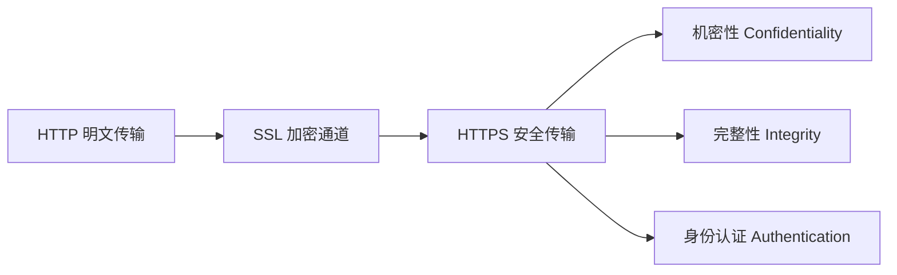
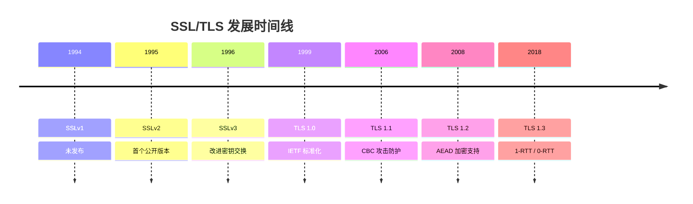
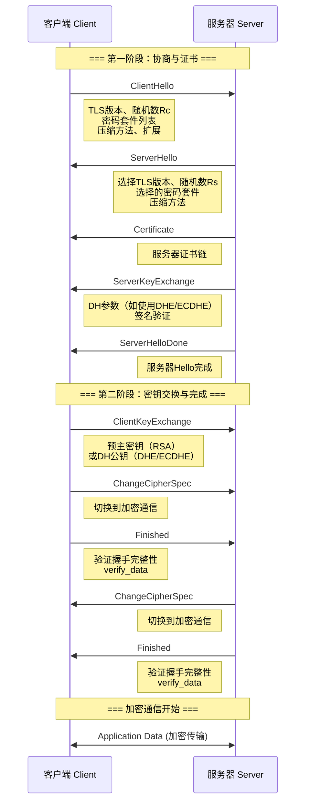
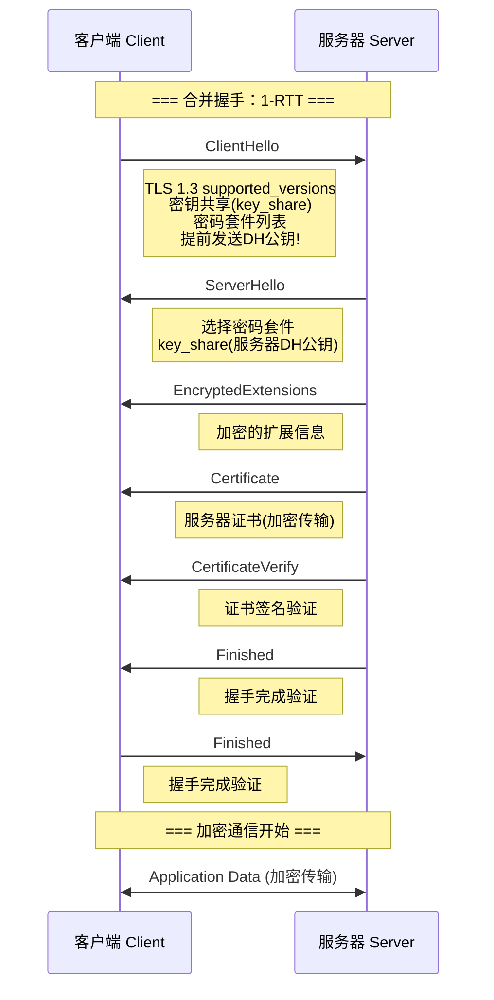
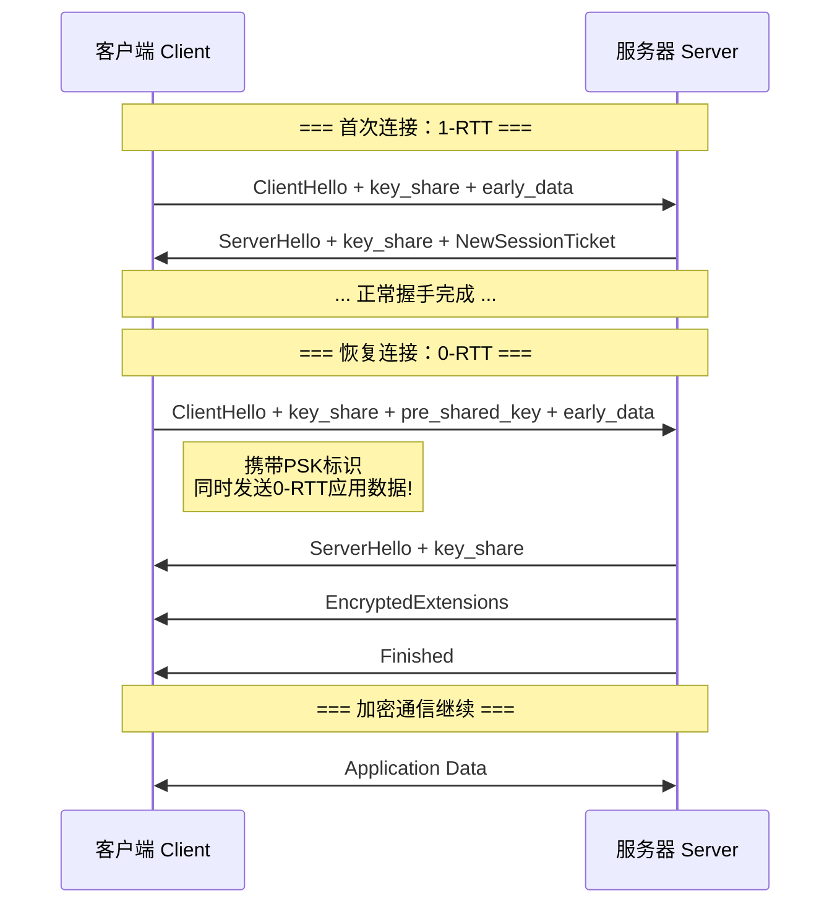
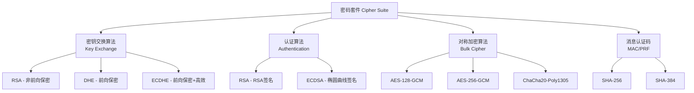
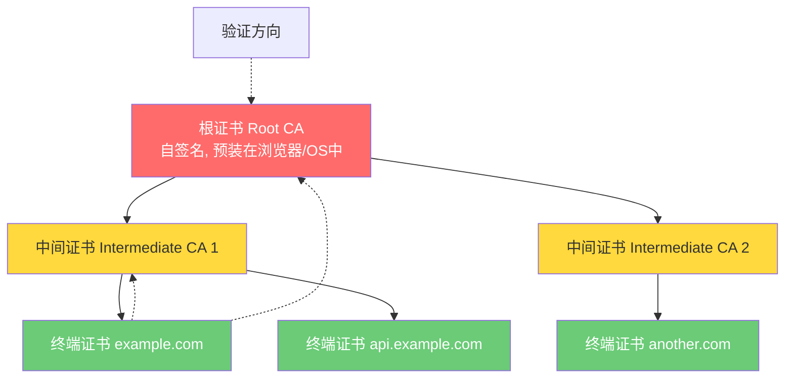

# SSL/TLS 握手原理

## 从 HTTP 到 HTTPS 的演进

HTTP 协议以明文方式传输数据，这意味着在客户端与服务器之间的任何中间人都可以窃听、篡改通信内容。SSL/TLS 协议的引入正是为了在传输层之上构建加密通道，实现数据的**机密性**、**完整性**和**身份认证**。



HTTPS 并非一个独立的协议，而是 HTTP over TLS 的组合：HTTP 负责应用层通信，TLS 负责加密与安全。在 Nginx 中，TLS 由 `ngx_http_ssl_module` 模块提供支持，底层依赖 OpenSSL 库。

::: tip 术语区分
- **SSL**（Secure Sockets Layer）：由 Netscape 提出，已废弃
- **TLS**（Transport Layer Security）：SSL 的继任者，IETF 标准化
- 日常说"SSL证书"实际指 TLS 证书，多数工具和配置仍沿用 SSL 命名
:::

---

## SSL/TLS 发展历史

SSL/TLS 协议经历了多次迭代，每次版本升级都带来了安全性与性能的改进：

| 版本 | 年份 | 状态 | 关键改进 |
|------|------|------|----------|
| SSLv1 | 1994 | 从未发布 | 原型，存在严重缺陷 |
| SSLv2 | 1995 | 已废弃 | 首个公开版本，存在中间人攻击漏洞 |
| SSLv3 | 1996 | 已废弃 | 添加了密钥交换改进，但存在 POODLE 攻击 |
| TLS 1.0 | 1999 | 已废弃 | IETF 标准化（RFC 2246），实质是 SSLv3.1 |
| TLS 1.1 | 2006 | 已废弃 | 添加 CBC 攻击防护（RFC 4346） |
| TLS 1.2 | 2008 | 广泛使用 | 支持 AEAD 加密（RFC 5246），当前主流版本 |
| TLS 1.3 | 2018 | 推荐使用 | 1-RTT 握手、0-RTT 恢复、移除不安全算法（RFC 8446） |



::: warning 已废弃协议
SSLv2、SSLv3、TLS 1.0、TLS 1.1 均已被 IETF 正式废弃（RFC 8996）。这些协议存在已知安全漏洞：
- **POODLE**（Padding Oracle On Downgraded Legacy Encryption）：针对 SSLv3
- **BEAST**（Browser Exploit Against SSL/TLS）：针对 TLS 1.0
- **RC4 偏差攻击**：针对使用 RC4 的早期 TLS
:::

### 版本协商机制

客户端与服务器在握手阶段协商使用的 TLS 版本。TLS 1.3 引入了全新的版本协商方式：

- **TLS 1.2 及更早**：通过 `ClientHello.client_version` 字段协商，容易遭受协议降级攻击
- **TLS 1.3**：使用 `supported_versions` 扩展进行协商，并引入 `downgrade_sentinel` 防止降级攻击

```
# TLS 1.2 版本协商
ClientHello: client_version = TLS 1.2
ServerHello: server_version = TLS 1.2 (选择双方支持的最高版本)

# TLS 1.3 版本协商
ClientHello: supported_versions = [TLS 1.3, TLS 1.2]
ServerHello: supported_versions = TLS 1.3
```

---

## TLS 1.2 握手完整流程

TLS 1.2 的完整握手需要 **2 个 RTT**（Round-Trip Time），是理解 TLS 工作原理的基础。



### ClientHello 详解

ClientHello 是握手的第一步，客户端向服务器发送以下信息：

```nginx
# 在 Nginx 中可配置客户端支持的协议和密码套件
# 参考：https://nginx.org/en/docs/http/ngx_http_ssl_module.html#ssl_protocols

ssl_protocols TLSv1.2 TLSv1.3;
ssl_ciphers 'ECDHE-ECDSA-AES128-GCM-SHA256:ECDHE-RSA-AES128-GCM-SHA256';
```

ClientHello 包含的关键字段：

| 字段 | 说明 | 示例 |
|------|------|------|
| client_version | 客户端支持的最高 TLS 版本 | TLS 1.2 (0x0303) |
| random | 32 字节随机数 Rc | 随机生成，用于密钥推导 |
| session_id | 会话 ID（空表示新会话） | 0 字节或 32 字节 |
| cipher_suites | 客户端支持的密码套件列表 | 按优先级排列 |
| compression_methods | 压缩方法列表 | 通常为 null |
| extensions | 扩展字段 | SNI、ALPN、signature_algorithms 等 |

::: important 随机数的作用
ClientHello 和 ServerHello 中的随机数（Rc、Rs）是密钥推导的关键输入。它们确保每次握手生成的密钥都不同，即使使用相同的预主密钥（Pre-Master Secret），也能产生不同的主密钥（Master Secret），有效防止重放攻击。
:::

### ServerHello 详解

服务器从客户端提供的选项中选择一组参数：

```
ServerHello {
    server_version     = TLS 1.2          // 选择的TLS版本
    random             = Rs               // 32字节服务器随机数
    session_id         = <session_id>     // 会话ID
    cipher_suite       = 0xC02F           // 选择的密码套件
    compression_method = 0x00             // null压缩
    extensions         = ...              // 服务器扩展
}
```

### Certificate 消息

服务器发送其证书链，通常包含：

1. **服务器证书（End-Entity Certificate）**：包含服务器公钥和域名信息
2. **中间证书（Intermediate CA Certificate）**：签发服务器证书的 CA
3. 通常不包含根证书（客户端应已信任根证书）

证书的 X.509 结构关键字段：

```
Certificate {
    Version: V3
    Serial Number: 01:23:45:67:89:AB:CD:EF
    Signature Algorithm: sha256WithRSAEncryption
    Issuer: C=US, O=Let's Encrypt, CN=R3
    Validity:
        Not Before: Jan 1 00:00:00 2025 GMT
        Not After : Apr 1 00:00:00 2025 GMT
    Subject: CN=example.com
    Subject Public Key Info:
        Public Key Algorithm: id-ecPublicKey
        EC Public Key: (256 bit)
    Extensions:
        subjectAltName: DNS:example.com, DNS:*.example.com
        authorityInfoAccess: OCSP - URI:http://r3.o.lencr.org
        ...
}
```

### ServerKeyExchange 与密钥推导

根据密码套件中密钥交换算法的不同，ServerKeyExchange 的内容也不同：

**RSA 密钥交换**：不需要 ServerKeyExchange，预主密钥由客户端生成并使用服务器公钥加密

**DHE 密钥交换**：服务器发送 DH 参数和公钥

```
ServerKeyExchange {
    dh_p       = <大素数p>           // DH参数
    dh_g       = <生成元g>           // DH参数
    dh_Ys      = <服务器DH公钥>      // g^b mod p
    signature  = <签名>              // 服务器对参数的签名
}
```

**ECDHE 密钥交换**：服务器发送曲线参数和公钥

```
ServerKeyExchange {
    curve_type = named_curve
    named_curve = x25519             // 椭圆曲线名称
    public_key  = <服务器ECDH公钥>   // 65字节(未压缩格式)
    signature   = <签名>
}
```

### 密钥推导过程

TLS 1.2 的密钥推导使用 PRF（Pseudo-Random Function）：

```
# 预主密钥（Pre-Master Secret）的生成
# RSA:  客户端生成48字节随机数，用服务器公钥加密
# DHE:  两者计算共享密钥
# ECDHE: 两者计算共享密钥

# 主密钥（Master Secret）推导
MasterSecret = PRF(PreMasterSecret, "master secret",
                   ClientHello.random + ServerHello.random)

# 密钥块（Key Block）推导
KeyBlock = PRF(MasterSecret, "key expansion",
               ServerHello.random + ClientHello.random)

# 密钥块分割为：
# client_write_MAC_key[N]    客户端MAC密钥
# server_write_MAC_key[N]    服务器MAC密钥
# client_write_key[N]        客户端加密密钥
# server_write_key[N]        服务器加密密钥
# client_write_IV[N]         客户端IV
# server_write_IV[N]         服务器IV
```

::: info 为什么需要两个随机数
ClientHello.random 和 ServerHello.random 共同参与密钥推导。即使攻击者知道其中一个随机数，只要另一个保持不可预测，生成的密钥就是安全的。两个随机数的组合大大增加了密钥的不可预测性。
:::

### ChangeCipherSpec 与 Finished

ChangeCipherSpec 消息通知对方后续消息将使用协商好的加密参数。Finished 消息是第一条加密消息，包含 `verify_data`，用于验证握手过程未被篡改：

```
verify_data = PRF(MasterSecret, finished_label,
                  Hash(handshake_messages))
```

其中 `handshake_messages` 是所有握手消息的拼接哈希，`finished_label` 对客户端为 `"client finished"`，对服务器为 `"server finished"`。

---

## TLS 1.3 握手改进

TLS 1.3 是对 TLS 协议的重大简化，移除了大量不安全的遗留特性，将握手从 2-RTT 缩短到 1-RTT，并支持 0-RTT 恢复。

### TLS 1.3 移除的特性

| 移除的特性 | 原因 |
|------------|------|
| RSA 密钥交换 | 不支持前向保密（Forward Secrecy） |
| DHE 密钥交换 | 效率低于 ECDHE |
| CBC 模式加密 | 易受 Lucky13 等攻击 |
| RC4 加密 | 已知不安全 |
| SHA-1 哈希 | 碰撞攻击 |
| MD5 哈希 | 已知不安全 |
| 压缩协商 | CRIME 攻击 |
| renegotiation | 复杂且存在安全漏洞 |
| 非 AEAD 密码套件 | 缺乏认证加密 |

### TLS 1.3 的 1-RTT 握手



::: important 核心改进：提前发送密钥共享
TLS 1.3 的关键优化在于客户端在 ClientHello 中就发送 DH 公钥（key_share 扩展）。服务器收到后可以直接计算出共享密钥，使得 ServerHello 之后的消息全部加密传输。这比 TLS 1.2 节省了一个 RTT。
:::

### TLS 1.3 密码套件

TLS 1.3 大幅简化了密码套件，仅保留 5 个：

| 密码套件 | 密钥交换 | 认证 | 加密 | 哈希 |
|----------|----------|------|------|------|
| TLS_AES_128_GCM_SHA256 | ECDHE | RSA/ECDSA | AES-128-GCM | SHA-256 |
| TLS_AES_256_GCM_SHA384 | ECDHE | RSA/ECDSA | AES-256-GCM | SHA-384 |
| TLS_CHACHA20_POLY1305_SHA256 | ECDHE | RSA/ECDSA | ChaCha20-Poly1305 | SHA-256 |
| TLS_AES_128_CCM_SHA256 | ECDHE | RSA/ECDSA | AES-128-CCM | SHA-256 |
| TLS_AES_128_CCM_8_SHA256 | ECDHE | RSA/ECDSA | AES-128-CCM-8 | SHA-256 |

在 Nginx 中配置 TLS 1.3 密码套件：

```nginx
# 参考：https://nginx.org/en/docs/http/ngx_http_ssl_module.html#ssl_ciphers

# TLS 1.3 密码套件配置（OpenSSL 1.1.1+）
ssl_ciphers 'TLS_AES_128_GCM_SHA256:TLS_AES_256_GCM_SHA384:TLS_CHACHA20_POLY1305_SHA256';

# TLS 1.3 的密码套件用冒号分隔，与 TLS 1.2 语法一致
# 但实际 TLS 1.3 密码套件是独立协商的，不受 ssl_ciphers 顺序影响
```

### TLS 1.3 的 0-RTT 恢复

当客户端之前与服务器建立过 TLS 1.3 连接时，可以使用 PSK（Pre-Shared Key）实现 0-RTT 恢复：



::: warning 0-RTT 的安全风险
0-RTT 数据容易遭受**重放攻击**，因为攻击者可以截获 0-RTT 数据并重新发送。以下操作不应通过 0-RTT 发送：
- 非幂等操作（如 POST 请求）
- 状态修改操作（如支付、转账）
- 任何具有副作用的请求

Nginx 默认不启用 0-RTT，需要显式配置 `ssl_early_data on;`。
:::

### TLS 1.3 密钥推导

TLS 1.3 使用 HKDF（HMAC-based Key Derivation Function）替代了 TLS 1.2 的 PRF：

```
# TLS 1.3 密钥推导层次

Early Secret ──→ early_exporter_master_secret
             ──→ client_early_traffic_secret

           Handshake Secret ──→ client_handshake_traffic_secret
                           ──→ server_handshake_traffic_secret

                      Master Secret ──→ client_application_traffic_secret
                                   ──→ server_application_traffic_secret
                                   ──→ exporter_master_secret
                                   ──→ resumption_master_secret
```

每一层密钥独立推导，实现了密钥隔离（Key Separation），即使某一层密钥泄露也不会影响其他层。

### Nginx 启用 TLS 1.3

```nginx
# 参考：https://nginx.org/en/docs/http/ngx_http_ssl_module.html#ssl_protocols

server {
    listen 443 ssl;
    server_name example.com;

    # 启用 TLS 1.3（需要 OpenSSL 1.1.1+）
    ssl_protocols TLSv1.2 TLSv1.3;

    # TLS 1.3 early data（0-RTT），默认 off
    # 谨慎启用，存在重放攻击风险
    ssl_early_data off;

    # 0-RTT 请求携带此头部，后端可据此判断
    add_header Early-Data $ssl_early_data;
}
```

检查当前 Nginx 是否支持 TLS 1.3：

```bash
# 检查 OpenSSL 版本
openssl version
# 需要 OpenSSL 1.1.1 或更高

# 检查 Nginx 编译参数
nginx -V 2>&1 | grep -o 'ssl.*'
# 确认包含 --with-http_ssl_module

# 测试 TLS 1.3 连接
openssl s_client -connect example.com:443 -tls1_3
```

---

## 密码套件（Cipher Suite）

密码套件定义了 TLS 连接使用的加密算法组合，是 TLS 安全的核心。

### 密码套件的命名规则

以 `TLS_ECDHE_RSA_WITH_AES_128_GCM_SHA256` 为例：

```
TLS _ ECDHE _ RSA _ WITH _ AES_128_GCM _ SHA256
 │      │       │       │        │           │
 │      │       │       │        │           └─ PRF/HMAC算法
 │      │       │       │        └─ 对称加密算法与模式
 │      │       │       └─ 分隔符
 │      │       └─ 身份认证算法
 │      └─ 密钥交换算法
 └─ 协议标识

TLS 1.3 密码套件命名简化了（密钥交换和认证不再包含在套件名中）：
TLS_AES_128_GCM_SHA256
 └─ 对称加密 + 哈希
```

### 密码套件四大组成部分



::: tip TLS 1.3 的简化
TLS 1.3 的密码套件不再包含密钥交换和认证算法，因为这些由单独的扩展协商。TLS 1.3 密码套件只指定对称加密和哈希算法。
:::

### 常见密码套件对比

| 密码套件 | 密钥交换 | 认证 | 加密 | MAC | 前向保密 | 安全等级 |
|----------|----------|------|------|-----|----------|----------|
| TLS_ECDHE_RSA_WITH_AES_128_GCM_SHA256 | ECDHE | RSA | AES-128-GCM | SHA-256 | 是 | 推荐 |
| TLS_ECDHE_RSA_WITH_AES_256_GCM_SHA384 | ECDHE | RSA | AES-256-GCM | SHA-384 | 是 | 推荐 |
| TLS_ECDHE_RSA_WITH_CHACHA20_POLY1305_SHA256 | ECDHE | RSA | ChaCha20-Poly1305 | SHA-256 | 是 | 推荐 |
| TLS_RSA_WITH_AES_128_GCM_SHA256 | RSA | RSA | AES-128-GCM | SHA-256 | 否 | 不推荐 |
| TLS_RSA_WITH_AES_256_CBC_SHA | RSA | RSA | AES-256-CBC | SHA-1 | 否 | 弃用 |

---

## 密钥交换算法

密钥交换算法决定了客户端和服务器如何安全地协商出共享的对称密钥。

### RSA 密钥交换

RSA 密钥交换是最古老的方式，已被 TLS 1.3 移除：

```
1. 客户端获取服务器证书中的 RSA 公钥
2. 客户端生成 48 字节的预主密钥（Pre-Master Secret）
3. 客户端用服务器公钥加密预主密钥
4. 服务器用私钥解密，获得预主密钥
5. 双方基于预主密钥推导主密钥
```

**致命缺陷**：不支持前向保密（Forward Secrecy）。如果服务器私钥泄露，所有历史通信都可被解密。

::: warning 前向保密（Forward Secrecy）
前向保密是指长期密钥泄露不会导致历史会话密钥泄露。实现前向保密的关键是：每次会话使用临时的（ephemeral）密钥对进行密钥交换，而非使用长期私钥直接加密。
:::

### DHE 密钥交换

Diffie-Hellman Ephemeral 密钥交换提供前向保密：

```
1. 服务器生成 DH 参数 (p, g) 和临时私钥 b，计算 Ys = g^b mod p
2. 客户端生成临时私钥 a，计算 Yc = g^a mod p
3. 双方交换公钥：客户端发送 Yc，服务器发送 Ys
4. 双方计算共享密钥：
   - 客户端：K = Ys^a mod p = g^(ab) mod p
   - 服务器：K = Yc^b mod p = g^(ab) mod p
5. 临时密钥 a, b 在会话结束后销毁
```

**优点**：支持前向保密
**缺点**：计算量大（大素数模运算），握手延迟高

### ECDHE 密钥交换

Elliptic Curve Diffie-Hellman Ephemeral 是当前推荐的密钥交换方式：

```
1. 服务器选择椭圆曲线和临时密钥对 (dS, QS)，QS = dS × G
2. 客户端选择临时密钥对 (dC, QC)，QC = dC × G
3. 双方交换公钥点 QS 和 QC
4. 双方计算共享密钥：
   - 客户端：K = dC × QS = dC × dS × G
   - 服务器：K = dS × QC = dS × dC × G
5. 临时密钥在会话结束后销毁
```

**支持的曲线**：

| 曲线名称 | 密钥长度 | 安全等级 | 性能 | 推荐 |
|----------|----------|----------|------|------|
| X25519 | 256 bit | ~128 bit | 优秀 | 推荐 |
| secp256r1 (P-256) | 256 bit | ~128 bit | 良好 | 可用 |
| secp384r1 (P-384) | 384 bit | ~192 bit | 较慢 | 特殊需求 |
| X448 | 448 bit | ~224 bit | 较慢 | 特殊需求 |

在 Nginx 中配置 ECDHE 曲线：

```nginx
# 参考：https://nginx.org/en/docs/http/ngx_http_ssl_module.html#ssl_ecdh_curve

server {
    listen 443 ssl;

    # 优先使用 X25519
    ssl_ecdh_curve X25519:secp256r1:secp384r1;
}
```

### 三种密钥交换算法对比

| 特性 | RSA | DHE | ECDHE |
|------|-----|-----|-------|
| 前向保密 | 否 | 是 | 是 |
| 密钥长度 | 2048+ bit | 2048+ bit | 256 bit |
| 计算性能 | 快（仅客户端加密） | 慢 | 快 |
| 握手延迟 | 1-RTT | 2-RTT | 2-RTT (TLS 1.2) |
| TLS 1.3 | 不支持 | 不支持 | 唯一选择 |
| 安全性 | 低（无FS） | 中 | 高 |

---

## 对称加密算法

密钥交换完成后，后续通信使用对称加密算法，其性能远优于非对称加密。

### AES-GCM

AES（Advanced Encryption Standard）搭配 GCM（Galois/Counter Mode）模式，是目前最广泛使用的 AEAD 加密：

```
AES-GCM 工作原理：
1. 计数器模式（CTR）：将 AES 块加密转换为流加密
2. 伽罗瓦域乘法（GHASH）：提供认证标签
3. 同时提供加密和完整性验证

加密过程：
nonce ──→ IV 构造
         ↓
     AES-CTR ──→ 密文
         ↓
     GHASH  ──→ 认证标签 Tag

解密过程：
密文 + Tag ──→ 验证 Tag
              ↓ 通过
           AES-CTR ──→ 明文
```

**AES-GCM 变体**：

| 变体 | 密钥长度 | 安全等级 | 性能 | 硬件加速 |
|------|----------|----------|------|----------|
| AES-128-GCM | 128 bit | 128 bit | 快 | AES-NI |
| AES-256-GCM | 256 bit | 256 bit | 稍慢 | AES-NI |

::: tip AES-NI 硬件加速
现代 x86 处理器提供 AES-NI 指令集，可将 AES-GCM 性能提升 10-50 倍。检查 CPU 是否支持：

```bash
# Linux
grep -o aes /proc/cpuinfo

# 在 Nginx 中，OpenSSL 自动利用 AES-NI
openssl speed aes-128-gcm
openssl speed aes-256-gcm
```
:::

### ChaCha20-Poly1305

ChaCha20-Poly1305 是由 Google 推广的 AEAD 加密算法，特别适合没有 AES-NI 硬件加速的设备（如手机、IoT 设备）：

```
ChaCha20-Poly1305 工作原理：
1. ChaCha20 流密码：生成密钥流
2. Poly1305 MAC：生成认证标签
3. 同样是 AEAD，提供加密+认证

优势：
- 纯软件实现性能优秀（约 AES-GCM 的 2-3 倍，无 AES-NI 时）
- 常数时间实现，无时序攻击风险
- 256 bit 密钥，安全强度足够
```

**性能对比**（无 AES-NI 的 ARM 设备）：

| 算法 | 加密速度 | 认证速度 | 总体 |
|------|----------|----------|------|
| AES-128-GCM | 200 MB/s | 200 MB/s | 200 MB/s |
| ChaCha20-Poly1305 | 500 MB/s | 500 MB/s | 500 MB/s |

在 Nginx 中优先使用 ChaCha20：

```nginx
# 参考：https://nginx.org/en/docs/http/ngx_http_ssl_module.html#ssl_ciphers

server {
    listen 443 ssl;

    # 同时支持 AES-GCM 和 ChaCha20，让客户端根据能力选择
    ssl_ciphers 'ECDHE-ECDSA-AES128-GCM-SHA256:ECDHE-RSA-AES128-GCM-SHA256:ECDHE-ECDSA-AES256-GCM-SHA384:ECDHE-RSA-AES256-GCM-SHA384:ECDHE-ECDSA-CHACHA20-POLY1305:ECDHE-RSA-CHACHA20-POLY1305';

    # 优先使用服务器端密码套件顺序
    ssl_prefer_server_ciphers on;
}
```

### AEAD 与非 AEAD 对比

| 特性 | AEAD (GCM/CCM/Poly1305) | 非 AEAD (CBC+HMAC) |
|------|-------------------------|---------------------|
| 加密+认证 | 一体化 | 分开处理 |
| 安全性 | 高 | 中（Lucky13 等攻击） |
| 性能 | 更好 | 较差 |
| 实现复杂度 | 简单 | 复杂（需正确处理MAC-then-Encrypt） |
| TLS 1.3 | 必须 | 不支持 |

---

## 证书验证链与 CA 体系

TLS 握手中，服务器发送证书后，客户端需要验证证书的合法性，这依赖于 PKI（Public Key Infrastructure）信任链。

### PKI 信任体系



### 证书验证流程

客户端验证证书的完整流程：

```
1. 证书链构建
   - 从终端证书开始
   - 通过 Authority Information Access (AIA) 扩展或本地缓存获取中间证书
   - 递归到根证书

2. 签名验证
   - 用签发者公钥验证证书签名
   - 逐级验证直到根证书

3. 有效期检查
   - Not Before ≤ 当前时间 ≤ Not After

4. 吊销检查
   - CRL (Certificate Revocation List)
   - OCSP (Online Certificate Status Protocol)

5. 用途检查
   - Key Usage 和 Extended Key Usage 扩展
   - 确保证书用于 TLS 服务器认证

6. 域名匹配
   - Subject Alternative Name (SAN) 扩展
   - Common Name (CN, 已弃用)
```

### 证书链配置

在 Nginx 中，必须正确配置完整的证书链：

```nginx
# 参考：https://nginx.org/en/docs/http/ngx_http_ssl_module.html#ssl_certificate

server {
    listen 443 ssl;
    server_name example.com;

    # 证书文件应包含：终端证书 + 中间证书
    # 不要包含根证书
    ssl_certificate /etc/nginx/ssl/example.com-fullchain.pem;

    # 私钥文件
    ssl_certificate_key /etc/nginx/ssl/example.com.key;
}
```

::: important 证书链文件顺序
证书链文件中的顺序至关重要，必须从终端证书开始，逐级向上：

```
-----BEGIN CERTIFICATE-----
终端证书 (example.com)
-----END CERTIFICATE-----
-----BEGIN CERTIFICATE-----
中间证书 (R3 / Let's Encrypt)
-----END CERTIFICATE-----
-----BEGIN CERTIFICATE-----
中间证书 (ISRG Root X1)     ← 可选，部分客户端需要
-----END CERTIFICATE-----
```

错误顺序会导致部分客户端无法验证证书链。
:::

创建正确的证书链文件：

```bash
# 方法 1：使用 cat 拼接
cat example.com.crt intermediate.crt > fullchain.pem

# 方法 2：使用 certbot 自动生成（推荐）
# certbot 生成的 fullchain.pem 已包含完整链
ls /etc/letsencrypt/live/example.com/
# cert.pem        - 终端证书
# chain.pem       - 中间证书
# fullchain.pem   - 完整证书链
# privkey.pem     - 私钥

# 验证证书链
openssl verify -CAfile chain.pem cert.pem
# cert.pem: OK

# 查看证书链
openssl s_client -connect example.com:443 -showcerts
```

### 根证书信任存储

操作系统和浏览器维护各自的根证书信任存储：

| 平台 | 信任存储位置 |
|------|-------------|
| Linux (Debian/Ubuntu) | `/etc/ssl/certs/` |
| Linux (RHEL/CentOS) | `/etc/pki/ca-trust/` |
| macOS | 系统钥匙串 Keychain |
| Windows | Windows Certificate Store |
| Firefox | 内置 `cert9.db` |
| Chrome | 使用系统信任存储 |

---

## Session 恢复机制

完整 TLS 握手开销较大（尤其是 TLS 1.2 的 2-RTT），Session 恢复机制允许客户端和服务器复用之前协商的安全参数，避免重复握手。

### Session ID

最古老的 Session 恢复方式：

```
1. 首次握手时，服务器在 ServerHello 中返回 session_id
2. 服务器在本地缓存该会话的密钥信息
3. 客户端下次连接时，在 ClientHello 中携带 session_id
4. 服务器查找到对应会话，直接恢复加密通信
5. 恢复握手仅需 1-RTT
```

**缺点**：
- 服务器必须维护会话缓存，内存开销大
- 多服务器环境下需要共享缓存（Session Cache 共享）
- 不适合大规模部署

### Session Ticket

Session Ticket 方案解决了 Session ID 的服务器端存储问题：

```
1. 首次握手完成后，服务器发送 NewSessionTicket 消息
2. 消息包含加密的会话信息（Session Ticket）
3. 客户端保存该 Ticket
4. 下次连接时，客户端在 ClientHello 的 session_ticket 扩展中携带 Ticket
5. 服务器解密 Ticket，恢复会话，无需本地存储
6. 恢复握手仅需 1-RTT
```

**优势**：
- 服务器无需存储会话状态（无状态）
- 适合多服务器部署
- Ticket 加密密钥可定期轮换

### Session ID 与 Session Ticket 对比

| 特性 | Session ID | Session Ticket |
|------|-----------|----------------|
| 存储位置 | 服务器端 | 客户端端 |
| 服务器开销 | 大（需存储所有会话） | 小（仅存加密密钥） |
| 多服务器支持 | 需要共享缓存 | 天然支持 |
| 安全性 | 服务器控制 | 依赖 Ticket 加密密钥 |
| 前向保密 | 取决于实现 | 取决于密钥轮换 |
| 客户端支持 | 广泛 | 广泛 |

### Nginx Session 恢复配置

```nginx
# 参考：https://nginx.org/en/docs/http/ngx_http_ssl_module.html

server {
    listen 443 ssl;
    server_name example.com;

    ssl_certificate     /etc/nginx/ssl/example.com-fullchain.pem;
    ssl_certificate_key /etc/nginx/ssl/example.com.key;

    # Session Cache 配置
    # 语法：ssl_session_cache off | none | [builtin[:size]] [shared:name:size]
    ssl_session_cache shared:SSL:10m;

    # Session 超时时间
    ssl_session_timeout 1d;

    # Session Ticket 配置
    ssl_session_tickets on;

    # Session Ticket 密钥文件（多服务器需共享同一密钥）
    # ssl_session_ticket_key /etc/nginx/ssl/ticket.key;

    # 禁用 Session Ticket（某些安全合规要求）
    # ssl_session_tickets off;
}
```

::: warning Session Ticket 密钥管理
如果使用多台 Nginx 服务器，必须确保所有服务器使用相同的 Session Ticket 密钥，否则客户端的 Ticket 在其他服务器上无法解密。

密钥轮换策略：
- 定期生成新密钥
- 同时保留旧密钥用于解密（滚动更新）
- 旧密钥超过 `ssl_session_timeout` 后可删除

```bash
# 生成 Session Ticket 密钥（80 字节随机数）
openssl rand 80 > /etc/nginx/ssl/ticket.key
```
:::

### Session Cache 共享（多服务器）

对于使用 Session ID 的多服务器环境，需要实现缓存共享：

```nginx
# 所有服务器使用相同的共享缓存名称和大小
ssl_session_cache shared:SSL:10m;

# 对于大规模部署，可以考虑使用 memcached 共享
# 需要第三方模块：ngx_http_ssl_session_fetch_module
```

---

## TLS 握手性能分析

### 握手开销对比

| 握手类型 | RTT | CPU 开销 | 适用场景 |
|----------|-----|----------|----------|
| TLS 1.2 完整握手 | 2 | 高 | 首次连接 |
| TLS 1.2 Session 恢复 | 1 | 低 | 重复连接 |
| TLS 1.3 完整握手 | 1 | 中 | 首次连接 |
| TLS 1.3 0-RTT | 0 | 低 | 恢复连接 |

### 密钥交换性能对比

```bash
# 在服务器上测试各密钥交换算法的性能

# RSA 2048 签名/验证
openssl speed rsa2048
# RSA 2048 sign:   ~1000 次/秒
# RSA 2048 verify: ~30000 次/秒

# ECDSA P-256 签名/验证
openssl speed ecdsap256
# ECDSA P-256 sign:   ~8000 次/秒
# ECDSA P-256 verify: ~3000 次/秒

# ECDH X25519 密钥交换
openssl speed ecdhx25519
# ECDH X25519: ~15000 次/秒
```

### 优化 Nginx TLS 性能

```nginx
server {
    listen 443 ssl;
    server_name example.com;

    # 1. 使用 TLS 1.3（1-RTT 握手）
    ssl_protocols TLSv1.2 TLSv1.3;

    # 2. 启用 OCSP Stapling（减少证书验证延迟）
    ssl_stapling on;
    ssl_stapling_verify on;
    resolver 8.8.8.8 8.8.4.4 valid=300s;

    # 3. Session 恢复
    ssl_session_cache shared:SSL:10m;
    ssl_session_timeout 1d;
    ssl_session_tickets on;

    # 4. 使用高效密码套件
    ssl_ciphers 'ECDHE-ECDSA-AES128-GCM-SHA256:ECDHE-RSA-AES128-GCM-SHA256:ECDHE-ECDSA-AES256-GCM-SHA384:ECDHE-RSA-AES256-GCM-SHA384:ECDHE-ECDSA-CHACHA20-POLY1305:ECDHE-RSA-CHACHA20-POLY1305';
    ssl_prefer_server_ciphers on;

    # 5. 优化缓冲区
    ssl_buffer_size 4k;

    # 6. 启用 HTTP/2（减少连接数）
    # listen 443 ssl http2;  # 旧语法
}
```

::: info ssl_buffer_size
`ssl_buffer_size` 控制 TLS 记录层缓冲区大小，默认 16k。对于低延迟场景（如 API），设置为 4k 可以减少首字节时间（TTFB），但会增加 CPU 开销和记录层数。参考：https://nginx.org/en/docs/http/ngx_http_ssl_module.html#ssl_buffer_size
:::

---

## TLS 握手抓包分析

使用 `tcpdump` 和 `tshark` 抓取 TLS 握手数据包：

```bash
# 抓取 HTTPS 流量
tcpdump -i eth0 -w tls_handshake.pcap port 443

# 使用 tshark 分析 TLS 握手
tshark -r tls_handshake.pcap -Y "tls.handshake.type" \
  -T fields -e tls.handshake.type -e ip.src -e ip.dst

# TLS 握手类型码
# 1  = ClientHello
# 2  = ServerHello
# 11 = Certificate
# 12 = ServerKeyExchange
# 14 = ServerHelloDone
# 16 = ClientKeyExchange
# 20 = Finished
```

### 使用 openssl s_client 调试

```bash
# 测试 TLS 1.2 连接
openssl s_client -connect example.com:443 -tls1_2

# 测试 TLS 1.3 连接
openssl s_client -connect example.com:443 -tls1_3

# 查看证书链
openssl s_client -connect example.com:443 -showcerts

# 指定 SNI
openssl s_client -connect example.com:443 -servername example.com

# 查看协商的密码套件
openssl s_client -connect example.com:443 -tls1_3 2>/dev/null | grep "Cipher"

# 测试特定密码套件
openssl s_client -connect example.com:443 -cipher ECDHE-RSA-AES128-GCM-SHA256

# 测试 OCSP Stapling
openssl s_client -connect example.com:443 -status
```

### 使用 nmap 扫描 TLS 配置

```bash
# 扫描支持的 TLS 版本
nmap --script ssl-enum-ciphers -p 443 example.com

# 扫描证书信息
nmap --script ssl-cert -p 443 example.com

# 检测 Heartbleed 漏洞
nmap --script ssl-heartbleed -p 443 example.com
```

---

## TLS 1.2 与 TLS 1.3 握手对比总结

| 对比项 | TLS 1.2 | TLS 1.3 |
|--------|---------|---------|
| 完整握手 RTT | 2 | 1 |
| 恢复握手 RTT | 1 | 0 (0-RTT) |
| 密钥交换 | RSA/DHE/ECDHE | 仅 ECDHE |
| 认证算法 | RSA/ECDSA | RSA/ECDSA |
| 对称加密 | CBC/GCM/CCM | 仅 AEAD |
| 密码套件数量 | 300+ | 5 |
| 前向保密 | 可选 | 强制 |
| 降级保护 | 可选（RFC 7507） | 内置 |
| 加密握手消息 | 仅 Finished 之后 | ServerHello 之后 |
| Session 恢复 | Session ID/Ticket | PSK + 0-RTT |

---

## 实战：完整的 Nginx TLS 配置

```nginx
# 参考：
# https://nginx.org/en/docs/http/ngx_http_ssl_module.html
# https://wiki.mozilla.org/Security/Server_Side_TLS

server {
    listen 443 ssl;
    listen [::]:443 ssl;
    server_name example.com www.example.com;

    # ===== 证书配置 =====
    ssl_certificate     /etc/nginx/ssl/example.com-fullchain.pem;
    ssl_certificate_key /etc/nginx/ssl/example.com.key;

    # ===== 协议版本 =====
    ssl_protocols TLSv1.2 TLSv1.3;

    # ===== 密码套件 =====
    # TLS 1.2 密码套件
    ssl_ciphers 'ECDHE-ECDSA-AES128-GCM-SHA256:ECDHE-RSA-AES128-GCM-SHA256:ECDHE-ECDSA-AES256-GCM-SHA384:ECDHE-RSA-AES256-GCM-SHA384:ECDHE-ECDSA-CHACHA20-POLY1305:ECDHE-RSA-CHACHA20-POLY1305:DHE-RSA-AES128-GCM-SHA256:DHE-RSA-AES256-GCM-SHA384';
    ssl_prefer_server_ciphers on;

    # ===== ECDHE 曲线 =====
    ssl_ecdh_curve X25519:secp256r1:secp384r1;

    # ===== DH 参数 =====
    ssl_dhparam /etc/nginx/ssl/dhparam.pem;

    # ===== Session 恢复 =====
    ssl_session_cache shared:SSL:10m;
    ssl_session_timeout 1d;
    ssl_session_tickets on;
    # ssl_session_ticket_key /etc/nginx/ssl/ticket.key;

    # ===== OCSP Stapling =====
    ssl_stapling on;
    ssl_stapling_verify on;
    ssl_trusted_certificate /etc/nginx/ssl/chain.pem;
    resolver 8.8.8.8 8.8.4.4 valid=300s;
    resolver_timeout 5s;

    # ===== 性能优化 =====
    ssl_buffer_size 4k;

    # ===== 0-RTT (TLS 1.3) =====
    ssl_early_data off;

    location / {
        proxy_pass http://backend;
        proxy_set_header Host $host;
        proxy_set_header X-Real-IP $remote_addr;
        proxy_set_header X-Forwarded-For $proxy_add_x_forwarded_for;
        proxy_set_header X-Forwarded-Proto $scheme;
    }
}

# HTTP → HTTPS 重定向
server {
    listen 80;
    listen [::]:80;
    server_name example.com www.example.com;
    return 301 https://$host$request_uri;
}
```

验证配置：

```bash
# 检查 Nginx 配置语法
nginx -t

# 重新加载配置
nginx -s reload

# 验证 TLS 配置
openssl s_client -connect example.com:443 -tls1_3 2>&1 | grep -E "Protocol|Cipher|Session"

# 在线检测
# https://www.ssllabs.com/ssltest/
```

---

## 常见问题排查

### 证书链不完整

**症状**：浏览器显示证书不可信，但 curl 可以正常访问

**原因**：Nginx 未配置中间证书，部分客户端无法构建完整信任链

**解决方案**：

```bash
# 检查证书链是否完整
openssl s_client -connect example.com:443 -showcerts

# 确保使用 fullchain.pem 而非 cert.pem
ssl_certificate /etc/letsencrypt/live/example.com/fullchain.pem;
# 而不是
# ssl_certificate /etc/letsencrypt/live/example.com/cert.pem;
```

### 协议版本不匹配

**症状**：客户端无法建立 TLS 连接

**排查**：

```bash
# 逐一测试各 TLS 版本
openssl s_client -connect example.com:443 -tls1
openssl s_client -connect example.com:443 -tls1_1
openssl s_client -connect example.com:443 -tls1_2
openssl s_client -connect example.com:443 -tls1_3

# 检查 Nginx 配置
grep ssl_protocols /etc/nginx/nginx.conf
```

### 密码套件不匹配

**症状**：SSL握手失败，错误日志显示 "no shared cipher"

**排查**：

```bash
# 列出服务器支持的密码套件
openssl ciphers -v 'ECDHE-RSA-AES128-GCM-SHA256'

# 检查 Nginx 配置的密码套件
grep ssl_ciphers /etc/nginx/nginx.conf

# 使用特定密码套件测试连接
openssl s_client -connect example.com:443 \
  -cipher ECDHE-RSA-AES128-GCM-SHA256
```

### SNI 问题

**症状**：多个 HTTPS 虚拟主机，访问非默认主机返回错误证书

**原因**：客户端未发送 SNI（Server Name Indication），服务器返回默认虚拟主机的证书

**解决方案**：

```nginx
# 确保每个 server 块有正确的 server_name
server {
    listen 443 ssl;
    server_name site1.example.com;
    ssl_certificate /etc/nginx/ssl/site1.pem;
    ssl_certificate_key /etc/nginx/ssl/site1.key;
}

server {
    listen 443 ssl;
    server_name site2.example.com;
    ssl_certificate /etc/nginx/ssl/site2.pem;
    ssl_certificate_key /etc/nginx/ssl/site2.key;
}
```

```bash
# 测试 SNI
openssl s_client -connect example.com:443 \
  -servername site1.example.com
```

---

## 延伸阅读

- [RFC 5246 - TLS 1.2](https://tools.ietf.org/html/rfc5246)
- [RFC 8446 - TLS 1.3](https://tools.ietf.org/html/rfc8446)
- [RFC 8996 - Deprecating TLS 1.0 and 1.1](https://tools.ietf.org/html/rfc8996)
- [Mozilla SSL Configuration Generator](https://ssl-config.mozilla.org/)
- [Nginx SSL Module 官方文档](https://nginx.org/en/docs/http/ngx_http_ssl_module.html)
- [OpenSSL 官方文档](https://www.openssl.org/docs/)
