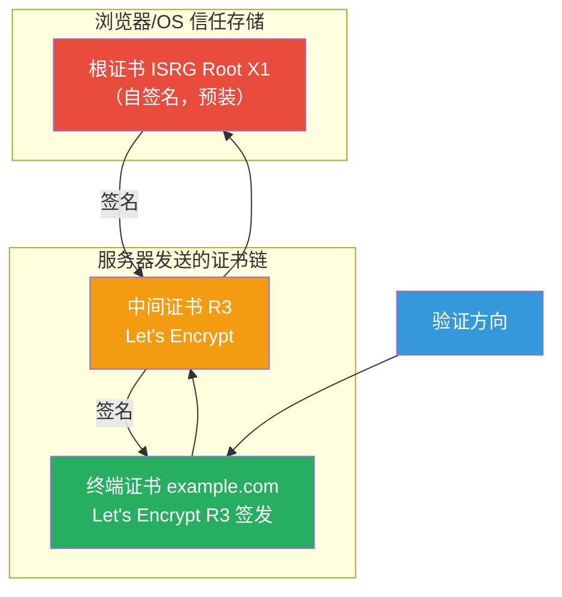
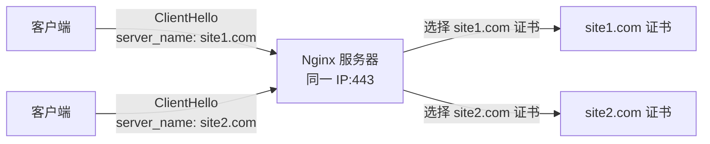

# 证书管理与配置

## SSL 证书概述

SSL/TLS 证书是 HTTPS 的核心组件，它将公钥与域名/组织身份绑定，并由受信任的证书颁发机构（CA）签名背书。在 Nginx 中正确配置证书是建立安全 HTTPS 服务的基础。

### 证书的核心组成

一张 X.509 证书包含以下核心信息：

```
Certificate {
    版本 (Version)              V3
    序列号 (Serial Number)      唯一标识
    签名算法 (Signature Algorithm) SHA256withRSA
    签发者 (Issuer)             CA 的 DN
    有效期 (Validity)           Not Before / Not After
    使用者 (Subject)            证书持有者的 DN
    公钥信息 (Subject Public Key)  算法 + 公钥
    扩展 (Extensions)
        - subjectAltName (SAN)  域名列表
        - keyUsage             密钥用途
        - extendedKeyUsage     扩展密钥用途
        - authorityInfoAccess  OCSP/CIA 地址
        - certificatePolicies  证书策略
        - basicConstraints     CA 标识
    签名 (Signature Value)      CA 的数字签名
}
```

---

## SSL 证书类型

根据验证级别，SSL 证书分为三种类型：

### DV（Domain Validation）域名验证证书

DV 证书仅验证域名控制权，是最基本的证书类型：

```
验证流程：
1. 申请人证明对域名的控制权
2. CA 发送验证邮件到域名管理员邮箱
3. 或者通过 DNS TXT 记录验证
4. 或者通过 HTTP 文件验证
5. 验证通过后签发证书

特点：
- 签发速度快（几分钟）
- 价格低（甚至免费，如 Let's Encrypt）
- 浏览器显示锁标识
- 不显示组织信息
```

### OV（Organization Validation）组织验证证书

OV 证书额外验证组织身份，提供更高信任等级：

```
验证流程：
1. 域名控制权验证（同 DV）
2. 组织合法性验证
   - 查询政府注册数据库
   - 验证组织名称和地址
3. 电话验证
   - 通过第三方目录查询组织电话
   - 致电确认证书申请
4. 签发证书

特点：
- 签发时间 1-3 天
- 价格中等
- 浏览器显示锁标识
- 证书中包含组织信息
- 点击锁标识可查看公司名称
```

### EV（Extended Validation）扩展验证证书

EV 证书提供最高级别的身份验证：

```
验证流程：
1. 域名控制权验证
2. 组织合法性验证（更严格）
3. 实体运营验证
4. 地址验证（物理地址）
5. 电话验证（更严格）
6. 最终授权人确认

特点：
- 签发时间 3-7 天
- 价格最高
- 旧版浏览器显示绿色地址栏+公司名
- 证书中包含完整组织信息
- 适用于金融、电商等高安全场景
```

### 三种证书类型对比

| 特性 | DV | OV | EV |
|------|----|----|-----|
| 验证内容 | 域名控制权 | 组织身份 | 完整身份 |
| 签发时间 | 几分钟 | 1-3 天 | 3-7 天 |
| 价格 | 免费-$100/年 | $100-$500/年 | $200-$1500/年 |
| 浏览器标识 | 锁 | 锁 | 锁（旧版绿地址栏） |
| 加密强度 | 相同 | 相同 | 相同 |
| 适合场景 | 个人博客 | 企业网站 | 金融/电商 |

::: tip 加密强度相同
三种证书类型的加密强度是完全相同的。DV 证书和 EV 证书使用相同的 TLS 协议和密码套件。区别仅在于身份验证的严格程度，而非安全性强度。
:::

---

## Nginx SSL 配置基础

### 最小 SSL 配置

```nginx
# 参考：https://nginx.org/en/docs/http/ngx_http_ssl_module.html

server {
    listen 443 ssl;
    server_name example.com;

    # 证书文件（PEM 格式）
    ssl_certificate     /etc/nginx/ssl/example.com.pem;

    # 私钥文件（PEM 格式）
    ssl_certificate_key /etc/nginx/ssl/example.com.key;

    location / {
        root /var/www/html;
    }
}
```

### ssl_certificate 与 ssl_certificate_key

```nginx
# ssl_certificate：指定证书文件路径
# 文件必须为 PEM 格式
# 可以包含中间证书（推荐）

ssl_certificate /etc/nginx/ssl/example.com-fullchain.pem;

# ssl_certificate_key：指定私钥文件路径
# 支持 PEM 格式
# 私钥可以加密（Nginx 启动时需要输入密码）

ssl_certificate_key /etc/nginx/ssl/example.com.key;

# 加密私钥示例
# ssl_certificate_key /etc/nginx/ssl/example.com.encrypted.key;
# Nginx 启动时会提示输入密码
```

::: warning 私钥安全
私钥是 TLS 安全的基石，必须严格保护：
- 私钥文件权限应为 600（仅 root 可读写）
- 不要将私钥提交到版本控制系统
- 使用加密私钥时，需要配置 `ssl_password_file`
- 密钥轮换时，旧密钥应安全销毁

```bash
# 设置正确的文件权限
chmod 600 /etc/nginx/ssl/example.com.key
chown root:root /etc/nginx/ssl/example.com.key

# 验证证书和私钥是否匹配
openssl x509 -noout -modulus -in example.com.pem | openssl md5
openssl rsa -noout -modulus -in example.com.key | openssl md5
# 两个 MD5 值应相同
```
:::

### ssl_password_file

当私钥文件加密时，使用 `ssl_password_file` 指定密码文件：

```nginx
# 参考：https://nginx.org/en/docs/http/ngx_http_ssl_module.html#ssl_password_file

# 密码文件每行一个密码
ssl_password_file /etc/nginx/ssl/passwords.txt;
```

```
# /etc/nginx/ssl/passwords.txt
my_secret_password_1
my_secret_password_2
```

Nginx 会依次尝试文件中的每个密码，直到成功解密私钥。

---

## 证书链与中间证书配置

### 证书链原理

证书链是从终端证书到受信任根证书的路径，每一级证书由上一级 CA 签名：



### 证书链文件配置

在 Nginx 中，`ssl_certificate` 指向的文件应包含完整的证书链：

```nginx
# 正确：使用 fullchain（终端证书 + 中间证书）
ssl_certificate /etc/letsencrypt/live/example.com/fullchain.pem;
ssl_certificate_key /etc/letsencrypt/live/example.com/privkey.pem;

# 错误：仅使用终端证书（缺少中间证书）
# ssl_certificate /etc/letsencrypt/live/example.com/cert.pem;
```

Let's Encrypt 生成的文件说明：

```
/etc/letsencrypt/live/example.com/
├── cert.pem         # 仅终端证书
├── chain.pem        # 仅中间证书
├── fullchain.pem    # 终端证书 + 中间证书（Nginx 使用此文件）
└── privkey.pem      # 私钥
```

### 手动构建证书链

```bash
# 方法 1：拼接证书文件
# 顺序：终端证书 → 中间证书 → (不要包含根证书)
cat cert.pem chain.pem > fullchain.pem

# 方法 2：从 CA 下载中间证书
# 查看证书的 Authority Information Access
openssl x509 -in cert.pem -noout -text | grep "CA Issuers"

# 下载中间证书
wget -O intermediate.pem "http://r3.i.lencr.org/"

# 转换为 PEM 格式（如果下载的是 DER 格式）
openssl x509 -inform DER -in intermediate.der -out intermediate.pem

# 构建完整链
cat cert.pem intermediate.pem > fullchain.pem
```

### 验证证书链

```bash
# 方法 1：使用 openssl verify
openssl verify -CAfile chain.pem cert.pem

# 方法 2：验证完整链
openssl verify -CAfile /etc/ssl/certs/ca-certificates.crt fullchain.pem

# 方法 3：在线连接测试
openssl s_client -connect example.com:443 -showcerts

# 方法 4：检查 Nginx 返回的证书链
echo | openssl s_client -connect example.com:443 2>&1 | \
  awk '/BEGIN CERT/,/END CERT/' | \
  openssl x509 -noout -subject -issuer
```

::: important 为什么不包含根证书
根证书通常是自签名的，客户端的信任存储中已经预装了根证书。发送根证书不仅浪费带宽，还可能导致验证问题。大多数 CA 和浏览器厂商都建议不在证书链中包含根证书。
:::

---

## OCSP Stapling 配置与原理

### OCSP 与 OCSP Stapling

OCSP（Online Certificate Status Protocol）用于在线查询证书吊销状态，但存在隐私和性能问题：

```
传统 OCSP 流程：
1. 客户端收到服务器证书
2. 客户端向 CA 的 OCSP 服务器查询证书状态
3. CA 返回证书状态（good/revoked/unknown）

问题：
- 隐私泄露：CA 知道用户访问了哪些网站
- 延迟增加：额外的网络请求
- 可用性：OCSP 服务器故障导致硬失败或软失败
```

OCSP Stapling 解决了这些问题：

```
OCSP Stapling 流程：
1. 服务器定期向 CA 查询 OCSP 响应
2. 服务器缓存 OCSP 响应（有签名，不可伪造）
3. 握手时，服务器将缓存的 OCSP 响应"装订"(Staple)在 Certificate 消息中
4. 客户端直接使用服务器提供的 OCSP 响应
5. 无需客户端单独查询

优势：
- 隐私保护：CA 不知道用户访问
- 延迟降低：无额外网络请求
- 可用性：不受 OCSP 服务器故障影响
```

### Nginx OCSP Stapling 配置

```nginx
# 参考：https://nginx.org/en/docs/http/ngx_http_ssl_module.html#ssl_stapling

server {
    listen 443 ssl;
    server_name example.com;

    ssl_certificate     /etc/nginx/ssl/example.com-fullchain.pem;
    ssl_certificate_key /etc/nginx/ssl/example.com.key;

    # 启用 OCSP Stapling
    ssl_stapling on;

    # 启用 OCSP 响应验证
    ssl_stapling_verify on;

    # 信任的证书链文件（用于验证 OCSP 响应签名）
    ssl_trusted_certificate /etc/nginx/ssl/chain.pem;

    # DNS 解析器（用于解析 OCSP 服务器域名）
    resolver 8.8.8.8 8.8.4.4 valid=300s;
    resolver_timeout 5s;
}
```

::: tip ssl_trusted_certificate 与 ssl_certificate 的区别
- `ssl_certificate`：发送给客户端的证书链（终端证书 + 中间证书）
- `ssl_trusted_certificate`：仅用于验证 OCSP 响应的信任锚（通常是中间证书 + 根证书）

Let's Encrypt 场景下：

```nginx
ssl_certificate /etc/letsencrypt/live/example.com/fullchain.pem;
ssl_trusted_certificate /etc/letsencrypt/live/example.com/chain.pem;
```
:::

### 验证 OCSP Stapling

```bash
# 方法 1：使用 openssl
openssl s_client -connect example.com:443 -status

# 如果 OCSP Stapling 正常，输出包含：
# OCSP response:
# ======================================
# OCSP Response Data:
#     OCSP Response Status: successful (0x0)
#     Response Type: Basic OCSP Response
#     Cert Status: good
#     ...

# 方法 2：检查 Nginx 错误日志
# OCSP Stapling 错误会记录在错误日志中
tail -f /var/log/nginx/error.log | grep -i ocsp

# 方法 3：使用在线工具
# https://www.ssllabs.com/ssltest/
```

### OCSP Stapling 故障排查

```bash
# 手动查询 OCSP
# 1. 获取 OCSP 服务器 URL
openssl x509 -in cert.pem -noout -ocsp_uri
# 输出：http://r3.o.lencr.org

# 2. 查询 OCSP 状态
openssl ocsp -issuer chain.pem -cert cert.pem \
  -url http://r3.o.lencr.org -resp_text

# 常见问题：
# - resolver 配置错误 → 检查 DNS 解析器
# - ssl_trusted_certificate 缺失 → 添加中间证书
# - 防火墙阻止 OCSP 请求 → 开放出站 80 端口
# - 证书不支持 OCSP → 检查 AIA 扩展
```

---

## 多域名证书（SNI）与通配符证书

### SNI（Server Name Indication）

SNI 允许在同一 IP 地址上托管多个 HTTPS 网站，客户端在 TLS 握手时通过 ClientHello 的 `server_name` 扩展指明要访问的域名：



### Nginx SNI 配置

```nginx
# 参考：https://nginx.org/en/docs/http/configuring_https_servers.html

# 虚拟主机 1
server {
    listen 443 ssl;
    server_name site1.example.com;

    ssl_certificate     /etc/nginx/ssl/site1.pem;
    ssl_certificate_key /etc/nginx/ssl/site1.key;

    location / {
        root /var/www/site1;
    }
}

# 虚拟主机 2
server {
    listen 443 ssl;
    server_name site2.example.com;

    ssl_certificate     /etc/nginx/ssl/site2.pem;
    ssl_certificate_key /etc/nginx/ssl/site2.key;

    location / {
        root /var/www/site2;
    }
}
```

### 检查 SNI 支持

```bash
# 检查 Nginx 是否支持 SNI
nginx -V 2>&1 | grep -o 'TLS SNI enable'

# 测试 SNI
openssl s_client -connect example.com:443 \
  -servername site1.example.com 2>&1 | \
  grep "subject="

openssl s_client -connect example.com:443 \
  -servername site2.example.com 2>&1 | \
  grep "subject="
```

::: warning SNI 的局限性
- 极少数老旧客户端不支持 SNI（Windows XP + IE6、Java 1.6 等）
- 不支持 SNI 的客户端会收到默认虚拟主机的证书
- 可以为默认虚拟主机配置一个"通用"证书作为后备
- TLS 1.3 的 Encrypted Client Hello (ECH) 可以加密 SNI 信息
:::

### 通配符证书

通配符证书使用 `*` 匹配一个子域名级别：

```nginx
# 通配符证书 *.example.com
# 覆盖：www.example.com, api.example.com, blog.example.com
# 不覆盖：sub.api.example.com（多级子域名）

server {
    listen 443 ssl;
    server_name example.com www.example.com;

    # 通配符证书
    ssl_certificate     /etc/nginx/ssl/wildcard.example.com.pem;
    ssl_certificate_key /etc/nginx/ssl/wildcard.example.com.key;

    location / { root /var/www/main; }
}

server {
    listen 443 ssl;
    server_name api.example.com;

    # 复用通配符证书
    ssl_certificate     /etc/nginx/ssl/wildcard.example.com.pem;
    ssl_certificate_key /etc/nginx/ssl/wildcard.example.com.key;

    location / { proxy_pass http://api_backend; }
}

server {
    listen 443 ssl;
    server_name blog.example.com;

    # 复用通配符证书
    ssl_certificate     /etc/nginx/ssl/wildcard.example.com.pem;
    ssl_certificate_key /etc/nginx/ssl/wildcard.example.com.key;

    location / { root /var/www/blog; }
}
```

### 多域名证书（SAN/UCC）

多域名证书通过 Subject Alternative Name (SAN) 扩展覆盖多个域名：

```bash
# 查看证书的 SAN 扩展
openssl x509 -in cert.pem -noout -ext subjectAltName

# 输出示例：
# X509v3 Subject Alternative Name:
#     DNS:example.com, DNS:www.example.com, DNS:api.example.com
```

多域名证书与通配符证书的对比：

| 特性 | 通配符证书 | 多域名证书 |
|------|-----------|-----------|
| 覆盖范围 | *.example.com | 多个指定域名 |
| 子域名支持 | 同级所有子域名 | 仅列出域名 |
| 多级子域名 | 不支持 | 支持 |
| 管理便捷性 | 高（自动覆盖新子域名） | 中（需添加新域名） |
| 安全性 | 中（私钥泄露影响所有子域名） | 高（可限制范围） |
| 价格 | 中等 | 按域名数量计费 |

### 单证书覆盖多域名 + 通配符

现代证书可以同时包含通配符和具体域名：

```bash
# 证书 SAN 示例
# DNS:example.com              - 主域名
# DNS:*.example.com            - 通配符
# DNS:another-site.com         - 不同域名
# DNS:*.another-site.com       - 另一个通配符

# Let's Encrypt 申请示例
certbot certonly --dns-cloudflare \
  -d example.com -d "*.example.com" \
  -d another-site.com -d "*.another-site.com"
```

---

## ssl_protocols 配置详解

### 协议版本说明

```nginx
# 参考：https://nginx.org/en/docs/http/ngx_http_ssl_module.html#ssl_protocols

# 语法
ssl_protocols [SSLv2] [SSLv3] [TLSv1] [TLSv1.1] [TLSv1.2] [TLSv1.3];

# 默认值
ssl_protocols TLSv1 TLSv1.1 TLSv1.2 TLSv1.3;
```

### 推荐配置

```nginx
# 生产环境推荐：仅启用 TLS 1.2 和 TLS 1.3
ssl_protocols TLSv1.2 TLSv1.3;

# 严格模式：仅 TLS 1.3（需评估客户端兼容性）
# ssl_protocols TLSv1.3;
```

### 各协议版本兼容性

| 协议版本 | 主要浏览器支持 | 状态 |
|----------|---------------|------|
| SSLv3 | 已全部移除 | 废弃（POODLE） |
| TLS 1.0 | IE8+, 旧 Android | 废弃（RFC 8996） |
| TLS 1.1 | IE11, 旧 Safari | 废弃（RFC 8996） |
| TLS 1.2 | 所有现代浏览器 | 当前主流 |
| TLS 1.3 | Chrome 70+, Firefox 63+, Safari 14+ | 推荐使用 |

### 禁用旧协议的 Nginx 配置

```nginx
# 在 http 块中全局禁用旧协议
http {
    ssl_protocols TLSv1.2 TLSv1.3;
    # ...
}

# 或在每个 server 块中单独配置
server {
    listen 443 ssl;
    ssl_protocols TLSv1.2 TLSv1.3;
    # ...
}
```

::: important 评估兼容性影响
禁用 TLS 1.0/1.1 可能影响以下客户端：
- Windows XP + IE8
- Java 6/7
- Android 4.3 及更早
- 旧版 curl/wget

在禁用前，建议检查服务器访问日志，确认是否仍有使用旧协议的客户端：

```bash
# 分析 Nginx 日志中的 TLS 版本分布
awk '{print $NF}' /var/log/nginx/access.log | sort | uniq -c | sort -rn
```
:::

---

## ssl_ciphers 配置详解

### 密码套件配置语法

```nginx
# 参考：https://nginx.org/en/docs/http/ngx_http_ssl_module.html#ssl_ciphers

# 语法：使用 OpenSSL 密码套件字符串
ssl_ciphers 'HIGH:!aNULL:!MD5';

# 冒号分隔各密码套件
ssl_ciphers 'ECDHE-RSA-AES128-GCM-SHA256:ECDHE-RSA-AES256-GCM-SHA384';
```

### 密码套件字符串语法

OpenSSL 支持丰富的密码套件筛选语法：

| 语法 | 含义 |
|------|------|
| `HIGH` | 高强度密码套件（密钥 > 128 bit） |
| `MEDIUM` | 中等强度密码套件（密钥 = 128 bit） |
| `LOW` | 低强度密码套件（密钥 < 128 bit，不安全） |
| `!aNULL` | 排除无认证的密码套件 |
| `!eNULL` | 排除无加密的密码套件 |
| `!MD5` | 排除使用 MD5 的密码套件 |
| `!SHA1` | 排除使用 SHA-1 的密码套件 |
| `!RC4` | 排除 RC4 密码套件 |
| `!DES` | 排除 DES 密码套件 |
| `!3DES` | 排除 3DES 密码套件 |
| `AES128` | 仅 AES-128 密码套件 |
| `AES256` | 仅 AES-256 密码套件 |
| `aRSA` | RSA 认证的密码套件 |
| `aECDSA` | ECDSA 认证的密码套件 |

### 推荐的密码套件配置

```nginx
# Mozilla Modern 配置（推荐）
# 优先 AEAD + ECDHE，强制前向保密
ssl_ciphers 'ECDHE-ECDSA-AES128-GCM-SHA256:ECDHE-RSA-AES128-GCM-SHA256:ECDHE-ECDSA-AES256-GCM-SHA384:ECDHE-RSA-AES256-GCM-SHA384:ECDHE-ECDSA-CHACHA20-POLY1305:ECDHE-RSA-CHACHA20-POLY1305:DHE-RSA-AES128-GCM-SHA256:DHE-RSA-AES256-GCM-SHA384';

# Mozilla Intermediate 配置（兼容性好）
ssl_ciphers 'ECDHE-ECDSA-AES128-GCM-SHA256:ECDHE-RSA-AES128-GCM-SHA256:ECDHE-ECDSA-AES256-GCM-SHA384:ECDHE-RSA-AES256-GCM-SHA384:ECDHE-ECDSA-CHACHA20-POLY1305:ECDHE-RSA-CHACHA20-POLY1305:DHE-RSA-AES128-GCM-SHA256:DHE-RSA-AES256-GCM-SHA384:DHE-RSA-CHACHA20-POLY1305';

# 简洁配置（使用排除法）
ssl_ciphers 'ECDHE+AESGCM:ECDHE+CHACHA20:DHE+AESGCM:DHE+CHACHA20:!aNULL:!MD5:!DSS';
```

### 查看密码套件详情

```bash
# 列出所有支持的密码套件
openssl ciphers -v 'ECDHE+AESGCM:ECDHE+CHACHA20'

# 列出指定配置的密码套件
openssl ciphers -v 'ECDHE-RSA-AES128-GCM-SHA256:ECDHE-RSA-AES256-GCM-SHA384'

# 按 TLS 版本过滤
openssl ciphers -v -tls1_2 'ECDHE+AESGCM'
openssl ciphers -v -tls1_3 'TLS_AES_128_GCM_SHA256'
```

### ssl_prefer_server_ciphers

```nginx
# 参考：https://nginx.org/en/docs/http/ngx_http_ssl_module.html#ssl_prefer_server_ciphers

# 启用：服务器按 ssl_ciphers 顺序选择密码套件
ssl_prefer_server_ciphers on;

# 禁用（默认）：客户端按自己的优先级选择
# ssl_prefer_server_ciphers off;
```

::: tip 何时启用 ssl_prefer_server_ciphers
- **启用**：当服务器配置了精心排序的密码套件，希望强制客户端使用更安全的选项
- **禁用**：当客户端更了解自身硬件能力（如手机优先选择 ChaCha20 而非 AES-GCM）
- **TLS 1.3**：此设置对 TLS 1.3 无效，TLS 1.3 的密码套件协商是独立的
:::

---

## ssl_session_cache 与 ssl_session_timeout

### Session Cache 配置

```nginx
# 参考：https://nginx.org/en/docs/http/ngx_http_ssl_module.html#ssl_session_cache

# 语法
# ssl_session_cache off | none | [builtin[:size]] [shared:name:size]

# off：禁用 Session Cache（不使用 Session ID 恢复）
# none：不使用 Session Cache（优柔寡断，不推荐）
# builtin[:size]：使用 OpenSSL 内置缓存（仅 worker 进程可见）
# shared:name:size：使用共享内存缓存（所有 worker 共享，推荐）

# 推荐配置
ssl_session_cache shared:SSL:10m;

# 说明：
# shared:SSL  → 共享缓存名称为 "SSL"
# 10m         → 缓存大小为 10 MB
# 1 MB 约存储 4000 个会话
# 10 MB 约存储 40000 个会话
```

### Session Timeout 配置

```nginx
# 参考：https://nginx.org/en/docs/http/ngx_http_ssl_module.html#ssl_session_timeout

# 语法
ssl_session_timeout time;

# 默认值：5m
# 推荐值：1d（1 天）到 7d，取决于安全需求
ssl_session_timeout 1d;
```

### Session Cache 大小估算

```
估算公式：
缓存大小 (MB) = 预期并发会话数 / 4000

示例：
- 日活 10000 用户 → 10000 / 4000 ≈ 3 MB → 配置 shared:SSL:5m
- 日活 100000 用户 → 100000 / 4000 ≈ 25 MB → 配置 shared:SSL:30m
- 日活 1000000 用户 → 1000000 / 4000 ≈ 250 MB → 配置 shared:SSL:256m
```

### 完整的 Session 恢复配置

```nginx
server {
    listen 443 ssl;
    server_name example.com;

    ssl_certificate     /etc/nginx/ssl/example.com-fullchain.pem;
    ssl_certificate_key /etc/nginx/ssl/example.com.key;

    # Session Cache
    ssl_session_cache shared:SSL:10m;

    # Session Timeout
    ssl_session_timeout 1d;

    # Session Tickets
    ssl_session_tickets on;

    # Session Ticket 密钥（多服务器共享）
    # ssl_session_ticket_key /etc/nginx/ssl/ticket.key;
}
```

---

## DH 参数文件配置

### 什么是 DH 参数

DHE 密钥交换需要预先协商的 DH 参数（大素数 p 和生成元 g）。参数质量直接影响 DHE 的安全性。

### 生成 DH 参数文件

```bash
# 生成 2048 bit DH 参数（推荐最低长度）
openssl dhparam -out /etc/nginx/ssl/dhparam.pem 2048

# 生成 4096 bit DH 参数（更安全，但更慢）
openssl dhparam -out /etc/nginx/ssl/dhparam.pem 4096

# 注意：4096 bit 生成可能需要数分钟到数十分钟
# 使用 -dsaparam 选项可以加速（但安全性略低）
openssl dhparam -dsaparam -out /etc/nginx/ssl/dhparam.pem 4096
```

### Nginx DH 参数配置

```nginx
# 参考：https://nginx.org/en/docs/http/ngx_http_ssl_module.html#ssl_dhparam

server {
    listen 443 ssl;
    server_name example.com;

    ssl_certificate     /etc/nginx/ssl/example.com-fullchain.pem;
    ssl_certificate_key /etc/nginx/ssl/example.com.key;

    # DH 参数文件
    ssl_dhparam /etc/nginx/ssl/dhparam.pem;
}
```

### DH 参数长度与安全等级

| 长度 | 安全等级 | 等效对称密钥 | 推荐 |
|------|----------|-------------|------|
| 1024 bit | 低 | ~80 bit | 弃用 |
| 2048 bit | 中 | ~112 bit | 最低要求 |
| 3072 bit | 高 | ~128 bit | 推荐 |
| 4096 bit | 很高 | ~150 bit | 高安全需求 |

::: warning 使用已知 DH 参数的风险
部分服务器使用固定的 DH 参数（如 Apache 的内置 1024 bit 参数），存在 Logjam 攻击风险。始终使用自定义生成的高质量 DH 参数。
:::

### 检查 DH 参数质量

```bash
# 查看 DH 参数信息
openssl dhparam -in /etc/nginx/ssl/dhparam.pem -text -noout

# 输出示例：
# DH Parameters: (2048 bit)
#     P:
#         xx:xx:xx:... (大素数 p)
#     G:
#         2 (生成元 g)

# 检查参数长度
openssl dhparam -in /etc/nginx/ssl/dhparam.pem -text -noout | head -1
```

---

## 完整 HTTPS 配置模板

### Mozilla Modern 模板

适用于不需要兼容老旧客户端的现代网站：

```nginx
# 参考：
# https://nginx.org/en/docs/http/ngx_http_ssl_module.html
# https://ssl-config.mozilla.org/

server {
    listen 443 ssl;
    listen [::]:443 ssl;
    http2 on;
    server_name example.com;

    # ===== 证书 =====
    ssl_certificate     /etc/nginx/ssl/example.com-fullchain.pem;
    ssl_certificate_key /etc/nginx/ssl/example.com.key;

    # ===== 协议版本 =====
    ssl_protocols TLSv1.2 TLSv1.3;

    # ===== 密码套件 =====
    ssl_ciphers 'ECDHE-ECDSA-AES128-GCM-SHA256:ECDHE-RSA-AES128-GCM-SHA256:ECDHE-ECDSA-AES256-GCM-SHA384:ECDHE-RSA-AES256-GCM-SHA384:ECDHE-ECDSA-CHACHA20-POLY1305:ECDHE-RSA-CHACHA20-POLY1305:DHE-RSA-AES128-GCM-SHA256:DHE-RSA-AES256-GCM-SHA384:DHE-RSA-CHACHA20-POLY1305';
    ssl_prefer_server_ciphers off;

    # ===== DH 参数 =====
    ssl_dhparam /etc/nginx/ssl/dhparam.pem;

    # ===== ECDHE 曲线 =====
    ssl_ecdh_curve X25519:secp256r1:secp384r1;

    # ===== Session 恢复 =====
    ssl_session_cache shared:SSL:10m;
    ssl_session_timeout 1d;
    ssl_session_tickets on;

    # ===== OCSP Stapling =====
    ssl_stapling on;
    ssl_stapling_verify on;
    ssl_trusted_certificate /etc/nginx/ssl/chain.pem;
    resolver 8.8.8.8 8.8.4.4 valid=300s;
    resolver_timeout 5s;

    # ===== 性能 =====
    ssl_buffer_size 4k;

    # ===== 安全头部 =====
    add_header Strict-Transport-Security "max-age=63072000; includeSubDomains; preload" always;
    add_header X-Frame-Options DENY always;
    add_header X-Content-Type-Options nosniff always;

    location / {
        root /var/www/html;
        index index.html;
    }
}

# HTTP → HTTPS 重定向
server {
    listen 80;
    listen [::]:80;
    server_name example.com;
    return 301 https://$host$request_uri;
}
```

### Mozilla Intermediate 模板

适用于需要兼容较广泛客户端的网站：

```nginx
server {
    listen 443 ssl;
    listen [::]:443 ssl;
    http2 on;
    server_name example.com;

    # ===== 证书 =====
    ssl_certificate     /etc/nginx/ssl/example.com-fullchain.pem;
    ssl_certificate_key /etc/nginx/ssl/example.com.key;

    # ===== 协议版本（兼容 TLS 1.2）=====
    ssl_protocols TLSv1.2 TLSv1.3;

    # ===== 密码套件 =====
    ssl_ciphers 'ECDHE-ECDSA-AES128-GCM-SHA256:ECDHE-RSA-AES128-GCM-SHA256:ECDHE-ECDSA-AES256-GCM-SHA384:ECDHE-RSA-AES256-GCM-SHA384:ECDHE-ECDSA-CHACHA20-POLY1305:ECDHE-RSA-CHACHA20-POLY1305:DHE-RSA-AES128-GCM-SHA256:DHE-RSA-AES256-GCM-SHA384:DHE-RSA-CHACHA20-POLY1305';
    ssl_prefer_server_ciphers off;

    # ===== DH 参数 =====
    ssl_dhparam /etc/nginx/ssl/dhparam.pem;

    # ===== Session 恢复 =====
    ssl_session_cache shared:SSL:10m;
    ssl_session_timeout 1d;
    ssl_session_tickets on;

    # ===== OCSP Stapling =====
    ssl_stapling on;
    ssl_stapling_verify on;
    ssl_trusted_certificate /etc/nginx/ssl/chain.pem;
    resolver 8.8.8.8 8.8.4.4 valid=300s;

    # ===== 安全头部 =====
    add_header Strict-Transport-Security "max-age=31536000; includeSubDomains" always;

    location / {
        proxy_pass http://backend;
    }
}

server {
    listen 80;
    listen [::]:80;
    server_name example.com;
    return 301 https://$host$request_uri;
}
```

### 多域名 HTTPS 配置模板

```nginx
# 主站
server {
    listen 443 ssl;
    listen [::]:443 ssl;
    http2 on;
    server_name example.com www.example.com;

    ssl_certificate     /etc/nginx/ssl/example.com-fullchain.pem;
    ssl_certificate_key /etc/nginx/ssl/example.com.key;

    ssl_protocols TLSv1.2 TLSv1.3;
    ssl_ciphers 'ECDHE-ECDSA-AES128-GCM-SHA256:ECDHE-RSA-AES128-GCM-SHA256:ECDHE-ECDSA-AES256-GCM-SHA384:ECDHE-RSA-AES256-GCM-SHA384:ECDHE-ECDSA-CHACHA20-POLY1305:ECDHE-RSA-CHACHA20-POLY1305';
    ssl_prefer_server_ciphers off;

    ssl_session_cache shared:SSL:10m;
    ssl_session_timeout 1d;
    ssl_session_tickets on;

    ssl_stapling on;
    ssl_stapling_verify on;
    ssl_trusted_certificate /etc/nginx/ssl/chain.pem;
    resolver 8.8.8.8 8.8.4.4 valid=300s;

    location / {
        root /var/www/main;
    }
}

# API 子域名（使用通配符证书）
server {
    listen 443 ssl;
    listen [::]:443 ssl;
    http2 on;
    server_name api.example.com;

    ssl_certificate     /etc/nginx/ssl/wildcard.example.com-fullchain.pem;
    ssl_certificate_key /etc/nginx/ssl/wildcard.example.com.key;

    # 共用 ssl 配置
    ssl_protocols TLSv1.2 TLSv1.3;
    ssl_ciphers 'ECDHE-ECDSA-AES128-GCM-SHA256:ECDHE-RSA-AES128-GCM-SHA256:ECDHE-ECDSA-AES256-GCM-SHA384:ECDHE-RSA-AES256-GCM-SHA384:ECDHE-ECDSA-CHACHA20-POLY1305:ECDHE-RSA-CHACHA20-POLY1305';
    ssl_session_cache shared:SSL:10m;
    ssl_session_timeout 1d;

    location / {
        proxy_pass http://api_backend;
        proxy_set_header Host $host;
        proxy_set_header X-Real-IP $remote_addr;
        proxy_set_header X-Forwarded-For $proxy_add_x_forwarded_for;
        proxy_set_header X-Forwarded-Proto $scheme;
    }
}

# HTTP 重定向
server {
    listen 80;
    listen [::]:80;
    server_name example.com www.example.com api.example.com;
    return 301 https://$host$request_uri;
}
```

---

## 证书格式与转换

### 常见证书格式

| 格式 | 扩展名 | 说明 |
|------|--------|------|
| PEM | .pem, .crt, .key | Base64 编码，最常用 |
| DER | .der, .cer | 二进制编码，Windows 常用 |
| PKCS#7 | .p7b, .p7c | 证书链容器，不含私钥 |
| PKCS#12 | .pfx, .p12 | 证书 + 私钥容器，IIS 常用 |

### 格式转换命令

```bash
# PEM → DER
openssl x509 -in cert.pem -outform DER -out cert.der

# DER → PEM
openssl x509 -in cert.der -inform DER -outform PEM -out cert.pem

# PEM → PKCS#12（含私钥）
openssl pkcs12 -export -out cert.pfx \
  -inkey private.key -in cert.pem -certfile chain.pem

# PKCS#12 → PEM（提取证书）
openssl pkcs12 -in cert.pfx -clcerts -nokeys -out cert.pem

# PKCS#12 → PEM（提取私钥）
openssl pkcs12 -in cert.pfx -nocerts -out private.key

# PKCS#12 → PEM（提取证书链）
openssl pkcs12 -in cert.pfx -nokeys -out fullchain.pem

# PKCS#7 → PEM
openssl pkcs7 -in cert.p7b -inform DER -print_certs -out cert.pem
```

### 证书信息查看

```bash
# 查看证书详情
openssl x509 -in cert.pem -text -noout

# 查看证书有效期
openssl x509 -in cert.pem -noout -dates

# 查看证书 SAN
openssl x509 -in cert.pem -noout -ext subjectAltName

# 查看证书颁发者
openssl x509 -in cert.pem -noout -issuer

# 查看证书主题
openssl x509 -in cert.pem -noout -subject

# 查看证书指纹
openssl x509 -in cert.pem -noout -fingerprint

# 验证证书有效性
openssl verify -CAfile /etc/ssl/certs/ca-certificates.crt cert.pem

# 检查证书是否过期
openssl x509 -in cert.pem -checkend 86400
# 返回 0 表示未过期（24 小时内）
```

---

## 证书监控与告警

### 检查证书到期时间

```bash
# 单个域名检查
echo | openssl s_client -connect example.com:443 2>/dev/null | \
  openssl x509 -noout -dates

# 批量检查脚本
#!/bin/bash
# check_cert_expiry.sh

DOMAINS=(
    "example.com"
    "www.example.com"
    "api.example.com"
)

WARN_DAYS=30

for domain in "${DOMAINS[@]}"; do
    expiry=$(echo | openssl s_client -connect "$domain:443" 2>/dev/null | \
        openssl x509 -noout -enddate | cut -d= -f2)

    expiry_epoch=$(date -d "$expiry" +%s)
    now_epoch=$(date +%s)
    days_left=$(( (expiry_epoch - now_epoch) / 86400 ))

    if [ "$days_left" -lt "$WARN_DAYS" ]; then
        echo "WARNING: $domain expires in $days_left days ($expiry)"
    else
        echo "OK: $domain expires in $days_left days ($expiry)"
    fi
done
```

### 使用 certbot 自动检查

```bash
# certbot 自带证书检查
certbot certificates

# 输出示例：
# Found the following certs:
#   Certificate Name: example.com
#     Domains: example.com www.example.com
#     Expiry Date: 2025-04-01 00:00:00+00:00 (VALID: 60 days)
#     Certificate Path: /etc/letsencrypt/live/example.com/fullchain.pem
#     Private Key Path: /etc/letsencrypt/live/example.com/privkey.pem
```

### Prometheus + Grafana 监控

使用 `ssl_exporter` 监控证书到期时间：

```yaml
# ssl_exporter 配置示例
modules:
  https:
    prober: https
    timeout: 5s
    tls_config:
      insecure_skip_verify: false
```

Grafana 告警规则示例：

```
# 证书到期 < 14 天 → 警告
# 证书到期 < 7 天 → 严重
# 证书到期 < 1 天 → 紧急
ssl_cert_not_after - time() < 86400 * 14
```

---

## 常见问题与排查

### 证书与私钥不匹配

```bash
# 检查证书和私钥的模数是否一致
# 证书模数
openssl x509 -noout -modulus -in cert.pem | openssl md5
# d41d8cd98f00b204e9800998ecf8427e

# 私钥模数
openssl rsa -noout -modulus -in key.pem | openssl md5
# d41d8cd98f00b204e9800998ecf8427e

# 两个 MD5 值相同表示匹配
```

### Nginx 启动报 SSL 错误

```bash
# 检查配置语法
nginx -t

# 常见错误及解决方案：

# 1. "cannot load certificate"
# 原因：证书文件路径错误或格式不对
# 解决：检查文件路径，确认为 PEM 格式

# 2. "SSL_CTX_use_PrivateKey_file() failed"
# 原因：私钥与证书不匹配
# 解决：使用上述方法验证匹配性

# 3. "PEM_read_bio_X509_AUX() failed"
# 原因：证书文件损坏或格式错误
# 解决：使用 openssl x509 -in cert.pem -text 验证

# 4. "no "ssl_certificate" is defined"
# 原因：listen 443 ssl 但未配置证书
# 解决：添加 ssl_certificate 和 ssl_certificate_key
```

### OCSP Stapling 不工作

```bash
# 1. 检查证书是否支持 OCSP
openssl x509 -in cert.pem -noout -ocsp_uri
# 如果无输出，证书不支持 OCSP

# 2. 手动测试 OCSP
openssl ocsp -issuer chain.pem -cert cert.pem \
  -url "$(openssl x509 -in cert.pem -noout -ocsp_uri | head -1)" \
  -resp_text

# 3. 检查 resolver 配置
# OCSP Stapling 需要解析 OCSP 服务器域名
dig r3.o.lencr.org @8.8.8.8

# 4. 检查防火墙
# Nginx 需要出站访问 OCSP 服务器
curl -I http://r3.o.lencr.org
```

---

## 延伸阅读

- [Nginx SSL Module 官方文档](https://nginx.org/en/docs/http/ngx_http_ssl_module.html)
- [Nginx Configuring HTTPS Servers](https://nginx.org/en/docs/http/configuring_https_servers.html)
- [Mozilla SSL Configuration Generator](https://ssl-config.mozilla.org/)
- [RFC 5280 - X.509 PKI Certificate and CRL Profile](https://tools.ietf.org/html/rfc5280)
- [RFC 6960 - OCSP](https://tools.ietf.org/html/rfc6960)
- [Let's Encrypt 官方文档](https://letsencrypt.org/docs/)
