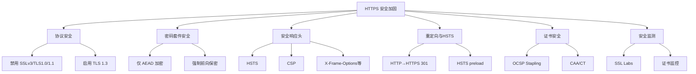
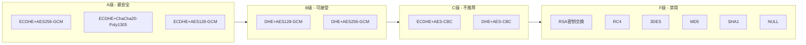

# HTTPS 安全加固

## 安全加固概述

部署 HTTPS 只是安全通信的第一步。默认配置往往存在多种安全隐患：协议降级攻击、弱密码套件、缺少安全响应头等。HTTPS 安全加固的目标是确保 TLS 连接的每个环节都达到最高安全标准。

安全加固的核心原则：

- **纵深防御**：不依赖单一安全机制
- **最小暴露**：禁用一切不必要的特性
- **主动防护**：通过 HSTS 等机制防止降级
- **持续监测**：定期进行安全评估



---

## HSTS（HTTP Strict Transport Security）

### HSTS 原理

HSTS 是一种安全策略机制，告诉浏览器只能通过 HTTPS 访问当前网站，有效防止协议降级攻击和 Cookie 劫持：

```
无 HSTS 的攻击场景：
1. 用户输入 example.com（浏览器默认使用 HTTP）
2. 攻击者截获 HTTP 请求（中间人攻击）
3. 攻击者可以：
   a. 窃取会话 Cookie
   b. 注入恶意内容
   c. 修改重定向目标

有 HSTS 的防护：
1. 首次访问后，浏览器缓存 HSTS 策略
2. 后续所有请求自动升级为 HTTPS
3. 即使用户输入 http://，浏览器也会内部转换为 https://
4. 中间人无法降级连接
```

### HSTS 响应头格式

```
Strict-Transport-Security: max-age=<expire-time>[; includeSubDomains][; preload]
```

参数说明：

| 参数 | 说明 | 推荐 |
|------|------|------|
| `max-age` | 策略有效期（秒） | 至少 31536000（1 年） |
| `includeSubDomains` | 策略应用于所有子域名 | 推荐启用 |
| `preload` | 申请加入浏览器预加载列表 | 推荐启用 |

### Nginx HSTS 配置

```nginx
# 参考：https://nginx.org/en/docs/http/ngx_http_ssl_module.html
# https://developer.mozilla.org/en-US/docs/Web/HTTP/Headers/Strict-Transport-Security

server {
    listen 443 ssl;
    server_name example.com;

    ssl_certificate     /etc/nginx/ssl/example.com-fullchain.pem;
    ssl_certificate_key /etc/nginx/ssl/example.com.key;

    # 基础 HSTS（6 个月）
    # add_header Strict-Transport-Security "max-age=15768000" always;

    # 推荐 HSTS（1 年 + 子域名）
    # add_header Strict-Transport-Security "max-age=31536000; includeSubDomains" always;

    # 最强 HSTS（1 年 + 子域名 + preload）
    add_header Strict-Transport-Security "max-age=63072000; includeSubDomains; preload" always;

    location / {
        root /var/www/html;
    }
}
```

::: warning HSTS 的风险
- `max-age` 设置过大时，如果 HTTPS 服务出现故障，用户在有效期内将无法访问网站
- `includeSubDomains` 会影响所有子域名，如果某个子域名不支持 HTTPS，将无法访问
- `preload` 几乎不可逆，需要从浏览器预加载列表中手动移除

**推荐的分阶段部署策略**：
1. 先设置 `max-age=300`（5 分钟）测试
2. 确认无问题后设置为 `max-age=86400`（1 天）
3. 再次确认后设置为 `max-age=31536000`（1 年）
4. 最后添加 `includeSubDomains` 和 `preload`
:::

### HSTS Preload 列表

HSTS Preload 是一个由 Chrome 维护的硬编码 HTTPS 站点列表，内置于所有主流浏览器中。加入 Preload 列表的站点即使从未被访问过，浏览器也会强制使用 HTTPS。

申请 Preload 列表的条件：

```
1. 必须有有效的 HTTPS 证书
2. HTTP 必须重定向到 HTTPS（同一主机）
3. 所有子域名必须支持 HTTPS（如果设置了 includeSubDomains）
4. HSTS 头必须包含：
   - max-age >= 31536000（1 年）
   - includeSubDomains
   - preload
5. 重定向后的 HTTPS 站点也必须有 HSTS 头
```

申请流程：

```
1. 确保网站满足上述条件
2. 访问 https://hstspreload.org/
3. 提交域名
4. 等待浏览器更新（通常需要数周到数月）
5. 域名被硬编码到浏览器源码中
```

::: important Preload 几乎不可逆
加入 Preload 列表后，移除需要：
1. 修改 HSTS 头（移除 preload）
2. 在 hstspreload.org 提交移除请求
3. 等待浏览器版本更新
整个过程可能需要数月。在提交前务必确认所有子域名都支持 HTTPS。
:::

---

## CSP（Content-Security-Policy）

### CSP 原理

CSP 是一种声明式安全机制，允许网站管理员控制浏览器可以加载哪些资源，有效防御 XSS（跨站脚本攻击）和数据注入攻击：

```
没有 CSP 时：
- 浏览器加载所有来源的脚本
- XSS 注入的恶意脚本可以执行
- 内联脚本、eval() 等都可以运行

有 CSP 时：
- 浏览器仅加载白名单来源的资源
- 恶意脚本被阻止执行
- 可禁用内联脚本和 eval()
```

### CSP 指令详解

| 指令 | 说明 | 示例 |
|------|------|------|
| `default-src` | 默认资源策略 | `'self'` |
| `script-src` | JavaScript 来源 | `'self' 'unsafe-inline'` |
| `style-src` | CSS 来源 | `'self' 'unsafe-inline'` |
| `img-src` | 图片来源 | `'self' data: https:` |
| `font-src` | 字体来源 | `'self' https://fonts.gstatic.com` |
| `connect-src` | XHR/Fetch/WebSocket 来源 | `'self' https://api.example.com` |
| `media-src` | 音视频来源 | `'self'` |
| `frame-src` | iframe 来源 | `'self'` |
| `object-src` | Flash/插件来源 | `'none'` |
| `base-uri` | `<base>` 标签限制 | `'self'` |
| `form-action` | 表单提交目标 | `'self'` |
| `frame-ancestors` | 嵌入此页的来源 | `'none'`（替代 X-Frame-Options） |
| `upgrade-insecure-requests` | 自动升级 HTTP 为 HTTPS | （无值） |
| `block-all-mixed-content` | 阻止混合内容 | （无值） |

### CSP 源值说明

| 源值 | 说明 |
|------|------|
| `'self'` | 同源（相同协议、域名、端口） |
| `'none'` | 不允许任何来源 |
| `'unsafe-inline'` | 允许内联脚本/样式（降低安全性） |
| `'unsafe-eval'` | 允许 eval()、new Function() 等（降低安全性） |
| `'nonce-<base64>'` | 允许匹配 nonce 的内联脚本 |
| `'sha256-<hash>'` | 允许匹配哈希的内联脚本 |
| `https:` | 允许任何 HTTPS 来源 |
| `*.example.com` | 允许 example.com 的所有子域名 |

### Nginx CSP 配置

```nginx
# 参考：https://developer.mozilla.org/en-US/docs/Web/HTTP/CSP

server {
    listen 443 ssl;
    server_name example.com;

    # 严格的 CSP（推荐）
    add_header Content-Security-Policy "default-src 'self'; script-src 'self'; style-src 'self' 'unsafe-inline'; img-src 'self' data: https:; font-src 'self' https://fonts.gstatic.com; connect-src 'self' https://api.example.com; frame-ancestors 'none'; base-uri 'self'; form-action 'self'; upgrade-insecure-requests" always;

    # 使用 nonce 的 CSP（更安全）
    # 需要在后端为每个页面生成唯一的 nonce 值
    # add_header Content-Security-Policy "default-src 'self'; script-src 'self' 'nonce-$request_id'; style-src 'self' 'unsafe-inline'; ..." always;

    # 仅报告模式（部署 CSP 前先观察）
    # add_header Content-Security-Policy-Report-Only "default-src 'self'; ..." always;
}
```

### CSP 分阶段部署策略

```nginx
# 阶段 1：仅报告模式（不阻止任何内容）
add_header Content-Security-Policy-Report-Only "default-src 'self'; script-src 'self'; style-src 'self' 'unsafe-inline'; img-src 'self' data: https:; report-uri /csp-report" always;

# 配置 CSP 报告接收端点
location /csp-report {
    access_log off;
    proxy_pass http://csp_collector;
    # 或者记录到文件
    # return 204;
}

# 阶段 2：宽松模式（允许必要的不安全来源）
add_header Content-Security-Policy "default-src 'self'; script-src 'self' 'unsafe-inline' 'unsafe-eval'; style-src 'self' 'unsafe-inline'; img-src 'self' data: https:; frame-ancestors 'self'" always;

# 阶段 3：严格模式（移除 unsafe-inline/unsafe-eval）
add_header Content-Security-Policy "default-src 'self'; script-src 'self'; style-src 'self' 'unsafe-inline'; img-src 'self' data: https:; frame-ancestors 'none'; upgrade-insecure-requests" always;
```

::: tip CSP 与 Nginx 变量
Nginx 的 `$request_id` 变量可以作为 CSP nonce 使用。但注意，`add_header` 中使用变量时，Nginx 会为每个请求生成新值，这可以满足 nonce 的唯一性要求。但需要后端应用在 HTML 中使用相同的 nonce 值。
:::

---

## 安全响应头

### X-Frame-Options

防止页面被嵌入 iframe，防御点击劫持（Clickjacking）攻击：

```nginx
# 语法：DENY | SAMEORIGIN | ALLOW-FROM uri
# 注意：ALLOW-FROM 已被多数浏览器弃用，使用 CSP frame-ancestors 替代

# 完全禁止嵌入（推荐）
add_header X-Frame-Options "DENY" always;

# 仅允许同源嵌入
add_header X-Frame-Options "SAMEORIGIN" always;
```

| 值 | 说明 |
|----|------|
| `DENY` | 完全禁止被嵌入 iframe |
| `SAMEORIGIN` | 仅允许同源页面嵌入 |

### X-Content-Type-Options

防止浏览器 MIME 类型嗅探（MIME Sniffing），减少 XSS 攻击面：

```nginx
# 唯一有效值：nosniff
add_header X-Content-Type-Options "nosniff" always;
```

```
攻击场景（无此头部）：
1. 攻击者上传一个文件，扩展名为 .jpg，但内容是 JavaScript
2. 服务器返回 Content-Type: image/jpeg
3. 浏览器嗅探到内容是 JavaScript，以脚本方式执行
4. XSS 攻击成功

防护（有此头部）：
1. 服务器返回 Content-Type: image/jpeg + X-Content-Type-Options: nosniff
2. 浏览器严格遵循 Content-Type，不嗅探
3. JavaScript 内容不会被执行
```

### X-XSS-Protection

控制浏览器内置的 XSS 过滤器（仅 Chrome/IE/Safari 支持，已被 CSP 替代）：

```nginx
# 禁用 XSS 过滤器（推荐，由 CSP 接管）
add_header X-XSS-Protection "0" always;

# 启用 XSS 过滤器
# add_header X-XSS-Protection "1" always;

# 启用 XSS 过滤器 + 阻止渲染
# add_header X-XSS-Protection "1; mode=block" always;
```

::: warning X-XSS-Protection 的安全问题
现代安全实践建议设置 `X-XSS-Protection: 0`，因为：
- XSS 过滤器本身存在漏洞，可能被利用来执行攻击
- 正确配置的 CSP 是更可靠的 XSS 防御手段
- Firefox 从未支持此头部
- Chrome 78+ 已移除 XSS Auditor
:::

### Referrer-Policy

控制 Referer 头部中携带的来源信息，保护用户隐私：

```nginx
# 推荐配置：HTTPS→HTTPS 仅发送来源域名
add_header Referrer-Policy "strict-origin-when-cross-origin" always;

# 最严格：不发送 Referer
# add_header Referrer-Policy "no-referrer" always;

# 同源发送完整 URL，跨源仅发送域名
# add_header Referrer-Policy "origin-when-cross-origin" always;
```

| 值 | 同源请求 | 跨源请求 | HTTPS→HTTP |
|----|---------|---------|-----------|
| `no-referrer` | 不发送 | 不发送 | 不发送 |
| `no-referrer-when-downgrade` | 完整 URL | 完整 URL | 不发送 |
| `origin` | 域名 | 域名 | 域名 |
| `origin-when-cross-origin` | 完整 URL | 域名 | 域名 |
| `strict-origin` | 域名 | 域名 | 不发送 |
| `strict-origin-when-cross-origin` | 完整 URL | 域名 | 不发送 |
| `same-origin` | 完整 URL | 不发送 | 不发送 |

### Permissions-Policy

控制浏览器 API 的使用权限（原 Feature-Policy）：

```nginx
# 禁用不需要的浏览器 API
add_header Permissions-Policy "camera=(), microphone=(), geolocation=(), payment=(), usb=(), magnetometer=(), gyroscope=(), accelerometer=()" always;

# 仅允许同源使用
# add_header Permissions-Policy "camera=(self), microphone=(self), geolocation=(self)" always;
```

### Cross-Origin 安全头

```nginx
# Cross-Origin-Opener-Policy (COOP)
# 防止跨源窗口访问
add_header Cross-Origin-Opener-Policy "same-origin" always;

# Cross-Origin-Embedder-Policy (COEP)
# 控制跨源资源加载
add_header Cross-Origin-Embedder-Policy "require-corp" always;

# Cross-Origin-Resource-Policy (CORP)
# 控制跨源资源访问
add_header Cross-Origin-Resource-Policy "same-origin" always;

# Access-Control-Allow-Origin（CORS）
# 仅在需要跨域时配置
# add_header Access-Control-Allow-Origin "https://trusted-site.com" always;
```

### 完整安全头部配置

```nginx
server {
    listen 443 ssl;
    server_name example.com;

    ssl_certificate     /etc/nginx/ssl/example.com-fullchain.pem;
    ssl_certificate_key /etc/nginx/ssl/example.com.key;

    # ===== HSTS =====
    add_header Strict-Transport-Security "max-age=63072000; includeSubDomains; preload" always;

    # ===== CSP =====
    add_header Content-Security-Policy "default-src 'self'; script-src 'self'; style-src 'self' 'unsafe-inline'; img-src 'self' data: https:; font-src 'self' https://fonts.gstatic.com; connect-src 'self'; frame-ancestors 'none'; base-uri 'self'; form-action 'self'; upgrade-insecure-requests" always;

    # ===== 点击劫持防护 =====
    add_header X-Frame-Options "DENY" always;

    # ===== MIME 嗅探防护 =====
    add_header X-Content-Type-Options "nosniff" always;

    # ===== XSS 防护 =====
    add_header X-XSS-Protection "0" always;

    # ===== Referer 策略 =====
    add_header Referrer-Policy "strict-origin-when-cross-origin" always;

    # ===== 权限策略 =====
    add_header Permissions-Policy "camera=(), microphone=(), geolocation=()" always;

    # ===== 跨源策略 =====
    add_header Cross-Origin-Opener-Policy "same-origin" always;
    add_header Cross-Origin-Embedder-Policy "require-corp" always;
    add_header Cross-Origin-Resource-Policy "same-origin" always;

    location / {
        root /var/www/html;
    }
}
```

---

## 密码套件安全配置

### 安全等级划分



### 推荐密码套件配置

```nginx
# 参考：https://nginx.org/en/docs/http/ngx_http_ssl_module.html#ssl_ciphers

# ===== Mozilla Modern 配置 =====
# 仅允许 AEAD + ECDHE，最高安全等级
ssl_ciphers 'ECDHE-ECDSA-AES256-GCM-SHA384:ECDHE-RSA-AES256-GCM-SHA384:ECDHE-ECDSA-CHACHA20-POLY1305:ECDHE-RSA-CHACHA20-POLY1305:ECDHE-ECDSA-AES128-GCM-SHA256:ECDHE-RSA-AES128-GCM-SHA256';

# ===== Mozilla Intermediate 配置 =====
# 额外允许 DHE，兼容性更好
ssl_ciphers 'ECDHE-ECDSA-AES128-GCM-SHA256:ECDHE-RSA-AES128-GCM-SHA256:ECDHE-ECDSA-AES256-GCM-SHA384:ECDHE-RSA-AES256-GCM-SHA384:ECDHE-ECDSA-CHACHA20-POLY1305:ECDHE-RSA-CHACHA20-POLY1305:DHE-RSA-AES128-GCM-SHA256:DHE-RSA-AES256-GCM-SHA384';

# ===== 使用排除法的配置 =====
ssl_ciphers 'ECDHE+AESGCM:ECDHE+CHACHA20:DHE+AESGCM:DHE+CHACHA20:!aNULL:!MD5:!DSS:!AESCCM:!3DES';
```

### 密码套件安全审计

```bash
# 列出当前配置的所有密码套件及安全等级
openssl ciphers -v 'ECDHE+AESGCM:ECDHE+CHACHA20:DHE+AESGCM' | \
  awk '{print $1, $2}'

# 测试连接使用的密码套件
openssl s_client -connect example.com:443 2>/dev/null | \
  grep "Cipher    :"

# 使用 nmap 扫描所有支持的密码套件
nmap --script ssl-enum-ciphers -p 443 example.com

# 使用 testssl.sh 进行全面安全扫描
# https://github.com/drwetter/testssl.sh
./testssl.sh -E example.com
```

---

## SSL Labs A+ 评级配置清单

### SSL Labs 评级标准

SSL Labs（Qualys SSL Server Test）对 HTTPS 服务器进行安全评级，评级标准：

| 评级 | 条件 |
|------|------|
| A+ | A 级 + HSTS（max-age >= 6 个月） |
| A | 协议安全 + 密码套件安全 + 证书有效 |
| B | 存在轻微安全问题 |
| C | 存在中等安全问题 |
| D | 存在严重安全问题 |
| F | 存在致命安全问题 |
| T | 证书不受信任 |
| M | 证书域名不匹配 |

### A+ 评级完整配置

```nginx
# 参考：
# https://nginx.org/en/docs/http/ngx_http_ssl_module.html
# https://ssl-config.mozilla.org/

server {
    listen 443 ssl;
    listen [::]:443 ssl;
    http2 on;
    server_name example.com;

    # ===== 证书 =====
    ssl_certificate     /etc/nginx/ssl/example.com-fullchain.pem;
    ssl_certificate_key /etc/nginx/ssl/example.com.key;

    # ===== 1. 协议版本：仅 TLS 1.2 + 1.3 =====
    ssl_protocols TLSv1.2 TLSv1.3;

    # ===== 2. 密码套件：仅 AEAD =====
    ssl_ciphers 'ECDHE-ECDSA-AES128-GCM-SHA256:ECDHE-RSA-AES128-GCM-SHA256:ECDHE-ECDSA-AES256-GCM-SHA384:ECDHE-RSA-AES256-GCM-SHA384:ECDHE-ECDSA-CHACHA20-POLY1305:ECDHE-RSA-CHACHA20-POLY1305:DHE-RSA-AES128-GCM-SHA256:DHE-RSA-AES256-GCM-SHA384:DHE-RSA-CHACHA20-POLY1305';
    ssl_prefer_server_ciphers off;

    # ===== 3. DH 参数（2048 bit+）=====
    ssl_dhparam /etc/nginx/ssl/dhparam.pem;

    # ===== 4. ECDHE 曲线 =====
    ssl_ecdh_curve X25519:secp256r1:secp384r1;

    # ===== 5. Session 恢复 =====
    ssl_session_cache shared:SSL:10m;
    ssl_session_timeout 1d;
    ssl_session_tickets on;

    # ===== 6. OCSP Stapling =====
    ssl_stapling on;
    ssl_stapling_verify on;
    ssl_trusted_certificate /etc/nginx/ssl/chain.pem;
    resolver 8.8.8.8 8.8.4.4 valid=300s;
    resolver_timeout 5s;

    # ===== 7. HSTS（A+ 必需）=====
    add_header Strict-Transport-Security "max-age=63072000; includeSubDomains; preload" always;

    # ===== 8. 其他安全头 =====
    add_header X-Frame-Options "DENY" always;
    add_header X-Content-Type-Options "nosniff" always;
    add_header X-XSS-Protection "0" always;
    add_header Referrer-Policy "strict-origin-when-cross-origin" always;

    # ===== 9. 性能优化 =====
    ssl_buffer_size 4k;

    location / {
        root /var/www/html;
    }
}

# HTTP → HTTPS 重定向
server {
    listen 80;
    listen [::]:80;
    server_name example.com;
    return 301 https://$host$request_uri;
}
```

### SSL Labs 评分检查清单

```
✅ 证书检查
  [ ] 证书有效期正常
  [ ] 证书链完整
  [ ] 证书域名匹配
  [ ] 证书未被吊销

✅ 协议检查
  [ ] 禁用 SSLv3
  [ ] 禁用 TLS 1.0
  [ ] 禁用 TLS 1.1
  [ ] 启用 TLS 1.2
  [ ] 启用 TLS 1.3

✅ 密码套件检查
  [ ] 无 RC4 密码套件
  [ ] 无 3DES 密码套件
  [ ] 无 CBC 模式密码套件（或使用 AEAD 替代）
  [ ] 支持前向保密
  [ ] 无弱密码套件

✅ 安全特性检查
  [ ] HSTS 已启用（max-age >= 15768000）
  [ ] OCSP Stapling 已启用
  [ ] 无协议降级风险
  [ ] 无 Beast/Lucky13 漏洞

✅ 密钥检查
  [ ] RSA 密钥 >= 2048 bit
  [ ] DH 参数 >= 2048 bit
  [ ] ECDHE 曲线使用安全曲线
```

---

## SSLv3/TLS 1.0/TLS 1.1 禁用

### 禁用旧协议的原因

| 协议 | 已知漏洞 | CVE | 状态 |
|------|----------|-----|------|
| SSLv3 | POODLE | CVE-2014-3566 | 完全不安全 |
| TLS 1.0 | BEAST | CVE-2011-3389 | 已废弃 |
| TLS 1.1 | 无明显漏洞，但缺乏现代安全特性 | - | 已废弃 |

### 禁用配置

```nginx
# 参考：https://nginx.org/en/docs/http/ngx_http_ssl_module.html#ssl_protocols

# 全局配置（在 http 块中）
http {
    ssl_protocols TLSv1.2 TLSv1.3;
    # ...
}

# 单个 server 配置
server {
    listen 443 ssl;
    ssl_protocols TLSv1.2 TLSv1.3;
    # ...
}
```

### 验证旧协议已禁用

```bash
# 测试 SSLv3（应连接失败）
openssl s_client -connect example.com:443 -ssl3
# 预期输出：handshake failure

# 测试 TLS 1.0（应连接失败）
openssl s_client -connect example.com:443 -tls1
# 预期输出：handshake failure

# 测试 TLS 1.1（应连接失败）
openssl s_client -connect example.com:443 -tls1_1
# 预期输出：handshake failure

# 测试 TLS 1.2（应连接成功）
openssl s_client -connect example.com:443 -tls1_2
# 预期输出：SSL handshake has read ... bytes

# 测试 TLS 1.3（应连接成功）
openssl s_client -connect example.com:443 -tls1_3
# 预期输出：SSL handshake has read ... bytes
```

### 协议降级防护

TLS 1.3 内置了降级防护机制（downgrade sentinel），但 TLS 1.2 需要额外配置：

```nginx
# TLS 1.2 降级防护：防止从 TLS 1.2 降级到 TLS 1.0/1.1
# 仅启用 TLS 1.2+ 即可防止降级
ssl_protocols TLSv1.2 TLSv1.3;

# 防止 SSLv3/TLS 1.0 的 Fallback 攻击
# OpenSSL 1.0.2+ 自带 RFC 7507 防护
# 无需额外 Nginx 配置
```

---

## HTTP → HTTPS 自动重定向

### 基本重定向

```nginx
# 参考：https://nginx.org/en/docs/http/configuring_https_servers.html

server {
    listen 80;
    listen [::]:80;
    server_name example.com www.example.com;

    # 301 永久重定向到 HTTPS
    return 301 https://$host$request_uri;
}
```

### 保留请求参数的重定向

```nginx
server {
    listen 80;
    server_name example.com;

    # 保留原始 URI 和查询参数
    return 301 https://$host$request_uri;
}

# 更复杂的重定向逻辑
server {
    listen 80;
    server_name example.com;

    # 非标准端口的重定向
    # return 301 https://$host:8443$request_uri;

    location / {
        return 301 https://$host$request_uri;
    }

    # 特定路径不重定向（如健康检查）
    location /health {
        return 200 "OK";
        add_header Content-Type text/plain;
    }
}
```

### HSTS + 重定向的完整方案

```nginx
# HTTP 重定向到 HTTPS
server {
    listen 80;
    listen [::]:80;
    server_name example.com www.example.com;

    # 301 重定向
    return 301 https://$host$request_uri;
}

# HTTPS 主站
server {
    listen 443 ssl;
    listen [::]:443 ssl;
    http2 on;
    server_name example.com www.example.com;

    ssl_certificate     /etc/nginx/ssl/example.com-fullchain.pem;
    ssl_certificate_key /etc/nginx/ssl/example.com.key;

    # HSTS：确保浏览器后续直接访问 HTTPS
    add_header Strict-Transport-Security "max-age=63072000; includeSubDomains; preload" always;

    # www → 非 www 重定向（可选）
    if ($host = 'www.example.com') {
        return 301 https://example.com$request_uri;
    }

    location / {
        root /var/www/html;
    }
}
```

::: important 重定向与 HSTS 的配合
- 单独的重定向仍可能被中间人攻击（首次 HTTP 请求时）
- HSTS 确保浏览器在 `max-age` 有效期内直接使用 HTTPS
- 两者配合形成完整防护：重定向处理首次访问，HSTS 处理后续访问
- Preload 列表确保从未访问过的用户也受到保护
:::

---

## CAA 记录与证书透明度（CT）

### CAA（Certification Authority Authorization）

CAA 是一种 DNS 记录，指定哪些 CA 有权为域名签发证书：

```
# CAA 记录语法
example.com. IN CAA 0 issue "letsencrypt.org"
example.com. IN CAA 0 issuewild ";"
example.com. IN CAA 0 iodef "mailto:security@example.com"
```

| 标志 | 标签 | 说明 |
|------|------|------|
| 0 | `issue` | 允许指定 CA 签发证书 |
| 0 | `issuewild` | 允许指定 CA 签发通配符证书 |
| 0 | `iodef` | 违规报告发送地址 |
| 128 | `issue` | 关键标志，CA 必须理解此记录才能签发 |

### CAA 配置示例

```bash
# 仅允许 Let's Encrypt 签发证书
example.com. IN CAA 0 issue "letsencrypt.org"
example.com. IN CAA 0 issuewild ";"
example.com. IN CAA 0 iodef "mailto:security@example.com"

# 允许多个 CA
example.com. IN CAA 0 issue "letsencrypt.org"
example.com. IN CAA 0 issue "digicert.com"
example.com. IN CAA 0 issuewild ";"

# 禁止所有 CA 签发证书
example.com. IN CAA 0 issue ";"
```

::: tip CAA 的安全意义
- 防止未授权 CA 为域名签发证书
- 即使攻击者控制了 DNS，也无法从未授权的 CA 获取证书
- CA 在签发证书前必须检查 CAA 记录
- 自 2017 年 9 月起，所有 CA 必须遵守 CAA 记录
:::

### 证书透明度（Certificate Transparency）

CT 要求 CA 将签发的所有证书记录到公开的、可审计的日志中：

```
CT 工作原理：
1. CA 签发证书前，将预证书提交到 CT Log
2. CT Log 返回 SCT（Signed Certificate Timestamp）
3. CA 将 SCT 嵌入证书或通过 OCSP/TLS 扩展提供
4. 域名所有者可以监控 CT Log，发现未授权证书

CT 的安全价值：
- 快速发现未授权/恶意签发的证书
- 提供证书签发的公开审计追踪
- 域名所有者可以设置监控告警
```

### CT 监控工具

```bash
# 使用 crt.sh 查询域名的所有证书
# https://crt.sh/?q=example.com

# 使用 Google CT Log 搜索
# https://transparencyreport.google.com/https/certificates

# 使用 certspotter 监控 CT Log
# https://github.com/SSLMate/certspotter

# 命令行查询
curl -s "https://crt.sh/?q=example.com&output=json" | \
  jq '.[].name_value' | sort -u
```

### Nginx 中启用 CT

```nginx
# OpenSSL 1.1.0+ 支持 CT
# 需要编译时启用 --with-openssl-opt=enable-ct

server {
    listen 443 ssl;
    server_name example.com;

    ssl_certificate     /etc/nginx/ssl/example.com-fullchain.pem;
    ssl_certificate_key /etc/nginx/ssl/example.com.key;

    # 启用 CT（需要证书包含 SCT）
    # ssl_ct on;

    # 指定 CT Log 列表
    # ssl_ct_log /etc/nginx/ct/logs.json;
}
```

::: warning CT 配置注意事项
- Let's Encrypt 证书自动包含 SCT
- 其他 CA 的证书可能需要手动添加 SCT
- ssl_ct 指令需要 Nginx 编译时包含 CT 支持
- 大多数情况下不需要手动配置 CT，CA 已自动处理
:::

---

## 安全配置验证工具

### SSL Labs Server Test

最权威的在线 HTTPS 安全检测工具：

```
使用方式：
1. 访问 https://www.ssllabs.com/ssltest/
2. 输入域名
3. 等待测试完成（通常 1-3 分钟）
4. 查看评级和详细报告

测试项目：
- 证书验证
- 协议支持
- 密码套件强度
- 前向保密支持
- HSTS 配置
- OCSP Stapling
- 已知漏洞检测
```

### testssl.sh

功能最全面的命令行 SSL 测试工具：

```bash
# 安装
git clone --depth 1 https://github.com/drwetter/testssl.sh.git
cd testssl.sh

# 完整测试
./testssl.sh example.com

# 仅测试协议
./testssl.sh -P example.com

# 仅测试密码套件
./testssl.sh -E example.com

# 仅测试漏洞
./testssl.sh -U example.com

# 仅测试 HTTP 头部
./testssl.sh -H example.com

# 输出 JSON 报告
./testssl.sh --json example.com

# 输出 HTML 报告
./testssl.sh --html example.com
```

### openssl 命令行检测

```bash
# 检查证书信息
echo | openssl s_client -connect example.com:443 2>/dev/null | \
  openssl x509 -noout -text

# 检查协议支持
for proto in ssl3 tls1 tls1_1 tls1_2 tls1_3; do
  echo -n "$proto: "
  openssl s_client -connect example.com:443 -$proto 2>&1 | \
    grep -c "Protocol.*$proto" || echo "not supported"
done

# 检查 OCSP Stapling
openssl s_client -connect example.com:443 -status 2>/dev/null | \
  grep "OCSP response"

# 检查证书链
openssl s_client -connect example.com:443 -showcerts 2>/dev/null | \
  awk '/BEGIN CERT/,/END CERT/'

# 检查 HSTS
curl -sI https://example.com | grep -i strict-transport

# 检查所有安全头
curl -sI https://example.com | grep -iE \
  "strict-transport|x-frame|x-content-type|x-xss|referrer-policy|content-security"
```

### nmap SSL 扫描

```bash
# 扫描 SSL 配置
nmap --script ssl-enum-ciphers -p 443 example.com

# 扫描证书信息
nmap --script ssl-cert -p 443 example.com

# 检测已知漏洞
nmap --script ssl-heartbleed -p 443 example.com
nmap --script ssl-poodle -p 443 example.com
nmap --script ssl-ccs-injection -p 443 example.com
```

### 在线检测工具汇总

| 工具 | 网址 | 用途 |
|------|------|------|
| SSL Labs | ssllabs.com/ssltest | HTTPS 安全评级 |
| Mozilla Observatory | observatory.mozilla.org | 综合安全检测 |
| Security Headers | securityheaders.com | 安全响应头检测 |
| CSP Evaluator | csp-evaluator.withgoogle.com | CSP 策略分析 |
| HSTS Preload | hstspreload.org | HSTS Preload 检测/申请 |
| crt.sh | crt.sh | CT Log 证书搜索 |

---

## 完整安全加固配置

### 生产级配置

```nginx
# 参考：
# https://nginx.org/en/docs/http/ngx_http_ssl_module.html
# https://ssl-config.mozilla.org/

# ===== 全局 SSL 配置 =====
http {
    # 全局协议版本
    ssl_protocols TLSv1.2 TLSv1.3;

    # 全局密码套件
    ssl_ciphers 'ECDHE-ECDSA-AES128-GCM-SHA256:ECDHE-RSA-AES128-GCM-SHA256:ECDHE-ECDSA-AES256-GCM-SHA384:ECDHE-RSA-AES256-GCM-SHA384:ECDHE-ECDSA-CHACHA20-POLY1305:ECDHE-RSA-CHACHA20-POLY1305:DHE-RSA-AES128-GCM-SHA256:DHE-RSA-AES256-GCM-SHA384:DHE-RSA-CHACHA20-POLY1305';
    ssl_prefer_server_ciphers off;

    # 全局 ECDHE 曲线
    ssl_ecdh_curve X25519:secp256r1:secp384r1;

    # 全局 Session 配置
    ssl_session_cache shared:SSL:10m;
    ssl_session_timeout 1d;
    ssl_session_tickets on;

    # DH 参数
    ssl_dhparam /etc/nginx/ssl/dhparam.pem;

    # ===== HTTPS 服务器 =====
    server {
        listen 443 ssl;
        listen [::]:443 ssl;
        http2 on;
        server_name example.com;

        ssl_certificate     /etc/nginx/ssl/example.com-fullchain.pem;
        ssl_certificate_key /etc/nginx/ssl/example.com.key;

        # OCSP Stapling
        ssl_stapling on;
        ssl_stapling_verify on;
        ssl_trusted_certificate /etc/nginx/ssl/chain.pem;
        resolver 8.8.8.8 8.8.4.4 valid=300s;
        resolver_timeout 5s;

        # 性能优化
        ssl_buffer_size 4k;

        # ===== 安全响应头 =====

        # HSTS
        add_header Strict-Transport-Security "max-age=63072000; includeSubDomains; preload" always;

        # CSP
        add_header Content-Security-Policy "default-src 'self'; script-src 'self'; style-src 'self' 'unsafe-inline'; img-src 'self' data: https:; font-src 'self' https://fonts.gstatic.com; connect-src 'self'; frame-ancestors 'none'; base-uri 'self'; form-action 'self'; upgrade-insecure-requests" always;

        # 点击劫持防护
        add_header X-Frame-Options "DENY" always;

        # MIME 嗅探防护
        add_header X-Content-Type-Options "nosniff" always;

        # XSS 防护
        add_header X-XSS-Protection "0" always;

        # Referer 策略
        add_header Referrer-Policy "strict-origin-when-cross-origin" always;

        # 权限策略
        add_header Permissions-Policy "camera=(), microphone=(), geolocation=()" always;

        location / {
            root /var/www/html;
        }
    }

    # ===== HTTP 重定向 =====
    server {
        listen 80;
        listen [::]:80;
        server_name example.com;
        return 301 https://$host$request_uri;
    }
}
```

---

## 常见安全漏洞与修复

### POODLE（Padding Oracle On Downgraded Legacy Encryption）

```
影响：SSLv3
修复：禁用 SSLv3

ssl_protocols TLSv1.2 TLSv1.3;
```

### BEAST（Browser Exploit Against SSL/TLS）

```
影响：TLS 1.0 + CBC 模式
修复：禁用 TLS 1.0，使用 AEAD 密码套件

ssl_protocols TLSv1.2 TLSv1.3;
ssl_ciphers 'ECDHE+AESGCM:ECDHE+CHACHA20:DHE+AESGCM:DHE+CHACHA20';
```

### Heartbleed

```
影响：OpenSSL 1.0.1 - 1.0.1f
修复：升级 OpenSSL 到 1.0.1g+，重新生成密钥和证书

# 检测
nmap --script ssl-heartbleed -p 443 example.com
```

### Lucky13

```
影响：TLS 使用 CBC 模式时
修复：使用 AEAD 密码套件替代 CBC

ssl_ciphers 'ECDHE+AESGCM:ECDHE+CHACHA20';
```

### ROBOT（Return Of Bleichenbacher's Oracle Threat）

```
影响：RSA PKCS#1 v1.5 密钥交换
修复：禁用 RSA 密钥交换，使用 ECDHE

ssl_ciphers 'ECDHE+AESGCM:ECDHE+CHACHA20:DHE+AESGCM';
# 确保不包含 RSA 密钥交换的套件
```

### Logjam

```
影响：DHE 密钥交换使用 1024 bit 或更弱的 DH 参数
修复：使用 2048+ bit DH 参数

ssl_dhparam /etc/nginx/ssl/dhparam.pem;  # 2048+ bit
```

---

## 延伸阅读

- [Nginx SSL Module 官方文档](https://nginx.org/en/docs/http/ngx_http_ssl_module.html)
- [Mozilla SSL Configuration Generator](https://ssl-config.mozilla.org/)
- [OWASP Secure Headers Project](https://owasp.org/www-project-secure-headers/)
- [RFC 6797 - HSTS](https://tools.ietf.org/html/rfc6797)
- [W3C CSP Level 3](https://www.w3.org/TR/CSP3/)
- [RFC 6844 - CAA](https://tools.ietf.org/html/rfc6844)
- [RFC 6962 - Certificate Transparency](https://tools.ietf.org/html/rfc6962)
- [SSL Labs Server Test](https://www.ssllabs.com/ssltest/)
