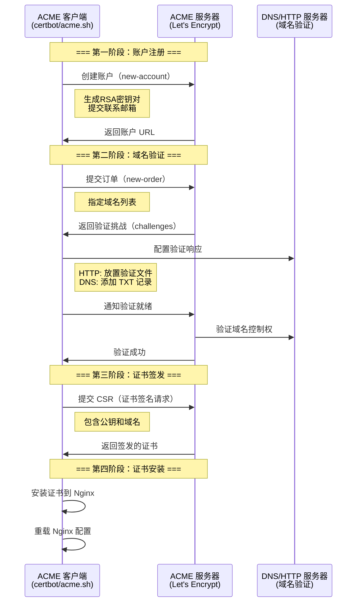
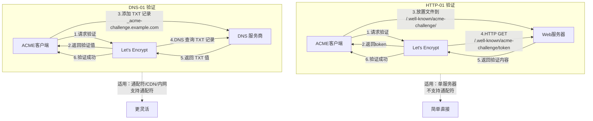

# 证书自动化与 Let's Encrypt

## HTTPS 证书的自动化需求

SSL/TLS 证书有有效期限制，过期后网站将无法通过 HTTPS 正常访问。手动管理证书存在以下问题：

- **容易遗忘**：证书到期前需要手动续期，一旦遗忘会导致服务中断
- **多域名管理复杂**：服务器上可能托管数十个域名，逐一管理效率极低
- **人为操作风险**：手动操作容易出错，如配置文件路径错误、权限设置不当
- **规模化困难**：大规模部署时手动管理几乎不可能

Let's Encrypt 和 ACME 协议的出现，使证书管理自动化成为可能。

---

## Let's Encrypt 与 ACME 协议

### Let's Encrypt 简介

Let's Encrypt 是由 ISRG（Internet Security Research Group）运营的免费、开放、自动化的证书颁发机构：

| 特性 | 说明 |
|------|------|
| 费用 | 免费 |
| 证书类型 | DV（Domain Validation） |
| 有效期 | 90 天 |
| 通配符 | 支持（需 DNS 验证） |
| 多域名 | 支持（SAN） |
| 颁发速率 | 每周每域名 50 张（重复证书限制 5 张/周） |
| 根证书 | ISRG Root X1 |

### ACME 协议原理

ACME（Automated Certificate Management Environment）是 Let's Encrypt 使用的证书管理协议，RFC 8555 标准化：



### ACME 验证方式

| 验证方式 | 类型 | 说明 | 适合场景 |
|----------|------|------|----------|
| HTTP-01 | HTTP | 在 `/.well-known/acme-challenge/` 放置验证文件 | 单服务器、无 CDN |
| DNS-01 | DNS | 添加 `_acme-challenge` TXT 记录 | 通配符证书、CDN、内网 |
| TLS-ALPN-01 | TLS | 通过 TLS ALPN 扩展验证 | 无 HTTP 服务时 |

---

## certbot 安装与使用

### certbot 安装

```bash
# Ubuntu/Debian
sudo apt update
sudo apt install certbot python3-certbot-nginx

# CentOS/RHEL
sudo yum install certbot python3-certbot-nginx

# 使用 snap（推荐，官方推荐方式）
sudo snap install core
sudo snap refresh core
sudo snap install --classic certbot

# 创建软链接
sudo ln -sf /snap/bin/certbot /usr/bin/certbot

# 验证安装
certbot --version
```

### certbot 获取证书

```bash
# 方法 1：自动配置 Nginx（推荐新手）
# certbot 会自动修改 Nginx 配置
sudo certbot --nginx

# 方法 2：仅获取证书，手动配置 Nginx
sudo certbot certonly --nginx

# 方法 3：使用 standalone 模式（无需 Nginx 运行）
# certbot 会启动临时 Web 服务器
sudo certbot certonly --standalone -d example.com

# 方法 4：使用 webroot 模式（Nginx 运行中）
# 将验证文件放在 Nginx 的 webroot 目录下
sudo certbot certonly --webroot \
  -w /var/www/html \
  -d example.com \
  -d www.example.com

# 方法 5：使用 DNS 验证（通配符证书必需）
sudo certbot certonly --manual \
  --preferred-challenges dns \
  -d example.com \
  -d "*.example.com"
```

### certbot Nginx 插件

```bash
# 自动获取并安装证书（修改 Nginx 配置）
sudo certbot --nginx -d example.com -d www.example.com

# certbot 会自动：
# 1. 验证域名
# 2. 获取证书
# 3. 修改 Nginx 配置（添加 ssl_certificate 等指令）
# 4. 配置 HTTP→HTTPS 重定向
# 5. 重载 Nginx
```

### certbot webroot 模式配置

需要在 Nginx 中预先配置 ACME 验证路径：

```nginx
# 参考：https://nginx.org/en/docs/http/ngx_http_core_module.html

server {
    listen 80;
    server_name example.com www.example.com;

    # ACME 验证路径
    location /.well-known/acme-challenge/ {
        root /var/www/html;
        # 或者指定专用目录
        # root /var/www/certbot;
    }

    # 其他请求重定向到 HTTPS
    location / {
        return 301 https://$host$request_uri;
    }
}
```

```bash
# 创建验证目录
sudo mkdir -p /var/www/html/.well-known/acme-challenge
sudo chown -R www-data:www-data /var/www/html/.well-known

# 获取证书
sudo certbot certonly --webroot \
  -w /var/www/html \
  -d example.com \
  -d www.example.com
```

### certbot 证书安装

```bash
# 证书文件位置
ls /etc/letsencrypt/live/example.com/
# cert.pem        - 终端证书
# chain.pem       - 中间证书
# fullchain.pem   - 完整证书链（Nginx 使用此文件）
# privkey.pem     - 私钥

# 在 Nginx 中配置证书
# certbot --nginx 会自动配置
# 手动配置：
```

```nginx
server {
    listen 443 ssl;
    server_name example.com;

    ssl_certificate     /etc/letsencrypt/live/example.com/fullchain.pem;
    ssl_certificate_key /etc/letsencrypt/live/example.com/privkey.pem;

    # 其他 SSL 配置...
}
```

### certbot 续期

```bash
# 手动续期（测试，不实际续期）
sudo certbot renew --dry-run

# 手动续期
sudo certbot renew

# 续期并重载 Nginx
sudo certbot renew --deploy-hook "systemctl reload nginx"

# 查看所有证书信息
sudo certbot certificates
```

::: tip 续期时机
Let's Encrypt 证书有效期为 90 天。certbot 默认在证书到期前 30 天自动续期。这意味着证书实际使用时间为 60-90 天，续期后新证书有效期又回到 90 天。
:::

---

## DNS 验证 vs HTTP 验证



### HTTP-01 验证详解

```
优势：
- 配置简单，只需 Web 服务器可访问
- 无需 DNS API 访问权限
- 验证速度快

劣势：
- 不支持通配符证书
- 需要 80 端口可访问
- CDN 可能干扰验证
- 防火墙需放行 80 端口

工作原理：
1. ACME 客户端请求验证
2. Let's Encrypt 返回 token 和验证内容
3. 客户端将验证内容放置到
   http://example.com/.well-known/acme-challenge/<token>
4. Let's Encrypt 发起 HTTP GET 请求验证
5. 验证成功后签发证书
```

### DNS-01 验证详解

```
优势：
- 支持通配符证书（*.example.com）
- 不需要 Web 服务器可从外网访问
- 适合内网服务器
- CDN 不影响验证

劣势：
- 需要 DNS API 访问权限
- DNS 传播延迟（可能需要等待）
- 配置较复杂
- DNS API 可能产生额外费用

工作原理：
1. ACME 客户端请求验证
2. Let's Encrypt 返回验证值
3. 客户端添加 DNS TXT 记录：
   _acme-challenge.example.com IN TXT "<验证值>"
4. Let's Encrypt 查询 DNS TXT 记录验证
5. 验证成功后签发证书
```

### 验证方式选择指南

| 场景 | 推荐验证方式 | 原因 |
|------|-------------|------|
| 单服务器、无 CDN | HTTP-01 | 最简单 |
| 多服务器 + CDN | DNS-01 | CDN 不影响验证 |
| 通配符证书 | DNS-01 | HTTP-01 不支持通配符 |
| 内网服务器 | DNS-01 | 外网无法访问内网 |
| 负载均衡 | DNS-01 | 避免验证请求落到错误的后端 |
| Docker 容器 | DNS-01 或 HTTP-01 + webroot | 取决于架构 |

---

## acme.sh：自动申请与部署

### acme.sh 简介

acme.sh 是一个纯 Shell 实现的 ACME 客户端，相比 certbot 更轻量、更灵活：

| 特性 | certbot | acme.sh |
|------|---------|---------|
| 语言 | Python | Shell |
| 依赖 | Python + 多个库 | 仅 curl 和 openssl |
| 安装方式 | 包管理器/snap | Shell 脚本 |
| 配置存储 | /etc/letsencrypt/ | ~/.acme.sh/ |
| DNS API 集成 | 有限 | 150+ DNS 服务商 |
| 多 CA 支持 | 有限 | 多个 ACME CA |
| 权限 | 需要 root | 可普通用户运行 |

### acme.sh 安装

```bash
# 安装
curl https://get.acme.sh | sh -s email=your@example.com

# 或者
wget -O - https://get.acme.sh | sh -s email=your@example.com

# 安装后自动添加 cron 任务
crontab -l | grep acme

# 升级
acme.sh --upgrade

# 自动升级
acme.sh --upgrade --auto-upgrade
```

### acme.sh HTTP 验证申请

```bash
# webroot 模式
acme.sh --issue -d example.com -d www.example.com \
  --webroot /var/www/html

# nginx 模式（自动读取 Nginx 配置）
acme.sh --issue -d example.com --nginx

# standalone 模式（需停止 Nginx 或使用 80 端口）
acme.sh --issue -d example.com --standalone

# standalone 模式（使用其他端口，配合 Nginx 代理）
acme.sh --issue -d example.com --standalone --httpport 8899
```

### acme.sh DNS 验证申请

```bash
# Cloudflare DNS API
export CF_Token="your_cloudflare_api_token"
export CF_Zone_ID="your_zone_id"

acme.sh --issue -d example.com -d "*.example.com --dns dns_cf

# 阿里云 DNS API
export Ali_Key="your_access_key"
export Ali_Secret="your_access_secret"

acme.sh --issue -d example.com -d "*.example.com --dns dns_ali

# 腾讯云 DNS API
export Tencent_SecretId="your_secret_id"
export Tencent_SecretKey="your_secret_key"

acme.sh --issue -d example.com -d "*.example.com --dns dns_dp

# DNS 手动模式
acme.sh --issue -d example.com --dns --yes-I-know-dns-manual-mode-enough-go-ahead-please
```

::: tip DNS API 配置持久化
acme.sh 会将 DNS API 凭据保存到 `~/.acme.sh/account.conf`，后续续期时无需再次设置。

```bash
# 查看 DNS API 配置
cat ~/.acme.sh/account.conf | grep -i "CF_\|Ali_\|Tencent_"
```
:::

### acme.sh 安装证书到 Nginx

```bash
# 安装证书（推荐方式，不要直接引用 ~/.acme.sh/ 下的证书）
acme.sh --install-cert -d example.com \
  --key-file       /etc/nginx/ssl/example.com.key \
  --fullchain-file /etc/nginx/ssl/example.com-fullchain.pem \
  --reloadcmd      "systemctl reload nginx"

# 说明：
# --key-file：将私钥复制到指定位置
# --fullchain-file：将完整证书链复制到指定位置
# --reloadcmd：安装后执行的命令

# acme.sh 会记住这些路径，续期后自动执行安装和重载
```

### acme.sh 证书管理

```bash
# 查看所有证书
acme.sh --list

# 查看证书详情
acme.sh --info -d example.com

# 续期单个证书
acme.sh --renew -d example.com

# 强制续期
acme.sh --renew -d example.com --force

# 续期所有证书
acme.sh --renew-all

# 删除证书
acme.sh --remove -d example.com

# 迁移证书到其他 CA
acme.sh --set-ca -d example.com --server buypass
```

---

## 自动续期：cron 与 systemd timer

### certbot 自动续期

```bash
# certbot 安装时自动创建 systemd timer 或 cron 任务

# 检查 systemd timer
systemctl list-timers | grep certbot

# 检查 cron 任务
crontab -l | grep certbot
# 或
cat /etc/cron.d/certbot

# 默认配置：每天检查两次（0:00 和 12:00）
# 0 0,12 * * * root certbot renew --quiet --deploy-hook "systemctl reload nginx"
```

### 自定义 certbot 续期脚本

```bash
#!/bin/bash
# /usr/local/bin/certbot-renew.sh

# 续期证书
certbot renew --quiet --deploy-hook "systemctl reload nginx"

# 检查续期结果
if [ $? -eq 0 ]; then
    echo "$(date): Certificate renewal successful" >> /var/log/certbot-renew.log
else
    echo "$(date): Certificate renewal FAILED" >> /var/log/certbot-renew.log
    # 发送告警
    echo "Certificate renewal failed on $(hostname)" | \
        mail -s "CERTBOT ALERT" admin@example.com
fi
```

```bash
# 添加 cron 任务
chmod +x /usr/local/bin/certbot-renew.sh

# 每天凌晨 2 点执行
echo "0 2 * * * root /usr/local/bin/certbot-renew.sh" > /etc/cron.d/certbot-renew
```

### acme.sh 自动续期

```bash
# acme.sh 安装时自动创建 cron 任务
crontab -l | grep acme.sh

# 默认配置：每天 0:58 检查续期
# 58 0 * * * "/home/user/.acme.sh"/acme.sh --cron --home "/home/user/.acme.sh" > /dev/null

# 手动触发续期检查
acme.sh --cron

# 修改续期配置
acme.sh --renew -d example.com --reloadcmd "systemctl reload nginx"
```

### systemd timer 配置

```ini
# /etc/systemd/system/certbot-renew.service
[Unit]
Description=Certbot Renew
After=network.target

[Service]
Type=oneshot
ExecStart=/usr/bin/certbot renew --quiet --deploy-hook "systemctl reload nginx"
```

```ini
# /etc/systemd/system/certbot-renew.timer
[Unit]
Description=Certbot Renew Timer

[Timer]
OnCalendar=*-*-* 02:00:00
RandomizedDelaySec=1800

[Install]
WantedBy=timers.target
```

```bash
# 启用 timer
sudo systemctl daemon-reload
sudo systemctl enable certbot-renew.timer
sudo systemctl start certbot-renew.timer

# 检查 timer 状态
systemctl list-timers certbot-renew

# 手动触发续期
sudo systemctl start certbot-renew.service
```

::: important RandomizedDelaySec
`RandomizedDelaySec` 添加随机延迟，避免大量服务器同时请求 Let's Encrypt 造成服务过载。建议设置 300-1800 秒。
:::

---

## 通配符证书申请

### 通配符证书的要求

```
1. 必须使用 DNS-01 验证
2. 通配符仅匹配一级子域名
   - *.example.com 匹配 www.example.com, api.example.com
   - *.example.com 不匹配 sub.api.example.com
3. 需要同时申请根域名和通配符
   - example.com + *.example.com
4. 需要两次 DNS 验证（每个域名一次）
```

### certbot 通配符证书

```bash
# 使用 Cloudflare DNS 插件
sudo apt install python3-certbot-dns-cloudflare

# 配置 Cloudflare API 凭据
cat > /etc/letsencrypt/cloudflare.ini << 'EOF'
dns_cloudflare_api_token = your_cloudflare_api_token
EOF

chmod 600 /etc/letsencrypt/cloudflare.ini

# 申请通配符证书
sudo certbot certonly \
  --dns-cloudflare \
  --dns-cloudflare-credentials /etc/letsencrypt/cloudflare.ini \
  -d example.com \
  -d "*.example.com"

# 使用 Route53 插件
sudo apt install python3-certbot-dns-route53

sudo certbot certonly \
  --dns-route53 \
  -d example.com \
  -d "*.example.com"
```

### acme.sh 通配符证书

```bash
# Cloudflare
export CF_Token="your_token"
export CF_Zone_ID="your_zone_id"

acme.sh --issue -d example.com -d "*.example.com" --dns dns_cf

# 阿里云
export Ali_Key="your_key"
export Ali_Secret="your_secret"

acme.sh --issue -d example.com -d "*.example.com" --dns dns_ali

# 安装到 Nginx
acme.sh --install-cert -d example.com \
  --key-file       /etc/nginx/ssl/example.com.key \
  --fullchain-file /etc/nginx/ssl/example.com-fullchain.pem \
  --reloadcmd      "systemctl reload nginx"
```

### 通配符证书在 Nginx 中的使用

```nginx
# 参考：https://nginx.org/en/docs/http/configuring_https_servers.html

# 主站
server {
    listen 443 ssl;
    server_name example.com www.example.com;

    ssl_certificate     /etc/nginx/ssl/example.com-fullchain.pem;
    ssl_certificate_key /etc/nginx/ssl/example.com.key;

    location / {
        root /var/www/main;
    }
}

# API 子站（复用同一证书）
server {
    listen 443 ssl;
    server_name api.example.com;

    ssl_certificate     /etc/nginx/ssl/example.com-fullchain.pem;
    ssl_certificate_key /etc/nginx/ssl/example.com.key;

    location / {
        proxy_pass http://api_backend;
    }
}

# Blog 子站（复用同一证书）
server {
    listen 443 ssl;
    server_name blog.example.com;

    ssl_certificate     /etc/nginx/ssl/example.com-fullchain.pem;
    ssl_certificate_key /etc/nginx/ssl/example.com.key;

    location / {
        root /var/www/blog;
    }
}
```

---

## 多域名证书管理

### 单证书覆盖多域名

```bash
# certbot：一次申请覆盖多个域名
sudo certbot certonly --nginx \
  -d example.com \
  -d www.example.com \
  -d api.example.com \
  -d blog.example.com

# acme.sh：一次申请覆盖多个域名
acme.sh --issue -d example.com -d www.example.com \
  -d api.example.com -d blog.example.com --nginx
```

### 多域名证书与 SNI

```nginx
# 多域名证书 + SNI 配置
# 证书包含：example.com, www.example.com, api.example.com

server {
    listen 443 ssl;
    server_name example.com www.example.com;

    # 所有域名共用同一证书
    ssl_certificate     /etc/nginx/ssl/example.com-fullchain.pem;
    ssl_certificate_key /etc/nginx/ssl/example.com.key;

    location / {
        root /var/www/main;
    }
}

server {
    listen 443 ssl;
    server_name api.example.com;

    # 复用同一证书
    ssl_certificate     /etc/nginx/ssl/example.com-fullchain.pem;
    ssl_certificate_key /etc/nginx/ssl/example.com.key;

    location / {
        proxy_pass http://api_backend;
    }
}
```

### 多域名管理策略

| 策略 | 证书数量 | 优点 | 缺点 |
|------|----------|------|------|
| 单证书多域名 | 1 | 管理简单 | 私钥泄露影响所有域名 |
| 通配符证书 | 1 | 自动覆盖新子域名 | 不覆盖多级子域名 |
| 每域名独立证书 | N | 隔离性好 | 管理复杂 |
| 分组证书 | 少量 | 平衡管理和安全 | 需要规划分组 |

---

## 证书监控与告警

### 证书到期监控脚本

```bash
#!/bin/bash
# /usr/local/bin/check-certs.sh

# 检查所有 Let's Encrypt 证书
CERT_DIR="/etc/letsencrypt/live"
WARN_DAYS=30
CRIT_DAYS=7

for cert_dir in "$CERT_DIR"/*/; do
    domain=$(basename "$cert_dir")
    cert_file="$cert_dir/cert.pem"

    if [ -f "$cert_file" ]; then
        expiry=$(openssl x509 -in "$cert_file" -noout -enddate | cut -d= -f2)
        expiry_epoch=$(date -d "$expiry" +%s 2>/dev/null || date -j -f "%b %d %T %Y %Z" "$expiry" +%s)
        now_epoch=$(date +%s)
        days_left=$(( (expiry_epoch - now_epoch) / 86400 ))

        if [ "$days_left" -lt "$CRIT_DAYS" ]; then
            echo "CRITICAL: $domain expires in $days_left days ($expiry)"
            # 发送告警邮件
            echo "Certificate for $domain expires in $days_left days!" | \
                mail -s "CRITICAL: Certificate Expiry - $domain" admin@example.com
        elif [ "$days_left" -lt "$WARN_DAYS" ]; then
            echo "WARNING: $domain expires in $days_left days ($expiry)"
        else
            echo "OK: $domain expires in $days_left days ($expiry)"
        fi
    fi
done
```

### Prometheus 证书监控

使用 `ssl_exporter` 或 `blackbox_exporter` 监控证书：

```yaml
# blackbox_exporter 配置
modules:
  https_cert:
    prober: https
    timeout: 5s
    http:
      preferred_ip_protocol: ip4
      tls_config:
        insecure_skip_verify: false
```

```yaml
# Prometheus 告警规则
groups:
  - name: ssl_cert
    rules:
      - alert: SSLCertExpiringSoon
        expr: probe_ssl_earliest_cert_expiry - time() < 86400 * 14
        for: 1h
        labels:
          severity: warning
        annotations:
          summary: "SSL certificate expiring in {{ $value | humanizeDuration }}"

      - alert: SSLCertExpired
        expr: probe_ssl_earliest_cert_expiry - time() < 0
        for: 0m
        labels:
          severity: critical
        annotations:
          summary: "SSL certificate has expired"
```

### 证书续期日志监控

```bash
# 监控 certbot 续期日志
tail -f /var/log/letsencrypt/letsencrypt.log

# 监控 acme.sh 续期日志
tail -f ~/.acme.sh/acme.sh.log

# 检查续期 cron 执行日志
grep CRON /var/log/syslog | grep certbot

# 使用 journalctl 查看 systemd 触发的续期
journalctl -u certbot-renew.service
```

---

## 生产级自动化部署方案

### Docker + Nginx + certbot 方案

```yaml
# docker-compose.yml
version: '3.8'

services:
  nginx:
    image: nginx:alpine
    ports:
      - "80:80"
      - "443:443"
    volumes:
      - ./nginx/conf.d:/etc/nginx/conf.d
      - ./nginx/nginx.conf:/etc/nginx/nginx.conf
      - certbot-www:/var/www/certbot:ro
      - certbot-certs:/etc/nginx/ssl:ro
    depends_on:
      - certbot

  certbot:
    image: certbot/certbot
    volumes:
      - certbot-www:/var/www/certbot
      - certbot-certs:/etc/letsencrypt
    entrypoint: "/bin/sh -c 'trap exit TERM; while :; do certbot renew; sleep 12h & wait $${!}; done;'"

volumes:
  certbot-www:
  certbot-certs:
```

```nginx
# nginx/conf.d/default.conf

# ACME 验证
server {
    listen 80;
    server_name example.com www.example.com;

    location /.well-known/acme-challenge/ {
        root /var/www/certbot;
    }

    location / {
        return 301 https://$host$request_uri;
    }
}

# HTTPS 服务
server {
    listen 443 ssl;
    http2 on;
    server_name example.com www.example.com;

    ssl_certificate     /etc/nginx/ssl/live/example.com/fullchain.pem;
    ssl_certificate_key /etc/nginx/ssl/live/example.com/privkey.pem;

    ssl_protocols TLSv1.2 TLSv1.3;
    ssl_ciphers 'ECDHE-ECDSA-AES128-GCM-SHA256:ECDHE-RSA-AES128-GCM-SHA256:ECDHE-ECDSA-AES256-GCM-SHA384:ECDHE-RSA-AES256-GCM-SHA384:ECDHE-ECDSA-CHACHA20-POLY1305:ECDHE-RSA-CHACHA20-POLY1305';
    ssl_prefer_server_ciphers off;

    ssl_session_cache shared:SSL:10m;
    ssl_session_timeout 1d;

    ssl_stapling on;
    ssl_stapling_verify on;
    resolver 8.8.8.8 8.8.4.4 valid=300s;

    add_header Strict-Transport-Security "max-age=63072000; includeSubDomains; preload" always;

    location / {
        root /var/www/html;
    }
}
```

### 初始化脚本

```bash
#!/bin/bash
# init-certs.sh - 首次部署时获取证书

DOMAIN=${1:-example.com}
EMAIL=${2:-admin@example.com}

# 先启动仅 HTTP 的 Nginx
docker compose up -d nginx

# 等待 Nginx 启动
sleep 5

# 获取证书
docker compose run --rm certbot certonly \
  --webroot \
  --webroot-path /var/www/certbot \
  --email "$EMAIL" \
  --agree-tos \
  --no-eff-email \
  -d "$DOMAIN" \
  -d "www.$DOMAIN"

# 重启 Nginx 以加载证书
docker compose restart nginx

echo "Certificate obtained for $DOMAIN"
```

### acme.sh + Nginx 自动化方案

```bash
#!/bin/bash
# deploy-acme.sh - 使用 acme.sh 的自动化部署方案

DOMAIN="example.com"
SSL_DIR="/etc/nginx/ssl"

# 1. 安装 acme.sh
curl https://get.acme.sh | sh -s email=admin@example.com
source ~/.bashrc

# 2. 配置 DNS API（以 Cloudflare 为例）
export CF_Token="your_token"
export CF_Zone_ID="your_zone_id"

# 3. 申请通配符证书
acme.sh --issue -d "$DOMAIN" -d "*.$DOMAIN" --dns dns_cf

# 4. 创建 SSL 目录
mkdir -p "$SSL_DIR"

# 5. 安装证书
acme.sh --install-cert -d "$DOMAIN" \
  --key-file       "$SSL_DIR/$DOMAIN.key" \
  --fullchain-file "$SSL_DIR/$DOMAIN-fullchain.pem" \
  --reloadcmd      "systemctl reload nginx"

# 6. 生成 DH 参数
openssl dhparam -out "$SSL_DIR/dhparam.pem" 2048

# 7. 配置 Nginx
cat > /etc/nginx/conf.d/ssl.conf << 'NGINX_EOF'
server {
    listen 443 ssl;
    http2 on;
    server_name _;

    ssl_certificate     /etc/nginx/ssl/example.com-fullchain.pem;
    ssl_certificate_key /etc/nginx/ssl/example.com.key;

    ssl_protocols TLSv1.2 TLSv1.3;
    ssl_ciphers 'ECDHE-ECDSA-AES128-GCM-SHA256:ECDHE-RSA-AES128-GCM-SHA256:ECDHE-ECDSA-AES256-GCM-SHA384:ECDHE-RSA-AES256-GCM-SHA384:ECDHE-ECDSA-CHACHA20-POLY1305:ECDHE-RSA-CHACHA20-POLY1305';
    ssl_prefer_server_ciphers off;

    ssl_dhparam /etc/nginx/ssl/dhparam.pem;

    ssl_session_cache shared:SSL:10m;
    ssl_session_timeout 1d;
    ssl_session_tickets on;

    ssl_stapling on;
    ssl_stapling_verify on;
    resolver 8.8.8.8 8.8.4.4 valid=300s;

    add_header Strict-Transport-Security "max-age=63072000; includeSubDomains; preload" always;

    location / {
        root /var/www/html;
    }
}

server {
    listen 80;
    server_name _;
    return 301 https://$host$request_uri;
}
NGINX_EOF

# 8. 测试并重载 Nginx
nginx -t && systemctl reload nginx

echo "HTTPS deployment complete for $DOMAIN"
```

---

## 多 CA 策略与备用方案

### 使用多个 ACME CA

```bash
# acme.sh 支持多个 ACME CA

# Let's Encrypt（默认）
acme.sh --set-default-ca --server letsencrypt

# Buypass（挪威 CA）
acme.sh --set-default-ca --server buypass

# ZeroSSL
acme.sh --set-default-ca --server zerossl

# Google Trust Services
acme.sh --set-default-ca --server google

# 为特定域名指定 CA
acme.sh --issue -d example.com --server buypass
```

### 备用 CA 配置

```bash
# 主 CA 失败时自动切换备用 CA
acme.sh --issue -d example.com --server letsencrypt || \
acme.sh --issue -d example.com --server buypass || \
acme.sh --issue -d example.com --server zerossl

# 或者使用不同 CA 为不同域名申请
acme.sh --issue -d site1.com --server letsencrypt
acme.sh --issue -d site2.com --server buypass
```

---

## Let's Encrypt 速率限制

### 速率限制详解

| 限制类型 | 限制值 | 说明 |
|----------|--------|------|
| 重复证书 | 5 张/周/域名 | 相同域名的证书 |
| 证书数量 | 50 张/周/账户 | 每个注册账户 |
| 验证失败 | 5 次/小时/账户 | 域名验证失败 |
| 新注册 | 每 3 小时 | 新账户注册 |
| 新订单 | 300 个/3 小时/账户 | 新证书订单 |

### 避免触发速率限制

```bash
# 1. 使用 --dry-run 测试（不计入限制）
certbot renew --dry-run
acme.sh --issue -d example.com --test  # 使用 staging 环境

# 2. 使用 staging 环境
# Let's Encrypt staging 环境有更宽松的限制
acme.sh --issue -d example.com --staging
certbot certonly --staging -d example.com

# 3. 合并域名到一张证书
# 避免为同一域名的不同子域名单独申请
certbot certonly -d example.com -d www.example.com -d api.example.com

# 4. 使用通配符证书
acme.sh --issue -d example.com -d "*.example.com" --dns dns_cf

# 5. 只在必要时强制续期
# 不要频繁使用 --force-renewal
```

::: warning Staging 证书不被信任
Let's Encrypt staging 环境签发的证书使用不同的根证书，不被浏览器信任。仅用于测试，确认流程无误后切换到生产环境。
:::

---

## 证书撤销

### 何时需要撤销证书

- 私钥泄露或疑似泄露
- 证书中的域名不再受控
- 证书信息错误
- CA 或域名所有者要求撤销

### 撤销证书

```bash
# certbot 撤销
sudo certbot revoke --cert-path /etc/letsencrypt/live/example.com/cert.pem

# 撤销并删除
sudo certbot revoke --cert-path /etc/letsencrypt/live/example.com/cert.pem --delete-after-revoke

# 指定撤销原因
sudo certbot revoke --cert-path /etc/letsencrypt/live/example.com/cert.pem \
  --reason keycompromise  # 私钥泄露
  # --reason affiliationchanged  # 域名控制权变更
  # --reason superseded          # 证书被替换
  # --reason cessationofoperation  # 停止运营

# acme.sh 撤销
acme.sh --revoke -d example.com
```

---

## 常见问题排查

### 验证失败

```bash
# HTTP-01 验证失败
# 检查 Nginx 是否正确配置验证路径
curl http://example.com/.well-known/acme-challenge/test

# 检查防火墙
sudo ufw status
sudo iptables -L -n | grep 80

# 检查 DNS 解析
dig example.com
nslookup example.com

# DNS-01 验证失败
# 检查 TXT 记录是否生效
dig TXT _acme-challenge.example.com
# 或
nslookup -type=TXT _acme-challenge.example.com

# 检查 DNS 传播
# https://dnschecker.org/
# https://www.whatsmydns.net/
```

### 续期失败

```bash
# 查看 certbot 日志
cat /var/log/letsencrypt/letsencrypt.log

# 检查证书文件权限
ls -la /etc/letsencrypt/live/example.com/

# 检查 Nginx 配置
nginx -t

# 手动续期测试
certbot renew --dry-run

# 检查 cron 是否正常执行
systemctl status cron
journalctl -u cron | grep certbot
```

### 权限问题

```bash
# certbot 默认使用 root 运行，证书文件属主为 root
# Nginx 需要读取证书文件

# 检查文件权限
ls -la /etc/letsencrypt/live/example.com/
# lrwxrwxrwx ... cert.pem -> ../../archive/example.com/cert1.pem
# lrwxrwxrwx ... chain.pem -> ../../archive/example.com/chain1.pem
# lrwxrwxrwx ... fullchain.pem -> ../../archive/example.com/fullchain1.pem
# lrwxrwxrwx ... privkey.pem -> ../../archive/example.com/privkey1.pem

# 检查实际文件权限
ls -la /etc/letsencrypt/archive/example.com/
# -rw-r----- ... privkey1.pem  (root:root, 640)

# Nginx 以 root 启动，worker 以 www-data 运行
# root 读取证书后传递给 worker，通常无权限问题

# 如果使用非 root 运行 Nginx
# 需要将证书文件设为可读
chmod 644 /etc/letsencrypt/archive/example.com/*.pem
```

---

## 延伸阅读

- [Let's Encrypt 官方文档](https://letsencrypt.org/docs/)
- [ACME 协议 RFC 8555](https://tools.ietf.org/html/rfc8555)
- [certbot 官方文档](https://certbot.eff.org/docs/)
- [acme.sh 官方文档](https://github.com/acmesh-official/acme.sh)
- [Let's Encrypt 速率限制](https://letsencrypt.org/docs/rate-limits/)
- [Nginx SSL Module 官方文档](https://nginx.org/en/docs/http/ngx_http_ssl_module.html)
