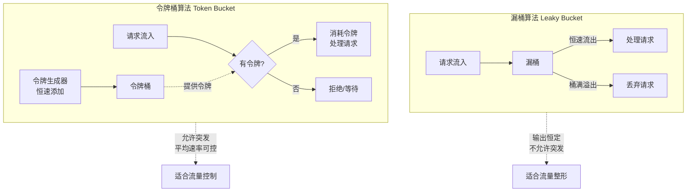

# 请求限流与连接限流

## 为什么需要限流

在高并发场景下，如果不做限流，服务器可能面临以下问题：

- **资源耗尽**：大量请求耗尽服务器 CPU、内存、连接数等资源
- **雪崩效应**：后端服务过载导致级联故障
- **DDoS 攻击**：恶意请求淹没正常服务
- **成本失控**：按量计费的 API 被滥用导致费用暴涨

限流的核心目标是在系统可承受的范围内，合理分配访问资源，确保服务稳定性。

---

## 限流算法原理

### 漏桶算法（Leaky Bucket）

漏桶算法将请求处理比作水从漏桶中流出，无论注入速度多快，流出速度恒定：

```
请求流入 → [漏桶] → 恒速流出处理
           ↑
     桶满时溢出（丢弃请求）

特性：
- 流出速率恒定（平滑输出）
- 桶满时新请求被丢弃
- 适合流量整形（Traffic Shaping）
- 不允许突发流量
```

### 令牌桶算法（Token Bucket）

令牌桶算法以恒定速率向桶中放入令牌，请求需要获取令牌才能处理：

```
令牌生成器 ──→ [令牌桶] ←── 请求获取令牌
               ↑        │
         桶满时丢弃      └──→ 有令牌：处理请求
         多余令牌            无令牌：拒绝/等待
         
特性：
- 允许突发流量（桶中有累积令牌时）
- 平均速率受令牌生成速率控制
- 适合流量控制（Traffic Policing）
- Nginx limit_req 的 burst 参数基于此原理
```

### 两种算法对比



| 特性 | 漏桶算法 | 令牌桶算法 |
|------|----------|-----------|
| 输出速率 | 恒定 | 允许突发 |
| 突发流量 | 不允许 | 允许（桶中有令牌时） |
| 实现复杂度 | 简单 | 稍复杂 |
| Nginx 实现 | limit_conn | limit_req (burst) |
| 适用场景 | 严格控制速率 | 允许合理突发 |

---

## limit_req_zone 与 limit_req

### 基本语法

```nginx
# 参考：https://nginx.org/en/docs/http/ngx_http_limit_req_module.html

# 在 http 块中定义限流区域
# 语法：limit_req_zone key zone=name:size rate=rate;
limit_req_zone $binary_remote_addr zone=mylimit:10m rate=10r/s;

# key：限流维度（如 IP、URI、参数等）
# zone：共享内存区域名称和大小
# rate：请求速率（r/s 每秒请求数 或 r/m 每分钟请求数）

# 在 location 中应用限流
# 语法：limit_req zone=name [burst=number] [nodelay | delay=number];
limit_req zone=mylimit burst=20 nodelay;
```

### key 参数详解

key 决定了限流的维度，可以使用 Nginx 变量组合：

```nginx
# 基于 IP 限流（最常用）
limit_req_zone $binary_remote_addr zone=ip_limit:10m rate=10r/s;

# 基于 URI 限流
limit_req_zone $uri zone=uri_limit:10m rate=5r/s;

# 基于参数限流（如限流特定 API）
limit_req_zone $arg_apikey zone=apikey_limit:10m rate=100r/s;

# 基于 IP + URI 组合限流
limit_req_zone $binary_remote_addr$uri zone=ip_uri_limit:10m rate=5r/s;

# 基于 HTTP 头限流
limit_req_zone $http_x_forwarded_for zone=xff_limit:10m rate=10r/s;

# 基于自定义变量组合
limit_req_zone $binary_remote_addr$uri$arg_id zone=complex_limit:10m rate=2r/s;
```

::: tip 使用 $binary_remote_addr 而非 $remote_addr
- `$remote_addr`：IPv4 最长 15 字节（如 192.168.1.100），IPv6 最长 45 字节
- `$binary_remote_addr`：IPv4 固定 4 字节，IPv6 固定 16 字节
- 使用二进制格式可节省大量共享内存（约 1/3 到 1/5）
- 10m 共享内存约可存储 160,000 个 IP（$binary_remote_addr）
:::

### zone 参数详解

```nginx
# zone=name:size
# name：共享内存区域名称（跨 worker 共享）
# size：共享内存大小

# 小型站点
limit_req_zone $binary_remote_addr zone=small:1m rate=10r/s;
# 1m ≈ 16,000 个 IP

# 中型站点
limit_req_zone $binary_remote_addr zone=medium:10m rate=10r/s;
# 10m ≈ 160,000 个 IP

# 大型站点
limit_req_zone $binary_remote_addr zone=large:100m rate=10r/s;
# 100m ≈ 1,600,000 个 IP
```

### rate 参数详解

```nginx
# 每秒请求数
limit_req_zone $binary_remote_addr zone=per_sec:10m rate=10r/s;

# 每分钟请求数
limit_req_zone $binary_remote_addr zone=per_min:10m rate=300r/m;

# 低速率（如登录接口）
limit_req_zone $binary_remote_addr zone=login:10m rate=5r/m;

# 高速率（如静态资源）
limit_req_zone $binary_remote_addr zone=static:10m rate=100r/s;
```

### burst 参数

burst 允许超出 rate 的突发请求数量，实现令牌桶效果：

```nginx
# rate=10r/s，burst=20
# 表示：平均每秒 10 个请求，允许突发 20 个额外请求
limit_req zone=mylimit burst=20;

# 工作原理：
# 1. 每秒向桶中放入 10 个令牌（rate=10r/s）
# 2. 桶最大容量为 20（burst=20）
# 3. 请求消耗令牌
# 4. 桶空时，新请求返回 503
# 5. 桶中有令牌时，请求被延迟处理（等待令牌生成）

# 无 burst（严格限流）
limit_req zone=mylimit;
# 超出 rate 的请求立即返回 503

# burst=20（允许突发，但超出部分被延迟）
limit_req zone=mylimit burst=20;
# 20 个以内的突发请求被延迟处理
# 超出 20 的请求返回 503
```

### nodelay 与 delay 参数

```nginx
# nodelay：突发请求不延迟，立即处理
# 但仍受 burst 数量限制
limit_req zone=mylimit burst=20 nodelay;
# 突发请求立即处理，不等待令牌
# 超出 burst 的请求返回 503

# delay=number：前 number 个突发请求不延迟，之后的突发请求被延迟
limit_req zone=mylimit burst=20 delay=5;
# 前 5 个突发请求立即处理（不延迟）
# 第 6-20 个突发请求被延迟处理
# 超出 20 的请求返回 503

# 完整示例
limit_req_zone $binary_remote_addr zone=api_limit:10m rate=10r/s;

location /api/ {
    # 平均 10r/s，允许 20 个突发，突发请求不延迟
    limit_req zone=api_limit burst=20 nodelay;
    proxy_pass http://api_backend;
}
```

### limit_req_status

自定义限流响应码：

```nginx
# 参考：https://nginx.org/en/docs/http/ngx_http_limit_req_module.html#limit_req_status

# 默认返回 503 Service Unavailable
# 可以修改为 429 Too Many Requests（更符合 HTTP 语义）
limit_req_status 429;

location /api/ {
    limit_req zone=api_limit burst=20 nodelay;
    limit_req_status 429;

    # 自定义 429 响应内容
    error_page 429 = @rate_limited;
}

location @rate_limited {
    default_type application/json;
    return 429 '{"error": "Too Many Requests", "retry_after": 1}';
}
```

### limit_req 日志

```nginx
# 限流日志级别
# 语法：limit_req_log_level info | notice | warn | error;
# 默认：error
limit_req_log_level warn;

# 被限流的请求会记录在错误日志中
# 格式：limiting requests, excess: 0.500 by zone "mylimit"
```

---

## limit_conn_zone 与 limit_conn

### 基本语法

```nginx
# 参考：https://nginx.org/en/docs/http/ngx_http_limit_conn_module.html

# 在 http 块中定义连接限制区域
# 语法：limit_conn_zone key zone=name:size;
limit_conn_zone $binary_remote_addr zone=conn_limit:10m;

# 在 location 中应用连接限制
# 语法：limit_conn zone number;
limit_conn conn_limit 100;
```

### 请求限流 vs 连接限流

| 特性 | limit_req（请求限流） | limit_conn（连接限流） |
|------|----------------------|----------------------|
| 限制对象 | 请求速率 | 并发连接数 |
| 计数方式 | 每秒/每分钟请求数 | 同时活跃的连接数 |
| 适用场景 | API 限流、防刷 | 下载限速、防并发滥用 |
| 算法 | 令牌桶 | 计数器 |
| 精细度 | 高（支持 burst/delay） | 低（硬限制） |

### 连接限流配置示例

```nginx
# 限制每个 IP 最多 100 个并发连接
limit_conn_zone $binary_remote_addr zone=conn_limit:10m;

server {
    listen 80;
    server_name example.com;

    # 全局连接限制
    limit_conn conn_limit 100;

    location / {
        proxy_pass http://backend;
    }

    # 下载目录更严格的限制
    location /download/ {
        limit_conn conn_limit 10;
        root /var/www/download;
    }
}

# 基于虚拟主机的连接限制
limit_conn_zone $server_name zone=server_conn:10m;

server {
    listen 80;
    server_name example.com;

    # 每个虚拟主机最多 1000 个并发连接
    limit_conn server_conn 1000;
}
```

### limit_conn_status 与日志

```nginx
# 自定义连接限制响应码
# 默认 503，可改为 429
limit_conn_status 429;

# 连接限制日志级别
# 默认 error
limit_conn_log_level warn;
```

---

## 基于请求特征的精细化限流

### 基于 URI 的差异化限流

```nginx
# 参考：https://nginx.org/en/docs/http/ngx_http_limit_req_module.html

# 不同接口不同限流策略
limit_req_zone $binary_remote_addr zone=global:10m rate=30r/s;
limit_req_zone $binary_remote_addr zone=api_limit:10m rate=10r/s;
limit_req_zone $binary_remote_addr zone=login_limit:10m rate=5r/m;
limit_req_zone $binary_remote_addr zone=upload_limit:10m rate=2r/m;

server {
    listen 80;
    server_name example.com;

    # 全局限流
    limit_req zone=global burst=50 nodelay;

    # API 接口限流
    location /api/ {
        limit_req zone=api_limit burst=20 nodelay;
        proxy_pass http://api_backend;
    }

    # 登录接口严格限流
    location /login {
        limit_req zone=login_limit burst=3 nodelay;
        proxy_pass http://auth_backend;
    }

    # 上传接口严格限流
    location /upload {
        limit_req zone=upload_limit burst=2 nodelay;
        proxy_pass http://upload_backend;
    }

    # 静态资源不限流
    location /static/ {
        root /var/www/html;
    }
}
```

### 基于参数的限流

```nginx
# 基于 API Key 限流
limit_req_zone $arg_apikey zone=apikey_limit:10m rate=100r/s;

location /api/ {
    limit_req zone=apikey_limit burst=200 nodelay;
    proxy_pass http://api_backend;
}

# 基于用户 ID 限流（从 Cookie 中提取）
# 需要使用 map 提取用户标识
map $cookie_session $limit_key {
    "" $binary_remote_addr;    # 未登录用户用 IP
    default $cookie_session;    # 登录用户用 session
}

limit_req_zone $limit_key zone=user_limit:10m rate=20r/s;

location /api/ {
    limit_req zone=user_limit burst=40 nodelay;
    proxy_pass http://api_backend;
}
```

### 基于白名单的限流

```nginx
# 使用 map 构建白名单
map $remote_addr $limit_key {
    10.0.0.0/8        "";          # 内网不限流
    172.16.0.0/12     "";          # 内网不限流
    192.168.0.0/16    "";          # 内网不限流
    default           $binary_remote_addr;  # 其他 IP 限流
}

# key 为空字符串时不参与限流
limit_req_zone $limit_key zone=whitelist_limit:10m rate=10r/s;

server {
    listen 80;
    limit_req zone=whitelist_limit burst=20 nodelay;

    location / {
        proxy_pass http://backend;
    }
}
```

### 基于 HTTP 方法的限流

```nginx
# 仅对写操作限流
map $request_method $write_limit_key {
    POST    $binary_remote_addr;
    PUT     $binary_remote_addr;
    DELETE  $binary_remote_addr;
    default "";  # GET/HEAD 等不限流
}

limit_req_zone $write_limit_key zone=write_limit:10m rate=5r/s;

server {
    listen 80;
    limit_req zone=write_limit burst=10 nodelay;

    location /api/ {
        proxy_pass http://backend;
    }
}
```

---

## 分布式限流：Redis + Lua 方案

### 为什么需要分布式限流

Nginx 的 `limit_req` 和 `limit_conn` 是单机限流，在多节点部署时存在问题：

```
单机限流问题：
- 假设限流 100r/s，3 台服务器实际允许 300r/s
- 客户端请求可能分布不均，某台服务器过载
- 无法实现全局限量（如 API 每天调用 10000 次）

分布式限流方案：
- 使用 Redis 作为共享计数器
- 所有 Nginx 节点访问同一个 Redis
- 实现精确的全局限流
```

### Redis + Lua 限流实现

```nginx
# 参考：https://nginx.org/en/docs/http/ngx_http_lua_module.html
# 需要安装 lua-nginx-module 和 lua-resty-redis

# 使用 OpenResty（推荐）
# OpenResty 内置 lua-nginx-module

lua_shared_dict limit_store 10m;

server {
    listen 80;
    server_name api.example.com;

    location /api/ {
        access_by_lua_block {
            local redis = require "resty.redis"
            local red = redis:new()

            red:set_timeouts(1000, 1000, 1000)

            local ok, err = red:connect("127.0.0.1", 6379)
            if not ok then
                ngx.log(ngx.ERR, "failed to connect to redis: ", err)
                return  -- Redis 连接失败，放行请求
            end

            -- 滑动窗口限流
            local key = "rate_limit:" .. ngx.var.binary_remote_addr
            local now = ngx.now()
            local window = 1  -- 1 秒窗口

            -- Lua 脚本实现原子操作
            local script = [[
                local key = KEYS[1]
                local now = tonumber(ARGV[1])
                local window = tonumber(ARGV[2])
                local limit = tonumber(ARGV[3])

                -- 移除过期记录
                redis.call('zremrangebyscore', key, '-inf', now - window)

                -- 获取当前窗口内的请求数
                local count = redis.call('zcard', key)

                if count < limit then
                    -- 添加当前请求
                    redis.call('zadd', key, now, now .. ':' .. math.random())
                    redis.call('expire', key, window)
                    return 0  -- 允许
                else
                    return 1  -- 拒绝
                end
            ]]

            local res, err = red:eval(script, 1, key, now, window, 10)
            if res == 1 then
                ngx.status = 429
                ngx.header["Content-Type"] = "application/json"
                ngx.say('{"error": "Too Many Requests"}')
                ngx.exit(429)
            end

            red:close()
        }

        proxy_pass http://api_backend;
    }
}
```

### 令牌桶 Lua 实现

```nginx
# 令牌桶算法的 Redis + Lua 实现

server {
    listen 80;

    location /api/ {
        access_by_lua_block {
            local redis = require "resty.redis"
            local red = redis:new()
            red:set_timeouts(1000, 1000, 1000)

            local ok, err = red:connect("127.0.0.1", 6379)
            if not ok then
                ngx.log(ngx.ERR, "redis connect failed: ", err)
                return
            end

            -- 令牌桶 Lua 脚本
            local script = [[
                local key = KEYS[1]
                local now = tonumber(ARGV[1])
                local rate = tonumber(ARGV[2])
                local capacity = tonumber(ARGV[3])
                local requested = tonumber(ARGV[4])

                -- 获取当前令牌数和上次更新时间
                local data = redis.call('hmget', key, 'tokens', 'last_time')
                local tokens = tonumber(data[1])
                local last_time = tonumber(data[2])

                if tokens == nil then
                    tokens = capacity
                    last_time = now
                end

                -- 计算新增令牌
                local elapsed = now - last_time
                local new_tokens = elapsed * rate
                tokens = math.min(capacity, tokens + new_tokens)

                -- 尝试消耗令牌
                if tokens >= requested then
                    tokens = tokens - requested
                    redis.call('hmset', key, 'tokens', tokens, 'last_time', now)
                    redis.call('expire', key, math.ceil(capacity / rate) + 1)
                    return 0  -- 允许
                else
                    redis.call('hmset', key, 'tokens', tokens, 'last_time', now)
                    redis.call('expire', key, math.ceil(capacity / rate) + 1)
                    return 1  -- 拒绝
                end
            ]]

            local key = "token_bucket:" .. ngx.var.binary_remote_addr
            local now = ngx.now()
            local rate = 10       -- 每秒生成 10 个令牌
            local capacity = 20   -- 桶容量 20
            local requested = 1   -- 每次请求消耗 1 个令牌

            local res, err = red:eval(script, 1, key, now, rate, capacity, requested)
            if res == 1 then
                ngx.status = 429
                ngx.header["Content-Type"] = "application/json"
                ngx.header["Retry-After"] = "1"
                ngx.say('{"error": "Too Many Requests", "retry_after": 1}')
                ngx.exit(429)
            end

            red:close()
        }

        proxy_pass http://api_backend;
    }
}
```

---

## 限流与 CDN 配合

### CDN 场景下的限流挑战

```
问题：
1. CDN 缓存命中时，请求不会到达源站，限流不准确
2. CDN 节点 IP 被当作客户端 IP，所有用户共享限流额度
3. CDN 的动态加速可能改变请求路径

解决：
1. 使用真实客户端 IP（X-Forwarded-For / CF-Connecting-IP）
2. 配置 CDN 侧限流（如 Cloudflare Rate Limiting）
3. 源站限流作为最后防线
```

### 获取真实客户端 IP

```nginx
# 参考：https://nginx.org/en/docs/http/ngx_http_realip_module.html

# 设置可信代理 IP
set_real_ip_from 103.21.244.0/22;   # Cloudflare
set_real_ip_from 103.22.200.0/22;
set_real_ip_from 103.31.4.0/22;
set_real_ip_from 104.16.0.0/13;
set_real_ip_from 104.24.0.0/14;
set_real_ip_from 108.162.192.0/18;
set_real_ip_from 131.0.72.0/22;
set_real_ip_from 141.101.64.0/18;
set_real_ip_from 162.158.0.0/15;
set_real_ip_from 172.64.0.0/13;
set_real_ip_from 173.245.48.0/20;
set_real_ip_from 188.114.96.0/20;
set_real_ip_from 190.93.240.0/20;
set_real_ip_from 197.234.240.0/22;
set_real_ip_from 198.41.128.0/17;

# 使用哪个头部获取真实 IP
real_ip_header CF-Connecting-IP;     # Cloudflare
# real_ip_header X-Forwarded-For;    # 通用
# real_ip_header X-Real-IP;          # Nginx 代理

# 递归搜索（从最后一个非可信 IP 开始）
real_ip_recursive on;

# 限流使用 $binary_remote_addr（已被替换为真实 IP）
limit_req_zone $binary_remote_addr zone=cdn_limit:10m rate=10r/s;
```

### 多层限流策略

```nginx
# 第一层：CDN 限流（如 Cloudflare Rate Limiting）
# 在 CDN 控制面板配置

# 第二层：Nginx 全局限流
limit_req_zone $binary_remote_addr zone=global:10m rate=50r/s;

# 第三层：接口级限流
limit_req_zone $binary_remote_addr zone=api:10m rate=10r/s;
limit_req_zone $binary_remote_addr zone=login:10m rate=5r/m;

server {
    listen 80;

    # 全局限流
    limit_req zone=global burst=100 nodelay;

    location /api/ {
        limit_req zone=api burst=20 nodelay;
        proxy_pass http://api_backend;
    }

    location /login {
        limit_req zone=login burst=3 nodelay;
        proxy_pass http://auth_backend;
    }
}
```

---

## 限流监控与动态调整

### 限流指标监控

```nginx
# 通过自定义日志记录限流信息

log_format limit_log '$remote_addr - [$time_local] '
                     '"$request" $status $body_bytes_sent '
                     'limit_req_status=$limit_req_status '
                     'upstream_response_time=$upstream_response_time';

# 注意：$limit_req_status 变量需要较新版本的 Nginx
# 替代方案：通过错误日志统计限流

access_log /var/log/nginx/access.log limit_log;
```

### 限流统计脚本

```bash
#!/bin/bash
# rate_limit_stats.sh

LOG_FILE="/var/log/nginx/error.log"

echo "=== Rate Limit Statistics ==="
echo ""

# 统计限流次数
echo "Total limited requests:"
grep -c "limiting requests" "$LOG_FILE" 2>/dev/null || echo "0"

echo ""

# 按区域统计
echo "Limited by zone:"
grep "limiting requests" "$LOG_FILE" 2>/dev/null | \
    grep -oP 'zone "\K[^"]+' | sort | uniq -c | sort -rn

echo ""

# 被限流最多的 IP
echo "Top 10 limited IPs:"
grep "limiting requests" "$LOG_FILE" 2>/dev/null | \
    grep -oP 'client: \K[^,]+' | sort | uniq -c | sort -rn | head -10

echo ""

# 限流趋势（按小时）
echo "Rate limit trend (hourly):"
grep "limiting requests" "$LOG_FILE" 2>/dev/null | \
    grep -oP '\d{2}/\w{3}/\d{4}:\d{2}' | sort | uniq -c
```

### 动态限流调整

```nginx
# 使用 map + 变量实现动态限流

# 根据时间段调整限流阈值
map $time_hour $rate_limit {
    default 10r/s;       # 默认 10r/s
    0     5r/s;          # 凌晨 5r/s
    1     5r/s;
    2     5r/s;
    3     5r/s;
    4     5r/s;
    5     5r/s;
    8     20r/s;         # 早高峰 20r/s
    9     20r/s;
    12    30r/s;         # 午高峰 30r/s
    18    30r/s;         # 晚高峰 30r/s
    22    15r/s;         # 晚间 15r/s
}

# 注意：limit_req_zone 的 rate 不支持变量
# 替代方案：使用 Lua 实现动态限流

# 或者使用多个 limit_req_zone，通过条件选择
limit_req_zone $binary_remote_addr zone=low:10m rate=5r/s;
limit_req_zone $binary_remote_addr zone=normal:10m rate=10r/s;
limit_req_zone $binary_remote_addr zone=high:10m rate=30r/s;
```

### 基于 Nginx + Lua 的动态限流

```nginx
# 使用 Lua 实现从 Redis 读取限流配置

lua_shared_dict rate_config 1m;

# 定时更新限流配置
init_worker_by_lua_block {
    local ngx_timer = ngx.timer
    local dict = ngx.shared.rate_config

    local function update_config(premature)
        if premature then return end

        local redis = require "resty.redis"
        local red = redis:new()
        local ok, err = red:connect("127.0.0.1", 6379)
        if ok then
            local rate = red:get("rate_limit:global_rate")
            if rate then
                dict:set("global_rate", tonumber(rate))
            end
            red:close()
        end

        -- 每 10 秒更新一次
        ngx_timer.at(10, update_config)
    end

    ngx_timer.at(0, update_config)
}

server {
    listen 80;

    location /api/ {
        access_by_lua_block {
            local dict = ngx.shared.rate_config
            local rate = dict:get("global_rate") or 10

            -- 使用当前速率进行限流
            -- 这里需要使用自定义限流逻辑
            -- 因为 limit_req 不支持动态 rate
        }

        proxy_pass http://api_backend;
    }
}
```

---

## 限流最佳实践

### 限流配置原则

1. **分层次限流**：全局 → 接口级 → 用户级
2. **白名单机制**：内网、爬虫白名单不限流
3. **合理的 burst 值**：允许正常的请求波动
4. **友好的错误响应**：返回 429 + Retry-After
5. **监控与告警**：及时发现异常流量
6. **动态调整**：根据系统负载调整限流阈值

### 完整限流配置示例

```nginx
# 参考：https://nginx.org/en/docs/http/ngx_http_limit_req_module.html

# ===== 限流区域定义 =====

# 白名单 map
map $remote_addr $limit_key {
    10.0.0.0/8        "";
    172.16.0.0/12     "";
    192.168.0.0/16    "";
    default           $binary_remote_addr;
}

# 全局限流
limit_req_zone $limit_key zone=global:20m rate=50r/s;

# API 限流
limit_req_zone $limit_key zone=api:10m rate=10r/s;

# 登录限流
limit_req_zone $limit_key zone=login:5m rate=5r/m;

# 搜索限流
limit_req_zone $limit_key zone=search:5m rate=2r/s;

# 连接限流
limit_conn_zone $limit_key zone=conn_limit:10m;

# 限流响应码
limit_req_status 429;
limit_conn_status 429;

# 限流日志级别
limit_req_log_level warn;
limit_conn_log_level warn;

server {
    listen 80;
    server_name api.example.com;

    # 全局限流
    limit_req zone=global burst=100 nodelay;

    # 连接限流
    limit_conn conn_limit 200;

    # API 接口
    location /api/ {
        limit_req zone=api burst=30 nodelay;
        proxy_pass http://api_backend;
    }

    # 登录接口
    location /api/auth/login {
        limit_req zone=login burst=5 nodelay;
        proxy_pass http://auth_backend;
    }

    # 搜索接口
    location /api/search {
        limit_req zone=search burst=10 nodelay;
        proxy_pass http://search_backend;
    }

    # 健康检查（不限流）
    # 注意：子 location 不会继承父级的 limit_req，
    # 因此不需要此 location 时只需不写 limit_req 即可
    location /health {
        return 200 "OK";
    }

    # 429 错误处理
    error_page 429 = @rate_limited;
}

location @rate_limited {
    default_type application/json;
    add_header Retry-After 1 always;
    return 429 '{"error": "Too Many Requests", "message": "Rate limit exceeded. Please try again later."}';
}
```

---

## 延伸阅读

- [Nginx limit_req Module 官方文档](https://nginx.org/en/docs/http/ngx_http_limit_req_module.html)
- [Nginx limit_conn Module 官方文档](https://nginx.org/en/docs/http/ngx_http_limit_conn_module.html)
- [Nginx Real IP Module 官方文档](https://nginx.org/en/docs/http/ngx_http_realip_module.html)
- [OpenResty Lua 官方文档](https://openresty.org/en/lua_module/)
- [Redis 官方文档](https://redis.io/documentation)
- [RFC 6585 - 429 Status Code](https://tools.ietf.org/html/rfc6585)
