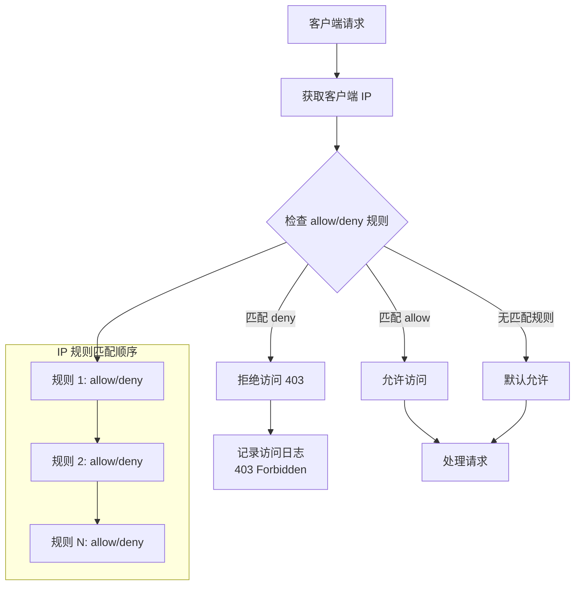
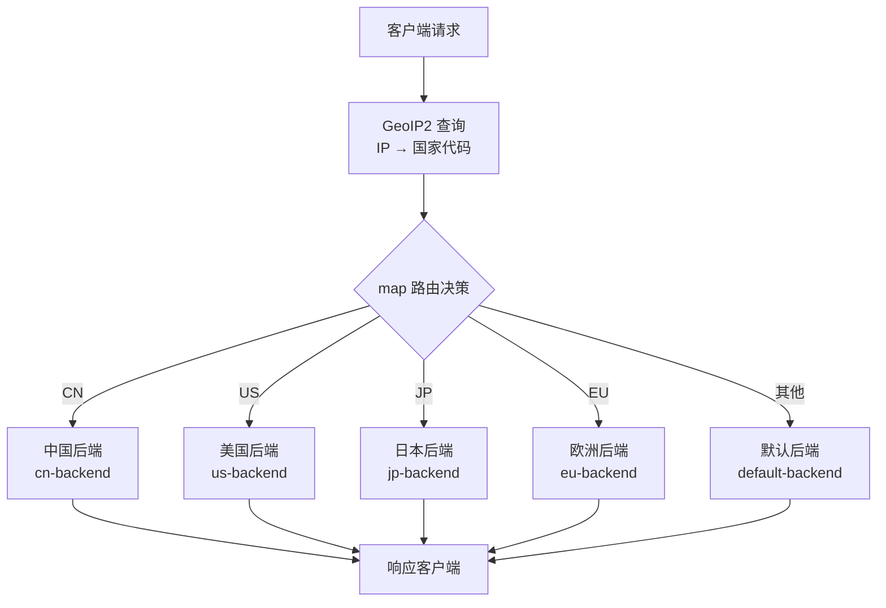

# 基于 IP 与地理位置的访问控制

## 访问控制概述

IP 与地理位置的访问控制是网络安全的基础防线，常见应用场景：

- **区域限制**：仅允许特定国家/地区访问内容
- **合规要求**：遵守地区法规（如 GDPR、数据本地化）
- **安全防护**：封禁恶意 IP、防御 DDoS 攻击
- **内容分发**：根据地理位置路由到最近的节点
- **反爬虫**：限制可疑 IP 的访问频率

---

## allow/deny 指令与 CIDR 规则

### 基本语法

```nginx
# 参考：https://nginx.org/en/docs/http/ngx_http_access_module.html

# 语法
allow address | CIDR | all;
deny  address | CIDR | all;

# 作用域：http, server, location, limit_except
```

### allow/deny 规则匹配

Nginx 按照规则出现顺序依次匹配，首次匹配即生效：

```nginx
# 规则匹配顺序：从上到下，首次匹配生效

# 示例 1：白名单模式（推荐）
location /admin/ {
    deny  all;                    # 先拒绝所有
    allow 192.168.1.0/24;        # 允许内网
    allow 10.0.0.1;              # 允许特定 IP
    # 注意：deny all 在前，但 allow 优先级更高？
    # 不！顺序匹配，192.168.1.x 和 10.0.0.1 先被 deny all 拦截
    # 这是错误的写法！
}

# 正确的白名单模式
location /admin/ {
    allow 192.168.1.0/24;        # 先允许内网
    allow 10.0.0.1;              # 允许特定 IP
    deny  all;                    # 最后拒绝其他所有
}
```

::: important 规则顺序至关重要
Nginx 的 allow/deny 按顺序匹配，首次命中即停止。白名单模式必须先 allow 再 deny all，黑名单模式必须先 deny 再 allow all。
:::

### CIDR 表示法

```
CIDR（Classless Inter-Domain Routing）表示法：

IP/CIDR       | 含义              | 匹配范围
-------------|-------------------|------------------
10.0.0.1/32  | 单个 IP           | 仅 10.0.0.1
10.0.0.0/24  | C 类网段          | 10.0.0.0 - 10.0.0.255
10.0.0.0/16  | B 类网段          | 10.0.0.0 - 10.0.255.255
10.0.0.0/8   | A 类网段          | 10.0.0.0 - 10.255.255.255
0.0.0.0/0    | 所有 IPv4         | 0.0.0.0 - 255.255.255.255
::1/128      | IPv6 本地回环     | 仅 ::1
2001:db8::/32 | IPv6 网段        | 2001:db8:0:0:0:0:0:0 - 2001:db8:ffff:ffff:...
```

### 常见配置场景

```nginx
# 场景 1：管理后台白名单
location /admin/ {
    allow 192.168.1.0/24;        # 公司内网
    allow 203.0.113.50;          # 运维人员家庭 IP
    deny  all;

    proxy_pass http://admin_backend;
}

# 场景 2：API 黑名单
location /api/ {
    deny  198.51.100.0/24;       # 已知恶意 IP 段
    deny  203.0.113.100;         # 恶意 IP
    allow all;

    proxy_pass http://api_backend;
}

# 场景 3：仅允许国内 IP（配合 GeoIP2）
# 见后续 GeoIP2 章节

# 场景 4：限制特定 HTTP 方法
location /api/ {
    allow 192.168.0.0/16;

    limit_except GET {
        deny  all;               # 非 GET 方法仅允许内网
    }

    proxy_pass http://api_backend;
}

# 场景 5：IPv4 + IPv6 白名单
location /internal/ {
    allow 10.0.0.0/8;
    allow 172.16.0.0/12;
    allow 192.168.0.0/16;
    allow ::1;                    # IPv6 本地
    allow fd00::/8;              # IPv6 ULA
    deny  all;

    proxy_pass http://internal_backend;
}
```

### 基于 IP 的访问控制流程



---

## GeoIP2 模块安装与配置

### GeoIP2 简介

GeoIP2 是 MaxMind 提供的 IP 地理位置数据库，可以根据 IP 地址查询国家、城市、时区、ISP 等信息。Nginx 通过 `ngx_http_geoip2_module` 模块支持 GeoIP2。

### 安装 GeoIP2 模块

```bash
# 1. 下载 libmaxminddb 库
git clone --recursive https://github.com/maxmind/libmaxminddb
cd libmaxminddb
./configure
make
sudo make install
sudo ldconfig

# 2. 下载 Nginx GeoIP2 模块
git clone https://github.com/leev/ngx_http_geoip2_module.git

# 3. 编译 Nginx（添加 GeoIP2 模块）
cd nginx-1.25.x
./configure --add-module=/path/to/ngx_http_geoip2_module \
            --with-http_ssl_module
make
sudo make install

# 4. 验证模块是否加载
nginx -V 2>&1 | grep geoip2
```

### 获取 GeoIP2 数据库

```bash
# 注册 MaxMind 账号（免费）
# https://www.maxmind.com/en/geolite2/signup

# 下载 GeoLite2 数据库（需要 License Key）
# 登录后获取 License Key

# 使用 mmdb-bin 下载
# 安装 mmdb-bin
sudo apt install mmdb-bin    # Ubuntu/Debian

# 或使用 geoipupdate 工具
sudo apt install geoipupdate

# 配置 geoipupdate
cat > /etc/GeoIP.conf << 'EOF'
AccountID YOUR_ACCOUNT_ID
LicenseKey YOUR_LICENSE_KEY
EditionIDs GeoLite2-Country GeoLite2-City
DatabaseDirectory /usr/share/GeoIP
EOF

# 下载数据库
sudo geoipupdate

# 验证数据库
mmdblookup --file /usr/share/GeoIP/GeoLite2-Country.mmdb \
  --ip 8.8.8.8
```

### Nginx GeoIP2 配置

```nginx
# 参考：https://github.com/leev/ngx_http_geoip2_module

# 在 http 块中加载 GeoIP2 数据库
http {
    # 加载国家数据库
    geoip2 /usr/share/GeoIP/GeoLite2-Country.mmdb {
        auto_reload 5m;   # 每 5 分钟检查数据库更新
        $geoip2_metadata_country_build = metadata.build_epoch;

        # 国家代码（如 CN, US, JP）
        $geoip2_data_country_code = country iso_code;

        # 国家名称
        $geoip2_data_country_name = country names en;

        # 是否在欧洲
        $geoip2_data_country_in_eu = country is_in_european_union;
    }

    # 加载城市数据库
    geoip2 /usr/share/GeoIP/GeoLite2-City.mmdb {
        auto_reload 5m;

        # 城市名称
        $geoip2_data_city_name = city names en;

        # 省份/州
        $geoip2_data_region_name = subdivisions 0 names en;

        # 省份/州代码
        $geoip2_data_region_code = subdivisions 0 iso_code;

        # 纬度
        $geoip2_data_latitude = location latitude;

        # 经度
        $geoip2_data_longitude = location longitude;

        # 时区
        $geoip2_data_time_zone = location time_zone;
    }

    # ...
}
```

::: tip auto_reload
`auto_reload` 参数控制 Nginx 多久检查一次数据库文件是否更新。设置合理的值可以在更新数据库后自动生效，无需重启 Nginx。
:::

---

## 基于国家/城市的路由

### 基于国家代码的路由



### 国家路由配置

```nginx
# 使用 map 基于国家代码选择后端
map $geoip2_data_country_code $backend_name {
    CN  cn_backend;
    HK  cn_backend;
    TW  cn_backend;
    US  us_backend;
    CA  us_backend;
    JP  jp_backend;
    KR  jp_backend;
    GB  eu_backend;
    DE  eu_backend;
    FR  eu_backend;
    default default_backend;
}

# 定义各后端
upstream cn_backend {
    server cn-api.example.com:8080;
}

upstream us_backend {
    server us-api.example.com:8080;
}

upstream jp_backend {
    server jp-api.example.com:8080;
}

upstream eu_backend {
    server eu-api.example.com:8080;
}

upstream default_backend {
    server api.example.com:8080;
}

server {
    listen 80;
    server_name api.example.com;

    location / {
        # 根据 $backend_name 动态选择后端
        proxy_pass http://$backend_name;
        proxy_set_header Host $host;
        proxy_set_header X-GeoIP-Country $geoip2_data_country_code;
        proxy_set_header X-GeoIP-City $geoip2_data_city_name;
    }
}
```

### 地区限制访问

```nginx
# 仅允许特定国家访问
map $geoip2_data_country_code $allowed_country {
    default no;
    CN  yes;    # 中国
    HK  yes;    # 香港
    TW  yes;    # 台湾
    MO  yes;    # 澳门
}

server {
    listen 80;
    server_name example.com;

    # 拒绝不允许的国家
    if ($allowed_country = no) {
        return 403 "Access denied from your country.";
    }

    location / {
        proxy_pass http://backend;
    }
}

# 仅允许欧洲国家访问（GDPR 合规）
map $geoip2_data_country_in_eu $eu_only {
    default no;
    1      yes;  # is_in_european_union = 1
}

server {
    listen 80;
    server_name eu.example.com;

    if ($eu_only = no) {
        return 403 "This service is only available in the EU.";
    }

    location / {
        proxy_pass http://eu_backend;
    }
}
```

### 基于城市的路由

```nginx
# 基于城市名称的路由
map $geoip2_data_city_name $city_backend {
    "Shanghai"  sh_backend;
    "Beijing"   bj_backend;
    "Guangzhou" gz_backend;
    "Shenzhen"  sz_backend;
    default     default_backend;
}

upstream sh_backend { server sh-node:8080; }
upstream bj_backend { server bj-node:8080; }
upstream gz_backend { server gz-node:8080; }
upstream sz_backend { server sz-node:8080; }
upstream default_backend { server default-node:8080; }

server {
    listen 80;

    location / {
        proxy_pass http://$city_backend;
    }
}
```

### 地理位置路由完整示例

```nginx
# 多级路由：国家 → 省份 → 城市

# 第一级：国家
map $geoip2_data_country_code $country_route {
    CN  china;
    US  america;
    default international;
}

# 第二级：省份（仅中国）
map $geoip2_data_region_name $china_province_route {
    default     cn_south;
    "Beijing"   cn_north;
    "Tianjin"   cn_north;
    "Hebei"     cn_north;
    "Shanghai"  cn_east;
    "Jiangsu"   cn_east;
    "Zhejiang"  cn_east;
    "Guangdong" cn_south;
    "Fujian"    cn_south;
}

# 第三级：城市（仅广东省）
map $geoip2_data_city_name $guangdong_city_route {
    default         gz_node;
    "Guangzhou"     gz_node;
    "Shenzhen"      sz_node;
    "Dongguan"      dg_node;
    "Foshan"        fs_node;
}

# 组合路由
map $country_route$china_province_route$guangdong_city_route $final_backend {
    default             default_backend;
    ~^china             cn_backend;
    ~^americ            us_backend;
    ~^international     intl_backend;
}

server {
    listen 80;

    location / {
        proxy_pass http://$final_backend;
        proxy_set_header X-Country $geoip2_data_country_code;
        proxy_set_header X-Region $geoip2_data_region_name;
        proxy_set_header X-City $geoip2_data_city_name;
    }
}
```

---

## $geoip2_data 变量使用

### 可用变量列表

| 变量 | 数据库 | 说明 | 示例值 |
|------|--------|------|--------|
| `$geoip2_data_country_code` | Country | 国家 ISO 代码 | CN |
| `$geoip2_data_country_name` | Country | 国家名称 | China |
| `$geoip2_data_country_in_eu` | Country | 是否在欧盟 | 0/1 |
| `$geoip2_data_city_name` | City | 城市名称 | Shanghai |
| `$geoip2_data_region_name` | City | 省份/州名称 | Shanghai |
| `$geoip2_data_region_code` | City | 省份/州代码 | SH |
| `$geoip2_data_latitude` | City | 纬度 | 31.0456 |
| `$geoip2_data_longitude` | City | 经度 | 121.3997 |
| `$geoip2_data_time_zone` | City | 时区 | Asia/Shanghai |

### 变量在日志中使用

```nginx
# 自定义日志格式，记录地理位置
log_format geo_log '$remote_addr - [$time_local] '
                   '"$request" $status '
                   'country=$geoip2_data_country_code '
                   'region=$geoip2_data_region_name '
                   'city=$geoip2_data_city_name';

access_log /var/log/nginx/geo_access.log geo_log;
```

### 变量在响应头中使用

```nginx
server {
    listen 80;

    # 将地理位置信息传递给后端
    add_header X-GeoIP-Country $geoip2_data_country_code always;
    add_header X-GeoIP-Region $geoip2_data_region_name always;
    add_header X-GeoIP-City $geoip2_data_city_name always;

    location /api/ {
        proxy_pass http://backend;
        proxy_set_header X-GeoIP-Country $geoip2_data_country_code;
        proxy_set_header X-GeoIP-Region $geoip2_data_region_name;
        proxy_set_header X-GeoIP-City $geoip2_data_city_name;
        proxy_set_header X-GeoIP-Timezone $geoip2_data_time_zone;
    }
}
```

### 变量在条件判断中使用

```nginx
server {
    listen 80;

    # 根据时区设置语言
    map $geoip2_data_time_zone $site_lang {
        "Asia/Shanghai"    zh-CN;
        "Asia/Tokyo"       ja-JP;
        "America/New_York" en-US;
        "Europe/London"    en-GB;
        default            en-US;
    }

    # 根据国家设置货币
    map $geoip2_data_country_code $currency {
        CN  CNY;
        US  USD;
        JP  JPY;
        GB  GBP;
        EU  EUR;
        default USD;
    }

    location / {
        proxy_pass http://backend;
        proxy_set_header Accept-Language $site_lang;
        proxy_set_header X-Currency $currency;
    }
}
```

---

## IP 黑白名单管理

### 静态黑白名单

```nginx
# 白名单文件：/etc/nginx/whitelist.conf
# 允许的 IP 列表
allow 10.0.0.0/8;
allow 172.16.0.0/12;
allow 192.168.0.0/16;
allow 203.0.113.50;
allow 198.51.100.0/24;
```

```nginx
# 黑名单文件：/etc/nginx/blacklist.conf
# 禁止的 IP 列表
deny 198.51.100.100;
deny 203.0.113.0/24;
deny 192.0.2.1;
```

```nginx
# 在 Nginx 中引用
server {
    listen 80;

    # 白名单模式
    include /etc/nginx/whitelist.conf;
    deny all;

    # 或者黑名单模式
    # include /etc/nginx/blacklist.conf;
    # allow all;

    location / {
        proxy_pass http://backend;
    }
}
```

### 使用 geo 模块管理黑白名单

::: important map 与 geo 的区别
`map` 不支持 CIDR 匹配，仅支持精确匹配和正则匹配。如需基于 IP 地址段（CIDR）做黑白名单，应使用 `geo` 指令。`geo` 专门为 IP 地址设计，原生支持 CIDR 表示法。
:::

```nginx
# 白名单 geo（geo 支持 CIDR）
geo $remote_addr $is_whitelisted {
    default           0;
    10.0.0.0/8        1;
    172.16.0.0/12     1;
    192.168.0.0/16    1;
    203.0.113.50      1;
}

# 黑名单 geo
geo $remote_addr $is_blacklisted {
    default           0;
    198.51.100.100    1;
    203.0.113.0/24    1;
    192.0.2.1         1;
}

server {
    listen 80;

    # 白名单模式
    if ($is_whitelisted = 0) {
        return 403;
    }

    # 黑名单模式
    # if ($is_blacklisted = 1) {
    #     return 403;
    # }

    location / {
        proxy_pass http://backend;
    }
}
```

### 使用 geo 模块管理

```nginx
# 参考：https://nginx.org/en/docs/http/ngx_http_geo_module.html

# 使用 geo 指令（比 map 更适合 IP 范围匹配）
geo $is_allowed {
    default        0;
    10.0.0.0/8     1;
    172.16.0.0/12  1;
    192.168.0.0/16 1;
    203.0.113.50   1;
    198.51.100.0/24 1;
}

# 从文件加载
geo $is_allowed {
    default 0;
    include /etc/nginx/ip_whitelist.conf;
}

server {
    listen 80;

    if ($is_allowed = 0) {
        return 403;
    }

    location / {
        proxy_pass http://backend;
    }
}
```

### 黑白名单管理脚本

```bash
#!/bin/bash
# manage_ip_list.sh

WHITELIST="/etc/nginx/ip_whitelist.conf"
BLACKLIST="/etc/nginx/ip_blacklist.conf"

case "$1" in
    whitelist-add)
        echo "allow $2;" >> "$WHITELIST"
        nginx -t && nginx -s reload
        echo "Added $2 to whitelist"
        ;;
    whitelist-remove)
        sed -i "/allow $2;/d" "$WHITELIST"
        nginx -t && nginx -s reload
        echo "Removed $2 from whitelist"
        ;;
    blacklist-add)
        echo "deny $2;" >> "$BLACKLIST"
        nginx -t && nginx -s reload
        echo "Added $2 to blacklist"
        ;;
    blacklist-remove)
        sed -i "/deny $2;/d" "$BLACKLIST"
        nginx -t && nginx -s reload
        echo "Removed $2 from blacklist"
        ;;
    list)
        echo "=== Whitelist ==="
        cat "$WHITELIST"
        echo ""
        echo "=== Blacklist ==="
        cat "$BLACKLIST"
        ;;
    *)
        echo "Usage: $0 {whitelist-add|whitelist-remove|blacklist-add|blacklist-remove|list} IP"
        ;;
esac
```

---

## 动态 IP 列表：Redis/Lua 方案

### 为什么需要动态 IP 列表

静态黑白名单需要修改配置文件并重载 Nginx，不适合频繁更新的场景：

- 实时封禁攻击 IP
- 临时允许特定 IP 访问
- 根据业务规则动态调整名单

### Redis + Lua 动态黑名单

```nginx
# 参考：https://nginx.org/en/docs/http/ngx_http_lua_module.html

lua_shared_dict ip_blacklist 1m;

# 定时从 Redis 同步黑名单
init_worker_by_lua_block {
    local ngx_timer = ngx.timer
    local dict = ngx.shared.ip_blacklist

    local function sync_blacklist(premature)
        if premature then return end

        local redis = require "resty.redis"
        local red = redis:new()
        local ok, err = red:connect("127.0.0.1", 6379)

        if ok then
            -- 获取所有黑名单 IP
            local ips, err = red:smembers("ip_blacklist")
            if ips then
                -- 清空本地缓存
                dict:flush_all()

                -- 写入新数据
                for _, ip in ipairs(ips) do
                    dict:set(ip, 1, 3600)  -- 缓存 1 小时
                end
            end

            red:close()
        end

        -- 每 10 秒同步一次
        ngx_timer.at(10, sync_blacklist)
    end

    ngx_timer.at(0, sync_blacklist)
}

server {
    listen 80;

    # 检查黑名单
    access_by_lua_block {
        local dict = ngx.shared.ip_blacklist
        local ip = ngx.var.remote_addr

        if dict:get(ip) then
            ngx.status = 403
            ngx.say("Access Denied")
            ngx.exit(403)
        end
    }

    location / {
        proxy_pass http://backend;
    }
}
```

### Redis 黑名单管理 API

```bash
# 添加 IP 到黑名单
redis-cli sadd ip_blacklist "198.51.100.100"

# 批量添加
redis-cli sadd ip_blacklist "198.51.100.100" "203.0.113.50" "192.0.2.1"

# 移除 IP
redis-cli srem ip_blacklist "198.51.100.100"

# 查看黑名单
redis-cli smembers ip_blacklist

# 检查 IP 是否在黑名单
redis-cli sismember ip_blacklist "198.51.100.100"

# 带过期时间的黑名单（使用 sorted set + 时间戳）
redis-cli zadd ip_blacklist_ttl $(date -d '+1 hour' +%s) "198.51.100.100"
```

---

## CDN 与真实 IP 获取

### CDN 场景下的 IP 问题

```
客户端 → CDN → Nginx → 后端

问题：
- Nginx 看到 IP 是 CDN 节点 IP
- 所有用户共享 CDN 节点 IP 的限流额度
- GeoIP 查询结果为 CDN 节点位置
- allow/deny 规则基于 CDN 节点 IP，无效

解决：
- 使用 realip 模块还原真实客户端 IP
- 从 X-Forwarded-For / CF-Connecting-IP 获取
```

### set_real_ip_from 配置

```nginx
# 参考：https://nginx.org/en/docs/http/ngx_http_realip_module.html

# Cloudflare CDN 可信代理 IP
set_real_ip_from 103.21.244.0/22;
set_real_ip_from 103.22.200.0/22;
set_real_ip_from 103.31.4.0/22;
set_real_ip_from 104.16.0.0/13;
set_real_ip_from 104.24.0.0/14;
set_real_ip_from 108.162.192.0/18;
set_real_ip_from 131.0.72.0/22;
set_real_ip_from 141.101.64.0/18;
set_real_ip_from 162.158.0.0/15;
set_real_ip_from 172.64.0.0/13;
set_real_ip_from 173.245.48.0/20;
set_real_ip_from 188.114.96.0/20;
set_real_ip_from 190.93.240.0/20;
set_real_ip_from 197.234.240.0/22;
set_real_ip_from 198.41.128.0/17;

# 自建代理
set_real_ip_from 10.0.0.0/8;
set_real_ip_from 172.16.0.0/12;

# 使用哪个头部获取真实 IP
real_ip_header CF-Connecting-IP;     # Cloudflare
# real_ip_header X-Forwarded-For;    # 通用
# real_ip_header X-Real-IP;          # Nginx 代理

# 递归搜索真实 IP
real_ip_recursive on;
```

### X-Forwarded-For 详解

```
X-Forwarded-For 头部格式：
X-Forwarded-For: client, proxy1, proxy2

示例：
X-Forwarded-For: 203.0.113.50, 70.41.3.18, 150.172.238.178

含义：
- 203.0.113.50 = 原始客户端 IP
- 70.41.3.18 = 第一层代理
- 150.172.238.178 = 第二层代理（最接近 Nginx）

real_ip_recursive on 的行为：
- 从右向左查找第一个非可信 IP
- 150.172.238.178 是可信代理 → 跳过
- 70.41.3.18 是可信代理 → 跳过
- 203.0.113.50 不是可信代理 → 这就是真实 IP
```

::: warning X-Forwarded-For 安全风险
X-Forwarded-For 可以被客户端伪造。如果未正确配置 `set_real_ip_from`，攻击者可以伪造 IP 绕过 IP 限制。必须确保只信任已知的代理服务器 IP。
:::

### 不同 CDN 的真实 IP 头部

| CDN | 头部名称 | 说明 |
|-----|---------|------|
| Cloudflare | `CF-Connecting-IP` | Cloudflare 自动设置，不可伪造 |
| Cloudflare | `X-Forwarded-For` | 通用格式 |
| AWS CloudFront | `X-Forwarded-For` | 标准格式 |
| Akamai | `True-Client-IP` | Akamai 专用头部 |
| 阿里云 CDN | `X-Forwarded-For` | 标准格式 |
| 腾讯云 CDN | `X-Forwarded-For` | 标准格式 |

---

## 反爬虫与 IP 封禁策略

### 基于 User-Agent 的反爬虫

```nginx
# 常见爬虫 User-Agent
map $http_user_agent $is_bot {
    default           0;

    # 搜索引擎（允许）
    "~*Googlebot"     0;
    "~*Bingbot"       0;
    "~*Baiduspider"   0;

    # 恶意爬虫（禁止）
    "~*scrapy"        1;
    "~*curl"          1;
    "~*wget"          1;
    "~*python-requests" 1;
    "~*httpclient"    1;
    "~*Go-http-client" 1;
    "~*java/"         1;
    "~*masscan"       1;
    "~*nmap"          1;
    "~*nikto"         1;

    # 空或异常 User-Agent
    ""                1;
    "~*^$"            1;
}

server {
    listen 80;

    if ($is_bot = 1) {
        return 403;
    }

    location / {
        proxy_pass http://backend;
    }
}
```

### 反爬虫综合策略

```nginx
# 综合反爬虫策略

# 1. 限流（限制爬虫速度）
limit_req_zone $binary_remote_addr zone=bot_limit:10m rate=5r/s;

# 2. 爬虫检测 map
map $http_user_agent $is_bot {
    default 0;
    "~*Googlebot"     0;   # 允许 Google
    "~*Bingbot"       0;   # 允许 Bing
    "~*Baiduspider"   0;   # 允许百度
    "~*scrapy"        1;
    "~*curl"          1;
    "~*wget"          1;
    "~*python"        1;
    "~*Go-http"       1;
    ""                1;
}

# 3. 异常行为检测
map $http_referer $has_referer {
    default       1;
    ""            0;  # 无 referer
}

server {
    listen 80;

    # 对疑似爬虫严格限流
    set $bot_rate "10r/s";
    if ($is_bot = 1) {
        set $bot_rate "1r/m";
    }

    limit_req zone=bot_limit burst=5 nodelay;

    # 验证搜索引擎爬虫（反向 DNS 验证）
    # 注意：Nginx 原生不支持反向 DNS 验证
    # 需要使用 Lua 或外部脚本

    location / {
        # 无 referer + 疑似爬虫 → 挑战
        if ($is_bot = 1) {
            return 403;
        }

        proxy_pass http://backend;
    }

    # 敏感路径更严格
    location /api/ {
        limit_req zone=bot_limit burst=2 nodelay;

        if ($has_referer = 0) {
            return 403;
        }

        proxy_pass http://api_backend;
    }
}
```

### fail2ban + Nginx 自动封禁

```ini
# /etc/fail2ban/filter.d/nginx-bot.conf
[Definition]
failregex = ^<HOST> .* "(GET|POST|HEAD).*" (403|444) .*$
            ^<HOST> .* "(GET|POST|HEAD).*HTTP/1.1" 429 .*$
ignoreregex =
```

```ini
# /etc/fail2ban/jail.d/nginx-bot.conf
[nginx-bot]
enabled = true
filter = nginx-bot
action = iptables-multiport[name=nginx-bot, port="80,443", protocol=tcp]
logpath = /var/log/nginx/access.log
findtime = 60
bantime = 3600
maxretry = 10
```

```bash
# 启动 fail2ban
sudo systemctl enable fail2ban
sudo systemctl start fail2ban

# 查看封禁状态
sudo fail2ban-client status nginx-bot

# 手动解封
sudo fail2ban-client set nginx-bot unbanip 198.51.100.100

# 手动封禁
sudo fail2ban-client set nginx-bot banip 198.51.100.100
```

### 验证搜索引擎爬虫

真正的搜索引擎爬虫可以通过反向 DNS 验证：

```bash
# Google 爬虫验证
# 1. 获取爬虫 IP
dig -x 66.249.66.1
# 应返回 *.googlebot.com 或 *.google.com

# 2. 验证正向 DNS
dig crawl-66-249-66-1.googlebot.com
# 应返回 66.249.66.1

# 脚本验证
#!/bin/bash
# verify_search_bot.sh
IP=$1
HOSTNAME=$(dig -x "$IP" +short | head -1)

if [[ "$HOSTNAME" == *"googlebot.com"* ]] || [[ "$HOSTNAME" == *"google.com"* ]]; then
    VERIFY_IP=$(dig +short "$HOSTNAME")
    if [ "$VERIFY_IP" == "$IP" ]; then
        echo "Verified Google bot: $IP"
    else
        echo "FAKE Google bot: $IP (forward DNS mismatch)"
    fi
else
    echo "Not a Google bot: $IP"
fi
```

---

## 延伸阅读

- [Nginx Access Module 官方文档](https://nginx.org/en/docs/http/ngx_http_access_module.html)
- [Nginx Geo Module 官方文档](https://nginx.org/en/docs/http/ngx_http_geo_module.html)
- [Nginx Real IP Module 官方文档](https://nginx.org/en/docs/http/ngx_http_realip_module.html)
- [GeoIP2 Module for Nginx](https://github.com/leev/ngx_http_geoip2_module)
- [MaxMind GeoLite2 数据库](https://dev.maxmind.com/geoip/geolite2-free-geolocation-data)
- [fail2ban 官方文档](https://www.fail2ban.org/wiki/index.php/Main_Page)
