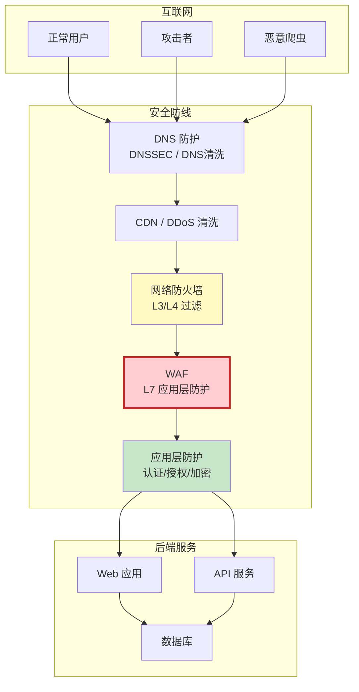
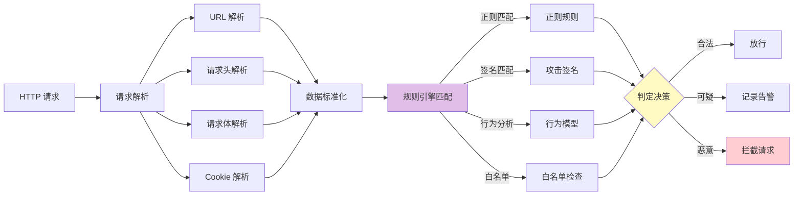
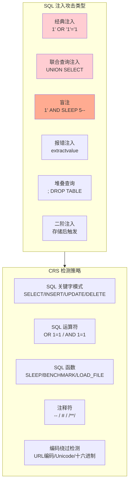
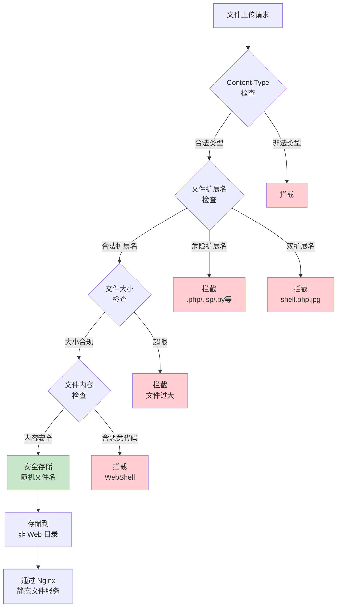
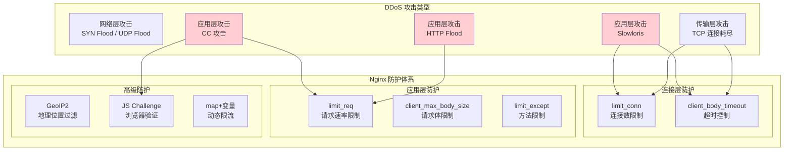
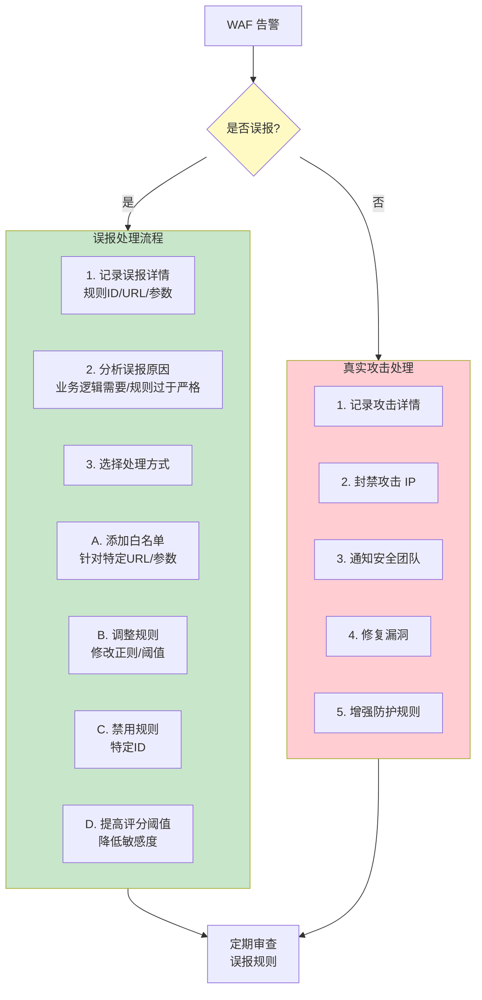

# WAF 与恶意请求防护

Web 应用防火墙（WAF）是 Nginx 安全体系的核心组件。与网络层防火墙不同，WAF 工作在应用层（OSI 第 7 层），能够深入解析 HTTP 请求内容，识别并拦截 SQL 注入、XSS 跨站脚本、文件包含、路径遍历等攻击。本文从 WAF 原理出发，系统讲解 ModSecurity 集成、OWASP CRS 规则集、常见攻击防护以及自定义规则编写。

---

## 1. WAF 原理与架构

### 1.1 WAF 在安全体系中的位置



### 1.2 WAF 工作模式

```
WAF 三种工作模式：

1. 检测模式（Detection Only）
   ┌──────┐     ┌──────┐     ┌──────┐
   │ 请求 │────→│ WAF  │────→│ 后端 │
   └──────┘     │ 检测 │     └──────┘
                │ 记录 │
                └──┬───┘
                   ↓
              [告警日志]
   特点：只记录不拦截，用于规则调优

2. 阻断模式（Prevention）
   ┌──────┐     ┌──────┐     ┌──────┐
   │ 请求 │────→│ WAF  │     │ 后端 │
   └──────┘     │ 检测 │     └──────┘
                │ 拦截 │──×──→
                └──┬───┘
                   ↓
            [403 拦截页面]
   特点：检测并拦截恶意请求

3. 重定向模式（Redirect）
   ┌──────┐     ┌──────┐     ┌──────┐
   │ 请求 │────→│ WAF  │     │ 后端 │
   └──────┘     │ 检测 │     └──────┘
                │ 重定向│──×──→
                └──┬───┘
                   ↓
         [重定向到警告页]
   特点：将恶意请求重定向到清洗页面
```

### 1.3 WAF 检测机制



---

## 2. ModSecurity 集成

### 2.1 ModSecurity 简介

ModSecurity 是最成熟的开源 WAF 引擎，由 Trustwave 维护，目前作为 OWASP 项目继续发展。它以 Nginx 动态模块形式运行，提供完整的规则引擎和丰富的生态。

::: warning ModSecurity v3 已归档
SpiderLabs/ModSecurity（即 ModSecurity v3）已于 2024 年归档，不再积极维护。对于新项目，推荐使用 [Coraza WAF](https://github.com/corazawaf/coraza) 作为替代。Coraza 是 ModSecurity v3 的 Go 语言重写，兼容 SecRule 语法和 OWASP CRS，且仍在活跃开发中。
:::

```
ModSecurity 核心能力：
┌─────────────────────────────────────────────┐
│  ModSecurity 核心引擎                        │
├─────────────────────────────────────────────┤
│  · 完整的 HTTP 请求/响应检查                  │
│  · 规则语言（SecRule）支持正则匹配            │
│  · 请求体解析（multipart / JSON / XML）       │
│  · 响应体检查（信息泄露防护）                 │
│  · 审计日志与实时监控                        │
│  · 与 OWASP CRS 深度集成                     │
│  · 地理位置感知（GeoIP）                     │
│  · 异常评分机制                              │
└─────────────────────────────────────────────┘
```

### 2.2 编译安装 ModSecurity

```bash
# ===== 方式一：动态模块编译 =====

# 1. 安装编译依赖
sudo apt update
sudo apt install -y git build-essential libpcre3-dev \
    libssl-dev libxml2-dev libyajl-dev \
    libcurl4-openssl-dev pkg-config \
    geoip-bin libgeoip-dev liblua5.3-dev \
    zlib1g-dev doxygen

# 2. 下载 ModSecurity 源码
cd /usr/local/src
git clone --depth 1 -b v3/master \
    https://github.com/SpiderLabs/ModSecurity.git
cd ModSecurity
git submodule init
git submodule update

# 3. 编译 ModSecurity 库
./build.sh
./configure --with-lua=/usr
make -j$(nproc)
sudo make install

# 4. 下载 ModSecurity-nginx 连接器
cd /usr/local/src
git clone --depth 1 \
    https://github.com/SpiderLabs/ModSecurity-nginx.git

# 5. 编译 Nginx 动态模块（需要与 Nginx 版本一致）
NGINX_VERSION=1.26.2
wget https://nginx.org/download/nginx-${NGINX_VERSION}.tar.gz
tar xzf nginx-${NGINX_VERSION}.tar.gz

cd nginx-${NGINX_VERSION}
./configure --with-compat \
    --add-dynamic-module=../ModSecurity-nginx
make modules

# 6. 复制模块到 Nginx 模块目录
sudo cp objs/ngx_http_modsecurity_module.so \
    /etc/nginx/modules/

# ===== 方式二：使用预编译包（Ubuntu 22.04+）=====
sudo apt install -y libmodsecurity3 libmodsecurity-dev
sudo apt install -y modsecurity-crs
```

### 2.3 Nginx 加载 ModSecurity

```nginx
# /etc/nginx/nginx.conf

# 加载 ModSecurity 动态模块
load_module modules/ngx_http_modsecurity_module.so;

http {
    # 全局 ModSecurity 配置
    modsecurity on;
    modsecurity_rules_file /etc/nginx/modsecurity.conf;

    server {
        listen 80;
        server_name example.com;

        # 可在 server/location 级别单独控制
        location /api/ {
            modsecurity on;
            modsecurity_rules_file /etc/nginx/modsecurity_api.conf;
        }

        # 对静态资源关闭 WAF（节省性能）
        location /static/ {
            modsecurity off;
        }
    }
}
```

### 2.4 ModSecurity 核心配置文件

```bash
# /etc/nginx/modsecurity.conf

# ===== 基本设置 =====

# WAF 引擎开关：DetectionOnly / On
SecRuleEngine DetectionOnly

# 请求体处理
SecRequestBodyAccess On
SecRequestBodyLimit 13107200              # 12.5MB 最大请求体
SecRequestBodyNoFilesLimit 1048576         # 1MB 非文件部分
SecRequestBodyInMemoryLimit 131072        # 128KB 内存缓存

# 响应体处理
SecResponseBodyAccess Off                  # 生产环境通常关闭
SecResponseBodyLimit 524288                # 512KB 响应体检查上限
SecResponseBodyMimeType text/plain text/html application/json

# ===== 日志配置 =====

# 审计日志
SecAuditEngine RelevantOnly
SecAuditLog /var/log/modsecurity/audit.log
SecAuditLogParts ABIJDE                    # 记录部分
SecAuditLogType Serial                     # 串行写入

# 调试日志（生产环境关闭）
SecDebugLog /var/log/modsecurity/debug.log
SecDebugLogLevel 0                         # 0=关闭，9=最详细

# ===== 默认动作 =====

# 默认拒绝动作
SecDefaultAction "phase:1,log,auditlog,pass"  # 检测模式
# SecDefaultAction "phase:1,deny,log,auditlog,status:403"  # 阻断模式

# ===== 规则去重 =====
SecRuleRemoveById 911100                   # 移除误报规则
```

---

## 3. OWASP 核心规则集（CRS）

### 3.1 CRS 架构与规则分类

OWASP ModSecurity Core Rule Set（CRS）是业界最广泛使用的 WAF 规则集，覆盖 OWASP Top 10 全部攻击类型。

```mermaid
flowchart TB
    subgraph CRS["OWASP CRS v4 规则集"]
        subgraph Base["基础规则 (900*)"]
            Init[初始化配置<br/>900000-900999]
            Scanner[扫描器检测<br/>913100-913999]
            Enforce[强制策略<br/>900100-900999]
        end

        subgraph Request["请求检测 (91* - 94*)"]
            Protocol[协议强制<br/>920000-920999]
            RFI[远程文件包含<br/>930000-930999]
            LFI[本地文件包含<br/>931000-931999]
            RCE[远程代码执行<br/>932000-932999]
            Session[会话固定<br/>933000-933999]
            Injection[SQL注入<br/>942000-942999]
            XSS[XSS攻击<br/>941000-941999]
            Upload[文件上传<br/>934000-934999]
        end

        subgraph Response["响应检测 (95* - 97*)"]
            DataLeak[信息泄露<br/>950000-950999]
            AppError[应用错误<br/>951000-951999]
        end
    end

    Base --> Request
    Request --> Response

    style Injection fill:#ffcdd2
    style XSS fill:#ffcdd2
    style RCE fill:#ffcdd2
    style Protocol fill:#fff9c4
```



### 3.2 安装 OWASP CRS

```bash
# 下载 CRS
cd /etc/nginx
sudo git clone --depth 1 -b v4.0/master \
    https://github.com/coreruleset/coreruleset.git /etc/nginx/crs

# 准备配置文件
cd /etc/nginx/crs
sudo cp crs-setup.conf.example crs-setup.conf

# 修改 ModSecurity 配置，引入 CRS
sudo tee /etc/nginx/modsecurity_crs.conf << 'EOF'
# 引入 CRS 基础配置
Include /etc/nginx/crs/crs-setup.conf

# 引入 CRS 规则
Include /etc/nginx/crs/rules/REQUEST-900-EXCLUSION-RULES-BEFORE-CRS.conf
Include /etc/nginx/crs/rules/REQUEST-901-INITIALIZATION.conf
Include /etc/nginx/crs/rules/REQUEST-903.9001-DRUPAL-EXCLUSION-RULES.conf
Include /etc/nginx/crs/rules/REQUEST-903.9002-WORDPRESS-EXCLUSION-RULES.conf
Include /etc/nginx/crs/rules/REQUEST-903.9003-NEXTCLOUD-EXCLUSION-RULES.conf
Include /etc/nginx/crs/rules/REQUEST-903.9004-DOKUWIKI-EXCLUSION-RULES.conf
Include /etc/nginx/crs/rules/REQUEST-903.9005-CPANEL-EXCLUSION-RULES.conf
Include /etc/nginx/crs/rules/REQUEST-903.9006-XENFORO-EXCLUSION-RULES.conf
Include /etc/nginx/crs/rules/REQUEST-905-COMMON-EXCEPTIONS.conf
Include /etc/nginx/crs/rules/REQUEST-911-METHOD-ENFORCEMENT.conf
Include /etc/nginx/crs/rules/REQUEST-913-SCANNER-DETECTION.conf
Include /etc/nginx/crs/rules/REQUEST-920-PROTOCOL-ENFORCEMENT.conf
Include /etc/nginx/crs/rules/REQUEST-921-PROTOCOL-ATTACK.conf
Include /etc/nginx/crs/rules/REQUEST-922-MULTIPART-ATTACK.conf
Include /etc/nginx/crs/rules/REQUEST-930-APPLICATION-ATTACK-LFI.conf
Include /etc/nginx/crs/rules/REQUEST-931-APPLICATION-ATTACK-RFI.conf
Include /etc/nginx/crs/rules/REQUEST-932-APPLICATION-ATTACK-RCE.conf
Include /etc/nginx/crs/rules/REQUEST-933-APPLICATION-ATTACK-PHP.conf
Include /etc/nginx/crs/rules/REQUEST-934-APPLICATION-ATTACK-GENERIC.conf
Include /etc/nginx/crs/rules/REQUEST-941-APPLICATION-ATTACK-XSS.conf
Include /etc/nginx/crs/rules/REQUEST-942-APPLICATION-ATTACK-SQLI.conf
Include /etc/nginx/crs/rules/REQUEST-943-APPLICATION-ATTACK-SESSION-FIXATION.conf
Include /etc/nginx/crs/rules/REQUEST-944-APPLICATION-ATTACK-JAVA.conf
Include /etc/nginx/crs/rules/REQUEST-949-BLOCKING-EVALUATION.conf
Include /etc/nginx/crs/rules/RESPONSE-950-DATA-LEAKAGES.conf
Include /etc/nginx/crs/rules/RESPONSE-951-DATA-LEAKAGES-SQL.conf
Include /etc/nginx/crs/rules/RESPONSE-952-DATA-LEAKAGES-JAVA.conf
Include /etc/nginx/crs/rules/RESPONSE-953-DATA-LEAKAGES-PHP.conf
Include /etc/nginx/crs/rules/RESPONSE-954-DATA-LEAKAGES-IIS.conf
Include /etc/nginx/crs/rules/RESPONSE-955-WEB-SHELLS.conf
Include /etc/nginx/crs/rules/RESPONSE-959-BLOCKING-EVALUATION.conf
Include /etc/nginx/crs/rules/REQUEST-980-EXCLUSION-RULES-AFTER-CRS.conf
EOF

# 更新 ModSecurity 主配置引入 CRS
echo "Include /etc/nginx/modsecurity_crs.conf" | \
    sudo tee -a /etc/nginx/modsecurity.conf
```

### 3.3 CRS 异常评分模式

CRS 默认使用**异常评分模式**（Anomaly Scoring Mode），每个匹配的规则增加分数，最终由总分数决定是否拦截：

```
异常评分工作流程：

Phase 1: 请求头检测
┌───────────────────────────┐
│ 请求头规则匹配             │
│ · 协议违规    → +5 分     │
│ · 恶意 UA     → +5 分     │
│ · 扫描器特征  → +5 分     │
└───────────┬───────────────┘
            ↓
Phase 2: 请求体检测
┌───────────────────────────┐
│ 请求体规则匹配             │
│ · SQL 注入    → +5 分     │
│ · XSS 攻击    → +5 分     │
│ · RCE 尝试    → +5 分     │
│ · LFI/RFI     → +5 分     │
└───────────┬───────────────┘
            ↓
Phase 3: 累积评分判定
┌───────────────────────────┐
│ inbound_anomaly_score      │
│ ─────────────────────────  │
│ ≥ 阈值(默认5) → 拦截      │
│ < 阈值       → 放行       │
│                           │
│ 阈值可调：                 │
│ · 严格：3 分               │
│ · 默认：5 分               │
│ · 宽松：10 分              │
│ · 仅检测：999999           │
└───────────────────────────┘
```

### 3.4 CRS 关键配置项

```bash
# /etc/nginx/crs/crs-setup.conf 关键配置

# ===== 异常评分阈值 =====
# 入站请求评分阈值（超过即拦截）
SecAction \
    "id:900110,\
     phase:1,\
     pass,\
     t:none,\
     nolog,\
     setvar:tx.inbound_anomaly_score_threshold=5"

# 出站响应评分阈值
SecAction \
    "id:900120,\
     phase:1,\
     pass,\
     t:none,\
     nolog,\
     setvar:tx.outbound_anomaly_score_threshold=4"

# ===== 请求体检查策略 =====
# 允许的 Content-Type
SecAction \
   id:900220,\
    phase:1,\
    pass,\
    t:none,\
    nolog,\
    setvar:'tx.allowed_request_content_type=|application/x-www-form-urlencoded| |multipart/form-data| |text/xml| |application/xml| |application/soap+xml| |application/json|'

# ===== 拒绝响应页面 =====
SecAction \
    "id:900500,\
     phase:1,\
     pass,\
     t:none,\
     nolog,\
     setvar:tx.blocking_anomaly_score=5"

# 自定义拦截页面
# SecAction \
#     "id:900600,\
#      phase:1,\
#      pass,\
#      t:none,\
#      nolog,\
#      setvar:tx.blocking_error_page=/waf-blocked.html"

# ===== 解码配置 =====
SecAction \
    "id:900950,\
     phase:1,\
     pass,\
     t:none,\
     nolog,\
     setvar:tx.crs_setup_version=400"
```

---

## 4. SQL 注入防护

### 4.1 SQL 注入攻击类型与检测



### 4.2 CRS SQL 注入规则详解

```
CRS SQL 注入规则组 (942*):

942100  SQL 注入攻击，通过 libinjection 检测
942110  SQL 注入：常见注入模式测试
942120  SQL 注入：SQL 运算符测试
942130  SQL 注入：SQL 图灵结构测试
942140  SQL 注入：常见 DB 名称测试
942150  SQL 注入：常见 DB 函数测试
942160  SQL 注入：盲注测试
942170  SQL 注入：注入关键词测试
942180  SQL 注入：UNION 查询测试
942190  SQL 注入：堆叠查询测试
942200  SQL 注入：MySQL 注释测试
942210  SQL 注入：编码绕过尝试
942220  SQL 注入：整数溢出尝试
942230  SQL 注入：条件语句测试
942240  SQL 注入：MySQL 特征测试
942250  SQL 注入：ORDER BY 测试
942260  SQL 注入：HAVING 测试
942270  SQL 注入：UNION ALL 测试
942280  SQL 注入：MySQL 系统变量测试
942290  SQL 注入：绕过尝试测试
942300  SQL 注入：MySQL 注释/条件测试
942310  SQL 注入：链式 SQL 命令测试
942320  SQL 注入：PostgreSQL 特征测试
942330  SQL 注入：Oracle 特征测试
942340  SQL 注入：MS SQL 特征测试
942350  SQL 注入：SQLite 特征测试
942360  SQL 注入：嵌套注入测试
942370  SQL 注入：布尔表达式测试
942380  SQL 注入：MongoDB 特征测试
942390  SQL 注入：JSON/NoSQL 测试
942400  SQL 注入：存储过程测试
942410  SQL 注入：时间延迟测试
942420  SQL 注入：异常测试
942430  SQL 注入：绕过尝试（高级）
942440  SQL 注入：注释序列测试
942450  SQL 注入：Hex 编码测试
942460  SQL 注入：元数据查询测试
942470  SQL 注入：命名空间注入测试
942480  SQL 注入：请求方法限制测试
942490  SQL 注入：HTTP 头注入测试
942500  SQL 注入：SQL 关键字频率测试
942510  SQL 注入：SQL 语法检测
942520  SQL 注入：替代编码测试
```

### 4.3 SQL 注入检测实战

```nginx
# 测试 SQL 注入检测（检测模式）
# 以下请求将被 CRS 规则拦截

# 1. 经典注入
# GET /search?q=1' OR '1'='1
# 匹配规则：942100 (libinjection) + 942110 (常见模式)

# 2. UNION 注入
# GET /user?id=1 UNION SELECT username,password FROM users--
# 匹配规则：942190 (堆叠查询) + 942270 (UNION ALL)

# 3. 盲注
# GET /item?id=1 AND SLEEP(5)--
# 匹配规则：942160 (盲注) + 942410 (时间延迟)

# 4. 报错注入
# GET /test?id=1 AND extractvalue(1,concat(0x7e,version()))
# 匹配规则：942150 (DB 函数) + 942130 (图灵结构)
```

### 4.4 SQL 注入防护增强配置

```nginx
# /etc/nginx/modsecurity_sql_hardening.conf

# 针对数据库关键字的高强度检测
SecRule ARGS|ARGS_NAMES|REQUEST_COOKIES|REQUEST_COOKIES_NAMES|\
        REQUEST_FILENAME|REQUEST_HEADERS:Referer|\
        REQUEST_HEADERS:User-Agent \
    "@rx (?i)\b(?:select\s+.*\bfrom\b|insert\s+into|update\s+\w+\s+set|\
        delete\s+from|drop\s+table|truncate\s+table|alter\s+table|\
        exec(?:ute)?\s+|union\s+(?:all\s+)?select|\
        into\s+(?:out|dump)file|load_file\s*\(|\
        benchmark\s*\(|sleep\s*\(|waitfor\s+delay|\
        information_schema|mysql\.(?:user|db)|pg_catalog)\b" \
    "id:991001,\
     phase:2,\
     block,\
     capture,\
     t:none,t:utf8toUnicode,t:urlDecodeUni,t:htmlEntityDecode,t:jsDecode,t:cssDecode,\
     msg:'Enhanced SQL Injection Detection',\
     logdata:'Matched Data: %{TX.0} found within %{MATCHED_VAR_NAME}',\
     tag:'attack-sqli',\
     ver:'custom/1.0',\
     severity:'CRITICAL',\
     setvar:'tx.sql_injection_score=+%{tx.critical_anomaly_score}',\
     setvar:'tx.inbound_anomaly_score=+%{tx.critical_anomaly_score}'"
```

---

## 5. XSS 跨站脚本防护

### 5.1 XSS 攻击类型

```
XSS 攻击三种类型：

1. 反射型 XSS（Reflected）
   攻击者构造恶意 URL → 受害者点击 → 脚本在页面中执行
   示例：https://example.com/search?q=<script>alert(1)</script>

2. 存储型 XSS（Stored）
   攻击者提交恶意内容 → 存入数据库 → 其他用户浏览时执行
   示例：评论框输入 

3. DOM 型 XSS（DOM-based）
   恶意数据通过 DOM 操作注入页面，不经过服务端
   示例：document.getElementById('output').innerHTML = location.hash
```

### 5.2 CRS XSS 规则组

```
CRS XSS 规则组 (941*):

941100  XSS 攻击，通过 libinjection 检测
941110  XSS 过滤器：类别 1 - 脚本标签
941120  XSS 过滤器：类别 2 - 事件处理器
941130  XSS 过滤器：类别 3 - 属性注入
941140  XSS 过滤器：类别 4 - JavaScript URL
941150  XSS 过滤器：类别 5 - 不允许的 HTML 属性
941160  XSS 过滤器：类别 6 - HTML 注入
941170  XSS 过滤器：类别 7 - SVG/MathML 标签
941180  XSS 过滤器：类别 8 - CSS 表达式
941190  XSS 过滤器：类别 9 - 数据 URL
941200  XSS 过滤器：类别 10 - Base64 编码
941210  XSS 过滤器：类别 11 - 模板字面量注入
941220  XSS 过滤器：类别 12 - JS 变量注入
941230  XSS 过滤器：类别 13 - 事件处理器变体
941240  XSS 过滤器：类别 14 - DOM 属性注入
941250  XSS 过滤器：类别 15 - SVG 动画属性
941260  XSS 过滤器：类别 16 - CSS 导入
941270  XSS 过滤器：类别 17 - HTML 实体编码
941280  XSS 过滤器：类别 18 - 编码绕过
941290  XSS 过滤器：类别 19 - JavaScript 关键字
941300  XSS 过滤器：类别 20 - 嵌入对象
941310  XSS 过滤器：US-ASCII 编码滥用
941320  XSS 过滤器：UTF-7 编码滥用
941330  XSS 过滤器：IE 过滤器
941340  XSS 过滤器：HTML5 标签
941350  XSS 过滤器：HTML5 属性
941360  XSS 过滤器：JavaScript 变量声明
941370  XSS 过滤器：JSON 注入
941380  XSS 过滤器：Angular 模板注入
941390  XSS 过滤器：Vue 模板注入
```

### 5.3 Nginx 层面 XSS 防护头

```nginx
# XSS 防护 HTTP 响应头
server {
    listen 80;
    server_name example.com;

    # 内容安全策略（CSP）- 最强防线
    add_header Content-Security-Policy \
        "default-src 'self'; \
         script-src 'self' 'unsafe-inline' 'unsafe-eval' https://cdn.example.com; \
         style-src 'self' 'unsafe-inline' https://cdn.example.com; \
         img-src 'self' data: https:; \
         font-src 'self' https://cdn.example.com; \
         connect-src 'self' https://api.example.com; \
         frame-ancestors 'none'; \
         base-uri 'self'; \
         form-action 'self'" always;

    # XSS 保护（IE/旧浏览器）
    add_header X-XSS-Protection "1; mode=block" always;

    # 禁止 MIME 嗅探
    add_header X-Content-Type-Options "nosniff" always;

    # 禁止嵌入 iframe（防点击劫持）
    add_header X-Frame-Options "SAMEORIGIN" always;

    # Referrer 策略
    add_header Referrer-Policy "strict-origin-when-cross-origin" always;

    location / {
        proxy_pass http://backend;
    }
}
```

### 5.4 自定义 XSS 检测规则

```nginx
# /etc/nginx/modsecurity_xss_custom.conf

# 检测 HTML 事件处理器注入
SecRule ARGS|ARGS_NAMES|REQUEST_COOKIES \
    "@rx (?i)\bon(?:error|load|click|mouseover|focus|blur|submit|change|\
        input|keydown|keyup|keypress|abort|resize|scroll|unload)\s*=" \
    "id:992001,\
     phase:2,\
     block,\
     capture,\
     t:none,t:utf8toUnicode,t:urlDecodeUni,t:htmlEntityDecode,t:jsDecode,t:cssDecode,\
     msg:'XSS Event Handler Injection Detected',\
     logdata:'Matched Data: %{TX.0} found within %{MATCHED_VAR_NAME}',\
     tag:'attack-xss',\
     ver:'custom/1.0',\
     severity:'CRITICAL',\
     setvar:'tx.xss_score=+%{tx.critical_anomaly_score}',\
     setvar:'tx.inbound_anomaly_score=+%{tx.critical_anomaly_score}'"

# 检测 JavaScript 伪协议
SecRule ARGS|ARGS_NAMES \
    "@rx (?i)(?:javascript|vbscript|data)\s*:" \
    "id:992002,\
     phase:2,\
     block,\
     capture,\
     t:none,t:utf8toUnicode,t:urlDecodeUni,t:htmlEntityDecode,\
     msg:'XSS JavaScript URI Scheme Detected',\
     logdata:'Matched Data: %{TX.0} found within %{MATCHED_VAR_NAME}',\
     tag:'attack-xss',\
     ver:'custom/1.0',\
     severity:'CRITICAL',\
     setvar:'tx.xss_score=+%{tx.critical_anomaly_score}',\
     setvar:'tx.inbound_anomaly_score=+%{tx.critical_anomaly_score}'"

# 检测 SVG/MathML 注入
SecRule ARGS \
    "@rx (?i)<(?:svg|math|animate|set|use|image|foreignobject|\
        annotation-xml|desc|title|metadata)\b" \
    "id:992003,\
     phase:2,\
     block,\
     capture,\
     t:none,t:utf8toUnicode,t:urlDecodeUni,t:htmlEntityDecode,\
     msg:'XSS SVG/MathML Injection Detected',\
     logdata:'Matched Data: %{TX.0} found within %{MATCHED_VAR_NAME}',\
     tag:'attack-xss',\
     ver:'custom/1.0',\
     severity:'CRITICAL',\
     setvar:'tx.xss_score=+%{tx.critical_anomaly_score}',\
     setvar:'tx.inbound_anomaly_score=+%{tx.critical_anomaly_score}'"
```

---

## 6. 文件上传与路径遍历防护

### 6.1 文件上传攻击防护



### 6.2 Nginx 文件上传安全配置

```nginx
server {
    listen 80;
    server_name upload.example.com;

    # 限制上传请求体大小
    client_max_body_size 10m;

    # 上传接口
    location /api/upload {
        # 仅允许 POST 方法
        limit_except POST {
            deny all;
        }

        # ModSecurity 文件上传检查
        modsecurity on;
        modsecurity_rules_file /etc/nginx/modsecurity.conf;

        proxy_pass http://upload_backend;
    }

    # 上传文件存储目录 - 禁止执行
    location /uploads/ {
        alias /data/uploads/;

        # 禁止执行任何脚本
        location ~* /uploads/.*\.(php|php5|phtml|jsp|py|pl|cgi|sh|bash)$ {
            deny all;
        }

        # 强制 Content-Type
        types {
            image/jpeg jpg jpeg;
            image/png png;
            image/gif gif;
            application/pdf pdf;
            text/plain txt;
        }

        # 禁止未识别类型的默认处理
        default_type application/octet-stream;

        # 禁止访问隐藏文件
        location ~* /uploads/.*\.(htaccess|git|env)$ {
            deny all;
        }
    }
}
```

### 6.3 文件上传 ModSecurity 规则

```nginx
# 限制允许的上传文件类型
SecRule FILES_NAMES|FILES \
    "@rx \.(?:php[3457]?|phtml|pht|phps|shtml|jsp|jspx|jspf|\
        asp|aspx|asa|cer|cdx|ashx|asmx|\
        py|rb|pl|pm|cgi|sh|bash|bat|cmd|com|exe|dll|msi|\
        war|jar|class|svg|htaccess|htpasswd)$" \
    "id:993001,\
     phase:2,\
     deny,\
     log,\
     msg:'Dangerous File Upload Type Detected',\
     logdata:'File: %{FILES_NAMES}, Type: %{TX.0}',\
     tag:'attack-upload',\
     ver:'custom/1.0',\
     severity:'CRITICAL'"

# 检测双扩展名攻击（如 shell.php.jpg）
SecRule FILES_NAMES \
    "@rx \.(?:php[3457]?|phtml|pht|jsp|aspx?)\.\w{1,5}$" \
    "id:993002,\
     phase:2,\
     deny,\
     log,\
     msg:'Double Extension Upload Attack Detected',\
     logdata:'File: %{TX.0}',\
     tag:'attack-upload',\
     ver:'custom/1.0',\
     severity:'CRITICAL'"

# 检测 WebShell 特征
SecRule FILES \
    "@rx (?:eval\s*\(|base64_decode\s*\(|system\s*\(|exec\s*\(|\
        passthru\s*\(|shell_exec\s*\(|popen\s*\(|proc_open\s*\(|\
        assert\s*\(|preg_replace\s*\(.*/e|create_function\s*\(|\
        call_user_func\s*\(|call_user_func_array\s*\(|\
        \$_(?:GET|POST|REQUEST|COOKIE|SERVER)\s*\[)" \
    "id:993003,\
     phase:2,\
     deny,\
     log,\
     msg:'WebShell Pattern Detected in Uploaded File',\
     logdata:'File: %{FILES_NAMES}, Match: %{TX.0}',\
     tag:'attack-upload',\
     tag:'attack-webshell',\
     ver:'custom/1.0',\
     severity:'CRITICAL'"

# 限制上传文件名长度
# 注意：FILES_NAMES 是字符串变量，@gt 会将非数字字符串转为 0，
# 因此 @gt 无法正确判断字符串长度。应使用 @rx 正则匹配长度。
SecRule FILES_NAMES \
    "@rx ^.{256,}" \
    "id:993004,\
     phase:2,\
     deny,\
     log,\
     msg:'Upload Filename Too Long',\
     logdata:'Filename: %{TX.0}',\
     tag:'attack-upload',\
     ver:'custom/1.0',\
     severity:'WARNING'"
```

### 6.4 路径遍历防护

```nginx
# 路径遍历攻击示例：
# GET /../../etc/passwd
# GET /%2e%2e/%2e%2e/etc/passwd
# GET /....//....//etc/passwd
# GET /%252e%252e/%252e%252e/etc/passwd (双重编码)

# Nginx 层面路径遍历防护
server {
    listen 80;
    server_name example.com;

    # 如果 URI 中包含路径遍历特征，直接拒绝
    # Nginx 本身会解码 URI 并规范化路径，所以 ../ 会被处理
    # 但仍需防御编码绕过

    location /files/ {
        alias /data/files/;

        # 禁止访问上层目录
        # Nginx alias 本身有路径遍历防护（较新版本）
        # 额外防护：确保 URI 解码后不包含 ..
        if ($uri ~* \.\.) {
            return 403;
        }
    }
}

# ModSecurity 路径遍历规则
# CRS 已有规则 930100-930110 检测路径遍历
# 增强规则：
SecRule REQUEST_URI|REQUEST_FILENAME \
    "@rx (?:\.\.(?:/|\\|\%2f|\%5c)|\
        \.(?:\%2e|\%252e)(?:/|\\|\%2f|\%5c)|\
        /etc/passwd|/etc/shadow|/proc/self|\
        \\\./\.\./|/\.\\\.\\)" \
    "id:993100,\
     phase:1,\
     deny,\
     log,\
     msg:'Path Traversal Attack Detected',\
     logdata:'Matched Data: %{TX.0} found within %{MATCHED_VAR_NAME}',\
     tag:'attack-lfi',\
     ver:'custom/1.0',\
     severity:'CRITICAL',\
     setvar:'tx.lfi_score=+%{tx.critical_anomaly_score}',\
     setvar:'tx.inbound_anomaly_score=+%{tx.critical_anomaly_score}'"
```

---

## 7. Bot 检测与爬虫管理

### 7.1 Bot 分类与管理策略

```
Bot 分类：

1. 好爬虫（Good Bots）
   ┌───────────────────────────────────┐
   │ · Googlebot       → SEO 收录      │
   │ · Bingbot         → SEO 收录      │
   │ · Baiduspider     → SEO 收录      │
   │ · Slackbot        → 链接预览      │
   │ · Discordbot      → 链接预览      │
   │ 策略：允许 + 限速              │
   └───────────────────────────────────┘

2. 坏爬虫（Bad Bots）
   ┌───────────────────────────────────┐
   │ · 爬取邮箱         → 垃圾邮件     │
   │ · 内容抓取         → 抄袭         │
   │ · 漏洞扫描         → 攻击前探     │
   │ · 竞争对手抓取     → 商业间谍     │
   │ 策略：识别 + 拦截              │
   └───────────────────────────────────┘

3. 灰色爬虫（Grey Bots）
   ┌───────────────────────────────────┐
   │ · 监控服务         → 可能有价值   │
   │ · SEO 工具         → 数据采集     │
   │ · AI 训练爬虫      → 版权争议     │
   │ 策略：按需控制              │
   └───────────────────────────────────┘
```

### 7.2 Nginx Bot 管理配置

```nginx
# 基于 User-Agent 的爬虫管理
map $http_user_agent $bot_category {
    default                                         "human";

    # 好爬虫 - 允许但限速
    ~*Googlebot                                      "good";
    ~*bingbot                                        "good";
    ~*Baiduspider                                    "good";
    ~*YandexBot                                      "good";
    ~*DuckDuckBot                                    "good";
    ~*Slackbot                                       "good";
    ~*Discordbot                                     "good";
    ~*Twitterbot                                     "good";
    ~*facebookexternalhit                            "good";

    # 坏爬虫 - 直接拦截
    ~*SemrushBot                                     "bad";
    ~*AhrefsBot                                      "bad";
    ~*MJ12bot                                        "bad";
    ~*DotBot                                         "bad";
    ~*rogerbot                                       "bad";
    ~*ScanBot                                        "bad";
    ~*Nmap                                           "bad";
    ~*nikto                                          "bad";
    ~*sqlmap                                         "bad";
    ~*w3af                                           "bad";
    ~*ZmEu                                           "bad";
    ~*dirbuster                                      "bad";
    ~*gobuster                                       "bad";

    # AI 爬虫
    ~*GPTBot                                         "ai";
    ~*ChatGPT-User                                   "ai";
    ~*CCBot                                          "ai";
    ~*Google-Extended                                "ai";
    ~*Amazonbot                                      "ai";
    ~*Bytespider                                     "ai";
    ~*ClaudeBot                                      "ai";

    # 空白或可疑 UA
    ""                                               "suspicious";
    ~*^$                                             "suspicious";
    ~*^Mozilla/\d\.\d\s*$                            "suspicious";
}

# 为不同类别设置不同限速
map $bot_category $bot_limit_rate {
    "human"       0;          # 不限速
    "good"        10r/s;      # 允许但限速
    "bad"         1r/m;       # 极低速率（等效拦截）
    "ai"          5r/m;       # 低速率
    "suspicious"  1r/m;       # 极低速率
}

server {
    listen 80;
    server_name example.com;

    # 拦截坏爬虫和可疑 UA
    if ($bot_category = "bad") {
        return 403;
    }
    if ($bot_category = "suspicious") {
        return 403;
    }

    # 好爬虫限速
    location / {
        if ($bot_category = "good") {
            set $limit_rate 10k;
        }

        # AI 爬虫返回简化内容
        if ($bot_category = "ai") {
            return 200 "This content is not available for AI training.";
        }

        proxy_pass http://backend;
    }

    # robots.txt 配置
    location = /robots.txt {
        default_type text/plain;
        return 200 'User-agent: *
Disallow: /admin/
Disallow: /api/
Disallow: /private/

User-agent: GPTBot
Disallow: /

User-agent: ChatGPT-User
Disallow: /

User-agent: CCBot
Disallow: /

User-agent: ClaudeBot
Disallow: /
';
    }
}
```

### 7.3 ModSecurity Bot 检测规则

```nginx
# 检测自动化工具特征
SecRule REQUEST_HEADERS:User-Agent \
    "@rx (?:sqlmap|nikto|nmap|masscan|dirbuster|gobuster|\
        wfuzz|burpsuite|zap|arachni|w3af|acunetix|nessus|\
        openvas|metasploit|havij|pangolin|commix)" \
    "id:994001,\
     phase:1,\
     deny,\
     log,\
     msg:'Security Scanner User-Agent Detected',\
     logdata:'UA: %{TX.0}',\
     tag:'attack-bot',\
     ver:'custom/1.0',\
     severity:'CRITICAL'"

# 检测无 User-Agent 或异常短 UA
SecRule &REQUEST_HEADERS:User-Agent "@eq 0" \
    "id:994002,\
     phase:1,\
     deny,\
     log,\
     msg:'Missing User-Agent Header',\
     tag:'attack-bot',\
     ver:'custom/1.0',\
     severity:'WARNING'"

# 检测异常请求频率（Nginx limit_req 与 ModSecurity 联动）
SecAction \
    "id:994100,\
     phase:1,\
     pass,\
     nolog,\
     initcol:ip=%{remote_addr},\
     setvar:ip.request_count=+1"

SecRule IP:REQUEST_COUNT "@gt 100" \
    "id:994101,\
     phase:1,\
     deny,\
     log,\
     msg:'Excessive Requests from Single IP',\
     logdata:'Count: %{IP.REQUEST_COUNT}',\
     tag:'attack-bot',\
     ver:'custom/1.0',\
     severity:'WARNING',\
     expirevar:ip.request_count=60"
```

### 7.4 验证码与 JS Challenge

```nginx
# 基于 cookie 的 JS Challenge 机制
# 原理：浏览器执行 JS 设置 cookie，纯 HTTP 客户端无法通过

server {
    listen 80;
    server_name example.com;

    # JS Challenge 页面
    location = /challenge.js {
        default_type application/javascript;
        return 200 '
            document.cookie = "__js_challenge=passed; path=/; max-age=3600";
            window.location.reload();
        ';
    }

    # 需要验证的路径
    location /api/ {
        # 检查是否通过 JS Challenge
        if ($cookie___js_challenge != "passed") {
            return 200 '<html><body><script src="/challenge.js"></script></body></html>';
        }

        proxy_pass http://backend;
    }
}
```

---

## 8. DDoS 防护

### 8.1 Nginx 层面 DDoS 防护架构



### 8.2 HTTP Flood 防护

```nginx
# HTTP Flood 防护配置
http {
    # 定义请求限流区域（基于 IP + URI）
    limit_req_zone $binary_remote_addr zone=flood:100m rate=30r/s;
    limit_req_zone $binary_remote_addr$request_uri zone=uri_flood:200m rate=10r/s;

    # 定义连接限流区域
    limit_conn_zone $binary_remote_addr zone=conn_limit:100m;

    # 定义请求方法限流
    limit_req_zone $binary_remote_addr zone=login_limit:10m rate=5r/m;

    server {
        listen 80;
        server_name example.com;

        # 全局限流
        limit_req zone=flood burst=50 nodelay;
        limit_req zone=uri_flood burst=20 nodelay;
        limit_conn conn_limit 50;

        # 登录接口单独限流
        location /api/login {
            limit_req zone=login_limit burst=3 nodelay;
            limit_req_status 429;

            proxy_pass http://backend;
        }

        # 限流后的自定义错误页面
        error_page 429 @rate_limited;
        location @rate_limited {
            default_type application/json;
            return 429 '{"error":"Too Many Requests","retry_after":60}';
        }

        # 慢速攻击防护
        client_body_timeout 10s;
        client_header_timeout 10s;
        send_timeout 10s;
        keepalive_timeout 30s;

        # 限制请求行和请求头大小
        client_header_buffer_size 1k;
        large_client_header_buffers 4 8k;
    }
}
```

### 8.3 Slowloris 攻击防护

```nginx
# Slowloris 攻击原理：
# 攻击者发送不完整的 HTTP 请求头，占用连接资源
# 每隔一段时间发送一个头部行，保持连接不超时
# 逐渐耗尽 Nginx 的 worker_connections

# 防护配置
server {
    listen 80;

    # 关键超时设置
    client_header_timeout 10s;    # 请求头超时（默认60s，调短）
    client_body_timeout 10s;      # 请求体超时
    send_timeout 10s;             # 响应发送超时

    # 限制请求头大小（防止超大头部攻击）
    client_header_buffer_size 1k;
    large_client_header_buffers 4 4k;

    # 关闭不需要的连接
    reset_timedout_connection on;  # 超时后发送 RST

    # 限制 keepalive 请求次数
    keepalive_requests 100;

    location / {
        proxy_pass http://backend;

        # 代理超时设置
        proxy_connect_timeout 5s;
        proxy_read_timeout 30s;
        proxy_send_timeout 30s;
    }
}
```

### 8.4 基于 GeoIP 的 DDoS 流量清洗

```nginx
# 当 DDoS 攻击来自特定国家/地区时，可以快速阻断
http {
    # 加载 GeoIP2 模块
    geoip2 /usr/share/GeoIP/GeoLite2-Country.mmdb {
        auto_reload 5m;
        $geoip2_data_country_code country iso_code;
    }

    # 定义允许的国家/地区
    map $geoip2_data_country_code $allowed_country {
        default         0;  # 默认不允许
        CN              1;  # 中国
        HK              1;  # 香港
        TW              1;  # 台湾
        MO              1;  # 澳门
        US              1;  # 美国
        JP              1;  # 日本
        SG              1;  # 新加坡
    }

    server {
        listen 80;
        server_name example.com;

        # DDoS 紧急模式开关（通过变量控制）
        set $ddos_mode 0;  # 0=正常，1=紧急

        # 紧急模式下仅允许特定国家
        if ($ddos_mode) {
            set $country_check $allowed_country;
        }

        # 非紧急模式允许所有
        if (!$ddos_mode) {
            set $country_check 1;
        }

        if ($country_check = 0) {
            return 403;
        }

        location / {
            proxy_pass http://backend;
        }
    }
}
```

---

## 9. 自定义 WAF 规则编写

### 9.1 SecRule 语法详解

```
SecRule 语法：
SecRule VARIABLES OPERATOR [ACTIONS]

┌─────────────────────────────────────────────────────────┐
│ VARIABLES（检测变量）                                    │
├─────────────────────────────────────────────────────────┤
│ ARGS              所有请求参数（GET+POST）              │
│ ARGS_NAMES        请求参数名                            │
│ ARGS_GET          URL 查询参数                          │
│ ARGS_GET_NAMES    URL 查询参数名                        │
│ ARGS_POST         POST 请求体参数                      │
│ ARGS_POST_NAMES   POST 请求体参数名                    │
│ REQUEST_URI       完整请求 URI                          │
│ REQUEST_FILENAME  请求文件名（不含查询字符串）          │
│ REQUEST_HEADERS   请求头                               │
│ REQUEST_METHOD    请求方法                              │
│ REQUEST_COOKIES   请求 Cookie                          │
│ REQUEST_BODY      完整请求体                           │
│ FILES             上传文件内容                          │
│ FILES_NAMES       上传文件名                            │
│ FILES_SIZES       上传文件大小                          │
│ REMOTE_ADDR       客户端 IP                             │
│ REMOTE_PORT       客户端端口                            │
│ TX                事务变量                              │
│ IP                IP 集合变量                           │
│ SESSION           会话变量                              │
│ GEO               地理位置变量                          │
├─────────────────────────────────────────────────────────┤
│ OPERATOR（匹配操作符）                                   │
├─────────────────────────────────────────────────────────┤
│ @rx               正则表达式匹配                        │
│ @eq               等于                                 │
│ @gt               大于                                 │
│ @lt               小于                                 │
│ @ge               大于等于                              │
│ @le               小于等于                              │
│ @contains         包含                                 │
│ @startsWith       以...开头                             │
│ @endsWith         以...结尾                             │
│ @within           在...范围内                          │
│ @ipMatch          IP 匹配（支持 CIDR）                 │
│ @ipMatchF         IP 匹配（从文件读取）                 │
│ @pm               并行匹配（多个字符串）                │
│ @pmf              并行匹配（从文件读取）                │
│ @detectSQLi       SQL 注入检测（libinjection）          │
│ @detectXSS        XSS 检测（libinjection）             │
│ @validateUrl      URL 格式验证                          │
│ @validateDTD      DTD 验证                              │
│ @validateSchema   Schema 验证                          │
├─────────────────────────────────────────────────────────┤
│ ACTIONS（执行动作）                                      │
├─────────────────────────────────────────────────────────┤
│ pass              放行                                 │
│ deny / block      拦截                                 │
│ drop              断开连接                              │
│ redirect          重定向                                │
│ log               记录日志                              │
│ auditlog          记录审计日志                          │
│ nolog             不记录日志                            │
│ status            设置响应状态码                        │
│ capture           捕获匹配内容                         │
│ setvar            设置变量                              │
│ expirevar         设置过期变量                          │
│ tag               设置标签                              │
│ msg               设置消息                              │
│ severity          设置严重级别                          │
│ id                规则 ID                               │
│ phase             处理阶段（1-5）                       │
│ t:xxx             数据转换                              │
│ skip / skipAfter  跳过规则                              │
│ ctl               控制指令                              │
├─────────────────────────────────────────────────────────┤
│ TRANSFORMATION（数据转换）                               │
├─────────────────────────────────────────────────────────┤
│ t:none            不转换                               │
│ t:lowercase       转小写                               │
│ t:urlDecode       URL 解码                              │
│ t:urlDecodeUni    URL Unicode 解码                      │
│ t:htmlEntityDecode HTML 实体解码                       │
│ t:jsDecode        JS 解码                              │
│ t:cssDecode       CSS 解码                             │
│ t:normalizePath   路径规范化                           │
│ t:removeNulls     移除空字节                           │
│ t:removeWhitespace 移除空白                            │
│ t:replaceNulls    替换空字节                            │
│ t:compressWhitespace 压缩空白                           │
│ t:utf8toUnicode   UTF-8 转 Unicode                    │
└─────────────────────────────────────────────────────────┘
```

### 9.2 处理阶段（Phase）

```
ModSecurity 5 个处理阶段：

Phase 1: 请求头阶段（Request Headers）
┌─────────────────────────────────────┐
│ 时机：读取请求头之后                  │
│ 可用：REQUEST_HEADERS, REMOTE_ADDR  │
│       REQUEST_METHOD, REQUEST_URI   │
│ 不可用：请求体（尚未读取）           │
│ 用途：IP 黑名单、方法过滤、头部检查  │
│ 性能：开销最小，最早拦截             │
└─────────────────────────────────────┘
          ↓
Phase 2: 请求体阶段（Request Body）
┌─────────────────────────────────────┐
│ 时机：读取请求体之后                  │
│ 可用：ARGS, REQUEST_BODY, FILES     │
│ 用途：SQL注入、XSS、文件上传检查     │
│ 性能：开销较大（需要解析请求体）     │
└─────────────────────────────────────┘
          ↓
Phase 3: 响应头阶段（Response Headers）
┌─────────────────────────────────────┐
│ 时机：收到后端响应头之后              │
│ 可用：RESPONSE_HEADERS, STATUS      │
│ 用途：响应头检查、状态码过滤         │
└─────────────────────────────────────┘
          ↓
Phase 4: 响应体阶段（Response Body）
┌─────────────────────────────────────┐
│ 时机：收到后端响应体之后              │
│ 可用：RESPONSE_BODY                 │
│ 用途：信息泄露检测、响应体过滤       │
│ 性能：开销最大                       │
└─────────────────────────────────────┘
          ↓
Phase 5: 日志阶段（Logging）
┌─────────────────────────────────────┐
│ 时机：请求处理完成后                  │
│ 可用：所有变量                       │
│ 用途：审计日志、统计记录             │
│ 注意：此阶段无法拦截请求             │
└─────────────────────────────────────┘
```

### 9.3 自定义规则实战

```nginx
# ===== 规则 1：IP 黑名单 =====
# 从文件加载 IP 黑名单
SecRule REMOTE_ADDR "@ipMatchF /etc/nginx/waf/ip_blacklist.txt" \
    "id:995001,\
     phase:1,\
     deny,\
     log,\
     msg:'IP Blacklisted',\
     logdata:'IP: %{REMOTE_ADDR}',\
     tag:'access-control',\
     ver:'custom/1.0',\
     severity:'CRITICAL'"

# ip_blacklist.txt 示例内容：
# 192.168.1.100
# 10.0.0.0/8
# 203.0.113.0/24

# ===== 规则 2：URL 白名单 =====
# 对特定 URL 跳过 WAF 检查
SecRule REQUEST_FILENAME "@streq /api/health" \
    "id:995010,\
     phase:1,\
     pass,\
     nolog,\
     ctl:ruleRemoveById=941000-942999,\
     ctl:ruleRemoveById=930000-933999"

# ===== 规则 3：敏感信息泄露检测 =====
# 检测响应体中的敏感信息
SecRule RESPONSE_BODY \
    "@rx (?:password\s*[:=]\s*\S+|api[_-]?key\s*[:=]\s*\S+|\
        secret\s*[:=]\s*\S+|token\s*[:=]\s*eyJ[a-zA-Z0-9])" \
    "id:995020,\
     phase:4,\
     deny,\
     log,\
     msg:'Sensitive Information Leak Detected',\
     logdata:'Matched Data: %{TX.0}',\
     tag:'data-leak',\
     ver:'custom/1.0',\
     severity:'CRITICAL'"

# ===== 规则 4：异常请求方法检测 =====
# 仅允许常见 HTTP 方法
SecRule REQUEST_METHOD "!@pm GET HEAD POST PUT DELETE PATCH OPTIONS" \
    "id:995030,\
     phase:1,\
     deny,\
     log,\
     msg:'Unusual HTTP Method Detected',\
     logdata:'Method: %{REQUEST_METHOD}',\
     tag:'protocol-violation',\
     ver:'custom/1.0',\
     severity:'WARNING'"

# ===== 规则 5：请求参数长度限制 =====
# 防止超长参数攻击（缓冲区溢出尝试）
# 注意：ARGS_NAMES 是字符串变量，@gt 会将非数字字符串转为 0，
# 应使用 @rx 正则匹配长度
SecRule ARGS_NAMES \
    "@rx ^.{101,}" \
    "id:995040,\
     phase:2,\
     deny,\
     log,\
     msg:'Parameter Name Too Long',\
     logdata:'Name: %{TX.0}, Length: %{TX.0_length}',\
     tag:'protocol-violation',\
     ver:'custom/1.0',\
     severity:'WARNING'"

SecRule ARGS \
    "@rx ^.{65536,}" \
    "id:995041,\
     phase:2,\
     deny,\
     log,\
     msg:'Parameter Value Too Long',\
     logdata:'Name: %{MATCHED_VAR_NAME}, Length: %{TX.0_length}',\
     tag:'protocol-violation',\
     ver:'custom/1.0',\
     severity:'WARNING'"

# ===== 规则 6：异常 Content-Type 检测 =====
SecRule REQUEST_HEADERS:Content-Type \
    "!@rx ^(?:application/x-www-form-urlencoded|multipart/form-data|\
        text/plain|application/json|application/xml|text/xml|\
        application/soap+xml|application/octet-stream)" \
    "id:995050,\
     phase:1,\
     deny,\
     log,\
     msg:'Unusual Content-Type Detected',\
     logdata:'Content-Type: %{TX.0}',\
     tag:'protocol-violation',\
     ver:'custom/1.0',\
     severity:'WARNING'"

# ===== 规则 7：地理位置限制 =====
# 仅允许中国 IP 访问
SecRule GEO:COUNTRY_CODE "!@streq CN" \
    "id:995060,\
     phase:1,\
     deny,\
     log,\
     msg:'Access Denied - Country Not Allowed',\
     logdata:'Country: %{GEO:COUNTRY_CODE}, IP: %{REMOTE_ADDR}',\
     tag:'geo-restriction',\
     ver:'custom/1.0',\
     severity:'NOTICE'"

# ===== 规则 8：会话异常检测 =====
# 同一 IP 在短时间内访问过多不同 URL
SecAction \
    "id:995070,\
     phase:1,\
     pass,\
     nolog,\
     initcol:ip=%{remote_addr},\
     setvar:ip.url_count=+1"

SecRule IP:URL_COUNT "@gt 500" \
    "id:995071,\
     phase:1,\
     deny,\
     log,\
     msg:'Excessive URL Scanning Detected',\
     logdata:'IP: %{REMOTE_ADDR}, URL Count: %{IP.URL_COUNT}',\
     tag:'attack-scanning',\
     ver:'custom/1.0',\
     severity:'CRITICAL',\
     expirevar:ip.url_count=300"
```

---

## 10. WAF 运维与调优

### 10.1 误报处理流程



### 10.2 误报排除规则

```nginx
# /etc/nginx/waf/exclusions.conf

# ===== 全局排除 =====

# 对特定 URL 完全跳过 WAF
SecRule REQUEST_FILENAME "@beginsWith /api/internal/" \
    "id:996001,\
     phase:1,\
     pass,\
     nolog,\
     ctl:ruleRemoveById=1-999999"

# ===== 部分排除 =====

# 对搜索接口排除 SQL 注入规则（业务需要搜索特殊字符）
SecRule REQUEST_FILENAME "@streq /api/search" \
    "id:996010,\
     phase:1,\
     pass,\
     nolog,\
     ctl:ruleRemoveById=942100-942490"

# 对 Markdown 编辑器排除 XSS 规则（需要保存 HTML 内容）
SecRule REQUEST_FILENAME "@streq /api/content" \
    "id:996011,\
     phase:1,\
     pass,\
     nolog,\
     ctl:ruleRemoveById=941100-941390"

# ===== 参数级排除 =====

# 对特定参数排除特定规则
SecRule ARGS_NAMES "@streq html_content" \
    "id:996020,\
     phase:1,\
     pass,\
     nolog,\
     ctl:ruleRemoveById=941100-941390,\
     ctl:ruleRemoveById=942100-942490"

# ===== IP 白名单 =====
SecRule REMOTE_ADDR "@ipMatch 10.0.0.0/8,172.16.0.0/12,192.168.0.0/16" \
    "id:996030,\
     phase:1,\
     pass,\
     nolog,\
     ctl:ruleRemoveById=1-999999"
```

### 10.3 WAF 日志分析

```bash
# ===== ModSecurity 日志分析 =====

# 查看今日 WAF 拦截统计
grep "$(date +%d/%b/%Y)" /var/log/modsecurity/audit.log | \
    grep -oP 'msg:\x27[^\x27]+\x27' | sort | uniq -c | sort -rn | head -20

# 查看被拦截最多的 IP
grep "403" /var/log/nginx/access.log | \
    awk '{print $1}' | sort | uniq -c | sort -rn | head -20

# 查看特定规则的触发情况
grep "id \"942100\"" /var/log/modsecurity/audit.log | \
    grep -oP 'unique_id "\K[^"]+' | head -20

# 导出最近 1 小时的 SQL 注入告警
awk -v start="$(date -d '1 hour ago' '+%d/%b/%Y:%H:%M')" \
    -v end="$(date '+%d/%b/%Y:%H:%M')" \
    '$0 >= start && $0 <= end' /var/log/modsecurity/audit.log | \
    grep "942"

# ===== 自动化误报检测 =====
# 查找频繁触发的规则（可能是误报）
grep -oP 'id "\K\d+' /var/log/modsecurity/audit.log | \
    sort | uniq -c | sort -rn | head -20

# 查看特定规则匹配的内容
grep "942100" /var/log/modsecurity/audit.log | \
    grep -oP 'Matched Data: \K[^ ]+' | sort | uniq -c | sort -rn | head -20
```

### 10.4 WAF 性能优化

```nginx
# /etc/nginx/modsecurity_performance.conf

# ===== 性能优化策略 =====

# 1. 静态资源跳过 WAF
location ~* \.(jpg|jpeg|png|gif|ico|css|js|svg|woff|woff2|ttf|eot)$ {
    modsecurity off;
    expires 30d;
    add_header Cache-Control "public, no-transform";
}

# 2. 健康检查跳过 WAF
location = /health {
    modsecurity off;
    access_log off;
    return 200 "OK";
}

# 3. 减少不必要的响应体检查
SecResponseBodyAccess Off;

# 4. 限制响应体检查大小
SecResponseBodyLimit 524288;

# 5. 限制请求体大小
SecRequestBodyLimit 10485760;

# 6. 关闭调试日志
SecDebugLogLevel 0;

# 7. 优化日志写入
# 使用缓冲减少磁盘 I/O
SecAuditLogType Concurrent
SecAuditLogStorageDir /var/log/modsecurity/audit/

# 8. 使用更高效的日志格式
SecAuditLogParts AB

# 9. 规则优化：先执行快速规则
# Phase 1 规则应在 Phase 2 之前做尽可能多的过滤
# IP 黑名单放在 Phase 1，减少后续处理开销

# 10. 规则优化：合并相似规则
# 使用 @pm 代替多个 @rx
# 使用 @ipMatchF 代替多个 @ipMatch
```

### 10.5 WAF 规则热更新

```bash
# ModSecurity 规则热更新（无需重启 Nginx）

# 1. 更新规则文件
sudo vim /etc/nginx/waf/custom_rules.conf

# 2. 验证配置语法
sudo nginx -t

# 3. 重新加载 Nginx（优雅重载）
sudo nginx -s reload

# ===== 自动化规则更新脚本 =====
#!/bin/bash
# /usr/local/bin/waf-update.sh

set -euo pipefail

CRS_DIR="/etc/nginx/crs"
WAF_DIR="/etc/nginx/waf"
BACKUP_DIR="/var/backups/waf"
LOG_FILE="/var/log/waf-update.log"

echo "$(date '+%Y-%m-%d %H:%M:%S') - Starting WAF update" >> "$LOG_FILE"

# 备份当前规则
backup_name="waf-rules-$(date +%Y%m%d%H%M%S).tar.gz"
tar -czf "${BACKUP_DIR}/${backup_name}" -C /etc/nginx crs waf 2>/dev/null
echo "Backup created: ${backup_name}" >> "$LOG_FILE"

# 更新 CRS
cd "$CRS_DIR"
git pull origin v4.0/master 2>&1 >> "$LOG_FILE"

# 验证配置
if sudo nginx -t 2>&1 >> "$LOG_FILE"; then
    sudo nginx -s reload
    echo "$(date '+%Y-%m-%d %H:%M:%S') - WAF update completed successfully" >> "$LOG_FILE"
else
    echo "$(date '+%Y-%m-%d %H:%M:%S') - ERROR: Config test failed, rolling back" >> "$LOG_FILE"
    # 回滚
    tar -xzf "${BACKUP_DIR}/${backup_name}" -C /etc/nginx
    sudo nginx -s reload
    echo "$(date '+%Y-%m-%d %H:%M:%S') - Rollback completed" >> "$LOG_FILE"
fi

# 清理旧备份（保留最近 10 个）
ls -t "${BACKUP_DIR}"/waf-rules-*.tar.gz | tail -n +11 | xargs -r rm --
```

---

## 11. WAF 监控与告警

### 11.1 WAF 指标监控

```nginx
# 在 Nginx 日志中增加 WAF 相关信息
log_format waf '$remote_addr - $remote_user [$time_local] '
               '"$request" $status $body_bytes_sent '
               '"$http_referer" "$http_user_agent" '
               'upstream=$upstream_addr rt=$request_time '
               'waf_action=$upstream_http_x_waf_action '
               'waf_score=$upstream_http_x_waf_score '
               'waf_rule=$upstream_http_x_waf_rule_id';

access_log /var/log/nginx/waf_access.log waf;
```

### 11.2 WAF 告警脚本

```bash
#!/bin/bash
# /usr/local/bin/waf-alert.sh
# 定期检查 WAF 日志，发送告警

THRESHOLD=100    # 每分钟拦截阈值
WINDOW=60       # 统计时间窗口（秒）
ALERT_EMAIL="security@example.com"

while true; do
    # 统计最近 WINDOW 秒的拦截次数
    count=$(awk -v start="$(date -d "${WINDOW} seconds ago" '+%d/%b/%Y:%H:%M')" \
        '$0 >= start' /var/log/nginx/access.log | \
        grep " 403 " | wc -l)

    if [ "$count" -gt "$THRESHOLD" ]; then
        # 获取 Top 攻击 IP
        top_ips=$(awk -v start="$(date -d "${WINDOW} seconds ago" '+%d/%b/%Y:%H:%M')" \
            '$0 >= start' /var/log/nginx/access.log | \
            grep " 403 " | awk '{print $1}' | sort | uniq -c | sort -rn | head -10)

        # 获取 Top 触发规则
        top_rules=$(grep "$(date '+%d/%b/%Y')" /var/log/modsecurity/audit.log | \
            grep -oP 'id "\K\d+' | sort | uniq -c | sort -rn | head -10)

        # 发送告警邮件
        mail -s "[WAF ALERT] High block rate: ${count} blocks in ${WINDOW}s" \
            "$ALERT_EMAIL" << EOF
WAF 告警：拦截率异常

时间窗口：最近 ${WINDOW} 秒
拦截次数：${count}
阈值：${THRESHOLD}

Top 攻击 IP：
${top_ips}

Top 触发规则：
${top_rules}

请检查是否遭受攻击或存在规则误报。
EOF
    fi

    sleep "$WINDOW"
done
```

---

## 12. 完整 WAF 部署配置

### 12.1 生产环境 WAF 配置模板

```nginx
# /etc/nginx/nginx.conf - 生产环境 WAF 完整配置

load_module modules/ngx_http_modsecurity_module.so;

http {
    # ModSecurity 全局设置
    modsecurity on;
    modsecurity_rules_file /etc/nginx/modsecurity.conf;

    # 限流配置
    limit_req_zone $binary_remote_addr zone=global:100m rate=50r/s;
    limit_req_zone $binary_remote_addr zone=api:50m rate=20r/s;
    limit_req_zone $binary_remote_addr zone=login:10m rate=5r/m;
    limit_conn_zone $binary_remote_addr zone=per_ip:50m;

    # Bot 管理
    map $http_user_agent $bot_type {
        default                 "";
        ~*Googlebot             "good";
        ~*bingbot               "good";
        ~*Baiduspider           "good";
        ~*sqlmap                "bad";
        ~*nikto                 "bad";
        ~*nmap                  "bad";
        ~*GPTBot                "ai";
        ~*ChatGPT-User          "ai";
        ~*CCBot                 "ai";
        ~*ClaudeBot             "ai";
    }

    server {
        listen 80;
        server_name example.com;

        # 全局限流
        limit_req zone=global burst=100 nodelay;
        limit_conn per_ip 100;

        # 超时设置
        client_header_timeout 10s;
        client_body_timeout 10s;
        send_timeout 10s;
        keepalive_timeout 30s;

        # 请求大小限制
        client_max_body_size 10m;
        client_header_buffer_size 1k;
        large_client_header_buffers 4 8k;

        # 安全头
        add_header X-Frame-Options "SAMEORIGIN" always;
        add_header X-Content-Type-Options "nosniff" always;
        add_header X-XSS-Protection "1; mode=block" always;
        add_header Referrer-Policy "strict-origin-when-cross-origin" always;

        # 拦截坏爬虫
        if ($bot_type = "bad") {
            return 403;
        }

        # 静态资源
        location ~* \.(jpg|jpeg|png|gif|ico|css|js|svg|woff2?|ttf|eot)$ {
            modsecurity off;
            expires 30d;
            add_header Cache-Control "public";
            try_files $uri =404;
        }

        # 健康检查
        location = /health {
            modsecurity off;
            access_log off;
            return 200 "OK";
        }

        # API 限流
        location /api/ {
            limit_req zone=api burst=30 nodelay;
            modsecurity on;
            modsecurity_rules_file /etc/nginx/modsecurity.conf;
            proxy_pass http://api_backend;
        }

        # 登录严格限流
        location /api/login {
            limit_req zone=login burst=3 nodelay;
            limit_req_status 429;
            modsecurity on;
            modsecurity_rules_file /etc/nginx/modsecurity.conf;
            proxy_pass http://api_backend;
        }

        # 上传接口
        location /api/upload {
            client_max_body_size 20m;
            modsecurity on;
            modsecurity_rules_file /etc/nginx/modsecurity.conf;
            proxy_pass http://api_backend;
        }

        # 限流错误页面
        error_page 429 @rate_limited;
        location @rate_limited {
            default_type application/json;
            return 429 '{"error":"Too Many Requests","retry_after":60}';
        }

        # WAF 拦截错误页面
        error_page 403 @waf_blocked;
        location @waf_blocked {
            default_type text/html;
            return 403 '<!DOCTYPE html><html><head><meta charset="utf-8"><title>Access Denied</title></head><body><h1>Access Denied</h1><p>Your request has been blocked by our security system.</p></body></html>';
        }
    }
}
```

### 12.2 WAF 部署检查清单

```
WAF 部署检查清单：

□ 1. 基础安装
  □ ModSecurity 模块编译/安装
  □ OWASP CRS 规则集安装
  □ 基础配置文件创建

□ 2. 规则调优
  □ 先以 DetectionOnly 模式运行
  □ 分析误报日志
  □ 添加排除规则
  □ 调整异常评分阈值
  □ 切换到阻断模式

□ 3. 自定义规则
  □ IP 黑名单/白名单
  □ URL 白名单
  □ 业务特定规则
  □ Bot 管理规则

□ 4. 性能优化
  □ 静态资源跳过 WAF
  □ 关闭响应体检查
  □ 优化日志配置
  □ 性能基准测试

□ 5. 监控告警
  □ WAF 日志采集
  □ 告警规则配置
  □ 定期报告
  □ 规则自动更新

□ 6. 应急预案
  □ WAF 故障降级方案
  □ 误杀紧急恢复流程
  □ 攻击事件响应流程
  □ 规则回滚方案
```

---

## 参考资源

- [ModSecurity 官方文档](https://github.com/SpiderLabs/ModSecurity/wiki)
- [OWASP ModSecurity Core Rule Set](https://coreruleset.org/)
- [CRS 规则文档](https://coreruleset.org/docs/)
- [ModSecurity SecRule 语法参考](https://github.com/SpiderLabs/ModSecurity/wiki/Reference-Manual-(v2.x))
- [Nginx ModSecurity 连接器](https://github.com/SpiderLabs/ModSecurity-nginx)
- [libinjection - SQL/XSS 注入检测库](https://github.com/libinjection/libinjection)
- [OWASP Top 10](https://owasp.org/www-project-top-ten/)
- [Nginx 安全配置指南](https://nginx.org/en/docs/http/configuring_https_servers.html)
