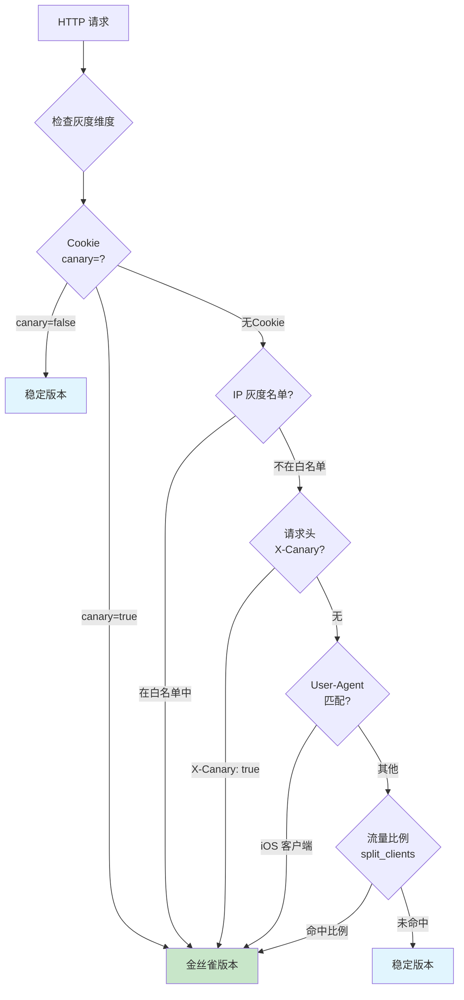
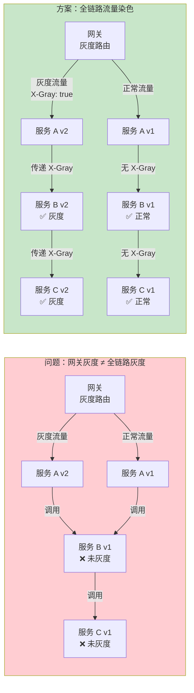
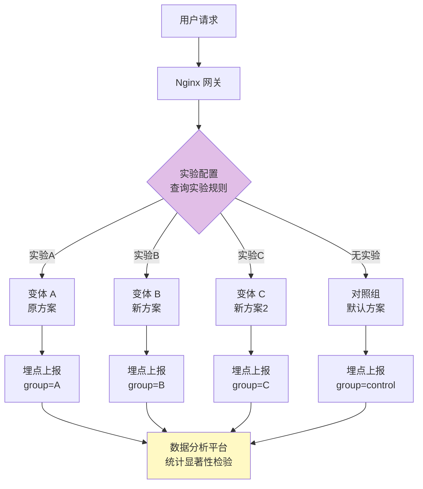
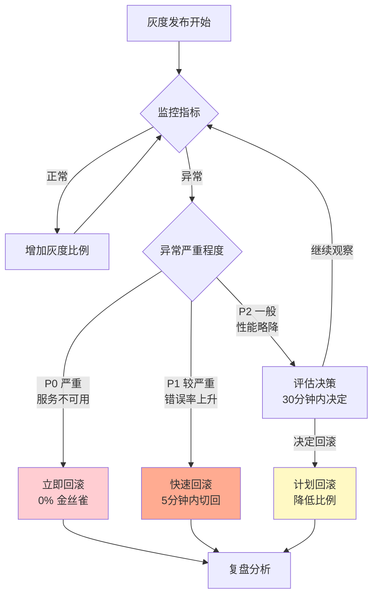
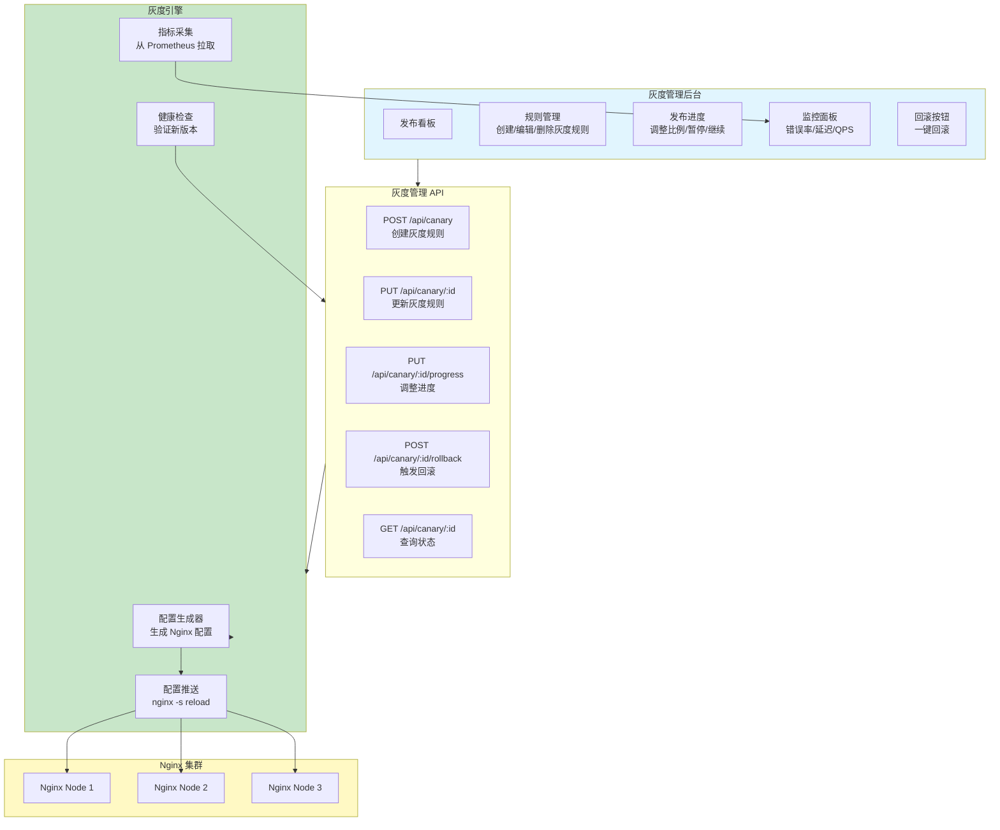

# 灰度发布与 AB 测试

灰度发布（又称金丝雀发布）和 AB 测试是现代软件交付中降低发布风险、验证功能效果的核心手段。Nginx 作为流量网关，能够基于请求特征将流量按比例路由到不同版本的后端服务，实现从 1% 到 100% 的渐进式发布。本文系统讲解 Nginx 灰度发布的完整方案，从基础的比例分流到全链路灰度，再到生产级灰度系统搭建。

---

## 1. 灰度发布概念与策略

### 1.1 发布策略对比

```
常见发布策略：

1. 全量发布（Big Bang / Rolling Update）
   ┌─────────┐                    ┌─────────┐
   │ v1 100% │  ─── 一键切换 ───→ │ v2 100% │
   └─────────┘                    └─────────┘
   风险：高（无法逐步验证，回滚慢）

2. 蓝绿部署（Blue-Green Deployment）
   ┌─────────┐                    ┌─────────┐
   │ Blue v1 │  ─── 切换流量 ───→ │ Green v2│
   │  100%   │                    │  100%   │
   └─────────┘                    └─────────┘
   风险：中（瞬间切换，但可快速回切）

3. 金丝雀发布（Canary Release）
   ┌─────────┐      ┌─────────┐
   │ v1 95%  │      │ v2 5%   │ ← 先小流量验证
   └─────────┘      └─────────┘
        ↓ 逐步放量
   ┌─────────┐      ┌─────────┐
   │ v1 50%  │      │ v2 50%  │ ← 扩大验证范围
   └─────────┘      └─────────┘
        ↓ 继续放量
   ┌─────────┐      ┌─────────┐
   │ v1 0%   │      │ v2 100% │ ← 全量发布
   └─────────┘      └─────────┘
   风险：低（渐进式，可随时回滚）

4. 灰度发布（Gray Release / 渐进式发布）
   与金丝雀发布类似，但更强调按维度分流：
   · 按用户维度（VIP 用户先体验）
   · 按地域维度（特定城市先发布）
   · 按设备维度（iOS 先于 Android）
   · 按流量百分比（1% → 10% → 50% → 100%）
```

### 1.2 灰度发布 vs AB 测试


| 维度 | 灰度发布 | AB 测试 |
|------|---------|---------|
| 目标 | 降低发布风险 | 验证功能效果 |
| 关注指标 | 错误率、延迟、资源 | 转化率、点击率、留存 |
| 持续时间 | 数小时至数天 | 数天至数周 |
| 流量策略 | 渐进式扩大 | 固定比例并行 |
| 决策方式 | 人工/自动 | 统计显著性检验 |
| 回滚 | 随时 | 实验结束后切换 |
| 共享机制 | split_clients / map 变量路由 / upstream 权重 |

---

## 2. split_clients 比例分流

### 2.1 split_clients 基础

`split_clients` 是 Nginx 内置的比例分流指令，基于请求特征（如 IP、Cookie、URI）计算哈希值，按配置比例将请求分配到不同变量值。

```nginx
# split_clients 语法
# split_clients "${string}" ${variable}
#     percentage%  value1
#     percentage%  value2
#     *            default_value;

# string:  用于哈希的字符串（决定分组的键）
# variable: 分流结果存入的变量名
# percentage: 百分比（支持小数）
# *: 剩余流量（百分比对不齐时的兜底）

# 注意：percentage 总和应 <= 100%
# 哈希函数：MurmurHash2（分布均匀、确定性）
```

### 2.2 基于比例的灰度发布

```nginx
# 基础灰度：5% 流量到新版本
split_clients "${remote_addr}" $backend_version {
    5%    canary;     # 5% 流量走金丝雀版本
    *     stable;     # 95% 流量走稳定版本
}

# 定义上游服务
upstream stable {
    server 192.168.1.10:8080;
    server 192.168.1.11:8080;
}

upstream canary {
    server 192.168.1.20:8080;
}

server {
    listen 80;
    server_name example.com;

    location / {
        # 根据 $backend_version 选择上游
        proxy_pass http://$backend_version;

        # 添加灰度标识头（方便后端识别）
        add_header X-Backend-Version $backend_version always;

        # 传递给后端（用于日志）
        proxy_set_header X-Canary $backend_version;
    }
}
```

### 2.3 基于 Cookie 的灰度（用户一致性）

```nginx
# 基于 Cookie 实现用户固定路由到同一版本
# 避免同一用户看到不同版本导致体验不一致

map $cookie_canary $backend_version {
    default     $split_version;
    "canary"    canary;       # Cookie 明确指定金丝雀
    "stable"    stable;       # Cookie 明确指定稳定版
}

split_clients "${remote_addr}UA:${http_user_agent}" $split_version {
    10%    canary;
    *      stable;
}

upstream stable {
    server 192.168.1.10:8080;
    server 192.168.1.11:8080;
}

upstream canary {
    server 192.168.1.20:8080;
}

server {
    listen 80;
    server_name example.com;

    location / {
        proxy_pass http://$backend_version;
        proxy_set_header X-Canary $backend_version;
        proxy_set_header Host $host;
    }
}
```

### 2.4 灰度比例动态调整

```nginx
# 通过文件引入实现灰度比例热更新
# 不需要修改主配置文件，只需修改灰度比例文件

# /etc/nginx/canary-ratio.conf — 灰度比例配置文件
# 修改此文件后 nginx -s reload 即可生效
split_clients "${remote_addr}" $canary_weight {
    10%    canary;     # 修改此处调整灰度比例
    *      stable;
}

# 主配置引入
http {
    include /etc/nginx/canary-ratio.conf;

    upstream stable {
        server 192.168.1.10:8080;
    }

    upstream canary {
        server 192.168.1.20:8080;
    }

    server {
        listen 80;

        location / {
            proxy_pass http://$canary_weight;
        }
    }
}
```

```bash
# 灰度比例调整脚本
#!/bin/bash
# /usr/local/bin/canary-adjust.sh
# 用法: canary-adjust.sh <percentage>

RATIO=$1
CONF_FILE="/etc/nginx/canary-ratio.conf"

if [[ ! "$RATIO" =~ ^[0-9]+$ ]] || [ "$RATIO" -lt 0 ] || [ "$RATIO" -gt 100 ]; then
    echo "Usage: $0 <0-100>"
    exit 1
fi

# 生成新配置
cat > "$CONF_FILE" << EOF
split_clients "\${remote_addr}" \$canary_weight {
    ${RATIO}%    canary;
    *            stable;
}
EOF

# 验证并重载
if nginx -t 2>&1; then
    nginx -s reload
    echo "Canary ratio updated to ${RATIO}%"
else
    echo "ERROR: nginx config test failed"
    exit 1
fi
```

---

## 3. map + 变量路由

### 3.1 map 指令灰度路由

`map` 指令比 `split_clients` 更灵活，可以根据请求的多个维度组合判断灰度路由。



### 3.2 多维度灰度路由配置

```nginx
# 多维度灰度路由：Cookie > IP > Header > UA > 比例

# ===== 1. IP 灰度名单 =====
# 注意：map 不支持 CIDR，需要使用 geo
geo $remote_addr $ip_canary {
    default         0;
    10.0.1.100      1;
    10.0.1.101      1;
    192.168.10.0/24 1;
    172.16.0.0/16   1;
}

# ===== 2. UA 灰度规则 =====
map $http_user_agent $ua_canary {
    default         0;
    ~*MyApp/3\.0     1;    # 3.0 版本客户端走金丝雀
    ~*iOS           1;     # iOS 客户端先发
}

# ===== 3. 比例分流 =====
split_clients "${remote_addr}" $ratio_canary {
    5%    1;
    *     0;
}

# ===== 4. 综合路由决策 =====
# 优先级：Cookie > IP > Header > UA > 比例
map $cookie_canary $cookie_decision {
    default     "";
    "true"      "canary";
    "false"     "stable";
    "1"         "canary";
    "0"         "stable";
}

map $http_x_canary $header_decision {
    default     "";
    "true"      "canary";
    "1"         "canary";
}

# 最终决策：组合所有条件
map "$cookie_decision|$ip_canary|$header_decision|$ua_canary|$ratio_canary" $backend_version {
    default                     stable;

    # Cookie 最高优先级（使用正则匹配，因为 map 不支持 * 通配符）
    ~^canary\|                  canary;
    ~^stable\|                  stable;

    # IP 灰度名单
    ~^\|1\|                     canary;

    # Header 灰度
    ~^\|0\|canary               canary;

    # UA 灰度
    ~^\|0\|\|1\|                canary;

    # 比例灰度
    ~^\|0\|\|0\|1$              canary;
}

upstream stable {
    server 192.168.1.10:8080;
    server 192.168.1.11:8080;
}

upstream canary {
    server 192.168.1.20:8080;
}

server {
    listen 80;
    server_name example.com;

    location / {
        proxy_pass http://$backend_version;
        proxy_set_header X-Canary $backend_version;
        proxy_set_header X-Forwarded-For $proxy_add_x_forwarded_for;
        proxy_set_header Host $host;
    }
}
```

### 3.3 基于用户 ID 的灰度

```nginx
# 基于用户 ID 尾号进行灰度
# 适用于需要按用户维度精确控制的场景

# 从 Cookie 中提取用户 ID
map $cookie_user_id $user_id_suffix {
    default     "";
    ~*(\d)$     $1;     # 取最后一位数字
}

# 根据用户 ID 尾号决定版本
map $user_id_suffix $user_version {
    default     stable;
    "0"         canary;     # 尾号 0 的用户走金丝雀
    "1"         canary;     # 尾号 1 的用户走金丝雀
    # 10% 的流量（尾号 0-9 中的 2 个 → 20%）
}

# 或者基于用户 ID 的哈希值
map $cookie_user_id $hash_version {
    default     stable;
    # 使用哈希取模实现精确比例
}

# 更精确的方式：使用 Lua 计算
# 见 OpenResty 章节
```

### 3.4 基于地理位置的灰度

```nginx
# 基于地理位置的灰度发布
# 先在特定城市验证，再逐步扩大范围

geoip2 /usr/share/GeoIP/GeoLite2-City.mmdb {
    $geoip2_city_name city names en;
    $geoip2_region_name subdivisions 0 names en;
    $geoip2_country_code country iso_code;
}

# 城市灰度规则
map $geoip2_city_name $geo_version {
    default         stable;
    "Shanghai"      canary;     # 上海先发
    "Beijing"       canary;     # 北京先发
    "Shenzhen"      canary;     # 深圳先发
}

# 省份灰度规则
map $geoip2_region_name $region_version {
    default         stable;
    "Guangdong"     canary;     # 广东省先发
    "Zhejiang"      canary;     # 浙江省先发
}

# 综合决策
map "$geo_version|$region_version" $geo_canary {
    default         stable;
    "canary|*"      canary;
    "*|canary"      canary;
}

upstream stable {
    server 192.168.1.10:8080;
}

upstream canary {
    server 192.168.1.20:8080;
}

server {
    listen 80;
    server_name example.com;

    location / {
        proxy_pass http://$geo_canary;
    }
}
```

---

## 4. 权重灰度与蓝绿部署

### 4.1 upstream 权重灰度

```nginx
# 方式一：通过 upstream 权重实现灰度
# 优点：配置简单，Nginx 原生支持
# 缺点：粒度粗，只能按连接数比例分配

upstream backend {
    # 稳定版：90% 权重
    server 192.168.1.10:8080 weight=90;
    server 192.168.1.11:8080 weight=90;

    # 金丝雀版：10% 权重
    server 192.168.1.20:8080 weight=10;
}

server {
    listen 80;
    server_name example.com;

    location / {
        proxy_pass http://backend;

        # 通过响应头标识后端版本（方便调试）
        add_header X-Server-Port $upstream_addr always;
    }
}
```

```
upstream 权重灰度流量分配：

权重配置：
  stable-1:  weight=90  ─┐
  stable-2:  weight=90  ─┤─→ 180/200 = 90% 流量
                          │
  canary-1:  weight=10  ─┘─→  10/200 =  5% 流量
  canary-2:  weight=10  ─┘─→  10/200 =  5% 流量

逐步放量过程：
  第 1 步：weight=95 / weight=5    → 5% 灰度
  第 2 步：weight=90 / weight=10   → 10% 灰度
  第 3 步：weight=80 / weight=20   → 20% 灰度
  第 4 步：weight=50 / weight=50   → 50% 灰度
  第 5 步：weight=0  / weight=100  → 100% 发布

注意：权重基于请求数的分配比例，在 round-robin 中按权重比例分配请求
```

### 4.2 蓝绿部署

```nginx
# 蓝绿部署：两套完整环境，通过 upstream 切换

# 蓝色环境（当前生产版本）
upstream blue {
    server 192.168.1.10:8080;
    server 192.168.1.11:8080;
    server 192.168.1.12:8080;
}

# 绿色环境（新版本）
upstream green {
    server 192.168.1.20:8080;
    server 192.168.1.21:8080;
    server 192.168.1.22:8080;
}

# 当前活跃环境（通过变量控制）
# 修改 $active_env 即可切换蓝绿
map $host $active_env {
    default blue;    # 当前指向蓝色环境
    # 切换时改为 green
}

server {
    listen 80;
    server_name example.com;

    location / {
        proxy_pass http://$active_env;
        proxy_set_header Host $host;
        proxy_set_header X-Real-IP $remote_addr;
        proxy_set_header X-Deploy-Env $active_env;
    }
}
```

```bash
# 蓝绿切换脚本
#!/bin/bash
# /usr/local/bin/blue-green-switch.sh

CURRENT=$(grep 'default' /etc/nginx/deploy-env.conf | awk '{print $2}')
CONF_FILE="/etc/nginx/deploy-env.conf"

if [ "$CURRENT" = "blue" ]; then
    NEW_ENV="green"
elif [ "$CURRENT" = "green" ]; then
    NEW_ENV="blue"
else
    echo "Unknown current environment: $CURRENT"
    exit 1
fi

echo "Switching from $CURRENT to $NEW_ENV..."

# 更新配置
cat > "$CONF_FILE" << EOF
map \$host \$active_env {
    default ${NEW_ENV};
}
EOF

# 验证配置
if nginx -t 2>&1; then
    nginx -s reload
    echo "Switched to $NEW_ENV environment successfully"
else
    echo "ERROR: Config test failed, rolling back"
    cat > "$CONF_FILE" << EOF
map \$host \$active_env {
    default ${CURRENT};
}
EOF
    exit 1
fi
```

### 4.3 蓝绿部署健康检查

```nginx
# 蓝绿部署必须确保新环境健康后才能切换

# 绿色环境健康检查
upstream green {
    server 192.168.1.20:8080;
    server 192.168.1.21:8080;
    server 192.168.1.22:8080;

    # 主动健康检查
    # 需要 nginx-plus 或第三方模块
}

# 使用被动健康检查
upstream green {
    server 192.168.1.20:8080 max_fails=3 fail_timeout=30s;
    server 192.168.1.21:8080 max_fails=3 fail_timeout=30s;
    server 192.168.1.22:8080 max_fails=3 fail_timeout=30s;
}

# 切换前手动验证脚本
#!/bin/bash
# /usr/local/bin/health-check-green.sh

GREEN_SERVERS=("192.168.1.20:8080" "192.168.1.21:8080" "192.168.1.22:8080")
HEALTH_PATH="/health"

all_healthy=true

for server in "${GREEN_SERVERS[@]}"; do
    status=$(curl -s -o /dev/null -w "%{http_code}" "http://${server}${HEALTH_PATH}")
    if [ "$status" != "200" ]; then
        echo "UNHEALTHY: $server returned $status"
        all_healthy=false
    else
        echo "HEALTHY: $server"
    fi
done

if $all_healthy; then
    echo "All green servers are healthy. Safe to switch."
    exit 0
else
    echo "Some green servers are unhealthy. DO NOT switch."
    exit 1
fi
```

---

## 5. 全链路灰度

### 5.1 全链路灰度问题



### 5.2 流量染色方案

```nginx
# 全链路灰度 - 网关层流量染色

# 1. 灰度规则判断
split_clients "${remote_addr}" $is_canary {
    10%    "true";
    *      "false";
}

# 2. 综合灰度判断（Cookie 优先）
map "$cookie_gray|$is_canary" $gray_flag {
    default         "false";
    "true|*"        "true";     # Cookie 明确指定
    "1|*"           "true";
    "*|true"        "true";     # 比例命中
}

# 3. 根据灰度标记选择上游
map $gray_flag $gray_backend {
    "true"    canary;
    "false"   stable;
}

upstream stable {
    server 192.168.1.10:8080;
}

upstream canary {
    server 192.168.1.20:8080;
}

server {
    listen 80;
    server_name api.example.com;

    location / {
        # 根据灰度标记路由
        proxy_pass http://$gray_backend;

        # 关键：传递灰度标记给后端
        proxy_set_header X-Gray-Tag $gray_flag;

        # 后端服务需要读取此头，并在后续调用中继续传递
        # 形成全链路灰度
    }
}
```

### 5.3 后端服务灰度标记传递

```nginx
# 后端服务（服务 B）的 Nginx 配置
# 读取上游传递的灰度标记，继续传递并路由

# 从请求头读取灰度标记
map $http_x_gray_tag $service_b_backend {
    default     stable_b;
    "true"      canary_b;
}

upstream stable_b {
    server 192.168.2.10:8080;
}

upstream canary_b {
    server 192.168.2.20:8080;
}

server {
    listen 8080;

    location / {
        proxy_pass http://$service_b_backend;

        # 继续传递灰度标记
        proxy_set_header X-Gray-Tag $http_x_gray_tag;

        # 传递给服务 C 时也带上
        # 后端代码也需要在调用下游时传递此头
    }
}
```

```
全链路灰度标记传递流程：

客户端请求
    │
    ▼
┌─────────────┐
│   Nginx GW  │ ← 判断灰度规则，设置 X-Gray-Tag
│   (网关)     │
└──────┬──────┘
       │ X-Gray-Tag: true
       ▼
┌─────────────┐
│  服务 A v2  │ ← 读取 X-Gray-Tag，选择 v2 版本
│  (灰度)     │
└──────┬──────┘
       │ X-Gray-Tag: true（代码中继续传递）
       ▼
┌─────────────┐
│  服务 B v2  │ ← 读取 X-Gray-Tag，选择 v2 版本
│  (灰度)     │
└──────┬──────┘
       │ X-Gray-Tag: true
       ▼
┌─────────────┐
│  服务 C v2  │ ← 读取 X-Gray-Tag，选择 v2 版本
│  (灰度)     │
└─────────────┘

注意事项：
1. 每个服务的网关都需要配置灰度路由规则
2. 后端代码必须在调用下游服务时传递 X-Gray-Tag
3. 数据库/缓存等共享资源需要考虑隔离
4. 异步消息队列也需要传递灰度标记
```

### 5.4 全链路灰度数据隔离

```nginx
# 全链路灰度数据隔离方案

# 方案一：不同环境使用不同数据库
# 通过 X-Gray-Tag 路由到不同的数据库代理

# 稳定版数据库
upstream db_stable {
    server 192.168.10.10:3306;
}

# 灰度版数据库
upstream db_canary {
    server 192.168.10.20:3306;
}

# 方案二：同一数据库使用不同 Schema/前缀
# 通过应用层隔离

# 方案三：Redis 使用不同 DB 号
# 稳定版使用 db0，灰度版使用 db1
# 在后端应用配置中根据 X-Gray-Tag 选择

# 方案四：使用 Nginx Stream 代理不同 Redis
stream {
    upstream redis_stable {
        server 192.168.10.10:6379;
    }

    upstream redis_canary {
        server 192.168.10.20:6379;
    }

    # 根据来源 IP（灰度服务 IP）路由
    map $remote_addr $redis_backend {
        default         redis_stable;
        192.168.1.20    redis_canary;    # 灰度服务 IP
    }

    server {
        listen 6379;
        proxy_pass $redis_backend;
    }
}
```

---

## 6. AB 测试实现

### 6.1 AB 测试架构



### 6.2 Nginx AB 测试配置

```nginx
# AB 测试：多个变体并行

# 实验规则：通过外部文件管理
# /etc/nginx/ab-experiments.conf

# 实验 1：首页布局测试（3 个变体）
split_clients "${remote_addr}URI:${request_uri}" $home_experiment {
    33%    variant_a;       # 变体 A
    33%    variant_b;       # 变体 B
    *      control;         # 对照组
}

# 实验 2：购买按钮颜色测试
split_clients "${cookie_user_id}" $button_experiment {
    50%    red_button;
    *      green_button;
}

# upstream 定义
upstream variant_a {
    server 192.168.1.10:8080;   # 首页布局 A
}

upstream variant_b {
    server 192.168.1.11:8080;   # 首页布局 B
}

upstream control {
    server 192.168.1.12:8080;   # 对照组
}

server {
    listen 80;
    server_name example.com;

    # 首页 AB 测试
    location = / {
        proxy_pass http://$home_experiment;
        proxy_set_header X-Experiment-Group $home_experiment;

        # 设置 Cookie 确保用户看到一致版本
        add_header Set-Cookie "home_exp=$home_experiment; Path=/; Max-Age=86400" always;
    }

    # 商品页面 AB 测试
    location /products/ {
        # 根据 Cookie 确定分组（保持一致性）
        set $product_backend $cookie_product_exp;
        if ($product_backend = "") {
            set $product_backend $home_experiment;
        }

        proxy_pass http://$product_backend;
        proxy_set_header X-Experiment-Group $product_backend;
    }
}
```

### 6.3 复杂 AB 测试：基于用户特征分层

```nginx
# 高级 AB 测试：根据用户特征分层抽样
# 确保实验组和对照组的用户特征分布均衡

# 1. 用户分层
map $cookie_vip_level $user_segment {
    default     "normal";
    "1"         "silver";
    "2"         "gold";
    "3"         "platinum";
}

# 2. 在每个分层内按比例分流
# 使用 Lua 实现更精细的控制
# 这里用 map 模拟

# 普通用户：50/50
map "$user_segment|$cookie_user_id" $ab_group_normal {
    default     control;
    "~*normal(.+)1$"   experiment;    # 以 1 结尾 → 实验组
    "~*normal(.+)3$"   experiment;    # 以 3 结尾 → 实验组
    "~*normal(.+)5$"   experiment;    # 以 5 结尾 → 实验组
    "~*normal(.+)7$"   experiment;    # 以 7 结尾 → 实验组
    "~*normal(.+)9$"   experiment;    # 以 9 结尾 → 实验组
}

# VIP 用户：20/80（VIP 用户较少，实验比例也较低）
map "$user_segment|$cookie_user_id" $ab_group_vip {
    default     control;
    "~*silver(.+)5$"   experiment;
    "~*gold(.+)5$"     experiment;
}

# 合并结果
map "$user_segment|$ab_group_normal|$ab_group_vip" $final_ab_group {
    default             control;
    "normal|experiment|"  experiment;
    "|experiment"        experiment;
}

upstream control {
    server 192.168.1.10:8080;
}

upstream experiment {
    server 192.168.1.20:8080;
}

server {
    listen 80;
    server_name example.com;

    location / {
        proxy_pass http://$final_ab_group;
        proxy_set_header X-AB-Group $final_ab_group;
        proxy_set_header X-User-Segment $user_segment;
    }
}
```

---

## 7. 回滚机制

### 7.1 灰度回滚策略



### 7.2 灰度回滚配置

```nginx
# 灰度回滚：将金丝雀比例降为 0

# 方式一：修改 split_clients 比例
# /etc/nginx/canary-ratio.conf
split_clients "${remote_addr}" $canary_weight {
    0%     canary;     # 回滚：0% 灰度
    *      stable;
}

# 方式二：通过变量开关立即切换
# /etc/nginx/canary-switch.conf
map $host $canary_enabled {
    default 0;     # 0=关闭灰度，1=开启灰度
}

# 在主配置中使用
map "$canary_enabled|$canary_weight" $final_backend {
    default         stable;
    "1|canary"      canary;     # 开关开启且命中比例
    "0|*"           stable;     # 开关关闭，全部走稳定版
    "1|stable"      stable;     # 开关开启但未命中比例
}

# 方式三：紧急回滚 - 直接修改 upstream
upstream backend {
    server 192.168.1.10:8080;    # 稳定版
    server 192.168.1.11:8080;    # 稳定版
    # server 192.168.1.20:8080;  # 金丝雀版（注释掉 = 回滚）
}
```

### 7.3 自动化灰度回滚

```bash
#!/bin/bash
# /usr/local/bin/canary-rollback.sh
# 基于监控指标的自动回滚

PROMETHEUS_URL="http://localhost:9090"
CANARY_CONF="/etc/nginx/canary-ratio.conf"
CURRENT_RATIO=$(grep -oP '\d+(?=%\s+canary)' "$CANARY_CONF")

# 查询金丝雀版本错误率
canary_error_rate=$(curl -s "${PROMETHEUS_URL}/api/v1/query" \
    --data-urlencode 'query=sum(rate(http_requests_total{version="canary",status=~"5.."}[5m])) / sum(rate(http_requests_total{version="canary"}[5m])) * 100' \
    | jq -r '.data.result[0].value[1] // "0"')

# 查询稳定版错误率
stable_error_rate=$(curl -s "${PROMETHEUS_URL}/api/v1/query" \
    --data-urlencode 'query=sum(rate(http_requests_total{version="stable",status=~"5.."}[5m])) / sum(rate(http_requests_total{version="stable"}[5m])) * 100' \
    | jq -r '.data.result[0].value[1] // "0"')

echo "Canary error rate: ${canary_error_rate}%"
echo "Stable error rate: ${stable_error_rate}%"
echo "Current canary ratio: ${CURRENT_RATIO}%"

# 回滚条件：
# 1. 金丝雀错误率 > 5%
# 2. 金丝雀错误率 > 稳定版 3 倍以上
THRESHOLD=5
MULTIPLE=3

should_rollback=false

if (( $(echo "$canary_error_rate > $THRESHOLD" | bc -l) )); then
    echo "ALERT: Canary error rate exceeds threshold (${THRESHOLD}%)"
    should_rollback=true
fi

if (( $(echo "$canary_error_rate > $stable_error_rate * $MULTIPLE" | bc -l) )); then
    echo "ALERT: Canary error rate is ${MULTIPLE}x higher than stable"
    should_rollback=true
fi

if $should_rollback; then
    echo "ROLLING BACK: Setting canary ratio to 0%"

    cat > "$CANARY_CONF" << EOF
split_clients "\${remote_addr}" \$canary_weight {
    0%     canary;
    *      stable;
}
EOF

    if nginx -t 2>&1; then
        nginx -s reload
        echo "Rollback completed successfully"

        # 发送告警
        curl -s -X POST "https://hooks.slack.com/services/YOUR/WEBHOOK/URL" \
            -H "Content-Type: application/json" \
            -d "{\"text\":\":rotating_light: Canary rollback triggered!\\nCanary error: ${canary_error_rate}%\\nStable error: ${stable_error_rate}%\\nPrevious ratio: ${CURRENT_RATIO}%\"}"
    else
        echo "ERROR: Nginx config test failed after rollback"
        exit 1
    fi
else
    echo "All metrics within acceptable range. No rollback needed."
fi
```

---

## 8. 完整灰度系统

### 8.1 灰度管理后台设计



### 8.2 灰度规则配置模板

```nginx
# /etc/nginx/canary/rules.d/api-v2.conf
# 灰度规则文件：每个灰度发布一个文件

# ===== 灰度规则元信息 =====
# 规则 ID: CANARY-2026-001
# 功能名称: API v2 新版接口
# 创建时间: 2026-06-05
# 创建人: zhangsan
# 目标: 验证 API v2 的性能和兼容性

# ===== 灰度策略 =====

# 1. 白名单优先
geo $remote_addr $wl_canary_001 {
    default         0;
    10.0.1.100      1;     # 开发者测试 IP
    10.0.1.101      1;     # QA 测试 IP
}

# 2. Cookie 覆盖
map $cookie_canary_001 $cookie_canary_001 {
    default     "";
    "true"      "canary";
    "false"     "stable";
}

# 3. 比例分流
split_clients "${remote_addr}" $ratio_canary_001 {
    5%     canary;     # 当前灰度比例
    *      stable;
}

# 4. 综合决策
map "$cookie_canary_001|$wl_canary_001|$ratio_canary_001" $canary_001_backend {
    default         stable;

    # Cookie 最高优先级
    "canary|*"      canary;
    "stable|*"      stable;

    # 白名单
    "|1|*"          canary;

    # 比例
    "|0|canary"     canary;
    "|0|stable"     stable;
}

# ===== 路由配置 =====

upstream stable_api_v2 {
    server 192.168.1.10:8080;
    server 192.168.1.11:8080;
}

upstream canary_api_v2 {
    server 192.168.1.20:8080;
}

# 在 server 块中引入
# location /api/v2/ {
#     proxy_pass http://$canary_001_backend;
#     proxy_set_header X-Canary-Id "CANARY-2026-001";
#     proxy_set_header X-Canary-Group $canary_001_backend;
# }
```

### 8.3 灰度进度自动推进

```bash
#!/bin/bash
# /usr/local/bin/canary-progress.sh
# 灰度进度自动推进脚本

CANARY_ID=$1
CANARY_CONF="/etc/nginx/canary/rules.d/${CANARY_ID}.conf"
PROMETHEUS_URL="http://localhost:9090"

# 灰度进度阶梯
STEPS=(1 5 10 20 50 100)
CURRENT_RATIO=$(grep -oP '\d+(?=%\s+canary)' "$CANARY_CONF" | head -1)

# 查找当前步骤索引
current_step=0
for i in "${!STEPS[@]}"; do
    if [ "${STEPS[$i]}" -eq "$CURRENT_RATIO" ]; then
        current_step=$i
        break
    fi
done

# 检查是否已经是 100%
if [ "$CURRENT_RATIO" -eq 100 ]; then
    echo "Already at 100%. Canary release completed."
    exit 0
fi

# 检查金丝雀版本健康状态
canary_error_rate=$(curl -s "${PROMETHEUS_URL}/api/v1/query" \
    --data-urlencode "query=sum(rate(http_requests_total{canary_id=\"${CANARY_ID}\",version=\"canary\",status=~\"5..\"}[5m])) / sum(rate(http_requests_total{canary_id=\"${CANARY_ID}\",version=\"canary\"}[5m])) * 100" \
    | jq -r '.data.result[0].value[1] // "0"')

canary_p99=$(curl -s "${PROMETHEUS_URL}/api/v1/query" \
    --data-urlencode "query=histogram_quantile(0.99, sum(rate(http_request_duration_seconds_bucket{canary_id=\"${CANARY_ID}\",version=\"canary\"}[5m])) by (le))" \
    | jq -r '.data.result[0].value[1] // "0"')

echo "Current ratio: ${CURRENT_RATIO}%"
echo "Canary error rate: ${canary_error_rate}%"
echo "Canary P99 latency: ${canary_p99}s"

# 健康检查阈值
ERROR_THRESHOLD=1.0       # 错误率阈值 1%
LATENCY_THRESHOLD=2.0     # P99 延迟阈值 2s

should_progress=true

if (( $(echo "$canary_error_rate > $ERROR_THRESHOLD" | bc -l) )); then
    echo "ERROR: Canary error rate (${canary_error_rate}%) exceeds threshold (${ERROR_THRESHOLD}%)"
    should_progress=false
fi

if (( $(echo "$canary_p99 > $LATENCY_THRESHOLD" | bc -l) )); then
    echo "ERROR: Canary P99 latency (${canary_p99}s) exceeds threshold (${LATENCY_THRESHOLD}s)"
    should_progress=false
fi

if $should_progress; then
    next_step=$((current_step + 1))
    next_ratio=${STEPS[$next_step]}

    echo "Progressing canary from ${CURRENT_RATIO}% to ${next_ratio}%"

    # 更新配置
    sed -i "s/${CURRENT_RATIO}%\s*canary/${next_ratio}%    canary/" "$CANARY_CONF"

    # 验证并重载
    if nginx -t 2>&1; then
        nginx -s reload
        echo "Canary progressed to ${next_ratio}%"
    else
        echo "ERROR: Config test failed, reverting"
        sed -i "s/${next_ratio}%\s*canary/${CURRENT_RATIO}%    canary/" "$CANARY_CONF"
        exit 1
    fi
else
    echo "Cannot progress: metrics not healthy"
    exit 1
fi
```

### 8.4 灰度发布仪表盘 Nginx 配置

```nginx
# 为灰度发布提供详细的监控指标
# 通过自定义日志格式记录灰度信息

log_format canary_log '$remote_addr - [$time_local] '
                      '"$request" $status $body_bytes_sent '
                      '"$http_referer" "$http_user_agent" '
                      'rt=$request_time '
                      'upstream=$upstream_addr '
                      'canary_id=$http_x_canary_id '
                      'canary_group=$http_x_canary_group '
                      'canary_version=$canary_001_backend';

# 指标暴露端点（配合 Prometheus）
server {
    listen 9145;
    server_name localhost;

    location /metrics {
        content_by_lua_block {
            -- 从共享字典读取灰度指标
            local shared = ngx.shared.canary_stats

            local keys = shared:get_keys(0)
            for _, key in ipairs(keys) do
                local value = shared:get(key)
                ngx.say(string.format('canary_%s %s', key, value))
            end
        }
    }

    location /status {
        default_type application/json;
        content_by_lua_block {
            local cjson = require "cjson"
            local shared = ngx.shared.canary_stats

            local status = {}
            local keys = shared:get_keys(0)
            for _, key in ipairs(keys) do
                status[key] = shared:get(key)
            end

            ngx.say(cjson.encode({
                timestamp = ngx.now(),
                canary_stats = status
            }))
        end
    }
}
```

---

## 9. 实战案例

### 9.1 案例：电商首页改版灰度

```nginx
# 电商首页改版灰度发布

# 1. 灰度规则
# 第一阶段：内部用户 100% → 第二阶段：5% 用户 → 第三阶段：20% → 第四阶段：50% → 第五阶段：100%

# 灰度维度优先级
# Cookie > VIP等级 > 比例

# VIP 用户优先体验
map $cookie_vip_level $vip_canary {
    default     "";
    "3"         "canary";   # 铂金会员优先
    "2"         "canary";   # 黄金会员优先
}

# 比例分流
split_clients "${remote_addr}UA:${http_user_agent}" $home_ratio {
    5%     canary;       # 5% 灰度
    *      stable;
}

# 综合
map "$cookie_home_canary|$vip_canary|$home_ratio" $home_backend {
    default         stable;
    "canary|*"      canary;     # Cookie 指定
    "|canary|*"     canary;     # VIP 用户
    "|0|canary"     canary;     # 比例命中
}

upstream stable {
    server 10.0.1.10:8080;
    server 10.0.1.11:8080;
}

upstream canary {
    server 10.0.2.10:8080;
}

server {
    listen 80;
    server_name shop.example.com;

    # 首页
    location = / {
        proxy_pass http://$home_backend;
        proxy_set_header X-Canary-Group $home_backend;
        proxy_set_header X-Real-IP $remote_addr;

        # 设置 Cookie 确保一致性
        add_header Set-Cookie "home_canary=$home_backend; Path=/; Max-Age=86400" always;
    }

    # API（所有版本共用）
    location /api/ {
        proxy_pass http://api_backend;
        proxy_set_header X-Canary-Group $home_backend;
    }
}
```

### 9.2 案例：API 版本灰度切换

```nginx
# API 版本从 v1 切换到 v2 的灰度发布

# v1 和 v2 使用不同的 URL 前缀
# 灰度期间 v1 和 v2 并行运行

# 灰度策略：通过 Header 指定版本
map $http_x_api_version $api_version {
    default     $default_api_version;
    "1"         v1;
    "2"         v2;
}

# 默认版本（通过配置文件控制）
map $host $default_api_version {
    default v1;    # 当前默认版本
}

upstream v1 {
    server 10.0.1.10:8080;
    server 10.0.1.11:8080;
}

upstream v2 {
    server 10.0.2.10:8080;
    server 10.0.2.11:8080;
}

server {
    listen 80;
    server_name api.example.com;

    # 统一入口，根据版本路由
    location /api/ {
        proxy_pass http://$api_version;
        proxy_set_header X-API-Version $api_version;
        proxy_set_header Host $host;
    }

    # 版本发现端点
    location = /api/version {
        default_type application/json;
        return 200 '{"default":"v1","available":["v1","v2"]}';
    }
}
```

### 9.3 案例：移动端灰度发布

```nginx
# 移动端 App 灰度发布
# 区分 iOS 和 Android，分渠道灰度

# 从 User-Agent 提取平台
map $http_user_agent $mobile_platform {
    default             "";
    ~*iPhone|iPad       "ios";
    ~*Android           "android";
}

# 从自定义 Header 提取 App 版本
map $http_x_app_version $app_version {
    default     "";
    ~*(\d+)\.(\d+)  "$1.$2";
}

# 从自定义 Header 提取渠道
map $http_x_channel $channel {
    default     "official";
    "huawei"    "huawei";
    "xiaomi"    "xiaomi";
    "oppo"      "oppo";
    "vivo"      "vivo";
}

# 灰度规则：iOS 先发，特定渠道先发
map "$mobile_platform|$channel|$cookie_canary_app" $app_backend {
    default                     stable;

    # Cookie 明确指定
    "| |canary"                  canary;
    "| | |canary"                canary;

    # iOS 官方渠道先发
    "ios|official|"              canary;

    # Android 华为渠道灰度
    "android|huawei|"            canary;

    # 内部测试
    "ios|xiaomi|"               canary;
}

upstream stable {
    server 10.0.1.10:8080;
}

upstream canary {
    server 10.0.2.10:8080;
}

server {
    listen 80;
    server_name app.example.com;

    location /api/ {
        proxy_pass http://$app_backend;
        proxy_set_header X-Canary $app_backend;
        proxy_set_header X-Platform $mobile_platform;
        proxy_set_header X-App-Version $http_x_app_version;
        proxy_set_header X-Channel $channel;
    }
}
```

---

## 10. 最佳实践与注意事项

### 10.1 灰度发布最佳实践

```
灰度发布最佳实践清单：

1. 灰度前准备
   □ 确认回滚方案（配置文件/脚本就绪）
   □ 配置监控告警（错误率/延迟/资源）
   □ 准备数据隔离方案
   □ 确保日志可区分版本
   □ 灰度比例文件独立管理

2. 灰度策略
   □ 从 1% 或 5% 开始
   □ 每个阶段观察至少 30 分钟
   □ 逐步扩大：1% → 5% → 10% → 20% → 50% → 100%
   □ 优先使用 Cookie 确保用户一致性
   □ 白名单先行（内部用户先验证）

3. 灰度监控
   □ 金丝雀 vs 稳定版错误率对比
   □ 金丝雀 P99/P95 延迟监控
   □ 业务指标监控（转化率、下单率）
   □ 资源使用率监控（CPU、内存、连接数）
   □ 自动化告警和自动回滚

4. 灰度后验证
   □ 全量发布后持续监控 24 小时
   □ 保留回滚能力至少 48 小时
   □ 更新灰度规则归档
   □ 复盘总结

5. 安全注意事项
   □ 灰度标记不可被外部伪造（校验签名）
   □ 灰度接口权限与生产一致
   □ 灰度数据不泄露到生产
   □ 灰度版本的安全补丁与生产同步
```

### 10.2 灰度发布常见问题

```
常见问题与解决方案：

Q1: 同一用户刷新页面看到不同版本？
A: 使用 Cookie 或用户 ID 固定灰度分组。
   split_clients 基于 remote_addr 虽然稳定，
   但 CDN/代理可能导致 IP 变化。
   推荐基于 cookie_user_id 做哈希。

Q2: 灰度流量不均匀？
A: split_clients 使用 MurmurHash2，分布均匀。
   如果不均匀，检查哈希键是否有规律。
   可以加入随机因素：${remote_addr}URI:${request_uri}

Q3: 灰度期间数据不一致？
A: 全链路灰度需要数据隔离。
   数据库使用双写或独立 Schema。
   缓存使用不同前缀或不同 DB。

Q4: 灰度回滚后用户报错？
A: 回滚时确保：
   - 清除灰度版本设置的 Cookie
   - 长连接优雅断开
   - 异步任务能处理版本回退

Q5: 多个灰度同时进行？
A: 每个灰度使用独立的规则 ID 和变量。
   注意灰度之间不能互相影响。
   使用独立的配置文件管理。

Q6: 灰度比例调整时请求中断？
A: nginx -s reload 是优雅重载。
   旧 worker 处理完当前请求后退出。
   新 worker 使用新配置。
   不会中断已建立的连接。
```

---

## 参考资源

- [Nginx split_clients 官方文档](https://nginx.org/en/docs/http/ngx_http_split_clients_module.html)
- [Nginx map 官方文档](https://nginx.org/en/docs/http/ngx_http_map_module.html)
- [Nginx upstream 官方文档](https://nginx.org/en/docs/http/ngx_http_upstream_module.html)
- [蓝绿部署 - Martin Fowler](https://martinfowler.com/bliki/BlueGreenDeployment.html)
- [金丝雀发布 - Martin Fowler](https://martinfowler.com/bliki/CanaryRelease.html)
- [Nginx 灰度发布方案](https://www.nginx.com/blog/deploying-nginx-plus-as-an-api-gateway-part-2/)
- [Feature Flags 与灰度发布](https://martinfowler.com/articles/feature-toggles.html)
- [OpenResty 动态路由](https://openresty.org/en/)
