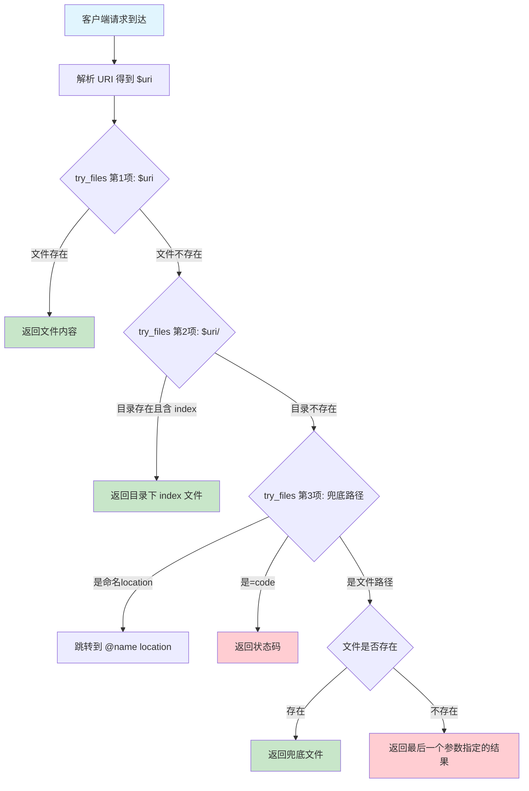
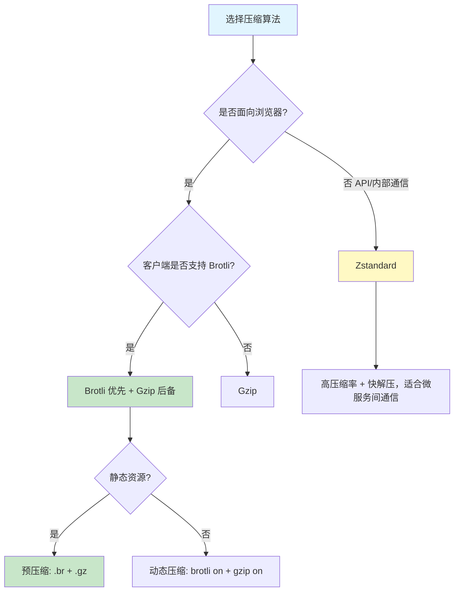

# 静态文件服务与 Gzip 压缩

Nginx 诞生之初就是一个高性能的静态文件服务器，至今仍是全球最流行的 Web 服务器之一。静态文件服务看似简单，但要在生产环境中做到极致性能，需要深入理解文件查找机制、零拷贝传输、压缩算法选择、缓存头配置等核心知识。本文将从底层原理出发，系统讲解 Nginx 静态文件服务的每一个关键环节。

## 1. 静态文件服务配置

### 1.1 root 指令

`root` 指令是 Nginx 中最基础的静态文件配置方式，它为请求指定文档根目录。当请求到达时，Nginx 将请求 URI 附加到 root 路径后面，形成完整的文件路径：

```nginx
server {
    listen 80;
    server_name example.com;
    root /var/www/html;

    # 请求 /images/logo.png → /var/www/html/images/logo.png
    # 请求 /css/style.css → /var/www/html/css/style.css
    location / {
        try_files $uri $uri/ =404;
    }
}
```

`root` 指令可以出现在 `http`、`server`、`location` 三个层级，遵循就近原则：

```nginx
server {
    root /var/www/default;  # 默认根目录

    location /app1/ {
        root /var/www/app1;  # /app1/ 请求使用此目录
        # 请求 /app1/index.html → /var/www/app1/app1/index.html
    }

    location /app2/ {
        root /var/www/app2;
        # 请求 /app2/index.html → /var/www/app2/app2/index.html
    }

    location /images/ {
        # 未指定 root，继承 server 级别
        # 请求 /images/photo.jpg → /var/www/default/images/photo.jpg
    }
}
```

::: warning root 路径拼接规则
`root` 指令的关键特性是 **URI 完整拼接到 root 路径后**。这意味着 `location /app1/` 配合 `root /var/www/app1` 时，请求 `/app1/index.html` 对应的文件路径是 `/var/www/app1/app1/index.html`，而不是 `/var/www/app1/index.html`。如果想让文件直接放在 `/var/www/app1/` 下，需要使用 `alias` 指令。
:::

### 1.2 alias 指令

`alias` 指令与 `root` 的关键区别在于：`alias` 会将 location 匹配的部分替换掉，而不是简单追加：

```nginx
server {
    # root 方式
    location /app1/ {
        root /var/www/app1;
        # /app1/index.html → /var/www/app1/app1/index.html
    }

    # alias 方式
    location /app2/ {
        alias /var/www/app2/;
        # /app2/index.html → /var/www/app2/index.html
    }

    # alias 适合将 URL 路径映射到完全不同的目录
    location /static/ {
        alias /data/assets/public/;
        # /static/css/style.css → /data/assets/public/css/style.css
    }
}
```

root 与 alias 的核心差异：

| 特性 | root | alias |
|------|------|-------|
| 路径拼接方式 | root + 完整URI | root + URI去掉location匹配部分 |
| 可用层级 | http/server/location | 仅 location |
| 正则location支持 | 支持 | 需要捕获组配合 |
| 末尾斜杠 | 可选 | location和alias必须一致 |
| 性能 | 略优（少一次字符串操作） | 略差 |

正则 location 中使用 alias 需要捕获组：

```nginx
# 正则 location + alias
location ~ ^/download/(.*)$ {
    alias /data/files/$1;
    # /download/report.pdf → /data/files/report.pdf
    # /download/2024/data.csv → /data/files/2024/data.csv
}

# 命名捕获组
location ~ ^/user/(?<username>\w+)/avatar/(.*)$ {
    alias /home/$username/public/avatar/$2;
}
```

::: important alias 末尾斜杠规则
当 `location` 以斜杠结尾时，`alias` 也必须以斜杠结尾；反之亦然。不匹配会导致路径错误：

```nginx
# 错误：location 有斜杠但 alias 没有
location /static/ {
    alias /data/files;    # 错误！访问 /static/foo.css 会找 /data/filesfoo.css
}

# 正确：两者都带斜杠
location /static/ {
    alias /data/files/;   # 正确：/static/foo.css → /data/files/foo.css
}
```
:::

### 1.3 try_files 指令

`try_files` 指令按顺序尝试多个文件路径，返回第一个找到的文件。这是处理静态文件查找、回退逻辑的核心指令：

```nginx
# 基本用法：尝试文件 → 尝试目录 → 返回404
location / {
    try_files $uri $uri/ =404;
}

# 回退到默认文件
location /images/ {
    try_files $uri /images/default.png;
}

# 多级回退
location /assets/ {
    root /var/www;
    try_files $uri $uri.gz /assets/fallback.html @proxy;
}

location @proxy {
    proxy_pass http://backend;
}
```

`try_files` 的完整查找流程如下：



SPA 应用的 try_files 配置：

```nginx
# Vue Router / React Router History 模式
server {
    listen 80;
    server_name spa.example.com;
    root /var/www/spa;
    index index.html;

    location / {
        # 所有请求先尝试找文件，找不到则返回 index.html
        # 由前端路由接管页面渲染
        try_files $uri $uri/ /index.html;
    }

    # 静态资源不需要回退到 index.html
    location ~* \.(js|css|png|jpg|jpeg|gif|ico|svg|woff2?)$ {
        try_files $uri =404;
        expires 30d;
        add_header Cache-Control "public, immutable";
    }
}
```

::: tip try_files 性能注意
`try_files` 会依次检查每个参数指定的路径是否存在，每次检查都是一次文件系统 `stat()` 系统调用。避免设置过多的回退层级，通常 2-3 层即可。在生产环境中，如果所有文件都在同一磁盘上，额外的 `stat()` 调用开销很小；但如果使用网络文件系统（NFS、CephFS），则需注意延迟累积。
:::

### 1.4 index 指令

`index` 指令定义默认文件列表，当请求以 `/` 结尾时，Nginx 会按顺序查找这些文件：

```nginx
location / {
    index index.html index.htm index.php;
    # 请求 / → 依次查找 index.html, index.htm, index.php
}

# PHP-FPM 场景
location ~ \.php$ {
    fastcgi_pass unix:/run/php/php-fpm.sock;
    fastcgi_param SCRIPT_FILENAME $document_root$fastcgi_script_name;
    include fastcgi_params;
}

# 如果 index 找到 .php 文件，需要内部重定向到 php location
location / {
    index index.php index.html;
    try_files $uri $uri/ =404;
}
```

::: warning index 指令的内部重定向
`index` 指令找到文件后，会触发一次 **内部重定向**。这意味着如果 index 找到了 `index.php`，Nginx 会重新发起一个对 `/index.php` 的内部请求，这个请求会重新匹配 location。这既是 PHP 场景的工作原理，也可能带来意想不到的副作用，比如循环重定向。
:::

## 2. sendfile / tcp_nopush / tcp_nodelay

这三个指令是 Nginx 零拷贝传输和 TCP 优化的核心，理解它们需要从操作系统内核层面入手。

### 2.1 sendfile：零拷贝传输

传统的文件传输需要经过多次数据拷贝：

```
传统 read() + write()：
磁盘 → 内核缓冲区 → 用户空间缓冲区 → Socket缓冲区 → 网卡
       (DMA拷贝)      (CPU拷贝)         (CPU拷贝)      (DMA拷贝)

sendfile()（无 scatter-gather DMA，如旧硬件）：
磁盘 → 内核缓冲区 → Socket缓冲区 → 网卡
       (DMA拷贝)    (CPU拷贝)     (DMA拷贝)

sendfile()（Linux 2.4+ 支持 scatter-gather DMA）：
磁盘 → 内核缓冲区 → 网卡
       (DMA拷贝)    (DMA拷贝，零CPU拷贝)
```

::: info sendfile 工作原理
`sendfile` 系统调用（`sendfile(2)`）让内核直接将文件描述符的数据传输到套接字描述符，无需将数据拷贝到用户空间。

- **Linux 2.2+**：引入 `sendfile`，减少到 2 次 CPU 拷贝（内核缓冲区 → Socket缓冲区仍需 CPU 拷贝）
- **Linux 2.4+**：支持 scatter-gather DMA，当网卡支持 SG-DMA 时，可完全消除 CPU 参与的数据拷贝，实现真正的零拷贝（仅 2 次 DMA 拷贝）

判断当前路径：如果网卡和内核都支持 scatter-gather DMA（绝大多数现代环境），sendfile 走 2 次 DMA 拷贝路径；否则退化为 3 次拷贝路径（2 次 DMA + 1 次 CPU 拷贝）。注意：`sendfile` 的 Nginx 默认值为 `off`，但大多数发行版的默认配置文件会将其设为 `on`。
:::

```nginx
server {
    # 启用 sendfile，减少内核态/用户态切换和数据拷贝
    sendfile on;

    # 对于大文件，sendfile 可能阻塞 worker 进程
    # 可以配合 aio 使用
    location /large-files/ {
        sendfile on;
        aio on;
        directio 5m;  # 大于5MB的文件使用直接I/O
    }
}
```
:::

### 2.2 tcp_nopush：优化数据包发送

`tcp_nopush` 对应 Linux 的 `TCP_CORK` 选项，它告诉内核"先别发送数据，等攒够一个完整的数据包再发"：

```nginx
server {
    sendfile on;
    tcp_nopush on;  # 配合 sendfile 使用
}
```

`tcp_nopush on` 的工作流程：

1. 当 Nginx 开始通过 sendfile 发送响应时，设置 `TCP_CORK`
2. 内核将 HTTP 响应头和文件数据攒到一起
3. 当数据填满一个 MSS（Maximum Segment Size）或 sendfile 完成时，自动拔掉"软木塞"
4. 数据以最大的数据包发送出去，减少小包数量

::: tip sendfile + tcp_nopush 最佳实践
`tcp_nopush` 必须与 `sendfile on` 配合使用才有效果。其核心价值是将 HTTP 响应头（通常较小）和响应体（来自 sendfile 的文件数据）合并到一个 TCP 段中发送，避免"头部单独一个小包 + 体部单独一个包"的浪费。
:::

### 2.3 tcp_nodelay：禁用 Nagle 算法

`tcp_nodelay` 对应 `TCP_NODELAY` 选项，禁用 Nagle 算法。Nagle 算法的本意是将小包攒成大包发送以提升网络利用率，但在低延迟场景（如 WebSocket、实时通信）中会造成不必要的延迟：

```nginx
server {
    sendfile on;
    tcp_nopush on;
    tcp_nodelay on;  # 对于长连接场景开启
}
```

::: important tcp_nopush 与 tcp_nodelay 并不冲突
一个常见的误解是 `tcp_nopush` 和 `tcp_nodelay` 互斥，实际上它们作用于不同的阶段：

- `tcp_nopush`（TCP_CORK）：在 **sendfile 传输期间** 生效，攒满数据包再发送
- `tcp_nodelay`（TCP_NODELAY）：在 **sendfile 结束后** 生效，确保最后一个未满的数据包立即发送

Nginx 的实现是：sendfile 开始时设置 TCP_CORK，sendfile 结束时设置 TCP_NODELAY（同时拔掉 CORK）。这样既保证了传输效率，又避免了尾部延迟。
:::

三者的协同工作机制：

```nginx
# 生产环境推荐配置
http {
    sendfile on;       # 启用零拷贝
    tcp_nopush on;     # sendfile期间攒包
    tcp_nodelay on;    # 最后一个包立即发送

    server {
        listen 80;
        # 继承 http 级别的配置
    }
}
```

## 3. Gzip 压缩配置详解

Gzip 压缩是减少网络传输体积最常用的手段，对于文本类资源（HTML、CSS、JS、JSON、XML），压缩率通常可达 60%-80%。

### 3.1 基础 Gzip 配置

```nginx
http {
    # 开启 gzip 压缩
    gzip on;

    # 最小压缩阈值（字节），小于此值的响应不压缩
    gzip_min_length 1024;

    # 压缩级别（1-9），1最快压缩率最低，9最慢压缩率最高
    gzip_comp_level 6;

    # 压缩的 MIME 类型
    gzip_types
        text/plain
        text/css
        text/xml
        text/javascript
        application/javascript
        application/json
        application/xml
        application/xml+rss
        application/atom+xml
        application/ld+json
        application/manifest+json
        application/vnd.ms-fontobject
        font/opentype
        font/ttf
        font/woff
        image/svg+xml;

    # 是否在响应头中添加 Vary: Accept-Encoding
    gzip_vary on;

    # 压缩缓冲区
    gzip_buffers 16 8k;

    # HTTP 版本要求
    gzip_http_version 1.1;

    # 代理场景的压缩控制
    gzip_proxied any;

    server {
        listen 80;
    }
}
```

### 3.2 gzip 各参数详解

**gzip_min_length**

设置允许压缩的最小响应体大小。过小的响应压缩反而会增加体积（Gzip 头部开销），且浪费 CPU：

```nginx
gzip_min_length 1024;  # 小于1KB不压缩
```

::: tip 如何确定 gzip_min_length
一般的经验值是 1KB（1024 字节）。但更精确的做法是：如果原始大小减去压缩后大小小于 Gzip 头部大小（约 20 字节），就不值得压缩。对于极短的 JSON API 响应，压缩可能反而增大体积。

注意：`gzip_min_length` 通过检查 `Content-Length` 响应头来判断是否压缩。如果上游使用 chunked transfer encoding 且未提供 `Content-Length` 头，则 `gzip_min_length` 的检查不会生效，响应将始终被压缩（无论实际大小）。
:::

**gzip_comp_level**

压缩级别是 CPU 使用率和压缩率的权衡：

| 级别 | 压缩率 | CPU 消耗 | 适用场景 |
|------|--------|----------|----------|
| 1 | 低（约60%） | 最低 | CPU 敏感、带宽充足 |
| 3 | 中低（约65%） | 低 | 通用场景 |
| 4-5 | 中（约70%） | 中 | **推荐默认值** |
| 6 | 中高（约72%） | 中高 | 平衡之选 |
| 7-8 | 高（约75%） | 高 | 带宽紧张 |
| 9 | 最高（约76%） | 最高 | 极少使用 |

> **关于"压缩率"的定义**：本文中的"压缩率"指 savings_ratio（节省比例），即 `1 - 压缩后大小/原始大小`。例如压缩率 70% 表示压缩后体积为原始的 30%。另一种常见的定义是 output_ratio（压缩后/原始），此时 70% 的压缩率意味着压缩后体积为原始的 70%（即节省 30%）。阅读其他资料时请注意区分。

```nginx
# 推荐：大多数场景下 level 4-6 的性价比最高
gzip_comp_level 5;

# CPU 充足但带宽紧张的场景
gzip_comp_level 8;

# CPU 紧张但带宽充足的场景
gzip_comp_level 2;
```

::: warning 压缩级别的边际递减
从 level 1 到 level 6，压缩率提升明显（约 60%→72%）；但从 level 6 到 level 9，压缩率仅提升 3-4%，而 CPU 消耗却增加 50% 以上。绝大多数场景下，level 4-6 是最优选择。
:::

**gzip_proxied**

控制 Nginx 作为反向代理时，对来自上游的响应是否进行压缩：

```nginx
gzip_proxied any;  # 对所有代理请求都压缩

# 可选值：
# off       - 不压缩代理响应（默认）
# expired   - 如果响应头包含 Expires 则压缩
# no-cache  - 如果 Cache-Control 包含 no-cache 则压缩
# no-store  - 如果 Cache-Control 包含 no-store 则压缩
# private   - 如果 Cache-Control 包含 private 则压缩
# no_last_modified - 没有Last-Modified头时压缩
# no_etag   - 没有ETag头时压缩
# auth      - 有Authorization头时压缩
# any       - 无条件压缩所有代理响应
```

### 3.3 Gzip 与代理缓存的问题

当 Nginx 同时启用 Gzip 压缩和代理缓存时，需要注意一个常见陷阱：

```nginx
# 问题配置
proxy_cache my_cache;
gzip on;
gzip_proxied any;
# 缓存可能同时存储压缩和未压缩版本
# 如果客户端不支持 gzip，可能得到压缩后的内容

# 正确配置：通过 Vary 头区分缓存
gzip_vary on;  # 添加 Vary: Accept-Encoding 响应头
# 这样代理缓存会根据 Accept-Encoding 分别缓存
```

## 4. Brotli 压缩模块安装与配置

Brotli 是 Google 开发的压缩算法，相比 Gzip 在文本压缩上有 15%-25% 的体积优势。

### 4.1 Brotli 模块安装

Brotli 不是 Nginx 内置模块，需要动态编译加载：

```bash
# 1. 下载 ngx_brotli 模块
cd /usr/local/src
git clone https://github.com/google/ngx_brotli.git
cd ngx_brotli
git submodule update --init

# 2. 编译为动态模块（以现有 Nginx 版本为准）
nginx -v  # 查看当前版本，例如 nginx/1.26.2

cd /usr/local/src/nginx-1.26.2
./configure --with-compat \
    --add-dynamic-module=/usr/local/src/ngx_brotli
make modules

# 3. 安装模块
cp objs/ngx_http_brotli_filter_module.so /usr/lib64/nginx/modules/
cp objs/ngx_http_brotli_static_module.so /usr/lib64/nginx/modules/

# 4. 在 nginx.conf 中加载
# load_module modules/ngx_http_brotli_filter_module.so;
# load_module modules/ngx_http_brotli_static_module.so;
```

### 4.2 Brotli 配置

```nginx
# nginx.conf main 上下文
load_module modules/ngx_http_brotli_filter_module.so;
load_module modules/ngx_http_brotli_static_module.so;

http {
    # Gzip 作为后备
    gzip on;
    gzip_comp_level 5;
    gzip_types text/plain text/css application/javascript application/json;
    gzip_vary on;

    # Brotli 配置
    brotli on;
    brotli_comp_level 6;
    brotli_types
        text/plain
        text/css
        text/xml
        text/javascript
        application/javascript
        application/json
        application/xml
        application/xml+rss
        application/atom+xml
        image/svg+xml;
    brotli_min_length 1024;
    brotli_buffers 16 8k;
    brotli_static on;  # 自动查找预压缩的 .br 文件

    server {
        listen 80;
    }
}
```

::: important Brotli 与 Gzip 的优先级
当两者同时开启时，Nginx 会根据客户端 `Accept-Encoding` 头决定使用哪种压缩。如果客户端同时支持 Brotli 和 Gzip（`Accept-Encoding: gzip, deflate, br`），Nginx 会优先使用 Brotli。这是因为 `ngx_http_brotli_filter_module` 在模块链中的优先级高于 Gzip 模块。
:::

### 4.3 预压缩静态文件

对于不频繁变动的静态资源，可以提前压缩，避免运行时压缩的 CPU 开销：

```bash
# 批量预压缩
find /var/www/html -type f \
    \( -name '*.css' -o -name '*.js' -o -name '*.html' -o -name '*.svg' \) \
    -exec brotli --best {} \; \
    -exec gzip -k -9 {} \;

# 结果：同一文件有多个版本
# style.css      ← 原始文件
# style.css.gz   ← Gzip 预压缩
# style.css.br   ← Brotli 预压缩
```

```nginx
# Nginx 配置：自动使用预压缩文件
http {
    gzip_static on;    # 自动查找 .gz 文件
    brotli_static on;  # 自动查找 .br 文件
}
```

## 5. 压缩算法对比

### 5.1 Gzip vs Brotli vs Zstandard


| 指标 | Gzip (level 6) | Brotli (level 6) | Zstandard (level 6) |
|------|----------------|-------------------|---------------------|
| 压缩率 | 基准 | 比 Gzip 高 15-25% | 比 Gzip 高 10-15% |
| 压缩速度 | 基准 | 比 Gzip 慢 2-3x | 比 Gzip 快 3-5x |
| 解压速度 | 基准 | 与 Gzip 相当 | 比 Gzip 快 2-3x |
| 浏览器支持 | 99%+ | 97%+ | 不支持（非Web标准） |
| Nginx 支持 | 内置 | 第三方模块 | 第三方模块 |
| 预压缩支持 | gzip_static | brotli_static | 需自定义 |

### 5.2 压缩算法选择建议



::: tip 实际压缩率参考
以一个 100KB 的 JavaScript 文件为例：
- Gzip level 6: 约 30KB（压缩率 70%）
- Brotli level 6: 约 24KB（压缩率 76%）
- Brotli level 9: 约 22KB（压缩率 78%）

对于 CSS/JS 等文本资源，Brotli 相比 Gzip 通常能额外节省 15%-25% 的体积。在移动网络环境下，这直接转化为更快的首屏加载速度。
:::

## 6. MIME 类型配置

MIME 类型决定了浏览器如何处理接收到的内容。Nginx 通过 `types` 和 `default_type` 指令管理 MIME 类型映射。

### 6.1 types 指令

```nginx
http {
    # Nginx 默认包含了 mime.types 文件
    include /etc/nginx/mime.types;

    # 默认 MIME 类型（未匹配时的兜底）
    default_type application/octet-stream;

    server {
        listen 80;
    }
}
```

`mime.types` 文件包含了数百种文件扩展名到 MIME 类型的映射：

```nginx
# /etc/nginx/mime.types 部分内容
types {
    text/html                             html htm shtml;
    text/css                              css;
    text/xml                              xml;
    text/javascript                       js mjs;
    application/json                      json;
    application/javascript                js;
    image/jpeg                            jpeg jpg;
    image/png                             png;
    image/gif                             gif;
    image/svg+xml                         svg svgz;
    image/webp                            webp;
    image/avif                            avif;
    font/woff                             woff;
    font/woff2                            woff2;
    font/ttf                              ttf;
    font/opentype                         otf;
    application/wasm                      wasm;
    application/manifest+json             webmanifest;
}
```

### 6.2 自定义 MIME 类型

```nginx
http {
    include /etc/nginx/mime.types;

    # 追加自定义 MIME 类型
    types {
        application/font-woff2  woff2;
        application/wasm        wasm;
        model/gltf-binary       glb;
        model/gltf+json         gltf;
    }

    # 特定 location 覆盖 MIME 类型
    location /api/ {
        default_type application/json;
        # 该 location 下所有响应默认为 JSON
    }

    location /download/ {
        # 强制下载而非浏览器内打开
        types { }
        default_type application/octet-stream;
        add_header Content-Disposition 'attachment';
    }
}
```

::: warning MIME 类型与安全
错误的 MIME 类型配置可能导致安全问题。例如，将用户上传的 HTML 文件的 MIME 类型设为 `text/html` 而非 `text/plain`，可能导致存储型 XSS。对于用户上传的文件，应始终使用 `application/octet-stream` 或 `Content-Disposition: attachment` 强制下载。
:::

## 7. 大文件传输：directio / aio

当传输大文件时，`sendfile` 的零拷贝方式可能不是最优选择，因为大文件会占用大量页缓存空间，影响其他文件的缓存命中率。

### 7.1 directio：直接 I/O

`directio` 让 Nginx 绕过操作系统页缓存，直接在磁盘和用户空间之间传输数据：

```nginx
http {
    # 大于 5MB 的文件使用直接 I/O
    directio 5m;

    # 直接 I/O 的对齐大小（通常与文件系统块大小一致）
    directio_alignment 4096;

    server {
        listen 80;
        root /var/www;

        location /videos/ {
            directio 10m;  # 视频文件更大，阈值调高
        }

        location /small/ {
            directio off;  # 小文件关闭直接I/O
        }
    }
}
```

`directio` 的优势：

- 大文件不占用页缓存，避免缓存污染
- 减少 CPU 拷贝次数
- 适合视频流、大文件下载等场景

### 7.2 aio：异步 I/O

`aio` 启用异步文件 I/O，允许 Nginx 在等待磁盘操作时不阻塞 worker 进程：

```nginx
http {
    # Linux 下使用 epoll + aio
    aio on;

    # 配合 directio 使用：大文件用 directio + aio
    # 小文件用 sendfile
    directio 5m;

    server {
        location /large-files/ {
            aio on;
            directio 1m;
            # 大于1MB的文件使用异步直接I/O
            # 小于1MB的文件使用sendfile
        }

        # 输出限制，防止大文件占用过多带宽
        location /download/ {
            aio on;
            directio 2m;
            limit_rate 1m;  # 限制下载速度1MB/s
        }
    }
}
```

::: important directio 与 sendfile 的自动切换
Nginx 在同时配置 `sendfile on` 和 `directio` 时会自动切换：文件大小小于 `directio` 阈值时使用 sendfile，大于阈值时使用 directio。这实现了大小文件的最优传输策略。
:::

### 7.3 大文件传输完整配置

```nginx
server {
    listen 80;
    server_name files.example.com;
    root /var/www/files;

    # 基础优化
    sendfile on;
    tcp_nopush on;
    tcp_nodelay on;

    # 大文件配置
    aio on;
    directio 5m;
    directio_alignment 4096;

    # 输出缓冲区
    output_buffers 2 1m;

    # 限速（可选）
    limit_rate_after 10m;  # 前10MB不限速
    limit_rate 512k;        # 之后限速512KB/s

    location / {
        try_files $uri =404;
    }

    # 日志：大文件传输记录
    access_log /var/log/nginx/files_access.log combined;
}
```

## 8. 静态文件缓存头配置

缓存头是浏览器端缓存策略的核心，合理的缓存配置可以大幅减少重复请求。

### 8.1 Cache-Control 与 Expires

```nginx
server {
    listen 80;
    server_name static.example.com;
    root /var/www/static;

    # === 按文件类型设置缓存策略 ===

    # HTML 文件：短缓存 + 协商缓存
    location ~* \.html$ {
        expires 10m;
        add_header Cache-Control "public, must-revalidate";
    }

    # CSS/JS：长缓存 + immutable（带内容哈希的文件名）
    location ~* \.(css|js)$ {
        expires 1y;
        add_header Cache-Control "public, immutable";
    }

    # 图片资源：中等缓存
    location ~* \.(jpg|jpeg|png|gif|ico|svg|webp|avif)$ {
        expires 30d;
        add_header Cache-Control "public";
    }

    # 字体文件：超长缓存（字体几乎不变）
    location ~* \.(woff|woff2|ttf|otf|eot)$ {
        expires 1y;
        add_header Cache-Control "public, immutable";
    }

    # 不缓存 API 响应
    location /api/ {
        add_header Cache-Control "no-store, no-cache, must-revalidate";
        add_header Pragma "no-cache";
        expires -1;
    }
}
```

### 8.2 expires 指令详解

```nginx
# expires 支持多种语法
expires 1h;           # 1小时后过期
expires 30d;          # 30天后过期
expires 1y;           # 1年后过期
expires @15h;         # 今天15:00过期
expires @15h30m;      # 今天15:30过期
expires modified +1h; # 相对于 Last-Modified 时间 +1小时
expires -1;           # 立即过期（过去的时间）
expires epoch;        # 设置为 Unix 纪元（1970年）
expires max;          # 设置为最大值（2037年）
expires off;          # 不添加 Expires 和 Cache-Control 头
```

### 8.3 immutable 指令

```nginx
location ~* \.(css|js)$ {
    expires 1y;
    add_header Cache-Control "public, immutable";
    # immutable 告诉浏览器：即使缓存过期也不发协商请求
    # 适用于带内容哈希的文件名：app.3a4b5c.js
}
```

::: tip 什么时候用 immutable
仅当文件名包含内容哈希（如 `app.3a4b5c6d.js`）时才使用 `immutable`。因为哈希变化意味着内容变化，相同文件名意味着相同内容，浏览器可以放心使用缓存而无需验证。这可以避免 Chrome 的"刷新时重新验证"行为带来的额外请求。
:::

## 9. ETag 生成与验证

ETag（Entity Tag）是 HTTP 协商缓存的核心机制，Nginx 默认会自动生成 ETag。

### 9.1 ETag 生成规则

Nginx 的 ETag 由文件的最后修改时间和大小计算得出：

```
ETag: "<最后修改时间的十六进制>-<文件大小的十六进制>"
# 例如：ETag: "65a1b2c0-1f4a"
```

```nginx
# ETag 默认开启，由 etag 指令控制
http {
    etag on;  # 默认值
}
```

### 9.2 ETag 验证流程

当浏览器缓存的资源过期后，会在请求中携带 `If-None-Match` 头：

```
请求：
If-None-Match: "65a1b2c0-1f4a"

响应（未修改）：
HTTP/1.1 304 Not Modified
ETag: "65a1b2c0-1f4a"

响应（已修改）：
HTTP/1.1 200 OK
ETag: "65a1b2c0-2a8f"
Content-Length: 10895
...
```

```nginx
# 控制条件请求的判断方式
location / {
    # off: 忽略 If-Modified-Since 头，总是返回完整内容
    # exact: 精确匹配修改时间（默认）
    # before: 修改时间早于 If-Modified-Since 则返回304
    if_modified_since exact;
}
```

### 9.3 分布式环境下的 ETag 问题

```nginx
# 在多台服务器部署时，同一文件的 ETag 可能不同
# 因为不同服务器上文件的 inode 不同（Nginx 1.26+ 默认不使用 inode）

# 对于较老版本的 Nginx，可以通过修改 ETag 生成方式解决
# 方法：使用文件内容的哈希而非元数据
# 需要借助 Lua 模块实现自定义 ETag
location / {
    etag off;  # 关闭默认 ETag
    # 自定义 ETag 逻辑...
}
```

::: warning 分布式 ETag 不一致
在多服务器部署中，同一文件可能因为 inode 不同而生成不同的 ETag，导致浏览器从一个服务器缓存后，请求落到另一个服务器时 304 变成 200。Nginx 1.26.0+ 默认不再使用 inode 计算 ETag，但早期版本仍有此问题。解决方案是统一 ETag 生成策略或使用 CDN。
:::

## 10. 前端 SPA 部署配置（History 路由）

单页应用（SPA）使用 History API 实现前端路由时，需要 Nginx 配合将所有路由请求回退到 `index.html`。

### 10.1 基础 SPA 配置

```nginx
server {
    listen 80;
    server_name spa.example.com;
    root /var/www/spa;
    index index.html;

    # 核心配置：所有路径回退到 index.html
    location / {
        try_files $uri $uri/ /index.html;
    }
}
```

### 10.2 生产级 SPA 配置

```nginx
server {
    listen 80;
    server_name spa.example.com;
    root /var/www/spa/dist;
    index index.html;

    # 全局安全头
    add_header X-Frame-Options "SAMEORIGIN" always;
    add_header X-Content-Type-Options "nosniff" always;
    add_header X-XSS-Protection "1; mode=block" always;
    add_header Referrer-Policy "strict-origin-when-cross-origin" always;

    # Gzip/Brotli 压缩
    gzip on;
    gzip_comp_level 5;
    gzip_types text/plain text/css application/javascript application/json image/svg+xml;
    gzip_vary on;
    brotli on;
    brotli_comp_level 6;
    brotli_types text/plain text/css application/javascript application/json image/svg+xml;

    # 预压缩
    gzip_static on;
    brotli_static on;

    # SPA 路由回退
    location / {
        try_files $uri $uri/ /index.html;
    }

    # 静态资源：长缓存 + immutable
    location /assets/ {
        expires 1y;
        add_header Cache-Control "public, immutable";
        try_files $uri =404;
    }

    # Service Worker：不缓存
    location = /sw.js {
        expires off;
        add_header Cache-Control "no-cache, no-store, must-revalidate";
        try_files $uri =404;
    }

    # HTML 文件：短缓存
    location ~* \.html$ {
        expires 10m;
        add_header Cache-Control "public, must-revalidate";
    }

    # 禁止访问隐藏文件
    location ~ /\. {
        deny all;
        access_log off;
        log_not_found off;
    }

    # 禁止访问源文件
    location ~ \.(map|ts|tsx|jsx|vue|scss)$ {
        deny all;
        access_log off;
        log_not_found off;
    }

    # API 代理
    location /api/ {
        proxy_pass http://backend:3000/;
        proxy_set_header Host $host;
        proxy_set_header X-Real-IP $remote_addr;
        proxy_set_header X-Forwarded-For $proxy_add_x_forwarded_for;
        proxy_set_header X-Forwarded-Proto $scheme;
    }

    # 健康检查
    location = /health {
        access_log off;
        return 200 "ok";
        add_header Content-Type text/plain;
    }
}
```

### 10.3 多 SPA 部署

```nginx
server {
    listen 80;
    server_name apps.example.com;

    # 主应用
    location / {
        root /var/www/main-app;
        try_files $uri $uri/ /index.html;
    }

    # 子应用1：admin 管理后台
    location /admin {
        alias /var/www/admin-app;
        try_files $uri $uri/ /admin/index.html;

        # 需要配置前端路由的 base path 为 /admin
    }

    # 子应用2：文档站
    location /docs {
        alias /var/www/docs-app;
        try_files $uri $uri/ /docs/index.html;
    }

    # 公共静态资源
    location /static/ {
        root /var/www/shared;
        expires 30d;
    }
}
```

### 10.4 Vue Router Hash 模式 vs History 模式

```nginx
# Hash 模式：URL 带 #，无需 Nginx 特殊配置
# https://example.com/#/user/profile
server {
    listen 80;
    root /var/www/app;
    location / {
        try_files $uri $uri/ /index.html;
    }
}

# History 模式：URL 不带 #，需要 try_files 回退
# https://example.com/user/profile
server {
    listen 80;
    root /var/www/app;
    location / {
        try_files $uri $uri/ /index.html;  # 关键！
    }
}
```

::: important History 模式的必要性
History 模式的 URL 更美观、对 SEO 更友好，但有两个要求：
1. Nginx 必须配置 `try_files $uri $uri/ /index.html`
2. 前端路由必须处理 404 页面（因为所有路径都返回 index.html）

Hash 模式虽然不需要 Nginx 配置，但 `#` 后面的内容不会发送到服务器，无法做服务端路由和 SEO 优化。
:::

## 11. 静态文件服务性能优化清单

### 11.1 完整优化配置模板

```nginx
# 静态文件服务器 - 生产级优化配置
user nginx;
worker_processes auto;
worker_rlimit_nofile 100000;

events {
    worker_connections 4096;
    use epoll;
    multi_accept on;
}

http {
    include /etc/nginx/mime.types;
    default_type application/octet-stream;

    # 传输优化
    sendfile on;
    tcp_nopush on;
    tcp_nodelay on;

    # 大文件传输
    aio on;
    directio 5m;

    # 连接优化
    keepalive_timeout 65;
    keepalive_requests 1000;

    # Gzip 压缩
    gzip on;
    gzip_comp_level 5;
    gzip_min_length 1024;
    gzip_types text/plain text/css text/xml text/javascript
               application/javascript application/json application/xml
               application/rss+xml application/atom+xml image/svg+xml;
    gzip_vary on;
    gzip_proxied any;
    gzip_buffers 16 8k;
    gzip_http_version 1.1;

    # Brotli 压缩（如果已安装）
    # brotli on;
    # brotli_comp_level 6;
    # brotli_types text/plain text/css application/javascript application/json;
    # brotli_static on;

    # 预压缩
    gzip_static on;

    # 文件描述符缓存
    open_file_cache max=10000 inactive=30s;
    open_file_cache_valid 60s;
    open_file_cache_min_uses 2;
    open_file_cache_errors off;

    # 隐藏版本号
    server_tokens off;

    server {
        listen 80;
        server_name static.example.com;
        root /var/www/static;

        # 全局安全头
        add_header X-Frame-Options "SAMEORIGIN" always;
        add_header X-Content-Type-Options "nosniff" always;

        # 默认缓存策略
        location / {
            try_files $uri $uri/ =404;
        }

        # 带哈希的静态资源
        location /assets/ {
            expires 1y;
            add_header Cache-Control "public, immutable";
        }

        # 图片
        location ~* \.(jpg|jpeg|png|gif|webp|avif|svg|ico)$ {
            expires 30d;
            add_header Cache-Control "public";
            add_header Vary "Accept-Encoding, Accept";
            try_files $uri =404;
        }

        # 字体
        location ~* \.(woff|woff2|ttf|otf|eot)$ {
            expires 1y;
            add_header Cache-Control "public, immutable";
            add_header Access-Control-Allow-Origin "*";
            try_files $uri =404;
        }
    }
}
```

### 11.2 open_file_cache：文件描述符缓存

`open_file_cache` 缓存文件描述符和元数据，避免每次请求都调用 `stat()`：

```nginx
http {
    # max: 缓存最大条目数
    # inactive: 不活跃条目的过期时间
    open_file_cache max=10000 inactive=30s;

    # 缓存有效性检查间隔
    open_file_cache_valid 60s;

    # 最少访问次数（少于此值的条目在inactive后清除）
    open_file_cache_min_uses 2;

    # 是否缓存文件查找错误（如文件不存在）
    open_file_cache_errors off;
}
```

::: warning open_file_cache 内存消耗
`open_file_cache` 使用共享内存存储缓存条目，每条目约占用 128 字节。`max=10000` 约消耗 1.2MB 内存。在高并发场景下，可以将 `max` 设置为预计热文件数的 2-3 倍。注意：此缓存仅缓存文件描述符和元数据（大小、修改时间），不缓存文件内容。
:::

## 12. 静态文件服务安全加固

### 12.1 禁止访问敏感文件

```nginx
server {
    # 禁止访问隐藏文件（.git、.env 等）
    location ~ /\. {
        deny all;
        access_log off;
        log_not_found off;
    }

    # 禁止访问备份文件
    location ~ ~$ {
        deny all;
    }

    # 禁止访问源码和配置文件
    location ~ \.(bak|old|orig|save|swp|tmp|conf|cfg|ini|log|sql)$ {
        deny all;
        access_log off;
        log_not_found off;
    }

    # 禁止目录列表
    autoindex off;  # 默认就是 off

    # 禁止上传目录执行 PHP
    location /uploads/ {
        location ~ \.php$ {
            deny all;
        }
    }
}
```

### 12.2 防盗链配置

```nginx
server {
    # 基于 Referer 的防盗链
    location /images/ {
        valid_referers none blocked server_names
            *.example.com example.* ~\.google\.;

        if ($invalid_referer) {
            # 返回防盗链提示图片
            rewrite ^(.*)$ /static/hotlink.png last;
            # 或返回 403
            # return 403;
        }
    }

    # 基于 Cookie 的防盗链
    location /premium/ {
        if ($cookie_auth_token = "") {
            return 403;
        }
    }
}
```

## 13. 静态文件服务故障排查

### 13.1 常见问题与解决方案

| 问题 | 可能原因 | 解决方案 |
|------|----------|----------|
| 403 Forbidden | 权限不足 | 检查文件/目录权限和 owner |
| 404 Not Found | 路径配置错误 | 检查 root/alias/try_files |
| 文件内容乱码 | MIME 类型错误 | 检查 types 配置和 include |
| 压缩不生效 | gzip_types 未包含 | 添加对应 MIME 类型 |
| 大文件下载中断 | 超时或缓冲区不足 | 调整 proxy_*_timeout 和 buffers |
| ETag 不一致 | 多服务器 inode 不同 | 升级 Nginx 或自定义 ETag |

```bash
# 检查文件权限
ls -la /var/www/html/
namei -l /var/www/html/index.html

# 测试 Gzip 压缩
curl -H "Accept-Encoding: gzip" -I https://example.com/style.css

# 测试 Brotli 压缩
curl -H "Accept-Encoding: br" -I https://example.com/style.css

# 检查 MIME 类型
curl -I https://example.com/style.css | grep Content-Type

# 检查缓存头
curl -I https://example.com/style.css | grep -E "Cache-Control|ETag|Expires"

# 查看 Nginx 错误日志
tail -f /var/log/nginx/error.log
```

### 13.2 性能诊断

```bash
# 使用 wrk 进行基准测试
wrk -t4 -c100 -d30s http://static.example.com/

# 使用 ab 测试
ab -n 10000 -c 100 http://static.example.com/index.html

# 测试压缩效果
curl -so /dev/null -w "Original: %{size_download} bytes\n" http://example.com/style.css
curl -so /dev/null -w "Gzip: %{size_download} bytes\n" -H "Accept-Encoding: gzip" http://example.com/style.css
curl -so /dev/null -w "Brotli: %{size_download} bytes\n" -H "Accept-Encoding: br" http://example.com/style.css

# 查看连接状态
ss -s
ss -tn state established '( dport = :80 or sport = :80 )' | wc -l
```

## 14. 参考文档

- [Nginx ngx_http_gzip_module 官方文档](https://nginx.org/en/docs/http/ngx_http_gzip_module.html)
- [Nginx ngx_http_gzip_static_module](https://nginx.org/en/docs/http/ngx_http_gzip_static_module.html)
- [Nginx Core Functionality: sendfile/tcp_nopush/tcp_nodelay](https://nginx.org/en/docs/http/ngx_http_core_module.html#sendfile)
- [Nginx ngx_http_core_module: try_files](https://nginx.org/en/docs/http/ngx_http_core_module.html#try_files)
- [Nginx ngx_http_core_module: directio](https://nginx.org/en/docs/http/ngx_http_core_module.html#directio)
- [ngx_brotli GitHub](https://github.com/google/ngx_brotli)
- [RFC 7232 - Conditional Requests (ETag/If-None-Match)](https://datatracker.ietf.org/doc/html/rfc7232)
- [RFC 7932 - Brotli Compression Format](https://datatracker.ietf.org/doc/html/rfc7932)
