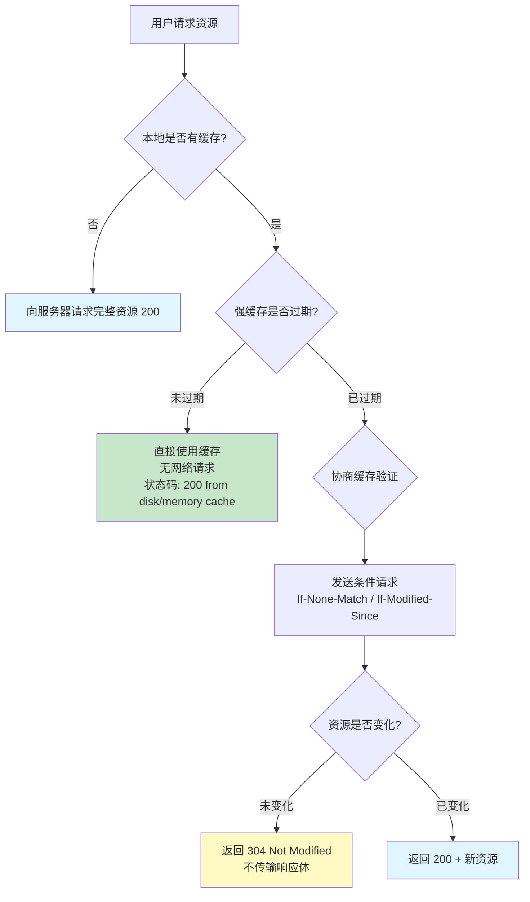
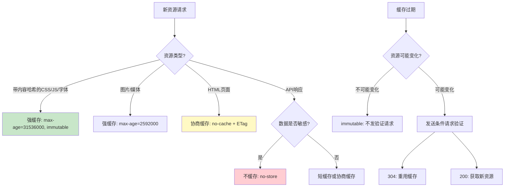
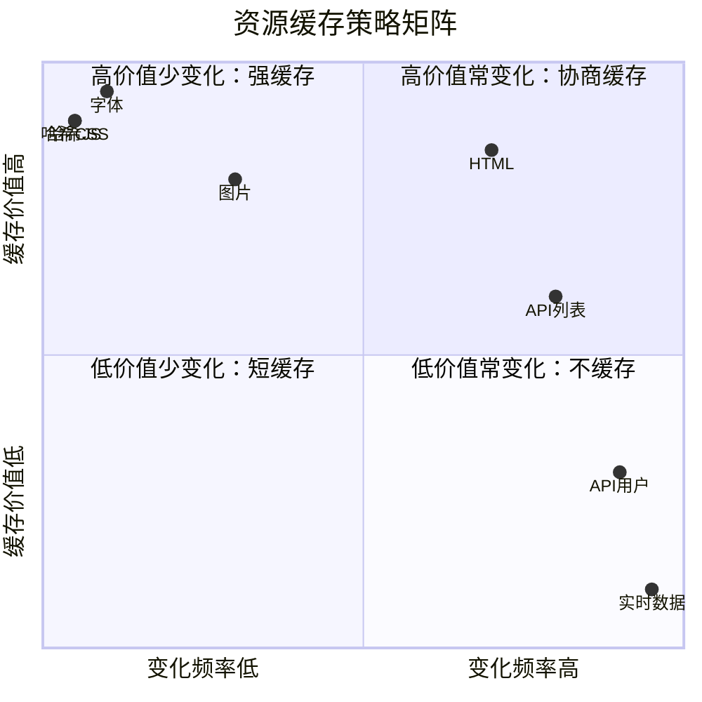
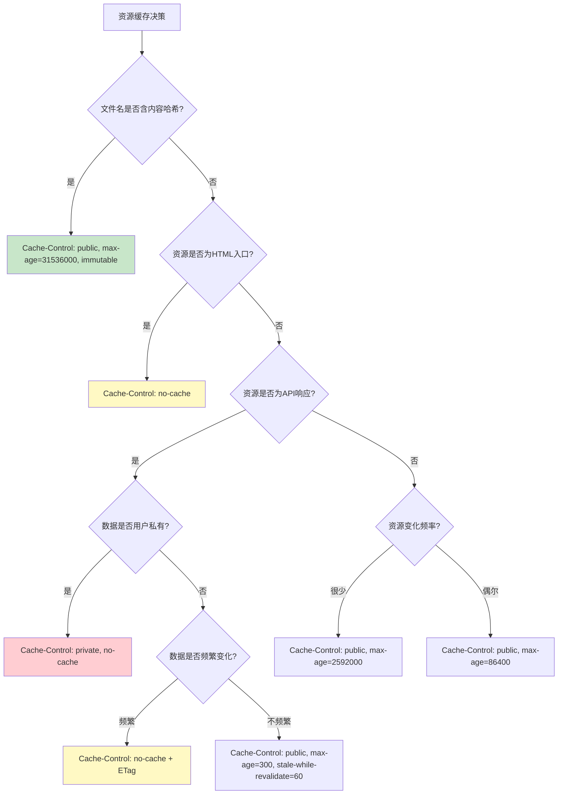

# 浏览器缓存策略

浏览器缓存是 Web 性能优化中投入产出比最高的手段之一——一次正确的缓存配置，可以让后续访问零网络开销。但缓存策略远不止设置 `Cache-Control: max-age` 那么简单，它涉及强缓存与协商缓存的决策、不同资源类型的差异策略、缓存失效与更新的协同，以及与 CDN/Service Worker 的配合。本文将系统讲解 Nginx 侧的浏览器缓存配置。

## 1. HTTP 缓存机制概述

### 1.1 强缓存 vs 协商缓存

HTTP 缓存分为两大类，核心区别在于 **是否需要向服务器发请求**：

| 类型 | 机制 | 是否发请求 | 响应 | 适用场景 |
|------|------|------------|------|----------|
| 强缓存 | Cache-Control / Expires | 否（未过期时） | 直接使用本地缓存 | 不常变化的资源 |
| 协商缓存 | ETag / Last-Modified | 是（条件请求） | 304 Not Modified 或 200 | 可能变化的资源 |



### 1.2 缓存决策流程



::: important 缓存策略的黄金法则
- **内容不变**的资源（带哈希文件名）：`Cache-Control: public, max-age=31536000, immutable`
- **内容可能变**的资源（HTML 入口）：`Cache-Control: no-cache`（每次验证）或短 `max-age`
- **敏感数据**（用户私有 API）：`Cache-Control: no-store`
- **公共资源**（CDN 缓存）：`Cache-Control: public`
:::

## 2. Cache-Control 指令详解

`Cache-Control` 是 HTTP/1.1 引入的缓存控制头，取代了 HTTP/1.0 的 `Expires`，提供了更精细的控制。

### 2.1 max-age

`max-age` 指定资源在缓存中的最大存活时间（秒），从响应被生成时开始计算：

```nginx
# 1年缓存
location /assets/ {
    add_header Cache-Control "public, max-age=31536000";
}

# 10分钟缓存
location ~* \.html$ {
    add_header Cache-Control "public, max-age=600";
}

# 立即过期
location /api/ {
    add_header Cache-Control "no-cache";
}
```

### 2.2 no-cache

`no-cache` 的名字容易误导——它 **不是"不缓存"**，而是"缓存前必须验证"：

```nginx
# no-cache：浏览器可以缓存，但每次使用前必须发条件请求验证
location /html/ {
    add_header Cache-Control "no-cache";
    # 实际效果类似 max-age=0, must-revalidate
    # 注意：严格来说并不等效。no-cache 强制使用前必须验证；
    # max-age=0 使响应立即过期 + must-revalidate 禁止使用过期缓存。
    # 实际行为相似，但语义不完全一致（参见 RFC 7234）
}

# 实际效果：浏览器缓存资源，但每次访问都发请求验证
# 如果服务器返回 304，浏览器使用缓存
# 如果服务器返回 200，浏览器替换缓存
```

::: warning no-cache ≠ no-store
这是最常见的缓存概念混淆：
- `no-cache`：**可以缓存**，但使用前必须验证
- `no-store`：**绝对不缓存**，任何情况下都不存储响应

使用场景：
- `no-cache`：HTML 页面、可能更新的 API 响应
- `no-store`：银行页面、登录响应、敏感个人信息
:::

### 2.3 no-store

```nginx
# no-store：完全禁止任何形式的缓存
location /api/user/ {
    add_header Cache-Control "no-store, no-cache, must-revalidate";
    add_header Pragma "no-cache";  # HTTP/1.0 兼容
    add_header Expires "0";        # HTTP/1.0 兼容
}
```

### 2.4 public / private

```nginx
# public：任何缓存（浏览器、CDN、代理）都可以缓存
location /static/ {
    add_header Cache-Control "public, max-age=86400";
}

# private：只有浏览器可以缓存，中间代理/CDN不得缓存
location /api/profile/ {
    add_header Cache-Control "private, max-age=300";
    # 用户个人数据，CDN缓存会导致数据泄露
}
```

| 指令 | 浏览器缓存 | CDN/代理缓存 | 典型场景 |
|------|-----------|-------------|----------|
| public | 允许 | 允许 | 静态资源、公共API |
| private | 允许 | 禁止 | 用户私有数据 |
| （无指令） | 允许 | 视情况而定 | 默认行为 |

### 2.5 must-revalidate / proxy-revalidate

```nginx
# must-revalidate：缓存过期后必须验证，不能使用过期缓存
location /api/data/ {
    add_header Cache-Control "public, max-age=300, must-revalidate";
    # 缓存5分钟，过期后必须向服务器验证
    # 不能在验证前使用过期缓存（即使看起来仍然有效）
}

# proxy-revalidate：仅对共享缓存（CDN/代理）要求重新验证
location /shared/ {
    add_header Cache-Control "public, max-age=300, proxy-revalidate";
    # 浏览器可以自由使用过期缓存
    # 但代理/CDN必须验证
}
```

### 2.6 immutable

```nginx
# immutable：告诉浏览器，即使刷新页面也不发验证请求
location /assets/ {
    add_header Cache-Control "public, max-age=31536000, immutable";
    # 适用条件：文件名包含内容哈希，如 app.3a4b5c6d.js
    # Chrome 刷新时通常会对 max-age 资源发条件请求
    # immutable 明确告诉浏览器：不需要验证
}
```

::: tip immutable 的价值
根据 HTTP Archive 统计，页面刷新时约 40% 的请求是条件验证请求（304 响应），其中大部分是带哈希的静态资源。`immutable` 可以消除这些无意义的验证请求，在刷新场景下节省约 20% 的网络请求。
:::

### 2.7 stale-while-revalidate / stale-if-error

```nginx
# stale-while-revalidate：允许在后台刷新缓存的同时返回过期缓存
location /api/articles/ {
    add_header Cache-Control "public, max-age=300, stale-while-revalidate=60";
    # 缓存5分钟有效
    # 过期后的60秒内，可以返回过期缓存，同时后台异步刷新
    # 用户始终得到快速响应，数据最多延迟60秒
}

# stale-if-error：服务器错误时允许使用过期缓存
location /api/config/ {
    add_header Cache-Control "public, max-age=300, stale-if-error=3600";
    # 服务器返回5xx错误时，可以在1小时内返回过期缓存
    # 提升容错能力
}
```

### 2.8 Nginx 中 Cache-Control 的完整配置

```nginx
server {
    listen 80;
    server_name example.com;
    root /var/www;

    # ========== 强缓存：带哈希的静态资源 ==========
    location /assets/ {
        expires 1y;
        add_header Cache-Control "public, immutable";
        # Nginx expires 指令会自动添加 Cache-Control: max-age
        # add_header 会追加，不会覆盖 expires 生成的头
    }

    # ========== 协商缓存：HTML 入口 ==========
    location ~* \.html$ {
        expires -1;
        add_header Cache-Control "no-cache";
        # ETag 由 Nginx 自动生成
    }

    # ========== 短缓存：图片资源 ==========
    location ~* \.(jpg|jpeg|png|gif|webp|svg|ico)$ {
        expires 30d;
        add_header Cache-Control "public";
    }

    # ========== 短缓存 + 后台刷新：API ==========
    location /api/articles/ {
        add_header Cache-Control "public, max-age=300, stale-while-revalidate=60";
        proxy_pass http://backend;
    }

    # ========== 不缓存：用户私有 API ==========
    location /api/user/ {
        add_header Cache-Control "private, no-cache, no-store, must-revalidate";
        add_header Pragma "no-cache";
        add_header Expires "0";
        proxy_pass http://backend;
    }
}
```

## 3. expires 指令与过期时间计算

`expires` 是 Nginx 内置指令，它会同时设置 `Expires` 和 `Cache-Control: max-age` 两个响应头。

### 3.1 expires 语法

```nginx
# 绝对时间偏移
expires 1h;       # 1小时后过期
expires 30d;      # 30天后过期
expires 365d;     # 365天后过期
expires 1y;       # 1年后过期（≈365天）

# 相对于 Last-Modified 的时间偏移
expires modified +1h;  # 修改时间 + 1小时

# 特定时间点
expires @15h30m;  # 今天15:30过期
expires @0h;      # 今天午夜过期

# 特殊值
expires epoch;    # Expires: Thu, 01 Jan 1970 00:00:01 GMT
                 # Cache-Control: no-cache
expires max;      # Expires: Thu, 31 Dec 2037 23:55:55 GMT
                 # Cache-Control: max-age=315360000 (10年)
expires -1;       # 过去的时间，浏览器立即认为过期
                 # Cache-Control: no-cache
expires off;      # 不修改 Expires 和 Cache-Control
```

### 3.2 expires 的工作原理

```nginx
# expires 30d 会生成两个头：
# Expires: <当前时间 + 30天>
# Cache-Control: max-age=2592000

# 注意：如果同时使用了 add_header Cache-Control
# expires 生成的 max-age 和 add_header 的值会同时存在
# 这可能导致冲突

# 推荐方式1：只用 expires
location /images/ {
    expires 30d;  # 自动设置 Expires 和 Cache-Control: max-age=2592000
}

# 推荐方式2：只用 add_header（更灵活）
location /images/ {
    add_header Cache-Control "public, max-age=2592000";
    # 不使用 expires，手动控制 Cache-Control
}
```

::: warning expires 与 add_header 的冲突
`expires` 指令会自动生成 `Cache-Control: max-age=xxx`，而 `add_header Cache-Control` 会追加另一个 `Cache-Control` 头。如果两者同时使用，响应中会出现两个 `Cache-Control` 头，浏览器行为不可预测。

解决方案：
1. 只用 `expires`（简单场景）
2. 只用 `add_header Cache-Control`（需要精细控制时）
3. 用 `expires off` 禁用 expires，再用 `add_header`
:::

### 3.3 条件化 expires

```nginx
# 根据 $sent_http_content_type 动态设置缓存时间
map $sent_http_content_type $cache_control {
    text/html                    "no-cache";
    text/css                     "public, max-age=31536000, immutable";
    application/javascript       "public, max-age=31536000, immutable";
    image/jpeg                   "public, max-age=2592000";
    image/png                    "public, max-age=2592000";
    image/webp                   "public, max-age=2592000";
    image/svg+xml                "public, max-age=2592000";
    application/json             "private, no-cache";
    default                      "public, max-age=3600";
}

server {
    expires off;
    add_header Cache-Control $cache_control;
}
```

## 4. ETag / Last-Modified 响应头与验证请求

### 4.1 ETag 机制

ETag（Entity Tag）是资源的唯一标识符，Nginx 默认基于文件的最后修改时间和大小生成：

```nginx
http {
    etag on;  # 默认开启

    # ETag 格式："<mtime_hex>-<size_hex>"
    # 例如：ETag: "65a1b2c0-1f4a"
}
```

ETag 验证流程：

```
1. 首次请求：
   GET /style.css
   → 200 OK
   ETag: "65a1b2c0-1f4a"
   Cache-Control: max-age=3600

2. 缓存过期后，浏览器发送条件请求：
   GET /style.css
   If-None-Match: "65a1b2c0-1f4a"

3a. 文件未修改：
   → 304 Not Modified
   ETag: "65a1b2c0-1f4a"
   （不传输响应体，节省带宽）

3b. 文件已修改：
   → 200 OK
   ETag: "65b3d4e0-2a8f"
   （传输新内容）
```

### 4.2 Last-Modified 机制

```nginx
http {
    # Last-Modified 默认开启
    # 值为文件的最后修改时间
    # 例如：Last-Modified: Wed, 03 Jan 2024 10:30:00 GMT
}
```

Last-Modified 验证流程：

```
1. 首次请求：
   GET /page.html
   → 200 OK
   Last-Modified: Wed, 03 Jan 2024 10:30:00 GMT

2. 缓存过期后，浏览器发送条件请求：
   GET /page.html
   If-Modified-Since: Wed, 03 Jan 2024 10:30:00 GMT

3a. 文件未修改：
   → 304 Not Modified

3b. 文件已修改：
   → 200 OK
   Last-Modified: Thu, 04 Jan 2024 15:20:00 GMT
```

### 4.3 ETag vs Last-Modified

| 特性 | ETag | Last-Modified |
|------|------|---------------|
| 精度 | 精确（字节级） | 秒级（1秒内多次修改无法区分） |
| 可靠性 | 高 | 中（修改时间变了但内容可能没变） |
| 请求头 | If-None-Match | If-Modified-Since |
| 响应头 | ETag | Last-Modified |
| 计算成本 | 需要计算标识 | 直接读取文件元数据 |
| 分布式一致性 | 依赖生成算法 | 基于时间，跨服务器可能不同 |

```nginx
# 当两者同时存在时，浏览器会同时发送：
# If-None-Match: "65a1b2c0-1f4a"
# If-Modified-Since: Wed, 03 Jan 2024 10:30:00 GMT
# Nginx 只验证 If-None-Match，完全忽略 If-Modified-Since
# 只有当请求不包含 If-None-Match 时，才会检查 If-Modified-Since
# 这是 RFC 7232 的规定：ETag 验证器优先级高于 Last-Modified
```

::: important ETag 优先级更高
当请求同时包含 `If-None-Match` 和 `If-Modified-Since` 时，Nginx **只检查** `If-None-Match`，`If-Modified-Since` 被完全忽略——不会作为后备验证手段。只有 `If-None-Match` 不存在时，才会检查 `If-Modified-Since`。这是 RFC 7232 的规定，强验证器（ETag）优先于弱验证器（Last-Modified）。
:::

### 4.4 关闭 ETag 的场景

```nginx
# 某些场景需要关闭 ETag
server {
    # 1. 多服务器部署且 ETag 不一致
    etag off;

    # 2. 使用 CDN 且 CDN 有自己的缓存验证机制
    etag off;

    # 3. 动态内容（每次生成的 ETag 不同，无意义）
    location /api/ {
        etag off;
    }
}
```

## 5. nginx 条件请求处理：if_modified_since

`if_modified_since` 指令控制 Nginx 如何处理 `If-Modified-Since` 请求头：

```nginx
http {
    # off：忽略 If-Modified-Since，总是返回完整内容
    if_modified_since off;

    # exact：精确匹配（默认），修改时间完全一致才返回 304
    if_modified_since exact;

    # before：修改时间早于或等于 If-Modified-Since 才返回 304
    if_modified_since before;
}
```

```nginx
# 实际场景
server {
    # 静态文件：使用精确匹配（默认）
    location /static/ {
        if_modified_since exact;
    }

    # 动态内容：关闭 Last-Modified 验证
    location /api/ {
        if_modified_since off;
        etag off;
    }

    # 定期更新的文件：使用 before，容忍微小时间差
    location /feeds/ {
        if_modified_since before;
    }
}
```

## 6. 不同资源类型缓存策略

### 6.1 资源缓存矩阵



### 6.2 完整的按类型缓存配置

```nginx
server {
    listen 80;
    server_name example.com;
    root /var/www;

    # ============================
    # 1. 带 Hash 的静态资源
    # ============================
    # 文件名如: app.3a4b5c6d.js, chunk.1e2f3g4h.css
    # 内容变化 → 哈希变化 → URL变化 → 旧缓存自然失效
    location /assets/ {
        expires 1y;
        add_header Cache-Control "public, immutable";
        # immutable: 即使刷新也不验证，性能最优
    }

    # ============================
    # 2. HTML 入口文件
    # ============================
    # 必须每次验证，因为引用的 CSS/JS 哈希可能变了
    location ~* \.html$ {
        add_header Cache-Control "no-cache";
        # 使用协商缓存（ETag/Last-Modified）
        etag on;
    }

    # ============================
    # 3. 图片资源
    # ============================
    location ~* \.(jpg|jpeg|png|gif|webp|avif|svg|ico)$ {
        expires 30d;
        add_header Cache-Control "public";
        etag on;
    }

    # ============================
    # 4. 字体文件
    # ============================
    location ~* \.(woff|woff2|ttf|otf|eot)$ {
        expires 1y;
        add_header Cache-Control "public, immutable";
        add_header Access-Control-Allow-Origin "*";
    }

    # ============================
    # 5. 视频/音频
    # ============================
    location ~* \.(mp4|webm|ogg|mp3|wav)$ {
        expires 30d;
        add_header Cache-Control "public";
        aio on;
        directio 5m;
    }

    # ============================
    # 6. JSON/XML 数据
    # ============================
    location ~* \.(json|xml)$ {
        add_header Cache-Control "public, max-age=300";
        # 5分钟缓存，适合不频繁变化的API数据
    }

    # ============================
    # 7. Service Worker
    # ============================
    location = /sw.js {
        add_header Cache-Control "no-cache";
        # SW 必须每次验证更新
    }

    # ============================
    # 8. Favicon
    # ============================
    location = /favicon.ico {
        expires 7d;
        add_header Cache-Control "public";
        access_log off;
        log_not_found off;
    }

    # ============================
    # 9. robots.txt / sitemap.xml
    # ============================
    location = /robots.txt {
        expires 1d;
        add_header Cache-Control "public";
        access_log off;
        log_not_found off;
    }
}
```

### 6.3 前后端协同的缓存策略

```nginx
# 前端构建产物目录结构
# /var/www/app/
# ├── index.html           ← no-cache
# ├── assets/
# │   ├── app.3a4b5c.js   ← immutable, 1y
# │   ├── app.1e2f3g.css  ← immutable, 1y
# │   └── logo.5h6i7j.png ← immutable, 1y
# ├── sw.js                ← no-cache
# └── favicon.ico          ← 7d

server {
    listen 80;
    server_name app.example.com;
    root /var/www/app;

    # HTML：no-cache + ETag
    location = /index.html {
        add_header Cache-Control "no-cache";
        etag on;
    }

    # 带 Hash 的资源：最长缓存
    location /assets/ {
        expires 1y;
        add_header Cache-Control "public, immutable";
    }

    # 其他 HTML 路由回退（SPA）
    location / {
        try_files $uri /index.html;
    }
}
```

## 7. 缓存清除与版本化 URL

### 7.1 缓存更新的困境

缓存的核心矛盾是：**缓存时间越长，性能越好；但更新越困难**。解决方案是版本化 URL：

```
# 方案1：查询参数版本号（不推荐）
/style.css?v=1.2.3
# 问题：某些 CDN/代理会忽略查询参数，返回旧版本

# 方案2：文件名哈希（推荐）
/app.3a4b5c6d.js
# 内容变化 → 哈希变化 → URL变化 → 全新资源，无缓存冲突
```

### 7.2 Nginx 配置版本化策略

```nginx
server {
    # 方案1：构建工具生成哈希文件名（最佳实践）
    # Vite/Webpack 自动输出: dist/assets/app.3a4b5c6d.js
    location /assets/ {
        expires 1y;
        add_header Cache-Control "public, immutable";
    }

    # 方案2：目录版本化
    # /v1.2.3/css/style.css → /var/www/releases/v1.2.3/css/style.css
    location ~ ^/v([\d.]+)/(.*)$ {
        root /var/www/releases;
        try_files /v$1/$2 =404;
        expires 1y;
        add_header Cache-Control "public, immutable";
    }

    # 方案3：服务端主动清除缓存（配合 proxy_cache_purge）
    # 见后续代理缓存章节
}
```

### 7.3 缓存清除技巧

```nginx
# 方法1：修改文件名（最可靠）
# 旧: /assets/app.js → 新: /assets/app.abc123.js

# 方法2：使用 sitemap 通知搜索引擎
location = /sitemap.xml {
    add_header Cache-Control "public, max-age=86400";
}

# 方法3：通过 URL 参数强制刷新（调试用）
# 在 Nginx 中不做特殊处理，只是绕过浏览器缓存
# curl -H "Cache-Control: no-cache" https://example.com/style.css

# 方法4：对特定路径禁用缓存
location /preview/ {
    add_header Cache-Control "no-store, no-cache, must-revalidate";
    add_header Pragma "no-cache";
    add_header Expires "0";
}
```

## 8. Service Worker 与 Nginx 配合

### 8.1 Service Worker 缓存层级

Service Worker 在浏览器和网络之间增加了一个可编程的缓存层：

```
请求 → Service Worker 缓存 → HTTP 缓存 → 网络请求 → 服务器
```

### 8.2 Service Worker 文件的缓存配置

```nginx
server {
    # Service Worker 文件必须每次验证
    location = /sw.js {
        add_header Cache-Control "no-cache, no-store, must-revalidate";
        add_header Service-Worker-Allowed "/";
        # 确保浏览器总是获取最新的 SW
    }

    # Precache Manifest（构建工具生成）
    location = /precache-manifest.js {
        add_header Cache-Control "no-cache";
    }

    # Workbox 运行时
    location /workbox/ {
        expires 1y;
        add_header Cache-Control "public, immutable";
    }
}
```

::: important Service Worker 缓存与 HTTP 缓存的交互
Service Worker 的 `fetch` 事件在 HTTP 缓存之前触发。当 SW 使用 `cache.match()` 时，它可能命中 SW Cache；当 SW 使用 `fetch()` 发起网络请求时，该请求仍会经过 HTTP 缓存。如果 HTTP 缓存返回 304，SW 收到的是缓存的 Response 对象。

关键规则：
1. SW 文件本身必须 `Cache-Control: no-cache`，确保浏览器每次都获取最新版本
2. SW 的 `install` 事件中预缓存的资源应该有长 `max-age`，因为 SW 会管理其更新
3. SW 的 `fetch` 策略应与 HTTP 缓存策略协调，避免双重缓存导致数据不一致
:::

### 8.3 SW 与 HTTP 缓存的协调配置

```nginx
server {
    root /var/www/pwa;

    # SW 文件：不缓存
    location = /sw.js {
        add_header Cache-Control "no-store";
    }

    # App Shell（HTML）：短缓存，SW 会优先处理
    location = /index.html {
        add_header Cache-Control "no-cache";
    }

    # 静态资源：长缓存 + immutable
    # SW 的 CacheFirst 策略会直接使用 SW Cache
    # HTTP 缓存作为 fallback
    location /assets/ {
        expires 1y;
        add_header Cache-Control "public, immutable";
    }

    # API：SW 可以使用 NetworkFirst 策略
    location /api/ {
        add_header Cache-Control "no-cache";
        proxy_pass http://backend;
    }
}
```

### 8.4 PWA 完整配置示例

```nginx
server {
    listen 443 ssl http2;
    server_name pwa.example.com;
    root /var/www/pwa;

    # SSL 配置
    ssl_certificate /etc/ssl/certs/pwa.crt;
    ssl_certificate_key /etc/ssl/private/pwa.key;

    # PWA 必须使用 HTTPS
    # Service Worker 只能在 HTTPS 或 localhost 下注册

    # 安全头
    add_header X-Frame-Options "SAMEORIGIN" always;
    add_header X-Content-Type-Options "nosniff" always;
    add_header Strict-Transport-Security "max-age=31536000; includeSubDomains" always;

    # Manifest 文件
    location = /manifest.json {
        add_header Cache-Control "public, max-age=86400";
        add_header Access-Control-Allow-Origin "*";
    }

    # Service Worker
    location = /sw.js {
        add_header Cache-Control "no-store, no-cache, must-revalidate";
        add_header Service-Worker-Allowed "/";
    }

    # HTML 入口
    location / {
        try_files $uri /index.html;
        add_header Cache-Control "no-cache";
    }

    # 静态资源
    location /assets/ {
        expires 1y;
        add_header Cache-Control "public, immutable";
    }
}
```

## 9. 缓存性能分析与监控

### 9.1 缓存命中率分析

```nginx
# 通过自定义日志格式分析缓存命中情况
log_format cache_analysis '$remote_addr - $remote_user [$time_local] '
                          '"$request" $status $body_bytes_sent '
                          '"$http_referer" "$http_user_agent" '
                          'cache_status="$upstream_cache_status" '
                          'etag="$sent_http_etag" '
                          'cache_control="$sent_http_cache_control"';

server {
    access_log /var/log/nginx/cache_analysis.log cache_analysis;
}
```

### 9.2 缓存状态统计脚本

```bash
#!/bin/bash
# cache_stats.sh - 分析 Nginx 缓存命中率
LOG_FILE="/var/log/nginx/cache_analysis.log"

echo "=== Nginx 缓存分析报告 ==="
echo "分析时间: $(date)"
echo ""

# 总请求数
TOTAL=$(wc -l < "$LOG_FILE")
echo "总请求数: $TOTAL"

# 304 响应数（协商缓存命中）
HIT_304=$(grep -c '" 304 ' "$LOG_FILE")
echo "304 Not Modified: $HIT_304"

# 200 响应中带 ETag 的
WITH_ETAG=$(grep -c 'etag="W/' "$LOG_FILE" 2>/dev/null || echo 0)
echo "带 ETag 响应: $WITH_ETAG"

# 各种 Cache-Control 策略分布
echo ""
echo "=== Cache-Control 策略分布 ==="
grep -oP 'cache_control="\K[^"]+' "$LOG_FILE" | sort | uniq -c | sort -rn | head -20

# 协商缓存命中率
if [ "$TOTAL" -gt 0 ]; then
    HIT_RATE=$(echo "scale=2; $HIT_304 * 100 / $TOTAL" | bc)
    echo ""
    echo "协商缓存命中率: ${HIT_RATE}%"
fi
```

### 9.3 浏览器端缓存分析

```bash
# 使用 curl 模拟浏览器缓存行为

# 1. 首次请求（无缓存）
curl -v https://example.com/style.css 2>&1 | grep -E "< (ETag|Last-Modified|Cache-Control|Expires):"

# 2. 条件请求：使用 ETag
ETAG=$(curl -sI https://example.com/style.css | grep -i etag | awk '{print $2}' | tr -d '\r')
curl -H "If-None-Match: $ETAG" -I https://example.com/style.css
# 预期: 304 Not Modified

# 3. 条件请求：使用 Last-Modified
LM=$(curl -sI https://example.com/style.css | grep -i last-modified | cut -d' ' -f2- | tr -d '\r')
curl -H "If-Modified-Since: $LM" -I https://example.com/style.css
# 预期: 304 Not Modified

# 4. 批量检查缓存头
for url in "https://example.com/" "https://example.com/style.css" "https://example.com/app.js"; do
    echo "=== $url ==="
    curl -sI "$url" | grep -iE "(cache-control|etag|expires|last-modified):"
    echo ""
done
```

### 9.4 Chrome DevTools 缓存分析

```
# Chrome DevTools → Network 面板

# 查看缓存状态：
# Size 列：
#   - "from disk cache" → 磁盘缓存命中（强缓存）
#   - "from memory cache" → 内存缓存命中（强缓存）
#   - 实际大小 → 从网络获取

# Status Code 列：
#   - 200 (from disk cache) → 强缓存命中
#   - 304 Not Modified → 协商缓存命中
#   - 200 OK → 缓存未命中

# 禁用缓存测试：
# DevTools → Network → 勾选 "Disable cache"
```

### 9.5 Lighthouse 缓存审计

```bash
# 使用 Lighthouse 检查缓存策略
npx lighthouse https://example.com \
    --only-categories=performance \
    --output=json \
    --output-path=./lighthouse-report.json

# 查看缓存相关建议
cat lighthouse-report.json | jq '.audits | to_entries[] | select(.key | contains("cache")) | {key: .key, score: .value.score, title: .value.title}'
```

## 10. 缓存策略常见问题与最佳实践

### 10.1 常见错误

```nginx
# ❌ 错误1：所有资源使用相同的缓存策略
server {
    expires 30d;  # 所有文件30天缓存，包括HTML
}

# ✅ 正确：按资源类型区分缓存策略
server {
    location ~* \.html$ {
        add_header Cache-Control "no-cache";
    }
    location /assets/ {
        expires 1y;
        add_header Cache-Control "public, immutable";
    }
}

# ❌ 错误2：同时使用 expires 和 add_header Cache-Control
location /images/ {
    expires 30d;
    add_header Cache-Control "public";  # 会生成两个 Cache-Control 头
}

# ✅ 正确：只使用一种方式
location /images/ {
    add_header Cache-Control "public, max-age=2592000";
}

# ❌ 错误3：对 API 响应使用强缓存
location /api/user/ {
    expires 1h;  # 用户数据可能1秒就变了
}

# ✅ 正确：API 使用协商缓存或不缓存
location /api/user/ {
    add_header Cache-Control "private, no-cache";
}

# ❌ 错误4：忘记加 Vary: Accept-Encoding
gzip on;
gzip_vary off;  # 代理可能把压缩版本返回给不支持压缩的客户端

# ✅ 正确
gzip_vary on;
```

### 10.2 缓存策略决策树



### 10.3 缓存最佳实践清单

::: tip 缓存配置检查清单
1. **带哈希的静态资源**：`max-age=31536000, immutable`
2. **HTML 入口**：`no-cache`（每次验证）
3. **用户私有 API**：`private, no-cache` 或 `no-store`
4. **公共 API**：`max-age=60-300` + `stale-while-revalidate`
5. **图片/媒体**：`max-age=2592000`（30天）
6. **字体**：`max-age=31536000, immutable`
7. **Service Worker**：`no-store`
8. **始终添加 `Vary: Accept-Encoding`**：`gzip_vary on`
9. **生产环境关闭 `server_tokens`**：`server_tokens off`
10. **CDN 场景使用 `public`**：确保 CDN 能缓存
:::

### 10.4 完整生产级缓存配置模板

```nginx
server {
    listen 80;
    server_name example.com;
    root /var/www;

    # 压缩
    gzip on;
    gzip_comp_level 5;
    gzip_types text/plain text/css application/javascript application/json image/svg+xml;
    gzip_vary on;
    gzip_min_length 1024;

    # 安全
    server_tokens off;
    add_header X-Content-Type-Options "nosniff" always;

    # ===== 静态资源：带哈希，长缓存 =====
    location /assets/ {
        expires 1y;
        add_header Cache-Control "public, immutable";
        add_header X-Content-Type-Options "nosniff" always;
    }

    # ===== 字体文件 =====
    location ~* \.(woff2?|ttf|otf|eot)$ {
        expires 1y;
        add_header Cache-Control "public, immutable";
        add_header Access-Control-Allow-Origin "*";
    }

    # ===== 图片 =====
    location ~* \.(jpg|jpeg|png|gif|webp|avif|svg|ico)$ {
        expires 30d;
        add_header Cache-Control "public";
    }

    # ===== HTML：协商缓存 =====
    location ~* \.html$ {
        add_header Cache-Control "no-cache";
        etag on;
    }

    # ===== SPA 路由回退 =====
    location / {
        try_files $uri /index.html;
    }

    # ===== Service Worker =====
    location = /sw.js {
        add_header Cache-Control "no-store, no-cache, must-revalidate";
    }

    # ===== API 代理 =====
    location /api/ {
        add_header Cache-Control "private, no-cache";
        proxy_pass http://backend:3000;
        proxy_set_header Host $host;
        proxy_set_header X-Real-IP $remote_addr;
        proxy_set_header X-Forwarded-For $proxy_add_x_forwarded_for;
    }

    # ===== 禁止访问敏感文件 =====
    location ~ /\. {
        deny all;
    }
}
```

## 11. 参考文档

- [RFC 7234 - HTTP Caching](https://datatracker.ietf.org/doc/html/rfc7234)
- [RFC 7232 - Conditional Requests](https://datatracker.ietf.org/doc/html/rfc7232)
- [Nginx ngx_http_headers_module: expires](https://nginx.org/en/docs/http/ngx_http_headers_module.html#expires)
- [Nginx ngx_http_core_module: etag](https://nginx.org/en/docs/http/ngx_http_core_module.html#etag)
- [Nginx ngx_http_core_module: if_modified_since](https://nginx.org/en/docs/http/ngx_http_core_module.html#if_modified_since)
- [MDN: HTTP Caching](https://developer.mozilla.org/en-US/docs/Web/HTTP/Caching)
- [Google Web Fundamentals: HTTP Caching](https://developers.google.com/web/fundamentals/performance/optimizing-content-efficiency/http-caching)
- [Cache-Control 详解](https://developer.mozilla.org/en-US/docs/Web/HTTP/Headers/Cache-Control)
