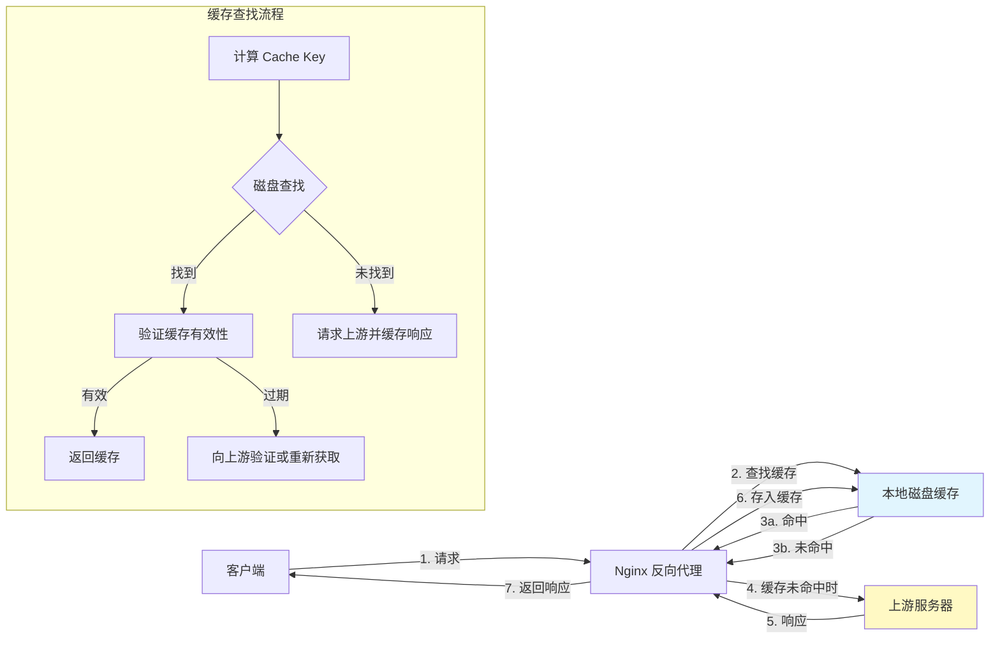
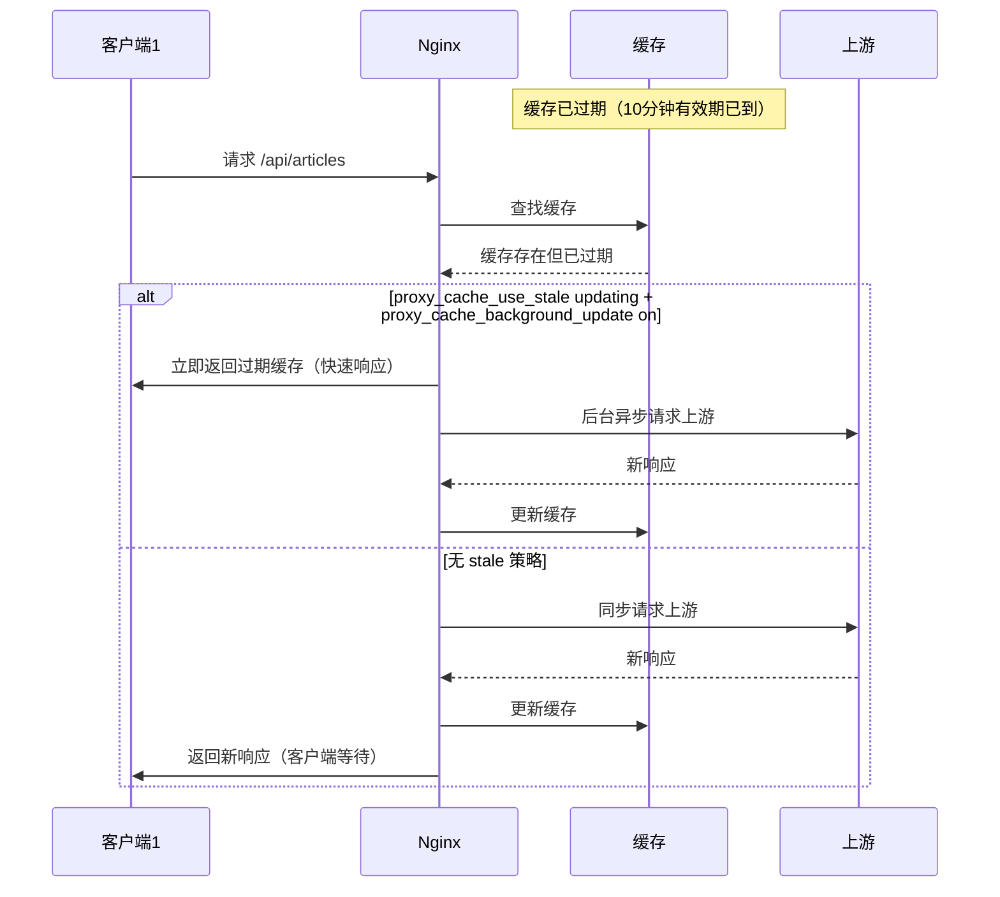
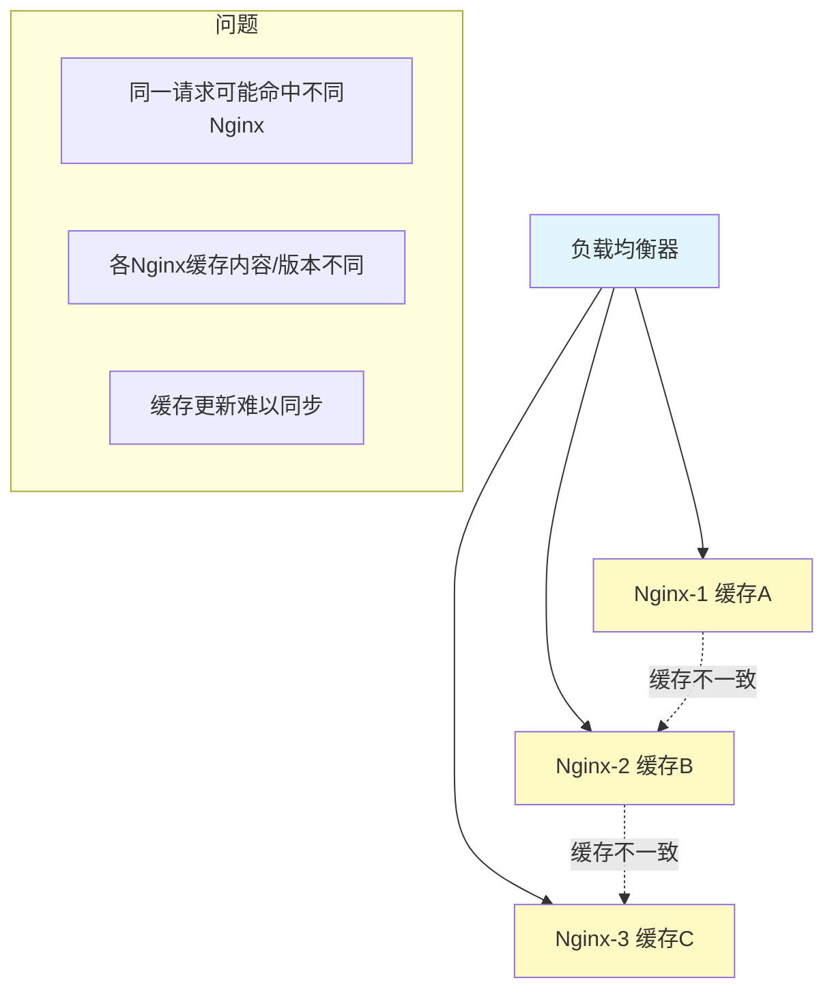

# 代理缓存与快速缓存

当 Nginx 作为反向代理时，每次请求都会转发到上游服务器。对于不频繁变化的响应，重复请求上游是巨大的浪费。Nginx 的代理缓存（proxy_cache）和 FastCGI 缓存（fastcgi_cache）可以将上游响应缓存在本地磁盘，后续请求直接返回缓存，将响应时间从数十毫秒降低到不足 1 毫秒。本文系统讲解代理缓存的配置、优化和运维。

## 1. 代理缓存架构概览

### 1.1 缓存架构图



### 1.2 缓存类型对比

| 缓存类型 | 模块 | 适用场景 | 上游协议 |
|----------|------|----------|----------|
| proxy_cache | ngx_http_proxy_module | HTTP 反向代理缓存 | HTTP |
| fastcgi_cache | ngx_http_fastcgi_module | PHP-FPM 缓存 | FastCGI |
| uwsgi_cache | ngx_http_uwsgi_module | Python uWSGI 缓存 | uWSGI |
| scgi_cache | ngx_http_scgi_module | SCGI 应用缓存 | SCGI |

它们的配置语法几乎相同，只是前缀不同。本文以 `proxy_cache` 为主讲解，`fastcgi_cache` 放在单独章节。

## 2. proxy_cache 配置详解

### 2.1 基础配置

```nginx
http {
    # 定义缓存路径和参数
    proxy_cache_path /var/cache/nginx/proxy
        levels=1:2
        keys_zone=api_cache:10m
        max_size=10g
        inactive=60m
        use_temp_path=off;

    server {
        listen 80;
        server_name api.example.com;

        # 引用缓存区域
        proxy_cache api_cache;

        # 缓存有效的响应码和时长
        proxy_cache_valid 200 302 10m;
        proxy_cache_valid 404 1m;

        # 其他代理配置
        proxy_pass http://backend;
    }
}
```

### 2.2 proxy_cache_path 参数详解

`proxy_cache_path` 是代理缓存最核心的指令，必须在 `http` 上下文中配置：

```nginx
proxy_cache_path /var/cache/nginx/proxy
    levels=1:2           # 目录层级
    keys_zone=api_cache:10m  # 共享内存区域名:大小
    max_size=10g         # 磁盘缓存最大大小
    inactive=60m         # 不活跃条目过期时间
    use_temp_path=off    # 临时文件路径
    manager_threshold=50ms  # 缓存管理器单次运行时间阈值
    manager_files=100    # 缓存管理器单次处理文件数
    loader_threshold=50ms  # 缓存加载器单次运行时间阈值
    loader_files=100     # 缓存加载器单次加载文件数;
```

各参数详解：

**levels：缓存目录层级**

```nginx
# levels=1:2 表示两级目录
# 第一级：1个字符（16个目录：0-f）
# 第二级：2个字符（256个目录：00-ff）
#
# 缓存文件路径计算方式：
# Cache Key 的 MD5 值 = e5f3a1b2c4d5e6f7...
# levels=1:2 → /var/cache/nginx/proxy/e/5f/e5f3a1b2c4d5e6f7...
# levels=1:1:2 → /var/cache/nginx/proxy/e/5/f3/e5f3a1b2c4d5e6f7...

# 小缓存（<10万条目）
levels=1:2    # 16 × 256 = 4,096 个目录

# 中缓存（10-100万条目）
levels=1:2:2  # 16 × 256 × 256 = 1,048,576 个目录

# 大缓存（>100万条目）
levels=2:2:2  # 256 × 256 × 256 个目录
```

::: tip levels 选择建议
目录层级的选择影响文件系统查找性能。如果单个目录下文件过多（超过几千），`stat()` 调用变慢。经验法则是：预计缓存条目数 / 目录数 < 1000。
:::

**keys_zone：共享内存区域**

```nginx
# keys_zone=name:size
# name: 缓存区域名称，在 proxy_cache 中引用
# size: 共享内存大小，存储缓存 Key 和元数据

# 每个缓存条目约占用 64 字节共享内存
# 10m 约 可存储 160,000 个条目
# 100m 约 可存储 1,600,000 个条目

keys_zone=small_cache:10m     # ~16万条目
keys_zone=medium_cache:50m    # ~80万条目
keys_zone=large_cache:200m    # ~320万条目
```

**max_size：磁盘缓存最大大小**

```nginx
max_size=10g  # 缓存目录最大10GB
# 当缓存超过 max_size 时，Nginx 的缓存管理器（Cache Manager）
# 会删除最近最少使用（LRU）的缓存条目
```

**inactive：不活跃过期时间**

```nginx
inactive=60m  # 60分钟内无人访问的缓存自动删除
# 即使 proxy_cache_valid 指定的时间更长
# 如果在 inactive 时间内无人访问，缓存也会被删除
```

**use_temp_path**

```nginx
# on: 临时文件存储在 proxy_temp_path 指定的目录
# off: 临时文件直接存储在缓存目录中
# 推荐设为 off，避免在临时目录和缓存目录之间移动文件
use_temp_path=off;
```

### 2.3 proxy_cache_key：缓存键设计

```nginx
# 默认缓存键
proxy_cache_key $scheme$proxy_host$request_uri;
# 例如: httpapi.example.com/api/users

# 自定义缓存键
proxy_cache_key "$scheme$host$request_uri";

# 包含查询参数
proxy_cache_key "$scheme$host$request_uri$is_args$args";

# 根据 Accept-Encoding 区分（压缩/未压缩版本）
proxy_cache_key "$scheme$host$request_uri$accept_encoding";

# 根据 Cookie 区分（用户个性化内容）
proxy_cache_key "$scheme$host$request_uri$cookie_user_id";

# 完整的自定义缓存键
proxy_cache_key "$request_method|$scheme|$host|$request_uri";
```

::: warning 缓存键冲突
缓存键决定了哪些请求共享同一份缓存。如果缓存键设计不当，会导致：
- **缓存泄漏**：不同内容使用相同缓存键，用户看到错误内容
- **缓存命中率低**：相同内容使用不同缓存键，重复缓存

常见陷阱：
1. 忘记包含 `$is_args$args`，导致带查询参数的请求命中错误缓存
2. 包含 `$cookie_xxx` 但 Cookie 值频繁变化，导致缓存命中率极低
3. 多域名共享缓存但缓存键不包含 `$host`
:::

### 2.4 proxy_cache_valid：缓存有效期

```nginx
# 按状态码设置有效期
proxy_cache_valid 200 302 10m;   # 200/302 缓存10分钟
proxy_cache_valid 404 1m;        # 404 缓存1分钟
proxy_cache_valid 500 0s;        # 500 不缓存（0秒立即过期）
proxy_cache_valid any 1m;        # 其他状态码缓存1分钟

# 不指定状态码：仅对 200/301/302 生效
proxy_cache_valid 10m;

# 也可以由上游通过 Cache-Control 头控制
proxy_cache_valid 200 10m;
# 上游返回 Cache-Control: max-age=300 → Nginx 缓存5分钟
# 上游返回 Cache-Control: no-cache → Nginx 不缓存
# 但需要配合 proxy_ignore_headers 或 proxy_cache_methods
```

### 2.5 完整的代理缓存配置示例

```nginx
http {
    # 定义多个缓存区域
    proxy_cache_path /var/cache/nginx/api
        levels=1:2
        keys_zone=api_cache:20m
        max_size=5g
        inactive=30m
        use_temp_path=off;

    proxy_cache_path /var/cache/nginx/static
        levels=1:2
        keys_zone=static_cache:50m
        max_size=20g
        inactive=7d
        use_temp_path=off;

    # 临时文件目录
    proxy_temp_path /var/cache/nginx/temp;

    server {
        listen 80;
        server_name api.example.com;

        # API 缓存
        location /api/articles/ {
            proxy_cache api_cache;
            proxy_cache_key "$scheme$host$request_uri";
            proxy_cache_valid 200 10m;
            proxy_cache_valid 404 1m;
            proxy_cache_valid 500 502 503 0s;

            # 添加缓存状态头（调试用）
            add_header X-Cache-Status $upstream_cache_status;

            proxy_pass http://backend;
        }

        # 静态资源缓存
        location /static/ {
            proxy_cache static_cache;
            proxy_cache_key "$scheme$host$request_uri";
            proxy_cache_valid 200 7d;
            proxy_cache_valid 404 1m;

            add_header X-Cache-Status $upstream_cache_status;

            proxy_pass http://backend;
        }

        # 不缓存的 API
        location /api/user/ {
            proxy_cache off;
            proxy_pass http://backend;
        }
    }
}
```

## 3. 缓存层级与目录结构

### 3.1 缓存文件目录结构

```bash
# levels=1:2 时的目录结构
/var/cache/nginx/proxy/
├── 0/
│   ├── 00/
│   │   └── 0002a1b3c4d5e6f7...  # 缓存文件
│   ├── 01/
│   │   └── 0002a1b3c4d5e6f8...
│   └── ff/
│       └── 00ff2a1b3c4d5e6f9...
├── 1/
│   ├── 00/
│   └── ...
└── f/
    ├── 00/
    └── ff/

# 缓存文件格式（二进制）
# 头部：缓存元数据（Key、创建时间、有效期等）
# 体部：HTTP 响应头 + 响应体
```

### 3.2 缓存文件管理

```bash
# 查看缓存大小
du -sh /var/cache/nginx/proxy/

# 查看缓存条目数
find /var/cache/nginx/proxy/ -type f | wc -l

# 查看缓存目录结构
tree -L 3 /var/cache/nginx/proxy/

# 查看缓存管理器状态
ls -la /var/cache/nginx/proxy/
# .manager.pid  - 缓存管理器 PID
```

## 4. 缓存 Key 设计与冲突避免

### 4.1 缓存 Key 设计原则

```nginx
# 原则1：确保相同内容相同 Key
# 好：URL 完整标识资源
proxy_cache_key "$scheme$host$request_uri";

# 坏：遗漏关键信息
proxy_cache_key "$request_uri";  # 不同域名的相同路径会冲突

# 原则2：不同内容不同 Key
# 好：包含 Accept-Encoding 区分压缩版本
proxy_cache_key "$scheme$host$request_uri$accept_encoding";

# 坏：不同压缩版本使用相同 Key
proxy_cache_key "$scheme$host$request_uri";  # 可能返回错误编码

# 原则3：避免 Key 爆炸
# 好：只包含必要的区分字段
proxy_cache_key "$scheme$host$request_uri";

# 坏：包含高频变化的字段
proxy_cache_key "$scheme$host$request_uri$cookie_session";  # session频繁变化
```

### 4.2 多维度缓存 Key

```nginx
# 场景：API 支持多语言，根据 Accept-Language 返回不同内容
proxy_cache_key "$scheme$host$request_uri$http_accept_language";

# 场景：API 支持多版本，根据 Accept 头返回不同格式
proxy_cache_key "$scheme$host$request_uri$http_accept";

# 场景：A/B 测试，根据 Cookie 分流
proxy_cache_key "$scheme$host$request_uri$cookie_ab_variant";

# 场景：移动端/桌面端不同内容
map $http_user_agent $device_type {
    default "desktop";
    "~*Mobile|Android|iPhone" "mobile";
}
proxy_cache_key "$scheme$host$request_uri$device_type";
```

### 4.3 Vary 头与缓存 Key 的关系

```nginx
# 上游服务器可能返回 Vary 头
# Vary: Accept-Encoding → 缓存应根据 Accept-Encoding 区分

# Nginx 默认不解析 Vary 头
# 需要手动在 proxy_cache_key 中包含相关变量

# 如果上游返回 Vary: Accept-Encoding
proxy_cache_key "$scheme$host$request_uri$accept_encoding";

# 如果上游返回 Vary: Accept-Language
proxy_cache_key "$scheme$host$request_uri$http_accept_language";

# 更优雅的方式：使用 map
map $http_accept_encoding $cache_encoding {
    default "identity";
    "~*gzip" "gzip";
    "~*br" "br";
    "~*zstd" "zstd";
}

proxy_cache_key "$scheme$host$request_uri$cache_encoding";
```

## 5. Stale 策略

Stale（过期缓存）策略是代理缓存的高阶特性，它决定了缓存过期后的行为。

### 5.1 proxy_cache_use_stale

```nginx
location /api/ {
    proxy_cache api_cache;
    proxy_cache_valid 200 10m;

    # 在以下情况下使用过期缓存
    proxy_cache_use_stale error timeout updating http_500 http_502 http_503 http_504;
    # error:   上游连接错误
    # timeout: 上游超时
    # updating: 缓存正在更新（另一个请求正在刷新）
    # http_5xx: 上游返回5xx错误

    proxy_pass http://backend;
}
```

### 5.2 stale-while-revalidate 模式

```nginx
location /api/articles/ {
    proxy_cache api_cache;
    proxy_cache_valid 200 10m;

    # 缓存正在更新时返回过期缓存
    proxy_cache_use_stale updating;

    # 允许后台刷新的同时返回旧缓存
    # 配合 proxy_cache_background_update
    # 注意：proxy_cache_background_update 需要同时配置
    # proxy_cache_use_stale updating 才能生效，否则后台更新不会触发
    proxy_cache_background_update on;

    proxy_pass http://backend;
}
```



### 5.3 proxy_cache_lock：缓存锁

```nginx
location /api/ {
    proxy_cache api_cache;
    proxy_cache_valid 200 10m;

    # 开启缓存锁：同一资源的多个并发请求只有一个去上游获取
    proxy_cache_lock on;
    proxy_cache_lock_timeout 5s;  # 等待锁超时时间

    # 其他请求等待第一个请求完成后从缓存获取
    # 超时后直接请求上游

    proxy_pass http://backend;
}
```

::: important 缓存锁 vs 缓存背景更新
- `proxy_cache_lock`：多个请求同时发现缓存 miss，只允许一个请求去上游，其他请求等待
- `proxy_cache_background_update`：缓存过期后，先返回过期缓存，后台异步更新

两者可以配合使用：
- 首次 miss：`proxy_cache_lock` 防止缓存击穿
- 后续过期：`proxy_cache_background_update` 异步更新 + `proxy_cache_use_stale updating` 返回旧缓存
:::

## 6. 缓存手动清除

### 6.1 proxy_cache_bypass

```nginx
# 通过请求头跳过缓存
location /api/ {
    proxy_cache api_cache;
    proxy_cache_valid 200 10m;

    # 如果请求包含 X-Cache-Bypass 头，跳过缓存
    proxy_cache_bypass $http_x_cache_bypass;

    add_header X-Cache-Status $upstream_cache_status;
    proxy_pass http://backend;
}

# 使用方式
# curl -H "X-Cache-Bypass: 1" https://api.example.com/api/articles
# Nginx 会直接请求上游，不使用缓存
```

### 6.2 proxy_cache_purge

`proxy_cache_purge` 需要编译 `ngx_cache_purge` 模块：

```bash
# 编译安装 ngx_cache_purge
cd /usr/local/src
git clone https://github.com/nginx-modules/ngx_cache_purge.git

cd /usr/local/src/nginx-1.26.2
./configure --with-compat \
    --add-dynamic-module=/usr/local/src/ngx_cache_purge
make modules
```

```nginx
# 配置缓存清除
location /api/ {
    proxy_cache api_cache;
    proxy_cache_valid 200 10m;
    proxy_cache_key "$scheme$host$request_uri";
    add_header X-Cache-Status $upstream_cache_status;
    proxy_pass http://backend;
}

# 允许清除缓存的 location
location ~ /purge(/.*) {
    allow 127.0.0.1;     # 仅允许本地
    allow 10.0.0.0/8;    # 内网
    deny all;

    proxy_cache_purge api_cache "$scheme$host$1";
}

# 使用方式：
# curl -X PURGE https://api.example.com/purge/api/articles
# 或
# curl https://api.example.com/purge/api/articles
```

### 6.3 手动删除缓存文件

```bash
# 删除所有缓存
rm -rf /var/cache/nginx/proxy/*

# 删除特定缓存（需要计算 Key 的 MD5）
# 1. 确定缓存 Key
# proxy_cache_key "$scheme$host$request_uri"
# Key = "httpapi.example.com/api/articles"

# 2. 计算 MD5
echo -n "httpapi.example.com/api/articles" | md5sum
# e5f3a1b2c4d5e6f7...

# 3. 根据 levels 找到文件
# levels=1:2 → /var/cache/nginx/proxy/e/5f/e5f3a1b2c4d5e6f7...
find /var/cache/nginx/proxy/ -name "e5f3a1b2c4d5e6f7*"

# 4. 删除
rm /var/cache/nginx/proxy/e/5f/e5f3a1b2c4d5e6f7...
```

### 6.4 基于Lua的缓存清除（无需额外模块）

```nginx
# 使用 Lua 脚本删除指定缓存
location /cache/clear {
    access_by_lua_block {
        -- 仅允许内网访问
        local remote_addr = ngx.var.remote_addr
        if remote_addr ~= "127.0.0.1" and
           not string.find(remote_addr, "^10%.") then
            ngx.exit(403)
        end

        -- 获取要清除的 URL
        local uri = ngx.var.arg_uri
        if not uri then
            ngx.exit(400)
        end

        -- 计算缓存文件路径并删除
        local key = ngx.var.scheme .. ngx.var.host .. uri
        local md5 = ngx.md5(key)
        local cache_path = "/var/cache/nginx/proxy/"
            .. string.sub(md5, -1, -1) .. "/"
            .. string.sub(md5, -3, -2) .. "/"
            .. md5

        os.remove(cache_path)
        ngx.say("Cache cleared: " .. uri)
    }
}
```

## 7. fastcgi_cache 配置

### 7.1 基础 FastCGI 缓存配置

```nginx
http {
    fastcgi_cache_path /var/cache/nginx/fastcgi
        levels=1:2
        keys_zone=php_cache:20m
        max_size=5g
        inactive=30m
        use_temp_path=off;

    server {
        listen 80;
        server_name www.example.com;
        root /var/www/wordpress;

        # PHP 请求
        location ~ \.php$ {
            fastcgi_cache php_cache;
            fastcgi_cache_key "$scheme$host$request_uri";
            fastcgi_cache_valid 200 10m;
            fastcgi_cache_valid 404 1m;

            # 跳过 POST 请求的缓存
            fastcgi_cache_methods GET HEAD;

            # 登录用户不缓存
            fastcgi_cache_bypass $cookie_wordpress_logged_in;
            fastcgi_no_cache $cookie_wordpress_logged_in;

            add_header X-Cache-Status $upstream_cache_status;

            fastcgi_pass unix:/run/php/php-fpm.sock;
            fastcgi_param SCRIPT_FILENAME $document_root$fastcgi_script_name;
            include fastcgi_params;
        }
    }
}
```

### 7.2 WordPress 全站缓存配置

```nginx
http {
    fastcgi_cache_path /var/cache/nginx/wp
        levels=1:2
        keys_zone=wordpress:50m
        max_size=10g
        inactive=60m
        use_temp_path=off;

    server {
        listen 80;
        server_name blog.example.com;
        root /var/www/wordpress;
        index index.php;

        # 默认回退
        location / {
            try_files $uri $uri/ /index.php?$args;
        }

        # PHP 缓存
        location ~ \.php$ {
            fastcgi_cache wordpress;
            fastcgi_cache_key "$scheme$host$request_uri";

            # 不同页面类型不同缓存时间
            fastcgi_cache_valid 200 60m;
            fastcgi_cache_valid 404 1m;

            # 登录用户不缓存
            fastcgi_cache_bypass $cookie_wordpress_logged_in_abc123;
            fastcgi_no_cache $cookie_wordpress_logged_in_abc123;

            # POST 请求不缓存
            fastcgi_cache_methods GET HEAD;

            # 过期时返回旧缓存
            fastcgi_cache_use_stale updating error timeout;

            add_header X-Cache-Status $upstream_cache_status;

            fastcgi_pass unix:/run/php/php-fpm.sock;
            fastcgi_param SCRIPT_FILENAME $document_root$fastcgi_script_name;
            include fastcgi_params;
        }

        # 静态资源
        location ~* \.(js|css|png|jpg|jpeg|gif|ico|svg|woff2?)$ {
            expires 30d;
            add_header Cache-Control "public, immutable";
        }
    }
}
```

### 7.3 proxy_cache 与 fastcgi_cache 对比

| 特性 | proxy_cache | fastcgi_cache |
|------|-------------|---------------|
| 上游协议 | HTTP | FastCGI |
| 上游服务器 | Web服务器/应用服务器 | PHP-FPM |
| 配置前缀 | proxy_cache_* | fastcgi_cache_* |
| 缓存键 | 默认 `$scheme$proxy_host$request_uri` | 默认 `$scheme$proxy_host$request_uri` |
| 临时文件 | proxy_temp_path | fastcgi_temp_path |
| 缓存有效指令 | proxy_cache_valid | fastcgi_cache_valid |
| 跳过缓存 | proxy_cache_bypass | fastcgi_cache_bypass |
| 不缓存条件 | proxy_no_cache | fastcgi_no_cache |

## 8. 缓存预热与主动刷新

### 8.1 缓存预热脚本

```bash
#!/bin/bash
# cache_warmup.sh - 缓存预热脚本
# 在部署新版本或重启 Nginx 后运行

BASE_URL="https://api.example.com"

# 从 sitemap 获取 URL 列表
URLS=$(curl -s "${BASE_URL}/sitemap.xml" | \
    grep -oP '<loc>\K[^<]+' | \
    head -1000)

echo "开始缓存预热..."
COUNT=0

for url in $URLS; do
    # 发送请求触发缓存
    HTTP_CODE=$(curl -s -o /dev/null -w "%{http_code}" "$url")

    if [ "$HTTP_CODE" = "200" ]; then
        COUNT=$((COUNT + 1))
        echo "[$COUNT] 缓存成功: $url"
    else
        echo "[FAIL] HTTP $HTTP_CODE: $url"
    fi
done

echo "缓存预热完成，共预热 $COUNT 个页面"
```

### 8.2 基于日志的热点预热

```bash
#!/bin/bash
# cache_warmup_hot.sh - 基于访问日志的热点预热

LOG_FILE="/var/log/nginx/access.log"
BASE_URL="https://api.example.com"

# 从日志提取最近1小时访问量最高的URL
HOT_URLS=$(awk -v date="$(date -d '1 hour ago' '+%d/%b/%Y:%H')" \
    '$4 ~ date {print $7}' "$LOG_FILE" | \
    sort | uniq -c | sort -rn | \
    head -100 | awk '{print $2}')

echo "=== 热点URL缓存预热 ==="
for uri in $HOT_URLS; do
    curl -s -o /dev/null -w "%{http_code} %{time_total}s ${uri}\n" \
        "${BASE_URL}${uri}" &
done

wait
echo "预热完成"
```

### 8.3 定时预热（Cron）

```bash
# crontab -e
# 每小时预热一次热门页面
0 * * * * /usr/local/bin/cache_warmup_hot.sh >> /var/log/cache_warmup.log 2>&1

# 每天凌晨3点全量预热
0 3 * * * /usr/local/bin/cache_warmup.sh >> /var/log/cache_warmup.log 2>&1
```

## 9. 缓存监控与命中率统计

### 9.1 自定义日志格式

```nginx
log_format cache_log '$remote_addr - [$time_local] "$request" '
                     '$status $body_bytes_sent '
                     'cache_status=$upstream_cache_status '
                     'cache_key="$scheme$host$request_uri" '
                     'upstream_addr="$upstream_addr" '
                     'upstream_status=$upstream_status '
                     'request_time=$request_time '
                     'upstream_response_time=$upstream_response_time';

server {
    access_log /var/log/nginx/cache_access.log cache_log;
}
```

### 9.2 缓存命中率分析脚本

```bash
#!/bin/bash
# cache_hit_rate.sh - 缓存命中率分析

LOG_FILE="/var/log/nginx/cache_access.log"

echo "=== Nginx 代理缓存分析报告 ==="
echo "时间: $(date)"
echo ""

# 总请求数
TOTAL=$(wc -l < "$LOG_FILE")
echo "总请求数: $TOTAL"

# 各状态统计
HIT=$(grep -c 'cache_status=HIT' "$LOG_FILE" 2>/dev/null || echo 0)
MISS=$(grep -c 'cache_status=MISS' "$LOG_FILE" 2>/dev/null || echo 0)
EXPIRED=$(grep -c 'cache_status=EXPIRED' "$LOG_FILE" 2>/dev/null || echo 0)
STALE=$(grep -c 'cache_status=STALE' "$LOG_FILE" 2>/dev/null || echo 0)
UPDATING=$(grep -c 'cache_status=UPDATING' "$LOG_FILE" 2>/dev/null || echo 0)
BYPASS=$(grep -c 'cache_status=BYPASS' "$LOG_FILE" 2>/dev/null || echo 0)
REVALIDATED=$(grep -c 'cache_status=REVALIDATED' "$LOG_FILE" 2>/dev/null || echo 0)

echo ""
echo "=== 缓存状态分布 ==="
echo "HIT (命中):       $HIT"
echo "MISS (未命中):    $MISS"
echo "EXPIRED (过期):   $EXPIRED"
echo "STALE (过期缓存): $STALE"
echo "UPDATING (更新中): $UPDATING"
echo "BYPASS (跳过):    $BYPASS"
echo "REVALIDATED (验证): $REVALIDATED"

if [ "$TOTAL" -gt 0 ]; then
    HIT_RATE=$(echo "scale=2; $HIT * 100 / $TOTAL" | bc)
    MISS_RATE=$(echo "scale=2; $MISS * 100 / $TOTAL" | bc)
    echo ""
    echo "缓存命中率: ${HIT_RATE}%"
    echo "缓存未命中率: ${MISS_RATE}%"
fi

# 未命中最多的URL
echo ""
echo "=== 未命中 TOP 10 ==="
grep 'cache_status=MISS' "$LOG_FILE" | \
    awk -F'"' '{print $2}' | \
    awk '{print $2}' | \
    sort | uniq -c | sort -rn | head -10
```

### 9.3 $upstream_cache_status 值说明

| 状态 | 含义 | 说明 |
|------|------|------|
| HIT | 缓存命中 | 直接从缓存返回，未请求上游 |
| MISS | 缓存未命中 | 请求上游并将响应缓存 |
| EXPIRED | 缓存过期 | 缓存已过期，请求上游获取新内容 |
| STALE | 过期缓存 | 上游不可用，返回过期缓存 |
| UPDATING | 正在更新 | 缓存正在更新，返回过期缓存 |
| BYPASS | 跳过缓存 | proxy_cache_bypass 触发 |
| REVALIDATED | 重新验证 | 条件请求验证后缓存仍然有效 |

### 9.4 Prometheus 指标导出

```nginx
# 使用 Lua 模块导出缓存指标
lua_shared_dict cache_stats 1m;

# 在 log_by_lua 阶段统计缓存状态
log_by_lua_block {
    local stats = ngx.shared.cache_stats
    local status = ngx.var.upstream_cache_status or "NONE"
    local key = "cache:" .. status
    stats:incr(key, 1, 0)
}

# 指标暴露端点
location /metrics {
    content_by_lua_block {
        local stats = ngx.shared.cache_stats
        local keys = stats:get_keys(0)
        ngx.say("# HELP nginx_cache_status Cache status counter")
        ngx.say("# TYPE nginx_cache_status counter")
        for _, key in ipairs(keys) do
            local val = stats:get(key)
            local status = string.match(key, "cache:(.+)")
            ngx.say("nginx_cache_status{status=\"" .. status .. "\"} " .. val)
        end
    }
}
```

## 10. 分布式缓存一致性

### 10.1 多 Nginx 实例的缓存问题



### 10.2 解决方案

**方案1：一致性哈希路由**

```nginx
# 上游负载均衡器配置一致性哈希
upstream backend {
    hash $request_uri consistent;
    server nginx1:80;
    server nginx2:80;
    server nginx3:80;
}
# 同一 URL 始终路由到同一台 Nginx，缓存只存一份
```

**方案2：共享缓存存储**

```nginx
# 使用 NFS/Ceph 共享缓存目录
proxy_cache_path /mnt/shared/nginx-cache
    levels=1:2
    keys_zone=shared_cache:50m
    max_size=50g
    inactive=60m;

# 注意：共享存储的性能和可用性是瓶颈
# 需要确保存储系统的 IOPS 和带宽足够
```

**方案3：主动缓存失效**

```nginx
# 部署缓存清除 API
# 当上游数据更新时，通知所有 Nginx 节点清除对应缓存

server {
    listen 8080;
    server_name localhost;

    # 缓存清除 API
    location /purge/ {
        allow 10.0.0.0/8;
        deny all;

        content_by_lua_block {
            local uri = ngx.var.arg_uri
            if not uri then
                ngx.exit(400)
            end

            -- 删除本节点缓存
            local key = ngx.var.scheme .. ngx.var.host .. uri
            local md5 = ngx.md5(key)
            local path = "/var/cache/nginx/proxy/"
                .. string.sub(md5, -1, -1) .. "/"
                .. string.sub(md5, -3, -2) .. "/"
                .. md5

            local ok, err = os.remove(path)
            if ok then
                ngx.say("Purged: " .. uri)
            else
                ngx.say("Not found or error: " .. uri)
            end
        }
    }
}
```

```bash
# 批量通知所有节点清除缓存
#!/bin/bash
URI=$1
NODES=("nginx1:8080" "nginx2:8080" "nginx3:8080")

for node in "${NODES[@]}"; do
    echo "Purging $URI on $node"
    curl -s "http://$node/purge/?uri=$URI"
done
```

**方案4：短缓存 + stale-while-revalidate**

```nginx
# 最简单的方案：短缓存时间 + stale 保障
location /api/ {
    proxy_cache api_cache;
    proxy_cache_valid 200 30s;  # 仅缓存30秒
    proxy_cache_use_stale updating error timeout;
    proxy_cache_background_update on;
    # 30秒后自动后台刷新，用户感知不到过期
}
```

::: tip 分布式缓存选型建议
- **小规模（<5节点）**：短缓存 + stale-while-revalidate，最简单
- **中规模（5-20节点）**：一致性哈希路由，减少重复缓存
- **大规模（>20节点）**：独立缓存层（Redis/Varnish）或共享存储
- **极大规模**：CDN + 源站缓存，Nginx 只做源站
:::

## 11. 代理缓存完整配置模板

```nginx
user nginx;
worker_processes auto;

events {
    worker_connections 4096;
}

http {
    include /etc/nginx/mime.types;
    default_type application/octet-stream;

    sendfile on;
    tcp_nopush on;
    tcp_nodelay on;

    # ========== 代理缓存定义 ==========
    proxy_cache_path /var/cache/nginx/api
        levels=1:2
        keys_zone=api_cache:30m
        max_size=10g
        inactive=60m
        use_temp_path=off;

    # ========== 日志格式 ==========
    log_format cache_log '$remote_addr - [$time_local] "$request" '
                         '$status $body_bytes_sent '
                         'cache=$upstream_cache_status '
                         'rt=$request_time urt=$upstream_response_time';

    # ========== 上游定义 ==========
    upstream backend {
        server 10.0.0.10:8080;
        server 10.0.0.11:8080;
        keepalive 32;
    }

    server {
        listen 80;
        server_name api.example.com;

        access_log /var/log/nginx/api_access.log cache_log;

        # ========== 可缓存 API ==========
        location /api/articles/ {
            proxy_cache api_cache;
            proxy_cache_key "$scheme$host$request_uri";
            proxy_cache_valid 200 10m;
            proxy_cache_valid 404 1m;
            proxy_cache_valid 500 502 503 0s;

            proxy_cache_use_stale error timeout updating http_500 http_502 http_503;
            proxy_cache_lock on;
            proxy_cache_lock_timeout 5s;
            proxy_cache_background_update on;

            add_header X-Cache-Status $upstream_cache_status;

            proxy_pass http://backend;
            proxy_set_header Host $host;
            proxy_set_header X-Real-IP $remote_addr;
            proxy_set_header X-Forwarded-For $proxy_add_x_forwarded_for;
        }

        # ========== 不可缓存 API ==========
        location /api/user/ {
            proxy_cache off;
            proxy_pass http://backend;
            proxy_set_header Host $host;
            proxy_set_header X-Real-IP $remote_addr;
        }

        # ========== 健康检查 ==========
        location /health {
            access_log off;
            return 200 "ok";
        }
    }
}
```

## 12. 参考文档

- [Nginx ngx_http_proxy_module: proxy_cache](https://nginx.org/en/docs/http/ngx_http_proxy_module.html#proxy_cache)
- [Nginx ngx_http_proxy_module: proxy_cache_path](https://nginx.org/en/docs/http/ngx_http_proxy_module.html#proxy_cache_path)
- [Nginx ngx_http_proxy_module: proxy_cache_valid](https://nginx.org/en/docs/http/ngx_http_proxy_module.html#proxy_cache_valid)
- [Nginx ngx_http_proxy_module: proxy_cache_use_stale](https://nginx.org/en/docs/http/ngx_http_proxy_module.html#proxy_cache_use_stale)
- [Nginx ngx_http_fastcgi_module: fastcgi_cache](https://nginx.org/en/docs/http/ngx_http_fastcgi_module.html#fastcgi_cache)
- [ngx_cache_purge 模块](https://github.com/nginx-modules/ngx_cache_purge)
- [RFC 7234 - HTTP Caching](https://datatracker.ietf.org/doc/html/rfc7234)
