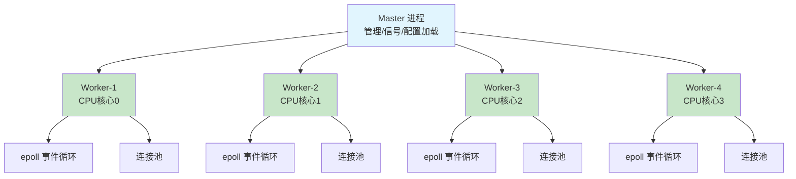
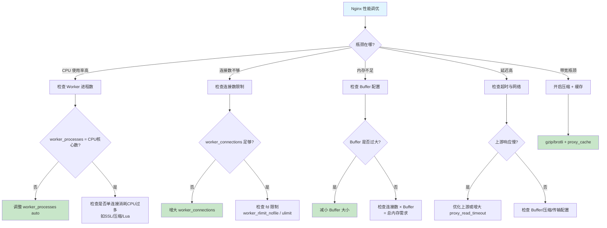
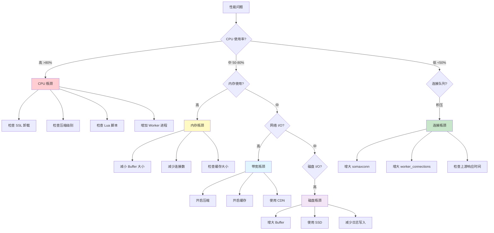

# 性能调优核心参数

Nginx 以高性能著称，但默认配置并非为所有场景最优。在高并发、大流量、特殊业务需求下，需要根据硬件资源和应用特征调优核心参数。本文从 Worker 进程模型、连接数、缓冲区、超时、限制等维度，系统讲解 Nginx 性能调优的每一个关键参数。

## 1. worker_processes：进程数配置

### 1.1 Worker 进程模型

Nginx 采用多进程架构，一个 Master 进程管理多个 Worker 进程：



```nginx
# nginx.conf main 上下文

# auto: 自动检测CPU核心数（推荐）
worker_processes auto;

# 手动指定（某些场景需要）
worker_processes 4;

# 与CPU核心数一致时性能最优
# 查看CPU核心数：nproc 或 lscpu
```

### 1.2 CPU 亲和性

CPU 亲和性（CPU Affinity）将 Worker 进程绑定到特定的 CPU 核心，减少上下文切换和缓存失效：

```nginx
# 手动绑定 Worker 到 CPU 核心
# 4核CPU示例
worker_processes 4;
worker_cpu_affinity 0001 0010 0100 1000;

# 8核CPU示例
worker_processes 8;
worker_cpu_affinity 00000001 00000010 00000100 00001000
                     00010000 00100000 01000000 10000000;

# auto: 自动绑定（Nginx 1.9.10+）
worker_processes auto;
worker_cpu_affinity auto;
```

::: tip 何时使用 auto
在绝大多数场景下，`worker_processes auto;` + `worker_cpu_affinity auto;` 是最佳选择。Nginx 会自动将每个 Worker 绑定到独立的 CPU 核心。

手动绑定仅适用于特殊场景：
- NUMA 架构服务器，需要控制内存访问的 NUMA 节点
- 与其他服务共享服务器，需要隔离 CPU 资源
- 容器环境中 CPU 核心数不等于物理核心数
:::

### 1.3 Worker 进程与 CPU 的关系

```bash
# 查看 Worker 进程绑定的 CPU 核心
ps -eo pid,psr,comm | grep nginx

# 输出示例：
# PID  PSR COMMAND
# 1234  0  nginx: worker process
# 1235  1  nginx: worker process
# 1236  2  nginx: worker process
# 1237  3  nginx: worker process

# 查看 CPU 核心数
nproc          # 逻辑核心数
lscpu          # 详细CPU信息

# 查看NUMA拓扑
numactl --hardware
```

### 1.4 Worker 进程调优决策

```mermaid
flowchart TD
    A[Worker进程数配置] --> B{服务器是否专用于Nginx?}
    B -->|是| C[worker_processes auto]
    B -->|否 共享服务器| D{其他服务CPU占用?}
    D -->|低 <30%| C
    D -->|高 >30%| E[worker_processes N<br/>N=可用核心数]
    C --> F{是否NUMA架构?}
    E --> F
    F -->|是| G[worker_cpu_affinity auto<br/>+ NUMA绑定]
    F -->|否| H[worker_cpu_affinity auto]
    G --> I[验证: ps -eo pid,psr,comm | grep nginx]
    H --> I

    style C fill:#c8e6c9
    style E fill:#fff9c4
```

## 2. worker_connections：连接数调优

### 2.1 连接数计算

`worker_connections` 设置单个 Worker 进程可以同时处理的最大连接数：

```nginx
events {
    worker_connections 1024;  # 默认值
    # 生产环境通常设置为 4096-65535
}
```

最大并发连接数计算：

```
最大连接数 = worker_processes × worker_connections

# 作为反向代理时（每个请求占用两个连接：客户端→Nginx→上游）
最大并发请求数 = worker_processes × worker_connections / 2

# 示例：
# worker_processes = 8
# worker_connections = 4096
# 最大连接数 = 8 × 4096 = 32,768
# 最大并发请求（反向代理） = 32,768 / 2 = 16,384
```

### 2.2 连接数与系统限制

```nginx
# 1. 修改 worker_rlimit_nofile（Nginx层面）
# 该值必须 >= worker_connections
worker_rlimit_nofile 65535;

events {
    worker_connections 4096;
}
```

```bash
# 2. 修改系统文件描述符限制（OS层面）

# 临时修改
ulimit -n 65535

# 永久修改：/etc/security/limits.conf
# * soft nofile 65535
# * hard nofile 65535

# 3. 修改 fs.file-max（内核层面）
# /etc/sysctl.conf
# fs.file-max = 2000000

# 查看当前限制
ulimit -n              # 用户级限制
cat /proc/sys/fs/file-max  # 内核级限制
```

### 2.3 连接数推荐值

| 场景 | worker_connections | worker_rlimit_nofile | 说明 |
|------|-------------------|---------------------|------|
| 小型站点 | 1024 | 2048 | 日PV < 10万 |
| 中型站点 | 4096 | 8192 | 日PV 10-100万 |
| 大型站点 | 65535 | 65535 | 日PV > 100万 |
| API网关 | 4096-65535 | 65535 | 长连接较多 |

### 2.4 events 块完整配置

```nginx
events {
    # 单个Worker最大连接数
    worker_connections 4096;

    # 事件模型（Linux 默认 epoll）
    use epoll;

    # 允许一次性接受所有新连接
    multi_accept on;

    # 互斥锁：防止惊群效应
    accept_mutex off;  # 高并发下建议关闭（Nginx 1.11.3+ 默认关闭）
}
```

::: important accept_mutex 与惊群效应
当新连接到来时，所有 Worker 进程都会被唤醒，但只有一个能接受连接，这就是惊群效应（Thundering Herd）。`accept_mutex` 通过加锁确保只有一个 Worker 被唤醒。

- 低并发（< 几百连接/秒）：`accept_mutex on` 减少不必要的唤醒
- 高并发（> 几百连接/秒）：`accept_mutex off` 避免锁竞争成为瓶颈

Nginx 1.11.3+ 默认 `accept_mutex off`，因为 Linux 内核已经通过 `EPOLLEXCLUSIVE` 解决了惊群问题。
:::

## 3. worker_rlimit_nofile：文件描述符限制

### 3.1 文件描述符消耗

每个 Nginx 连接、日志文件、缓存文件、代理连接都需要文件描述符：

```nginx
# 文件描述符消耗估算
# 每个连接: 1个fd（客户端连接）
# 反向代理: +1个fd（上游连接）
# 日志文件: ~5个fd
# 缓存文件: 动态，取决于活跃缓存数

# 推荐计算方式：
# worker_rlimit_nofile = worker_connections × 2 + 100（安全余量）
# 例：worker_connections = 4096 → worker_rlimit_nofile = 8292
# 建议向上取整到 2 的幂或 65535

worker_rlimit_nofile 65535;
```

### 3.2 完整的限制体系

```bash
# 三层限制必须全部放开

# 1. 内核级限制
cat /proc/sys/fs/file-max
# 修改: sysctl -w fs.file-max=2000000

# 2. 用户级限制
ulimit -n
# 修改: /etc/security/limits.conf
# nginx soft nofile 65535
# nginx hard nofile 65535

# 3. Nginx 级限制
# nginx.conf: worker_rlimit_nofile 65535

# 关系：内核 ≥ 用户 ≥ Nginx
# 如果任何一层不够，都会报错：too many open files
```

```bash
# 诊断文件描述符问题

# 查看当前 Nginx 进程的 fd 使用情况
ls /proc/$(pgrep -f "nginx: master" | head -1)/fd | wc -l

# 查看系统 fd 使用统计
cat /proc/sys/fs/file-nr
# 输出：已分配  未使用  最大值
# 例如：12345   0       2000000

# 监控 fd 使用趋势
watch -n 1 'cat /proc/sys/fs/file-nr'
```

## 4. Buffer 大小调优

Buffer 配置直接影响 Nginx 的内存使用和请求处理能力。过小的 Buffer 导致磁盘 I/O，过大的 Buffer 浪费内存。

### 4.1 客户端请求 Buffer

```nginx
http {
    # 客户端请求头缓冲区
    # 默认 1k，通常足够
    # 如果请求头很大（很多Cookie、自定义头），需要调大
    client_header_buffer_size 1k;

    # 大请求头的备用缓冲区
    # 默认 4k × 8 = 32k
    large_client_header_buffers 4 8k;

    # 客户端请求体缓冲区
    # 请求体超过此值会写入临时文件
    client_body_buffer_size 16k;

    # 客户端请求体最大大小
    client_max_body_size 10m;

    server {
        listen 80;

        # 文件上传场景
        location /upload/ {
            client_max_body_size 100m;
            client_body_buffer_size 1m;
            proxy_pass http://backend;
        }

        # API 场景
        location /api/ {
            client_max_body_size 1m;
            client_body_buffer_size 64k;
            proxy_pass http://backend;
        }
    }
}
```

### 4.2 代理 Buffer

```nginx
http {
    # proxy_buffer_size: 读取上游响应头的缓冲区
    # 默认 4k/8k（取决于平台）
    proxy_buffer_size 4k;

    # proxy_buffers: 读取上游响应体的缓冲区
    # 格式：数量 大小
    proxy_buffers 8 4k;

    # proxy_busy_buffers_size: 忙时缓冲区大小
    # 响应尚未完全读取就向客户端发送时的缓冲区
    proxy_busy_buffers_size 8k;

    server {
        # 大响应场景（如大数据API）
        location /api/reports/ {
            proxy_buffer_size 8k;
            proxy_buffers 16 16k;
            proxy_busy_buffers_size 32k;
            proxy_pass http://backend;
        }

        # 流式响应场景（SSE/WebSocket）
        location /api/stream/ {
            proxy_buffering off;  # 关闭代理缓冲，实时转发
            proxy_pass http://backend;
        }
    }
}
```

### 4.3 Buffer 调优原则

```nginx
# 原则1：proxy_buffer_size >= 上游响应头大小
# 检查上游响应头大小
# curl -sI https://api.example.com/ | wc -c
proxy_buffer_size 8k;

# 原则2：proxy_buffers 总大小 >= 典型响应体大小
# 总大小 = 数量 × 单个大小
# 8 × 4k = 32k（适合小响应）
# 16 × 16k = 256k（适合中等响应）
# 8 × 32k = 256k（适合大响应）
proxy_buffers 8 16k;

# 原则3：proxy_busy_buffers_size <= proxy_buffers 总大小 / 2
proxy_busy_buffers_size 16k;

# 原则4：大响应优先调 proxy_buffers，小响应调 proxy_buffer_size
```

::: warning Buffer 与内存
每个请求的 Buffer 是独立分配的。如果 `proxy_buffers 16 16k`，则每个代理请求最多使用 256KB 内存。在 1000 并发请求时，仅 Buffer 就需要 250MB 内存。

计算公式：
```
总内存 ≈ worker_connections × (client_buffer + proxy_buffer)
       = 4096 × (16k + 256k)
       = 4096 × 272k
       ≈ 1.06 GB
```
确保服务器有足够的物理内存。
:::

## 5. 超时参数调优

### 5.1 客户端超时

```nginx
http {
    # keepalive 超时
    # 长连接保持时间，0表示关闭长连接
    keepalive_timeout 65s;

    # 长连接最大请求数
    keepalive_requests 1000;

    # 客户端请求头超时
    # 客户端发送请求头的最大时间
    client_header_timeout 60s;

    # 客户端请求体超时
    # 客户端发送请求体的最大间隔时间
    client_body_timeout 60s;

    # 发送响应超时
    # 向客户端写入响应的超时
    send_timeout 60s;

    server {
        listen 80;
    }
}
```

### 5.2 代理超时

```nginx
http {
    # 与上游建立连接的超时
    proxy_connect_timeout 60s;

    # 从上游读取响应的超时
    # 两次成功读取之间的间隔
    proxy_read_timeout 60s;

    # 向上游发送请求的超时
    # 两次成功写入之间的间隔
    proxy_send_timeout 60s;

    server {
        # 快速API
        location /api/fast/ {
            proxy_connect_timeout 5s;
            proxy_read_timeout 10s;
            proxy_send_timeout 5s;
            proxy_pass http://backend;
        }

        # 慢API（报表生成等）
        location /api/reports/ {
            proxy_connect_timeout 10s;
            proxy_read_timeout 300s;
            proxy_send_timeout 30s;
            proxy_pass http://backend;
        }

        # SSE/长轮询
        location /api/events/ {
            proxy_connect_timeout 5s;
            proxy_read_timeout 3600s;  # 1小时
            proxy_send_timeout 5s;
            proxy_buffering off;
            proxy_pass http://backend;
        }
    }
}
```

### 5.3 超时参数对照表

| 参数 | 默认值 | 作用 | 推荐值 |
|------|--------|------|--------|
| keepalive_timeout | 75s | 长连接保持时间 | 60-120s |
| keepalive_requests | 100 | 长连接最大请求数 | 1000+ |
| client_header_timeout | 60s | 客户端请求头超时 | 30-60s |
| client_body_timeout | 60s | 客户端请求体超时 | 30-60s |
| send_timeout | 60s | 发送响应超时 | 30-60s |
| proxy_connect_timeout | 60s | 上游连接超时 | 5-30s |
| proxy_read_timeout | 60s | 上游读取超时 | 30-300s |
| proxy_send_timeout | 60s | 上游发送超时 | 5-30s |
| proxy_next_upstream_timeout | 0 | 尝试下一个上游超时 | 10-30s |

## 6. 请求体大小：client_max_body_size

```nginx
http {
    # 全局默认：1MB
    client_max_body_size 1m;

    server {
        # 文件上传
        location /upload/ {
            client_max_body_size 100m;
            # 超过此值的请求返回 413 Request Entity Too Large
        }

        # 图片上传
        location /api/avatar/ {
            client_max_body_size 5m;
        }

        # JSON API
        location /api/ {
            client_max_body_size 1m;
        }
    }
}
```

::: important 413 错误排查
`413 Request Entity Too Large` 是文件上传场景最常见的错误。需要检查：
1. `client_max_body_size` — Nginx 限制
2. 上游应用服务器的限制（如 Spring 的 `spring.servlet.multipart.max-file-size`）
3. 前端的请求头 `Content-Length` 是否正确

注意：`client_max_body_size` 可以出现在 http/server/location 三级，就近原则。
:::

## 7. 输出压缩与传输优化

### 7.1 压缩与传输的完整配置

```nginx
http {
    # 零拷贝传输
    sendfile on;
    tcp_nopush on;
    tcp_nodelay on;

    # Gzip 压缩
    gzip on;
    gzip_comp_level 5;
    gzip_min_length 1024;
    gzip_types text/plain text/css application/javascript application/json image/svg+xml;
    gzip_vary on;
    gzip_proxied any;
    gzip_buffers 16 8k;

    # 响应体切片（大文件分段发送）
    # slice 1m;
    # proxy_set_header Range $slice_range;

    server {
        listen 80;
    }
}
```

## 8. 性能调优检查清单

### 8.1 调优决策树



### 8.2 生产级调优配置模板

```nginx
user nginx;
worker_processes auto;
worker_cpu_affinity auto;
worker_rlimit_nofile 65535;
error_log /var/log/nginx/error.log warn;
pid /var/run/nginx.pid;

events {
    worker_connections 4096;
    use epoll;
    multi_accept on;
    accept_mutex off;
}

http {
    include /etc/nginx/mime.types;
    default_type application/octet-stream;

    # ===== 传输优化 =====
    sendfile on;
    tcp_nopush on;
    tcp_nodelay on;

    # ===== 连接优化 =====
    keepalive_timeout 65s;
    keepalive_requests 1000;

    # ===== 客户端限制 =====
    client_header_buffer_size 1k;
    large_client_header_buffers 4 8k;
    client_body_buffer_size 16k;
    client_max_body_size 10m;
    client_header_timeout 30s;
    client_body_timeout 30s;
    send_timeout 30s;

    # ===== 代理优化 =====
    proxy_buffer_size 8k;
    proxy_buffers 8 16k;
    proxy_busy_buffers_size 16k;
    proxy_connect_timeout 10s;
    proxy_read_timeout 60s;
    proxy_send_timeout 30s;

    # ===== 压缩 =====
    gzip on;
    gzip_comp_level 5;
    gzip_min_length 1024;
    gzip_types text/plain text/css application/javascript application/json image/svg+xml;
    gzip_vary on;
    gzip_proxied any;

    # ===== 文件缓存 =====
    open_file_cache max=10000 inactive=30s;
    open_file_cache_valid 60s;
    open_file_cache_min_uses 2;

    # ===== 安全 =====
    server_tokens off;

    # ===== 上游长连接 =====
    upstream backend {
        server 10.0.0.10:8080;
        server 10.0.0.11:8080;
        keepalive 32;
    }

    server {
        listen 80;

        location / {
            proxy_pass http://backend;
            proxy_http_version 1.1;
            proxy_set_header Connection "";
            proxy_set_header Host $host;
            proxy_set_header X-Real-IP $remote_addr;
        }
    }
}
```

## 9. Benchmark 工具

### 9.1 wrk

```bash
# 安装 wrk
# Ubuntu: apt install wrk
# CentOS: 编译安装
git clone https://github.com/wg/wrk.git
cd wrk && make && sudo cp wrk /usr/local/bin/

# 基本测试
wrk -t4 -c100 -d30s http://example.com/

# 参数说明：
# -t4:     4个线程
# -c100:   100个连接
# -d30s:   持续30秒

# 输出解读：
# Running 30s test @ http://example.com/
#   4 threads and 100 connections
#   Thread Stats   Avg      Stdev     Max   +/- Stdev
#     Latency    12.34ms   5.67ms  89.12ms   75.43%
#     Req/Sec     2.05k   201.34     3.12k    68.50%
#   Latency Distribution
#     50%   10.12ms
#     75%   14.56ms
#     90%   19.23ms
#     99%   35.67ms
#   245678 requests in 30.01s, 89.12MB read
# Requests/sec:   8186.23
# Transfer/sec:     2.97MB

# 带延迟详细分布
wrk -t4 -c100 -d30s --latency http://example.com/

# 测试特定API
wrk -t4 -c50 -d10s -s post.lua http://api.example.com/api/data

# post.lua 脚本
cat > post.lua << 'EOF'
wrk.method = "POST"
wrk.body   = '{"key":"value"}'
wrk.headers["Content-Type"] = "application/json"
EOF
```

### 9.2 ab (Apache Benchmark)

```bash
# 安装
# Ubuntu: apt install apache2-utils
# CentOS: yum install httpd-tools

# 基本测试
ab -n 10000 -c 100 http://example.com/

# 参数说明：
# -n 10000: 总请求数
# -c 100:  并发数

# 带Keep-Alive测试
ab -n 10000 -c 100 -k http://example.com/

# POST请求测试
ab -n 1000 -c 50 -p post.data -T "application/json" http://api.example.com/api/

# 输出关键指标：
# Requests per second:    8186.23 [#/sec] (mean)
# Time per request:       12.216 [ms] (mean)
# Time per request:       0.122 [ms] (mean, across all concurrent requests)
# Transfer rate:          3044.23 [Kbytes/sec] received
```

### 9.3 hey

```bash
# 安装
# go install github.com/rakyll/hey@latest
# 或下载二进制

# 基本测试
hey -n 10000 -c 100 http://example.com/

# 参数与 wrk 类似
# -n: 总请求数
# -c: 并发数
# -z: 持续时间
hey -z 30s -c 100 http://example.com/

# POST请求
hey -n 1000 -c 50 -m POST -H "Content-Type: application/json" \
    -d '{"key":"value"}' http://api.example.com/api/

# 输出包含更详细的延迟分布和直方图
```

### 9.4 压测方法与注意事项

::: warning 压测注意事项
1. **不要在生产环境压测**：使用独立的测试环境
2. **预热后再采集数据**：前几秒的数据不稳定
3. **多次测试取平均**：单次结果可能有偏差
4. **逐步增加并发**：从小并发开始，逐步加到目标值
5. **注意客户端瓶颈**：压测机本身可能成为瓶颈
6. **监控服务端资源**：压测时同步监控CPU/内存/网络/磁盘
7. **关闭日志**：压测时 `access_log off` 减少磁盘影响
8. **Keep-Alive**：测试时开启 Keep-Alive 更贴近真实场景
:::

```bash
# 完整的压测流程

# 1. 预热
wrk -t2 -c10 -d5s http://example.com/ > /dev/null 2>&1

# 2. 逐步加压
for c in 50 100 200 500 1000; do
    echo "=== 并发数: $c ==="
    wrk -t4 -c$c -d30s --latency http://example.com/
    sleep 5
done

# 3. 监控服务端
# 另一个终端
watch -n 1 'echo "=== CPU ===" && mpstat 1 1 && echo "=== 内存 ===" && free -h && echo "=== 连接 ===" && ss -s'
```

## 10. 性能监控与瓶颈定位

### 10.1 Nginx 内置状态页

```nginx
# 编译时需要 --with-http_stub_status_module
server {
    listen 80;
    server_name localhost;

    location /nginx_status {
        stub_status on;
        access_log off;
        allow 127.0.0.1;
        deny all;
    }
}
```

```bash
# 访问状态页
curl http://127.0.0.1/nginx_status

# 输出：
# Active connections: 291
# server accepts handled requests
#  16630948 16630948 31070465
# Reading: 6 Writing: 179 Waiting: 106

# Active connections: 当前活跃连接数
# accepts: 累计接受的连接数
# handled: 累计处理的连接数（应与accepts相同）
# requests: 累计请求数
# Reading: 正在读取请求头的连接数
# Writing: 正在写入响应的连接数
# Waiting: Keep-Alive空闲连接数
```

### 10.2 系统级监控

```bash
# CPU 使用率
top -bn1 | grep nginx

# 内存使用
ps -eo pid,rss,vsz,comm | grep nginx

# 网络连接统计
ss -s
ss -tn state established | wc -l

# 文件描述符使用
ls /proc/$(pgrep -f "nginx: master" | head -1)/fd | wc -l

# 系统负载
uptime

# I/O 统计
iostat -x 1 5
```

### 10.3 Nginx 性能指标监控脚本

```bash
#!/bin/bash
# nginx_monitor.sh - Nginx 性能监控

while true; do
    STATUS=$(curl -s http://127.0.0.1/nginx_status)
    ACTIVE=$(echo "$STATUS" | awk '/Active/ {print $3}')
    READING=$(echo "$STATUS" | awk '/Reading/ {print $2}')
    WRITING=$(echo "$STATUS" | awk '/Writing/ {print $4}')
    WAITING=$(echo "$STATUS" | awk '/Waiting/ {print $6}')

    CONNECTIONS=$(ss -tn state established | wc -l)
    FD_COUNT=$(ls /proc/$(pgrep -f "nginx: master" | head -1)/fd 2>/dev/null | wc -l)

    echo "$(date '+%Y-%m-%d %H:%M:%S') | Active: $ACTIVE | Reading: $READING | Writing: $WRITING | Waiting: $WAITING | Estab: $CONNECTIONS | FD: $FD_COUNT"

    sleep 5
done
```

### 10.4 瓶颈定位方法



## 11. 特殊场景调优

### 11.1 高并发短连接

```nginx
# 适合：API 网关、短连接场景
worker_processes auto;
worker_rlimit_nofile 100000;

events {
    worker_connections 65535;
    multi_accept on;
    accept_mutex off;
}

http {
    keepalive_timeout 30s;     # 短超时释放连接
    keepalive_requests 500;    # 减少单连接请求数
    reset_timedout_connection on;  # 超时立即关闭

    # 减少不必要的日志
    access_log off;  # 或采样日志
}
```

### 11.2 大文件传输

```nginx
# 适合：文件下载、视频流
http {
    sendfile on;
    tcp_nopush on;
    tcp_nodelay on;
    aio on;
    directio 5m;

    # 大 Buffer
    output_buffers 2 1m;
    proxy_buffer_size 16k;
    proxy_buffers 16 64k;

    # 长超时
    proxy_read_timeout 300s;
    send_timeout 300s;
}
```

### 11.3 SSL/TLS 密集场景

```nginx
# 适合：HTTPS 高并发
http {
    # SSL Session 缓存
    ssl_session_cache shared:SSL:10m;
    ssl_session_timeout 1d;
    ssl_session_tickets off;

    # OCSP Stapling
    ssl_stapling on;
    ssl_stapling_verify on;

    # 优先使用服务端加密套件
    ssl_prefer_server_ciphers on;

    # 优化加密套件（性能优先）
    ssl_ciphers 'ECDHE-ECDSA-AES128-GCM-SHA256:ECDHE-RSA-AES128-GCM-SHA256';
}
```

### 11.4 WebSocket 长连接

```nginx
# 适合：实时通信、WebSocket
http {
    # 长超时
    proxy_read_timeout 3600s;
    proxy_send_timeout 3600s;

    # 关闭缓冲
    proxy_buffering off;

    # WebSocket 升级
    map $http_upgrade $connection_upgrade {
        default upgrade;
        '' close;
    }

    server {
        location /ws/ {
            proxy_pass http://backend;
            proxy_http_version 1.1;
            proxy_set_header Upgrade $http_upgrade;
            proxy_set_header Connection $connection_upgrade;
        }
    }
}
```

## 12. 参考文档

- [Nginx Core Functionality: worker_processes](https://nginx.org/en/docs/ngx_core_module.html#worker_processes)
- [Nginx Core Functionality: worker_connections](https://nginx.org/en/docs/ngx_core_module.html#worker_connections)
- [Nginx Core Functionality: worker_rlimit_nofile](https://nginx.org/en/docs/ngx_core_module.html#worker_rlimit_nofile)
- [Nginx ngx_http_proxy_module: proxy_buffers](https://nginx.org/en/docs/http/ngx_http_proxy_module.html#proxy_buffers)
- [Nginx ngx_http_proxy_module: proxy_connect_timeout](https://nginx.org/en/docs/http/ngx_http_proxy_module.html#proxy_connect_timeout)
- [Nginx ngx_http_core_module: client_max_body_size](https://nginx.org/en/docs/http/ngx_http_core_module.html#client_max_body_size)
- [Nginx ngx_http_core_module: keepalive_timeout](https://nginx.org/en/docs/http/ngx_http_core_module.html#keepalive_timeout)
- [wrk - HTTP benchmarking tool](https://github.com/wg/wrk)
- [hey - HTTP load generator](https://github.com/rakyll/hey)
