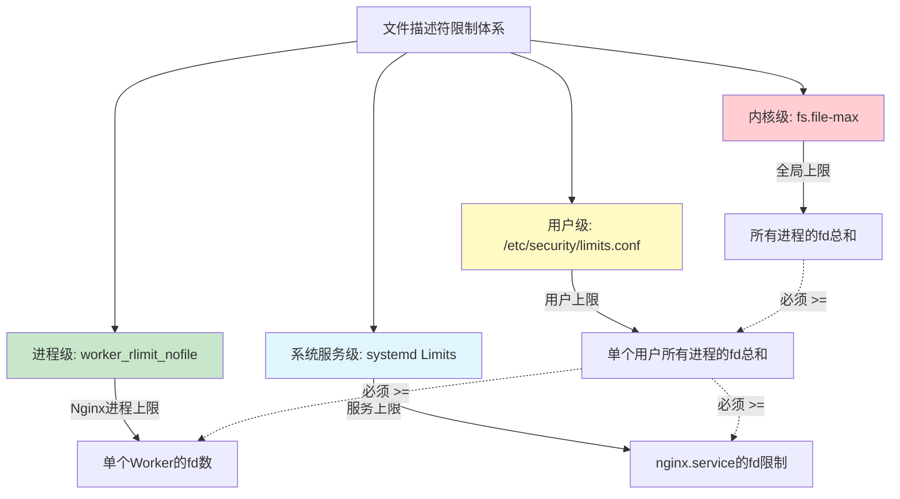
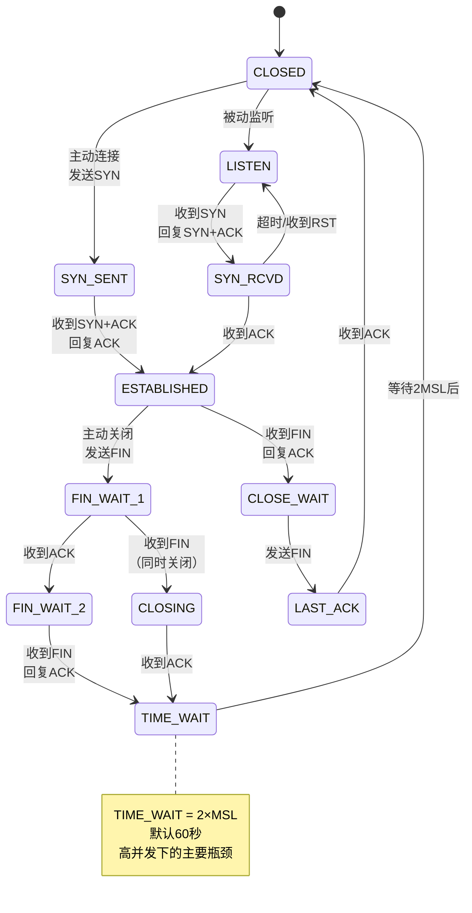
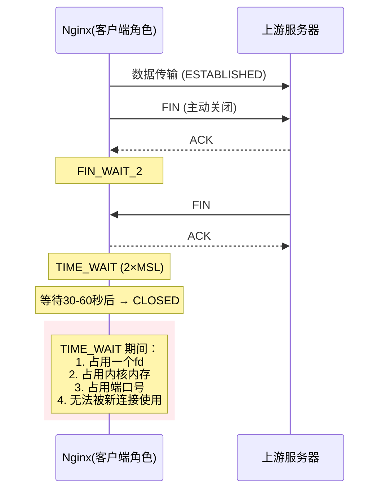
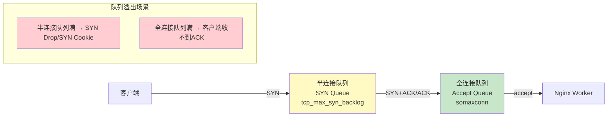

# 内核参数与系统级优化

Nginx 运行在 Linux 内核之上，内核参数的配置直接影响 Nginx 的性能上限。即使 Nginx 配置完美，如果系统限制了连接数、文件描述符、TCP 缓冲区等资源，性能仍然无法提升。本文从文件描述符、TCP 连接优化、缓冲区、TIME_WAIT 处理等维度，系统讲解 Linux 内核参数调优。

## 1. 文件描述符限制

### 1.1 文件描述符的层级关系

文件描述符（File Descriptor，fd）是 Linux 中一切资源的基础抽象——网络连接、文件、管道、套接字都是 fd。Nginx 的每个连接、日志文件、缓存文件都需要 fd。



### 1.2 fs.file-max

`fs.file-max` 是内核级别的全局 fd 上限，所有进程共享：

```bash
# 查看当前值
cat /proc/sys/fs/file-max
# 或
sysctl fs.file-max

# 临时修改
sysctl -w fs.file-max=2000000

# 永久修改：/etc/sysctl.conf
echo "fs.file-max = 2000000" >> /etc/sysctl.conf
sysctl -p
```

推荐值计算：

```
fs.file-max = 预期最大连接数 × 4 + 65535

# 示例：
# 10万并发连接 → fs.file-max = 100000 × 4 + 65535 = 465535 → 取 500000
# 50万并发连接 → fs.file-max = 500000 × 4 + 65535 = 2065535 → 取 2000000
```

### 1.3 用户级限制：nofile

```bash
# 查看当前用户的 fd 限制
ulimit -n
# 默认值通常是 1024

# 临时修改（仅当前会话有效）
ulimit -n 65535

# 永久修改：/etc/security/limits.conf
cat >> /etc/security/limits.conf << 'EOF'
# Nginx 用户
nginx soft nofile 65535
nginx hard nofile 65535

# 或所有用户
* soft nofile 65535
* hard nofile 65535
EOF

# 注意：修改后需要重新登录才能生效
```

### 1.4 Nginx 进程级限制

```nginx
# nginx.conf
user nginx;
worker_processes auto;

# 设置 Worker 进程的最大 fd 数
# 该值必须 >= worker_connections × 2（反向代理场景）
worker_rlimit_nofile 65535;

events {
    worker_connections 4096;
    # 4096 连接 × 2（客户端+上游）= 8192 fd
    # 加上日志、缓存等，65535 足够
}
```

### 1.5 systemd 服务级限制

```bash
# 如果 Nginx 通过 systemd 管理，需要额外配置
# /etc/systemd/system/nginx.service 或 override

# 方法1：编辑服务配置
systemctl edit nginx

# 添加以下内容：
[Service]
LimitNOFILE=65535

# 方法2：直接编辑 service 文件
# /usr/lib/systemd/system/nginx.service
# 在 [Service] 段添加：
# LimitNOFILE=65535

# 重新加载并重启
systemctl daemon-reload
systemctl restart nginx

# 验证
cat /proc/$(pgrep -f "nginx: master" | head -1)/limits | grep "open files"
```

::: important 限制层级必须从上到下放通
如果 `fs.file-max = 100000` 但 `ulimit -n = 65535`，实际 Nginx 最多使用 65535 个 fd。如果 `ulimit -n = 65535` 但 systemd 的 `LimitNOFILE = 1024`，Nginx 只能用 1024 个 fd。

**必须确保**：`fs.file-max >= nofile(hard) >= worker_rlimit_nofile >= worker_connections × 2`
:::

## 2. TCP 连接优化

TCP 是 Nginx 最核心的传输层协议，内核 TCP 参数的优化直接影响连接建立速度、传输效率和资源回收。

### 2.1 TCP 状态机



### 2.2 TCP_TW_REUSE：复用 TIME_WAIT 连接

```bash
# 允许将 TIME_WAIT 状态的连接重新用于新的 TCP 连接
# 仅对客户端（主动发起连接方）有效
net.ipv4.tcp_tw_reuse = 1

# 注意：
# - 仅在客户端角色（Nginx作为客户端连接上游）有效
# - 必须配合 tcp_timestamps = 1 使用
# - RFC 1323 要求 PAWS（Protection Against Wrapped Sequences）
# - 在 NAT 环境下可能有潜在风险
```

::: warning tcp_tw_reuse vs tcp_tw_recycle
- `tcp_tw_reuse`：安全地复用 TIME_WAIT 连接，需要时间戳支持，推荐开启
- `tcp_tw_recycle`：快速回收 TIME_WAIT 连接，在 NAT 环境下会导致连接失败

**关键区别**：`tcp_tw_recycle` 基于 per-host 的时间戳判断，当多个客户端通过 NAT 共享同一 IP 时，时间戳不一致会导致后到的包被丢弃。Linux 4.12+ 已移除 `tcp_tw_recycle` 参数。

**建议**：只使用 `tcp_tw_reuse = 1`，不使用 `tcp_tw_recycle`。
:::

### 2.3 tcp_max_tw_buckets

```bash
# TIME_WAIT 状态连接的最大数量
# 超过此值时，新关闭的连接直接跳过 TIME_WAIT 进入 CLOSED
net.ipv4.tcp_max_tw_buckets = 65535

# 默认值通常是 4096 × 内存GB数
# 对于高并发服务器，建议调大到 65535 或更高

# 查看 TIME_WAIT 数量
ss -tn state time-wait | wc -l

# 监控 TIME_WAIT 变化
watch -n 1 'ss -tn state time-wait | wc -l'
```

### 2.4 tcp_fin_timeout

```bash
# TIME_WAIT 状态的持续时间（秒）
# 默认 60 秒（2×MSL，MSL=30s）
# 降低此值可以更快回收 TIME_WAIT 连接
net.ipv4.tcp_fin_timeout = 30

# 注意：过小的值可能导致旧连接的延迟包干扰新连接
# 推荐范围：15-60 秒
# 局域网环境可以设为 15-30 秒
# 公网环境建议保持 30-60 秒
```

### 2.5 somaxconn：连接队列积压

```bash
# listen() 的全连接队列最大长度
# Nginx 的 backlog 参数不能超过此值
net.core.somaxconn = 65535

# 默认值通常是 128 或 4096
# 对于高并发服务器必须调大

# 对应 Nginx 配置：
# listen 80 backlog=65535;
```

```nginx
# Nginx 配置
server {
    listen 80 backlog=65535;
    # backlog = min(此处值, net.core.somaxconn)
}
```

### 2.6 netdev_max_backlog

```bash
# 网络设备接收数据包的积压队列长度
# 当网卡接收速度大于内核处理速度时，数据包暂存在此队列
net.core.netdev_max_backlog = 65535

# 默认值通常是 1000
# 10Gbps 网卡或高流量场景建议调大
```

### 2.7 tcp_max_syn_backlog

```bash
# SYN 队列（半连接队列）的最大长度
# 当大量新连接同时到来时，SYN 队列可能溢出
net.ipv4.tcp_max_syn_backlog = 65535

# 默认值通常是 1024
# 高并发场景必须调大
# 此值必须 <= net.core.somaxconn

# 查看半连接队列溢出次数
netstat -s | grep "SYN sockets"
# 或
nstat -az | grep TcpExtSyncookiesReceived
```

### 2.8 tcp_syncookies

```bash
# SYN Flood 攻击防护
# 当 SYN 队列满时，启用 SYN Cookie 机制
# 0: 关闭
# 1: 仅在 SYN 队列满时启用
# 2: 始终启用
net.ipv4.tcp_syncookies = 1

# SYN Cookie 原理：
# 不保存半连接状态，而是将状态编码到 SYN-ACK 的初始序列号中
# 客户端回复 ACK 时，从确认号反推出原始 SYN 信息
# 代价：无法使用 TCP Options（如 Window Scaling、SACK）
```

::: important SYN Cookie 的取舍
`tcp_syncookies = 1` 是推荐配置——正常情况下不影响性能，只在 SYN Flood 时启用保护。但 `tcp_syncookies = 2`（始终启用）会导致部分 TCP 高级特性失效，影响大带宽传输性能。不建议设为 2。
:::

## 3. TCP 缓冲区优化

### 3.1 核心缓冲区参数

```bash
# TCP 读写缓冲区的最大值（字节）
net.core.rmem_max = 16777216     # 16MB
net.core.wmem_max = 16777216     # 16MB

# TCP 读写缓冲区的默认值和范围（字节）
net.ipv4.tcp_rmem = 4096 87380 16777216
# min: 最小值 4KB
# default: 默认值 ~85KB
# max: 最大值 16MB

net.ipv4.tcp_wmem = 4096 65536 16777216
# min: 最小值 4KB
# default: 默认值 64KB
# max: 最大值 16MB

# 通用读写缓冲区（非TCP）
net.core.rmem_default = 262144   # 256KB
net.core.wmem_default = 262144   # 256KB

# socket 缓冲区的最大值
net.core.optmem_max = 25165824   # 24MB
```

### 3.2 缓冲区调优原则

```bash
# 原则1：rmem_max/wmem_max >= tcp_rmem/tcp_wmem 的 max 值
# 原则2：缓冲区大小应根据 BDP（Bandwidth-Delay Product）计算
# BDP = 带宽 × RTT
#
# 示例：
# 带宽 = 1Gbps，RTT = 10ms
# BDP = 1,000,000,000 × 0.01 = 10,000,000 bytes ≈ 10MB
#
# 缓冲区应 >= BDP，才能充分利用带宽

# 原则3：过大的缓冲区浪费内存
# 内存消耗 = 连接数 × 缓冲区大小
# 10,000 连接 × 16MB = 160GB（显然不合理）
# 实际上内核使用动态调整，不会一次性分配 max 值
```

### 3.3 TCP 窗口与拥塞控制

```bash
# 启用 TCP 窗口缩放（支持 > 64KB 窗口）
net.ipv4.tcp_window_scaling = 1

# 启用 TCP 时间戳（tcp_tw_reuse 的前提）
net.ipv4.tcp_timestamps = 1

# 启用 TCP SACK（选择性确认，提升丢包恢复效率）
net.ipv4.tcp_sack = 1

# 启用 TCP FACK（Forward ACK，SACK的增强版）
net.ipv4.tcp_fack = 1

# 拥塞控制算法
# 查看可用算法
sysctl net.ipv4.tcp_available_congestion_control
# 通常: cubic reno

# 查看当前算法
sysctl net.ipv4.tcp_congestion_control
# 默认: cubic

# BBR 算法（Linux 4.9+，适合高延迟高丢包网络）
net.ipv4.tcp_congestion_control = bbr
net.core.default_qdisc = fq
```

::: tip BBR vs Cubic
- **Cubic**：默认算法，基于丢包的拥塞控制，在有丢包的网络中会主动降速
- **BBR**：基于带宽和延迟的拥塞控制，在有一定丢包率的网络中表现更好

选择建议：
- 数据中心内网（低延迟、几乎无丢包）：Cubic 即可
- 公网/跨地域（高延迟、可能有丢包）：BBR 更优
- CDN/全球加速：强烈推荐 BBR
:::

## 4. TIME_WAIT 问题与解决

### 4.1 TIME_WAIT 产生原因



Nginx 作为客户端连接上游时，是主动关闭方，会产生 TIME_WAIT：

```nginx
# 默认情况下，Nginx 使用 HTTP/1.0 连接上游
# 每次请求后上游关闭连接，Nginx 进入 TIME_WAIT

# 问题场景：
# 10,000 req/s × 60s TIME_WAIT = 600,000 个 TIME_WAIT 状态
# 大量 fd 和端口被占用
```

### 4.2 解决方案

**方案1：启用 Keep-Alive 长连接（最有效）**

```nginx
upstream backend {
    server 10.0.0.10:8080;
    server 10.0.0.11:8080;
    keepalive 32;  # 每个 Worker 保持 32 个空闲长连接
}

server {
    location / {
        proxy_pass http://backend;
        proxy_http_version 1.1;          # 使用 HTTP/1.1
        proxy_set_header Connection "";   # 清除 Connection: close
    }
}
```

**方案2：内核参数优化**

```bash
# /etc/sysctl.conf
net.ipv4.tcp_tw_reuse = 1        # 复用 TIME_WAIT 连接
net.ipv4.tcp_fin_timeout = 30    # 缩短 TIME_WAIT 时间
net.ipv4.tcp_max_tw_buckets = 65535  # 增加 TIME_WAIT 上限
```

**方案3：增加可用端口范围**

```bash
# 临时端口范围（客户端连接上游时使用）
net.ipv4.ip_local_port_range = 1024 65535
# 默认: 32768 60999
# 扩大后可用端口从 ~28K 增加到 ~64K

# 计算 TIME_WAIT 容量：
# 可用端口数 × 上游IP数 × 上游端口数
# 例: 64000 × 2 × 1 = 128,000 个并发 TIME_WAIT
```

### 4.3 TIME_WAIT 监控

```bash
# 实时监控 TIME_WAIT 数量
watch -n 1 'ss -s'

# 详细统计
ss -tn state time-wait | awk '{print $5}' | cut -d: -f1 | sort | uniq -c | sort -rn | head -20

# 内核统计
cat /proc/net/snmp | grep Tcp
# Tw：当前 TIME_WAIT 数量

# 检查 TIME_WAIT 溢出
dmesg | grep "TCP: time wait bucket table overflow"
```

## 5. 连接队列积压分析

### 5.1 全连接队列与半连接队列



### 5.2 队列溢出诊断

```bash
# 查看全连接队列溢出次数
netstat -s | grep "overflowed"
# 或
nstat -az | grep ListenOverflows

# 查看半连接队列溢出次数
netstat -s | grep "SYN sockets"
# 或
nstat -az | grep TcpExtSyncookiesReceived

# 实时监控
watch -n 1 'nstat -az | grep -E "ListenOverflows|Syncookies"'

# 查看各监听端口的队列状态
ss -lnt
# Recv-Q: 当前全连接队列中的连接数
# Send-Q: 全连接队列的最大长度（backlog）
# 如果 Recv-Q 接近 Send-Q，说明队列即将溢出
```

### 5.3 解决队列溢出

```bash
# 内核参数
net.core.somaxconn = 65535           # 全连接队列上限
net.ipv4.tcp_max_syn_backlog = 65535 # 半连接队列上限
net.core.netdev_max_backlog = 65535  # 网络设备积压队列
```

```nginx
# Nginx 配置
server {
    listen 80 backlog=65535;
    # backlog 值不能超过 net.core.somaxconn
}
```

## 6. 系统限制查看与调整

### 6.1 ulimit 常用参数

```bash
# 查看所有限制
ulimit -a

# 常用参数
ulimit -n    # 文件描述符
ulimit -u    # 用户进程数
ulimit -s    # 栈大小 (KB)
ulimit -c    # core 文件大小

# 临时修改
ulimit -n 65535
ulimit -u 65535
```

### 6.2 sysctl 常用操作

```bash
# 查看所有参数
sysctl -a

# 查看特定参数
sysctl net.ipv4.tcp_tw_reuse
sysctl net.core.somaxconn

# 临时修改
sysctl -w net.core.somaxconn=65535

# 永久修改
echo "net.core.somaxconn = 65535" >> /etc/sysctl.conf
sysctl -p

# 从指定文件加载
sysctl -p /etc/sysctl.d/99-nginx.conf
```

### 6.3 /proc 文件系统

```bash
# TCP 连接统计
cat /proc/net/snmp | grep Tcp

# IP 统计
cat /proc/net/snmp | grep Ip

# 文件描述符使用情况
cat /proc/sys/fs/file-nr
# 输出：已分配  未使用  最大值

# 每个进程的 fd 列表
ls -la /proc/<PID>/fd/

# 进程的内存映射
cat /proc/<PID>/maps

# 进程的状态
cat /proc/<PID>/status
```

## 7. 容器环境特殊配置

### 7.1 Docker 容器中的 Nginx 优化

容器共享宿主机内核，但有自己的限制命名空间。需要注意：

```dockerfile
# Dockerfile
FROM nginx:1.26

# 修改 Nginx 配置以适应容器环境
COPY nginx.conf /etc/nginx/nginx.conf
```

```yaml
# docker-compose.yml
services:
  nginx:
    image: nginx:1.26
    ulimits:
      nofile:
        soft: 65535
        hard: 65535
      nproc:
        soft: 65535
        hard: 65535
    sysctls:
      - net.core.somaxconn=65535
      - net.ipv4.tcp_tw_reuse=1
    deploy:
      resources:
        limits:
          cpus: '4'
          memory: 4G
```

::: warning 容器中的 sysctl 限制
Docker 容器默认只能修改部分 sysctl 参数：
- **可修改**（命名空间化的参数）：`net.core.somaxconn`、`net.ipv4.tcp_tw_reuse` 等
- **不可修改**（全局参数）：`fs.file-max`、`net.ipv4.tcp_max_tw_buckets` 等

如果需要修改全局参数，必须在宿主机上修改。
:::

### 7.2 Kubernetes 中的 Nginx 优化

```yaml
# Kubernetes Pod 配置
apiVersion: v1
kind: Pod
metadata:
  name: nginx
spec:
  containers:
  - name: nginx
    image: nginx:1.26
    securityContext:
      capabilities:
        add:
          - SYS_RESOURCE  # 允许修改资源限制
    resources:
      requests:
        cpu: "2"
        memory: "2Gi"
      limits:
        cpu: "4"
        memory: "4Gi"
  initContainers:
  - name: sysctl
    image: busybox
    command: ['sh', '-c', 'sysctl -w net.core.somaxconn=65535']
    securityContext:
      privileged: true
```

### 7.3 容器中 ulimit 的问题

```bash
# 容器内的 ulimit 可能继承自 Docker daemon
# 查看 Docker daemon 配置
cat /etc/docker/daemon.json
# {
#   "default-ulimits": {
#     "nofile": {
#       "Name": "nofile",
#       "Hard": 65535,
#       "Soft": 65535
#     }
#   }
# }

# 验证容器内的限制
docker exec nginx ulimit -n

# 如果不足，修改 daemon.json 后重启 Docker
systemctl restart docker
```

## 8. 完整 sysctl.conf 优化模板

```bash
# /etc/sysctl.d/99-nginx-optimize.conf
# Nginx 生产环境内核优化模板

# ===== 文件描述符 =====
fs.file-max = 2000000

# ===== 网络核心 =====
# 连接队列
net.core.somaxconn = 65535
net.core.netdev_max_backlog = 65535

# 缓冲区
net.core.rmem_max = 16777216
net.core.wmem_max = 16777216
net.core.rmem_default = 262144
net.core.wmem_default = 262144
net.core.optmem_max = 25165824

# ===== TCP 优化 =====
# 临时端口范围
net.ipv4.ip_local_port_range = 1024 65535

# TIME_WAIT 优化
net.ipv4.tcp_tw_reuse = 1
net.ipv4.tcp_fin_timeout = 30
net.ipv4.tcp_max_tw_buckets = 65535

# 连接队列
net.ipv4.tcp_max_syn_backlog = 65535
net.ipv4.tcp_syncookies = 1

# TCP 缓冲区
net.ipv4.tcp_rmem = 4096 87380 16777216
net.ipv4.tcp_wmem = 4096 65536 16777216

# TCP 高级特性
net.ipv4.tcp_window_scaling = 1
net.ipv4.tcp_timestamps = 1
net.ipv4.tcp_sack = 1
net.ipv4.tcp_fack = 1
net.ipv4.tcp_fastopen = 3

# Keep-Alive
net.ipv4.tcp_keepalive_time = 600
net.ipv4.tcp_keepalive_intvl = 30
net.ipv4.tcp_keepalive_probes = 3

# 拥塞控制（可选 BBR）
# net.ipv4.tcp_congestion_control = bbr
# net.core.default_qdisc = fq

# ===== 安全相关 =====
# 禁止 IP 转发（如不需要）
net.ipv4.ip_forward = 0

# SYN Flood 防护
net.ipv4.tcp_syncookies = 1

# 禁止 ICMP 重定向
net.ipv4.conf.all.accept_redirects = 0
net.ipv4.conf.default.accept_redirects = 0

# ===== 其他 =====
# 最大 backlog 队列
net.ipv4.tcp_max_orphans = 65535

# 减少 TCP 重试次数
net.ipv4.tcp_syn_retries = 2
net.ipv4.tcp_synack_retries = 2
net.ipv4.tcp_retries1 = 3
net.ipv4.tcp_retries2 = 5
```

```bash
# 应用配置
sysctl -p /etc/sysctl.d/99-nginx-optimize.conf

# 验证关键参数
sysctl -a | grep -E "somaxconn|tcp_tw_reuse|tcp_fin_timeout|file-max"
```

## 9. 完整的 limits.conf 优化模板

```bash
# /etc/security/limits.d/99-nginx.conf

# Nginx 用户
nginx soft nofile 65535
nginx hard nofile 65535
nginx soft nproc 65535
nginx hard nproc 65535

# root 用户
root soft nofile 65535
root hard nofile 65535

# 所有用户
* soft nofile 65535
* hard nofile 65535
* soft nproc 65535
* hard nproc 65535

# core dump（调试用）
# * soft core unlimited
# * hard core unlimited
```

## 10. 优化验证脚本

```bash
#!/bin/bash
# nginx_syscheck.sh - Nginx 系统优化检查

echo "========================================"
echo "  Nginx 系统优化检查报告"
echo "  时间: $(date)"
echo "========================================"
echo ""

# ===== 文件描述符 =====
echo "=== 文件描述符 ==="
echo -n "内核级 (fs.file-max):        "; sysctl -n fs.file-max
echo -n "用户级 (ulimit -n):          "; ulimit -n
echo -n "Nginx 进程 (worker_rlimit):  "; grep worker_rlimit_nofile /etc/nginx/nginx.conf 2>/dev/null || echo "未配置"
echo -n "当前 Nginx fd 使用:          "; ls /proc/$(pgrep -f "nginx: master" | head -1)/fd 2>/dev/null | wc -l
echo ""

# ===== TCP 参数 =====
echo "=== TCP 参数 ==="
echo -n "somaxconn:                   "; sysctl -n net.core.somaxconn
echo -n "tcp_max_syn_backlog:         "; sysctl -n net.ipv4.tcp_max_syn_backlog
echo -n "tcp_tw_reuse:                "; sysctl -n net.ipv4.tcp_tw_reuse
echo -n "tcp_fin_timeout:             "; sysctl -n net.ipv4.tcp_fin_timeout
echo -n "tcp_max_tw_buckets:          "; sysctl -n net.ipv4.tcp_max_tw_buckets
echo -n "tcp_syncookies:              "; sysctl -n net.ipv4.tcp_syncookies
echo -n "ip_local_port_range:         "; sysctl -n net.ipv4.ip_local_port_range
echo ""

# ===== 缓冲区 =====
echo "=== 缓冲区 ==="
echo -n "rmem_max:                    "; sysctl -n net.core.rmem_max
echo -n "wmem_max:                    "; sysctl -n net.core.wmem_max
echo -n "tcp_rmem:                    "; sysctl -n net.ipv4.tcp_rmem
echo -n "tcp_wmem:                    "; sysctl -n net.ipv4.tcp_wmem
echo ""

# ===== 连接状态 =====
echo "=== 连接状态 ==="
echo -n "TIME_WAIT:                   "; ss -tn state time-wait | wc -l
echo -n "ESTABLISHED:                 "; ss -tn state established | wc -l
echo -n "SYN-RECV:                    "; ss -tn state syn-recv | wc -l
echo ""

# ===== 队列溢出 =====
echo "=== 队列溢出 ==="
echo -n "全连接队列溢出:               "; netstat -s 2>/dev/null | grep -c "overflowed" || echo "0"
echo -n "半连接队列溢出:               "; netstat -s 2>/dev/null | grep -c "SYN sockets" || echo "0"
echo ""

# ===== Nginx 状态 =====
echo "=== Nginx 状态 ==="
echo -n "Worker 进程数:               "; pgrep -f "nginx: worker" | wc -l
echo -n "CPU 核心数:                  "; nproc
echo -n "Worker 连接数配置:           "; grep worker_connections /etc/nginx/nginx.conf 2>/dev/null || echo "未配置"
echo ""

# ===== 综合评估 =====
echo "=== 综合评估 ==="

SOMAXCONN=$(sysctl -n net.core.somaxconn)
ULIMIT=$(ulimit -n)
FILEMAX=$(sysctl -n fs.file-max)

if [ "$SOMAXCONN" -lt 65535 ]; then
    echo "[WARN] somaxconn=$SOMAXCONN 过低，建议 >= 65535"
else
    echo "[OK]   somaxconn=$SOMAXCONN"
fi

if [ "$ULIMIT" -lt 65535 ]; then
    echo "[WARN] ulimit -n=$ULIMIT 过低，建议 >= 65535"
else
    echo "[OK]   ulimit -n=$ULIMIT"
fi

if [ "$FILEMAX" -lt 1000000 ]; then
    echo "[WARN] fs.file-max=$FILEMAX 过低，建议 >= 1000000"
else
    echo "[OK]   fs.file-max=$FILEMAX"
fi

TW_REUSE=$(sysctl -n net.ipv4.tcp_tw_reuse)
if [ "$TW_REUSE" -ne 1 ]; then
    echo "[WARN] tcp_tw_reuse=$TW_REUSE，建议设为 1"
else
    echo "[OK]   tcp_tw_reuse=$TW_REUSE"
fi

echo ""
echo "检查完成。"
```

## 11. 参考文档

- [Linux kernel documentation: ip-sysctl](https://www.kernel.org/doc/Documentation/networking/ip-sysctl.txt)
- [Linux kernel documentation: sysctl/vm](https://www.kernel.org/doc/Documentation/sysctl/vm.txt)
- [Nginx Core Functionality: worker_rlimit_nofile](https://nginx.org/en/docs/ngx_core_module.html#worker_rlimit_nofile)
- [Nginx Tuning Guide (official)](https://www.nginx.com/blog/tuning-nginx/)
- [RFC 7390 - TCP TIMESTAMP](https://datatracker.ietf.org/doc/html/rfc7390)
- [TCP BBR Congestion Control](https://datatracker.ietf.org/doc/html/draft-cardwell-iccrg-bbr-congestion-control)
- [Red Hat Performance Tuning Guide](https://access.redhat.com/documentation/en-us/red_hat_enterprise_linux/9/html/performing_a_rhel_9_in-place_upgrade/index)
