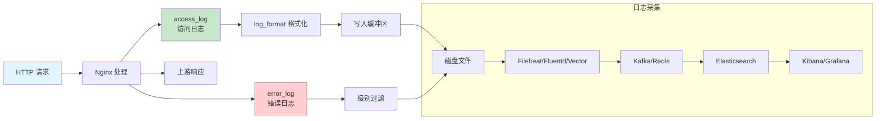
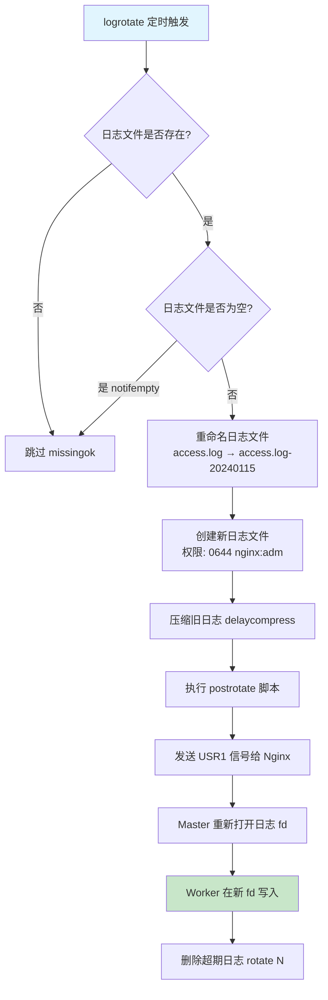
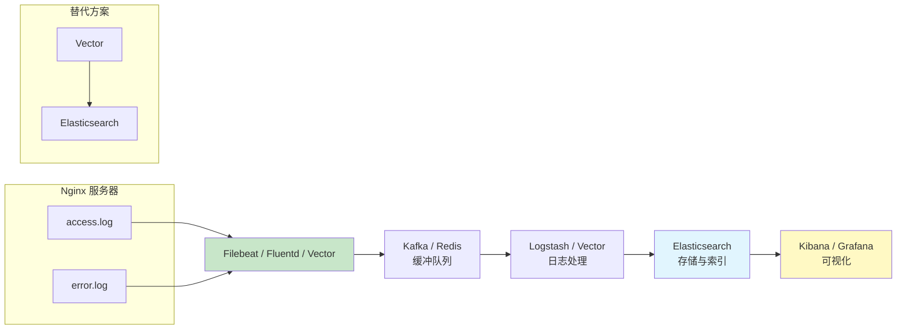

# 日志体系与自定义日志

日志是 Nginx 运维的基石——从访问分析、故障排查到安全审计，一切都始于日志。Nginx 提供了灵活的日志体系：自定义格式、条件记录、级别过滤、JSON 输出等。在生产环境中，日志还需要与 ELK/EFK 等日志平台集成，实现集中采集和分析。本文系统讲解 Nginx 日志的配置、优化和集成。

## 1. access_log 配置与格式

### 1.1 日志流水线



### 1.2 access_log 基础配置

```nginx
http {
    # 定义日志格式
    log_format main '$remote_addr - $remote_user [$time_local] '
                    '"$request" $status $body_bytes_sent '
                    '"$http_referer" "$http_user_agent"';

    # 应用日志配置
    access_log /var/log/nginx/access.log main;

    server {
        listen 80;
        server_name example.com;

        # 可以在 server/location 级别覆盖
        location /api/ {
            access_log /var/log/nginx/api_access.log main;
        }

        # 禁用日志（如健康检查）
        location /health {
            access_log off;
        }
    }
}
```

### 1.3 access_log 语法

```nginx
access_log path [format [buffer=size] [gzip[=level]] [flush=time] [if=condition]];

# path:     日志文件路径
# format:   log_format 名称
# buffer:   写入缓冲区大小
# gzip:     压缩日志（减少磁盘I/O）
# flush:    缓冲区刷新间隔
# if:       条件日志

# 示例
access_log /var/log/nginx/access.log main buffer=32k flush=5s;
access_log /var/log/nginx/access.log main buffer=64k gzip=4;
```

### 1.4 日志缓冲与性能

```nginx
http {
    # 高性能日志配置
    access_log /var/log/nginx/access.log main
        buffer=64k       # 64KB 缓冲区
        flush=5s;        # 5秒刷新一次

    # 使用 gzip 压缩日志（Nginx 1.7.1+）
    access_log /var/log/nginx/access.log main
        buffer=64k
        gzip=4           # gzip 压缩级别 1-9
        flush=5s;
}
```

::: tip 日志缓冲的选择
- **buffer=N**：日志先写入内存缓冲区，满了或超时再刷到磁盘。减少磁盘 I/O 次数
- **flush=N**：缓冲区的最大刷新间隔。确保日志不会延迟太久
- **gzip=N**：压缩缓冲区中的日志再写入磁盘，减少磁盘写入量

取舍：
- 无缓冲：每条日志一次 I/O，最慢但最实时
- 小缓冲（8k-32k）：减少 I/O，日志延迟 < 1 秒
- 大缓冲（64k-256k）+ flush：大幅减少 I/O，日志延迟等于 flush 时间
- gzip：进一步减少磁盘写入，但增加 CPU 消耗

**生产建议**：`buffer=64k flush=5s`，在性能和实时性之间取得平衡。
:::

## 2. log_format 自定义变量与字段

### 2.1 内置变量参考

```nginx
# 常用日志变量

# ===== 客户端信息 =====
# $remote_addr        客户端IP
# $remote_user        认证用户名
# $http_user_agent    用户代理
# $http_referer       来源页面
# $http_x_forwarded_for  代理链IP

# ===== 请求信息 =====
# $request            完整请求行（方法 URI 协议）
# $request_method     请求方法
# $request_uri        原始请求URI（含参数）
# $uri                当前URI（可能被重写）
# $args               查询参数
# $query_string       同 $args
# $scheme             协议（http/https）
# $host               请求头中的Host
# $server_name        服务器名
# $request_length     请求长度（含请求行和头）
# $request_body       请求体（慎用，可能很大）

# ===== 响应信息 =====
# $status             响应状态码
# $body_bytes_sent    发送给客户端的响应体大小（不含头）
# $bytes_sent         发送给客户端的总字节数
# $sent_http_content_type  响应Content-Type头

# ===== 时间信息 =====
# $time_local         本地时间格式
# $time_iso8601       ISO 8601 格式
# $request_time       请求处理总时间（秒）
# $upstream_response_time  上游响应时间

# ===== 上游信息 =====
# $upstream_addr      上游服务器地址
# $upstream_status    上游响应状态码
# $upstream_connect_time  与上游建立连接的时间
# $upstream_header_time   接收上游响应头的时间

# ===== 连接信息 =====
# $connection         连接序列号
# $connection_requests  当前连接的请求计数
# $request_id         唯一请求标识符（16字节十六进制）
```

### 2.2 自定义日志格式

```nginx
http {
    # 综合格式（推荐生产使用）
    log_format detailed '$remote_addr - $remote_user [$time_iso8601] '
                        '"$request_method $request_uri" $status $body_bytes_sent '
                        '"$http_referer" "$http_user_agent" '
                        'rt=$request_time urt="$upstream_response_time" '
                        'upstream=$upstream_addr '
                        'cache=$upstream_cache_status '
                        'rid=$request_id';

    # 性能分析格式
    log_format perf '$time_iso8601 $request_id '
                    '$request_method $request_uri $status '
                    '$request_time $upstream_connect_time '
                    '$upstream_header_time $upstream_response_time '
                    '$body_bytes_sent $bytes_sent '
                    '$upstream_addr $upstream_cache_status';

    # 安全审计格式
    log_format security '$time_iso8601 $remote_addr '
                        '$http_x_forwarded_for $remote_user '
                        '"$request_method $request_uri" $status '
                        '"$http_referer" "$http_user_agent" '
                        '$request_length $body_bytes_sent '
                        '$server_name $scheme';

    access_log /var/log/nginx/access.log detailed;
}
```

### 2.3 自定义变量

```nginx
http {
    # 使用 map 创建自定义变量
    map $http_user_agent $is_bot {
        default 0;
        "~*bot|spider|crawl" 1;
        "~*Googlebot" 1;
        "~*Baiduspider" 1;
    }

    map $status $status_class {
        ~^[23] "success";
        ~^4    "client_error";
        ~^5    "server_error";
        default "unknown";
    }

    log_format custom '$time_iso8601 $remote_addr '
                      '"$request_method $request_uri" $status '
                      '$status_class is_bot=$is_bot '
                      'rt=$request_time';

    access_log /var/log/nginx/access.log custom;
}
```

## 3. error_log 级别与配置

### 3.1 错误日志级别

```nginx
# error_log 语法
# error_log path [level];
# level: debug | info | notice | warn | error | crit | alert | emerg

# 级别从低到高，设置某个级别后会记录该级别及以上的所有日志
# emerg  - 系统不可用
# alert  - 必须立即处理
# crit   - 严重错误
# error  - 错误（默认）
# warn   - 警告
# notice - 通知
# info   - 信息
# debug  - 调试（需要 --with-debug 编译）

http {
    # 生产环境
    error_log /var/log/nginx/error.log warn;

    server {
        # 不同 server 可以不同级别
        error_log /var/log/nginx/error.log error;

        # 调试特定 location
        location /debug/ {
            error_log /var/log/nginx/debug.log debug;
        }
    }
}
```

### 3.2 禁用错误日志

```nginx
# 完全禁用错误日志（不推荐）
error_log /dev/null;

# 只记录严重错误
error_log /var/log/nginx/error.log crit;
```

::: warning 不要完全关闭错误日志
错误日志是排查问题的关键信息源。即使在高负载场景下，也应至少记录 `error` 级别。如果担心日志体积过大，使用 `crit` 或 `alert` 级别，而非完全关闭。
:::

### 3.3 常见错误日志条目

```
# 连接超时
2024/01/15 10:30:00 [error] 1234#0: *56789 upstream timed out (110: Connection timed out) while connecting to upstream, client: 10.0.0.1, server: api.example.com, request: "GET /api/data HTTP/1.1", upstream: "http://10.0.0.10:8080/api/data"

# 上游连接拒绝
2024/01/15 10:30:01 [error] 1234#0: *56790 connect() failed (111: Connection refused) while connecting to upstream, client: 10.0.0.2, server: api.example.com, request: "POST /api/users HTTP/1.1"

# 文件不存在
2024/01/15 10:30:02 [error] 1234#0: *56791 open() "/var/www/html/missing.html" failed (2: No such file or directory), client: 10.0.0.3, server: www.example.com, request: "GET /missing.html HTTP/1.1"

# 权限不足
2024/01/15 10:30:03 [error] 1234#0: *56792 open() "/var/www/html/private.html" failed (13: Permission denied), client: 10.0.0.4, server: www.example.com, request: "GET /private.html HTTP/1.1"
```

## 4. 条件日志：if=$variable

条件日志允许根据条件选择性记录日志，减少不必要的日志输出。

### 4.1 基本用法

```nginx
http {
    # 定义条件变量
    map $status $loggable {
        ~^[23] 1;   # 2xx/3xx 记录
        default 0;   # 其他不记录
    }

    # 使用条件
    access_log /var/log/nginx/access.log main if=$loggable;
}
```

### 4.2 常见条件场景

```nginx
http {
    # 场景1：只记录错误响应
    map $status $log_error_only {
        ~^[45] 1;
        default 0;
    }
    access_log /var/log/nginx/error_access.log main if=$log_error_only;

    # 场景2：排除健康检查
    map $uri $log_skip_health {
        /health 0;
        /ready 0;
        default 1;
    }
    access_log /var/log/nginx/access.log main if=$log_skip_health;

    # 场景3：排除静态资源
    map $uri $log_skip_static {
        ~*\.(js|css|png|jpg|gif|ico|svg|woff2?)$ 0;
        default 1;
    }
    access_log /var/log/nginx/access.log main if=$log_skip_static;

    # 场景4：排除爬虫
    map $http_user_agent $log_skip_bot {
        default 1;
        "~*Googlebot" 0;
        "~*Baiduspider" 0;
        "~*bingbot" 0;
    }
    access_log /var/log/nginx/access.log main if=$log_skip_bot;

    # 场景5：采样日志（仅记录10%的请求）
    map $request_id $log_sample {
        "~^[0-9a-f]0" 1;  # 首位为0的请求（约1/16）
        default 0;
    }
    access_log /var/log/nginx/access.log main if=$log_sample;
}
```

::: important 条件日志的 if 变量
`if=$variable` 中的变量必须是通过 `map` 或 `set` 定义的，值为 `0` 时不记录日志，非 `0` 时记录。注意这不是 `if` 指令，而是 `access_log` 的参数。
:::

## 5. 日志轮转：logrotate 配置

### 5.1 logrotate 工作流程



### 5.2 logrotate 基础配置

```bash
# /etc/logrotate.d/nginx
/var/log/nginx/*.log {
    daily                    # 每天轮转
    missingok                # 日志文件不存在不报错
    rotate 30                # 保留30天
    compress                 # 压缩旧日志
    delaycompress            # 延迟一次压缩（保留最近一份未压缩）
    notifempty               # 空文件不轮转
    create 0644 nginx adm    # 创建新日志文件的权限和属主
    sharedscripts            # 所有日志轮转后执行一次脚本
    postrotate
        # 重新打开日志文件（不中断服务）
        if [ -f /var/run/nginx.pid ]; then
            kill -USR1 $(cat /var/run/nginx.pid)
        fi
    endscript
}
```

### 5.2 自定义轮转策略

```bash
# /etc/logrotate.d/nginx-custom
/var/log/nginx/access.log {
    hourly                   # 每小时轮转
    rotate 168               # 保留7天（24×7=168小时）
    compress
    delaycompress
    missingok
    notifempty
    create 0640 nginx adm
    dateext                  # 使用日期作为扩展名
    dateformat -%Y%m%d-%H    # 日期格式：access.log-20240115-10
    sharedscripts
    postrotate
        kill -USR1 $(cat /var/run/nginx.pid)
    endscript
}

/var/log/nginx/error.log {
    daily
    rotate 90                # 错误日志保留更久
    compress
    delaycompress
    missingok
    notifempty
    create 0640 nginx adm
    sharedscripts
    postrotate
        kill -USR1 $(cat /var/run/nginx.pid)
    endscript
}
```

### 5.3 USR1 信号与日志重开

```bash
# logrotate 轮转日志后，Nginx 仍然写入旧文件描述符
# 需要发送 USR1 信号让 Nginx 重新打开日志文件

# 手动重开日志
kill -USR1 $(cat /var/run/nginx.pid)

# 验证
ls -la /proc/$(pgrep -f "nginx: master" | head -1)/fd | grep log
```

::: tip 日志轮转原理
1. logrotate 将 `access.log` 重命名为 `access.log-20240115`
2. 创建新的 `access.log` 文件
3. 发送 `USR1` 信号给 Nginx Master
4. Master 重新打开日志文件（新的 fd）
5. Worker 进程在新 fd 上写入日志

整个过程不中断服务，但轮转瞬间可能有少量日志写入旧文件。
:::

## 6. JSON 格式日志配置

JSON 格式日志方便日志平台直接解析，无需正则提取。

### 6.1 JSON 日志格式

```nginx
http {
    log_format json_log escape=json
        '{'
            '"time":"$time_iso8601",'
            '"remote_addr":"$remote_addr",'
            '"remote_user":"$remote_user",'
            '"request_method":"$request_method",'
            '"request_uri":"$request_uri",'
            '"status":$status,'
            '"body_bytes_sent":$body_bytes_sent,'
            '"request_time":$request_time,'
            '"upstream_response_time":"$upstream_response_time",'
            '"upstream_addr":"$upstream_addr",'
            '"upstream_status":"$upstream_status",'
            '"http_referer":"$http_referer",'
            '"http_user_agent":"$http_user_agent",'
            '"http_x_forwarded_for":"$http_x_forwarded_for",'
            '"request_id":"$request_id",'
            '"server_name":"$server_name",'
            '"scheme":"$scheme",'
            '"cache_status":"$upstream_cache_status"'
        '}';

    access_log /var/log/nginx/access.json json_log buffer=64k flush=5s;
}
```

### 6.2 escape=json 说明

```nginx
# escape=json: 自动转义 JSON 特殊字符
# " → \"
# \ → \\
# 换行 → \n

# 没有 escape=json 时，User-Agent 中的引号会破坏 JSON 结构
log_format json_log escape=json '...';
```

### 6.3 结构化日志验证

```bash
# 验证 JSON 格式
tail -1 /var/log/nginx/access.json | python3 -m json.tool

# 输出示例：
# {
#     "time": "2024-01-15T10:30:00+08:00",
#     "remote_addr": "10.0.0.1",
#     "remote_user": "-",
#     "request_method": "GET",
#     "request_uri": "/api/users",
#     "status": 200,
#     "body_bytes_sent": 1234,
#     "request_time": 0.012,
#     "upstream_response_time": "0.010",
#     "upstream_addr": "10.0.0.10:8080",
#     "upstream_status": "200",
#     "http_referer": "-",
#     "http_user_agent": "Mozilla/5.0 ...",
#     "http_x_forwarded_for": "-",
#     "request_id": "a1b2c3d4e5f6...",
#     "server_name": "api.example.com",
#     "scheme": "https",
#     "cache_status": "HIT"
# }
```

## 7. 日志采样与聚合

### 7.1 日志采样

```nginx
http {
    # 基于请求ID的采样（约1/16）
    map $request_id $log_sample_16 {
        "~^[0-9a-f]0" 1;
        default 0;
    }

    # 基于请求ID的采样（约1/256）
    map $request_id $log_sample_256 {
        "~^[0-9a-f][0-9a-f]00" 1;
        default 0;
    }

    # 高流量场景：1%采样
    map $request_id $log_sample_1pct {
        "~^0[0-9a-f]" 1;  # 首位0且第二位任意 → 1/16 ≈ 6.25%
        default 0;
    }

    # 采样日志 + 完整错误日志
    access_log /var/log/nginx/access_sample.log main if=$log_sample_16;
    access_log /var/log/nginx/error_access.log main if=$log_error_only;
}
```

### 7.2 日志聚合（基于 Lua）

```nginx
lua_shared_dict log_stats 10m;

log_by_lua_block {
    local stats = ngx.shared.log_stats

    -- 按状态码聚合
    local status_key = "status:" .. ngx.var.status
    stats:incr(status_key, 1, 0)

    -- 按URI聚合
    local uri_key = "uri:" .. ngx.var.uri
    stats:incr(uri_key, 1, 0)

    -- 按上游响应时间分段
    local rt = tonumber(ngx.var.request_time) or 0
    local rt_bucket
    if rt < 0.01 then
        rt_bucket = "lt10ms"
    elseif rt < 0.05 then
        rt_bucket = "10-50ms"
    elseif rt < 0.1 then
        rt_bucket = "50-100ms"
    elseif rt < 0.5 then
        rt_bucket = "100-500ms"
    elseif rt < 1.0 then
        rt_bucket = "500ms-1s"
    else
        rt_bucket = "gt1s"
    end
    local rt_key = "rt:" .. rt_bucket
    stats:incr(rt_key, 1, 0)
}

# 暴露聚合指标
location /nginx_stats {
    content_by_lua_block {
        local stats = ngx.shared.log_stats
        local keys = stats:get_keys(0)

        ngx.header.content_type = "text/plain"
        for _, key in ipairs(keys) do
            ngx.say(key .. " " .. stats:get(key))
        end
    }
}
```

## 8. 日志采集：Filebeat/Fluentd/Vector → ELK

### 8.1 日志采集架构



### 8.2 Filebeat 配置

```yaml
# /etc/filebeat/filebeat.yml
filebeat.inputs:
- type: log
  enabled: true
  paths:
    - /var/log/nginx/access.json
  json.keys_under_root: true
  json.add_error_key: true
  fields:
    log_type: nginx_access
    service: nginx
    environment: production
  fields_under_root: true

- type: log
  enabled: true
  paths:
    - /var/log/nginx/error.log
  fields:
    log_type: nginx_error
    service: nginx
  fields_under_root: true
  multiline:
    pattern: '^\d{4}/\d{2}/\d{2}'
    negate: true
    match: after

output.elasticsearch:
  hosts: ["elasticsearch:9200"]
  index: "nginx-%{+yyyy.MM.dd}"

# 或输出到 Kafka
# output.kafka:
#   hosts: ["kafka:9092"]
#   topic: "nginx-logs"
#   partition.round_robin:
#     reachable_only: true
```

### 8.3 Fluentd 配置

```xml
# /etc/td-agent/td-agent.conf
<source>
  @type tail
  path /var/log/nginx/access.json
  pos_file /var/log/td-agent/nginx-access.pos
  tag nginx.access
  <parse>
    @type json
    time_key time
    time_format %Y-%m-%dT%H:%M:%S%z
  </parse>
</source>

<source>
  @type tail
  path /var/log/nginx/error.log
  pos_file /var/log/td-agent/nginx-error.pos
  tag nginx.error
  <parse>
    @type regexp
    expression /^(?<time>\d{4}\/\d{2}\/\d{2} \d{2}:\d{2}:\d{2}) \[(?<level>\w+)\] (?<pid>\d+)#(?<tid>\d+): \*(?<cid>\d+) (?<message>.*)$/
  </parse>
</source>

<filter nginx.**>
  @type record_transformer
  <record>
    hostname "#{Socket.gethostname}"
    environment production
  </record>
</filter>

<match nginx.**>
  @type elasticsearch
  host elasticsearch
  port 9200
  logstash_format true
  logstash_prefix nginx
  include_tag_key true
  tag_key @log_name
  flush_interval 5s
</match>
```

### 8.4 Vector 配置

```toml
# /etc/vector/vector.toml
[sources.nginx_access]
type = "file"
include = ["/var/log/nginx/access.json"]
fingerprint.strategy = "device_and_inode"

[transforms.nginx_parse]
type = "remap"
inputs = ["nginx_access"]
source = '''
  . = parse_json!(.message)
  .timestamp = parse_timestamp!(.time, "%Y-%m-%dT%H:%M:%S%z")
  .status = to_int!(.status)
  .request_time = to_float!(.request_time)
  del(.message)
'''

[sinks.elasticsearch]
type = "elasticsearch"
inputs = ["nginx_parse"]
endpoints = ["http://elasticsearch:9200"]
bulk.index = "nginx-%Y.%m.%d"
```

## 9. 请求追踪：$request_id 与分布式追踪

### 9.1 $request_id

```nginx
http {
    log_format trace '$time_iso8601 request_id=$request_id '
                     'remote_addr=$remote_addr '
                     '"$request_method $request_uri" $status '
                     'rt=$request_time '
                     'upstream=$upstream_addr '
                     'upstream_rt=$upstream_response_time '
                     'x_request_id=$http_x_request_id';

    # 传递 request_id 到上游
    proxy_set_header X-Request-ID $request_id;

    # 如果客户端已提供 X-Request-ID，使用客户端的
    map $http_x_request_id $trace_id {
        default $request_id;
        "~.+" $http_x_request_id;
    }

    access_log /var/log/nginx/access.log trace;
}
```

### 9.2 分布式追踪集成

```nginx
http {
    # OpenTelemetry 追踪头传播
    map $http_traceparent $traceparent {
        default $http_traceparent;
        "" "00-00000000000000000000000000000000-0000000000000000-01";
    }

    server {
        location /api/ {
            # 传播追踪头到上游
            proxy_set_header traceparent $http_traceparent;
            proxy_set_header tracestate $http_tracestate;

            # 在日志中记录追踪ID
            # 从 traceparent 提取 trace_id（第3-34位）
            # 示例: 00-4bf92f3577b34da6a3ce929d0e0e4736-00f067aa0ba902b7-01

            proxy_pass http://backend;
        }
    }
}
```

### 9.3 OpenTelemetry 模块（第三方模块，需编译安装）

```nginx
# 编译 OpenTelemetry 模块
# 参考: https://github.com/open-telemetry/opentelemetry-cpp-contrib/tree/main/instrumentation/nginx

# 配置
opentelemetry on;
opentelemetry_trust_incoming_spans on;
opentelemetry_operation_name "$uri";

# 注意：endpoint、service_name 等配置通过环境变量设置，而非 nginx 指令
# 在 Docker 或 systemd 中配置环境变量：
# OTEL_EXPORTER_OTLP_ENDPOINT=http://otel-collector:4317
# OTEL_SERVICE_NAME=nginx
# OTEL_RESOURCE_ATTRIBUTES=service.version=1.0.0

server {
    location /api/ {
        opentelemetry_operation_name "api_request";
        proxy_pass http://backend;
    }
}
```

## 10. 日志性能影响与优化

### 10.1 日志的性能开销

| 配置 | CPU 开销 | 磁盘 I/O | 日志延迟 |
|------|----------|----------|----------|
| 无日志 (access_log off) | 0% | 无 | N/A |
| 无缓冲 | ~2-5% | 每请求一次write | 0 |
| buffer=8k | ~1-3% | 每8KB一次write | <1s |
| buffer=64k flush=5s | ~1% | 每64KB或5s | ≤5s |
| buffer=64k gzip=4 | ~2-4% | 压缩后写入 | ≤5s |
| JSON 格式 | ~3-5% | 较大（文本量大） | 取决于缓冲 |

### 10.2 日志优化策略

```nginx
http {
    # 策略1：日志缓冲
    access_log /var/log/nginx/access.log main buffer=64k flush=5s;

    # 策略2：条件日志（排除不需要记录的请求）
    map $uri $loggable {
        /health 0;
        /metrics 0;
        /favicon.ico 0;
        default 1;
    }
    access_log /var/log/nginx/access.log main if=$loggable;

    # 策略3：采样日志（超高流量场景）
    # 使用前面定义的 $log_sample_16

    # 策略4：分级日志
    # 成功请求 → 采样日志
    # 错误请求 → 完整日志
    map $status $log_all_errors {
        ~^[45] 1;
        default $log_sample_16;  # 成功请求采样
    }

    # 策略5：使用内存文件系统（临时方案）
    # access_log /dev/shm/nginx/access.log main buffer=64k;
    # /dev/shm 是 tmpfs，写入内存，不写磁盘
    # 但重启后丢失，需配合 logrotate 或采集工具
}
```

### 10.3 日志性能测试

```bash
# 测试无日志的基准性能
# 临时关闭日志
# nginx.conf: access_log off;

wrk -t4 -c100 -d30s http://example.com/

# 测试有日志的性能
# nginx.conf: access_log /var/log/nginx/access.log main;

wrk -t4 -c100 -d30s http://example.com/

# 测试缓冲日志的性能
# nginx.conf: access_log /var/log/nginx/access.log main buffer=64k flush=5s;

wrk -t4 -c100 -d30s http://example.com/

# 对比结果
# 通常：无日志 vs 缓冲日志 性能差 < 5%
# 无缓冲日志可能降低 10-20% 的吞吐量
```

## 11. 参考文档

- [Nginx ngx_http_log_module: access_log](https://nginx.org/en/docs/http/ngx_http_log_module.html#access_log)
- [Nginx ngx_http_log_module: log_format](https://nginx.org/en/docs/http/ngx_http_log_module.html#log_format)
- [Nginx Core Functionality: error_log](https://nginx.org/en/docs/ngx_core_module.html#error_log)
- [Nginx Embedded Variables: $request_id](https://nginx.org/en/docs/http/ngx_http_core_module.html#var_request_id)
- [Filebeat Documentation](https://www.elastic.co/guide/en/beats/filebeat/current/filebeat-module-nginx.html)
- [Fluentd Nginx Input Plugin](https://docs.fluentd.org/input/tail)
- [Vector Nginx Source](https://vector.dev/docs/reference/configuration/sources/file/)
- [OpenTelemetry Nginx Module](https://github.com/open-telemetry/opentelemetry-cpp-contrib/tree/main/instrumentation/nginx)
