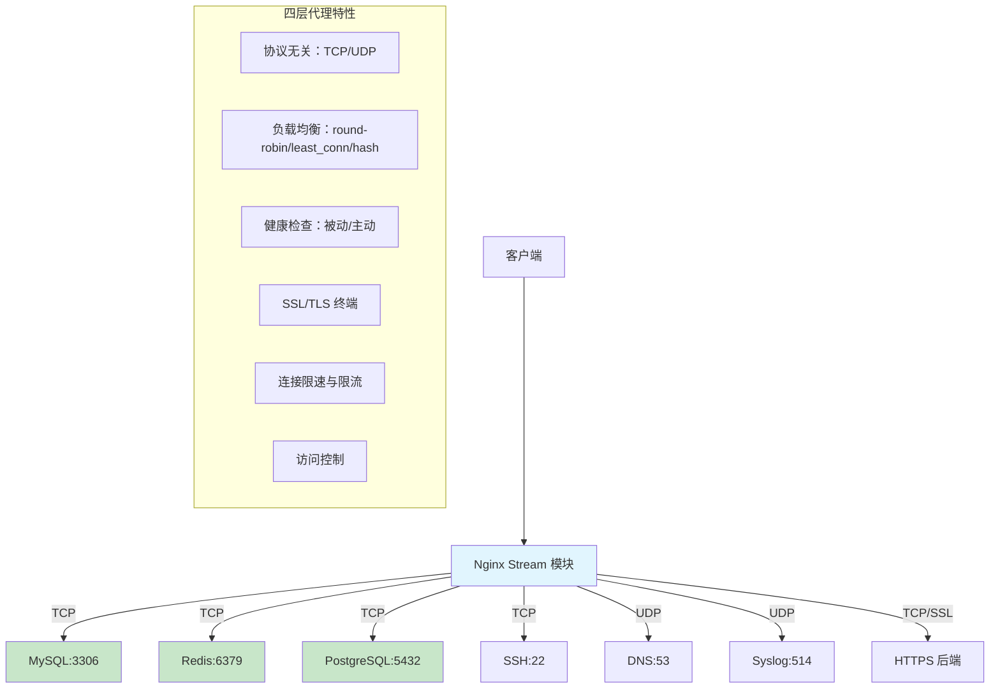
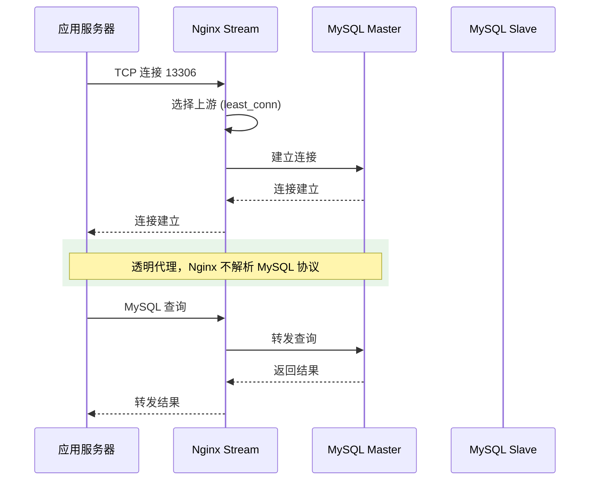
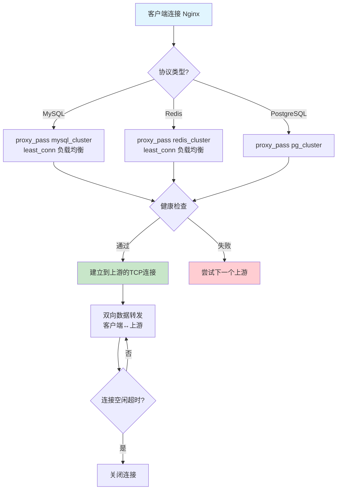

# Stream 四层代理与邮件代理

Nginx 不仅是 HTTP 七层代理，还能在传输层（TCP/UDP）做四层代理。`ngx_stream_core_module` 让 Nginx 可以代理 MySQL、Redis、PostgreSQL、gRPC 等任何 TCP/UDP 协议，还可以做邮件代理。本文系统讲解 Stream 模块的配置、负载均衡、SSL/TLS 和实际应用场景。

## 1. stream 模块概述与配置

### 1.1 四层代理架构



### 1.2 stream 上下文

`stream` 上下文与 `http` 上下文平级，在 `main` 上下文中定义：

```nginx
# nginx.conf
user nginx;
worker_processes auto;

events {
    worker_connections 4096;
}

# HTTP 七层代理
http {
    # ...
}

# Stream 四层代理（与 http 平级）
stream {
    # TCP 代理
    upstream mysql_backend {
        server 10.0.0.10:3306;
        server 10.0.0.11:3306;
    }

    server {
        listen 3306;
        proxy_pass mysql_backend;
    }

    # UDP 代理
    upstream dns_backend {
        server 10.0.0.20:53;
        server 10.0.0.21:53;
    }

    server {
        listen 53 udp;
        proxy_pass dns_backend;
    }
}
```

::: important stream 与 http 的区别
- `stream` 在 OSI 第四层（传输层）工作，不解析应用层协议
- `http` 在 OSI 第七层（应用层）工作，解析 HTTP 协议
- `stream` 中没有 `location` 指令，只有 `server` 块
- `stream` 不能使用 HTTP 相关的变量和指令（如 `$http_*`）
- `stream` 模块需要编译时包含：`--with-stream`
:::

## 2. TCP 代理配置

### 2.1 基础 TCP 代理

```nginx
stream {
    # MySQL 代理
    upstream mysql_backend {
        server 10.0.0.10:3306 max_fails=3 fail_timeout=30s;
        server 10.0.0.11:3306 max_fails=3 fail_timeout=30s;
        server 10.0.0.12:3306 backup;
    }

    server {
        listen 3306;
        proxy_pass mysql_backend;
        proxy_connect_timeout 5s;
        proxy_timeout 300s;         # 空闲连接超时
        proxy_socket_keepalive on;  # TCP Keep-Alive
    }
}
```

### 2.2 proxy_timeout 详解

```nginx
stream {
    server {
        listen 3306;

        # 与上游建立连接的超时
        proxy_connect_timeout 5s;

        # 两个连续的读或写操作之间的超时
        # 适用于客户端↔Nginx 和 Nginx↔上游
        proxy_timeout 300s;  # 默认 10m

        # TCP Keep-Alive
        proxy_socket_keepalive on;

        # 代理下载速率限制
        proxy_download_rate 0;  # 0 = 不限速
        proxy_upload_rate 0;    # 0 = 不限速

        proxy_pass mysql_backend;
    }
}
```

### 2.3 TCP 代理完整配置

```nginx
stream {
    # ========== MySQL 代理 ==========
    upstream mysql_cluster {
        least_conn;  # 最少连接数负载均衡
        server 10.0.0.10:3306 max_fails=2 fail_timeout=10s;
        server 10.0.0.11:3306 max_fails=2 fail_timeout=10s;
        server 10.0.0.12:3306 backup;
    }

    server {
        listen 13306;  # 对外暴露 13306 端口
        proxy_pass mysql_cluster;
        proxy_connect_timeout 3s;
        proxy_timeout 600s;
        proxy_socket_keepalive on;
    }

    # ========== PostgreSQL 代理 ==========
    upstream pg_cluster {
        server 10.0.0.20:5432;
        server 10.0.0.21:5432;
    }

    server {
        listen 15432;
        proxy_pass pg_cluster;
        proxy_connect_timeout 3s;
        proxy_timeout 600s;
    }

    # ========== SSH 代理 ==========
    server {
        listen 10022;
        proxy_pass 10.0.0.30:22;
        proxy_timeout 3600s;  # SSH 长连接
        proxy_socket_keepalive on;
    }
}
```

## 3. UDP 代理配置

### 3.1 基础 UDP 代理

```nginx
stream {
    upstream dns_servers {
        server 8.8.8.8:53;
        server 8.8.4.4:53;
    }

    server {
        listen 53 udp;  # 必须指定 udp
        proxy_pass dns_servers;
        proxy_timeout 5s;
        proxy_responses 1;  # 期望上游返回的 UDP 数据报数
    }
}
```

### 3.2 proxy_responses

```nginx
# proxy_responses: 期望上游对单个客户端请求返回的 UDP 数据报数
# 默认值：0（不限）
# 设为 1 表示只接收一个响应就关闭连接
# DNS 通常是 1，Syslog 可能是 0（只发送不接收）

# DNS 代理
server {
    listen 53 udp;
    proxy_pass dns_servers;
    proxy_responses 1;  # DNS 一个请求一个响应
}

# Syslog 代理（只转发，不接收响应）
server {
    listen 514 udp;
    proxy_pass syslog_servers;
    proxy_responses 0;  # 不期望响应
}
```

### 3.3 UDP 代理完整配置

```nginx
stream {
    # DNS 代理
    upstream dns_servers {
        server 8.8.8.8:53;
        server 1.1.1.1:53;
    }

    server {
        listen 53 udp;
        proxy_pass dns_servers;
        proxy_timeout 3s;
        proxy_responses 1;
    }

    # Syslog 代理
    upstream syslog_servers {
        server 10.0.0.40:514;
        server 10.0.0.41:514;
    }

    server {
        listen 1514 udp;
        proxy_pass syslog_servers;
        proxy_timeout 1s;
        proxy_responses 0;
    }

    # NTP 代理
    upstream ntp_servers {
        server time.google.com:123;
        server time.cloudflare.com:123;
    }

    server {
        listen 123 udp;
        proxy_pass ntp_servers;
        proxy_timeout 3s;
        proxy_responses 1;
    }
}
```

## 4. MySQL/Redis 代理实战

### 4.1 MySQL 代理实战



```nginx
stream {
    # MySQL 读写分离（需要应用层支持）
    # 写请求 → Master
    upstream mysql_write {
        server 10.0.0.10:3306;  # Master
    }

    # 读请求 → Slave
    upstream mysql_read {
        least_conn;
        server 10.0.0.11:3306;  # Slave 1
        server 10.0.0.12:3306;  # Slave 2
    }

    # 写端口
    server {
        listen 13306;
        proxy_pass mysql_write;
        proxy_connect_timeout 3s;
        proxy_timeout 600s;
        proxy_socket_keepalive on;
    }

    # 读端口
    server {
        listen 23306;
        proxy_pass mysql_read;
        proxy_connect_timeout 3s;
        proxy_timeout 600s;
        proxy_socket_keepalive on;
    }

    # 访问控制
    server {
        listen 13306;
        proxy_pass mysql_write;

        # 仅允许内网访问
        allow 10.0.0.0/8;
        allow 172.16.0.0/12;
        allow 192.168.0.0/16;
        deny all;
    }
}
```

### 4.2 Redis 代理实战

```nginx
stream {
    # Redis Cluster 代理
    upstream redis_cluster {
        least_conn;
        server 10.0.0.50:6379 max_fails=3 fail_timeout=10s;
        server 10.0.0.51:6379 max_fails=3 fail_timeout=10s;
        server 10.0.0.52:6379 max_fails=3 fail_timeout=10s;
    }

    server {
        listen 16379;
        proxy_pass redis_cluster;
        proxy_connect_timeout 1s;
        proxy_timeout 300s;
        proxy_socket_keepalive on;

        # 连接限速
        proxy_download_rate 0;
        proxy_upload_rate 0;
    }

    # Redis Sentinel 代理
    upstream redis_sentinel {
        server 10.0.0.50:26379;
        server 10.0.0.51:26379;
        server 10.0.0.52:26379;
    }

    server {
        listen 26379;
        proxy_pass redis_sentinel;
        proxy_connect_timeout 1s;
        proxy_timeout 60s;
    }
}
```

### 4.3 连接流程图



## 5. stream SSL/TLS 配置

### 5.1 SSL 终端

```nginx
stream {
    # MySQL SSL 代理
    server {
        listen 13306 ssl;

        ssl_certificate /etc/ssl/certs/mysql-proxy.crt;
        ssl_certificate_key /etc/ssl/private/mysql-proxy.key;
        ssl_protocols TLSv1.2 TLSv1.3;
        ssl_ciphers HIGH:!aNULL:!MD5;
        ssl_session_cache shared:SSL:10m;
        ssl_session_timeout 1d;

        # 客户端 → Nginx: SSL
        # Nginx → 上游: 可以是明文或SSL
        proxy_pass mysql_backend;
        proxy_ssl off;  # 到上游不使用SSL
    }
}
```

### 5.2 SSL 透传（上游也使用 SSL）

```nginx
stream {
    server {
        listen 16379 ssl;

        ssl_certificate /etc/ssl/certs/redis-proxy.crt;
        ssl_certificate_key /etc/ssl/private/redis-proxy.key;

        # Nginx → 上游也使用 SSL
        proxy_ssl on;
        proxy_ssl_certificate /etc/ssl/certs/redis-client.crt;
        proxy_ssl_certificate_key /etc/ssl/private/redis-client.key;
        proxy_ssl_trusted_certificate /etc/ssl/certs/ca.crt;
        proxy_ssl_verify on;
        proxy_ssl_name redis.internal;

        proxy_pass redis_backend;
    }
}
```

### 5.3 SSL 会话恢复

```nginx
stream {
    server {
        listen 443 ssl;

        ssl_certificate /etc/ssl/certs/wildcard.crt;
        ssl_certificate_key /etc/ssl/private/wildcard.key;

        # 会话缓存
        ssl_session_cache shared:STREAM_SSL:10m;
        ssl_session_timeout 1d;

        # 会话票据
        ssl_session_tickets on;

        # OCSP Stapling
        ssl_stapling on;
        ssl_stapling_verify on;

        proxy_pass backend;
    }
}
```

## 6. stream 负载均衡

### 6.1 负载均衡算法

```nginx
stream {
    # 1. 轮询（默认）
    upstream round_robin {
        server 10.0.0.1:3306;
        server 10.0.0.2:3306;
    }

    # 2. 最少连接数
    upstream least_conn {
        least_conn;
        server 10.0.0.1:3306;
        server 10.0.0.2:3306;
    }

    # 3. 哈希（基于IP或自定义Key）
    upstream ip_hash {
        hash $remote_addr consistent;  # 一致性哈希
        server 10.0.0.1:3306;
        server 10.0.0.2:3306;
        server 10.0.0.3:3306;
    }

    # 4. 基于自定义Key的哈希
    # 适合需要会话保持的场景
    upstream custom_hash {
        hash $binary_remote_addr consistent;
        server 10.0.0.1:3306;
        server 10.0.0.2:3306;
    }
}
```

### 6.2 服务器权重与参数

```nginx
stream {
    upstream backend {
        # weight: 权重（默认1）
        # max_fails: 最大失败次数（默认1）
        # fail_timeout: 失败超时时间（默认10s）
        # backup: 备份服务器
        # down: 标记为不可用

        server 10.0.0.1:3306 weight=5 max_fails=3 fail_timeout=30s;
        server 10.0.0.2:3306 weight=3 max_fails=3 fail_timeout=30s;
        server 10.0.0.3:3306 weight=2;
        server 10.0.0.4:3306 backup;  # 仅在其他都不可用时使用
        server 10.0.0.5:3306 down;    # 维护中
    }
}
```

### 6.3 慢启动

```nginx
stream {
    upstream backend {
        server 10.0.0.1:3306 slow_start=30s;
        server 10.0.0.2:3306 slow_start=30s;
        # slow_start: 服务器恢复后，在30秒内逐步增加权重
        # 避免恢复的服务器瞬间被大量连接压垮

        # ⚠️ 注意：slow_start 是 NGINX Plus 专属功能！
        # 开源版 Nginx 使用 slow_start 会导致配置错误：
        # "invalid parameter 'slow_start=30s'"
        # 开源版替代方案：使用 max_fails + fail_timeout 进行被动恢复
    }
}
```

## 7. 邮件代理：ngx_mail_proxy_module

### 7.1 邮件代理概述

Nginx 的邮件代理模块支持 IMAP、POP3、SMTP 协议的代理：

```nginx
# 需要编译 --with-mail 参数

mail {
    # 认证服务器
    # Nginx 邮件代理需要外部认证服务
    server {
        listen 110;  # POP3
        protocol pop3;
        proxy_pass backend_mail;
        pop3_auth plain apop cram-md5;
    }

    server {
        listen 143;  # IMAP
        protocol imap;
        proxy_pass backend_mail;
    }

    server {
        listen 25;   # SMTP
        protocol smtp;
        proxy_pass backend_smtp;
        smtp_auth login plain;
    }
}
```

### 7.2 邮件认证服务

```nginx
mail {
    # 认证服务配置
    # Nginx 将用户凭证发送到认证服务验证
    auth_http http://auth-service:8080/auth;

    # 认证超时
    auth_http_timeout 5s;

    server {
        listen 993 ssl;  # IMAPS
        protocol imap;
        ssl_certificate /etc/ssl/certs/mail.crt;
        ssl_certificate_key /etc/ssl/private/mail.key;
        proxy_pass backend_imap;
    }

    server {
        listen 995 ssl;  # POP3S
        protocol pop3;
        ssl_certificate /etc/ssl/certs/mail.crt;
        ssl_certificate_key /etc/ssl/private/mail.key;
        proxy_pass backend_pop3;
    }

    server {
        listen 587 ssl;  # SMTP Submission
        protocol smtp;
        ssl_certificate /etc/ssl/certs/mail.crt;
        ssl_certificate_key /etc/ssl/private/mail.key;
        proxy_pass backend_smtp;
        smtp_auth login plain cram-md5;
    }
}
```

::: important 邮件代理需要认证服务
Nginx 邮件代理本身不存储用户数据，需要配置 `auth_http` 指向一个 HTTP 认证服务。当客户端连接时，Nginx 通过 HTTP 请求将用户凭证发送给认证服务，认证服务返回允许连接的后端地址。

认证服务需要实现 HTTP 接口，接收 Nginx 的认证请求并返回后端服务器地址。这使得邮件代理不太常用，但在大型邮件系统中可以实现灵活的认证和路由。
:::

## 8. SNI 路由（stream 层）

### 8.1 SNI 路由原理

TLS 握手时，客户端在 ClientHello 中发送 Server Name Indication（SNI），Nginx 可以根据 SNI 值路由到不同的上游：

```nginx
stream {
    # 根据 SNI 路由到不同的后端
    map $ssl_preread_server_name $backend {
        mysql.example.com  mysql_backend;
        redis.example.com  redis_backend;
        pg.example.com     pg_backend;
        default            default_backend;
    }

    upstream mysql_backend {
        server 10.0.0.10:3306;
    }

    upstream redis_backend {
        server 10.0.0.20:6379;
    }

    upstream pg_backend {
        server 10.0.0.30:5432;
    }

    upstream default_backend {
        server 10.0.0.1:443;
    }

    server {
        listen 443;
        ssl_preread on;  # 读取 SNI 但不终止 SSL
        proxy_pass $backend;
    }
}
```

### 8.2 SSL Preread 模块

```nginx
# ssl_preread 模块需要在编译时包含
# --with-stream_ssl_preread_module

stream {
    # 读取 TLS ClientHello 中的 SNI
    # 不解密流量，直接转发
    server {
        listen 443;
        ssl_preread on;
        proxy_pass $backend;
    }
}
```

::: tip SNI 路由的价值
SNI 路由让 Nginx 可以在四层根据域名做流量分发，而不需要终止 TLS。这在以下场景特别有用：
1. 多个 HTTPS 服务共享同一 IP 和端口
2. 不想在代理层解密流量（零信任架构）
3. 需要将 TLS 流量透传到后端
:::

### 8.3 SNI 路由实战：多数据库服务

```nginx
stream {
    # 数据库服务路由
    map $ssl_preread_server_name $db_backend {
        db-mysql.prod.example.com  mysql_prod;
        db-mysql.stg.example.com   mysql_stg;
        db-redis.prod.example.com  redis_prod;
        db-pg.prod.example.com     pg_prod;
    }

    upstream mysql_prod {
        server 10.1.0.10:3306;
    }
    upstream mysql_stg {
        server 10.2.0.10:3306;
    }
    upstream redis_prod {
        server 10.1.0.20:6379;
    }
    upstream pg_prod {
        server 10.1.0.30:5432;
    }

    server {
        listen 13306;
        ssl_preread on;
        proxy_pass $db_backend;
        proxy_connect_timeout 5s;
        proxy_timeout 600s;
    }
}
```

## 9. stream 与 HTTP 模块协同工作

### 9.1 同时提供四层和七层代理

```nginx
# nginx.conf 完整配置
user nginx;
worker_processes auto;
worker_rlimit_nofile 65535;

events {
    worker_connections 4096;
}

# 七层代理
http {
    server {
        listen 80;
        server_name www.example.com;

        location / {
            proxy_pass http://backend;
        }
    }
}

# 四层代理
stream {
    # MySQL 代理
    upstream mysql {
        server 10.0.0.10:3306;
    }
    server {
        listen 13306;
        proxy_pass mysql;
    }

    # Redis 代理
    upstream redis {
        server 10.0.0.20:6379;
    }
    server {
        listen 16379;
        proxy_pass redis;
    }

    # SNI 路由：根据域名分发 HTTPS 流量
    map $ssl_preread_server_name $https_backend {
        api.example.com   api_backend;
        ws.example.com    ws_backend;
        default           default_backend;
    }

    upstream api_backend {
        server 10.0.0.100:443;
    }
    upstream ws_backend {
        server 10.0.0.101:443;
    }
    upstream default_backend {
        server 10.0.0.102:443;
    }

    server {
        listen 443;
        ssl_preread on;
        proxy_pass $https_backend;
    }
}
```

### 9.2 stream 模块的日志

```nginx
stream {
    log_format stream_log '$remote_addr [$time_local] '
                          '$protocol $status $bytes_sent $bytes_received '
                          '$session_time "$upstream_addr" '
                          '"$upstream_bytes_sent" "$upstream_bytes_received" '
                          '"$upstream_connect_time"';

    access_log /var/log/nginx/stream_access.log stream_log buffer=32k flush=5s;

    server {
        listen 3306;
        proxy_pass mysql_backend;
    }
}
```

### 9.3 stream 模块的变量

```nginx
# stream 模块可用的变量
# $remote_addr        客户端IP
# $remote_port        客户端端口
# $server_addr        服务器IP
# $server_port        服务器端口
# $protocol           协议（TCP/UDP）
# $status             连接状态码
# $bytes_sent         发送字节数
# $bytes_received     接收字节数
# $session_time       会话时间（秒）
# $upstream_addr      上游地址
# $upstream_bytes_sent      发送到上游的字节数
# $upstream_bytes_received  从上游接收的字节数
# $upstream_connect_time    与上游建立连接的时间
# $ssl_preread_server_name  SNI 域名（需 ssl_preread on）
```

## 10. stream 健康检查

### 10.1 被动健康检查

```nginx
stream {
    upstream mysql_backend {
        # 被动健康检查（内置）
        server 10.0.0.10:3306 max_fails=3 fail_timeout=30s;
        server 10.0.0.11:3306 max_fails=3 fail_timeout=30s;
        server 10.0.0.12:3306 backup;
    }

    server {
        listen 3306;
        proxy_pass mysql_backend;
        proxy_connect_timeout 5s;
        proxy_timeout 300s;
    }
}
```

### 10.2 主动健康检查

```nginx
# 需要 nginx-plus 或第三方模块
# 开源版本可以使用 lua 实现

stream {
    upstream mysql_backend {
        server 10.0.0.10:3306;
        server 10.0.0.11:3306;
    }

    server {
        listen 3306;
        proxy_pass mysql_backend;

        # 使用 Lua 做简单健康检查
        # 周期性尝试连接上游
    }
}
```

```bash
# 外部健康检查脚本
#!/bin/bash
# mysql_healthcheck.sh

UPSTREAMS=("10.0.0.10:3306" "10.0.0.11:3306")

for upstream in "${UPSTREAMS[@]}"; do
    host=$(echo $upstream | cut -d: -f1)
    port=$(echo $upstream | cut -d: -f2)

    # 尝试 TCP 连接
    timeout 3 bash -c "echo > /dev/tcp/$host/$port" 2>/dev/null
    if [ $? -eq 0 ]; then
        echo "OK: $upstream"
    else
        echo "FAIL: $upstream"
    fi
done
```

## 11. 完整生产级配置模板

```nginx
user nginx;
worker_processes auto;
worker_rlimit_nofile 65535;

events {
    worker_connections 4096;
    use epoll;
    multi_accept on;
}

stream {
    # 日志格式
    log_format stream_log '$remote_addr [$time_local] '
                          '$protocol $status $bytes_sent $bytes_received '
                          '$session_time "$upstream_addr" '
                          '$upstream_connect_time';

    access_log /var/log/nginx/stream.log stream_log buffer=32k flush=5s;

    # ========== MySQL 代理 ==========
    upstream mysql_prod {
        least_conn;
        server 10.1.0.10:3306 max_fails=3 fail_timeout=30s;
        server 10.1.0.11:3306 max_fails=3 fail_timeout=30s;
        server 10.1.0.12:3306 backup;
    }

    server {
        listen 13306;
        proxy_pass mysql_prod;
        proxy_connect_timeout 5s;
        proxy_timeout 600s;
        proxy_socket_keepalive on;

        # 访问控制
        allow 10.0.0.0/8;
        allow 172.16.0.0/12;
        deny all;
    }

    # ========== Redis 代理 ==========
    upstream redis_prod {
        least_conn;
        server 10.1.0.20:6379 max_fails=3 fail_timeout=10s;
        server 10.1.0.21:6379 max_fails=3 fail_timeout=10s;
    }

    server {
        listen 16379;
        proxy_pass redis_prod;
        proxy_connect_timeout 3s;
        proxy_timeout 300s;
        proxy_socket_keepalive on;

        allow 10.0.0.0/8;
        deny all;
    }

    # ========== SNI 路由 ==========
    map $ssl_preread_server_name $sni_backend {
        api.example.com   api_https;
        ws.example.com    ws_https;
        default           default_https;
    }

    upstream api_https { server 10.1.0.100:443; }
    upstream ws_https  { server 10.1.0.101:443; }
    upstream default_https { server 10.1.0.102:443; }

    server {
        listen 443;
        ssl_preread on;
        proxy_pass $sni_backend;
        proxy_connect_timeout 5s;
        proxy_timeout 300s;
    }
}
```

## 12. 参考文档

- [Nginx ngx_stream_core_module](https://nginx.org/en/docs/stream/ngx_stream_core_module.html)
- [Nginx ngx_stream_proxy_module](https://nginx.org/en/docs/stream/ngx_stream_proxy_module.html)
- [Nginx ngx_stream_ssl_module](https://nginx.org/en/docs/stream/ngx_stream_ssl_module.html)
- [Nginx ngx_stream_ssl_preread_module](https://nginx.org/en/docs/stream/ngx_stream_ssl_preread_module.html)
- [Nginx ngx_mail_proxy_module](https://nginx.org/en/docs/mail/ngx_mail_proxy_module.html)
- [Nginx Stream Log Format](https://nginx.org/en/docs/stream/ngx_stream_log_module.html)
