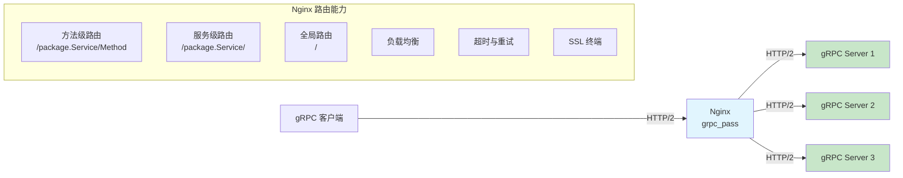
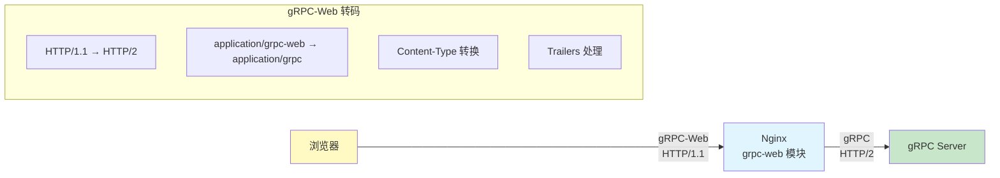
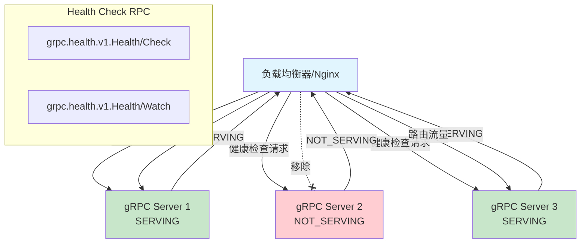

# gRPC 与 gRPC-Web 代理

gRPC 是 Google 开源的高性能 RPC 框架，基于 HTTP/2 和 Protocol Buffers，已成为微服务间通信的事实标准。Nginx 从 1.13.10 开始原生支持 gRPC 代理，可以在七层对 gRPC 流量做路由、负载均衡、超时控制等。本文系统讲解 Nginx 的 gRPC 代理配置、方法级路由、gRPC-Web 转码以及微服务网关实战。

## 1. gRPC 协议原理

### 1.1 gRPC 协议栈

```
┌─────────────────────────────────────────┐
│         gRPC Stub / Client              │
├─────────────────────────────────────────┤
│     gRPC Frame (Length-Prefixed)        │
│  ┌───────┬────────┬──────────────────┐  │
│  │ Compr │ Length  │  Data (Proto)    │  │
│  │ Flag  │ (4B)   │                  │  │
│  └───────┴────────┴──────────────────┘  │
├─────────────────────────────────────────┤
│       HTTP/2 (Stream, HPACK, Flow Ctrl) │
├─────────────────────────────────────────┤
│            TLS (可选)                    │
├─────────────────────────────────────────┤
│            TCP                          │
└─────────────────────────────────────────┘
```

gRPC 的核心特征：
- **HTTP/2 传输**：多路复用、头部压缩、服务端推送
- **Protocol Buffers**：高效的二进制序列化
- **四种通信模式**：Unary、Server Streaming、Client Streaming、Bidirectional Streaming
- **强类型接口**：通过 `.proto` 文件定义服务契约

### 1.2 gRPC 四种通信模式

```protobuf
// Unary: 单请求 → 单响应
rpc GetUser(GetUserRequest) returns (User);

// Server Streaming: 单请求 → 流式响应
rpc ListUsers(ListUsersRequest) returns (stream User);

// Client Streaming: 流式请求 → 单响应
rpc UploadFile(stream FileChunk) returns (UploadResponse);

// Bidirectional Streaming: 流式请求 ↔ 流式响应
rpc Chat(stream ChatMessage) returns (stream ChatMessage);
```

### 1.3 gRPC over HTTP/2 映射

```
gRPC 方法: package.Service/Method
↓
HTTP/2 请求:
  :method = POST
  :path = /package.Service/Method
  :scheme = http 或 https
  content-type = application/grpc
  te = trailers
```

| gRPC 概念 | HTTP/2 映射 |
|-----------|------------|
| Service | URL Path 前缀 `/package.Service/` |
| Method | URL Path 后缀 `/Method` |
| Request | HTTP/2 请求体（Length-Prefixed Message） |
| Response | HTTP/2 响应体（Length-Prefixed Message） |
| Status | grpc-status trailer |
| Metadata | HTTP/2 Headers |
| Error | grpc-status + grpc-message trailers |

## 2. grpc_pass 配置与路由

### 2.1 gRPC 代理架构



### 2.2 基础 grpc_pass 配置

```nginx
http {
    # gRPC 上游
    upstream grpc_backend {
        server 10.0.0.10:50051;
        server 10.0.0.11:50051;
    }

    server {
        listen 50051 http2;  # 必须启用 http2

        # 所有 gRPC 请求代理到上游
        location / {
            grpc_pass grpc://grpc_backend;
            # grpc:// 明文连接
            # grpcs:// SSL 连接
        }
    }
}
```

### 2.3 grpc_pass 语法

```nginx
# grpc_pass 语法
grpc_pass uri;

# uri 格式：
# grpc://upstream_name    → 明文 HTTP/2 到上游
# grpcs://upstream_name   → TLS HTTP/2 到上游
# unix:/path/to/socket    → Unix 域套接字

# 示例
grpc_pass grpc://backend;          # 明文
grpc_pass grpcs://backend;         # TLS
grpc_pass grpc://10.0.0.10:50051;  # 直接地址
grpc_pass grpc://unix:/tmp/grpc.sock;  # Unix socket
```

### 2.4 SSL 配置

```nginx
server {
    listen 50051 ssl http2;

    # 客户端 → Nginx SSL
    ssl_certificate /etc/ssl/certs/grpc-server.crt;
    ssl_certificate_key /etc/ssl/private/grpc-server.key;
    ssl_protocols TLSv1.2 TLSv1.3;

    # Nginx → 上游 SSL
    location / {
        grpc_pass grpcs://grpc_backend;

        # 上游 SSL 验证
        proxy_ssl_trusted_certificate /etc/ssl/certs/ca.crt;
        proxy_ssl_verify on;
        proxy_ssl_name grpc.internal;
    }
}
```

## 3. gRPC 服务方法路由

### 3.1 方法级路由

gRPC 方法映射为 URL 路径 `/package.Service/Method`，Nginx 可以用 `location` 做精确路由：

```nginx
server {
    listen 50051 http2;

    # 假设 protobuf 包名: com.example
    # 服务: UserService, OrderService, PaymentService

    # UserService → 用户服务集群
    location /com.example.UserService/ {
        grpc_pass grpc://user_service;
    }

    # OrderService → 订单服务集群
    location /com.example.OrderService/ {
        grpc_pass grpc://order_service;
    }

    # PaymentService → 支付服务集群
    location /com.example.PaymentService/ {
        grpc_pass grpc://payment_service;
    }

    # 特定方法路由
    location /com.example.UserService/GetUser {
        grpc_pass grpc://user_service;
    }

    # 其他 gRPC 方法 → 默认后端
    location / {
        grpc_pass grpc://default_backend;
    }
}

upstream user_service {
    server 10.0.0.10:50051;
    server 10.0.0.11:50051;
}

upstream order_service {
    server 10.0.0.20:50052;
    server 10.0.0.21:50052;
}

upstream payment_service {
    server 10.0.0.30:50053;
}

upstream default_backend {
    server 10.0.0.1:50051;
}
```

### 3.2 路由匹配规则

```nginx
# gRPC 路径格式: /package.Service/Method

# 精确匹配某个方法
location = /com.example.UserService/GetUser {
    grpc_pass grpc://user_service;
}

# 前缀匹配某个服务的所有方法
location /com.example.UserService/ {
    grpc_pass grpc://user_service;
}

# 前缀匹配某个包的所有服务
location /com.example. {
    grpc_pass grpc://example_services;
}

# 正则匹配
location ~ ^/com\.example\.\w+Service/ {
    grpc_pass grpc://all_services;
}

# 所有 gRPC 请求
location / {
    grpc_pass grpc://default_backend;
}
```

::: important gRPC 路由优先级
Nginx 的 location 匹配规则同样适用于 gRPC 路由：
1. 精确匹配 `= /path` 最高优先级
2. 前缀匹配 `location /path/` 按最长匹配
3. 正则匹配 `~ ^/pattern` 按配置顺序

注意：gRPC 客户端发送的路径必须与 `.proto` 文件中定义的包名和服务名完全一致。
:::

## 4. HTTP/2 配置

### 4.1 启用 HTTP/2

```nginx
# HTTP/2 是 gRPC 的前提
server {
    # 方式1：直接监听 HTTP/2
    listen 50051 http2;

    # 方式2：HTTP/2 + SSL
    listen 443 ssl http2;

    ssl_certificate /etc/ssl/certs/server.crt;
    ssl_certificate_key /etc/ssl/private/server.key;
}
```

### 4.2 HTTP/2 参数调优

```nginx
http {
    # HTTP/2 并发流数
    http2_max_concurrent_streams 128;

    # HTTP/2 帧大小
    http2_max_field_size 16k;
    http2_max_header_size 32k;

    # HTTP/2 接收缓冲区
    http2_recv_buffer_size 256k;

    server {
        listen 443 ssl http2;

        ssl_protocols TLSv1.2 TLSv1.3;
        ssl_ciphers HIGH:!aNULL:!MD5;
        ssl_prefer_server_ciphers on;

        # ALPN 协议协商
        # Nginx 自动在 TLS 握手时协商 h2
        # 无需手动配置
    }
}
```

### 4.3 HTTP/2 与 gRPC 的关系

```nginx
# gRPC 要求 HTTP/2，但 HTTP/2 不限于 gRPC
# 同一端口可以同时服务 HTTP/2 和 gRPC

server {
    listen 443 ssl http2;

    # gRPC 请求
    location /com.example. {
        grpc_pass grpc://grpc_backend;
    }

    # 普通 HTTP 请求
    location /api/ {
        proxy_pass http://http_backend;
    }

    # 静态资源
    location /static/ {
        root /var/www;
    }
}
```

## 5. gRPC-Web 转码

### 5.1 gRPC-Web 概述

浏览器无法直接使用 HTTP/2 的 gRPC，gRPC-Web 是 gRPC 的浏览器兼容版本：



### 5.2 gRPC-Web 模块配置

```nginx
# 需要 nginx-plus 或第三方 grpc-web 模块
# 开源方案：grpc-gateway 或 Envoy

# 方案1：使用 Nginx Plus 的 grpc-web 模块
server {
    listen 443 ssl http2;

    # 启用 gRPC-Web
    location /com.example.UserService/ {
        grpc_pass grpc://user_service;
        grpc_set_header Content-Type "application/grpc";
    }

    # gRPC-Web 需要特殊处理
    # 因为浏览器发送的 Content-Type 不同
    # application/grpc-web+proto → application/grpc
}

# 方案2：使用 grpc-gateway（HTTP/JSON → gRPC）
# 在 gRPC 服务端运行 grpc-gateway
# 浏览器通过 HTTP/JSON API 访问
```

### 5.3 gRPC-Web 与 Envoy 方案

```yaml
# Envoy 配置（更成熟的 gRPC-Web 方案）
# envoy.yaml
static_resources:
  listeners:
  - name: grpc_web_listener
    address:
      socket_address:
        address: 0.0.0.0
        port_value: 8080
    filter_chains:
    - filters:
      - name: envoy.http_connection_manager
        typed_config:
          "@type": type.googleapis.com/envoy.extensions.filters.network.http_connection_manager.v3.HttpConnectionManager
          codec_type: auto
          route_config:
            name: local_route
            virtual_hosts:
            - name: local_service
              domains: ["*"]
              routes:
              - match: { prefix: "/" }
                route: { cluster: grpc_service }
          http_filters:
          - name: envoy.grpc_web
          - name: envoy.router

  clusters:
  - name: grpc_service
    connect_timeout: 5s
    type: logical_dns
    lb_policy: round_robin
    hosts:
    - socket_address:
        address: grpc-server
        port_value: 50051
```

::: tip gRPC-Web 方案选择
- **小规模/快速集成**：Nginx + grpc-gateway（HTTP/JSON → gRPC 转码）
- **中等规模**：Nginx + Envoy sidecar（gRPC-Web 转码）
- **大规模/全栈 gRPC**：Envoy 作为 gRPC-Web 网关，Nginx 做 TLS 终端和静态文件
:::

## 6. gRPC 负载均衡与一致性哈希

### 6.1 gRPC 负载均衡

```nginx
http {
    # 轮询（默认）
    upstream grpc_round_robin {
        server 10.0.0.10:50051;
        server 10.0.0.11:50051;
        server 10.0.0.12:50051;
    }

    # 最少连接数（推荐 gRPC 使用）
    upstream grpc_least_conn {
        least_conn;
        server 10.0.0.10:50051;
        server 10.0.0.11:50051;
        server 10.0.0.12:50051;
    }

    # 一致性哈希（会话保持）
    upstream grpc_hash {
        hash $remote_addr consistent;
        server 10.0.0.10:50051;
        server 10.0.0.11:50051;
        server 10.0.0.12:50051;
    }

    # 基于 gRPC 方法的哈希
    # $uri = /package.Service/Method
    upstream grpc_method_hash {
        hash $uri consistent;
        server 10.0.0.10:50051;
        server 10.0.0.11:50051;
        server 10.0.0.12:50051;
    }
}
```

### 6.2 gRPC 长连接与负载均衡

```nginx
# gRPC 使用 HTTP/2 长连接
# 同一连接上的多个请求会到同一个上游
# 需要配置 Keep-Alive 确保连接不中断

upstream grpc_backend {
    server 10.0.0.10:50051;
    server 10.0.0.11:50051;

    # 长连接池
    keepalive 32;
    keepalive_timeout 60s;
    keepalive_requests 1000;
}

server {
    listen 50051 http2;

    location / {
        grpc_pass grpc://grpc_backend;

        # HTTP/1.1 长连接（Nginx→上游）
        grpc_http_version 1.1;
        grpc_set_header Connection "";
    }
}
```

::: important gRPC 负载均衡的挑战
由于 gRPC 使用 HTTP/2 长连接，一个连接上的所有请求都会被路由到同一个上游。这可能导致负载不均衡。

解决方案：
1. **客户端侧负载均衡**：gRPC 客户端内置负载均衡（如 xDS）
2. **连接级负载均衡**：Nginx 的 `least_conn` 算法
3. **请求级负载均衡**：使用 HTTP/2 的多路复用 + 短连接
4. **Service Mesh**：Envoy/Istio 的请求级负载均衡
:::

## 7. gRPC 超时与重试

### 7.1 超时配置

```nginx
server {
    listen 50051 http2;

    # 全局 gRPC 超时
    location / {
        grpc_pass grpc://backend;

        # 连接超时
        grpc_connect_timeout 5s;

        # 读取超时
        grpc_read_timeout 60s;

        # 发送超时
        grpc_send_timeout 60s;

        # gRPC 超时（覆盖客户端的 grpc-timeout 头）
        # grpc_next_upstream_timeout 10s;
    }

    # 不同服务不同超时
    location /com.example.UserService/ {
        grpc_pass grpc://user_service;
        grpc_read_timeout 10s;
    }

    location /com.example.ReportService/ {
        grpc_pass grpc://report_service;
        grpc_read_timeout 300s;  # 报表生成较慢
    }

    # 流式方法需要更长超时
    location /com.example.ChatService/ {
        grpc_pass grpc://chat_service;
        grpc_read_timeout 3600s;  # 1小时
        grpc_send_timeout 3600s;
    }
}
```

### 7.2 重试配置

```nginx
server {
    listen 50051 http2;

    location / {
        grpc_pass grpc://backend;

        # 在以下情况下尝试下一个上游
        grpc_next_upstream error timeout http_502 http_503;

        # 重试次数
        grpc_next_upstream_tries 3;

        # 重试超时
        grpc_next_upstream_timeout 10s;
    }
}
```

### 7.3 gRPC 错误码映射

| gRPC Status | HTTP Status | 说明 |
|-------------|-------------|------|
| OK (0) | 200 | 成功 |
| CANCELLED (1) | 499 | 请求被取消 |
| UNKNOWN (2) | 500 | 未知错误 |
| INVALID_ARGUMENT (3) | 400 | 无效参数 |
| DEADLINE_EXCEEDED (4) | 504 | 超时 |
| NOT_FOUND (5) | 404 | 未找到 |
| ALREADY_EXISTS (6) | 409 | 已存在 |
| PERMISSION_DENIED (7) | 403 | 权限不足 |
| RESOURCE_EXHAUSTED (8) | 429 | 资源耗尽 |
| UNAVAILABLE (14) | 503 | 服务不可用 |
| UNAUTHENTICATED (16) | 401 | 未认证 |

```nginx
# gRPC 超时转发
# 客户端设置 grpc-timeout 头，Nginx 透传到上游
server {
    location / {
        grpc_pass grpc://backend;
        grpc_set_header grpc-timeout $http_grpc_timeout;
    }
}
```

## 8. gRPC 健康检查协议

### 8.0 健康检查架构



### 8.1 gRPC Health Checking Protocol

gRPC 定义了标准的健康检查协议 `grpc.health.v1.Health`：

```protobuf
// grpc.health.v1.Health
service Health {
    rpc Check(HealthCheckRequest) returns (HealthCheckResponse);
    rpc Watch(HealthCheckRequest) returns (stream HealthCheckResponse);
}

message HealthCheckRequest {
    string service = 1;
}

message HealthCheckResponse {
    enum ServingStatus {
        UNKNOWN = 0;
        SERVING = 1;
        NOT_SERVING = 2;
        SERVICE_UNKNOWN = 3;
    }
    ServingStatus status = 1;
}
```

### 8.2 Nginx 主动健康检查

```nginx
# Nginx Plus 支持主动健康检查
upstream grpc_backend {
    server 10.0.0.10:50051;
    server 10.0.0.11:50051;

    # 主动健康检查（Nginx Plus）
    health_check interval=10s passes=2 fails=3;
    # grpc_status 渐进式检查
}

# 开源版本使用被动健康检查
upstream grpc_backend {
    server 10.0.0.10:50051 max_fails=3 fail_timeout=30s;
    server 10.0.0.11:50051 max_fails=3 fail_timeout=30s;
    server 10.0.0.12:50051 backup;
}
```

### 8.3 外部健康检查脚本

```bash
#!/bin/bash
# grpc_healthcheck.sh - 使用 grpcurl 检查 gRPC 服务健康

SERVERS=("10.0.0.10:50051" "10.0.0.11:50051")

for server in "${SERVERS[@]}"; do
    # 使用 grpcurl 调用健康检查
    result=$(grpcurl -plaintext -max-time 3 \
        -d '{"service": ""}' \
        "$server" grpc.health.v1.Health/Check 2>/dev/null)

    if echo "$result" | grep -q "SERVING"; then
        echo "OK: $server - SERVING"
    else
        echo "FAIL: $server - $result"
    fi
done
```

## 9. 实战：gRPC 微服务网关配置

### 9.1 完整的 gRPC 网关配置

```nginx
http {
    # ===== 上游定义 =====
    upstream user_service {
        least_conn;
        server 10.0.0.10:50051 max_fails=3 fail_timeout=30s;
        server 10.0.0.11:50051 max_fails=3 fail_timeout=30s;
        keepalive 16;
    }

    upstream order_service {
        least_conn;
        server 10.0.0.20:50052 max_fails=3 fail_timeout=30s;
        server 10.0.0.21:50052 max_fails=3 fail_timeout=30s;
        keepalive 16;
    }

    upstream payment_service {
        server 10.0.0.30:50053 max_fails=3 fail_timeout=30s;
        keepalive 8;
    }

    # ===== gRPC 网关 =====
    server {
        listen 443 ssl http2;
        server_name grpc.example.com;

        # SSL
        ssl_certificate /etc/ssl/certs/grpc.crt;
        ssl_certificate_key /etc/ssl/private/grpc.key;
        ssl_protocols TLSv1.2 TLSv1.3;
        ssl_session_cache shared:GRPC_SSL:10m;

        # 通用 gRPC 配置
        grpc_connect_timeout 5s;
        grpc_send_timeout 30s;

        # ===== 服务级路由 =====

        # 用户服务
        location /com.example.UserService/ {
            grpc_pass grpc://user_service;
            grpc_read_timeout 10s;
            grpc_next_upstream error timeout;
            grpc_next_upstream_tries 2;
        }

        # 订单服务
        location /com.example.OrderService/ {
            grpc_pass grpc://order_service;
            grpc_read_timeout 30s;
            grpc_next_upstream error timeout;
            grpc_next_upstream_tries 2;
        }

        # 支付服务
        location /com.example.PaymentService/ {
            grpc_pass grpc://payment_service;
            grpc_read_timeout 60s;
            # 支付服务不重试（幂等性问题）
        }

        # 健康检查（直接返回，不代理）
        location /grpc.health.v1.Health/ {
            grpc_pass grpc://user_service;
            grpc_read_timeout 5s;
        }

        # 默认路由
        location / {
            grpc_pass grpc://user_service;
            grpc_read_timeout 60s;
        }
    }

    # ===== gRPC 反射服务（调试用）=====
    server {
        listen 50051 http2;
        server_name localhost;

        allow 10.0.0.0/8;
        allow 127.0.0.1;
        deny all;

        location / {
            grpc_pass grpc://user_service;
        }
    }
}
```

### 9.2 gRPC 网关监控

```nginx
http {
    # gRPC 日志格式
    log_format grpc_log '$remote_addr [$time_iso8601] '
                        '"$request" $status $body_bytes_sent '
                        'rt=$request_time '
                        'grpc_method="$uri" '
                        'grpc_status=$sent_http_grpc_status '
                        'upstream=$upstream_addr '
                        'rid=$request_id';

    server {
        listen 443 ssl http2;
        access_log /var/log/nginx/grpc_access.log grpc_log buffer=32k flush=5s;

        # 暴露 stub_status
        location /nginx_status {
            stub_status on;
            access_log off;
            allow 127.0.0.1;
            deny all;
        }
    }
}
```

### 9.3 gRPC 网关调试

```bash
# 安装 grpcurl（gRPC 的 curl）
# go install github.com/fullstorydev/grpcurl/cmd/grpcurl@latest

# 列出服务（需要 gRPC 反射）
grpcurl -plaintext grpc-server:50051 list

# 列出方法
grpcurl -plaintext grpc-server:50051 list com.example.UserService

# 描述方法
grpcurl -plaintext grpc-server:50051 describe com.example.UserService.GetUser

# 调用方法
grpcurl -plaintext \
    -d '{"user_id": "12345"}' \
    grpc-server:50051 \
    com.example.UserService/GetUser

# 通过 Nginx 代理调用
grpcurl -plaintext \
    -d '{"user_id": "12345"}' \
    grpc.example.com:443 \
    com.example.UserService/GetUser

# 使用 TLS
grpcurl \
    -d '{"user_id": "12345"}' \
    grpc.example.com:443 \
    com.example.UserService/GetUser

# 健康检查
grpcurl -plaintext grpc-server:50051 grpc.health.v1.Health/Check
```

### 9.4 gRPC 性能测试

```bash
# 安装 ghz（gRPC 压测工具）
# go install github.com/bojand/ghz/cmd/ghz@latest

# 基准测试
ghz --insecure \
    --proto api.proto \
    --call com.example.UserService.GetUser \
    -d '{"user_id": "12345"}' \
    -c 50 \
    -n 10000 \
    grpc.example.com:443

# 参数说明：
# --call: gRPC 方法
# -d: 请求数据
# -c: 并发数
# -n: 总请求数

# 输出关键指标：
# Count: 10000
# Average: 12.34 ms
# Fastest: 2.10 ms
# Slowest: 89.12 ms
# Requests/sec: 8186.23
```

## 10. 参考文档

- [Nginx ngx_http_grpc_module](https://nginx.org/en/docs/http/ngx_http_grpc_module.html)
- [Nginx gRPC 代理指南](https://www.nginx.com/blog/nginx-1-13-10-grpc/)
- [gRPC 官方文档](https://grpc.io/docs/)
- [gRPC Over HTTP/2](https://github.com/grpc/grpc/blob/master/doc/PROTOCOL-HTTP2.md)
- [gRPC Health Checking Protocol](https://github.com/grpc/grpc/blob/master/doc/health-checking.md)
- [gRPC-Web 规范](https://github.com/grpc/grpc/blob/master/doc/PROTOCOL-WEB.md)
- [grpcurl 工具](https://github.com/fullstorydev/grpcurl)
- [ghz 压测工具](https://ghz.sh/)
