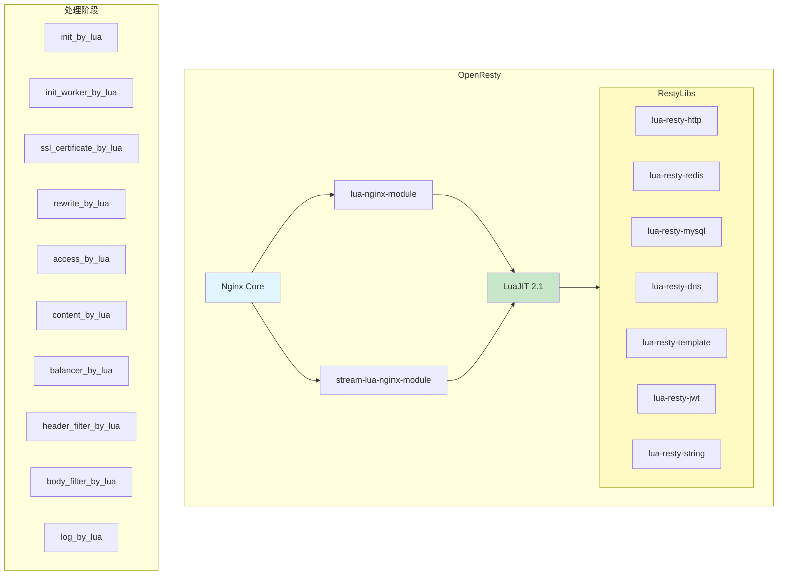
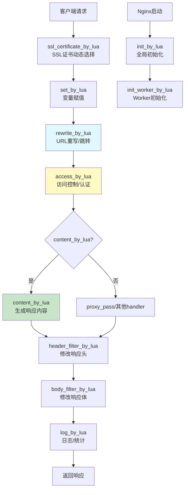
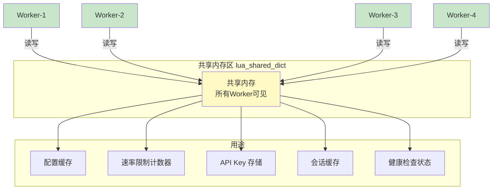

# OpenResty 与 Lua 脚本

OpenResty 是一个基于 Nginx 的高性能 Web 平台，通过集成 LuaJIT 和大量 Lua 库，将 Nginx 从一个 Web 服务器扩展为通用应用平台。在 OpenResty 中，你可以用 Lua 脚本直接操作 Nginx 的各个处理阶段，实现动态路由、访问控制、请求改写、WAF 等高级功能，性能接近原生 C 模块。本文系统讲解 OpenResty 的架构、Lua 语法、核心 API 和实战应用。

## 1. OpenResty 概述与安装

### 1.1 OpenResty 架构



### 1.2 安装 OpenResty

```bash
# Ubuntu/Debian
curl -fsSL https://openresty.org/package/pubkey.gpg | sudo gpg --dearmor -o /usr/share/keyrings/openresty.gpg
echo "deb [signed-by=/usr/share/keyrings/openresty.gpg] http://openresty.org/package/ubuntu $(lsb_release -sc) main" | sudo tee /etc/apt/sources.list.d/openresty.list
sudo apt update
sudo apt install openresty

# CentOS/RHEL
sudo yum install yum-utils
sudo yum-config-manager --add-repo https://openresty.org/package/centos/openresty.repo
sudo yum install openresty

# Docker
docker pull openresty/openresty:alpine

# 验证
openresty -V
# 或
resty -V
```

### 1.3 OpenResty 目录结构

```bash
/usr/local/openresty/
├── bin/
│   ├── openresty     # Nginx 可执行文件
│   ├── resty         # Lua CLI 工具
│   └── opm           # OpenResty 包管理器
├── nginx/
│   ├── conf/
│   │   ├── nginx.conf
│   │   └── mime.types
│   ├── logs/
│   └── sbin/
│       └── nginx     # 同 openresty
├── lualib/
│   ├── resty/        # lua-resty-* 库
│   │   ├── http.lua
│   │   ├── redis.lua
│   │   ├── mysql.lua
│   │   └── ...
│   └── ngx/
│       └── re.lua    # 正则库
└── site/
    └── lualib/       # 第三方 Lua 库
```

## 2. lua-nginx-module 指令

### 2.1 处理阶段与指令



### 2.2 各阶段指令详解

**init_by_lua：Master 进程初始化**

```nginx
# nginx.conf http 上下文
init_by_lua_block {
    -- 全局变量和模块加载
    -- 仅在 Master 进程启动时执行一次

    -- 加载共享配置
    local cjson = require "cjson.safe"

    -- 初始化全局常量
    _G.APP_VERSION = "2.1.0"
    _G.MAX_RETRIES = 3
}

# 或使用文件
init_by_lua_file /etc/openresty/init.lua;
```

**init_worker_by_lua：Worker 进程初始化**

```nginx
init_worker_by_lua_block {
    -- 每个 Worker 进程启动时执行
    -- 适合定时任务、数据预热

    -- 定时同步配置
    local ngx_timer = ngx.timer
    local function sync_config(premature)
        if premature then return end

        -- 从 Redis/etcd 拉取配置
        local redis = require "resty.redis"
        local red = redis:new()
        local ok, err = red:connect("127.0.0.1", 6379)
        if ok then
            local config, err = red:get("nginx:config")
            if config then
                local shared = ngx.shared.config
                shared:set("upstream_config", config)
            end
            red:close()
        end

        -- 每分钟同步一次
        ngx_timer.at(60, sync_config)
    end

    -- 首次执行
    ngx_timer.at(0, sync_config)
}
```

**rewrite_by_lua：URL 重写**

```nginx
server {
    location / {
        rewrite_by_lua_block {
            -- 动态 URL 重写
            local uri = ngx.var.uri

            -- 移除尾部斜杠（除根路径外）
            if uri ~= "/" and string.sub(uri, -1) == "/" then
                local new_uri = string.sub(uri, 1, -2)
                return ngx.redirect(new_uri, 301)
            end

            -- URL 规范化
            if string.find(uri, "//") then
                local clean = string.gsub(uri, "//+", "/")
                return ngx.redirect(clean, 301)
            end
        }

        proxy_pass http://backend;
    }
}
```

**access_by_lua：访问控制**

```nginx
server {
    location /api/ {
        access_by_lua_block {
            -- IP 黑名单检查
            local blacklist = ngx.shared.blacklist
            if blacklist:get(ngx.var.remote_addr) then
                return ngx.exit(403)
            end

            -- API Key 验证
            local api_key = ngx.var.http_x_api_key
            if not api_key then
                ngx.status = 401
                ngx.say('{"error":"Missing API key"}')
                return ngx.exit(401)
            end

            -- 验证 API Key
            local keys = ngx.shared.api_keys
            if not keys:get(api_key) then
                ngx.status = 403
                ngx.say('{"error":"Invalid API key"}')
                return ngx.exit(403)
            end
        }

        proxy_pass http://backend;
    }
}
```

**content_by_lua：生成响应**

```nginx
location /api/time {
    content_by_lua_block {
        ngx.header.content_type = "application/json"
        ngx.say('{"time":"' .. ngx.now() .. '"}')
    }
}

location /api/health {
    content_by_lua_block {
        local cjson = require "cjson.safe"
        local health = {
            status = "ok",
            timestamp = ngx.now(),
            worker_pid = ngx.worker.pid(),
            worker_id = ngx.worker.id(),
            connections = ngx.var.connection,
        }
        ngx.say(cjson.encode(health))
    }
}
```

**log_by_lua：日志统计**

```nginx
log_by_lua_block {
    local stats = ngx.shared.request_stats

    -- 按状态码统计
    local status_key = "status:" .. ngx.var.status
    stats:incr(status_key, 1, 0)

    -- 按URI统计
    local uri_key = "uri:" .. ngx.var.uri
    stats:incr(uri_key, 1, 0)

    -- 响应时间统计
    local rt = tonumber(ngx.var.request_time) or 0
    local rt_key = "rt_total"
    stats:incr(rt_key, rt, 0)
    stats:incr("rt_count", 1, 0)
}
```

## 3. Lua 基础语法速查

### 3.1 变量与类型

```lua
-- Lua 是动态类型语言
-- 8种基本类型：nil, boolean, number, string, function, userdata, thread, table

-- 变量默认全局（慎用）
local x = 10           -- 局部变量（推荐）
y = 20                  -- 全局变量（避免使用）

-- 字符串
local s1 = 'hello'
local s2 = "world"
local s3 = [[多行
字符串]]
local s4 = string.format("name=%s, age=%d", "tom", 25)

-- 表（Lua唯一的数据结构）
local t = {
    name = "nginx",
    version = 1.26,
    modules = {"stream", "http", "mail"},
}
print(t.name)           -- "nginx"
print(t.modules[1])     -- "stream"（索引从1开始）

-- 数组（表的特例）
local arr = {1, 2, 3, 4, 5}
print(#arr)             -- 5（长度）

-- 函数
local function add(a, b)
    return a + b
end

-- 多返回值
local function divmod(a, b)
    return math.floor(a / b), a % b
end
local q, r = divmod(10, 3)
```

### 3.2 控制流

```lua
-- if-else
local status = 200
if status >= 200 and status < 300 then
    -- success
elseif status >= 400 and status < 500 then
    -- client error
elseif status >= 500 then
    -- server error
end

-- while
local i = 0
while i < 10 do
    i = i + 1
end

-- for
for i = 1, 10 do       -- 1到10
    -- ...
end

for i = 1, 10, 2 do   -- 1,3,5,7,9
    -- ...
end

-- for-in（迭代器）
local t = {a = 1, b = 2, c = 3}
for k, v in pairs(t) do
    print(k, v)
end

-- 数组迭代
local arr = {10, 20, 30}
for i, v in ipairs(arr) do
    print(i, v)
end
```

### 3.3 模块

```lua
-- my_module.lua
local _M = {}

function _M.hello(name)
    return "Hello, " .. name .. "!"
end

function _M.get_config(key)
    local shared = ngx.shared.config
    return shared:get(key)
end

return _M

-- 使用模块
local my_module = require "my_module"
local greeting = my_module.hello("Nginx")
```

## 4. 共享字典：lua_shared_dict

### 4.1 共享内存架构



### 4.2 共享字典配置与使用

```nginx
http {
    # 声明共享字典
    lua_shared_dict config 1m;         # 配置缓存 1MB
    lua_shared_dict api_keys 5m;       # API Key 存储 5MB
    lua_shared_dict rate_limit 10m;    # 限流计数器 10MB
    lua_shared_dict request_stats 5m;  # 请求统计 5MB
    lua_shared_dict blacklist 1m;      # IP黑名单 1MB

    server {
        listen 80;

        location /api/ {
            access_by_lua_block {
                local limit = ngx.shared.rate_limit

                -- 限流：每秒100次
                local key = "rate:" .. ngx.var.remote_addr
                local count, err = limit:incr(key, 1, 0, 1)
                -- incr(key, value, init, ttl)
                -- key: 键名
                -- value: 增量
                -- init: 不存在时的初始值
                -- ttl: 过期时间（秒）

                if count > 100 then
                    ngx.exit(429)  -- Too Many Requests
                end
            }

            proxy_pass http://backend;
        }
    }
}
```

### 4.3 共享字典 API

```lua
local dict = ngx.shared.config

-- 基本操作
dict:set("key", "value")              -- 设置
dict:set("key", "value", 60)          -- 设置 + TTL（秒）
dict:get("key")                        -- 获取，返回 value, err
dict:delete("key")                     -- 删除
dict:incr("counter", 1)               -- 自增，返回新值
dict:incr("counter", 1, 0)            -- 自增，不存在时初始化为0
dict:incr("counter", 1, 0, 60)        -- 自增 + TTL

-- 安全操作（add 仅在不存在时设置）
dict:add("key", "value", 60)          -- 仅当key不存在时设置
dict:replace("key", "new_value")      -- 仅当key存在时替换

-- 过期时间
dict:expire("key", 120)               -- 设置/更新TTL
dict:ttl("key")                        -- 获取剩余TTL

-- 列表操作（ngx.shared.DICT 不支持列表操作！）
-- lpush / rpush / lpop / rpop / llen 不存在
-- 如需队列功能，建议通过 Redis（lua-resty-redis）实现队列
-- 或通过 Redis（lua-resty-redis）实现队列

-- 共享字典支持的完整 API：
-- get / set / add / replace / incr / delete
-- expire / ttl / flush_all / flush_expired
-- get_keys / capacity / free_space

-- 获取所有键
local keys = dict:get_keys(100)       -- 获取前100个键
```

::: important 共享字典的线程安全
共享字典的所有操作都是原子性的，无需加锁。`incr` 操作是原子的 CAS（Compare-And-Swap），多个 Worker 同时 `incr` 不会丢失计数。但 `get` + `set` 组合不是原子的，如果需要原子性的"读取-修改-写入"，应使用 `incr` 或 `add`/`replace`。
:::

## 5. cosocket：非阻塞网络 I/O

### 5.1 cosocket 概述

cosocket（Coroutine Socket）是 OpenResty 的核心特性之一，它让 Lua 代码可以以非阻塞方式执行网络 I/O：

```lua
-- cosocket 是协程 + 非阻塞 I/O 的结合
-- 当网络操作阻塞时，自动让出 CPU 给其他请求
-- 操作完成后自动恢复执行

-- 可在以下阶段使用：
-- rewrite_by_lua, access_by_lua, content_by_lua,
-- ngx.timer, balancer_by_lua,
-- init_worker_by_lua（自 lua-nginx-module v0.10.7 起）

-- 不可在以下阶段使用：
-- init_by_lua, header_filter_by_lua, body_filter_by_lua, log_by_lua
```

### 5.2 TCP cosocket

```lua
local sock = ngx.socket.tcp()
sock:settimeout(1000)  -- 1秒超时

-- 连接
local ok, err = sock:connect("127.0.0.1", 6379)
if not ok then
    ngx.log(ngx.ERR, "connect failed: ", err)
    return
end

-- 发送数据
local bytes, err = sock:send("PING\r\n")

-- 接收数据
local data, err = sock:receive()

-- 接收指定行数
local line, err = sock:receive("*l")  -- 读取一行

-- 关闭连接
sock:close()
```

### 5.3 UDP cosocket

```lua
local sock = ngx.socket.udp()
sock:settimeout(1000)

-- 连接
local ok, err = sock:setpeername("8.8.8.8", 53)

-- 发送
local bytes, err = sock:send(dns_query)

-- 接收
local data, err = sock:receive()

sock:close()
```

## 6. Lua RESTy 库

### 6.1 lua-resty-http

```lua
local http = require "resty.http"
local httpc = http.new()

-- GET 请求
local res, err = httpc:request_uri("http://api.example.com/users", {
    method = "GET",
    headers = {
        ["Content-Type"] = "application/json",
    },
    timeout = 5000,
})

if not res then
    ngx.log(ngx.ERR, "http request failed: ", err)
    return
end

ngx.status = res.status
ngx.say(res.body)

-- POST 请求
local cjson = require "cjson.safe"
local res, err = httpc:request_uri("http://api.example.com/users", {
    method = "POST",
    headers = {
        ["Content-Type"] = "application/json",
    },
    body = cjson.encode({
        name = "John",
        age = 30,
    }),
})
```

### 6.2 lua-resty-redis

```lua
local redis = require "resty.redis"
local red = redis:new()

red:set_timeout(1000)  -- 1秒超时

-- 连接
local ok, err = red:connect("127.0.0.1", 6379)
if not ok then
    ngx.log(ngx.ERR, "connect redis failed: ", err)
    return
end

-- 基本操作
red:set("key", "value")
red:get("key")
red:del("key")

-- 带过期
red:setex("session:abc", 3600, "user_data")

-- 哈希
red:hset("user:1", "name", "Tom")
red:hget("user:1", "name")

-- 列表
red:lpush("queue", "item1")
red:rpop("queue")

-- 连接池放回（复用连接）
local ok, err = red:set_keepalive(10000, 100)
-- idle_timeout=10s, pool_size=100
```

### 6.3 lua-resty-mysql

```lua
local mysql = require "resty.mysql"
local db, err = mysql:new()

db:set_timeout(1000)

-- 连接
local ok, err = db:connect({
    host = "127.0.0.1",
    port = 3306,
    database = "myapp",
    user = "nginx",
    password = "secret",
    charset = "utf8mb4",
})

if not ok then
    ngx.log(ngx.ERR, "connect mysql failed: ", err)
    return
end

-- 查询
local res, err = db:query("SELECT * FROM users WHERE id = 1")

-- 参数化查询
local res, err = db:query(
    "SELECT * FROM users WHERE name = " .. ngx.quote_sql_str(name)
)

-- 插入
local res, err = db:query(
    "INSERT INTO users (name, age) VALUES ('Tom', 30)"
)

-- 放回连接池
db:set_keepalive(10000, 100)
```

## 7. 动态路由实现（Lua + Redis）

### 7.1 基于Redis的动态路由

```nginx
http {
    lua_shared_dict routes 1m;

    init_worker_by_lua_block {
        local cjson = require "cjson.safe"
        local redis = require "resty.redis"

        local function load_routes(premature)
            if premature then return end

            local red = redis:new()
            red:set_timeout(1000)

            local ok, err = red:connect("127.0.0.1", 6379)
            if not ok then
                ngx.log(ngx.ERR, "redis connect failed: ", err)
                return
            end

            -- 从 Redis 加载路由表
            local routes_data, err = red:get("nginx:routes")
            if routes_data then
                local routes = cjson.decode(routes_data)
                if routes then
                    local shared = ngx.shared.routes
                    for path, backend in pairs(routes) do
                        shared:set(path, backend)
                    end
                end
            end

            red:close()

            -- 每10秒重新加载
            ngx.timer.at(10, load_routes)
        end

        ngx.timer.at(0, load_routes)
    }

    server {
        listen 80;

        location / {
            access_by_lua_block {
                local routes = ngx.shared.routes
                local uri = ngx.var.uri

                -- 查找路由
                local backend = routes:get(uri)

                -- 前缀匹配
                if not backend then
                    local path = uri
                    while not backend and #path > 1 do
                        path = string.match(path, "^(.+)/")
                        if path then
                            backend = routes:get(path .. "/")
                        end
                    end
                end

                if backend then
                    ngx.var.backend = backend
                else
                    ngx.var.backend = "default_backend"
                end
            }

            proxy_pass http://$backend;
        }
    }
}
```

### 7.2 Redis 路由表数据结构

```bash
# Redis 中存储的路由表
# Key: nginx:routes
# Value: JSON 格式

redis-cli SET nginx:routes '{
    "/api/v1/users": "user_service",
    "/api/v1/orders": "order_service",
    "/api/v1/payments": "payment_service",
    "/static/": "static_service"
}'

# 更新路由后，Nginx 会在10秒内自动生效
```

## 8. 请求过滤与 WAF（Lua 实现）

### 8.1 基础 WAF

```nginx
http {
    lua_shared_dict waf_stats 5m;
    lua_shared_dict ip_blacklist 1m;

    init_worker_by_lua_block {
        -- 预编译正则
        local re = require "ngx.re"

        _G.waf_rules = {
            -- SQL 注入
            sql_injection = {
                "(?i)(\\bunion\\b.*\\bselect\\b)",
                "(?i)(\\binsert\\b.*\\binto\\b)",
                "(?i)(\\bdelete\\b.*\\bfrom\\b)",
                "(?i)(\\bdrop\\b.*\\btable\\b)",
                "(?i)'.*or.*'.*=.*'",
                "(?i);\\s*(select|insert|update|delete|drop)",
            },
            -- XSS
            xss = {
                "(?i)<script[^>]*>.*</script>",
                "(?i)javascript\\s*:",
                "(?i)on(error|load|click|mouseover)\\s*=",
                "(?i)<iframe[^>]*>",
            },
            -- 路径遍历
            path_traversal = {
                "\\.\\./\\.\\.",
                "/etc/passwd",
                "/proc/self/",
            },
            -- 命令注入
            cmd_injection = {
                ";\\s*(ls|cat|rm|wget|curl)\\b",
                "\\|\\s*(ls|cat|rm|wget|curl)\\b",
                "`[^`]*`",
                "\\$\\([^)]*\\)",
            },
        }
    }

    server {
        listen 80;

        access_by_lua_block {
            local waf = require "waf"
            waf.check()
        }

        location / {
            proxy_pass http://backend;
        }
    }
}
```

### 8.2 WAF 模块实现

```lua
-- /usr/local/openresty/lualib/waf.lua
local _M = {}
local cjson = require "cjson.safe"

function _M.check()
    local ngx_re = require "ngx.re"

    -- 检查 IP 黑名单
    local blacklist = ngx.shared.ip_blacklist
    if blacklist:get(ngx.var.remote_addr) then
        _M.log("BLOCKED", "ip_blacklist")
        return ngx.exit(403)
    end

    -- 检查请求参数
    local args = ngx.var.args or ""
    local uri = ngx.var.uri or ""
    local body = ""

    -- 读取请求体
    if ngx.var.request_method == "POST" then
        ngx.req.read_body()
        body = ngx.var.request_body or ""
    end

    local check_data = uri .. " " .. args .. " " .. body

    -- 遍历规则
    for rule_type, patterns in pairs(_G.waf_rules) do
        for _, pattern in ipairs(patterns) do
            local m = ngx.re.find(check_data, pattern, "ijo")
            if m then
                _M.log("BLOCKED", rule_type, pattern)
                return ngx.exit(403)
            end
        end
    end

    -- 速率限制
    local limit = ngx.shared.waf_stats
    local ip_key = "rate:" .. ngx.var.remote_addr
    local count = limit:incr(ip_key, 1, 0, 1)
    if count > 1000 then
        _M.log("BLOCKED", "rate_limit")
        return ngx.exit(429)
    end
end

function _M.log(action, rule_type, pattern)
    local log_entry = cjson.encode({
        time = ngx.now(),
        action = action,
        rule = rule_type,
        pattern = pattern,
        ip = ngx.var.remote_addr,
        uri = ngx.var.uri,
        method = ngx.var.request_method,
    })
    ngx.log(ngx.WARN, "[WAF] ", log_entry)
end

return _M
```

## 9. OpenResty 性能优化

### 9.1 Lua 代码缓存

```nginx
http {
    # 生产环境必须开启
    lua_code_cache on;

    # 关闭时每次请求重新编译 Lua 代码
    # 仅用于开发调试
    # lua_code_cache off;
}
```

::: important lua_code_cache
- `lua_code_cache on`（默认）：Lua 代码只编译一次，后续请求复用编译结果
- `lua_code_cache off`：每次请求重新加载和编译，方便开发调试

**生产环境必须 `on`**，否则性能极差。`off` 仅在开发时使用。
:::

### 9.2 连接池

```lua
-- Redis 连接池
local redis = require "resty.redis"
local red = redis:new()
red:connect("127.0.0.1", 6379)

-- 使用完毕后放回连接池
red:set_keepalive(10000, 100)
-- idle_timeout: 空闲超时（毫秒）
-- pool_size: 每个Worker的连接池大小

-- MySQL 连接池
local mysql = require "resty.mysql"
local db = mysql:new()
db:connect({...})

-- 使用完毕后放回
db:set_keepalive(10000, 100)
```

### 9.3 避免阻塞操作

```lua
-- ❌ 错误：使用 Lua 标准库的阻塞 I/O
local f = io.open("/etc/config.json", "r")
local content = f:read("*a")
f:close()

-- ✅ 正确：使用 ngx.shared.DICT 或 cosocket
local config = ngx.shared.config
local content = config:get("config_json")

-- ❌ 错误：使用 Lua 的 socket 库
local socket = require "socket"
local tcp = socket.tcp()

-- ✅ 正确：使用 cosocket
local sock = ngx.socket.tcp()
```

### 9.4 性能优化清单

| 优化项 | 说明 | 影响 |
|--------|------|------|
| lua_code_cache on | 代码缓存 | 10-100x 性能差异 |
| 连接池复用 | set_keepalive | 减少 TCP 握手开销 |
| 共享字典缓存 | lua_shared_dict | 避免重复计算/查询 |
| 避免阻塞操作 | 不用 io/socket 库 | 不阻塞 Worker |
| 预编译正则 | ngx.re 使用 PCRE JIT | 正则匹配加速 |
| 减少字符串拼接 | 使用 table.concat | 减少GC压力 |
| 限制请求体大小 | client_max_body_size | 避免大请求占用内存 |

## 10. OpenResty vs Kong vs APISIX

| 特性 | OpenResty | Kong | APISIX |
|------|-----------|------|--------|
| 定位 | Lua/Nginx 开发平台 | API 网关 | API 网关 |
| 基于 | Nginx + LuaJIT | OpenResty | OpenResty |
| 配置方式 | nginx.conf + Lua | Admin API + DB | Admin API + etcd |
| 插件系统 | 自行开发 | 内置+自定义 | 内置+自定义 |
| 路由能力 | Lua 实现 | 内置 | 内置（更灵活） |
| 动态配置 | 需自行实现 | 数据库驱动 | etcd 驱动 |
| 性能 | 最高 | 高（有抽象开销） | 高 |
| 学习曲线 | 较陡 | 中等 | 中等 |
| 适用场景 | 高度定制 | 企业API管理 | 云原生API管理 |

::: tip 如何选择
- **OpenResty**：需要最大灵活性和性能，愿意从底层构建
- **Kong**：需要开箱即用的 API 网关，企业级功能
- **APISIX**：云原生环境，需要高性能动态路由，etcd 配置中心
:::

## 11. 参考文档

- [OpenResty 官方文档](https://openresty.org/en/)
- [lua-nginx-module 指令](https://github.com/openresty/lua-nginx-module#directives)
- [lua-nginx-module API](https://github.com/openresty/lua-nginx-module#nginx-api-for-lua)
- [lua-resty-core](https://github.com/openresty/lua-resty-core)
- [lua-resty-http](https://github.com/ledgetech/lua-resty-http)
- [lua-resty-redis](https://github.com/openresty/lua-resty-redis)
- [lua-resty-mysql](https://github.com/openresty/lua-resty-mysql)
- [Programming in Lua](https://www.lua.org/pil/)
- [Kong 官方文档](https://docs.konghq.com/)
- [Apache APISIX 官方文档](https://apisix.apache.org/docs/apisix/getting-started/)
