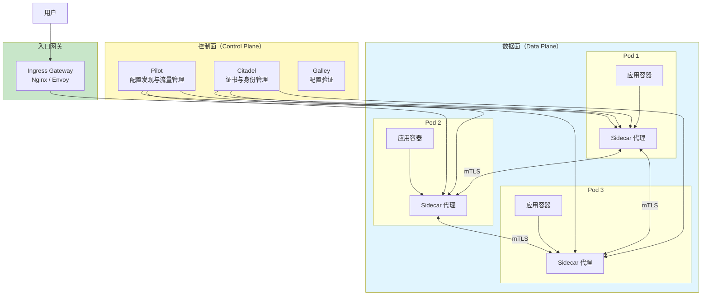
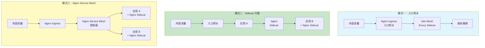
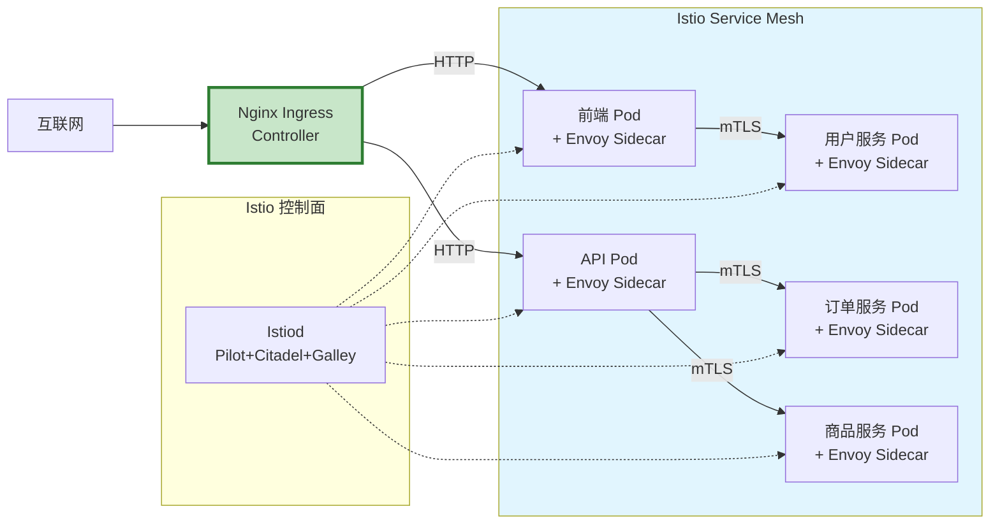
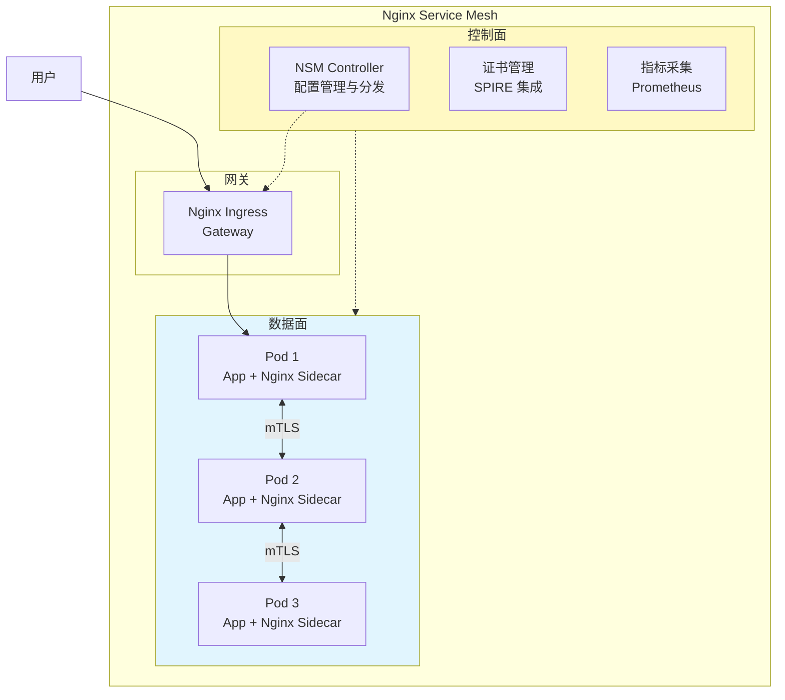
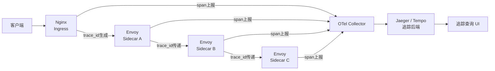
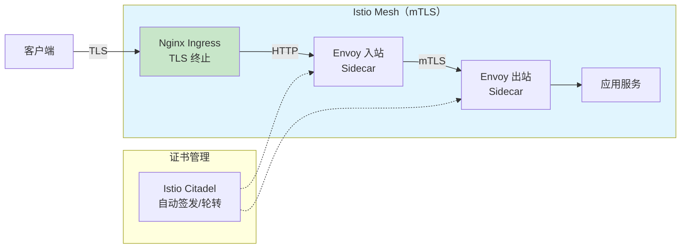
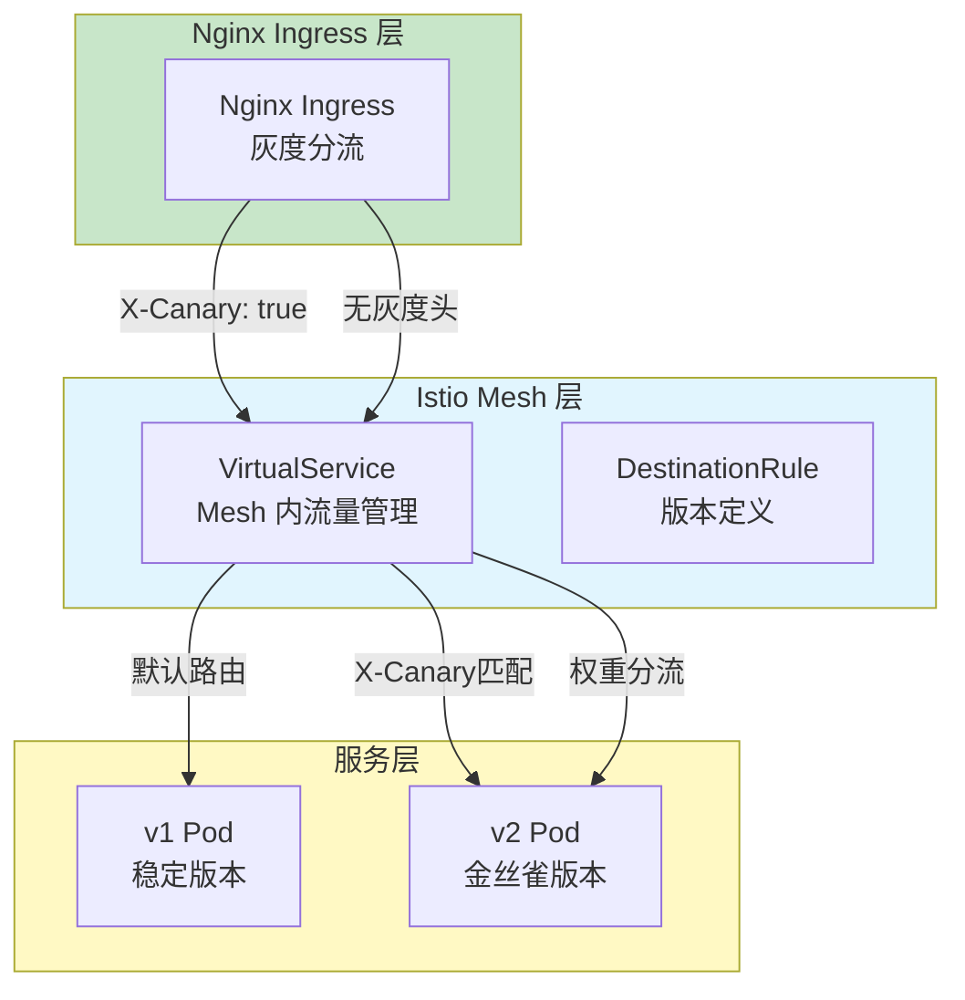

# Nginx 与 Service Mesh 集成

Service Mesh 是微服务架构中处理服务间通信的基础设施层。Nginx 作为成熟的流量代理，在 Service Mesh 生态中扮演着重要角色——既可作为 Sidecar 代理，也可作为入口网关与 Mesh 协同工作。本文系统讲解 Nginx 在 Service Mesh 中的定位、与 Istio 的对比和集成方案，以及生产环境中的最佳实践。

---

## 1. Service Mesh 概述

### 1.1 微服务通信的演进

```
微服务通信演进历程：

1. 硬编码直连
┌─────────┐    ┌─────────┐
│ 服务 A  │───→│ 服务 B  │
│(含通信  │    │(含通信  │
│ 逻辑)  │    │ 逻辑)  │
└─────────┘    └─────────┘
问题：服务发现、负载均衡、熔断等逻辑与业务代码耦合

2. 客户端库（如 Spring Cloud / Finagle）
┌───────────────┐    ┌───────────────┐
│    服务 A     │    │    服务 B     │
│  ┌─────────┐  │    │  ┌─────────┐  │
│  │ 业务   │  │    │  │ 业务   │  │
│  │ 代码   │  │    │  │ 代码   │  │
│  └────┬────┘  │    │  └────┬────┘  │
│  ┌────┴────┐  │    │  ┌────┴────┐  │
│  │SDK/库  │  │    │  │SDK/库  │  │
│  │发现/熔断│  │    │  │发现/熔断│  │
│  └─────────┘  │    │  └─────────┘  │
└───────────────┘    └───────────────┘
问题：多语言重复实现、版本升级困难

3. Service Mesh（Sidecar 模式）
┌──────────────────────┐    ┌──────────────────────┐
│       服务 A         │    │       服务 B         │
│  ┌──────────────┐   │    │  ┌──────────────┐   │
│  │  业务代码    │   │    │  │  业务代码    │   │
│  └──────┬───────┘   │    │  └──────┬───────┘   │
│         │           │    │         │           │
│  ┌──────┴───────┐   │    │  ┌──────┴───────┐   │
│  │  Sidecar     │   │    │  │  Sidecar     │   │
│  │  代理(Envoy) │───┼────┼→│  代理(Envoy) │   │
│  └──────────────┘   │    │  └──────────────┘   │
└──────────────────────┘    └──────────────────────┘
优势：业务代码零侵入、统一控制面、多语言支持
```

### 1.2 Service Mesh 架构



### 1.3 主流 Service Mesh 方案对比

| 特性 | Istio | Linkerd | Consul Connect | Nginx Service Mesh |
|------|-------|---------|---------------|-------------------|
| Sidecar 代理 | Envoy | Linkerd2-proxy | Envoy/内置 | Nginx |
| 控制面语言 | Go | Rust/Go | Go | Go |
| mTLS | 是 | 是 | 是 | 是 |
| 流量管理 | 强大（VirtualService） | 基础 | 中等 | 中等 |
| 可观测性 | 强（Kiali 集成） | 内置 | 中等 | 内置 |
| 性能开销 | 较高 | 较低 | 中等 | 中等 |
| 学习曲线 | 陡峭 | 平缓 | 中等 | 平缓 |
| 社区规模 | 最大 | 中等 | 中等 | 较小 |
| 商业支持 | Google/IBM | Buoyant | HashiCorp | F5/Nginx |

---

## 2. Nginx 在 Service Mesh 中的角色

### 2.1 三种集成模式



### 2.2 模式一：Nginx 作为入口网关

最常见、最成熟的集成方式。Nginx 作为 Kubernetes Ingress Controller 处理外部流量，内部流量由 Istio/Envoy 管理。

```nginx
# Nginx Ingress 配置：与 Istio Mesh 协同

# 关键：确保 Nginx 传递正确的 Header 给下游 Envoy Sidecar

upstream frontend {
    server frontend.default.svc.cluster.local:80;
}

upstream api {
    server api.default.svc.cluster.local:80;
}

server {
    listen 80;
    server_name example.com;

    # 传递客户端真实 IP（Istio 需要用于策略判断）
    proxy_set_header X-Real-IP $remote_addr;
    proxy_set_header X-Forwarded-For $proxy_add_x_forwarded_for;
    proxy_set_header X-Forwarded-Proto $scheme;

    # 传递 Host（Istio VirtualService 基于 Host 路由）
    proxy_set_header Host $host;

    # 传递外部来源标记
    # Istio 使用 x-envoy-* 头部，但 Nginx 入口不使用
    # 可以通过自定义头标记来源
    proxy_set_header X-Source "nginx-ingress";

    location / {
        proxy_pass http://frontend;
    }

    location /api/ {
        proxy_pass http://api;
    }
}
```

```yaml
# Kubernetes Nginx Ingress + Istio 集成配置

# Nginx Ingress Controller 部署
apiVersion: apps/v1
kind: Deployment
metadata:
  name: nginx-ingress-controller
  namespace: ingress-nginx
spec:
  replicas: 2
  selector:
    matchLabels:
      app: nginx-ingress
  template:
    metadata:
      annotations:
        # 重要：排除 Istio Sidecar 自动注入
        # 入口网关不应有 Sidecar，否则形成代理链
        sidecar.istio.io/inject: "false"
      labels:
        app: nginx-ingress
    spec:
      containers:
        - name: nginx-ingress
          image: nginx/nginx-ingress:3.4.0
          ports:
            - containerPort: 80
            - containerPort: 443
---
# Istio Gateway 配置（如果同时使用 Istio Gateway）
apiVersion: networking.istio.io/v1alpha3
kind: Gateway
metadata:
  name: mesh-gateway
  namespace: istio-system
spec:
  selector:
    istio: ingressgateway
  servers:
    - port:
        number: 80
        name: http
        protocol: HTTP
      hosts:
        - "*.example.com"
```

### 2.3 模式二：Nginx 作为 Sidecar 代理

Nginx 替代 Envoy 作为 Pod 内的 Sidecar 代理。这种方式需要自行实现 xDS 协议对接控制面。

```
Nginx Sidecar 架构：

┌────────────────────────────────────┐
│               Pod                  │
│                                    │
│  ┌──────────┐    ┌──────────────┐ │
│  │  应用容器 │    │ Nginx Sidecar│ │
│  │  :8080   │←──→│  :80         │ │
│  │          │    │  :15001 出站  │ │
│  │          │    │  :15006 入站  │ │
│  └──────────┘    └──────────────┘ │
│                       ↕           │
│                  xDS 配置          │
│                  控制面连接         │
└────────────────────────────────────┘

流量路径：
入站：外部 → Nginx:15006 → 应用:8080
出站：应用:8080 → Nginx:15001 → 目标服务

Nginx Sidecar 需要实现：
1. iptables 规则劫持 Pod 内流量
2. xDS 协议从控制面获取配置
3. mTLS 证书管理
4. 健康检查
5. 指标暴露（Prometheus 格式）
```

```nginx
# Nginx Sidecar 代理配置示例
# 通过 xDS 动态配置实现

# 注意：此配置为概念性展示
# 实际需要使用 nginx-plus 或 OpenResty + xDS 客户端

# 入站流量处理
server {
    listen 15006;

    # mTLS 终止
    ssl_certificate     /etc/nginx/certs/server.crt;
    ssl_certificate_key /etc/nginx/certs/server.key;
    ssl_client_certificate /etc/nginx/certs/ca.crt;
    ssl_verify_client on;

    location / {
        proxy_pass http://127.0.0.1:8080;  # 本地应用
        proxy_set_header X-Forwarded-For $proxy_add_x_forwarded_for;
        proxy_set_header X-Forwarded-Proto $scheme;
    }
}

# 出站流量处理
server {
    listen 15001;

    # 基于目标服务的路由
    # 实际通过 xDS 动态更新
    location /service-a/ {
        proxy_pass https://service-a:8443/;
        proxy_ssl_certificate     /etc/nginx/certs/client.crt;
        proxy_ssl_certificate_key /etc/nginx/certs/client.key;
        proxy_ssl_trusted_certificate /etc/nginx/certs/ca.crt;
        proxy_ssl_verify on;
    }

    location /service-b/ {
        proxy_pass https://service-b:8443/;
        proxy_ssl_certificate     /etc/nginx/certs/client.crt;
        proxy_ssl_certificate_key /etc/nginx/certs/client.key;
        proxy_ssl_trusted_certificate /etc/nginx/certs/ca.crt;
        proxy_ssl_verify on;
    }
}
```

---

## 3. Nginx 与 Istio 集成

### 3.1 架构：Nginx Ingress + Istio Mesh



### 3.2 Nginx Ingress 配置优化

```nginx
# Nginx Ingress 与 Istio 集成的关键配置

# /etc/nginx/nginx.conf

# Worker 配置
worker_processes auto;
worker_rlimit_nofile 65535;

events {
    worker_connections 4096;
    use epoll;
    multi_accept on;
}

http {
    # 基础优化
    sendfile on;
    tcp_nopush on;
    tcp_nodelay on;
    keepalive_timeout 65s;
    keepalive_requests 1000;

    # 与 Istio Envoy 的连接优化
    # Envoy Sidecar 默认 keepalive 75s
    # Nginx 需要匹配或略低于此值
    upstream_keepalive_timeout 60s;

    # 连接池配置
    # 与 Envoy 的长连接池
    proxy_http_version 1.1;
    proxy_set_header Connection "";

    # 日志格式（增加 Istio 追踪信息）
    log_format mesh_log '$remote_addr - [$time_local] '
                        '"$request" $status $body_bytes_sent '
                        '"$http_referer" "$http_user_agent" '
                        'rt=$request_time '
                        'upstream=$upstream_addr '
                        'trace_id=$http_x_b3_traceid '
                        'span_id=$http_x_b3_spanid';

    access_log /var/log/nginx/access.log mesh_log;

    # 传递 Istio 追踪头
    # B3 追踪格式（Zipkin 兼容）
    proxy_set_header X-B3-TraceId $http_x_b3_traceid;
    proxy_set_header X-B3-SpanId $http_x_b3_spanid;
    proxy_set_header X-B3-ParentSpanId $http_x_b3_parentspanid;
    proxy_set_header X-B3-Sampled $http_x_b3_sampled;

    # W3C Trace Context 格式（Istio 1.12+ 默认）
    proxy_set_header Traceparent $http_traceparent;
    proxy_set_header Tracestate $http_tracestate;

    # 传递请求 ID（用于端到端追踪）
    proxy_set_header X-Request-ID $http_x_request_id;

    server {
        listen 80;
        server_name example.com;

        # 客户端相关
        client_max_body_size 10m;
        client_header_timeout 10s;
        client_body_timeout 30s;

        location / {
            # 传递原始 Host（Istio VirtualService 依赖 Host 路由）
            proxy_set_header Host $host;

            # 传递真实 IP
            proxy_set_header X-Real-IP $remote_addr;
            proxy_set_header X-Forwarded-For $proxy_add_x_forwarded_for;
            proxy_set_header X-Forwarded-Proto $scheme;

            # 代理超时（与 Istio 默认超时对齐）
            proxy_connect_timeout 5s;
            proxy_read_timeout 30s;
            proxy_send_timeout 30s;

            proxy_pass http://backend;
        }
    }
}
```

### 3.3 Istio VirtualService 与 Nginx 协同

```yaml
# Istio VirtualService 配置
# Nginx Ingress 将流量转发到 Kubernetes Service
# Istio VirtualService 在 Mesh 内部做精细流量管理

apiVersion: networking.istio.io/v1beta1
kind: VirtualService
metadata:
  name: api-vs
  namespace: default
spec:
  hosts:
    - api.default.svc.cluster.local
  http:
    # 金丝雀发布：10% 流量到 v2
    - match:
        - headers:
            x-canary:
              exact: "true"
      route:
        - destination:
            host: api.default.svc.cluster.local
            port:
              number: 80
            subset: v2
          weight: 100

    # 默认路由：90% v1 / 10% v2
    - route:
        - destination:
            host: api.default.svc.cluster.local
            port:
              number: 80
            subset: v1
          weight: 90
        - destination:
            host: api.default.svc.cluster.local
            port:
              number: 80
            subset: v2
          weight: 10
      retries:
        attempts: 3
        perTryTimeout: 2s
---
# DestinationRule 定义服务版本
apiVersion: networking.istio.io/v1beta1
kind: DestinationRule
metadata:
  name: api-dr
  namespace: default
spec:
  host: api.default.svc.cluster.local
  trafficPolicy:
    connectionPool:
      tcp:
        maxConnections: 100
      http:
        h2UpgradePolicy: DEFAULT
        http1MaxPendingRequests: 100
        http2MaxRequests: 100
    outlierDetection:
      consecutive5xxErrors: 3
      interval: 30s
      baseEjectionTime: 30s
      maxEjectionPercent: 50
  subsets:
    - name: v1
      labels:
        version: v1
    - name: v2
      labels:
        version: v2
```

### 3.4 Nginx 传递灰度标记给 Istio

```nginx
# Nginx 层面灰度判断 → 传递给 Istio

# 灰度规则
split_clients "${remote_addr}" $canary_flag {
    10%    "true";
    *      "false";
}

# Cookie 覆盖
map "$cookie_canary|$canary_flag" $final_canary {
    default   "false";
    "true|*"  "true";
    "|true"   "true";
}

server {
    listen 80;
    server_name example.com;

    location /api/ {
        # 将灰度标记传递给 Istio
        # Istio VirtualService 会根据此 Header 路由
        proxy_set_header X-Canary $final_canary;
        proxy_set_header Host $host;
        proxy_set_header X-Real-IP $remote_addr;

        proxy_pass http://api.default.svc.cluster.local;
    }
}
```

---

## 4. Nginx Service Mesh

### 4.1 Nginx Service Mesh 架构

::: warning NSM 已停止维护
Nginx Service Mesh (NSM) 已于 2023 年停止开发和维护，以下内容仅供学习参考。生产环境建议使用 Istio 或 Linkerd。
:::

Nginx Service Mesh（NSM）是 F5/NGINX 推出的轻量级 Service Mesh 方案，使用 Nginx 作为 Sidecar 代理。



### 4.2 安装 Nginx Service Mesh

```bash
# ===== 安装 Nginx Service Mesh =====

# 前置条件：Kubernetes 1.19+，Helm 3+

# 1. 添加 Helm 仓库
helm repo add nginx-mesh https://helm.nginx.com/nginx-mesh
helm repo update

# 2. 创建命名空间
kubectl create namespace nginx-mesh

# 3. 安装 NSM
helm install nsm nginx-mesh/nginx-mesh \
    --namespace nginx-mesh \
    --set controller.image.tag=2.1.0 \
    --set prometheus.deploy=true \
    --set grafana.deploy=true \
    --set mtls.mode=permissive \
    --set tracing.enable=true \
    --set tracing.backend=zipkin \
    --set tracing.address=zipkin.istio-system:9411

# 4. 验证安装
kubectl get pods -n nginx-mesh
kubectl get meshes -o yaml

# 5. 查看注入的 Sidecar
kubectl get pods -n default -o jsonpath='{.items[*].spec.containers[*].name}'

# 6. 启用自动注入
kubectl label namespace default nsm.nginx.com/monitor=enabled
```

### 4.3 NSM 流量管理配置

```yaml
# Nginx Service Mesh 流量管理策略

# 1. 基础流量策略
apiVersion: specs.smi-spec.io/v1alpha4
kind: HTTPRouteGroup
metadata:
  name: api-routes
  namespace: default
matches:
  - name: api-all
    pathRegex: /api/.*
    methods: ["*"]
---
# 2. 流量分流（Traffic Split）— 金丝雀发布
apiVersion: split.smi-spec.io/v1alpha4
kind: TrafficSplit
metadata:
  name: api-canary
  namespace: default
spec:
  service: api
  backends:
    - service: api-v1
      weight: 90
    - service: api-v2
      weight: 10
---
# 3. 访问控制
apiVersion: access.smi-spec.io/v1alpha3
kind: TrafficTarget
metadata:
  name: api-access
  namespace: default
spec:
  destination:
    kind: ServiceAccount
    name: api
    namespace: default
  rules:
    - kind: HTTPRouteGroup
      name: api-routes
      matches:
        - api-all
  sources:
    - kind: ServiceAccount
      name: frontend
      namespace: default
```

### 4.4 NSM 与 Nginx Ingress 联动

```yaml
# Nginx Ingress Controller + Nginx Service Mesh

# Ingress 资源
apiVersion: networking.k8s.io/v1
kind: Ingress
metadata:
  name: api-ingress
  namespace: default
  annotations:
    # Nginx Ingress 特定注解
    nginx.ingress.kubernetes.io/rewrite-target: /
    nginx.ingress.kubernetes.io/ssl-redirect: "true"
    # 传递追踪头
    nginx.ingress.kubernetes.io/configuration-snippet: |
      proxy_set_header X-B3-TraceId $http_x_b3_traceid;
      proxy_set_header X-B3-SpanId $http_x_b3_spanid;
spec:
  ingressClassName: nginx
  tls:
    - hosts:
        - api.example.com
      secretName: api-tls
  rules:
    - host: api.example.com
      http:
        paths:
          - path: /
            pathType: Prefix
            backend:
              service:
                name: api
                port:
                  number: 80
```

---

## 5. Nginx 与 Envoy 对比

### 5.1 作为 Service Mesh Sidecar 的对比

```
Nginx vs Envoy 作为 Sidecar 对比：

┌────────────────┬───────────────────┬───────────────────┐
│     特性       │     Nginx         │     Envoy         │
├────────────────┼───────────────────┼───────────────────┤
│ xDS 协议      │ Nginx Plus 支持   │ 原生支持          │
│ 动态配置      │ nginx -s reload   │ xDS 热更新        │
│ mTLS          │ 需手动配置证书     │ 自动证书轮转      │
│ L7 路由       │ 强（rewrite/map） │ 强（RDS）         │
│ 负载均衡      │ 轮询/最少连接/IP哈希│ 轮询/环哈希等    │
│ 熔断          │ 需 Lua 或 Plus    │ 内置 outlier检测  │
│ 限流          │ limit_req/limit_conn│ 内置 rate limit │
│ 重试          │ proxy_next_upstream│ 内置 retry策略   │
│ 追踪          │ 需模块/Lua        │ 内置 OpenTelemetry│
│ 指标          │ stub_status       │ 内置 Prometheus   │
│ gRPC          │ 支持              │ 一等公民支持      │
│ HTTP/2        │ 支持              │ 一等公民支持      │
│ 内存占用      │ 较低（~5MB）      │ 较高（~50MB）     │
│ 启动速度      │ 快（<1s）         │ 中等（~2s）       │
│ 配置语言      │ Nginx DSL         │ YAML/xDS         │
│ 管理接口      │ 有限              │ 丰富的 admin API  │
│ 社区生态      │ Web 服务生态      │ Mesh 生态         │
└────────────────┴───────────────────┴───────────────────┘
```

### 5.2 选型建议

```
选择 Nginx 作为入口网关的场景：
├── 已有成熟的 Nginx 运维体系
├── 需要复杂的 URL 重写和路由规则
├── 需要丰富的第三方模块生态
├── 团队对 Nginx 配置更熟悉
└── 性能要求高、内存受限的环境

选择 Envoy 作为 Sidecar 的场景：
├── 需要与 Istio 深度集成
├── 需要 xDS 动态配置
├── 需要自动 mTLS 证书管理
├── 需要内置的熔断和限流
├── 需要 OpenTelemetry 原生追踪
└── 需要丰富的可观测性

混合方案（推荐）：
├── Nginx 作为入口网关（Ingress Controller）
├── Envoy 作为 Sidecar 代理
├── Nginx 负责外部流量接入、TLS 终止、路由
├── Envoy 负责服务间通信、mTLS、流量管理
└── 两者通过标准 HTTP 头部协作
```

---

## 6. 分布式追踪集成

### 6.1 追踪系统架构



### 6.2 Nginx 生成追踪 ID

```nginx
# Nginx 作为入口网关生成分布式追踪 ID
# 使用 OpenTelemetry 模块或 Lua 脚本

# ===== 方式一：OpenTelemetry 模块 =====
# 需要编译 nginx-opentelemetry 模块

load_module modules/ngx_http_opentelemetry_module.so;

http {
    # OpenTelemetry 配置
    opentelemetry on;
    opentelemetry_trust_incoming_spans on;
    opentelemetry_operation_name "$uri";

    # 注意：endpoint、service_name 等配置通过环境变量设置，而非 nginx 指令
    # 在 Docker 或 systemd 中配置环境变量：
    # OTEL_EXPORTER_OTLP_ENDPOINT=http://otel-collector.observability:4317
    # OTEL_SERVICE_NAME=nginx-ingress
    # OTEL_RESOURCE_ATTRIBUTES=service.version=1.0.0,deployment.environment=production

    server {
        listen 80;
        server_name example.com;

        location / {
            opentelemetry_operation_name "HTTP $request_method $uri";

            proxy_pass http://backend;
        }
    }
}

# ===== 方式二：Lua 脚本生成 Trace ID =====
# 使用 OpenResty

http {
    # 生成 128 位 Trace ID
    init_by_lua_block {
        math.randomseed(ngx.now() * 1000)
    }

    server {
        listen 80;

        set_by_lua_block $trace_id {
            local rand = math.random
            return string.format("%016x%016x", rand(2^32)*2^32+rand(2^32), rand(2^32)*2^32+rand(2^32))
        }

        set_by_lua_block $span_id {
            return string.format("%016x", math.random(2^32)*2^32+math.random(2^32))
        }

        location / {
            # 传递 B3 追踪头
            proxy_set_header X-B3-TraceId $trace_id;
            proxy_set_header X-B3-SpanId $span_id;
            proxy_set_header X-B3-Sampled "1";

            # 传递 W3C Trace Context
            proxy_set_header Traceparent "00-$trace_id-$span_id-01";

            proxy_pass http://backend;
        }
    }
}
```

### 6.3 追踪头传递与关联

```nginx
# 确保追踪头在 Nginx → Envoy → 服务 之间正确传递

server {
    listen 80;
    server_name example.com;

    location / {
        # ===== B3 追踪头（Zipkin 兼容）=====
        # 如果客户端已发送，透传；否则使用 Nginx 生成的
        proxy_set_header X-B3-TraceId $http_x_b3_traceid;
        proxy_set_header X-B3-SpanId $http_x_b3_spanid;
        proxy_set_header X-B3-ParentSpanId $http_x_b3_parentspanid;
        proxy_set_header X-B3-Sampled $http_x_b3_sampled;
        proxy_set_header X-B3-Flags $http_x_b3_flags;

        # ===== W3C Trace Context（Istio 1.12+ 默认）=====
        proxy_set_header Traceparent $http_traceparent;
        proxy_set_header Tracestate $http_tracestate;

        # ===== 通用追踪头 =====
        proxy_set_header X-Request-ID $http_x_request_id;

        # 基础头部
        proxy_set_header Host $host;
        proxy_set_header X-Real-IP $remote_addr;
        proxy_set_header X-Forwarded-For $proxy_add_x_forwarded_for;
        proxy_set_header X-Forwarded-Proto $scheme;

        proxy_pass http://backend;
    }
}
```

---

## 7. 可观测性集成

### 7.1 指标暴露与采集

```nginx
# Nginx 指标暴露（与 Istio Prometheus 协同）

# 1. 基础 stub_status
server {
    listen 8080;
    server_name localhost;
    allow 10.0.0.0/8;
    deny all;

    location /stub_status {
        stub_status;
    }
}

# 2. 增强指标（使用 nginx-prometheus-exporter）
# nginx-prometheus-exporter 将 stub_status 转为 Prometheus 格式

# 3. 自定义指标（通过 Lua）
server {
    listen 8080;

    location /metrics {
        default_type text/plain;
        content_by_lua_block {
            local shm = ngx.shared.metrics

            -- 请求计数
            local requests_total = shm:get("requests_total") or 0
            ngx.say(string.format("# HELP nginx_requests_total Total requests"))
            ngx.say(string.format("# TYPE nginx_requests_total counter"))
            ngx.say(string.format("nginx_requests_total %d", requests_total))

            -- 按状态码分类
            local status_2xx = shm:get("status_2xx") or 0
            local status_4xx = shm:get("status_4xx") or 0
            local status_5xx = shm:get("status_5xx") or 0

            ngx.say(string.format("nginx_status_2xx %d", status_2xx))
            ngx.say(string.format("nginx_status_4xx %d", status_4xx))
            ngx.say(string.format("nginx_status_5xx %d", status_5xx))

            -- 延迟直方图
            local latency_sum = shm:get("latency_sum") or 0
            local latency_count = shm:get("latency_count") or 0
            ngx.say(string.format("# HELP nginx_request_duration_seconds Request duration"))
            ngx.say(string.format("# TYPE nginx_request_duration_seconds summary"))
            ngx.say(string.format("nginx_request_duration_seconds_sum %f", latency_sum / 1000))
            ngx.say(string.format("nginx_request_duration_seconds_count %d", latency_count))
        }
    }
}

# 在请求处理中记录指标
log_by_lua_block {
    local shm = ngx.shared.metrics
    shm:incr("requests_total", 1)

    local status = ngx.status
    if status >= 200 and status < 300 then
        shm:incr("status_2xx", 1)
    elseif status >= 400 and status < 500 then
        shm:incr("status_4xx", 1)
    elseif status >= 500 then
        shm:incr("status_5xx", 1)
    end

    local latency = ngx.now() * 1000 - ngx.req.start_time() * 1000
    shm:incr("latency_sum", latency)
    shm:incr("latency_count", 1)
}
```

### 7.2 Prometheus 采集配置

```yaml
# Prometheus 采集 Nginx + Istio 指标

scrape_configs:
  # Nginx 指标
  - job_name: nginx-ingress
    kubernetes_sd_configs:
      - role: pod
        namespaces:
          names:
            - ingress-nginx
    relabel_configs:
      - source_labels: [__meta_kubernetes_pod_name]
        regex: nginx-ingress-.*
        action: keep
    metrics_path: /metrics
    scrape_interval: 15s

  # Istio Sidecar 指标（自动发现）
  - job_name: istio-sidecar
    kubernetes_sd_configs:
      - role: pod
    relabel_configs:
      - source_labels: [__meta_kubernetes_pod_container_name]
        regex: istio-proxy
        action: keep
      - source_labels: [__meta_kubernetes_pod_annotationpresent_prometheus_io_scrape]
        action: keep
    metrics_path: /stats/prometheus
    scrape_interval: 15s
```

### 7.3 Grafana 仪表盘配置

```json
{
  "dashboard": {
    "title": "Nginx + Istio Mesh Dashboard",
    "panels": [
      {
        "title": "Nginx Request Rate",
        "targets": [
          {
            "expr": "sum(rate(nginx_requests_total[5m])) by (ingress)"
          }
        ]
      },
      {
        "title": "Istio Request Rate",
        "targets": [
          {
            "expr": "sum(rate(istio_requests_total[5m])) by (destination_service)"
          }
        ]
      },
      {
        "title": "Nginx P99 Latency",
        "targets": [
          {
            "expr": "histogram_quantile(0.99, sum(rate(nginx_request_duration_seconds_bucket[5m])) by (le, ingress))"
          }
        ]
      },
      {
        "title": "Istio P99 Latency",
        "targets": [
          {
            "expr": "histogram_quantile(0.99, sum(rate(istio_request_duration_milliseconds_bucket[5m])) by (le, destination_service))"
          }
        ]
      },
      {
        "title": "Error Rate (Nginx + Istio)",
        "targets": [
          {
            "expr": "sum(rate(nginx_status_5xx[5m])) / sum(rate(nginx_requests_total[5m]))"
          },
          {
            "expr": "sum(rate(istio_requests_total{response_code=~\"5..\"}[5m])) / sum(rate(istio_requests_total[5m]))"
          }
        ]
      }
    ]
  }
}
```

---

## 8. mTLS 与安全集成

### 8.1 Nginx 与 Istio mTLS



### 8.2 Nginx Ingress mTLS 配置

```nginx
# Nginx Ingress 处理外部 TLS + 内部连接 Istio mTLS

server {
    # 外部 TLS 终止
    listen 443 ssl http2;
    server_name api.example.com;

    # 外部证书
    ssl_certificate     /etc/nginx/ssl/api.example.com.crt;
    ssl_certificate_key /etc/nginx/ssl/api.example.com.key;

    # TLS 安全配置
    ssl_protocols TLSv1.2 TLSv1.3;
    ssl_ciphers ECDHE-ECDSA-AES128-GCM-SHA256:ECDHE-RSA-AES128-GCM-SHA256;
    ssl_prefer_server_ciphers off;
    ssl_session_cache shared:SSL:10m;
    ssl_session_timeout 1d;
    ssl_session_tickets off;

    # HSTS
    add_header Strict-Transport-Security "max-age=63072000" always;

    location / {
        # 内部连接到 Istio Sidecar
        # Istio 默认使用 PERMISSIVE 模式（同时支持 HTTP 和 mTLS）
        # Nginx → Envoy Sidecar 使用 HTTP
        proxy_pass http://api.default.svc.cluster.local:80;

        # 如果 Istio 使用 STRICT mTLS 模式
        # 需要配置 Nginx 客户端证书
        # proxy_pass https://api.default.svc.cluster.local:443;
        # proxy_ssl_certificate /etc/nginx/ssl/client.crt;
        # proxy_ssl_certificate_key /etc/nginx/ssl/client.key;
        # proxy_ssl_trusted_certificate /etc/nginx/ssl/ca.crt;
        # proxy_ssl_verify on;

        proxy_set_header Host $host;
        proxy_set_header X-Real-IP $remote_addr;
        proxy_set_header X-Forwarded-For $proxy_add_x_forwarded_for;
        proxy_set_header X-Forwarded-Proto https;
    }
}
```

### 8.3 Istio mTLS 模式与 Nginx 适配

```yaml
# Istio mTLS 策略配置

# 方式一：PERMISSIVE 模式（推荐 Nginx Ingress 使用）
# 同时接受 HTTP 和 mTLS 连接
apiVersion: security.istio.io/v1beta1
kind: PeerAuthentication
metadata:
  name: default
  namespace: default
spec:
  mtls:
    mode: PERMISSIVE

---
# 方式二：STRICT 模式（需要 Nginx 配置客户端证书）
apiVersion: security.istio.io/v1beta1
kind: PeerAuthentication
metadata:
  name: api-strict
  namespace: default
spec:
  selector:
    matchLabels:
      app: api
  mtls:
    mode: STRICT

---
# 方式三：仅对特定端口使用 STRICT
apiVersion: security.istio.io/v1beta1
kind: PeerAuthentication
metadata:
  name: api-port-mtls
  namespace: default
spec:
  selector:
    matchLabels:
      app: api
  portLevelMtls:
    8080:
      mode: PERMISSIVE    # Nginx Ingress 使用
    8443:
      mode: STRICT        # 服务间使用
```

---

## 9. 流量管理实战

### 9.1 Nginx + Istio 灰度发布完整方案



```nginx
# Nginx Ingress 灰度配置

# 灰度分流
split_clients "${remote_addr}" $canary_header {
    10%    "true";
    *      "false";
}

# Cookie 覆盖
map "$cookie_canary|$canary_header" $final_canary {
    default     "false";
    "true|*"   "true";
    "|true"    "true";
}

server {
    listen 80;
    server_name api.example.com;

    location / {
        # 传递灰度标记给 Istio
        proxy_set_header X-Canary $final_canary;
        proxy_set_header Host $host;

        # 传递追踪信息
        proxy_set_header X-B3-TraceId $http_x_b3_traceid;
        proxy_set_header X-B3-SpanId $http_x_b3_spanid;

        proxy_pass http://api.default.svc.cluster.local;
    }
}
```

```yaml
# Istio VirtualService 灰度路由
apiVersion: networking.istio.io/v1beta1
kind: VirtualService
metadata:
  name: api-canary
  namespace: default
spec:
  hosts:
    - api.default.svc.cluster.local
  http:
    # Nginx 传递的灰度标记匹配
    - match:
        - headers:
            x-canary:
              exact: "true"
      route:
        - destination:
            host: api.default.svc.cluster.local
            subset: v2
      retries:
        attempts: 2
        perTryTimeout: 3s
      timeout: 10s

    # 默认路由（稳定版为主，少量灰度）
    - route:
        - destination:
            host: api.default.svc.cluster.local
            subset: v1
          weight: 100
      timeout: 10s
```

### 9.2 故障注入测试

```nginx
# Nginx 层面故障模拟（配合 Istio 故障注入）

# 延迟注入
location /api/slow/ {
    # 模拟 3 秒延迟
    # 用于测试下游服务的超时和重试逻辑
    echo_sleep 3s;
    proxy_pass http://api.default.svc.cluster.local;
}

# 错误注入
location /api/error/ {
    # 模拟 500 错误
    return 500 '{"error":"internal server error"}';
}

# Istio 层面故障注入（更精细）
```

```yaml
# Istio 故障注入配置
apiVersion: networking.istio.io/v1beta1
kind: VirtualService
metadata:
  name: api-fault-injection
  namespace: default
spec:
  hosts:
    - api.default.svc.cluster.local
  http:
    # 10% 的请求返回 500
    - fault:
        abort:
          percentage:
            value: 10
          httpStatus: 500
      route:
        - destination:
            host: api.default.svc.cluster.local

    # 20% 的请求延迟 5 秒
    - fault:
        delay:
          percentage:
            value: 20
          fixedDelay: 5s
      route:
        - destination:
            host: api.default.svc.cluster.local
```

### 9.3 流量镜像

```nginx
# Nginx 流量镜像（Shadow Traffic）
# 将生产流量复制到测试环境

upstream production {
    server 10.0.1.10:8080;
}

upstream shadow {
    server 10.0.2.10:8080;
}

server {
    listen 80;
    server_name api.example.com;

    location / {
        # 主请求发往生产
        proxy_pass http://production;

        # 镜像流量发往影子环境
        # 使用 post_action 实现（不阻塞主请求）
        post_action /shadow;
    }

    # 影子请求处理
    location /shadow {
        internal;
        proxy_pass http://shadow$request_uri;
        proxy_set_header X-Shadow-Traffic "true";
        proxy_set_header Host $host;
        # 忽略影子请求的响应
        proxy_ignore_errors on;
    }
}
```

```yaml
# Istio 流量镜像（更优雅的方式）
apiVersion: networking.istio.io/v1beta1
kind: VirtualService
metadata:
  name: api-mirror
  namespace: default
spec:
  hosts:
    - api.default.svc.cluster.local
  http:
    - route:
        - destination:
            host: api.default.svc.cluster.local
            subset: v1
          weight: 100
      mirror:
        host: api-shadow.default.svc.cluster.local
      mirrorPercentage:
        value: 100    # 镜像 100% 流量
```

---

## 10. 生产环境最佳实践

### 10.1 Nginx + Istio 部署架构

```
生产环境推荐架构：

                   ┌─────────────┐
                   │   CDN/WAF   │  ← DDoS 清洗 + 静态缓存
                   └──────┬──────┘
                          │
                   ┌──────┴──────┐
                   │   Nginx     │  ← Ingress Controller
                   │   Ingress   │  · TLS 终止
                   │   (2+ 副本) │  · 路由分发
                   └──────┬──────┘  · 限流
                          │        · 安全头
                   ┌──────┴──────┐
                   │   Istio     │  ← Service Mesh
                   │   Mesh      │  · mTLS
                   │             │  · 流量管理
                   └──────┬──────┘  · 熔断/重试
                          │        · 追踪
              ┌───────────┼───────────┐
              │           │           │
         ┌────┴────┐ ┌────┴────┐ ┌────┴────┐
         │ 前端服务 │ │ API 服务 │ │ 后台服务 │
         │+ Envoy  │ │+ Envoy  │ │+ Envoy  │
         └─────────┘ └─────────┘ └─────────┘

配置建议：
1. Nginx Ingress 不注入 Envoy Sidecar
2. Nginx Ingress 使用 Deployment + HPA
3. Istio 控制面独立部署（3 副本）
4. 监控使用 Prometheus + Grafana
5. 追踪使用 OpenTelemetry + Jaeger/Tempo
6. 日志使用 Filebeat/Fluentd → ELK
```

### 10.2 Nginx Ingress 生产配置

```nginx
# 生产级 Nginx Ingress 配置

worker_processes auto;
worker_rlimit_nofile 65535;

events {
    worker_connections 8192;
    use epoll;
    multi_accept on;
}

http {
    # 基础设置
    sendfile on;
    tcp_nopush on;
    tcp_nodelay on;
    keepalive_timeout 65s;
    keepalive_requests 1000;

    # 隐藏版本号
    server_tokens off;

    # 系统级优化
    reset_timedout_connection on;

    # 日志格式（包含追踪信息）
    log_format production '$remote_addr - [$time_local] '
                          '"$request" $status $body_bytes_sent '
                          '"$http_referer" "$http_user_agent" '
                          'rt=$request_time '
                          'upstream=$upstream_addr '
                          'upstream_status=$upstream_status '
                          'upstream_rt=$upstream_response_time '
                          'trace_id=$http_x_b3_traceid '
                          'canary=$http_x_canary';

    access_log /var/log/nginx/access.log production buffer=32k flush=5s;

    # Gzip 压缩
    gzip on;
    gzip_min_length 1024;
    gzip_types text/plain text/css application/json application/javascript text/xml;
    gzip_vary on;

    # 限流配置
    limit_req_zone $binary_remote_addr zone=global:100m rate=100r/s;
    limit_conn_zone $binary_remote_addr zone=per_ip:100m;

    # 代理配置
    proxy_http_version 1.1;
    proxy_set_header Connection "";

    # 上游长连接池
    upstream api_backend {
        server api.default.svc.cluster.local:80;

        keepalive 64;
        keepalive_requests 1000;
        keepalive_timeout 60s;
    }

    server {
        listen 80;
        server_name _;

        # 全局限流
        limit_req zone=global burst=200 nodelay;
        limit_conn per_ip 200;

        # 安全头
        add_header X-Frame-Options "SAMEORIGIN" always;
        add_header X-Content-Type-Options "nosniff" always;
        add_header X-XSS-Protection "1; mode=block" always;
        add_header Referrer-Policy "strict-origin-when-cross-origin" always;

        # 超时设置
        client_header_timeout 10s;
        client_body_timeout 30s;
        send_timeout 30s;

        # 请求大小限制
        client_max_body_size 10m;
        client_header_buffer_size 1k;
        large_client_header_buffers 4 8k;

        location / {
            proxy_pass http://api_backend;
            proxy_set_header Host $host;
            proxy_set_header X-Real-IP $remote_addr;
            proxy_set_header X-Forwarded-For $proxy_add_x_forwarded_for;
            proxy_set_header X-Forwarded-Proto $scheme;

            # 追踪头传递
            proxy_set_header X-B3-TraceId $http_x_b3_traceid;
            proxy_set_header X-B3-SpanId $http_x_b3_spanid;
            proxy_set_header X-B3-ParentSpanId $http_x_b3_parentspanid;
            proxy_set_header X-B3-Sampled $http_x_b3_sampled;

            # 代理超时
            proxy_connect_timeout 5s;
            proxy_read_timeout 30s;
            proxy_send_timeout 30s;

            # 失败重试
            proxy_next_upstream error timeout http_503;
            proxy_next_upstream_timeout 5s;
            proxy_next_upstream_tries 2;
        }

        # 健康检查
        location = /health {
            access_log off;
            return 200 "OK";
        }

        # 指标暴露
        location = /stub_status {
            stub_status;
            allow 10.0.0.0/8;
            deny all;
        }
    }
}
```

### 10.3 常见问题排查

```
Nginx + Istio 常见问题排查：

Q1: Nginx Ingress 到 Pod 的请求 503
排查：
  1. 检查 Nginx 是否注入了 Envoy Sidecar（应该不注入）
     kubectl get pod <nginx-pod> -o jsonpath='{.spec.containers[*].name}'
  2. 检查 Istio mTLS 模式
     kubectl get peerauthentication -o yaml
  3. 如果 STRICT 模式，Nginx 需要 mTLS 客户端证书
  4. 检查 DestinationRule 是否限制了流量

Q2: 追踪链断裂
排查：
  1. 检查 Nginx 是否传递 X-B3-* 头部
  2. 检查 proxy_set_header 配置
  3. 检查 Istio tracing 采样率
  4. 使用 curl 手动发送追踪头测试

Q3: Nginx Ingress 性能下降
排查：
  1. 检查是否意外注入了 Envoy Sidecar
  2. 检查 keepalive 配置是否匹配
  3. 检查 upstream 长连接池
  4. 检查 Istio 的连接池限制

Q4: 灰度流量不按预期路由
排查：
  1. 检查 Nginx 灰度头是否正确传递
  2. 检查 Istio VirtualService 的匹配规则
  3. 检查是否有多条 VirtualService 冲突
  4. 使用 istioctl analyze 检查配置

Q5: mTLS 握手失败
排查：
  1. 检查证书是否过期
  2. 检查 CA 证书是否匹配
  3. 检查 SNI 是否正确
  4. 使用 openssl s_client 测试
```

---

## 参考资源

- [Nginx Service Mesh 官方文档](https://docs.nginx.com/nginx-service-mesh/)
- [Istio 官方文档](https://istio.io/latest/docs/)
- [Envoy 官方文档](https://www.envoyproxy.io/docs/envoy/latest/)
- [SMI 规范](https://smi-spec.io/)
- [Nginx Ingress Controller 文档](https://kubernetes.github.io/ingress-nginx/)
- [OpenTelemetry Nginx 模块](https://github.com/open-telemetry/opentelemetry-cpp-contrib/tree/main/instrumentation/nginx)
- [Nginx 与 Istio 集成指南](https://docs.nginx.com/nginx-ingress-controller/configuration/integration-with-istio/)
- [SPIRE 身份框架](https://spiffe.io/spire/)
