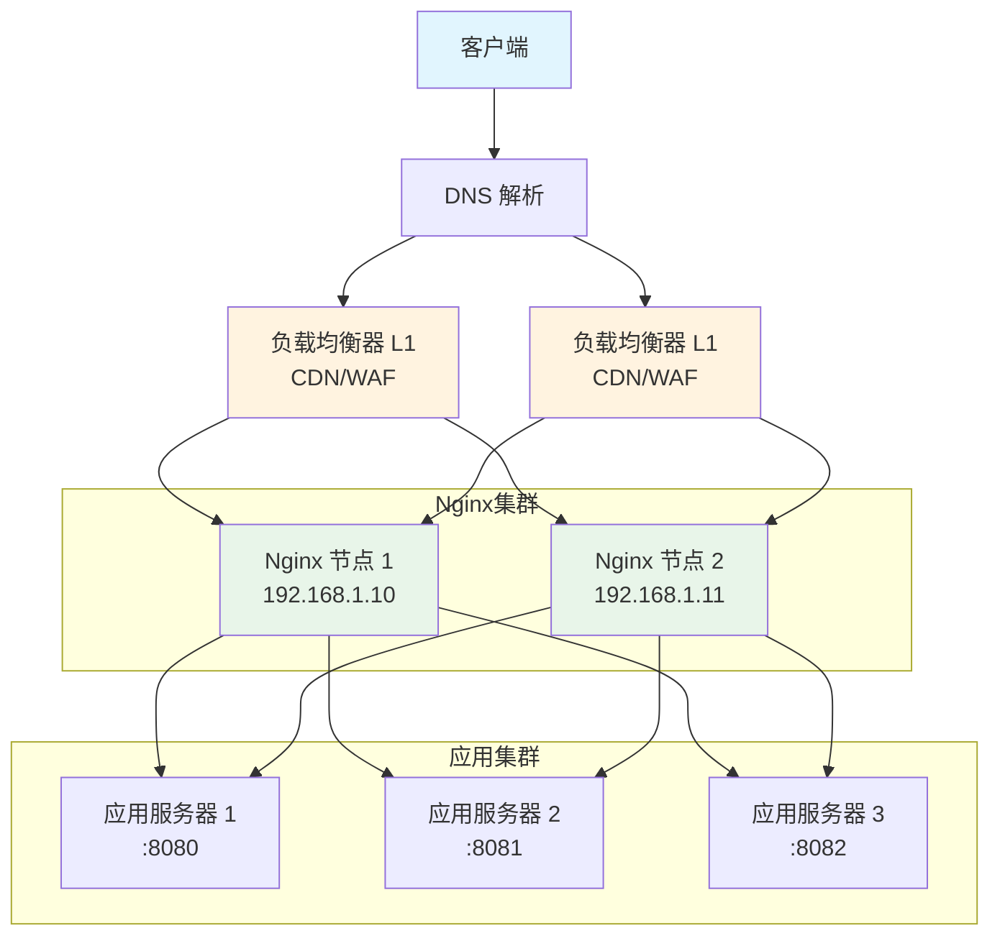
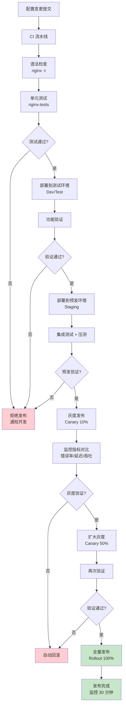
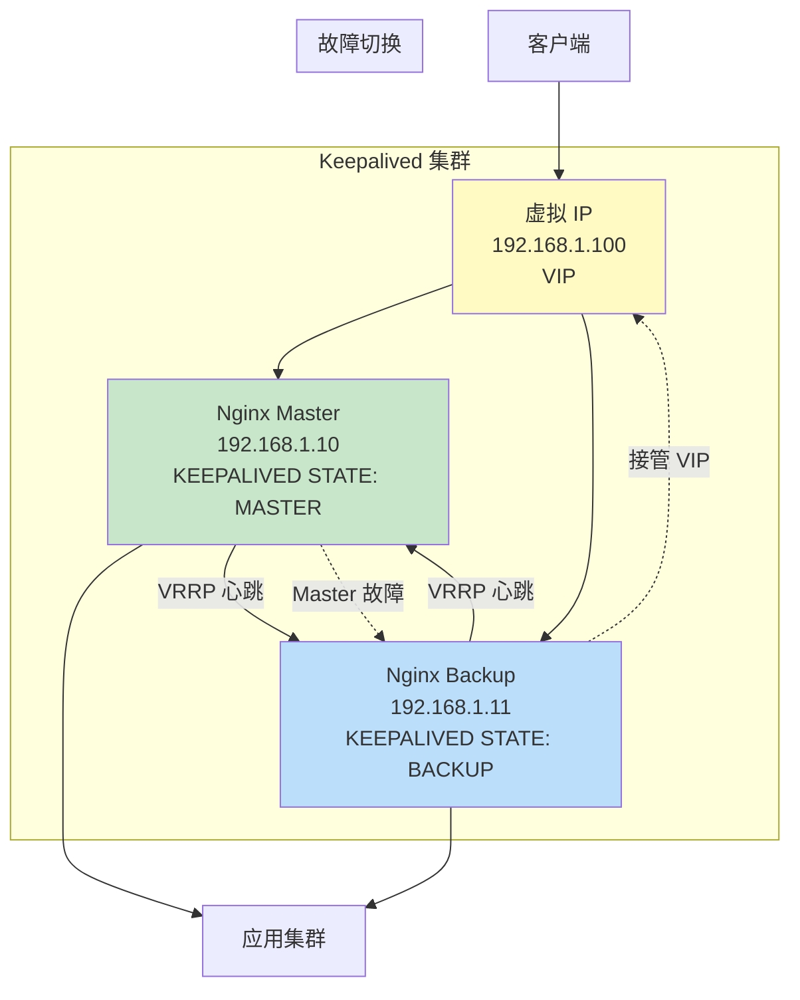

# 生产环境部署方案

::: important 生产部署的核心原则
生产环境部署不仅仅是"把配置文件放到服务器上"，而是一套涵盖架构设计、自动化管理、滚动升级、高可用保障和应急预案的完整体系。本文将从零到一构建一套生产级 Nginx 部署方案。
:::

## 1 生产环境架构设计

### 1.1 架构设计原则

生产环境 Nginx 架构设计应遵循以下核心原则：

- **高可用性**：消除单点故障，确保服务持续可用
- **可扩展性**：支持水平扩展，应对流量增长
- **可观测性**：完善的监控与告警体系
- **可维护性**：自动化部署与配置管理
- **安全性**：纵深防御，最小权限

### 1.2 整体部署架构



### 1.3 多层架构详解

典型的生产环境采用多层架构：

| 层级 | 组件 | 职责 |
|------|------|------|
| L1 | CDN / 云负载均衡 | DDoS 防护、SSL 卸载、全局负载均衡 |
| L2 | Nginx 集群 | 反向代理、负载均衡、缓存、限流 |
| L3 | 应用集群 | 业务逻辑处理 |
| L4 | 数据层 | 数据库、缓存、消息队列 |

::: tip 架构选择建议
- 小型项目（日 PV < 100 万）：单 Nginx + Keepalived 即可
- 中型项目（日 PV 100 万-1000 万）：Nginx 集群 + 云 LB
- 大型项目（日 PV > 1000 万）：CDN + 云 LB + Nginx 集群 + 多机房
:::

### 1.4 网络拓扑规划

```nginx
# /etc/nginx/nginx.conf - 生产环境主配置骨架

# 全局配置
user nginx;
worker_processes auto;
worker_cpu_affinity auto;
worker_rlimit_nofile 100000;
error_log /var/log/nginx/error.log warn;
pid /var/run/nginx.pid;

# 加载模块
load_module modules/ngx_http_geoip2_module.so;

events {
    worker_connections 65535;
    use epoll;
    multi_accept on;
    accept_mutex off;
}

http {
    include /etc/nginx/mime.types;
    default_type application/octet-stream;

    # 日志格式
    log_format main '$remote_addr - $remote_user [$time_local] "$request" '
                    '$status $body_bytes_sent "$http_referer" '
                    '"$http_user_agent" "$http_x_forwarded_for" '
                    'rt=$request_time uct=$upstream_connect_time '
                    'uht=$upstream_header_time urt=$upstream_response_time';

    access_log /var/log/nginx/access.log main buffer=32k flush=5s;

    # 性能优化
    sendfile on;
    tcp_nopush on;
    tcp_nodelay on;
    keepalive_timeout 65;
    keepalive_requests 1000;

    # 包含站点配置
    include /etc/nginx/conf.d/*.conf;
    include /etc/nginx/sites-enabled/*;
}
```

## 2 多实例部署

### 2.1 systemd 服务管理

生产环境推荐使用 systemd 管理 Nginx 服务：

```ini
# /etc/systemd/system/nginx.service

[Unit]
Description=The NGINX HTTP and reverse proxy server
After=network-online.target remote-fs.target nss-lookup.target
Wants=network-online.target

[Service]
Type=forking
PIDFile=/var/run/nginx.pid
ExecStartPre=/usr/sbin/nginx -t -c /etc/nginx/nginx.conf
ExecStart=/usr/sbin/nginx -c /etc/nginx/nginx.conf
ExecReload=/bin/kill -s HUP $MAINPID
ExecStop=/bin/kill -s QUIT $MAINPID
Restart=on-failure
RestartSec=5s
LimitNOFILE=100000
LimitNPROC=65535

# 安全加固
PrivateTmp=true
ProtectSystem=full
NoNewPrivileges=true
ReadWritePaths=/var/log/nginx /var/cache/nginx

[Install]
WantedBy=multi-user.target
```

::: warning systemd 安全选项说明
- `PrivateTmp=true`：Nginx 使用独立的 /tmp 目录
- `ProtectSystem=full`：防止 Nginx 写入系统目录
- `ReadWritePaths`：显式声明可写路径
- 这些选项可能在某些第三方模块场景下需要调整
:::

### 2.2 多端口监听部署

在资源有限的情况下，可以通过多端口方式部署多个 Nginx 实例：

```bash
#!/bin/bash
# /usr/local/bin/nginx-multi.sh
# 多端口 Nginx 实例管理脚本

NGINX_BASE="/etc/nginx"
INSTANCES=("8080" "8081" "8082")

case "$1" in
    start)
        for port in "${INSTANCES[@]}"; do
            echo "Starting Nginx instance on port $port..."
            nginx -c "${NGINX_BASE}/nginx-${port}.conf"
        done
        ;;
    stop)
        for port in "${INSTANCES[@]}"; do
            echo "Stopping Nginx instance on port $port..."
            nginx -c "${NGINX_BASE}/nginx-${port}.conf" -s stop
        done
        ;;
    reload)
        for port in "${INSTANCES[@]}"; do
            echo "Reloading Nginx instance on port $port..."
            nginx -c "${NGINX_BASE}/nginx-${port}.conf" -s reload
        done
        ;;
    status)
        for port in "${INSTANCES[@]}"; do
            pid=$(pgrep -f "nginx-${port}.conf" | head -1)
            if [ -n "$pid" ]; then
                echo "Nginx on port $port: RUNNING (PID: $pid)"
            else
                echo "Nginx on port $port: STOPPED"
            fi
        done
        ;;
    *)
        echo "Usage: $0 {start|stop|reload|status}"
        exit 1
        ;;
esac
```

### 2.3 多实例 systemd 服务

```ini
# /etc/systemd/system/nginx@.service
# 模板化服务文件，通过 nginx@8080.service 启动

[Unit]
Description=Nginx Instance on Port %i
After=network-online.target
Wants=network-online.target

[Service]
Type=forking
PIDFile=/var/run/nginx-%i.pid
ExecStartPre=/usr/sbin/nginx -t -c /etc/nginx/nginx-%i.conf
ExecStart=/usr/sbin/nginx -c /etc/nginx/nginx-%i.conf
ExecReload=/bin/kill -s HUP $MAINPID
ExecStop=/bin/kill -s QUIT $MAINPID
Restart=on-failure
RestartSec=5s
LimitNOFILE=100000

[Install]
WantedBy=multi-user.target
```

```bash
# 启动多实例
systemctl start nginx@8080
systemctl start nginx@8081
systemctl start nginx@8082

# 查看状态
systemctl status nginx@8080

# 设置开机自启
systemctl enable nginx@8080 nginx@8081 nginx@8082
```

## 3 配置管理：Ansible 自动化部署

### 3.1 自动化部署流程


### 3.2 Ansible 项目结构

```
ansible-nginx/
├── inventory/
│   ├── dev.yml
│   ├── staging.yml
│   └── prod.yml
├── group_vars/
│   ├── dev.yml
│   ├── staging.yml
│   └── prod.yml
├── host_vars/
│   ├── nginx-prod-01.yml
│   └── nginx-prod-02.yml
├── roles/
│   └── nginx/
│       ├── defaults/
│       │   └── main.yml
│       ├── vars/
│       │   └── main.yml
│       ├── tasks/
│       │   ├── main.yml
│       │   ├── install.yml
│       │   ├── configure.yml
│       │   ├── ssl.yml
│       │   └── validate.yml
│       ├── templates/
│       │   ├── nginx.conf.j2
│       │   ├── default.conf.j2
│       │   └── upstream.conf.j2
│       ├── handlers/
│       │   └── main.yml
│       ├── files/
│       │   └── nginx.service
│       └── meta/
│           └── main.yml
├── playbooks/
│   ├── deploy.yml
│   ├── rollback.yml
│   └── upgrade.yml
└── ansible.cfg
```

### 3.3 完整 Ansible Playbook

```yaml
# ansible-nginx/roles/nginx/defaults/main.yml
# 默认变量（可被 group_vars/host_vars 覆盖）

nginx_version: "1.25.4"
nginx_worker_processes: auto
nginx_worker_connections: 65535
nginx_worker_rlimit_nofile: 100000

# 日志配置
nginx_error_log_level: "warn"
nginx_access_log_format: >-
  '$remote_addr - $remote_user [$time_local] "$request" '
  '$status $body_bytes_sent "$http_referer" '
  '"$http_user_agent" "$http_x_forwarded_for" '
  'rt=$request_time uct=$upstream_connect_time '
  'uht=$upstream_header_time urt=$upstream_response_time'

# 超时配置
nginx_keepalive_timeout: 65
nginx_client_body_timeout: 60
nginx_client_header_timeout: 60
nginx_send_timeout: 60
nginx_proxy_connect_timeout: 5
nginx_proxy_read_timeout: 60
nginx_proxy_send_timeout: 60

# 缓冲配置
nginx_proxy_buffer_size: "8k"
nginx_proxy_buffers: "8 8k"
nginx_proxy_busy_buffers_size: "16k"

# Gzip 配置
nginx_gzip: true
nginx_gzip_types:
  - text/plain
  - text/css
  - application/json
  - application/javascript
  - text/xml
  - application/xml
  - application/xml+rss
  - text/javascript

# 上游服务器
nginx_upstreams: []

# 虚拟主机
nginx_vhosts: []

# SSL 配置
nginx_ssl_enable: false
nginx_ssl_cert_path: "/etc/nginx/ssl"
nginx_ssl_protocols: "TLSv1.2 TLSv1.3"
nginx_ssl_ciphers: >-
  ECDHE-ECDSA-AES128-GCM-SHA256:ECDHE-RSA-AES128-GCM-SHA256:
  ECDHE-ECDSA-AES256-GCM-SHA384:ECDHE-RSA-AES256-GCM-SHA384
nginx_ssl_prefer_server_ciphers: true
nginx_ssl_session_cache: "shared:SSL:10m"
nginx_ssl_session_timeout: "1d"
nginx_ssl_session_tickets: false

# 安全头
nginx_security_headers: true
```

```yaml
# ansible-nginx/roles/nginx/tasks/main.yml
---
- name: 检查操作系统版本
  assert:
    that:
      - ansible_os_family == "RedHat" or ansible_os_family == "Debian"
    fail_msg: "此 Playbook 仅支持 RedHat/Debian 系操作系统"

- name: 安装 Nginx 依赖
  package:
    name: "{{ nginx_dependencies }}"
    state: present
  vars:
    nginx_dependencies:
      - openssl
      - pcre
      - zlib
      - geoip

- name: 创建 Nginx 用户
  user:
    name: nginx
    system: true
    shell: /sbin/nologin
    create_home: false

- name: 创建必要目录
  file:
    path: "{{ item }}"
    state: directory
    owner: nginx
    group: nginx
    mode: "0755"
  loop:
    - /etc/nginx/conf.d
    - /etc/nginx/sites-available
    - /etc/nginx/sites-enabled
    - /etc/nginx/ssl
    - /var/log/nginx
    - /var/cache/nginx

- name: 配置 Nginx 主配置文件
  template:
    src: nginx.conf.j2
    dest: /etc/nginx/nginx.conf
    owner: root
    group: root
    mode: "0644"
  notify: validate and reload nginx

- name: 配置上游服务器
  template:
    src: upstream.conf.j2
    dest: "/etc/nginx/conf.d/upstream-{{ item.name }}.conf"
    owner: root
    group: root
    mode: "0644"
  loop: "{{ nginx_upstreams }}"
  notify: validate and reload nginx

- name: 配置虚拟主机
  template:
    src: default.conf.j2
    dest: "/etc/nginx/sites-available/{{ item.server_name | default('default') }}.conf"
    owner: root
    group: root
    mode: "0644"
  loop: "{{ nginx_vhosts }}"
  notify: validate and reload nginx

- name: 启用虚拟主机
  file:
    src: "/etc/nginx/sites-available/{{ item.server_name | default('default') }}.conf"
    dest: "/etc/nginx/sites-enabled/{{ item.server_name | default('default') }}.conf"
    state: link
  loop: "{{ nginx_vhosts }}"
  notify: validate and reload nginx

- name: 配置 SSL 证书
  copy:
    src: "{{ item.cert_src }}"
    dest: "{{ nginx_ssl_cert_path }}/{{ item.cert_dest }}"
    owner: root
    group: root
    mode: "0600"
  loop: "{{ nginx_ssl_certs | default([]) }}"
  notify: validate and reload nginx

- name: 安装 systemd 服务文件
  copy:
    src: nginx.service
    dest: /etc/systemd/system/nginx.service
    owner: root
    group: root
    mode: "0644"
  notify:
    - reload systemd
    - restart nginx

- name: 启动并启用 Nginx
  systemd:
    name: nginx
    state: started
    enabled: true
```

```yaml
# ansible-nginx/roles/nginx/handlers/main.yml
---
- name: validate and reload nginx
  block:
    - name: 验证 Nginx 配置
      command: nginx -t
      changed_when: false

    - name: 重载 Nginx
      systemd:
        name: nginx
        state: reloaded
  rescue:
    - name: 配置验证失败，回滚
      debug:
        msg: "配置验证失败！请检查配置文件。Nginx 继续使用旧配置运行。"

- name: reload systemd
  systemd:
    daemon_reload: true

- name: restart nginx
  systemd:
    name: nginx
    state: restarted
```

### 3.4 Nginx 主配置模板

```jinja2
{# ansible-nginx/roles/nginx/templates/nginx.conf.j2 #}
# 由 Ansible 自动生成，请勿手动修改
# 生成时间: {{ ansible_date_time.iso8601 }}
# 目标主机: {{ inventory_hostname }}

user {{ nginx_user | default('nginx') }};
worker_processes {{ nginx_worker_processes }};

worker_cpu_affinity {{ nginx_worker_cpu_affinity }};

worker_rlimit_nofile {{ nginx_worker_rlimit_nofile }};

error_log /var/log/nginx/error.log {{ nginx_error_log_level }};
pid /var/run/nginx.pid;

events {
    worker_connections {{ nginx_worker_connections }};
    use epoll;
    multi_accept on;
    accept_mutex off;
}

http {
    include /etc/nginx/mime.types;
    default_type application/octet-stream;

    # 日志格式
    log_format main '{{ nginx_access_log_format }}';
    access_log /var/log/nginx/access.log main buffer=32k flush=5s;

    # 性能优化
    sendfile on;
    tcp_nopush on;
    tcp_nodelay on;
    keepalive_timeout {{ nginx_keepalive_timeout }};
    keepalive_requests 1000;
    reset_timedout_connection on;

    # 客户端超时
    client_body_timeout {{ nginx_client_body_timeout }};
    client_header_timeout {{ nginx_client_header_timeout }};
    send_timeout {{ nginx_send_timeout }};
    client_max_body_size {{ nginx_client_max_body_size | default('50m') }};

    # 代理超时
    proxy_connect_timeout {{ nginx_proxy_connect_timeout }};
    proxy_read_timeout {{ nginx_proxy_read_timeout }};
    proxy_send_timeout {{ nginx_proxy_send_timeout }};

    # 代理缓冲
    proxy_buffer_size {{ nginx_proxy_buffer_size }};
    proxy_buffers {{ nginx_proxy_buffers }};
    proxy_busy_buffers_size {{ nginx_proxy_busy_buffers_size }};


    # Gzip 压缩
    gzip on;
    gzip_vary on;
    gzip_proxied any;
    gzip_comp_level 4;
    gzip_min_length 256;
    gzip_types {{ nginx_gzip_types | join(' ') }};



    # 安全头
    add_header X-Frame-Options "SAMEORIGIN" always;
    add_header X-Content-Type-Options "nosniff" always;
    add_header X-XSS-Protection "1; mode=block" always;
    add_header Referrer-Policy "strict-origin-when-cross-origin" always;


    # 包含配置
    include /etc/nginx/conf.d/*.conf;
    include /etc/nginx/sites-enabled/*;
}
```

### 3.5 执行部署

```bash
# 部署到开发环境
ansible-playbook -i inventory/dev.yml playbooks/deploy.yml

# 部署到预发环境（带确认）
ansible-playbook -i inventory/staging.yml playbooks/deploy.yml --check
ansible-playbook -i inventory/staging.yml playbooks/deploy.yml

# 部署到生产环境（限制并发，逐台发布）
ansible-playbook -i inventory/prod.yml playbooks/deploy.yml \
    --serial 1 \
    --limit "nginx-prod-01"

# 灰度验证后全量发布
ansible-playbook -i inventory/prod.yml playbooks/deploy.yml \
    --serial "25%"
```

::: tip Ansible 部署最佳实践
1. 始终先执行 `--check` 模拟运行
2. 生产环境使用 `--serial` 逐台或分批发布
3. Handler 中先验证再重载，避免配置错误导致服务中断
4. 使用 Git 管理所有 Playbook 和模板
5. 部署前备份当前配置
:::

## 4 滚动升级：零停机升级 Nginx 版本

### 4.1 升级时序图


### 4.2 滚动升级脚本

```bash
#!/bin/bash
# /usr/local/bin/nginx-upgrade.sh
# Nginx 零停机升级脚本

set -euo pipefail

# 配置
NEW_VERSION="${1:?请指定新版本号，如: 1.25.4}"
NGINX_PREFIX="/usr/local/nginx"
NGINX_SBIN="/usr/sbin/nginx"
CURRENT_VERSION=$(${NGINX_SBIN} -v 2>&1 | awk -F'/' '{print $2}')
BACKUP_DIR="/opt/nginx-backup"
LOG_FILE="/var/log/nginx-upgrade-$(date +%Y%m%d_%H%M%S).log"

# 日志函数
log() {
    echo "[$(date '+%Y-%m-%d %H:%M:%S')] $*" | tee -a "${LOG_FILE}"
}

# 检查函数
check() {
    if ! $@; then
        log "检查失败: $*"
        exit 1
    fi
}

# 主流程
main() {
    log "========================================="
    log "开始 Nginx 升级: ${CURRENT_VERSION} -> ${NEW_VERSION}"
    log "========================================="

    # 1. 健康检查
    log "步骤 1: 升级前健康检查"
    check "${NGINX_SBIN} -t"
    log "当前配置验证通过"

    # 2. 备份
    log "步骤 2: 备份当前版本"
    mkdir -p "${BACKUP_DIR}/${CURRENT_VERSION}"
    cp "${NGINX_SBIN}" "${BACKUP_DIR}/${CURRENT_VERSION}/nginx"
    cp -r /etc/nginx "${BACKUP_DIR}/${CURRENT_VERSION}/conf"
    log "备份完成: ${BACKUP_DIR}/${CURRENT_VERSION}"

    # 3. 编译新版本
    log "步骤 3: 编译 Nginx ${NEW_VERSION}"
    cd /usr/local/src
    if [ ! -d "nginx-${NEW_VERSION}" ]; then
        curl -fSL "https://nginx.org/download/nginx-${NEW_VERSION}.tar.gz" -o "nginx-${NEW_VERSION}.tar.gz"
        tar xzf "nginx-${NEW_VERSION}.tar.gz"
    fi
    cd "nginx-${NEW_VERSION}"

    # 获取当前编译参数
    OLD_CONFIGURE=$(${NGINX_SBIN} -V 2>&1 | grep 'configure arguments' | sed 's/configure arguments: //')
    log "旧编译参数: ${OLD_CONFIGURE}"

    eval ./configure ${OLD_CONFIGURE}
    make -j$(nproc)
    log "编译完成"

    # 4. 执行热升级
    log "步骤 4: 执行热升级"
    OLD_PID=$(cat /var/run/nginx.pid)
    log "旧 Master PID: ${OLD_PID}"

    # 替换二进制文件
    cp "${NGINX_SBIN}" "${NGINX_SBIN}.old"
    cp objs/nginx "${NGINX_SBIN}"

    # 发送 USR2 信号：启动新 Master
    kill -USR2 "${OLD_PID}"
    sleep 2

    # 检查新 Master 是否启动
    if [ -f /var/run/nginx.pid.newbin ]; then
        NEW_PID=$(cat /var/run/nginx.pid.newbin)
        log "新 Master PID: ${NEW_PID}"
    else
        log "错误: 新 Master 未启动"
        # 回滚
        cp "${NGINX_SBIN}.old" "${NGINX_SBIN}"
        kill -HUP "${OLD_PID}"
        exit 1
    fi

    # 发送 WINCH 信号：优雅关闭旧 Worker
    kill -WINCH "${OLD_PID}"
    sleep 3

    # 验证新 Worker 是否正常
    NEW_WORKERS=$(pgrep -P "${NEW_PID}" | wc -l)
    if [ "${NEW_WORKERS}" -gt 0 ]; then
        log "新 Worker 正常运行，数量: ${NEW_WORKERS}"
    else
        log "错误: 新 Worker 未启动，回滚"
        kill -QUIT "${NEW_PID}"
        kill -HUP "${OLD_PID}"
        cp "${NGINX_SBIN}.old" "${NGINX_SBIN}"
        exit 1
    fi

    # 5. 验证
    log "步骤 5: 验证新版本"
    NEW_RUNNING_VERSION=$(${NGINX_SBIN} -v 2>&1 | awk -F'/' '{print $2}')
    if [ "${NEW_RUNNING_VERSION}" == "${NEW_VERSION}" ]; then
        log "版本验证通过: ${NEW_RUNNING_VERSION}"
    else
        log "版本不匹配，回滚"
        kill -QUIT "${NEW_PID}"
        kill -HUP "${OLD_PID}"
        cp "${NGINX_SBIN}.old" "${NGINX_SBIN}"
        exit 1
    fi

    # 6. 健康检查
    log "步骤 6: 运行健康检查"
    sleep 5
    HTTP_CODE=$(curl -s -o /dev/null -w '%{http_code}' http://localhost/healthz || echo "000")
    if [ "${HTTP_CODE}" == "200" ]; then
        log "健康检查通过"
    else
        log "健康检查失败 (HTTP ${HTTP_CODE})，回滚"
        kill -QUIT "${NEW_PID}"
        kill -HUP "${OLD_PID}"
        cp "${NGINX_SBIN}.old" "${NGINX_SBIN}"
        exit 1
    fi

    # 7. 关闭旧 Master
    log "步骤 7: 关闭旧 Master"
    kill -QUIT "${OLD_PID}"
    log "旧 Master 已退出"

    # 8. 清理
    rm -f "${NGINX_SBIN}.old"
    log "升级完成: ${CURRENT_VERSION} -> ${NEW_VERSION}"
}

main "$@"
```

::: warning 升级注意事项
1. **必须保留旧编译参数**：使用 `nginx -V` 获取当前编译参数，确保新版本使用相同参数
2. **信号顺序严格**：USR2 → WINCH → (验证) → QUIT，顺序不可颠倒
3. **回滚时机**：在发送 QUIT 关闭旧 Master 之前，随时可以回滚
4. **窗口期监控**：升级期间密切监控错误日志和指标
5. **避免配置变更**：升级期间不要同时修改配置文件
:::

## 5 配置变更发布流程

### 5.1 test → canary → rollout 三阶段发布



### 5.2 配置变更发布脚本

```bash
#!/bin/bash
# /usr/local/bin/nginx-deploy.sh
# 配置变更三阶段发布脚本

set -euo pipefail

ENV="${1:?用法: nginx-deploy.sh <env> <config_dir>"
CONFIG_DIR="${2:?请指定配置目录}"
DEPLOY_DIR="/etc/nginx"
BACKUP_DIR="/opt/nginx-config-backup"
TIMESTAMP=$(date +%Y%m%d_%H%M%S)

# 通知函数
notify() {
    local level="$1"
    local message="$2"
    echo "[${level}] [$(date '+%H:%M:%S')] ${message}"
    # 可集成钉钉/飞书/Slack 通知
    # curl -X POST "$WEBHOOK_URL" -d "{\"text\": \"[${level}] ${message}\"}"
}

# 语法检查
validate_config() {
    notify "INFO" "开始语法检查..."
    if nginx -t -c "${DEPLOY_DIR}/nginx.conf" 2>&1; then
        notify "INFO" "语法检查通过"
        return 0
    else
        notify "ERROR" "语法检查失败"
        return 1
    fi
}

# 备份当前配置
backup_config() {
    local backup_path="${BACKUP_DIR}/${TIMESTAMP}"
    mkdir -p "${backup_path}"
    cp -r "${DEPLOY_DIR}"/* "${backup_path}/"
    notify "INFO" "配置已备份到 ${backup_path}"
    echo "${backup_path}"
}

# 回滚配置
rollback_config() {
    local backup_path="$1"
    notify "WARNING" "开始回滚配置..."
    rm -rf "${DEPLOY_DIR:?}"/*
    cp -r "${backup_path}"/* "${DEPLOY_DIR}/"
    nginx -t && nginx -s reload
    notify "INFO" "回滚完成"
}

# 健康检查
health_check() {
    local url="${1:-http://localhost/healthz}"
    local max_retries=10
    local retry=0

    while [ $retry -lt $max_retries ]; do
        local code=$(curl -s -o /dev/null -w '%{http_code}' "${url}" || echo "000")
        if [ "${code}" == "200" ]; then
            notify "INFO" "健康检查通过 (HTTP ${code})"
            return 0
        fi
        retry=$((retry + 1))
        sleep 2
    done

    notify "ERROR" "健康检查失败 (HTTP ${code})"
    return 1
}

# 主发布流程
case "${ENV}" in
    test)
        notify "INFO" "====== 开始 TEST 阶段发布 ======"
        backup_path=$(backup_config)
        rsync -av --delete "${CONFIG_DIR}/" "${DEPLOY_DIR}/"
        if validate_config; then
            nginx -s reload
            if health_check; then
                notify "INFO" "TEST 阶段发布成功"
            else
                rollback_config "${backup_path}"
                notify "ERROR" "TEST 阶段健康检查失败，已回滚"
                exit 1
            fi
        else
            rollback_config "${backup_path}"
            notify "ERROR" "TEST 阶段语法检查失败，已回滚"
            exit 1
        fi
        ;;

    canary)
        notify "INFO" "====== 开始 CANARY 阶段发布 ======"
        # 灰度发布：先在部分节点部署
        backup_path=$(backup_config)
        rsync -av --delete "${CONFIG_DIR}/" "${DEPLOY_DIR}/"
        if validate_config; then
            nginx -s reload
            notify "INFO" "灰度节点已部署，等待 5 分钟观察..."
            sleep 300
            if health_check; then
                # 检查错误率是否上升
                error_rate=$(tail -1000 /var/log/nginx/access.log | \
                    awk '{print $9}' | grep -c '^5[0-9][0-9]' || echo 0)
                total=$(tail -1000 /var/log/nginx/access.log | wc -l)
                rate=$((error_rate * 100 / total))
                if [ $rate -lt 5 ]; then
                    notify "INFO" "灰度验证通过，错误率 ${rate}%"
                else
                    rollback_config "${backup_path}"
                    notify "ERROR" "灰度验证失败，错误率 ${rate}% 过高，已回滚"
                    exit 1
                fi
            else
                rollback_config "${backup_path}"
                notify "ERROR" "灰度健康检查失败，已回滚"
                exit 1
            fi
        else
            rollback_config "${backup_path}"
            exit 1
        fi
        ;;

    rollout)
        notify "INFO" "====== 开始 ROLLOUT 全量发布 ======"
        backup_path=$(backup_config)
        rsync -av --delete "${CONFIG_DIR}/" "${DEPLOY_DIR}/"
        if validate_config; then
            nginx -s reload
            if health_check; then
                notify "INFO" "全量发布成功"
            else
                rollback_config "${backup_path}"
                notify "ERROR" "全量发布健康检查失败，已回滚"
                exit 1
            fi
        else
            rollback_config "${backup_path}"
            exit 1
        fi
        ;;

    *)
        echo "用法: $0 {test|canary|rollout} <config_dir>"
        exit 1
        ;;
esac
```

## 6 高可用方案：Keepalived VIP

### 6.1 HA 架构图



### 6.2 Keepalived 安装与配置

```bash
# 安装 Keepalived
yum install -y keepalived        # CentOS/RHEL
apt-get install -y keepalived     # Ubuntu/Debian
```

```bash
# /etc/keepalived/keepalived.conf - Master 节点配置

global_defs {
    router_id NGINX_MASTER
    script_user root
    enable_script_security
}

# Nginx 健康检查脚本
vrrp_script check_nginx {
    script "/etc/keepalived/scripts/check_nginx.sh"
    interval 2
    weight -20
    fall 3
    rise 2
}

# VRRP 实例
vrrp_instance VI_1 {
    state MASTER
    interface eth0
    virtual_router_id 51
    priority 100
    advert_int 1

    # 认证
    authentication {
        auth_type PASS
        auth_pass NginxHA@2024
    }

    # 虚拟 IP
    virtual_ipaddress {
        192.168.1.100/24 dev eth0 label eth0:vip
    }

    # 关联健康检查
    track_script {
        check_nginx
    }

    # 状态变更通知
    notify_master "/etc/keepalived/scripts/notify.sh MASTER"
    notify_backup "/etc/keepalived/scripts/notify.sh BACKUP"
    notify_fault  "/etc/keepalived/scripts/notify.sh FAULT"
}
```

```bash
# /etc/keepalived/keepalived.conf - Backup 节点配置

global_defs {
    router_id NGINX_BACKUP
    script_user root
    enable_script_security
}

vrrp_script check_nginx {
    script "/etc/keepalived/scripts/check_nginx.sh"
    interval 2
    weight -20
    fall 3
    rise 2
}

vrrp_instance VI_1 {
    state BACKUP
    interface eth0
    virtual_router_id 51
    priority 90
    advert_int 1

    authentication {
        auth_type PASS
        auth_pass NginxHA@2024
    }

    virtual_ipaddress {
        192.168.1.100/24 dev eth0 label eth0:vip
    }

    track_script {
        check_nginx
    }

    notify_master "/etc/keepalived/scripts/notify.sh MASTER"
    notify_backup "/etc/keepalived/scripts/notify.sh BACKUP"
    notify_fault  "/etc/keepalived/scripts/notify.sh FAULT"
}
```

### 6.3 健康检查脚本

```bash
#!/bin/bash
# /etc/keepalived/scripts/check_nginx.sh
# Nginx 健康检查脚本

NGINX_PID="/var/run/nginx.pid"
HEALTH_URL="http://127.0.0.1:80/healthz"

# 检查 PID 文件
if [ ! -f "${NGINX_PID}" ]; then
    logger "Keepalived: Nginx PID 文件不存在"
    exit 1
fi

# 检查进程是否存活
PID=$(cat "${NGINX_PID}")
if ! kill -0 "${PID}" 2>/dev/null; then
    logger "Keepalived: Nginx 进程 (PID: ${PID}) 不存在"
    # 尝试自动重启
    systemctl restart nginx
    sleep 3
    if ! kill -0 "$(cat ${NGINX_PID} 2>/dev/null)" 2>/dev/null; then
        logger "Keepalived: Nginx 自动重启失败"
        exit 1
    fi
fi

# 检查 HTTP 健康端点
HTTP_CODE=$(curl -s -o /dev/null -w '%{http_code}' --max-time 3 "${HEALTH_URL}" || echo "000")
if [ "${HTTP_CODE}" != "200" ]; then
    logger "Keepalived: Nginx 健康检查失败 (HTTP ${HTTP_CODE})"
    exit 1
fi

exit 0
```

### 6.4 状态变更通知脚本

```bash
#!/bin/bash
# /etc/keepalived/scripts/notify.sh
# Keepalived 状态变更通知

STATE="$1"
HOSTNAME=$(hostname)
VIP="192.168.1.100"

logger "Keepalived: 状态变更为 ${STATE} (主机: ${HOSTNAME})"

case "${STATE}" in
    MASTER)
        # 绑定 VIP
        logger "Keepalived: 当前节点成为 MASTER，绑定 VIP ${VIP}"
        # 可选：发送通知
        # curl -X POST "$WEBHOOK_URL" -d "{\"text\": \"[ALERT] ${HOSTNAME} 成为 MASTER\"}"
        ;;
    BACKUP)
        # 解绑 VIP
        logger "Keepalived: 当前节点成为 BACKUP，释放 VIP"
        ;;
    FAULT)
        # 故障状态
        logger "Keepalived: 当前节点进入 FAULT 状态"
        # curl -X POST "$WEBHOOK_URL" -d "{\"text\": \"[CRITICAL] ${HOSTNAME} 进入 FAULT 状态\"}"
        ;;
esac
```

### 6.5 双主模式配置

::: tip 双主模式
默认主备模式中，Backup 节点处于闲置状态。双主模式下两个节点分别承载不同的 VIP，互为主备，充分利用资源。
:::

```bash
# Master1 节点配置（同时是 VIP2 的 Backup）
vrrp_instance VI_1 {
    state MASTER
    interface eth0
    virtual_router_id 51
    priority 100
    virtual_ipaddress {
        192.168.1.100/24 dev eth0
    }
}

vrrp_instance VI_2 {
    state BACKUP
    interface eth0
    virtual_router_id 52
    priority 90
    virtual_ipaddress {
        192.168.1.101/24 dev eth0
    }
}

# Master2 节点配置（同时是 VIP1 的 Backup）
vrrp_instance VI_1 {
    state BACKUP
    interface eth0
    virtual_router_id 51
    priority 90
    virtual_ipaddress {
        192.168.1.100/24 dev eth0
    }
}

vrrp_instance VI_2 {
    state MASTER
    interface eth0
    virtual_router_id 52
    priority 100
    virtual_ipaddress {
        192.168.1.101/24 dev eth0
    }
}
```

DNS 轮询配置两个 VIP：

```
www.example.com  A  192.168.1.100
www.example.com  A  192.168.1.101
```

## 7 Nginx 配置模板化与版本控制

### 7.1 配置目录结构

```
/etc/nginx/
├── nginx.conf                    # 主配置（由 Ansible 模板生成）
├── conf.d/
│   ├── upstream-app1.conf        # 上游配置
│   ├── upstream-app2.conf
│   ├── proxy-params.conf         # 代理参数片段
│   ├── ssl-params.conf           # SSL 参数片段
│   └── security-headers.conf     # 安全头片段
├── sites-available/
│   ├── app1.example.com.conf     # 站点配置
│   ├── app2.example.com.conf
│   └── default.conf
├── sites-enabled/                # 软链接到 sites-available
│   ├── app1.example.com.conf -> ../sites-available/app1.example.com.conf
│   └── default.conf -> ../sites-available/default.conf
├── snippets/                     # 可复用配置片段
│   ├── ssl-ciphers.conf
│   ├── proxy-headers.conf
│   ├── log-formats.conf
│   └── rate-limit.conf
└── ssl/
    ├── example.com.crt
    ├── example.com.key
    └── dhparam.pem
```

### 7.2 配置片段复用

```nginx
# /etc/nginx/snippets/proxy-headers.conf
# 代理头通用配置

proxy_set_header Host $host;
proxy_set_header X-Real-IP $remote_addr;
proxy_set_header X-Forwarded-For $proxy_add_x_forwarded_for;
proxy_set_header X-Forwarded-Proto $scheme;
proxy_set_header X-Forwarded-Host $host;
proxy_set_header X-Forwarded-Port $server_port;

# /etc/nginx/snippets/ssl-ciphers.conf
# SSL 密码套件配置

ssl_protocols TLSv1.2 TLSv1.3;
ssl_ciphers ECDHE-ECDSA-AES128-GCM-SHA256:ECDHE-RSA-AES128-GCM-SHA256:ECDHE-ECDSA-AES256-GCM-SHA384:ECDHE-RSA-AES256-GCM-SHA384:ECDHE-ECDSA-CHACHA20-POLY1305:ECDHE-RSA-CHACHA20-POLY1305;
ssl_prefer_server_ciphers off;
ssl_session_cache shared:SSL:10m;
ssl_session_timeout 1d;
ssl_session_tickets off;
ssl_stapling on;
ssl_stapling_verify on;

# /etc/nginx/snippets/security-headers.conf
# 安全响应头配置

add_header X-Frame-Options "SAMEORIGIN" always;
add_header X-Content-Type-Options "nosniff" always;
add_header X-XSS-Protection "1; mode=block" always;
add_header Referrer-Policy "strict-origin-when-cross-origin" always;
add_header Content-Security-Policy "default-src 'self'; script-src 'self' 'unsafe-inline'; style-src 'self' 'unsafe-inline';" always;
add_header Permissions-Policy "camera=(), microphone=(), geolocation=()" always;
```

### 7.3 Git 管理配置

```bash
# 初始化配置仓库
cd /etc/nginx
git init
git add -A
git commit -m "Initial commit: baseline configuration"

# .gitignore
cat > .gitignore << 'EOF'
*.key
*.pem
*.crt
ssl/
*.log
*.pid
*.old
EOF

# 配置变更后提交
git add -A
git commit -m "Update: 增加限流配置 for /api/"

# 查看变更历史
git log --oneline --all

# 回滚到上一版本
git diff HEAD~1 HEAD
git checkout HEAD~1 -- conf.d/upstream-app1.conf
nginx -t && nginx -s reload
```

### 7.4 Git Hook 自动校验

```bash
#!/bin/bash
# /etc/nginx/.git/hooks/pre-commit
# 提交前自动校验 Nginx 配置

echo "正在校验 Nginx 配置..."

# 临时目录测试
TEMP_DIR=$(mktemp -d)
cp -r /etc/nginx/* "${TEMP_DIR}/"

# 将暂存区的文件复制到临时目录
git diff --cached --name-only | while read file; do
    git show ":${file}" > "${TEMP_DIR}/${file}"
done

# 在临时目录中测试配置
if nginx -t -c "${TEMP_DIR}/nginx.conf" 2>&1; then
    echo "配置校验通过"
    rm -rf "${TEMP_DIR}"
    exit 0
else
    echo "配置校验失败！请修正后再提交。"
    rm -rf "${TEMP_DIR}"
    exit 1
fi
```

## 8 多环境管理

### 8.1 环境差异管理

```yaml
# group_vars/dev.yml
nginx_env: dev
nginx_error_log_level: info
nginx_worker_connections: 1024
nginx_proxy_read_timeout: 300
nginx_rate_limit_enable: false
nginx_debug_headers: true
nginx_ssl_enable: false

# upstream 配置
nginx_upstreams:
  - name: app1
    servers:
      - "127.0.0.1:8080 weight=1 max_fails=3 fail_timeout=30s"

# group_vars/staging.yml
nginx_env: staging
nginx_error_log_level: warn
nginx_worker_connections: 10240
nginx_proxy_read_timeout: 120
nginx_rate_limit_enable: true
nginx_rate_limit_req: "10r/s"
nginx_debug_headers: false
nginx_ssl_enable: true

nginx_upstreams:
  - name: app1
    servers:
      - "10.0.1.10:8080 weight=1 max_fails=3 fail_timeout=30s"
      - "10.0.1.11:8080 weight=1 max_fails=3 fail_timeout=30s"

# group_vars/prod.yml
nginx_env: prod
nginx_error_log_level: warn
nginx_worker_connections: 65535
nginx_proxy_read_timeout: 60
nginx_rate_limit_enable: true
nginx_rate_limit_req: "100r/s"
nginx_debug_headers: false
nginx_ssl_enable: true
nginx_security_headers: true

nginx_upstreams:
  - name: app1
    servers:
      - "10.0.2.10:8080 weight=1 max_fails=2 fail_timeout=10s"
      - "10.0.2.11:8080 weight=1 max_fails=2 fail_timeout=10s"
      - "10.0.2.12:8080 weight=1 max_fails=2 fail_timeout=10s"
    keepalive: 32
```

### 8.2 环境感知配置模板

```jinja2
{# 基于 Ansible 变量生成环境感知的配置 #}

# 环境: {{ nginx_env | upper }}
# 生成时间: {{ ansible_date_time.iso8601 }}


# ===== 开发环境特殊配置 =====
# 开启调试信息
add_header X-Debug-Env "{{ nginx_env }}" always;
add_header X-Debug-Server $hostname always;

# 宽松的超时设置
proxy_read_timeout 300s;
proxy_connect_timeout 30s;


# ===== 预发环境配置 =====
# 接近生产但保留调试能力
proxy_read_timeout 120s;
proxy_connect_timeout 10s;


# ===== 生产环境配置 =====
# 严格超时
proxy_read_timeout 60s;
proxy_connect_timeout 5s;

# 限流保护

limit_req_zone $binary_remote_addr zone=api:10m rate={{ nginx_rate_limit_req }};
limit_req zone=api burst=20 nodelay;



```

### 8.3 环境切换脚本

```bash
#!/bin/bash
# /usr/local/bin/nginx-switch-env.sh
# 快速切换 Nginx 环境

set -euo pipefail

TARGET_ENV="${1:?用法: nginx-switch-env.sh <dev|staging|prod>}"
ANSIBLE_DIR="/opt/ansible-nginx"

case "${TARGET_ENV}" in
    dev|staging|prod)
        echo "切换到 ${TARGET_ENV} 环境..."
        cd "${ANSIBLE_DIR}"
        ansible-playbook -i "inventory/${TARGET_ENV}.yml" playbooks/deploy.yml \
            --tags "configure" \
            --diff
        echo "切换完成"
        ;;
    *)
        echo "不支持的环境: ${TARGET_ENV}"
        echo "支持: dev, staging, prod"
        exit 1
        ;;
esac
```

## 9 回滚策略与应急预案

### 9.1 回滚策略

| 回滚级别 | 触发条件 | 回滚方式 | 恢复时间 |
|---------|---------|---------|---------|
| L1 配置回滚 | nginx -t 失败 | 自动：不执行 reload | < 1 秒 |
| L2 快速回滚 | 健康检查失败 | 备份目录覆盖 | < 30 秒 |
| L3 Git 回滚 | 功能异常发现 | git checkout | < 2 分钟 |
| L4 版本回滚 | Nginx 版本问题 | 发送信号切换旧 Master | < 5 分钟 |
| L5 Ansible 回滚 | 全量回滚 | 执行 rollback Playbook | < 10 分钟 |

### 9.2 自动回滚脚本

```bash
#!/bin/bash
# /usr/local/bin/nginx-rollback.sh
# Nginx 配置自动回滚

set -euo pipefail

BACKUP_DIR="/opt/nginx-config-backup"
DEPLOY_DIR="/etc/nginx"

# 列出可用备份
list_backups() {
    echo "可用的备份版本："
    echo "----------------------------------------------------"
    ls -lt "${BACKUP_DIR}" | head -20
    echo "----------------------------------------------------"
}

# 回滚到指定版本
rollback_to() {
    local target="$1"
    local backup_path="${BACKUP_DIR}/${target}"

    if [ ! -d "${backup_path}" ]; then
        echo "错误: 备份 ${target} 不存在"
        list_backups
        exit 1
    fi

    echo "回滚到版本: ${target}"

    # 备份当前（失败）配置
    local current_backup="${BACKUP_DIR}/failed-$(date +%Y%m%d_%H%M%S)"
    mkdir -p "${current_backup}"
    cp -r "${DEPLOY_DIR}"/* "${current_backup}/"
    echo "当前配置已保存到 ${current_backup}"

    # 恢复目标版本
    rm -rf "${DEPLOY_DIR:?}"/*
    cp -r "${backup_path}"/* "${DEPLOY_DIR}/"

    # 验证并重载
    if nginx -t; then
        nginx -s reload
        echo "回滚成功，配置已重载"
    else
        echo "回滚配置也验证失败，请手动修复"
        exit 1
    fi
}

# 回滚到上一版本
rollback_previous() {
    local previous=$(ls -t "${BACKUP_DIR}" | sed -n '2p')
    if [ -z "${previous}" ]; then
        echo "错误: 没有可用的历史备份"
        exit 1
    fi
    rollback_to "${previous}"
}

# 主逻辑
case "${1:-help}" in
    list)
        list_backups
        ;;
    to)
        rollback_to "${2:?请指定版本号}"
        ;;
    prev)
        rollback_previous
        ;;
    help|*)
        echo "用法: nginx-rollback.sh {list|to <version>|prev}"
        echo "  list  - 列出可用备份"
        echo "  to    - 回滚到指定版本"
        echo "  prev  - 回滚到上一版本"
        ;;
esac
```

### 9.3 应急预案

```bash
#!/bin/bash
# /usr/local/bin/nginx-emergency.sh
# Nginx 应急操作手册

case "${1:-help}" in
    # 紧急限流
    ratelimit)
        echo "紧急限流：限制所有请求到 10r/s"
        cat > /etc/nginx/conf.d/emergency-ratelimit.conf << 'EOF'
limit_req_zone $binary_remote_addr zone=emergency:100m rate=10r/s;

server {
    listen 80;
    limit_req zone=emergency burst=20 nodelay;
    location / {
        proxy_pass http://backend;
    }
}
EOF
        nginx -t && nginx -s reload
        echo "紧急限流已启用"
        ;;

    # 降级：返回静态页面
    degrade)
        echo "降级：返回维护页面"
        cat > /etc/nginx/conf.d/emergency-degrade.conf << 'EOF'
server {
    listen 80 default_server;
    root /var/www/maintenance;
    try_files /index.html =503;

    location / {
        return 503;
    }

    error_page 503 /index.html;
    location = /index.html {
        root /var/www/maintenance;
        internal;
    }
}
EOF
        mkdir -p /var/www/maintenance
        cat > /var/www/maintenance/index.html << 'HTML'
<!DOCTYPE html>
<html>
<head><title>系统维护中</title></head>
<body><h1>系统维护中</h1><p>请稍后重试</p></body>
</html>
HTML
        nginx -t && nginx -s reload
        echo "降级页面已启用"
        ;;

    # 摘除节点：从 upstream 中移除
    drain)
        SERVER="${2:?请指定服务器地址，如 10.0.1.10:8080}"
        echo "摘除节点: ${SERVER}"
        # 将目标服务器标记为 down
        find /etc/nginx -name "*.conf" -exec sed -i \
            "s/server ${SERVER} weight/server ${SERVER} down # DRAINED weight/g" {} \;
        nginx -t && nginx -s reload
        echo "节点 ${SERVER} 已摘除"
        ;;

    # 紧急扩容：添加上游服务器
    scale)
        SERVER="${2:?请指定服务器地址，如 10.0.1.20:8080}"
        UPSTREAM="${3:-backend}"
        echo "紧急扩容: 添加 ${SERVER} 到 ${UPSTREAM}"
        echo "    server ${SERVER} weight=1 max_fails=3 fail_timeout=30s;" \
            >> "/etc/nginx/conf.d/upstream-${UPSTREAM}.conf"
        nginx -t && nginx -s reload
        echo "扩容完成"
        ;;

    # 黑名单：封禁 IP
    blockip)
        IP="${2:?请指定 IP 地址}"
        echo "封禁 IP: ${IP}"
        echo "deny ${IP};" >> /etc/nginx/conf.d/blacklist.conf
        nginx -t && nginx -s reload
        echo "IP ${IP} 已封禁"
        ;;

    # 全量重启
    restart)
        echo "全量重启 Nginx"
        nginx -t && systemctl restart nginx
        echo "Nginx 已重启"
        ;;

    help|*)
        echo "========================================="
        echo "  Nginx 应急操作手册"
        echo "========================================="
        echo ""
        echo "  ratelimit           - 紧急限流"
        echo "  degrade             - 降级到维护页面"
        echo "  drain <server>      - 摘除上游节点"
        echo "  scale <server> [up] - 紧急扩容"
        echo "  blockip <ip>        - 封禁 IP"
        echo "  restart             - 全量重启"
        echo ""
        ;;
esac
```

## 10 生产环境检查清单

### 10.1 部署前检查

::: important 部署前必查项
在将 Nginx 部署到生产环境之前，务必逐项确认以下检查清单。
:::

| # | 检查项 | 命令/方法 | 预期结果 |
|---|--------|----------|---------|
| 1 | 配置语法正确 | `nginx -t` | syntax is ok / test is successful |
| 2 | 监听端口正确 | `ss -tlnp \| grep nginx` | 仅监听预期端口 |
| 3 | SSL 证书有效 | `openssl x509 -enddate -noout` | 未过期 |
| 4 | 证书链完整 | `openssl verify -CAfile chain.pem cert.pem` | OK |
| 5 | 上游服务器可达 | `curl -s -o /dev/null -w '%{http_code}' backend:8080/healthz` | 200 |
| 6 | 日志目录可写 | `su -s /bin/bash nginx -c 'touch /var/log/nginx/test'` | 成功 |
| 7 | 缓存目录可写 | `su -s /bin/bash nginx -c 'touch /var/cache/nginx/test'` | 成功 |
| 8 | 文件描述符限制 | `cat /proc/$(cat /var/run/nginx.pid)/limits \| grep "open files"` | >= worker_rlimit_nofile |
| 9 | worker 进程数 | `ps aux \| grep "worker process" \| wc -l` | 等于 CPU 核数（auto） |
| 10 | 无敏感信息泄露 | `curl -I https://localhost/ \| grep Server` | 不暴露版本号 |

### 10.2 安全加固检查

```nginx
# 安全加固配置汇总

# 隐藏版本号
server_tokens off;

# 禁止不安全的 HTTP 方法
if ($request_method !~ ^(GET|HEAD|POST|PUT|DELETE|PATCH|OPTIONS)$ ) {
    return 405;
}

# 防止 MIME 类型嗅探
types {
    text/html html htm;
}
default_type application/octet-stream;

# 点击劫持防护
add_header X-Frame-Options "SAMEORIGIN" always;

# XSS 防护
add_header X-XSS-Protection "1; mode=block" always;

# 禁止 MIME 嗅探
add_header X-Content-Type-Options "nosniff" always;

# CSP 策略
add_header Content-Security-Policy "default-src 'self'" always;

# HSTS（仅 HTTPS）
add_header Strict-Transport-Security "max-age=31536000; includeSubDomains; preload" always;

# 禁止目录列表
autoindex off;

# 限制客户端请求体大小
client_max_body_size 50m;

# 禁止访问隐藏文件
location ~ /\. {
    deny all;
    access_log off;
    log_not_found off;
}
```

### 10.3 性能优化检查

| # | 优化项 | 配置 | 说明 |
|---|--------|------|------|
| 1 | worker_processes | `auto` | 自动匹配 CPU 核数 |
| 2 | worker_connections | `65535` | 每个 Worker 最大连接数 |
| 3 | worker_rlimit_nofile | `100000` | 文件描述符限制 |
| 4 | use epoll | `use epoll` | Linux 高效事件模型 |
| 5 | sendfile | `on` | 零拷贝发送文件 |
| 6 | tcp_nopush | `on` | 优化数据包发送 |
| 7 | tcp_nodelay | `on` | 禁用 Nagle 算法 |
| 8 | keepalive_timeout | `65` | 长连接超时 |
| 9 | gzip | `on` | 开启压缩 |
| 10 | open_file_cache | `max=10000 inactive=30s` | 文件缓存 |
| 11 | proxy_buffering | `on` | 代理缓冲 |
| 12 | upstream keepalive | `keepalive 32` | 上游长连接 |

### 10.4 内核参数优化

```bash
# /etc/sysctl.d/99-nginx.conf
# Nginx 内核参数优化

# TCP 连接队列
net.core.somaxconn = 65535
net.core.netdev_max_backlog = 65535

# TCP 读写缓冲区
net.core.rmem_max = 16777216
net.core.wmem_max = 16777216
net.ipv4.tcp_rmem = 4096 87380 16777216
net.ipv4.tcp_wmem = 4096 65536 16777216

# TCP 连接优化
net.ipv4.tcp_max_syn_backlog = 65535
net.ipv4.tcp_max_tw_buckets = 65535
net.ipv4.tcp_tw_reuse = 1
net.ipv4.tcp_fin_timeout = 15
net.ipv4.tcp_keepalive_time = 300
net.ipv4.tcp_keepalive_intvl = 15
net.ipv4.tcp_keepalive_probes = 5

# TIME_WAIT 优化
net.ipv4.tcp_timestamps = 1

# 本地端口范围
net.ipv4.ip_local_port_range = 1024 65535

# 文件描述符
fs.file-max = 1000000

# 连接跟踪
net.netfilter.nf_conntrack_max = 1048576

# SYN Flood 防护
net.ipv4.tcp_syncookies = 1
net.ipv4.tcp_synack_retries = 2

# 应用配置
# sysctl -p /etc/sysctl.d/99-nginx.conf
```

```bash
# /etc/security/limits.d/nginx.conf
# Nginx 用户资源限制

nginx soft nofile 100000
nginx hard nofile 100000
nginx soft nproc 65535
nginx hard nproc 65535
```

### 10.5 监控就绪检查

```bash
#!/bin/bash
# /usr/local/bin/nginx-pre-flight.sh
# 生产环境部署前检查脚本

PASS=0
FAIL=0

check() {
    local desc="$1"
    local cmd="$2"
    local expected="$3"

    result=$(eval "${cmd}" 2>/dev/null || echo "CHECK_FAILED")

    if [ "${result}" == "${expected}" ] || [ "${expected}" == "nonempty" -a -n "${result}" ]; then
        echo "[PASS] ${desc}"
        PASS=$((PASS + 1))
    else
        echo "[FAIL] ${desc} (expected: ${expected}, got: ${result})"
        FAIL=$((FAIL + 1))
    fi
}

echo "========================================="
echo "  Nginx 生产环境部署前检查"
echo "========================================="
echo ""

# 1. 配置检查
echo "--- 配置检查 ---"
check "Nginx 配置语法" \
    "nginx -t 2>&1 | grep -c 'syntax is ok'" "1"
check "版本号已隐藏" \
    "grep -c 'server_tokens off' /etc/nginx/nginx.conf" "1"

# 2. 端口检查
echo ""
echo "--- 端口检查 ---"
check "HTTP 端口监听" \
    "ss -tlnp | grep -c ':80 '" "nonempty"
check "HTTPS 端口监听" \
    "ss -tlnp | grep -c ':443 '" "nonempty"

# 3. SSL 检查
echo ""
echo "--- SSL 检查 ---"
for cert in /etc/nginx/ssl/*.crt; do
    if [ -f "${cert}" ]; then
        expiry=$(openssl x509 -enddate -noout -in "${cert}" 2>/dev/null | cut -d= -f2)
        check "证书有效期: $(basename ${cert})" \
            "date -d \"${expiry}\" +%s 2>/dev/null && echo ok || echo fail" "nonempty"
    fi
done

# 4. 上游检查
echo ""
echo "--- 上游健康检查 ---"
check "默认上游健康" \
    "curl -s -o /dev/null -w '%{http_code}' http://127.0.0.1/healthz" "200"

# 5. 安全检查
echo ""
echo "--- 安全检查 ---"
check "隐藏文件禁止访问" \
        "curl -s -o /dev/null -w '%{http_code}' http://127.0.0.1/.git" "403"
check "安全头 X-Frame-Options" \
    "curl -sI http://127.0.0.1/ | grep -c 'X-Frame-Options'" "1"
check "安全头 X-Content-Type-Options" \
    "curl -sI http://127.0.0.1/ | grep -c 'X-Content-Type-Options'" "1"

# 6. 性能检查
echo ""
echo "--- 性能检查 ---"
check "Worker 进程数" \
    "ps aux | grep 'worker process' | grep -vc grep" "$(nproc)"
check "文件描述符限制" \
    "cat /proc/\$(cat /var/run/nginx.pid)/limits 2>/dev/null | grep 'open files' | awk '{print \$4}'" "100000"

# 7. 日志检查
echo ""
echo "--- 日志检查 ---"
check "错误日志可写" \
    "touch /var/log/nginx/.write_test && rm /var/log/nginx/.write_test && echo ok || echo fail" "ok"
check "访问日志格式包含 rt" \
    "grep -c 'request_time' /etc/nginx/nginx.conf" "1"

echo ""
echo "========================================="
echo "  检查结果: ${PASS} 通过, ${FAIL} 失败"
echo "========================================="

if [ ${FAIL} -gt 0 ]; then
    echo "请修复失败项后再部署到生产环境"
    exit 1
else
    echo "所有检查通过，可以部署"
    exit 0
fi
```

## 11 参考资源

- [Nginx 官方文档 - 核心功能](https://nginx.org/en/docs/ngx_core_module.html)
- [Nginx 官方文档 - 控制信号](https://nginx.org/en/docs/control.html)
- [Nginx 官方文档 - 事件模块](https://nginx.org/en/docs/events.html)
- [Nginx 官方文档 - HTTP 代理模块](https://nginx.org/en/docs/http/ngx_http_proxy_module.html)
- [Nginx 官方文档 - upstream 模块](https://nginx.org/en/docs/http/ngx_http_upstream_module.html)
- [Nginx 官方文档 - 服务器名称](https://nginx.org/en/docs/http/server_names.html)
- [Keepalived 官方文档](https://www.keepalived.org/manpage.html)
- [Ansible 官方文档](https://docs.ansible.com/ansible/latest/collections/ansible/builtin/index.html)
