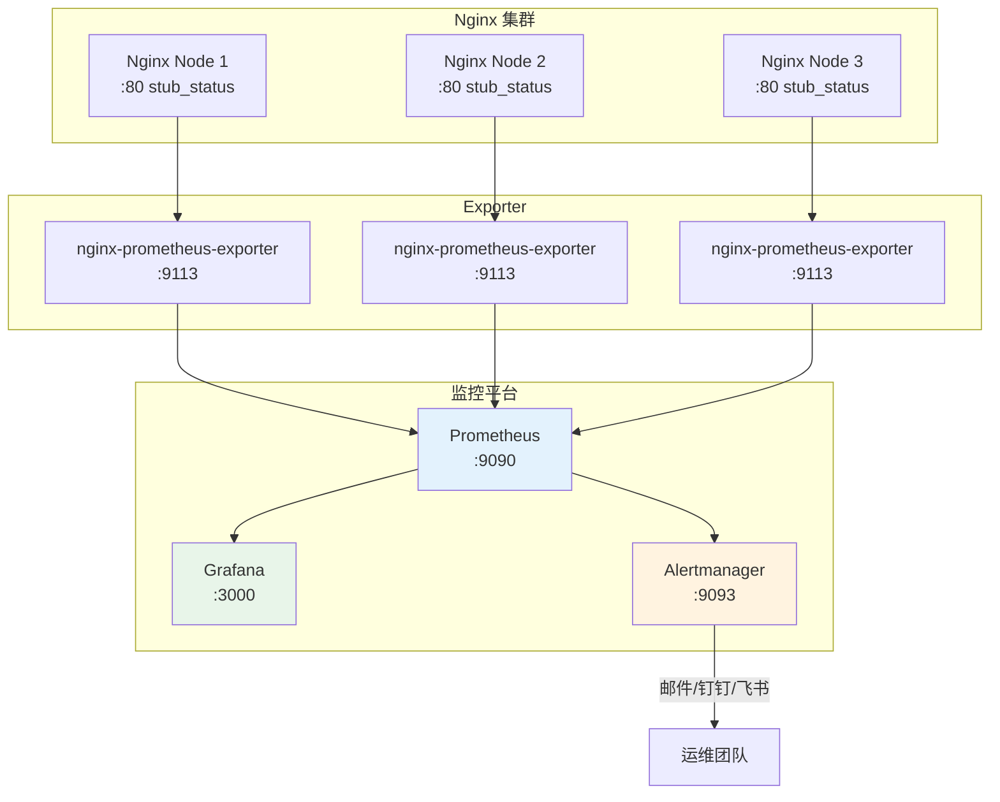
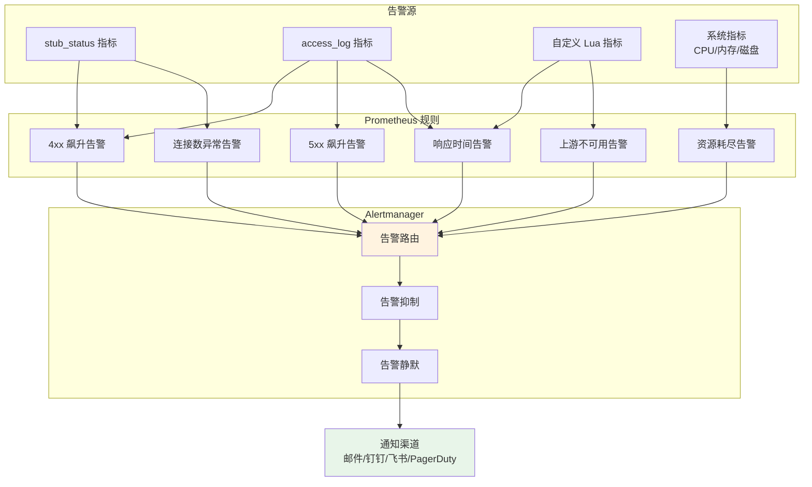
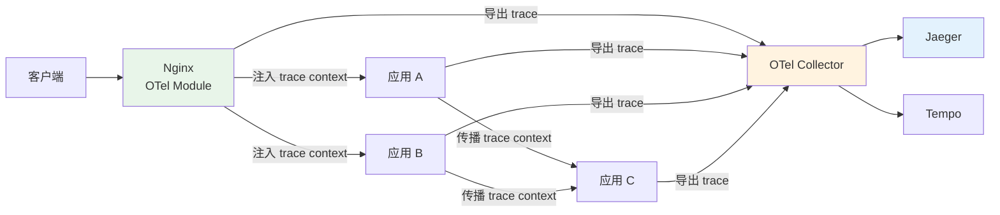

# 监控告警与可观测性

::: important 可观测性的三大支柱
可观测性（Observability）由日志（Logging）、指标（Metrics）和追踪（Tracing）三大支柱构成。Nginx 监控体系需要完整覆盖这三个维度，才能在故障发生时快速定位根因。
:::

## 1 stub_status 配置与指标

### 1.1 开启 stub_status

Nginx 内置的 `stub_status` 模块提供了基础的服务器状态指标，是 Nginx 可观测性的起点。

```nginx
# /etc/nginx/conf.d/stub-status.conf
server {
    listen 8080;
    server_name _;

    # 限制访问来源
    allow 127.0.0.1;
    allow 10.0.0.0/8;
    allow 172.16.0.0/12;
    deny all;

    location /stub_status {
        stub_status;
        access_log off;
        allow 127.0.0.1;
        deny all;
    }
}
```

::: warning 安全提醒
stub_status 暴露了服务器连接信息，务必限制访问来源。建议：
1. 使用独立端口（如 8080），不暴露到公网
2. 使用 `allow/deny` 限制访问 IP
3. 可选增加基本认证
:::

### 1.2 stub_status 指标详解

访问 `http://127.0.0.1:8080/stub_status` 返回如下内容：

```
Active connections: 291
server accepts handled requests
 16630948 16630948 31070465
Reading: 6 Writing: 179 Waiting: 106
```

各指标含义：

| 指标 | 含义 | 计算方式 |
|------|------|---------|
| **Active connections** | 当前活跃的客户端连接数（含 Waiting） | 直接读取 |
| **accepts** | 累计接受的客户端连接总数 | 累加计数器 |
| **handled** | 累计处理的客户端连接总数 | 累加计数器 |
| **requests** | 累计处理的客户端请求总数 | 累加计数器 |
| **Reading** | 正在读取请求头的连接数 | 直接读取 |
| **Writing** | 正在写入响应的连接数 | 直接读取 |
| **Waiting** | 等待新请求的 Keep-Alive 连接数 | Active - Reading - Writing |

### 1.3 关键衍生指标

```bash
#!/bin/bash
# /usr/local/bin/nginx-metrics.sh
# 解析 stub_status 指标

STATUS_URL="http://127.0.0.1:8080/stub_status"

# 获取原始数据
RAW=$(curl -s "${STATUS_URL}")

# 解析指标
ACTIVE=$(echo "${RAW}" | awk '/Active/ {print $3}')
ACCEPTS=$(echo "${RAW}" | awk 'NR==3 {print $1}')
HANDLED=$(echo "${RAW}" | awk 'NR==3 {print $2}')
REQUESTS=$(echo "${RAW}" | awk 'NR==3 {print $3}')
READING=$(echo "${RAW}" | awk '/Reading/ {print $2}')
WRITING=$(echo "${RAW}" | awk '/Writing/ {print $4}')
WAITING=$(echo "${RAW}" | awk '/Waiting/ {print $6}')

# 衍生指标
# 丢弃连接数 = accepts - handled（正常应等于 0）
DROPPED=$((ACCEPTS - HANDLED))

# 请求复用率 = requests / handled（每个连接平均处理请求数）
if [ "${HANDLED}" -gt 0 ]; then
    REUSE_RATE=$(echo "scale=2; ${REQUESTS} / ${HANDLED}" | bc)
else
    REUSE_RATE="0"
fi

echo "===== Nginx 指标 ====="
echo "活跃连接数:      ${ACTIVE}"
echo "累计接受连接:    ${ACCEPTS}"
echo "累计处理连接:    ${HANDLED}"
echo "累计处理请求:    ${REQUESTS}"
echo "丢弃连接数:      ${DROPPED}"
echo "读取中连接:      ${READING}"
echo "写入中连接:      ${WRITING}"
echo "等待中连接:      ${WAITING}"
echo "请求复用率:      ${REUSE_RATE}"
```

::: tip 关键告警指标
- **accepts ≠ handled**：说明有连接被丢弃，可能达到 `worker_connections` 上限
- **Active 持续增长**：可能有连接泄漏
- **Waiting 占比过高**：Keep-Alive 连接积压，考虑调低 `keepalive_timeout`
- **Reading + Writing 持续增长**：upstream 响应慢或客户端上传慢
:::

### 1.4 持续采集脚本

```bash
#!/bin/bash
# /usr/local/bin/nginx-rate-metrics.sh
# 计算 Nginx 指标速率（每秒新增量）

STATUS_URL="http://127.0.0.1:8080/stub_status"
INTERVAL=10  # 采集间隔（秒）

get_metrics() {
    local raw=$(curl -s "${STATUS_URL}")
    local active=$(echo "${raw}" | awk '/Active/ {print $3}')
    local accepts=$(echo "${raw}" | awk 'NR==3 {print $1}')
    local handled=$(echo "${raw}" | awk 'NR==3 {print $2}')
    local requests=$(echo "${raw}" | awk 'NR==3 {print $3}')
    local reading=$(echo "${raw}" | awk '/Reading/ {print $2}')
    local writing=$(echo "${raw}" | awk '/Writing/ {print $4}')
    local waiting=$(echo "${raw}" | awk '/Waiting/ {print $6}')
    echo "${active} ${accepts} ${handled} ${requests} ${reading} ${writing} ${waiting}"
}

# 第一次采集
read a1 ac1 h1 r1 rd1 wr1 wt1 <<< $(get_metrics)
sleep "${INTERVAL}"

# 第二次采集
read a2 ac2 h2 r2 rd2 wr2 wt2 <<< $(get_metrics)

# 计算速率
accepts_rate=$(echo "scale=2; ($ac2 - $ac1) / ${INTERVAL}" | bc)
handled_rate=$(echo "scale=2; ($h2 - $h1) / ${INTERVAL}" | bc)
requests_rate=$(echo "scale=2; ($r2 - $r1) / ${INTERVAL}" | bc)

echo "时间窗口: ${INTERVAL}s"
echo "连接接受速率: ${accepts_rate} conn/s"
echo "连接处理速率: ${handled_rate} conn/s"
echo "请求处理速率: ${requests_rate} req/s"
echo "当前活跃连接: ${a2}"
echo "当前等待连接: ${wt2}"
```

## 2 NGINX Plus API 与高级指标

### 2.1 NGINX Plus API

NGINX Plus（商业版）提供了更丰富的 API 端点，可获取详细的指标数据。

```nginx
# /etc/nginx/conf.d/api.conf
server {
    listen 8080;

    location /api {
        api write=on;
        allow 127.0.0.1;
        deny all;
    }

    location /dashboard.html {
        root /usr/share/nginx/html;
    }
}
```

### 2.2 API 端点概览

| 端点 | 描述 | 关键指标 |
|------|------|---------|
| `/api/6/nginx` | Nginx 基本信息 | 版本、构建信息 |
| `/api/6/connections` | 连接统计 | accepted、dropped、active、idle |
| `/api/6/http/requests` | HTTP 请求统计 | total、current |
| `/api/6/http/server_zones` | 虚拟主机统计 | 请求量、响应码、流量、延迟 |
| `/api/6/http/upstreams` | 上游服务器统计 | 状态、请求数、响应时间、失败次数 |
| `/api/6/http/caches` | 缓存统计 | 命中率、大小、过期 |
| `/api/6/stream/server_zones` | TCP/UDP 统计 | 连接数、流量 |
| `/api/6/stream/upstreams` | TCP/UDP 上游统计 | 状态、连接数 |

### 2.3 常用 API 查询示例

```bash
# 查看上游服务器状态
curl -s http://127.0.0.1:8080/api/6/http/upstreams | jq '.'

# 查看特定上游服务器
curl -s http://127.0.0.1:8080/api/6/http/upstreams/backend | jq '.'

# 查看服务器区域统计
curl -s http://127.0.0.1:8080/api/6/http/server_zones | jq '.'

# 查看缓存统计
curl -s http://127.0.0.1:8080/api/6/http/caches | jq '.'

# 查看连接统计
curl -s http://127.0.0.1:8080/api/6/connections | jq '.'
```

### 2.4 动态上游管理

```bash
# 添加上游服务器
curl -X POST http://127.0.0.1:8080/api/6/http/upstreams/backend/servers \
    -H "Content-Type: application/json" \
    -d '{"server":"10.0.1.20:8080","weight":1,"max_conns":100}'

# 优雅摘除服务器（drain 模式）
curl -X PATCH http://127.0.0.1:8080/api/6/http/upstreams/backend/servers/0 \
    -H "Content-Type: application/json" \
    -d '{"drain":true}'

# 完全移除服务器
curl -X DELETE http://127.0.0.1:8080/api/6/http/upstreams/backend/servers/0
```

## 3 Prometheus nginx-prometheus-exporter 部署

### 3.1 监控架构图



### 3.2 安装 nginx-prometheus-exporter

```bash
# 方式一：二进制安装
wget https://github.com/nginxinc/nginx-prometheus-exporter/releases/download/v1.1.0/nginx-prometheus-exporter_1.1.0_linux_amd64.tar.gz
tar xzf nginx-prometheus-exporter_1.1.0_linux_amd64.tar.gz
mv nginx-prometheus-exporter /usr/local/bin/

# 方式二：Docker 运行
docker run -d --name nginx-exporter \
    -p 9113:9113 \
    nginx/nginx-prometheus-exporter:1.1.0 \
    --nginx.scrape-uri=http://host.docker.internal:8080/stub_status
```

### 3.3 systemd 服务配置

```ini
# /etc/systemd/system/nginx-prometheus-exporter.service

[Unit]
Description=NGINX Prometheus Exporter
After=network.target

[Service]
Type=simple
User=nobody
ExecStart=/usr/local/bin/nginx-prometheus-exporter \
    --nginx.scrape-uri=http://127.0.0.1:8080/stub_status \
    --web.listen-address=:9113 \
    --web.telemetry-path=/metrics \
    --nginx.ssl-verify=false \
    --nginx.ssl-ca-cert=/etc/ssl/certs/ca-certificates.crt
Restart=on-failure
RestartSec=5s

# 安全限制
NoNewPrivileges=true
ProtectSystem=strict
ProtectHome=true
ReadWritePaths=/var/log/nginx-exporter

[Install]
WantedBy=multi-user.target
```

### 3.4 Prometheus 配置

```yaml
# /etc/prometheus/prometheus.yml

global:
  scrape_interval: 15s
  evaluation_interval: 15s
  external_labels:
    cluster: 'production'
    env: 'prod'

# 告警规则文件
rule_files:
  - "alerts/nginx/*.yml"

# Alertmanager 配置
alerting:
  alertmanagers:
    - static_configs:
        - targets:
            - alertmanager:9093

# 采集目标
scrape_configs:
  # Nginx Exporter
  - job_name: 'nginx'
    metrics_path: /metrics
    scrape_interval: 10s
    static_configs:
      - targets:
          - 'nginx-prod-01:9113'
          - 'nginx-prod-02:9113'
          - 'nginx-prod-03:9113'
        labels:
          team: 'infra'
          service: 'nginx'

    # 基于 DNS 的服务发现
    dns_sd_configs:
      - names:
          - 'nginx-exporter._tcp.service.consul'
        type: 'A'
        port: 9113
        refresh_interval: 30s
```

### 3.5 Exporter 输出的指标

nginx-prometheus-exporter 输出的 Prometheus 指标：

| 指标名 | 类型 | 含义 |
|--------|------|------|
| `nginx_up` | gauge | Nginx 是否在线（1=在线，0=离线） |
| `nginx_connections_active` | gauge | 当前活跃连接数 |
| `nginx_connections_accepted` | counter | 累计接受连接数 |
| `nginx_connections_handled` | counter | 累计处理连接数 |
| `nginx_connections_reading` | gauge | 正在读取请求头的连接数 |
| `nginx_connections_writing` | gauge | 正在写入响应的连接数 |
| `nginx_connections_waiting` | gauge | 等待新请求的 Keep-Alive 连接数 |
| `nginx_http_requests_total` | counter | 累计处理请求总数 |
| `nginx_server_zones_requests_total` | counter | 每个 server_zone 的请求总数（Plus） |
| `nginx_upstream_server_responses` | counter | 上游服务器各状态码响应数（Plus） |

### 3.6 PromQL 常用查询

```promql
# 每秒请求量 (QPS)
rate(nginx_http_requests_total[5m])

# 每秒连接接受速率
rate(nginx_connections_accepted[5m])

# 丢弃连接率
rate(nginx_connections_accepted[5m]) - rate(nginx_connections_handled[5m])

# 活跃连接数
nginx_connections_active

# Waiting 连接占比
nginx_connections_waiting / nginx_connections_active * 100

# 各节点 QPS 对比
sum by (instance) (rate(nginx_http_requests_total[5m]))

# 集群总 QPS
sum(rate(nginx_http_requests_total[5m]))

# 连接接受速率变化趋势（5分钟内每秒新增连接数）
rate(nginx_connections_accepted[5m])
```

## 4 自定义指标：lua-prometheus-plugin

### 4.1 安装与配置

当 stub_status 的基础指标无法满足需求时，可以通过 OpenResty/Lua 扩展自定义指标。

```nginx
# /etc/nginx/nginx.conf
# 需要 OpenResty 或编译了 lua-nginx-module 的 Nginx

http {
    # Lua 共享字典（用于指标存储）
    lua_shared_dict prometheus_metrics 10m;

    init_worker_by_lua_block {
        prometheus = require("prometheus").init("prometheus_metrics")

        -- 定义自定义指标
        metric_requests = prometheus:counter(
            "nginx_http_requests_total",
            "HTTP 请求总数",
            {"host", "method", "status"}
        )
        metric_latency = prometheus:histogram(
            "nginx_http_request_duration_seconds",
            "HTTP 请求延迟",
            {"host", "method"},
            {0.005, 0.01, 0.025, 0.05, 0.1, 0.25, 0.5, 1, 2.5, 5, 10}
        )
        metric_connections = prometheus:gauge(
            "nginx_http_connections",
            "HTTP 连接数",
            {"state"}
        )
        metric_upstream_latency = prometheus:histogram(
            "nginx_http_upstream_duration_seconds",
            "上游响应延迟",
            {"upstream", "status"},
            {0.01, 0.025, 0.05, 0.1, 0.25, 0.5, 1, 2.5, 5, 10}
        )
        metric_bandwidth = prometheus:counter(
            "nginx_http_bandwidth_bytes_total",
            "HTTP 带宽",
            {"host", "direction"}
        )
    }

    # 暴露指标端点
    server {
        listen 9145;
        allow 127.0.0.1;
        allow 10.0.0.0/8;
        deny all;

        location /metrics {
            content_by_lua_block {
                metric_connections:set(ngx.var.connections_active, {"active"})
                metric_connections:set(ngx.var.connections_reading, {"reading"})
                metric_connections:set(ngx.var.connections_writing, {"writing"})
                metric_connections:set(ngx.var.connections_waiting, {"waiting"})
                prometheus:collect()
            }
        }
    }

    # 记录请求指标
    log_by_lua_block {
        local host = ngx.var.host or "unknown"
        local method = ngx.var.request_method or "unknown"
        local status = ngx.var.status or "0"

        metric_requests:inc(1, {host, method, status})
        metric_latency:observe(tonumber(ngx.var.request_time), {host, method})

        -- 带宽统计
        local bytes_sent = tonumber(ngx.var.bytes_sent) or 0
        local bytes_received = tonumber(ngx.var.request_length) or 0
        metric_bandwidth:inc(bytes_sent, {host, "tx"})
        metric_bandwidth:inc(bytes_received, {host, "rx"})

        -- 上游延迟
        if ngx.var.upstream_response_time then
            local upstream = ngx.var.upstream_addr or "unknown"
            metric_upstream_latency:observe(
                tonumber(ngx.var.upstream_response_time),
                {upstream, status}
            )
        end
    }
}
```

### 4.2 自定义指标扩展

```nginx
# 在 log_by_lua_block 中添加业务指标

log_by_lua_block {
    -- API 路径维度指标
    local api_path = ngx.var.uri:match("^/api/[^/]+") or ngx.var.uri
    metric_api_requests = metric_api_requests or prometheus:counter(
        "nginx_api_requests_total",
        "API 请求统计",
        {"api_path", "method", "status"}
    )
    metric_api_requests:inc(1, {api_path, method, status})

    -- 慢请求统计（超过 1 秒）
    if tonumber(ngx.var.request_time) > 1 then
        metric_slow_requests = metric_slow_requests or prometheus:counter(
            "nginx_slow_requests_total",
            "慢请求数",
            {"host", "uri"}
        )
        metric_slow_requests:inc(1, {ngx.var.host, ngx.var.uri})
    end

    -- HTTP/HTTPS 请求分布
    local scheme = ngx.var.scheme or "unknown"
    metric_scheme_requests = metric_scheme_requests or prometheus:counter(
        "nginx_scheme_requests_total",
        "协议分布",
        {"scheme"}
    )
    metric_scheme_requests:inc(1, {scheme})
}
```

## 5 Grafana 看板配置

### 5.1 核心指标仪表盘

以下为推荐的 Grafana 仪表盘面板配置：

**面板 1：请求量概览**

| 面板 | PromQL | 可视化类型 |
|------|--------|-----------|
| 总 QPS | `sum(rate(nginx_http_requests_total[5m]))` | Stat |
| 各节点 QPS | `sum by (instance) (rate(nginx_http_requests_total[5m]))` | Time Series |
| 请求量趋势 | `sum(rate(nginx_http_requests_total[1h]))` | Time Series |

**面板 2：连接指标**

| 面板 | PromQL | 可视化类型 |
|------|--------|-----------|
| 活跃连接数 | `nginx_connections_active` | Stat |
| 连接状态分布 | `nginx_connections_active`, `nginx_connections_reading`, `nginx_connections_writing`, `nginx_connections_waiting` | Stacked Graph |
| 丢弃连接率 | `rate(nginx_connections_accepted[5m]) - rate(nginx_connections_handled[5m])` | Stat |

**面板 3：延迟指标**

| 面板 | PromQL | 可视化类型 |
|------|--------|-----------|
| P50 延迟 | `histogram_quantile(0.5, sum(rate(nginx_http_request_duration_seconds_bucket[5m])) by (le))` | Time Series |
| P95 延迟 | `histogram_quantile(0.95, sum(rate(nginx_http_request_duration_seconds_bucket[5m])) by (le))` | Time Series |
| P99 延迟 | `histogram_quantile(0.99, sum(rate(nginx_http_request_duration_seconds_bucket[5m])) by (le))` | Time Series |

### 5.2 Grafana Dashboard JSON

```json
{
  "dashboard": {
    "title": "Nginx Production Dashboard",
    "tags": ["nginx", "production"],
    "timezone": "browser",
    "panels": [
      {
        "title": "请求总量 (QPS)",
        "type": "stat",
        "gridPos": {"h": 4, "w": 6, "x": 0, "y": 0},
        "targets": [
          {
            "expr": "sum(rate(nginx_http_requests_total[5m]))",
            "legendFormat": "Total QPS"
          }
        ],
        "fieldConfig": {
          "defaults": {
            "unit": "reqps",
            "thresholds": {
              "steps": [
                {"color": "green", "value": null},
                {"color": "yellow", "value": 10000},
                {"color": "red", "value": 50000}
              ]
            }
          }
        }
      },
      {
        "title": "活跃连接数",
        "type": "stat",
        "gridPos": {"h": 4, "w": 6, "x": 6, "y": 0},
        "targets": [
          {
            "expr": "nginx_connections_active",
            "legendFormat": "{{instance}}"
          }
        ],
        "fieldConfig": {
          "defaults": {
            "thresholds": {
              "steps": [
                {"color": "green", "value": null},
                {"color": "yellow", "value": 50000},
                {"color": "red", "value": 60000}
              ]
            }
          }
        }
      },
      {
        "title": "丢弃连接率",
        "type": "stat",
        "gridPos": {"h": 4, "w": 6, "x": 12, "y": 0},
        "targets": [
          {
            "expr": "rate(nginx_connections_accepted[5m]) - rate(nginx_connections_handled[5m])",
            "legendFormat": "{{instance}}"
          }
        ],
        "fieldConfig": {
          "defaults": {
            "thresholds": {
              "steps": [
                {"color": "green", "value": null},
                {"color": "red", "value": 0.01}
              ]
            }
          }
        }
      },
      {
        "title": "请求量趋势",
        "type": "timeseries",
        "gridPos": {"h": 8, "w": 12, "x": 0, "y": 4},
        "targets": [
          {
            "expr": "sum by (instance) (rate(nginx_http_requests_total[5m]))",
            "legendFormat": "{{instance}}"
          }
        ]
      },
      {
        "title": "连接状态分布",
        "type": "timeseries",
        "gridPos": {"h": 8, "w": 12, "x": 12, "y": 4},
        "targets": [
          {
            "expr": "avg(nginx_connections_reading)",
            "legendFormat": "Reading"
          },
          {
            "expr": "avg(nginx_connections_writing)",
            "legendFormat": "Writing"
          },
          {
            "expr": "avg(nginx_connections_waiting)",
            "legendFormat": "Waiting"
          }
        ],
        "fieldConfig": {
          "defaults": {"custom": {"stacking": {"mode": "normal"}}}
        }
      }
    ]
  }
}
```

### 5.3 推荐社区 Dashboard

可直接导入的 Grafana Dashboard：

- **Dashboard 12708**：Nginx Prometheus Exporter（官方推荐）
- **Dashboard 11199**：Nginx stub_status + 自定义指标
- **Dashboard 11291**：Nginx Plus 全功能 Dashboard

导入方式：Grafana → Dashboards → Import → 输入 Dashboard ID

## 6 告警规则设计

### 6.1 告警规则架构



### 6.2 Prometheus 告警规则

```yaml
# /etc/prometheus/alerts/nginx/connections.yml
groups:
  - name: nginx_connections
    rules:
      # 活跃连接数过高
      - alert: NginxHighConnections
        expr: nginx_connections_active > 50000
        for: 5m
        labels:
          severity: warning
          team: infra
        annotations:
          summary: "Nginx 活跃连接数过高 ({{ $value }})"
          description: "实例 {{ $labels.instance }} 活跃连接数 {{ $value }} 超过阈值 50000，持续 5 分钟"

      # 连接被丢弃
      - alert: NginxDroppedConnections
        expr: rate(nginx_connections_accepted[5m]) - rate(nginx_connections_handled[5m]) > 0
        for: 2m
        labels:
          severity: critical
          team: infra
        annotations:
          summary: "Nginx 丢弃连接 ({{ $value | humanize }} conn/s)"
          description: "实例 {{ $labels.instance }} 每秒丢弃 {{ $value }} 个连接，可能已达到 worker_connections 上限"

      # 等待连接数异常高
      - alert: NginxHighWaitingConnections
        expr: nginx_connections_waiting / nginx_connections_active > 0.9
        for: 10m
        labels:
          severity: warning
          team: infra
        annotations:
          summary: "Nginx 等待连接占比过高 ({{ $value | humanizePercentage }})"
          description: "实例 {{ $labels.instance }} 等待连接占比 {{ $value | humanizePercentage }}，超过 90%"

# /etc/prometheus/alerts/nginx/requests.yml
groups:
  - name: nginx_requests
    rules:
      # QPS 异常低
      - alert: NginxLowQPS
        expr: sum(rate(nginx_http_requests_total[5m])) < 10
        for: 10m
        labels:
          severity: warning
          team: infra
        annotations:
          summary: "Nginx QPS 异常低 ({{ $value }} req/s)"
          description: "集群 QPS 仅 {{ $value }} req/s，可能存在流量异常"

      # QPS 突增
      - alert: NginxQPSSpike
        expr: |
          sum(rate(nginx_http_requests_total[5m])) >
          2 * sum(rate(nginx_http_requests_total[5m] offset 1h))
        for: 5m
        labels:
          severity: warning
          team: infra
        annotations:
          summary: "Nginx QPS 突增 ({{ $value }} req/s)"
          description: "当前 QPS 是 1 小时前的 2 倍以上，可能存在异常流量或攻击"

# /etc/prometheus/alerts/nginx/upstream.yml
groups:
  - name: nginx_upstream
    rules:
      # 上游响应慢
      - alert: NginxUpstreamSlowResponse
        expr: |
          histogram_quantile(0.95,
            sum(rate(nginx_http_upstream_duration_seconds_bucket[5m])) by (le, upstream)
          ) > 2
        for: 5m
        labels:
          severity: warning
          team: infra
        annotations:
          summary: "Nginx 上游响应慢 (P95: {{ $value }}s)"
          description: "上游 {{ $labels.upstream }} 的 P95 响应时间 {{ $value }}s 超过 2s 阈值"

      # Nginx 实例离线
      - alert: NginxDown
        expr: nginx_up == 0
        for: 1m
        labels:
          severity: critical
          team: infra
        annotations:
          summary: "Nginx 实例离线"
          description: "实例 {{ $labels.instance }} 的 Nginx 已离线超过 1 分钟"
```

### 6.3 基于日志的 4xx/5xx 告警

通过日志聚合计算错误率：

```yaml
# /etc/prometheus/alerts/nginx/errors.yml
groups:
  - name: nginx_errors
    rules:
      # 5xx 错误率飙升
      - alert: NginxHigh5xxRate
        expr: |
          (
            sum(rate(nginx_http_requests_total{status=~"5.."}[5m]))
            /
            sum(rate(nginx_http_requests_total[5m]))
          ) > 0.05
        for: 3m
        labels:
          severity: critical
          team: infra
        annotations:
          summary: "Nginx 5xx 错误率过高 ({{ $value | humanizePercentage }})"
          description: "5xx 错误率 {{ $value | humanizePercentage }} 超过 5% 阈值，持续 3 分钟"

      # 4xx 错误率飙升
      - alert: NginxHigh4xxRate
        expr: |
          (
            sum(rate(nginx_http_requests_total{status=~"4.."}[5m]))
            /
            sum(rate(nginx_http_requests_total[5m]))
          ) > 0.1
        for: 5m
        labels:
          severity: warning
          team: infra
        annotations:
          summary: "Nginx 4xx 错误率过高 ({{ $value | humanizePercentage }})"
          description: "4xx 错误率 {{ $value | humanizePercentage }} 超过 10% 阈值，可能存在扫描攻击或客户端错误"

      # 单个 URL 5xx 突增
      - alert: NginxURLErrorSpike
        expr: |
          sum by (uri) (
            rate(nginx_http_requests_total{status=~"5.."}[5m])
          ) > 10
        for: 3m
        labels:
          severity: warning
          team: infra
        annotations:
          summary: "URL {{ $labels.uri }} 5xx 错误率突增 ({{ $value }} req/s)"
          description: "URL {{ $labels.uri }} 的 5xx 请求速率 {{ $value }} req/s，可能存在后端异常"
```

### 6.4 Alertmanager 配置

```yaml
# /etc/alertmanager/alertmanager.yml

global:
  resolve_timeout: 5m
  # 邮件通知配置
  smtp_smarthost: 'smtp.example.com:587'
  smtp_from: 'alertmanager@example.com'
  smtp_auth_username: 'alertmanager@example.com'
  smtp_auth_password: 'YOUR_PASSWORD'

# 告警路由
route:
  group_by: ['alertname', 'cluster', 'service']
  group_wait: 30s
  group_interval: 5m
  repeat_interval: 4h
  receiver: 'default'

  routes:
    # 严重告警直接通知
    - match:
        severity: critical
      receiver: 'critical-alerts'
      repeat_interval: 15m

    # Nginx 相关告警
    - match_re:
        alertname: Nginx.*
      receiver: 'nginx-team'
      group_by: ['alertname', 'instance']

    # 基础设施告警
    - match:
        team: infra
      receiver: 'infra-team'

# 抑制规则
inhibit_rules:
  # Nginx 离线时抑制该实例的所有其他告警
  - source_match:
      alertname: NginxDown
    target_match_re:
      alertname: Nginx.*
    equal: ['instance']

  # 5xx 告警时抑制同实例的 4xx 告警
  - source_match:
      alertname: NginxHigh5xxRate
    target_match:
      alertname: NginxHigh4xxRate
    equal: ['instance']

# 接收器
receivers:
  - name: 'default'
    webhook_configs:
      - url: 'http://alertmanager-webhook:8080/notify'

  - name: 'critical-alerts'
    email_configs:
      - to: 'oncall@example.com'
        headers:
          Subject: '[CRITICAL] {{ .GroupLabels.alertname }}'
    # 钉钉通知
    webhook_configs:
      - url: 'http://dingtalk-webhook:8080/dingtalk/critical/send'

  - name: 'nginx-team'
    email_configs:
      - to: 'nginx-team@example.com'

  - name: 'infra-team'
    email_configs:
      - to: 'infra-team@example.com'
```

## 7 日志指标：stub_status + access_log 聚合

### 7.1 增强日志格式

```nginx
# /etc/nginx/nginx.conf
# 增强版日志格式，包含更多可观测性字段

log_format enhanced '$remote_addr - $remote_user [$time_local] '
                    '"$request" $status $body_bytes_sent '
                    '"$http_referer" "$http_user_agent" '
                    '"$http_x_forwarded_for" '
                    'rt=$request_time '
                    'uct=$upstream_connect_time '
                    'uht=$upstream_header_time '
                    'urt=$upstream_response_time '
                    'upst=$upstream_addr '
                    'upsc=$upstream_status '
                    'cs=$connection '
                    'bs=$bytes_sent '
                    'rl=$request_length '
                    'sid=$request_id '
                    'host=$host '
                    'scheme=$scheme';

access_log /var/log/nginx/access.log enhanced buffer=64k flush=5s;
```

### 7.2 日志聚合分析脚本

```bash
#!/bin/bash
# /usr/local/bin/nginx-log-analyze.sh
# Nginx 日志实时分析工具

LOG_FILE="/var/log/nginx/access.log"

# 状态码分布
status_distribution() {
    echo "===== 状态码分布 ====="
    tail -100000 "${LOG_FILE}" | awk '{print $9}' | sort | uniq -c | sort -rn
}

# Top 20 请求 URL
top_urls() {
    echo ""
    echo "===== Top 20 请求 URL ====="
    tail -100000 "${LOG_FILE}" | awk '{print $7}' | sort | uniq -c | sort -rn | head -20
}

# Top 20 慢请求
slow_requests() {
    echo ""
    echo "===== Top 20 慢请求（按响应时间）====="
    tail -100000 "${LOG_FILE}" | awk -F'rt=' '{print $2}' | awk '{print $1, $0}' | \
        sort -rn | head -20 | while read rt line; do
        echo "${rt}s ${line}"
    done
}

# 5xx 错误 Top URL
error_urls() {
    echo ""
    echo "===== 5xx 错误 Top 20 URL ====="
    tail -100000 "${LOG_FILE}" | awk '$9 ~ /^5/ {print $7}' | sort | uniq -c | sort -rn | head -20
}

# 上游延迟分析
upstream_latency() {
    echo ""
    echo "===== 上游延迟分布 ====="
    tail -100000 "${LOG_FILE}" | awk -F'urt=' '{print $2}' | awk '{print $1}' | \
        awk '
        {
            if ($1 < 0.1) fast++
            else if ($1 < 0.5) normal++
            else if ($1 < 1) slow++
            else very_slow++
            total++
        }
        END {
            printf "< 100ms: %d (%.1f%%)\n", fast, fast/total*100
            printf "100-500ms: %d (%.1f%%)\n", normal, normal/total*100
            printf "500ms-1s: %d (%.1f%%)\n", slow, slow/total*100
            printf "> 1s: %d (%.1f%%)\n", very_slow, very_slow/total*100
        }'
}

# IP 访问频率
ip_frequency() {
    echo ""
    echo "===== Top 20 访问 IP ====="
    tail -100000 "${LOG_FILE}" | awk '{print $1}' | sort | uniq -c | sort -rn | head -20
}

# 每分钟 QPS
qps_per_minute() {
    echo ""
    echo "===== 最近 10 分钟 QPS ====="
    tail -100000 "${LOG_FILE}" | awk '{print $4}' | cut -d: -f2 | sort | uniq -c | tail -10
}

# 主菜单
case "${1:-all}" in
    status) status_distribution ;;
    urls) top_urls ;;
    slow) slow_requests ;;
    errors) error_urls ;;
    latency) upstream_latency ;;
    ips) ip_frequency ;;
    qps) qps_per_minute ;;
    all)
        status_distribution
        top_urls
        slow_requests
        error_urls
        upstream_latency
        ip_frequency
        qps_per_minute
        ;;
    *)
        echo "用法: $0 {status|urls|slow|errors|latency|ips|qps|all}"
        ;;
esac
```

### 7.3 日志指标导出到 Prometheus

使用 `mtail` 工具从日志中提取指标：

```bash
# 安装 mtail
wget https://github.com/google/mtail/releases/download/v3.0.0-rc52/mtail_3.0.0-rc52_linux_amd64.tar.gz
tar xzf mtail_3.0.0-rc52_linux_amd64.tar.gz
mv mtail /usr/local/bin/
```

```
# /etc/mtail/nginx.mtail
# Nginx 日志指标提取规则

counter nginx_requests_total by method, status, host
counter nginx_bytes_total by direction
histogram nginx_request_duration buckets 0.005, 0.01, 0.025, 0.05, 0.1, 0.25, 0.5, 1, 2.5, 5, 10
counter nginx_5xx_errors by host, uri

/^(?P<ip>\S+) \S+ \S+ \[(?P<timestamp>[^\]]+)\] "(?P<method>\S+) (?P<uri>\S+) \S+" (?P<status>\d+) (?P<bytes>\d+)/ {
    nginx_requests_total[$method][$status][$host]++

    direction = "tx"
    nginx_bytes_total[direction] += $bytes

    # 解析响应时间
    /rt=(?P<duration>\S+)/ {
        nginx_request_duration[$duration]
    }

    # 5xx 统计
    $status >= 500 {
        nginx_5xx_errors[$host][$uri]++
    }
}
```

## 8 分布式追踪集成：OpenTelemetry

### 8.1 架构概述



### 8.2 Nginx OpenTelemetry 模块

```nginx
# /etc/nginx/nginx.conf
# 需要编译 ngx_http_opentelemetry_module

# 加载 OpenTelemetry 模块
load_module modules/ngx_http_opentelemetry_module.so;

http {
    # OpenTelemetry 配置
    opentelemetry on;
    opentelemetry_trust_incoming_spans on;
    opentelemetry_operation_name "$uri";

    # 注意：endpoint、service_name 等配置通过环境变量设置，而非 nginx 指令
    # 在 Docker 或 systemd 中配置环境变量：
    # OTEL_EXPORTER_OTLP_ENDPOINT=http://otel-collector:4317
    # OTEL_SERVICE_NAME=nginx-proxy
    # OTEL_RESOURCE_ATTRIBUTES=deployment.environment=prod,service.version=1.0.0

    # 采样配置
    opentelemetry_trace_ratio 1.0;  # 采样率（0.0-1.0）

    # 传播格式
    opentelemetry_propagate b3,tracecontext;

    server {
        listen 80;
        server_name app.example.com;

        location /api/ {
            # 为特定 location 设置 span 名称
            opentelemetry_operation_name "api_proxy";

            # 添加自定义属性
            opentelemetry_attribute "nginx.worker_pid" $pid;
            opentelemetry_attribute "nginx.server_name" $server_name;

            proxy_pass http://backend;
        }

        location /healthz {
            # 健康检查不生成 trace
            opentelemetry off;
            return 200 "ok";
        }
    }
}
```

### 8.3 编译 OpenTelemetry 模块

```bash
#!/bin/bash
# 编译 Nginx OpenTelemetry 模块

NGINX_VERSION="1.25.4"
OTEL_VERSION="0.1.3"

# 安装依赖
yum install -y cmake git gcc-c++

# 下载源码
cd /usr/local/src
git clone --recursive https://github.com/open-telemetry/opentelemetry-cpp-contrib.git
cd opentelemetry-cpp-contrib

# 编译 OTel 库
cd exporters/othttp
mkdir build && cd build
cmake -DCMAKE_BUILD_TYPE=Release ..
make -j$(nproc)
make install

# 编译 Nginx 模块
cd /usr/local/src
curl -fSL "https://nginx.org/download/nginx-${NGINX_VERSION}.tar.gz" -o "nginx-${NGINX_VERSION}.tar.gz"
tar xzf "nginx-${NGINX_VERSION}.tar.gz"
cd "nginx-${NGINX_VERSION}"

./configure --add-dynamic-module=/usr/local/src/opentelemetry-cpp-contrib/instrumentation/nginx \
    --with-compat \
    $(nginx -V 2>&1 | grep 'configure arguments' | sed 's/configure arguments: //')

make modules
cp objs/ngx_http_opentelemetry_module.so /etc/nginx/modules/
```

### 8.4 OTel Collector 配置

```yaml
# /etc/otel-collector/config.yaml

receivers:
  otlp:
    protocols:
      http:
        endpoint: 0.0.0.0:4318
      grpc:
        endpoint: 0.0.0.0:4317

processors:
  batch:
    timeout: 5s
    send_batch_size: 1024
  resource:
    attributes:
      - key: collector.name
        value: nginx-otel
        action: upsert
  tail_sampling:
    decision_wait: 10s
    policies:
      # 错误请求全部采样
      - name: error-policy
        type: status_code
        status_code:
          status_codes:
            - ERROR
      # 慢请求全部采样
      - name: slow-policy
        type: latency
        latency:
          threshold_ms: 1000
      # 其他 10% 采样
      - name: sample-policy
        type: probabilistic
        probabilistic:
          sampling_percentage: 10

exporters:
  jaeger:
    endpoint: jaeger:14250
    tls:
      insecure: true
  prometheus:
    endpoint: "0.0.0.0:8889"
    namespace: "nginx_otel"

service:
  pipelines:
    traces:
      receivers: [otlp]
      processors: [batch, tail_sampling]
      exporters: [jaeger]
    metrics:
      receivers: [otlp]
      processors: [batch, resource]
      exporters: [prometheus]
```

## 9 APM 工具集成

### 9.1 Datadog Nginx 集成

```yaml
# /etc/datadog-agent/conf.d/nginx.d/conf.yaml

init_config:

instances:
  - nginx_status_url: http://127.0.0.1:8080/stub_status
    tags:
      - env:production
      - service:nginx
      - cluster:main

# 日志采集
logs:
  - type: file
    path: /var/log/nginx/access.log
    service: nginx
    source: nginx
    sourcecategory: http_web_access
    tags:
      - env:production

  - type: file
    path: /var/log/nginx/error.log
    service: nginx
    source: nginx
    sourcecategory: http_web_error
    tags:
      - env:production
```

### 9.2 Datadog 自定义指标

```nginx
# /etc/nginx/conf.d/datadog.conf
# 使用 OpenResty 发送自定义指标到 Datadog

server {
    listen 80;
    server_name _;

    location /api/ {
        access_by_lua_block {
            local dog = require("dogstatsd")
            local statsd = dog:new()
            statsd:increment("nginx.api.request", 1, {ngx.var.uri})
        }

        proxy_pass http://backend;

        log_by_lua_block {
            local dog = require("dogstatsd")
            local statsd = dog:new()
            local rt = tonumber(ngx.var.request_time) or 0
            statsd:gauge("nginx.api.response_time", rt * 1000, {ngx.var.uri, ngx.var.status})
        }
    }
}
```

### 9.3 New Relic Nginx 集成

```yaml
# /etc/newrelic-infra/integrations.d/nginx-config.yml

integration_name: com.newrelic.nginx
instances:
  - name: nginx-server
    command: metrics
    arguments:
      status_url: http://127.0.0.1:8080/stub_status
      remote_monitoring: true
    labels:
      env: production
      role: load_balancer
```

```yaml
# Nginx 日志转发到 New Relic
# /etc/fluent-bit/fluent-bit.conf

[INPUT]
    Name tail
    Path /var/log/nginx/access.log
    Tag nginx.access
    Read_from_Head true

[FILTER]
    Name parser
    Match nginx.access
    Key_Name log
    Parser nginx

[OUTPUT]
    Name newrelic
    Match nginx.*
    licenseKey YOUR_NEW_RELIC_LICENSE_KEY
```

## 10 容量规划与趋势分析

### 10.1 容量规划指标

| 指标 | 计算方式 | 用途 |
|------|---------|------|
| 峰值 QPS | `max_over_time(sum(rate(nginx_http_requests_total[1m]))[7d])` | 确定 QPS 容量 |
| 平均 QPS | `avg_over_time(sum(rate(nginx_http_requests_total[5m]))[7d])` | 基线容量 |
| 峰值连接数 | `max_over_time(nginx_connections_active[7d])` | 确定 worker_connections |
| P99 延迟 | `histogram_quantile(0.99, ...)` | 确定超时配置 |
| 带宽使用 | `sum(rate(nginx_bytes_total[5m]))` | 确定网络容量 |
| 错误率 | `sum(rate(nginx_requests_total{status=~"5.."}[5m])) / sum(rate(nginx_requests_total[5m]))` | SLO 依据 |

### 10.2 容量规划 PromQL

```promql
# 7 天峰值 QPS
max_over_time(sum(rate(nginx_http_requests_total[1m]))[7d])

# 30 天 QPS 增长趋势
deriv(sum(rate(nginx_http_requests_total[1h]))[30d:1h])

# 预计 QPS 翻倍时间（天）
100 / (deriv(sum(rate(nginx_http_requests_total[1h]))[30d:1h]) /
       sum(rate(nginx_http_requests_total[5m])) * 100 * 24)

# 连接数 7 天峰值
max_over_time(nginx_connections_active[7d])

# 连接数使用率
max_over_time(nginx_connections_active[7d]) / 65535 * 100

# P99 延迟 7 天趋势
histogram_quantile(0.99,
    sum(rate(nginx_http_request_duration_seconds_bucket[5m])) by (le)
)
```

### 10.3 容量预警规则

```yaml
# /etc/prometheus/alerts/nginx/capacity.yml
groups:
  - name: nginx_capacity
    rules:
      # 连接数使用率超过 70%
      - alert: NginxConnectionsCapacity
        expr: nginx_connections_active / 65535 > 0.7
        for: 15m
        labels:
          severity: warning
          team: infra
        annotations:
          summary: "Nginx 连接数容量不足 ({{ $value | humanizePercentage }})"
          description: "实例 {{ $labels.instance }} 连接数使用率 {{ $value | humanizePercentage }}，建议扩容或调整 worker_connections"

      # 基于增长趋势预测容量不足
      - alert: NginxCapacityForecast
        expr: |
          deriv(sum(rate(nginx_http_requests_total[1h]))[7d:1h]) > 0
          and
          sum(rate(nginx_http_requests_total[5m])) /
          deriv(sum(rate(nginx_http_requests_total[1h]))[7d:1h]) / 24 < 30
        for: 1h
        labels:
          severity: warning
          team: infra
        annotations:
          summary: "Nginx 容量预计 30 天内耗尽"
          description: "基于当前增长趋势，QPS 将在 30 天内达到容量上限"
```

### 10.4 月度容量报告

```bash
#!/bin/bash
# /usr/local/bin/nginx-capacity-report.sh
# Nginx 月度容量报告

PROM_URL="http://prometheus:9090"
MONTH=$(date -d 'last month' '+%Y-%m')

echo "========================================="
echo "  Nginx 月度容量报告 - ${MONTH}"
echo "========================================="

# 峰值 QPS
echo ""
echo "--- QPS 统计 ---"
PEAK_QPS=$(curl -s "${PROM_URL}/api/v1/query?query=max_over_time(sum(rate(nginx_http_requests_total[1m]))[30d])" | jq -r '.data.result[0].value[1]')
AVG_QPS=$(curl -s "${PROM_URL}/api/v1/query?query=avg_over_time(sum(rate(nginx_http_requests_total[5m]))[30d])" | jq -r '.data.result[0].value[1]')
echo "峰值 QPS: ${PEAK_QPS}"
echo "平均 QPS: ${AVG_QPS}"

# 延迟统计
echo ""
echo "--- 延迟统计 ---"
P50=$(curl -s "${PROM_URL}/api/v1/query?query=histogram_quantile(0.5,sum(rate(nginx_http_request_duration_seconds_bucket[5m]))by(le))" | jq -r '.data.result[0].value[1]')
P95=$(curl -s "${PROM_URL}/api/v1/query?query=histogram_quantile(0.95,sum(rate(nginx_http_request_duration_seconds_bucket[5m]))by(le))" | jq -r '.data.result[0].value[1]')
P99=$(curl -s "${PROM_URL}/api/v1/query?query=histogram_quantile(0.99,sum(rate(nginx_http_request_duration_seconds_bucket[5m]))by(le))" | jq -r '.data.result[0].value[1]')
echo "P50 延迟: ${P50}s"
echo "P95 延迟: ${P95}s"
echo "P99 延迟: ${P99}s"

# 错误率
echo ""
echo "--- 错误率 ---"
ERROR_RATE=$(curl -s "${PROM_URL}/api/v1/query?query=sum(rate(nginx_http_requests_total{status=~%225..%22}[30d]))/sum(rate(nginx_http_requests_total[30d]))" | jq -r '.data.result[0].value[1]')
echo "5xx 错误率: ${ERROR_RATE}"

# 容量建议
echo ""
echo "--- 容量建议 ---"
echo "1. 当前峰值 QPS: ${PEAK_QPS}，建议预留 2 倍容量"
echo "2. P99 延迟: ${P99}s，目标 < 1s"
echo "3. 5xx 错误率: ${ERROR_RATE}，目标 < 0.1%"
```

## 11 参考资源

- [Nginx 官方文档 - stub_status](https://nginx.org/en/docs/http/ngx_http_stub_status_module.html)
- [Nginx 官方文档 - 日志格式](https://nginx.org/en/docs/http/ngx_http_log_module.html#log_format)
- [Nginx Plus API 文档](https://nginx.org/en/docs/http/ngx_http_api_module.html)
- [nginx-prometheus-exporter](https://github.com/nginxinc/nginx-prometheus-exporter)
- [Prometheus 官方文档](https://prometheus.io/docs/introduction/overview/)
- [Grafana 官方文档](https://grafana.com/docs/grafana/latest/)
- [OpenTelemetry Nginx 模块](https://github.com/open-telemetry/opentelemetry-cpp-contrib/tree/main/instrumentation/nginx)
- [mtail 日志指标提取](https://github.com/google/mtail)
