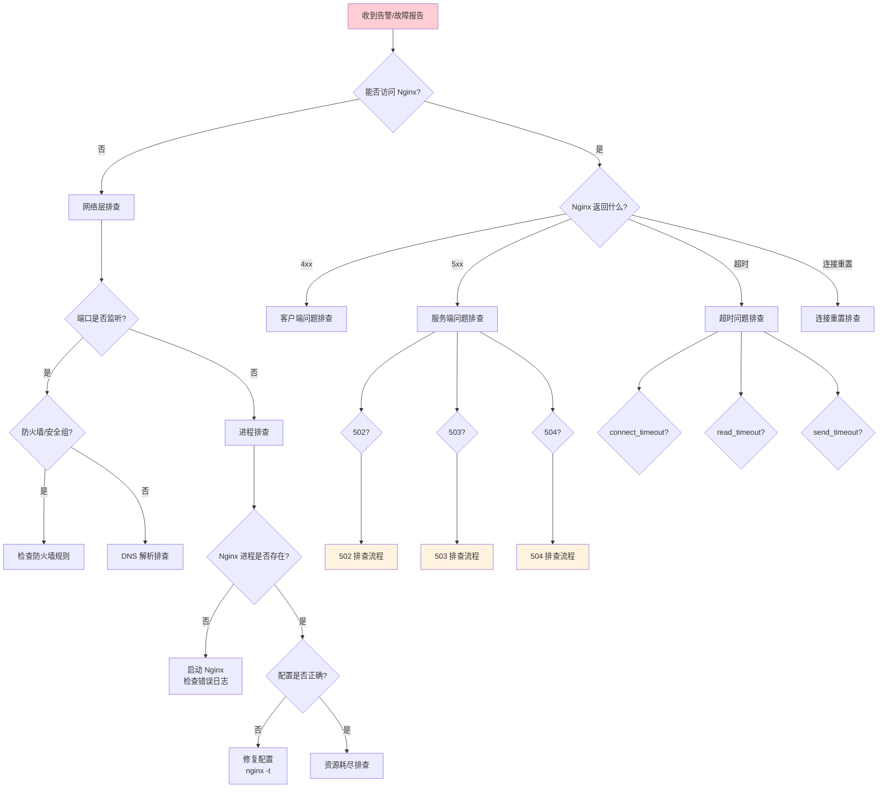
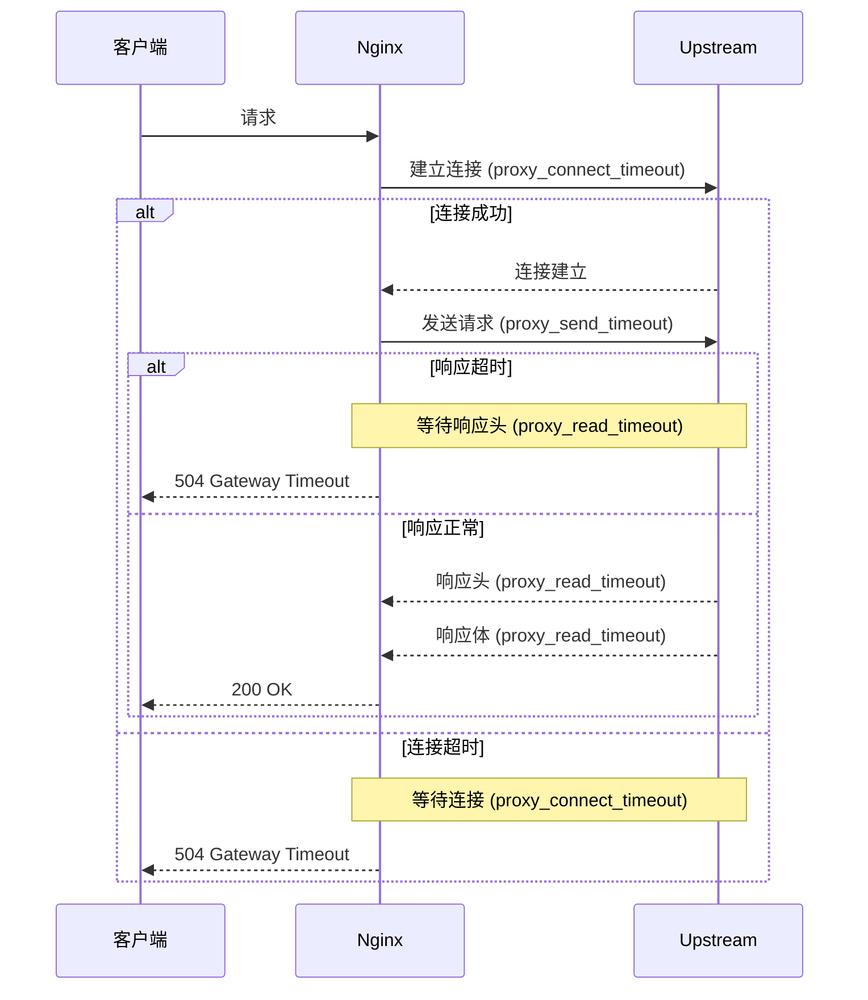

# 故障排查与应急手册

::: important 故障排查的黄金法则
1. **先恢复，后排查**：业务可用性永远优先于根因分析
2. **变更即嫌疑**：最近一次变更是最可能的故障原因
3. **分层排查**：网络 → 系统 → Nginx → 应用，逐层缩小范围
4. **数据驱动**：用日志和指标说话，不要猜测
:::

## 1 故障排查 SOP

### 1.1 排查流程图



### 1.2 一键诊断脚本

```bash
#!/bin/bash
# /usr/local/bin/nginx-diagnose.sh
# Nginx 一键诊断脚本

RED='\033[0;31m'
GREEN='\033[0;32m'
YELLOW='\033[1;33m'
NC='\033[0m'

ok() { echo -e "[${GREEN}OK${NC}] $1"; }
warn() { echo -e "[${YELLOW}WARN${NC}] $1"; }
fail() { echo -e "[${RED}FAIL${NC}] $1"; }

echo "========================================="
echo "  Nginx 诊断报告"
echo "  时间: $(date '+%Y-%m-%d %H:%M:%S')"
echo "  主机: $(hostname)"
echo "========================================="

# 1. 进程检查
echo ""
echo "=== 1. 进程检查 ==="
NGINX_PIDS=$(pgrep nginx | wc -l)
if [ "${NGINX_PIDS}" -gt 0 ]; then
    ok "Nginx 进程运行中 (PID 数: ${NGINX_PIDS})"
    ps aux | grep nginx | grep -v grep
else
    fail "Nginx 进程未运行！"
    echo "尝试查看错误："
    tail -20 /var/log/nginx/error.log
fi

# 2. 端口检查
echo ""
echo "=== 2. 端口检查 ==="
for port in 80 443; do
    if ss -tlnp | grep -q ":${port} "; then
        ok "端口 ${port} 正在监听"
    else
        fail "端口 ${port} 未监听！"
    fi
done

# 3. 配置检查
echo ""
echo "=== 3. 配置检查 ==="
if nginx -t 2>&1; then
    ok "配置语法正确"
else
    fail "配置语法错误！"
fi

# 4. 上游健康检查
echo ""
echo "=== 4. 上游健康检查 ==="
UPSTREAMS=$(grep -rh "server.*:.*;" /etc/nginx/conf.d/ /etc/nginx/sites-enabled/ 2>/dev/null | \
    grep -oP '\d+\.\d+\.\d+\.\d+:\d+' | sort -u)
for upstream in ${UPSTREAMS}; do
    if curl -s -o /dev/null -w '%{http_code}' --max-time 3 "http://${upstream}/healthz" 2>/dev/null | grep -qE "2[0-9]{2}"; then
        ok "上游 ${upstream} 健康"
    else
        fail "上游 ${upstream} 不可达！"
    fi
done

# 5. 资源检查
echo ""
echo "=== 5. 资源检查 ==="
CPU_USAGE=$(top -bn1 | grep "Cpu(s)" | awk '{print $2}')
MEM_USAGE=$(free -m | awk 'NR==2{printf "%.1f%%", $3/$2*100}')
DISK_USAGE=$(df -h /var/log/nginx | awk 'NR==2{print $5}')
FD_USAGE=$(cat /proc/$(cat /var/run/nginx.pid 2>/dev/null || echo 1)/limits 2>/dev/null | grep "open files" | awk '{print $7" / "$8}')

echo "CPU 使用率: ${CPU_USAGE}%"
echo "内存使用率: ${MEM_USAGE}"
echo "磁盘使用率: ${DISK_USAGE}"
echo "文件描述符: ${FD_USAGE:-无法获取}"

# 6. 连接状态
echo ""
echo "=== 6. 连接状态 ==="
if curl -s http://127.0.0.1:8080/stub_status 2>/dev/null; then
    echo ""
else
    warn "无法获取 stub_status"
fi

# 7. 最近错误
echo ""
echo "=== 7. 最近错误日志 ==="
tail -20 /var/log/nginx/error.log 2>/dev/null || warn "无法读取错误日志"

# 8. 最近 5xx
echo ""
echo "=== 8. 最近 5xx 请求 ==="
grep ' 5[0-9][0-9] ' /var/log/nginx/access.log 2>/dev/null | tail -10 || warn "无 5xx 请求"

echo ""
echo "========================================="
echo "  诊断完成"
echo "========================================="
```

## 2 502 Bad Gateway 排查

### 2.1 502 错误产生机制

Nginx 返回 502 Bad Gateway 表示 Nginx 作为代理服务器，无法从上游服务器获取有效响应。常见原因：

| 原因 | 表现 | 排查方向 |
|------|------|---------|
| upstream 不可用 | 连接被拒绝 | 检查上游服务是否运行 |
| upstream 进程崩溃 | 连接重置 | 检查应用日志 |
| upstream 超时 | 连接超时 | 检查 `proxy_connect_timeout` |
| upstream 返回无效响应 | 协议错误 | 检查响应头格式 |
| Nginx 到 upstream 网络不通 | 连接失败 | 检查网络/防火墙 |

### 2.2 502 排查步骤

```bash
#!/bin/bash
# 502 Bad Gateway 排查脚本

echo "===== 502 Bad Gateway 排查 ====="

# 步骤 1：确认 502 错误
echo ""
echo "步骤 1: 确认 502 错误"
ERROR_COUNT=$(grep ' 502 ' /var/log/nginx/access.log | wc -l)
echo "最近 502 错误数: ${ERROR_COUNT}"
grep ' 502 ' /var/log/nginx/access.log | tail -5

# 步骤 2：检查上游服务
echo ""
echo "步骤 2: 检查上游服务"
UPSTREAMS=$(grep -rh "server.*:.*;" /etc/nginx/conf.d/ 2>/dev/null | \
    grep -oP '\d+\.\d+\.\d+\.\d+:\d+' | sort -u)

for upstream in ${UPSTREAMS}; do
    echo "--- 检查上游: ${upstream} ---"

    # 检查端口是否可达
    if timeout 3 bash -c "echo > /dev/tcp/${upstream%:*}/${upstream#*:}" 2>/dev/null; then
        echo "[OK] 端口可达"
    else
        echo "[FAIL] 端口不可达！"
        # 进一步检查
        host_ip="${upstream%:*}"
        host_port="${upstream#*:}"

        # 检查是否是本机
        if ip addr show | grep -q "${host_ip}"; then
            echo "  本机地址，检查进程..."
            ss -tlnp | grep ":${host_port}" || echo "  [FAIL] 端口未监听"
        else
            echo "  远程地址，检查网络..."
            ping -c 1 -W 2 "${host_ip}" > /dev/null 2>&1 || echo "  [FAIL] IP 不可达"
            traceroute -m 5 "${host_ip}" 2>/dev/null | tail -3
        fi
    fi
done

# 步骤 3：检查 Nginx 错误日志
echo ""
echo "步骤 3: 检查 Nginx 错误日志中的 502 相关信息"
grep -i "502\|upstream\|connect\|refused" /var/log/nginx/error.log | tail -20

# 步骤 4：检查 upstream 配置
echo ""
echo "步骤 4: 检查 upstream 配置"
grep -A 20 "upstream" /etc/nginx/conf.d/*.conf 2>/dev/null

# 步骤 5：检查超时配置
echo ""
echo "步骤 5: 检查超时配置"
grep -E "proxy_connect_timeout|proxy_read_timeout|proxy_send_timeout" \
    /etc/nginx/nginx.conf /etc/nginx/conf.d/*.conf /etc/nginx/sites-enabled/* 2>/dev/null
```

### 2.3 常见 502 场景与修复

**场景 1：upstream 进程崩溃**

```bash
# 检查上游进程
ps aux | grep -E "java|node|python|php-fpm" | grep -v grep

# 如果是 PHP-FPM
systemctl status php-fpm
# 常见原因：pm.max_children 达到上限
# 检查 PHP-FPM 日志
tail -50 /var/log/php-fpm/error.log

# 修复：增加 pm.max_children
# /etc/php-fpm.d/www.conf
# pm.max_children = 50  →  pm.max_children = 100
```

**场景 2：upstream 连接队列满**

```nginx
# 检查 Nginx 错误日志中是否出现：
# "connect() failed (111: Connection refused) while connecting to upstream"

# 原因：upstream 的 backlog 队列已满
# 修复：增加 upstream 的 listen backlog

# 应用侧（如 Node.js）
# app.listen(8080, () => {}, backlog=1024);

# 或在 Nginx 侧增加重试
upstream backend {
    server 10.0.1.10:8080 max_fails=3 fail_timeout=30s;
    server 10.0.1.11:8080 max_fails=3 fail_timeout=30s;
    keepalive 32;
}

server {
    location / {
        proxy_pass http://backend;

        # 增加连接超时和重试
        proxy_connect_timeout 5s;
        proxy_next_upstream error timeout http_502 http_503 http_504;
        proxy_next_upstream_timeout 10s;
        proxy_next_upstream_tries 3;
    }
}
```

::: tip proxy_next_upstream 注意事项
- `proxy_next_upstream` 默认不包含 `http_502`，需要显式声明
- 重试会导致请求处理时间增加
- 非幂等方法（POST/PUT/DELETE）慎用重试，避免重复执行
- 可通过 `proxy_next_upstream_tries` 限制重试次数
:::

**场景 3：upstream 返回无效响应头**

```bash
# 错误日志特征：
# "upstream sent invalid header while reading response header from upstream"

# 直接测试 upstream 响应
curl -v http://10.0.1.10:8080/api/test

# 常见原因：
# 1. upstream 返回了非 HTTP 协议的响应
# 2. 响应头中包含非法字符
# 3. 响应头过大（超过 proxy_buffer_size）

# 修复：增大 proxy_buffer_size
proxy_buffer_size 16k;
```

## 3 504 Gateway Timeout 排查

### 3.1 504 错误产生机制

504 Gateway Timeout 表示 Nginx 在等待上游服务器响应时超时。与 502 不同，502 是连接失败，504 是连接成功但响应超时。



### 3.2 504 排查步骤

```bash
#!/bin/bash
# 504 Gateway Timeout 排查脚本

echo "===== 504 Gateway Timeout 排查 ====="

# 步骤 1：统计 504 错误
echo ""
echo "步骤 1: 504 错误统计"
TOTAL=$(wc -l < /var/log/nginx/access.log)
F04_COUNT=$(grep ' 504 ' /var/log/nginx/access.log | wc -l)
echo "总请求数: ${TOTAL}"
echo "504 请求数: ${F04_COUNT}"
echo "504 比例: $(echo "scale=4; ${F04_COUNT}/${TOTAL}*100" | bc)%"

# 步骤 2：分析慢请求
echo ""
echo "步骤 2: 慢请求分析（响应时间 > 60s）"
grep ' 504 ' /var/log/nginx/access.log | \
    awk -F'rt=' '{print $2}' | awk '{print $1}' | \
    sort -rn | head -10

# 步骤 3：分析 504 集中的 URL
echo ""
echo "步骤 3: 504 集中的 URL Top 10"
grep ' 504 ' /var/log/nginx/access.log | \
    awk '{print $7}' | sort | uniq -c | sort -rn | head -10

# 步骤 4：检查 upstream 响应时间
echo ""
echo "步骤 4: upstream 响应时间分析"
# 使用增强日志格式中的 urt 字段
grep ' 504 ' /var/log/nginx/access.log | \
    awk -F'urt=' '{print $2}' | awk '{print $1}' | \
    sort -rn | head -10

# 步骤 5：检查超时配置
echo ""
echo "步骤 5: 当前超时配置"
grep -E "proxy_connect_timeout|proxy_read_timeout|proxy_send_timeout" \
    /etc/nginx/nginx.conf /etc/nginx/conf.d/*.conf /etc/nginx/sites-enabled/* 2>/dev/null

# 步骤 6：直接测试 upstream 响应时间
echo ""
echo "步骤 6: 直接测试 upstream 响应时间"
for upstream in $(grep -rh "server.*:.*;" /etc/nginx/conf.d/ 2>/dev/null | \
    grep -oP '\d+\.\d+\.\d+\.\d+:\d+' | sort -u); do
    result=$(curl -s -o /dev/null -w '%{time_total}s (HTTP %{http_code})' \
        --max-time 120 "http://${upstream}/healthz" 2>/dev/null || echo "超时")
    echo "  ${upstream}: ${result}"
done
```

### 3.3 504 常见场景与修复

**场景 1：upstream 处理慢**

```nginx
# 排查方向：
# 1. 检查 upstream 日志，确认是否有慢查询
# 2. 检查 upstream CPU/内存使用
# 3. 检查数据库是否慢查询

# 临时修复：增加 proxy_read_timeout
location /api/ {
    proxy_pass http://backend;
    proxy_read_timeout 300s;    # 从默认 60s 增加到 300s
    proxy_connect_timeout 10s;
}

# 根本修复：优化 upstream 性能
# 1. 数据库索引优化
# 2. 添加缓存层
# 3. 异步处理耗时操作
```

**场景 2：upstream 连接池耗尽**

```nginx
# 排查方向：
# 1. 检查 upstream 连接数
# 2. 检查 upstream 是否有连接泄漏

# 修复：启用 Nginx 到 upstream 的 Keep-Alive
upstream backend {
    server 10.0.1.10:8080;
    server 10.0.1.11:8080;
    keepalive 64;    # 保持 64 个空闲长连接
}

server {
    location / {
        proxy_pass http://backend;
        proxy_http_version 1.1;
        proxy_set_header Connection "";
    }
}
```

## 4 499 Client Closed Request 分析

### 4.1 499 的含义

499 是 Nginx 自定义状态码，表示客户端在 Nginx 返回响应之前关闭了连接（主动断开）。这通常意味着：

- 客户端（浏览器/APP）等不及，主动取消了请求
- 前端设置了较短的超时时间
- 网络不稳定导致连接中断

### 4.2 499 排查

```bash
# 统计 499 请求数
grep ' 499 ' /var/log/nginx/access.log | wc -l

# 499 集中的 URL
grep ' 499 ' /var/log/nginx/access.log | awk '{print $7}' | sort | uniq -c | sort -rn | head -10

# 499 请求的响应时间分布
grep ' 499 ' /var/log/nginx/access.log | awk -F'rt=' '{print $2}' | awk '{print $1}' | \
    awk '{if($1<1)a++;else if($1<5)b++;else c++} END{print "<1s:"a, "1-5s:"b, ">5s:"c}'

# 对比 499 和正常请求的响应时间
echo "499 请求平均响应时间:"
grep ' 499 ' /var/log/nginx/access.log | awk -F'rt=' '{sum+=$2; n++} END{print sum/n "s"}'

echo "正常请求平均响应时间:"
grep -v ' 499 ' /var/log/nginx/access.log | awk -F'rt=' '{sum+=$2; n++} END{print sum/n "s"}'
```

### 4.3 499 处理策略

```nginx
# 策略 1：即使客户端断开，仍继续处理请求（适用于写操作）
location /api/write {
    proxy_pass http://backend;
    proxy_ignore_client_abort on;    # 忽略客户端断开
}

# 策略 2：快速返回，减少客户端等待
location /api/ {
    proxy_pass http://backend;

    # 缩短超时时间，快速失败
    proxy_connect_timeout 3s;
    proxy_read_timeout 30s;

    # 启用缓冲，快速接收 upstream 响应
    proxy_buffering on;
    proxy_buffer_size 8k;
    proxy_buffers 8 8k;
}

# 策略 3：针对慢接口特殊处理
location /api/export {
    proxy_pass http://backend;
    proxy_read_timeout 300s;

    # 增大客户端超时
    proxy_send_timeout 300s;
    client_body_timeout 300s;
}
```

::: warning proxy_ignore_client_abort 风险
`proxy_ignore_client_abort on` 会导致 Nginx 忽略客户端断开，继续等待 upstream 响应。这会：
1. 占用 Worker 连接资源
2. upstream 继续处理已无意义的请求
3. 可能导致连接堆积

仅在写操作等场景谨慎使用，读操作不建议开启。
:::

## 5 连接超时排查

### 5.1 三种超时详解

| 超时指令 | 阶段 | 默认值 | 含义 |
|---------|------|--------|------|
| `proxy_connect_timeout` | TCP 连接建立 | 60s | Nginx 与 upstream 建立 TCP 连接的超时 |
| `proxy_send_timeout` | 发送请求 | 60s | Nginx 向 upstream 发送请求的超时（两次写操作间隔） |
| `proxy_read_timeout` | 接收响应 | 60s | Nginx 从 upstream 读取响应的超时（两次读操作间隔） |

### 5.2 超时排查流程

```bash
#!/bin/bash
# 连接超时排查脚本

echo "===== 连接超时排查 ====="

# 1. 测试 TCP 连接时间
echo ""
echo "--- TCP 连接时间 ---"
UPSTREAMS=$(grep -rh "server.*:.*;" /etc/nginx/conf.d/ 2>/dev/null | \
    grep -oP '\d+\.\d+\.\d+\.\d+:\d+' | sort -u)

for upstream in ${UPSTREAMS}; do
    connect_time=$(curl -s -o /dev/null -w '%{time_connect}' \
        --max-time 5 "http://${upstream}/" 2>/dev/null || echo "FAIL")
    echo "  ${upstream}: connect=${connect_time}s"
done

# 2. 测试首字节时间 (TTFB)
echo ""
echo "--- 首字节时间 (TTFB) ---"
for upstream in ${UPSTREAMS}; do
    ttfb=$(curl -s -o /dev/null -w '%{time_starttransfer}' \
        --max-time 30 "http://${upstream}/healthz" 2>/dev/null || echo "FAIL")
    echo "  ${upstream}: ttfb=${ttfb}s"
done

# 3. 检查当前超时配置
echo ""
echo "--- 当前超时配置 ---"
grep -E "proxy_connect_timeout|proxy_read_timeout|proxy_send_timeout|keepalive_timeout|client_body_timeout|client_header_timeout|send_timeout" \
    /etc/nginx/nginx.conf /etc/nginx/conf.d/*.conf /etc/nginx/sites-enabled/* 2>/dev/null | \
    grep -v "^#" | sort

# 4. 分析超时相关错误
echo ""
echo "--- 超时相关错误 ---"
grep -i "timeout\|timed out" /var/log/nginx/error.log | tail -20

# 5. 检查系统 TCP 连接状态
echo ""
echo "--- TCP 连接状态 ---"
ss -ant | awk 'NR>1 {print $1}' | sort | uniq -c | sort -rn
```

### 5.3 超时配置最佳实践

```nginx
# 不同场景的超时推荐配置

# 快速 API（响应时间 < 1s）
location /api/fast/ {
    proxy_pass http://backend;
    proxy_connect_timeout 3s;
    proxy_read_timeout 5s;
    proxy_send_timeout 3s;
}

# 普通 API（响应时间 1-10s）
location /api/ {
    proxy_pass http://backend;
    proxy_connect_timeout 5s;
    proxy_read_timeout 30s;
    proxy_send_timeout 10s;
}

# 慢接口（导出/报表，响应时间可能很长）
location /api/export/ {
    proxy_pass http://backend;
    proxy_connect_timeout 10s;
    proxy_read_timeout 300s;
    proxy_send_timeout 30s;
}

# SSE/长轮询（需要持续保持连接）
location /api/stream/ {
    proxy_pass http://backend;
    proxy_connect_timeout 5s;
    proxy_read_timeout 3600s;     # 1 小时
    proxy_send_timeout 30s;
    proxy_buffering off;           # 关闭缓冲
}
```

## 6 内存泄漏排查

### 6.1 内存泄漏迹象

- Worker 进程的 RSS（常驻内存集）持续增长
- 系统可用内存持续减少
- 出现 OOM Killer 日志
- Worker 进程被杀后重启，内存短暂恢复正常

### 6.2 内存排查步骤

```bash
#!/bin/bash
# Nginx 内存排查脚本

echo "===== Nginx 内存排查 ====="

# 1. 查看进程内存使用
echo ""
echo "--- Nginx 进程内存 ---"
ps aux | grep nginx | grep -v grep | awk '{printf "PID: %-8s RSS: %-10s MB VSZ: %-10s MB CMD: %s\n", $2, $6/1024, $5/1024, $11}'

# 2. 详细的内存映射
echo ""
echo "--- Master 进程内存映射 ---"
MASTER_PID=$(cat /var/run/nginx.pid 2>/dev/null)
if [ -n "${MASTER_PID}" ]; then
    pmap -x "${MASTER_PID}" | tail -5
fi

echo ""
echo "--- Worker 进程内存映射 ---"
WORKER_PID=$(pgrep -P "${MASTER_PID}" | head -1)
if [ -n "${WORKER_PID}" ]; then
    pmap -x "${WORKER_PID}" | tail -5

    # 共享内存使用
    echo ""
    echo "--- 共享内存段 ---"
    ipcs -m | grep "$(id -u nginx 2>/dev/null || echo 0)"
fi

# 3. 内存增长趋势
echo ""
echo "--- 内存增长趋势（采集 5 个样本，间隔 10 秒）---"
for i in $(seq 1 5); do
    WORKER_PIDS=$(pgrep -P "${MASTER_PID}")
    TOTAL_RSS=0
    for pid in ${WORKER_PIDS}; do
        RSS=$(ps -p "${pid}" -o rss= | awk '{print $1}')
        TOTAL_RSS=$((TOTAL_RSS + RSS))
    done
    echo "样本 ${i}: 总 RSS = $((TOTAL_RSS / 1024)) MB ($(date '+%H:%M:%S'))"
    sleep 10
done

# 4. Nginx 共享内存配置
echo ""
echo "--- 共享内存配置 ---"
grep -E "lua_shared_dict|proxy_cache_path|limit_req_zone|limit_conn_zone|ssl_session_cache|open_file_cache" \
    /etc/nginx/nginx.conf /etc/nginx/conf.d/*.conf /etc/nginx/sites-enabled/* 2>/dev/null

# 5. 系统内存状态
echo ""
echo "--- 系统内存状态 ---"
free -h
cat /proc/meminfo | grep -E "MemTotal|MemFree|MemAvailable|Buffers|Cached|Slab|PageTables"
```

### 6.3 使用 Valgrind 排查

```bash
# Valgrind 可以检测内存泄漏，但会影响性能
# 仅在测试环境使用！

# 1. 停止当前 Nginx
systemctl stop nginx

# 2. 使用 Valgrind 启动 Nginx
valgrind --leak-check=full \
    --show-leak-kinds=all \
    --track-origins=yes \
    --log-file=/tmp/nginx-valgrind.log \
    nginx -g 'daemon off;'

# 3. 发送测试流量
ab -n 1000 -c 10 http://127.0.0.1:80/

# 4. 停止 Nginx 并查看结果
# Ctrl+C 停止 Valgrind
cat /tmp/nginx-valgrind.log | grep -A 20 "LEAK SUMMARY"
```

### 6.4 常见内存泄漏原因与修复

| 原因 | 症状 | 修复方式 |
|------|------|---------|
| Lua 脚本泄漏 | Worker RSS 缓慢增长 | 检查 Lua 全局变量，确保局部变量 |
| 共享字典未清理 | lua_shared_dict 持续增长 | 设置过期时间，定期清理 |
| 第三方模块缺陷 | 特定条件下内存增长 | 升级模块版本，报告 Bug |
| proxy_cache 磁盘满 | 缓存无法淘汰 | 配置 `max_size`，增加磁盘空间 |
| 连接泄漏 | Active connections 增长 | 检查 `keepalive_timeout`，确保上游关闭连接 |

## 7 CPU 飙高排查

### 7.1 CPU 飙高常见原因

- 正则表达式回溯（catastrophic backtracking）
- SSL/TLS 握手密集
- 高 QPS 导致的正常 CPU 消耗
- Worker 进程数量配置不当
- 模块 Bug 导致死循环

### 7.2 CPU 排查步骤

```bash
#!/bin/bash
# Nginx CPU 排查脚本

echo "===== Nginx CPU 排查 ====="

# 1. 确认 CPU 使用情况
echo ""
echo "--- Nginx 进程 CPU 使用 ---"
ps -eo pid,ppid,%cpu,%mem,comm | grep nginx | sort -k3 -rn

# 2. 检查系统整体 CPU
echo ""
echo "--- 系统 CPU 使用 ---"
top -bn1 | head -5

# 3. 找出最耗 CPU 的 Worker
echo ""
echo "--- 最耗 CPU 的 Worker ---"
TOP_WORKER=$(ps -eo pid,ppid,%cpu,comm | grep "nginx: worker" | sort -k3 -rn | head -1)
echo "${TOP_WORKER}"
TOP_PID=$(echo "${TOP_WORKER}" | awk '{print $1}')

# 4. 系统调用分析
if [ -n "${TOP_PID}" ]; then
    echo ""
    echo "--- 系统调用分析 (strace, 5 秒) ---"
    timeout 5 strace -c -p "${TOP_PID}" 2>&1 | tail -20
fi

# 5. 热点函数分析
if [ -n "${TOP_PID}" ]; then
    echo ""
    echo "--- 热点函数分析 (perf, 10 秒) ---"
    timeout 10 perf top -p "${TOP_PID}" 2>&1 | head -30
fi

# 6. 检查正则表达式配置
echo ""
echo "--- 正则表达式配置 ---"
grep -rn "rewrite\|if\s*(\$)\|map\s*\$\|~\s*/" \
    /etc/nginx/ 2>/dev/null | grep -v ".default" | head -20

# 7. 检查 SSL 会话
echo ""
echo "--- SSL 会话统计 ---"
grep -c "SSL" /var/log/nginx/access.log 2>/dev/null || echo "0"
echo "SSL 握手错误:"
grep -c "SSL_do_handshake\|ssl handshake" /var/log/nginx/error.log 2>/dev/null || echo "0"
```

### 7.3 火焰图生成

```bash
#!/bin/bash
# /usr/local/bin/nginx-flamegraph.sh
# 生成 Nginx Worker 进程火焰图

# 安装依赖
# yum install -y perf
# git clone https://github.com/brendangregg/FlameGraph /opt/FlameGraph

WORKER_PID=${1:-$(pgrep -P $(cat /var/run/nginx.pid) | head -1)}
DURATION=${2:-30}  # 采样秒数
OUTPUT_DIR="/tmp/flamegraph"

mkdir -p "${OUTPUT_DIR}"

echo "采样 Worker PID: ${WORKER_PID}，时长: ${DURATION}s"

# 1. 使用 perf 采集
echo "正在采集性能数据..."
perf record -F 99 -p "${WORKER_PID}" -g -- sleep "${DURATION}"

# 2. 生成折叠栈
echo "生成折叠栈..."
perf script | /opt/FlameGraph/stackcollapse-perf.pl > "${OUTPUT_DIR}/nginx-perf.stacks-folded"

# 3. 生成火焰图
echo "生成火焰图..."
/opt/FlameGraph/flamegraph.pl "${OUTPUT_DIR}/nginx-perf.stacks-folded" > "${OUTPUT_DIR}/nginx-flamegraph.svg"

echo "火焰图已生成: ${OUTPUT_DIR}/nginx-flamegraph.svg"
echo "使用浏览器打开该文件查看"
```

### 7.4 正则表达式回溯修复

```nginx
# 危险：贪婪匹配可能导致回溯爆炸
# 当 URI 很长且不匹配时，正则引擎会尝试大量回溯
location ~* /api/(.*)/detail {
    proxy_pass http://backend;
}

# 安全：使用更精确的匹配
location ~* /api/[a-zA-Z0-9_-]+/detail {
    proxy_pass http://backend;
}

# 危险：嵌套量词
rewrite ^/path/(.*)/(.*)/(.*)$ /new-path/$1/$2/$3 last;

# 安全：限制匹配范围
rewrite ^/path/([a-z]+)/([0-9]+)/([a-z]+)/?$ /new-path/$1/$2/$3 last;

# 最佳实践：使用 PCRE 回溯限制
pcre_jit on;           # 启用 JIT 编译加速正则
# 在编译时启用 pcre2 的回溯限制
# ./configure --with-pcre-jit ...
```

::: important 正则表达式安全
1. 避免使用 `.*` 匹配不确定长度的字符串
2. 使用字符类 `[a-zA-Z0-9]+` 替代 `.+`
3. 启用 `pcre_jit on` 加速正则执行
4. 考虑用 `location =` 精确匹配替代正则
5. 复杂路由规则优先使用 `map` 指令
:::

## 8 配置语法错误快速修复

### 8.1 常见语法错误

```bash
# 1. 检查配置
nginx -t

# 常见错误及修复：

# 错误 1: 指令拼写错误
# nginx: [emerg] unknown directive "proxy_pas"
# 修复：proxy_pas → proxy_pass

# 错误 2: 缺少分号
# nginx: [emerg] unexpected "}"
# 修复：在 } 前一行末尾添加 ;

# 错误 3: 大括号不匹配
# nginx: [emerg] unexpected end of file
# 修复：检查大括号匹配

# 错误 4: 指令位置错误
# nginx: [emerg] "proxy_pass" directive is not allowed here
# 修复：proxy_pass 只能出现在 location 中

# 错误 5: 变量未定义
# nginx: [warn] unknown variable "$custom_var"
# 修复：先使用 set 或 map 定义变量

# 错误 6: 端口冲突
# nginx: [emerg] bind() to 0.0.0.0:80 failed (98: Address already in use)
# 修复：检查端口占用 ss -tlnp | grep :80
```

### 8.2 配置语法自动修复脚本

```bash
#!/bin/bash
# /usr/local/bin/nginx-fix-config.sh
# 常见配置错误自动修复

CONF_DIR="/etc/nginx"

echo "===== Nginx 配置自动修复 ====="

# 1. 检查语法
echo "检查配置语法..."
ERRORS=$(nginx -t 2>&1)
echo "${ERRORS}"

if echo "${ERRORS}" | grep -q "syntax is ok"; then
    echo "配置语法正确，无需修复"
    exit 0
fi

# 2. 常见修复

# 修复 1：缺少分号
echo ""
echo "检查缺少分号的行..."
find "${CONF_DIR}" -name "*.conf" -exec grep -n "^[^#].*[^;{}]$" {} \; 2>/dev/null | \
    grep -v "^[^:]*:[0-9]*:.*#" | head -10

# 修复 2：端口冲突检查
echo ""
echo "检查端口冲突..."
PORTS=$(grep -rh "listen" "${CONF_DIR}" 2>/dev/null | \
    grep -oP ':\d+' | sort | uniq -c | sort -rn)
echo "${PORTS}"
DUPLICATE=$(echo "${PORTS}" | awk '$1 > 1 {print $2}')
if [ -n "${DUPLICATE}" ]; then
    echo "警告：以下端口有重复监听: ${DUPLICATE}"
fi

# 修复 3：检查 include 文件是否存在
echo ""
echo "检查 include 文件..."
grep -rh "include" "${CONF_DIR}" 2>/dev/null | \
    awk '{print $2}' | tr -d ';' | while read inc; do
        if [ ! -f "${CONF_DIR}/${inc}" ] && [ ! -d "$(dirname "${CONF_DIR}/${inc}")" ]; then
            echo "缺失 include 文件: ${inc}"
        fi
    done

# 修复 4：检查 SSL 证书文件
echo ""
echo "检查 SSL 证书..."
grep -rh "ssl_certificate" "${CONF_DIR}" 2>/dev/null | \
    awk '{print $2}' | tr -d ';' | while read cert; do
        if [ ! -f "${cert}" ]; then
            echo "缺失 SSL 证书: ${cert}"
        else
            # 检查是否过期
            expiry=$(openssl x509 -enddate -noout -in "${cert}" 2>/dev/null | cut -d= -f2)
            if [ -n "${expiry}" ]; then
                expiry_epoch=$(date -d "${expiry}" +%s 2>/dev/null || echo 0)
                now_epoch=$(date +%s)
                days_left=$(( (expiry_epoch - now_epoch) / 86400 ))
                if [ ${days_left} -lt 30 ]; then
                    echo "SSL 证书即将过期: ${cert} (剩余 ${days_left} 天)"
                fi
            fi
        fi
    done

echo ""
echo "修复完成。请手动确认修复项后运行: nginx -t && nginx -s reload"
```

## 9 日志分析技巧

### 9.1 awk 实战

```bash
# 1. 统计各状态码数量
awk '{print $9}' /var/log/nginx/access.log | sort | uniq -c | sort -rn

# 2. 统计各 URL 的平均响应时间
awk -F'rt=' '{split($2,a," "); print $7, a[1]}' /var/log/nginx/access.log | \
    awk '{url=$1; rt=$2; sum[url]+=rt; count[url]++} END {for(u in sum) printf "%s avg=%.3fs count=%d\n", u, sum[u]/count[u], count[u]}' | \
    sort -t= -k2 -rn | head -20

# 3. 统计每分钟 QPS
awk '{print $4}' /var/log/nginx/access.log | cut -d: -f1-2 | uniq -c

# 4. 统计各 IP 的请求量
awk '{print $1}' /var/log/nginx/access.log | sort | uniq -c | sort -rn | head -20

# 5. 提取 5xx 错误并格式化
awk '$9 ~ /^5/ {printf "%s %s %s %s\n", $1, $4, $7, $9}' /var/log/nginx/access.log | tail -50

# 6. 统计上游延迟分布（需要增强日志格式）
awk -F'urt=' '{split($2,a," "); rt=a[1]+0;
    if(rt<0.1) fast++;
    else if(rt<0.5) normal++;
    else if(rt<1) slow++;
    else very_slow++;
    total++
} END {
    printf "Total: %d\n<100ms: %d (%.1f%%)\n100-500ms: %d (%.1f%%)\n500ms-1s: %d (%.1f%%)\n>1s: %d (%.1f%%)\n",
    total, fast, fast/total*100, normal, normal/total*100, slow, slow/total*100, very_slow, very_slow/total*100
}' /var/log/nginx/access.log

# 7. 统计各 User-Agent 分布
awk -F'"' '{print $6}' /var/log/nginx/access.log | sort | uniq -c | sort -rn | head -10

# 8. 计算带宽消耗
awk '{total+=$10} END {printf "Total: %.2f GB\n", total/1024/1024/1024}' /var/log/nginx/access.log
```

### 9.2 sed 实战

```bash
# 1. 提取特定时间段的日志
sed -n '/05\/Jun\/2026:10:00/,/05\/Jun\/2026:11:00/p' /var/log/nginx/access.log

# 2. 替换日志中的敏感 IP（脱敏处理）
sed -E 's/[0-9]+\.[0-9]+\.[0-9]+\.[0-9]+/XXX.XXX.XXX.XXX/g' /var/log/nginx/access.log > /tmp/anonymized.log

# 3. 删除空行
sed -i '/^$/d' /var/log/nginx/access.log

# 4. 提取错误日志中的关键信息
sed -n '/error/p' /var/log/nginx/error.log | tail -50
```

### 9.3 grep 实战

```bash
# 1. 搜索特定 URL 的所有请求
grep '/api/v1/users' /var/log/nginx/access.log

# 2. 搜索 5xx 错误
grep ' 5[0-9][0-9] ' /var/log/nginx/access.log

# 3. 搜索特定 IP 的请求
grep '10\.0\.1\.100' /var/log/nginx/access.log

# 4. 搜索慢请求（响应时间 > 1s）
grep -E 'rt=[0-9]+\.[0-9]*[1-9]' /var/log/nginx/access.log | \
    awk -F'rt=' '{split($2,a," "); if(a[1]+0 > 1) print}'

# 5. 搜索 upstream 超时错误
grep -i 'upstream timed out' /var/log/nginx/error.log

# 6. 搜索连接重置错误
grep -i 'connection reset\|broken pipe\|reset by peer' /var/log/nginx/error.log

# 7. 统计各错误类型数量
grep -oP '\[error\].*?(?=:)' /var/log/nginx/error.log | sort | uniq -c | sort -rn | head -20

# 8. 搜索特定请求 ID（链路追踪）
grep 'a1b2c3d4e5f6' /var/log/nginx/access.log
```

### 9.4 综合分析脚本

```bash
#!/bin/bash
# /usr/local/bin/nginx-log-analysis.sh
# Nginx 日志综合分析工具

LOG="${1:-/var/log/nginx/access.log}"
LINES="${2:-100000}"

echo "===== Nginx 日志分析 ====="
echo "日志文件: ${LOG}"
echo "分析行数: ${LINES}"
echo "时间范围: $(head -1 ${LOG} | awk '{print $4}') - $(tail -1 ${LOG} | awk '{print $4}')"
echo ""

# 总览
echo "=== 总览 ==="
TOTAL=$(tail -${LINES} "${LOG}" | wc -l)
echo "总请求数: ${TOTAL}"

# 状态码分布
echo ""
echo "=== 状态码分布 ==="
tail -${LINES} "${LOG}" | awk '{print $9}' | sort | uniq -c | sort -rn | \
    awk '{printf "  %s: %d (%.2f%%)\n", $2, $1, $1/'${TOTAL}'*100}'

# Top 10 URL
echo ""
echo "=== Top 10 URL ==="
tail -${LINES} "${LOG}" | awk '{print $7}' | sort | uniq -c | sort -rn | head -10

# Top 10 IP
echo ""
echo "=== Top 10 IP ==="
tail -${LINES} "${LOG}" | awk '{print $1}' | sort | uniq -c | sort -rn | head -10

# 慢请求 Top 10
echo ""
echo "=== 慢请求 Top 10 ==="
tail -${LINES} "${LOG}" | awk -F'rt=' '{split($2,a," "); print a[1], $0}' | \
    sort -rn | head -10 | awk '{$1=""; print}'

# 每小时 QPS
echo ""
echo "=== 每小时 QPS ==="
tail -${LINES} "${LOG}" | awk '{print $4}' | cut -d: -f1-2 | sort | uniq -c | \
    awk '{printf "  %s: %d req\n", $2, $1}'

# 上游延迟分布
echo ""
echo "=== 上游延迟分布 ==="
tail -${LINES} "${LOG}" | awk -F'urt=' '{
    split($2,a," "); rt=a[1]+0;
    if(rt<0.05) a1++;
    else if(rt<0.1) a2++;
    else if(rt<0.5) a3++;
    else if(rt<1) a4++;
    else a5++;
    total++
} END {
    if(total>0) {
        printf "  <50ms:  %d (%.1f%%)\n", a1, a1/total*100
        printf "  50-100ms: %d (%.1f%%)\n", a2, a2/total*100
        printf "  100-500ms: %d (%.1f%%)\n", a3, a3/total*100
        printf "  500ms-1s: %d (%.1f%%)\n", a4, a4/total*100
        printf "  >1s:    %d (%.1f%%)\n", a5, a5/total*100
    }
}'
```

## 10 应急操作手册

### 10.1 限流降级

```nginx
# 应急限流配置
# /etc/nginx/conf.d/emergency-ratelimit.conf

# 定义限流区域
limit_req_zone $binary_remote_addr zone=emergency:100m rate=10r/s;
limit_req_zone $binary_remote_addr zone=api_emergency:50m rate=5r/s;
limit_conn_zone $binary_remote_addr zone=conn_emergency:50m;

# 应用限流
server {
    listen 80;

    # 全局限流
    limit_req zone=emergency burst=20 nodelay;
    limit_conn conn_emergency 20;

    # API 限流
    location /api/ {
        limit_req zone=api_emergency burst=10 nodelay;
        limit_conn conn_emergency 10;
        proxy_pass http://backend;
    }

    # 静态资源不限流
    location /static/ {
        limit_req off;
        alias /var/www/static/;
    }
}
```

```bash
# 一键启用限流
nginx-emergency.sh ratelimit

# 自定义限流参数
cat > /etc/nginx/conf.d/emergency-ratelimit.conf << 'EOF'
limit_req_zone $binary_remote_addr zone=emergency:100m rate=RATEr/s;

server {
    listen 80;
    limit_req zone=emergency burst=BURST nodelay;
    location / {
        proxy_pass http://backend;
    }
}
EOF

# 替换参数
sed -i 's/RATE/10/g; s/BURST/20/g' /etc/nginx/conf.d/emergency-ratelimit.conf
nginx -t && nginx -s reload
```

### 10.2 摘除节点

```bash
# 方式 1：标记为 down（优雅摘除）
# 修改 upstream 配置
sed -i 's/server 10.0.1.10:8080/server 10.0.1.10:8080 down/' /etc/nginx/conf.d/upstream.conf
nginx -t && nginx -s reload

# 方式 2：通过 NGINX Plus API 动态摘除
curl -X PATCH http://127.0.0.1:8080/api/6/http/upstreams/backend/servers/0 \
    -H "Content-Type: application/json" \
    -d '{"drain":true}'

# 方式 3：通过 iptables 阻断
iptables -A OUTPUT -d 10.0.1.10 -j DROP

# 方式 4：修改 DNS 解析
# 将故障节点从 DNS 中移除
```

### 10.3 紧急扩容

```bash
# 1. 添加上游服务器
echo "    server 10.0.1.20:8080 weight=1 max_fails=3 fail_timeout=30s;" >> \
    /etc/nginx/conf.d/upstream-backend.conf
nginx -t && nginx -s reload

# 2. 增加 Worker 连接数
sed -i 's/worker_connections 65535/worker_connections 100000/' /etc/nginx/nginx.conf
nginx -t && nginx -s reload

# 3. 增加系统文件描述符限制
ulimit -n 200000
sysctl -w fs.file-max=2000000

# 4. 启动新 Nginx 实例（多端口）
cp /etc/nginx/nginx.conf /etc/nginx/nginx-8080.conf
# 修改 listen 端口
sed -i 's/listen 80/listen 8080/' /etc/nginx/nginx-8080.conf
nginx -c /etc/nginx/nginx-8080.conf
```

## 11 故障复盘模板

### 11.1 复盘文档模板

```markdown
# 故障复盘报告

## 基本信息
- 故障编号: INC-YYYY-XXXX
- 故障时间: YYYY-MM-DD HH:MM ~ HH:MM (持续 X 分钟)
- 影响范围: [描述受影响的服务/用户]
- 影响程度: P0/P1/P2/P3
- 值班人员: [姓名]
- 复盘时间: YYYY-MM-DD

## 故障时间线
| 时间 | 事件 | 操作人 |
|------|------|--------|
| HH:MM | 告警触发 | 系统 |
| HH:MM | 开始排查 | [姓名] |
| HH:MM | 定位原因 | [姓名] |
| HH:MM | 实施修复 | [姓名] |
| HH:MM | 服务恢复 | [姓名] |

## 根因分析
### 直接原因
[描述导致故障的直接技术原因]

### 根本原因
[描述导致直接原因的深层问题，如配置错误、流程缺失等]

### 5-Why 分析
1. 为什么出现故障？
2. 为什么会出现上述原因？
3. 为什么没有更早发现？
4. 为什么防护措施没起作用？
5. 为什么没有建立更好的防护？

## 影响评估
- 受影响用户数: [估算]
- 请求失败数: [统计]
- 业务损失: [估算]

## 改进措施
| # | 措施 | 负责人 | 截止时间 | 状态 |
|---|------|--------|---------|------|
| 1 | [具体措施] | [姓名] | [日期] | [状态] |

## 经验总结
### 做得好的
- [值得保持的做法]

### 需要改进的
- [需要改进的地方]

### 知识分享
- [需要分享的技术知识]
```

### 11.2 故障复盘检查清单

| # | 检查项 | 状态 |
|---|--------|------|
| 1 | 故障时间线是否完整 | [ ] |
| 2 | 根因是否确认（非推测） | [ ] |
| 3 | 是否分析了监控数据 | [ ] |
| 4 | 是否分析了日志 | [ ] |
| 5 | 是否分析了代码/配置变更 | [ ] |
| 6 | 改进措施是否具体可执行 | [ ] |
| 7 | 是否有对应的 JIRA/工单 | [ ] |
| 8 | 是否更新了监控/告警 | [ ] |
| 9 | 是否更新了文档/SOP | [ ] |
| 10 | 是否在团队内分享 | [ ] |

## 12 参考资源

- [Nginx 官方文档 - 错误码](https://nginx.org/en/docs/http/ngx_http_proxy_module.html#proxy_intercept_errors)
- [Nginx 官方文档 - 调试日志](https://nginx.org/en/docs/debugging_log.html)
- [Nginx 官方文档 - 信号控制](https://nginx.org/en/docs/control.html)
- [Nginx 官方文档 - 请求处理](https://nginx.org/en/docs/http/request_processing.html)
- [Brendan Gregg - Linux 性能分析](https://www.brendangregg.com/linuxperf.html)
- [FlameGraph 工具](https://github.com/brendangregg/FlameGraph)
