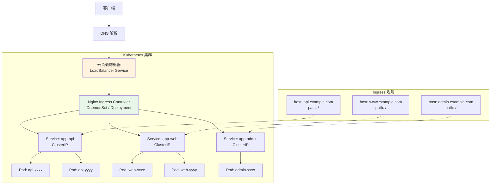

# 容器化部署与 Kubernetes Ingress

::: important 容器化是现代部署的基石
Nginx 在容器化环境中有着广泛的应用：从 Docker 单机部署到 Kubernetes Ingress Controller，Nginx 是云原生流量管理的事实标准。掌握 Nginx 的容器化部署是现代运维的必备技能。
:::

## 1 Nginx Docker 镜像选型与优化

### 1.1 官方镜像对比

| 镜像 | 基础镜像 | 大小 | 适用场景 |
|------|---------|------|---------|
| `nginx:1.25` | Debian | ~190MB | 通用场景，含包管理器 |
| `nginx:1.25-alpine` | Alpine | ~40MB | 生产环境首选，体积小 |
| `nginx:1.25-slim` | Debian-slim | ~90MB | 平衡体积和兼容性 |
| `nginxinc/nginx-unprivileged` | Alpine | ~40MB | 安全场景，非 root 运行 |

::: tip 镜像选型建议
- **生产环境**：推荐 `nginx:1.25-alpine`，体积小、攻击面小
- **需要调试工具**：使用 Debian 基础镜像，内置 bash/curl 等工具
- **安全合规要求**：使用 `nginx-unprivileged` 镜像，以非 root 用户运行
- **始终指定版本号**：避免使用 `latest` 标签，确保可重复构建
:::

### 1.2 容器部署架构图

```mermaid
graph TB
    subgraph Docker Host
        subgraph Nginx Container
            NG[Nginx Master<br/>PID 1]
            WK1[Worker 1]
            WK2[Worker 2]
            NG --> WK1
            NG --> WK2
        end

        subgraph Volumes
            CONF[/etc/nginx<br/>配置文件]
            LOG[/var/log/nginx<br/>日志]
            CACHE[/var/cache/nginx<br/>缓存]
            HTML[/usr/share/nginx/html<br/>静态文件]
        end

        CONF -.->|挂载| NG
        LOG -.->|挂载| NG
        CACHE -.->|挂载| NG
        HTML -.->|挂载| NG
    end

    CLIENT[客户端] -->|80/443| NG
    NG -->|proxy_pass| APP1[应用容器 1<br/>:8080]
    NG -->|proxy_pass| APP2[应用容器 2<br/>:8081]

    style NG fill:#e8f5e9
    style CONF fill:#e3f2fd
    style LOG fill:#fff3e0
```

### 1.3 生产级 Dockerfile

```dockerfile
# Dockerfile - 生产级 Nginx 镜像
# 多阶段构建：构建阶段 + 运行阶段

# ===== 阶段 1：构建阶段 =====
FROM nginx:1.25-alpine AS builder

# 安装构建依赖
RUN apk add --no-cache \
    build-base \
    pcre-dev \
    zlib-dev \
    openssl-dev \
    linux-headers \
    curl \
    git

# 编译第三方模块（示例：ngx_brotli 压缩模块）
ARG NGINX_VERSION=1.25.4
RUN cd /usr/local/src && \
    curl -fSL https://nginx.org/download/nginx-${NGINX_VERSION}.tar.gz -o nginx.tar.gz && \
    tar xzf nginx.tar.gz && \
    git clone https://github.com/google/ngx_brotli.git && \
    cd ngx_brotli && git submodule update --init && cd .. && \
    cd nginx-${NGINX_VERSION} && \
    ./configure --with-compat \
        --add-dynamic-module=/usr/local/src/ngx_brotli && \
    make modules

# ===== 阶段 2：运行阶段 =====
FROM nginx:1.25-alpine AS production

# 安装运行时依赖
RUN apk add --no-cache \
    tzdata \
    curl \
    tini

# 设置时区
ENV TZ=Asia/Shanghai
RUN ln -sf /usr/share/zoneinfo/${TZ} /etc/localtime && \
    echo "${TZ}" > /etc/timezone

# 从构建阶段复制模块
COPY --from=builder /usr/local/src/nginx-1.25.4/objs/ngx_http_brotli_filter_module.so /usr/lib/nginx/modules/
COPY --from=builder /usr/local/src/nginx-1.25.4/objs/ngx_http_brotli_static_module.so /usr/lib/nginx/modules/

# 复制配置文件
COPY nginx.conf /etc/nginx/nginx.conf
COPY conf.d/ /etc/nginx/conf.d/
COPY snippets/ /etc/nginx/snippets/

# 复制静态文件
COPY html/ /usr/share/nginx/html/

# 创建必要目录并设置权限
RUN mkdir -p /var/cache/nginx /var/log/nginx && \
    chown -R nginx:nginx /var/cache/nginx /var/log/nginx && \
    chmod -R 755 /usr/share/nginx/html

# 健康检查
HEALTHCHECK --interval=30s --timeout=3s --start-period=5s --retries=3 \
    CMD curl -f http://localhost/healthz || exit 1

# 使用 tini 作为 PID 1，正确处理信号
ENTRYPOINT ["/sbin/tini", "--"]

EXPOSE 80 443

CMD ["nginx", "-g", "daemon off;"]
```

### 1.4 非 root 镜像

```dockerfile
# Dockerfile - 非 root 运行的 Nginx 镜像
FROM nginx:1.25-alpine

# 创建非 root 用户
RUN addgroup -S nginx-app && \
    adduser -S -G nginx-app nginx-app && \
    mkdir -p /var/cache/nginx /var/log/nginx /run && \
    chown -R nginx-app:nginx-app /var/cache/nginx /var/log/nginx /run && \
    chown -R nginx-app:nginx-app /etc/nginx

# 修改配置使用非特权端口
RUN sed -i 's/listen 80/listen 8080/' /etc/nginx/conf.d/default.conf && \
    sed -i 's/pid \/var\/run\/nginx.pid/pid \/run\/nginx.pid/' /etc/nginx/nginx.conf

USER nginx-app

EXPOSE 8080

CMD ["nginx", "-g", "daemon off;"]
```

### 1.5 镜像优化技巧

```dockerfile
# 优化 1：减少镜像层数
# 合并 RUN 指令
RUN apk add --no-cache curl tzdata && \
    ln -sf /usr/share/zoneinfo/Asia/Shanghai /etc/localtime && \
    echo "Asia/Shanghai" > /etc/timezone && \
    rm -rf /var/cache/apk/*

# 优化 2：利用构建缓存
# 先复制依赖文件（不常变化），再复制代码（经常变化）
COPY nginx.conf /etc/nginx/nginx.conf
COPY conf.d/ /etc/nginx/conf.d/

# 优化 3：.dockerignore 减少构建上下文
# .dockerignore
# .git
# .github
# *.md
# docker-compose*.yml
# .env
# node_modules

# 优化 4：多阶段构建分离编译和运行
# （见上面的 Dockerfile 示例）

# 优化 5：使用 --no-cache 清理缓存
# docker build --no-cache -t nginx:prod .
```

## 2 Docker Compose 多服务部署

### 2.1 完整 docker-compose.yml

```yaml
# docker-compose.yml
# Nginx + 多应用服务的完整部署配置

version: '3.8'

services:
  # ===== Nginx 反向代理 =====
  nginx:
    image: nginx:1.25-alpine
    container_name: nginx-proxy
    restart: unless-stopped
    ports:
      - "80:80"
      - "443:443"
    volumes:
      - ./nginx/nginx.conf:/etc/nginx/nginx.conf:ro
      - ./nginx/conf.d:/etc/nginx/conf.d:ro
      - ./nginx/snippets:/etc/nginx/snippets:ro
      - ./nginx/ssl:/etc/nginx/ssl:ro
      - ./nginx/html:/usr/share/nginx/html:ro
      - nginx-logs:/var/log/nginx
      - nginx-cache:/var/cache/nginx
    depends_on:
      app-api:
        condition: service_healthy
      app-web:
        condition: service_healthy
    networks:
      - frontend
      - backend
    healthcheck:
      test: ["CMD", "curl", "-f", "http://localhost/healthz"]
      interval: 30s
      timeout: 3s
      retries: 3
      start_period: 10s
    deploy:
      resources:
        limits:
          cpus: '2.0'
          memory: 512M
        reservations:
          cpus: '0.5'
          memory: 128M
    logging:
      driver: json-file
      options:
        max-size: "10m"
        max-file: "3"

  # ===== API 服务 =====
  app-api:
    image: myapp-api:latest
    container_name: app-api
    restart: unless-stopped
    expose:
      - "8080"
    environment:
      - NODE_ENV=production
      - DB_HOST=postgres
      - DB_PORT=5432
      - REDIS_HOST=redis
      - REDIS_PORT=6379
    depends_on:
      postgres:
        condition: service_healthy
      redis:
        condition: service_healthy
    networks:
      - backend
    healthcheck:
      test: ["CMD", "curl", "-f", "http://localhost:8080/healthz"]
      interval: 15s
      timeout: 3s
      retries: 3
    deploy:
      replicas: 2
      resources:
        limits:
          cpus: '1.0'
          memory: 512M

  # ===== Web 前端 =====
  app-web:
    image: myapp-web:latest
    container_name: app-web
    restart: unless-stopped
    expose:
      - "3000"
    environment:
      - NODE_ENV=production
      - API_URL=https://api.example.com
    networks:
      - backend
    healthcheck:
      test: ["CMD", "curl", "-f", "http://localhost:3000/healthz"]
      interval: 15s
      timeout: 3s
      retries: 3

  # ===== PostgreSQL =====
  postgres:
    image: postgres:16-alpine
    container_name: postgres
    restart: unless-stopped
    environment:
      - POSTGRES_DB=myapp
      - POSTGRES_USER=myapp
      - POSTGRES_PASSWORD_FILE=/run/secrets/db_password
    volumes:
      - postgres-data:/var/lib/postgresql/data
    secrets:
      - db_password
    networks:
      - backend
    healthcheck:
      test: ["CMD-SHELL", "pg_isready -U myapp"]
      interval: 10s
      timeout: 3s
      retries: 3

  # ===== Redis =====
  redis:
    image: redis:7-alpine
    container_name: redis
    restart: unless-stopped
    command: redis-server /usr/local/etc/redis/redis.conf
    volumes:
      - ./redis/redis.conf:/usr/local/etc/redis/redis.conf:ro
      - redis-data:/data
    networks:
      - backend
    healthcheck:
      test: ["CMD", "redis-cli", "ping"]
      interval: 10s
      timeout: 3s
      retries: 3

# ===== 卷 =====
volumes:
  nginx-logs:
    driver: local
  nginx-cache:
    driver: local
  postgres-data:
    driver: local
  redis-data:
    driver: local

# ===== 网络 =====
networks:
  frontend:
    driver: bridge
  backend:
    driver: bridge
    internal: true    # 内部网络，不暴露到宿主机

# ===== 密钥 =====
secrets:
  db_password:
    file: ./secrets/db_password.txt
```

### 2.2 Nginx 配置文件

```nginx
# nginx/conf.d/app.conf
# Docker Compose 环境下的 Nginx 配置

# 上游服务定义（使用 Docker Compose 服务名）
upstream api_backend {
    # Docker Compose 内部 DNS 解析
    server app-api:8080;
    keepalive 32;
}

upstream web_backend {
    server app-web:3000;
    keepalive 16;
}

# HTTP → HTTPS 重定向
server {
    listen 80;
    server_name example.com www.example.com;
    return 301 https://$host$request_uri;
}

# HTTPS 主服务
server {
    listen 443 ssl;
    server_name example.com www.example.com;

    # SSL 配置
    ssl_certificate /etc/nginx/ssl/example.com.crt;
    ssl_certificate_key /etc/nginx/ssl/example.com.key;
    include /etc/nginx/snippets/ssl-ciphers.conf;

    # 安全头
    include /etc/nginx/snippets/security-headers.conf;

    # 健康检查端点
    location /healthz {
        access_log off;
        return 200 "ok";
    }

    # API 代理
    location /api/ {
        proxy_pass http://api_backend;
        include /etc/nginx/snippets/proxy-headers.conf;

        proxy_http_version 1.1;
        proxy_set_header Connection "";

        proxy_connect_timeout 5s;
        proxy_read_timeout 30s;
        proxy_send_timeout 10s;

        # 限流
        limit_req zone=api burst=20 nodelay;
    }

    # Web 前端
    location / {
        proxy_pass http://web_backend;
        include /etc/nginx/snippets/proxy-headers.conf;
    }

    # 静态资源缓存
    location /static/ {
        alias /usr/share/nginx/html/static/;
        expires 30d;
        add_header Cache-Control "public, immutable";
    }
}
```

### 2.3 Docker Compose 运维命令

```bash
# 启动所有服务
docker compose up -d

# 查看服务状态
docker compose ps

# 查看 Nginx 日志
docker compose logs -f nginx

# 重载 Nginx 配置
docker compose exec nginx nginx -s reload

# 验证配置
docker compose exec nginx nginx -t

# 进入 Nginx 容器
docker compose exec nginx sh

# 滚动重启
docker compose up -d --no-deps --build nginx

# 扩容 API 服务
docker compose up -d --scale app-api=3

# 停止所有服务
docker compose down

# 停止并清理卷
docker compose down -v
```

## 3 Nginx Ingress Controller 部署

### 3.1 Ingress 架构图



### 3.2 安装 Nginx Ingress Controller

```bash
# 方式 1：使用 Helm 安装（推荐）
helm repo add ingress-nginx https://kubernetes.github.io/ingress-nginx
helm repo update

helm install ingress-nginx ingress-nginx/ingress-nginx \
    --namespace ingress-nginx \
    --create-namespace \
    --set controller.replicaCount=2 \
    --set controller.resources.requests.cpu=200m \
    --set controller.resources.requests.memory=256Mi \
    --set controller.resources.limits.cpu=1 \
    --set controller.resources.limits.memory=512Mi \
    --set controller.service.type=LoadBalancer \
    --set controller.config.proxy-body-size=50m \
    --set controller.config.proxy-read-timeout=60 \
    --set controller.config.use-forwarded-headers=true \
    --set controller.config.compute-full-forwarded-for=true

# 方式 2：使用 kubectl apply
kubectl apply -f https://raw.githubusercontent.com/kubernetes/ingress-nginx/main/deploy/static/provider/cloud/deploy.yaml

# 验证安装
kubectl get pods -n ingress-nginx
kubectl get svc -n ingress-nginx
```

### 3.3 Ingress Controller 自定义配置

```yaml
# ConfigMap 自定义 Nginx 配置
apiVersion: v1
kind: ConfigMap
metadata:
  name: ingress-nginx-controller
  namespace: ingress-nginx
data:
  # 代理配置
  proxy-body-size: "50m"
  proxy-connect-timeout: "5"
  proxy-read-timeout: "60"
  proxy-send-timeout: "60"
  proxy-buffer-size: "8k"
  proxy-buffers-number: "8"

  # SSL 配置
  ssl-protocols: "TLSv1.2 TLSv1.3"
  ssl-ciphers: "ECDHE-ECDSA-AES128-GCM-SHA256:ECDHE-RSA-AES128-GCM-SHA256"
  ssl-prefer-server-ciphers: "false"
  ssl-session-cache: "true"
  ssl-session-cache-size: "10m"

  # 安全头
  server-tokens: "false"
  hide-headers: "X-Powered-By"
  add-headers: "ingress-nginx/custom-headers"

  # 性能优化
  keep-alive: "75"
  keep-alive-requests: "1000"
  upstream-keepalive-connections: "64"
  upstream-keepalive-timeout: "60"
  worker-processes: "auto"
  max-worker-connections: "65535"

  # 日志格式
  log-format-upstream: >-
    $remote_addr - $remote_user [$time_local] "$request"
    $status $body_bytes_sent "$http_referer" "$http_user_agent"
    $request_length $request_time [$proxy_upstream_name]
    $upstream_addr $upstream_response_length $upstream_response_time
    $upstream_status $req_id

  # 其他
  use-forwarded-headers: "true"
  compute-full-forwarded-for: "true"
  use-proxy-protocol: "false"
  enable-real-ip: "true"
  forwarded-for-header: "X-Forwarded-For"
```

```yaml
# 自定义安全头
apiVersion: v1
kind: ConfigMap
metadata:
  name: custom-headers
  namespace: ingress-nginx
data:
  X-Frame-Options: "SAMEORIGIN"
  X-Content-Type-Options: "nosniff"
  X-XSS-Protection: "1; mode=block"
  Referrer-Policy: "strict-origin-when-cross-origin"
  Content-Security-Policy: "default-src 'self'; script-src 'self' 'unsafe-inline'"
```

## 4 Ingress 资源配置

### 4.1 基础 Ingress 配置

```yaml
# 基于主机名的路由
apiVersion: networking.k8s.io/v1
kind: Ingress
metadata:
  name: app-ingress
  namespace: production
  annotations:
    kubernetes.io/ingress.class: nginx
    cert-manager.io/cluster-issuer: letsencrypt-prod
spec:
  tls:
    - hosts:
        - api.example.com
        - www.example.com
      secretName: example-com-tls
  rules:
    - host: api.example.com
      http:
        paths:
          - path: /
            pathType: Prefix
            backend:
              service:
                name: app-api
                port:
                  number: 8080

    - host: www.example.com
      http:
        paths:
          - path: /
            pathType: Prefix
            backend:
              service:
                name: app-web
                port:
                  number: 3000
```

### 4.2 基于路径的路由

```yaml
# 同一域名下基于路径的路由
apiVersion: networking.k8s.io/v1
kind: Ingress
metadata:
  name: path-based-ingress
  namespace: production
  annotations:
    kubernetes.io/ingress.class: nginx
    nginx.ingress.kubernetes.io/rewrite-target: /$2
    nginx.ingress.kubernetes.io/use-regex: "true"
spec:
  rules:
    - host: app.example.com
      http:
        paths:
          # API 路径
          - path: /api(/|$)(.*)
            pathType: Prefix
            backend:
              service:
                name: app-api
                port:
                  number: 8080

          # 管理后台
          - path: /admin(/|$)(.*)
            pathType: Prefix
            backend:
              service:
                name: app-admin
                port:
                  number: 8081

          # 默认前端
          - path: /
            pathType: Prefix
            backend:
              service:
                name: app-web
                port:
                  number: 3000
```

### 4.3 TLS 配置

```yaml
# TLS 证书配置
apiVersion: networking.k8s.io/v1
kind: Ingress
metadata:
  name: tls-ingress
  namespace: production
  annotations:
    kubernetes.io/ingress.class: nginx
    cert-manager.io/cluster-issuer: letsencrypt-prod
    nginx.ingress.kubernetes.io/ssl-redirect: "true"
    nginx.ingress.kubernetes.io/force-ssl-redirect: "true"
    nginx.ingress.kubernetes.io/ssl-passthrough: "false"
spec:
  tls:
    - hosts:
        - example.com
        - '*.example.com'
      secretName: wildcard-example-com-tls
  rules:
    - host: example.com
      http:
        paths:
          - path: /
            pathType: Prefix
            backend:
              service:
                name: app-web
                port:
                  number: 3000
```

## 5 Ingress 注解详解

### 5.1 常用注解速查

| 注解 | 功能 | 示例值 |
|------|------|--------|
| `nginx.ingress.kubernetes.io/rewrite-target` | 重写目标路径 | `/$2` |
| `nginx.ingress.kubernetes.io/ssl-redirect` | SSL 重定向 | `"true"` |
| `nginx.ingress.kubernetes.io/proxy-body-size` | 请求体大小限制 | `"50m"` |
| `nginx.ingress.kubernetes.io/proxy-read-timeout` | 代理读取超时 | `"60"` |
| `nginx.ingress.kubernetes.io/proxy-connect-timeout` | 代理连接超时 | `"5"` |
| `nginx.ingress.kubernetes.io/proxy-send-timeout` | 代理发送超时 | `"60"` |
| `nginx.ingress.kubernetes.io/proxy-buffering` | 代理缓冲 | `"on"` |
| `nginx.ingress.kubernetes.io/cors-allow-origin` | CORS 允许源 | `"https://example.com"` |
| `nginx.ingress.kubernetes.io/limit-connections` | 连接数限制 | `"100"` |
| `nginx.ingress.kubernetes.io/limit-rps` | 每秒请求数限制 | `"100"` |
| `nginx.ingress.kubernetes.io/affinity` | 会话亲和性 | `"cookie"` |
| `nginx.ingress.kubernetes.io/canary` | 金丝雀发布 | `"true"` |
| `nginx.ingress.kubernetes.io/canary-weight` | 金丝雀权重 | `"20"` |
| `nginx.ingress.kubernetes.io/auth-type` | 认证类型 | `"basic"` |
| `nginx.ingress.kubernetes.io/configuration-snippet` | 自定义 Nginx 配置 | 见下文 |
| `nginx.ingress.kubernetes.io/server-snippet` | Server 块自定义配置 | 见下文 |

### 5.2 注解配置示例

```yaml
# 完整注解配置示例
apiVersion: networking.k8s.io/v1
kind: Ingress
metadata:
  name: annotated-ingress
  namespace: production
  annotations:
    kubernetes.io/ingress.class: nginx

    # SSL 重定向
    nginx.ingress.kubernetes.io/ssl-redirect: "true"
    nginx.ingress.kubernetes.io/force-ssl-redirect: "true"

    # 代理配置
    nginx.ingress.kubernetes.io/proxy-body-size: "50m"
    nginx.ingress.kubernetes.io/proxy-connect-timeout: "5"
    nginx.ingress.kubernetes.io/proxy-read-timeout: "60"
    nginx.ingress.kubernetes.io/proxy-send-timeout: "60"
    nginx.ingress.kubernetes.io/proxy-buffering: "on"
    nginx.ingress.kubernetes.io/proxy-buffer-size: "8k"

    # WebSocket 支持
    nginx.ingress.kubernetes.io/websocket-services: "app-api"

    # CORS 配置
    nginx.ingress.kubernetes.io/enable-cors: "true"
    nginx.ingress.kubernetes.io/cors-allow-origin: "https://www.example.com"
    nginx.ingress.kubernetes.io/cors-allow-methods: "GET, POST, PUT, DELETE, OPTIONS"
    nginx.ingress.kubernetes.io/cors-allow-headers: "Authorization, Content-Type"
    nginx.ingress.kubernetes.io/cors-max-age: "86400"

    # 限流
    nginx.ingress.kubernetes.io/limit-connections: "100"
    nginx.ingress.kubernetes.io/limit-rps: "100"
    nginx.ingress.kubernetes.io/limit-burst: "200"

    # 会话亲和性
    nginx.ingress.kubernetes.io/affinity: "cookie"
    nginx.ingress.kubernetes.io/affinity-mode: "balanced"
    nginx.ingress.kubernetes.io/session-cookie-name: "INGRESSCOOKIE"
    nginx.ingress.kubernetes.io/session-cookie-max-age: "3600"

    # 上游超时
    nginx.ingress.kubernetes.io/upstream-fail-timeout: "30"
    nginx.ingress.kubernetes.io/upstream-max-fails: "3"

    # 自定义配置片段
    nginx.ingress.kubernetes.io/configuration-snippet: |
      more_set_headers "X-Custom-Header: production";
      proxy_set_header X-Custom-Request-ID $req_id;
      more_set_headers "X-Request-ID: $req_id";

    nginx.ingress.kubernetes.io/server-snippet: |
      location /healthz {
        access_log off;
        return 200 "ok";
      }

spec:
  tls:
    - hosts:
        - api.example.com
      secretName: api-example-com-tls
  rules:
    - host: api.example.com
      http:
        paths:
          - path: /
            pathType: Prefix
            backend:
              service:
                name: app-api
                port:
                  number: 8080
```

## 6 Ingress 与 Nginx 配置映射关系

### 6.1 映射对照表

| Ingress 字段 | Nginx 配置 | 说明 |
|-------------|-----------|------|
| `spec.rules[].host` | `server_name` | 虚拟主机名 |
| `spec.rules[].http.paths[].path` | `location` | 路径匹配 |
| `spec.tls[].hosts[]` | `ssl_certificate` | TLS 证书 |
| `spec.tls[].secretName` | SSL Secret 引用 | 证书存储 |
| `backend.service.name` | `proxy_pass` | 上游服务 |
| `backend.service.port.number` | upstream port | 上游端口 |
| `annotation: proxy-body-size` | `client_max_body_size` | 请求体大小 |
| `annotation: proxy-read-timeout` | `proxy_read_timeout` | 读取超时 |
| `annotation: ssl-redirect` | `return 301 https://...` | SSL 重定向 |
| `annotation: rewrite-target` | `rewrite` | 路径重写 |
| `annotation: cors-*` | `add_header Access-Control-*` | CORS 头 |
| `annotation: limit-rps` | `limit_req` | 限流 |
| `annotation: affinity` | `ip_hash` / `sticky cookie` | 会话亲和 |
| `ConfigMap: proxy-buffer-size` | `proxy_buffer_size` | 代理缓冲 |

### 6.2 配置生成过程

```
Ingress Resource → Ingress Controller → Nginx 配置模板 → nginx.conf

1. Ingress Controller 监听 Kubernetes API
2. 收到 Ingress 资源变更事件
3. 将 Ingress 规则 + 注解 + ConfigMap 合并
4. 使用 Go 模板生成 nginx.conf
5. 执行 nginx -t 验证
6. 执行 nginx -s reload 重载
```

### 6.3 查看生成的 Nginx 配置

```bash
# 查看 Ingress Controller 生成的 Nginx 配置
kubectl exec -n ingress-nginx deploy/ingress-nginx-controller -- \
    cat /etc/nginx/nginx.conf

# 查看特定站点的配置
kubectl exec -n ingress-nginx deploy/ingress-nginx-controller -- \
    grep -A 50 "server_name api.example.com" /etc/nginx/nginx.conf

# 导出完整配置到本地
kubectl exec -n ingress-nginx deploy/ingress-nginx-controller -- \
    cat /etc/nginx/nginx.conf > /tmp/nginx-ingress.conf
```

## 7 自定义 Nginx 配置

### 7.1 通过 ConfigMap 配置

```yaml
# 全局配置
apiVersion: v1
kind: ConfigMap
metadata:
  name: ingress-nginx-controller
  namespace: ingress-nginx
data:
  # 全局代理配置
  proxy-connect-timeout: "5"
  proxy-read-timeout: "60"
  proxy-send-timeout: "60"
  proxy-body-size: "50m"

  # SSL 全局配置
  ssl-protocols: "TLSv1.2 TLSv1.3"
  ssl-ciphers: "ECDHE-ECDSA-AES128-GCM-SHA256:ECDHE-RSA-AES128-GCM-SHA256"

  # 全局安全配置
  server-tokens: "false"
  hide-headers: "X-Powered-By,Server"

  # 性能配置
  worker-processes: "auto"
  max-worker-connections: "65535"
  keep-alive: "75"
  keep-alive-requests: "1000"
  upstream-keepalive-connections: "64"

  # 自定义日志格式
  log-format-upstream: >-
    $remote_addr - $remote_user [$time_local] "$request"
    $status $body_bytes_sent "$http_referer" "$http_user_agent"
    rt=$request_time uct=$upstream_connect_time
    uht=$upstream_header_time urt=$upstream_response_time
    upstream=$proxy_upstream_name
    status=$upstream_status
    req_id=$req_id
```

### 7.2 通过 Snippets 自定义

```yaml
# Server Snippet: 整个 server 块级别的自定义
apiVersion: networking.k8s.io/v1
kind: Ingress
metadata:
  name: custom-snippet-ingress
  annotations:
    # Server 块级自定义（最高权限）
    nginx.ingress.kubernetes.io/server-snippet: |
      # 自定义 location
      location /nginx_status {
          stub_status;
          allow 10.0.0.0/8;
          deny all;
      }

      # 自定义变量
      set $custom_var "production";

      # 自定义访问控制
      deny 192.168.1.0/24;

    # Location 块级自定义
    nginx.ingress.kubernetes.io/configuration-snippet: |
      # 添加自定义头
      more_set_headers "X-Environment: production";
      more_set_headers "X-Request-ID: $req_id";

      # 自定义代理头
      proxy_set_header X-Custom-Header $custom_var;

      # 自定义日志
      access_log /var/log/nginx/custom_access.log custom_format;

    # HTTP Snippet: http 块级别（通过 ConfigMap）
    # 见上方 ConfigMap 示例
spec:
  rules:
    - host: app.example.com
      http:
        paths:
          - path: /
            pathType: Prefix
            backend:
              service:
                name: app-api
                port:
                  number: 8080
```

### 7.3 自定义模板

```bash
# 下载默认模板
wget https://raw.githubusercontent.com/kubernetes/ingress-nginx/main/rootfs/etc/nginx/template/nginx.tmpl

# 修改模板后通过 ConfigMap 挂载
kubectl create configmap nginx-template \
    --from-file=nginx.tmpl=./nginx.tmpl \
    -n ingress-nginx

# 在 Ingress Controller Deployment 中引用
# volumeMounts:
#   - name: nginx-template
#     mountPath: /etc/nginx/template
#     readOnly: true
```

## 8 Ingress 性能调优

### 8.1 关键调优参数

```yaml
# ConfigMap 性能调优
apiVersion: v1
kind: ConfigMap
metadata:
  name: ingress-nginx-controller
  namespace: ingress-nginx
data:
  # Worker 配置
  worker-processes: "auto"
  worker-cpu-affinity: "auto"
  max-worker-connections: "65535"
  max-worker-open-files: "100000"

  # 连接优化
  keep-alive: "75"
  keep-alive-requests: "1000"
  upstream-keepalive-connections: "128"
  upstream-keepalive-timeout: "60"
  upstream-keepalive-requests: "1000"

  # 代理优化
  proxy-buffer-size: "8k"
  proxy-buffers-number: "8"
  proxy-buffering: "on"
  proxy-request-buffering: "on"

  # 缓存配置
  proxy-buffering: "on"

  # 事件模型
  use-gzip: "true"
  gzip-level: "4"
  gzip-types: "text/plain text/css application/json application/javascript text/xml application/xml"

  # 超时优化
  proxy-connect-timeout: "5"
  proxy-read-timeout: "60"
  proxy-send-timeout: "60"

  # 客户端优化
  client-body-buffer-size: "16k"
  client-header-buffer-size: "1k"
  client-body-timeout: "60"
  client-header-timeout: "60"
```

### 8.2 Ingress Controller 资源配置

```yaml
# Ingress Controller Deployment 资源配置
apiVersion: apps/v1
kind: Deployment
metadata:
  name: ingress-nginx-controller
  namespace: ingress-nginx
spec:
  replicas: 3
  template:
    spec:
      containers:
        - name: controller
          resources:
            requests:
              cpu: 200m
              memory: 256Mi
            limits:
              cpu: "1"
              memory: 512Mi

          # 内核参数
          securityContext:
            capabilities:
              add:
                - NET_BIND_SERVICE
              drop:
                - ALL

          # 优雅关闭
          terminationGracePeriodSeconds: 300

      # 亲和性部署
      affinity:
        podAntiAffinity:
          preferredDuringSchedulingIgnoredDuringExecution:
            - weight: 100
              podAffinityTerm:
                labelSelector:
                  matchLabels:
                    app.kubernetes.io/name: ingress-nginx
                topologyKey: kubernetes.io/hostname
```

### 8.3 内核参数优化

```yaml
# Init Container 设置内核参数
initContainers:
  - name: sysctl
    image: busybox
    securityContext:
      privileged: true
    command:
      - /bin/sh
      - -c
      - |
        sysctl -w net.core.somaxconn=65535
        sysctl -w net.ipv4.tcp_max_syn_backlog=65535
        sysctl -w net.ipv4.tcp_tw_reuse=1
        sysctl -w net.ipv4.ip_local_port_range="1024 65535"
        sysctl -w fs.file-max=1000000
```

## 9 蓝绿部署与金丝雀发布

### 9.1 金丝雀发布（Ingress 实现）

```yaml
# 生产版本 Ingress
apiVersion: networking.k8s.io/v1
kind: Ingress
metadata:
  name: app-production
  namespace: production
  annotations:
    kubernetes.io/ingress.class: nginx
spec:
  rules:
    - host: app.example.com
      http:
        paths:
          - path: /
            pathType: Prefix
            backend:
              service:
                name: app-production
                port:
                  number: 8080
---
# 金丝雀版本 Ingress
apiVersion: networking.k8s.io/v1
kind: Ingress
metadata:
  name: app-canary
  namespace: production
  annotations:
    kubernetes.io/ingress.class: nginx
    nginx.ingress.kubernetes.io/canary: "true"

    # 方式 1：按权重分流（20% 流量到金丝雀）
    nginx.ingress.kubernetes.io/canary-weight: "20"

    # 方式 2：按 Cookie 分流
    # nginx.ingress.kubernetes.io/canary-by-cookie: "canary"

    # 方式 3：按 Header 分流
    # nginx.ingress.kubernetes.io/canary-by-header: "X-Canary"
    # nginx.ingress.kubernetes.io/canary-by-header-value: "true"

    # 组合方式：Header 优先，然后权重
    # nginx.ingress.kubernetes.io/canary-by-header: "X-Canary"
    # nginx.ingress.kubernetes.io/canary-weight: "10"

spec:
  rules:
    - host: app.example.com
      http:
        paths:
          - path: /
            pathType: Prefix
            backend:
              service:
                name: app-canary
                port:
                  number: 8080
```

### 9.2 金丝雀发布流程

```bash
# 步骤 1：部署金丝雀版本
kubectl apply -f app-canary.yaml

# 步骤 2：初始 5% 流量
kubectl annotate ingress app-canary \
    nginx.ingress.kubernetes.io/canary-weight=5 \
    --overwrite

# 步骤 3：观察指标（5-10 分钟）
# 检查错误率、延迟、业务指标

# 步骤 4：逐步增加流量
kubectl annotate ingress app-canary \
    nginx.ingress.kubernetes.io/canary-weight=20 \
    --overwrite

# 步骤 5：继续观察
kubectl annotate ingress app-canary \
    nginx.ingress.kubernetes.io/canary-weight=50 \
    --overwrite

# 步骤 6：全量切换
# 更新生产版本指向新服务
kubectl set image deployment/app-production \
    app=myapp:v2

# 步骤 7：移除金丝雀
kubectl delete ingress app-canary

# 回滚：将权重设为 0
kubectl annotate ingress app-canary \
    nginx.ingress.kubernetes.io/canary-weight=0 \
    --overwrite
```

### 9.3 基于 Header 的精准灰度

```yaml
# 内部测试用户灰度
apiVersion: networking.k8s.io/v1
kind: Ingress
metadata:
  name: app-canary-header
  namespace: production
  annotations:
    kubernetes.io/ingress.class: nginx
    nginx.ingress.kubernetes.io/canary: "true"
    nginx.ingress.kubernetes.io/canary-by-header: "X-Canary"
    nginx.ingress.kubernetes.io/canary-by-header-value: "v2"
spec:
  rules:
    - host: app.example.com
      http:
        paths:
          - path: /
            pathType: Prefix
            backend:
              service:
                name: app-canary
                port:
                  number: 8080
```

```bash
# 测试：携带 Header 访问金丝雀版本
curl -H "X-Canary: v2" https://app.example.com/

# 正常用户访问生产版本
curl https://app.example.com/
```

### 9.4 蓝绿部署

```yaml
# 蓝环境（当前生产）
apiVersion: v1
kind: Service
metadata:
  name: app-blue
  namespace: production
spec:
  selector:
    app: myapp
    version: blue
  ports:
    - port: 8080
---
# 绿环境（新版本）
apiVersion: v1
kind: Service
metadata:
  name: app-green
  namespace: production
spec:
  selector:
    app: myapp
    version: green
  ports:
    - port: 8080
---
# Ingress 指向蓝环境
apiVersion: networking.k8s.io/v1
kind: Ingress
metadata:
  name: app-ingress
  namespace: production
  annotations:
    kubernetes.io/ingress.class: nginx
spec:
  rules:
    - host: app.example.com
      http:
        paths:
          - path: /
            pathType: Prefix
            backend:
              service:
                name: app-blue    # 切换时改为 app-green
                port:
                  number: 8080
```

```bash
# 切换到绿环境
kubectl patch ingress app-ingress -n production \
    -p '{"spec":{"rules":[{"host":"app.example.com","http":{"paths":[{"path":"/","pathType":"Prefix","backend":{"service":{"name":"app-green","port":{"number":8080}}}}]}}]}}'

# 回滚到蓝环境
kubectl patch ingress app-ingress -n production \
    -p '{"spec":{"rules":[{"host":"app.example.com","http":{"paths":[{"path":"/","pathType":"Prefix","backend":{"service":{"name":"app-blue","port":{"number":8080}}}}]}}]}}'
```

## 10 多 Ingress Controller 共存方案

### 10.1 场景说明

在大型集群中，可能需要多个 Ingress Controller：

- **内外分离**：内网和外网使用不同的 Ingress Controller
- **多团队**：不同团队使用各自的 Ingress Controller
- **多租户**：不同租户的流量隔离

### 10.2 部署多 Ingress Controller

```bash
# 安装内网 Ingress Controller
helm install ingress-nginx-internal ingress-nginx/ingress-nginx \
    --namespace ingress-nginx-internal \
    --create-namespace \
    --set controller.ingressClassResource.name=nginx-internal \
    --set controller.ingressClassResource.enabled=true \
    --set controller.ingressClassResource.default=false \
    --set controller.service.type=LoadBalancer \
    --set controller.service.annotations."service\.beta\.kubernetes\.io/azure-load-balancer-internal"=true

# 安装外网 Ingress Controller
helm install ingress-nginx-external ingress-nginx/ingress-nginx \
    --namespace ingress-nginx-external \
    --create-namespace \
    --set controller.ingressClassResource.name=nginx-external \
    --set controller.ingressClassResource.enabled=true \
    --set controller.ingressClassResource.default=true \
    --set controller.service.type=LoadBalancer
```

### 10.3 IngressClass 资源

```yaml
# 内网 IngressClass
apiVersion: networking.k8s.io/v1
kind: IngressClass
metadata:
  name: nginx-internal
  annotations:
    ingressclass.kubernetes.io/is-default-class: "false"
spec:
  controller: k8s.io/ingress-nginx-internal
---
# 外网 IngressClass
apiVersion: networking.k8s.io/v1
kind: IngressClass
metadata:
  name: nginx-external
  annotations:
    ingressclass.kubernetes.io/is-default-class: "true"
spec:
  controller: k8s.io/ingress-nginx-external
```

### 10.4 Ingress 指定 Controller

```yaml
# 内网服务 Ingress
apiVersion: networking.k8s.io/v1
kind: Ingress
metadata:
  name: internal-app
  namespace: production
spec:
  ingressClassName: nginx-internal    # 指定内网 Controller
  rules:
    - host: internal.example.com
      http:
        paths:
          - path: /
            pathType: Prefix
            backend:
              service:
                name: app-internal
                port:
                  number: 8080
---
# 外网服务 Ingress
apiVersion: networking.k8s.io/v1
kind: Ingress
metadata:
  name: external-app
  namespace: production
spec:
  ingressClassName: nginx-external    # 指定外网 Controller
  rules:
    - host: www.example.com
      http:
        paths:
          - path: /
            pathType: Prefix
            backend:
              service:
                name: app-external
                port:
                  number: 3000
```

::: tip 多 Controller 最佳实践
1. 使用 `IngressClass` 明确指定每个 Ingress 使用的 Controller
2. 设置 `is-default-class` 控制默认行为
3. 不同 Controller 使用不同的 namespace 隔离配置
4. 监控各自独立，避免指标混叠
5. 网络策略（NetworkPolicy）确保 Controller 间隔离
:::

## 11 参考资源

- [Nginx 官方文档 - Docker 镜像](https://nginx.org/en/docs/install.html#docker)
- [Nginx Ingress Controller 官方文档](https://kubernetes.github.io/ingress-nginx/)
- [Kubernetes Ingress 文档](https://kubernetes.io/docs/concepts/services-networking/ingress/)
- [Kubernetes IngressClass 文档](https://kubernetes.io/docs/concepts/services-networking/ingress/#ingress-class)
- [Docker Compose 文档](https://docs.docker.com/compose/)
- [Helm Chart - ingress-nginx](https://artifacthub.io/packages/helm/ingress-nginx/ingress-nginx)
